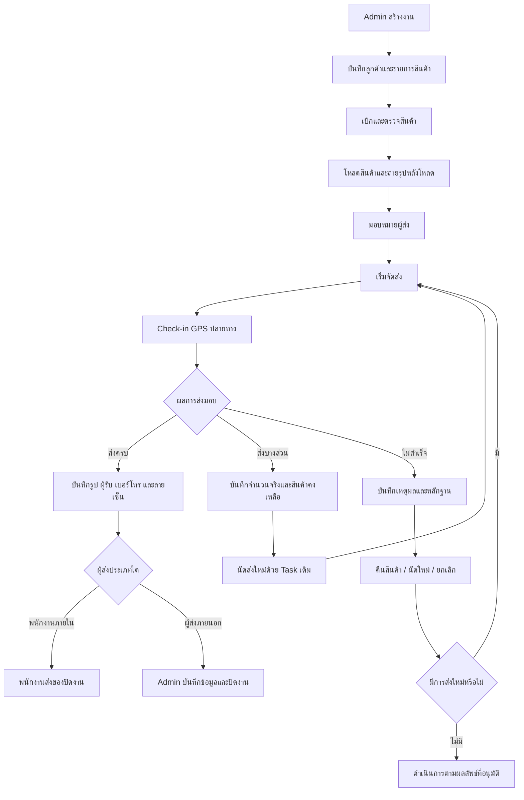

# Workflow การทำงานของระบบ Dispatch

> [!summary]
> สรุป Workflow หลักตั้งแต่ Admin สร้างงาน เบิกและตรวจสินค้า โหลดสินค้าขึ้นรถพร้อมถ่ายรูปหลักฐาน มอบหมายผู้ส่ง เริ่มจัดส่ง Check-in GPS ที่ปลายทาง ส่งมอบสินค้าพร้อมหลักฐานและลายเซ็นลูกค้า จนถึงการปิดงาน โดยงานภายในพนักงานส่งสินค้าปิดงานของตนเองได้เมื่อครบเงื่อนไขบังคับ ส่วนงานที่ใช้ผู้ส่งภายนอก Admin เป็นผู้บันทึกข้อมูลและปิดงานแทน

เอกสารฉบับนี้ต่อยอดจาก [[01 - เป้าหมายของระบบ Dispatch]] โดยขยายรายละเอียดเป็น Workflow เชิงปฏิบัติการ เนื้อหาทั้งหมดต้องสอดคล้องกับเป้าหมาย หลักการ และขอบเขต Phase 1 ที่กำหนดไว้ในเอกสารฉบับดังกล่าว หากพบประเด็นที่ยังไม่ชัดเจนหรือยังไม่ได้รับการอนุมัติ จะถูกรวบรวมไว้ในหัวข้อ [ประเด็นที่ต้องยืนยันเพิ่มเติม](#20-ประเด็นที่ต้องยืนยันเพิ่มเติม) แทนการตัดสินใจแทนเจ้าของธุรกิจ

> [!note] ปรับปรุงเอกสาร (v0.2)
> เอกสารฉบับนี้ปรับปรุงตามการตัดสินใจทางธุรกิจที่ได้รับการอนุมัติล่าสุด ประเด็นสำคัญที่เปลี่ยนแปลงจากฉบับก่อนหน้า (v0.1) ได้แก่ อำนาจการปิดงานของพนักงานส่งสินค้าภายใน บทบาทของ Admin ในการบันทึกและปิดงานที่ใช้ผู้ส่งภายนอก ข้อบังคับเรื่อง Check-in GPS ที่ปลายทาง (ไม่มี Geofence หรือการตรวจสอบระยะห่าง) รูปถ่ายบังคับหลังโหลดสินค้าขึ้นรถและรูปหลักฐานการส่งมอบ ข้อมูลผู้รับสินค้าที่เป็นข้อบังคับ ลายเซ็นลูกค้าที่เป็นข้อบังคับ การห้ามปิดงานเมื่อส่งมอบเพียงบางส่วน และการนัดส่งใหม่ที่ต้องใช้ Task เดิมเสมอ

## 1. วัตถุประสงค์ของ Workflow

Workflow ของระบบ Dispatch มีวัตถุประสงค์เพื่อ

* สร้างมาตรฐานเดียวกันในการดำเนินงานจัดส่งทั้งหมด
* ป้องกันไม่ให้ขั้นตอนสำคัญถูกข้ามไป
* ทำให้ผู้รับผิดชอบในแต่ละขั้นตอนชัดเจน
* ให้แน่ใจว่าหลักฐานถูกเก็บในช่วงเวลาที่ถูกต้อง
* ให้ Admin สามารถติดตามสถานะปัจจุบันของงานได้ตลอดเวลา
* รองรับการสืบสวนหรือย้อนตรวจสอบในภายหลัง
* ลดการพึ่งพา Excel, LINE, โทรศัพท์ และรูปภาพที่กระจัดกระจายตามที่ระบุใน [[01 - เป้าหมายของระบบ Dispatch]]
* สร้างกระบวนการที่สอดคล้องกันสำหรับทั้งพนักงานส่งสินค้าภายในและผู้ให้บริการภายนอก

## 2. ขอบเขตของ Workflow

เอกสารฉบับนี้ครอบคลุมหัวข้อต่อไปนี้

* การสร้างงาน (Task Creation)
* การตรวจสอบข้อมูลลูกค้าและปลายทาง
* การบันทึกรายการสินค้าที่จัดส่ง
* การยืนยันการเบิกสินค้าจาก Stock
* การตรวจสอบสินค้า
* หลักฐานก่อนจัดส่ง รวมถึงรูปภาพหลังโหลดสินค้าขึ้นรถ
* การมอบหมายผู้ส่งสินค้าทั้งภายในและภายนอก
* การเริ่มจัดส่ง
* การ Check-in GPS ที่ปลายทาง
* การส่งมอบสินค้าให้ลูกค้า
* หลักฐานการจัดส่งและข้อมูลผู้รับสินค้า
* ผลการจัดส่ง
* เงื่อนไขและผู้มีอำนาจปิดงาน
* การจัดการกรณีข้อยกเว้นต่าง ๆ

เอกสารฉบับนี้**ไม่ได้กำหนด**สิ่งต่อไปนี้

* โครงสร้างตารางฐานข้อมูล
* API endpoints
* การออกแบบหน้าจอ (UI) โดยละเอียด
* Technology Stack
* โครงสร้างพื้นฐาน (Infrastructure)
* ตารางสิทธิ์การใช้งาน (Permission Matrix) ฉบับสมบูรณ์ — ดู [[03 - บทบาทและสิทธิ์ผู้ใช้งาน]]
* โมเดลสถานะงาน (Status Enum) ฉบับสมบูรณ์ — ดู [[04 - สถานะงาน Dispatch]]
* ตรรกะบัญชี Stock
* การเชื่อมต่อระบบบัญชี
* อัลกอริทึมการหาเส้นทางที่เหมาะสมที่สุด
* การติดตามตำแหน่ง GPS แบบ Real-time ต่อเนื่อง
* Workflow โดยละเอียดสำหรับงานส่งเอกสาร รับเอกสาร รับสินค้า หรืองานที่ไม่ใช่การจัดส่งสินค้าขาออกตามปกติ — ดูหัวข้อ [20. ประเด็นที่ต้องยืนยันเพิ่มเติม](#20-ประเด็นที่ต้องยืนยันเพิ่มเติม)

## 3. ผู้เกี่ยวข้องในกระบวนการ

หัวข้อนี้อธิบายความรับผิดชอบเชิงธุรกิจของผู้เกี่ยวข้องแต่ละฝ่าย โดยไม่กำหนดตารางสิทธิ์ฉบับสมบูรณ์ ซึ่งจะถูกจัดทำใน [[03 - บทบาทและสิทธิ์ผู้ใช้งาน]]

### 3.1 Admin / Dispatcher

Admin รับผิดชอบกิจกรรมต่าง ๆ เช่น

* สร้างและเตรียมงาน Dispatch
* ตรวจสอบข้อมูลลูกค้าและปลายทาง
* บันทึกรายละเอียดการนัดหมายจัดส่ง
* เพิ่มรายการสินค้าที่ต้องจัดส่ง
* ประสานงานการเบิกสินค้าจาก Stock
* มอบหมายผู้ส่งสินค้าภายในหรือภายนอก
* ติดตามความคืบหน้าของการจัดส่งในปัจจุบัน
* บันทึกข้อมูลและหลักฐานสำหรับงานที่ใช้ผู้ส่งสินค้าภายนอกแทนผู้ส่งภายนอก
* ปิดงานที่ใช้ผู้ส่งสินค้าภายนอก
* ยืนยันการรับคืนสินค้าที่ STEP-SOLUTIONS
* ตรวจสอบงานที่เสร็จสมบูรณ์แล้วเมื่อจำเป็น เช่น การสุ่มตรวจสอบหรือกรณีมีข้อร้องเรียน
* สืบสวนข้อมูลที่น่าสงสัยหรือไม่สมบูรณ์
* เปิดงานกลับมาแก้ไขเมื่อพบว่าต้องแก้ไขข้อมูล
* ยกเลิกงานเมื่อได้รับสิทธิ์
* ตรวจสอบ Timeline และ Audit Log

> [!important]
> Admin **ไม่ใช่**ผู้ตรวจสอบหรือผู้ปิดงานที่บังคับสำหรับงานจัดส่งภายในทุกงาน พนักงานส่งสินค้าภายในที่ได้รับมอบหมายมีสิทธิ์ปิดงานของตนเองได้โดยตรงเมื่อเงื่อนไขบังคับครบถ้วน (ดูหัวข้อ [3.3](#33-พนักงานส่งสินค้าภายใน) และ [5.16](#516-ปิดงาน-งานพนักงานส่งสินค้าภายใน)) บทบาทของ Admin ในฐานะผู้ตรวจสอบจะเกิดขึ้นภายหลัง (post-hoc) เมื่อจำเป็นเท่านั้น ยกเว้นงานที่ใช้ผู้ส่งสินค้าภายนอก ซึ่ง Admin เป็นผู้บันทึกข้อมูลและปิดงานเสมอ

### 3.2 Stock

พนักงาน Stock รับผิดชอบ

* จัดเตรียมสินค้า
* ยืนยันจำนวนสินค้า
* ยืนยันความถูกต้องของสินค้า
* บันทึก Serial Number เมื่อเกี่ยวข้อง
* ตรวจสอบอุปกรณ์เสริมและชิ้นส่วนประกอบ
* บันทึกสภาพสินค้า
* สนับสนุนการถ่ายรูปก่อนจัดส่งและรูปภาพหลังโหลดสินค้าขึ้นรถ
* ยืนยันว่าสินค้าที่เบิกออกตรงกับงาน Dispatch ที่ถูกต้อง
* ช่วยดำเนินการเชิงปฏิบัติการเมื่อมีการรับคืนสินค้า โดย Admin เป็นผู้ยืนยันการรับคืนในระบบ

### 3.3 พนักงานส่งสินค้าภายใน

พนักงานส่งสินค้าภายในรับผิดชอบ

* ตรวจสอบงานที่ได้รับมอบหมาย
* ยืนยันการรับงาน
* เริ่มการจัดส่ง
* เดินทางไปยังปลายทาง
* ทำการ Check-in GPS ที่ปลายทาง
* ติดต่อลูกค้า
* ส่งมอบสินค้าให้ครบทุกรายการที่กำหนด
* บันทึกจำนวนที่ส่งมอบจริง
* บันทึกชื่อผู้รับสินค้า
* บันทึกหมายเลขโทรศัพท์ผู้รับสินค้า
* เก็บลายเซ็นลูกค้า
* อัปโหลดรูปหลักฐานการส่งมอบอย่างน้อย 1 รูป
* รายงานกรณีส่งมอบบางส่วนหรือไม่สำเร็จ พร้อมรักษางานให้เปิดอยู่จนกว่าจะส่งมอบครบ
* ปิดงานด้วยตนเองเมื่อเงื่อนไขบังคับทุกข้อครบถ้วน

พนักงานส่งสินค้าภายใน**ไม่สามารถ**ปิดงานได้เมื่อ

* ยังไม่ได้ทำ Check-in GPS ที่ปลายทาง
* รูปภาพบังคับ (หลังโหลดสินค้าขึ้นรถ หรือรูปหลักฐานการส่งมอบ) ยังขาดอยู่
* ข้อมูลผู้รับสินค้า (ชื่อหรือเบอร์โทรศัพท์) ยังขาดอยู่
* ยังไม่มีลายเซ็นลูกค้า
* ยังมีรายการสินค้าที่ต้องจัดส่งค้างอยู่ (ยังไม่ครบทุกรายการ)
* ข้อมูลบังคับอื่นใดยังไม่ครบถ้วน

### 3.4 ผู้ส่งสินค้าภายนอก

ใน Phase 1 ผู้ส่งสินค้าภายนอก**ไม่ได้บันทึกข้อมูลเข้าสู่ระบบ Dispatch โดยตรง** โดยมีลักษณะการทำงานดังนี้

* รับมอบหมายงานและดำเนินการจัดส่งตามที่ได้รับแจ้งจาก Admin
* ส่งข้อมูลและหลักฐานการจัดส่งกลับให้ Admin ผ่านช่องทางการปฏิบัติงานที่ตกลงกันไว้ (เช่น โทรศัพท์ LINE หรือช่องทางอื่น)
* ให้ข้อมูลที่จำเป็น เช่น เวลาที่ถึงปลายทาง ตำแหน่งโดยประมาณ รูปหลักฐาน ชื่อผู้รับ เบอร์โทรผู้รับ และลายเซ็นลูกค้า
* รายงานปัญหาหรือความล้มเหลวในการจัดส่งให้ Admin ทราบ

> [!important]
> Admin เป็นผู้บันทึกข้อมูลและหลักฐานที่ได้รับจากผู้ส่งสินค้าภายนอกเข้าสู่ระบบ Dispatch แทน และเป็นผู้ปิดงานสำหรับงานประเภทนี้เสมอ (ดูหัวข้อ [11. Workflow สำหรับผู้ส่งสินค้าภายนอก](#11-workflow-สำหรับผู้ส่งสินค้าภายนอก)) Audit Log ต้องบันทึกให้ชัดเจนว่า Admin เป็นผู้กรอกข้อมูลแทนผู้ส่งภายนอก

> [!note]
> เอกสารฉบับนี้ยังไม่กำหนดช่องทางการสื่อสารหรือกลไกทางเทคนิคที่แน่นอนสำหรับการรับข้อมูลจากผู้ส่งสินค้าภายนอก ประเด็นนี้ยังคงอยู่ใน [ประเด็นที่ต้องยืนยันเพิ่มเติม](#20-ประเด็นที่ต้องยืนยันเพิ่มเติม)

ข้อมูลของผู้ส่งสินค้าภายนอกที่ควรบันทึก ได้แก่ ชื่อผู้ให้บริการ ชื่อคนขับ หมายเลขโทรศัพท์ ทะเบียนรถ หมายเลขติดตามพัสดุ ค่าจัดส่ง และหมายเหตุ

### 3.5 ผู้ตรวจสอบภายหลัง (Admin ในบทบาทผู้ตรวจสอบ)

บทบาทผู้ตรวจสอบในเอกสารฉบับนี้**ไม่ใช่ด่านบังคับก่อนปิดงานสำหรับงานภายใน** แต่มีบทบาทดังนี้

* **สำหรับงานภายใน**: Admin หรือ Supervisor อาจตรวจสอบงานที่ปิดแล้วภายหลัง (post-hoc review) เพื่อสุ่มตรวจสอบคุณภาพ ตรวจสอบข้อร้องเรียนจากลูกค้า หรือสืบสวนกรณีที่น่าสงสัย และสามารถเปิดงานกลับมาแก้ไขได้เมื่อพบปัญหา
* **สำหรับงานภายนอก**: Admin เป็นผู้ตรวจสอบและปิดงานโดยตรง เนื่องจาก Admin เป็นผู้บันทึกข้อมูลเข้าสู่ระบบด้วยตนเอง

หน้าที่ทั่วไปของผู้ตรวจสอบเมื่อดำเนินการตรวจสอบ ได้แก่

* ยืนยันว่าหลักฐานบังคับครบถ้วน
* ตรวจสอบว่าผลการจัดส่งตรงกับหลักฐาน
* ตรวจสอบจำนวนสินค้าและข้อยกเว้น
* ตรวจสอบข้อมูลผู้รับสินค้าและลายเซ็นลูกค้า
* ทบทวนเหตุผลกรณีส่งไม่สำเร็จหรือส่งบางส่วน
* เปิดงานกลับมาแก้ไขเมื่อจำเป็น

> [!note]
> ชื่อบทบาทที่แน่นอนและกฎสิทธิ์การใช้งานโดยละเอียดจะถูกจัดทำใน [[03 - บทบาทและสิทธิ์ผู้ใช้งาน]]

### 3.6 ลูกค้าหรือผู้รับสินค้า

ลูกค้าหรือผู้รับสินค้าไม่ใช่ผู้ใช้งานระบบโดยตรงใน Phase 1 แต่มีบทบาทในกระบวนการในฐานะ

* ผู้ยืนยันการรับสินค้า
* ผู้ลงชื่อในเอกสารส่งมอบ (ลายเซ็นลูกค้าเป็นข้อบังคับก่อนปิดงานเป็นผลสำเร็จ)
* ผู้ให้ข้อมูลกรณีปฏิเสธหรือรับสินค้าเพียงบางส่วน
* แหล่งข้อมูลอ้างอิงเมื่อเกิดข้อพิพาท

## 4. หลักการควบคุม Workflow

* งานต้องไม่ถือว่าจัดส่งสำเร็จเพียงเพราะพนักงานส่งสินค้าแจ้งว่า "ส่งแล้ว" โดยไม่มีหลักฐานยืนยัน
* งานที่สำเร็จต้องมีหลักฐานที่ตรวจสอบได้ (verifiable evidence)
* ขั้นตอนสำคัญต้องเรียงลำดับตามที่กำหนด และไม่ควรข้ามขั้นตอนโดยไม่มีเหตุผลที่บันทึกไว้
* การเปลี่ยนแปลงสำคัญทุกครั้งต้องปรากฏใน Timeline หรือ Audit Log
* ระบบต้องตรวจสอบเงื่อนไขบังคับโดยอัตโนมัติก่อนอนุญาตให้ปิดงานเป็นผลสำเร็จ และต้องบล็อกการปิดงานเมื่อเงื่อนไขบังคับข้อใดข้อหนึ่งยังไม่ครบ
* งานภายในที่ครบเงื่อนไขบังคับทุกข้อสามารถถูกปิดโดยพนักงานส่งสินค้าที่ได้รับมอบหมายได้โดยตรง โดยไม่ต้องรอ Admin ตรวจสอบก่อน ส่วนงานที่ใช้ผู้ส่งภายนอก Admin เป็นผู้บันทึกข้อมูลและปิดงานแทนเสมอ

## 5. Workflow หลักตั้งแต่สร้างงานจนถึงปิดงาน

ภาพรวมของ Workflow หลักสำหรับงานจัดส่งภายใน (ที่ได้รับการอนุมัติ)

```text
Admin สร้างงาน
→ ตรวจสอบข้อมูลลูกค้าและปลายทาง
→ บันทึกรายการสินค้า
→ เบิกสินค้าจาก Stock
→ ตรวจสอบสินค้าและเอกสาร
→ โหลดสินค้าขึ้นรถ
→ ถ่ายรูปหลังโหลดขึ้นรถอย่างน้อย 1 รูป
→ มอบหมายเจ้าหน้าที่ส่งของ
→ ตรวจสอบความพร้อม
→ เจ้าหน้าที่ส่งของเริ่มจัดส่ง
→ เดินทางไปปลายทาง
→ Check-in GPS ที่ปลายทาง
→ ส่งมอบสินค้า
→ บันทึกจำนวนส่งจริง
→ แนบรูปหลักฐานอย่างน้อย 1 รูป
→ บันทึกชื่อผู้รับ
→ บันทึกเบอร์โทรศัพท์ผู้รับ
→ เก็บลายเซ็นลูกค้า
→ ระบบตรวจว่าส่งสินค้าครบและข้อมูลบังคับครบ
→ เจ้าหน้าที่ส่งของปิดงาน
```

สำหรับงานที่ใช้ผู้ส่งสินค้าภายนอก ลำดับขั้นตอนจะคล้ายกันแต่ Admin เป็นผู้บันทึกข้อมูลและปิดงานแทน ดูรายละเอียดในหัวข้อ [11. Workflow สำหรับผู้ส่งสินค้าภายนอก](#11-workflow-สำหรับผู้ส่งสินค้าภายนอก)

### 5.1 สร้างงาน Dispatch

Admin เป็นผู้สร้างงานจัดส่งใหม่ โดยข้อมูลเริ่มต้นของงานควรประกอบด้วยข้อมูลที่จำเป็นต่อการระบุและวางแผนการจัดส่ง เช่น

* เลขที่งาน Dispatch
* วันที่วางแผนจัดส่ง
* ชื่อลูกค้าหรือบริษัท
* สถานที่จัดส่ง
* ผู้ติดต่อของลูกค้า
* หมายเลขโทรศัพท์
* ช่วงเวลานัดหมาย
* ประเภทการจัดส่ง
* เลขที่เอกสารอ้างอิง
* คำแนะนำการจัดส่งทั่วไป
* รายการสินค้าเบื้องต้น (ถ้ามี)

งานควรเริ่มต้นในสถานะ Draft หรือสถานะเบื้องต้นที่เทียบเท่า และ Admin ควรสามารถบันทึกงานที่ยังไม่สมบูรณ์ไว้ก่อนได้ เอกสารฉบับนี้จะไม่กำหนดชื่อสถานะที่แน่นอน ซึ่งจะถูกกำหนดใน [[04 - สถานะงาน Dispatch]]

### 5.2 ตรวจสอบข้อมูลลูกค้าและปลายทาง

ก่อนปล่อยงานเข้าสู่ขั้นตอนเตรียมสินค้า Admin ควรตรวจสอบ

* ชื่อลูกค้า
* ที่อยู่จัดส่ง
* สาขาหรือสถานที่ปลายทาง
* ผู้ติดต่อ
* หมายเลขโทรศัพท์
* วันที่นัดหมาย
* ช่วงเวลานัดหมาย
* คำแนะนำการเข้าถึงสถานที่พิเศษ
* ข้อมูลอาคาร ชั้น ประตู จุดขนถ่าย หรือที่จอดรถ
* ข้อกำหนดด้านเอกสารของลูกค้า
* ต้องส่งมอบให้บุคคลหรือแผนกที่ระบุชื่อหรือไม่

ข้อมูลปลายทางที่ไม่ถูกต้องหรือไม่ครบถ้วนต้องได้รับการแก้ไขก่อนเริ่มการจัดส่ง

### 5.3 บันทึกรายการสินค้าที่ต้องจัดส่ง

งานจัดส่งควรมีข้อมูลระดับรายการสินค้า เช่น

* รหัสสินค้า
* ชื่อสินค้า
* คำอธิบาย
* จำนวนที่วางแผนจัดส่ง
* หน่วยนับ
* Serial Number (ถ้ามี)
* ข้อมูลอุปกรณ์เสริมหรือชิ้นส่วนประกอบ
* เอกสารอ้างอิง
* หมายเหตุเฉพาะรายการ

Workflow ควรรองรับการตรวจสอบสินค้าแต่ละรายการแยกจากกันได้ เอกสารฉบับนี้ไม่ได้ออกแบบโครงสร้างฐานข้อมูล

### 5.4 เบิกสินค้าจาก Stock

Admin ประสานงานการเบิกสินค้าออกจาก Stock โดย Workflow ต้องบันทึกว่าสินค้าถูกเตรียมไว้สำหรับงาน Dispatch งานใดโดยเฉพาะ

ขั้นตอนการเบิกสินค้าควรยืนยัน

* งานที่ถูกต้อง
* สินค้าที่ถูกต้อง
* จำนวนที่ถูกต้อง
* Serial Number ที่ถูกต้อง (ถ้ามี)
* เอกสารที่เกี่ยวข้องถูกต้อง
* ผู้เบิกสินค้าออก
* ผู้รับสินค้าเพื่อเตรียมหรือจัดส่ง
* วันและเวลา

> [!note]
> Phase 1 อาจบันทึกเพียงการยืนยันการเบิกสินค้า โดยไม่ตัด Stock อัตโนมัติ การเชื่อมต่อระบบ Stock แบบอัตโนมัติยังอยู่นอกขอบเขตของระยะแรก ตามที่ระบุใน [[01 - เป้าหมายของระบบ Dispatch]]

### 5.5 ตรวจสอบสินค้าและเอกสาร

ก่อนจัดส่ง Admin หรือพนักงาน Stock ควรตรวจสอบ

* ความถูกต้องของสินค้า
* จำนวน
* Serial Number
* สภาพทางกายภาพ
* สภาพบรรจุภัณฑ์
* อุปกรณ์เสริมที่มากับสินค้า
* สายเคเบิลหรือชิ้นส่วนประกอบ
* เอกสารการจัดส่ง
* ข้อกำหนดเฉพาะของลูกค้า

ข้อผิดพลาดใด ๆ ที่พบต้องได้รับการแก้ไขก่อนที่งานจะถูกทำเครื่องหมายว่าพร้อมจัดส่ง Workflow ต้องไม่อนุญาตให้งานดำเนินต่อไปตามปกติเมื่อมีข้อผิดพลาดที่ทราบแล้วแต่ยังไม่ได้รับการแก้ไข

### 5.6 โหลดสินค้าขึ้นรถและถ่ายรูปหลังโหลด

หลังจากตรวจสอบสินค้าแล้ว สินค้าจะถูกโหลดขึ้นยานพาหนะเพื่อเตรียมจัดส่ง

> [!important]
> ต้องมีรูปภาพหลังจากโหลดสินค้าขึ้นยานพาหนะแล้ว**อย่างน้อย 1 รูป** ถือเป็นหลักฐานบังคับ งานต้องไม่ดำเนินต่อไปสู่ขั้นตอนจัดส่งตามปกติ หากยังไม่มีรูปภาพนี้

ข้อมูลที่ต้องบันทึกพร้อมรูปภาพหลังโหลดสินค้า

* รูปภาพต้องเชื่อมโยงกับงาน Dispatch ที่เกี่ยวข้อง
* ผู้ที่อัปโหลดรูปภาพ
* วันและเวลาที่อัปโหลด

หลักฐานเสริมอื่น ๆ ยังคงเป็นเงื่อนไข (Conditional) ตามประเภทสินค้าหรือกฎธุรกิจที่จะกำหนดในอนาคต ได้แก่

* รูปภาพรวมของสินค้าทั้งหมด
* รูปภาพแสดงจำนวนสินค้า
* รูปภาพสภาพสินค้า
* รูปภาพบรรจุภัณฑ์
* รูปภาพ Serial Number
* รูปภาพอุปกรณ์เสริม
* รูปภาพเอกสาร

> [!note]
> ตารางหลักฐานแบบละเอียดตามประเภทงานจะถูกจัดทำใน [[05 - ข้อมูลและหลักฐานของงาน Dispatch]] เอกสารฉบับนี้กำหนดเพียงระดับ Business-level ว่ารูปภาพหลังโหลดสินค้าเป็นข้อบังคับ ส่วนรูปภาพอื่นยังเป็นเงื่อนไข

### 5.7 มอบหมายเจ้าหน้าที่ส่งของ

Admin มอบหมายผู้ส่งสินค้าเป็นหนึ่งในสองประเภท

* พนักงานภายในของ STEP-SOLUTIONS หรือ
* ผู้ให้บริการจัดส่งภายนอก

สำหรับการมอบหมายภายใน ให้บันทึกพนักงานที่ได้รับมอบหมาย

สำหรับการมอบหมายภายนอก ข้อมูลที่อาจบันทึกได้แก่ ชื่อผู้ให้บริการ ชื่อคนขับ หมายเลขโทรศัพท์ ทะเบียนรถ หมายเลขติดตามพัสดุ ค่าจัดส่ง และหมายเหตุ

การมอบหมายงานต้องปรากฏในประวัติงาน และการเปลี่ยนตัวผู้ส่งสินค้า (reassignment) ต้องถูกบันทึกใน Timeline หรือ Audit Log ด้วยเช่นกัน

> [!note]
> ประเภทของผู้ส่งสินค้าที่เลือกในขั้นตอนนี้จะกำหนดเส้นทางการปิดงานในภายหลัง งานที่มอบหมายให้พนักงานภายในจะถูกปิดโดยพนักงานคนนั้นเองเมื่อครบเงื่อนไข ส่วนงานที่มอบหมายให้ผู้ส่งภายนอกจะถูกบันทึกข้อมูลและปิดโดย Admin เสมอ

### 5.8 ตรวจสอบความพร้อมก่อนออกเดินทาง

ก่อนที่งานจะเริ่มจัดส่งได้ Workflow ควรตรวจสอบว่าการเตรียมการที่จำเป็นเสร็จสมบูรณ์แล้ว ซึ่งอาจรวมถึง

* ข้อมูลลูกค้าและปลายทางครบถ้วน
* บันทึกรายการสินค้าแล้ว
* ยืนยันการเบิกสินค้าจาก Stock แล้ว
* ตรวจสอบสินค้าเสร็จสิ้นแล้ว
* มีรูปภาพหลังโหลดสินค้าขึ้นรถแล้ว (บังคับ)
* มอบหมายผู้ส่งสินค้าแล้ว
* เตรียมเอกสารที่จำเป็นแล้ว
* รับทราบคำแนะนำการจัดส่งที่สำคัญแล้ว
* ไม่มีข้อผิดพลาดที่ยังไม่ได้แก้ไข

เอกสารฉบับนี้แบ่งแยกระหว่าง

* เงื่อนไขความพร้อมที่บังคับ (Mandatory)
* ข้อมูลสนับสนุนที่เป็นทางเลือก (Optional)
* การตรวจสอบอัตโนมัติในอนาคต (Future automated validation)

> [!warning]
> ห้ามกำหนดฟิลด์บังคับใหม่โดยไม่ได้รับการอนุมัติ หากยังไม่ชัดเจนให้ระบุไว้ใน [ประเด็นที่ต้องยืนยันเพิ่มเติม](#20-ประเด็นที่ต้องยืนยันเพิ่มเติม)

### 5.9 เริ่มจัดส่ง

พนักงานส่งสินค้าที่ได้รับมอบหมายกดเริ่มการจัดส่งผ่านระบบ โดยระบบควรบันทึก

* ผู้เริ่มการจัดส่ง
* วันที่เริ่มจริง
* เวลาที่เริ่มจริง
* การเปลี่ยนสถานะงาน
* หมายเหตุที่เกี่ยวข้อง (ถ้ามี)

> [!note]
> ระบบ**ไม่บันทึกพิกัด GPS**ในขั้นตอนนี้ เก็บเฉพาะวันและเวลาที่เริ่มจัดส่งจริงเท่านั้น การบันทึกตำแหน่ง GPS ขณะเริ่มจัดส่งไม่ใช่ข้อกำหนดที่ได้รับอนุมัติ

### 5.10 เดินทางไปยังปลายทาง

ระหว่างการขนส่ง

* งานควรแสดงสถานะ "กำลังดำเนินการ" อย่างชัดเจน
* Admin ควรเห็นได้ว่าการจัดส่งเริ่มต้นแล้ว
* พนักงานส่งสินค้าควรเข้าถึงข้อมูลปลายทาง ข้อมูลติดต่อ รายละเอียดการนัดหมาย และคำแนะนำได้
* พนักงานส่งสินค้าควรสามารถรายงานปัญหาได้ก่อนถึงปลายทาง
* Workflow ไม่กำหนดให้ต้องมีการติดตามตำแหน่งแบบ Real-time ต่อเนื่องใน Phase 1

ปัญหาที่อาจเกิดขึ้นระหว่างการขนส่ง เช่น ยานพาหนะขัดข้อง, การจราจรล่าช้า, ข้อมูลปลายทางไม่ถูกต้อง, ลูกค้าขอเลื่อนเวลา, สินค้าเสียหายระหว่างขนส่ง, หรืออุบัติเหตุ/เหตุด้านความปลอดภัย

พนักงานส่งสินค้าควรสามารถบันทึกหมายเหตุหรือปัญหาที่เกี่ยวข้องได้ รายละเอียดของระบบจัดการเหตุการณ์ (Incident Management) อยู่นอกขอบเขตของเอกสารฉบับนี้

### 5.11 Check-in GPS ที่ปลายทาง (บังคับ)

เมื่อพนักงานส่งสินค้าถึงปลายทาง จะทำการ Check-in โดย Workflow ควรบันทึก

* วันที่ Check-in
* เวลา Check-in
* ละติจูด
* ลองจิจูด
* ความแม่นยำของ GPS (เมื่อมีข้อมูล)
* พนักงานส่งสินค้าที่ทำการ Check-in

> [!important]
> Check-in GPS ที่ปลายทางเป็น**ข้อบังคับสำหรับการจัดส่งทุกประเภทที่ครอบคลุมโดย Workflow สินค้าขาออกนี้** ระบบบันทึกพิกัดจากอุปกรณ์ของพนักงานส่งสินค้าเฉพาะขณะทำการ Check-in เท่านั้น

วัตถุประสงค์ของการ Check-in ได้แก่

* ยืนยันการเดินทางถึงจริง
* บันทึกเวลาที่มาถึง
* ให้หลักฐานตำแหน่งที่ตั้ง
* สนับสนุนการวิเคราะห์ SLA ของการจัดส่ง
* สนับสนุนการสืบสวนในภายหลัง

> [!note]
> ระบบเก็บพิกัดที่ได้จากการ Check-in ไว้เป็นหลักฐานเท่านั้น **ไม่มีการใช้ Geofence และไม่มีการตรวจสอบระยะห่างจากพิกัดลูกค้าที่คาดไว้** พิกัดจะไม่ถูกใช้บล็อกหรือเตือนผู้ใช้งานในลักษณะ Geofence มาตรการป้องกันการปลอมแปลงพิกัด (anti-spoofing) ยังไม่ถูกกำหนดในเอกสารฉบับนี้

### 5.12 ส่งมอบสินค้าให้ลูกค้า

หลังจาก Check-in แล้ว พนักงานส่งสินค้าจะส่งมอบสินค้า โดยควรตรวจสอบ

* ผู้รับหรือแผนกที่ถูกต้อง
* สินค้าที่ถูกต้อง
* จำนวนที่ส่งมอบจริง
* สภาพสินค้าขณะส่งมอบ
* ลูกค้ารับสินค้าครบทุกรายการหรือไม่
* มีเอกสารใดต้องนำกลับมาที่ STEP-SOLUTIONS หรือไม่
* มีรายการใดถูกปฏิเสธหรือไม่

> [!important]
> การส่งมอบครบทุกรายการเป็นเงื่อนไขบังคับสำหรับการปิดงานเป็นผลสำเร็จ หากส่งมอบได้เพียงบางส่วน งานต้องยังคงเปิดอยู่ ดูหัวข้อ [7. Workflow กรณีส่งมอบบางส่วน](#7-workflow-กรณีส่งมอบบางส่วน)

การส่งมอบควรถูกบันทึกในระดับรายการสินค้าหรือระดับสรุปงาน ตามความเหมาะสม

### 5.13 บันทึกหลักฐานการส่งมอบ

พนักงานส่งสินค้าต้องบันทึกหลักฐานดังต่อไปนี้ก่อนที่จะสามารถปิดงานเป็นผลสำเร็จได้

* **รูปหลักฐานการส่งมอบอย่างน้อย 1 รูป** (บังคับ) เช่น รูปสินค้า ณ ปลายทาง รูประหว่างหรือหลังส่งมอบ หรือรูปเอกสารที่ลงชื่อแล้ว — ไม่จำเป็นต้องมีครบทุกตัวอย่าง เพียงมีอย่างน้อย 1 รูปก็ถือว่าครบเงื่อนไข
* **ชื่อผู้รับสินค้า** (บังคับ)
* **หมายเลขโทรศัพท์ผู้รับสินค้า** (บังคับ)
* **ลายเซ็นลูกค้า** (บังคับ)
* วันและเวลาส่งมอบ
* จำนวนที่ส่งมอบจริง
* แผนกหรือตำแหน่งของผู้รับสินค้า (ถ้ามี)
* หมายเหตุ
* รายการที่ถูกปฏิเสธหรือส่งคืน (ถ้ามี)

> [!note]
> เอกสารฉบับนี้กำหนดเพียงระดับธุรกิจว่าต้องมีการเก็บลายเซ็นลูกค้า โดยยังไม่กำหนดวิธีการทางเทคนิค เช่น วาดบนหน้าจอ ถ่ายภาพเอกสาร หรือวิธีอื่น ซึ่งจะถูกออกแบบในภายหลัง OTP ยังคงเป็นความสามารถที่พิจารณาในอนาคตแยกต่างหากจากลายเซ็น

หลักฐานการส่งมอบข้างต้น (อย่างน้อย 1 รูป) เป็นหลักฐานคนละช่วงกับรูปภาพหลังโหลดสินค้าขึ้นรถในหัวข้อ [5.6](#56-โหลดสินค้าขึ้นรถและถ่ายรูปหลังโหลด) ดังนั้นงานจัดส่งสินค้าตามปกติจึงต้องมีหลักฐานภาพถ่ายอย่างน้อย 2 ช่วง คือ (1) หลังโหลดสินค้าขึ้นรถ และ (2) ขณะส่งมอบที่ปลายทาง

> [!important]
> Workflow ต้องกำหนดว่าการส่งมอบสำเร็จไม่สามารถดำเนินต่อไปสู่การปิดงานได้ หากยังไม่มีหลักฐานบังคับขั้นต่ำข้างต้นครบถ้วน

### 5.14 บันทึกผลการจัดส่ง

ผลการจัดส่งควรรองรับอย่างน้อย

* ส่งมอบสำเร็จ
* ส่งมอบบางส่วน
* ส่งไม่สำเร็จ

ผลลัพธ์ที่บันทึกต้องสะท้อนผลจริงที่เกิดขึ้น พนักงานส่งสินค้าต้องไม่เลือก "ส่งมอบสำเร็จ" เมื่อ

* ยังไม่ได้ส่งมอบสินค้าจริง
* หลักฐานที่จำเป็นยังขาดอยู่
* ผู้รับปฏิเสธไม่รับสินค้า
* รับสินค้าเพียงบางส่วน
* สินค้าถูกวางไว้ในสถานที่ที่ไม่ได้รับอนุญาต
* จำนวนที่ส่งมอบจริงไม่ตรงกับผลลัพธ์ที่บันทึกว่าสำเร็จ

> [!note]
> "ส่งมอบบางส่วน" เป็นสถานะระหว่างดำเนินการ (intermediate state) เท่านั้น ไม่ใช่ผลลัพธ์สุดท้ายที่สามารถปิดงานได้ ดูหัวข้อ [7. Workflow กรณีส่งมอบบางส่วน](#7-workflow-กรณีส่งมอบบางส่วน)

### 5.15 ระบบตรวจสอบเงื่อนไขบังคับก่อนปิดงาน

ก่อนอนุญาตให้ปิดงาน ระบบต้องตรวจสอบโดยอัตโนมัติว่าเงื่อนไขบังคับต่อไปนี้ครบถ้วนแล้ว

* งานถูกมอบหมายและเริ่มจัดส่งแล้ว
* มีรูปภาพหลังโหลดสินค้าขึ้นรถ
* มีการ Check-in GPS ที่ปลายทางแล้ว
* มีรูปหลักฐานการส่งมอบอย่างน้อย 1 รูป
* มีชื่อผู้รับสินค้า
* มีหมายเลขโทรศัพท์ผู้รับสินค้า
* มีลายเซ็นลูกค้า
* บันทึกจำนวนที่ส่งมอบจริงแล้ว
* ส่งมอบสินค้าครบทุกรายการ ไม่มีรายการค้าง
* บันทึกผลการจัดส่งแล้ว

หากเงื่อนไขข้อใดข้อหนึ่งไม่ครบ ระบบต้องบล็อกการปิดงาน และงานยังคงอยู่ในสถานะเปิด รายละเอียดตารางเงื่อนไขทั้งหมดอยู่ในหัวข้อ [เงื่อนไขบังคับก่อนปิดงาน](#เงื่อนไขบังคับก่อนปิดงาน)

### 5.16 ปิดงาน (งานพนักงานส่งสินค้าภายใน)

เมื่อระบบยืนยันว่าเงื่อนไขบังคับครบถ้วนแล้ว พนักงานส่งสินค้าภายในที่ได้รับมอบหมายสามารถปิดงานของตนเองได้โดยตรง โดยไม่ต้องรอ Admin ตรวจสอบก่อน

เมื่อปิดงาน ระบบควรบันทึก

* ผู้ปิดงาน (พนักงานส่งสินค้าที่ได้รับมอบหมาย)
* วันและเวลาปิดงาน
* ผลลัพธ์สุดท้าย
* หมายเหตุสุดท้าย
* เหตุการณ์ Timeline ที่เกี่ยวข้อง

Admin ยังคงสามารถตรวจสอบ เปิดงานกลับมาแก้ไข หรือสืบสวนงานที่ปิดแล้วได้ภายหลังตามหัวข้อ [3.5](#35-ผู้ตรวจสอบภายหลัง-admin-ในบทบาทผู้ตรวจสอบ) และ [12. Workflow การเปิดงานกลับมาแก้ไข](#12-workflow-การเปิดงานกลับมาแก้ไข)

### 5.17 บันทึกข้อมูลและปิดงาน (งานผู้ส่งสินค้าภายนอก)

สำหรับงานที่มอบหมายให้ผู้ส่งสินค้าภายนอก Admin เป็นผู้บันทึกข้อมูลและหลักฐานที่ได้รับจากผู้ส่งภายนอกเข้าสู่ระบบ ตรวจสอบว่าเงื่อนไขบังคับเดียวกันกับงานภายในครบถ้วน แล้วจึงเป็นผู้ปิดงานด้วยตนเอง

เมื่อปิดงาน ระบบควรบันทึก

* ผู้ปิดงาน (Admin)
* ระบุว่าข้อมูลถูกบันทึกในนามของผู้ส่งสินค้าภายนอกรายใด
* วันและเวลาปิดงาน
* ผลลัพธ์สุดท้าย
* เหตุการณ์ Timeline ที่เกี่ยวข้อง

ดูรายละเอียดเพิ่มเติมในหัวข้อ [11. Workflow สำหรับผู้ส่งสินค้าภายนอก](#11-workflow-สำหรับผู้ส่งสินค้าภายนอก)

> [!warning]
> งานที่ปิดแล้วต้องไม่ถูกแก้ไขโดยไม่มีการควบคุม การแก้ไขหลังปิดงานต้องผ่านกระบวนการเปิดงานกลับมาแก้ไข (Reopening) ที่มีเหตุผลกำกับและถูกบันทึกลง Audit Log ดูรายละเอียดในหัวข้อ [12. Workflow การเปิดงานกลับมาแก้ไข](#12-workflow-การเปิดงานกลับมาแก้ไข)

## 6. เงื่อนไขเข้าและออกของแต่ละขั้นตอน

| ขั้นตอน | ผู้รับผิดชอบหลัก | เงื่อนไขก่อนเริ่ม | การดำเนินการ | หลักฐานหรือข้อมูลที่ต้องมี | ผลลัพธ์ของขั้นตอน |
| --- | --- | --- | --- | --- | --- |
| สร้างงาน | Admin | มีคำขอจัดส่งจากลูกค้าหรือหน่วยงานภายใน | สร้างงาน Draft พร้อมข้อมูลเบื้องต้น | ชื่อลูกค้า ปลายทาง วันที่วางแผน | งานอยู่ในสถานะ Draft |
| ตรวจสอบข้อมูลลูกค้าและปลายทาง | Admin | มีงาน Draft แล้ว | ตรวจสอบและแก้ไขข้อมูลปลายทาง | ที่อยู่ ผู้ติดต่อ ช่วงเวลานัดหมาย | ข้อมูลปลายทางยืนยันแล้ว |
| บันทึกรายการสินค้า | Admin | ข้อมูลปลายทางยืนยันแล้ว | เพิ่มรายการสินค้าและจำนวน | รหัสสินค้า จำนวน หน่วยนับ | รายการสินค้าครบถ้วน |
| เบิกสินค้าจาก Stock | Stock / Admin | มีรายการสินค้าแล้ว | เบิกสินค้าตามรายการ | ผู้เบิก ผู้รับ วันเวลา | สินค้าพร้อมสำหรับตรวจสอบ |
| ตรวจสอบสินค้าและเอกสาร | Stock / Admin | เบิกสินค้าแล้ว | ตรวจนับและตรวจสภาพ | ผลตรวจสอบ หมายเหตุ | สินค้าผ่านการตรวจสอบ |
| โหลดสินค้าขึ้นรถและถ่ายรูปหลังโหลด | Stock / Admin | ตรวจสอบสินค้าแล้ว | โหลดสินค้าและถ่ายภาพ | รูปภาพหลังโหลดอย่างน้อย 1 รูป (บังคับ) | หลักฐานก่อนจัดส่งครบเงื่อนไขบังคับ |
| มอบหมายผู้ส่งสินค้า | Admin | มีรูปภาพหลังโหลดสินค้าแล้ว | เลือกผู้ส่งภายในหรือภายนอก | ข้อมูลผู้ส่งสินค้า | งานมีผู้รับผิดชอบจัดส่งและมีเส้นทางปิดงานที่ชัดเจน |
| ตรวจสอบความพร้อม | Admin | มอบหมายผู้ส่งแล้ว | ตรวจสอบรายการความพร้อม | รายการตรวจสอบความพร้อม | งานพร้อมเริ่มจัดส่ง |
| เริ่มจัดส่ง | ผู้ส่งสินค้า | งานพร้อมจัดส่งแล้ว | กดเริ่มจัดส่งในระบบ | เวลาที่เริ่มจริง (ไม่มี GPS) | งานอยู่ระหว่างจัดส่ง |
| Check-in GPS ปลายทาง | ผู้ส่งสินค้า | เดินทางถึงปลายทาง | Check-in ผ่านระบบ | พิกัด GPS วันเวลา (บังคับ ไม่มี Geofence) | ยืนยันการมาถึง |
| ส่งมอบสินค้า | ผู้ส่งสินค้า | Check-in สำเร็จแล้ว | ส่งมอบสินค้าให้ผู้รับให้ครบทุกรายการ | จำนวนที่ส่งมอบจริง | สินค้าถูกส่งมอบ (ครบหรือบางส่วน) |
| บันทึกหลักฐานการส่งมอบ | ผู้ส่งสินค้า | ส่งมอบสินค้าแล้ว | บันทึกรูป ผู้รับ เบอร์โทร ลายเซ็น | รูปอย่างน้อย 1 รูป ชื่อผู้รับ เบอร์โทร ลายเซ็น (บังคับทั้งหมด) | หลักฐานการส่งมอบครบเงื่อนไขบังคับ |
| ตรวจสอบเงื่อนไขบังคับก่อนปิดงาน | ระบบ (อัตโนมัติ) | บันทึกหลักฐานและผลการจัดส่งแล้ว | ตรวจสอบเงื่อนไขบังคับทั้งหมด | รายการเงื่อนไขบังคับ | อนุญาตให้ปิดงาน หรือบล็อกพร้อมระบุข้อมูลที่ขาด |
| ปิดงาน (งานภายใน) | พนักงานส่งสินค้าภายในที่ได้รับมอบหมาย | เงื่อนไขบังคับครบถ้วน | ปิดงานด้วยตนเอง | ผลการจัดส่งครบถ้วน | งานถูกปิด |
| บันทึกข้อมูลและปิดงาน (งานภายนอก) | Admin | ได้รับข้อมูลและหลักฐานจากผู้ส่งภายนอกครบถ้วน | บันทึกข้อมูลแทนผู้ส่งภายนอกและปิดงาน | ข้อมูลและหลักฐานเดียวกับงานภายใน | งานถูกปิด |

### เงื่อนไขบังคับก่อนปิดงาน

| เงื่อนไข | งานพนักงานภายใน | งานผู้ส่งภายนอก | หากข้อมูลไม่ครบ |
| --- | --- | --- | --- |
| มอบหมายงานแล้ว | บังคับ | บังคับ (มอบหมายผู้ให้บริการภายนอก) | ระบบบล็อกการเริ่มจัดส่ง |
| เริ่มจัดส่งแล้ว | บังคับ | บังคับ (บันทึกโดย Admin) | ระบบบล็อกขั้นตอนถัดไป |
| มีรูปภาพหลังโหลดสินค้าขึ้นรถ | บังคับ อย่างน้อย 1 รูป | บังคับ อย่างน้อย 1 รูป (Admin บันทึกแทน) | Task ยังคงเปิด ไม่สามารถปิดงานได้ |
| มี Check-in GPS ที่ปลายทาง | บังคับ | บังคับ (Admin บันทึกพิกัดหรือข้อมูลที่ได้รับ) | Task ยังคงเปิด ไม่สามารถปิดงานได้ |
| บันทึกจำนวนที่ส่งมอบจริง | บังคับ | บังคับ (Admin บันทึกแทน) | Task ยังคงเปิด ไม่สามารถปิดงานได้ |
| ส่งมอบครบทุกรายการ | บังคับ | บังคับ | ปิดงานไม่ได้ ต้องดำเนินการตาม Workflow ส่งมอบบางส่วน |
| มีรูปหลักฐานการส่งมอบอย่างน้อย 1 รูป | บังคับ | บังคับ (Admin บันทึกแทน) | Task ยังคงเปิด ไม่สามารถปิดงานได้ |
| มีชื่อผู้รับสินค้า | บังคับ | บังคับ (Admin บันทึกแทน) | Task ยังคงเปิด ไม่สามารถปิดงานได้ |
| มีหมายเลขโทรศัพท์ผู้รับสินค้า | บังคับ | บังคับ (Admin บันทึกแทน) | Task ยังคงเปิด ไม่สามารถปิดงานได้ |
| มีลายเซ็นลูกค้า | บังคับ | บังคับ (Admin บันทึกแทน) | Task ยังคงเปิด ไม่สามารถปิดงานได้ |
| บันทึกผลการจัดส่งแล้ว | บังคับ | บังคับ | Task ยังคงเปิด ไม่สามารถปิดงานได้ |
| ไม่มีข้อมูลบังคับอื่นขาดหาย | บังคับ | บังคับ | ระบบแสดงรายการที่ขาดและบล็อกการปิดงาน |
| ผู้ปิดงาน | พนักงานส่งสินค้าภายในที่ได้รับมอบหมาย | Admin | ไม่มีบุคคลอื่นสามารถปิดงานแทนได้นอกจากผู้ที่กำหนดไว้ |

## 7. Workflow กรณีส่งมอบบางส่วน

```text
ส่งมอบบางส่วน
→ บันทึกจำนวนส่งจริง
→ ระบุสินค้าคงเหลือ
→ ระบุเหตุผล
→ แนบหลักฐาน
→ Task ยังคงเปิด
→ ใช้ Task เดิมสำหรับ Delivery Attempt ถัดไป
→ เก็บประวัติ Attempt เดิม
→ ส่งสินค้าที่เหลือ
→ ปิดงานเมื่อส่งครบเท่านั้น
```

รายละเอียดของ Workflow มีลำดับดังนี้

1. Check-in GPS ที่ปลายทางเสร็จสมบูรณ์
2. พนักงานส่งสินค้าบันทึกจำนวนจริงที่ส่งมอบเป็นรายสินค้า
3. ระบุรายการที่ส่งมอบสำเร็จ
4. ระบุรายการที่ยังไม่ได้ส่งมอบหรือถูกปฏิเสธ (สินค้าคงเหลือ)
5. บันทึกเหตุผลของความไม่ตรงกันแต่ละรายการ
6. อัปโหลดรูปภาพหรือหลักฐานสนับสนุน
7. Task ยังคงเปิดอยู่ ไม่ปิดงาน
8. ใช้ Task Dispatch เดิมสำหรับความพยายามจัดส่งครั้งถัดไป (Delivery Attempt) ของสินค้าที่เหลือ
9. เก็บประวัติของ Attempt เดิมไว้ครบถ้วน ไม่ลบทิ้ง
10. Admin ประสานงานเพื่อส่งสินค้าส่วนที่เหลือ โดยอาจ

    * กำหนดวันจัดส่งใหม่สำหรับสินค้าที่เหลือ (ใช้ Task เดิม)
    * เปลี่ยนสินค้าที่เสียหายหรือขาดหาย
    * ยกระดับเพื่อสืบสวนเพิ่มเติม
    * ยกเลิกงาน หากไม่สามารถส่งสินค้าที่เหลือได้จริง (ผ่าน [13. Workflow การยกเลิกงาน](#13-workflow-การยกเลิกงาน))
11. งานจะถูกปิดได้ก็ต่อเมื่อส่งมอบสินค้าครบทุกรายการแล้วเท่านั้น

> [!important]
> ส่งมอบบางส่วนเป็นสถานะระหว่างดำเนินการ (intermediate state) เท่านั้น **ไม่ใช่ผลลัพธ์สุดท้ายที่อนุมัติให้ปิดงานได้** ห้ามปิดงานที่มีรายการสินค้าค้างส่งเป็นผลสำเร็จหรือเป็นผลลัพธ์สุดท้ายใด ๆ ไม่ว่ากรณีใด

เหตุผลที่เป็นไปได้ของการส่งมอบบางส่วน ได้แก่ ลูกค้ารับสินค้าเพียงบางรายการ, สินค้าบางรายการสูญหาย, สินค้าบางรายการเสียหาย, เตรียมสินค้าผิดรายการ, ความจุของยานพาหนะไม่เพียงพอ, ลูกค้าขอรับสินค้าเป็นรอบ, หรือเอกสารไม่ครบสำหรับบางรายการ

## 8. Workflow กรณีส่งสินค้าไม่สำเร็จ

พนักงานส่งสินค้าควรบันทึกข้อมูลต่อไปนี้เมื่อส่งสินค้าไม่สำเร็จ

* เหตุผลของความล้มเหลว
* Check-in GPS ที่ปลายทาง (ในกรณีที่พนักงานส่งสินค้าเดินทางถึงสถานที่แล้วแต่ไม่สามารถส่งมอบได้)
* วันและเวลา
* บุคคลที่ติดต่อ
* ผลของการพยายามติดต่อ
* รูปภาพสนับสนุน (ถ้าเกี่ยวข้อง)
* หมายเหตุ
* ตำแหน่งปัจจุบันของสินค้า
* แนวทางดำเนินการต่อที่เสนอ

เหตุผลที่อาจเกิดขึ้น ได้แก่ ลูกค้าไม่อยู่, ไม่สามารถติดต่อลูกค้าได้, สถานที่ปิดทำการ, ที่อยู่ไม่ถูกต้อง, ลูกค้าปฏิเสธไม่รับสินค้า, สินค้าเสียหาย, สินค้าไม่ครบถ้วน, เอกสารที่จำเป็นขาดหาย, จัดส่งนอกช่วงเวลานัดหมาย, ยานพาหนะขัดข้อง, ปัญหาด้านความปลอดภัย, ลูกค้าขอเลื่อนนัด หรือเหตุผลอื่น ๆ

แนวทางดำเนินการต่อที่อาจเกิดขึ้น ได้แก่ ส่งสินค้ากลับ STEP-SOLUTIONS, รอคำสั่งจาก Admin, นัดหมายใหม่โดยใช้ Task เดิม, แก้ไขที่อยู่, เปลี่ยนสินค้า, แก้ไขเอกสาร หรือยกเลิกงาน

> [!important]
> ความพยายามที่ล้มเหลวไม่ได้ลบงานทิ้ง แต่จะกลายเป็นส่วนหนึ่งของประวัติ Delivery Attempt ภายใต้งาน Dispatch เดิม ห้ามปิดงานเป็นผลสำเร็จหลังความพยายามล้มเหลว เว้นแต่ความพยายามครั้งถัดไปจะส่งมอบสินค้าครบตามเงื่อนไขบังคับทั้งหมด

## 9. Workflow กรณีนำสินค้ากลับบริษัท

Workflow สำหรับสินค้าที่ถูกนำกลับบริษัทหลังส่งไม่สำเร็จหรือส่งบางส่วน มีดังนี้

1. พนักงานส่งสินค้ารายงานว่าจะนำสินค้ากลับ
2. บันทึกจำนวนสินค้าที่ถูกนำกลับ
3. สินค้ายังคงเชื่อมโยงกับงาน Dispatch เดิม
4. พนักงานส่งสินค้านำสินค้ากลับมาที่ STEP-SOLUTIONS
5. **Admin เป็นผู้รับและตรวจสอบสินค้าที่ถูกส่งคืน** โดย Stock อาจช่วยดำเนินการเชิงปฏิบัติการ เช่น ตรวจนับหรือจัดเก็บ
6. ตรวจสอบสภาพสินค้าที่ถูกส่งคืน
7. บันทึกความเสียหาย สินค้าที่ขาดหาย หรือบรรจุภัณฑ์ที่ถูกเปิด
8. เพิ่มรูปภาพสนับสนุนเมื่อจำเป็น
9. **Admin บันทึกการยืนยันรับคืนสินค้าในระบบ**
10. Admin พิจารณาว่าจะ

    * นัดหมายจัดส่งใหม่ (ใช้ Task Dispatch เดิมเสมอ)
    * เปลี่ยนสินค้า
    * ยกเลิกงาน

> [!important]
> **Admin เป็นบทบาทที่รับผิดชอบการยืนยันรับคืนสินค้าในระบบ Dispatch** Stock อาจช่วยดำเนินการเชิงปฏิบัติการ เช่น ตรวจนับหรือจัดเก็บสินค้า แต่การยืนยันในระบบเป็นหน้าที่ของ Admin

> [!note]
> Phase 1 อาจบันทึกเพียงการยืนยันรับคืนสินค้า โดยไม่มีการปรับปรุงบัญชี Stock อัตโนมัติ สอดคล้องกับขอบเขตที่ระบุใน [[01 - เป้าหมายของระบบ Dispatch]]

## 10. Workflow กรณีนัดส่งใหม่

การนัดส่งใหม่ต้อง**ดำเนินการภายใต้งาน Dispatch เดิมเสมอ ห้ามสร้างงานใหม่ที่เชื่อมโยงกันสำหรับสินค้าส่วนที่เหลือ**

งาน Dispatch เดิมต้องรักษาประวัติของแต่ละความพยายามจัดส่ง (Delivery Attempt) ไว้ครบถ้วน โดยห้ามลบข้อมูลต่อไปนี้

* วันที่วางแผนเดิม
* เวลาที่เริ่มจัดส่งจริงของแต่ละ Attempt
* การ Check-in ที่ปลายทางของแต่ละ Attempt
* พนักงานส่งสินค้าของแต่ละ Attempt
* หลักฐานของแต่ละ Attempt
* จำนวนที่ส่งมอบและจำนวนที่ยังไม่ได้ส่งมอบของแต่ละ Attempt
* เหตุผลความล้มเหลวหรือส่งมอบบางส่วนของแต่ละ Attempt
* ผลการติดต่อลูกค้า
* ข้อมูลการรับคืนสินค้า (ถ้ามี)
* วันที่นัดหมายใหม่และ Attempt ใหม่แต่ละครั้ง
* การส่งมอบสำเร็จครั้งสุดท้าย

การนัดหมายใหม่แต่ละครั้งควรบันทึก

* วันที่วางแผนใหม่
* ช่วงเวลานัดหมายใหม่
* เหตุผลของการนัดใหม่
* ผู้อนุมัติการนัดใหม่
* ใช้สินค้าชุดเดิมหรือไม่
* มอบหมายพนักงานส่งสินค้าคนเดิมหรือไม่
* ยืนยันว่าใช้ Task Dispatch เดิม (Task เดียวกันเสมอ)

## 11. Workflow สำหรับผู้ส่งสินค้าภายนอก

Workflow หลักที่ได้รับการอนุมัติสำหรับงานที่ใช้ผู้ส่งสินค้าภายนอกมีดังนี้

```text
Admin สร้างและเตรียมงาน
→ Admin บันทึกผู้ให้บริการภายนอก
→ ผู้ส่งภายนอกรับงานและดำเนินการจัดส่ง
→ ผู้ส่งภายนอกส่งข้อมูลและหลักฐานกลับให้ Admin
→ Admin บันทึกข้อมูล Check-in และหลักฐานที่ได้รับ
→ Admin บันทึกชื่อผู้รับ เบอร์โทร และลายเซ็น
→ Admin บันทึกจำนวนที่ส่งจริง
→ Admin ตรวจว่าสินค้าส่งครบ
→ Admin ปิดงาน
```

หลักการสำคัญ

* **Admin เป็นผู้บันทึกข้อมูลในนามของผู้ส่งสินค้าภายนอก** เนื่องจากผู้ส่งภายนอกไม่ได้รับสิทธิ์เข้าถึงระบบ Dispatch โดยตรงใน Phase 1
* แหล่งที่มาของหลักฐาน (ผู้ส่งภายนอกรายใดเป็นผู้ปฏิบัติงานจริง) ต้องสามารถตรวจสอบย้อนกลับได้
* Audit Log ต้องบันทึกว่า Admin เป็นผู้กระทำการ (Actor) ที่บันทึกข้อมูลนี้เข้าสู่ระบบ
* งานต้องระบุผู้ให้บริการภายนอกและคนขับที่เกี่ยวข้อง
* หลักฐานทางธุรกิจที่บังคับใช้กับงานภายนอกเป็นชุดเดียวกับงานภายใน (รูปหลังโหลดสินค้า, Check-in GPS, รูปหลักฐานการส่งมอบอย่างน้อย 1 รูป, ชื่อผู้รับ, เบอร์โทรผู้รับ, ลายเซ็นลูกค้า, จำนวนที่ส่งมอบจริง, ส่งมอบครบทุกรายการ) เว้นแต่จะมีกฎธุรกิจอื่นที่ได้รับการอนุมัติในอนาคต
* ผู้ส่งสินค้าภายนอกไม่ได้รับสิทธิ์เข้าถึงระบบ Dispatch โดยตรงใน Phase 1

> [!note]
> Admin ไม่ได้เป็นผู้ลงพื้นที่ทำ Check-in GPS ด้วยตนเอง แต่เป็นผู้บันทึกหลักฐาน Check-in หรือข้อมูลตำแหน่งที่ได้รับจากกระบวนการจัดส่งภายนอกเข้าสู่ระบบ เอกสารฉบับนี้ยังไม่กำหนดกลไกทางเทคนิคของการตรวจสอบหรือยืนยันข้อมูลดังกล่าว ประเด็นนี้ยังอยู่ใน [ประเด็นที่ต้องยืนยันเพิ่มเติม](#20-ประเด็นที่ต้องยืนยันเพิ่มเติม)

## 12. Workflow การเปิดงานกลับมาแก้ไข

งานที่ปิดแล้ว (ไม่ว่าจะปิดโดยพนักงานส่งสินค้าภายในหรือโดย Admin สำหรับงานภายนอก) อาจจำเป็นต้องได้รับการแก้ไข โดยผ่าน Workflow การเปิดงานกลับมาแก้ไขที่ถูกควบคุม ดังนี้

1. ผู้ใช้งานที่ได้รับสิทธิ์ (โดยทั่วไปคือ Admin) ระบุปัญหาที่พบ เช่น จากการสุ่มตรวจสอบภายหลัง (post-hoc review) หรือข้อร้องเรียนจากลูกค้า
2. ต้องระบุเหตุผลของการเปิดงานกลับมาแก้ไข (บังคับ)
3. สถานะสุดท้ายก่อนหน้ายังคงถูกบันทึกไว้
4. การเปิดงานกลับมาแก้ไขถูกเพิ่มเข้าสู่ Timeline และ Audit Log
5. แก้ไขเฉพาะส่วนที่จำเป็นเท่านั้น
6. หลักฐานใหม่หรือที่แก้ไขแล้วควรแยกความแตกต่างจากหลักฐานเดิมได้เมื่อเป็นไปได้
7. เมื่อแก้ไขครบถ้วนและเงื่อนไขบังคับยังคงครบถ้วน งานจะถูกปิดอีกครั้งโดยผู้มีสิทธิ์ปิดงานที่เหมาะสม (พนักงานที่ได้รับมอบหมายสำหรับงานภายใน หรือ Admin สำหรับงานภายนอก)
8. มีการบันทึกเหตุการณ์ปิดงานใหม่อีกครั้ง

ตัวอย่างเหตุผลของการเปิดงานกลับมาแก้ไข ได้แก่ ชื่อผู้รับสินค้าผิดพลาด, เอกสารที่ลงชื่อแล้วขาดหาย, จำนวนที่ส่งมอบไม่ถูกต้อง, เลือกผลลัพธ์ผิดพลาด, รูปภาพขาดหาย, วันหรือเวลาจัดส่งไม่ถูกต้อง, ไม่ได้บันทึกสินค้าที่ถูกส่งคืน, ข้อพิพาทจากลูกค้า, หรือพบข้อผิดพลาดจากการสุ่มตรวจสอบของ Admin

> [!warning]
> ห้ามแก้ไขข้อมูลประวัติที่เสร็จสมบูรณ์แล้วโดยไม่มีการควบคุมหรือไม่มีการบันทึกร่องรอย

## 13. Workflow การยกเลิกงาน

การยกเลิกงานต้องมีองค์ประกอบดังนี้

* ผู้ใช้งานที่ได้รับสิทธิ์
* เหตุผลของการยกเลิก
* วันและเวลา
* ขั้นตอนปัจจุบันของงาน
* การยืนยันตำแหน่งของสินค้าในขณะนั้น
* การยืนยันว่า Stock ได้เบิกสินค้าออกไปแล้วหรือไม่
* การยืนยันว่าเริ่มจัดส่งไปแล้วหรือไม่
* การยืนยันการรับคืนสินค้าโดย Admin (เมื่อเกี่ยวข้อง)

กรณีที่อาจนำไปสู่การยกเลิกงาน ได้แก่ ลูกค้ายกเลิกคำสั่งซื้อ, งานซ้ำซ้อน, สร้างงานผิดพลาด, ไม่จำเป็นต้องจัดส่งอีกต่อไป, สินค้าไม่พร้อมใช้งาน, คำสั่งจากฝ่ายบริหาร, หรือเหตุผลด้านความปลอดภัยหรือการปฏิบัติตามกฎระเบียบ

> [!important]
> งานที่ถูกยกเลิกต้องยังคงค้นหาและตรวจสอบย้อนหลังได้ ต้องไม่ถูกลบทิ้งราวกับว่าไม่เคยมีอยู่ หากสินค้าออกจาก STEP-SOLUTIONS ไปแล้ว การยกเลิกงานต้องไม่ข้ามกระบวนการรับคืนสินค้าตามที่ระบุในหัวข้อ [9. Workflow กรณีนำสินค้ากลับบริษัท](#9-workflow-กรณีนำสินค้ากลับบริษัท)

## 14. หลักฐานบังคับในแต่ละช่วง

ตารางสรุประดับข้อกำหนดที่ได้รับอนุมัติ

| ช่วง Workflow | ข้อกำหนดที่อนุมัติ |
| --- | --- |
| หลังโหลดสินค้าขึ้นรถ | บังคับ อย่างน้อย 1 รูป |
| เริ่มจัดส่ง | บันทึกเวลาเท่านั้น ไม่มี GPS |
| Check-in ที่ปลายทาง | บังคับ ต้องมีพิกัด GPS (ไม่มี Geofence) |
| ส่งมอบ | บังคับ อย่างน้อย 1 รูป |
| ชื่อผู้รับ | บังคับ |
| หมายเลขโทรศัพท์ผู้รับ | บังคับ |
| ลายเซ็นลูกค้า | บังคับ |
| จำนวนที่ส่งมอบจริง | บังคับ |
| ส่งมอบครบทุกรายการ | บังคับสำหรับการปิดงานเป็นผลสำเร็จ |
| เอกสารที่ลูกค้าส่งคืน | ทางเลือก (Optional) |
| รูปภาพ Serial Number | เงื่อนไข (Conditional) |
| รูปภาพบรรจุภัณฑ์ | เงื่อนไข (Conditional) |
| รูปภาพอุปกรณ์เสริม | เงื่อนไข (Conditional) |
| รูปภาพสินค้าที่ถูกส่งคืน | เงื่อนไขตามสภาพหรือข้อยกเว้น |

ตารางรายละเอียดตามช่วง Workflow พร้อมผู้บันทึกและหมายเหตุ

| ช่วง Workflow | ข้อมูลหรือหลักฐานหลัก | ผู้บันทึก | ระดับความจำเป็น | หมายเหตุ |
| --- | --- | --- | --- | --- |
| เตรียมงาน | ข้อมูลลูกค้า ปลายทาง รายการสินค้า | Admin | บังคับ | ต้องครบก่อนเข้าสู่ขั้นตอนเบิกสินค้า |
| เบิกสินค้าจาก Stock | ผู้เบิก ผู้รับ วันเวลา | Stock / Admin | บังคับ | ยังไม่มีการตัด Stock อัตโนมัติใน Phase 1 |
| ตรวจสอบสินค้า | ผลตรวจนับ สภาพสินค้า | Stock / Admin | บังคับ | ต้องแก้ไขข้อผิดพลาดก่อนดำเนินการต่อ |
| หลังโหลดสินค้าขึ้นรถ | รูปภาพหลังโหลด ผู้อัปโหลด เวลา | Stock / Admin / พนักงานส่งของ | บังคับ อย่างน้อย 1 รูป | ข้อบังคับตามการอนุมัติ v0.2 |
| หลักฐานเสริมก่อนจัดส่ง (Serial Number / บรรจุภัณฑ์ / อุปกรณ์เสริม / เอกสาร) | รูปภาพประกอบ | Stock / Admin | เงื่อนไข (ขึ้นกับประเภทงาน) | รายละเอียดใน [[05 - ข้อมูลและหลักฐานของงาน Dispatch]] |
| เริ่มจัดส่ง | เวลาที่เริ่มจริง | ผู้ส่งสินค้า | บังคับ | ไม่มีการบันทึกพิกัด GPS ในขั้นตอนนี้ |
| Check-in ปลายทาง | พิกัด GPS วันเวลา | ผู้ส่งสินค้า / Admin (กรณีภายนอก) | บังคับ | ไม่มี Geofence หรือการตรวจระยะห่าง ระบบเก็บพิกัดไว้เป็นหลักฐานเท่านั้น |
| ส่งมอบ | รูปหลักฐานอย่างน้อย 1 รูป ชื่อผู้รับ เบอร์โทร ลายเซ็นลูกค้า จำนวนที่ส่งมอบจริง | ผู้ส่งสินค้า / Admin (กรณีภายนอก) | บังคับ | ต้องครบก่อนปิดงาน |
| ส่งมอบครบทุกรายการ | ยืนยันไม่มีรายการค้าง | ผู้ส่งสินค้า / Admin | บังคับสำหรับปิดงานสำเร็จ | ส่งมอบบางส่วนต้องไม่ปิดงาน ดูหัวข้อ 7 |
| ส่งมอบบางส่วน | จำนวนจริงรายสินค้า เหตุผล | ผู้ส่งสินค้า | บังคับเมื่อเกิดกรณีนี้ | ดูหัวข้อ 7 |
| ส่งไม่สำเร็จ | เหตุผล หลักฐานสนับสนุน | ผู้ส่งสินค้า | บังคับเมื่อเกิดกรณีนี้ | ดูหัวข้อ 8 |
| รับคืนสินค้า | จำนวนคืน สภาพสินค้า | Admin (Stock ช่วยดำเนินการเชิงปฏิบัติการ) | บังคับเมื่อเกิดกรณีนี้ | ดูหัวข้อ 9 |
| เอกสารที่ลูกค้าส่งคืน | ประเภทเอกสาร วันที่ได้รับคืน | Admin / ผู้ส่งสินค้า | ทางเลือก | ไม่ใช่เงื่อนไขบังคับสำหรับปิดงานทุกกรณี |
| ปิดงาน (งานภายใน) | เงื่อนไขบังคับครบถ้วน | พนักงานส่งสินค้าภายในที่ได้รับมอบหมาย | บังคับ | ปิดงานได้เองโดยไม่ต้องรอ Admin |
| บันทึกและปิดงาน (งานภายนอก) | ข้อมูลและหลักฐานที่ได้รับจากผู้ส่งภายนอก | Admin | บังคับ | Admin เป็นผู้บันทึกและปิดงานแทน |

> [!note]
> ระดับความจำเป็นของหลักฐานเงื่อนไข (Conditional) บางรายการยังรอการยืนยันเพิ่มเติมจากเจ้าของธุรกิจ ดูหัวข้อ [ประเด็นที่ต้องยืนยันเพิ่มเติม](#20-ประเด็นที่ต้องยืนยันเพิ่มเติม)

## 15. Timeline และ Audit Log

เหตุการณ์สำคัญที่ต้องถูกบันทึกไว้ใน Timeline หรือ Audit Log ได้แก่

* การสร้างงาน
* การเปลี่ยนแปลงข้อมูลลูกค้า
* การเปลี่ยนแปลงข้อมูลปลายทาง
* การเพิ่ม แก้ไข หรือลบรายการสินค้า
* การเบิกสินค้าจาก Stock
* การตรวจสอบสินค้า
* การอัปโหลดรูปภาพหลังโหลดสินค้าขึ้นรถ
* การมอบหมายผู้ส่งสินค้า
* การเปลี่ยนตัวผู้ส่งสินค้า
* การเริ่มจัดส่ง
* การ Check-in GPS ที่ปลายทาง
* แต่ละ Delivery Attempt (ความพยายามจัดส่งแต่ละครั้ง)
* จำนวนที่ส่งมอบจริงของแต่ละ Attempt
* การส่งมอบบางส่วน
* การส่งไม่สำเร็จ
* การนัดส่งใหม่ (ใช้ Task เดิม)
* การอัปโหลดรูปหลักฐานการส่งมอบ
* การบันทึกข้อมูลผู้รับสินค้า (ชื่อและเบอร์โทรศัพท์)
* การบันทึกลายเซ็นลูกค้า
* การแจ้งนำสินค้ากลับ (Return Declaration)
* การยืนยันรับคืนสินค้าโดย Admin
* การปิดงานโดยพนักงานส่งสินค้าภายใน
* การปิดงานโดย Admin สำหรับงานภายนอก
* การเปิดงานกลับมาแก้ไข
* การแก้ไขข้อมูลหลังเปิดงานกลับมา
* การยกเลิกงาน

แต่ละเหตุการณ์สำคัญควรบันทึก

* ผู้กระทำ (Actor)
* วันและเวลา
* การกระทำ
* สถานะหรือขั้นตอน Workflow ก่อนหน้า
* สถานะหรือขั้นตอน Workflow ใหม่
* เหตุผล (เมื่อจำเป็น)
* ข้อมูลสำคัญที่มีการเปลี่ยนแปลง

> [!important]
> สำหรับงานที่ใช้ผู้ส่งสินค้าภายนอก บันทึกต้องแยกความแตกต่างระหว่าง (1) ผู้ให้บริการภายนอกที่ปฏิบัติงานจัดส่งจริง และ (2) Admin ผู้บันทึกข้อมูลเข้าสู่ระบบ Dispatch แทน เพื่อให้ Audit Log แสดงชัดเจนว่า Admin เป็นผู้บันทึกข้อมูลในนามของผู้ส่งภายนอก

เอกสารฉบับนี้ไม่ได้กำหนดโครงสร้างทางเทคนิคของ Audit Log

## 16. กฎสำคัญของการเปลี่ยนขั้นตอน

1. งานต้องไม่เริ่มจัดส่งโดยไม่มีผู้ส่งสินค้าที่ได้รับมอบหมาย
2. งานต้องไม่ถือว่าพร้อมเมื่อการเตรียมงานที่บังคับยังไม่สมบูรณ์
3. ต้องมีรูปภาพหลังโหลดสินค้าขึ้นยานพาหนะอย่างน้อย 1 รูปก่อนดำเนินการจัดส่งตามปกติ
4. ระบบไม่บันทึกพิกัด GPS ในขั้นตอนเริ่มจัดส่ง บันทึกเฉพาะวันและเวลาเท่านั้น
5. การ Check-in GPS ที่ปลายทางเป็นข้อบังคับสำหรับการจัดส่งสินค้าทุกกรณีที่ครอบคลุมโดย Workflow นี้ ระบบเก็บพิกัดไว้เป็นหลักฐานเท่านั้น โดย**ไม่มีการใช้ Geofence หรือการตรวจสอบระยะห่างจากพิกัดลูกค้า**
6. การส่งมอบสำเร็จต้องมีรูปหลักฐานการส่งมอบอย่างน้อย 1 รูป ชื่อผู้รับ หมายเลขโทรศัพท์ผู้รับ และลายเซ็นลูกค้าครบถ้วน
7. งานต้องส่งมอบสินค้าครบทุกรายการจึงจะปิดงานเป็นผลสำเร็จได้ การส่งมอบบางส่วนเป็นเพียงสถานะระหว่างดำเนินการและต้องไม่ถูกปิดงาน
8. การส่งไม่สำเร็จต้องมีเหตุผลและข้อมูลสนับสนุน
9. สินค้าที่ถูกส่งคืนต้องได้รับการยืนยันโดย Admin (Stock อาจช่วยดำเนินการเชิงปฏิบัติการ)
10. พนักงานส่งสินค้าภายในที่ได้รับมอบหมายมีสิทธิ์ปิดงานของตนเองได้โดยตรงเมื่อเงื่อนไขบังคับครบถ้วน โดยไม่ต้องรอ Admin ตรวจสอบก่อน
11. งานที่ใช้ผู้ส่งสินค้าภายนอกต้องถูกบันทึกข้อมูลและปิดงานโดย Admin เสมอ เนื่องจากผู้ส่งภายนอกไม่มีสิทธิ์เข้าถึงระบบ Dispatch โดยตรงใน Phase 1
12. งานที่ปิดแล้วต้องไม่ถูกแก้ไขโดยไม่มีการควบคุม
13. การเปิดงานกลับมาแก้ไขและการยกเลิกงานต้องมีเหตุผลกำกับเสมอ
14. การเปลี่ยนแปลง Workflow ที่สำคัญทุกครั้งต้องปรากฏใน Timeline หรือ Audit Log รวมถึงกรณีที่ Admin บันทึกข้อมูลแทนผู้ส่งภายนอก
15. หลักฐานเดิมและประวัติของแต่ละ Delivery Attempt ต้องไม่ถูกลบเมื่อมีการนัดใหม่หรือแก้ไขงาน
16. การนัดส่งใหม่ต้องดำเนินการภายใต้งาน Dispatch เดิมเสมอ ห้ามสร้างงานใหม่ที่เชื่อมโยงกันสำหรับสินค้าส่วนที่เหลือ
17. งานต้องไม่ถูกลบเพียงเพราะการจัดส่งล้มเหลวหรือถูกยกเลิก
18. กฎหลักฐานบังคับสำหรับงานประเภทอื่น เช่น งานเอกสารหรืองานรับสินค้า ยังไม่ได้รับการอนุมัติ และต้องไม่นำ Workflow สินค้าขาออกไปใช้กับงานประเภทเหล่านี้โดยอัตโนมัติ
19. Phase 1 ต้องหลีกเลี่ยงความซับซ้อนที่ไม่จำเป็น ในขณะที่ยังคงรักษาความรับผิดชอบและหลักฐานไว้ครบถ้วน

> [!note]
> เอกสารฉบับนี้ไม่ได้กำหนดโมเดลการเปลี่ยนสถานะ (status-transition) ที่สมบูรณ์ โมเดลสถานะที่เป็นทางการจะถูกจัดทำใน [[04 - สถานะงาน Dispatch]]

## 17. ขอบเขต Workflow ใน Phase 1

Phase 1 ต้องรองรับความสามารถต่อไปนี้

* การสร้างงานในสถานะ Draft
* ข้อมูลลูกค้าและปลายทาง
* ข้อมูลการนัดหมาย
* การบันทึกรายการสินค้า
* การบันทึก Serial Number เมื่อเกี่ยวข้อง
* การยืนยันการเบิกสินค้าจาก Stock
* การยืนยันการตรวจสอบสินค้า
* รูปภาพหลังโหลดสินค้าขึ้นรถ (บังคับ อย่างน้อย 1 รูป)
* การมอบหมายผู้ส่งสินค้าภายใน
* การมอบหมายผู้ส่งสินค้าภายนอก
* การยืนยันความพร้อม
* การเริ่มจัดส่ง (บันทึกเวลาเท่านั้น ไม่มี GPS)
* Check-in GPS ที่ปลายทาง (บังคับ ไม่มี Geofence)
* รูปหลักฐานการส่งมอบ (บังคับ อย่างน้อย 1 รูป)
* ชื่อผู้รับสินค้า (บังคับ)
* หมายเลขโทรศัพท์ผู้รับสินค้า (บังคับ)
* ลายเซ็นลูกค้า (บังคับ)
* จำนวนที่ส่งมอบจริง
* การส่งมอบครบทุกรายการเป็นเงื่อนไขบังคับก่อนปิดงานสำเร็จ
* ผลลัพธ์บางส่วน (เป็นสถานะระหว่างดำเนินการ ไม่ปิดงาน)
* ผลลัพธ์ไม่สำเร็จ
* บันทึกการนำสินค้ากลับบริษัท
* การปิดงานด้วยตนเองโดยพนักงานส่งสินค้าภายใน
* การบันทึกข้อมูลและปิดงานโดย Admin สำหรับงานภายนอก
* การนัดส่งใหม่โดยใช้ Task เดิม พร้อมประวัติ Delivery Attempt ครบถ้วน
* การยืนยันรับคืนสินค้าโดย Admin
* การบันทึกเอกสารที่ลูกค้าส่งคืน (ทางเลือก)
* การเปิดงานกลับมาแก้ไข
* การยกเลิกงาน
* Timeline
* Audit Log
* ประวัติที่ค้นหาได้

Workflow ต้องมีความปฏิบัติได้จริงสำหรับการดำเนินงานประจำวัน

## 18. ความสามารถที่พิจารณาใน Phase ถัดไป

ความสามารถต่อไปนี้ยังไม่ใช่ข้อกำหนดที่ได้รับอนุมัติสำหรับ Phase 1 และอาจถูกพิจารณาในระยะถัดไป

* การตัด Stock และรับคืน Stock อัตโนมัติ
* การติดตามเส้นทางแบบ Real-time
* การหาเส้นทางที่เหมาะสมที่สุด (Route Optimization)
* การแจ้งเตือนลูกค้าอัตโนมัติ
* Customer Portal
* การยืนยันตัวตนลูกค้าด้วย OTP
* รายละเอียดการออกแบบทางเทคนิคของการเก็บลายเซ็นลูกค้า (เช่น วาดบนหน้าจอ ถ่ายภาพเอกสาร หรือวิธีอื่น) — ข้อกำหนดเชิงธุรกิจว่าต้องมีลายเซ็นเป็นข้อบังคับใน Phase 1 แล้ว มีเพียงวิธีการทางเทคนิคเท่านั้นที่ยังไม่ได้กำหนด
* การสแกน QR หรือ Barcode
* การเชื่อมต่อ API กับผู้ให้บริการ Logistics ภายนอก
* การคำนวณค่าจัดส่งอัตโนมัติ
* การให้คะแนนประสิทธิภาพคนขับ (Driver Performance Scoring)
* การบริหารจัดการยานพาหนะ (Fleet Management)
* การแจ้งเตือน SLA อัตโนมัติ
* ลำดับชั้นการอนุมัติขั้นสูง (Advanced Approval Chains)
* Workflow การจัดการเหตุการณ์ (Incident Management)
* การสร้างเอกสารอัตโนมัติ
* Workflow เฉพาะสำหรับงานส่งเอกสาร (ส่งเอกสาร)
* Workflow เฉพาะสำหรับงานรับเอกสาร (รับเอกสาร)
* Workflow เฉพาะสำหรับงานรับสินค้าหรือรับสินค้ากลับ (รับสินค้า / รับสินค้ากลับ)
* Workflow สำหรับงานที่มีทั้งการรับและส่งใน Task เดียวกัน

## 19. ผลลัพธ์ที่ Workflow ต้องรับรองได้

เมื่อผู้ใช้งานที่ได้รับสิทธิ์ตรวจสอบงาน Dispatch ที่ผ่าน Workflow นี้แล้ว ระบบควรสามารถระบุได้ว่า

* ใครเป็นผู้สร้างงาน
* ใครเป็นผู้เตรียมสินค้า
* ใครเป็นผู้ตรวจสอบสินค้า
* สินค้าที่วางแผนไว้มีอะไรบ้าง
* สินค้าที่ส่งมอบจริงมีอะไรบ้าง และครบทุกรายการหรือไม่
* มีหลักฐานใดก่อนออกเดินทาง รวมถึงรูปภาพหลังโหลดสินค้าขึ้นรถ
* ใครเป็นผู้ได้รับมอบหมายให้จัดส่ง (พนักงานภายในหรือผู้ให้บริการภายนอก)
* การจัดส่งเริ่มต้นเมื่อใด
* การ Check-in GPS ที่ปลายทางเกิดขึ้นเมื่อใดและที่ใด
* ใครเป็นผู้รับสินค้า และมีเบอร์โทรศัพท์ติดต่อหรือไม่
* มีลายเซ็นลูกค้าหรือไม่
* มีหลักฐานใดยืนยันการส่งมอบ
* การจัดส่งสำเร็จ บางส่วน หรือไม่สำเร็จ
* สินค้าใดถูกส่งคืน และใครเป็นผู้ยืนยันการรับคืน
* เหตุใดการจัดส่งจึงล้มเหลวหรือไม่สมบูรณ์
* แนวทางดำเนินการต่อที่ถูกเลือกคืออะไร
* ใครเป็นผู้ปิดงาน (พนักงานส่งสินค้าภายในหรือ Admin สำหรับงานภายนอก)
* Admin เคยตรวจสอบหรือสืบสวนงานนี้ภายหลังหรือไม่ (ถ้ามี)
* ใครเป็นผู้ยกเลิกงาน (ถ้ามี)
* งานถูกเปิดกลับมาแก้ไขหรือไม่
* มีการเปลี่ยนแปลงใดระหว่างการแก้ไข
* ประวัติตามลำดับเวลาทั้งหมดของงาน รวมถึงทุก Delivery Attempt

## 20. ประเด็นที่ต้องยืนยันเพิ่มเติม

หัวข้อนี้รวบรวมประเด็นทางธุรกิจที่ยังไม่ได้รับการยืนยันจากเจ้าของธุรกิจ เอกสารฉบับนี้จะไม่ตัดสินใจแทนในประเด็นเหล่านี้ ประเด็นที่เคยอยู่ในหัวข้อนี้และได้รับการอนุมัติแล้วถูกนำออกและระบุเป็นข้อกำหนดที่ได้รับอนุมัติในหัวข้อที่เกี่ยวข้องแล้ว

1. รายละเอียด Workflow สำหรับงานส่งเอกสาร (ส่งเอกสาร)
2. รายละเอียด Workflow สำหรับงานรับเอกสาร (รับเอกสาร)
3. รายละเอียด Workflow สำหรับงานรับสินค้าหรือรับสินค้ากลับ (รับสินค้า / รับสินค้ากลับ)
4. รายละเอียด Workflow สำหรับงานที่มีทั้งการรับและส่งใน Task เดียวกัน
5. วิธีการทางเทคนิคที่แน่นอนสำหรับการเก็บลายเซ็นลูกค้า (เช่น วาดบนหน้าจอ ถ่ายภาพเอกสาร หรือวิธีอื่น)
6. กลไกที่แน่นอนที่ Admin ใช้บันทึกหลักฐาน Check-in GPS หรือข้อมูลอื่นที่ได้รับจากผู้ส่งภายนอก รวมถึงช่องทางสื่อสารและรูปแบบข้อมูลที่ส่งกลับมา
7. รูปภาพ Serial Number เป็นเงื่อนไขบังคับหรือไม่ ขึ้นอยู่กับประเภทสินค้าใด
8. รูปภาพสินค้าที่ถูกส่งคืนเป็นข้อบังคับสำหรับการส่งคืนทุกกรณี หรือเฉพาะกรณีสินค้าเสียหายหรือบรรจุภัณฑ์ถูกเปิดเท่านั้น

## 21. สรุป

Workflow ของระบบ Dispatch ฉบับปรับปรุง (v0.2) ครอบคลุมตั้งแต่การสร้างงานโดย Admin การเตรียมและตรวจสอบสินค้าโดย Stock การโหลดสินค้าขึ้นรถพร้อมถ่ายรูปหลักฐานบังคับ การมอบหมายผู้ส่งสินค้าทั้งภายในและภายนอก การเดินทางและ Check-in GPS ที่ปลายทาง การส่งมอบสินค้าพร้อมหลักฐาน ไปจนถึงการปิดงาน โดยหลักการสำคัญที่ได้รับการอนุมัติมีดังนี้

* พนักงานส่งสินค้าภายในที่ได้รับมอบหมายมีสิทธิ์ปิดงานของตนเองได้โดยตรงเมื่อเงื่อนไขบังคับครบถ้วน โดยไม่ต้องรอ Admin ตรวจสอบก่อน
* งานที่ใช้ผู้ส่งสินค้าภายนอกจะถูกบันทึกข้อมูลและปิดงานโดย Admin เสมอ เนื่องจากผู้ส่งภายนอกยังไม่มีสิทธิ์เข้าถึงระบบ Dispatch โดยตรงใน Phase 1
* การ Check-in GPS ที่ปลายทางเป็นข้อบังคับสำหรับการจัดส่งทุกกรณี
* ระบบไม่บันทึกพิกัด GPS ในขั้นตอนเริ่มจัดส่ง
* ระบบไม่ใช้ Geofence หรือการตรวจสอบระยะห่างจากพิกัดลูกค้า
* ต้องมีรูปภาพหลังโหลดสินค้าขึ้นยานพาหนะอย่างน้อย 1 รูป
* ต้องมีรูปหลักฐานการส่งมอบอย่างน้อย 1 รูป
* ชื่อผู้รับสินค้าและหมายเลขโทรศัพท์ผู้รับสินค้าเป็นข้อมูลบังคับ
* ลายเซ็นลูกค้าเป็นข้อบังคับใน Phase 1
* การส่งมอบบางส่วนไม่สามารถปิดงานได้ ต้องส่งมอบสินค้าครบทุกรายการก่อนจึงจะปิดงานได้
* การนัดส่งใหม่ต้องดำเนินการภายใต้งาน Dispatch เดิมเสมอ
* Admin เป็นผู้ยืนยันการรับคืนสินค้าที่ STEP-SOLUTIONS
* การติดตามเอกสารที่ลูกค้าส่งคืนเป็นข้อมูลทางเลือก ไม่ใช่เงื่อนไขบังคับสำหรับปิดงานทุกกรณี
* Workflow สำหรับงานส่งเอกสาร รับเอกสาร รับสินค้า และงานที่ไม่ใช่การจัดส่งสินค้าขาออกตามปกติ ยังไม่ได้รับการออกแบบในเอกสารฉบับนี้ และต้องมีการวางแผน Workflow แยกต่างหาก

หลักการพื้นฐานจาก [[01 - เป้าหมายของระบบ Dispatch]] ยังคงมีผลบังคับใช้เต็มรูปแบบ คือ ทุกงานต้องมีผู้รับผิดชอบชัดเจน มีสถานะตรวจสอบได้ มีพิกัดยืนยัน มีรูปหลักฐาน และมีประวัติย้อนหลังทุกขั้นตอน

ประเด็นทางธุรกิจที่ยังไม่ได้รับการยืนยันถูกรวบรวมไว้ในหัวข้อ [20. ประเด็นที่ต้องยืนยันเพิ่มเติม](#20-ประเด็นที่ต้องยืนยันเพิ่มเติม) เพื่อรอการตัดสินใจจากเจ้าของธุรกิจก่อนนำไปใช้ในการออกแบบระบบขั้นถัดไป

## แผนภาพภาพรวม Workflow



## Related Documents

- [[01 - เป้าหมายของระบบ Dispatch]]
- [[03 - บทบาทและสิทธิ์ผู้ใช้งาน]]
- [[04 - สถานะงาน Dispatch]]
- [[05 - ข้อมูลและหลักฐานของงาน Dispatch]]
- [[06 - กฎธุรกิจของระบบ Dispatch]]
