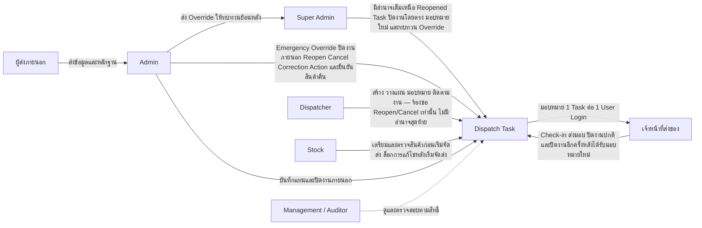

# บทบาทและสิทธิ์ผู้ใช้งานระบบ Dispatch

> [!summary]
> สรุปหลักการแบ่งบทบาท การกำหนดผู้รับผิดชอบหลักของ Task การควบคุมข้อมูลอ่อนไหว และการตรวจสอบย้อนหลัง

เอกสารฉบับนี้ต่อยอดจาก [[01 - เป้าหมายของระบบ Dispatch]] และ [[02 - Workflow การทำงานของระบบ Dispatch]] เวอร์ชัน 0.2 โดยกำหนดโมเดลสิทธิ์ระดับธุรกิจ (Business-level Authorization Model) เนื้อหาทั้งหมดต้องสอดคล้องกับ Workflow ที่ได้รับการอนุมัติแล้ว และจะไม่ตัดสินใจแทนเจ้าของธุรกิจในประเด็นที่ยังไม่ชัดเจน ประเด็นเหล่านั้นถูกรวบรวมไว้ในหัวข้อ [27. ประเด็นที่ต้องยืนยันเพิ่มเติม](#27-ประเด็นที่ต้องยืนยันเพิ่มเติม)

> [!note] ปรับปรุงเอกสาร (v0.2)
> เอกสารฉบับนี้ปรับปรุงตามการตัดสินใจทางธุรกิจที่ได้รับการอนุมัติล่าสุด ประเด็นสำคัญที่เปลี่ยนแปลงจากฉบับก่อนหน้า (v0.1) ได้แก่ การเพิ่มบทบาท **Super Admin** เป็นอำนาจสูงสุดของระบบ การแยก **Admin** และ **Dispatcher** ออกจากกันอย่างชัดเจน การอนุมัติบทบาท **Management / Auditor** ให้เป็นบทบาทบังคับใน Phase 1 (ไม่ใช่บทบาทที่รอการอนุมัติอีกต่อไป) การอนุมัติสิทธิ์ **Emergency Override** ให้ Admin ปิดงานภายในแทนพนักงานที่ไม่สามารถปฏิบัติงานได้ในกรณีฉุกเฉิน หลักการ **หนึ่ง Task หนึ่งผู้รับผิดชอบหลักในระบบหนึ่ง User Login** การกำหนดอำนาจของ Super Admin ในการแก้ไขข้อมูลผู้รับสินค้าและจัดการหลักฐานย้อนหลังหลังปิดงาน และการกำหนดข้อจำกัดการเข้าถึงข้อมูลอ่อนไหวอย่างชัดเจนสำหรับแต่ละบทบาท

> [!note] ปรับปรุงเอกสาร (v0.3)
> เอกสารฉบับนี้ปรับปรุงตามการตัดสินใจทางธุรกิจที่ได้รับการอนุมัติเพิ่มเติมจาก v0.2 ประเด็นสำคัญที่เปลี่ยนแปลง ได้แก่ (1) **Admin Emergency Override สามารถข้ามเงื่อนไขปิดงานตามปกติได้ทุกข้อ** โดยไม่จำกัดเฉพาะบางเงื่อนไข แต่ยังคงเป็นการปิดงานเชิงบริหารที่แยกจากการปิดงานปกติอย่างชัดเจนเสมอ (2) **Super Admin ต้องทบทวน Emergency Override ทุกครั้งแบบย้อนหลัง (Retrospective Review)** หลังจาก Admin ปิดงานแล้ว (3) **Dispatcher ไม่มีสิทธิ์เปิดงานกลับมาแก้ไข (Reopen) หรือยกเลิกงาน (Cancel)** ทำได้เพียงร้องขอเท่านั้น อำนาจขั้นสุดท้ายเป็นของ Admin และ Super Admin (4) **Admin แก้ไขข้อมูลผู้รับสินค้าภายหลังปิดงานผ่าน Correction Action ที่มีการควบคุมได้โดยไม่ต้องเปิดงานทั้ง Task กลับมาใหม่** (5) **Super Admin มีอำนาจเต็มเหนือ Task ที่ถูกเปิดกลับมาแก้ไข รวมถึงปิดงานได้โดยตรงโดยไม่ต้องรอการอนุมัติจากบทบาทอื่น** (6) **การยกเลิกงานหลังสินค้าออกจาก STEP-SOLUTIONS แล้วไม่ต้องขออนุมัติสองชั้น (Dual Approval)** (7) **เมื่อ Super Admin มอบหมาย Task ที่ถูกเปิดกลับมาแก้ไขใหม่ให้พนักงานส่งสินค้าคนใหม่ พนักงานคนใหม่เป็นผู้ปิดงานอีกครั้งตามปกติ** โดย Super Admin ยังคงมีอำนาจปิดงานโดยตรงในกรณีข้อยกเว้น และ (8) **Stock ไม่มีสิทธิ์แก้ไขข้อมูลการเตรียมสินค้าหลังจากพนักงานที่ได้รับมอบหมายเริ่มการจัดส่งแล้ว** ทำได้เพียงรายงานข้อผิดพลาดให้ Admin หรือ Super Admin ตรวจสอบ

## 1. วัตถุประสงค์ของเอกสาร

เอกสารฉบับนี้มีวัตถุประสงค์เพื่อ

* กำหนดบทบาททางธุรกิจ (Business Role) ทั้งหมดที่เกี่ยวข้องกับระบบ Dispatch รวมถึงบทบาท Super Admin และ Management / Auditor ที่ได้รับการอนุมัติเพิ่มเติมใน v0.2
* อธิบายว่าแต่ละบทบาทสามารถดู สร้าง แก้ไข ยืนยัน ส่ง ปิด เปิดกลับ มอบหมายใหม่ ยกเลิก แก้ไขหลังปิดงาน หรือตรวจสอบข้อมูลใดได้บ้าง
* กำหนดผู้รับผิดชอบหลักของ Task อย่างชัดเจนตามหลักการ "หนึ่ง Task หนึ่งผู้รับผิดชอบหลักในระบบหนึ่ง User Login"
* กำหนดขอบเขตการเข้าถึงข้อมูลอ่อนไหว (Sensitive Data) ตามบทบาท
* กำหนดอำนาจของ Emergency Override และการแก้ไขข้อมูลหรือหลักฐานภายหลังปิดงาน
* รักษาความสอดคล้องกับ Workflow ที่ได้รับการอนุมัติใน [[02 - Workflow การทำงานของระบบ Dispatch]] เวอร์ชัน 0.2 โดยไม่แก้ไขหรือขัดแย้งกับการตัดสินใจที่อนุมัติแล้ว
* เป็นฐานอ้างอิงสำหรับการออกแบบในระยะถัดไป ได้แก่ การยืนยันตัวตน (Authentication), Role-Based Access Control (RBAC), การกำหนดมุมมองหน้าจอ (UI Visibility), การอนุญาตใช้งาน API, ข้อกำหนดด้าน Audit, กรณีทดสอบ (Test Cases) และข้อกำหนดเชิงพัฒนา (Implementation Specification)
* แยกสิทธิ์ที่ได้รับการอนุมัติแล้วออกจากประเด็นสิทธิ์ที่ยังไม่ได้รับการอนุมัติอย่างชัดเจน

เอกสารฉบับนี้เป็นเอกสารระดับธุรกิจเท่านั้น **ไม่ใช่**เอกสารออกแบบระบบ

## 2. ขอบเขตของการกำหนดสิทธิ์

เอกสารฉบับนี้ครอบคลุม

* บทบาทหลักที่เกี่ยวข้องกับ Dispatch ทั้งหมด รวมถึง Super Admin และ Management / Auditor
* สิทธิ์ในการดู สร้าง แก้ไข ยืนยัน ปิด เปิดกลับ มอบหมายใหม่ ยกเลิก และตรวจสอบย้อนหลัง
* ความเป็นเจ้าของ Task (Task Ownership) และหลักการหนึ่ง Task หนึ่งผู้รับผิดชอบหลักในระบบหนึ่ง User Login
* สิทธิ์ที่เปลี่ยนแปลงไปตามช่วง Workflow
* อำนาจในการปิดงาน รวมถึง Emergency Override ของ Admin
* อำนาจในการเปิดงานกลับมาแก้ไข มอบหมายใหม่ ยกเลิกงาน และยืนยันสินค้าคืน
* การแก้ไขข้อมูลผู้รับสินค้าและการจัดการหลักฐานภายหลังปิดงาน
* ขอบเขตการเข้าถึงข้อมูลอ่อนไหว (Sensitive Data Access)
* Permission Matrix ระดับธุรกิจ
* ข้อกำหนดด้าน Timeline และ Audit Log ที่เกี่ยวข้องกับการใช้สิทธิ์
* ขอบเขตสิทธิ์ใน Phase 1 และสิทธิ์ที่อาจพิจารณาในอนาคต

เอกสารฉบับนี้**ไม่ได้กำหนด**

* โครงสร้างตารางฐานข้อมูลผู้ใช้งานหรือสิทธิ์
* API endpoints หรือ Authorization Scopes ในเชิงเทคนิค
* Technology Stack ด้านการยืนยันตัวตน (เช่น OAuth, SSO)
* การออกแบบหน้าจอ (UI) โดยละเอียด
* กลไกทางเทคนิคของการเข้ารหัสหรือการจัดเก็บสิทธิ์
* โมเดลสถานะงาน (Status Enum) ฉบับสมบูรณ์ — ดู [[04 - สถานะงาน Dispatch]]
* รายละเอียดหลักฐานและข้อมูลของงาน — ดู [[05 - ข้อมูลและหลักฐานของงาน Dispatch]]

## 3. หลักการควบคุมสิทธิ์

### 3.1 Least Privilege (สิทธิ์ขั้นต่ำที่จำเป็น)

แต่ละบทบาทควรเข้าถึงได้เฉพาะข้อมูลและการกระทำที่จำเป็นต่อหน้าที่ของตนเท่านั้น ตัวอย่างเช่น

* พนักงานส่งสินค้าภายในควรเห็นเฉพาะงานที่ได้รับมอบหมาย ไม่ใช่งาน Dispatch ทั้งหมดของบริษัท
* Stock ควรเห็นเฉพาะข้อมูลที่จำเป็นต่อการเตรียมสินค้า ไม่จำเป็นต้องเห็นรายละเอียดเชิงพาณิชย์ของลูกค้าที่ไม่เกี่ยวข้องหรือข้อมูลอ่อนไหว
* ผู้ส่งสินค้าภายนอกไม่ได้รับสิทธิ์เข้าถึงระบบ Dispatch โดยตรงใน Phase 1
* Management / Auditor เน้นการดูภาพรวมเพื่อกำกับดูแล (Oversight) เป็นหลัก และควรได้รับข้อมูลแบบสรุปหรือปิดบัง (Masked) เมื่อเป็นข้อมูลอ่อนไหว
* Dispatcher เข้าถึงข้อมูลติดต่อของลูกค้าได้เท่าที่จำเป็นต่อการประสานงาน ไม่ใช่ข้อมูลอ่อนไหวแบบเต็มรูปแบบ

### 3.2 Task Ownership และหนึ่ง Task หนึ่งผู้รับผิดชอบหลัก (One Primary User Login)

> [!quote]
> หนึ่ง Dispatch Task ต้องมีผู้รับผิดชอบหลักในระบบหนึ่ง User Login

Task แต่ละงานต้องมีผู้รับผิดชอบการจัดส่งที่ระบุได้ชัดเจนเพียงหนึ่งบัญชีผู้ใช้งานเท่านั้น แม้ในทางกายภาพจะมีบุคคลมากกว่าหนึ่งคนเกี่ยวข้องกับการจัดส่งนั้นก็ตาม รายละเอียดอยู่ในหัวข้อ [13. การมอบหมายและความเป็นเจ้าของ Task](#13-การมอบหมายและความเป็นเจ้าของ-task)

สำหรับงานภายใน

* ความเป็นเจ้าของถูกมอบหมายให้พนักงานส่งสินค้าภายในคนใดคนหนึ่งเป็นผู้รับผิดชอบหลัก
* เฉพาะพนักงานที่ได้รับมอบหมายเท่านั้นที่ดำเนินการจัดส่งตามปกติและปิด Task ได้
* การเปลี่ยนตัวผู้รับผิดชอบ (Reassignment) ในกรณีปกติดำเนินการโดย Dispatcher หรือ Admin
* การเปลี่ยนตัวผู้รับผิดชอบในกรณีข้อยกเว้น (เช่น พนักงานเดิมไม่พร้อมปฏิบัติงาน) ดำเนินการโดย Super Admin
* การเปลี่ยนตัวผู้รับผิดชอบทุกกรณีต้องถูกบันทึกใน Timeline และ Audit Log

สำหรับงานภายนอก

* ผู้ปฏิบัติงานจัดส่งจริงคือผู้ให้บริการภายนอก
* ผู้กระทำการในระบบ Dispatch คือ Admin
* Admin เป็นผู้บันทึกข้อมูลและปิด Task

### 3.3 Evidence-Gated Actions (สิทธิ์ในการกระทำไม่เท่ากับการอนุญาตให้สำเร็จ)

การมีสิทธิ์กดปุ่มดำเนินการไม่ได้หมายความว่าการกระทำนั้นจะสำเร็จเสมอเมื่อเงื่อนไขทางธุรกิจยังไม่ครบถ้วน ตัวอย่างเช่น

* พนักงานส่งสินค้าภายในมีสิทธิ์ปิด Task ของตนเอง แต่ระบบต้องบล็อกการปิดงานหากหลักฐานบังคับยังขาดอยู่
* Admin มีสิทธิ์ปิด Task ของงานภายนอก แต่ระบบต้องบล็อกการปิดงานหากข้อมูลบังคับสำหรับงานภายนอกยังไม่ครบถ้วน
* Admin มีสิทธิ์ใช้ Emergency Override เพื่อปิดงานภายในได้แม้เงื่อนไขปิดงานตามปกติข้อใดข้อหนึ่งหรือหลายข้อยังไม่ครบถ้วน (Admin Emergency Override อาจข้ามเงื่อนไขปิดงานตามปกติได้ทุกข้อ) แต่การใช้สิทธิ์นี้ยังคงต้องมีเหตุผลบังคับ ต้องถูกตรวจสอบย้อนหลังได้เสมอ และต้องผ่านการทบทวนย้อนหลังโดย Super Admin ทุกครั้ง (ดูหัวข้อ [16. Emergency Override](#16-emergency-override)) การปิดงานผ่าน Emergency Override เป็นการปิดงานเชิงบริหารที่แยกออกจากการปิดงานปกติอย่างชัดเจนเสมอ ไม่ถือเป็นการยืนยันว่าหลักฐานตาม Workflow ปกติครบถ้วนแล้ว

### 3.4 No Silent Historical Changes (ห้ามแก้ไขประวัติโดยไม่มีการควบคุม)

ข้อมูลสำคัญที่เสร็จสมบูรณ์แล้วต้องไม่ถูกเขียนทับโดยไม่มีการควบคุม การแก้ไขหลังการส่งหรือปิดงานต้องมี

* บทบาทที่ได้รับสิทธิ์ (จำกัดเฉพาะ Admin หรือ Super Admin แล้วแต่ประเภทข้อมูล)
* เหตุผล
* วันและเวลา
* บันทึกใน Audit Log
* การเปิดงานกลับมาแก้ไข (Reopening) เมื่อเกี่ยวข้อง

การแก้ไขข้อมูลผู้รับสินค้าและการจัดการหลักฐานภายหลังปิดงานมีข้อกำหนดเฉพาะเพิ่มเติมในหัวข้อ [20. การแก้ไขข้อมูลและหลักฐานหลังปิดงาน](#20-การแก้ไขข้อมูลและหลักฐานหลังปิดงาน)

### 3.5 Separation of Physical Actor and System Actor (แยกผู้ปฏิบัติงานจริงออกจากผู้กระทำการในระบบ)

สำหรับงานที่ใช้ผู้ส่งสินค้าภายนอก

* ผู้ส่งสินค้าภายนอกคือผู้ปฏิบัติงานจริง (Physical Actor)
* Admin คือผู้กระทำการในระบบที่บันทึกข้อมูล (System Actor)

สำหรับการใช้ Emergency Override

* พนักงานที่ได้รับมอบหมายเดิมยังคงถูกบันทึกไว้เป็นผู้รับผิดชอบเดิม (Original Assigned Employee)
* Admin ที่ใช้ Emergency Override ถูกบันทึกแยกต่างหากเป็นผู้กระทำการปิดงานแทน (Override Actor)

ทั้งสองกรณีต้องสามารถตรวจสอบย้อนกลับได้แยกจากกันเสมอในหลักฐานและ Audit Log ไม่ปะปนกันจนไม่สามารถแยกแยะได้ว่าใครเป็นผู้ปฏิบัติงานจริงและใครเป็นผู้บันทึกหรือปิดงานแทน

### 3.6 Exception Escalation Authority (อำนาจจัดการกรณีข้อยกเว้น)

ระบบกำหนดลำดับการยกระดับ (Escalation) สำหรับกรณีที่กฎบทบาทปกติไม่สามารถแก้ไขปัญหาได้

* Dispatcher และ Stock ยกระดับปัญหาที่ตนแก้ไขไม่ได้ไปยัง Admin
* Admin จัดการข้อยกเว้นเชิงปฏิบัติการส่วนใหญ่ เช่น การปิดงานภายนอก การยืนยันสินค้าคืน การเปิดงานกลับมาแก้ไข การยกเลิกงาน และ Emergency Override สำหรับงานภายใน
* Admin ยกระดับกรณีที่เกินอำนาจของตนไปยัง Super Admin เช่น การแก้ไขหลักฐานย้อนหลัง หรือกรณีพนักงานเดิมไม่พร้อมปฏิบัติงานหลังเปิดงานกลับมาแก้ไข
* Super Admin เป็นอำนาจสูงสุดที่แก้ไขกรณีข้อยกเว้นที่กฎบทบาทปกติไม่สามารถแก้ไขได้ โดยทุกการกระทำของ Super Admin ยังคงต้องตรวจสอบย้อนหลังได้เสมอ ไม่มีข้อยกเว้นใดที่อนุญาตให้ลบประวัติหรือหลักฐานโดยไม่มีการบันทึก

## 4. บทบาทหลักในระบบ

หัวข้อนี้สรุปบทบาทหลักที่เกี่ยวข้องกับระบบ Dispatch ใน Phase 1 โดยไม่ระบุรายละเอียดสิทธิ์ทั้งหมด (ดูหัวข้อ [5](#5-สิทธิ์ของ-super-admin) ถึง [12](#12-บทบาทของลูกค้าหรือผู้รับสินค้า) สำหรับรายละเอียด)

### 4.1 Super Admin

Super Admin คืออำนาจปฏิบัติการสูงสุดของระบบ Dispatch มีหน้าที่จัดการกรณีข้อยกเว้นที่บทบาทอื่นไม่สามารถแก้ไขได้ เช่น การมอบหมายใหม่เมื่อพนักงานเดิมไม่พร้อมปฏิบัติงาน การแก้ไขข้อมูลผู้รับสินค้าและหลักฐานย้อนหลัง และการสืบสวนข้อพิพาทหรือข้อมูลผิดปกติ Super Admin **ไม่ใช่**ผู้ปิดงานตามปกติสำหรับงานภายในที่ยังไม่ถูกเปิดกลับมาแก้ไข (บทบาทนี้ยังคงเป็นของพนักงานที่ได้รับมอบหมาย) แต่ Super Admin **มีอำนาจเต็มเหนือ Task ที่ถูกเปิดกลับมาแก้ไข (Reopened Task)** รวมถึงสามารถปิดงานที่ถูกเปิดกลับมาแก้ไขได้โดยตรงโดยไม่ต้องรอการอนุมัติจากบทบาทอื่น Super Admin ยังเป็นผู้ทบทวน Emergency Override ของ Admin แบบย้อนหลัง (Retrospective Review) ทุกครั้งเป็นข้อบังคับ และมีอำนาจยกเลิกงานโดยไม่ต้องขออนุมัติสองชั้นแม้สินค้าจะออกจาก STEP-SOLUTIONS ไปแล้ว Super Admin ไม่มีสิทธิ์ลบ Task, Audit Log หรือหลักฐานโดยไม่มีการควบคุม

### 4.2 Admin

Admin รับผิดชอบการควบคุมข้อยกเว้นเชิงปฏิบัติการ การปิดงานที่ใช้ผู้ส่งสินค้าภายนอก การยืนยันสินค้าคืน การเปิดงานกลับมาแก้ไข (Reopen) การยกเลิกงาน (Cancel) การแก้ไขข้อมูลผู้รับสินค้าภายหลังปิดงานผ่าน Correction Action และ **Emergency Override สำหรับงานภายใน ซึ่งอาจข้ามเงื่อนไขปิดงานตามปกติได้ทุกข้อเมื่อจำเป็น** โดยทุกครั้งที่ใช้ Emergency Override ต้องผ่านการทบทวนย้อนหลังโดย Super Admin เสมอ Admin เป็นบทบาทที่แยกออกจาก Dispatcher อย่างชัดเจนใน v0.2 และไม่ใช่ผู้ปิดงานที่บังคับสำหรับงานภายในทุกงานตามปกติ Admin และ Super Admin เป็นสองบทบาทเดียวที่มีอำนาจ Reopen และ Cancel งาน ไม่ต้องขออนุมัติสองชั้นสำหรับการยกเลิกงานแม้สินค้าจะออกจาก STEP-SOLUTIONS ไปแล้ว

### 4.3 Dispatcher

Dispatcher คือผู้ประสานงานปฏิบัติการหลักสำหรับการวางแผนจัดส่งตามปกติ รับผิดชอบการสร้างงาน เตรียมข้อมูล มอบหมายผู้ส่งสินค้า และติดตามความคืบหน้า Dispatcher **ไม่มีสิทธิ์เปิดงานกลับมาแก้ไข (Reopen) และไม่มีสิทธิ์ยกเลิกงาน (Cancel)** ไม่ว่าก่อนหรือหลังสินค้าออกจาก STEP-SOLUTIONS Dispatcher ทำได้เพียงร้องขอให้เปิดงานกลับมาแก้ไขหรือร้องขอให้ยกเลิกงานเท่านั้น อำนาจขั้นสุดท้ายเป็นของ Admin และ Super Admin เสมอ Dispatcher **ไม่ใช่**อำนาจสุดท้ายสำหรับการปิดงานภายนอก การใช้ Emergency Override การยืนยันสินค้าคืน หรือการแก้ไขข้อมูลภายหลังปิดงาน

### 4.4 Stock

Stock สนับสนุนการเตรียมและปล่อยสินค้าออกจากคลัง มีบทบาทเฉพาะช่วงเตรียมงานและสนับสนุนการรับคืนสินค้าในเชิงปฏิบัติการเท่านั้น ไม่มีสิทธิ์ปิดงานหรือยืนยันสินค้าคืนในระบบ **เมื่อพนักงานที่ได้รับมอบหมายเริ่มการจัดส่งแล้ว Stock ไม่มีสิทธิ์แก้ไขข้อมูลการเตรียมสินค้าอีกต่อไป** ทำได้เพียงรายงานข้อผิดพลาดที่พบให้ Admin หรือ Super Admin ตรวจสอบและดำเนินการแก้ไขผ่านบันทึกแก้ไขหรือข้อยกเว้น (Correction/Exception Record)

### 4.5 เจ้าหน้าที่ส่งสินค้าภายใน

พนักงานของ STEP-SOLUTIONS ที่ได้รับมอบหมายให้ปฏิบัติงานจัดส่ง มีสิทธิ์ดำเนินการและปิด Task ที่ได้รับมอบหมายให้ตนเองเท่านั้น เป็นผู้รับผิดชอบหลักภายใต้หลักการหนึ่ง Task หนึ่ง User Login เมื่อ Super Admin มอบหมาย Task ที่ถูกเปิดกลับมาแก้ไขให้พนักงานคนใหม่ พนักงานคนใหม่จะกลายเป็นผู้รับผิดชอบหลักและเป็นผู้ปิดงานอีกครั้งตามปกติ (Normal Re-closing Actor) พนักงานส่งสินค้าภายใน**ไม่ใช่**ผู้ประสานงาน Dispatcher และไม่มีสิทธิ์เปิดงานกลับมาแก้ไข ยกเลิกงาน หรือใช้ Emergency Override

### 4.6 Management / Auditor

Management / Auditor เป็น**บทบาทบังคับที่ได้รับการอนุมัติแล้วใน Phase 1** ไม่ใช่บทบาทที่รอการอนุมัติหรือเป็นทางเลือกอีกต่อไป มีสิทธิ์เน้นการดูข้อมูลเพื่อกำกับดูแล (Read-oriented Oversight) เป็นหลัก

### 4.7 ผู้ส่งสินค้าภายนอก

บุคคลหรือผู้ให้บริการภายนอก เช่น คนขับรถรับจ้าง บริการ Messenger บริษัทขนส่ง ผู้รับเหมา หรือคนขับจากพันธมิตรทางธุรกิจ **ไม่ได้รับสิทธิ์เข้าสู่ระบบ Dispatch โดยตรงใน Phase 1**

### 4.8 ลูกค้าหรือผู้รับสินค้า

ลูกค้าหรือผู้รับสินค้าไม่ใช่ผู้ใช้งานระบบ Dispatch ใน Phase 1 แต่มีบทบาทในกระบวนการทางธุรกิจผ่านการโต้ตอบทางกายภาพ เช่น การลงลายเซ็นและการให้ข้อมูลผู้รับสินค้า

## 5. สิทธิ์ของ Super Admin

Super Admin เป็นอำนาจปฏิบัติการสูงสุดในระบบ Dispatch และอาจ

* ดูงาน Dispatch ทั้งหมดในระบบ
* ดูประวัติ Workflow ทั้งหมดของทุกงาน
* ดู Timeline และ Audit Log ทั้งหมด
* จัดการหรือแก้ไขกรณีสิทธิ์ที่เป็นข้อยกเว้น (Exceptional Permission Cases)
* จัดการ Task ที่พนักงานที่ได้รับมอบหมายเดิมไม่สามารถดำเนินการต่อได้
* **มีอำนาจเต็มเหนือ Task ที่ถูกเปิดกลับมาแก้ไข (Reopened Task)** รวมถึงดูข้อมูลทั้งหมด แก้ไขข้อมูลที่ได้รับอนุญาต ดำเนินการแก้ไขที่มีการควบคุม จัดการหลักฐานย้อนหลัง เพิ่มหมายเหตุ และเพิ่มบันทึกการแก้ไข
* **ปิด Task ที่ถูกเปิดกลับมาแก้ไขได้โดยตรง (Direct Closure)** โดยไม่ต้องรอการอนุมัติจากบทบาทอื่น
* **มอบหมายใหม่ (Reassign)** Task ที่ถูกเปิดกลับมาแก้ไขให้พนักงานส่งสินค้าคนใหม่ หรือคืน Task ให้พนักงานที่ได้รับมอบหมายเดิม และตัดสินใจว่าผู้รับผิดชอบคนถัดไปคือใครเมื่อพนักงานเดิมไม่พร้อมปฏิบัติงาน
* **ยกเลิกงาน (Cancel)** ได้โดยตรง รวมถึงกรณีสินค้าออกจาก STEP-SOLUTIONS ไปแล้ว โดยไม่ต้องขออนุมัติสองชั้น
* แก้ไขข้อมูลผู้รับสินค้าภายหลังปิดงานผ่าน Correction Action ที่มีการควบคุม โดยไม่ต้องเปิดงานทั้ง Task กลับมาใหม่ (ร่วมกับ Admin ดูหัวข้อ [20](#20-การแก้ไขข้อมูลและหลักฐานหลังปิดงาน))
* จัดการหรือแก้ไขรูปภาพและหลักฐานย้อนหลังภายหลังปิดงาน (Super Admin เท่านั้น)
* เข้าถึงข้อมูลปฏิบัติการที่มีความอ่อนไหว
* สืบสวนข้อพิพาทและบันทึกข้อมูลที่ผิดปกติ
* **ทบทวนการใช้งาน Emergency Override ของ Admin แบบย้อนหลังทุกครั้งเป็นข้อบังคับ (Mandatory Retrospective Review)** ดูหัวข้อ [16. Emergency Override](#16-emergency-override) สำหรับรายละเอียดกระบวนการและผลการทบทวนที่เป็นไปได้
* ยกระดับการตรวจสอบเมื่อพบการใช้งาน Emergency Override ที่น่าสงสัยหรือมีรูปแบบผิดปกติซ้ำหลายครั้งโดย Admin หรือทีมปฏิบัติการ
* ดำเนินการแก้ไขเชิงบริหารที่มีการควบคุม (Controlled Administrative Correction)
* สนับสนุนการปิดใช้งานบัญชีพนักงานและจัดการ Task ที่ถูกทิ้งค้างไว้ (Abandoned Task)
* จัดการข้อยกเว้นด้านสิทธิ์หรือความเป็นเจ้าของ Task ที่กฎบทบาทปกติไม่สามารถแก้ไขได้
* ดูเบอร์โทรศัพท์ผู้รับสินค้า ลายเซ็นลูกค้า ประวัติการจัดส่งทั้งหมดของลูกค้า และค่าจัดส่งของผู้ให้บริการภายนอก
* ทบทวนการแก้ไขข้อมูลภายหลังปิดงานทั้งหมด

> [!warning]
> Super Admin **ไม่มี**สิทธิ์ลบประวัติโดยไม่มีการควบคุม การแก้ไขทุกครั้งของ Super Admin ต้องตรวจสอบย้อนหลังได้เสมอ

การแก้ไขข้อมูลย้อนหลังของ Super Admin ต้องบันทึกอย่างน้อยด้วยข้อมูลต่อไปนี้

* ผู้กระทำการ (Actor)
* วันและเวลา
* เหตุผล
* ค่าหรือหลักฐานเดิม
* ค่าหรือหลักฐานใหม่
* Task ที่เกี่ยวข้อง
* เหตุการณ์ Audit Log

> [!important]
> เอกสารฉบับนี้**ไม่ได้กำหนด**API หรือกลไกทางเทคนิคของการจัดการผู้ใช้งาน (User Management) หรือระบบยืนยันตัวตน

Super Admin **ไม่สามารถ**

* ลบ Task
* ลบ Audit Log
* ลบหลักฐานย้อนหลังโดยไม่มีการควบคุมหรือไม่มีการบันทึกร่องรอย
* เป็นผู้ปิดงานตามปกติสำหรับงานภายในที่ยังไม่ถูกเปิดกลับมาแก้ไข แทนพนักงานที่ได้รับมอบหมาย (บทบาทนี้ยังคงเป็นของพนักงานที่ได้รับมอบหมายตามหัวข้อ [15.1](#151-งานจัดส่งภายในปกติ)) ข้อจำกัดนี้ใช้เฉพาะการปิดงานตามเส้นทางปกติเท่านั้น **ไม่ใช้กับ Task ที่ถูกเปิดกลับมาแก้ไข** ซึ่ง Super Admin มีอำนาจปิดโดยตรงได้ตามหัวข้อนี้

## 6. สิทธิ์ของ Admin

Admin มีอำนาจควบคุมเชิงปฏิบัติการที่สูงกว่า Dispatcher และอาจ

* ดูงาน Dispatch ทั้งหมดที่ได้รับอนุญาต
* ติดตามงานเชิงปฏิบัติการทั้งหมด
* ติดตามและตรวจสอบกิจกรรมของ Dispatcher
* บันทึกข้อมูลและหลักฐานการจัดส่งในนามของผู้ส่งสินค้าภายนอก
* ปิดงานของผู้ส่งสินค้าภายนอกเมื่อเงื่อนไขบังคับทั้งหมดครบถ้วน
* ยืนยันสินค้าที่ถูกส่งคืนมายัง STEP-SOLUTIONS ในกรณีปกติ
* เปิดงานที่ปิดสมบูรณ์แล้วกลับมาแก้ไข (Reopen) เมื่อมีเหตุผลรองรับ
* ยกเลิกงาน (Cancel) เมื่อมีเหตุผลรองรับ **รวมถึงหลังสินค้าออกจาก STEP-SOLUTIONS ไปแล้ว โดยไม่ต้องขออนุมัติสองชั้น**
* แก้ไขข้อมูลผู้รับสินค้าภายหลังปิดงานผ่าน Correction Action ที่มีการควบคุม **โดยไม่ต้องเปิดงานทั้ง Task กลับมาใหม่** (ดูหัวข้อ [20](#20-การแก้ไขข้อมูลและหลักฐานหลังปิดงาน))
* ใช้ **Emergency Override** เพื่อปิดงานภายในแทนพนักงานที่ไม่สามารถปฏิบัติงานได้ **โดยอาจข้ามเงื่อนไขปิดงานตามปกติได้ทุกข้อเมื่อจำเป็น** (ดูหัวข้อ [16](#16-emergency-override)) ทุกครั้งที่ใช้ Emergency Override ต้องผ่านการทบทวนย้อนหลังโดย Super Admin เป็นข้อบังคับ
* เข้าถึงข้อมูลอ่อนไหวตามที่ได้รับอนุมัติ (ดูหัวข้อ [21](#21-การเข้าถึงข้อมูลอ่อนไหว))
* สืบสวนงานที่ล้มเหลว น่าสงสัย เป็นข้อพิพาท หรือไม่สมบูรณ์
* ตรวจสอบ Timeline และ Audit Log
* ตรวจสอบการมอบหมายและการเปลี่ยนแปลงเชิงปฏิบัติการของ Dispatcher
* ยกระดับการแก้ไขหลักฐานที่เกินอำนาจของตนไปยัง Super Admin

> [!important]
> Admin **ไม่ใช่**ผู้ปิดงานที่บังคับสำหรับงานจัดส่งภายในตามปกติ สำหรับงานภายใน พนักงานส่งสินค้าที่ได้รับมอบหมายเป็นผู้ปิด Task ของตนเอง Admin เข้ามาปิดงานภายในได้เฉพาะผ่าน Emergency Override ในกรณีข้อยกเว้นเท่านั้น

Admin **ไม่สามารถ**

* เขียนทับรูปภาพหรือหลักฐานย้อนหลังหลังปิดงานโดยตรง (การจัดการหลักฐานย้อนหลังจำกัดเฉพาะ Super Admin ดูหัวข้อ [20.2](#202-การจัดการหลักฐานย้อนหลัง))
* ลบ Task
* ลบ Audit Log
* ลบประวัติ Delivery Attempt ก่อนหน้า
* ปิดงานตามเส้นทางปกติ (ไม่ผ่าน Emergency Override) ที่ยังส่งมอบสินค้าไม่ครบทุกรายการให้เป็นผลสำเร็จ
* ข้ามเงื่อนไขหลักฐานบังคับใด ๆ นอกเหนือจากกระบวนการ Emergency Override ที่ได้รับอนุมัติ (การข้ามเงื่อนไขทำได้เฉพาะผ่าน Emergency Override เท่านั้น ดูหัวข้อ [16](#16-emergency-override))
* ปิดใช้งาน Emergency Override โดยไม่ระบุเหตุผล หรือไม่ส่งให้ Super Admin ทบทวนย้อนหลัง

## 7. สิทธิ์ของ Dispatcher

Dispatcher เป็นผู้ประสานงานเชิงปฏิบัติการสำหรับการวางแผนจัดส่งตามปกติ และอาจ

* สร้างงาน Dispatch ใหม่
* บันทึกและแก้ไขงานในสถานะ Draft
* บันทึกข้อมูลลูกค้าและปลายทาง
* บันทึกข้อมูลการนัดหมาย
* เพิ่มหรือปรับปรุงรายการสินค้าที่ต้องจัดส่งระหว่างการเตรียมงาน
* ประสานงานกับ Stock
* มอบหมายพนักงานส่งสินค้าภายใน
* มอบหมายผู้ส่งสินค้าภายนอก
* เปลี่ยนตัวผู้ส่งสินค้า (Reassignment) เมื่อจำเป็นในเชิงปฏิบัติการ
* ติดตามงานที่ยังเปิดอยู่
* ติดตามความคืบหน้าของการจัดส่ง
* บันทึกหรือปรับปรุงการเปลี่ยนแปลงการนัดหมาย
* นัดหมายจัดส่งใหม่โดยใช้ Task เดิม
* ประสานงานกรณีส่งไม่สำเร็จ ล่าช้า หรือส่งมอบบางส่วน
* ดูหลักฐานเชิงปฏิบัติการที่จำเป็นต่อการประสานงาน
* ดูเหตุการณ์ Timeline เชิงปฏิบัติการตามสิทธิ์
* **ร้องขอ (Request) ให้ Admin หรือ Super Admin เปิดงานกลับมาแก้ไข (Reopen)** เมื่อพบปัญหาที่ต้องแก้ไข
* **ร้องขอ (Request) ให้ Admin หรือ Super Admin ยกเลิกงาน (Cancel)** เมื่อจำเป็น
* บันทึกหมายเหตุเชิงปฏิบัติการประกอบคำร้องขอ
* ยกระดับข้อยกเว้นไปยัง Admin หรือ Super Admin
* ประสานงานเชิงปฏิบัติการภายหลังที่ Admin หรือ Super Admin อนุมัติคำร้องขอ

Dispatcher **ไม่มีสิทธิ์**ในการ

* ใช้ Emergency Override
* **เปิดงานกลับมาแก้ไข (Reopen) ด้วยตนเอง** ไม่ว่ากรณีใด ทำได้เพียงร้องขอเท่านั้น
* **ยกเลิกงาน (Cancel) ด้วยตนเอง** ไม่ว่าก่อนหรือหลังสินค้าออกจาก STEP-SOLUTIONS ทำได้เพียงร้องขอเท่านั้น
* แก้ไขข้อมูลผู้รับสินค้าภายหลังปิดงาน
* แก้ไขหลักฐานย้อนหลังหลังปิดงาน
* ยืนยันสินค้าคืนในฐานะอำนาจสุดท้าย
* ปิดงานภายนอก เว้นแต่จะได้รับอนุมัติเป็นการเฉพาะ
* เข้าถึงค่าจัดส่งของผู้ให้บริการภายนอก
* ดูประวัติการจัดส่งทั้งหมดของลูกค้า
* ดูลายเซ็นลูกค้าภายหลังปิดงาน
* เข้าถึงข้อมูลผู้รับสินค้าที่อ่อนไหวเต็มรูปแบบเกินความจำเป็นเชิงปฏิบัติการ
* เป็นผู้ปิดงานตามปกติของ Task ใด ๆ ไม่ว่าจะเป็นงานภายในหรือภายนอก

> [!important]
> การที่ Dispatcher ไม่มีสิทธิ์ Reopen หรือ Cancel เป็นการตัดสินใจทางธุรกิจที่**ได้รับการอนุมัติแล้ว**และมีผลในทุกช่วง Workflow (ก่อนสินค้าออกจากบริษัท ระหว่างจัดส่ง หลังส่งมอบ และหลังปิดงาน) ไม่ใช่ประเด็นที่รอการยืนยันอีกต่อไป

> [!warning]
> ห้ามถือว่า Dispatcher มีสิทธิ์ระดับ Admin โดยปริยาย แม้จะเป็นผู้สร้างและประสานงาน Task ก็ตาม

## 8. สิทธิ์ของ Stock

Stock อาจ

* ดูงาน Dispatch ที่ต้องมีการเตรียมสินค้าโดย Stock
* ดูข้อมูลลูกค้าหรือปลายทางเท่าที่จำเป็นต่อการเตรียมสินค้า
* ดูรายการสินค้าที่ต้องจัดส่ง
* ยืนยันความถูกต้องของสินค้า
* ยืนยันจำนวนสินค้า
* ยืนยัน Serial Number เมื่อเกี่ยวข้อง
* ยืนยันอุปกรณ์เสริมหรือชิ้นส่วนประกอบที่มากับสินค้า
* บันทึกสภาพสินค้าหรือบรรจุภัณฑ์
* อัปโหลดหรือช่วยจัดทำหลักฐานการเตรียมสินค้า
* ยืนยันว่าสินค้าที่เบิกออกตรงกับงาน Dispatch ที่ถูกต้อง
* บันทึกข้อสังเกตหรือข้อผิดพลาด**ก่อน**พนักงานที่ได้รับมอบหมายเริ่มการจัดส่ง
* รายงานข้อผิดพลาดของข้อมูลการเตรียมสินค้าที่พบ**หลัง**เริ่มการจัดส่งแล้วให้ Admin หรือ Super Admin ตรวจสอบ (ดูหัวข้อ [14.2](#142-ช่วงเริ่มการจัดส่งแล้ว))
* ช่วยดำเนินการเชิงปฏิบัติการเมื่อมีการรับคืนสินค้า เช่น ตรวจนับหรือจัดเก็บ
* สนับสนุนการสืบสวนกรณีข้อผิดพลาดของการเตรียมสินค้า

Stock **ไม่ควร**ได้รับข้อมูลเชิงพาณิชย์หรือข้อมูลลูกค้าที่ไม่เกี่ยวข้องกับการเตรียมสินค้าโดยอัตโนมัติ และ**ไม่ควร**ได้รับเบอร์โทรศัพท์ผู้รับสินค้า ลายเซ็นลูกค้า ประวัติการจัดส่งทั้งหมดของลูกค้า หรือค่าจัดส่งของผู้ให้บริการภายนอก เว้นแต่จะมีข้อยกเว้นที่ได้รับอนุมัติในอนาคต (ดูหัวข้อ [21.5](#215-stock))

Stock **ไม่สามารถ**

* มอบหมายพนักงานส่งสินค้า
* เริ่มการจัดส่ง
* ทำการ Check-in ที่ปลายทาง
* บันทึกการส่งมอบสินค้าให้ลูกค้าในฐานะผู้ส่งสินค้า
* ปิดงาน Dispatch ไม่ว่าจะเป็นงานภายในหรือภายนอก
* ใช้ Emergency Override
* เปิดงานกลับมาแก้ไข หรือยกเลิกงาน
* ยืนยันสินค้าที่ถูกส่งคืนในระบบในฐานะผู้มีอำนาจสุดท้าย
* แก้ไขข้อมูลผู้รับสินค้าหรือหลักฐานภายหลังปิดงาน
* **แก้ไข เพิ่ม หรือเขียนทับข้อมูลการเตรียมสินค้า (รายการสินค้า จำนวนที่วางแผนหรือยืนยัน Serial Number อุปกรณ์เสริม ชิ้นส่วนประกอบ สภาพสินค้า สภาพบรรจุภัณฑ์ หมายเหตุการเตรียมสินค้า หรือหลักฐานการเตรียมสินค้าและหลักฐานหลังโหลดสินค้า) หลังจากพนักงานที่ได้รับมอบหมายเริ่มการจัดส่งแล้วไม่ว่ากรณีใด** การแก้ไขข้อมูลดังกล่าวหลังเริ่มจัดส่งทำได้เฉพาะผ่านบันทึกแก้ไขหรือข้อยกเว้น (Correction/Exception Record) ที่ดำเนินการโดย Admin หรือ Super Admin เท่านั้น โดยยังคงรักษาประวัติการเตรียมสินค้าเดิมไว้ครบถ้วน

> [!important]
> Admin เป็นบทบาทที่ได้รับการอนุมัติให้ยืนยันสินค้าที่ถูกส่งคืนในระบบ Dispatch ตามปกติ (Super Admin จัดการกรณีข้อยกเว้น) Stock อาจรับหรือช่วยตรวจสอบสินค้าที่ถูกส่งคืนในเชิงกายภาพ แต่การยืนยันในระบบไม่ใช่หน้าที่ของ Stock

## 9. สิทธิ์ของเจ้าหน้าที่ส่งสินค้าภายใน

พนักงานส่งสินค้าภายในที่ได้รับมอบหมายอาจ

* ดูงานที่ได้รับมอบหมายให้ตนเอง
* ดูชื่อลูกค้า
* ดูที่อยู่จัดส่ง
* ดูข้อมูลผู้ติดต่อและหมายเลขโทรศัพท์ของลูกค้าที่จำเป็นต่อ Task ที่ได้รับมอบหมาย
* ดูวันและช่วงเวลานัดหมาย
* ดูคำแนะนำการจัดส่ง
* ดูรายการสินค้าที่ตนรับผิดชอบจัดส่ง
* ดูหลักฐานก่อนจัดส่งที่เกี่ยวข้อง
* ยืนยันการรับมอบหมายงาน เมื่อ Workflow กำหนดให้ต้องยืนยัน
* เริ่มการจัดส่ง
* บันทึกหมายเหตุระหว่างปฏิบัติงาน
* ทำการ Check-in GPS ที่ปลายทางตามข้อบังคับ
* บันทึกจำนวนสินค้าที่ส่งมอบจริง
* บันทึกการส่งมอบบางส่วน
* บันทึกการส่งมอบไม่สำเร็จ
* อัปโหลดรูปหลักฐานการส่งมอบ
* บันทึกชื่อผู้รับสินค้า
* บันทึกหมายเลขโทรศัพท์ผู้รับสินค้าสำหรับ Task ที่ตนได้รับมอบหมายและกำลังดำเนินการอยู่
* เก็บลายเซ็นลูกค้าสำหรับ Task ที่ตนได้รับมอบหมายและกำลังดำเนินการอยู่
* รายงานกรณีนำสินค้ากลับ
* ใช้ Task เดิมสำหรับความพยายามจัดส่งครั้งถัดไป (Delivery Attempt)
* ปิด Task ของตนเองเมื่อเงื่อนไขบังคับทั้งหมดครบถ้วน (ในฐานะผู้รับผิดชอบหลักตามหลักการหนึ่ง Task หนึ่ง User Login)
* **ปิด Task อีกครั้งตามปกติ (Normal Re-closing Actor) เมื่อ Super Admin มอบหมาย Task ที่ถูกเปิดกลับมาแก้ไขให้ตนเองเป็นผู้รับผิดชอบหลักคนใหม่** โดยดำเนินการตามเงื่อนไขบังคับเช่นเดียวกับการปิดงานปกติ

พนักงานส่งสินค้าภายใน**ไม่สามารถ**

* ดูงาน Dispatch ทั้งหมดของบริษัทโดยอัตโนมัติ
* แก้ไข Task ที่ได้รับมอบหมายให้พนักงานคนอื่น
* ปิด Task ที่ได้รับมอบหมายให้พนักงานคนอื่น
* เปลี่ยนแปลงข้อมูลหลักของลูกค้า (Customer Master Data)
* เปลี่ยนตัวผู้ให้บริการภายนอกที่ได้รับมอบหมาย
* ยืนยันสินค้าที่ถูกส่งคืนในฐานะได้รับคืนแล้วที่ STEP-SOLUTIONS
* ลบบันทึก Timeline หรือ Audit Log
* ลบประวัติความพยายามจัดส่งครั้งก่อนหน้า (Delivery Attempt)
* ปิด Task ที่ยังส่งมอบสินค้าไม่ครบทุกรายการ
* ปิด Task โดยไม่มีการ Check-in GPS ที่ปลายทาง
* ปิด Task โดยไม่มีรูปภาพบังคับ
* ปิด Task โดยไม่มีชื่อและหมายเลขโทรศัพท์ผู้รับสินค้า
* ปิด Task โดยไม่มีลายเซ็นลูกค้า
* ปิด Task ที่ยังมีรายการสินค้าค้างส่งอยู่
* แก้ไข Task ที่ปิดแล้วโดยไม่ผ่านกระบวนการเปิดงานกลับมาแก้ไข
* บันทึกข้อมูลผู้รับสินค้าหรือลายเซ็นของ Task ที่ตนเองไม่ได้รับมอบหมาย
* เรียกดูประวัติการจัดส่งทั้งหมดของลูกค้ารายหนึ่งข้ามหลาย Task
* เรียกดูลายเซ็นจาก Task อื่นที่ตนเองไม่ได้รับมอบหมาย
* เข้าถึงข้อมูลอ่อนไหวของ Task ที่ตนรับผิดชอบต่อไปได้อย่างไม่จำกัดภายหลังปิดงานแล้ว
* เปิดงานกลับมาแก้ไข (Reopen) หรือยกเลิกงาน (Cancel) ไม่ว่ากรณีใด
* ใช้ Emergency Override
* แก้ไขข้อมูลการเตรียมสินค้าของ Stock ไม่ว่าก่อนหรือหลังเริ่มการจัดส่ง

สิทธิ์ในการปิดงานและการเข้าถึงข้อมูลอ่อนไหวของพนักงานส่งสินค้าภายในมีผลเฉพาะ Task ที่ตนเองได้รับมอบหมายและอยู่ระหว่างดำเนินการเท่านั้น ตามหลักการหนึ่ง Task หนึ่งผู้รับผิดชอบหลักในระบบหนึ่ง User Login (ดูหัวข้อ [13](#13-การมอบหมายและความเป็นเจ้าของ-task))

## 10. สิทธิ์ของ Management / Auditor

> [!important] บทบาทบังคับใน Phase 1
> Management / Auditor เป็นบทบาทที่**ได้รับการอนุมัติแล้วว่าจำเป็นและเป็นข้อกำหนดบังคับของ Phase 1** ไม่ใช่บทบาทที่รอการอนุมัติหรือเป็นทางเลือกอีกต่อไป

Management / Auditor มีสิทธิ์เน้นการกำกับดูแล (Oversight) แบบดูข้อมูลเป็นหลัก (Read-only) และอาจ

* ดูสรุปภาพรวมของงาน Dispatch
* ดูงานที่เปิดอยู่และเสร็จสมบูรณ์แล้วตามขอบเขตที่ได้รับอนุมัติ
* ดูงานที่ล้มเหลว ล่าช้า ถูกเปิดกลับมาแก้ไข ถูก Override หรือถูกยกเลิก
* ดูสถานะเชิงปฏิบัติการ
* ดูหลักฐานที่ไม่อ่อนไหวตามที่ได้รับอนุญาต
* ดู Timeline และ Audit Log
* ทบทวนการใช้งาน Emergency Override
* ทบทวนการแก้ไขข้อมูลภายหลังปิดงาน
* ดูรายงานประสิทธิภาพการดำเนินงาน
* ส่งออก (Export) รายงานที่ได้รับอนุญาต
* ทบทวนแนวโน้มข้อยกเว้นเชิงปฏิบัติการ
* ทบทวนการใช้งานผู้ส่งสินค้าภายในเทียบกับผู้ให้บริการภายนอก

Management / Auditor **ไม่มี**สิทธิ์แก้ไขเชิงปฏิบัติการตามปกติ และ**ไม่สามารถ** (เว้นแต่จะได้รับอนุมัติเป็นการเฉพาะ)

* สร้างงาน
* มอบหมายพนักงานส่งสินค้า
* เริ่มการจัดส่ง
* ทำการ Check-in
* บันทึกผลการจัดส่ง
* ปิดงาน
* เปิดงานกลับมาแก้ไข
* ยกเลิกงาน
* แก้ไขข้อมูลผู้รับสินค้า
* แก้ไขหลักฐานย้อนหลัง
* ยืนยันสินค้าคืน

ข้อมูลอ่อนไหวที่แสดงต่อ Management / Auditor ควรถูกปิดบัง (Masked) หรือจำกัดไว้ เว้นแต่ Admin หรือ Super Admin จะอนุมัติช่องทางการเข้าถึงเฉพาะกรณี (ดูหัวข้อ [21.4](#214-management--auditor))

## 11. ข้อจำกัดของผู้ส่งสินค้าภายนอก

ผู้ส่งสินค้าภายนอกไม่ได้รับสิทธิ์เข้าใช้งานระบบ Dispatch โดยตรงใน Phase 1 ตัวอย่างของผู้ส่งสินค้าภายนอก ได้แก่ คนขับรถรับจ้าง บริการ Messenger บริษัทขนส่ง ผู้รับเหมา ผู้ให้บริการจัดส่งบุคคลที่สาม และคนขับที่จัดหาโดยพันธมิตรทางธุรกิจ

ระบบควรบันทึกข้อมูลของผู้ส่งสินค้าภายนอก เช่น

* ชื่อผู้ให้บริการหรือบริษัท
* ชื่อคนขับ
* หมายเลขโทรศัพท์คนขับ
* ทะเบียนรถ
* หมายเลขติดตามพัสดุ (ถ้ามี)
* ค่าจัดส่ง (ถ้ามี)
* หมายเหตุประกอบ

ใน Phase 1

* ผู้ส่งสินค้าภายนอกเป็นผู้ปฏิบัติงานจัดส่งจริง
* ผู้ส่งสินค้าภายนอกส่งข้อมูลและหลักฐานการจัดส่งกลับให้ Admin ผ่านช่องทางการปฏิบัติงานที่ตกลงกันไว้
* Admin เป็นผู้บันทึกข้อมูลเข้าสู่ระบบ Dispatch
* Admin เป็นผู้บันทึกข้อมูลผู้รับสินค้าและหลักฐาน
* Admin เป็นผู้บันทึกผลการจัดส่ง
* Admin เป็นผู้ปิดงาน
* Audit Log ต้องระบุผู้ใช้งาน Admin ที่บันทึกข้อมูล
* Task ต้องระบุผู้ให้บริการภายนอกที่ปฏิบัติงานจัดส่งจริง
* ผู้ส่งสินค้าภายนอกไม่เห็นค่าจัดส่งของงานอื่นหรือข้อมูลลูกค้าที่ไม่เกี่ยวข้องกับงานที่ตนปฏิบัติ

> [!warning]
> เอกสารฉบับนี้**ไม่กำหนด**บัญชีผู้ใช้งานหรือสิทธิ์เข้าสู่ระบบสำหรับผู้ส่งสินค้าภายนอก สิทธิ์การเข้าถึงโดยตรงของผู้ส่งสินค้าภายนอกอาจถูกพิจารณาในระยะถัดไปของโครงการเท่านั้น (ดูหัวข้อ [26](#26-สิทธิ์ที่อาจพิจารณาใน-phase-ถัดไป))

## 12. บทบาทของลูกค้าหรือผู้รับสินค้า

ลูกค้าหรือผู้รับสินค้า**ไม่ใช่**ผู้ใช้งานระบบ Dispatch ใน Phase 1 และไม่มีบัญชีเข้าสู่ระบบ

ลูกค้าหรือผู้รับสินค้ามีส่วนร่วมในกระบวนการส่งมอบทางกายภาพผ่านการให้ข้อมูลต่อไปนี้แก่พนักงานส่งสินค้าหรือ Admin

* ชื่อผู้รับสินค้า
* หมายเลขโทรศัพท์ผู้รับสินค้า
* ลายเซ็นลูกค้า
* การยอมรับหรือปฏิเสธสินค้า
* ข้อมูลกรณีสินค้าไม่ครบหรือเสียหาย
* เอกสารที่ต้องส่งคืน (ถ้ามี)

> [!warning]
> เอกสารฉบับนี้**ไม่กำหนด**บทบาท Customer Portal ใน Phase 1 สิทธิ์การเข้าถึงโดยตรงของลูกค้าอาจถูกพิจารณาในระยะถัดไปของโครงการเท่านั้น

## 13. การมอบหมายและความเป็นเจ้าของ Task

### 13.1 การมอบหมายงานภายใน

Dispatcher (หรือ Admin) มอบหมายพนักงานส่งสินค้าภายในหนึ่งคนให้กับ Task โดยพนักงานที่ได้รับมอบหมายควรได้รับสิทธิ์เข้าถึง

* ปลายทางของ Task
* ข้อมูลติดต่อลูกค้า
* ข้อมูลการนัดหมาย
* รายการสินค้า
* คำแนะนำที่เกี่ยวข้อง
* หลักฐานการเตรียมสินค้าที่มีอยู่แล้ว

พนักงานที่ได้รับมอบหมายกลายเป็นผู้รับผิดชอบหลักของ Task ภายใต้ User Login ของตนเอง

### 13.2 การมอบหมายงานภายนอก

Admin บันทึกข้อมูลต่อไปนี้สำหรับงานภายนอก

* ผู้ให้บริการภายนอก
* คนขับ
* ข้อมูลการติดต่อ
* ยานพาหนะ
* ข้อมูลการติดตามพัสดุ (ถ้ามี)

ผู้ให้บริการภายนอกไม่กลายเป็นผู้ใช้งานที่มีบัญชีเข้าสู่ระบบ Dispatch ใน Phase 1 Admin ยังคงเป็นผู้กระทำการในระบบสำหรับ Task นี้เสมอ

### 13.3 หนึ่ง Task หนึ่งผู้รับผิดชอบหลักในระบบหนึ่ง User Login

Task หนึ่งงานอาจเกี่ยวข้องกับบุคคลมากกว่าหนึ่งคนในทางกายภาพ แต่มีผู้ใช้งานระบบเพียงหนึ่งบัญชีเท่านั้นที่เป็นผู้รับผิดชอบหลักในการปฏิบัติการจัดส่ง

สำหรับงานภายใน ผู้ใช้งานหลักที่ได้รับมอบหมายรับผิดชอบ

* การเริ่มจัดส่ง
* การ Check-in GPS ที่ปลายทาง
* การบันทึกจำนวนที่ส่งมอบจริง
* การบันทึกชื่อผู้รับสินค้า
* การบันทึกหมายเลขโทรศัพท์ผู้รับสินค้า
* การเก็บลายเซ็นลูกค้า
* การอัปโหลดหลักฐานการส่งมอบ
* การบันทึกการส่งมอบบางส่วนหรือไม่สำเร็จ
* การปิดงานเมื่อเงื่อนไขทั้งหมดครบถ้วน

> [!important]
> เอกสารฉบับนี้**ไม่กำหนด**ความเป็นเจ้าของ Task ร่วมกันพร้อมกัน (Simultaneous Shared Ownership) และ**ไม่อนุญาต**ให้ผู้ใช้งานสองบัญชีปิด Task เดียวกันได้อย่างเป็นอิสระจากกัน

### 13.4 กรณีพนักงานสองคนปฏิบัติงานจัดส่งร่วมกัน

หากมีพนักงานตั้งแต่สองคนขึ้นไปเดินทางไปปฏิบัติงานจัดส่งร่วมกันในทางกายภาพ

* พนักงานที่ใช้ User Login ที่ได้รับมอบหมายกับ Task นั้นเป็นผู้กระทำการหลัก (Primary Accountable Actor)
* พนักงานที่ได้รับมอบหมายเป็นผู้บันทึกการกระทำในระบบ
* พนักงานที่ได้รับมอบหมายเป็นผู้ปิดงานตามปกติ
* พนักงานที่ร่วมปฏิบัติงานอาจถูกบันทึกในฐานะผู้สนับสนุนหรือผู้ร่วมปฏิบัติงาน (Participant/Assistant) หากระบบรองรับในอนาคต
* พนักงานที่ร่วมปฏิบัติงานไม่ได้รับสิทธิ์ปิดงานโดยอัตโนมัติ

> [!warning]
> ห้ามใช้บัญชีผู้ใช้งานร่วมกัน (Shared Login) หรือแบ่งปันข้อมูลยืนยันตัวตน (Credential Sharing) พนักงานทุกคนต้องมีบัญชีผู้ใช้งานส่วนบุคคลที่ระบุตัวตนได้ (Identifiable Personal User Account)

### 13.5 กรณีพนักงานเดิมไม่พร้อมปฏิบัติงานเมื่อเปิดงานกลับมาแก้ไข

หากงานถูกเปิดกลับมาแก้ไขและพนักงานที่ได้รับมอบหมายเดิมยังคงพร้อมปฏิบัติงาน

* Admin เป็นผู้เปิดงานกลับมาแก้ไข
* พนักงานที่ได้รับมอบหมายเดิมดำเนินการแก้ไขที่จำเป็น
* ผู้มีสิทธิ์ปิดงานที่เหมาะสมปิดงานอีกครั้ง

หากพนักงานเดิมไม่พร้อมปฏิบัติงาน ไม่ว่าจะลาออก ขาดงาน ถูกปิดใช้งานบัญชี หรือไม่สามารถดำเนินการได้ด้วยเหตุผลอื่น

* **Super Admin เป็นผู้รับผิดชอบในการแก้ไขปัญหาความเป็นเจ้าของ**
* Super Admin อาจรับผิดชอบ Task ด้วยตนเองและ**ปิดงานโดยตรง**หรือ**มอบหมายใหม่ (Reassign)** ให้พนักงานส่งสินค้าคนอื่น
* การมอบหมายใหม่ต้องถูกบันทึกไว้ พร้อมเหตุผลของการเปลี่ยนความเป็นเจ้าของเป็นข้อบังคับ
* ประวัติการมอบหมายเดิมต้องยังคงมองเห็นได้
* หลักฐานและเหตุการณ์ Timeline เดิมต้องยังคงถูกรักษาไว้
* Task ต้องถูกปิดอีกครั้งผ่านกระบวนการที่มีการควบคุม

**เมื่อ Super Admin มอบหมาย Task ที่ถูกเปิดกลับมาแก้ไขให้พนักงานส่งสินค้าคนใหม่** (ประเด็นนี้ได้รับการอนุมัติแล้วใน v0.3)

* พนักงานส่งสินค้าคนใหม่กลายเป็นผู้รับผิดชอบหลักภายใต้ User Login ของตนเอง
* พนักงานส่งสินค้าคนใหม่เป็นผู้ดำเนินการ Workflow ที่จำเป็นและเป็น**ผู้ปิดงานอีกครั้งตามปกติ (Normal Re-closing Actor)**
* การมอบหมายเดิมยังคงปรากฏในประวัติ ไม่ถูกลบหรือซ่อน
* เหตุผลของการมอบหมายใหม่เป็นข้อบังคับ
* Timeline และ Audit Log ต้องบันทึกการเปลี่ยนความเป็นเจ้าของทุกครั้ง
* **Super Admin ยังคงมีอำนาจปิดงานที่ถูกเปิดกลับมาแก้ไขได้โดยตรงเองในกรณีข้อยกเว้น** แม้จะมอบหมายให้พนักงานคนใหม่แล้วก็ตาม โดยทั้งสองเส้นทาง (พนักงานคนใหม่ปิดงานตามปกติ หรือ Super Admin ปิดงานโดยตรงในกรณีข้อยกเว้น) ต้องถูกบันทึกใน Timeline และ Audit Log เสมอ

> [!important]
> **Dispatcher ไม่ใช่ผู้ปิดงานในกรณีนี้ไม่ว่ากรณีใด** คำว่า "พนักงานส่งสินค้าภายในที่ได้รับมอบหมายใหม่" หรือ "เจ้าหน้าที่ส่งของที่ได้รับมอบหมาย" ในหัวข้อนี้หมายถึงพนักงานส่งสินค้าภายในเท่านั้น ไม่ใช่บทบาท Dispatcher ที่ทำหน้าที่ประสานงานตามหัวข้อ [4.3](#43-dispatcher) และ [7](#7-สิทธิ์ของ-dispatcher) เพื่อไม่ให้เกิดความคลุมเครือด้านบทบาท

> [!warning]
> ห้ามระบุว่า Task โอนย้ายไปยัง Admin โดยอัตโนมัติ อำนาจข้อยกเว้นที่ได้รับการอนุมัติคือ Super Admin เท่านั้น

## 14. สิทธิ์ในการแก้ไขข้อมูลตามช่วง Workflow

### 14.1 ช่วง Draft และเตรียมงาน

Dispatcher (หรือ Admin) อาจ

* สร้างงาน
* แก้ไขงาน
* เพิ่มหรือลบรายการสินค้า
* แก้ไขข้อมูลลูกค้าหรือปลายทาง
* มอบหมายผู้รับผิดชอบการจัดส่ง

Stock อาจ

* ยืนยันการเตรียมสินค้า
* ยืนยันจำนวน
* บันทึก Serial Number
* บันทึกสภาพสินค้า
* เพิ่มหลักฐานการเตรียมสินค้า

พนักงานส่งสินค้าภายในอาจมีสิทธิ์ดูข้อมูลแบบอ่านอย่างเดียว (Read-only) หลังได้รับมอบหมายแล้ว

### 14.2 ช่วงเริ่มการจัดส่งแล้ว

หลังจากพนักงานที่ได้รับมอบหมายเริ่มการจัดส่งแล้ว

* การเปลี่ยนแปลงข้อมูลลูกค้า ปลายทาง หรือรายการสินค้าในสาระสำคัญควรถูกจำกัด
* Dispatcher หรือ Admin อาจดำเนินการแก้ไขที่มีการควบคุมเมื่อจำเป็น
* การแก้ไขที่สำคัญใด ๆ ต้องมีเหตุผลกำกับและถูกบันทึกลง Audit Log
* พนักงานส่งสินค้าเป็นผู้บันทึกข้อมูลการปฏิบัติงานจัดส่ง
* **บันทึกการเตรียมสินค้าของ Stock ถูกล็อกห้ามแก้ไขทันทีที่พนักงานที่ได้รับมอบหมายเริ่มการจัดส่งแล้ว (Preparation Data Edit Lock)** Stock ไม่มีสิทธิ์แก้ไข เพิ่ม หรือเขียนทับรายการสินค้า จำนวน Serial Number อุปกรณ์เสริม สภาพสินค้า สภาพบรรจุภัณฑ์ หรือหลักฐานการเตรียมสินค้าอีกต่อไปหลังจุดนี้
* เมื่อ Stock พบข้อผิดพลาดของข้อมูลการเตรียมสินค้าหลังเริ่มการจัดส่งแล้ว ต้องดำเนินการตามลำดับ ดังนี้

  ```text
  Stock รายงานข้อผิดพลาดที่พบ
  → Admin หรือ Super Admin ตรวจสอบ
  → สร้างบันทึกแก้ไขหรือข้อยกเว้น (Correction/Exception Record)
  → ประวัติการเตรียมสินค้าเดิมยังคงถูกรักษาไว้ครบถ้วน
  ```

  Stock อาจแจ้ง Dispatcher, Admin หรือ Super Admin และสนับสนุนการสืบสวนได้ แต่ไม่มีสิทธิ์แก้ไขบันทึกเดิมด้วยตนเองไม่ว่ากรณีใด

### 14.3 ช่วงถึงปลายทางและส่งมอบสินค้า

พนักงานส่งสินค้าภายในที่ได้รับมอบหมายอาจ

* ทำการ Check-in
* บันทึกจำนวนที่ส่งมอบจริง
* อัปโหลดหลักฐานการส่งมอบ
* บันทึกข้อมูลผู้รับสินค้า
* เก็บลายเซ็น
* บันทึกการส่งมอบบางส่วนหรือไม่สำเร็จ
* รายงานความประสงค์ในการนำสินค้ากลับ

Admin และ Dispatcher ควรสามารถติดตามได้ แต่ไม่ควรเขียนทับหลักฐานของพนักงานโดยไม่มีการบันทึกร่องรอย

### 14.4 ช่วงปิดงานแล้ว

หลังจากปิดงานแล้ว

* การแก้ไขตามปกติต้องถูกบล็อก
* Task ยังคงเปิดให้อ่านได้ (Readable)
* การแก้ไขข้อมูลผู้รับสินค้าต้องผ่าน Correction Action ที่มีการควบคุมโดย Admin หรือ Super Admin เท่านั้น โดยไม่ต้องเปิดงานทั้ง Task กลับมาใหม่ (ดูหัวข้อ [20.1](#201-การแก้ไขข้อมูลผู้รับสินค้าผ่าน-correction-action))
* การแก้ไขหลักฐานย้อนหลังจำกัดเฉพาะ Super Admin เท่านั้น (ดูหัวข้อ [20.2](#202-การจัดการหลักฐานย้อนหลัง))
* ค่าดั้งเดิมและหลักฐานเดิมต้องยังคงตรวจสอบย้อนกลับได้
* ข้อมูล Audit ต้องไม่สามารถลบได้ผ่านการดำเนินงานตามปกติ

เอกสารฉบับนี้ไม่ได้กำหนดกลไก Immutability ระดับฐานข้อมูล

## 15. สิทธิ์ในการปิดงาน

### 15.1 งานจัดส่งภายในปกติ

พนักงานส่งสินค้าภายในที่ได้รับมอบหมายเป็นผู้กระทำการปิดงานตามปกติ ในฐานะผู้รับผิดชอบหลักภายใต้ User Login ของตนเอง

พนักงานที่ได้รับมอบหมายอาจปิดเฉพาะ Task ของตนเอง และปิดได้เมื่อเงื่อนไขต่อไปนี้ครบถ้วนเท่านั้น

* เริ่มการจัดส่งแล้ว
* มีรูปภาพหลังโหลดสินค้าขึ้นรถ (บังคับ)
* มี Check-in GPS ที่ปลายทาง (บังคับ)
* มีรูปหลักฐานการส่งมอบอย่างน้อย 1 รูป (บังคับ)
* มีชื่อผู้รับสินค้า (บังคับ)
* มีหมายเลขโทรศัพท์ผู้รับสินค้า (บังคับ)
* มีลายเซ็นลูกค้า (บังคับ)
* บันทึกจำนวนที่ส่งมอบจริงแล้ว
* ส่งมอบสินค้าครบทุกรายการ ไม่มีรายการค้าง
* บันทึกผลการจัดส่งแล้ว
* ไม่มีข้อมูลบังคับอื่นใดขาดหาย

**ไม่จำเป็น**ต้องได้รับการอนุมัติจาก Admin ก่อนปิดงานในกรณีปกติ

### 15.2 การปิดงานภายในแบบฉุกเฉิน (Emergency Closure)

เมื่อพนักงานที่ได้รับมอบหมายไม่สามารถดำเนินการปิดงานในระบบได้ Admin อาจปิดงานแทนผ่าน **Emergency Override** ซึ่ง**อาจข้ามเงื่อนไขปิดงานตามปกติได้ทุกข้อ**เมื่อจำเป็น และต้องผ่านการทบทวนย้อนหลังโดย Super Admin เสมอ การปิดงานประเภทนี้เป็นการปิดงานเชิงบริหารที่แยกออกจากการปิดงานปกติอย่างชัดเจน ไม่ถือเป็นการยืนยันว่าหลักฐานตาม Workflow ปกติครบถ้วน รายละเอียดเต็มอยู่ในหัวข้อ [16. Emergency Override](#16-emergency-override)

### 15.3 งานจัดส่งภายนอก

Admin เป็นผู้กระทำการปิดงาน

Admin อาจปิดงานได้ก็ต่อเมื่อบันทึกข้อมูลต่อไปนี้ครบถ้วนแล้ว

* ข้อมูลผู้ให้บริการภายนอก
* ข้อมูลคนขับที่เกี่ยวข้อง
* ผลการจัดส่ง
* หลักฐาน Check-in ปลายทางหรือข้อมูลตำแหน่งที่ได้รับจากกระบวนการภายนอก
* จำนวนที่ส่งมอบจริง
* ยืนยันการส่งมอบครบถ้วน
* รูปหลักฐานการส่งมอบอย่างน้อย 1 รูป
* ชื่อผู้รับสินค้า
* หมายเลขโทรศัพท์ผู้รับสินค้า
* ลายเซ็นลูกค้า
* หลักฐานบังคับอื่นที่เกี่ยวข้อง

### 15.4 การส่งมอบบางส่วน

สำหรับ**การปิดงานตามเส้นทางปกติ** ไม่มีบทบาทใด รวมถึง Super Admin สามารถปิดงานเป็นผลสำเร็จได้ในขณะที่ยังมีรายการสินค้าค้างส่ง Task ยังคงเปิดอยู่เพื่อรอความพยายามจัดส่งครั้งถัดไป กฎนี้เป็นกฎ Workflow ปกติตาม [[02 - Workflow การทำงานของระบบ Dispatch]] เวอร์ชัน 0.2 และเอกสารฉบับนี้ไม่แก้ไขหรือขัดแย้งกับกฎดังกล่าว

> [!important]
> ข้อยกเว้นเดียวของกฎข้างต้นคือ **Admin Emergency Override** ซึ่งเป็นชั้นอำนาจบริหาร (Administrative Exception Layer) ที่วางอยู่เหนือ Workflow ปกติ ไม่ใช่การนิยาม Workflow ปกติใหม่ Emergency Override อาจข้ามเงื่อนไข "ส่งมอบครบทุกรายการ" ได้ในกรณีข้อยกเว้นเท่านั้น แต่ผลลัพธ์ที่ได้จะถูกทำเครื่องหมายว่าปิดผ่าน Override เสมอ และไม่ถือเป็นการปิดงาน "ส่งสำเร็จ" ตามเงื่อนไขปกติ ต้องผ่านการทบทวนย้อนหลังโดย Super Admin ทุกครั้ง (ดูหัวข้อ [16. Emergency Override](#16-emergency-override))

### 15.5 การส่งไม่สำเร็จ

ความพยายามที่ล้มเหลวยังคงถูกบันทึกไว้ Task อาจดำเนินต่อด้วยการส่งคืนสินค้า การนัดหมายใหม่ การแก้ไขข้อมูล การเปลี่ยนสินค้า หรือการยกเลิกงาน ห้ามถือว่าความพยายามที่ล้มเหลวเป็นการปิดงานที่สำเร็จ

สิทธิ์ในการปิด Task ด้วยผลลัพธ์สุดท้ายที่ล้มเหลวหรือถูกยกเลิกยังคงอยู่ภายใต้การควบคุมของ [[04 - สถานะงาน Dispatch]] และ [[06 - กฎธุรกิจของระบบ Dispatch]] เอกสารฉบับนี้ไม่ได้กำหนดกฎสถานะสุดท้ายด้วยตนเอง

### 15.6 การปิดงานอีกครั้งหลัง Super Admin มอบหมายใหม่

เมื่อ Super Admin มอบหมาย Task ที่ถูกเปิดกลับมาแก้ไขใหม่ตามหัวข้อ [13.5](#135-กรณีพนักงานเดิมไม่พร้อมปฏิบัติงานเมื่อเปิดงานกลับมาแก้ไข) ผู้ปิดงานอีกครั้งได้รับการอนุมัติแล้วดังนี้

* **การปิดงานอีกครั้งตามปกติ (Normal Re-closure):** พนักงานส่งสินค้าภายในที่ได้รับมอบหมายใหม่ เป็นผู้ปิดงานเมื่อเงื่อนไขบังคับครบถ้วน (สำหรับงานภายใน) หรือ Admin (สำหรับงานภายนอก)
* **การปิดงานโดยตรงในกรณีข้อยกเว้น (Exceptional Direct Closure):** Super Admin ยังคงมีอำนาจปิดงานที่ถูกเปิดกลับมาแก้ไขได้โดยตรงด้วยตนเองเมื่อจำเป็น โดยไม่ต้องรอพนักงานคนใหม่ดำเนินการ

ทั้งสองเส้นทางต้องถูกบันทึกใน Timeline และ Audit Log เสมอ **Dispatcher ไม่ใช่ผู้ปิดงานในกรณีนี้ไม่ว่ากรณีใด**

## 16. Emergency Override

### 16.1 อำนาจ (Authority)

Admin มีสิทธิ์ **Emergency Override** ที่ได้รับการอนุมัติสำหรับงานจัดส่งภายใน

Emergency Override อนุญาตให้ Admin ปิดงานภายในแทนเมื่อพนักงานที่ได้รับมอบหมายไม่สามารถดำเนินการปิดงานในระบบได้ด้วยตนเอง

Super Admin เองก็มีอำนาจปิดงานโดยตรงในกรณีข้อยกเว้นเช่นกัน แต่เป็นอำนาจเต็มของ Super Admin ตามหัวข้อ [5](#5-สิทธิ์ของ-super-admin) และ [15.6](#156-การปิดงานอีกครั้งหลัง-super-admin-มอบหมายใหม่) ซึ่งแยกจากกระบวนการ Emergency Override ของ Admin กระบวนการ Emergency Override ที่ Admin ดำเนินการต้องยังคงถูกทำเครื่องหมายและตรวจสอบย้อนหลังได้ในฐานะ Override เสมอ ไม่ปะปนกับการปิดงานปกติของ Super Admin

> [!important]
> Emergency Override **ไม่ใช่**เส้นทาง Workflow ปกติ ต้องใช้เฉพาะกรณีข้อยกเว้นเท่านั้น เช่น
>
> * พนักงานส่งสินค้าไม่สามารถเข้าถึงระบบได้
> * อุปกรณ์มือถือไม่พร้อมใช้งานหรือชำรุด
> * บัญชีพนักงานถูกปิดใช้งาน
> * พนักงานขาดงาน ไม่พร้อมปฏิบัติงาน หรือพ้นสภาพการเป็นพนักงานแล้ว
> * ปัญหาทางเทคนิคที่ขัดขวางการปิดงานตามปกติของพนักงาน
> * สถานการณ์ปฏิบัติการเร่งด่วนที่จำเป็นต้องปิดงานโดยฝ่ายบริหาร

### 16.2 ขอบเขต (Scope) — สามารถข้ามเงื่อนไขปิดงานตามปกติได้ทุกข้อ

> [!important] ได้รับการอนุมัติแล้ว
> **Admin Emergency Override อาจข้ามเงื่อนไขปิดงานตามปกติได้ทุกข้อ** เมื่อจำเป็น ไม่จำกัดเฉพาะบางเงื่อนไข ประเด็นนี้ได้รับการอนุมัติแล้วใน v0.3 และไม่ใช่ประเด็นที่รอการยืนยันอีกต่อไป

เงื่อนไขปิดงานตามปกติที่ Emergency Override อาจข้ามได้ รวมถึงแต่ไม่จำกัดเพียง

* ยังไม่ได้เริ่มการจัดส่ง (Task not started)
* ไม่มีรูปภาพหลังโหลดสินค้าขึ้นรถ
* ไม่มีการ Check-in GPS ที่ปลายทาง
* ไม่มีรูปภาพหลักฐานการส่งมอบ
* ไม่มีชื่อผู้รับสินค้า
* ไม่มีหมายเลขโทรศัพท์ผู้รับสินค้า
* ไม่มีลายเซ็นลูกค้า
* ไม่มีจำนวนที่ส่งมอบจริง
* การส่งมอบไม่ครบถ้วน (Incomplete Delivery)
* ยังมีรายการสินค้าค้างส่ง (Remaining Undelivered Items)
* ยังไม่ได้บันทึกผลการจัดส่ง
* ข้อมูลบังคับอื่นใดที่จำเป็นต่อการปิดงานตามปกติยังขาดอยู่

> [!important] Emergency Override ไม่เท่ากับการปิดงานปกติที่มีหลักฐานครบถ้วน
> แม้ Emergency Override จะสามารถข้ามเงื่อนไขได้ทุกข้อ แต่ Task ที่ถูกปิดผ่าน Emergency Override **ต้องไม่ปรากฏว่าเทียบเท่ากับการปิดงานปกติที่มีหลักฐานครบถ้วน** เอกสารฉบับนี้กำหนดให้ระบบต้องแยกความแตกต่างระหว่าง **การปิดงานปกติ (Normal Closure)** และ **การปิดงานผ่าน Emergency Override (Emergency Override Closure)** อย่างชัดเจนเสมอ Emergency Override แสดงถึงการตัดสินใจเชิงบริหารในกรณีข้อยกเว้น ไม่ใช่การยืนยันว่าหลักฐาน Workflow ปกติครบถ้วนแล้ว
>
> [[02 - Workflow การทำงานของระบบ Dispatch]] เวอร์ชัน 0.2 กำหนดกฎหลักฐานบังคับของ Workflow ปกติ (Normal Workflow Evidence Rules) เอกสารฉบับนี้ (Topic 3 v0.3) ไม่แก้ไขหรือขัดแย้งกับกฎดังกล่าว แต่กำหนดชั้นอำนาจข้อยกเว้นเชิงบริหาร (Administrative Override Exception) ที่วางอยู่เหนือ Workflow ปกติในระดับสิทธิ์และอำนาจเท่านั้น การปิดงานผ่าน Emergency Override จึงเป็นกรณีข้อยกเว้นที่ได้รับอนุมัติเป็นการเฉพาะ ไม่ใช่การนิยาม Workflow ปกติใหม่

### 16.3 เหตุผล (Required Reason)

เหตุผลของการใช้ Emergency Override เป็น**ข้อบังคับ**ทุกครั้ง ห้ามใช้ Emergency Override โดยไม่ระบุเหตุผล

### 16.4 บันทึกที่ต้องมี (Required Records)

การใช้ Emergency Override ต้องบันทึกอย่างน้อย

* ตัวตนผู้ใช้งาน Admin ที่ทำการ Override
* บทบาทของผู้กระทำการ (Acting Role)
* วันและเวลา
* Task ที่เกี่ยวข้อง
* พนักงานที่ได้รับมอบหมายเดิม (Original Assigned Delivery Employee)
* ขั้นตอน Workflow ปัจจุบันของ Task ณ ขณะทำ Override
* เงื่อนไขปิดงานที่ยังไม่ครบถ้วนหรือถูกข้าม (Bypassed Closure Conditions)
* เหตุผลของการใช้ Override (บังคับ)
* หลักฐานสนับสนุนที่มีอยู่ ณ ขณะนั้น
* ผลการจัดส่งสุดท้ายที่ Admin เลือกบันทึก
* สถานะของ Task ก่อน Override
* สถานะของ Task หลัง Override
* เครื่องหมาย Emergency Override Flag ที่แสดงให้เห็นอย่างชัดเจนว่า Task ถูกปิดผ่าน Override
* เหตุการณ์ Timeline
* เหตุการณ์ Audit Log

บันทึกการใช้ Emergency Override ต้องแสดงผลให้ผู้ใช้งานที่ได้รับสิทธิ์มองเห็นได้เสมอ (Required Visibility) และต้องไม่ถูกซ่อนหรือลบ

> [!warning]
> ห้ามระบุว่า Admin แอบอ้างเป็นพนักงานส่งสินค้าโดยไม่มีการบันทึกที่ชัดเจน (Admin ต้องไม่ปลอมตัวเป็นพนักงานที่ได้รับมอบหมาย) ประวัติของระบบต้องแยกความแตกต่างระหว่าง (1) ผู้ปฏิบัติงานจัดส่งจริง (Physical Delivery Actor) (2) พนักงานที่ได้รับมอบหมายเดิม (Original Assigned Employee) และ (3) Admin ผู้ใช้ Emergency Override (Override Actor) เสมอ ทั้งสามส่วนต้องตรวจสอบย้อนกลับได้แยกจากกัน

### 16.5 การทบทวนย้อนหลังโดย Super Admin (Mandatory Retrospective Review)

> [!important] ได้รับการอนุมัติแล้ว
> **ทุกการใช้ Emergency Override ต้องได้รับการทบทวนย้อนหลังโดย Super Admin เป็นข้อบังคับ** การทบทวนนี้เกิดขึ้น**ภายหลัง**จากที่ Admin ปิดงานผ่าน Emergency Override แล้ว และ**ไม่ทำให้ Admin ต้องรอการอนุมัติก่อนปิดงานในสถานการณ์ฉุกเฉิน** Task หรือบันทึก Override ต้องแสดงสถานะว่าอยู่ระหว่างรอการทบทวนโดย Super Admin จนกว่าการทบทวนจะเสร็จสิ้น

Super Admin ควรทบทวนประเด็นต่อไปนี้เป็นอย่างน้อย

* เหตุผลของการ Override
* เงื่อนไขที่ถูกข้าม
* หลักฐานที่มีอยู่ ณ ขณะนั้น
* ความครบถ้วนของการส่งมอบ
* ผลการจัดส่งที่บันทึกไว้
* ความเสี่ยงของข้อพิพาทจากลูกค้า
* ความจำเป็นในการแก้ไขข้อมูล
* ความจำเป็นในการเปิดงานกลับมาแก้ไข (Reopen)
* ความเหมาะสมของการใช้ Override ครั้งนี้
* ความจำเป็นในการสืบสวนเพิ่มเติม

ผลการทบทวนของ Super Admin (Review Outcomes) ที่เป็นไปได้ ในระดับธุรกิจ ได้แก่

* ทบทวนแล้วและยอมรับ (Reviewed and Accepted)
* ทบทวนแล้วพร้อมหมายเหตุ (Reviewed with Note)
* ร้องขอข้อมูลเพิ่มเติม (Additional Information Requested)
* ต้องดำเนินการแก้ไข (Correction Action Required)
* เปิดงานกลับมาแก้ไข (Task Reopened)
* ต้องแก้ไขหลักฐาน (Evidence Correction Required)
* ต้องแก้ไขผลการจัดส่ง (Delivery Result Corrected)
* ยกระดับเพื่อสืบสวนเพิ่มเติม (Escalated for Investigation)

> [!note]
> รายการผลการทบทวนข้างต้นเป็นการอธิบายในระดับธุรกิจเท่านั้น เอกสารฉบับนี้**ไม่กำหนด**หน้าจอการอนุมัติทางเทคนิคหรือโมเดลสถานะ (Status Enum) ที่สมบูรณ์ โมเดลสถานะที่เป็นทางการของ Emergency Override และผลการทบทวน (เช่น "รอ Super Admin ทบทวน", "ทบทวนแล้วและยอมรับ", "ทบทวนแล้วพร้อมการแก้ไข", "เปิดงานกลับมาแก้ไขหลังทบทวน", "ยกระดับเพื่อสืบสวน") จะถูกกำหนดใน [[04 - สถานะงาน Dispatch]]

สิทธิ์ของ Super Admin ในการทบทวน Emergency Override มีดังนี้ Super Admin อาจ

* ดูบันทึก Emergency Override ทั้งหมด
* ดูเงื่อนไขที่ถูกข้ามทุกข้อ
* ทบทวนเหตุผลของ Admin
* ดูหลักฐานที่มีอยู่
* เพิ่มหมายเหตุการทบทวน
* ยอมรับบันทึก Override (Accept the Override Record)
* ร้องขอข้อมูลเพิ่มเติม
* เปิดงานกลับมาแก้ไข (Reopen)
* แก้ไขข้อมูล Task ภายใต้อำนาจที่ได้รับอนุมัติ
* จัดการหลักฐานย้อนหลัง
* ปิด Task ที่ถูกเปิดกลับมาแก้ไขได้โดยตรง
* ยกระดับกรณีที่น่าสงสัยเพื่อสืบสวน
* ทบทวนรูปแบบการใช้ Override ที่เกิดซ้ำหลายครั้งโดย Admin หรือทีมปฏิบัติการ

Management / Auditor อาจดูบันทึก Override และผลการทบทวนได้ตามสิทธิ์การกำกับดูแล แต่**ไม่ใช่**ผู้ทำการทบทวนอย่างเป็นทางการ

Dispatcher, Stock และพนักงานส่งสินค้าไม่มีสิทธิ์อนุมัติหรือทบทวน Emergency Override

### 16.6 ข้อกำหนดด้าน Audit

Timeline และ Audit Log เป็นข้อบังคับสำหรับ (1) การใช้ Emergency Override ของ Admin และ (2) การทบทวนย้อนหลังของ Super Admin ทุกครั้ง

### 16.7 ความแตกต่างจาก Workflow ปกติ

Emergency Override ไม่ใช่การปิดงานปกติ (ดูหัวข้อ [16.2](#162-ขอบเขต-scope--สามารถข้ามเงื่อนไขปิดงานตามปกติได้ทุกข้อ))

## 17. สิทธิ์ในการเปิดงานกลับมาแก้ไขและมอบหมายใหม่

Admin หรือ Super Admin อาจเปิดงานที่ปิดสมบูรณ์แล้วกลับมาแก้ไขเมื่อจำเป็นต้องแก้ไขข้อมูลหรือสืบสวน **Dispatcher ไม่มีสิทธิ์เปิดงานกลับมาแก้ไขด้วยตนเองไม่ว่ากรณีใด** ทำได้เพียงร้องขอให้ Admin หรือ Super Admin เป็นผู้เปิดให้เท่านั้น (ประเด็นนี้ได้รับการอนุมัติแล้วใน v0.3 ดูหัวข้อ [4.3](#43-dispatcher) และ [7](#7-สิทธิ์ของ-dispatcher))

ข้อกำหนดของการเปิดงานกลับมาแก้ไข

* ต้องระบุเหตุผล (บังคับ)
* ต้องสร้างเหตุการณ์ Timeline และ Audit Log
* ข้อมูลการปิดงานเดิมต้องยังคงมองเห็นได้
* หลักฐานที่แก้ไขแล้วไม่ควรเขียนทับหลักฐานเดิมโดยไม่มีการบันทึกร่องรอย
* Task ต้องถูกปิดอีกครั้งโดยผู้มีสิทธิ์ปิดงานที่เหมาะสมหลังจากแก้ไขเสร็จสิ้น (พนักงานที่ได้รับมอบหมายสำหรับงานภายใน หรือ Admin สำหรับงานภายนอก)

เมื่อพนักงานที่ได้รับมอบหมายเดิมไม่พร้อมปฏิบัติงานหลังเปิดงานกลับมาแก้ไข **Super Admin เป็นผู้รับผิดชอบในการมอบหมายใหม่หรือแก้ไขความเป็นเจ้าของของ Task** ตามหัวข้อ [13.5](#135-กรณีพนักงานเดิมไม่พร้อมปฏิบัติงานเมื่อเปิดงานกลับมาแก้ไข)

> [!important] ได้รับการอนุมัติแล้ว — ไม่ใช่ประเด็นที่รอการยืนยันอีกต่อไป
> * **Super Admin มีอำนาจปิดงานภายในที่ถูกเปิดกลับมาแก้ไขได้โดยตรง** โดยไม่ต้องรอการอนุมัติจากบทบาทอื่น (ดูหัวข้อ [5](#5-สิทธิ์ของ-super-admin))
> * **เมื่อ Super Admin มอบหมาย Task ที่ถูกเปิดกลับมาแก้ไขให้พนักงานส่งสินค้าคนใหม่ พนักงานคนใหม่เป็นผู้ปิดงานอีกครั้งตามปกติ (Normal Re-closing Actor)** โดย Super Admin ยังคงมีอำนาจปิดงานโดยตรงในกรณีข้อยกเว้นควบคู่กันไป (ดูหัวข้อ [13.5](#135-กรณีพนักงานเดิมไม่พร้อมปฏิบัติงานเมื่อเปิดงานกลับมาแก้ไข) และ [15.6](#156-การปิดงานอีกครั้งหลัง-super-admin-มอบหมายใหม่)) **Dispatcher ไม่ใช่ผู้ปิดงานในกรณีนี้ไม่ว่ากรณีใด**

## 18. สิทธิ์ในการยกเลิกงาน

Admin ได้รับอนุญาตให้ยกเลิกงาน (Cancel) โดยตรงเมื่อมีเหตุผลรองรับและมี Audit Log

Super Admin อาจยกเลิกงานโดยตรงและจัดการหรือแก้ไขกรณีข้อยกเว้นของการยกเลิกงานได้เช่นกัน

**Dispatcher ไม่มีสิทธิ์ยกเลิกงานไม่ว่ากรณีใด** ทำได้เพียงร้องขอหรือแนะนำให้ Admin หรือ Super Admin ยกเลิกงานเท่านั้น อำนาจยกเลิกขั้นสุดท้ายเป็นของ Admin และ Super Admin เสมอ (ประเด็นนี้ได้รับการอนุมัติแล้วใน v0.3 ไม่ใช่ประเด็นที่รอการยืนยันอีกต่อไป)

พนักงานส่งสินค้าภายในอาจรายงานปัญหาที่เกี่ยวข้องกับการยกเลิกงาน แต่**ไม่สามารถ**ยกเลิกงานได้

Stock **ไม่มี**อำนาจยกเลิกงาน

Management / Auditor **ไม่มี**อำนาจยกเลิกงาน

> [!important] การยกเลิกงานหลังสินค้าออกจาก STEP-SOLUTIONS แล้วไม่ต้องขออนุมัติสองชั้น
> **การยกเลิกงานหลังสินค้าออกจาก STEP-SOLUTIONS แล้วไม่ต้องมีผู้อนุมัติสองคน (Dual Approval)** Admin หรือ Super Admin อาจยกเลิกงานได้โดยตรงเมื่อได้รับสิทธิ์ ประเด็นนี้ได้รับการอนุมัติแล้วใน v0.3

การยกเลิกงานต้องมีองค์ประกอบต่อไปนี้

* ผู้กระทำการและบทบาทของผู้กระทำการ
* เหตุผลของการยกเลิก (บังคับ)
* วันและเวลา
* ขั้นตอน Workflow ปัจจุบันของงาน
* ตำแหน่งของสินค้าในขณะนั้น (Goods Location)
* สถานะการเบิกสินค้าจาก Stock
* สถานะการเริ่มการจัดส่ง (เริ่มแล้วหรือไม่)
* มีสินค้าที่ถูกส่งมอบไปแล้วบางส่วนหรือไม่
* สินค้าจำเป็นต้องถูกส่งคืนหรือไม่
* สถานะการรับคืนสินค้า (Returned-goods Status)
* การยืนยันการรับคืนสินค้า (เมื่อเกี่ยวข้อง)
* ประวัติความพยายามจัดส่งก่อนหน้า
* หลักฐานที่เกี่ยวข้อง
* Timeline และ Audit Log

### 18.1 กรณีสินค้ายังอยู่นอก STEP-SOLUTIONS หลังยกเลิกงาน

หากสินค้ายังคงอยู่นอก STEP-SOLUTIONS ภายหลังการยกเลิกงาน

* บันทึกการยกเลิกอาจเสร็จสมบูรณ์ได้ทันที (ไม่ต้องรอสินค้ากลับมาก่อน)
* **Workflow การรับคืนสินค้าทางกายภาพยังคงเปิดอยู่จนกว่า Admin จะยืนยันการรับคืนสินค้า** ตามหัวข้อ [19. สิทธิ์ในการยืนยันสินค้าคืน](#19-สิทธิ์ในการยืนยันสินค้าคืน)
* การยกเลิกงานต้อง**ไม่ลบล้างภาระหน้าที่ในการคืนสินค้า (Return Obligation)**
* ระบบต้องรักษาประวัติ Delivery Attempt และหลักฐานเดิมทั้งหมดไว้ครบถ้วน

งานที่ถูกยกเลิกแล้ว

* ต้องยังคงค้นหาได้
* ต้องยังคงตรวจสอบย้อนหลังได้
* ต้องไม่ถูกลบ
* ต้องรักษาประวัติความพยายามและหลักฐานเดิมไว้
* ต้องไม่ข้ามขั้นตอนการยืนยันรับคืนสินค้า

## 19. สิทธิ์ในการยืนยันสินค้าคืน

บทบาทที่ได้รับการอนุมัติให้ยืนยันสินค้าคืนในระบบ Dispatch ตามปกติคือ **Admin**

Super Admin อาจจัดการหรือแก้ไขบันทึกการยืนยันสินค้าคืนที่เป็นกรณีข้อยกเว้นเมื่อจำเป็น

Dispatcher อาจประสานงานเรื่องการรับคืนสินค้า แต่**ไม่ใช่**ผู้ยืนยันขั้นสุดท้ายในระบบ

Stock อาจรับหรือตรวจสอบสินค้าในเชิงกายภาพ แต่**ไม่ใช่**อำนาจยืนยันขั้นสุดท้ายในระบบ Dispatch

พนักงานส่งสินค้าภายในเป็นผู้รายงานการนำสินค้ากลับและบันทึกจำนวนสินค้าที่นำกลับ

หน้าที่ตาม Workflow

* พนักงานส่งสินค้ารายงานการนำสินค้ากลับ
* พนักงานส่งสินค้าบันทึกรายการและจำนวนสินค้าที่นำกลับ
* พนักงานส่งสินค้านำสินค้ากลับมาที่ STEP-SOLUTIONS ทางกายภาพ
* Stock อาจช่วยดำเนินการรับหรือตรวจสอบสินค้าในเชิงปฏิบัติการ
* Dispatcher อาจช่วยประสานงานการนัดหมายรับคืนหรือจัดส่งใหม่
* Admin ยืนยันการรับคืนสินค้าในระบบ
* Admin บันทึกหรือยืนยันสภาพสินค้า
* Admin บันทึกแนวทางดำเนินการต่อ
* Super Admin จัดการกรณีข้อยกเว้นของการยืนยันสินค้าคืนเมื่อจำเป็น

> [!note]
> เมื่อ Task ถูกยกเลิกขณะสินค้ายังอยู่นอก STEP-SOLUTIONS การยืนยันรับคืนสินค้าโดย Admin ตามหัวข้อนี้ยังคงเป็นข้อบังคับ แม้บันทึกการยกเลิกจะเสร็จสมบูรณ์แล้วก็ตาม ดูหัวข้อ [18.1](#181-กรณีสินค้ายังอยู่นอก-step-solutions-หลังยกเลิกงาน)

## 20. การแก้ไขข้อมูลและหลักฐานหลังปิดงาน

### 20.1 การแก้ไขข้อมูลผู้รับสินค้าผ่าน Correction Action

> [!important] ได้รับการอนุมัติแล้ว
> **Admin อาจแก้ไขข้อมูลผู้รับสินค้าภายหลังปิดงานผ่านการกระทำแก้ไขที่มีการควบคุม (Correction Action) โดยไม่จำเป็นต้องเปิดงานทั้ง Task กลับมาใหม่ (Reopen)** เพื่อแก้ไขเพียงข้อมูลผู้รับสินค้า ประเด็นนี้ได้รับการอนุมัติแล้วใน v0.3

ข้อมูลผู้รับสินค้าอาจได้รับการแก้ไขภายหลังปิดงานผ่าน Correction Action โดย

* Admin
* Super Admin

ข้อมูลผู้รับสินค้าที่เกี่ยวข้อง ได้แก่

* ชื่อผู้รับสินค้า
* หมายเลขโทรศัพท์ผู้รับสินค้า
* แผนกของผู้รับสินค้า
* ตำแหน่งของผู้รับสินค้า
* ข้อมูลผู้รับสินค้าอื่นที่ได้รับอนุมัติ

Correction Action ต้องอยู่ภายใต้การควบคุม โดยมีข้อกำหนดดังนี้

* **Task ยังคงสถานะปิดอยู่ ไม่จำเป็นต้องเปิดงานทั้ง Task กลับมาใหม่**
* ค่าดั้งเดิมต้องยังคงตรวจสอบย้อนหลังได้ (Auditable)
* ค่าใหม่ต้องถูกบันทึก
* เหตุผลของการแก้ไขเป็นข้อบังคับ
* ต้องบันทึก Admin หรือ Super Admin ผู้กระทำการ
* ต้องบันทึกบทบาทของผู้กระทำการ
* ต้องบันทึกวันและเวลา
* ต้องสร้างเหตุการณ์ Timeline
* ต้องสร้างเหตุการณ์ Audit Log
* Task ต้องแสดงให้เห็นว่ามี Correction Action เกิดขึ้นภายหลังปิดงาน

Super Admin ยังคงมีอำนาจดำเนินการ Correction Action สำหรับข้อมูลผู้รับสินค้าได้เช่นกัน

Dispatcher, Stock, พนักงานส่งสินค้า, Management / Auditor, ผู้ส่งสินค้าภายนอก และลูกค้า **ไม่สามารถ**แก้ไขข้อมูลผู้รับสินค้าภายหลังปิดงานได้โดยปริยาย

### 20.2 การจัดการหลักฐานย้อนหลัง

**เฉพาะ Super Admin เท่านั้น**ที่มีสิทธิ์จัดการหรือแก้ไขรูปภาพและหลักฐานย้อนหลังที่มีอยู่แล้วภายหลังปิดงาน

Admin **ไม่สามารถ**เขียนทับหรือลบหลักฐานของ Task ที่ปิดแล้วโดยตรง

การแก้ไขหลักฐานของ Super Admin ต้อง

* รักษาหลักฐานดั้งเดิมไว้ หรือคงไว้ซึ่งข้อมูลอ้างอิงย้อนหลังที่กู้คืนได้
* บันทึกว่าหลักฐานถูกเพิ่ม แทนที่ ซ่อน หรือทำให้เป็นโมฆะ
* บันทึกเหตุผล
* บันทึกผู้กระทำการ Super Admin
* บันทึกวันและเวลา
* สร้างเหตุการณ์ Timeline และ Audit Log
* หลีกเลี่ยงการลบข้อมูลโดยไม่มีการบันทึกร่องรอย (Silent Deletion)

Admin อาจ

* ระบุว่าหลักฐานไม่ถูกต้อง
* ร้องขอการแก้ไข
* เปิดงานกลับมาแก้ไขเมื่อเหมาะสม
* เพิ่มหมายเหตุหรือคำร้องขอแก้ไข
* ยกระดับปัญหาหลักฐานไปยัง Super Admin

> [!note]
> เอกสารฉบับนี้ไม่ได้ออกแบบเทคโนโลยีการจัดเก็บไฟล์หรือระบบ Versioning

### 20.3 Correction Action เทียบกับ Reopen

หัวข้อนี้แยกความแตกต่างระหว่างสองกระบวนการแก้ไขข้อมูลภายหลังปิดงาน เพื่อไม่ให้เกิดความสับสนว่าต้องเปิดงานทั้ง Task ทุกครั้งหรือไม่

**Correction Action** ใช้สำหรับการแก้ไขข้อมูลผู้รับสินค้าที่มีการควบคุม โดย Task ยังคงปิดอยู่ (ดูหัวข้อ [20.1](#201-การแก้ไขข้อมูลผู้รับสินค้าผ่าน-correction-action)) ตัวอย่างเช่น

* แก้ไขการสะกดชื่อผู้รับสินค้า
* แก้ไขหมายเลขโทรศัพท์ผู้รับสินค้า
* แก้ไขแผนกของผู้รับสินค้า
* แก้ไขตำแหน่งของผู้รับสินค้า

**Reopen** ใช้เมื่อ Task จำเป็นต้องกลับเข้าสู่ Workflow เชิงปฏิบัติการอีกครั้ง หรือต้องมีการแก้ไขที่มีนัยสำคัญกว่าข้อมูลผู้รับสินค้า ตัวอย่างเช่น

* ผลการจัดส่งที่บันทึกไว้ไม่ถูกต้อง
* จำนวนที่ส่งมอบไม่ถูกต้อง
* มีความพยายามจัดส่งที่ยังไม่เสร็จสมบูรณ์ต้องดำเนินการต่อ
* Task จำเป็นต้องมอบหมายใหม่ (Reassignment)
* จำเป็นต้องมีหลักฐานใหม่หรือการดำเนินการเชิงปฏิบัติการเพิ่มเติม
* การปิดงานเดิมต้องถูกทบทวนใหม่ทั้งหมด

> [!note]
> เอกสารฉบับนี้ไม่กำหนดกลไกทางเทคนิคของ Correction Action หรือ Reopen ทั้งสองกระบวนการเป็นแนวคิดระดับธุรกิจ (Business-level Concept) เท่านั้น

## 21. การเข้าถึงข้อมูลอ่อนไหว

ข้อมูลต่อไปนี้ถูกจำกัดให้เข้าถึงได้เฉพาะ Admin และ Super Admin

* หมายเลขโทรศัพท์ผู้รับสินค้า
* ลายเซ็นลูกค้า
* ประวัติการจัดส่งทั้งหมดของลูกค้า
* ค่าจัดส่งของผู้ให้บริการหรือผู้ให้บริการภายนอก

ข้อยกเว้นเชิงปฏิบัติการมีดังนี้

### 21.1 พนักงานส่งสินค้าภายใน

พนักงานส่งสินค้าที่ได้รับมอบหมายอาจ

* บันทึกหมายเลขโทรศัพท์ผู้รับสินค้าสำหรับ Task ที่ตนได้รับมอบหมายและกำลังดำเนินการอยู่
* เก็บลายเซ็นลูกค้าสำหรับ Task ที่ตนได้รับมอบหมายและกำลังดำเนินการอยู่
* ดูข้อมูลติดต่อของลูกค้าที่จำเป็นต่อการจัดส่งให้สำเร็จ

พนักงานส่งสินค้า**ไม่สามารถ**

* เรียกดูประวัติการจัดส่งทั้งหมดของลูกค้ารายหนึ่ง
* ดูค่าจัดส่งของผู้ให้บริการภายนอก
* ดูข้อมูลผู้รับสินค้าที่ไม่เกี่ยวข้อง
* เรียกดูลายเซ็นจาก Task อื่น
* เข้าถึงข้อมูลอ่อนไหวได้อย่างไม่จำกัดภายหลังปิดงานแล้ว

### 21.2 Dispatcher

Dispatcher อาจเข้าถึงข้อมูลติดต่อเชิงปฏิบัติการที่จำเป็นต่อการประสานงาน Task ที่กำลังดำเนินการอยู่

Dispatcher **ไม่ได้รับสิทธิ์โดยอัตโนมัติ**ในการเข้าถึง

* ประวัติการจัดส่งทั้งหมดของลูกค้า
* ลายเซ็นลูกค้าภายหลังปิดงาน
* ค่าจัดส่งของผู้ให้บริการภายนอก
* ข้อมูลผู้รับสินค้าที่อ่อนไหวเกินความจำเป็นเชิงปฏิบัติการ

หากเป็นไปได้ มุมมองของ Dispatcher ควรใช้ข้อมูลที่ถูกปิดบัง (Masked)

### 21.3 Stock

Stock **ไม่ควร**ได้รับหมายเลขโทรศัพท์ผู้รับสินค้า ลายเซ็นลูกค้า ประวัติลูกค้าทั้งหมด หรือค่าจัดส่งของผู้ให้บริการภายนอก เว้นแต่จะมีข้อยกเว้นที่ได้รับอนุมัติในอนาคต

### 21.4 Management / Auditor

Management / Auditor ควรได้รับ

* รายงานแบบสรุปหรือปิดบังข้อมูล (Aggregated/Masked) เมื่อเป็นไปได้
* สิทธิ์กำกับดูแลแบบดูข้อมูลเท่านั้น (Read-only)
* ไม่มีสิทธิ์เข้าถึงหมายเลขโทรศัพท์ผู้รับสินค้าแบบไม่จำกัด
* ไม่มีสิทธิ์เข้าถึงลายเซ็นลูกค้าแบบไม่จำกัด
* ไม่มีสิทธิ์เข้าถึงค่าจัดส่งของผู้ให้บริการภายนอกแบบไม่จำกัด

Admin และ Super Admin ยังคงมีสิทธิ์เข้าถึงข้อมูลอ่อนไหวเต็มรูปแบบตามที่ได้รับอนุมัติ

### 21.5 Stock (ข้อยกเว้นในอนาคต)

การเข้าถึงข้อมูลอ่อนไหวเพิ่มเติมของ Stock ยังไม่ได้รับการอนุมัติ และต้องรอการกำหนดกฎข้อยกเว้นที่ชัดเจนในอนาคต

## 22. ตาราง Permission Matrix

ตารางด้านล่างสรุปสิทธิ์ระดับธุรกิจของแต่ละบทบาท ค่าที่ใช้มีความหมายดังนี้

* **Allowed** — ได้รับอนุญาตให้ดำเนินการ
* **Allowed (มีเหตุผลกำกับ + Audit Log)** — ได้รับอนุญาตแต่ต้องมีเหตุผลบังคับและถูกบันทึกลง Audit Log เสมอ
* **Allowed (เฉพาะ Task ที่ได้รับมอบหมาย)** — ได้รับอนุญาตเฉพาะ Task ของตนเอง
* **Allowed (ขอบเขตปฏิบัติการ)** — ได้รับอนุญาตภายในขอบเขตการประสานงานตามปกติ
* **Read-only** — ดูได้เท่านั้น ไม่สามารถแก้ไข
* **Masked** — เห็นข้อมูลแบบถูกปิดบังหรือสรุปเท่านั้น
* **Operational need only** — เข้าถึงได้เท่าที่จำเป็นเชิงปฏิบัติการเท่านั้น
* **Entered by Admin** — บทบาทอื่นดำเนินการทางกายภาพ แต่ Admin เป็นผู้บันทึกเข้าระบบแทน
* **Conditional** — ขึ้นกับเงื่อนไขหรือช่วง Workflow
* **No direct access** — ไม่มีบัญชีผู้ใช้งานหรือสิทธิ์เข้าระบบโดยตรง
* **Not allowed** — ไม่ได้รับอนุญาต
* **Not applicable** — ไม่เกี่ยวข้องกับบทบาทนี้
* **Super Admin only** — จำกัดเฉพาะ Super Admin เท่านั้น
* **Admin or Super Admin only** — จำกัดเฉพาะ Admin หรือ Super Admin
* **Pending business rule** — ยังไม่ได้รับการอนุมัติ อยู่ระหว่างรอข้อสรุปจากเจ้าของธุรกิจ

| # | การกระทำ | Super Admin | Admin | Dispatcher | Stock | เจ้าหน้าที่ส่งสินค้าภายใน | ผู้ส่งภายนอก | Management / Auditor | ลูกค้า/ผู้รับสินค้า |
| --- | --- | --- | --- | --- | --- | --- | --- | --- | --- |
| 1 | ดูงาน Dispatch ทั้งหมด | Allowed | Allowed | Allowed (ขอบเขตปฏิบัติการ) | Not allowed | Not allowed | No direct access | Read-only | Not applicable |
| 2 | ดูงานที่ได้รับมอบหมาย | Allowed | Allowed | Allowed | Allowed (เฉพาะงานที่ต้องเตรียม) | Allowed (เฉพาะ Task ที่ได้รับมอบหมาย) | No direct access | Read-only | Not applicable |
| 3 | สร้างงาน (Task) | Allowed | Allowed | Allowed | Not allowed | Not allowed | No direct access | Not allowed | Not applicable |
| 4 | แก้ไขงานสถานะ Draft | Allowed | Allowed | Allowed | Not allowed | Not allowed | No direct access | Not allowed | Not applicable |
| 5 | แก้ไขข้อมูลลูกค้าก่อนจัดส่ง | Allowed | Allowed | Allowed | Not allowed | Not allowed | No direct access | Not allowed | Not applicable |
| 6 | แก้ไขข้อมูลปลายทางก่อนจัดส่ง | Allowed | Allowed | Allowed | Not allowed | Not allowed | No direct access | Not allowed | Not applicable |
| 7 | เพิ่มหรือลบรายการสินค้า | Allowed | Allowed | Allowed | Conditional (ระหว่างตรวจสอบ) | Not allowed | No direct access | Not allowed | Not applicable |
| 8 | ยืนยันการเบิกสินค้าจาก Stock | Allowed | Allowed | Allowed (ประสานงาน) | Allowed | Not allowed | No direct access | Read-only | Not applicable |
| 9 | ยืนยันจำนวนและ Serial Number | Allowed | Allowed | Allowed (ประสานงาน) | Allowed | Not allowed | No direct access | Read-only | Not applicable |
| 10 | อัปโหลดหลักฐานการเตรียมสินค้า | Allowed | Allowed | Allowed (ประสานงาน) | Allowed | Conditional | No direct access | Read-only | Not applicable |
| 11 | อัปโหลดรูปภาพหลังโหลดสินค้าขึ้นรถ | Allowed | Allowed | Conditional | Allowed | Conditional (หากได้รับมอบหมายแล้ว) | Entered by Admin | Read-only | Not applicable |
| 12 | มอบหมายพนักงานส่งสินค้าภายใน | Allowed | Allowed | Allowed | Not allowed | Not allowed | No direct access | Not allowed | Not applicable |
| 13 | มอบหมายผู้ส่งสินค้าภายนอก | Allowed | Allowed | Allowed | Not allowed | Not allowed | No direct access | Not allowed | Not applicable |
| 14 | เปลี่ยนตัวผู้ส่งสินค้าในงานที่กำลังดำเนินการ (Reassignment) | Allowed | Allowed | Allowed | Not allowed | Not allowed | No direct access | Not allowed | Not applicable |
| 15 | แก้ไขความเป็นเจ้าของ Task ที่เป็นข้อยกเว้น | Super Admin only | Not allowed (ยกระดับไปยัง Super Admin) | Not allowed | Not allowed | Not allowed | No direct access | Not allowed | Not applicable |
| 16 | เริ่มการจัดส่ง | Read-only | Entered by Admin (งานภายนอก) | Not allowed | Not allowed | Allowed (เฉพาะ Task ที่ได้รับมอบหมาย) | ปฏิบัติงานจริง (ไม่บันทึกเอง) | Read-only | Not applicable |
| 17 | บันทึก Check-in GPS ปลายทาง | Read-only | Entered by Admin (งานภายนอก) | Not allowed | Not allowed | Allowed (เฉพาะ Task ที่ได้รับมอบหมาย) | ปฏิบัติงานจริง (ไม่บันทึกเอง) | Read-only | Not applicable |
| 18 | บันทึกจำนวนที่ส่งมอบจริง | Read-only | Entered by Admin (งานภายนอก) | Not allowed | Not allowed | Allowed (เฉพาะ Task ที่ได้รับมอบหมาย) | ปฏิบัติงานจริง (ไม่บันทึกเอง) | Read-only | Not applicable |
| 19 | อัปโหลดหลักฐานการส่งมอบ | Read-only | Entered by Admin (งานภายนอก) | Not allowed | Not allowed | Allowed (เฉพาะ Task ที่ได้รับมอบหมาย) | ปฏิบัติงานจริง (ไม่บันทึกเอง) | Read-only | Not applicable |
| 20 | บันทึกชื่อผู้รับสินค้า | Read-only | Entered by Admin (งานภายนอก) | Not allowed | Not allowed | Allowed (เฉพาะ Task ที่ได้รับมอบหมาย) | ให้ข้อมูล (ไม่บันทึกเอง) | Read-only | ให้ข้อมูล |
| 21 | บันทึกหมายเลขโทรศัพท์ผู้รับสินค้า | Read-only | Entered by Admin (งานภายนอก) | Not allowed | Not allowed | Allowed (เฉพาะ Task ที่ได้รับมอบหมาย และกำลังดำเนินการ) | ให้ข้อมูล (ไม่บันทึกเอง) | Read-only | ให้ข้อมูล |
| 22 | บันทึกลายเซ็นลูกค้า | Read-only | Entered by Admin (งานภายนอก) | Not allowed | Not allowed | Allowed (เฉพาะ Task ที่ได้รับมอบหมาย และกำลังดำเนินการ) | เก็บลายเซ็นจริง (ไม่บันทึกเอง) | Read-only | ให้ลายเซ็น |
| 23 | บันทึกการส่งมอบบางส่วน | Read-only | Entered by Admin (งานภายนอก) | Not allowed | Not allowed | Allowed (เฉพาะ Task ที่ได้รับมอบหมาย) | ปฏิบัติงานจริง (ไม่บันทึกเอง) | Read-only | Not applicable |
| 24 | บันทึกการส่งไม่สำเร็จ | Read-only | Entered by Admin (งานภายนอก) | Not allowed | Not allowed | Allowed (เฉพาะ Task ที่ได้รับมอบหมาย) | ปฏิบัติงานจริง (ไม่บันทึกเอง) | Read-only | Not applicable |
| 25 | รายงานการนำสินค้ากลับ | Read-only | Entered by Admin (งานภายนอก) | Not allowed | Conditional (สนับสนุนเชิงปฏิบัติการ) | Allowed (เฉพาะ Task ที่ได้รับมอบหมาย) | ปฏิบัติงานจริง (ไม่บันทึกเอง) | Read-only | Not applicable |
| 26 | ยืนยันสินค้าคืน | Allowed (กรณีข้อยกเว้น) | Allowed | Not allowed (ประสานงานเท่านั้น) | Not allowed (สนับสนุนเชิงปฏิบัติการเท่านั้น) | Not allowed | No direct access | Read-only | Not applicable |
| 27 | นัดส่งใหม่โดยใช้ Task เดิม | Allowed | Allowed | Allowed | Not allowed | Conditional (รายงานความจำเป็น) | No direct access | Read-only | Not applicable |
| 28 | ปิด Task งานภายในตามปกติ | Not allowed (ไม่ใช่ผู้ปิดงานปกติ) | Not allowed (ไม่ใช่ผู้ปิดงานปกติ) | Not allowed | Not allowed | Allowed (เฉพาะ Task ที่ได้รับมอบหมาย) | No direct access | Not allowed | Not applicable |
| 29 | ปิดงานภายในแบบฉุกเฉิน (Emergency Override — ข้ามเงื่อนไขปิดงานได้ทุกข้อ) | Not applicable (มีอำนาจปิด Reopened Task โดยตรงแยกต่างหาก ดูแถวที่ 65) | Allowed (ข้ามเงื่อนไขปิดงานได้ทุกข้อ + เหตุผลบังคับ + Audit Log + ต้องผ่านการทบทวนโดย Super Admin) | Not allowed | Not allowed | Not applicable | No direct access | Read-only (ทบทวนภายหลัง) | Not applicable |
| 30 | ปิด Task งานภายนอก | Allowed (กรณีข้อยกเว้น) | Allowed | Not allowed | Not allowed | Not allowed | No direct access | Not allowed | Not applicable |
| 31 | เปิด Task ที่ปิดแล้วกลับมาแก้ไข (Reopen) | Allowed (มีเหตุผลกำกับ + Audit Log) | Allowed (มีเหตุผลกำกับ + Audit Log) | Not allowed (ร้องขอเท่านั้น) | Not allowed | Not allowed | No direct access | Not allowed | Not applicable |
| 32 | แก้ไขข้อมูลผู้รับสินค้าภายหลังปิดงาน | Admin or Super Admin only (Correction Action ไม่ต้อง Reopen ทั้ง Task) | Admin or Super Admin only (Correction Action ไม่ต้อง Reopen ทั้ง Task) | Not allowed | Not allowed | Not allowed | No direct access | Not allowed | Not applicable |
| 33 | จัดการหลักฐานย้อนหลังภายหลังปิดงาน | Super Admin only | Not allowed (ร้องขอ/ยกระดับเท่านั้น) | Not allowed | Not allowed | Not allowed | No direct access | Not allowed | Not applicable |
| 34 | ยกเลิกงาน (Cancel) | Allowed (มีเหตุผลกำกับ + Audit Log, ไม่ต้องขออนุมัติสองชั้นแม้สินค้าออกจากบริษัทแล้ว) | Allowed (มีเหตุผลกำกับ + Audit Log, ไม่ต้องขออนุมัติสองชั้นแม้สินค้าออกจากบริษัทแล้ว) | Not allowed (ร้องขอเท่านั้น) | Not allowed | Not allowed (รายงานความจำเป็นเท่านั้น) | No direct access | Not allowed | Not applicable |
| 35 | ดู Timeline | Allowed | Allowed | Allowed (ขอบเขตปฏิบัติการ) | Conditional (เฉพาะที่เกี่ยวข้อง) | Allowed (เฉพาะ Task ที่ได้รับมอบหมาย) | No direct access | Read-only | Not applicable |
| 36 | ดู Audit Log | Allowed | Allowed | Not allowed | Not allowed | Not allowed | No direct access | Read-only | Not applicable |
| 37 | ดูหมายเลขโทรศัพท์ผู้รับสินค้าภายหลังปิดงาน | Allowed | Allowed | Not allowed | Not allowed | Not allowed | No direct access | Masked / Not allowed | Not applicable |
| 38 | ดูลายเซ็นลูกค้าภายหลังปิดงาน | Allowed | Allowed | Not allowed | Not allowed | Not allowed | No direct access | Masked / Not allowed | Not applicable |
| 39 | ดูประวัติการจัดส่งทั้งหมดของลูกค้า | Allowed | Allowed | Not allowed (Operational need only) | Not allowed | Not allowed | No direct access | Masked / Aggregated only | Not applicable |
| 40 | ดูค่าจัดส่งของผู้ให้บริการภายนอก | Allowed | Allowed | Not allowed | Not allowed | Not allowed | No direct access | Pending business rule | Not applicable |
| 41 | ส่งออกรายงานเชิงปฏิบัติการ (Export) | Allowed | Allowed | Pending business rule | Not allowed | Not allowed | No direct access | Allowed (รายงานที่ได้รับอนุญาต) | Not applicable |
| 42 | ส่งออกรายงานที่มีข้อมูลอ่อนไหว | Allowed | Allowed | Not allowed | Not allowed | Not allowed | No direct access | Not allowed (Masked เท่านั้น) | Not applicable |
| 43 | ดูบันทึกการใช้งาน Emergency Override | Allowed | Allowed (บันทึกของตนเอง) | Not allowed | Not allowed | Not allowed | No direct access | Read-only | Not applicable |
| 44 | ดูการแก้ไขข้อมูลภายหลังปิดงาน | Allowed | Allowed | Not allowed | Not allowed | Not allowed | No direct access | Read-only | Not applicable |
| 45 | ลบ Task | Not allowed | Not allowed | Not allowed | Not allowed | Not allowed | No direct access | Not allowed | Not applicable |
| 46 | ลบ Audit Log | Not allowed | Not allowed | Not allowed | Not allowed | Not allowed | No direct access | Not allowed | Not applicable |
| 47 | ลบหลักฐานย้อนหลัง | Not allowed | Not allowed | Not allowed | Not allowed | Not allowed | No direct access | Not allowed | Not applicable |
| 48 | แก้ไข Task ที่กำลังดำเนินการของพนักงานคนอื่น | Allowed (กรณีข้อยกเว้น + Audit Log) | Allowed (มีเหตุผลกำกับ + Audit Log) | Allowed (การเปลี่ยนตัวผู้ส่งสินค้าเชิงปฏิบัติการ) | Not allowed | Not allowed | No direct access | Not allowed | Not applicable |
| 49 | แก้ไขปัญหา Task หลังพนักงานเดิมถูกปิดใช้งานบัญชี | Super Admin only | Not allowed (ยกระดับไปยัง Super Admin) | Not allowed | Not allowed | Not allowed | No direct access | Not allowed | Not applicable |
| 50 | ดู Dashboard สำหรับผู้บริหาร | Allowed | Allowed | Not allowed | Not allowed | Not allowed | No direct access | Allowed | Not applicable |
| 51 | Emergency Override ข้ามเงื่อนไขปิดงานได้ทุกข้อ | Not applicable | Allowed (มีเหตุผลบังคับ + Audit Log) | Not allowed | Not allowed | Not applicable | No direct access | Read-only (ทบทวนภายหลัง) | Not applicable |
| 52 | ดูเงื่อนไขปิดงานที่ถูกข้าม (Bypassed Closure Conditions) | Allowed | Allowed (บันทึกของตนเอง) | Not allowed | Not allowed | Not allowed | No direct access | Read-only | Not applicable |
| 53 | ทบทวน Emergency Override แบบย้อนหลัง (Retrospective Review) | Super Admin only | Not applicable (ผู้ถูกทบทวน) | Not allowed | Not allowed | Not allowed | No direct access | Read-only (ผลการทบทวน) | Not applicable |
| 54 | ยอมรับผลการทบทวน Override (Accept Override Review) | Super Admin only | Not allowed | Not allowed | Not allowed | Not allowed | No direct access | Not allowed | Not applicable |
| 55 | เปิดงานกลับมาแก้ไขหลังผลการทบทวน Override (Reopen after Override Review) | Super Admin only | Not allowed | Not allowed | Not allowed | Not allowed | No direct access | Not allowed | Not applicable |
| 56 | ยกระดับกรณี Override ที่น่าสงสัยเพื่อสืบสวน (Escalate Suspicious Override) | Super Admin only | Not applicable | Not allowed | Not allowed | Not allowed | No direct access | Read-only | Not applicable |
| 57 | ร้องขอเปิดงานกลับมาแก้ไข (Request Task Reopening) | Allowed | Allowed | Allowed (คำร้องขอเท่านั้น) | Not allowed | Allowed (รายงานความจำเป็น) | No direct access | Not allowed | Not applicable |
| 58 | เปิดงานกลับมาแก้ไข (Reopen Task) | Allowed (มีเหตุผลกำกับ + Audit Log) | Allowed (มีเหตุผลกำกับ + Audit Log) | Not allowed (ร้องขอเท่านั้น) | Not allowed | Not allowed | No direct access | Not allowed | Not applicable |
| 59 | ร้องขอยกเลิกงาน (Request Task Cancellation) | Allowed | Allowed | Allowed (คำร้องขอเท่านั้น) | Not allowed | Allowed (รายงานความจำเป็น) | No direct access | Not allowed | Not applicable |
| 60 | ยกเลิกงานก่อนสินค้าออกจาก STEP-SOLUTIONS (Cancel before Goods Leave) | Allowed (มีเหตุผลกำกับ + Audit Log) | Allowed (มีเหตุผลกำกับ + Audit Log) | Not allowed (ร้องขอเท่านั้น) | Not allowed | Not allowed | No direct access | Not allowed | Not applicable |
| 61 | ยกเลิกงานหลังสินค้าออกจาก STEP-SOLUTIONS แล้ว (Cancel after Goods Leave) | Allowed (ไม่ต้องขออนุมัติสองชั้น) | Allowed (ไม่ต้องขออนุมัติสองชั้น) | Not allowed (ร้องขอเท่านั้น) | Not allowed | Not allowed | No direct access | Not allowed | Not applicable |
| 62 | แก้ไขข้อมูลผู้รับสินค้าผ่าน Correction Action โดยไม่ต้อง Reopen ทั้ง Task | Allowed | Allowed | Not allowed | Not allowed | Not allowed | No direct access | Not allowed | Not applicable |
| 63 | แก้ไขชื่อผู้รับสินค้าภายหลังปิดงาน | Allowed | Allowed | Not allowed | Not allowed | Not allowed | No direct access | Not allowed | Not applicable |
| 64 | แก้ไขหมายเลขโทรศัพท์ผู้รับสินค้าภายหลังปิดงาน | Allowed | Allowed | Not allowed | Not allowed | Not allowed | No direct access | Not allowed | Not applicable |
| 65 | ปิด Task ที่ถูกเปิดกลับมาแก้ไขโดยตรง (Direct Closure of Reopened Task) | Allowed | Not allowed (ไม่ใช่ผู้ปิดงานปกติ) | Not allowed | Not allowed | Not allowed (ยกเว้นในฐานะผู้ปิดงานตามปกติหลัง Reassign ดูแถวที่ 67) | No direct access | Not allowed | Not applicable |
| 66 | มอบหมายใหม่ (Reassign) Task ที่ถูกเปิดกลับมาแก้ไข | Allowed | Not allowed (ยกระดับไปยัง Super Admin) | Not allowed | Not allowed | Not allowed | No direct access | Not allowed | Not applicable |
| 67 | ปิดงานอีกครั้งหลังได้รับมอบหมายใหม่ (Re-close Reassigned Task) | Allowed (กรณีข้อยกเว้น) | Not allowed | Not allowed | Not allowed | Allowed (เฉพาะ Task ที่ได้รับมอบหมายใหม่) | No direct access | Not allowed | Not applicable |
| 68 | แก้ไขข้อมูลการเตรียมสินค้าก่อนเริ่มจัดส่ง | Allowed | Allowed | Allowed (ประสานงาน) | Allowed | Not allowed | No direct access | Not allowed | Not applicable |
| 69 | แก้ไขข้อมูลการเตรียมสินค้าหลังเริ่มจัดส่งแล้ว | Not allowed | Not allowed | Not allowed | Not allowed | Not allowed | No direct access | Not allowed | Not applicable |
| 70 | รายงานข้อผิดพลาดของการเตรียมสินค้าหลังเริ่มจัดส่ง | Read-only | Allowed (รับรายงาน) | Allowed (รับรายงาน) | Allowed | Not allowed | No direct access | Read-only | Not applicable |
| 71 | สร้างบันทึกแก้ไขหรือข้อยกเว้น (Correction/Exception Record) | Allowed | Allowed | Not allowed | Not allowed | Not allowed | No direct access | Not allowed | Not applicable |
| 72 | ดูผลการทบทวน Emergency Override | Allowed | Allowed (บันทึกของตนเอง) | Not allowed | Not allowed | Not allowed | No direct access | Read-only | Not applicable |
| 73 | ดูบันทึก Correction Action ภายหลังปิดงาน | Allowed | Allowed | Not allowed | Not allowed | Not allowed | No direct access | Read-only | Not applicable |
| 74 | ดู Task ที่ถูกยกเลิกและยังรอการคืนสินค้า | Allowed | Allowed | Allowed (ขอบเขตปฏิบัติการ) | Conditional (สนับสนุนการตรวจสอบคืนสินค้า) | Not allowed | No direct access | Read-only | Not applicable |
| 75 | ยืนยันการรับคืนสินค้าหลังยกเลิกงาน | Allowed (กรณีข้อยกเว้น) | Allowed | Not allowed (ประสานงานเท่านั้น) | Not allowed (สนับสนุนเชิงปฏิบัติการเท่านั้น) | Not allowed | No direct access | Read-only | Not applicable |

> [!warning]
> แถวที่ 28 (ปิด Task งานภายในตามปกติ) ระบุว่า Admin และ Super Admin **ไม่ได้รับอนุญาต**ในฐานะผู้ปิดงานปกติ เนื่องจากอำนาจปิดงานภายในตามปกติเป็นของพนักงานที่ได้รับมอบหมายเท่านั้น Admin เข้ามาปิดงานภายในได้เฉพาะผ่าน Emergency Override (แถวที่ 29 และ 51) เท่านั้น ส่วน Super Admin เข้ามาปิดงานภายในได้เฉพาะเมื่อ Task ถูกเปิดกลับมาแก้ไขแล้วเท่านั้น (แถวที่ 65)
>
> แถวที่ 45–47 (ลบ Task, ลบ Audit Log, ลบหลักฐานย้อนหลัง) เป็น**ข้อห้ามสากล**ที่มีผลกับทุกบทบาท รวมถึง Super Admin ไม่มีข้อยกเว้นใด ๆ
>
> แถวที่ 57–61 และ 31/34 สอดคล้องกัน: Dispatcher ไม่มีสิทธิ์ Reopen หรือ Cancel ไม่ว่ากรณีใด ทำได้เพียงร้องขอ (แถวที่ 57, 59) เท่านั้น อำนาจขั้นสุดท้ายเป็นของ Admin และ Super Admin เสมอ และการยกเลิกงานหลังสินค้าออกจากบริษัทไม่ต้องขออนุมัติสองชั้น (แถวที่ 61)

ตารางนี้เป็นการสรุประดับธุรกิจเท่านั้น ไม่ใช่ชื่อสิทธิ์ระดับฐานข้อมูลหรือ API

## 23. Timeline และ Audit Log ของการใช้สิทธิ์

การกระทำที่มีผลต่อสิทธิ์และมีความสำคัญทางธุรกิจต้องตรวจสอบย้อนหลังได้ทั้งหมด ได้แก่

* การสร้างงาน
* การแก้ไขงานสถานะ Draft
* การเปลี่ยนแปลงข้อมูลลูกค้าและปลายทาง
* การเปลี่ยนแปลงรายการสินค้า
* การยืนยันการเบิกสินค้าจาก Stock
* การอัปโหลดหลักฐานการเตรียมสินค้า
* การอัปโหลดรูปภาพหลังโหลดสินค้าขึ้นรถ
* การมอบหมายผู้ส่งสินค้า
* การเปลี่ยนตัวผู้ส่งสินค้า (Reassignment)
* การเปลี่ยนผู้รับผิดชอบหลักของ Task
* การบันทึกผู้ร่วมปฏิบัติงาน (เมื่อระบบรองรับ)
* การเริ่มการจัดส่ง
* การ Check-in ที่ปลายทาง
* การบันทึกข้อมูลผู้รับสินค้า
* การบันทึกลายเซ็น
* การอัปโหลดหลักฐานการส่งมอบ
* การบันทึกการส่งมอบบางส่วน
* การบันทึกการส่งไม่สำเร็จ
* การนัดส่งใหม่
* การรายงานการนำสินค้ากลับ
* การยืนยันการรับคืนสินค้าโดย Admin
* การปิดงานปกติโดยพนักงานส่งสินค้าภายใน
* การปิดงานแบบฉุกเฉินโดย Admin (Emergency Override) รวมถึงเงื่อนไขที่ถูกข้าม
* **การทบทวน Emergency Override แบบย้อนหลังโดย Super Admin และผลการทบทวน**
* การปิดงานภายนอกโดย Admin
* การเปิดงานกลับมาแก้ไข (Reopen)
* **การร้องขอเปิดงานกลับมาแก้ไขหรือร้องขอยกเลิกงานโดย Dispatcher**
* **การมอบหมายใหม่ (Reassign) ของ Task ที่ถูกเปิดกลับมาแก้ไขโดย Super Admin**
* **การปิดงานอีกครั้งหลังได้รับมอบหมายใหม่ (โดยพนักงานคนใหม่ตามปกติ หรือโดย Super Admin โดยตรงในกรณีข้อยกเว้น)**
* การแก้ไขข้อมูลผู้รับสินค้าภายหลังปิดงาน (Correction Action)
* การแก้ไขหลักฐานย้อนหลัง
* การยกเลิกงาน รวมถึงกรณีที่มีหรือไม่มีการอนุมัติสองชั้น และสถานะภาระการคืนสินค้า
* **การรายงานข้อผิดพลาดของ Stock หลังเริ่มการจัดส่ง และบันทึกแก้ไขหรือข้อยกเว้น (Correction/Exception Record) ที่เกิดขึ้น**
* การปิดใช้งานบัญชีพนักงานที่ส่งผลกระทบต่องานที่ยังเปิดอยู่
* การแก้ไขปัญหาข้อยกเว้นโดย Super Admin

แต่ละเหตุการณ์สำคัญที่เกี่ยวข้องกับสิทธิ์ควรบันทึกอย่างน้อยด้วยข้อมูลระดับธุรกิจต่อไปนี้

* ผู้กระทำการ (Actor)
* บทบาทของผู้กระทำการ
* วันและเวลา
* Task ที่ได้รับผลกระทบ
* การกระทำ
* เหตุผล (เมื่อจำเป็นต้องมี)
* ค่าหรือผู้รับผิดชอบก่อนหน้า
* ค่าหรือผู้รับผิดชอบใหม่
* ผู้ปฏิบัติงานจริง (เมื่อเกี่ยวข้อง)
* ผู้กระทำการในระบบ (เมื่อเกี่ยวข้อง)
* ระบุว่าใช้ Emergency Override หรือไม่
* เงื่อนไขปิดงานที่ถูกข้าม (เมื่อเกี่ยวข้องกับ Emergency Override)
* ผลการทบทวนของ Super Admin (เมื่อเกี่ยวข้องกับ Emergency Override)
* ระบุว่าเกี่ยวข้องกับข้อมูลอ่อนไหวหรือไม่
* ระบุว่าการกระทำเกิดขึ้นภายหลังปิดงานหรือไม่
* ระบุว่าเป็น Correction Action หรือ Reopen (เมื่อเกี่ยวข้อง)

> [!important]
> สำหรับงานที่ใช้ผู้ส่งสินค้าภายนอก Audit Log ต้องแยกความแตกต่างระหว่าง (1) ผู้ให้บริการภายนอกที่ปฏิบัติงานจัดส่งจริง และ (2) Admin ผู้บันทึกข้อมูลเข้าสู่ระบบ Dispatch แทน สำหรับการใช้ Emergency Override ต้องแยกความแตกต่างระหว่าง (1) พนักงานที่ได้รับมอบหมายเดิม และ (2) Admin ผู้ใช้ Override เสมอ

เอกสารฉบับนี้ไม่ได้ออกแบบโครงสร้างฐานข้อมูลของ Audit Log

## 24. Security และ Privacy

* ข้อมูลอ่อนไหวถูกจำกัดสิทธิ์ตามบทบาท
* หมายเลขโทรศัพท์ผู้รับสินค้าถูกจำกัดการเข้าถึงภายหลังปิดงาน
* ลายเซ็นลูกค้าถือเป็นหลักฐานที่มีความอ่อนไหว
* ประวัติการจัดส่งทั้งหมดของลูกค้าถูกจำกัดการเข้าถึง
* ค่าจัดส่งของผู้ให้บริการภายนอกถูกจำกัดการเข้าถึง
* พนักงานส่งสินค้าที่ได้รับมอบหมายอาจบันทึกข้อมูลที่จำเป็นสำหรับ Task ที่กำลังดำเนินการอยู่เท่านั้น
* การเข้าถึงของ Dispatcher จำกัดเท่าที่จำเป็นเชิงปฏิบัติการ
* Stock ไม่ได้รับข้อมูลอ่อนไหวที่ไม่เกี่ยวข้องกับการเตรียมสินค้า
* Management / Auditor ได้รับข้อมูลแบบปิดบังหรือจำกัดขอบเขต
* Admin และ Super Admin ได้รับสิทธิ์เข้าถึงข้อมูลอ่อนไหวตามที่ได้รับอนุมัติ
* ผู้ใช้งานภายในทุกคนต้องมีบัญชีผู้ใช้งานส่วนบุคคลที่ระบุตัวตนได้
* ห้ามใช้บัญชีหรือข้อมูลยืนยันตัวตนร่วมกัน (Shared Account / Shared Credential)
* หนึ่ง Task มีผู้รับผิดชอบหลักในระบบหนึ่ง User Login เท่านั้น
* การแก้ไขข้อมูลภายหลังปิดงานต้องตรวจสอบย้อนหลังได้เสมอ
* ห้ามแทนที่หลักฐานย้อนหลังโดยไม่มีการบันทึกร่องรอย
* Emergency Override ของ Admin ต้องแสดงผลให้เห็นแตกต่างจากการปิดงานปกติเสมอ และต้องผ่านการทบทวนย้อนหลังโดย Super Admin เป็นข้อบังคับ
* Dispatcher ไม่มีสิทธิ์เปิดงานกลับมาแก้ไขหรือยกเลิกงานไม่ว่ากรณีใด
* การแก้ไขข้อมูลผู้รับสินค้าภายหลังปิดงานผ่าน Correction Action ไม่จำเป็นต้องเปิดงานทั้ง Task กลับมาใหม่ แต่ยังคงต้องมีเหตุผลบังคับและ Audit Log เสมอ
* ข้อมูลการเตรียมสินค้าของ Stock ถูกล็อกห้ามแก้ไขทันทีที่เริ่มการจัดส่งแล้ว
* ผู้ส่งสินค้าภายนอกไม่มีสิทธิ์เข้าถึงระบบโดยตรงใน Phase 1
* ลูกค้าและผู้รับสินค้าไม่ใช่ผู้ใช้งานระบบใน Phase 1

เอกสารฉบับนี้ไม่ได้เลือกผู้ให้บริการยืนยันตัวตน (Authentication Provider) หรือกำหนดระยะเวลาการเก็บรักษาข้อมูล (Retention Period) หรือกลไกทางเทคนิคของการเข้ารหัสข้อมูล เว้นแต่จะได้รับการอนุมัติแล้ว

## 25. ขอบเขตสิทธิ์ใน Phase 1

Phase 1 ต้องครอบคลุมอย่างน้อย

* บทบาท Super Admin
* บทบาท Admin
* บทบาท Dispatcher
* บทบาท Stock
* บทบาทเจ้าหน้าที่ส่งสินค้าภายใน
* บทบาท Management / Auditor
* ไม่มีบัญชีเข้าสู่ระบบโดยตรงสำหรับผู้ส่งสินค้าภายนอก
* ไม่มีบัญชีเข้าสู่ระบบสำหรับลูกค้า
* หลักการหนึ่ง Task หนึ่งผู้รับผิดชอบหลักในระบบหนึ่ง User Login
* การประสานงานเชิงปฏิบัติการโดย Dispatcher **โดยไม่มีสิทธิ์ Reopen หรือ Cancel** ทำได้เพียงร้องขอเท่านั้น
* การปิดงานภายนอกโดย Admin
* การยืนยันสินค้าคืนโดย Admin
* **Emergency Override โดย Admin สำหรับงานภายใน ซึ่งอาจข้ามเงื่อนไขปิดงานตามปกติได้ทุกข้อ**
* **การทบทวน Emergency Override แบบย้อนหลังโดย Super Admin เป็นข้อบังคับทุกครั้ง พร้อมการแสดงสถานะการทบทวนและผลการทบทวน**
* **อำนาจ Reopen และ Cancel ของ Admin และ Super Admin** รวมถึงการยกเลิกงานหลังสินค้าออกจาก STEP-SOLUTIONS โดยไม่ต้องขออนุมัติสองชั้น
* **การแก้ไขข้อมูลผู้รับสินค้าภายหลังปิดงานผ่าน Correction Action โดย Admin หรือ Super Admin โดยไม่ต้องเปิดงานทั้ง Task กลับมาใหม่**
* **อำนาจเต็มของ Super Admin เหนือ Task ที่ถูกเปิดกลับมาแก้ไข รวมถึงการปิดงานโดยตรงและการมอบหมายใหม่ (Reassignment)**
* **การปิดงานอีกครั้งตามปกติโดยพนักงานส่งสินค้าคนใหม่หลังได้รับมอบหมายใหม่จาก Super Admin**
* การแก้ไขความเป็นเจ้าของที่เป็นข้อยกเว้นโดย Super Admin
* การจัดการหลักฐานย้อนหลังโดย Super Admin
* **ข้อจำกัดการแก้ไขข้อมูลการเตรียมสินค้าของ Stock หลังเริ่มการจัดส่ง และกระบวนการรายงานข้อผิดพลาด**
* ข้อจำกัดการเข้าถึงข้อมูลอ่อนไหว
* การกำกับดูแลโดย Management / Auditor
* Timeline และ Audit Log สำหรับทุกการกระทำข้างต้น
* การห้ามลบ Task
* การห้ามลบ Audit Log
* การห้ามลบหลักฐานย้อนหลังโดยไม่มีการควบคุม
* การปิดงานที่มีเงื่อนไขหลักฐานบังคับ (Evidence-Gated Closure)
* การเปิดงานกลับมาแก้ไขที่มีการควบคุม
* การยกเลิกงานที่มีการควบคุม

## 26. สิทธิ์ที่อาจพิจารณาใน Phase ถัดไป

สิทธิ์ต่อไปนี้ยังไม่ใช่ข้อกำหนดที่ได้รับอนุมัติสำหรับ Phase 1 และอาจถูกพิจารณาในระยะถัดไป

* บัญชีเข้าสู่ระบบสำหรับผู้ส่งสินค้าภายนอก
* Customer Portal
* การยืนยันการรับสินค้าผ่านบัญชีลูกค้าแบบดิจิทัล
* การมอบหมาย Task ให้พนักงานหลายคนพร้อมกันในฐานะผู้รับผิดชอบร่วม
* บัญชีผู้ร่วมปฏิบัติงาน (Supporting Employee Account) บน Task เดียวกัน
* การจำกัดสิทธิ์ตามแผนกหรือสาขา
* สิทธิ์ชั่วคราวที่มอบหมายเป็นกรณีพิเศษ (Delegated Temporary Permissions)
* การอนุมัติหลายระดับ (Multi-level Approval)
* สิทธิ์ระดับหลักฐานที่ละเอียดยิ่งขึ้น (Fine-grained Evidence Visibility)
* สิทธิ์ผู้ตรวจสอบชั่วคราว (Temporary Auditor Access)
* บัญชีบริการสำหรับ API (Service Account)
* การหมดอายุสิทธิ์อัตโนมัติ (Automated Role Expiry)
* การยกระดับสิทธิ์ฉุกเฉินเพิ่มเติม (Emergency Permission Elevation) นอกเหนือจาก Emergency Override ที่อนุมัติแล้ว
* คำร้องขอแก้ไขข้อมูลด้วยตนเองของลูกค้า (Customer Self-service Correction Request)
* การแจ้งเตือนความเสี่ยงอัตโนมัติเมื่อมีการใช้ Emergency Override ซ้ำหลายครั้ง (Automated Override Risk Alert)
* กำหนดเวลาบังคับสำหรับการทบทวน Emergency Override ของ Super Admin (Review Deadline)

สิทธิ์เหล่านี้**ไม่ถือเป็นข้อกำหนดของ Phase 1** จนกว่าจะได้รับการอนุมัติ

## แผนภาพความสัมพันธ์ของบทบาทกับ Workflow



## 27. ประเด็นที่ต้องยืนยันเพิ่มเติม

หัวข้อนี้รวบรวมประเด็นด้านบทบาทและสิทธิ์ที่ยังไม่ได้รับการยืนยันจากเจ้าของธุรกิจ เอกสารฉบับนี้จะไม่ตัดสินใจแทนในประเด็นเหล่านี้ ประเด็นที่เคยอยู่ในหัวข้อนี้ในเวอร์ชัน 0.1 และได้รับการอนุมัติแล้วในเวอร์ชัน 0.2 (เช่น ความจำเป็นของ Super Admin, การแยก Admin และ Dispatcher, ความจำเป็นของ Management / Auditor, สิทธิ์ Emergency Override ของ Admin, ผู้รับผิดชอบเมื่อพนักงานเดิมไม่พร้อมปฏิบัติงานหลังเปิดงานกลับมาแก้ไข, การไม่ใช้ความเป็นเจ้าของ Task ร่วมกันพร้อมกัน, ผู้มีอำนาจปิดงานเมื่อพนักงานสองคนปฏิบัติงานร่วมกัน, ผู้มีสิทธิ์แก้ไขข้อมูลผู้รับสินค้าภายหลังปิดงาน, ผู้มีสิทธิ์จัดการหลักฐานย้อนหลัง และขอบเขตการเข้าถึงเบอร์โทรผู้รับ ลายเซ็นลูกค้า ประวัติลูกค้าทั้งหมด และค่าจัดส่งภายนอก) ได้ถูกนำออกจากหัวข้อนี้แล้ว

ประเด็นเพิ่มเติมต่อไปนี้ได้รับการอนุมัติแล้วใน**เวอร์ชัน 0.3** และถูกนำออกจากหัวข้อนี้เช่นกัน ได้แก่ เงื่อนไขบังคับก่อนปิดงานที่ Emergency Override อาจข้ามได้ (ข้ามได้ทุกข้อ), ความจำเป็นของการทบทวน Emergency Override โดย Super Admin (บังคับทุกครั้ง), สิทธิ์ Reopen ของ Dispatcher (ไม่มี ร้องขอได้เท่านั้น), สิทธิ์ Cancel ของ Dispatcher ก่อนสินค้าออกจากบริษัท (ไม่มี ร้องขอได้เท่านั้น), รูปแบบการแก้ไขข้อมูลผู้รับสินค้า (Correction Action โดยไม่ต้อง Reopen ทั้ง Task), สิทธิ์ของ Super Admin ในการปิดงานภายในที่ถูกเปิดกลับมาแก้ไขโดยตรง (มีสิทธิ์), สิทธิ์ของ Stock ในการแก้ไขข้อมูลการเตรียมสินค้าหลังเริ่มจัดส่ง (ไม่มีสิทธิ์), ความจำเป็นของการอนุมัติสองระดับสำหรับการยกเลิกงานหลังสินค้าออกจากบริษัท (ไม่จำเป็น) และผู้ปิดงานอีกครั้งหลัง Super Admin มอบหมายใหม่ (พนักงานคนใหม่ตามปกติ หรือ Super Admin โดยตรงในกรณีข้อยกเว้น)

ประเด็นที่ยังคงต้องยืนยันเพิ่มเติมมีดังนี้

1. การทบทวนของ Super Admin จำเป็นต้องมีกำหนดเวลา (Review Deadline) หรือไม่
2. หาก Super Admin ปฏิเสธ (Reject) การใช้ Emergency Override จะเกิดอะไรขึ้นกับ Task
3. การใช้ Emergency Override ซ้ำหลายครั้งควรกระตุ้นการแจ้งเตือนความเสี่ยงอัตโนมัติหรือไม่
4. Super Admin สามารถย้อนกลับ (Reverse) ผลการจัดส่งสุดท้ายภายหลังการทบทวนได้หรือไม่
5. ฟิลด์ข้อมูลผู้รับสินค้าใดบ้างที่มีสิทธิ์ใช้ Correction Action ได้
6. การทำ Correction Action ข้อมูลผู้รับสินค้าทุกครั้งควรแจ้งเตือน Management / Auditor หรือไม่
7. พนักงานที่ร่วมปฏิบัติงาน (Supporting Employee) ควรถูกบันทึกในระบบอย่างไร
8. Dispatcher สามารถส่งออกรายงานประเภทใดได้บ้าง
9. Management / Auditor สามารถส่งออกรายงานประเภทใดได้บ้าง
10. Management / Auditor สามารถดูข้อมูลอ่อนไหวแบบไม่ปิดบังได้หรือไม่ในกรณีการสืบสวนอย่างเป็นทางการ
11. สิทธิ์การเข้าถึงจำเป็นต้องถูกจำกัดตามแผนก สาขา ทีม หรือพื้นที่ปฏิบัติงานหรือไม่
12. หลักฐานอ่อนไหวควรเข้าถึงได้นานเท่าใด
13. การเข้าถึงลายเซ็นลูกค้าควรสร้างเหตุการณ์ Audit Log เฉพาะทางหรือไม่
14. Super Admin จำเป็นต้องมีการอนุมัติแยกต่างหากเมื่อทำให้หลักฐานย้อนหลังเป็นโมฆะหรือไม่
15. บทบาทใดสามารถดูค่าจัดส่งของผู้ให้บริการภายนอกในรายงานของฝ่ายบริหารได้
16. พนักงานทดแทนชั่วคราวควรได้รับสิทธิ์เข้าถึง Task อย่างไร
17. การกระทำใดของ Admin ที่ต้องบังคับให้ระบุเหตุผลก่อนปิดงาน
18. ข้อผิดพลาดในการเตรียมสินค้ากรณีใดบ้างที่ต้องเปิดงานกลับมาแก้ไขทั้ง Task เทียบกับเพียงสร้างบันทึก Correction/Exception
19. Admin สามารถสร้างบันทึก Correction สำหรับข้อมูลการเตรียมสินค้าหลังเริ่มจัดส่งได้หรือไม่ หรือจำกัดเฉพาะ Super Admin เท่านั้น
20. การยกเลิกงานหลังสินค้าออกจากบริษัทควรสร้างรายการติดตามการคืนสินค้าภาคบังคับโดยอัตโนมัติหรือไม่

## 28. สรุป

* Super Admin เป็นบทบาทบังคับและเป็นอำนาจสูงสุดในการจัดการกรณีข้อยกเว้นของระบบ
* Admin และ Dispatcher เป็นบทบาทที่แยกออกจากกันอย่างชัดเจน
* Dispatcher ประสานงานเชิงปฏิบัติการตามปกติ
* Admin จัดการข้อยกเว้น การปิดงานภายนอก การยืนยันสินค้าคืน การเปิดงานกลับมาแก้ไข การยกเลิกงาน และ Emergency Override
* Management / Auditor เป็นบทบาทบังคับใน Phase 1 และเน้นการดูข้อมูลเป็นหลัก (Read-only)
* หนึ่ง Task มีผู้รับผิดชอบหลักในระบบหนึ่ง User Login เท่านั้น
* พนักงานส่งสินค้าภายในที่ได้รับมอบหมายเป็นผู้ปิดงานตามปกติ
* Admin เป็นผู้ปิดงานที่ใช้ผู้ส่งสินค้าภายนอก
* หมายเลขโทรศัพท์ผู้รับสินค้า ลายเซ็นลูกค้า ประวัติลูกค้าทั้งหมด และค่าจัดส่งภายนอกถูกจำกัดให้ Admin และ Super Admin เท่านั้น
* Dispatcher, Stock และ Management / Auditor ได้รับเฉพาะข้อมูลที่จำเป็นต่อหน้าที่ของตน
* ผู้ส่งสินค้าภายนอกและลูกค้าไม่มีสิทธิ์เข้าถึงระบบโดยตรงใน Phase 1
* **Admin Emergency Override อาจข้ามเงื่อนไขปิดงานตามปกติได้ทุกข้อ** เมื่อจำเป็นสำหรับงานภายใน
* **ทุกการใช้ Emergency Override ต้องได้รับการทบทวนย้อนหลังโดย Super Admin เป็นข้อบังคับ**
* **Emergency Override ยังคงเป็นการปิดงานที่แยกออกจากการปิดงานปกติอย่างชัดเจนเสมอ** ไม่ถือเป็นการยืนยันว่าหลักฐาน Workflow ปกติครบถ้วนแล้ว
* **Dispatcher ไม่มีสิทธิ์เปิดงานกลับมาแก้ไข (Reopen) หรือยกเลิกงาน (Cancel)** ทำได้เพียงร้องขอเท่านั้น
* **Admin และ Super Admin มีอำนาจเปิดงานกลับมาแก้ไข (Reopen) และยกเลิกงาน (Cancel)**
* **การยกเลิกงานหลังสินค้าออกจาก STEP-SOLUTIONS แล้วไม่ต้องขออนุมัติสองชั้น (Dual Approval)**
* **Admin อาจแก้ไขข้อมูลผู้รับสินค้าผ่าน Correction Action โดยไม่ต้องเปิดงานทั้ง Task กลับมาใหม่**
* **Super Admin มีอำนาจเต็มเหนือ Task ที่ถูกเปิดกลับมาแก้ไข และอาจปิดงานได้โดยตรง**
* **หลังจาก Super Admin มอบหมาย Task ที่ถูกเปิดกลับมาแก้ไขให้พนักงานคนใหม่ พนักงานคนใหม่เป็นผู้ปิดงานอีกครั้งตามปกติ**
* **Dispatcher ไม่ใช่ผู้ปิดงานของ Task ไม่ว่ากรณีใด**
* **Stock ไม่มีสิทธิ์แก้ไขข้อมูลการเตรียมสินค้าหลังจากเริ่มการจัดส่งแล้ว**
* **Stock อาจรายงานข้อผิดพลาดของการเตรียมสินค้าให้ Admin หรือ Super Admin ตรวจสอบ**
* Admin และ Super Admin อาจแก้ไขข้อมูลผู้รับสินค้าภายหลังปิดงาน
* เฉพาะ Super Admin เท่านั้นที่จัดการหลักฐานย้อนหลังภายหลังปิดงาน
* Stock เตรียมสินค้าแต่ไม่สามารถปิดงานได้
* **ทุกการใช้ Emergency Override ผลการทบทวนของ Super Admin การทำ Correction Action การเปิดงานกลับมาแก้ไข การมอบหมายใหม่ การยกเลิกงาน และการรายงานข้อผิดพลาดของ Stock หลังเริ่มจัดส่ง ต้องตรวจสอบย้อนหลังได้ทั้งหมด**
* **ห้ามลบประวัติหรือหลักฐานใด ๆ โดยไม่มีการควบคุม ไม่มีข้อยกเว้น**
* การกระทำสำคัญทุกครั้งต้องตรวจสอบย้อนหลังได้
* สิทธิ์ที่ได้รับอนุมัติไม่เคยอนุญาตให้ลบประวัติหรือหลักฐานโดยไม่มีการควบคุม

โมเดลสิทธิ์ในเอกสารฉบับนี้สอดคล้องกับหลักการพื้นฐานจาก [[01 - เป้าหมายของระบบ Dispatch]] และ Workflow ที่ได้รับการอนุมัติใน [[02 - Workflow การทำงานของระบบ Dispatch]] เวอร์ชัน 0.2 ประเด็นที่ยังไม่ได้รับการยืนยันถูกรวบรวมไว้ในหัวข้อ [27. ประเด็นที่ต้องยืนยันเพิ่มเติม](#27-ประเด็นที่ต้องยืนยันเพิ่มเติม) เพื่อรอการตัดสินใจจากเจ้าของธุรกิจก่อนนำไปใช้ในการออกแบบ RBAC, Authentication, UI Visibility, API Authorization และ Test Cases ในระยะถัดไป

## Related Documents

- [[01 - เป้าหมายของระบบ Dispatch]]
- [[02 - Workflow การทำงานของระบบ Dispatch]]
- [[04 - สถานะงาน Dispatch]]
- [[05 - ข้อมูลและหลักฐานของงาน Dispatch]]
- [[06 - กฎธุรกิจของระบบ Dispatch]]
