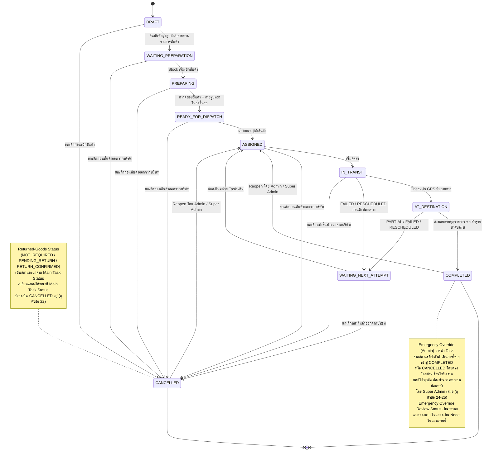

# สถานะของงานและกติกาการเปลี่ยนสถานะ

> [!summary]
> เอกสารฉบับนี้กำหนดโมเดลสถานะระดับธุรกิจ (Business-level Status Model) ของงาน Dispatch ครอบคลุม Main Task Status, Delivery Attempt Outcome, Returned-Goods Status, Emergency Override Review Status และ Timeline/Audit History โดยแยกแนวคิดทั้งห้าออกจากกันอย่างชัดเจน พร้อมกติกาการเปลี่ยนสถานะ, Transition Matrix, กรณีที่ไม่อนุญาต และตัวอย่างสถานการณ์ เอกสารฉบับนี้เป็นเอกสารระดับธุรกิจเท่านั้น **ไม่ใช่**เอกสารออกแบบฐานข้อมูล API หรือหน้าจอ

เอกสารฉบับนี้ต่อยอดจาก [[01 - เป้าหมายของระบบ Dispatch]], [[02 - Workflow การทำงานของระบบ Dispatch]] เวอร์ชัน 0.3 และ [[03 - บทบาทและสิทธิ์ผู้ใช้งาน]] เวอร์ชัน 0.4 เนื้อหาทั้งหมดต้องสอดคล้องกับการตัดสินใจทางธุรกิจที่ได้รับการอนุมัติแล้วในเอกสารทั้งสามฉบับ และจะไม่ตัดสินใจแทนเจ้าของธุรกิจในประเด็นที่ยังไม่ชัดเจน ประเด็นเหล่านั้นถูกรวบรวมไว้ในหัวข้อ [32. Open Business Decisions](#32-open-business-decisions)

> [!note] เกี่ยวกับชื่อไฟล์และลิงก์อ้างอิง
> เอกสาร [[01 - เป้าหมายของระบบ Dispatch]], [[02 - Workflow การทำงานของระบบ Dispatch]] และ [[03 - บทบาทและสิทธิ์ผู้ใช้งาน]] อ้างอิงถึงเอกสารฉบับนี้ด้วยชื่อ "04 - สถานะงาน Dispatch" ไฟล์นี้จึงกำหนด `aliases` ไว้ในส่วน Frontmatter เพื่อให้ลิงก์ภายใน Obsidian จากเอกสารทั้งสามฉบับยังคงเปิดถึงไฟล์นี้ได้ถูกต้อง โดยไม่ต้องแก้ไขไฟล์ต้นทางเหล่านั้น

## 1. วัตถุประสงค์

เอกสารฉบับนี้มีวัตถุประสงค์เพื่อ

* กำหนดสถานะหลักของงาน (Main Task Status) ในระดับธุรกิจ พร้อมความหมาย เงื่อนไขเข้า-ออก ผู้ดำเนินการตามปกติ และหลักฐานที่คาดหวังในแต่ละสถานะ
* แยกแนวคิดสถานะที่มักถูกปะปนกันออกจากกันอย่างชัดเจน ได้แก่ Main Task Status, Delivery Attempt Outcome, Returned-Goods Status, Emergency Override Review Status และ Timeline/Audit History
* กำหนดกติกาการเปลี่ยนสถานะ (State Transition Rules) ที่สอดคล้องกับ Workflow และสิทธิ์ที่ได้รับอนุมัติใน [[02 - Workflow การทำงานของระบบ Dispatch]] และ [[03 - บทบาทและสิทธิ์ผู้ใช้งาน]]
* กำหนดรายการการเปลี่ยนสถานะที่ไม่อนุญาต (Invalid Transitions) เพื่อป้องกันการตีความที่ขัดแย้งกับกฎที่อนุมัติแล้ว
* เป็นฐานอ้างอิงสำหรับการออกแบบ Status Enum, State Machine, Database Schema และ API ในระยะถัดไป

เอกสารฉบับนี้เป็นเอกสารระดับธุรกิจเท่านั้น **ไม่ใช่**เอกสารออกแบบระบบ

## 2. ขอบเขตของเอกสาร

เอกสารฉบับนี้ครอบคลุม

* นิยามสถานะหลักของงาน (Main Task Status) ระดับแนวคิดทางธุรกิจ
* นิยามผลลัพธ์ของความพยายามจัดส่งแต่ละครั้ง (Delivery Attempt Outcome)
* นิยามสถานะการรับคืนสินค้า (Returned-Goods Status)
* นิยามสถานะการทบทวน Emergency Override (Emergency Override Review Status)
* หลักการของ Timeline และ Audit Log ในฐานะประวัติที่ไม่เปลี่ยนแปลง (Immutable History)
* กติกาการเปลี่ยนสถานะปกติและกรณีข้อยกเว้น
* Transition Matrix ระดับธุรกิจ
* รายการการเปลี่ยนสถานะที่ไม่อนุญาต
* ตัวอย่างสถานการณ์ปฏิบัติการ
* ประเด็นทางธุรกิจที่ยังไม่ได้รับการยืนยัน

เอกสารฉบับนี้**ไม่ได้กำหนด**

* โครงสร้างตารางฐานข้อมูล (Database Table Design)
* Prisma Model หรือ ORM Schema
* SQL Schema
* API Endpoints
* Data Transfer Object (DTO)
* Source Code หรือ Pseudocode ของการ Implement
* การออกแบบหน้าจอ (UI Implementation)
* กลไกทางเทคนิคของการแจ้งเตือน (Notification Implementation)
* สถาปัตยกรรมการ Deploy (Deployment Architecture)
* กลไกทางเทคนิคของการยืนยันตัวตน (Authentication Implementation)

การออกแบบทางเทคนิคทั้งหมดข้างต้นจะถูกจัดทำในระยะถัดไป โดยอ้างอิงจากโมเดลสถานะระดับธุรกิจในเอกสารฉบับนี้

## 3. หลักการออกแบบสถานะ

> [!important] หลักการสำคัญที่สุดของเอกสารฉบับนี้
> **ห้ามนำเงื่อนไขเชิงปฏิบัติการทุกอย่างไปยัดรวมไว้ในฟิลด์ Task Status เพียงฟิลด์เดียว** สถานะของงาน Dispatch ต้องถูกแยกออกเป็นหลายมิติที่เป็นอิสระต่อกัน (Orthogonal Status Dimensions) เพราะแต่ละมิติตอบคำถามทางธุรกิจคนละคำถามและเปลี่ยนแปลงด้วยจังหวะเวลาที่ต่างกัน

เอกสารฉบับนี้แยกสถานะออกเป็นอย่างน้อย 5 แนวคิดที่ต้องไม่ถูกปะปนกัน

1. **Main Task Status** — สถานะหลักของงาน ตอบคำถามว่า "งานนี้อยู่ในขั้นตอนใดของ Workflow การจัดส่ง"
2. **Delivery Attempt Outcome** — ผลลัพธ์ของความพยายามจัดส่งแต่ละครั้ง ตอบคำถามว่า "ความพยายามครั้งนี้ได้ผลอย่างไร"
3. **Returned-Goods Status** — สถานะการรับคืนสินค้า ตอบคำถามว่า "สินค้าที่ต้องคืนได้รับการยืนยันแล้วหรือไม่"
4. **Emergency Override Review Status** — สถานะการทบทวน Emergency Override โดย Super Admin ตอบคำถามว่า "การปิดงานแบบฉุกเฉินครั้งนี้ผ่านการทบทวนแล้วหรือไม่"
5. **Timeline / Status History (Immutable)** — ประวัติเหตุการณ์ที่ไม่เปลี่ยนแปลง ตอบคำถามว่า "เกิดอะไรขึ้นกับงานนี้บ้างตามลำดับเวลา"

### เหตุผลที่ต้องแยกแนวคิดเหล่านี้ออกจากกัน

หากยัดทุกเงื่อนไขไว้ในฟิลด์เดียว ระบบจะไม่สามารถแทนความจริงทางธุรกิจต่อไปนี้ได้พร้อมกัน

* **งานที่ถูกยกเลิกแล้วยังมีสินค้าที่ต้องคืนค้างอยู่ได้** (Task = CANCELLED, Returned-Goods = PENDING_RETURN) — ตาม [[03 - บทบาทและสิทธิ์ผู้ใช้งาน]] หัวข้อ 18.1 การยกเลิกงานไม่ลบล้างภาระหน้าที่ในการคืนสินค้า หากยัดทั้งสองอย่างไว้ในฟิลด์เดียว ระบบจะไม่สามารถแสดงว่า "ยกเลิกแล้ว แต่สินค้ายังไม่คืน" ได้อย่างถูกต้อง
* **งานที่ปิดสำเร็จแล้วยังมี Emergency Override รอการทบทวนได้** (Task = COMPLETED, Override Review = PENDING_REVIEW) — ตาม [[03 - บทบาทและสิทธิ์ผู้ใช้งาน]] หัวข้อ 16.5 การทบทวนของ Super Admin เกิดขึ้น**ภายหลัง**จากที่ Admin ปิดงานแล้ว และไม่บล็อกการปิดงาน
* **การส่งมอบบางส่วนเป็นผลของ Attempt หนึ่งครั้ง ไม่ใช่ผลของทั้งงาน** — ตาม [[02 - Workflow การทำงานของระบบ Dispatch]] หัวข้อ 7 การส่งมอบบางส่วนเป็นสถานะระหว่างดำเนินการของความพยายามครั้งนั้น ไม่ใช่ผลลัพธ์สุดท้ายของ Task ทั้งงาน
* **การแก้ไขข้อมูลผู้รับสินค้า (Correction Action) ไม่ทำให้ Main Task Status เปลี่ยนแปลง** — ตาม [[03 - บทบาทและสิทธิ์ผู้ใช้งาน]] หัวข้อ 20.1 Correction Action ดำเนินการได้โดย Task ยังคงสถานะปิดอยู่ ไม่จำเป็นต้องเปิดงานทั้ง Task กลับมาใหม่
* **Reopen เป็นการกระทำและการเปลี่ยนสถานะที่ตรวจสอบย้อนหลังได้ ไม่ใช่การแก้ไขสถานะเดิมแบบเงียบ** — สถานะก่อนหน้า (COMPLETED หรือ CANCELLED) ต้องยังคงถูกบันทึกไว้ใน Timeline เสมอ ไม่ใช่ถูกเขียนทับหรือหายไปเมื่อ Task กลับสู่สถานะ ASSIGNED

การแยกมิติเหล่านี้ยังทำให้ Transition Rules ของแต่ละมิติเรียบง่ายและตรวจสอบได้อย่างเป็นอิสระ แทนที่จะต้องพิจารณาเงื่อนไขนับสิบข้อพร้อมกันในการเปลี่ยนสถานะครั้งเดียว

## 4. การแยก Main Status และสถานะประกอบ

ตารางต่อไปนี้สรุปกลุ่มสถานะทั้ง 5 กลุ่มที่เอกสารฉบับนี้กำหนด

| กลุ่มสถานะ | ลักษณะ | ใครเปลี่ยนแปลงได้ | เปลี่ยนพร้อมกับ Main Task Status หรือไม่ |
| --- | --- | --- | --- |
| Main Task Status | สถานะเดียวต่อ Task หนึ่งรายการ มีค่าได้ครั้งละหนึ่งค่าเท่านั้น | ตามผู้มีสิทธิ์ในแต่ละ Transition (ดูหัวข้อ 28) | เป็นแกนหลักของเอกสารฉบับนี้ |
| Delivery Attempt Outcome | มีได้หลายรายการต่อ Task หนึ่งรายการ (หนึ่งรายการต่อหนึ่งความพยายามจัดส่ง) | พนักงานส่งสินค้า / Admin (งานภายนอก) | **ไม่จำเป็น** ต้องเปลี่ยนพร้อมกันเสมอ — Attempt Outcome อาจเป็น PARTIAL ขณะที่ Main Task Status เปลี่ยนเป็น WAITING_NEXT_ATTEMPT |
| Returned-Goods Status | สถานะเดียวต่อ Task หนึ่งรายการ เป็นมิติสถานะแยกจาก Main Task Status | **Admin เป็นผู้ยืนยัน RETURN_CONFIRMED อย่างเป็นทางการแต่เพียงผู้เดียว** — Super Admin กำกับดูแล ทบทวน สืบสวน หรือสั่งการแก้ไขได้ แต่ไม่ใช่ผู้ยืนยันการรับคืนตามกฎที่อนุมัติในปัจจุบัน (ไม่มีทางลัดยืนยันสำหรับ Super Admin) | **เปลี่ยนแปลงตามปกติโดยอิสระจาก Main Task Status ไม่ทำให้ Main Task Status เปลี่ยนโดยอัตโนมัติ** — อย่างไรก็ตาม กฎข้อบังคับจากการตัดสินใจทางธุรกิจอาจตรวจสอบทั้งสองมิติร่วมกันได้ (เช่น CANCELLED + PENDING_RETURN บล็อก Reopen จนกว่า RETURN_CONFIRMED) |
| Emergency Override Review Status | สถานะเดียวต่อ Task หนึ่งรายการ เกิดขึ้นเฉพาะเมื่อมีการใช้ Emergency Override | Super Admin | **เป็นอิสระ** — เปลี่ยนได้ขณะที่ Main Task Status เป็น COMPLETED หรือ CANCELLED อยู่คงที่ |
| Timeline / Status History | บันทึกต่อเนื่อง (Append-only Log) ไม่ใช่ "สถานะ" ในความหมายที่มีค่าปัจจุบันเพียงค่าเดียว | ระบบบันทึกอัตโนมัติจากทุกการกระทำสำคัญ | บันทึกทุกการเปลี่ยนแปลงของทั้ง 4 กลุ่มข้างต้น |

> [!note]
> เอกสารฉบับนี้ไม่ได้กำหนดว่าสถานะประกอบเหล่านี้จะถูกจัดเก็บเป็นฟิลด์แยก ตารางแยก หรือกลไกทางเทคนิคใด การตัดสินใจดังกล่าวเป็นเรื่องของการออกแบบฐานข้อมูลในระยะถัดไป เอกสารฉบับนี้กำหนดเพียงว่าแนวคิดทั้งห้าต้อง**เป็นอิสระต่อกันในระดับธุรกิจ**เท่านั้น

## 5. ภาพรวม Main Task Status

Main Task Status เป็นชื่อแนวคิดทางธุรกิจ (Conceptual Business Name) **ไม่ใช่**นิยาม Enum ฐานข้อมูลที่ได้รับการยืนยันขั้นสุดท้าย โมเดลนี้ประกอบด้วย 10 สถานะ ดังนี้

| # | สถานะ | ความหมายภาษาไทย | Terminal? |
| --- | --- | --- | --- |
| 1 | DRAFT | แบบร่าง | ไม่ใช่ |
| 2 | WAITING_PREPARATION | รอจัดเตรียมสินค้า | ไม่ใช่ |
| 3 | PREPARING | กำลังจัดเตรียมสินค้า | ไม่ใช่ |
| 4 | READY_FOR_DISPATCH | พร้อมจัดส่ง | ไม่ใช่ |
| 5 | ASSIGNED | มอบหมายผู้รับผิดชอบแล้ว | ไม่ใช่ |
| 6 | IN_TRANSIT | อยู่ระหว่างนำส่ง | ไม่ใช่ |
| 7 | AT_DESTINATION | ถึงจุดหมายแล้ว | ไม่ใช่ |
| 8 | WAITING_NEXT_ATTEMPT | รอดำเนินการจัดส่งครั้งถัดไป | ไม่ใช่ |
| 9 | COMPLETED | เสร็จสิ้น | ใช่ (จนกว่าจะถูก Reopen) |
| 10 | CANCELLED | ยกเลิก | ใช่ (จนกว่าจะถูก Reopen) |

> [!note] เกี่ยวกับสถานะที่ระบุไว้ใน Topic 1
> [[01 - เป้าหมายของระบบ Dispatch]] หัวข้อ 3.8 ระบุตัวอย่างสถานะไว้ในเชิงอธิบาย (เช่น "กำลังส่งมอบ", "รอ Admin ตรวจสอบ") และระบุไว้อย่างชัดเจนว่า "เอกสารฉบับนี้จะไม่กำหนดโมเดลสถานะที่สมบูรณ์" โดยมอบหมายให้เอกสารฉบับนี้เป็นผู้กำหนดโมเดลที่เป็นทางการ โมเดล 10 สถานะข้างต้นจึงเป็นนิยามที่เป็นทางการ และมีการปรับ/รวมสถานะบางส่วนจากตัวอย่างใน Topic 1 ตามเหตุผลดังนี้
>
> * **"กำลังส่งมอบ"** ถูกรวมเข้าไว้ใน **AT_DESTINATION** เนื่องจากการส่งมอบสินค้าทั้งหมด (ส่งมอบ, บันทึกหลักฐาน, บันทึกผลการจัดส่ง) เกิดขึ้นในช่วงเวลาเดียวกันหลัง Check-in GPS ที่ปลายทางตาม [[02 - Workflow การทำงานของระบบ Dispatch]] หัวข้อ 5.11–5.14 การแยกเป็นสถานะย่อยเพิ่มเติมไม่จำเป็นในระดับ Main Task Status
> * **"รอ Admin ตรวจสอบ"** ไม่ถูกกำหนดเป็น Main Task Status เนื่องจาก [[02 - Workflow การทำงานของระบบ Dispatch]] เวอร์ชัน 0.3 (ซึ่งปรับปรุงหลัง Topic 1) กำหนดให้พนักงานส่งสินค้าภายในที่ได้รับมอบหมายปิดงานของตนเองได้โดยตรงเมื่อเงื่อนไขบังคับครบถ้วน **โดยไม่ต้องรอ Admin ตรวจสอบก่อน** (ดู [[02 - Workflow การทำงานของระบบ Dispatch]] หัวข้อ 5.16 และ [[03 - บทบาทและสิทธิ์ผู้ใช้งาน]] หัวข้อ 15.1) บทบาทผู้ตรวจสอบของ Admin จึงเป็นการตรวจสอบภายหลัง (Post-hoc Review) ที่ไม่ใช่ Main Task Status แต่เป็นกิจกรรมที่เกิดขึ้นระหว่างที่ Task เป็น COMPLETED อยู่แล้ว การเพิ่ม Main Task Status ชื่อ "รอ Admin ตรวจสอบ" หรือ `WAITING_ADMIN_REVIEW` ที่บล็อกการปิดงานปกติจะขัดแย้งกับกฎที่อนุมัติแล้วนี้โดยตรง จึงไม่ปรากฏในโมเดลนี้
> * ผลลัพธ์ "ส่งสำเร็จบางส่วน" และ "ส่งไม่สำเร็จ" ที่ปรากฏใน Topic 1 ถูกจัดเป็น **Delivery Attempt Outcome** (ดูหัวข้อ 17) ไม่ใช่ Main Task Status เนื่องจากเป็นผลของความพยายามจัดส่งครั้งหนึ่ง ไม่ใช่ผลสุดท้ายของทั้งงาน

### แผนภาพสถานะหลัก (Mermaid State Diagram)

แผนภาพต่อไปนี้แสดงเฉพาะ Main Task Status และเส้นทางการเปลี่ยนสถานะหลัก ได้แก่ เส้นทางสำเร็จตามปกติ, วงจรส่งมอบบางส่วน/ล้มเหลว/เลื่อนนัด, เส้นทางการยกเลิก และเส้นทาง Reopen สถานะประกอบ (Returned-Goods Status และ Emergency Override Review Status) แสดงเป็นหมายเหตุประกอบเท่านั้น ไม่ใช่ Node หรือ Edge ในแผนภาพ ตามหลักการแยกมิติในหัวข้อ 3–4



> [!important]
> แผนภาพนี้เป็น Mermaid Diagram เพียงแผนภาพเดียวในเอกสารฉบับนี้ ตามข้อกำหนดคุณภาพของเอกสาร

## 6. รายละเอียด DRAFT

* **ความหมายทางธุรกิจ**: งานอยู่ระหว่างเตรียมข้อมูลเบื้องต้น ยังไม่ใช่งานปฏิบัติการ ([[02 - Workflow การทำงานของระบบ Dispatch]] หัวข้อ 5.1)
* **เงื่อนไขเข้า**: Dispatcher หรือ Admin สร้างงานใหม่
* **การกระทำที่อนุญาต**: แก้ไขข้อมูลลูกค้า ปลายทาง การนัดหมาย และรายการสินค้า, บันทึกงานที่ยังไม่สมบูรณ์ไว้ก่อน, เพิ่มหรือลบรายการสินค้า
* **ผู้ดำเนินการตามปกติ**: Dispatcher หรือ Admin
* **เงื่อนไขออก**: ข้อมูลลูกค้า ปลายทาง และรายการสินค้ายืนยันครบถ้วน → WAITING_PREPARATION หรือ Admin/Super Admin ยกเลิกงาน → CANCELLED
* **เป็น Terminal หรือไม่**: ไม่ใช่
* **หลักฐานที่คาดหวัง**: ยังไม่มีหลักฐานเชิงปฏิบัติการ มีเพียงข้อมูลเบื้องต้นของงาน
* **ข้อจำกัด**: ห้ามมอบหมายผู้ส่งสินค้าขณะยังเป็น DRAFT, Stock ยังไม่เริ่มเบิกสินค้า
* **Timeline/Audit Log ที่คาดหวัง**: เหตุการณ์สร้างงาน (ผู้สร้าง, วันเวลา), เหตุการณ์แก้ไขข้อมูลระหว่างเตรียมงาน

## 7. รายละเอียด WAITING_PREPARATION

* **ความหมายทางธุรกิจ**: งานได้รับการยืนยันข้อมูลแล้วและถูกส่งต่อให้รอ Stock หรือกระบวนการเตรียมสินค้าที่รับผิดชอบ
* **เงื่อนไขเข้า**: ข้อมูลลูกค้า/ปลายทาง ([[02 - Workflow การทำงานของระบบ Dispatch]] หัวข้อ 5.2) และรายการสินค้า (หัวข้อ 5.3) ยืนยันครบถ้วนแล้ว
* **การกระทำที่อนุญาต**: Stock เตรียมคิวสำหรับการเบิกสินค้า, Admin/Dispatcher ยังคงแก้ไขข้อมูลได้ตาม [[03 - บทบาทและสิทธิ์ผู้ใช้งาน]] หัวข้อ 14.1
* **ผู้ดำเนินการตามปกติ**: Stock (เริ่มเบิกสินค้า), Admin/Dispatcher (ประสานงาน)
* **เงื่อนไขออก**: Stock เริ่มเบิกสินค้าตามรายการจริง → PREPARING หรือ Admin/Super Admin ยกเลิกงาน → CANCELLED
* **เป็น Terminal หรือไม่**: ไม่ใช่
* **หลักฐานที่คาดหวัง**: รายการสินค้าที่ต้องจัดส่งครบถ้วน, ข้อมูลปลายทางที่ยืนยันแล้ว
* **ข้อจำกัด**: ยังไม่มีการมอบหมายผู้ส่งสินค้า เนื่องจากการมอบหมายเกิดขึ้นหลังจากสินค้าผ่านการเตรียมและมีรูปภาพหลังโหลดแล้วเท่านั้น ([[02 - Workflow การทำงานของระบบ Dispatch]] หัวข้อ 5.7)
* **Timeline/Audit Log ที่คาดหวัง**: เหตุการณ์ยืนยันข้อมูลปลายทาง, เหตุการณ์ส่งงานเข้าสู่คิวเตรียมสินค้า

## 8. รายละเอียด PREPARING

* **ความหมายทางธุรกิจ**: Stock กำลังเบิก ตรวจสอบ และโหลดสินค้าขึ้นยานพาหนะอย่างจริงจัง ครอบคลุม [[02 - Workflow การทำงานของระบบ Dispatch]] หัวข้อ 5.4 (เบิกสินค้า), 5.5 (ตรวจสอบสินค้าและเอกสาร) และ 5.6 (โหลดสินค้าขึ้นรถและถ่ายรูป)
* **เงื่อนไขเข้า**: Stock เริ่มเบิกสินค้าตามรายการที่ยืนยันแล้ว
* **การกระทำที่อนุญาต**: เบิกสินค้า, ตรวจนับ, ตรวจสภาพสินค้าและบรรจุภัณฑ์, โหลดสินค้าขึ้นยานพาหนะ, ถ่ายรูปหลังโหลด (บังคับอย่างน้อย 1 รูป)
* **ผู้ดำเนินการตามปกติ**: Stock (สนับสนุนโดย Admin)
* **เงื่อนไขออก**: มีรูปภาพหลังโหลดสินค้าขึ้นรถครบเงื่อนไขบังคับ (อย่างน้อย 1 รูป) และตรวจสอบสินค้าผ่านแล้ว → READY_FOR_DISPATCH หรือ Admin/Super Admin ยกเลิกงาน → CANCELLED
* **เป็น Terminal หรือไม่**: ไม่ใช่
* **หลักฐานที่คาดหวัง**: ผลตรวจนับสินค้า, สภาพสินค้าและบรรจุภัณฑ์, รูปภาพหลังโหลดสินค้าขึ้นรถอย่างน้อย 1 รูป (บังคับ), หลักฐานเสริมตามเงื่อนไข (Serial Number, บรรจุภัณฑ์, อุปกรณ์เสริม)
* **ข้อจำกัด**: ห้ามเข้าสู่ขั้นตอนจัดส่งตามปกติหากยังไม่มีรูปภาพหลังโหลดขึ้นรถ ([[02 - Workflow การทำงานของระบบ Dispatch]] หัวข้อ 5.6); ข้อผิดพลาดที่พบระหว่างตรวจสอบต้องได้รับการแก้ไขก่อนดำเนินการต่อ (หัวข้อ 5.5); Stock ยังคงมีสิทธิ์แก้ไขข้อมูลการเตรียมสินค้าได้เต็มที่ในสถานะนี้ (Stock Edit Lock ยังไม่มีผล)
* **Timeline/Audit Log ที่คาดหวัง**: เหตุการณ์เบิกสินค้า (ผู้เบิก ผู้รับ วันเวลา), เหตุการณ์ตรวจสอบสินค้า, เหตุการณ์อัปโหลดรูปภาพหลังโหลด (ผู้อัปโหลด วันเวลา)

## 9. รายละเอียด READY_FOR_DISPATCH

* **ความหมายทางธุรกิจ**: การเตรียมสินค้าเสร็จสมบูรณ์และผ่านการตรวจสอบความพร้อมแล้ว งานพร้อมสำหรับการมอบหมายหรือจัดส่ง ครอบคลุม [[02 - Workflow การทำงานของระบบ Dispatch]] หัวข้อ 5.7 (มอบหมาย) และ 5.8 (ตรวจสอบความพร้อม)
* **เงื่อนไขเข้า**: มีรูปภาพหลังโหลดสินค้าแล้ว (บังคับ) และผลตรวจสอบสินค้าผ่านแล้วโดยไม่มีข้อผิดพลาดที่ยังไม่ได้แก้ไข
* **การกระทำที่อนุญาต**: Admin/Dispatcher มอบหมายผู้ส่งสินค้าภายในหรือภายนอก, ตรวจสอบรายการความพร้อม (Readiness Checklist)
* **ผู้ดำเนินการตามปกติ**: Dispatcher หรือ Admin
* **เงื่อนไขออก**: มอบหมายผู้ส่งสินค้าสำเร็จและผ่าน Readiness Checklist → ASSIGNED หรือ Admin/Super Admin ยกเลิกงาน → CANCELLED
* **เป็น Terminal หรือไม่**: ไม่ใช่
* **หลักฐานที่คาดหวัง**: ผลการตรวจสอบความพร้อม, รูปภาพหลังโหลดสินค้าขึ้นรถ, เอกสารที่จำเป็นครบถ้วน
* **ข้อจำกัด**: ห้ามกำหนดเงื่อนไขบังคับใหม่โดยไม่ได้รับการอนุมัติ ([[02 - Workflow การทำงานของระบบ Dispatch]] หัวข้อ 5.8); Stock ยังคงมีสิทธิ์แก้ไขข้อมูลการเตรียมสินค้าได้ เนื่องจากยังไม่ถึง IN_TRANSIT
* **Timeline/Audit Log ที่คาดหวัง**: เหตุการณ์ยืนยันความพร้อม, เหตุการณ์มอบหมายผู้ส่งสินค้า (อาจนับเป็นจุดเปลี่ยนสถานะเข้าสู่ ASSIGNED)

## 10. รายละเอียด ASSIGNED

* **ความหมายทางธุรกิจ**: มีผู้รับผิดชอบหลักของงานชัดเจนแล้ว ไม่ว่าจะเป็นพนักงานส่งสินค้าภายในหนึ่ง User Login หรือผู้ให้บริการภายนอกที่ Admin เป็นผู้บันทึกแทน แต่ยังไม่เริ่มเดินทางจริง
* **เงื่อนไขเข้า**: มอบหมายผู้ส่งสินค้าเสร็จสมบูรณ์ตามหลักการหนึ่ง Task หนึ่งผู้รับผิดชอบหลักในระบบหนึ่ง User Login ([[03 - บทบาทและสิทธิ์ผู้ใช้งาน]] หัวข้อ 3.2 และ 13) หรือได้รับมอบหมายใหม่ผ่านกระบวนการ Reopen (ดูหัวข้อ 23)
* **การกระทำที่อนุญาต**: พนักงานที่ได้รับมอบหมายตรวจสอบและยืนยันการรับงาน, เตรียมออกเดินทาง; Admin/Dispatcher อาจเปลี่ยนตัวผู้ส่งสินค้า (Reassignment) ก่อนเริ่มจัดส่งจริง
* **ผู้ดำเนินการตามปกติ**: พนักงานส่งสินค้าภายในที่ได้รับมอบหมาย หรือ Admin (สำหรับงานภายนอก)
* **เงื่อนไขออก**: ผู้ส่งกดเริ่มจัดส่ง (หรือ Admin บันทึกเริ่มจัดส่งแทนผู้ส่งภายนอก) → IN_TRANSIT หรือ Admin/Super Admin ยกเลิกงาน → CANCELLED
* **เป็น Terminal หรือไม่**: ไม่ใช่ (เป็นจุดที่ Task กลับเข้ามาอีกครั้งได้จาก Reopen)
* **หลักฐานที่คาดหวัง**: บันทึกผู้รับผิดชอบหลัก, วันเวลาที่มอบหมาย
* **ข้อจำกัด**: ห้ามใช้บัญชีผู้ใช้งานร่วมกัน (Shared Login), หนึ่ง Task มีผู้รับผิดชอบหลักได้เพียงหนึ่ง User Login เท่านั้น; Stock ยังคงแก้ไขข้อมูลเตรียมสินค้าได้จนกว่าจะเริ่มจัดส่งจริง (Stock Edit Lock เริ่มมีผลที่ IN_TRANSIT)
* **Timeline/Audit Log ที่คาดหวัง**: เหตุการณ์มอบหมายงาน, เหตุการณ์เปลี่ยนตัวผู้ส่งสินค้า (ถ้ามี), เหตุการณ์มอบหมายใหม่หลัง Reopen (ถ้ามี)

## 11. รายละเอียด IN_TRANSIT

* **ความหมายทางธุรกิจ**: เริ่มเดินทางหรือออกจากจุดเตรียมสินค้าแล้ว ครอบคลุม [[02 - Workflow การทำงานของระบบ Dispatch]] หัวข้อ 5.9 (เริ่มจัดส่ง) และ 5.10 (เดินทางไปยังปลายทาง)
* **เงื่อนไขเข้า**: ผู้ส่งสินค้ากดเริ่มจัดส่งในระบบ (บันทึกเฉพาะวันและเวลาที่เริ่มจริง **ไม่มีการบันทึกพิกัด GPS** ในขั้นตอนนี้)
* **การกระทำที่อนุญาต**: เดินทางไปยังปลายทาง, เข้าถึงข้อมูลปลายทางและข้อมูลติดต่อลูกค้า, รายงานปัญหาระหว่างทาง
* **ผู้ดำเนินการตามปกติ**: พนักงานส่งสินค้าภายใน หรือ Admin (บันทึกแทนผู้ส่งภายนอก)
* **เงื่อนไขออก**: เดินทางถึงปลายทางและ Check-in GPS สำเร็จ → AT_DESTINATION; ไม่สามารถเดินทางถึงปลายทางได้ตามแผน (เช่น ยานพาหนะขัดข้อง ที่อยู่ไม่ถูกต้อง ลูกค้าขอเลื่อนระหว่างทาง) → WAITING_NEXT_ATTEMPT โดยไม่ต้องผ่าน AT_DESTINATION; หรือ Admin/Super Admin ยกเลิกงาน → CANCELLED
* **เป็น Terminal หรือไม่**: ไม่ใช่
* **หลักฐานที่คาดหวัง**: เวลาที่เริ่มจัดส่งจริง, หมายเหตุปัญหาระหว่างทาง (ถ้ามี)
* **ข้อจำกัด**: **Stock Edit Lock เริ่มมีผลตั้งแต่จุดนี้เป็นต้นไป** — Stock ไม่มีสิทธิ์แก้ไข เพิ่ม หรือเขียนทับข้อมูลการเตรียมสินค้าอีกต่อไป ([[03 - บทบาทและสิทธิ์ผู้ใช้งาน]] หัวข้อ 14.2, ดูหัวข้อ 27); ไม่มีการใช้ Geofence หรือการตรวจสอบระยะห่างในขั้นตอนนี้หรือขั้นตอนถัดไป
* **Timeline/Audit Log ที่คาดหวัง**: เหตุการณ์เริ่มจัดส่ง (ผู้เริ่ม วันเวลา), เหตุการณ์รายงานปัญหาระหว่างทาง (ถ้ามี)

## 12. รายละเอียด AT_DESTINATION

* **ความหมายทางธุรกิจ**: เดินทางถึงปลายทางแล้วและทำการ Check-in GPS สำเร็จ ครอบคลุม [[02 - Workflow การทำงานของระบบ Dispatch]] หัวข้อ 5.11 (Check-in GPS), 5.12 (ส่งมอบสินค้า), 5.13 (บันทึกหลักฐานการส่งมอบ) และ 5.14 (บันทึกผลการจัดส่ง)
* **เงื่อนไขเข้า**: Check-in GPS ที่ปลายทางสำเร็จ (บังคับสำหรับการจัดส่งทุกกรณี ไม่มี Geofence และไม่มีการตรวจสอบระยะห่าง)
* **การกระทำที่อนุญาต**: ส่งมอบสินค้าให้ผู้รับ, บันทึกจำนวนที่ส่งมอบจริง, อัปโหลดรูปหลักฐานการส่งมอบ, บันทึกชื่อและเบอร์โทรผู้รับสินค้า, เก็บลายเซ็นลูกค้า, บันทึกผลการจัดส่ง
* **ผู้ดำเนินการตามปกติ**: พนักงานส่งสินค้าภายใน หรือ Admin (บันทึกแทนผู้ส่งภายนอก)
* **เงื่อนไขออก**: ส่งมอบครบทุกรายการและหลักฐานบังคับครบถ้วน (Attempt Outcome = SUCCESS) → COMPLETED; ส่งมอบได้เพียงบางส่วนหรือลูกค้าปฏิเสธ/ขอเลื่อนที่ปลายทาง (Attempt Outcome = PARTIAL / FAILED / RESCHEDULED) → WAITING_NEXT_ATTEMPT
* **เป็น Terminal หรือไม่**: ไม่ใช่
* **หลักฐานที่คาดหวัง**: พิกัด GPS และเวลา Check-in, รูปหลักฐานการส่งมอบอย่างน้อย 1 รูป, ชื่อผู้รับสินค้า, หมายเลขโทรศัพท์ผู้รับสินค้า, ลายเซ็นลูกค้า, จำนวนที่ส่งมอบจริง (ทั้งหมดเป็นเงื่อนไขบังคับ)
* **ข้อจำกัด**: ห้ามปิดงานเป็นผลสำเร็จหากส่งมอบไม่ครบทุกรายการหรือหลักฐานบังคับข้อใดข้อหนึ่งยังขาดอยู่ เว้นแต่ผ่าน Emergency Override
* **Timeline/Audit Log ที่คาดหวัง**: เหตุการณ์ Check-in, เหตุการณ์บันทึกหลักฐานการส่งมอบ, เหตุการณ์บันทึกผลการจัดส่ง

## 13. รายละเอียด WAITING_NEXT_ATTEMPT

* **ความหมายทางธุรกิจ**: ความพยายามจัดส่งครั้งปัจจุบันยังไม่เสร็จสมบูรณ์ (PARTIAL, FAILED หรือ RESCHEDULED) และ Task เดิมกำลังรอความพยายามจัดส่งครั้งถัดไป ครอบคลุม [[02 - Workflow การทำงานของระบบ Dispatch]] หัวข้อ 7, 8 และ 10
* **เงื่อนไขเข้า**: Delivery Attempt Outcome ของความพยายามล่าสุดเป็น PARTIAL, FAILED หรือ RESCHEDULED ไม่ว่าจะเกิดขึ้นที่ AT_DESTINATION หรือระหว่าง IN_TRANSIT
* **การกระทำที่อนุญาต**: Admin/Dispatcher ประสานงานนัดส่งใหม่โดยใช้ Task เดิม, พิจารณาการนำสินค้ากลับบริษัท, พิจารณาการเปลี่ยนสินค้าที่เสียหายหรือขาดหาย, พนักงานส่งสินค้ารายงานผลและจำนวนสินค้าที่นำกลับ
* **ผู้ดำเนินการตามปกติ**: Dispatcher/Admin (ประสานงานนัดใหม่), พนักงานส่งสินค้า (รายงานผล)
* **เงื่อนไขออก**: มอบหมาย/ยืนยันผู้ส่งสำหรับความพยายามครั้งถัดไป → ASSIGNED; หรือไม่สามารถดำเนินการส่งสินค้าที่เหลือได้จริง → CANCELLED ผ่าน Workflow การยกเลิกงาน
* **เป็น Terminal หรือไม่**: ไม่ใช่ (เป็นสถานะระหว่างดำเนินการเสมอ)
* **หลักฐานที่คาดหวัง**: เหตุผลของ PARTIAL/FAILED/RESCHEDULED, จำนวนที่ส่งมอบจริงและจำนวนคงเหลือ, ข้อมูลการนำสินค้ากลับ (ถ้ามี)
* **ข้อจำกัด**: **ห้ามปิดงานเป็นผลสำเร็จจากสถานะนี้โดยเด็ดขาด** เป็นสถานะระหว่างดำเนินการ (Intermediate State) เสมอ ไม่ใช่ผลลัพธ์สุดท้าย ([[02 - Workflow การทำงานของระบบ Dispatch]] หัวข้อ 7); ต้องรักษาประวัติของทุก Delivery Attempt ก่อนหน้าไว้ครบถ้วน ห้ามลบทิ้ง
* **Timeline/Audit Log ที่คาดหวัง**: เหตุการณ์บันทึกผล Attempt (PARTIAL/FAILED/RESCHEDULED), เหตุการณ์นัดส่งใหม่, เหตุการณ์รายงานการนำสินค้ากลับ (ถ้ามี)

## 14. รายละเอียด COMPLETED

* **ความหมายทางธุรกิจ**: งานถูกปิดแล้วด้วยผลลัพธ์สุดท้ายที่ได้รับอนุมัติ ไม่ว่าจะเป็นการปิดงานตามปกติหรือผ่าน Emergency Override
* **เงื่อนไขเข้า**: (ก) เส้นทางปกติ — เงื่อนไขบังคับก่อนปิดงานครบทุกข้อจาก AT_DESTINATION และผู้มีสิทธิ์ปิดงานที่เหมาะสมดำเนินการปิดงาน; (ข) เส้นทางข้อยกเว้น — Admin ใช้ Emergency Override ปิดงานแทนพนักงาน หรือ Super Admin ปิด Task ที่ถูก Reopen โดยตรง
* **การกระทำที่อนุญาต**: อ่านข้อมูลได้ (Read-only) สำหรับผู้ใช้งานทั่วไป, Correction Action ต่อข้อมูลผู้รับสินค้าโดย Admin/Super Admin, การตรวจสอบภายหลัง (Post-hoc Review) โดย Admin/Super Admin
* **ผู้ดำเนินการตามปกติ**: พนักงานส่งสินค้าภายในที่ได้รับมอบหมาย (เส้นทางปกติ), Admin (งานภายนอก หรือ Emergency Override), Super Admin (ปิด Reopened Task โดยตรง)
* **เงื่อนไขออก**: เป็น Terminal ตามปกติ; ออกได้เฉพาะผ่านกระบวนการ Reopen โดย Admin หรือ Super Admin → ASSIGNED
* **เป็น Terminal หรือไม่**: ใช่ (จนกว่าจะถูก Reopen)
* **หลักฐานที่คาดหวัง**: หลักฐานส่งมอบครบตามเงื่อนไขบังคับ (เส้นทางปกติ) หรือเครื่องหมาย Emergency Override Flag พร้อมรายการเงื่อนไขที่ถูกข้าม (เส้นทางข้อยกเว้น)
* **ข้อจำกัด**: **Returned-Goods Status และ Emergency Override Review Status เป็นมิติสถานะแยกจาก Main Task Status** — โดยปกติเปลี่ยนแปลงอิสระและไม่ทำให้ Main Task Status เปลี่ยนโดยอัตโนมัติ อย่างไรก็ตาม กฎข้อบังคับจากการตัดสินใจทางธุรกิจอาจตรวจสอบมิติต่างๆ ร่วมกันได้ (เช่น Task อาจเป็น COMPLETED ขณะ Emergency Override Review Status = PENDING_REVIEW ([[03 - บทบาทและสิทธิ์ผู้ใช้งาน]] หัวข้อ 16.5); แต่ CANCELLED + Returned-Goods = PENDING_RETURN บล็อก Reopen จนกว่าจะยืนยันคืนสินค้า); ห้ามแก้ไขข้อมูลใด ๆ นอกเหนือจาก Correction Action ที่มีการควบคุม
* **Timeline/Audit Log ที่คาดหวัง**: เหตุการณ์ปิดงาน (ผู้ปิด วันเวลา ผลลัพธ์), เหตุการณ์ Correction Action (ถ้ามี), เหตุการณ์ทบทวน Override (ถ้ามี)

## 15. รายละเอียด CANCELLED

* **ความหมายทางธุรกิจ**: งานถูกยกเลิกโดย Admin หรือ Super Admin
* **เงื่อนไขเข้า**: Admin/Super Admin ยกเลิกงานพร้อมเหตุผลบังคับ จากสถานะที่กำลังดำเนินการใด ๆ ก่อนปิดงานสำเร็จ (DRAFT ถึง WAITING_NEXT_ATTEMPT)
* **การกระทำที่อนุญาต**: อ่านข้อมูลได้ (Read-only), Admin ยืนยันรับคืนสินค้าเมื่อเกี่ยวข้อง (Situation B), Admin/Super Admin เปิดงานกลับมาแก้ไข (Reopen) เมื่อจำเป็น
* **ผู้ดำเนินการตามปกติ**: Admin หรือ Super Admin
* **เงื่อนไขออก**: เป็น Terminal ตามปกติ; ออกได้เฉพาะผ่านกระบวนการ Reopen โดย Admin หรือ Super Admin → ASSIGNED
* **เป็น Terminal หรือไม่**: ใช่ (จนกว่าจะถูก Reopen)
* **หลักฐานที่คาดหวัง**: เหตุผลการยกเลิก (บังคับ), สถานะของสินค้าขณะยกเลิก, Returned-Goods Status ที่เกี่ยวข้อง
* **ข้อจำกัด**: การยกเลิกงานไม่ลบล้างภาระหน้าที่ในการคืนสินค้า หากสินค้าออกจากบริษัทไปแล้ว ([[03 - บทบาทและสิทธิ์ผู้ใช้งาน]] หัวข้อ 18.1); CANCELLED ไม่ได้หมายความว่าสินค้าได้รับการคืนแล้ว การยืนยันรับคืนเป็นกระบวนการแยกต่างหาก (ดูหัวข้อ 22)
* **Timeline/Audit Log ที่คาดหวัง**: เหตุการณ์ยกเลิกงาน (ผู้ยกเลิก เหตุผล สถานะก่อนหน้า วันเวลา), เหตุการณ์ยืนยันรับคืนสินค้าที่ตามมา (ถ้ามี)

## 16. Workflow ปกติ

เส้นทางการเปลี่ยนสถานะที่สำเร็จตามปกติมีดังนี้

```text
DRAFT
→ WAITING_PREPARATION
→ PREPARING
→ READY_FOR_DISPATCH
→ ASSIGNED
→ IN_TRANSIT
→ AT_DESTINATION
→ COMPLETED
```

> [!important]
> เส้นทางข้างต้นคือ**เส้นทางสำเร็จตามปกติ (Normal Successful Path) เท่านั้น ไม่ใช่เส้นทางเดียวที่เป็นไปได้** งานอาจเข้าสู่ WAITING_NEXT_ATTEMPT ได้จาก AT_DESTINATION หรือ IN_TRANSIT, อาจถูกยกเลิกได้จากเกือบทุกสถานะที่กำลังดำเนินการ, และอาจกลับเข้าสู่ ASSIGNED ได้อีกครั้งผ่าน Reopen แม้จะเคยเป็น COMPLETED หรือ CANCELLED มาแล้ว ดูรายละเอียดเส้นทางทั้งหมดใน [28. Transition Matrix](#28-transition-matrix) และแผนภาพในหัวข้อ [5](#5-ภาพรวม-main-task-status)

ความหมายของแต่ละขั้นตอนในเส้นทางปกติ

* **DRAFT**: ข้อมูลงานกำลังถูกเตรียม ยังไม่ใช่งานปฏิบัติการ
* **WAITING_PREPARATION**: งานถูกส่งต่อและรอ Stock หรือกระบวนการเตรียมสินค้าที่รับผิดชอบ
* **PREPARING**: Stock กำลังเตรียมสินค้าอย่างจริงจัง
* **READY_FOR_DISPATCH**: การเตรียมสินค้าได้รับการยืนยันแล้วและงานพร้อมสำหรับการมอบหมายหรือจัดส่ง
* **ASSIGNED**: มีผู้ใช้งานหลักหนึ่งบัญชี (Login) หรือบันทึกผู้ให้บริการภายนอกที่รับผิดชอบได้รับการมอบหมายแล้ว
* **IN_TRANSIT**: สินค้าออกจากจุดเตรียมสินค้าแล้วหรือการจัดส่งเริ่มต้นอย่างเป็นทางการแล้ว
* **AT_DESTINATION**: ฝ่ายผู้จัดส่งเดินทางถึงปลายทางแล้ว
* **COMPLETED**: งานถูกปิดด้วยผลลัพธ์สุดท้ายที่ได้รับอนุมัติ

### เงื่อนไขบังคับสำหรับงานส่งสินค้าภายในปัจจุบัน

* Destination GPS Check-in เป็นเงื่อนไขบังคับก่อนการปิดงานตามปกติ
* ไม่มีข้อกำหนด GPS ขณะเริ่มจัดส่ง
* ไม่มีข้อกำหนด Geofence ใน Phase 1
* ห้ามกำหนดเกณฑ์ระยะทาง คำเตือน GPS หรือกฎบล็อกจาก GPS ขึ้นใหม่โดยไม่ได้รับการอนุมัติ
* ต้องมีรูปภาพหลังโหลดสินค้าขึ้นยานพาหนะ (บังคับ)
* ต้องมีรูปหลักฐานการส่งมอบ (บังคับ)
* ต้องมีชื่อผู้รับสินค้า (บังคับ)
* ต้องมีหมายเลขโทรศัพท์ผู้รับสินค้า (บังคับ)
* ต้องมีลายเซ็นลูกค้า (บังคับ)
* ต้องส่งมอบสินค้าครบทุกรายการจึงจะปิดงานเป็นผลสำเร็จตามปกติได้

## 17. Delivery Attempt Outcome

หนึ่ง Task อาจมีความพยายามจัดส่ง (Delivery Attempt) ได้หลายครั้ง

> [!important]
> **ห้ามสร้างงานใหม่เพียงเพราะ** การส่งมอบเป็นเพียงบางส่วน, การส่งมอบล้มเหลว, ลูกค้าขอเลื่อนนัด หรือจำเป็นต้องมีความพยายามจัดส่งครั้งถัดไป ต้องใช้ Task เดิมเสมอและรักษาประวัติของทุก Delivery Attempt ไว้ครบถ้วน ([[02 - Workflow การทำงานของระบบ Dispatch]] หัวข้อ 10)

### ผลลัพธ์เชิงแนวคิดของความพยายามจัดส่งแต่ละครั้ง

| Attempt Outcome | ความหมาย |
| --- | --- |
| SUCCESS | ส่งมอบสินค้าที่จำเป็นทั้งหมดสำเร็จในความพยายามครั้งนี้ |
| PARTIAL | ส่งมอบสินค้าได้เพียงบางส่วนเท่านั้น |
| FAILED | ไม่สามารถส่งมอบสินค้าได้สำเร็จในความพยายามครั้งนี้ |
| RESCHEDULED | การจัดส่งถูกเลื่อนไปยังวันหรือเวลาอื่น |

### ความสัมพันธ์กับ Main Task Status

* Delivery Attempt Outcome และ Main Task Status เป็นแนวคิดที่แยกจากกัน (ดูหัวข้อ 3–4)
* PARTIAL, FAILED และ RESCHEDULED โดยปกติจะนำ Main Task Status เข้าสู่ WAITING_NEXT_ATTEMPT
* ทุกความพยายามต้องรักษา ผู้กระทำการ, เวลา, หลักฐาน, จำนวน, ข้อมูลผู้รับสินค้า (เมื่อเกี่ยวข้อง), เหตุผล และผลลัพธ์ของตนเองไว้ครบถ้วน
* ความพยายามครั้งก่อนหน้าต้อง**ไม่ถูกเขียนทับ**โดยความพยายามครั้งถัดไป
* ความพยายามครั้งถัดไปต้องสร้างเป็นบันทึกความพยายามใหม่ในระดับแนวคิดของ Workflow เอกสารฉบับนี้ไม่ได้ออกแบบโครงสร้างฐานข้อมูลของการจัดเก็บ Attempt

### ความล้มเหลวที่เกิดขึ้นก่อนถึงปลายทาง

> [!note]
> ความล้มเหลวหรือการเลื่อนนัดไม่จำเป็นต้องเกิดขึ้นที่ AT_DESTINATION เสมอไป [[02 - Workflow การทำงานของระบบ Dispatch]] หัวข้อ 5.10 และ 8 ระบุตัวอย่างปัญหาที่เกิดขึ้นระหว่างเดินทาง เช่น ยานพาหนะขัดข้อง ที่อยู่ไม่ถูกต้อง หรือลูกค้าขอเลื่อนเวลาระหว่างทาง ซึ่งไม่มีการ Check-in GPS เกิดขึ้น ดังนั้น FAILED และ RESCHEDULED จึงเกิดขึ้นได้ทั้งจาก IN_TRANSIT (ก่อนถึงปลายทาง) และจาก AT_DESTINATION (หลังถึงปลายทางแล้ว)

### เส้นทางความพยายามจัดส่งซ้ำตามปกติ

```text
AT_DESTINATION
→ WAITING_NEXT_ATTEMPT
→ ASSIGNED
→ IN_TRANSIT
→ AT_DESTINATION
```

หนึ่ง Task อาจวนซ้ำเส้นทางนี้ได้มากกว่าหนึ่งรอบ จนกว่าจะส่งมอบสินค้าครบทุกรายการหรือถูกยกเลิก

## 18. งานส่งภายใน

สำหรับพนักงานส่งสินค้าภายใน

* พนักงานที่ได้รับมอบหมายเป็นผู้เริ่มการจัดส่งตามปกติ
* พนักงานที่ได้รับมอบหมายเป็นผู้ทำ Destination GPS Check-in
* พนักงานที่ได้รับมอบหมายเป็นผู้บันทึกหลักฐานที่จำเป็น
* พนักงานที่ได้รับมอบหมายเป็นผู้บันทึกจำนวนที่ส่งมอบจริงและผลการจัดส่งสุดท้าย
* พนักงานที่ได้รับมอบหมายเป็นผู้ปิด Task ของตนเองตามปกติ
* หนึ่ง Task มีผู้รับผิดชอบหลักหนึ่ง User Login เท่านั้น
* พนักงานที่ร่วมปฏิบัติงานจัดส่งในทางกายภาพ (Physical Assisting Employee) อาจร่วมเดินทางได้
* ห้ามใช้บัญชีผู้ใช้งานร่วมกัน (Shared Login Credential) ไม่ว่ากรณีใด
* พนักงานที่ร่วมปฏิบัติงานสนับสนุนไม่ได้กลายเป็นผู้ปิด Task โดยอัตโนมัติ
* กฎการบันทึกพนักงานที่ร่วมเดินทาง (Co-traveler) อย่างละเอียดยังคงเป็นประเด็นทางธุรกิจที่ยังไม่ได้รับการยืนยัน (ดูหัวข้อ 32)

การปิดงานตามปกติจาก AT_DESTINATION ไปยัง COMPLETED ต้องผ่านเงื่อนไขบังคับก่อนปิดงานทั้งหมด (ดูหัวข้อ 12 และ 16)

## 19. External Courier

ผู้ส่งสินค้าภายนอกไม่มีสิทธิ์เข้าถึงระบบ Dispatch โดยตรงใน Phase 1

สำหรับงานที่ใช้ผู้ส่งสินค้าภายนอก

* Admin หรือ Dispatcher อาจมอบหมายผู้ส่งสินค้าภายนอกในเชิงปฏิบัติการตามสิทธิ์ที่กำหนดใน [[03 - บทบาทและสิทธิ์ผู้ใช้งาน]]
* Admin เป็นผู้บันทึกหลักฐานและผลลัพธ์เชิงปฏิบัติการที่ได้รับจากผู้ส่งสินค้าภายนอก
* Admin เป็นผู้ปิดงานในระบบสำหรับงานประเภทนี้เสมอ
* ผู้ส่งสินค้าภายนอกต้อง**ไม่ถูกแทนความหมายว่าเป็นผู้กระทำการที่ยืนยันตัวตนแล้วในระบบ (Authenticated System Actor)**

เอกสารฉบับนี้แยกความแตกต่างระหว่างบุคคล/บทบาทสามกลุ่มเสมอ

1. **ฝ่ายผู้จัดส่งทางกายภาพ (Physical Delivery Party)** — ผู้ปฏิบัติงานจัดส่งจริง
2. **ผู้ให้บริการภายนอกที่ได้รับมอบหมาย (Assigned External Courier)** — บันทึกในระบบเป็นข้อมูลของ Task
3. **Admin ผู้กระทำการที่ยืนยันตัวตนแล้วในระบบ (Authenticated Admin System Actor)** — ผู้บันทึกข้อมูลและปิดงานแทน

สถานะของงานประเภทนี้ยังคงสอดคล้องในเชิงแนวคิดกับงานภายในเท่าที่เป็นไปได้ (ผ่านทั้ง 10 Main Task Status เดียวกัน) โดยไม่มีการกำหนดบทบาทผู้ใช้งานหรือบัญชีเข้าสู่ระบบใหม่สำหรับผู้ส่งสินค้าภายนอก

## 20. Partial / Failed / Rescheduled

### การส่งมอบบางส่วน (PARTIAL)

```text
ส่งมอบบางส่วน
→ บันทึกจำนวนส่งจริง
→ ระบุสินค้าคงเหลือ
→ ระบุเหตุผล
→ แนบหลักฐาน
→ Task ยังคงเปิด (Main Task Status = WAITING_NEXT_ATTEMPT)
→ ใช้ Task เดิมสำหรับ Delivery Attempt ถัดไป
→ เก็บประวัติ Attempt เดิม
→ ส่งสินค้าที่เหลือ
→ ปิดงานเมื่อส่งครบเท่านั้น
```

### การส่งไม่สำเร็จ (FAILED)

ความพยายามที่ล้มเหลวยังคงถูกบันทึกไว้เป็นส่วนหนึ่งของประวัติ Delivery Attempt ภายใต้ Task เดิม ไม่ลบทิ้ง Task ห้ามปิดงานเป็นผลสำเร็จหลังความพยายามล้มเหลว เว้นแต่ความพยายามครั้งถัดไปจะส่งมอบสินค้าครบตามเงื่อนไขบังคับทั้งหมด

### การเลื่อนนัด (RESCHEDULED)

การนัดส่งใหม่ต้องดำเนินการภายใต้ Task เดิมเสมอ ห้ามสร้างงานใหม่ที่เชื่อมโยงกันสำหรับสินค้าส่วนที่เหลือ การนัดหมายใหม่แต่ละครั้งควรบันทึกวันที่วางแผนใหม่ ช่วงเวลานัดหมายใหม่ เหตุผล และผู้อนุมัติการนัดใหม่

> [!important]
> การส่งมอบบางส่วนเป็นสถานะระหว่างดำเนินการ (Intermediate State) เท่านั้น **ไม่ใช่ผลลัพธ์สุดท้ายที่อนุมัติให้ปิดงานได้** ห้ามปิดงานที่มีรายการสินค้าค้างส่งเป็นผลสำเร็จหรือเป็นผลลัพธ์สุดท้ายใด ๆ ไม่ว่ากรณีใด นอกเหนือจาก Emergency Override

## 21. Cancellation

Admin และ Super Admin อาจยกเลิกงาน (Cancel) เมื่อมีเหตุผลรองรับ **Dispatcher ไม่มีสิทธิ์ยกเลิกงาน** ทำได้เพียงร้องขอเท่านั้น

### สถานการณ์ A: ยกเลิกก่อนสินค้าออกจากจุดเตรียมสินค้า

* Main Task Status เปลี่ยนเป็น CANCELLED
* Returned-Goods Status โดยปกติเป็น **NOT_REQUIRED**
* เหตุผลการยกเลิกเป็นข้อบังคับ
* ต้องบันทึกผู้กระทำการ วันเวลา สถานะก่อนหน้า และเหตุผลการยกเลิก

### สถานการณ์ B: ยกเลิกหลังสินค้าออกจากจุดเตรียมสินค้าแล้ว

* Main Task Status เปลี่ยนเป็น CANCELLED
* งานไม่หายไปจากระบบ ยังคงค้นหาและตรวจสอบย้อนหลังได้
* Returned-Goods Status โดยปกติเปลี่ยนเป็น **PENDING_RETURN**
* การยกเลิกไม่ลบล้างภาระหน้าที่ในการคืนสินค้าที่ยังไม่ได้ส่งมอบ
* Admin ต้องยืนยันการรับคืนสินค้าในภายหลัง
* เหตุผลการยกเลิกเป็นข้อบังคับ
* Timeline และ Audit Log ต้องรักษาประวัติทั้งหมดไว้ครบถ้วน

> [!important]
> **การยกเลิกงานหลังสินค้าออกจากจุดเตรียมสินค้าแล้วไม่ต้องขออนุมัติสองชั้น (Dual Approval)** Admin หรือ Super Admin อาจยกเลิกงานได้โดยตรงภายใต้โมเดลอำนาจที่ได้รับอนุมัติแล้ว ([[03 - บทบาทและสิทธิ์ผู้ใช้งาน]] หัวข้อ 18)

การยกเลิกงาน**ไม่ถือว่ายืนยันการคืนสินค้าโดยอัตโนมัติ** การยืนยันการคืนสินค้าเป็นกระบวนการแยกต่างหากที่ดำเนินการโดย Admin เท่านั้น (ดูหัวข้อ 22)

## 22. Returned-Goods Status

Returned-Goods Status เป็นมิติสถานะแยกจาก Main Task Status โดยปกติเปลี่ยนแปลงอิสระและไม่ทำให้ Main Task Status เปลี่ยนโดยอัตโนมัติ อย่างไรก็ตาม กฎข้อบังคับจากการตัดสินใจทางธุรกิจอาจตรวจสอบทั้งสองมิติร่วมกันได้ (ดูหัวข้อ 3–4)

| Returned-Goods Status | ความหมาย |
| --- | --- |
| NOT_REQUIRED | ไม่มีภาระหน้าที่ในการคืนสินค้าเกิดขึ้น ณ ขณะนี้ |
| PENDING_RETURN | สินค้าหรือสินค้าคงเหลือต้องถูกส่งคืนและยังไม่ได้รับการยืนยัน |
| RETURN_CONFIRMED | Admin ยืนยันแล้วว่าได้รับสินค้าที่ถูกส่งคืน |

* Stock อาจรายงานความไม่ตรงกันหรือปัญหาที่พบระหว่างการตรวจนับหรือการรับคืนสินค้าในเชิงปฏิบัติการ (บทบาทสนับสนุนด้านการตรวจสอบ/ตรวจนับเท่านั้น ไม่ใช่ผู้ยืนยัน)
* **Admin เป็นผู้ดำเนินการยืนยันการรับคืนสินค้าอย่างเป็นทางการในระบบและเปลี่ยน Returned-Goods Status เป็น RETURN_CONFIRMED แต่เพียงผู้เดียว** ([[02 - Workflow การทำงานของระบบ Dispatch]] หัวข้อ 9, [[03 - บทบาทและสิทธิ์ผู้ใช้งาน]] หัวข้อ 19)
* **ก่อน RETURN_CONFIRMED ต้องมี Core Return Record ตาม BDR-RETURN-002 Option C ที่อนุมัติเมื่อ 2026-07-21** ได้แก่ source Task, source Delivery Attempt, expected returned quantity, actual returned quantity, returned-item condition, shortage/damage details เมื่อมี, confirming Admin, confirmation timestamp, Timeline และ Audit Log และต้องมี additional evidence เมื่อมี Risk Trigger โดยไม่ตัดสิน BDR-RETURN-007 หรือ BDR-RETURN-009
* **Super Admin ไม่ใช่ผู้ยืนยัน RETURN_CONFIRMED ตามปกติ** Super Admin อาจกำกับดูแล ทบทวน สืบสวน หรือสั่งการให้ Admin ดำเนินการเพิ่มเติมเกี่ยวกับการคืนสินค้าได้ (เช่น ผ่านกลไก Retrospective Review ในหัวข้อ 25 หรือการ Reopen ในหัวข้อ 23) แต่เอกสารฉบับนี้**ไม่ได้มอบอำนาจยืนยันการรับคืนสินค้าให้ Super Admin เป็นทางลัดปฏิบัติการ (Confirmation Bypass) ใหม่** ตามกฎที่อนุมัติในปัจจุบัน
* Task ที่เป็น CANCELLED อาจคงสถานะ CANCELLED อยู่ ในขณะที่ Returned-Goods Status เปลี่ยนจาก PENDING_RETURN เป็น RETURN_CONFIRMED
* การยืนยันรับคืนสินค้า**ไม่ทำให้ Task ถูกเปิดกลับมาแก้ไข (Reopen)**
* การยืนยันรับคืนสินค้าต้องปรากฏใน Timeline และ Audit Log เสมอ
* ประเด็นว่าการยกเลิกงานสร้างรายการติดตามการคืนสินค้าโดยอัตโนมัติหรือไม่ ยังเป็นประเด็นเปิด (ดูหัวข้อ 32)

> [!important] อนุมัติ 2026-07-20 — BDR-RETURN-003 Option A
> **Task ที่ CANCELLED และ Returned-Goods Status = PENDING_RETURN ห้าม Reopen โดยเด็ดขาด** ไม่ว่าผู้กระทำการจะเป็น Admin หรือ Super Admin — ไม่มีข้อยกเว้นสำหรับบทบาทใด จนกว่า Admin จะยืนยันรับคืนสินค้าและ Returned-Goods Status เปลี่ยนเป็น RETURN_CONFIRMED ก่อน การยืนยัน RETURN_CONFIRMED **ไม่ทำให้เกิด Reopen โดยอัตโนมัติ** — Admin หรือ Super Admin ต้องดำเนินการ Reopen แยกต่างหากตามเงื่อนไขปกติในหัวข้อ [23](#23-reopen) เสมอ รายละเอียดเพิ่มเติมดูหัวข้อ 23

## 23. Reopen

Admin และ Super Admin อาจเปิดงานที่ปิดสมบูรณ์แล้วกลับมาแก้ไข (Reopen) ตามสิทธิ์ที่กำหนดใน [[03 - บทบาทและสิทธิ์ผู้ใช้งาน]] **Dispatcher ไม่มีสิทธิ์ Reopen** ทำได้เพียงร้องขอเท่านั้น

การ Reopen ต้อง

* **หาก Task เป็น CANCELLED ต้องมี Returned-Goods Status ≠ PENDING_RETURN ก่อนเสมอ** (ต้องเป็น NOT_REQUIRED หรือ RETURN_CONFIRMED) — บังคับใช้กับทั้ง Admin และ Super Admin โดยไม่มีข้อยกเว้น (อนุมัติ 2026-07-20 — BDR-RETURN-003 Option A, ดูหัวข้อ 22)
* รักษาสถานะสุดท้ายก่อนหน้าไว้ (COMPLETED หรือ CANCELLED)
* รักษาหลักฐานเดิมทั้งหมดไว้
* **รักษาประวัติ Returned-Goods ทั้งหมดไว้ครบถ้วนเสมอ ห้ามเขียนทับหรือลบ (No Overwrite / No Removal)** ครอบคลุมอย่างน้อย: การประกาศคืนสินค้า (Return Declaration), การเปลี่ยนแปลง Returned-Goods Status ก่อนหน้าทุกครั้ง, ผู้กระทำการที่ยืนยัน (Confirming Actor), วันและเวลาที่ยืนยัน (Confirmation Timestamp), จำนวนสินค้าที่คืน (Returned Quantity), สภาพสินค้าที่คืน (Returned Condition), Task และ Delivery Attempt ที่เกี่ยวข้อง, และการอ้างอิง Timeline และ Audit Log ที่เกี่ยวข้องทั้งหมด — การ Reopen ต้องไม่เขียนทับหรือลบประวัตินี้ไม่ว่ากรณีใด
* รักษาประวัติของทุก Delivery Attempt เดิมไว้
* บันทึกผู้กระทำการ (Reopen Actor)
* บันทึกเหตุผลการ Reopen (บังคับ)
* บันทึกวันและเวลาที่ Reopen
* บันทึกสถานะก่อนหน้า (Previous Status)
* บันทึกสถานะใหม่ที่ Active (New Active Status)
* บันทึกผู้รับผิดชอบที่ถูกเลือกสำหรับรอบการทำงานที่เปิดใหม่
* **ห้ามลบล้างเหตุการณ์การปิดงานหรือการยกเลิกงานเดิมโดยเงียบ** เหตุการณ์เดิมต้องยังคงปรากฏใน Timeline เสมอ

เส้นทางการเปลี่ยนสถานะที่ได้รับอนุมัติคือ

```text
COMPLETED หรือ CANCELLED
→ ASSIGNED
```

การ Reopen ต้องเลือกหรือยืนยันผู้รับผิดชอบหลักคนใหม่เสมอ ผู้รับผิดชอบที่เป็นไปได้ ได้แก่

* พนักงานส่งสินค้าภายในคนเดิมที่ได้รับมอบหมาย
* พนักงานส่งสินค้าภายในคนอื่น
* Super Admin ที่รับผิดชอบเอง
* การจัดการผู้ให้บริการภายนอกที่บันทึกโดย Admin

### กฎที่ได้รับการอนุมัติ

* หากผู้รับผิดชอบเดิมไม่พร้อมปฏิบัติงาน Super Admin อาจมอบหมายใหม่ (Reassign) หรือรับผิดชอบเอง (Assume Responsibility)
* พนักงานที่ได้รับมอบหมายใหม่เป็นผู้ปิดงานอีกครั้งตามปกติ (Normal Re-closing Actor) เมื่อเงื่อนไขบังคับครบถ้วน
* Super Admin อาจปิด Task ที่ถูก Reopen ได้โดยตรง (Direct Closure) โดยไม่ต้องรอการอนุมัติจากบทบาทอื่น
* **Dispatcher ไม่ใช่ผู้ปิดงานในกรณีนี้ไม่ว่ากรณีใด**
* การ Reopen สร้างรอบการทำงาน (Cycle) ที่ Active ใหม่ และต้อง**ไม่เขียนทับ**รอบการทำงานเดิม

> [!note]
> เอกสารต้นทาง ([[03 - บทบาทและสิทธิ์ผู้ใช้งาน]] หัวข้อ 13.5, 15.6 และ 17) ยืนยันเส้นทางการเปลี่ยนสถานะและผู้มีอำนาจข้างต้นสอดคล้องกับเส้นทางที่แนะนำในภารกิจนี้อย่างสมบูรณ์ **ไม่พบข้อขัดแย้ง** ระหว่างเส้นทางที่แนะนำกับ Topics 1–3

## 24. Emergency Override

Emergency Override **ไม่ใช่**สถานะปกติของงาน (Not a Normal Task Status) แต่เป็นชั้นอำนาจข้อยกเว้นเชิงบริหาร (Exceptional Administrative Transition Layer) ที่วางอยู่เหนือ Workflow ปกติ

Admin อาจใช้ Emergency Override เพื่อข้ามเงื่อนไขปิดงานตามปกติได้**ทุกข้อ** รวมถึงแต่ไม่จำกัดเพียง

* ยังไม่ได้เริ่มการจัดส่ง
* ไม่มีรูปภาพหลังโหลดสินค้าขึ้นรถ
* ไม่มีการ Check-in GPS ที่ปลายทาง
* ไม่มีรูปหลักฐานการส่งมอบ
* ไม่มีชื่อผู้รับสินค้า
* ไม่มีหมายเลขโทรศัพท์ผู้รับสินค้า
* ไม่มีลายเซ็นลูกค้า
* ไม่มีจำนวนที่ส่งมอบจริง
* การส่งมอบไม่ครบถ้วน
* ยังไม่ได้บันทึกผลการจัดส่ง
* ข้อมูลบังคับอื่นใดที่ยังขาดอยู่

### ข้อกำหนดของ Emergency Override

Emergency Override ต้อง

* แสดงผลให้เห็นแตกต่างจากการปิดงานปกติอย่างชัดเจนเสมอ (Required Visibility)
* **ไม่แอบอ้างเท็จว่าหลักฐานตาม Workflow ปกติครบถ้วนแล้ว**
* บันทึกเงื่อนไขปิดงานทุกข้อที่ถูกข้าม
* บันทึก Admin ผู้กระทำการและบทบาท (Acting Role)
* บันทึก Task ที่เกี่ยวข้อง
* บันทึกพนักงานที่ได้รับมอบหมายเดิมหรือฝ่ายผู้จัดส่งเดิม
* บันทึกขั้นตอน Workflow ปัจจุบัน ณ ขณะทำ Override
* บันทึกเหตุผล (บังคับ)
* บันทึกหลักฐานที่มีอยู่ ณ ขณะนั้น
* บันทึกผลการจัดส่งสุดท้ายที่ Admin เลือก
* บันทึกสถานะก่อนและหลัง Override
* สร้างเหตุการณ์ Timeline
* สร้างเหตุการณ์ Audit Log
* ทำเครื่องหมาย Emergency Override Review Status เป็น **PENDING_REVIEW** ทันที

Emergency Override อาจนำไปสู่ Main Task Status สุดท้ายเป็น **COMPLETED** หรือ **CANCELLED** ขึ้นอยู่กับการตัดสินใจเชิงบริหารของ Admin ในสถานการณ์นั้น ระบบต้อง**ไม่สร้างผลลัพธ์ปลอมที่แสดงว่า "ปิดงานสำเร็จตามปกติ"** เพิ่มขึ้นมาอีกชุดหนึ่ง

ระบบต้องแสดงให้เห็นอย่างชัดเจนว่ามีการใช้ Emergency Override ทุกครั้ง

**การทบทวนย้อนหลังโดย Super Admin เป็นข้อบังคับเสมอ แต่ไม่บล็อกการปิดงานเชิงปฏิบัติการทันที** ([[03 - บทบาทและสิทธิ์ผู้ใช้งาน]] หัวข้อ 16.5) — ดูรายละเอียดในหัวข้อถัดไป

## 25. Super Admin Retrospective Review

Emergency Override Review Status เป็นมิติสถานะแยกจาก Main Task Status โดยปกติเปลี่ยนแปลงอิสระและไม่ทำให้ Main Task Status เปลี่ยนโดยอัตโนมัติ

| Emergency Override Review Status | ความหมาย |
| --- | --- |
| NOT_APPLICABLE | Task นี้ไม่เคยถูกปิดผ่าน Emergency Override |
| PENDING_REVIEW | ใช้ Emergency Override แล้ว รอการทบทวนย้อนหลังโดย Super Admin |
| REVIEW_ACCEPTED | Super Admin ทบทวนแล้วและยอมรับ |
| AWAITING_INFORMATION | Super Admin ร้องขอข้อมูลเพิ่มเติม |
| CORRECTION_REQUIRED | Super Admin กำหนดให้ต้องดำเนินการแก้ไข |
| REOPENED_BY_REVIEW | Super Admin เปิดงานกลับมาแก้ไขอันเป็นผลจากการทบทวน |
| ESCALATED | ยกระดับเพื่อสืบสวนเพิ่มเติม |

การกระทำที่เป็นไปได้ของ Super Admin ในการทบทวน ได้แก่ ยอมรับ Override, เพิ่มหมายเหตุการทบทวน, ร้องขอข้อมูลเพิ่มเติม, กำหนดให้ต้องมี Correction Action, กำหนดให้ต้องแก้ไขหลักฐาน, กำหนดให้ต้องแก้ไขผลการจัดส่ง, เปิดงานกลับมาแก้ไข (Reopen), หรือยกระดับเพื่อสืบสวน

ตาม BDR-OVERRIDE-003 Option C ที่อนุมัติเมื่อ 2026-07-21 การ Reject การใช้ Emergency Override เป็น **Review Finding** ไม่ใช่ Main Task Status และไม่ใช่การเปลี่ยนสถานะหลัก การ Reject ต้องไม่ลบ แก้ไข หรือเขียนทับ Override event เดิม ต้องไม่เปลี่ยน Main Task Status อัตโนมัติ และต้องไม่ Reopen, Cancel หรือ reverse Task อัตโนมัติ Super Admin ต้องเลือก Controlled Action แยกตามข้อเท็จจริงและความรุนแรง เช่น CORRECTION_REQUIRED, Evidence Correction, Result Correction, Reopen ภายใต้กฎ Reopen เดิม หรือ ESCALATED โดยแต่ละ follow-up ต้องมี reason, actor, timestamp, Timeline entry และ Audit Log entry ของตัวเอง

### หลักการสำคัญ

* **Task อาจเป็น COMPLETED หรือ CANCELLED อยู่แล้ว ในขณะที่ Emergency Override Review Status ยังคงเป็น PENDING_REVIEW** — การทบทวนเกิดขึ้นภายหลังจากปิดงานเสมอ ไม่บล็อกการปิดงานฉุกเฉิน
* Emergency Override Review Status **ไม่แทนที่ Main Task Status**
* การทบทวนต้องรักษาบันทึก Override เดิมของ Admin ไว้ครบถ้วน
* การทบทวนของ Super Admin ต้องสร้างเหตุการณ์ Timeline และ Audit Log ของตนเองแยกต่างหาก
* กำหนดเวลาการทบทวนยังคงเป็นประเด็นเปิด (ดูหัวข้อ 32) แต่ผลเมื่อ Super Admin ปฏิเสธ Override ได้รับอนุมัติแล้วตาม BDR-OVERRIDE-003 Option C

## 26. Recipient Correction Action

Recipient Correction Action **ไม่ใช่**การเปลี่ยนสถานะ Main Task Status ตามปกติ

Admin และ Super Admin อาจดำเนินการ Correction Action ที่มีการควบคุมต่อข้อมูลผู้รับสินค้าภายหลังปิดงาน**โดยไม่ต้อง Reopen ทั้ง Task**

การกระทำนี้ต้อง

* รักษาค่าดั้งเดิมไว้ให้ตรวจสอบย้อนหลังได้
* บันทึกค่าที่แก้ไขใหม่
* บันทึกเหตุผลของการแก้ไข (บังคับ)
* บันทึกผู้กระทำการ (Admin หรือ Super Admin)
* บันทึกวันและเวลา
* เพิ่มเหตุการณ์ Timeline
* เพิ่มเหตุการณ์ Audit Log
* **หลีกเลี่ยงการเขียนทับแบบเงียบ (Silent Replacement)**
* **ห้ามแสดงราวกับว่าค่าที่แก้ไขแล้วคือค่าที่บันทึกไว้แต่แรก**

### ความแตกต่างระหว่างสามกระบวนการ

1. **Correction Action** — แก้ไขข้อมูลที่ได้รับอนุมัติแล้วโดยไม่ต้องดำเนิน Workflow การจัดส่งใหม่ Task ยังคงสถานะปิดอยู่
2. **Reopen** — นำ Task กลับเข้าสู่รอบการทำงานเชิงปฏิบัติการที่ Active อีกครั้ง (ดูหัวข้อ 23)
3. **Emergency Override** — การปิดงานเชิงบริหารโดย Admin แม้เงื่อนไขปิดงานปกติจะยังไม่ครบถ้วน (ดูหัวข้อ 24)

> [!note] อนุมัติ 2026-07-20 — BDR-CORRECTION-001 Option A
> ฟิลด์ข้อมูลผู้รับสินค้าที่มีสิทธิ์ใช้ Correction Action ได้จำกัดเป็นรายการปิด (Closed List) 4 ฟิลด์เท่านั้น: ชื่อผู้รับสินค้า, หมายเลขโทรศัพท์ผู้รับสินค้า, แผนกของผู้รับสินค้า, ตำแหน่งของผู้รับสินค้า (ดูรายละเอียดใน [[03 - บทบาทและสิทธิ์ผู้ใช้งาน]] หัวข้อ 20.1) ฟิลด์อื่นใดนอกเหนือรายการนี้ต้องผ่าน Business Decision หรือ Scope Change ที่อนุมัติแยกต่างหาก

## 27. Stock Edit Lock

Stock มีสิทธิ์แก้ไขข้อมูลการเตรียมสินค้าได้เฉพาะ**ก่อน**ที่การจัดส่งจะเริ่มต้นอย่างเป็นทางการเท่านั้น ตามกฎที่ได้รับอนุมัติ

**Stock Edit Lock เริ่มมีผลตั้งแต่ Main Task Status เข้าสู่ IN_TRANSIT** ([[03 - บทบาทและสิทธิ์ผู้ใช้งาน]] หัวข้อ 14.2) เมื่อถึงจุดนี้แล้ว

* Stock ต้อง**ไม่**เปลี่ยนแปลงข้อมูลการเตรียมสินค้าแบบเงียบ
* Stock ต้อง**ไม่**เปลี่ยนแปลงผลการจัดส่ง
* Stock ต้อง**ไม่**ปิดงาน
* Stock อาจรายงานปัญหาหรือความไม่ตรงกันที่พบ
* การแก้ไขใด ๆ ในภายหลังต้องผ่านกระบวนการ Correction, Exception หรือ Reopen ที่ได้รับอนุมัติ โดยดำเนินการโดย Admin หรือ Super Admin เท่านั้น
* ข้อมูลการเตรียมสินค้าในอดีตต้องถูกรักษาไว้ครบถ้วน

เอกสารฉบับนี้ไม่ได้สร้างอำนาจอนุมัติใหม่ให้ Stock

> [!note] อนุมัติ 2026-07-20 — BDR-PREP-001 Option C, BDR-PREP-004 Option A
> Admin อาจสร้าง Preparation Correction/Exception Record ได้เองในทุกกรณีหลัง IN_TRANSIT โดยไม่ต้องรอ Super Admin อนุมัติล่วงหน้า ทุกบันทึกเข้าสู่ Governance Review Queue เพื่อรับการทบทวนย้อนหลังภาคบังคับจาก Super Admin เสมอ และต้องจัดประเภท Materiality อย่างน้อยเป็น NORMAL หรือ MATERIAL (ไม่จำกัดสิทธิ์การสร้างบันทึกของ Admin — ดูรายละเอียดใน [[03 - บทบาทและสิทธิ์ผู้ใช้งาน]] หัวข้อ 14.2) Preparation Correction เป็นประเภทบันทึกที่แยกจาก Emergency Override เสมอ

## 28. Transition Matrix

ตารางต่อไปนี้ครอบคลุมการเปลี่ยนสถานะหลักและการกระทำที่เกี่ยวข้องอย่างน้อย 30 รายการ ตามที่ระบุไว้ในหัวข้อ [15.1–15.6, 16, 17, 18](#) ของ [[03 - บทบาทและสิทธิ์ผู้ใช้งาน]] และ [[02 - Workflow การทำงานของระบบ Dispatch]]

| ลำดับ | สถานะเดิม | การกระทำ | สถานะใหม่ | ผู้ดำเนินการตามปกติ | เงื่อนไขสำคัญ | หลักฐานหรือเหตุผล | Timeline/Audit Log | หมายเหตุ |
| --- | --- | --- | --- | --- | --- | --- | --- | --- |
| 1 | DRAFT | ยืนยันข้อมูลลูกค้า/ปลายทาง/รายการสินค้า | WAITING_PREPARATION | Dispatcher/Admin | ข้อมูลลูกค้า ปลายทาง รายการสินค้าครบถ้วน | ข้อมูลที่ยืนยันแล้ว | บันทึกเหตุการณ์สร้างงาน+ยืนยันข้อมูล | เส้นทางปกติ |
| 2 | WAITING_PREPARATION | Stock เริ่มเบิกสินค้า | PREPARING | Stock | มีรายการสินค้าครบแล้ว | ผู้เบิก ผู้รับ วันเวลา | บันทึกเหตุการณ์เบิกสินค้า | เส้นทางปกติ |
| 3 | PREPARING | ตรวจสอบสินค้า + โหลดขึ้นรถ + ถ่ายรูป | READY_FOR_DISPATCH | Stock/Admin | มีรูปหลังโหลดอย่างน้อย 1 รูป (บังคับ) | รูปภาพ + ผลตรวจนับ | บันทึกเหตุการณ์ตรวจสอบ+อัปโหลดรูป | เส้นทางปกติ |
| 4 | READY_FOR_DISPATCH | มอบหมายผู้ส่งสินค้า | ASSIGNED | Dispatcher/Admin | ผ่าน Readiness Checklist | บันทึกผู้รับผิดชอบหลัก | บันทึกเหตุการณ์มอบหมายงาน | ใช้ได้ทั้งงานภายในและภายนอก |
| 5 | ASSIGNED | เริ่มจัดส่ง | IN_TRANSIT | พนักงานภายใน / Admin (แทนงานภายนอก) | มีผู้รับผิดชอบหลักแล้ว | เวลาที่เริ่มจริง (ไม่มี GPS) | บันทึกเหตุการณ์เริ่มจัดส่ง | Stock Edit Lock เริ่มมีผลตั้งแต่จุดนี้ |
| 6 | IN_TRANSIT | Check-in GPS ที่ปลายทาง | AT_DESTINATION | พนักงานภายใน / Admin (แทนงานภายนอก) | เดินทางถึงจริง | พิกัด GPS + เวลา (บังคับ ไม่มี Geofence) | บันทึกเหตุการณ์ Check-in | เส้นทางปกติ |
| 7 | AT_DESTINATION | ส่งมอบครบ + หลักฐานบังคับครบ + ปิดงาน | COMPLETED | พนักงานส่งสินค้าภายในที่ได้รับมอบหมาย | ส่งครบทุกรายการ + หลักฐานบังคับ 4 ข้อครบ | รูป/ชื่อ/เบอร์โทร/ลายเซ็น/จำนวน | บันทึกเหตุการณ์ปิดงาน | ปิดงานปกติของงานภายใน |
| 8 | AT_DESTINATION | Admin บันทึกข้อมูลแทนและปิดงาน (งานภายนอก) | COMPLETED | Admin | หลักฐานชุดเดียวกับงานภายในครบถ้วน | ข้อมูลจากผู้ส่งภายนอกที่ Admin บันทึก | บันทึกเหตุการณ์ Admin ปิดงานแทน | ระบุ Admin เป็น System Actor แยกจากผู้ปฏิบัติงานจริง |
| 9 | AT_DESTINATION | บันทึกส่งมอบบางส่วน (PARTIAL) | WAITING_NEXT_ATTEMPT | พนักงานส่งสินค้า | ส่งได้เพียงบางรายการ | จำนวนจริง + เหตุผล + รายการคงเหลือ | บันทึกผล Attempt = PARTIAL | ห้ามปิดงานเป็นผลสำเร็จ |
| 10 | AT_DESTINATION | บันทึกส่งไม่สำเร็จ (FAILED) ที่ปลายทาง | WAITING_NEXT_ATTEMPT | พนักงานส่งสินค้า | ลูกค้าปฏิเสธ/ไม่พร้อมรับสินค้า | เหตุผล + หลักฐานสนับสนุน | บันทึกผล Attempt = FAILED | เก็บประวัติ Attempt เดิมไว้ |
| 11 | IN_TRANSIT | บันทึกส่งไม่สำเร็จ (FAILED) ก่อนถึงปลายทาง | WAITING_NEXT_ATTEMPT | พนักงานส่งสินค้า | ยานพาหนะขัดข้อง/ที่อยู่ผิดพลาด ฯลฯ | เหตุผล + ตำแหน่งปัจจุบันของสินค้า | บันทึกผล Attempt = FAILED (ไม่มี Check-in) | ไม่จำเป็นต้องผ่าน AT_DESTINATION |
| 12 | AT_DESTINATION | บันทึกขอเลื่อนนัด (RESCHEDULED) | WAITING_NEXT_ATTEMPT | พนักงานส่งสินค้า/Dispatcher | ลูกค้าร้องขอเลื่อนหลังถึงที่หมาย | เหตุผล + วันนัดใหม่ที่เสนอ | บันทึกผล Attempt = RESCHEDULED | ใช้ Task เดิมเสมอ |
| 13 | IN_TRANSIT | บันทึกขอเลื่อนนัด (RESCHEDULED) ระหว่างทาง | WAITING_NEXT_ATTEMPT | Dispatcher/พนักงานส่งสินค้า | ติดต่อลูกค้าระหว่างเดินทาง | เหตุผล | บันทึกผล Attempt = RESCHEDULED | ไม่จำเป็นต้องเข้า AT_DESTINATION |
| 14 | WAITING_NEXT_ATTEMPT | นัดส่งใหม่ + มอบหมายผู้ส่งสำหรับ Attempt ถัดไป | ASSIGNED | Dispatcher/Admin | ยืนยันวันนัดใหม่ | ใช้ Task เดิม + ประวัติ Attempt เดิมครบ | บันทึกเหตุการณ์นัดส่งใหม่ | ห้ามสร้าง Task ใหม่ |
| 15 | ASSIGNED (Attempt ถัดไป) | เริ่มจัดส่งรอบใหม่ | IN_TRANSIT | พนักงานที่ได้รับมอบหมาย (เดิมหรือใหม่) | มอบหมายแล้วสำหรับรอบใหม่ | เวลาที่เริ่มจริงของ Attempt ใหม่ | บันทึกเหตุการณ์เริ่ม Attempt ใหม่ | วนซ้ำได้มากกว่าหนึ่งรอบ |
| 16 | DRAFT | ยกเลิกก่อนเบิกสินค้า | CANCELLED | Admin/Super Admin | สินค้ายังไม่ออกจากจุดเตรียม | เหตุผลยกเลิก (บังคับ) | บันทึกเหตุการณ์ยกเลิกงาน | Returned-Goods Status = NOT_REQUIRED |
| 17 | PREPARING | ยกเลิกก่อนสินค้าออกจากบริษัท (Situation A) | CANCELLED | Admin/Super Admin | สินค้ายังอยู่ในบริษัท | เหตุผลยกเลิก (บังคับ) | บันทึกเหตุการณ์ยกเลิกงาน | Returned-Goods Status = NOT_REQUIRED |
| 18 | IN_TRANSIT | ยกเลิกหลังสินค้าออกจากบริษัท (Situation B) | CANCELLED | Admin/Super Admin | สินค้าออกจากบริษัทแล้ว | เหตุผลยกเลิก (บังคับ, ไม่ต้องขออนุมัติสองชั้น) | บันทึกเหตุการณ์ยกเลิกงาน | Returned-Goods Status = PENDING_RETURN |
| 19 | WAITING_NEXT_ATTEMPT | ยกเลิกหลังส่งไม่สำเร็จ/บางส่วนซ้ำหลายครั้ง | CANCELLED | Admin/Super Admin | ตัดสินใจไม่ส่งสินค้าที่เหลือแล้ว | เหตุผลยกเลิก (บังคับ) | บันทึกเหตุการณ์ยกเลิกงาน | Returned-Goods Status = PENDING_RETURN หากมีสินค้าค้างนอกบริษัท |
| 20 | CANCELLED (Returned-Goods: PENDING_RETURN) | Admin ยืนยันรับคืนสินค้า | CANCELLED (Returned-Goods: RETURN_CONFIRMED) | Admin | สินค้ากลับมาถึงบริษัทแล้ว | จำนวนคืน + สภาพสินค้า | บันทึกเหตุการณ์ยืนยันรับคืน | Main Task Status ยังคงเป็น CANCELLED |
| 21 | COMPLETED | Reopen โดย Admin | ASSIGNED | Admin | พบข้อผิดพลาดหลังปิดงาน | เหตุผล Reopen (บังคับ) | บันทึกเหตุการณ์ Reopen | สถานะเดิมยังคงถูกบันทึกไว้ |
| 22 | COMPLETED | Reopen โดย Super Admin | ASSIGNED | Super Admin | กรณีข้อยกเว้นหรือสืบสวน | เหตุผล Reopen (บังคับ) | บันทึกเหตุการณ์ Reopen | Super Admin มีอำนาจเต็มเหนือ Reopened Task |
| 23 | CANCELLED (Returned-Goods: NOT_REQUIRED หรือ RETURN_CONFIRMED) | Reopen จาก CANCELLED เมื่อจำเป็น | ASSIGNED | Admin/Super Admin | ต้องดำเนินการต่อหรือแก้ไข; Returned-Goods Status ต้อง**ไม่ใช่** PENDING_RETURN | เหตุผล Reopen (บังคับ) | บันทึกเหตุการณ์ Reopen | อนุมัติ 2026-07-20 (BDR-RETURN-003 Option A) — หาก Returned-Goods = PENDING_RETURN การ Reopen ถูกบล็อกเสมอสำหรับทั้ง Admin และ Super Admin จนกว่าจะยืนยันคืนสินค้าเป็น RETURN_CONFIRMED ก่อน (ดูแถว 20) |
| 24 | ASSIGNED (Reopened) | Super Admin มอบหมายใหม่ให้พนักงานคนใหม่ | ASSIGNED (Reassigned) | Super Admin | พนักงานเดิมไม่พร้อมปฏิบัติงาน | เหตุผลมอบหมายใหม่ (บังคับ) | บันทึกเหตุการณ์ Reassignment | พนักงานคนใหม่กลายเป็นผู้รับผิดชอบหลัก |
| 25 | ASSIGNED (Reopened) | Super Admin ปิดงานที่ Reopen โดยตรง | COMPLETED | Super Admin | Super Admin เลือกรับผิดชอบเอง | เหตุผล + หลักฐานที่มีอยู่ | บันทึกเหตุการณ์ Direct Closure | ไม่ต้องรอพนักงานคนใหม่ดำเนินการ |
| 26 | ASSIGNED (Reassigned) → ... → AT_DESTINATION | พนักงานคนใหม่ปิดงานอีกครั้งตามปกติ | COMPLETED | พนักงานที่ได้รับมอบหมายใหม่ | เงื่อนไขบังคับครบถ้วนเหมือนปิดงานปกติ | หลักฐานครบตามเงื่อนไขบังคับ | บันทึกเหตุการณ์ปิดงานอีกครั้ง | Normal Re-closing Actor |
| 27 | สถานะที่กำลังดำเนินการใด ๆ | Admin ใช้ Emergency Override เพื่อปิดเป็นสำเร็จ | COMPLETED (Override) | Admin | พนักงานเดิมไม่สามารถปิดงานได้ | เหตุผลบังคับ + เงื่อนไขที่ถูกข้ามทุกข้อ | บันทึกเหตุการณ์ Override + Override Flag | Override Review Status เปลี่ยนเป็น PENDING_REVIEW ทันที |
| 28 | สถานะที่กำลังดำเนินการใด ๆ | Admin ใช้ Emergency Override เพื่อปิดเป็นยกเลิกเชิงบริหาร | CANCELLED (Override) | Admin | สถานการณ์ฉุกเฉินที่ต้องปิดเป็นยกเลิก | เหตุผลบังคับ + เงื่อนไขที่ถูกข้าม | บันทึกเหตุการณ์ Override + Override Flag | Override Review Status เปลี่ยนเป็น PENDING_REVIEW ทันที |
| 29 | Override Review: PENDING_REVIEW | Super Admin ทบทวนย้อนหลังและยอมรับ | Override Review: REVIEW_ACCEPTED | Super Admin | ตรวจสอบเหตุผล/หลักฐานแล้วเห็นว่าเหมาะสม | บันทึกผลการทบทวน | บันทึกเหตุการณ์ Retrospective Review | Main Task Status ไม่เปลี่ยนแปลง |
| 30 | Override Review: PENDING_REVIEW | Super Admin กำหนดให้ต้องแก้ไข | Override Review: CORRECTION_REQUIRED | Super Admin | หลักฐานหรือผลลัพธ์ไม่ถูกต้อง | บันทึกเหตุผลการทบทวน | บันทึกเหตุการณ์ Review Outcome | อาจนำไปสู่ Reopen แยกต่างหาก |
| 31 | Override Review: PENDING_REVIEW + COMPLETED | Super Admin เปิดงานกลับมาแก้ไขจากผลการทบทวน | Override Review: REOPENED_BY_REVIEW + Main Task Status = ASSIGNED | Super Admin | ทบทวนแล้วพบว่าต้อง Reopen | เหตุผล Reopen | บันทึกเหตุการณ์ Review + Reopen คู่กัน | สอง Timeline Event เกิดพร้อมกัน |
| 32 | COMPLETED | Admin/Super Admin แก้ไขข้อมูลผู้รับสินค้า (Correction Action) | COMPLETED | Admin/Super Admin | พบข้อมูลผู้รับสินค้าผิดพลาดหลังปิดงาน | ค่าดั้งเดิม + ค่าใหม่ + เหตุผล | บันทึกเหตุการณ์ Correction Action | Main Task Status ไม่เปลี่ยนแปลง ไม่ต้อง Reopen |
| 33 | IN_TRANSIT (พบข้อผิดพลาดการเตรียมสินค้า) | Stock รายงานข้อผิดพลาด → Admin สร้าง Preparation Correction/Exception Record | IN_TRANSIT | Stock (รายงาน) / **Admin** (สร้างบันทึก — ผู้สร้างตามปกติแต่เพียงผู้เดียว) | พบข้อผิดพลาดหลังเริ่มจัดส่งแล้ว; Admin สร้างบันทึกได้เองในทุกกรณีโดยไม่ต้องรอ Super Admin อนุมัติล่วงหน้า; ต้องจัดประเภท Materiality อย่างน้อย NORMAL หรือ MATERIAL (BDR-PREP-001 Option C, BDR-PREP-004 Option A) | รายงานของ Stock + Correction/Exception Record ของ Admin | บันทึกเหตุการณ์รายงาน + บันทึกเหตุการณ์สร้าง Correction/Exception Record | Stock ห้ามแก้ไขเอง; **Super Admin ไม่ใช่ผู้สร้างบันทึกตามปกติ**; Main Task Status ไม่เปลี่ยนแปลงจากการสร้างบันทึกนี้เพียงลำพัง; บันทึกเข้าสู่ Preparation Correction Review Status = PENDING_REVIEW ทันที (สถานะแยกจาก Main Task Status ดูแถว 34) |
| 34 | Preparation Correction Review: PENDING_REVIEW | Super Admin ทบทวนย้อนหลังภาคบังคับต่อ Preparation Correction/Exception Record | Preparation Correction Review: REVIEWED | Super Admin | ทุกบันทึก Preparation Correction ต้องเข้าสู่ Governance Review Queue เพื่อรับการทบทวนย้อนหลังภาคบังคับจาก Super Admin เสมอ (ไม่มีข้อยกเว้น) | ผลการทบทวน + หมายเหตุของ Super Admin | บันทึกเหตุการณ์ Retrospective Review ของ Preparation Correction แยกต่างหากจากเหตุการณ์สร้างบันทึก | Preparation Correction Review Status เป็นสถานะแยกทั้งจาก Main Task Status และจาก Emergency Override Review Status; **การทบทวนนี้ไม่ทำให้ Main Task Status เปลี่ยนแปลงด้วยตัวมันเอง**; Preparation Correction ยังคงเป็นประเภทบันทึกที่แยกจาก Emergency Override เสมอ (ดูหัวข้อ 24, 27) |
| 35 | DRAFT | (Invalid) พยายามปิดงานโดยข้ามทุกขั้นตอน | — | — | ไม่มีหลักฐานเชิงปฏิบัติการใด ๆ | — | ต้องถูกปฏิเสธหรือบล็อก | ไม่อนุญาตนอกเหนือจาก Emergency Override |
| 36 | IN_TRANSIT | (Invalid) พยายามปิดงานก่อนถึงปลายทางโดยไม่ผ่าน Emergency Override | — | — | ยังไม่ Check-in และไม่มีหลักฐานส่งมอบ | — | ต้องถูกปฏิเสธหรือบล็อก | ต้องผ่าน AT_DESTINATION ก่อนเสมอ |
| 37 | COMPLETED / CANCELLED | (Invalid) Dispatcher พยายาม Reopen เอง | — | Dispatcher (ไม่ได้รับอนุญาต) | — | — | ต้องถูกปฏิเสธ | Dispatcher ทำได้เพียงร้องขอเท่านั้น |
| 38 | สถานะใด ๆ | (Invalid) Stock พยายามปิด Task | — | Stock (ไม่ได้รับอนุญาต) | — | — | ต้องถูกปฏิเสธ | Stock ไม่มีสิทธิ์ปิดงานไม่ว่ากรณีใด |
| 39 | WAITING_NEXT_ATTEMPT (มีรายการค้าง) | (Invalid) พยายามปิดงานทั้งที่ยังส่งไม่ครบโดยไม่ผ่าน Emergency Override | — | — | ยังมีสินค้าคงค้าง | — | ต้องถูกปฏิเสธ | PARTIAL ไม่ใช่ผลลัพธ์สุดท้ายที่ปิดงานได้ |

> [!note]
> ตารางนี้มี 39 รายการ ครอบคลุมเกินกว่าจำนวนขั้นต่ำ 30 รายการที่กำหนด และครอบคลุมทุกหมวดหมู่ที่ระบุไว้ในภารกิจ ได้แก่ การสร้างงานและเตรียมงานตามปกติ, การมอบหมาย, การเริ่มจัดส่ง, การถึงปลายทาง, การปิดงานสำเร็จ, การส่งมอบบางส่วน, ความล้มเหลวของ Attempt, การเลื่อนนัด, Attempt ถัดไป, งานภายใน, งานภายนอก, การยกเลิกก่อน/หลังสินค้าออกจากบริษัท, การยืนยันรับคืนสินค้า, การ Reopen โดย Admin/Super Admin, การมอบหมายใหม่หลัง Reopen, การรับผิดชอบเองของ Super Admin, การปิดงานโดยตรงของ Super Admin, Emergency Override, การทบทวน Override ของ Super Admin, Recipient Correction Action, การรายงานปัญหาของ Stock, การสร้างและทบทวน Preparation Correction/Exception Record และตัวอย่างการเปลี่ยนสถานะที่ไม่อนุญาต

## 29. Invalid Transitions

การเปลี่ยนสถานะต่อไปนี้**ไม่ได้รับอนุญาต**และต้องถูกปฏิเสธหรือถูกส่งเข้าสู่กระบวนการข้อยกเว้นที่เหมาะสมแทน (เช่น Emergency Override หรือ Correction/Exception Record) ไม่ใช่ถูกดำเนินการเป็นการเปลี่ยนสถานะปกติ

1. DRAFT ไปยัง COMPLETED โดยตรงผ่านการปิดงานปกติ
2. WAITING_PREPARATION ไปยัง COMPLETED โดยตรงผ่านการปิดงานปกติ
3. PREPARING ไปยัง COMPLETED โดยตรงผ่านการปิดงานปกติ
4. READY_FOR_DISPATCH ไปยัง COMPLETED โดยตรงผ่านการปิดงานปกติ
5. ASSIGNED ไปยัง COMPLETED โดยตรงผ่านการปิดงานปกติ
6. IN_TRANSIT ไปยัง COMPLETED โดยตรงผ่านการปิดงานปกติ โดยไม่ผ่าน AT_DESTINATION และไม่ครบเงื่อนไขหลักฐาน
7. Dispatcher ดำเนินการ Reopen ด้วยตนเอง
8. Dispatcher ดำเนินการ Cancel ด้วยตนเอง
9. Dispatcher ปิดงานภายในในฐานะพนักงานส่งสินค้า
10. Stock ปิดงาน ไม่ว่ากรณีใด
11. Stock แก้ไขข้อมูลการเตรียมสินค้าหลัง IN_TRANSIT โดยไม่ผ่านกระบวนการแก้ไขที่ได้รับอนุมัติ
12. พนักงานคนหนึ่งปิด Task ที่ได้รับมอบหมายให้พนักงานอีกคนหนึ่ง โดยไม่มีการมอบหมายใหม่หรือข้อยกเว้นที่ได้รับอนุมัติ
13. การทำเครื่องหมายว่ารับคืนสินค้าแล้วโดยไม่มีการยืนยันของ Admin
14. การลบ Task เพื่อแก้ไขความผิดพลาดของสถานะ
15. การลบประวัติ Timeline
16. การลบประวัติ Audit Log
17. การเขียนทับหลักฐานย้อนหลังแบบเงียบ (Silent Historical Replacement)
18. การเปลี่ยนงานที่เป็น COMPLETED กลับเป็น Active แบบเงียบโดยไม่ผ่าน Reopen
19. การปิดงานปกติที่ข้ามหลักฐานบังคับโดยไม่ผ่าน Emergency Override
20. การแสดง Emergency Override ว่าเป็นการปิดงานปกติที่มีหลักฐานครบถ้วน
21. Recipient Correction Action ที่เปลี่ยนค่าดั้งเดิมแบบเงียบโดยไม่มีบันทึกเหตุผลและ Audit Log
22. การถือว่าการส่งมอบบางส่วนเป็นการส่งมอบครบถ้วน
23. Delivery Attempt ครั้งถัดไปเขียนทับ Attempt ครั้งก่อนหน้า
24. การยกเลิกงานหลังสินค้าออกจากบริษัทที่ลบล้างภาระหน้าที่ในการคืนสินค้า
25. การแทนความหมายว่าผู้ส่งสินค้าภายนอกเป็น Admin ผู้กระทำการที่ยืนยันตัวตนแล้วในระบบ

> [!important]
> การเปลี่ยนสถานะที่ไม่อนุญาตข้างต้นต้องถูก**ปฏิเสธโดยระบบ**หรือถูก**ส่งเข้าสู่กระบวนการข้อยกเว้นที่ได้รับอนุมัติ** (Emergency Override, Correction Action, Reopen หรือ Correction/Exception Record) เท่านั้น ไม่มีกรณีใดที่อนุญาตให้ดำเนินการเป็นเส้นทางปกติแบบเงียบ เอกสารฉบับนี้ไม่ได้ออกแบบรหัสข้อผิดพลาด (Error Code) หรือ API สำหรับการปฏิเสธเหล่านี้

## 30. Timeline และ Audit Log

ทุกการเปลี่ยนสถานะที่มีความหมายทางธุรกิจต้องสร้างประวัติที่ไม่เปลี่ยนแปลง (Immutable History)

อย่างน้อยต้องรักษาข้อมูลต่อไปนี้ไว้

* เลขอ้างอิงงาน (Task Identifier)
* Main Task Status ก่อนหน้า
* Main Task Status ใหม่
* การกระทำ (Action)
* ผู้กระทำการ (Actor)
* บทบาทของผู้กระทำการ (Actor Role)
* ฝ่ายผู้จัดส่งทางกายภาพ เมื่อแตกต่างจากผู้กระทำการในระบบ
* ผู้รับผิดชอบหลักที่ได้รับมอบหมาย
* วันและเวลา
* เหตุผล เมื่อจำเป็นต้องมี
* หมายเลข Attempt เมื่อเกี่ยวข้อง
* สรุปหลักฐาน (Evidence Summary)
* ผลลัพธ์จำนวนสินค้า เมื่อเกี่ยวข้อง
* Returned-Goods Status ก่อนและหลัง เมื่อเกี่ยวข้อง
* Emergency Override Review Status ก่อนและหลัง เมื่อเกี่ยวข้อง
* ระบุว่ามีการใช้ Emergency Override หรือไม่
* รอบการ Reopen (Reopen Cycle) เมื่อเกี่ยวข้อง
* บริบทของการยกเลิกงาน เมื่อเกี่ยวข้อง
* บริบทของ Correction Action เมื่อเกี่ยวข้อง

### หลักการที่ต้องรักษาไว้เสมอ

* **ห้ามเปลี่ยนสถานะแบบเงียบ (No Silent Status Mutation)**
* **ห้ามลบ Task**
* **ห้ามลบ Audit Log**
* **ห้ามลบ Timeline**
* **ห้ามลบหลักฐานแบบเงียบ**
* เหตุการณ์สถานะในอดีตต้องตรวจสอบย้อนหลังได้เสมอ
* สถานะปัจจุบันและเหตุการณ์ในประวัติทำหน้าที่ต่างกัน — **สถานะปัจจุบัน**ตอบคำถามว่า "งานอยู่ตรงไหนตอนนี้" ในขณะที่ **ประวัติเหตุการณ์**ตอบคำถามว่า "เกิดอะไรขึ้นบ้างและใครเป็นผู้กระทำ" ทั้งสองส่วนจำเป็นพร้อมกันและไม่สามารถแทนที่กันได้

## 31. ตัวอย่างสถานการณ์

สำหรับแต่ละสถานการณ์ ระบุ: สถานะเริ่มต้น, การกระทำ, ผู้กระทำการ, Main Task Status ที่ได้, สถานะประกอบที่เกี่ยวข้อง, ประวัติที่ต้องบันทึก และประเภทของการกระทำ (ปกติ / แก้ไข / Reopen / ยกเลิก / ข้อยกเว้น)

### สถานการณ์ 1: พนักงานภายในส่งมอบสินค้าครบทุกรายการตามปกติ

* สถานะเริ่มต้น: AT_DESTINATION
* การกระทำ: ส่งมอบสินค้าครบทุกรายการ บันทึกหลักฐานครบตามเงื่อนไขบังคับ และปิดงานเอง
* ผู้กระทำการ: พนักงานส่งสินค้าภายในที่ได้รับมอบหมาย
* Main Task Status ที่ได้: COMPLETED
* สถานะประกอบที่เกี่ยวข้อง: Returned-Goods = NOT_REQUIRED, Override Review = NOT_APPLICABLE
* ประวัติที่ต้องบันทึก: เหตุการณ์ Check-in, เหตุการณ์บันทึกหลักฐาน, เหตุการณ์ปิดงาน
* ประเภทการกระทำ: ปกติ (Normal)

### สถานการณ์ 2: พนักงานภายในถึงที่หมายแต่ส่งมอบได้เพียงบางส่วน

* สถานะเริ่มต้น: AT_DESTINATION
* การกระทำ: บันทึกจำนวนที่ส่งมอบจริงเป็นบางส่วน ระบุรายการคงเหลือและเหตุผล
* ผู้กระทำการ: พนักงานส่งสินค้าภายในที่ได้รับมอบหมาย
* Main Task Status ที่ได้: WAITING_NEXT_ATTEMPT
* สถานะประกอบที่เกี่ยวข้อง: Attempt Outcome = PARTIAL
* ประวัติที่ต้องบันทึก: เหตุการณ์บันทึกผล Attempt, จำนวนที่ส่งจริงและคงเหลือ
* ประเภทการกระทำ: ปกติ (Normal — เป็นส่วนหนึ่งของ Workflow กรณีส่งมอบบางส่วน)

### สถานการณ์ 3: ลูกค้าขอเลื่อนนัดหลังพนักงานถึงที่หมายแล้ว

* สถานะเริ่มต้น: AT_DESTINATION
* การกระทำ: บันทึกผล Attempt เป็น RESCHEDULED พร้อมเหตุผลและวันนัดใหม่ที่เสนอ
* ผู้กระทำการ: พนักงานส่งสินค้า / Dispatcher ประสานงาน
* Main Task Status ที่ได้: WAITING_NEXT_ATTEMPT
* สถานะประกอบที่เกี่ยวข้อง: Attempt Outcome = RESCHEDULED
* ประวัติที่ต้องบันทึก: เหตุการณ์บันทึกผล Attempt, เหตุการณ์นัดส่งใหม่
* ประเภทการกระทำ: ปกติ (Normal)

### สถานการณ์ 4: การจัดส่งล้มเหลวและต้องมีความพยายามครั้งที่สอง

* สถานะเริ่มต้น: IN_TRANSIT หรือ AT_DESTINATION
* การกระทำ: บันทึกผล Attempt เป็น FAILED พร้อมเหตุผล จากนั้น Dispatcher/Admin นัดส่งใหม่โดยใช้ Task เดิม
* ผู้กระทำการ: พนักงานส่งสินค้า (บันทึกผล) / Dispatcher หรือ Admin (นัดใหม่)
* Main Task Status ที่ได้: WAITING_NEXT_ATTEMPT → ASSIGNED (Attempt ที่ 2)
* สถานะประกอบที่เกี่ยวข้อง: Attempt Outcome ของ Attempt ที่ 1 = FAILED
* ประวัติที่ต้องบันทึก: ประวัติ Attempt ที่ 1 ครบถ้วน + เหตุการณ์นัดส่งใหม่ + Attempt ที่ 2 เริ่มต้น
* ประเภทการกระทำ: ปกติ (Normal)

### สถานการณ์ 5: ผู้ส่งสินค้าภายนอกส่งมอบสำเร็จและ Admin บันทึกปิดงาน

* สถานะเริ่มต้น: AT_DESTINATION
* การกระทำ: Admin บันทึกข้อมูล Check-in หลักฐาน ผู้รับสินค้า และผลการจัดส่งที่ได้รับจากผู้ส่งภายนอก แล้วปิดงาน
* ผู้กระทำการ: Admin (System Actor), ผู้ส่งสินค้าภายนอก (Physical Delivery Party)
* Main Task Status ที่ได้: COMPLETED
* สถานะประกอบที่เกี่ยวข้อง: Returned-Goods = NOT_REQUIRED
* ประวัติที่ต้องบันทึก: เหตุการณ์ Admin บันทึกแทนผู้ส่งภายนอก, เหตุการณ์ปิดงาน (ระบุ Admin เป็นผู้กระทำการในระบบ)
* ประเภทการกระทำ: ปกติ (Normal — เส้นทางงานภายนอก)

### สถานการณ์ 6: งานถูกยกเลิกก่อนสินค้าออกจากบริษัท

* สถานะเริ่มต้น: PREPARING
* การกระทำ: Admin ยกเลิกงานพร้อมเหตุผล
* ผู้กระทำการ: Admin
* Main Task Status ที่ได้: CANCELLED
* สถานะประกอบที่เกี่ยวข้อง: Returned-Goods = NOT_REQUIRED
* ประวัติที่ต้องบันทึก: เหตุการณ์ยกเลิกงาน (เหตุผล สถานะก่อนหน้า)
* ประเภทการกระทำ: ยกเลิก (Cancellation — Situation A)

### สถานการณ์ 7: งานถูกยกเลิกหลังสินค้าออกจากบริษัทแล้ว และรอการคืนสินค้า

* สถานะเริ่มต้น: IN_TRANSIT
* การกระทำ: Admin ยกเลิกงานพร้อมเหตุผล โดยไม่ต้องขออนุมัติสองชั้น
* ผู้กระทำการ: Admin หรือ Super Admin
* Main Task Status ที่ได้: CANCELLED
* สถานะประกอบที่เกี่ยวข้อง: Returned-Goods = PENDING_RETURN
* ประวัติที่ต้องบันทึก: เหตุการณ์ยกเลิกงาน, สถานะสินค้าขณะยกเลิก
* ประเภทการกระทำ: ยกเลิก (Cancellation — Situation B)

### สถานการณ์ 8: Admin ยืนยันการรับคืนสินค้า

* สถานะเริ่มต้น: CANCELLED (Returned-Goods = PENDING_RETURN)
* การกระทำ: Admin ตรวจสอบและยืนยันว่าได้รับสินค้าคืนแล้ว
* ผู้กระทำการ: Admin
* Main Task Status ที่ได้: CANCELLED (ไม่เปลี่ยนแปลง)
* สถานะประกอบที่เกี่ยวข้อง: Returned-Goods เปลี่ยนจาก PENDING_RETURN เป็น RETURN_CONFIRMED
* ประวัติที่ต้องบันทึก: เหตุการณ์ยืนยันรับคืนสินค้า (จำนวน สภาพสินค้า)
* ประเภทการกระทำ: แก้ไข/ยืนยัน (Confirmation — ไม่ใช่ Reopen)

### สถานการณ์ 9: Admin เปิดงานที่เสร็จสมบูรณ์แล้วกลับมาแก้ไข

* สถานะเริ่มต้น: COMPLETED
* การกระทำ: Admin เปิดงานกลับมาแก้ไขเนื่องจากพบข้อผิดพลาดของจำนวนที่ส่งมอบ
* ผู้กระทำการ: Admin
* Main Task Status ที่ได้: ASSIGNED
* สถานะประกอบที่เกี่ยวข้อง: ไม่เปลี่ยนแปลง (Returned-Goods/Override Review คงเดิม)
* ประวัติที่ต้องบันทึก: เหตุการณ์ Reopen (เหตุผล สถานะก่อนหน้า ผู้กระทำการ)
* ประเภทการกระทำ: Reopen

### สถานการณ์ 10: Super Admin มอบหมายงานที่ถูก Reopen ใหม่ให้พนักงานอีกคน

* สถานะเริ่มต้น: ASSIGNED (Reopened)
* การกระทำ: Super Admin พบว่าพนักงานเดิมไม่พร้อมปฏิบัติงาน จึงมอบหมายให้พนักงานคนใหม่
* ผู้กระทำการ: Super Admin
* Main Task Status ที่ได้: ASSIGNED (Reassigned)
* สถานะประกอบที่เกี่ยวข้อง: ไม่เปลี่ยนแปลง
* ประวัติที่ต้องบันทึก: เหตุการณ์ Reassignment (เหตุผล ผู้รับผิดชอบเดิม ผู้รับผิดชอบใหม่)
* ประเภทการกระทำ: Reopen (ส่วนขยาย — การมอบหมายใหม่)

### สถานการณ์ 11: Super Admin รับผิดชอบเองและปิดงานที่ถูก Reopen โดยตรง

* สถานะเริ่มต้น: ASSIGNED (Reopened)
* การกระทำ: Super Admin รับผิดชอบด้วยตนเองและปิดงานโดยตรงโดยไม่รอพนักงานคนใหม่
* ผู้กระทำการ: Super Admin
* Main Task Status ที่ได้: COMPLETED
* สถานะประกอบที่เกี่ยวข้อง: ไม่เปลี่ยนแปลง
* ประวัติที่ต้องบันทึก: เหตุการณ์ Direct Closure โดย Super Admin
* ประเภทการกระทำ: Reopen (ส่วนขยาย — การปิดงานโดยตรงของ Super Admin)

### สถานการณ์ 12: Admin ใช้ Emergency Override เนื่องจากขาด GPS และลายเซ็น

* สถานะเริ่มต้น: IN_TRANSIT หรือ AT_DESTINATION (พนักงานเดิมไม่สามารถดำเนินการต่อได้)
* การกระทำ: Admin ปิดงานผ่าน Emergency Override โดยข้ามเงื่อนไข Check-in GPS และลายเซ็นลูกค้าที่ยังขาดอยู่
* ผู้กระทำการ: Admin
* Main Task Status ที่ได้: COMPLETED (ทำเครื่องหมาย Emergency Override Flag)
* สถานะประกอบที่เกี่ยวข้อง: Emergency Override Review Status = PENDING_REVIEW
* ประวัติที่ต้องบันทึก: เงื่อนไขที่ถูกข้ามทั้งหมด, เหตุผลบังคับ, ผู้กระทำการ, สถานะก่อนและหลัง
* ประเภทการกระทำ: ข้อยกเว้น (Exception — Emergency Override)

### สถานการณ์ 13: Super Admin ทบทวน Override หลังจากงานปิดสมบูรณ์แล้ว

* สถานะเริ่มต้น: COMPLETED (Emergency Override Review = PENDING_REVIEW)
* การกระทำ: Super Admin ทบทวนเหตุผลและหลักฐาน แล้วยอมรับ Override
* ผู้กระทำการ: Super Admin
* Main Task Status ที่ได้: COMPLETED (ไม่เปลี่ยนแปลง)
* สถานะประกอบที่เกี่ยวข้อง: Emergency Override Review เปลี่ยนจาก PENDING_REVIEW เป็น REVIEW_ACCEPTED
* ประวัติที่ต้องบันทึก: เหตุการณ์ Retrospective Review (ผลการทบทวน หมายเหตุ)
* ประเภทการกระทำ: ข้อยกเว้น (ส่วนขยาย — การทบทวนย้อนหลัง)

### สถานการณ์ 14: Admin แก้ไขข้อมูลผู้รับสินค้าโดยไม่ Reopen

* สถานะเริ่มต้น: COMPLETED
* การกระทำ: Admin พบว่าชื่อผู้รับสินค้าสะกดผิด จึงแก้ไขผ่าน Correction Action
* ผู้กระทำการ: Admin
* Main Task Status ที่ได้: COMPLETED (ไม่เปลี่ยนแปลง)
* สถานะประกอบที่เกี่ยวข้อง: ไม่เปลี่ยนแปลง
* ประวัติที่ต้องบันทึก: เหตุการณ์ Correction Action (ค่าดั้งเดิม ค่าใหม่ เหตุผล)
* ประเภทการกระทำ: แก้ไข (Correction)

### สถานการณ์ 15: Stock พบความไม่ตรงกันของข้อมูลเตรียมสินค้าหลัง IN_TRANSIT

* สถานะเริ่มต้น: IN_TRANSIT
* การกระทำ: Stock พบว่าจำนวนที่บันทึกไว้ไม่ตรงกับที่เตรียมจริง จึงรายงานให้ Admin ตรวจสอบ Admin สร้างบันทึกแก้ไข (Correction/Exception Record)
* ผู้กระทำการ: Stock (รายงาน) / Admin (ดำเนินการ)
* Main Task Status ที่ได้: IN_TRANSIT (ไม่เปลี่ยนแปลง)
* สถานะประกอบที่เกี่ยวข้อง: ไม่เปลี่ยนแปลง
* ประวัติที่ต้องบันทึก: เหตุการณ์รายงานของ Stock, เหตุการณ์ Correction/Exception Record ของ Admin
* ประเภทการกระทำ: แก้ไข (Correction/Exception — ไม่ใช่การแก้ไขโดยตรงของ Stock)

### สถานการณ์ 16: ความพยายามเปลี่ยนสถานะ COMPLETED กลับเป็น ASSIGNED แบบเงียบ

* สถานะเริ่มต้น: COMPLETED
* การกระทำ: มีความพยายามเปลี่ยนสถานะกลับเป็น ASSIGNED โดยไม่มีเหตุผล ไม่มีผู้กระทำการที่ระบุตัวตน และไม่ผ่านกระบวนการ Reopen ที่มีการควบคุม
* ผู้กระทำการ: ไม่ระบุ / ไม่ได้รับอนุญาต
* Main Task Status ที่ได้: **ไม่อนุญาต — ต้องถูกปฏิเสธ**
* สถานะประกอบที่เกี่ยวข้อง: ไม่เกี่ยวข้อง
* ประวัติที่ต้องบันทึก: ไม่มีเหตุการณ์ที่ถูกต้องเกิดขึ้น (การกระทำต้องถูกปฏิเสธก่อนบันทึกเป็นเหตุการณ์สำเร็จ)
* ประเภทการกระทำ: ข้อยกเว้นที่ไม่อนุญาต (Invalid Transition — ดูหัวข้อ 29 ข้อ 18)

## 32. Open Business Decisions

หัวข้อนี้รวบรวมเฉพาะประเด็นทางธุรกิจที่ยังไม่ได้รับการยืนยันจาก [[02 - Workflow การทำงานของระบบ Dispatch]] หัวข้อ 20 และ [[03 - บทบาทและสิทธิ์ผู้ใช้งาน]] หัวข้อ 27 ที่เกี่ยวข้องโดยตรงกับโมเดลสถานะ พร้อมประเด็นใหม่ที่เกิดขึ้นเฉพาะจากการออกแบบสถานะในเอกสารฉบับนี้ เอกสารฉบับนี้จะไม่ตัดสินใจแทนในประเด็นเหล่านี้

1. Super Admin Override Review จำเป็นต้องมีกำหนดเวลา (Review Deadline) หรือไม่
2. การใช้ Emergency Override ซ้ำหลายครั้งควรกระตุ้นการแจ้งเตือนความเสี่ยงอัตโนมัติหรือไม่
3. Super Admin สามารถย้อนกลับ (Reverse) ผลการจัดส่งสุดท้ายระหว่างการทบทวนได้หรือไม่
4. ฟิลด์ข้อมูลผู้รับสินค้าใดบ้างมีสิทธิ์ใช้ Correction Action ได้
5. การทำ Correction Action ข้อมูลผู้รับสินค้าทุกครั้งควรแจ้งเตือน Management/Auditor หรือไม่
6. พนักงานที่ร่วมปฏิบัติงาน (Supporting/Co-traveling Employee) ควรถูกบันทึกในระบบอย่างไร
7. Dispatcher สามารถส่งออกรายงานประเภทใดได้บ้าง
9. Management/Auditor สามารถส่งออกรายงานประเภทใดได้บ้าง
10. Management/Auditor สามารถดูข้อมูลอ่อนไหวแบบไม่ปิดบังได้หรือไม่ในกรณีการสืบสวนอย่างเป็นทางการ
11. สิทธิ์การเข้าถึงจำเป็นต้องถูกจำกัดตามแผนก สาขา ทีม หรือพื้นที่ปฏิบัติงานหรือไม่
12. หลักฐานที่มีความอ่อนไหวควรถูกเก็บรักษาไว้นานเท่าใด
13. การเข้าถึงลายเซ็นลูกค้าควรสร้างเหตุการณ์ Audit Log เฉพาะทางหรือไม่
14. การทำให้หลักฐานย้อนหลังเป็นโมฆะจำเป็นต้องมีการอนุมัติแยกต่างหากหรือไม่
15. บทบาทใดสามารถดูค่าจัดส่งของผู้ให้บริการภายนอกในรายงานของฝ่ายบริหารได้
16. พนักงานทดแทนชั่วคราวควรได้รับสิทธิ์เข้าถึง Task อย่างไร
17. การกระทำใดของ Admin ที่ต้องบังคับให้ระบุเหตุผลก่อนปิดงาน
18. ข้อผิดพลาดในการเตรียมสินค้ากรณีใดต้องเปิดงานกลับมาแก้ไขทั้ง Task เทียบกับเพียงสร้างบันทึก Correction/Exception
19. Admin สามารถสร้างบันทึกแก้ไขสำหรับข้อมูลการเตรียมสินค้าหลังเริ่มจัดส่งได้เอง หรือจำกัดเฉพาะ Super Admin เท่านั้น
20. การยกเลิกงานหลังสินค้าออกจากบริษัทควรสร้างรายการติดตามการคืนสินค้าภาคบังคับโดยอัตโนมัติหรือไม่
21. จำเป็นต้องมี Main Task Status เพิ่มเติมสำหรับ ON_HOLD หรือ BLOCKED หรือไม่
22. Task สามารถถูก Reopen จาก CANCELLED ได้หรือไม่ ในขณะที่ Returned-Goods Status ยังเป็น PENDING_RETURN อยู่
23. Task สามารถมีรอบการ Reopen ได้มากกว่าหนึ่งรอบหรือไม่ และมีข้อจำกัดใดหรือไม่
24. จำเป็นต้องกำหนดจำนวนความพยายามจัดส่งสูงสุด (Maximum Delivery Attempts) หรือไม่
25. WAITING_NEXT_ATTEMPT จำเป็นต้องมีวันนัดครั้งถัดไปเป็นข้อมูลบังคับหรือไม่
26. การยืนยันรับคืนสินค้าจำเป็นต้องเสร็จสิ้นก่อนมอบหมาย Delivery Attempt ถัดไปในกรณีส่งมอบบางส่วนหรือไม่
27. COMPLETED สามารถเกิดขึ้นได้หรือไม่ในขณะที่ยังมีภาระหน้าที่การคืนสินค้าที่แยกต่างหากค้างอยู่
28. Emergency Override สามารถนำไปสู่ WAITING_NEXT_ATTEMPT โดยตรงแทนที่จะเป็นสถานะสุดท้ายได้หรือไม่

> [!note]
> ประเด็นที่ Topics 1–3 ได้ตัดสินใจอนุมัติไว้แล้วอย่างชัดเจน (เช่น Dispatcher ไม่มีสิทธิ์ Reopen/Cancel, Emergency Override ข้ามเงื่อนไขได้ทุกข้อ, ผู้ปิดงานหลัง Reopen, การไม่ต้องขออนุมัติสองชั้นหลังสินค้าออกจากบริษัท) **ไม่ปรากฏ**ในรายการข้างต้น เนื่องจากเป็นข้อกำหนดที่อนุมัติแล้วและถูกนำไปใช้โดยตรงในหัวข้อ 21–27 ของเอกสารฉบับนี้

> [!important] อนุมัติ 2026-07-20 — รายการที่ได้รับการแก้ไขแล้ว
> รายการต่อไปนี้ในรายการข้างต้นได้รับการอนุมัติจาก Product Owner / User แล้วผ่านภารกิจ DISPATCH-BDR-P0-002 (ดู [[07 - ขอบเขต MVP และทะเบียนการตัดสินใจทางธุรกิจ]] หัวข้อ 15.1) — รายการยังคงปรากฏไว้ในหมายเลขเดิมเพื่อรักษาประวัติการตรวจสอบย้อนกลับ (Traceability) แต่ไม่ใช่ประเด็นเปิดอีกต่อไป:
> * **ข้อ 5** (ฟิลด์ผู้รับสินค้าที่ใช้ Correction Action ได้) — Resolved โดย BDR-CORRECTION-001 Option A (ดูหัวข้อ 26)
> * **ข้อ 19** (Admin สร้างบันทึกแก้ไขข้อมูลเตรียมสินค้าได้เองหรือไม่) — Resolved โดย BDR-PREP-001 Option C และ BDR-PREP-004 Option A (ดูหัวข้อ 27)
> * **ข้อ 22** (Reopen จาก CANCELLED ขณะ PENDING_RETURN) — Resolved โดย BDR-RETURN-003 Option A — ห้าม Reopen จนกว่าจะยืนยันคืนสินค้า (ดูหัวข้อ 22–23)

## 33. Related Documents

- [[01 - เป้าหมายของระบบ Dispatch]]
- [[02 - Workflow การทำงานของระบบ Dispatch]]
- [[03 - บทบาทและสิทธิ์ผู้ใช้งาน]]
- [[05 - ข้อมูลและหลักฐานของงาน Dispatch]]
- [[06 - กฎธุรกิจของระบบ Dispatch]]
