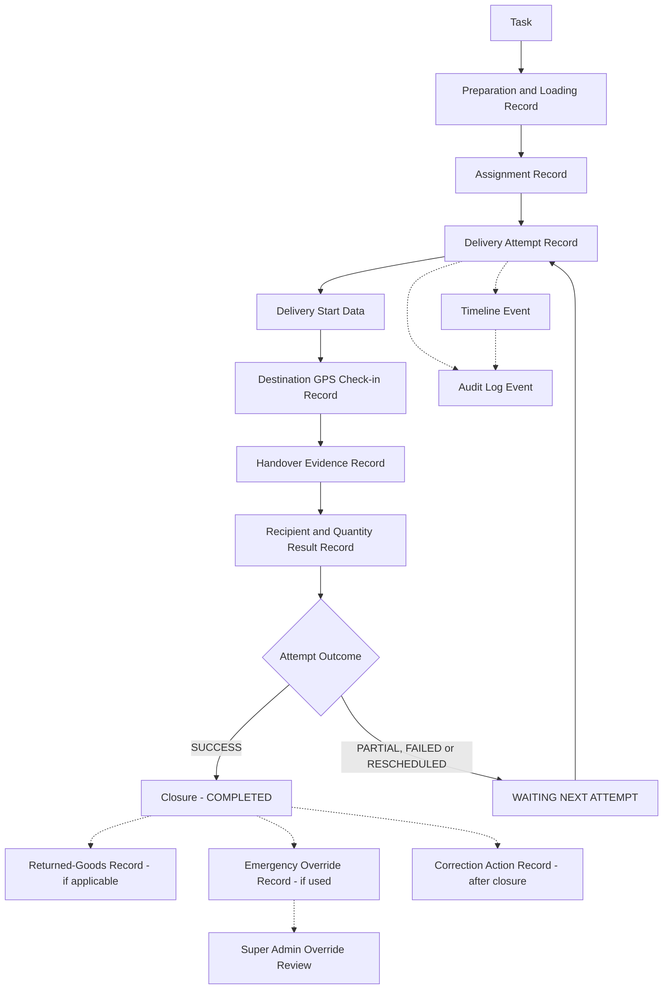

# ข้อมูล หลักฐาน และรายละเอียดที่ต้องจัดเก็บในแต่ละงาน

> [!summary]
> เอกสารฉบับนี้กำหนดข้อกำหนดระดับธุรกิจ (Business-level Requirements) สำหรับข้อมูล หลักฐาน ประวัติ และการจัดเก็บบันทึกของงาน Dispatch ครอบคลุมขอบเขตของ Record 17 กลุ่ม ระดับความจำเป็นของข้อมูล 4 ระดับ การจัดระดับความอ่อนไหวของข้อมูล 6 ระดับ โมเดลการแก้ไขและความเป็น Immutable 6 ประเภท Data and Evidence Matrix มากกว่า 70 รายการ Checklist หลักฐานบังคับ 15 ชุด และตัวอย่างสถานการณ์ 22 กรณี เอกสารฉบับนี้เป็นเอกสารระดับธุรกิจเท่านั้น **ไม่ใช่**เอกสารออกแบบฐานข้อมูล API หรือหน้าจอ

เอกสารฉบับนี้ต่อยอดจาก [[01 - เป้าหมายของระบบ Dispatch]], [[02 - Workflow การทำงานของระบบ Dispatch]] เวอร์ชัน 0.2, [[03 - บทบาทและสิทธิ์ผู้ใช้งาน]] เวอร์ชัน 0.3 และ [[04 - สถานะของงานและกติกาการเปลี่ยนสถานะ]] เวอร์ชัน 0.1 เนื้อหาทั้งหมดต้องสอดคล้องกับการตัดสินใจทางธุรกิจที่ได้รับการอนุมัติแล้วในเอกสารทั้งสี่ฉบับ และจะไม่ตัดสินใจแทนเจ้าของธุรกิจในประเด็นที่ยังไม่ชัดเจน ประเด็นเหล่านั้นถูกรวบรวมไว้ในหัวข้อ [39. Open Business Decisions](#39-open-business-decisions)

> [!note] เกี่ยวกับชื่อไฟล์และลิงก์อ้างอิง
> เอกสาร [[02 - Workflow การทำงานของระบบ Dispatch]], [[03 - บทบาทและสิทธิ์ผู้ใช้งาน]] และ [[04 - สถานะของงานและกติกาการเปลี่ยนสถานะ]] อ้างอิงถึงเอกสารฉบับนี้ด้วยชื่อ "05 - ข้อมูลและหลักฐานของงาน Dispatch" ไฟล์นี้จึงกำหนด `aliases` ไว้ในส่วน Frontmatter เพื่อให้ลิงก์ภายใน Obsidian จากเอกสารทั้งสามฉบับยังคงเปิดถึงไฟล์นี้ได้ถูกต้อง โดยไม่ต้องแก้ไขไฟล์ต้นทางเหล่านั้น (ใช้หลักการเดียวกับที่ [[04 - สถานะของงานและกติกาการเปลี่ยนสถานะ]] ใช้กับชื่อ "04 - สถานะงาน Dispatch")

## 1. วัตถุประสงค์

เอกสารฉบับนี้มีวัตถุประสงค์เพื่อ

* กำหนดข้อมูล หลักฐาน ประวัติ และข้อกำหนดการจัดเก็บบันทึก (Record-Keeping Requirements) ระดับธุรกิจของงาน Dispatch หนึ่งงาน (Task) ตั้งแต่การเตรียมสินค้าจนถึงการปิดงานและการจัดการกรณีข้อยกเว้นภายหลังปิดงาน
* แยกข้อมูลระดับ Task ออกจากข้อมูลระดับ Delivery Attempt อย่างชัดเจน ตามหลักการหนึ่ง Task อาจมีหลาย Delivery Attempt ที่ [[02 - Workflow การทำงานของระบบ Dispatch]] และ [[04 - สถานะของงานและกติกาการเปลี่ยนสถานะ]] อนุมัติไว้แล้ว
* แยกค่าปัจจุบัน (Current Value) ออกจากค่าที่บันทึกไว้ในอดีต (Historical Captured Value) เพื่อป้องกันไม่ให้ข้อมูลย้อนหลังถูกแสดงผิดเมื่อข้อมูลปัจจุบันเปลี่ยนแปลงภายหลัง
* กำหนดระดับความจำเป็นของข้อมูล (REQUIRED, CONDITIONAL, OPTIONAL, FUTURE) และระดับความอ่อนไหวของข้อมูล (Sensitivity) แยกออกจากกันอย่างชัดเจน โดยไม่ปะปนกับระดับสิทธิ์ผู้ใช้งาน
* กำหนดกฎการแก้ไข การล็อก และความเป็น Immutable ของข้อมูลแต่ละประเภท
* เป็นฐานอ้างอิงสำหรับการออกแบบ Database Schema, API Design, File Storage Architecture และ UI ในระยะถัดไป

เอกสารฉบับนี้เป็นเอกสารระดับธุรกิจเท่านั้น **ไม่ใช่**เอกสารออกแบบระบบ

## 2. ขอบเขตของเอกสาร

เอกสารฉบับนี้ครอบคลุม

* ข้อมูลระดับ Task และข้อมูลระดับ Delivery Attempt
* หลักฐานทุกประเภทที่เกี่ยวข้องกับการเตรียมสินค้า การโหลดสินค้า การมอบหมาย การเริ่มจัดส่ง การ Check-in GPS ปลายทาง การส่งมอบ และการปิดงาน
* ข้อมูลผู้รับสินค้า ลายเซ็น ภาพถ่าย และไฟล์หลักฐาน
* Returned-Goods Record, Cancellation Record, Reopen Cycle Record, Emergency Override Record, Super Admin Override Review Record และ Correction Action Record
* Timeline Event และ Audit Log Event ในระดับแนวคิดทางธุรกิจ
* ระดับความจำเป็นของข้อมูล ระดับความอ่อนไหวของข้อมูล สิทธิ์การมองเห็นข้อมูลตามบทบาท และโมเดลการแก้ไข-ล็อก-Immutable
* Data and Evidence Matrix, Mandatory Evidence Checklists, Invalid Data and Evidence Actions และตัวอย่างสถานการณ์
* ประเด็นทางธุรกิจด้านข้อมูลและหลักฐานที่ยังไม่ได้รับการยืนยัน

เอกสารฉบับนี้**ไม่ได้กำหนด**

* โครงสร้างตารางฐานข้อมูล (Database Table Design) หรือคอลัมน์ฐานข้อมูล
* Prisma Model หรือ SQL Schema
* สถาปัตยกรรมการจัดเก็บไฟล์ (File Storage Architecture) หรือ Object Storage Bucket
* API Endpoints หรือ DTO
* Source Code หรือ UI Component หรือหน้าจอ (Screen Layout)
* กลไกทางเทคนิคของการยืนยันตัวตน (Authentication Implementation) หรือการเข้ารหัส (Encryption Implementation)
* กลไกทางเทคนิคของการแจ้งเตือน (Notification Implementation)
* กลไกทางเทคนิคของ OCR หรือการประมวลผล EXIF
* กลไกทางเทคนิคของการอัปโหลดไฟล์ (File-upload Implementation) หรือการซิงค์ข้อมูลออฟไลน์ (Offline Synchronization Implementation)
* สถาปัตยกรรมการ Deploy (Deployment Architecture)

การออกแบบทางเทคนิคทั้งหมดข้างต้นจะถูกจัดทำในระยะถัดไป โดยอ้างอิงจากข้อกำหนดระดับธุรกิจในเอกสารฉบับนี้

## 3. หลักการจัดเก็บข้อมูลและหลักฐาน

เอกสารฉบับนี้ยึดหลักการจัดเก็บข้อมูลและหลักฐาน 12 ข้อต่อไปนี้เป็นหลักการพื้นฐาน

1. **หนึ่ง Task อาจมีหลาย Delivery Attempt** — สอดคล้องกับ [[02 - Workflow การทำงานของระบบ Dispatch]] หัวข้อ 10 และ [[04 - สถานะของงานและกติกาการเปลี่ยนสถานะ]] หัวข้อ 17
2. **ข้อมูลระดับ Task และข้อมูลระดับ Attempt ต้องแยกออกจากกัน** ห้ามยัดรวมไว้ในฟอร์มเดียวที่แก้ไขได้อย่างอิสระ
3. ทุก Delivery Attempt ต้องรักษาข้อมูลของตนเองไว้ครบถ้วน ได้แก่ ผู้กระทำการ (Actor), ผู้รับผิดชอบที่ได้รับมอบหมาย, ฝ่ายผู้จัดส่งทางกายภาพ, เวลาเริ่มต้น, เวลาถึงปลายทาง, หลักฐาน, GPS Check-in, ข้อมูลผู้รับสินค้า, จำนวน, ผลลัพธ์, เหตุผล, Outcome และบริบทการปิด
4. **Attempt ครั้งหลังต้องไม่เขียนทับ Attempt ครั้งก่อนหน้า**
5. ค่าปัจจุบัน (Current Value) และค่าที่บันทึกไว้ในอดีต (Historical Captured Value) มีวัตถุประสงค์ต่างกัน — ค่าปัจจุบันตอบคำถาม "ตอนนี้เป็นอย่างไร" ค่าย้อนหลังตอบคำถาม "ตอนนั้นถูกบันทึกไว้อย่างไร"
6. **Correction Action ต้องรักษาค่าดั้งเดิม ค่าที่แก้ไข เหตุผลของการแก้ไข ผู้กระทำการแก้ไข และวันเวลาที่แก้ไขไว้ครบถ้วน**
7. **Reopen ต้องไม่ลบล้างการปิดงาน การยกเลิก หลักฐาน หรือประวัติ Attempt เดิม** ที่เคยเกิดขึ้นก่อนหน้า
8. **Emergency Override ต้องบันทึกรายการเงื่อนไขที่ขาดหรือถูกข้าม แทนที่จะแสร้งว่าหลักฐานครบถ้วน**
9. Task ที่ COMPLETED หรือ CANCELLED แล้วอาจยังมี Record อิสระที่ยังคง Active ได้ เช่น Returned-Goods Status, Emergency Override Review Status, Correction Action, การตรวจสอบ Audit หรือการยืนยันรับคืนสินค้า
10. **ห้ามลบ Task, Timeline, Audit Log, Attempt เดิม หรือหลักฐานย้อนหลังโดยไม่มีการควบคุม** ไม่ว่ากรณีใด
11. หลักฐานต้องระบุตัวตนได้ทั้ง (ก) บุคคลหรือฝ่ายที่ปฏิบัติงานจริง (Physical Performer) และ (ข) ผู้กระทำการที่ยืนยันตัวตนแล้วในระบบซึ่งเป็นผู้บันทึก (Authenticated System Actor) เสมอ
12. การเก็บข้อมูลต้องยึดหลัก**เก็บเท่าที่จำเป็น**ต่อการปฏิบัติงาน หลักฐาน การตรวจสอบย้อนหลัง และความรับผิดชอบ โดยไม่เปิดเผยข้อมูลส่วนบุคคลเกินความจำเป็น

หลักการทั้ง 12 ข้อนี้เป็นกรอบอ้างอิงสำหรับทุกหัวข้อถัดไปในเอกสารฉบับนี้

## 4. ระดับความจำเป็นของข้อมูล

เอกสารฉบับนี้ใช้ระดับความจำเป็นทางธุรกิจ 4 ระดับอย่างสม่ำเสมอตลอดทั้งเอกสาร

| ระดับ | ความหมาย |
| --- | --- |
| **REQUIRED** | บังคับสำหรับ Workflow หรือการกระทำที่เกี่ยวข้อง ขาดไม่ได้สำหรับเส้นทางปกติ |
| **CONDITIONAL** | บังคับเฉพาะเมื่อสถานการณ์ทางธุรกิจที่เกี่ยวข้องเกิดขึ้นเท่านั้น |
| **OPTIONAL** | อาจถูกบันทึกได้ แต่ไม่บล็อกการกระทำที่เกี่ยวข้องหากไม่มี |
| **FUTURE** | เป็นขอบเขตที่อาจพิจารณาในอนาคต แต่ไม่ใช่ข้อกำหนดของ Phase 1 ปัจจุบัน |

ข้อกำหนดเพิ่มเติมเกี่ยวกับระดับความจำเป็น

* ข้อมูลรายการเดียวกันอาจเป็น **REQUIRED** สำหรับ Workflow หนึ่ง แต่เป็น **NOT_APPLICABLE** สำหรับอีก Workflow หนึ่งได้ เช่น ข้อมูลผู้ให้บริการภายนอกเป็น REQUIRED เฉพาะงานที่ใช้ผู้ส่งภายนอกเท่านั้น
* งานจัดส่งภายในและงานที่ใช้ผู้ส่งสินค้าภายนอกอาจมีแหล่งที่มาของหลักฐานต่างกัน (พนักงานบันทึกเองเทียบกับ Admin บันทึกแทน) แต่ชุดหลักฐานบังคับตามธุรกิจยังคงเหมือนกันตาม [[03 - บทบาทและสิทธิ์ผู้ใช้งาน]] หัวข้อ 11
* **Emergency Override อาจอนุญาตให้ปิดงานได้แม้ข้อมูล REQUIRED บางรายการยังขาดอยู่** แต่ข้อกำหนดที่ขาดหรือถูกข้ามต้องถูกบันทึกไว้อย่างชัดเจนว่าเป็นการข้าม (Bypassed) ไม่ใช่ว่าครบถ้วน
* **OPTIONAL ไม่ได้หมายความว่าไม่มีการควบคุม** ข้อมูลที่เป็น OPTIONAL เมื่อถูกบันทึกแล้วยังคงต้องมีเจ้าของข้อมูล (Ownership) การควบคุมสิทธิ์เข้าถึง และประวัติเช่นเดียวกับข้อมูลอื่น

> [!important]
> ระดับความจำเป็นของข้อมูล**ไม่ใช่**ระดับสิทธิ์ผู้ใช้งาน (User Permission) ทั้งสองแนวคิดเป็นอิสระต่อกัน ข้อมูลอาจเป็น REQUIRED แต่ผู้ใช้งานบางบทบาทไม่มีสิทธิ์เข้าถึงหรือบันทึกได้ (ดูหัวข้อ [31](#31-การจัดระดับความอ่อนไหวของข้อมูล) และ [32](#32-สิทธิ์การมองเห็นข้อมูลตามบทบาท)) สิทธิ์ผู้ใช้งานถูกกำหนดไว้แล้วใน [[03 - บทบาทและสิทธิ์ผู้ใช้งาน]] เอกสารฉบับนี้ไม่แก้ไขหรือขัดแย้งกับสิทธิ์ดังกล่าว

## 5. ขอบเขตของ Record

งาน Dispatch หนึ่งงานประกอบด้วย Record อย่างน้อย 17 กลุ่ม ที่ต้องแยกออกจากกันในระดับแนวคิดทางธุรกิจ

| # | Record Scope | คำอธิบาย |
| --- | --- | --- |
| 1 | Task-Level Record | ข้อมูลที่เป็นของทั้งงาน มีค่าเดียวต่อ Task หนึ่งรายการ |
| 2 | Delivery Attempt Record | ข้อมูลของความพยายามจัดส่งแต่ละครั้ง มีได้หลายรายการต่อ Task |
| 3 | Preparation and Loading Record | ข้อมูลการเตรียมและโหลดสินค้าขึ้นยานพาหนะก่อนจัดส่ง |
| 4 | Assignment Record | ประวัติการมอบหมายและการเปลี่ยนตัวผู้รับผิดชอบ |
| 5 | Destination GPS Check-in Record | หลักฐานการเดินทางถึงปลายทาง |
| 6 | Handover Evidence Record | หลักฐานการส่งมอบสินค้า |
| 7 | Recipient Record | ข้อมูลผู้รับสินค้า |
| 8 | Quantity and Item Result Record | ผลลัพธ์จำนวนสินค้าต่อรายการและต่อ Attempt |
| 9 | Returned-Goods Record | ภาระหน้าที่และการยืนยันการรับคืนสินค้า |
| 10 | External Courier Record | ข้อมูลผู้ส่งสินค้าภายนอกและหลักฐานที่ Admin บันทึกแทน |
| 11 | Emergency Override Record | การปิดงานเชิงบริหารที่ข้ามเงื่อนไขปกติ |
| 12 | Super Admin Override Review Record | การทบทวนย้อนหลังของ Super Admin |
| 13 | Reopen Cycle Record | รอบการเปิดงานกลับมาแก้ไข |
| 14 | Correction Action Record | การแก้ไขข้อมูลที่มีการควบคุมโดยไม่ต้อง Reopen |
| 15 | Timeline Event | ประวัติเชิงปฏิบัติการที่มนุษย์อ่านได้ |
| 16 | Audit Log Event | บันทึกเพื่อการกำกับดูแลและความรับผิดชอบ |
| 17 | Supporting Document Record | เอกสารประกอบทางธุรกิจ |

### การแบ่งขอบเขตข้อมูล

* **ข้อมูลของทั้ง Task** คือข้อมูลที่มีค่าเดียวและใช้ร่วมกันตลอดอายุของงาน เช่น รหัสงาน ประเภทงาน ลูกค้า/ปลายทางปัจจุบัน สถานะหลักปัจจุบัน (ดูหัวข้อ [6](#6-ข้อมูลระดับ-task))
* **ข้อมูลของหนึ่ง Delivery Attempt** คือข้อมูลที่ผูกกับความพยายามจัดส่งครั้งใดครั้งหนึ่งโดยเฉพาะ เช่น เวลาที่เริ่ม Attempt นั้น หลักฐาน Check-in ของ Attempt นั้น ผลลัพธ์ของ Attempt นั้น (ดูหัวข้อ [19](#19-delivery-attempt-record))
* **ข้อมูลที่เป็นประวัติและ Immutable** คือข้อมูลของ Attempt ที่ปิดไปแล้วหรือเหตุการณ์ที่เกิดขึ้นแล้ว ห้ามเขียนทับ เช่น Timeline, Audit Log, Attempt เดิม
* **ข้อมูลที่แก้ไขได้ผ่านการกระทำที่มีการควบคุม (Controlled Action)** คือข้อมูลที่แก้ไขได้เฉพาะผ่าน Correction Action, Reopen หรือ Emergency Override เท่านั้น เช่น ข้อมูลผู้รับสินค้าภายหลังปิดงาน
* **ข้อมูลที่เป็นสถานะปฏิบัติการปัจจุบัน (Current Operational State)** คือข้อมูลที่เปลี่ยนแปลงได้ตามปกติระหว่างดำเนินงาน เช่น Main Task Status, Returned-Goods Status ปัจจุบัน

### เหตุผลที่ต้องไม่ยัดรวมทุกขอบเขตไว้ในฟอร์ม Task เดียวที่แก้ไขได้อย่างอิสระ

หากยัดข้อมูลทั้ง 17 กลุ่มไว้ในฟอร์มเดียวที่แก้ไขได้ทุกช่วงเวลา ระบบจะไม่สามารถแทนความจริงทางธุรกิจต่อไปนี้พร้อมกันได้

* Attempt ที่ 1 ล้มเหลวและ Attempt ที่ 2 สำเร็จ แต่ทั้งสอง Attempt ต้องปรากฏแยกกันในประวัติ ไม่ใช่ Attempt ที่ 2 เขียนทับ Attempt ที่ 1
* Task ที่ CANCELLED แล้วยังมี Returned-Goods Status ที่เปลี่ยนแปลงต่อไปได้อย่างอิสระ (ดู [[04 - สถานะของงานและกติกาการเปลี่ยนสถานะ]] หัวข้อ 22)
* การแก้ไขข้อมูลผู้รับสินค้าภายหลังปิดงานต้องเก็บทั้งค่าดั้งเดิมและค่าที่แก้ไข ไม่ใช่เขียนทับค่าเดิมจนหายไป
* Emergency Override ต้องแสดงรายการหลักฐานที่ขาดอยู่จริง ไม่ใช่แสดงเหมือนกับว่าฟอร์มถูกกรอกครบทุกช่องแล้ว

## 6. ข้อมูลระดับ Task

ตารางต่อไปนี้กำหนดข้อมูลระดับแนวคิดที่จำเป็นต่อการระบุและบริหารจัดการหนึ่งงาน Dispatch พร้อมระดับความจำเป็นเบื้องต้น เอกสารฉบับนี้จัดระดับตามขอบเขต Phase 1 ที่ได้รับอนุมัติใน Topics 1–4 เท่านั้น รายการที่ยังไม่มีข้อสรุปชัดเจนถูกทำเครื่องหมายไว้อย่างชัดเจนและนำไปรวมไว้ในหัวข้อ [39](#39-open-business-decisions)

| # | ข้อมูลระดับ Task | ระดับความจำเป็น | หมายเหตุ |
| --- | --- | --- | --- |
| 1 | Dispatch Task identifier (เลขที่งาน) | REQUIRED | ต้องคงที่ตลอดอายุ Task รวมถึงหลัง Reopen |
| 2 | Task type (ประเภทงาน) | REQUIRED | Phase 1 ครอบคลุมงานจัดส่งสินค้าขาออกเป็นหลัก ดูหัวข้อ [7](#7-ประเภทงานและรูปแบบการจัดส่ง) |
| 3 | Phase 1 goods-delivery classification | REQUIRED | ระบุว่าเป็นงานจัดส่งสินค้าขาออกตามขอบเขตที่อนุมัติ |
| 4 | Internal หรือ External delivery method | REQUIRED | กำหนดเส้นทางปิดงานตาม [[03 - บทบาทและสิทธิ์ผู้ใช้งาน]] หัวข้อ 3.2 |
| 5 | Customer หรือ destination organization | REQUIRED | ดู Snapshot ที่หัวข้อ [8](#8-customer-และ-destination-snapshot) |
| 6 | Destination name | REQUIRED | |
| 7 | Destination address | REQUIRED | |
| 8 | Destination contact information | CONDITIONAL | บังคับเมื่อมีผู้ติดต่อระบุไว้ |
| 9 | Planned delivery date | REQUIRED | |
| 10 | Planned delivery time window | CONDITIONAL | บังคับเมื่อมีการนัดหมายช่วงเวลาที่ชัดเจน |
| 11 | Business reference numbers | CONDITIONAL | ขึ้นกับประเภทเอกสารอ้างอิงที่เกี่ยวข้อง — ยังไม่ระบุชุดที่บังคับ ดูหัวข้อ [39](#39-open-business-decisions) |
| 12 | Source order, service, sales, or document reference | CONDITIONAL | เช่นเดียวกับข้างต้น |
| 13 | Task creation date and time | REQUIRED | |
| 14 | Task creator | REQUIRED | |
| 15 | Current Main Task Status | REQUIRED | อ้างอิงโมเดล 10 สถานะจาก [[04 - สถานะของงานและกติกาการเปลี่ยนสถานะ]] |
| 16 | Current primary responsible party | REQUIRED | ตามหลักการหนึ่ง Task หนึ่งผู้รับผิดชอบหลักในระบบหนึ่ง User Login |
| 17 | Priority หรือ urgency | OPTIONAL | ไม่มีข้อกำหนดบังคับใน Topics 1–4 |
| 18 | General delivery instructions | OPTIONAL | |
| 19 | Special access instructions | CONDITIONAL | บังคับเมื่อสถานที่มีข้อกำหนดการเข้าถึงพิเศษ |
| 20 | General remarks | OPTIONAL | |
| 21 | Current Returned-Goods Status | REQUIRED | ค่าเริ่มต้น NOT_REQUIRED เปลี่ยนแปลงตามหัวข้อ [22](#22-returned-goods-record) |
| 22 | Current Emergency Override Review Status | REQUIRED | ค่าเริ่มต้น NOT_APPLICABLE ดูหัวข้อ [26](#26-super-admin-override-review-record) |
| 23 | Current reopen cycle indicator | CONDITIONAL | บังคับเฉพาะ Task ที่เคยถูก Reopen |
| 24 | Whether Emergency Override has ever been used (flag) | REQUIRED | ต้องแสดงผลถาวรแม้ Task จะถูก Reopen ภายหลัง |
| 25 | Latest operational summary | OPTIONAL | สรุปสถานะล่าสุดเพื่อการติดตาม ไม่ใช่หลักฐาน |
| 26 | Complete historical Timeline references | REQUIRED | ต้องเข้าถึงประวัติทั้งหมดของ Task ได้จากมุมมอง Task-level |

> [!important]
> ข้อมูลระดับ Task ข้างต้นเป็น**ค่าปัจจุบัน (Current Value)** เท่านั้น รายละเอียดการจัดส่งในอดีต เช่น ที่อยู่ปลายทางที่ใช้จริงในแต่ละ Attempt หรือผู้รับผิดชอบของ Attempt ที่ผ่านมาแล้ว **ต้องไม่ถูกเก็บไว้เพียงในรูปแบบฟิลด์ Task ที่แก้ไขได้อย่างอิสระ** แต่ต้องถูกเก็บเป็นข้อมูลย้อนหลังที่ตรึงไว้ (Historical Snapshot) ผูกกับ Attempt หรือเหตุการณ์ Timeline ที่เกี่ยวข้อง (ดูหัวข้อ [8](#8-customer-และ-destination-snapshot) และ [19](#19-delivery-attempt-record))

## 7. ประเภทงานและรูปแบบการจัดส่ง

Phase 1 ของ Dispatch ครอบคลุม**งานจัดส่งสินค้าขาออก (Outbound Goods Delivery)** เป็นหลัก ตาม [[01 - เป้าหมายของระบบ Dispatch]] หัวข้อ 7

เอกสารฉบับนี้แยกรูปแบบการจัดส่งออกเป็น 2 แบบที่ได้รับอนุมัติ

1. **Internal Delivery (การจัดส่งโดยพนักงานภายใน)** — ดำเนินการโดยพนักงานส่งสินค้าภายในที่มีสิทธิ์เข้าถึงระบบโดยตรง
2. **External Courier Delivery (การจัดส่งโดยผู้ส่งสินค้าภายนอก)** — ดำเนินการโดยผู้ให้บริการภายนอกที่ไม่มีสิทธิ์เข้าถึงระบบโดยตรงใน Phase 1 ตาม [[03 - บทบาทและสิทธิ์ผู้ใช้งาน]] หัวข้อ 11

หมวดหมู่ที่อาจพิจารณาในอนาคตแต่**ยังไม่ได้รับอนุมัติเป็นขอบเขตปัจจุบัน** ได้แก่

* งานส่งเอกสาร (Document Delivery)
* งานรับเอกสาร (Document Collection)
* งานรับสินค้า (Goods Pickup)
* งานรับสินค้าคืน (Return Collection)
* งานที่มีทั้งการรับและส่งใน Task เดียวกัน (Combined Pickup and Delivery)
* งาน Dispatch อื่นที่ไม่ใช่สินค้า (Other Non-goods Dispatch Work)

> [!warning]
> หมวดหมู่ข้างต้นเป็น**ประเด็นที่ยังไม่ได้รับการอนุมัติ**ตาม [[02 - Workflow การทำงานของระบบ Dispatch]] หัวข้อ 20 และ 18 ห้ามถือว่าเป็นความสามารถปัจจุบันของระบบ และห้ามนำกฎหลักฐานบังคับของงานจัดส่งสินค้าขาออกไปใช้กับงานประเภทเหล่านี้โดยอัตโนมัติ

ข้อกำหนดหลักฐานอาจแตกต่างกันไปตามประเภทงานในอนาคต แต่กฎหลักฐานบังคับปัจจุบันในเอกสารฉบับนี้ใช้กับงานจัดส่งสินค้าขาออกที่ดำเนินอยู่ในปัจจุบันเท่านั้น เว้นแต่ Topics 1–4 จะระบุไว้เป็นอย่างอื่นอย่างชัดเจน

## 8. Customer และ Destination Snapshot

เอกสารฉบับนี้แยกแนวคิดสองอย่างออกจากกันอย่างชัดเจน

1. **ข้อมูลหลักลูกค้าหรือปลายทางปัจจุบัน (Current Customer/Destination Master Information)** — ข้อมูลล่าสุดของลูกค้าหรือปลายทางที่อาจเปลี่ยนแปลงได้ตามเวลา
2. **Historical Destination Snapshot** — ข้อมูลปลายทางที่ถูกใช้จริง ณ เวลาที่ดำเนินการ Task หรือ Attempt หนึ่ง ๆ ซึ่งต้องถูกตรึงไว้ไม่เปลี่ยนแปลงตามข้อมูลหลักที่แก้ไขภายหลัง

### ปัญหาที่ต้องป้องกัน

หากไม่มี Historical Destination Snapshot ปัญหาต่อไปนี้จะเกิดขึ้น

* ที่อยู่หรือผู้ติดต่อของลูกค้าถูกแก้ไขในภายหลัง
* งาน Dispatch ที่เกิดขึ้นในอดีตแสดงค่าที่อยู่ใหม่ราวกับว่าเป็นคำสั่งจัดส่งดั้งเดิม ทั้งที่ความจริงพนักงานส่งสินค้าใช้ที่อยู่เดิมในการเดินทาง
* การสืบสวนข้อพิพาทไม่สามารถยืนยันได้ว่าพนักงานปฏิบัติตามคำแนะนำที่ถูกต้อง ณ เวลานั้นหรือไม่

### ข้อมูลที่ต้องตรึงไว้เป็น Snapshot เมื่อเกี่ยวข้อง

* Destination name
* Address
* Contact name
* Contact phone
* Delivery instructions
* Location reference
* Access notes

> [!note]
> เอกสารฉบับนี้ไม่ได้ตัดสินใจว่าระบบจะใช้ Customer Master, Free-text Destination หรือทั้งสองอย่างร่วมกัน และไม่ได้ออกแบบกลไกทางเทคนิคว่า Snapshot จะถูกจัดเก็บเป็นสำเนาแยก การอ้างอิงแบบ Versioning หรือกลไกอื่นใด การตัดสินใจดังกล่าวเป็นเรื่องของการออกแบบทางเทคนิคในระยะถัดไป เอกสารฉบับนี้กำหนดเพียงว่า**ข้อมูลปลายทางที่ใช้จริงในการปฏิบัติงานต้องตรวจสอบย้อนหลังได้เสมอ โดยไม่ถูกเขียนทับด้วยข้อมูลหลักที่เปลี่ยนแปลงภายหลัง**

## 9. รายการสินค้าและจำนวน

ข้อมูลสินค้าและจำนวนต้องรองรับการตรวจสอบย้อนกลับ (Traceability) ได้อย่างสมบูรณ์

### ข้อมูลที่ต้องจัดเก็บ อย่างน้อย

* Item identity หรือ description
* Planned quantity (จำนวนที่วางแผน)
* Prepared quantity (จำนวนที่เตรียมจริง)
* Loaded quantity (จำนวนที่โหลดขึ้นยานพาหนะ) — เมื่อเกี่ยวข้อง
* Delivered quantity ต่อ Attempt (จำนวนที่ส่งมอบจริงในแต่ละความพยายาม)
* Undelivered quantity (จำนวนที่ยังไม่ได้ส่งมอบ)
* Remaining quantity (จำนวนคงเหลือที่ต้องดำเนินการต่อ)
* Returned quantity (จำนวนที่ถูกส่งคืน) — เมื่อเกี่ยวข้อง
* Damaged quantity — เมื่อเกี่ยวข้อง
* Missing quantity — เมื่อเกี่ยวข้อง
* Unit of measure
* Item-level remarks
* Discrepancy reason
* Attempt association (Attempt ใดที่ตัวเลขนี้เกี่ยวข้อง)
* Return association (การคืนสินค้าครั้งใดที่ตัวเลขนี้เกี่ยวข้อง)
* Confirmation actor
* Confirmation date and time

### กฎที่ต้องยึดถือ

* **จำนวนต้องตรวจสอบย้อนกลับได้ต่อ Delivery Attempt แต่ละครั้ง** ไม่ใช่รวมกันเป็นค่าเดียวของทั้ง Task
* **Attempt ครั้งหลังต้องไม่เขียนทับจำนวนของ Attempt ครั้งก่อนหน้า**
* การส่งมอบแบบ **PARTIAL** ต้องแสดงจำนวนที่ส่งมอบแล้วและจำนวนคงเหลืออย่างชัดเจนแยกจากกัน
* การส่งมอบแบบ **FAILED** ต้องไม่บันทึกว่าสินค้าทั้งหมดถูกส่งมอบแล้วโดยผิดพลาด
* การส่งมอบแบบ **RESCHEDULED** ต้องรักษากิจกรรมด้านสินค้าที่เกิดขึ้นแล้วก่อนหน้าไว้ครบถ้วน ไม่ล้างค่าที่บันทึกไปแล้ว
* การยกเลิกงานหลังสินค้าออกจากบริษัทต้องรักษาภาระหน้าที่ในการคืนสินค้าไว้ (ดูหัวข้อ [22](#22-returned-goods-record) และ [23](#23-cancellation-record))
* **การยืนยันสินค้าคืนต้องแยกออกจากการยกเลิกงาน** เป็นกระบวนการที่มี Record ของตนเอง
* **Admin เป็นผู้ทำการยืนยันการรับคืนสินค้าอย่างเป็นทางการ** ตาม [[03 - บทบาทและสิทธิ์ผู้ใช้งาน]] หัวข้อ 19
* **Stock อาจรายงานความไม่ตรงกันของสินค้าได้ แต่ไม่ใช่ผู้ปิดงานจัดส่งหรือผู้ยืนยันการคืนสินค้าขั้นสุดท้าย**

> [!note]
> เอกสารฉบับนี้ไม่ได้กำหนดข้อกำหนดของ Barcode, Serial Number หรือ Lot/Batch Number ว่าต้องบันทึกในทุกกรณีหรือไม่ รวมถึงไม่ได้ออกแบบการเชื่อมต่อกับระบบบัญชี Stock ประเด็นเหล่านี้ยังคงเป็นประเด็นเปิดตามหัวข้อ [39](#39-open-business-decisions)

## 10. ข้อมูลการจัดเตรียมสินค้า

ข้อมูลและหลักฐานที่เกี่ยวข้องกับการเตรียมสินค้าก่อนโหลดขึ้นยานพาหนะ ครอบคลุมอย่างน้อย

* Preparation started date and time
* Preparation actor
* Preparation completed date and time
* Prepared quantities
* Preparation notes
* Discrepancies identified before dispatch
* Ready-for-dispatch confirmation

ข้อมูลเหล่านี้เป็น**ข้อมูลระดับ Task/Attempt ที่เกิดขึ้นก่อนการมอบหมายและก่อนเริ่มจัดส่ง** และผูกกับรอบการเตรียมสินค้าของ Attempt ที่กำลังจะเริ่มต้น สอดคล้องกับ Main Task Status `PREPARING` ตาม [[04 - สถานะของงานและกติกาการเปลี่ยนสถานะ]] หัวข้อ 8

## 11. ข้อมูลการโหลดสินค้า

ข้อมูลและหลักฐานที่เกี่ยวข้องกับการโหลดสินค้าขึ้นยานพาหนะ ครอบคลุมอย่างน้อย

* Loading date and time
* บุคคลที่บันทึกความเสร็จสมบูรณ์ของการโหลด (Person recording loading completion)
* Post-loading vehicle photo
* Number of post-loading photos
* Loading remarks
* Vehicle-related reference — เมื่อเกี่ยวข้อง
* Evidence association กับ Task หรือ Attempt ที่เกี่ยวข้อง

### กฎที่ได้รับอนุมัติ

* **ต้องมีรูปภาพหลังโหลดสินค้าขึ้นยานพาหนะอย่างน้อย 1 รูปสำหรับการปิดงานจัดส่งสินค้าตามปกติในปัจจุบัน** ตาม [[02 - Workflow การทำงานของระบบ Dispatch]] หัวข้อ 5.6
* รูปภาพหลังโหลดสินค้าต้องตรวจสอบย้อนกลับได้ไปยังรอบการจัดส่ง (Attempt) ที่เกี่ยวข้อง
* **สิทธิ์แก้ไขข้อมูลของ Stock ถูกล็อกทันทีที่ Task เข้าสู่ IN_TRANSIT** ตาม [[03 - บทบาทและสิทธิ์ผู้ใช้งาน]] หัวข้อ 14.2 และ [[04 - สถานะของงานและกติกาการเปลี่ยนสถานะ]] หัวข้อ 27
* Stock อาจรายงานปัญหาที่พบภายหลังการเริ่มจัดส่งได้ แต่ไม่มีสิทธิ์แก้ไขข้อมูลการเตรียมสินค้าด้วยตนเอง
* **Stock ต้องไม่เขียนทับประวัติการเตรียมสินค้าแบบเงียบ**
* การแก้ไขข้อมูลการเตรียมสินค้าภายหลังเริ่มจัดส่งต้องดำเนินการผ่านกระบวนการ Correction, Exception หรือ Reopen ที่ได้รับอนุมัติ โดย Admin หรือ Super Admin เท่านั้น
* **อำนาจที่แน่นอนของการแก้ไขข้อมูลการเตรียมสินค้าภายหลังเริ่มจัดส่ง (Admin ดำเนินการเองได้หรือจำกัดเฉพาะ Super Admin) ยังคงเป็นประเด็นเปิด**

> [!note]
> เอกสารฉบับนี้ไม่ได้กำหนดคุณภาพของรูปภาพในเชิงเทคนิค เช่น ความละเอียด ขนาดไฟล์ รูปแบบไฟล์ หรือการบีบอัดข้อมูล รายการเหล่านี้ถูกรวบรวมไว้เป็นประเด็นเปิดในหัวข้อ [39](#39-open-business-decisions)

## 12. ข้อมูลการมอบหมาย

ประวัติการมอบหมายต้องรักษาข้อมูลอย่างน้อยต่อไปนี้ไว้

* Assignment type (Internal หรือ External)
* Internal employee หรือ external courier arrangement
* Primary responsible login — เมื่อเกี่ยวข้อง (งานภายใน)
* Assigned physical delivery party
* Assignment actor
* Assignment date and time
* Assignment reason — เมื่อเกี่ยวข้อง
* Reassignment actor
* Reassignment reason
* Previous assigned party
* New assigned party
* Reopen-cycle association — เมื่อเกี่ยวข้อง
* Whether Super Admin assumed responsibility
* Supporting หรือ co-traveling employee information — เมื่อมีการบันทึก

### กฎที่ได้รับอนุมัติ

* **หนึ่ง Task มีผู้รับผิดชอบหลักในระบบหนึ่ง User Login เท่านั้น** ตาม [[03 - บทบาทและสิทธิ์ผู้ใช้งาน]] หัวข้อ 3.2 และ 13
* **ห้ามใช้บัญชีผู้ใช้งานร่วมกัน (Shared Login)** ไม่ว่ากรณีใด
* พนักงานที่ร่วมปฏิบัติงานทางกายภาพ (Physical Assistant) อาจร่วมเดินทางได้ แต่ไม่กลายเป็นผู้ปิด Task โดยอัตโนมัติ
* **การเปลี่ยนตัวผู้รับผิดชอบต้องรักษาประวัติการมอบหมายเดิมไว้เสมอ** ไม่ถูกเขียนทับ
* **Dispatcher ต้องไม่ถูกแทนความหมายว่าเป็นผู้ปิดงาน (Delivery Closer)** ไม่ว่ากรณีใด
* ผู้ส่งสินค้าภายนอกไม่มีบัญชีเข้าสู่ระบบโดยตรงใน Phase 1
* **Admin เป็นผู้บันทึกหลักฐานและปิดงานแทนผู้ส่งสินค้าภายนอก**
* กฎการบันทึกพนักงานที่ร่วมเดินทาง (Co-traveler) โดยละเอียดยังคงเป็นประเด็นเปิด

### การแยกผู้กระทำการ 6 กลุ่ม

เอกสารฉบับนี้แยกความแตกต่างระหว่างบุคคลหรือบทบาท 6 กลุ่มอย่างชัดเจนตลอดทั้งเอกสาร

1. **Authenticated System Actor** — ผู้ใช้งานที่ยืนยันตัวตนแล้วในระบบซึ่งเป็นผู้บันทึกข้อมูล
2. **Assigned Responsible Login** — บัญชีผู้ใช้งานหนึ่งบัญชีที่เป็นผู้รับผิดชอบหลักของ Task
3. **Physical Delivery Party** — บุคคลหรือฝ่ายที่ปฏิบัติงานจัดส่งจริงในทางกายภาพ
4. **Supporting หรือ Accompanying Employee** — พนักงานที่ร่วมเดินทางแต่ไม่ใช่ผู้รับผิดชอบหลัก
5. **External Courier** — ผู้ให้บริการภายนอกที่ไม่มีบัญชีเข้าสู่ระบบ
6. **Admin Recording External Evidence** — Admin ที่บันทึกหลักฐานและปิดงานแทนผู้ส่งสินค้าภายนอก

## 13. ข้อมูลเริ่มการจัดส่ง

ข้อมูลที่ต้องบันทึกเมื่อการจัดส่งเริ่มต้นอย่างเป็นทางการ ครอบคลุมอย่างน้อย

* Delivery start date and time
* Attempt number
* Assigned responsible party
* Physical delivery party
* Start action actor
* Main Task Status ก่อนและหลัง
* Available loading evidence ที่มีอยู่ ณ ขณะนั้น
* Vehicle information — เมื่อเกี่ยวข้อง
* Operational notes

### กฎที่ได้รับอนุมัติ

* **Phase 1 ไม่บังคับให้มี GPS ขณะเริ่มจัดส่ง** — ห้ามกำหนด Start-location GPS เป็นข้อบังคับใหม่
* **ห้ามกำหนด Geofence** ในขั้นตอนนี้
* **ห้ามกำหนดเกณฑ์ระยะทาง (Distance Threshold)** ขณะเริ่มจัดส่ง
* **ห้ามกำหนดกฎเตือนหรือบล็อกจาก GPS (GPS Warning/Blocking Rule)** ที่ยังไม่ได้รับอนุมัติ
* เมื่อ Task เข้าสู่ IN_TRANSIT สิทธิ์แก้ไขข้อมูลการเตรียมสินค้าของ Stock ถูกล็อกทันที

> [!important]
> หลักฐานการเริ่มจัดส่งต้องแยกออกจากหลักฐานการ Check-in GPS ที่ปลายทางอย่างชัดเจน (ดูหัวข้อ [14](#14-destination-gps-check-in)) ทั้งสองเป็นเหตุการณ์คนละช่วงเวลาที่มีข้อกำหนดหลักฐานต่างกัน

## 14. Destination GPS Check-in

**Destination GPS Check-in เป็นข้อบังคับสำหรับการปิดงานตามปกติของงานจัดส่งสินค้าใน Phase 1 ปัจจุบัน** ตาม [[02 - Workflow การทำงานของระบบ Dispatch]] หัวข้อ 5.11 และ [[04 - สถานะของงานและกติกาการเปลี่ยนสถานะ]] หัวข้อ 12

### ข้อมูลเชิงแนวคิดที่ต้องบันทึก

* Delivery Attempt association
* Check-in actor
* Assigned responsible party
* Physical delivery party
* Check-in date and time
* Captured destination coordinates
* Available accuracy หรือ reliability information — เมื่อมีข้อมูล
* Operational destination reference
* Main Task Status ก่อนและหลัง
* Evidence origin
* ระบุว่า Check-in เป็นแบบปกติหรือถูกข้ามผ่าน Emergency Override
* Related remarks — เมื่อเกี่ยวข้อง

### กฎที่ได้รับอนุมัติ

* Destination GPS Check-in เป็นข้อบังคับสำหรับการปิดงานตามปกติ
* **ไม่มีข้อกำหนด GPS ขณะเริ่มจัดส่ง**
* **ไม่มี Geofence ใน Phase 1**
* **ไม่มีเกณฑ์ระยะทาง (Distance Threshold)**
* **ไม่มีคำเตือนระยะทาง (Distance Warning)**
* ห้ามกำหนดกฎบล็อกจาก GPS เพิ่มเติมนอกเหนือจากข้อบังคับ Check-in ที่ได้รับอนุมัติแล้ว
* **พิกัด GPS ที่บันทึกไว้ไม่สามารถพิสูจน์อัตลักษณ์ที่แน่ชัดของผู้รับสินค้าได้** เอกสารฉบับนี้ไม่อ้างว่า GPS ยืนยันตัวตนของผู้รับ
* Emergency Override อาจข้ามเงื่อนไข GPS ที่ขาดอยู่ได้ แต่การข้ามต้องถูกบันทึกไว้อย่างชัดเจนและตรวจสอบย้อนหลังได้เสมอ

> [!warning]
> เอกสารฉบับนี้ไม่ได้ออกแบบ Mobile GPS Library, สิทธิ์ Browser, อัลกอริทึมตรวจสอบความถูกต้องของพิกัด, การตรวจจับ Mock-location, เกณฑ์ความแม่นยำเชิงเทคนิค, ผู้ให้บริการแผนที่, Reverse Geocoding หรือการคำนวณ Geofence รายการเหล่านี้อยู่นอกขอบเขตธุรกิจของเอกสารฉบับนี้ ประเด็นคุณภาพหลักฐาน GPS ที่ยังไม่ได้ข้อสรุปถูกรวบรวมไว้ในหัวข้อ [39](#39-open-business-decisions)

## 15. หลักฐานการส่งมอบ

หลักฐานที่เกี่ยวข้องกับการส่งมอบสินค้า สำหรับการปิดงานจัดส่งสินค้าตามปกติในปัจจุบัน ต้องมีอย่างน้อย

* Delivery Attempt
* Handover date and time
* Handover actor
* Physical delivery party
* Recipient identity information
* Handover evidence photo
* Quantity handed over
* Item-level result — เมื่อเกี่ยวข้อง
* Handover remarks
* Recipient acknowledgment
* Signature evidence
* Related GPS Check-in
* Final Attempt outcome

### กฎที่ได้รับอนุมัติ

* **ต้องมีรูปหลักฐานการส่งมอบอย่างน้อย 1 รูป**
* **ต้องมีชื่อผู้รับสินค้า**
* **ต้องมีหมายเลขโทรศัพท์ผู้รับสินค้า**
* **ต้องมีลายเซ็นลูกค้า**
* **ต้องส่งมอบสินค้าครบทุกรายการจึงจะปิดงานเป็นผลสำเร็จตามปกติได้**
* การส่งมอบแบบ **PARTIAL ต้องไม่ถูกแสดงเป็นการส่งมอบสำเร็จเต็มรูปแบบ**
* หลักฐานการส่งมอบตามปกติที่ขาดอยู่อาจถูกข้ามได้เฉพาะผ่าน Emergency Override เท่านั้น
* **หลักฐานการส่งมอบเดิมต้องไม่ถูกแทนที่หรือลบแบบเงียบ**

> [!note]
> เอกสารฉบับนี้ไม่ได้ตัดสินใจเรื่ององค์ประกอบของรูปภาพที่ชัดเจน (เช่น ต้องมีใบหน้าผู้รับหรือไม่ ต้องมีสินค้า เอกสาร ยานพาหนะ หรือสถานที่ปรากฏในภาพหรือไม่) เทคโนโลยีลายเซ็น รูปแบบไฟล์ ความละเอียดขั้นต่ำ หรือขนาดไฟล์สูงสุด รายการเหล่านี้ยังคงเป็นประเด็นเปิดทางธุรกิจหรือเทคนิคในอนาคต (ดูหัวข้อ [39](#39-open-business-decisions))

## 16. ข้อมูลผู้รับสินค้า

ข้อมูลผู้รับสินค้าครอบคลุมอย่างน้อย

* Recipient name
* Recipient phone
* Recipient role หรือ relationship — เมื่อเกี่ยวข้อง
* Recipient organization — เมื่อเกี่ยวข้อง
* Recipient signature
* Recipient acknowledgment date and time
* Delivery Attempt association
* Quantity received
* Handover notes
* Correction history
* Masked หรือ unmasked display requirements
* Access restrictions
* Audit requirements

### กฎที่ได้รับอนุมัติ

* **ชื่อผู้รับสินค้าเป็นข้อบังคับสำหรับการปิดงานตามปกติ**
* **หมายเลขโทรศัพท์ผู้รับสินค้าเป็นข้อบังคับสำหรับการปิดงานตามปกติ**
* **ลายเซ็นลูกค้าเป็นข้อบังคับสำหรับการปิดงานตามปกติ**
* **Admin และ Super Admin เท่านั้นที่อาจดำเนินการ Correction Action ต่อข้อมูลผู้รับสินค้าภายหลังปิดงานโดยไม่ต้อง Reopen** ตาม [[03 - บทบาทและสิทธิ์ผู้ใช้งาน]] หัวข้อ 20.1
* **ค่าดั้งเดิมของข้อมูลผู้รับสินค้าต้องถูกรักษาไว้เสมอ**
* **ค่าที่แก้ไขแล้วต้องไม่ถูกแสดงราวกับเป็นค่าที่บันทึกไว้ตั้งแต่แรก**
* ฟิลด์ข้อมูลผู้รับสินค้าที่มีสิทธิ์ใช้ Correction Action ได้อย่างชัดเจนยังคงเป็นประเด็นเปิด
* การเข้าถึงลายเซ็นต้องถูกจำกัดตาม [[03 - บทบาทและสิทธิ์ผู้ใช้งาน]]
* การดูลายเซ็นลูกค้าต้องสร้างเหตุการณ์ Audit Log เฉพาะทางหรือไม่ ยังคงเป็นประเด็นเปิด

> [!note]
> ข้อมูลผู้รับสินค้าถือเป็นข้อมูลส่วนบุคคลที่มีความอ่อนไหว (Sensitive Personal Data) เนื่องจากเป็นข้อมูลที่สามารถระบุตัวตนของบุคคลได้โดยตรง (ชื่อ, เบอร์โทรศัพท์, ลายเซ็น) และเกี่ยวข้องกับการทำธุรกรรมทางธุรกิจของลูกค้า เอกสารฉบับนี้ไม่ได้อ้างอิงหรือยืนยันความสอดคล้องกับกฎหมายคุ้มครองข้อมูลส่วนบุคคลฉบับใดเป็นการเฉพาะ เว้นแต่จะได้รับการอนุมัติไว้แล้วใน Topics 1–4

## 17. ลายเซ็นผู้รับ

ลายเซ็นลูกค้าถือเป็นหลักฐานที่มีความอ่อนไหว (Sensitive Evidence) ตลอดทั้งเอกสารฉบับนี้

### ข้อกำหนดที่ได้รับอนุมัติ

* ลายเซ็นเป็นข้อบังคับสำหรับการปิดงานจัดส่งสินค้าตามปกติในปัจจุบัน
* ลายเซ็นต้องเชื่อมโยงกับ Delivery Attempt ที่เกี่ยวข้อง
* ลายเซ็นต้องเชื่อมโยงกับข้อมูลผู้รับสินค้าที่ถูกบันทึกไว้ ณ เวลานั้น
* ลายเซ็นต้องรักษาวันและเวลาที่บันทึกไว้
* **ลายเซ็นต้องไม่ถูกแก้ไขแบบเงียบ**
* Correction Action ต่อข้อมูลผู้รับสินค้าที่เป็นข้อความ**ไม่ได้เขียนทับลายเซ็นเดิมโดยอัตโนมัติ**
* การเข้าถึงลายเซ็นต้องถูกจำกัดตามบทบาท
* การส่งออกและระยะเวลาเก็บรักษาลายเซ็นต้องมีการกำกับดูแลที่ชัดเจนในอนาคต
* Emergency Override อาจข้ามเงื่อนไขลายเซ็นที่ขาดอยู่ได้ แต่ต้องบันทึกว่าลายเซ็นขาดอยู่อย่างชัดเจนว่าเป็นรายการที่ถูกข้าม
* วิธีการเก็บลายเซ็นทางเทคนิคที่แน่นอนยังคงเป็นประเด็นเปิด

### วิธีการเก็บลายเซ็นในอนาคตที่อาจพิจารณา (ยังไม่เลือกวิธีใด)

* การวาดลายเซ็นบนหน้าจอ (On-screen Drawn Signature)
* การอัปโหลดเอกสารที่ลงชื่อแล้ว (Uploaded Signed Document)
* การถ่ายภาพใบเสร็จที่ลงชื่อแล้ว (Photograph of Signed Receipt)
* วิธีการยืนยันอื่นที่อาจได้รับอนุมัติในอนาคต

## 18. ภาพถ่ายและไฟล์หลักฐาน

ข้อมูล Metadata เชิงแนวคิดของภาพถ่ายและไฟล์ประกอบหลักฐาน ครอบคลุมอย่างน้อย

* Evidence category
* Task association
* Delivery Attempt association
* Evidence purpose
* Original capture หรือ source
* Captured date and time — เมื่อมีข้อมูล
* Recorded หรือ uploaded date and time
* บุคคลที่ถ่ายภาพหลักฐาน — เมื่อทราบ
* Authenticated actor ที่บันทึกหลักฐานเข้าสู่ระบบ
* Physical delivery party
* Evidence description
* Operational stage
* Status ของหลักฐาน
* ระบุว่าหลักฐานเป็น Original, Corrected, Superseded, Invalidated หรือ Supplemental
* Correction หรือ invalidation reason
* Related Timeline event
* Related Audit Log event

### กฎที่ได้รับอนุมัติ

* **หลักฐานย้อนหลังต้องไม่ถูกลบแบบเงียบ**
* การแทนที่หรือแก้ไขต้องรักษาหลักฐานดั้งเดิมไว้
* **เฉพาะ Super Admin เท่านั้นที่มีอำนาจสูงสุดในการจัดการหรือแก้ไขหลักฐานย้อนหลังภายหลังปิดงาน** ตาม [[03 - บทบาทและสิทธิ์ผู้ใช้งาน]] หัวข้อ 20.2
* การแก้ไขหลักฐานต้องแยกความแตกต่างระหว่างหลักฐานดั้งเดิมและหลักฐานภายหลังได้เสมอ
* ความจำเป็นของการอนุมัติแยกต่างหากก่อนทำให้หลักฐานเป็นโมฆะยังคงเป็นประเด็นเปิด
* ระยะเวลาการเก็บรักษาหลักฐานที่แน่นอนยังคงเป็นประเด็นเปิด

> [!note]
> เอกสารฉบับนี้ไม่ได้ออกแบบตัวระบุไฟล์ทางเทคนิค (Technical File Identifier), Checksum, เส้นทางการจัดเก็บไฟล์ (Storage Path), Signed URL หรือการประมวลผลสื่อ (Media Processing) ใด ๆ

## 19. Delivery Attempt Record

หนึ่ง Task อาจมีความพยายามจัดส่ง (Delivery Attempt) ได้หลายครั้ง สำหรับแต่ละ Attempt ต้องรักษาข้อมูลเชิงแนวคิดอย่างน้อยต่อไปนี้

* Attempt number
* Attempt status หรือ operational phase
* Attempt outcome
* Attempt start date and time
* Destination arrival date and time
* Attempt end date and time
* Assigned responsible party
* Physical delivery party
* Supporting parties — เมื่อมีการบันทึก
* Start actor
* GPS Check-in actor
* Closure actor
* External courier — เมื่อเกี่ยวข้อง
* Preparation/loading evidence ที่เกี่ยวข้องกับ Attempt นั้น
* Destination GPS Check-in
* Handover photos
* Recipient information
* Recipient signature
* Planned quantities
* Delivered quantities
* Undelivered quantities
* Remaining quantities
* Returned quantities — เมื่อเกี่ยวข้อง
* Attempt reason
* Failure หรือ reschedule reason
* Customer instruction — เมื่อเกี่ยวข้อง
* Result
* Outcome
* Emergency Override use
* Correction history
* Timeline events
* Audit Log events

### Attempt Outcome ที่ได้รับอนุมัติ

| Outcome | ความหมาย |
| --- | --- |
| SUCCESS | ส่งมอบสินค้าที่จำเป็นทั้งหมดสำเร็จในความพยายามครั้งนี้ |
| PARTIAL | ส่งมอบสินค้าได้เพียงบางส่วนเท่านั้น |
| FAILED | ไม่สามารถส่งมอบสินค้าได้สำเร็จในความพยายามครั้งนี้ |
| RESCHEDULED | การจัดส่งถูกเลื่อนไปยังวันหรือเวลาอื่น |

* **PARTIAL, FAILED และ RESCHEDULED โดยปกตินำ Main Task Status เข้าสู่ WAITING_NEXT_ATTEMPT**
* **Attempt เดิมต้องเป็นบันทึกประวัติที่ Immutable** ไม่ถูกแก้ไขโดย Attempt ใหม่
* **Attempt ใหม่ต้องสร้างเป็นบันทึกความพยายามใหม่ในระดับแนวคิด** ไม่ใช่เขียนทับ Attempt เดิม
* การอ้างอิงหมายเลข Attempt ต้องตรวจสอบย้อนกลับได้เสมอ
* เอกสารฉบับนี้ไม่ได้ออกแบบโครงสร้างฐานข้อมูลของการจัดเก็บ Attempt

### แผนภาพสายธารหลักฐานของหนึ่ง Task

แผนภาพต่อไปนี้แสดงลำดับหลักฐานหลักของ Task หนึ่งงาน ตั้งแต่การเตรียมสินค้าจนถึงการปิดงานหรือการรอความพยายามครั้งถัดไป พร้อม Record ประกอบที่เป็นอิสระต่อกัน แผนภาพนี้เป็น Mermaid Diagram เพียงแผนภาพเดียวในเอกสารฉบับนี้

> [!important]
> แผนภาพข้างต้นแสดงเฉพาะสายธารหลักฐานหลักและ Record ประกอบที่เกี่ยวข้อง **ไม่ใช่**แบบจำลองสถานะฉบับสมบูรณ์ โมเดล Main Task Status ที่เป็นทางการอยู่ใน [[04 - สถานะของงานและกติกาการเปลี่ยนสถานะ]]

## 20. หลักฐานสำหรับ Normal Closure

หัวข้อนี้กำหนด Checklist หลักฐานบังคับสำหรับ**การปิดงานตามปกติของงานจัดส่งภายในที่สำเร็จ (Internal Normal Successful Closure)** ซึ่งเป็น Checklist ที่ 1 ของทั้งหมด 15 ชุดในหัวข้อ [36](#36-mandatory-evidence-checklists)

### Checklist: Internal Normal Successful Closure

**REQUIRED**

* พนักงานที่ได้รับมอบหมายถูกต้อง (Valid Assigned Responsible Employee)
* เริ่มการจัดส่งอย่างเป็นทางการแล้ว (Delivery Formally Started)
* Post-loading vehicle photo อย่างน้อย 1 รูป
* Destination GPS Check-in
* Handover evidence photo อย่างน้อย 1 รูป
* Recipient name
* Recipient phone
* Recipient signature
* Goods quantity result ที่บันทึกแล้ว
* ส่งมอบสินค้าครบทุกรายการ (All Required Goods Delivered)
* Final Attempt outcome = SUCCESS
* ผู้ปิดงานคือพนักงานที่ได้รับมอบหมายหรือผู้มีอำนาจที่ได้รับอนุมัติเป็นการเฉพาะ
* Timestamp ที่เกี่ยวข้องครบถ้วน (เริ่มจัดส่ง, Check-in, ส่งมอบ)
* Timeline event ของการปิดงาน
* Audit Log event ของการปิดงาน

**CONDITIONAL**

* หลักฐานเสริมก่อนจัดส่ง (Serial Number, บรรจุภัณฑ์, อุปกรณ์เสริม) เมื่อเกี่ยวข้องกับประเภทสินค้า
* เอกสารที่ลูกค้าส่งคืน เมื่อเกี่ยวข้อง

### ข้อกำหนดเพิ่มเติม

* **การปิดงานตามปกติต้องไม่ข้ามรายการบังคับข้อใดข้อหนึ่ง**
* **หลักฐานบังคับที่ขาดอยู่ต้องบล็อกการปิดงานตามปกติ**
* **Admin Emergency Override เป็นเส้นทางข้อยกเว้นเพียงเส้นทางเดียวที่ได้รับอนุมัติ** สำหรับกรณีที่หลักฐานยังไม่ครบ (ดูหัวข้อ [25](#25-emergency-override-record))
* **การปิดงานผ่าน Emergency Override ต้องไม่ถูกแสดงราวกับเป็นการปิดงานปกติที่มีหลักฐานครบถ้วน**
* การตรวจสอบความถูกต้องทางเทคนิคของแต่ละเงื่อนไข (Validation Logic) อยู่นอกขอบเขตของเอกสารฉบับนี้

## 21. External Courier Record

ผู้ส่งสินค้าภายนอกไม่มีสิทธิ์เข้าถึงระบบ Dispatch โดยตรงใน Phase 1 ตาม [[03 - บทบาทและสิทธิ์ผู้ใช้งาน]] หัวข้อ 11

### ข้อมูลที่อาจต้องบันทึก

* External delivery method
* Courier company หรือ service name — เมื่อเกี่ยวข้อง
* Courier หรือ delivery-party identity — เมื่อมีข้อมูล
* Courier contact information — เมื่อเหมาะสม
* Courier tracking หรือ reference number — เมื่อเกี่ยวข้อง
* Handover-to-courier date and time
* Admin หรือ Dispatcher ผู้จัดหาผู้ส่งภายนอก
* Admin ผู้บันทึกหลักฐานสุดท้าย
* Physical delivery party
* Available pickup evidence
* Available delivery evidence
* Recipient data ที่ได้รับ
* Quantity result
* Final delivery result
* Courier remarks
* Courier fee — เมื่อเกี่ยวข้อง
* Timeline history
* Audit Log history

### กฎที่ได้รับอนุมัติ

* **ผู้ส่งสินค้าภายนอกต้องไม่ถูกแทนความหมายว่าเป็นผู้ใช้งานที่ยืนยันตัวตนแล้วในระบบ (Authenticated System Actor)**
* **Admin เป็นผู้บันทึกหลักฐานของผู้ส่งสินค้าภายนอกและเป็นผู้ปิดงานในระบบเสมอ**
* Dispatcher อาจประสานงานการมอบหมายผู้ส่งภายนอกเชิงปฏิบัติการ แต่**ไม่ใช่**ผู้ปิดงาน
* ฝ่ายผู้จัดส่งทางกายภาพและ Admin ผู้กระทำการที่ยืนยันตัวตนแล้วในระบบต้องแยกออกจากกันได้เสมอในหลักฐานและ Audit Log
* **การเข้าถึงค่าจัดส่งของผู้ให้บริการภายนอกถูกจำกัดเฉพาะ Admin และ Super Admin** ตาม [[03 - บทบาทและสิทธิ์ผู้ใช้งาน]] หัวข้อ 21
* การมองเห็นค่าจัดส่งภายนอกในรายงานของฝ่ายบริหารยังคงเป็นประเด็นเปิด
* หลักฐานที่จำเป็นอาจขึ้นอยู่กับสิ่งที่ผู้ส่งสินค้าภายนอกสามารถให้ได้จริง
* หลักฐานตามปกติที่ขาดอยู่ต้องใช้ Emergency Override เมื่อไม่สามารถปิดงานให้ครบเงื่อนไขได้

> [!note]
> เอกสารฉบับนี้ไม่ได้ออกแบบการเชื่อมต่อ API กับผู้ให้บริการขนส่งหรือระบบติดตามพัสดุภายนอก

## 22. Returned-Goods Record

Returned-Goods Status เป็นสถานะที่แยกจาก Main Task Status อย่างสมบูรณ์ ตาม [[04 - สถานะของงานและกติกาการเปลี่ยนสถานะ]] หัวข้อ 22 และใช้ 3 ค่าเดียวกัน

| Returned-Goods Status | ความหมาย |
| --- | --- |
| NOT_REQUIRED | ไม่มีภาระหน้าที่ในการคืนสินค้าเกิดขึ้น ณ ขณะนี้ |
| PENDING_RETURN | สินค้าหรือสินค้าคงเหลือต้องถูกส่งคืนและยังไม่ได้รับการยืนยัน |
| RETURN_CONFIRMED | Admin ยืนยันแล้วว่าได้รับสินค้าที่ถูกส่งคืน |

### ข้อมูลที่ต้องบันทึก

* Task
* Relevant Delivery Attempt
* Return obligation reason
* Returned-Goods Status ก่อนและหลัง
* Item identity
* Quantity expected to return
* Quantity actually returned
* Damaged quantity — เมื่อเกี่ยวข้อง
* Missing quantity — เมื่อเกี่ยวข้อง
* Return date and time
* Person physically returning goods
* Person receiving goods — เมื่อมีการบันทึก
* Stock discrepancy report — เมื่อเกี่ยวข้อง
* Admin confirmation actor
* Admin confirmation date and time
* Return evidence
* Return remarks
* Timeline event
* Audit Log event

### กฎที่ได้รับอนุมัติ

* **การยกเลิกงานหลังสินค้าออกจากบริษัทไม่ลบล้างภาระหน้าที่ในการคืนสินค้า**
* **Admin เป็นผู้ทำการยืนยันการรับคืนสินค้าอย่างเป็นทางการ**
* Stock อาจรายงานความไม่ตรงกันได้ แต่ไม่ใช่ผู้ยืนยันขั้นสุดท้าย
* **การยืนยันรับคืนสินค้าไม่ทำให้ Task ถูก Reopen**
* Main Task Status อาจยังคงเป็น CANCELLED ในขณะที่ Returned-Goods Status เปลี่ยนแปลง
* การยืนยันต้องรักษาประวัติครบถ้วน
* การยกเลิกงานสร้างรายการติดตามการคืนสินค้าภาคบังคับโดยอัตโนมัติหรือไม่ ยังคงเป็นประเด็นเปิด

> [!note]
> เอกสารฉบับนี้ไม่ได้ออกแบบการปรับปรุงบัญชี Stock คลังสินค้าในเชิงเทคนิค

## 23. Cancellation Record

สำหรับทุกการยกเลิกงานต้องรักษาข้อมูลอย่างน้อยต่อไปนี้ไว้

* Task
* Status ก่อนการยกเลิก
* Main Task Status หลังการยกเลิก (CANCELLED)
* Cancellation actor
* Actor role
* Cancellation date and time
* Cancellation reason
* ระบุว่าสินค้าออกจากจุดเตรียมสินค้าแล้วหรือไม่
* Relevant Delivery Attempt
* Physical location หรือ operational stage — เมื่อทราบ
* Goods quantities
* Return obligation
* Returned-Goods Status
* Available evidence
* Customer หรือ operational context
* Timeline event
* Audit Log event

### กฎที่ได้รับอนุมัติ

* **Admin และ Super Admin เท่านั้นที่มีสิทธิ์ยกเลิกงาน** — Dispatcher ไม่มีสิทธิ์ยกเลิกงานไม่ว่ากรณีใด ทำได้เพียงร้องขอ
* **เหตุผลการยกเลิกเป็นข้อบังคับเสมอ**
* การยกเลิกก่อนสินค้าออกจากจุดเตรียมสินค้าโดยปกติมี Returned-Goods Status = NOT_REQUIRED
* การยกเลิกหลังสินค้าออกจากจุดเตรียมสินค้าโดยปกติมี Returned-Goods Status = PENDING_RETURN
* **ไม่ต้องขออนุมัติสองชั้น (Dual Approval) สำหรับการยกเลิกหลังสินค้าออกจากบริษัทแล้ว**
* **การยกเลิกงานต้องไม่ลบ Task**
* **การยกเลิกงานต้องไม่ลบล้างหลักฐานหรือประวัติสถานะเดิม**

## 24. Reopen Cycle Record

การ Reopen ต้องสร้างรอบการทำงานเชิงปฏิบัติการใหม่ (New Active Operational Cycle) โดยไม่ลบล้างรอบสุดท้ายเดิม

### ข้อมูลที่ต้องรักษาไว้อย่างน้อย

* Reopen cycle number หรือ identity
* Former final status
* Reopen actor
* Reopen actor role
* Reopen reason
* Reopen date and time
* New active status
* Original assigned party
* New assigned party
* Reassignment reason
* Super Admin assumption — เมื่อเกี่ยวข้อง
* Former Delivery Attempts
* New Delivery Attempts
* Former evidence
* New evidence
* Former closure event
* New closure event
* Timeline events
* Audit Log events

### กฎที่ได้รับอนุมัติ

* **Admin และ Super Admin เท่านั้นที่มีสิทธิ์ Reopen** — Dispatcher ไม่มีสิทธิ์ ทำได้เพียงร้องขอ
* **หลักฐานเดิมและ Attempt เดิมต้องยังคงถูกรักษาไว้เสมอ**
* **การปิดงานหรือการยกเลิกเดิมต้องยังคงปรากฏในประวัติเสมอ**
* พนักงานที่ได้รับมอบหมายใหม่โดยปกติเป็นผู้ปิดงานอีกครั้งตามปกติ (Normal Re-closing Actor)
* **Super Admin อาจปิด Task ที่ถูก Reopen ได้โดยตรง** โดยไม่ต้องรอผู้อื่น
* Super Admin อาจมอบหมายใหม่หรือรับผิดชอบเองได้
* จำนวนรอบ Reopen สูงสุดที่อนุญาตยังคงเป็นประเด็นเปิด

## 25. Emergency Override Record

Emergency Override เป็นการกระทำเชิงบริหารข้อยกเว้น (Exceptional Administrative Action) ไม่ใช่หลักฐานตามปกติ Admin อาจข้ามเงื่อนไขปิดงานตามปกติได้**ทุกข้อ**

### ข้อมูลที่ต้องรักษาไว้อย่างน้อย

* Override identifier หรือ traceable event
* Task
* Relevant Delivery Attempt
* Admin actor
* Actor role
* Override date and time
* Main Task Status ก่อน
* Main Task Status หลัง
* Operational stage
* Original assigned employee หรือ delivery party
* Physical delivery party
* Intended normal closure requirements
* Every missing หรือ bypassed condition
* Override reason
* Available evidence
* Missing evidence
* Goods quantities
* Final result
* Attempt outcome — เมื่อเกี่ยวข้อง
* ระบุว่า Task กลายเป็น COMPLETED หรือ CANCELLED
* Returned-Goods Status — เมื่อเกี่ยวข้อง
* Emergency Override flag
* Emergency Override Review Status
* Timeline event
* Audit Log event

### เงื่อนไขที่อาจถูกข้าม (ตัวอย่าง)

* Missing start information
* Missing post-loading vehicle photo
* Missing destination GPS Check-in
* Missing handover evidence
* Missing recipient name
* Missing recipient phone
* Missing recipient signature
* Missing quantities
* Incomplete delivery
* Pending result
* Missing mandatory data อื่นใด
* เงื่อนไขปิดงานตามปกติอื่นใด

### กฎที่ได้รับอนุมัติ

* **Emergency Override ต้องแสดงผลแตกต่างจากการปิดงานปกติอย่างชัดเจนเสมอ**
* **ห้ามแสร้งว่าหลักฐานที่ขาดอยู่มีอยู่จริง**
* **ทุกเงื่อนไขที่ถูกข้ามต้องถูกบันทึกอย่างชัดเจน**
* **การทบทวนย้อนหลังโดย Super Admin เป็นข้อบังคับเสมอ**
* การทบทวนย้อนหลังไม่บล็อกการปิดงานเชิงปฏิบัติการทันที
* กำหนดเวลาการทบทวนและผลที่ตามมาเมื่อ Super Admin ปฏิเสธยังคงเป็นประเด็นเปิด

## 26. Super Admin Override Review Record

Emergency Override Review Status เป็นสถานะที่แยกจาก Main Task Status อย่างสมบูรณ์ ใช้ 7 ค่าตาม [[04 - สถานะของงานและกติกาการเปลี่ยนสถานะ]] หัวข้อ 25

| Emergency Override Review Status | ความหมาย |
| --- | --- |
| NOT_APPLICABLE | Task นี้ไม่เคยถูกปิดผ่าน Emergency Override |
| PENDING_REVIEW | ใช้ Emergency Override แล้ว รอการทบทวนย้อนหลังโดย Super Admin |
| REVIEW_ACCEPTED | Super Admin ทบทวนแล้วและยอมรับ |
| AWAITING_INFORMATION | Super Admin ร้องขอข้อมูลเพิ่มเติม |
| CORRECTION_REQUIRED | Super Admin กำหนดให้ต้องดำเนินการแก้ไข |
| REOPENED_BY_REVIEW | Super Admin เปิดงานกลับมาแก้ไขอันเป็นผลจากการทบทวน |
| ESCALATED | ยกระดับเพื่อสืบสวนเพิ่มเติม |

### ข้อมูลที่ต้องรักษาไว้อย่างน้อยสำหรับแต่ละการทบทวน

* Override ที่กำลังถูกทบทวน
* Task
* Reviewer
* Reviewer role
* Review date and time
* Review status ก่อนและหลัง
* Review outcome
* Review note
* Information requested
* Correction required
* Evidence correction required
* Result correction required
* Reopen decision
* Escalation decision
* Related actor หรือ responsible party
* Follow-up action
* Timeline event
* Audit Log event

### กฎที่ได้รับอนุมัติ

* **Task อาจเป็น COMPLETED หรือ CANCELLED อยู่แล้วในขณะที่การทบทวนยังคงดำเนินอยู่**
* การทบทวนต้องรักษา Override เดิมของ Admin ไว้ครบถ้วน
* การทบทวนต้องสร้างประวัติของตนเองแยกต่างหาก
* **การทบทวนของ Super Admin เป็นข้อบังคับ**
* การทบทวนไม่แทนที่บันทึก Override เดิมแบบเงียบ
* ผลที่ตามมาเมื่อ Super Admin ปฏิเสธการใช้ Override ยังคงเป็นประเด็นเปิด

## 27. Correction Action Record

Correction Action เป็นการแก้ไขประวัติที่มีการควบคุม ไม่ใช่การแก้ไขแบบเงียบ

### ข้อมูลที่ต้องรักษาไว้สำหรับทุก Correction Action

* Task
* Related Delivery Attempt
* Field หรือ information category ที่ถูกแก้ไข
* Original value
* Corrected value
* Correction reason
* Correction actor
* Actor role
* Correction date and time
* Evidence สนับสนุนการแก้ไข
* Approval หรือ authority context
* Main Task Status ก่อนและหลัง
* ระบุว่า Main Task Status ไม่เปลี่ยนแปลง
* Timeline event
* Audit Log event

### กฎที่ได้รับอนุมัติ

* **Admin และ Super Admin เท่านั้นที่อาจดำเนินการ Correction Action ต่อข้อมูลผู้รับสินค้าภายหลังปิดงานโดยไม่ต้อง Reopen**
* **ค่าดั้งเดิมของผู้รับสินค้าต้องยังคงมองเห็นได้ในประวัติ**
* **ห้ามแสดงค่าที่แก้ไขแล้วราวกับเป็นค่าที่บันทึกไว้ตั้งแต่แรก**
* **Correction Action โดยปกติไม่เปลี่ยนแปลง Main Task Status**
* **Correction Action, Reopen และ Emergency Override เป็นสามกระบวนการที่แตกต่างกัน**
* ฟิลด์ข้อมูลผู้รับสินค้าที่มีสิทธิ์ใช้ Correction Action ได้อย่างชัดเจนยังคงเป็นประเด็นเปิด
* อำนาจการแก้ไขข้อมูลการเตรียมสินค้าภายหลัง IN_TRANSIT ยังคงเป็นประเด็นเปิด
* การแก้ไขหลักฐานย้อนหลังถูกกำกับโดยอำนาจของ Super Admin ตาม [[03 - บทบาทและสิทธิ์ผู้ใช้งาน]]

## 28. Supporting Documents

เอกสารประกอบทางธุรกิจที่อาจเกี่ยวข้องกับ Task หนึ่งงาน โดยไม่ใช่ทุกรายการเป็นข้อบังคับ

| เอกสารประกอบ | ระดับความจำเป็น |
| --- | --- |
| Sales order reference | CONDITIONAL |
| Purchase order reference | CONDITIONAL |
| Delivery note | CONDITIONAL |
| Receipt | OPTIONAL |
| Tax invoice reference | OPTIONAL |
| Signed delivery document | CONDITIONAL |
| Customer instruction | OPTIONAL |
| Courier receipt | CONDITIONAL |
| Return document | CONDITIONAL |
| Damage report | CONDITIONAL |
| Exception note | OPTIONAL |
| เอกสารทางธุรกิจอื่น | FUTURE |

### บริบทที่ได้รับอนุมัติ

* **การติดตามเอกสารที่ลูกค้าส่งคืนเป็นข้อมูลทางเลือกในขอบเขตปัจจุบัน** ไม่ใช่ข้อบังคับ ตาม [[02 - Workflow การทำงานของระบบ Dispatch]] หัวข้อ 14
* **ห้ามกำหนดให้การติดตามเอกสารเป็นข้อบังคับ** โดยไม่ได้รับการอนุมัติ
* เอกสารฉบับนี้ไม่ได้ออกแบบการเชื่อมต่อระบบบัญชีหรือ ERP
* เอกสารฉบับนี้ไม่ได้ออกแบบ OCR หรือการตรวจสอบเอกสารอัตโนมัติ

## 29. Timeline Event

Timeline คือประวัติเชิงปฏิบัติการของ Task ที่มนุษย์อ่านเข้าใจได้ (Human-readable Operational History)

### ข้อมูลเชิงแนวคิดที่ Timeline Event หนึ่งรายการควรแสดง

* Event type
* Task
* Related Delivery Attempt
* Date and time
* Actor
* Actor role
* Physical delivery party — เมื่อแตกต่างจาก Actor
* Assigned responsible party
* Status ก่อนและหลัง
* Action summary
* Reason — เมื่อเกี่ยวข้อง
* Quantity summary
* Evidence summary
* Returned-Goods Status change
* Override Review Status change
* Reopen cycle
* Correction context
* Cancellation context
* Emergency Override context

**Timeline** และ **Audit Log** มีวัตถุประสงค์ที่เกี่ยวข้องกันแต่แตกต่างกัน — Timeline ตอบคำถามเชิงปฏิบัติการว่า "เกิดอะไรขึ้นกับงานนี้ตามลำดับเวลา" เพื่อให้ผู้ใช้งานทั่วไปติดตามความคืบหน้าได้ ในขณะที่ Audit Log ตอบคำถามเชิงกำกับดูแลว่า "ใครทำอะไร เมื่อใด ภายใต้อำนาจใด" เพื่อการตรวจสอบย้อนหลังและความรับผิดชอบ (ดูหัวข้อ [30](#30-audit-log-event))

เอกสารฉบับนี้ไม่ได้ออกแบบหน้าจอ Timeline

## 30. Audit Log Event

Audit Log คือบันทึกเพื่อการกำกับดูแลและความรับผิดชอบ (Governance and Accountability Record)

### ข้อมูลเชิงแนวคิดที่ต้องรักษาไว้อย่างน้อย

* Action
* Actor
* Actor role
* Task
* Delivery Attempt
* Date and time
* Original status
* New status
* Original value
* New value
* Reason
* Authority used
* Emergency Override use
* Bypassed requirements
* Reopen context
* Cancellation context
* Return confirmation context
* Correction context
* Evidence change context
* Sensitive-data access event — เมื่อจำเป็น
* Review outcome
* Export context — เมื่อเกี่ยวข้อง

### กฎที่ได้รับอนุมัติ

* **Audit Log ต้องไม่ถูกลบ**
* **ประวัติ Audit ต้องไม่ถูกเขียนทับแบบเงียบ**
* **ห้ามใช้บัญชีผู้ใช้งานร่วมกัน**
* ตัวตนของผู้กระทำการต้องระบุได้เสมอ (Attributable)
* ผู้ปฏิบัติงานทางกายภาพและผู้กระทำการที่ยืนยันตัวตนแล้วในระบบต้องแยกออกจากกันได้
* การดูลายเซ็นต้องสร้างเหตุการณ์ Audit Log เฉพาะทางหรือไม่ ยังคงเป็นประเด็นเปิด
* สิทธิ์การส่งออกรายงานและหลักฐานยังคงถูกกำกับโดย [[03 - บทบาทและสิทธิ์ผู้ใช้งาน]] และประเด็นเปิดที่เกี่ยวข้อง

เอกสารฉบับนี้ไม่ได้ออกแบบโครงสร้างพื้นฐานของ Logging

## 31. การจัดระดับความอ่อนไหวของข้อมูล

เอกสารฉบับนี้กำหนดโมเดลความอ่อนไหวของข้อมูลระดับธุรกิจ 6 ระดับ

| # | ระดับความอ่อนไหว | คำอธิบาย |
| --- | --- | --- |
| 1 | GENERAL_OPERATIONAL | ข้อมูลปฏิบัติการทั่วไปที่เข้าถึงได้ตามปกติภายในบริษัท |
| 2 | INTERNAL_RESTRICTED | ข้อมูลเชิงปฏิบัติการหรือการบริหารภายในที่ต้องจำกัดตามบทบาท |
| 3 | PERSONAL_CONTACT | ข้อมูลติดต่อส่วนบุคคลของผู้รับหรือผู้ติดต่อ เช่น ชื่อ เบอร์โทรศัพท์ |
| 4 | SENSITIVE_EVIDENCE | ลายเซ็น พิกัด GPS ภาพถ่ายการส่งมอบ และหลักฐานอ่อนไหวอื่นของผู้รับ |
| 5 | COMMERCIAL_CONFIDENTIAL | ค่าจัดส่ง ข้อตกลงเชิงพาณิชย์ ต้นทุนภายใน และข้อมูลใกล้เคียง |
| 6 | GOVERNANCE_CRITICAL | Audit Log, บันทึก Emergency Override, ผลการทบทวน และประวัติการแก้ไขหลักฐาน |

### หลักการที่ต้องยึดถือ

* **การจัดระดับความอ่อนไหวเป็นแนวคิดที่แยกออกจากระดับความจำเป็นของข้อมูล** (ดูหัวข้อ [4](#4-ระดับความจำเป็นของข้อมูล))
* **ข้อมูลที่เป็น REQUIRED อาจยังคงมีความอ่อนไหวสูงได้** เช่น ลายเซ็นลูกค้าเป็น REQUIRED แต่จัดอยู่ใน SENSITIVE_EVIDENCE
* **ข้อมูลที่เป็น OPTIONAL อาจยังคงต้องมีการควบคุมการเข้าถึง**
* การเข้าถึงข้อมูลต้องเป็นไปตามสิทธิ์ใน [[03 - บทบาทและสิทธิ์ผู้ใช้งาน]]
* หลักการ Least Privilege และ Data Minimization ตามหัวข้อ [3](#3-หลักการจัดเก็บข้อมูลและหลักฐาน) ข้อ 12 มีผลบังคับใช้
* Management/Auditor อาจได้รับข้อมูลแบบปิดบัง (Masked) หรือสรุปเมื่อเป็นข้อมูลอ่อนไหว
* **Stock ต้องไม่ได้รับสิทธิ์เข้าถึงเบอร์โทรผู้รับสินค้าหรือลายเซ็นลูกค้าโดยไม่จำเป็น**
* กฎการเปิดเผยข้อมูลแบบไม่ปิดบังในระหว่างการสืบสวนอย่างเป็นทางการยังคงเป็นประเด็นเปิด
* เอกสารฉบับนี้ไม่ได้อ้างความสอดคล้องกับกฎหมายฉบับใดเป็นการเฉพาะ เว้นแต่ Topics 1–4 จะระบุไว้แล้ว

## 32. สิทธิ์การมองเห็นข้อมูลตามบทบาท

ตารางต่อไปนี้สรุปการมองเห็นข้อมูลระดับแนวคิดของแต่ละบทบาท ค่าที่ใช้อ้างอิงจาก [[03 - บทบาทและสิทธิ์ผู้ใช้งาน]] หัวข้อ 21–22 โดยไม่แก้ไขหรือขัดแย้งกับสิทธิ์ที่อนุมัติแล้ว

| กลุ่มข้อมูล | Super Admin | Admin | Dispatcher | Stock | พนักงานส่งภายใน | Management/Auditor | ผู้ส่งภายนอก | ลูกค้า/ผู้รับ |
| --- | --- | --- | --- | --- | --- | --- | --- | --- |
| ข้อมูล Task ทั่วไป | Allowed | Allowed | Allowed (ขอบเขตปฏิบัติการ) | Conditional (เฉพาะที่ต้องเตรียม) | Allowed (เฉพาะที่ได้รับมอบหมาย) | Read-only | No direct access | Not applicable |
| ข้อมูลปลายทาง | Allowed | Allowed | Allowed | Conditional | Allowed (เฉพาะที่ได้รับมอบหมาย) | Read-only | Operational need only | ให้ข้อมูล |
| ชื่อผู้รับสินค้า | Allowed | Allowed | Operational need only | Not allowed | Allowed (Task ที่ได้รับมอบหมาย) | Masked | ให้ข้อมูล | ให้ข้อมูล |
| เบอร์โทรผู้รับสินค้า | Allowed | Allowed | Not allowed (หลังปิดงาน) | Not allowed | Allowed (Task ที่กำลังดำเนินการ) | Masked/Not allowed | ให้ข้อมูล | ให้ข้อมูล |
| ลายเซ็นผู้รับสินค้า | Allowed | Allowed | Not allowed | Not allowed | Allowed (Task ที่กำลังดำเนินการ) | Masked/Not allowed | เก็บลายเซ็นจริง | ให้ลายเซ็น |
| หลักฐาน GPS Check-in | Allowed | Allowed | Read-only | Not allowed | Allowed (Task ที่ได้รับมอบหมาย) | Read-only | ปฏิบัติงานจริง | Not applicable |
| ภาพหลักฐานการส่งมอบ | Allowed | Allowed | Read-only | Not allowed | Allowed (Task ที่ได้รับมอบหมาย) | Read-only | ปฏิบัติงานจริง | Not applicable |
| ข้อมูลการเตรียมสินค้า | Allowed | Allowed | Allowed (ประสานงาน) | Allowed (ก่อน IN_TRANSIT) | Read-only | Read-only | No direct access | Not applicable |
| จำนวนสินค้าและผลลัพธ์ | Allowed | Allowed | Read-only | Allowed (ก่อน IN_TRANSIT) | Allowed (Task ที่ได้รับมอบหมาย) | Read-only | ให้ข้อมูล | Not applicable |
| ข้อมูลผู้ส่งสินค้าภายนอก | Allowed | Allowed | Conditional | Not allowed | Not allowed | Read-only | ข้อมูลของตนเอง | Not applicable |
| ค่าจัดส่งผู้ส่งภายนอก | Allowed | Allowed | Not allowed | Not allowed | Not allowed | Pending business rule | Not allowed | Not applicable |
| ข้อมูลการคืนสินค้า | Allowed | Allowed | Allowed (ขอบเขตปฏิบัติการ) | Conditional (สนับสนุน) | Not allowed | Read-only | Not applicable | Not applicable |
| บันทึก Emergency Override | Allowed | Allowed (บันทึกของตนเอง) | Not allowed | Not allowed | Not allowed | Read-only | Not applicable | Not applicable |
| ผลการทบทวน Override | Allowed | Allowed (บันทึกของตนเอง) | Not allowed | Not allowed | Not allowed | Read-only | Not applicable | Not applicable |
| ประวัติ Correction Action | Allowed | Allowed | Not allowed | Not allowed | Not allowed | Read-only | Not applicable | Not applicable |
| Timeline ฉบับสมบูรณ์ | Allowed | Allowed | Allowed (ขอบเขตปฏิบัติการ) | Conditional | Allowed (Task ที่ได้รับมอบหมาย) | Read-only | No direct access | Not applicable |
| Audit Log | Allowed | Allowed | Not allowed | Not allowed | Not allowed | Read-only | No direct access | Not applicable |
| รายงานที่ส่งออก | Allowed | Allowed | Pending business rule | Not allowed | Not allowed | Allowed (รายงานที่ได้รับอนุญาต) | No direct access | Not applicable |

### หลักการที่ได้รับอนุมัติ

* **Super Admin มีอำนาจกำกับดูแลกว้างที่สุด**
* **Admin มีสิทธิ์เข้าถึงเชิงปฏิบัติการที่กว้าง**
* **Dispatcher เข้าถึงข้อมูลเพื่อการประสานงาน ไม่ใช่ข้อมูลอ่อนไหวแบบไม่จำกัด**
* **Stock เข้าถึงข้อมูลการเตรียมสินค้าเป็นหลัก ไม่ใช่ข้อมูลผู้รับสินค้าที่ไม่จำเป็น**
* **พนักงานส่งสินค้าภายในเข้าถึงข้อมูลปฏิบัติการของ Task ที่ได้รับมอบหมายเท่านั้น**
* **Management/Auditor เน้นการดูข้อมูลเพื่อกำกับดูแล และอาจได้รับข้อมูลแบบปิดบัง**
* **ผู้ส่งสินค้าภายนอกไม่มีสิทธิ์เข้าถึงระบบโดยตรง**
* **ลูกค้าหรือผู้รับสินค้าไม่มีสิทธิ์เข้าถึงระบบโดยตรงใน Phase 1 เว้นแต่จะได้รับการอนุมัติในอนาคต**
* สิทธิ์การส่งออกรายงานที่แน่นอนของ Dispatcher และ Management/Auditor ยังคงเป็นประเด็นเปิด
* การเปิดเผยข้อมูลแบบไม่ปิดบังระหว่างการสืบสวนอย่างเป็นทางการยังคงเป็นประเด็นเปิด

ตารางนี้เป็นการสรุประดับธุรกิจเท่านั้น **ไม่ใช่**การออกแบบสิทธิ์ใหม่ และไม่แก้ไขหรือขัดแย้งกับโมเดลสิทธิ์ที่ได้รับอนุมัติแล้วใน [[03 - บทบาทและสิทธิ์ผู้ใช้งาน]]

## 33. การแก้ไข การล็อก และความเป็น Immutable

เอกสารฉบับนี้จัดประเภทข้อมูลเชิงแนวคิดออกเป็น 6 ประเภทตามความสามารถในการแก้ไข

| # | ประเภท | ความหมาย |
| --- | --- | --- |
| 1 | EDITABLE_BEFORE_OPERATION | แก้ไขได้ในช่วงที่ Task ยังอยู่ในขั้นตอนเตรียมงานตอนต้น |
| 2 | LOCKED_AFTER_START | ถูกล็อกทันทีที่การจัดส่งเข้าสู่ IN_TRANSIT |
| 3 | APPEND_ONLY_HISTORY | เพิ่มบันทึกใหม่ได้ แต่บันทึกเดิมไม่ถูกเขียนทับ |
| 4 | CORRECTION_ACTION_ONLY | แก้ไขได้เฉพาะผ่านกระบวนการ Correction Action ที่มีการควบคุม |
| 5 | SUPER_ADMIN_GOVERNED | หลักฐานย้อนหลังหรือข้อมูลกำกับดูแลที่สำคัญ ต้องใช้อำนาจ Super Admin |
| 6 | IMMUTABLE | ห้ามลบหรือแก้ไขแบบเงียบไม่ว่ากรณีใด |

### การนำโมเดลไปใช้กับข้อมูลแต่ละประเภท

| ข้อมูล | ประเภท |
| --- | --- |
| คำแนะนำการจัดส่งของ Task | EDITABLE_BEFORE_OPERATION |
| Destination Snapshot | LOCKED_AFTER_START (หลังใช้งานจริงในการปฏิบัติงาน) |
| ข้อมูลการเตรียมสินค้า | EDITABLE_BEFORE_OPERATION จนถึง LOCKED_AFTER_START ที่ IN_TRANSIT |
| ประวัติการมอบหมาย | APPEND_ONLY_HISTORY |
| ข้อมูล Delivery Attempt | APPEND_ONLY_HISTORY |
| หลักฐาน GPS | SUPER_ADMIN_GOVERNED (แก้ไขย้อนหลัง) / IMMUTABLE (บันทึกเดิม) |
| ภาพถ่าย | SUPER_ADMIN_GOVERNED (แก้ไขย้อนหลัง) / IMMUTABLE (บันทึกเดิม) |
| ข้อมูลผู้รับสินค้า | CORRECTION_ACTION_ONLY (หลังปิดงาน) |
| ลายเซ็น | IMMUTABLE (เว้นแต่ Super Admin ดำเนินการแก้ไขหลักฐานที่มีการควบคุม) |
| ผลลัพธ์จำนวนสินค้า | APPEND_ONLY_HISTORY |
| การยกเลิกงาน | IMMUTABLE |
| ประวัติ Reopen | APPEND_ONLY_HISTORY |
| Emergency Override | IMMUTABLE |
| ผลการทบทวน Override | APPEND_ONLY_HISTORY |
| Correction Action | APPEND_ONLY_HISTORY |
| Timeline | IMMUTABLE |
| Audit Log | IMMUTABLE |

### ข้อชี้แจงที่สำคัญ

* **Immutable ไม่ได้หมายความว่าห้ามเพิ่มบันทึกแก้ไขใหม่** แต่หมายความว่าห้ามลบหรือเขียนทับบันทึกเดิมแบบเงียบ
* เอกสารฉบับนี้แยกความแตกต่างระหว่าง
  * การแก้ไขข้อมูลปฏิบัติการปัจจุบัน (Changing Current Operational Data)
  * การเพิ่มบันทึกแก้ไข (Appending a Correction)
  * การทำให้หลักฐานเป็นโมฆะ (Invalidating Evidence)
  * การแทนที่หลักฐานด้วยฉบับใหม่ (Superseding Evidence)
  * การเปิดงานกลับมาแก้ไข (Reopening a Task)
  * การลบประวัติ (Deleting History) — **ไม่ได้รับอนุญาตไม่ว่ากรณีใด**

## 34. Evidence Completeness

Evidence Completeness เป็นแนวคิดเชิงประเมินระดับธุรกิจ **แยกออกจาก Main Task Status อย่างสมบูรณ์** และ**ไม่ถูกเพิ่มเข้าไปเป็นส่วนหนึ่งของ Main Task Status**

| # | หมวดหมู่ | ความหมาย |
| --- | --- | --- |
| 1 | COMPLETE_NORMAL | หลักฐานตามปกติครบถ้วนทุกรายการ |
| 2 | INCOMPLETE_ACTIVE | ยังอยู่ระหว่างเก็บหลักฐานใน Workflow ที่กำลังดำเนินการ |
| 3 | INCOMPLETE_BLOCKING | หลักฐานบังคับขาดอยู่และต้องไม่ปิดงานตามปกติ |
| 4 | OVERRIDE_CLOSED | Task ถูกปิดผ่าน Emergency Override พร้อมรายการที่ถูกข้ามอย่างชัดเจน |
| 5 | CORRECTION_PENDING | ต้องมีการแก้ไขหรือดำเนินการติดตามหลักฐานที่มีการควบคุม |

### หลักการที่ต้องยึดถือ

* **Evidence Completeness เป็นอิสระจาก Main Task Status** — Task อาจเป็น COMPLETED พร้อม Evidence Completeness = OVERRIDE_CLOSED ได้ในเวลาเดียวกัน
* Task ที่กำลังดำเนินการ (Active) อาจมี Evidence Completeness = INCOMPLETE_ACTIVE ได้ตามปกติ
* **ห้ามแสดง Override Closure ว่าเป็น COMPLETE_NORMAL โดยเด็ดขาด**
* หมวดหมู่เหล่านี้เป็นป้ายกำกับเชิงประเมิน (Conceptual Assessment Label) เท่านั้น **ไม่ใช่ Enum การ Implement ที่ยืนยันแล้ว**
* เอกสารฉบับนี้ไม่ได้ออกแบบระบบการให้คะแนนอัตโนมัติ (Automatic Scoring)

## 35. Data and Evidence Matrix

ตารางต่อไปนี้รวบรวมรายการข้อมูลและหลักฐานระดับธุรกิจของงาน Dispatch อย่างน้อย 70 รายการ โดยแต่ละแถวเป็นรายการที่แตกต่างกันอย่างมีนัยสำคัญ ไม่ใช่การกล่าวซ้ำรายการเดิม

### คำย่อที่ใช้ในตาราง

* **ระดับความจำเป็น**: R = REQUIRED, C = CONDITIONAL, O = OPTIONAL, F = FUTURE
* **ขอบเขตข้อมูล**: Task = Task-Level, Attempt = Attempt-Level, Hist = Historical/Immutable
* **ระดับความอ่อนไหว**: GEN = GENERAL_OPERATIONAL, INT = INTERNAL_RESTRICTED, PERS = PERSONAL_CONTACT, SENS = SENSITIVE_EVIDENCE, COMM = COMMERCIAL_CONFIDENTIAL, GOV = GOVERNANCE_CRITICAL
* **การแก้ไขหรือการล็อก**: EDIT = EDITABLE_BEFORE_OPERATION, LOCK = LOCKED_AFTER_START, APPEND = APPEND_ONLY_HISTORY, CORR = CORRECTION_ACTION_ONLY, SA = SUPER_ADMIN_GOVERNED, IMM = IMMUTABLE

| ลำดับ | กลุ่มข้อมูล | รายการข้อมูลหรือหลักฐาน | ระดับความจำเป็น | ขอบเขตข้อมูล | ช่วง Workflow | ผู้สร้างหรือแหล่งข้อมูล | ผู้ยืนยัน | ระดับความอ่อนไหว | การแก้ไขหรือการล็อก | Timeline/Audit Log | หมายเหตุ |
| --- | --- | --- | --- | --- | --- | --- | --- | --- | --- | --- | --- |
| 1 | Task Identity | Dispatch Task identifier | R | Task | สร้างงาน | Dispatcher/Admin | Admin | GEN | IMM | Timeline | คงที่ตลอดอายุ Task รวมถึงหลัง Reopen |
| 2 | Task Identity | Task type | R | Task | สร้างงาน | Dispatcher/Admin | Admin | GEN | LOCK | Timeline | ดูหัวข้อ 7 |
| 3 | Task Identity | Phase 1 goods-delivery classification | R | Task | สร้างงาน | Admin | Admin | GEN | LOCK | Timeline | |
| 4 | Task Identity | Internal หรือ External delivery method | R | Task | มอบหมาย | Dispatcher/Admin | Admin | GEN | LOCK | Timeline+Audit | กำหนดเส้นทางปิดงาน |
| 5 | Task Identity | Task creation date and time | R | Task | สร้างงาน | ระบบ | — | GEN | IMM | Timeline | |
| 6 | Task Identity | Task creator | R | Task | สร้างงาน | ระบบ | — | GEN | IMM | Timeline | |
| 7 | Task Identity | Current Main Task Status | R | Task | ทุกช่วง | ระบบ | — | GEN | APPEND | Timeline+Audit | อ้างอิงโมเดล Topic 4 |
| 8 | Task Identity | Current primary responsible party | R | Task | มอบหมาย | Dispatcher/Admin | Admin/Super Admin | INT | APPEND | Timeline+Audit | หนึ่ง Task หนึ่ง Login |
| 9 | Customer/Destination | Customer หรือ destination organization | R | Task | เตรียมงาน | Dispatcher/Admin | Admin | GEN | LOCK | Timeline | |
| 10 | Customer/Destination | Destination name (ค่าปัจจุบัน) | R | Task | เตรียมงาน | Dispatcher/Admin | Admin | GEN | EDIT | Timeline | |
| 11 | Customer/Destination | Destination address (ค่าปัจจุบัน) | R | Task | เตรียมงาน | Dispatcher/Admin | Admin | PERS | EDIT | Timeline | |
| 12 | Customer/Destination | Destination contact name/phone (ค่าปัจจุบัน) | C | Task | เตรียมงาน | Dispatcher/Admin | Admin | PERS | EDIT | Timeline | |
| 13 | Customer/Destination | Historical Destination Snapshot | R | Hist | เริ่มจัดส่ง | ระบบ | — | PERS | IMM | Timeline | ตรึงค่า ณ เวลาที่ใช้จริง ดูหัวข้อ 8 |
| 14 | Customer/Destination | Planned delivery date และ time window | R/C | Task | เตรียมงาน | Dispatcher/Admin | Admin | GEN | EDIT | Timeline | วันที่ REQUIRED ช่วงเวลา CONDITIONAL |
| 15 | Customer/Destination | Business/source reference numbers | C | Task | เตรียมงาน | Dispatcher/Admin | Admin | GEN | EDIT | Timeline | ชุดที่บังคับยังเป็นประเด็นเปิด |
| 16 | Customer/Destination | Special access instructions | C | Task | เตรียมงาน | Dispatcher/Admin | Admin | INT | EDIT | Timeline | |
| 17 | Goods & Quantity | Item identity/description | R | Task | บันทึกรายการสินค้า | Dispatcher/Admin | Admin | GEN | LOCK | Timeline | |
| 18 | Goods & Quantity | Planned quantity | R | Task | บันทึกรายการสินค้า | Dispatcher/Admin | Admin | GEN | LOCK | Timeline | |
| 19 | Goods & Quantity | Unit of measure | R | Task | บันทึกรายการสินค้า | Dispatcher/Admin | Admin | GEN | LOCK | Timeline | |
| 20 | Goods & Quantity | Prepared quantity | R | Attempt | เตรียมสินค้า | Stock | Stock/Admin | GEN | LOCK | Timeline | ล็อกที่ IN_TRANSIT |
| 21 | Goods & Quantity | Loaded quantity | C | Attempt | โหลดสินค้า | Stock | Stock/Admin | GEN | LOCK | Timeline | |
| 22 | Goods & Quantity | Delivered quantity ต่อ Attempt | R | Attempt | ส่งมอบ | พนักงานส่งของ/Admin | พนักงานส่งของ/Admin | GEN | APPEND | Timeline+Audit | ห้ามเขียนทับ Attempt เดิม |
| 23 | Goods & Quantity | Undelivered quantity | C | Attempt | ส่งมอบ | พนักงานส่งของ/Admin | — | GEN | APPEND | Timeline | บังคับเมื่อ PARTIAL |
| 24 | Goods & Quantity | Remaining quantity | C | Attempt | ส่งมอบ | พนักงานส่งของ/Admin | — | GEN | APPEND | Timeline | บังคับเมื่อ PARTIAL |
| 25 | Goods & Quantity | Returned quantity | C | Task/Attempt | คืนสินค้า | พนักงานส่งของ | Admin | GEN | APPEND | Timeline+Audit | ดูหัวข้อ 22 |
| 26 | Goods & Quantity | Damaged quantity | C | Attempt | ส่งมอบ/คืนสินค้า | พนักงานส่งของ | Admin | GEN | APPEND | Timeline | |
| 27 | Goods & Quantity | Missing quantity | C | Attempt | ส่งมอบ/คืนสินค้า | พนักงานส่งของ | Admin | GEN | APPEND | Timeline | |
| 28 | Goods & Quantity | Item-level remarks | O | Attempt | ส่งมอบ | พนักงานส่งของ | — | GEN | APPEND | Timeline | |
| 29 | Goods & Quantity | Discrepancy reason | C | Attempt | ส่งมอบ/เตรียมสินค้า | Stock/พนักงานส่งของ | Admin | GEN | APPEND | Timeline+Audit | |
| 30 | Goods & Quantity | Quantity confirmation actor และ date | R | Attempt | ส่งมอบ | พนักงานส่งของ/Admin | — | GEN | APPEND | Timeline | |
| 31 | Preparation | Preparation started date and time | R | Attempt | เตรียมสินค้า | Stock | — | GEN | LOCK | Timeline | |
| 32 | Preparation | Preparation actor | R | Attempt | เตรียมสินค้า | Stock | — | INT | LOCK | Timeline | |
| 33 | Preparation | Preparation completed date and time | R | Attempt | เตรียมสินค้า | Stock | — | GEN | LOCK | Timeline | |
| 34 | Preparation | Preparation notes | O | Attempt | เตรียมสินค้า | Stock | — | GEN | LOCK | Timeline | |
| 35 | Preparation | Discrepancies identified before dispatch | C | Attempt | เตรียมสินค้า | Stock | Admin | GEN | LOCK | Timeline | |
| 36 | Preparation | Ready-for-dispatch confirmation | R | Attempt | ตรวจสอบความพร้อม | Stock/Admin | Admin | GEN | LOCK | Timeline | |
| 37 | Loading | Loading date and time | R | Attempt | โหลดสินค้า | Stock | — | GEN | LOCK | Timeline | |
| 38 | Loading | Loading completion recorder | R | Attempt | โหลดสินค้า | Stock | — | INT | LOCK | Timeline | |
| 39 | Loading | Post-loading vehicle photo (อย่างน้อย 1 รูป) | R | Attempt | โหลดสินค้า | Stock/พนักงานส่งของ | — | SENS | SA | Timeline+Audit | บังคับตาม Topic 2 หัวข้อ 5.6 |
| 40 | Loading | Number of post-loading photos | O | Attempt | โหลดสินค้า | Stock | — | GEN | SA | Timeline | Metadata ของหลักฐาน |
| 41 | Loading | Loading remarks | O | Attempt | โหลดสินค้า | Stock | — | GEN | LOCK | Timeline | |
| 42 | Loading | Vehicle-related reference | C | Attempt | โหลดสินค้า | Stock/Admin | — | GEN | LOCK | Timeline | ทะเบียนรถบังคับหรือไม่ยังเป็นประเด็นเปิด |
| 43 | Assignment | Assignment type | R | Task | มอบหมาย | Dispatcher/Admin | Admin | GEN | APPEND | Timeline | |
| 44 | Assignment | Primary responsible login | R | Task | มอบหมาย | Dispatcher/Admin | Admin | INT | APPEND | Timeline+Audit | หนึ่ง Task หนึ่ง Login |
| 45 | Assignment | Assigned physical delivery party (ภายนอก) | C | Task | มอบหมาย | Admin | Admin | INT | APPEND | Timeline | |
| 46 | Assignment | Assignment actor/date/time | R | Task | มอบหมาย | Dispatcher/Admin | — | GEN | APPEND | Timeline | |
| 47 | Assignment | Reassignment actor และ reason | C | Task | มอบหมาย/Reopen | Admin/Super Admin | — | INT | APPEND | Timeline+Audit | ต้องรักษาประวัติเดิม |
| 48 | Assignment | Supporting/co-traveling employee info | O/F | Attempt | เริ่มจัดส่ง | พนักงานส่งของ | — | INT | APPEND | Timeline | รูปแบบการบันทึกยังเป็นประเด็นเปิด |
| 49 | Delivery Start | Delivery start date and time | R | Attempt | เริ่มจัดส่ง | พนักงานส่งของ/Admin | — | GEN | APPEND | Timeline | ไม่มี GPS ขั้นตอนนี้ |
| 50 | Delivery Start | Start action actor | R | Attempt | เริ่มจัดส่ง | พนักงานส่งของ/Admin | — | INT | APPEND | Timeline | |
| 51 | Delivery Start | Attempt number | R | Attempt | เริ่มจัดส่ง | ระบบ | — | GEN | IMM | Timeline | |
| 52 | Destination GPS Check-in | Check-in date and time | R | Attempt | Check-in | พนักงานส่งของ/Admin | — | GEN | IMM | Timeline+Audit | |
| 53 | Destination GPS Check-in | Captured destination coordinates | R | Attempt | Check-in | พนักงานส่งของ/Admin | — | SENS | IMM | Timeline+Audit | ไม่มี Geofence |
| 54 | Destination GPS Check-in | GPS accuracy/reliability info | O | Attempt | Check-in | ระบบ | — | SENS | IMM | Timeline | เมื่อมีข้อมูล |
| 55 | Destination GPS Check-in | Check-in actor | R | Attempt | Check-in | พนักงานส่งของ/Admin | — | INT | IMM | Timeline | |
| 56 | Destination GPS Check-in | ระบุว่า Check-in ปกติหรือถูกข้าม | R | Attempt | Check-in/Override | ระบบ | Super Admin (ทบทวน) | GOV | IMM | Timeline+Audit | |
| 57 | Handover Evidence | Handover date and time | R | Attempt | ส่งมอบ | พนักงานส่งของ/Admin | — | GEN | IMM | Timeline | |
| 58 | Handover Evidence | Handover evidence photo (อย่างน้อย 1 รูป) | R | Attempt | ส่งมอบ | พนักงานส่งของ/Admin | — | SENS | SA | Timeline+Audit | |
| 59 | Handover Evidence | Handover remarks | O | Attempt | ส่งมอบ | พนักงานส่งของ | — | GEN | IMM | Timeline | |
| 60 | Handover Evidence | Recipient acknowledgment | R | Attempt | ส่งมอบ | ลูกค้า/ผู้รับ | พนักงานส่งของ/Admin | PERS | IMM | Timeline | |
| 61 | Recipient | Recipient name | R | Attempt | ส่งมอบ | ลูกค้า/ผู้รับ | พนักงานส่งของ/Admin | PERS | CORR | Timeline+Audit | แก้ไขได้ผ่าน Correction Action |
| 62 | Recipient | Recipient phone | R | Attempt | ส่งมอบ | ลูกค้า/ผู้รับ | พนักงานส่งของ/Admin | PERS | CORR | Timeline+Audit | แก้ไขได้ผ่าน Correction Action |
| 63 | Recipient | Recipient role/organization | O | Attempt | ส่งมอบ | ลูกค้า/ผู้รับ | พนักงานส่งของ/Admin | PERS | CORR | Timeline | |
| 64 | Recipient | Recipient signature | R | Attempt | ส่งมอบ | ลูกค้า/ผู้รับ | พนักงานส่งของ/Admin | SENS | SA | Timeline+Audit | ไม่ถูกเขียนทับโดย Correction Action ของข้อความ |
| 65 | Delivery Attempt | Attempt status/operational phase | R | Attempt | ทุกช่วง | ระบบ | — | GEN | APPEND | Timeline | |
| 66 | Delivery Attempt | Attempt outcome (SUCCESS/PARTIAL/FAILED/RESCHEDULED) | R | Attempt | ส่งมอบ | พนักงานส่งของ/Admin | — | GEN | IMM | Timeline+Audit | |
| 67 | Delivery Attempt | Attempt end date and time | R | Attempt | ส่งมอบ | พนักงานส่งของ/Admin | — | GEN | IMM | Timeline | |
| 68 | Delivery Attempt | Failure/reschedule reason | C | Attempt | ส่งมอบ | พนักงานส่งของ | — | GEN | IMM | Timeline+Audit | |
| 69 | External Courier | Courier company/service name | C | Task | มอบหมาย (ภายนอก) | Admin | Admin | GEN | APPEND | Timeline | |
| 70 | External Courier | Courier driver identity/contact | C | Task | มอบหมาย (ภายนอก) | Admin | Admin | INT | APPEND | Timeline | |
| 71 | External Courier | Courier tracking number | O | Task | มอบหมาย (ภายนอก) | Admin | Admin | GEN | APPEND | Timeline | บังคับหรือไม่ยังเป็นประเด็นเปิด |
| 72 | External Courier | Courier fee | C | Task | มอบหมาย (ภายนอก) | Admin | Admin | COMM | APPEND | Timeline+Audit | จำกัดเฉพาะ Admin/Super Admin |
| 73 | External Courier | Handover-to-courier date and time | C | Attempt | เริ่มจัดส่ง (ภายนอก) | Admin | Admin | GEN | APPEND | Timeline | |
| 74 | Cancellation | Cancellation reason | R (เมื่อยกเลิก) | Task | ยกเลิก | Admin/Super Admin | — | INT | IMM | Timeline+Audit | |
| 75 | Cancellation | Cancellation actor/role/date | R (เมื่อยกเลิก) | Task | ยกเลิก | Admin/Super Admin | — | INT | IMM | Timeline+Audit | Dispatcher ไม่มีสิทธิ์ |
| 76 | Returned-Goods | Returned-Goods Status | R (เมื่อเกี่ยวข้อง) | Task | คืนสินค้า | ระบบ | Admin | GEN | APPEND | Timeline+Audit | ดูหัวข้อ 22 |
| 77 | Returned-Goods | Return confirmation actor/date | R (เมื่อเกี่ยวข้อง) | Task | คืนสินค้า | Admin | Admin | INT | APPEND | Timeline+Audit | Admin เท่านั้น |
| 78 | Returned-Goods | Return evidence | C | Task | คืนสินค้า | Admin/Stock | Admin | GEN | SA | Timeline | |
| 79 | Reopen | Reopen reason/actor/date | R (เมื่อ Reopen) | Task | Reopen | Admin/Super Admin | — | GOV | IMM | Timeline+Audit | Dispatcher ไม่มีสิทธิ์ |
| 80 | Reopen | Super Admin assumption/reassignment | C | Task | Reopen | Super Admin | — | GOV | IMM | Timeline+Audit | |
| 81 | Emergency Override | Override reason และ bypassed conditions | R (เมื่อใช้) | Task/Attempt | Override | Admin | — | GOV | IMM | Timeline+Audit | ทุกเงื่อนไขที่ข้ามต้องระบุ |
| 82 | Emergency Override | Emergency Override flag | R (เมื่อใช้) | Task | Override | ระบบ | — | GOV | IMM | Timeline+Audit | ต้องแสดงผลถาวร |
| 83 | Super Admin Review | Emergency Override Review Status | R (เมื่อใช้ Override) | Task | ทบทวน | Super Admin | Super Admin | GOV | APPEND | Timeline+Audit | 7 ค่า ดูหัวข้อ 26 |
| 84 | Correction Action | Correction original/new value/reason | R (เมื่อแก้ไข) | Attempt/Task | หลังปิดงาน | Admin/Super Admin | — | GOV | APPEND | Timeline+Audit | ไม่เปลี่ยน Main Task Status |
| 85 | Evidence Correction | Evidence status (original/corrected/superseded/invalidated) | R (เมื่อแก้ไข) | Task/Attempt | หลังปิดงาน | Super Admin | Super Admin | GOV | SA | Timeline+Audit | Super Admin เท่านั้น |
| 86 | Timeline/Audit | Timeline event record | R | Task | ทุกช่วง | ระบบ | — | GOV | IMM | Timeline | |
| 87 | Timeline/Audit | Audit Log event record | R | Task | ทุกช่วง | ระบบ | — | GOV | IMM | Audit | |
| 88 | Supporting Documents | Sales/purchase order reference | C | Task | เตรียมงาน | Dispatcher/Admin | Admin | GEN | EDIT | Timeline | |
| 89 | Supporting Documents | Delivery note/signed document | C | Attempt | ส่งมอบ | พนักงานส่งของ/Admin | Admin | GEN | SA | Timeline | |
| 90 | Supporting Documents | Returned-document tracking | O | Attempt | ส่งมอบ/คืนสินค้า | พนักงานส่งของ/Admin | Admin | GEN | APPEND | Timeline | Optional ตาม Topic 2 หัวข้อ 14 |
| 91 | Sensitive Access | Sensitive-data access event log | C | Task | ทุกช่วง | ระบบ | — | GOV | IMM | Audit | เมื่อจำเป็น เช่น การดูลายเซ็น |
| 92 | Export/Reporting | Export หรือ reporting evidence record | C | Task | รายงาน | Admin/Management | Admin | GOV | IMM | Audit | สิทธิ์ส่งออกยังเป็นประเด็นเปิด |

> [!note]
> ตารางข้างต้นมี 92 รายการ ครอบคลุมเกินกว่าจำนวนขั้นต่ำ 70 รายการที่กำหนด และครอบคลุมทุกหมวดหมู่ที่ระบุไว้ในภารกิจ ได้แก่ Task Identity, ประเภทงาน, รูปแบบการจัดส่ง, Customer และ Destination รวมถึง Historical Snapshot, สินค้าและจำนวน, การเตรียมสินค้า, การโหลดสินค้าและรูปถ่ายหลังโหลด, การมอบหมายและการเปลี่ยนตัว, การเริ่มจัดส่ง, Destination GPS Check-in, หลักฐานการส่งมอบ, ชื่อและเบอร์โทรผู้รับ, ลายเซ็น, Delivery Attempt รวมถึงกรณี Partial/Failed/Rescheduled, ผู้ส่งสินค้าภายนอก, การยกเลิกงาน, สินค้าคืนและการยืนยันรับคืน, การ Reopen และการรับผิดชอบของ Super Admin, Emergency Override, การทบทวนของ Super Admin, Correction Action ของผู้รับสินค้า, การแก้ไขหลักฐาน, Timeline, Audit Log, เอกสารประกอบ, การเข้าถึงข้อมูลอ่อนไหว และหลักฐานการส่งออกรายงาน

## 36. Mandatory Evidence Checklists

หัวข้อนี้รวบรวม Checklist หลักฐานบังคับ 15 ชุด ครอบคลุมสถานการณ์การปิดหรือดำเนินการที่สำคัญของ Task Checklist ที่ 1 ถูกกำหนดไว้แล้วในหัวข้อ [20](#20-หลักฐานสำหรับ-normal-closure)

### Checklist 1: Internal Normal Successful Closure

ดูรายละเอียดฉบับเต็มในหัวข้อ [20](#20-หลักฐานสำหรับ-normal-closure) สรุปโดยย่อ Main Task Status เปลี่ยนจาก AT_DESTINATION เป็น COMPLETED ผู้ปิดงานคือพนักงานที่ได้รับมอบหมาย Timeline และ Audit Log เป็นข้อบังคับ Returned-Goods Status = NOT_REQUIRED และ Emergency Override Review Status = NOT_APPLICABLE

### Checklist 2: Internal Partial Delivery Attempt

* **REQUIRED**: Delivery Attempt association, จำนวนที่ส่งมอบจริงต่อรายการ, รายการสินค้าคงเหลือ, เหตุผลของความไม่ตรงกัน, Attempt Outcome = PARTIAL
* **CONDITIONAL**: หลักฐานภาพประกอบความไม่ตรงกัน
* **Actor**: พนักงานส่งสินค้าภายในที่ได้รับมอบหมาย
* **Responsible party**: Dispatcher/Admin ประสานงานนัดส่งใหม่
* **Timeline**: บังคับ (บันทึกผล Attempt = PARTIAL)
* **Audit Log**: บังคับ
* **ข้อมูลที่ต้องรักษาไว้**: จำนวนที่ส่งมอบและคงเหลือของ Attempt นี้ ต้องไม่ถูกเขียนทับโดย Attempt ถัดไป
* **Main Task Status เปลี่ยนหรือไม่**: เปลี่ยนเป็น WAITING_NEXT_ATTEMPT — **ห้ามปิดงานเป็นผลสำเร็จจากสถานะนี้**
* **สถานะประกอบที่เกี่ยวข้อง**: ไม่มีการเปลี่ยนแปลง Returned-Goods หรือ Override Review

### Checklist 3: Internal Failed Attempt

* **REQUIRED**: เหตุผลของความล้มเหลว, วันและเวลา, Attempt Outcome = FAILED
* **CONDITIONAL**: Destination GPS Check-in (เมื่อพนักงานเดินทางถึงที่หมายแล้วแต่ส่งมอบไม่สำเร็จ), บุคคลที่ติดต่อและผลการติดต่อ, รูปภาพสนับสนุน, ตำแหน่งปัจจุบันของสินค้า
* **Actor**: พนักงานส่งสินค้าภายในที่ได้รับมอบหมาย
* **Responsible party**: Dispatcher/Admin
* **Timeline**: บังคับ
* **Audit Log**: บังคับ
* **ข้อมูลที่ต้องรักษาไว้**: ประวัติความพยายามที่ล้มเหลว ต้องไม่ลบทิ้ง
* **Main Task Status เปลี่ยนหรือไม่**: เปลี่ยนเป็น WAITING_NEXT_ATTEMPT
* **สถานะประกอบที่เกี่ยวข้อง**: อาจนำไปสู่ Returned-Goods Status = PENDING_RETURN หากมีสินค้าที่ต้องนำกลับ

### Checklist 4: Internal Rescheduled Attempt

* **REQUIRED**: เหตุผลของการเลื่อนนัด, วันนัดใหม่ที่เสนอ, Attempt Outcome = RESCHEDULED
* **CONDITIONAL**: ผู้อนุมัติการนัดใหม่, ระบุว่าใช้สินค้าชุดเดิมหรือพนักงานคนเดิมหรือไม่
* **Actor**: พนักงานส่งสินค้า/Dispatcher
* **Responsible party**: Dispatcher/Admin
* **Timeline**: บังคับ
* **Audit Log**: บังคับ
* **ข้อมูลที่ต้องรักษาไว้**: **ต้องใช้ Task เดิมเสมอ** ห้ามสร้าง Task ใหม่
* **Main Task Status เปลี่ยนหรือไม่**: เปลี่ยนเป็น WAITING_NEXT_ATTEMPT แล้วกลับสู่ ASSIGNED เมื่อยืนยันนัดใหม่
* **สถานะประกอบที่เกี่ยวข้อง**: ไม่มีการเปลี่ยนแปลง

### Checklist 5: External Courier Closure Recorded by Admin

* **REQUIRED**: ข้อมูลผู้ให้บริการภายนอกและคนขับ, หลักฐาน Check-in หรือข้อมูลตำแหน่งที่ได้รับ, รูปหลักฐานการส่งมอบอย่างน้อย 1 รูป, ชื่อผู้รับสินค้า, เบอร์โทรผู้รับสินค้า, ลายเซ็นลูกค้า, จำนวนที่ส่งมอบจริง, ยืนยันส่งมอบครบทุกรายการ
* **CONDITIONAL**: หมายเลขติดตามพัสดุ, ค่าจัดส่ง, หมายเหตุจากคนขับ
* **Actor**: Admin (System Actor) โดยมีผู้ส่งสินค้าภายนอกเป็น Physical Delivery Party
* **Responsible party**: Admin
* **Timeline**: บังคับ (ต้องระบุว่า Admin บันทึกแทน)
* **Audit Log**: บังคับ (ต้องแยก Physical Delivery Party ออกจาก Admin System Actor)
* **ข้อมูลที่ต้องรักษาไว้**: หลักฐานที่ได้รับจากผู้ส่งภายนอกต้องตรวจสอบย้อนกลับไปยังผู้ให้บริการที่ปฏิบัติงานจริงได้
* **Main Task Status เปลี่ยนหรือไม่**: เปลี่ยนเป็น COMPLETED
* **สถานะประกอบที่เกี่ยวข้อง**: Returned-Goods Status = NOT_REQUIRED เมื่อส่งมอบครบ

### Checklist 6: Cancellation Before Goods Leave

* **REQUIRED**: เหตุผลการยกเลิก, ผู้กระทำการและบทบาท, วันและเวลา, ขั้นตอน Workflow ปัจจุบัน
* **CONDITIONAL**: หมายเหตุเพิ่มเติมเกี่ยวกับสาเหตุ
* **Actor**: Admin หรือ Super Admin
* **Responsible party**: Admin/Super Admin
* **Timeline**: บังคับ
* **Audit Log**: บังคับ
* **ข้อมูลที่ต้องรักษาไว้**: สถานะก่อนยกเลิกต้องยังคงปรากฏในประวัติ
* **Main Task Status เปลี่ยนหรือไม่**: เปลี่ยนเป็น CANCELLED
* **สถานะประกอบที่เกี่ยวข้อง**: Returned-Goods Status = NOT_REQUIRED

### Checklist 7: Cancellation After Goods Leave

* **REQUIRED**: เหตุผลการยกเลิก, ผู้กระทำการและบทบาท, วันและเวลา, ยืนยันว่าสินค้าออกจากบริษัทแล้ว, สถานะสินค้าขณะยกเลิก
* **CONDITIONAL**: ประวัติ Delivery Attempt ที่เกี่ยวข้อง
* **Actor**: Admin หรือ Super Admin (ไม่ต้องขออนุมัติสองชั้น)
* **Responsible party**: Admin/Super Admin
* **Timeline**: บังคับ
* **Audit Log**: บังคับ
* **ข้อมูลที่ต้องรักษาไว้**: ภาระหน้าที่ในการคืนสินค้าต้องไม่ถูกลบล้าง
* **Main Task Status เปลี่ยนหรือไม่**: เปลี่ยนเป็น CANCELLED
* **สถานะประกอบที่เกี่ยวข้อง**: Returned-Goods Status = PENDING_RETURN

### Checklist 8: Returned-Goods Confirmation

* **REQUIRED**: จำนวนที่คืนจริง, สภาพสินค้า, ผู้กระทำการยืนยัน (Admin), วันและเวลา
* **CONDITIONAL**: จำนวนเสียหายหรือขาดหาย, รายงานความไม่ตรงกันจาก Stock, หลักฐานภาพประกอบ
* **Actor**: Admin (Stock อาจช่วยดำเนินการเชิงปฏิบัติการ)
* **Responsible party**: Admin
* **Timeline**: บังคับ
* **Audit Log**: บังคับ
* **ข้อมูลที่ต้องรักษาไว้**: ประวัติ PENDING_RETURN เดิมต้องยังคงปรากฏ
* **Main Task Status เปลี่ยนหรือไม่**: **ไม่เปลี่ยนแปลง** (ยังคงเป็น CANCELLED)
* **สถานะประกอบที่เกี่ยวข้อง**: Returned-Goods Status เปลี่ยนจาก PENDING_RETURN เป็น RETURN_CONFIRMED

### Checklist 9: Reopen Action

* **REQUIRED**: เหตุผลการ Reopen, ผู้กระทำการ, วันและเวลา, สถานะก่อนหน้า (COMPLETED หรือ CANCELLED)
* **CONDITIONAL**: การมอบหมายผู้รับผิดชอบใหม่ (เมื่อพนักงานเดิมไม่พร้อม)
* **Actor**: Admin หรือ Super Admin เท่านั้น (Dispatcher ร้องขอได้แต่ไม่มีสิทธิ์ดำเนินการเอง)
* **Responsible party**: Admin/Super Admin
* **Timeline**: บังคับ
* **Audit Log**: บังคับ
* **ข้อมูลที่ต้องรักษาไว้**: หลักฐาน Attempt และการปิดงานเดิมต้องยังคงปรากฏในประวัติ ห้ามลบล้าง
* **Main Task Status เปลี่ยนหรือไม่**: เปลี่ยนจาก COMPLETED/CANCELLED เป็น ASSIGNED
* **สถานะประกอบที่เกี่ยวข้อง**: ไม่มีการเปลี่ยนแปลงโดยอัตโนมัติ

### Checklist 10: Reopened Task Re-closure

* **REQUIRED**: เงื่อนไขบังคับเดียวกันกับการปิดงานปกติครบถ้วน (ดู Checklist 1), ผู้ปิดงาน
* **CONDITIONAL**: เหตุผลของ Super Admin หากเลือกปิดงานโดยตรง
* **Actor**: พนักงานที่ได้รับมอบหมายใหม่ (ปกติ) หรือ Super Admin (กรณีข้อยกเว้น)
* **Responsible party**: พนักงานที่ได้รับมอบหมายใหม่/Super Admin — **ไม่ใช่ Dispatcher ไม่ว่ากรณีใด**
* **Timeline**: บังคับ
* **Audit Log**: บังคับ
* **ข้อมูลที่ต้องรักษาไว้**: รอบ Reopen เดิมและหลักฐานก่อนหน้าไม่ถูกเขียนทับ
* **Main Task Status เปลี่ยนหรือไม่**: เปลี่ยนเป็น COMPLETED อีกครั้ง
* **สถานะประกอบที่เกี่ยวข้อง**: ไม่มีการเปลี่ยนแปลงโดยอัตโนมัติ

### Checklist 11: Emergency Override

* **REQUIRED**: เหตุผลบังคับ, รายการเงื่อนไขปิดงานที่ถูกข้ามทุกข้อ, ผู้กระทำการ Admin, พนักงานที่ได้รับมอบหมายเดิม, สถานะก่อนและหลัง, Emergency Override Flag
* **CONDITIONAL**: หลักฐานบางส่วนที่มีอยู่ ณ ขณะนั้น
* **Actor**: Admin
* **Responsible party**: Admin (ต้องส่งให้ Super Admin ทบทวน)
* **Timeline**: บังคับ
* **Audit Log**: บังคับ
* **ข้อมูลที่ต้องรักษาไว้**: ห้ามแสดงว่าหลักฐานที่ขาดอยู่มีอยู่จริง
* **Main Task Status เปลี่ยนหรือไม่**: เปลี่ยนเป็น COMPLETED หรือ CANCELLED ตามการตัดสินใจของ Admin
* **สถานะประกอบที่เกี่ยวข้อง**: Emergency Override Review Status เปลี่ยนเป็น PENDING_REVIEW ทันที

### Checklist 12: Super Admin Retrospective Review

* **REQUIRED**: บันทึก Override เดิม, ผู้ทบทวน (Super Admin), วันและเวลาทบทวน, ผลการทบทวน
* **CONDITIONAL**: หมายเหตุการทบทวน, การร้องขอข้อมูลเพิ่มเติม, การกำหนดให้ต้องแก้ไข
* **Actor**: Super Admin
* **Responsible party**: Super Admin
* **Timeline**: บังคับ
* **Audit Log**: บังคับ
* **ข้อมูลที่ต้องรักษาไว้**: บันทึก Override เดิมของ Admin ต้องไม่ถูกแทนที่แบบเงียบ
* **Main Task Status เปลี่ยนหรือไม่**: โดยปกติไม่เปลี่ยนแปลง (เว้นแต่ผลการทบทวนนำไปสู่ Reopen)
* **สถานะประกอบที่เกี่ยวข้อง**: Emergency Override Review Status เปลี่ยนจาก PENDING_REVIEW เป็นหนึ่งใน 6 สถานะที่เหลือ

### Checklist 13: Recipient Correction Action

* **REQUIRED**: ค่าดั้งเดิม, ค่าที่แก้ไขใหม่, เหตุผลการแก้ไข, ผู้กระทำการ (Admin หรือ Super Admin), วันและเวลา
* **CONDITIONAL**: หลักฐานสนับสนุนการแก้ไข
* **Actor**: Admin หรือ Super Admin เท่านั้น
* **Responsible party**: Admin/Super Admin
* **Timeline**: บังคับ
* **Audit Log**: บังคับ
* **ข้อมูลที่ต้องรักษาไว้**: ค่าดั้งเดิมต้องยังคงมองเห็นได้ในประวัติ
* **Main Task Status เปลี่ยนหรือไม่**: **ไม่เปลี่ยนแปลง** ไม่ต้อง Reopen ทั้ง Task
* **สถานะประกอบที่เกี่ยวข้อง**: ไม่มีการเปลี่ยนแปลง

### Checklist 14: Historical Evidence Correction

* **REQUIRED**: หลักฐานดั้งเดิมที่ยังคงกู้คืนได้, สถานะหลักฐานใหม่ (แทนที่/ซ่อน/เป็นโมฆะ), เหตุผล, ผู้กระทำการ Super Admin, วันและเวลา
* **CONDITIONAL**: การอนุมัติแยกต่างหากก่อนทำให้เป็นโมฆะ (ยังเป็นประเด็นเปิด)
* **Actor**: Super Admin เท่านั้น
* **Responsible party**: Super Admin
* **Timeline**: บังคับ
* **Audit Log**: บังคับ
* **ข้อมูลที่ต้องรักษาไว้**: หลักฐานดั้งเดิมต้องไม่ถูกลบแบบเงียบ
* **Main Task Status เปลี่ยนหรือไม่**: ไม่เปลี่ยนแปลง
* **สถานะประกอบที่เกี่ยวข้อง**: ไม่มีการเปลี่ยนแปลงโดยอัตโนมัติ

### Checklist 15: Stock Discrepancy After IN_TRANSIT

* **REQUIRED**: รายงานข้อผิดพลาดจาก Stock, การตรวจสอบโดย Admin หรือ Super Admin, บันทึกแก้ไขหรือข้อยกเว้น (Correction/Exception Record)
* **CONDITIONAL**: หลักฐานภาพประกอบความไม่ตรงกัน
* **Actor**: Stock (รายงาน) / Admin หรือ Super Admin (ดำเนินการ)
* **Responsible party**: Admin/Super Admin
* **Timeline**: บังคับ
* **Audit Log**: บังคับ
* **ข้อมูลที่ต้องรักษาไว้**: ประวัติการเตรียมสินค้าเดิมต้องยังคงถูกรักษาไว้ครบถ้วน **Stock ห้ามแก้ไขเอง**
* **Main Task Status เปลี่ยนหรือไม่**: ไม่เปลี่ยนแปลง (ยังคงเป็น IN_TRANSIT หรือสถานะปัจจุบัน)
* **สถานะประกอบที่เกี่ยวข้อง**: ไม่มีการเปลี่ยนแปลงโดยอัตโนมัติ

## 37. Invalid Data and Evidence Actions

การกระทำต่อไปนี้**ไม่ได้รับอนุญาต**และต้องถูกปฏิเสธหรือถูกส่งเข้าสู่กระบวนการข้อยกเว้นที่ได้รับอนุมัติแทน (Correction Action, Reopen, Emergency Override หรือ Correction/Exception Record) ไม่ใช่ถูกดำเนินการเป็นเส้นทางปกติแบบเงียบ

1. การปิดงานตามปกติโดยไม่มีหลักฐานบังคับครบถ้วน
2. การแสดงว่าการปิดงานผ่าน Emergency Override เป็นหลักฐานปกติที่ครบถ้วน
3. การเขียนทับ Delivery Attempt ครั้งก่อนหน้าด้วย Attempt ครั้งใหม่
4. การนำหลักฐานของ Attempt ครั้งหลังไปใช้แทนว่าเป็นของ Attempt ครั้งก่อนหน้า
5. การแก้ไขข้อมูลผู้รับสินค้าแบบเงียบโดยไม่ผ่าน Correction Action
6. การแทนที่ลายเซ็นแบบเงียบ
7. การแทนที่หลักฐาน GPS แบบเงียบ
8. การลบภาพถ่ายแบบเงียบ
9. การลบ Task เพื่อแก้ไขข้อมูลที่ผิดพลาด
10. การลบประวัติ Timeline
11. การลบประวัติ Audit Log
12. การเปลี่ยนผู้กระทำการที่ยืนยันตัวตนแล้วในระบบให้ตรงกับฝ่ายผู้จัดส่งทางกายภาพโดยไม่มีการบันทึกที่ชัดเจน
13. การแทนความหมายว่าผู้ส่งสินค้าภายนอกเป็น Admin ผู้กระทำการที่ยืนยันตัวตนแล้วในระบบ
14. การใช้บัญชีผู้ใช้งานร่วมกัน (Shared Login)
15. **Stock แก้ไขข้อมูลการเตรียมสินค้าหลัง IN_TRANSIT โดยไม่ผ่านกระบวนการที่ได้รับอนุมัติ**
16. การบันทึกว่าสินค้าถูกส่งมอบครบถ้วนทั้งที่จำนวนแสดงผล PARTIAL
17. การทำเครื่องหมายว่าสินค้าคืนได้รับการยืนยันแล้วโดยไม่มีการยืนยันของ Admin
18. การยกเลิกงานหลังสินค้าออกจากบริษัทที่ลบล้างภาระหน้าที่ในการคืนสินค้า
19. การแก้ไขข้อมูลผู้รับสินค้าโดยไม่รักษาค่าดั้งเดิมไว้
20. การ Reopen ที่ลบล้างการปิดงานเดิม
21. การทบทวน Override ที่แทนที่บันทึก Override ต้นฉบับ
22. การเปิดเผยเบอร์โทรผู้รับสินค้าหรือลายเซ็นให้บทบาทที่ไม่มีความจำเป็นทางธุรกิจ
23. การส่งออกหลักฐานอ่อนไหวโดยไม่มีอำนาจที่ได้รับอนุมัติ
24. การนำข้อมูลหลักลูกค้าปัจจุบัน (Customer Master) มาแสดงแทน Historical Destination Snapshot ดั้งเดิม
25. การถือว่าเวลาที่อัปโหลดหลักฐานเท่ากับเวลาที่ถ่ายภาพจริงโดยไม่มีหลักฐานยืนยัน
26. การสร้างหลักฐานที่ไม่ได้ถูกบันทึกไว้จริง (Fabricated Evidence)

> [!important]
> การกระทำที่ไม่ได้รับอนุญาตข้างต้นต้องถูก**ปฏิเสธโดยระบบ**หรือถูก**ส่งเข้าสู่กระบวนการข้อยกเว้นที่ได้รับอนุมัติ**เท่านั้น ไม่มีกรณีใดที่อนุญาตให้ดำเนินการเป็นเส้นทางปกติแบบเงียบ เอกสารฉบับนี้ไม่ได้ออกแบบรหัสข้อผิดพลาด (Error Code) หรือกลไกทางเทคนิคของการปฏิเสธเหล่านี้

## 38. ตัวอย่างสถานการณ์

แต่ละสถานการณ์ระบุ: บริบทเริ่มต้น, Main Task Status, Delivery Attempt, ผู้กระทำการ, ฝ่ายผู้จัดส่งทางกายภาพ, ข้อมูลหรือหลักฐานที่บันทึก, หลักฐานที่ขาดอยู่, ระดับความจำเป็น, ผลลัพธ์, สถานะประกอบที่เกี่ยวข้อง, ข้อกำหนด Timeline, ข้อกำหนด Audit Log, ประเภทของการกระทำ และข้อมูลย้อนหลังที่ต้องรักษาไว้

### สถานการณ์ 1: พนักงานภายในส่งมอบสำเร็จพร้อมหลักฐานครบถ้วน

* บริบทเริ่มต้น: AT_DESTINATION, Check-in สำเร็จแล้ว
* Main Task Status: AT_DESTINATION → COMPLETED
* Delivery Attempt: Attempt ที่ 1, Outcome = SUCCESS
* ผู้กระทำการ: พนักงานส่งสินค้าภายในที่ได้รับมอบหมาย
* ฝ่ายผู้จัดส่งทางกายภาพ: พนักงานคนเดียวกัน
* ข้อมูล/หลักฐานที่บันทึก: รูปหลังโหลด, GPS Check-in, รูปส่งมอบ, ชื่อ/เบอร์โทร/ลายเซ็นผู้รับ, จำนวนครบ
* หลักฐานที่ขาดอยู่: ไม่มี
* ระดับความจำเป็น: REQUIRED ครบทุกข้อ
* ผลลัพธ์: ปิดงานปกติ
* สถานะประกอบ: Returned-Goods = NOT_REQUIRED, Override Review = NOT_APPLICABLE
* Timeline: บังคับ | Audit Log: บังคับ
* ประเภท: ปกติ (Normal)
* ข้อมูลย้อนหลังที่ต้องรักษาไว้: หลักฐานทั้งหมดของ Attempt ที่ 1

### สถานการณ์ 2: มีรูปหลังโหลดแต่ยังไม่มี GPS Check-in

* บริบทเริ่มต้น: IN_TRANSIT, มีรูปหลังโหลดสินค้าครบแล้ว
* Main Task Status: IN_TRANSIT (ยังไม่เข้า AT_DESTINATION)
* Delivery Attempt: Attempt ที่ 1 ยังไม่จบ
* ผู้กระทำการ: พนักงานส่งสินค้าภายในที่ได้รับมอบหมาย
* ฝ่ายผู้จัดส่งทางกายภาพ: พนักงานคนเดียวกัน
* ข้อมูล/หลักฐานที่บันทึก: รูปหลังโหลดสินค้า
* หลักฐานที่ขาดอยู่: Destination GPS Check-in (REQUIRED)
* ระดับความจำเป็น: REQUIRED ที่ยังขาด
* ผลลัพธ์: **ห้ามปิดงานตามปกติ** ต้องรอ Check-in ก่อน
* สถานะประกอบ: ไม่มีการเปลี่ยนแปลง
* Timeline: บังคับ (บันทึกเหตุการณ์รูปหลังโหลด) | Audit Log: บังคับ
* ประเภท: ปกติ ระหว่างดำเนินการ (Normal, In Progress)
* ข้อมูลย้อนหลังที่ต้องรักษาไว้: รูปหลังโหลดที่บันทึกแล้ว

### สถานการณ์ 3: มี GPS Check-in แต่ยังไม่มีลายเซ็นลูกค้า

* บริบทเริ่มต้น: AT_DESTINATION, Check-in สำเร็จแล้ว กำลังส่งมอบ
* Main Task Status: AT_DESTINATION
* Delivery Attempt: Attempt ที่ 1
* ผู้กระทำการ: พนักงานส่งสินค้าภายในที่ได้รับมอบหมาย
* ฝ่ายผู้จัดส่งทางกายภาพ: พนักงานคนเดียวกัน
* ข้อมูล/หลักฐานที่บันทึก: GPS Check-in, รูปส่งมอบ, ชื่อและเบอร์โทรผู้รับ
* หลักฐานที่ขาดอยู่: ลายเซ็นลูกค้า (REQUIRED)
* ระดับความจำเป็น: REQUIRED ที่ยังขาด
* ผลลัพธ์: **ห้ามปิดงานตามปกติ** จนกว่าจะมีลายเซ็น
* สถานะประกอบ: ไม่มีการเปลี่ยนแปลง
* Timeline: บังคับ | Audit Log: บังคับ
* ประเภท: ปกติ ระหว่างดำเนินการ
* ข้อมูลย้อนหลังที่ต้องรักษาไว้: หลักฐานที่บันทึกแล้วทั้งหมดของ Attempt นี้

### สถานการณ์ 4: ส่งมอบบางส่วน จำนวนคงเหลือถูกรักษาไว้

* บริบทเริ่มต้น: AT_DESTINATION
* Main Task Status: AT_DESTINATION → WAITING_NEXT_ATTEMPT
* Delivery Attempt: Attempt ที่ 1, Outcome = PARTIAL
* ผู้กระทำการ: พนักงานส่งสินค้าภายในที่ได้รับมอบหมาย
* ฝ่ายผู้จัดส่งทางกายภาพ: พนักงานคนเดียวกัน
* ข้อมูล/หลักฐานที่บันทึก: จำนวนที่ส่งมอบจริง, จำนวนคงเหลือ, เหตุผล
* หลักฐานที่ขาดอยู่: ไม่มี (แต่ยังส่งไม่ครบ)
* ระดับความจำเป็น: REQUIRED เมื่อเกิด PARTIAL
* ผลลัพธ์: Task ยังคงเปิด รอ Attempt ถัดไป
* สถานะประกอบ: ไม่มีการเปลี่ยนแปลงของ Returned-Goods
* Timeline: บังคับ | Audit Log: บังคับ
* ประเภท: ปกติ (ส่วนหนึ่งของ Workflow ส่งมอบบางส่วน)
* ข้อมูลย้อนหลังที่ต้องรักษาไว้: จำนวนที่ส่งมอบและคงเหลือของ Attempt ที่ 1 ต้องไม่ถูกเขียนทับโดย Attempt ที่ 2

### สถานการณ์ 5: Attempt แรกล้มเหลว Attempt ที่สองสำเร็จ

* บริบทเริ่มต้น: IN_TRANSIT หรือ AT_DESTINATION ของ Attempt ที่ 1
* Main Task Status: WAITING_NEXT_ATTEMPT → ASSIGNED → ... → COMPLETED
* Delivery Attempt: Attempt ที่ 1 (FAILED) และ Attempt ที่ 2 (SUCCESS)
* ผู้กระทำการ: พนักงานส่งสินค้าภายในที่ได้รับมอบหมาย (อาจเป็นคนเดิมหรือคนใหม่)
* ฝ่ายผู้จัดส่งทางกายภาพ: ตามผู้ได้รับมอบหมายของแต่ละ Attempt
* ข้อมูล/หลักฐานที่บันทึก: เหตุผลความล้มเหลวของ Attempt ที่ 1, หลักฐานครบถ้วนของ Attempt ที่ 2
* หลักฐานที่ขาดอยู่: ไม่มีในผลลัพธ์สุดท้าย
* ระดับความจำเป็น: REQUIRED ครบในการปิดงานที่ Attempt ที่ 2
* ผลลัพธ์: ปิดงานสำเร็จจาก Attempt ที่ 2
* สถานะประกอบ: Returned-Goods = NOT_REQUIRED
* Timeline: บังคับสำหรับทั้งสอง Attempt | Audit Log: บังคับ
* ประเภท: ปกติ (Normal — Attempt ซ้ำ)
* ข้อมูลย้อนหลังที่ต้องรักษาไว้: ประวัติ Attempt ที่ 1 (FAILED) ต้องยังคงปรากฏครบถ้วน ไม่ถูกลบเมื่อ Attempt ที่ 2 สำเร็จ

### สถานการณ์ 6: ลูกค้าขอเลื่อนนัดหลังพนักงานถึงที่หมายแล้ว

* บริบทเริ่มต้น: AT_DESTINATION
* Main Task Status: AT_DESTINATION → WAITING_NEXT_ATTEMPT
* Delivery Attempt: Attempt ที่ 1, Outcome = RESCHEDULED
* ผู้กระทำการ: พนักงานส่งสินค้า / Dispatcher ประสานงาน
* ฝ่ายผู้จัดส่งทางกายภาพ: พนักงานที่ถึงที่หมาย
* ข้อมูล/หลักฐานที่บันทึก: เหตุผลการเลื่อนนัด, วันนัดใหม่ที่เสนอ
* หลักฐานที่ขาดอยู่: หลักฐานการส่งมอบ (ยังไม่ถึงขั้นตอนนั้น)
* ระดับความจำเป็น: REQUIRED เมื่อเกิด RESCHEDULED
* ผลลัพธ์: Task ยังคงเปิด ใช้ Task เดิมสำหรับนัดใหม่
* สถานะประกอบ: ไม่มีการเปลี่ยนแปลง
* Timeline: บังคับ | Audit Log: บังคับ
* ประเภท: ปกติ (Normal)
* ข้อมูลย้อนหลังที่ต้องรักษาไว้: บันทึกการเดินทางถึงที่หมายของ Attempt ที่ 1

### สถานการณ์ 7: ผู้ส่งภายนอกให้หลักฐานครบและ Admin ปิดงาน

* บริบทเริ่มต้น: AT_DESTINATION (บันทึกโดย Admin แทนผู้ส่งภายนอก)
* Main Task Status: AT_DESTINATION → COMPLETED
* Delivery Attempt: Attempt ที่ 1, Outcome = SUCCESS
* ผู้กระทำการ: Admin (Authenticated System Actor)
* ฝ่ายผู้จัดส่งทางกายภาพ: ผู้ให้บริการภายนอกที่ได้รับมอบหมาย
* ข้อมูล/หลักฐานที่บันทึก: หลักฐานครบชุดเดียวกับงานภายในที่ Admin บันทึกแทน
* หลักฐานที่ขาดอยู่: ไม่มี
* ระดับความจำเป็น: REQUIRED ครบทุกข้อ
* ผลลัพธ์: ปิดงานปกติสำหรับงานภายนอก
* สถานะประกอบ: Returned-Goods = NOT_REQUIRED
* Timeline: บังคับ (ระบุ Admin บันทึกแทน) | Audit Log: บังคับ (แยก Physical Party จาก System Actor)
* ประเภท: ปกติ (Normal — เส้นทางงานภายนอก)
* ข้อมูลย้อนหลังที่ต้องรักษาไว้: หลักฐานที่ผู้ส่งภายนอกส่งกลับมาและบันทึกโดย Admin

### สถานการณ์ 8: หลักฐานผู้ส่งภายนอกไม่ครบ Admin ใช้ Emergency Override

* บริบทเริ่มต้น: AT_DESTINATION แต่ขาดลายเซ็นลูกค้าและรูปส่งมอบ
* Main Task Status: AT_DESTINATION → COMPLETED (Override)
* Delivery Attempt: Attempt ที่ 1
* ผู้กระทำการ: Admin (Override Actor)
* ฝ่ายผู้จัดส่งทางกายภาพ: ผู้ให้บริการภายนอก
* ข้อมูล/หลักฐานที่บันทึก: ข้อมูลบางส่วนที่ได้รับจากผู้ส่งภายนอก
* หลักฐานที่ขาดอยู่: ลายเซ็นลูกค้า, รูปหลักฐานการส่งมอบ (ถูกข้ามผ่าน Override)
* ระดับความจำเป็น: REQUIRED ที่ถูกข้ามผ่าน Emergency Override
* ผลลัพธ์: ปิดงานผ่าน Emergency Override ไม่ใช่ปิดงานปกติ
* สถานะประกอบ: Emergency Override Review Status = PENDING_REVIEW
* Timeline: บังคับ | Audit Log: บังคับ (ระบุเงื่อนไขที่ถูกข้ามทุกข้อ)
* ประเภท: ข้อยกเว้น (Exception — Emergency Override)
* ข้อมูลย้อนหลังที่ต้องรักษาไว้: รายการหลักฐานที่ขาดอยู่ทั้งหมด ต้องไม่ถูกแสดงว่าครบถ้วน

### สถานการณ์ 9: Task ถูกยกเลิกก่อนสินค้าออกจากบริษัท

* บริบทเริ่มต้น: PREPARING
* Main Task Status: PREPARING → CANCELLED
* Delivery Attempt: ยังไม่มี Attempt เกิดขึ้น
* ผู้กระทำการ: Admin
* ฝ่ายผู้จัดส่งทางกายภาพ: ไม่เกี่ยวข้อง (ยังไม่ได้มอบหมาย)
* ข้อมูล/หลักฐานที่บันทึก: เหตุผลการยกเลิก, สถานะก่อนหน้า
* หลักฐานที่ขาดอยู่: ไม่เกี่ยวข้อง
* ระดับความจำเป็น: REQUIRED (เหตุผลการยกเลิก)
* ผลลัพธ์: Task ถูกยกเลิก
* สถานะประกอบ: Returned-Goods = NOT_REQUIRED
* Timeline: บังคับ | Audit Log: บังคับ
* ประเภท: ยกเลิก (Cancellation — ก่อนสินค้าออก)
* ข้อมูลย้อนหลังที่ต้องรักษาไว้: ข้อมูลการเตรียมสินค้าที่มีอยู่ ณ ขณะยกเลิก

### สถานการณ์ 10: Task ถูกยกเลิกหลังสินค้าออกจากบริษัท พร้อม PENDING_RETURN

* บริบทเริ่มต้น: IN_TRANSIT
* Main Task Status: IN_TRANSIT → CANCELLED
* Delivery Attempt: Attempt ที่ 1 ยังไม่จบ
* ผู้กระทำการ: Admin หรือ Super Admin
* ฝ่ายผู้จัดส่งทางกายภาพ: พนักงานที่ได้รับมอบหมาย
* ข้อมูล/หลักฐานที่บันทึก: เหตุผลการยกเลิก, สถานะสินค้าขณะยกเลิก
* หลักฐานที่ขาดอยู่: ไม่เกี่ยวข้องโดยตรงกับหลักฐานส่งมอบ
* ระดับความจำเป็น: REQUIRED (เหตุผลการยกเลิก)
* ผลลัพธ์: Task ถูกยกเลิก โดยไม่ต้องขออนุมัติสองชั้น
* สถานะประกอบ: Returned-Goods Status = PENDING_RETURN
* Timeline: บังคับ | Audit Log: บังคับ
* ประเภท: ยกเลิก (Cancellation — หลังสินค้าออก)
* ข้อมูลย้อนหลังที่ต้องรักษาไว้: ภาระหน้าที่ในการคืนสินค้าต้องยังคงอยู่จนกว่า Admin จะยืนยันรับคืน

### สถานการณ์ 11: Admin ยืนยันการรับคืนสินค้า

* บริบทเริ่มต้น: CANCELLED, Returned-Goods = PENDING_RETURN
* Main Task Status: CANCELLED (ไม่เปลี่ยนแปลง)
* Delivery Attempt: Attempt ที่เกี่ยวข้องกับการนำสินค้ากลับ
* ผู้กระทำการ: Admin
* ฝ่ายผู้จัดส่งทางกายภาพ: พนักงานที่นำสินค้ากลับ (Stock อาจช่วยตรวจนับ)
* ข้อมูล/หลักฐานที่บันทึก: จำนวนที่คืนจริง, สภาพสินค้า
* หลักฐานที่ขาดอยู่: ไม่มี
* ระดับความจำเป็น: REQUIRED เมื่อเกิดการคืนสินค้า
* ผลลัพธ์: Returned-Goods Status เปลี่ยนเป็น RETURN_CONFIRMED
* สถานะประกอบ: Main Task Status ไม่เปลี่ยนแปลง
* Timeline: บังคับ | Audit Log: บังคับ
* ประเภท: การยืนยัน (Return Confirmation — ไม่ใช่ Reopen)
* ข้อมูลย้อนหลังที่ต้องรักษาไว้: ประวัติ PENDING_RETURN เดิม

### สถานการณ์ 12: Stock รายงานความไม่ตรงกันของจำนวนสินค้าคืน

* บริบทเริ่มต้น: CANCELLED, กำลังตรวจนับสินค้าที่ส่งคืน
* Main Task Status: CANCELLED (ไม่เปลี่ยนแปลง)
* Delivery Attempt: Attempt ที่เกี่ยวข้อง
* ผู้กระทำการ: Stock (รายงาน) / Admin (ยืนยันขั้นสุดท้าย)
* ฝ่ายผู้จัดส่งทางกายภาพ: พนักงานที่นำสินค้ากลับ
* ข้อมูล/หลักฐานที่บันทึก: รายงานความไม่ตรงกันจาก Stock
* หลักฐานที่ขาดอยู่: การยืนยันขั้นสุดท้ายของ Admin
* ระดับความจำเป็น: CONDITIONAL (รายงานจาก Stock)
* ผลลัพธ์: Admin ตรวจสอบและยืนยันตามข้อเท็จจริงที่พบ
* สถานะประกอบ: Returned-Goods Status ยังคง PENDING_RETURN จนกว่า Admin ยืนยัน
* Timeline: บังคับ | Audit Log: บังคับ
* ประเภท: แก้ไข/ตรวจสอบ (Correction/Verification)
* ข้อมูลย้อนหลังที่ต้องรักษาไว้: รายงานของ Stock ต้องปรากฏแยกจากการยืนยันของ Admin

### สถานการณ์ 13: Admin เปิดงานที่เสร็จสมบูรณ์แล้วกลับมาแก้ไข

* บริบทเริ่มต้น: COMPLETED
* Main Task Status: COMPLETED → ASSIGNED
* Delivery Attempt: จะสร้าง Attempt ใหม่หากจำเป็น
* ผู้กระทำการ: Admin
* ฝ่ายผู้จัดส่งทางกายภาพ: พนักงานเดิมหรือคนใหม่ตามการมอบหมาย
* ข้อมูล/หลักฐานที่บันทึก: เหตุผลของการ Reopen
* หลักฐานที่ขาดอยู่: ไม่เกี่ยวข้องโดยตรง (ขึ้นกับสาเหตุที่ Reopen)
* ระดับความจำเป็น: REQUIRED (เหตุผล Reopen)
* ผลลัพธ์: Task กลับเข้าสู่รอบปฏิบัติการ Active
* สถานะประกอบ: ไม่เปลี่ยนแปลงโดยอัตโนมัติ
* Timeline: บังคับ | Audit Log: บังคับ
* ประเภท: Reopen
* ข้อมูลย้อนหลังที่ต้องรักษาไว้: การปิดงานเดิมและหลักฐานเดิมทั้งหมด

### สถานการณ์ 14: Super Admin มอบหมาย Task ที่ถูก Reopen ให้พนักงานคนใหม่

* บริบทเริ่มต้น: ASSIGNED (Reopened), พนักงานเดิมไม่พร้อมปฏิบัติงาน
* Main Task Status: ASSIGNED (Reassigned)
* Delivery Attempt: Attempt ใหม่ที่กำลังจะเริ่มต้น
* ผู้กระทำการ: Super Admin
* ฝ่ายผู้จัดส่งทางกายภาพ: พนักงานคนใหม่
* ข้อมูล/หลักฐานที่บันทึก: เหตุผลการมอบหมายใหม่, ผู้รับผิดชอบเดิมและใหม่
* หลักฐานที่ขาดอยู่: ไม่เกี่ยวข้อง
* ระดับความจำเป็น: REQUIRED (เหตุผลการมอบหมายใหม่)
* ผลลัพธ์: พนักงานคนใหม่กลายเป็นผู้รับผิดชอบหลัก
* สถานะประกอบ: ไม่เปลี่ยนแปลง
* Timeline: บังคับ | Audit Log: บังคับ
* ประเภท: Reopen (ส่วนขยาย — Reassignment)
* ข้อมูลย้อนหลังที่ต้องรักษาไว้: การมอบหมายเดิมยังคงปรากฏในประวัติ

### สถานการณ์ 15: Super Admin รับผิดชอบเองและปิดงานที่ Reopen โดยตรง

* บริบทเริ่มต้น: ASSIGNED (Reopened)
* Main Task Status: ASSIGNED → COMPLETED
* Delivery Attempt: Attempt ที่ Super Admin ดำเนินการปิดโดยตรง
* ผู้กระทำการ: Super Admin
* ฝ่ายผู้จัดส่งทางกายภาพ: ตามข้อเท็จจริงที่มีอยู่ (อาจเป็น Super Admin เองหรือพนักงานเดิม)
* ข้อมูล/หลักฐานที่บันทึก: หลักฐานที่มีอยู่ ณ ขณะนั้น, เหตุผลของการปิดโดยตรง
* หลักฐานที่ขาดอยู่: ขึ้นกับสถานการณ์ ต้องระบุให้ชัดเจนหากไม่ครบ
* ระดับความจำเป็น: REQUIRED ตามเงื่อนไขปิดงานปกติ หรือ Override หากจำเป็น
* ผลลัพธ์: Task ถูกปิดโดย Super Admin โดยตรง ไม่ต้องรอพนักงานคนใหม่
* สถานะประกอบ: ไม่เปลี่ยนแปลงโดยอัตโนมัติ
* Timeline: บังคับ | Audit Log: บังคับ
* ประเภท: Reopen (ส่วนขยาย — Direct Closure)
* ข้อมูลย้อนหลังที่ต้องรักษาไว้: ประวัติ Reopen และการมอบหมายเดิม

### สถานการณ์ 16: Admin แก้ไขเบอร์โทรผู้รับสินค้าโดยไม่ต้อง Reopen

* บริบทเริ่มต้น: COMPLETED
* Main Task Status: COMPLETED (ไม่เปลี่ยนแปลง)
* Delivery Attempt: Attempt ที่ปิดงานไปแล้ว
* ผู้กระทำการ: Admin
* ฝ่ายผู้จัดส่งทางกายภาพ: ไม่เกี่ยวข้องกับการแก้ไขนี้
* ข้อมูล/หลักฐานที่บันทึก: ค่าดั้งเดิม, ค่าใหม่, เหตุผลการแก้ไข
* หลักฐานที่ขาดอยู่: ไม่เกี่ยวข้อง
* ระดับความจำเป็น: REQUIRED สำหรับข้อมูล Correction Action
* ผลลัพธ์: เบอร์โทรผู้รับสินค้าถูกแก้ไขผ่าน Correction Action
* สถานะประกอบ: ไม่เปลี่ยนแปลง
* Timeline: บังคับ | Audit Log: บังคับ
* ประเภท: แก้ไข (Correction Action)
* ข้อมูลย้อนหลังที่ต้องรักษาไว้: ค่าดั้งเดิมของเบอร์โทรต้องยังคงมองเห็นได้

### สถานการณ์ 17: Super Admin แก้ไขหลักฐานย้อนหลังโดยรักษาต้นฉบับไว้

* บริบทเริ่มต้น: COMPLETED, พบว่าภาพหลักฐานไม่ชัดเจนหรือไม่ถูกต้อง
* Main Task Status: COMPLETED (ไม่เปลี่ยนแปลง)
* Delivery Attempt: Attempt ที่เกี่ยวข้อง
* ผู้กระทำการ: Super Admin
* ฝ่ายผู้จัดส่งทางกายภาพ: ไม่เกี่ยวข้องกับการแก้ไขนี้
* ข้อมูล/หลักฐานที่บันทึก: หลักฐานใหม่, สถานะของหลักฐานเดิม (Superseded), เหตุผล
* หลักฐานที่ขาดอยู่: ไม่เกี่ยวข้อง
* ระดับความจำเป็น: REQUIRED สำหรับข้อมูลการแก้ไขหลักฐาน
* ผลลัพธ์: หลักฐานใหม่ถูกเพิ่มเข้าไป หลักฐานเดิมยังคงกู้คืนได้
* สถานะประกอบ: ไม่เปลี่ยนแปลง
* Timeline: บังคับ | Audit Log: บังคับ
* ประเภท: แก้ไข (Historical Evidence Correction — Super Admin เท่านั้น)
* ข้อมูลย้อนหลังที่ต้องรักษาไว้: หลักฐานดั้งเดิมต้องไม่ถูกลบ

### สถานการณ์ 18: Super Admin ทบทวน Override หลังจาก Task ปิดสมบูรณ์แล้ว

* บริบทเริ่มต้น: COMPLETED, Emergency Override Review = PENDING_REVIEW
* Main Task Status: COMPLETED (ไม่เปลี่ยนแปลง)
* Delivery Attempt: Attempt ที่ถูกปิดผ่าน Override
* ผู้กระทำการ: Super Admin
* ฝ่ายผู้จัดส่งทางกายภาพ: ไม่เกี่ยวข้องกับการทบทวนนี้
* ข้อมูล/หลักฐานที่บันทึก: ผลการทบทวน, หมายเหตุ
* หลักฐานที่ขาดอยู่: ตามที่ Admin บันทึกไว้ในบันทึก Override เดิม
* ระดับความจำเป็น: REQUIRED สำหรับการทบทวน
* ผลลัพธ์: Emergency Override Review Status เปลี่ยนจาก PENDING_REVIEW เป็นผลการทบทวน
* สถานะประกอบ: Main Task Status ไม่เปลี่ยนแปลง
* Timeline: บังคับ | Audit Log: บังคับ
* ประเภท: ข้อยกเว้น (ส่วนขยาย — Retrospective Review)
* ข้อมูลย้อนหลังที่ต้องรักษาไว้: บันทึก Override เดิมของ Admin

### สถานการณ์ 19: ที่อยู่ลูกค้าเปลี่ยนแปลงภายหลัง Task ในอดีต

* บริบทเริ่มต้น: Task เก่าที่ COMPLETED แล้ว ที่อยู่หลักของลูกค้าถูกแก้ไขในภายหลัง
* Main Task Status: COMPLETED (ไม่เปลี่ยนแปลง)
* Delivery Attempt: Attempt ที่เกิดขึ้นในอดีต
* ผู้กระทำการ: ไม่เกี่ยวข้องกับ Task เดิมโดยตรง (การแก้ไขเกิดที่ข้อมูลหลักลูกค้า)
* ฝ่ายผู้จัดส่งทางกายภาพ: พนักงานที่ปฏิบัติงาน ณ ขณะนั้น
* ข้อมูล/หลักฐานที่บันทึก: Historical Destination Snapshot ของ Task เดิม
* หลักฐานที่ขาดอยู่: ไม่เกี่ยวข้อง
* ระดับความจำเป็น: REQUIRED (Snapshot ต้องคงเดิม)
* ผลลัพธ์: Task เดิมยังคงแสดงที่อยู่ที่ใช้จริง ณ เวลานั้น ไม่ใช่ที่อยู่ใหม่
* สถานะประกอบ: ไม่เกี่ยวข้อง
* Timeline: ไม่ต้องสร้างเหตุการณ์ใหม่ในงานเดิม | Audit Log: บังคับสำหรับการแก้ไขข้อมูลหลักลูกค้าเอง (แยกต่างหาก)
* ประเภท: ปกติ (หลักการ Snapshot ตามหัวข้อ 8)
* ข้อมูลย้อนหลังที่ต้องรักษาไว้: Historical Destination Snapshot ของ Task เดิมต้องไม่เปลี่ยนตามข้อมูลหลักใหม่

### สถานการณ์ 20: หลักฐานของ Attempt ที่ 2 ต้องไม่เขียนทับ Attempt ที่ 1

* บริบทเริ่มต้น: WAITING_NEXT_ATTEMPT หลัง Attempt ที่ 1 = PARTIAL, กำลังเริ่ม Attempt ที่ 2
* Main Task Status: ASSIGNED → IN_TRANSIT → AT_DESTINATION (Attempt ที่ 2)
* Delivery Attempt: Attempt ที่ 1 (PARTIAL, ปิดตัวแล้ว) และ Attempt ที่ 2 (กำลังดำเนินการ)
* ผู้กระทำการ: พนักงานส่งสินค้าภายในที่ได้รับมอบหมาย
* ฝ่ายผู้จัดส่งทางกายภาพ: ตามผู้ได้รับมอบหมายของแต่ละ Attempt
* ข้อมูล/หลักฐานที่บันทึก: หลักฐานใหม่ของ Attempt ที่ 2 ถูกบันทึกแยกจาก Attempt ที่ 1
* หลักฐานที่ขาดอยู่: ไม่เกี่ยวข้องโดยตรง
* ระดับความจำเป็น: REQUIRED (การแยก Attempt)
* ผลลัพธ์: หลักฐานทั้งสอง Attempt ปรากฏแยกกันในประวัติ
* สถานะประกอบ: ไม่เกี่ยวข้อง
* Timeline: บังคับสำหรับทั้งสอง Attempt | Audit Log: บังคับ
* ประเภท: ปกติ (หลักการ Attempt Immutability ตามหัวข้อ 19)
* ข้อมูลย้อนหลังที่ต้องรักษาไว้: จำนวนที่ส่งมอบและหลักฐานของ Attempt ที่ 1 ต้องไม่ถูกเขียนทับหรือรวมเข้ากับ Attempt ที่ 2

### สถานการณ์ 21: Stock พบข้อผิดพลาดการเตรียมสินค้าหลัง IN_TRANSIT

* บริบทเริ่มต้น: IN_TRANSIT
* Main Task Status: IN_TRANSIT (ไม่เปลี่ยนแปลง)
* Delivery Attempt: Attempt ที่กำลังดำเนินการ
* ผู้กระทำการ: Stock (รายงาน) / Admin หรือ Super Admin (ดำเนินการแก้ไข)
* ฝ่ายผู้จัดส่งทางกายภาพ: พนักงานที่ได้รับมอบหมายกำลังเดินทาง
* ข้อมูล/หลักฐานที่บันทึก: รายงานข้อผิดพลาดของ Stock, บันทึกแก้ไขหรือข้อยกเว้นโดย Admin/Super Admin
* หลักฐานที่ขาดอยู่: ไม่เกี่ยวข้องโดยตรง
* ระดับความจำเป็น: REQUIRED (การรายงานและบันทึกแก้ไข)
* ผลลัพธ์: ข้อมูลการเตรียมสินค้าเดิมยังคงถูกรักษาไว้ พร้อมบันทึกแก้ไขแยกต่างหาก
* สถานะประกอบ: ไม่เกี่ยวข้อง
* Timeline: บังคับ | Audit Log: บังคับ
* ประเภท: แก้ไข (Correction/Exception — ไม่ใช่การแก้ไขโดยตรงของ Stock)
* ข้อมูลย้อนหลังที่ต้องรักษาไว้: ข้อมูลการเตรียมสินค้าดั้งเดิมของ Stock

### สถานการณ์ 22: บทบาทที่ไม่ได้รับอนุญาตพยายามดูลายเซ็นผู้รับสินค้า

* บริบทเริ่มต้น: COMPLETED, ผู้ใช้งานบทบาท Stock หรือ Dispatcher พยายามเปิดดูลายเซ็นลูกค้า
* Main Task Status: COMPLETED (ไม่เปลี่ยนแปลง)
* Delivery Attempt: Attempt ที่ปิดงานไปแล้ว
* ผู้กระทำการ: Stock หรือ Dispatcher (ไม่ได้รับอนุญาต)
* ฝ่ายผู้จัดส่งทางกายภาพ: ไม่เกี่ยวข้อง
* ข้อมูล/หลักฐานที่บันทึก: ความพยายามเข้าถึง (หากระบบบันทึกเหตุการณ์การเข้าถึง)
* หลักฐานที่ขาดอยู่: ไม่เกี่ยวข้อง
* ระดับความจำเป็น: ไม่เกี่ยวข้อง — เป็นประเด็นสิทธิ์การเข้าถึง ไม่ใช่ความจำเป็นของข้อมูล
* ผลลัพธ์: **การเข้าถึงต้องถูกปฏิเสธ** ตาม [[03 - บทบาทและสิทธิ์ผู้ใช้งาน]] หัวข้อ 21
* สถานะประกอบ: ไม่เกี่ยวข้อง
* Timeline: ไม่เกี่ยวข้องโดยตรง | Audit Log: ควรบันทึกความพยายามเข้าถึงที่ถูกปฏิเสธหากระบบรองรับ (ยังเป็นประเด็นเปิดว่าบังคับหรือไม่)
* ประเภท: ข้อยกเว้นที่ไม่อนุญาต (Invalid Access Attempt — ดูหัวข้อ [37](#37-invalid-data-and-evidence-actions))
* ข้อมูลย้อนหลังที่ต้องรักษาไว้: ลายเซ็นต้นฉบับไม่ถูกเปิดเผยให้บทบาทที่ไม่มีสิทธิ์

## 39. Open Business Decisions

หัวข้อนี้รวบรวมเฉพาะประเด็นทางธุรกิจด้านข้อมูลและหลักฐานที่**ยังไม่ได้รับการยืนยัน**จากเจ้าของธุรกิจ เอกสารฉบับนี้จะไม่ตัดสินใจแทนในประเด็นเหล่านี้ ประเด็นที่ Topics 1–4 ได้อนุมัติไว้แล้วอย่างชัดเจน (เช่น ต้องมีรูปหลังโหลดอย่างน้อย 1 รูป, ต้องมี GPS Check-in ปลายทางแบบไม่มี Geofence, ลายเซ็น/ชื่อ/เบอร์โทรผู้รับเป็นข้อบังคับ, Emergency Override ข้ามเงื่อนไขได้ทุกข้อ, Admin เป็นผู้ยืนยันรับคืนสินค้า, Dispatcher ไม่มีสิทธิ์ Reopen/Cancel) **ไม่ปรากฏ**ในรายการนี้ เนื่องจากถูกนำไปใช้เป็นข้อกำหนดที่อนุมัติแล้วโดยตรงในหัวข้อต่าง ๆ ข้างต้น

### กลุ่ม A: Correction Action และข้อมูลผู้รับสินค้า

1. ฟิลด์ข้อมูลผู้รับสินค้ารายการใดบ้างที่มีสิทธิ์ใช้ Correction Action ได้อย่างชัดเจน
2. การทำ Correction Action ข้อมูลผู้รับสินค้าทุกครั้งควรแจ้งเตือน Management/Auditor หรือไม่

### กลุ่ม B: คุณภาพหลักฐานการส่งมอบและลายเซ็น

3. วิธีการทางเทคนิคที่แน่นอนของการเก็บลายเซ็น (วาดบนหน้าจอ, ถ่ายภาพเอกสาร หรือวิธีอื่น)
4. ภาพถ่ายเอกสารที่ลงชื่อแล้วสามารถใช้แทนลายเซ็นบนหน้าจอได้หรือไม่
5. จำนวนขั้นต่ำของรูปหลักฐานการส่งมอบที่มากกว่า 1 รูปจำเป็นหรือไม่
6. เนื้อหาที่บังคับต้องปรากฏในรูปหลักฐานการส่งมอบ
7. เนื้อหาที่บังคับต้องปรากฏในรูปหลังโหลดสินค้าขึ้นรถ
8. ความละเอียดขั้นต่ำของภาพ
9. ขนาดไฟล์สูงสุดที่อนุญาต
10. รูปแบบไฟล์ภาพและเอกสารที่ยอมรับ
11. เกณฑ์การปฏิเสธหลักฐานที่มีคุณภาพต่ำ

### กลุ่ม C: คุณภาพหลักฐาน GPS

12. เกณฑ์ความแม่นยำของ GPS ที่ยอมรับได้
13. ข้อมูลความน่าเชื่อถือของ GPS (Reliability) เป็นข้อบังคับหรือไม่
14. ผู้ใช้งานสามารถลองทำ Destination GPS Check-in ซ้ำได้หรือไม่
15. จำเป็นต้องมีคำอธิบายปลายทางที่กรอกด้วยตนเองเมื่อคุณภาพ GPS ต่ำหรือไม่

### กลุ่ม D: การเก็บรักษาและการเข้าถึงหลักฐาน

16. ระยะเวลาการเก็บรักษาหลักฐานโดยทั่วไป
17. ระยะเวลาการเก็บรักษาลายเซ็น
18. ระยะเวลาการเก็บรักษาและการปิดบังเบอร์โทรผู้รับสินค้า
19. การดูลายเซ็นลูกค้าควรสร้างเหตุการณ์ Audit Log เฉพาะทางหรือไม่
20. การดูพิกัด GPS ควรสร้างเหตุการณ์ Audit Log เฉพาะทางหรือไม่
21. การดาวน์โหลดหรือส่งออกหลักฐานจำเป็นต้องระบุเหตุผลหรือไม่
22. การทำให้หลักฐานย้อนหลังเป็นโมฆะจำเป็นต้องมีการอนุมัติแยกต่างหากหรือไม่
23. ใครมีอำนาจอนุมัติการทำให้หลักฐานเป็นโมฆะ

### กลุ่ม E: บุคลากร ขอบเขตสิทธิ์ และการรายงาน

24. พนักงานที่ร่วมปฏิบัติงาน (Supporting/Co-traveling Employee) ควรถูกบันทึกในระบบอย่างไร
25. พนักงานที่ร่วมปฏิบัติงานสามารถให้ข้อมูลหรือหลักฐานได้หรือไม่
26. Dispatcher สามารถส่งออกรายงานประเภทใดได้บ้าง
27. Management/Auditor สามารถส่งออกรายงานประเภทใดได้บ้าง
28. Management/Auditor สามารถดูข้อมูลอ่อนไหวแบบไม่ปิดบังได้หรือไม่ในกรณีการสืบสวนอย่างเป็นทางการ
29. กระบวนการอนุมัติการเปิดเผยข้อมูลแบบไม่ปิดบังระหว่างการสืบสวนอย่างเป็นทางการ
30. สิทธิ์การเข้าถึงจำเป็นต้องถูกจำกัดตามแผนก สาขา ทีม หรือพื้นที่ปฏิบัติงานหรือไม่
31. พนักงานทดแทนชั่วคราวควรได้รับสิทธิ์เข้าถึง Task อย่างไร

### กลุ่ม F: ผู้ส่งสินค้าภายนอก

32. บทบาทใดสามารถดูค่าจัดส่งของผู้ให้บริการภายนอกในรายงานของฝ่ายบริหารได้
33. ข้อกำหนดขั้นต่ำของหลักฐานที่ผู้ส่งสินค้าภายนอกต้องให้ได้
34. หมายเลขติดตามพัสดุของผู้ส่งสินค้าภายนอกเป็นข้อบังคับหรือไม่

### กลุ่ม G: อำนาจแก้ไขข้อมูลการเตรียมสินค้าและ Stock

35. อำนาจการแก้ไขข้อมูลการเตรียมสินค้าภายหลัง IN_TRANSIT (Admin ดำเนินการเองได้หรือจำกัดเฉพาะ Super Admin)
36. ข้อผิดพลาดในการเตรียมสินค้ากรณีใดบ้างที่ต้องเปิดงานกลับมาแก้ไขทั้ง Task
37. ข้อผิดพลาดในการเตรียมสินค้ากรณีใดบ้างที่ใช้ Correction/Exception Record เพียงอย่างเดียวได้

### กลุ่ม H: สินค้าคืนและเอกสารประกอบ

38. การยกเลิกงานหลังสินค้าออกจากบริษัทควรสร้างรายการติดตามการคืนสินค้าภาคบังคับโดยอัตโนมัติหรือไม่
39. ข้อกำหนดหลักฐานที่บังคับสำหรับการคืนสินค้า
40. จำเป็นต้องมีการรับทราบของ Stock เพิ่มเติมจากการยืนยันของ Admin หรือไม่
41. เอกสารส่งมอบหรือใบกำกับภาษีจำเป็นต้องแนบหรือไม่
42. การติดตามเอกสารที่ลูกค้าส่งคืนควรกลายเป็นข้อบังคับสำหรับประเภทงานบางประเภทหรือไม่

### กลุ่ม I: การตรวจสอบย้อนกลับของสินค้า (Serial/Lot/Barcode/ยานพาหนะ)

43. จำเป็นต้องบันทึก Serial Number ของสินค้าหรือไม่
44. จำเป็นต้องบันทึกหมายเลข Lot หรือ Batch หรือไม่
45. การสแกน Barcode จำเป็นในระยะถัดไปหรือไม่
46. ทะเบียนรถเป็นข้อบังคับหรือไม่
47. ต้องบันทึกอัตลักษณ์ของยานพาหนะในภาพถ่ายหรือไม่

### กลุ่ม J: Snapshot และเลขอ้างอิงทางธุรกิจ

48. ที่อยู่ปลายทางถูกคัดลอกเป็น Historical Snapshot โดยกลไกใด
49. ข้อมูลติดต่อผู้รับถูกคัดลอกเป็น Historical Snapshot โดยกลไกใด
50. เลขอ้างอิงทางธุรกิจต้นทางรายการใดบ้างที่เป็นข้อบังคับ

### กลุ่ม K: Evidence Completeness, รอบ Reopen และธรรมาภิบาลการส่งออก

51. Evidence Completeness ควรสร้างตัวชี้วัดความเสี่ยงที่มองเห็นได้หรือไม่
52. Task ที่มีรอบ Reopen มากกว่าหนึ่งรอบจำเป็นต้องมีชุดหลักฐานแยกต่างหากสำหรับแต่ละรอบหรือไม่
53. จำนวน Delivery Attempt สูงสุดมีผลต่อระยะเวลาการเก็บรักษาหลักฐานหรือไม่
54. สามารถเพิ่มเอกสารประกอบภายหลังปิดงานได้โดยไม่ต้องผ่าน Correction Action หรือไม่
55. การเข้าถึงหลักฐานอ่อนไหวจำเป็นต้องมีการทบทวนสิทธิ์เป็นระยะหรือไม่
56. การส่งออกหลักฐานจำเป็นต้องมีลายน้ำ (Watermark) หรือไม่
57. ลูกค้าจะได้รับสิทธิ์เข้าถึงหลักฐานโดยตรงในอนาคตหรือไม่

## 40. Related Documents

- [[01 - เป้าหมายของระบบ Dispatch]]
- [[02 - Workflow การทำงานของระบบ Dispatch]]
- [[03 - บทบาทและสิทธิ์ผู้ใช้งาน]]
- [[04 - สถานะของงานและกติกาการเปลี่ยนสถานะ]]
