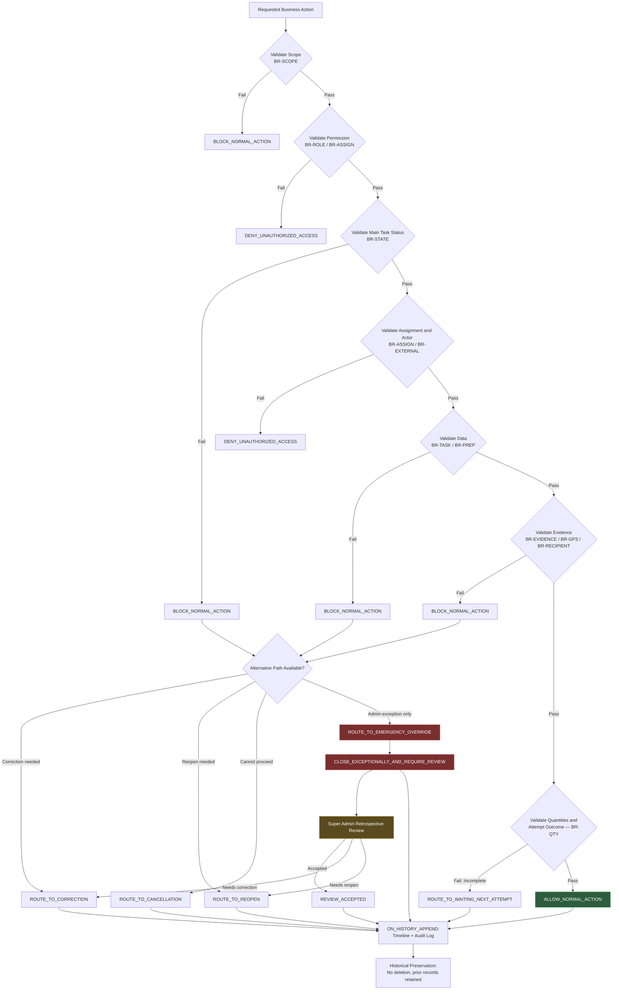

# กฎธุรกิจและกฎการตรวจสอบความถูกต้องของระบบ Dispatch

> [!summary]
> เอกสารฉบับนี้รวบรวมและจัดระบบกฎธุรกิจ (Business Rule) และกฎการตรวจสอบความถูกต้อง (Validation Rule) ที่ได้รับอนุมัติแล้วจาก [[01 - เป้าหมายของระบบ Dispatch]], [[02 - Workflow การทำงานของระบบ Dispatch]], [[03 - บทบาทและสิทธิ์ผู้ใช้งาน]] และ [[04 - สถานะของงานและกติกาการเปลี่ยนสถานะ]] รวมถึง [[05 - ข้อมูล หลักฐาน และรายละเอียดที่ต้องจัดเก็บในแต่ละงาน]] ให้เป็น Catalog เดียวที่สอดคล้องกัน (Consistent Rule Catalog) เอกสารฉบับนี้กำหนดลำดับความสำคัญของกฎ, นิยาม Business Rule แยกจาก Validation Rule, ระดับการบังคับใช้, ช่วงเวลาตรวจสอบ, Business Rule and Validation Matrix มากกว่า 100 รายการ, Checklist เฉพาะการกระทำอย่างน้อย 30 ชุด, ตัวอย่างสถานการณ์อย่างน้อย 24 กรณี และการประสานกับทะเบียนการตัดสินใจทางธุรกิจ (Business Decision Register) ซึ่ง [[07 - ขอบเขต MVP และทะเบียนการตัดสินใจทางธุรกิจ]] เป็นแหล่งอ้างอิงหลัก เอกสารฉบับนี้เป็นเอกสารระดับธุรกิจเท่านั้น **ไม่ใช่**เอกสารออกแบบฐานข้อมูล API หน้าจอ หรือ Test Case

เอกสารฉบับนี้ต่อยอดจาก Topics 1–5 ทั้งหมด เนื้อหาทั้งหมดต้องสอดคล้องกับการตัดสินใจทางธุรกิจที่ได้รับการอนุมัติแล้ว **ไม่แก้ไขหรือขัดแย้งกับ Topics 1–5** และจะไม่ตัดสินใจแทนเจ้าของธุรกิจในประเด็นที่ยังไม่ชัดเจน ประเด็นเหล่านั้นถูกรวบรวมและติดตามผ่าน BDR Decision ID ในหัวข้อ [40. Business Decision Register Synchronization](#40-business-decision-register-synchronization) และเอกสารต้นทางที่แท้จริงคือ [[07 - ขอบเขต MVP และทะเบียนการตัดสินใจทางธุรกิจ]]

> [!note] เกี่ยวกับชื่อไฟล์และลิงก์อ้างอิง
> เอกสาร [[02 - Workflow การทำงานของระบบ Dispatch]], [[03 - บทบาทและสิทธิ์ผู้ใช้งาน]] และ [[04 - สถานะของงานและกติกาการเปลี่ยนสถานะ]] อ้างอิงถึงเอกสารฉบับนี้ด้วยชื่อ "06 - กฎธุรกิจของระบบ Dispatch" ไฟล์นี้จึงกำหนด `aliases` ไว้ในส่วน Frontmatter เพื่อให้ลิงก์ภายใน Obsidian จากเอกสารทั้งสามฉบับยังคงเปิดถึงไฟล์นี้ได้ถูกต้อง โดยไม่ต้องแก้ไขไฟล์ต้นทางเหล่านั้น (ใช้หลักการเดียวกับที่ [[04 - สถานะของงานและกติกาการเปลี่ยนสถานะ]] และ [[05 - ข้อมูล หลักฐาน และรายละเอียดที่ต้องจัดเก็บในแต่ละงาน]] ใช้)

> [!important] Source of Truth — Topic 6 กับ Topic 7 (Synchronization Note)
> * **Topic 6 (เอกสารฉบับนี้)** ยังคงเป็นแหล่งอ้างอิงหลักของ **Business Rule (BR-xxx)** และ **Validation Rule (VR-xxx)** ทั้งหมด รวมถึงลำดับชั้นกฎ ระดับการบังคับใช้ ช่วงเวลาตรวจสอบ Matrix และ Checklist
> * **[[07 - ขอบเขต MVP และทะเบียนการตัดสินใจทางธุรกิจ]]** เป็นแหล่งอ้างอิงหลักของ **ทะเบียนการตัดสินใจทางธุรกิจ (Business Decision Register)** ทั้งหมด รวมถึงสถานะการตัดสินใจ (Decision Status), ลำดับความสำคัญ (Priority), เจ้าของการตัดสินใจ, จุดตรวจรับ (Approval Checkpoint), MVP Scope Lock, P0 Blocker, รายการเลื่อนไป Phase 2 และรายการที่ถ่ายโอนเป็นประเด็นทางเทคนิค
> * ประเด็นที่ยังไม่อนุมัติทุกรายการต้องถูกอ้างอิงผ่าน **BDR Decision ID** ใน Topic 7 เท่านั้น ไม่ใช่หมายเลขลำดับเดิมในหัวข้อ 40 ของเอกสารฉบับนี้
> * **ประเด็นที่ยังไม่ได้รับการยืนยันต้องไม่ถูก Implement ราวกับว่าได้รับการอนุมัติแล้ว** ไม่ว่าจะปรากฏใน Topic 6 หรือ Topic 7
> * **เอกสารฉบับนี้จะไม่ดูแลทะเบียนการตัดสินใจฉบับสมบูรณ์ชุดที่สอง** หัวข้อ [40](#40-business-decision-register-synchronization) ของเอกสารฉบับนี้เป็นเพียงบันทึกการประสาน (Synchronization Record) ไม่ใช่ทะเบียนคู่ขนาน

## 1. วัตถุประสงค์

เอกสารฉบับนี้มีวัตถุประสงค์เพื่อ

* รวบรวมกฎที่ได้รับอนุมัติแล้วจาก Topics 1–5 ให้เป็น Catalog เดียวของ Business Rule และ Validation Rule ที่ตรวจสอบย้อนกลับไปยังแหล่งที่มาได้เสมอ
* แยกแนวคิด **Business Rule** (นโยบายหรือความรับผิดชอบเชิงธุรกิจ) ออกจาก **Validation Rule** (การตรวจสอบก่อนอนุญาตให้ดำเนินการ) อย่างชัดเจน
* กำหนดลำดับชั้นความสำคัญของกฎ (Rule Precedence Model) เพื่อแก้ปัญหาเมื่อกฎหลายข้อดูเหมือนขัดแย้งกัน
* กำหนดระดับการบังคับใช้ (Enforcement Level) และช่วงเวลาตรวจสอบ (Validation Timing) ที่เป็นแนวคิดธุรกิจ ไม่ใช่ enum ทางเทคนิค
* อธิบาย Composite Action Validation สำหรับการกระทำสำคัญที่ต้องผ่านหลายกลุ่มเงื่อนไขพร้อมกัน
* ระบุเส้นทางทางเลือก (Correction, Reopen, Cancellation, Emergency Override) เมื่อ Validation ตามปกติไม่ผ่าน
* เป็นฐานอ้างอิงสำหรับการออกแบบ Validation Logic, Business Rule Engine, และ Test Case ในระยะถัดไป

เอกสารฉบับนี้เป็นเอกสารระดับธุรกิจเท่านั้น **ไม่ใช่**เอกสารออกแบบระบบ และ**ไม่ใช่**เอกสารกำหนด Test Case

## 2. ขอบเขตของเอกสาร

เอกสารฉบับนี้ครอบคลุม

* Business Rule และ Validation Rule ที่รวบรวมจาก Topics 1–5 ทั้งหมด
* ลำดับชั้นความสำคัญของกฎและหลักการแก้ไขข้อขัดแย้งที่ปรากฏ
* รูปแบบ Rule ID ระดับแนวคิด และระดับการบังคับใช้
* ช่วงเวลาการตรวจสอบและ Composite Action Validation
* กฎของ Phase 1 Scope, Task Creation, Preparation, Loading, Assignment, Delivery Start, Destination GPS Check-in, Handover, Recipient/Signature, Goods/Quantity, Delivery Attempt, Normal Internal Closure, External Courier, Cancellation, Returned-Goods, Reopen, Emergency Override, Super Admin Review, Correction Action, Evidence Governance, Sensitive Data Access และ Timeline/Audit
* Business Rule and Validation Matrix, Checklist เฉพาะการกระทำ, แผนภาพการประเมินกฎ (Mermaid หนึ่งแผนภาพ) และตัวอย่างสถานการณ์
* การโยงกฎกลับไปยัง Topic ต้นทาง (Rule Traceability)
* ประเด็นทางธุรกิจที่ยังไม่ได้รับการยืนยัน

เอกสารฉบับนี้**ไม่ได้กำหนด**

* โครงสร้างตารางฐานข้อมูลหรือคอลัมน์ฐานข้อมูล
* Prisma Model หรือ SQL Schema
* API Endpoints หรือ DTO
* HTTP Status Code หรือรูปแบบ Error Code
* Source Code, Class หรือ Function
* การออกแบบหน้าจอ (UI Screen) หรือ Form Layout
* กลไกทางเทคนิคของการแจ้งเตือน (Notification Implementation)
* กลไกทางเทคนิคของการยืนยันตัวตน (Authentication Implementation) หรือ Authorization Middleware
* กลไกทางเทคนิคของการจัดเก็บไฟล์ (File-storage Implementation)
* ไลบรารีหรืออัลกอริทึม GPS
* การ Implement แอปพลิเคชันมือถือหรือการซิงค์ข้อมูลออฟไลน์
* สถาปัตยกรรมการ Deploy หรือ Infrastructure หรือ CI/CD
* การ Implement Test Automation หรือ Test Case โดยละเอียด

การออกแบบทางเทคนิคทั้งหมดข้างต้นจะถูกจัดทำในระยะถัดไป โดยอ้างอิงจาก Business Rule ID ในเอกสารฉบับนี้

## 3. แหล่งที่มาของกฎ

เอกสารฉบับนี้ไม่สร้างกฎใหม่ด้วยตนเอง ทุกกฎในเอกสารฉบับนี้ต้องตรวจสอบย้อนกลับไปยังหนึ่งใน Topics 1–5 ได้เสมอ ยกเว้นกรณีที่ระบุไว้อย่างชัดเจนว่าเป็น "ข้อเสนอ" (Proposal) ซึ่งจะไม่ปรากฏในเอกสารฉบับนี้เว้นแต่จำเป็นต้องรวบรวมไว้เป็นประเด็นเปิดที่ติดตามผ่าน BDR Decision ID ในหัวข้อ [40](#40-business-decision-register-synchronization) และ [[07 - ขอบเขต MVP และทะเบียนการตัดสินใจทางธุรกิจ]]

| Topic | เนื้อหาหลักที่เป็นแหล่งที่มาของกฎ |
| --- | --- |
| [[01 - เป้าหมายของระบบ Dispatch]] | เป้าหมาย ขอบเขต Phase 1 และหลักการพื้นฐาน 12 ข้อของระบบ |
| [[02 - Workflow การทำงานของระบบ Dispatch]] | Workflow เชิงปฏิบัติการ หลักฐานบังคับ เงื่อนไขก่อนปิดงาน และ Workflow ข้อยกเว้น |
| [[03 - บทบาทและสิทธิ์ผู้ใช้งาน]] | บทบาท สิทธิ์ Task Ownership, Emergency Override, Reopen, Cancel, Correction Action และการเข้าถึงข้อมูลอ่อนไหว |
| [[04 - สถานะของงานและกติกาการเปลี่ยนสถานะ]] | Main Task Status, Delivery Attempt Outcome, Returned-Goods Status, Emergency Override Review Status และ Transition Rules |
| [[05 - ข้อมูล หลักฐาน และรายละเอียดที่ต้องจัดเก็บในแต่ละงาน]] | ขอบเขตข้อมูลและหลักฐาน ระดับความจำเป็น ระดับความอ่อนไหว และโมเดลการแก้ไข/ล็อก/Immutable |

รายละเอียดการโยงกฎแต่ละกลุ่มกลับไปยัง Topic ต้นทางอย่างสมบูรณ์อยู่ในหัวข้อ [39. Rule Traceability](#39-rule-traceability)

## 4. ลำดับชั้นและความสำคัญของกฎ

เมื่อพิจารณาว่าการกระทำหนึ่งได้รับอนุญาตหรือไม่ ต้องประเมินกฎตามลำดับชั้นความสำคัญต่อไปนี้เสมอ ลำดับที่สูงกว่ามีผลเหนือกว่าลำดับที่ต่ำกว่าเมื่อเกิดข้อขัดแย้งที่ปรากฏ

| ลำดับ | ระดับ | คำถามที่ตอบ |
| --- | --- | --- |
| 1 | Approved business scope และขอบเขต Phase 1 | การกระทำนี้อยู่ในขอบเขตที่อนุมัติแล้วหรือไม่ |
| 2 | กฎบทบาทและสิทธิ์ | ผู้กระทำการมีบทบาทที่ได้รับอนุญาตให้ทำสิ่งนี้หรือไม่ |
| 3 | Main Task Status และกฎการเปลี่ยนสถานะ | Task อยู่ในสถานะที่อนุญาตให้ทำสิ่งนี้หรือไม่ |
| 4 | ความเป็นเจ้าของ Task และ Delivery Attempt | ผู้กระทำการเป็นผู้รับผิดชอบหรือผู้มีอำนาจที่ถูกต้องสำหรับ Task/Attempt นี้หรือไม่ |
| 5 | ข้อกำหนดข้อมูลและหลักฐาน | ข้อมูลและหลักฐานที่จำเป็นครบถ้วนหรือไม่ |
| 6 | ความสอดคล้องของจำนวนและผลลัพธ์ | จำนวนและ Attempt Outcome สอดคล้องกันหรือไม่ |
| 7 | กฎการปิดงานตามปกติ | เงื่อนไขปิดงานตามปกติครบถ้วนหรือไม่ |
| 8 | กฎข้อยกเว้นและการแก้ไข | หากไม่ครบ มีเส้นทางข้อยกเว้นที่อนุมัติแล้วหรือไม่ |
| 9 | ธรรมาภิบาล Timeline และ Audit Log | ประวัติที่จำเป็นถูกบันทึกไว้หรือไม่ |
| 10 | Business Decision Register (Topic 7) | ประเด็นนี้ตรงกับ BDR Decision ID ที่ยังไม่อนุมัติใน [[07 - ขอบเขต MVP และทะเบียนการตัดสินใจทางธุรกิจ]] หรือไม่ |

### หลักการสำคัญของลำดับชั้น (BR-ROLE และ BR-STATE)

* **BR-ROLE-001** — การมีบทบาทไม่ได้ทำให้ทุกการเปลี่ยนสถานะถูกต้องโดยอัตโนมัติ (Possessing a role does not automatically make every transition valid) เช่น Admin มีสิทธิ์ Reopen แต่ Task ต้องอยู่ในสถานะ Terminal (COMPLETED หรือ CANCELLED) ก่อน — แหล่งที่มา: [[03 - บทบาทและสิทธิ์ผู้ใช้งาน]] หัวข้อ 3.3, [[04 - สถานะของงานและกติกาการเปลี่ยนสถานะ]] หัวข้อ 23
* **BR-STATE-001** — การเปลี่ยนสถานะที่ถูกต้องไม่ได้หมายความว่าหลักฐานบังคับครบถ้วนโดยอัตโนมัติ (A valid status transition does not automatically mean required evidence is complete) เช่น Task อยู่ที่ AT_DESTINATION อย่างถูกต้อง แต่ยังปิดงานไม่ได้หากขาดลายเซ็น — แหล่งที่มา: [[02 - Workflow การทำงานของระบบ Dispatch]] หัวข้อ 5.15, [[04 - สถานะของงานและกติกาการเปลี่ยนสถานะ]] หัวข้อ 12
* **BR-ROLE-002** — หลักฐานครบถ้วนไม่ได้ให้สิทธิ์แก่บทบาทที่ไม่ได้รับอนุญาตโดยอัตโนมัติ (Complete evidence does not automatically grant permission to an unauthorized role) เช่น Dispatcher มีหลักฐานครบถ้วนในมือ แต่ยังไม่มีสิทธิ์ปิด Task ภายใน — แหล่งที่มา: [[03 - บทบาทและสิทธิ์ผู้ใช้งาน]] หัวข้อ 7, 15.1
* **BR-ROLE-003** — อำนาจของ Admin ไม่ได้ข้ามข้อกำหนดปกติแบบเงียบ (Admin authority does not silently bypass normal requirements) การข้ามเงื่อนไขปกติทำได้เฉพาะผ่าน Emergency Override ที่มีการบันทึกอย่างชัดเจนเท่านั้น — แหล่งที่มา: [[03 - บทบาทและสิทธิ์ผู้ใช้งาน]] หัวข้อ 6
* **BR-STATE-002** — ข้อกำหนดปกติอาจถูกข้ามได้เฉพาะผ่านเส้นทาง Emergency Override ที่อนุมัติแล้วเท่านั้น (Normal requirements may be bypassed only through the approved Emergency Override path) — แหล่งที่มา: [[03 - บทบาทและสิทธิ์ผู้ใช้งาน]] หัวข้อ 16.2
* **BR-OVERRIDE-000** — Emergency Override ไม่ได้เขียนหลักฐานที่ขาดอยู่ให้กลายเป็นมีอยู่ (Emergency Override does not rewrite missing evidence as present) — แหล่งที่มา: [[04 - สถานะของงานและกติกาการเปลี่ยนสถานะ]] หัวข้อ 24
* **BR-CORRECTION-000** — Correction Action ไม่ได้เขียนทับข้อมูลย้อนหลังแบบเงียบ (Correction Action does not silently rewrite historical data) ค่าดั้งเดิมต้องยังคงมองเห็นได้เสมอ — แหล่งที่มา: [[03 - บทบาทและสิทธิ์ผู้ใช้งาน]] หัวข้อ 20.1
* **BR-REOPEN-000** — Reopen ไม่ได้ลบรอบสุดท้ายเดิม (Reopen does not delete the former final cycle) หลักฐานและ Attempt เดิมต้องยังคงถูกรักษาไว้ — แหล่งที่มา: [[04 - สถานะของงานและกติกาการเปลี่ยนสถานะ]] หัวข้อ 23
* **BR-ROLE-004** — อำนาจของ Super Admin ไม่ได้ลบล้างข้อกำหนดการรักษาประวัติ (Super Admin authority does not remove the requirement to preserve history) Super Admin ไม่มีสิทธิ์ลบ Task, Timeline, Audit Log หรือหลักฐานย้อนหลังไม่ว่ากรณีใด — แหล่งที่มา: [[03 - บทบาทและสิทธิ์ผู้ใช้งาน]] หัวข้อ 5
* **BR-STATE-003** — กฎที่มีลำดับความสำคัญต่ำกว่าต้องไม่ขัดแย้งกับกฎที่มีลำดับความสำคัญสูงกว่าที่ได้รับอนุมัติแล้วแบบเงียบ (No lower-priority rule may silently contradict a higher-priority approved rule) หากพบข้อขัดแย้งที่ปรากฏ ต้องบันทึกไว้อย่างชัดเจนตามหัวข้อ [4.1](#41-การจัดการข้อขัดแย้งที่ปรากฏ) ไม่ใช่เลือกตีความเอง
* **BR-STATE-004** — ประเด็นทางธุรกิจที่ยังไม่ได้รับการยืนยันต้องไม่ถูก Implement ราวกับว่าได้รับการอนุมัติแล้ว (An unresolved business decision must not be implemented as though it were approved) — ดูหัวข้อ [40](#40-business-decision-register-synchronization) และสถานะการตัดสินใจที่แท้จริงใน [[07 - ขอบเขต MVP และทะเบียนการตัดสินใจทางธุรกิจ]]

### 4.1 การจัดการข้อขัดแย้งที่ปรากฏ

เมื่อ Topics 1–5 ดูเหมือนขัดแย้งกัน เอกสารฉบับนี้ยึดหลักการต่อไปนี้

1. **รักษาการตัดสินใจที่ได้รับอนุมัติล่าสุดที่ระบุไว้อย่างชัดเจนไว้** (Preserve the most recently approved explicit decision)
2. **บันทึกข้อขัดแย้งที่ปรากฏไว้อย่างชัดเจน** (Document the apparent conflict) แทนที่จะซ่อนไว้
3. **ห้ามคิดค้นทางแก้ไขขึ้นเอง** (Do not invent a resolution) หากยังไม่มีการตัดสินใจที่ชัดเจนกว่าปรากฏใน Topics 1–5
4. **รวบรวมไว้ใน Final Report** เพื่อให้เจ้าของธุรกิจรับทราบ

ข้อขัดแย้งที่ปรากฏเพียงกรณีเดียวที่พบระหว่างจัดทำเอกสารฉบับนี้คือตัวอย่างสถานะในหัวข้อ 3.8 ของ [[01 - เป้าหมายของระบบ Dispatch]] (เช่น "รอ Admin ตรวจสอบ") เทียบกับโมเดล Main Task Status 10 สถานะที่ได้รับอนุมัติใน [[04 - สถานะของงานและกติกาการเปลี่ยนสถานะ]] ซึ่ง [[04 - สถานะของงานและกติกาการเปลี่ยนสถานะ]] หัวข้อ 5 ได้บันทึกการกระทบยอด (Reconciliation) นี้ไว้แล้วอย่างชัดเจนว่าเป็นตัวอย่างเชิงอธิบายใน Topic 1 ที่ถูกแทนที่ด้วยการตัดสินใจที่อนุมัติในภายหลังใน Topic 2 เวอร์ชัน 0.2 (พนักงานปิดงานเองได้โดยไม่ต้องรอ Admin ตรวจสอบก่อน) เอกสารฉบับนี้**ไม่สร้างข้อสรุปใหม่** เพียงยืนยันว่าการกระทบยอดของ Topic 4 มีผลบังคับใช้ต่อไป และ**ไม่มีข้อขัดแย้งอื่นที่ยังไม่ได้รับการกระทบยอด**ระหว่าง Topics 1–5 ณ เวลาที่จัดทำเอกสารฉบับนี้

## 5. Business Rule และ Validation Rule

เอกสารฉบับนี้แยกแนวคิดสองอย่างที่มักถูกปะปนกันออกจากกันอย่างชัดเจน

### 5.1 Business Rule

**Business Rule** คือข้อความที่อธิบายนโยบายเชิงปฏิบัติการ ความรับผิดชอบ ข้อกำหนด ข้อห้าม หรือผลลัพธ์ที่ได้รับอนุมัติแล้ว

> ตัวอย่าง: พนักงานส่งสินค้าภายในที่ได้รับมอบหมายเป็นผู้ปิด Task ของตนเองตามปกติ (BR-CLOSE-001)

### 5.2 Validation Rule

**Validation Rule** คือการตรวจสอบที่ใช้พิจารณาว่าการกระทำทางธุรกิจที่ตั้งใจไว้สามารถดำเนินต่อผ่าน Workflow ปกติได้หรือไม่

> ตัวอย่าง: ก่อนปิดงานภายในตามปกติ ต้องยืนยันว่าผู้กระทำการปิดงานคือพนักงานที่ได้รับมอบหมายในปัจจุบัน หรือผู้มีอำนาจอื่นที่ได้รับอนุมัติเป็นการเฉพาะ (VR-CLOSE-001a)

### 5.3 ความสัมพันธ์ระหว่างสองแนวคิด

* **Business Rule หนึ่งข้ออาจต้องการ Validation Rule หลายข้อ** เช่น BR-CLOSE-001 (พนักงานปิดงานของตนเอง) ต้องการ Validation Rule ที่ตรวจสอบทั้งตัวตนผู้ปิด, สถานะ Task, และหลักฐานครบถ้วน
* **Validation Rule ต้องอ้างอิงกลับไปยัง Business Rule ที่ได้รับอนุมัติเสมอ** ห้ามสร้าง Validation Rule ที่ไม่มี Business Rule รองรับ
* **ความล้มเหลวของ Validation ต้องไม่เขียนทับข้อมูลแบบเงียบ** (Validation failure must not silently mutate data) — การล้มเหลวต้องบล็อกการกระทำ หรือส่งเข้าสู่เส้นทางข้อยกเว้นที่ได้รับอนุมัติเท่านั้น
* **Validation ไม่ได้แทนที่การควบคุมสิทธิ์ กฎสถานะ หรือข้อกำหนด Audit** ทั้งสี่แนวคิด (Permission, Status Rule, Validation, Audit Requirement) เป็นอิสระต่อกันและต้องผ่านพร้อมกันตามลำดับชั้นในหัวข้อ [4](#4-ลำดับชั้นและความสำคัญของกฎ)
* **เอกสารฉบับนี้กำหนดพฤติกรรม Validation เชิงแนวคิดเท่านั้น ไม่ใช่ Validation Code ทางเทคนิค** ไม่มีการกำหนด Regular Expression, SQL Constraint, หรือ Exception Class ใด ๆ

## 6. รูปแบบ Rule ID

เอกสารฉบับนี้ใช้ Rule ID เชิงแนวคิดที่คงที่ (Stable Conceptual Rule ID) เพื่อการอ้างอิงข้ามหัวข้อ **Rule ID เหล่านี้ไม่ใช่ Database Identifier หรือ Source-code Constant** เป็นเพียงป้ายอ้างอิงระดับเอกสารเท่านั้น

| หมวดหมู่ | ความหมาย |
| --- | --- |
| BR-SCOPE-xxx | กฎขอบเขต Phase 1 |
| BR-TASK-xxx | กฎการสร้างและระบุตัวตน Task |
| BR-ROLE-xxx | กฎบทบาทและลำดับชั้นสิทธิ์ |
| BR-STATE-xxx | กฎ Main Task Status และการเปลี่ยนสถานะ |
| BR-ASSIGN-xxx | กฎการมอบหมายและความเป็นเจ้าของ Task |
| BR-PREP-xxx | กฎการเตรียมสินค้า |
| BR-ATTEMPT-xxx | กฎ Delivery Attempt |
| BR-GPS-xxx | กฎ Destination GPS Check-in |
| BR-EVIDENCE-xxx | กฎหลักฐานภาพถ่ายและไฟล์ |
| BR-RECIPIENT-xxx | กฎข้อมูลผู้รับสินค้า |
| BR-QTY-xxx | กฎจำนวนและผลลัพธ์สินค้า |
| BR-CLOSE-xxx | กฎการปิดงานตามปกติ |
| BR-EXTERNAL-xxx | กฎผู้ส่งสินค้าภายนอก |
| BR-CANCEL-xxx | กฎการยกเลิกงาน |
| BR-RETURN-xxx | กฎการรับคืนสินค้า |
| BR-REOPEN-xxx | กฎการเปิดงานกลับมาแก้ไข |
| BR-OVERRIDE-xxx | กฎ Emergency Override |
| BR-REVIEW-xxx | กฎการทบทวนย้อนหลังของ Super Admin |
| BR-CORRECTION-xxx | กฎ Correction Action และการแก้ไขหลักฐาน |
| BR-DATA-xxx | กฎธรรมาภิบาลข้อมูลและหลักฐาน |
| BR-AUDIT-xxx | กฎ Timeline และ Audit Log |
| BR-SECURITY-xxx | กฎการเข้าถึงข้อมูลอ่อนไหว |
| VR-xxx | Validation Rule ทั่วไปที่อ้างอิงกลับไปยัง Business Rule ข้างต้น |

**Rule ID ทุกรายการในเอกสารฉบับนี้ไม่ซ้ำกัน** (verified — ดูหัวข้อ [Final Report](#final-report) ท้ายเอกสาร) รูปแบบเลขลำดับใช้เลขสามหลักต่อท้ายรหัสหมวดหมู่ (เช่น BR-CLOSE-001, BR-CLOSE-002) ตัวอักษร a/b/c ต่อท้าย Validation Rule ใช้เมื่อ Validation หลายข้อรองรับ Business Rule เดียวกัน (เช่น VR-CLOSE-001a, VR-CLOSE-001b)

## 7. ระดับการบังคับใช้

เอกสารฉบับนี้กำหนดระดับการบังคับใช้เชิงธุรกิจ (Conceptual Enforcement Level) 7 ระดับ **ระดับเหล่านี้เป็นหมวดหมู่ระดับธุรกิจ ไม่ใช่ Enum การ Implement**

| ระดับ | ความหมาย |
| --- | --- |
| **HARD_BLOCK** | การกระทำปกติที่ร้องขอต้องไม่ดำเนินต่อในขณะที่เงื่อนไขยังไม่ผ่าน |
| **EXCEPTION_ONLY** | การกระทำปกติถูกบล็อก แต่ Emergency Override หรือเส้นทางข้อยกเว้นอื่นที่ได้รับอนุมัติอาจถูกใช้แทนได้ |
| **REASON_REQUIRED** | การกระทำอาจดำเนินต่อได้ก็ต่อเมื่อผู้กระทำการที่ได้รับอนุญาตบันทึกเหตุผลที่เป็นข้อบังคับ |
| **CORRECTION_REQUIRED** | ต้องมี Correction Action หรือ Evidence Correction ที่มีการควบคุมเกิดขึ้นก่อนที่การกระทำที่ได้รับผลกระทบจะถือว่าคลี่คลายแล้ว |
| **REVIEW_REQUIRED** | การกระทำเชิงปฏิบัติการอาจเสร็จสมบูรณ์ไปแล้ว แต่ยังคงมีการทบทวนย้อนหลังเชิงธรรมาภิบาลที่เป็นข้อบังคับค้างอยู่ |
| **ADVISORY** | เงื่อนไขควรถูกแสดงเพื่อการรับรู้เชิงปฏิบัติการ แต่ไม่ได้ให้อำนาจหรือบล็อกการกระทำโดยตัวมันเอง |
| **AUDIT_ONLY** | การกระทำได้รับอนุญาตให้ดำเนินการ แต่ต้องบันทึกประวัติที่ไม่เปลี่ยนแปลง (Immutable History) |

### หลักการที่ต้องยึดถือ

* ระดับเหล่านี้เป็นหมวดหมู่การบังคับใช้ระดับธุรกิจเท่านั้น ไม่ใช่ Implementation Enum
* **ADVISORY ต้องไม่ถูกใช้เพื่อลดทอนหลักฐานบังคับ** — หลักฐานที่เป็น REQUIRED ตาม [[05 - ข้อมูล หลักฐาน และรายละเอียดที่ต้องจัดเก็บในแต่ละงาน]] หัวข้อ 4 ต้องไม่ถูกจัดเป็น ADVISORY
* **HARD_BLOCK เป็นค่าเริ่มต้นสำหรับหลักฐานบังคับการปิดงานตามปกติที่ขาดอยู่** (post-loading photo, GPS check-in, handover photo, recipient name/phone/signature, ส่งมอบครบทุกรายการ)
* **Emergency Override เปลี่ยนเส้นทางการปิดงาน ไม่ได้ทำให้ Validation ปกติผ่าน** (Emergency Override changes the closure path; it does not make the normal validation pass) — Task ที่ปิดผ่าน Override ยังคงมี Evidence Completeness = OVERRIDE_CLOSED ตาม [[05 - ข้อมูล หลักฐาน และรายละเอียดที่ต้องจัดเก็บในแต่ละงาน]] หัวข้อ 34 ไม่ใช่ COMPLETE_NORMAL
* **REVIEW_REQUIRED ไม่ได้หมายความว่า Task ต้องยังคงเปิดอยู่เชิงปฏิบัติการ** — Task อาจเป็น COMPLETED หรือ CANCELLED แล้ว ในขณะที่ Emergency Override Review Status ยังเป็น PENDING_REVIEW
* **AUDIT_ONLY ไม่ได้หมายความว่าการกระทำนั้นไม่มีการกำกับดูแล** — ยังคงต้องมี Actor, เหตุผล (เมื่อจำเป็น) และ Audit Log Event เสมอ

## 8. ช่วงเวลาที่ตรวจสอบ

เอกสารฉบับนี้กำหนดช่วงเวลาตรวจสอบเชิงแนวคิด (Conceptual Validation Timing) 20 ช่วง

| # | ช่วงเวลา | ความหมาย |
| --- | --- | --- |
| 1 | ON_CREATE | ขณะสร้าง Task |
| 2 | BEFORE_PREPARATION | ก่อนเริ่มการเตรียมสินค้า |
| 3 | BEFORE_READY_CONFIRMATION | ก่อนยืนยันความพร้อมจัดส่ง |
| 4 | BEFORE_ASSIGNMENT | ก่อนมอบหมายผู้ส่งสินค้า |
| 5 | BEFORE_DELIVERY_START | ก่อนเริ่มการจัดส่ง |
| 6 | DURING_DELIVERY | ระหว่างการเดินทาง |
| 7 | BEFORE_DESTINATION_CHECK_IN | ก่อนการ Check-in ที่ปลายทาง |
| 8 | BEFORE_ATTEMPT_RESULT | ก่อนบันทึกผล Delivery Attempt |
| 9 | BEFORE_NORMAL_CLOSURE | ก่อนปิดงานตามปกติ |
| 10 | BEFORE_CANCELLATION | ก่อนยกเลิกงาน |
| 11 | BEFORE_RETURN_CONFIRMATION | ก่อนยืนยันรับคืนสินค้า |
| 12 | BEFORE_REOPEN | ก่อนเปิดงานกลับมาแก้ไข |
| 13 | BEFORE_CORRECTION | ก่อนดำเนินการ Correction Action |
| 14 | BEFORE_EMERGENCY_OVERRIDE | ก่อนใช้ Emergency Override |
| 15 | AFTER_EMERGENCY_OVERRIDE | หลังใช้ Emergency Override ทันที |
| 16 | BEFORE_OVERRIDE_REVIEW | ก่อน Super Admin เริ่มทบทวนย้อนหลัง |
| 17 | BEFORE_SENSITIVE_DATA_ACCESS | ก่อนเข้าถึงข้อมูลอ่อนไหว |
| 18 | BEFORE_EXPORT | ก่อนส่งออกรายงานหรือหลักฐาน |
| 19 | ON_HISTORY_APPEND | ขณะเพิ่มเหตุการณ์ Timeline หรือ Audit Log |
| 20 | PERIODIC_GOVERNANCE_REVIEW | การทบทวนเชิงธรรมาภิบาลตามรอบเวลา |

> [!note]
> **หนึ่งกฎอาจถูกตรวจสอบได้มากกว่าหนึ่งช่วงเวลา** เช่น ข้อกำหนดเรื่องเหตุผลบังคับของการยกเลิกงาน (BR-CANCEL-002) ถูกตรวจสอบทั้งที่ BEFORE_CANCELLATION (ก่อนดำเนินการ) และ ON_HISTORY_APPEND (ขณะบันทึกเหตุการณ์) เช่นเดียวกับ Destination GPS Check-in ที่ถูกตรวจสอบทั้งที่ BEFORE_DESTINATION_CHECK_IN และอีกครั้งที่ BEFORE_NORMAL_CLOSURE ในฐานะเงื่อนไขบังคับก่อนปิดงาน

## 9. Composite Action Validation

การกระทำสำคัญ เช่น การเปลี่ยนสถานะปกติหรือการปิดงาน ต้องผ่านกลุ่มเงื่อนไขต่อไปนี้พร้อมกันในเชิงแนวคิด **ความล้มเหลวในกลุ่มใดกลุ่มหนึ่งต้องไม่ถูกซ่อนไว้ด้วยความสำเร็จของกลุ่มอื่น**

1. บทบาทและสิทธิ์ (Role and Permission)
2. ขอบเขตการเข้าถึง Task (Task Access Scope)
3. Main Task Status ปัจจุบัน
4. ความรับผิดชอบที่ได้รับมอบหมาย (Assigned Responsibility)
5. ตัวตนผู้กระทำการ (Actor Identity)
6. การระบุฝ่ายผู้จัดส่งทางกายภาพ (Physical Delivery Party Attribution)
7. บริบทของ Delivery Attempt
8. ข้อมูลที่จำเป็น (Required Data)
9. หลักฐานที่จำเป็น (Required Evidence)
10. ความสอดคล้องของจำนวน (Quantity Consistency)
11. ความสอดคล้องของ Attempt Outcome
12. ภาระหน้าที่การคืนสินค้า (Returned-Goods Obligation) เมื่อเกี่ยวข้อง
13. บริบท Emergency Override เมื่อเกี่ยวข้อง
14. บริบท Correction หรือ Reopen เมื่อเกี่ยวข้อง
15. ข้อกำหนด Timeline และ Audit Log

### ตัวอย่างที่แสดงว่าความสำเร็จกลุ่มหนึ่งไม่ปิดบังความล้มเหลวของอีกกลุ่มหนึ่ง

* หลักฐานที่ถูกต้องครบถ้วนแต่ถูกส่งโดยพนักงานที่ไม่ได้รับมอบหมาย **ไม่ทำให้ได้รับอำนาจปิดงาน** (กลุ่ม 8–9 ผ่าน แต่กลุ่ม 4–5 ไม่ผ่าน)
* พนักงานที่ได้รับมอบหมายถูกต้องแต่ขาดหลักฐาน GPS บังคับ **ยังปิดงานตามปกติไม่ได้** (กลุ่ม 4–5 ผ่าน แต่กลุ่ม 9 ไม่ผ่าน)
* สถานะถูกต้องแต่จำนวนไม่สอดคล้องกัน **ยังไม่อนุญาตให้บันทึกผล SUCCESS** (กลุ่ม 3 ผ่าน แต่กลุ่ม 10–11 ไม่ผ่าน)
* การปิดงานภายนอกโดย Admin ต้อง**รักษาความแตกต่างระหว่างผู้ส่งสินค้าภายนอกทางกายภาพกับ Admin ผู้กระทำการที่ยืนยันตัวตนแล้วในระบบ** เสมอ (กลุ่ม 5–6 ต้องแยกกันแม้กลุ่มอื่นผ่านทั้งหมด)

Composite Action Validation โดยละเอียดสำหรับการปิดงานตามปกติปรากฏในหัวข้อ [35. Normal Closure Validation Checklist](#35-normal-closure-validation-checklist)

## 10. Phase 1 Scope Rules

Phase 1 ของ Dispatch ครอบคลุมงานจัดส่งสินค้าขาออก (Outbound Goods Delivery) เป็นหลัก แบ่งเป็น Internal Delivery และ External Courier Delivery เท่านั้น

| Rule ID | Business Rule | Enforcement | แหล่งที่มา |
| --- | --- | --- | --- |
| BR-SCOPE-001 | Phase 1 ครอบคลุมงานจัดส่งสินค้าขาออกภายในและภายนอกเท่านั้น | HARD_BLOCK | Topic 1 §7, Topic 5 §7 |
| BR-SCOPE-002 | หมวดหมู่งานในอนาคต (ส่งเอกสาร, รับเอกสาร, รับสินค้า, รับสินค้าคืน, งานผสม) ต้องไม่ถูกปฏิบัติเป็นความสามารถปัจจุบันที่อนุมัติแล้ว | HARD_BLOCK | Topic 2 §18, §20; Topic 5 §7 |
| BR-SCOPE-003 | หลักฐานบังคับของงานจัดส่งสินค้าปัจจุบันต้องไม่ถูกสันนิษฐานว่าเหมาะสมกับ Task ประเภทในอนาคตโดยอัตโนมัติ | ADVISORY | Topic 5 §7 |
| BR-SCOPE-004 | การติดตามเอกสารที่ลูกค้าส่งคืนยังคงเป็นข้อมูลทางเลือก (Optional) ในขอบเขตปัจจุบัน | ADVISORY | Topic 2 §14 |
| BR-SCOPE-005 | ผู้ส่งสินค้าภายนอกไม่มีสิทธิ์เข้าถึงระบบ Dispatch โดยตรงใน Phase 1 และห้ามคิดค้นบทบาทเข้าสู่ระบบสำหรับผู้ส่งภายนอกขึ้นเอง | HARD_BLOCK | Topic 3 §4.7, §11 |
| BR-SCOPE-006 | ลูกค้าหรือผู้รับสินค้าไม่มีสิทธิ์เข้าถึงระบบ Dispatch โดยตรงใน Phase 1 | HARD_BLOCK | Topic 3 §4.8, §12 |

### Validation Rules

* **VR-SCOPE-001a** — ก่อนสร้างหรือประมวลผล Task ประเภทใด ตรวจสอบว่าประเภทงานอยู่ในขอบเขต Phase 1 ที่อนุมัติแล้ว (Internal หรือ External Goods Delivery) — Timing: ON_CREATE — อ้างอิง BR-SCOPE-001, BR-SCOPE-002
* **VR-SCOPE-002a** — ก่อนกำหนดหลักฐานบังคับใหม่สำหรับ Task ประเภทใด ตรวจสอบว่ามีการอนุมัติชัดเจนหรือยังเป็นประเด็นเปิด — Timing: ON_CREATE — อ้างอิง BR-SCOPE-003

## 11. Task Creation Rules

| Rule ID | Business Rule | Enforcement | แหล่งที่มา |
| --- | --- | --- | --- |
| BR-TASK-001 | Task ต้องมีเลขที่งาน (Task Identifier) ที่ตรวจสอบย้อนกลับได้และคงที่ตลอดอายุ Task รวมถึงหลัง Reopen | HARD_BLOCK | Topic 5 §6 |
| BR-TASK-002 | Task ต้องระบุประเภทงาน (Task Type) และวิธีการจัดส่ง (Internal/External) | HARD_BLOCK | Topic 5 §6, §7 |
| BR-TASK-003 | ชื่อปลายทางสมบูรณ์และที่อยู่สมบูรณ์เป็นข้อบังคับ ไม่ว่าจะมาจาก Customer Master หรือ Free-text — ทุก Task ต้องบันทึกแหล่งที่มาของปลายทาง (Destination Source) เป็น MASTER หรือ FREE_TEXT เสมอ — ผู้สร้างงานต้องค้นหา/เลือก Customer Master ก่อนเสมอ — Free-text ใช้ได้เฉพาะเมื่อไม่มี Master ที่เหมาะสมหรือปลายทางเป็นแบบเฉพาะกิจ — Free-text ต้องไม่ใช้สร้างหรือเชื่อมโยง Master Record โดยอัตโนมัติ — สิทธิ์เพิ่ม/แก้ไข Customer Master เป็นประเด็นแยกต่างหากยังไม่ได้รับการอนุมัติ (BDR-CUSTOMER-001 Option C, BDR-CUSTOMER-002 Option B — อนุมัติ 2026-07-20) | HARD_BLOCK | Topic 2 §5.2; Topic 5 §6, §8; Topic 7 §15.1 |
| BR-TASK-004 | วันที่วางแผนจัดส่งต้องถูกบันทึกสำหรับ Task ปัจจุบันที่เกี่ยวข้อง | HARD_BLOCK | Topic 5 §6 |
| BR-TASK-005 | เลขที่เอกสารอ้างอิงทางธุรกิจต้องถูกบันทึกเมื่อเกี่ยวข้อง แต่ชุดที่บังคับยังไม่ได้ข้อสรุป | CONDITIONAL / ADVISORY | Topic 5 §6 (เปิด — ดู [[07 - ขอบเขต MVP และทะเบียนการตัดสินใจทางธุรกิจ]] BDR-TASK-001) |
| BR-TASK-006 | ผู้สร้างงานต้องระบุตัวตนได้เสมอ | HARD_BLOCK | Topic 1 §3.3; Topic 5 §6 |
| BR-TASK-007 | DRAFT ไม่ใช่สถานะปฏิบัติการ (Non-operational) — ห้ามมอบหมายผู้ส่งสินค้าหรือเริ่มเบิกสินค้าขณะยังเป็น DRAFT | HARD_BLOCK | Topic 4 §6 |
| BR-TASK-008 | Task ต้องไม่เข้าสู่ขั้นตอนเตรียมงานเชิงปฏิบัติการ (WAITING_PREPARATION) เมื่อข้อมูลหลักยังไม่ครบถ้วน | HARD_BLOCK | Topic 4 §6, §7 |
| BR-TASK-009 | ทุก Task ต้องสร้างและรักษา Historical Destination Snapshot แบบ Immutable — ประกอบด้วยชื่อปลายทางสมบูรณ์, ที่อยู่สมบูรณ์ และ Destination Source (MASTER/FREE_TEXT) อย่างน้อย — ไม่ถูกเขียนทับหรือลบแบบเงียบด้วยข้อมูลหลักที่เปลี่ยนแปลงภายหลัง — ตรวจสอบย้อนกลับได้เสมอ | HARD_BLOCK | Topic 5 §8 |
| BR-TASK-010 | ห้ามสร้าง Task ใหม่ซ้ำเพียงเพราะ Delivery Attempt ล้มเหลวหรือส่งมอบเพียงบางส่วน — ต้องใช้ Task เดิมเสมอ | HARD_BLOCK | Topic 2 §10; Topic 4 §17 |

### Validation Rules

* **VR-TASK-001a** — ก่อนบันทึกงานเป็น WAITING_PREPARATION ตรวจสอบว่า: ชื่อปลายทางครบถ้วน, ที่อยู่ปลายทางครบถ้วน, รายการสินค้ายืนยันครบถ้วน, Destination Source บันทึกเป็น MASTER หรือ FREE_TEXT เสมอ, มีการค้นหา Customer Master ก่อนเสมอ, ใช้ FREE_TEXT ได้เฉพาะเมื่อไม่มี Master ที่เหมาะสมหรือปลายทางเป็นแบบเฉพาะกิจ, และ FREE_TEXT ต้องไม่สร้างหรือเชื่อมโยง Customer Master Record โดยอัตโนมัติ — Timing: BEFORE_PREPARATION — อ้างอิง BR-TASK-003, BR-TASK-008 — Enforcement: HARD_BLOCK
* **VR-TASK-002a** — ก่อนเริ่มการจัดส่งของ Attempt ใด ตรวจสอบว่า: มี Historical Destination Snapshot ที่บังคับสร้างแล้ว, Snapshot มีชื่อปลายทางครบถ้วน, Snapshot มีที่อยู่ปลายทางครบถ้วน, Snapshot บันทึก Destination Source เป็น MASTER หรือ FREE_TEXT, Snapshot ถูกแยกเก็บจากข้อมูล Customer Master ปัจจุบัน, Snapshot เป็น Immutable และการเปลี่ยนแปลงข้อมูลหลักลูกค้าในภายหลังต้องไม่เขียนทับหรือลบ Snapshot แบบเงียบ — Timing: BEFORE_DELIVERY_START — อ้างอิง BR-TASK-009, BR-DATA-003 — Enforcement: HARD_BLOCK
* **VR-TASK-003a** — เมื่อ Attempt ล้มเหลว บางส่วน หรือถูกเลื่อนนัด ตรวจสอบว่าการดำเนินการถัดไปอ้างอิง Task เดิม ไม่ใช่สร้าง Task ใหม่ — Timing: BEFORE_ATTEMPT_RESULT — อ้างอิง BR-TASK-010

## 12. Preparation Rules

| Rule ID | Business Rule | Enforcement | แหล่งที่มา |
| --- | --- | --- | --- |
| BR-PREP-001 | ผู้เตรียมสินค้าต้องระบุตัวตนได้เสมอ | HARD_BLOCK | Topic 5 §10 |
| BR-PREP-002 | จำนวนที่วางแผนและจำนวนที่เตรียมจริงต้องตรวจสอบย้อนกลับได้แยกจากกัน | HARD_BLOCK | Topic 5 §9 |
| BR-PREP-003 | ความไม่ตรงกันที่พบระหว่างเตรียมสินค้าต้องถูกบันทึกและแก้ไขก่อนดำเนินการต่อ | HARD_BLOCK | Topic 2 §5.5 |
| BR-PREP-004 | การยืนยันความพร้อมจัดส่ง (Ready-for-Dispatch Confirmation) ต้องไม่ระบุเท็จว่าการเตรียมงานเสร็จสมบูรณ์แล้วทั้งที่ยังมีข้อผิดพลาดค้างอยู่ | HARD_BLOCK | Topic 2 §5.8 |
| BR-PREP-005 | Stock มีสิทธิ์แก้ไขข้อมูลการเตรียมสินค้าได้เฉพาะก่อน Task เข้าสู่ IN_TRANSIT เท่านั้น (Stock Edit Lock) | HARD_BLOCK | Topic 3 §14.2; Topic 4 §27 |
| BR-PREP-006 | Stock อาจรายงานความไม่ตรงกันที่พบหลัง IN_TRANSIT แต่ไม่มีสิทธิ์แก้ไขข้อมูลการเตรียมสินค้าด้วยตนเอง | HARD_BLOCK | Topic 3 §8, §14.2 |
| BR-PREP-007 | การแก้ไขข้อมูลการเตรียมสินค้าหลัง IN_TRANSIT ต้องผ่าน Preparation Correction/Exception Record ที่สร้างโดย Admin (ผู้สร้างปกติ) แล้วเข้าสู่ Governance Review Queue ที่มี Super Admin ทบทวนย้อนหลังแบบบังคับ Super Admin อาจยืนยัน เพิ่มหมายเหตุ ร้องขอข้อมูล กำหนดให้แก้ไขใหม่ กำหนดให้ Reopen หรือ Escalate Super Admin ไม่ใช่ผู้สร้างปกติ Stock และ Dispatcher ไม่มีสิทธิ์ | CORRECTION_REQUIRED | Topic 3 §14.2; Topic 4 §27; Topic 5 §11 |
| BR-PREP-008 | Admin อาจสร้าง Preparation Correction/Exception Record ได้ทันทีในทุกกรณีหลัง IN_TRANSIT โดยไม่ต้องรอการอนุมัติล่วงหน้าจาก Super Admin แต่ทุกบันทึกต้องเข้าสู่ Governance Review Queue เพื่อรับการทบทวนย้อนหลังภาคบังคับจาก Super Admin เสมอ และต้องจัดประเภท Materiality อย่างน้อยเป็น NORMAL หรือ MATERIAL (Materiality กำหนดความเร่งด่วนของการแจ้งเตือนและลำดับการทบทวนเท่านั้น ไม่จำกัดสิทธิ์การสร้างบันทึกของ Admin) | CORRECTION_REQUIRED | Topic 3 §14.2; Topic 4 §27; อนุมัติ 2026-07-20 — BDR-PREP-001 Option C, BDR-PREP-004 Option A (ดู [[07 - ขอบเขต MVP และทะเบียนการตัดสินใจทางธุรกิจ]] §15.1) |

### Validation Rules

* **VR-PREP-001a** — ก่อนออกจาก PREPARING เข้าสู่ READY_FOR_DISPATCH ตรวจสอบว่าไม่มีข้อผิดพลาดที่ยังไม่ได้แก้ไขค้างอยู่ — Timing: BEFORE_READY_CONFIRMATION — อ้างอิง BR-PREP-003, BR-PREP-004
* **VR-PREP-002a** — เมื่อ Task เข้าสู่ IN_TRANSIT ตรวจสอบว่าสิทธิ์แก้ไขข้อมูลการเตรียมสินค้าของ Stock ถูกล็อกทันที — Timing: BEFORE_DELIVERY_START — อ้างอิง BR-PREP-005
* **VR-PREP-003a** — เมื่อ Stock รายงานความไม่ตรงกันหลัง IN_TRANSIT ตรวจสอบว่า Preparation Correction/Exception Record ถูกสร้างโดย Admin (ผู้สร้างปกติ) และเข้าสู่ Governance Review Queue สำหรับ Super Admin ทบทวนย้อนหลังแบบบังคับ — Super Admin ไม่ใช่ผู้สร้างปกติ Stock และ Dispatcher ไม่มีสิทธิ์สร้าง — Timing: BEFORE_CORRECTION — อ้างอิง BR-PREP-006, BR-PREP-007

## 13. Loading Rules

| Rule ID | Business Rule | Enforcement | แหล่งที่มา |
| --- | --- | --- | --- |
| BR-EVIDENCE-001 | ต้องมีรูปภาพหลังโหลดสินค้าขึ้นยานพาหนะอย่างน้อย 1 รูปสำหรับการปิดงานจัดส่งสินค้าตามปกติในปัจจุบัน | HARD_BLOCK | Topic 2 §5.6; Topic 5 §11 |
| BR-EVIDENCE-002 | รูปภาพหลังโหลดสินค้าต้องเชื่อมโยงกับ Delivery Attempt ที่เกี่ยวข้องได้ | HARD_BLOCK | Topic 5 §11 |
| BR-EVIDENCE-003 | ห้ามให้ Task ดำเนินต่อสู่ขั้นตอนจัดส่งตามปกติหากยังไม่มีรูปภาพหลังโหลดสินค้า | HARD_BLOCK | Topic 2 §5.6 |
| BR-EVIDENCE-004 | หลักฐานเสริมก่อนจัดส่ง (Serial Number, บรรจุภัณฑ์, อุปกรณ์เสริม) เป็นเงื่อนไข (Conditional) ตามประเภทสินค้า ไม่ใช่ข้อบังคับสากล | CONDITIONAL | Topic 2 §5.6, §14 |

### Validation Rules

* **VR-LOAD-001a** — ก่อนเข้าสู่ READY_FOR_DISPATCH ตรวจสอบว่ามีรูปภาพหลังโหลดสินค้าอย่างน้อย 1 รูปที่เชื่อมโยงกับ Attempt ปัจจุบัน — Timing: BEFORE_READY_CONFIRMATION — อ้างอิง BR-EVIDENCE-001, BR-EVIDENCE-002, BR-EVIDENCE-003

## 14. Assignment Rules

| Rule ID | Business Rule | Enforcement | แหล่งที่มา |
| --- | --- | --- | --- |
| BR-ASSIGN-001 | หนึ่ง Task มีผู้รับผิดชอบหลักในระบบหนึ่ง User Login เท่านั้น | HARD_BLOCK | Topic 3 §3.2, §13.3 |
| BR-ASSIGN-002 | ห้ามใช้บัญชีผู้ใช้งานร่วมกัน (Shared Login Credential) ไม่ว่ากรณีใด | HARD_BLOCK | Topic 3 §13.4, §24 |
| BR-ASSIGN-003 | ผู้กระทำการมอบหมายและวันเวลาที่มอบหมายต้องระบุตัวตนได้เสมอ | HARD_BLOCK | Topic 5 §12 |
| BR-ASSIGN-004 | ประวัติการมอบหมายเดิมและใหม่ต้องถูกรักษาไว้เมื่อมีการเปลี่ยนตัวผู้รับผิดชอบ (Reassignment) — ห้ามเขียนทับ | HARD_BLOCK | Topic 3 §13.5; Topic 5 §12 |
| BR-ASSIGN-005 | พนักงานที่ร่วมปฏิบัติงานทางกายภาพ (Supporting Employee) อาจร่วมเดินทางได้ แต่ไม่กลายเป็นผู้ปิด Task โดยอัตโนมัติ | HARD_BLOCK | Topic 3 §13.4 |
| BR-ASSIGN-006 | ผู้ส่งสินค้าภายนอกต้องไม่ถูกแทนความหมายว่าเป็น Admin ผู้กระทำการที่ยืนยันตัวตนแล้วในระบบ | HARD_BLOCK | Topic 3 §3.5, §11; Topic 4 §19 |
| BR-ASSIGN-007 | Dispatcher อาจมอบหมายหรือประสานงานได้ตามสิทธิ์ แต่ไม่ใช่ผู้ปิดงานของ Task ไม่ว่ากรณีใด | HARD_BLOCK | Topic 3 §4.3, §7 |
| BR-ASSIGN-008 | Super Admin เท่านั้นที่มีอำนาจมอบหมายใหม่ (Reassign) Task ที่ถูก Reopen เมื่อพนักงานเดิมไม่พร้อมปฏิบัติงาน | HARD_BLOCK | Topic 3 §13.5, §17 |
| BR-ASSIGN-009 | ก่อนเริ่มจัดส่งต้องมีผู้รับผิดชอบหลักที่ใช้บังคับได้แล้ว (Valid Applicable Responsible Party) | HARD_BLOCK | Topic 4 §10 |

### Validation Rules

* **VR-ASSIGN-001a** — ก่อนมอบหมายผู้ส่งสินค้า ตรวจสอบว่า Task ยังไม่มีผู้รับผิดชอบหลักที่ Active อยู่พร้อมกันสองบัญชี — Timing: BEFORE_ASSIGNMENT — อ้างอิง BR-ASSIGN-001
* **VR-ASSIGN-002a** — ก่อนเริ่มจัดส่ง ตรวจสอบว่าผู้รับผิดชอบหลักถูกกำหนดไว้แล้วและไม่ใช่บัญชีที่ใช้ร่วมกัน — Timing: BEFORE_DELIVERY_START — อ้างอิง BR-ASSIGN-002, BR-ASSIGN-009
* **VR-ASSIGN-003a** — ก่อนปิด Task ที่ถูก Reopen ตรวจสอบว่าผู้ปิดงานคือพนักงานที่ได้รับมอบหมายใหม่หรือ Super Admin เท่านั้น ไม่ใช่ Dispatcher — Timing: BEFORE_NORMAL_CLOSURE — อ้างอิง BR-ASSIGN-007, BR-ASSIGN-008

## 15. Delivery Start Rules

| Rule ID | Business Rule | Enforcement | แหล่งที่มา |
| --- | --- | --- | --- |
| BR-ATTEMPT-001 | การเริ่มจัดส่งต้องระบุตัวตนผู้กระทำการได้เสมอ | HARD_BLOCK | Topic 5 §13 |
| BR-ATTEMPT-002 | การเริ่มจัดส่งต้องผูกกับ Delivery Attempt ที่เจาะจงหนึ่งรายการ | HARD_BLOCK | Topic 4 §17; Topic 5 §19 |
| BR-ATTEMPT-003 | Task ต้องอยู่ในสถานะ ASSIGNED ก่อนเริ่มจัดส่งได้ | HARD_BLOCK | Topic 4 §10 |
| BR-GPS-001 | Phase 1 ไม่มีข้อกำหนด GPS ขณะเริ่มจัดส่ง — ห้ามกำหนด Start-location GPS เป็นข้อบังคับใหม่ | ADVISORY | Topic 2 §5.9; Topic 4 §11 |
| BR-GPS-002 | ห้ามกำหนด Geofence หรือเกณฑ์ระยะทางขณะเริ่มจัดส่ง | ADVISORY | Topic 2 §5.9 |
| BR-PREP-009 | เมื่อ Task เข้าสู่ IN_TRANSIT หลักฐานการโหลดสินค้าที่มีอยู่ต้องยังคงเชื่อมโยงกับรอบการจัดส่งนั้น | HARD_BLOCK | Topic 5 §13 |

### Validation Rules

* **VR-START-001a** — ก่อนเริ่มจัดส่ง ตรวจสอบว่า Task อยู่ในสถานะ ASSIGNED และมีผู้รับผิดชอบหลักที่ใช้บังคับได้แล้ว — Timing: BEFORE_DELIVERY_START — อ้างอิง BR-ATTEMPT-001, BR-ATTEMPT-003, BR-ASSIGN-009
* **VR-START-002a** — ขณะเริ่มจัดส่ง ตรวจสอบว่าไม่มีการเรียกร้องพิกัด GPS เป็นเงื่อนไขบังคับ — Timing: BEFORE_DELIVERY_START — อ้างอิง BR-GPS-001, BR-GPS-002 — **การขาด Start GPS ต้องไม่ถูกปฏิบัติเหมือนเป็นความล้มเหลว เนื่องจากไม่ใช่ข้อกำหนดที่ได้รับอนุมัติ**

## 16. Destination GPS Check-in Rules

| Rule ID | Business Rule | Enforcement | แหล่งที่มา |
| --- | --- | --- | --- |
| BR-GPS-003 | Destination GPS Check-in เป็นข้อบังคับก่อนการปิดงานตามปกติของ Task จัดส่งสินค้าทุกกรณีในขอบเขตปัจจุบัน | HARD_BLOCK | Topic 2 §5.11; Topic 4 §12 |
| BR-GPS-004 | Check-in ต้องผูกกับ Delivery Attempt ปัจจุบัน — Check-in ของ Attempt ก่อนหน้าต้องไม่ถูกใช้แทน Attempt ใหม่โดยอัตโนมัติ | HARD_BLOCK | Topic 2 §5.11; Topic 5 §14 |
| BR-GPS-005 | ห้ามใช้ Geofence, เกณฑ์ระยะทาง, หรือคำเตือน/บล็อกจากระยะ GPS ใด ๆ ที่ยังไม่ได้รับอนุมัติ | ADVISORY | Topic 2 §5.11; Topic 4 §16, §27 |
| BR-GPS-006 | พิกัด GPS ที่บันทึกไว้ไม่สามารถพิสูจน์อัตลักษณ์ที่แน่ชัดของผู้รับสินค้าได้ | ADVISORY | Topic 2 §5.11; Topic 5 §14 |
| BR-GPS-007 | หลักฐาน Check-in เดิมต้องไม่ถูกแทนที่แบบเงียบ | HARD_BLOCK | Topic 5 §14 |
| BR-GPS-008 | การขาด Check-in อาจถูกข้ามได้เฉพาะผ่าน Emergency Override โดย Admin เท่านั้น | EXCEPTION_ONLY | Topic 2 §5.11; Topic 3 §16.2 |
| BR-GPS-009 | เกณฑ์คุณภาพ GPS (ความแม่นยำ, การลอง Check-in ซ้ำ) ยังไม่ได้ข้อสรุป | ADVISORY | เปิด — ดู [[07 - ขอบเขต MVP และทะเบียนการตัดสินใจทางธุรกิจ]] BDR-GPS-001, BDR-GPS-002, BDR-GPS-004 |

### Validation Rules

* **VR-GPS-001a** — ก่อนปิดงานตามปกติ ตรวจสอบว่ามี Destination GPS Check-in ที่ผูกกับ Attempt ปัจจุบัน — Timing: BEFORE_NORMAL_CLOSURE — อ้างอิง BR-GPS-003, BR-GPS-004 — Enforcement: HARD_BLOCK
* **VR-GPS-002a** — ขณะทำ Check-in ตรวจสอบว่าไม่มีการคำนวณระยะห่างจากพิกัดลูกค้าเพื่อบล็อกหรือเตือนผู้ใช้งาน — Timing: BEFORE_DESTINATION_CHECK_IN — อ้างอิง BR-GPS-005
* **VR-GPS-003a** — เมื่อ Check-in ขาดอยู่ ตรวจสอบว่าเส้นทางเดียวที่ใช้ได้คือ Emergency Override โดย Admin — Timing: BEFORE_EMERGENCY_OVERRIDE — อ้างอิง BR-GPS-008 — Enforcement: EXCEPTION_ONLY

## 17. Handover Rules

| Rule ID | Business Rule | Enforcement | แหล่งที่มา |
| --- | --- | --- | --- |
| BR-EVIDENCE-005 | ต้องมีรูปหลักฐานการส่งมอบอย่างน้อย 1 รูปสำหรับการปิดงานตามปกติ | HARD_BLOCK | Topic 2 §5.13; Topic 5 §15 |
| BR-EVIDENCE-006 | หลักฐานการส่งมอบต้องผูกกับ Delivery Attempt ที่เกี่ยวข้อง | HARD_BLOCK | Topic 5 §15, §19 |
| BR-EVIDENCE-007 | หลักฐานการส่งมอบเดิมต้องไม่ถูกแทนที่หรือลบแบบเงียบ | HARD_BLOCK | Topic 5 §15, §18 |
| BR-EVIDENCE-008 | รูปภาพหลังโหลดสินค้าและรูปหลักฐานการส่งมอบเป็นหลักฐานคนละช่วงเวลา — งานจัดส่งสินค้าตามปกติต้องมีหลักฐานภาพถ่ายอย่างน้อยสองช่วง | HARD_BLOCK | Topic 2 §5.13 |
| BR-EVIDENCE-009 | หลักฐานที่ขาดอยู่ตามปกติอาจถูกข้ามได้เฉพาะผ่าน Emergency Override เท่านั้น | EXCEPTION_ONLY | Topic 2 §5.13; Topic 3 §16.2 |

### Validation Rules

* **VR-HANDOVER-001a** — ก่อนปิดงานตามปกติ ตรวจสอบว่ามีรูปหลักฐานการส่งมอบอย่างน้อย 1 รูปที่ผูกกับ Attempt ปัจจุบัน — Timing: BEFORE_NORMAL_CLOSURE — อ้างอิง BR-EVIDENCE-005, BR-EVIDENCE-006 — Enforcement: HARD_BLOCK

## 18. Recipient and Signature Rules

| Rule ID | Business Rule | Enforcement | แหล่งที่มา |
| --- | --- | --- | --- |
| BR-RECIPIENT-001 | ชื่อผู้รับสินค้าเป็นข้อบังคับสำหรับการปิดงานตามปกติ | HARD_BLOCK | Topic 2 §5.13; Topic 5 §16 |
| BR-RECIPIENT-002 | หมายเลขโทรศัพท์ผู้รับสินค้าเป็นข้อบังคับสำหรับการปิดงานตามปกติ | HARD_BLOCK | Topic 2 §5.13; Topic 5 §16 |
| BR-RECIPIENT-003 | ลายเซ็นลูกค้าเป็นข้อบังคับสำหรับการปิดงานตามปกติ | HARD_BLOCK | Topic 2 §5.13; Topic 5 §17 |
| BR-RECIPIENT-004 | ข้อมูลผู้รับสินค้าและลายเซ็นเป็นข้อมูลอ่อนไหวที่ต้องจำกัดการเข้าถึงตามบทบาท | HARD_BLOCK | Topic 3 §21; Topic 5 §16, §31 |
| BR-RECIPIENT-005 | Admin และ Super Admin เท่านั้นที่อาจแก้ไขข้อมูลผู้รับสินค้าภายหลังปิดงานผ่าน Correction Action โดยไม่ต้อง Reopen | CORRECTION_REQUIRED | Topic 3 §20.1 |
| BR-RECIPIENT-006 | การแก้ไขข้อความของข้อมูลผู้รับสินค้าผ่าน Correction Action ต้องไม่เขียนทับลายเซ็นเดิมโดยอัตโนมัติ | HARD_BLOCK | Topic 3 §20.1; Topic 5 §17 |
| BR-RECIPIENT-007 | ฟิลด์ข้อมูลผู้รับสินค้าที่มีสิทธิ์ใช้ Correction Action ได้จำกัดเป็นรายการปิด (Closed List) 4 ฟิลด์เท่านั้น: ชื่อผู้รับสินค้า, หมายเลขโทรศัพท์ผู้รับสินค้า, แผนกของผู้รับสินค้า, ตำแหน่งของผู้รับสินค้า — ฟิลด์อื่นใดนอกเหนือรายการนี้ต้องผ่าน Business Decision หรือ Scope Change ใหม่ | HARD_BLOCK | Topic 3 §20.1; อนุมัติ 2026-07-20 — BDR-CORRECTION-001 Option A (ดู [[07 - ขอบเขต MVP และทะเบียนการตัดสินใจทางธุรกิจ]] §15.1) |
| BR-RECIPIENT-008 | ลายเซ็นผู้รับสินค้ารองรับ 3 วิธีทางธุรกิจ: (1) วาดลายเซ็นบนหน้าจอ — วิธีหลักของงานภายใน (2) อัปโหลดเอกสารที่ลงชื่อแล้ว (3) ถ่ายภาพใบเสร็จหรือเอกสารที่ลงชื่อแล้ว — วิธีที่ (2) และ (3) ใช้เป็น Fallback แบบมีเงื่อนไข (Conditional Equivalence) เมื่อการวาดบนหน้าจอทำไม่ได้จริง (เช่น งานผู้ส่งสินค้าภายนอก, ผู้รับต้องการเซ็นกระดาษ, อุปกรณ์ขัดข้อง) พร้อมเหตุผลกำกับ ทั้งสองวิธี Fallback ใช้กฎการยอมรับเดียวกัน ไม่มีช่องว่างระหว่างกัน หลักฐานลายเซ็นทุกชิ้นต้องเชื่อมโยง Delivery Attempt และข้อมูลผู้รับ ณ เวลานั้น บันทึกวิธีการ ผู้กระทำการ เวลา รักษาต้นฉบับ และห้ามแก้ไข/ลบ/แทนที่แบบเงียบ Fallback ที่ครบเงื่อนไขถือเป็น Normal Closure ไม่ใช่ Emergency Override — การอนุมัตินี้เลือกเฉพาะวิธีการทางธุรกิจ ไม่ใช่ไลบรารีหรือเทคโนโลยีเก็บลายเซ็น | HARD_BLOCK | Topic 2 §5.13; Topic 5 §17; อนุมัติ 2026-07-20 — BDR-EVIDENCE-001 Option D, BDR-EVIDENCE-002 Option B (ดู [[07 - ขอบเขต MVP และทะเบียนการตัดสินใจทางธุรกิจ]] §15.1) — **Rule ID ใหม่**: เดิมไม่มี Rule ID เฉพาะสำหรับชุดวิธีเก็บลายเซ็นที่อนุมัติ |

### Validation Rules

* **VR-RECIPIENT-001a** — ก่อนปิดงานตามปกติ ตรวจสอบว่ามีชื่อผู้รับสินค้า หมายเลขโทรศัพท์ และลายเซ็นครบทั้งสามรายการ — Timing: BEFORE_NORMAL_CLOSURE — อ้างอิง BR-RECIPIENT-001, BR-RECIPIENT-002, BR-RECIPIENT-003 — Enforcement: HARD_BLOCK
* **VR-RECIPIENT-002a** — ก่อนเข้าถึงข้อมูลผู้รับสินค้าหรือลายเซ็น ตรวจสอบสิทธิ์ตามบทบาทและสถานะการปิดงาน — Timing: BEFORE_SENSITIVE_DATA_ACCESS — อ้างอิง BR-RECIPIENT-004
* **VR-RECIPIENT-003a** — ก่อนดำเนินการ Correction Action ต่อข้อมูลผู้รับสินค้า ตรวจสอบว่าผู้กระทำการคือ Admin หรือ Super Admin, ฟิลด์ที่แก้ไขอยู่ในรายการปิด 4 ฟิลด์ของ BR-RECIPIENT-007 และมีเหตุผลบังคับ — Timing: BEFORE_CORRECTION — อ้างอิง BR-RECIPIENT-005, BR-RECIPIENT-006, BR-RECIPIENT-007 — Enforcement: CORRECTION_REQUIRED
* **VR-RECIPIENT-004a** — ก่อนปิดงานตามปกติ ตรวจสอบว่าหลักฐานลายเซ็นเป็นวิธีที่อนุมัติวิธีใดวิธีหนึ่ง: (1) On-screen Draw (วาดลงบนหน้าจอ) — วิธีหลักของงานภายใน, (2) Uploaded Signed Document (อัปโหลดเอกสารที่ลงชื่อแล้ว) — Fallback แบบมีเงื่อนไข, (3) Photograph of a Signed Receipt or Signed Document (ถ่ายภาพใบเสร็จหรือเอกสารที่ลงชื่อแล้ว) — Fallback แบบมีเงื่อนไข — วิธี (2) และ (3) ไม่ใช่วิธีที่เทียบเท่าวิธี (1) แบบไม่มีเงื่อนไข แต่ถือเป็น Normal Closure ที่สมบูรณ์เมื่อบันทึกเหตุผล Fallback ไว้ด้วย ตรวจสอบ: วิธีหลักฐานที่ยอมรับ, Delivery Attempt ที่เกี่ยวข้อง, ผู้กระทำการที่ยืนยันตัวตนได้ในระบบ (System Actor), เวลาบันทึกหลักฐาน, ต้นฉบับหลักฐาน และเหตุผล Fallback (บังคับเมื่อใช้วิธี 2 หรือ 3) — Timing: BEFORE_NORMAL_CLOSURE — อ้างอิง BR-RECIPIENT-008 — Enforcement: HARD_BLOCK

## 19. Goods and Quantity Rules

| Rule ID | Business Rule | Enforcement | แหล่งที่มา |
| --- | --- | --- | --- |
| BR-QTY-001 | จำนวนที่วางแผน เตรียมจริง และส่งมอบจริงต้องตรวจสอบย้อนกลับได้แยกจากกัน | HARD_BLOCK | Topic 5 §9 |
| BR-QTY-002 | จำนวนที่ส่งมอบต้องตรวจสอบย้อนกลับได้ต่อ Delivery Attempt แต่ละครั้ง ไม่ใช่รวมเป็นค่าเดียวของทั้ง Task | HARD_BLOCK | Topic 4 §17; Topic 5 §9 |
| BR-QTY-003 | Attempt ครั้งหลังต้องไม่เขียนทับจำนวนของ Attempt ครั้งก่อนหน้า | HARD_BLOCK | Topic 4 §17; Topic 5 §9 |
| BR-QTY-004 | จำนวนที่ส่งมอบ, ยังไม่ส่งมอบ, และคงเหลือเป็นค่าลบไม่ได้ | HARD_BLOCK | Topic 5 §9 |
| BR-QTY-005 | Attempt Outcome = PARTIAL ต้องแสดงจำนวนที่ส่งมอบแล้วและจำนวนคงเหลือแยกจากกันอย่างชัดเจน | HARD_BLOCK | Topic 2 §7; Topic 4 §20 |
| BR-QTY-006 | Attempt Outcome = FAILED ต้องไม่บันทึกว่าสินค้าทั้งหมดถูกส่งมอบแล้ว | HARD_BLOCK | Topic 2 §8; Topic 4 §20 |
| BR-QTY-007 | Attempt Outcome = RESCHEDULED ต้องรักษากิจกรรมด้านสินค้าที่เกิดขึ้นแล้วก่อนหน้าไว้ครบถ้วน | HARD_BLOCK | Topic 4 §20 |
| BR-QTY-008 | Attempt Outcome = SUCCESS ต้องสอดคล้องกับการส่งมอบสินค้าที่จำเป็นทั้งหมดครบถ้วนสำหรับบริบทที่ถือว่าสำเร็จ | HARD_BLOCK | Topic 2 §5.14; Topic 4 §17 |
| BR-QTY-009 | การปิดงานสำเร็จตามปกติต้องส่งมอบสินค้าครบทุกรายการ — ความไม่สอดคล้องของจำนวนต้องบล็อกการปิดงาน SUCCESS ตามปกติ | HARD_BLOCK | Topic 2 §5.15; Topic 4 §12, §16 |
| BR-QTY-010 | จำนวนที่ส่งคืนต้องแยกออกจากจำนวนที่ส่งมอบสำเร็จเสมอ | HARD_BLOCK | Topic 5 §9 |
| BR-QTY-011 | จำนวนเสียหายหรือขาดหายต้องไม่ถูกปกปิด | HARD_BLOCK | Topic 5 §9 |
| BR-QTY-012 | ระบบไม่กำหนดข้อกำหนด Barcode, Serial Number, Lot Number บังคับสากล หรือส่วนต่างที่อนุญาตให้ส่งเกิน (Over-delivery Tolerance) | ADVISORY | เปิด — ดู [[07 - ขอบเขต MVP และทะเบียนการตัดสินใจทางธุรกิจ]] BDR-QTY-001, BDR-QTY-002, BDR-QTY-003, BDR-QTY-004, BDR-QTY-007 |

### Validation Rules

* **VR-QTY-001a** — ก่อนบันทึกผล Attempt เป็น SUCCESS ตรวจสอบว่าจำนวนที่ส่งมอบเท่ากับจำนวนที่จำเป็นทั้งหมดของ Attempt นั้น ไม่มีรายการคงเหลือ — Timing: BEFORE_ATTEMPT_RESULT — อ้างอิง BR-QTY-008, BR-QTY-009 — Enforcement: HARD_BLOCK
* **VR-QTY-002a** — ก่อนปิดงานตามปกติ ตรวจสอบว่า Attempt Outcome ล่าสุด = SUCCESS และไม่มีรายการค้างส่ง — Timing: BEFORE_NORMAL_CLOSURE — อ้างอิง BR-QTY-009 — Enforcement: HARD_BLOCK
* **VR-QTY-003a** — เมื่อบันทึกผล PARTIAL ตรวจสอบว่ามีทั้งจำนวนที่ส่งมอบและจำนวนคงเหลือพร้อมเหตุผล — Timing: BEFORE_ATTEMPT_RESULT — อ้างอิง BR-QTY-005 — Enforcement: HARD_BLOCK

## 20. Delivery Attempt Rules

หนึ่ง Task อาจมี Delivery Attempt ได้หลายครั้ง ผลลัพธ์ที่ได้รับอนุมัติมี 4 ค่า: SUCCESS, PARTIAL, FAILED, RESCHEDULED

| Rule ID | Business Rule | Enforcement | แหล่งที่มา |
| --- | --- | --- | --- |
| BR-ATTEMPT-004 | ทุก Delivery Attempt ต้องตรวจสอบย้อนกลับได้แยกจากกัน พร้อมผู้กระทำการ, ผู้รับผิดชอบที่ได้รับมอบหมาย, ฝ่ายผู้จัดส่งทางกายภาพ, เวลา, หลักฐาน, GPS, ข้อมูลผู้รับสินค้า, จำนวน, เหตุผล และผลลัพธ์ของตนเอง | HARD_BLOCK | Topic 4 §17; Topic 5 §19 |
| BR-ATTEMPT-005 | Attempt ครั้งหลังต้องไม่เขียนทับ Attempt ครั้งก่อนหน้า | HARD_BLOCK | Topic 4 §17; Topic 5 §19 |
| BR-ATTEMPT-006 | ต้องสร้าง Attempt ใหม่สำหรับรอบการจัดส่งครั้งถัดไป ไม่สร้าง Task ใหม่ | HARD_BLOCK | Topic 2 §10; Topic 4 §17 |
| BR-ATTEMPT-007 | PARTIAL, FAILED และ RESCHEDULED โดยปกตินำ Main Task Status เข้าสู่ WAITING_NEXT_ATTEMPT | HARD_BLOCK | Topic 4 §13, §17 |
| BR-ATTEMPT-008 | ความล้มเหลวหรือการเลื่อนนัดอาจเกิดขึ้นได้ทั้งก่อนถึงปลายทาง (IN_TRANSIT) และหลังถึงปลายทางแล้ว (AT_DESTINATION) — ไม่จำเป็นต้องผ่าน AT_DESTINATION เสมอ | ADVISORY | Topic 2 §5.10, §8; Topic 4 §11, §17 |
| BR-ATTEMPT-009 | หมายเลขหรืออัตลักษณ์ของ Attempt ต้องตรวจสอบย้อนกลับได้เสมอ | HARD_BLOCK | Topic 5 §19 |
| BR-ATTEMPT-010 | ผลลัพธ์ของ Attempt ก่อนหน้า (ไม่ว่า SUCCESS, PARTIAL, FAILED หรือ RESCHEDULED) ต้องยังคงมองเห็นได้เสมอ | HARD_BLOCK | Topic 4 §17 |
| BR-ATTEMPT-011 | จำนวน Delivery Attempt สูงสุดยังไม่ได้ข้อสรุป | ADVISORY | เปิด — ดู [[07 - ขอบเขต MVP และทะเบียนการตัดสินใจทางธุรกิจ]] BDR-ATTEMPT-001, BDR-ATTEMPT-003 |

### Validation Rules

* **VR-ATTEMPT-001a** — ก่อนสร้าง Attempt ใหม่ ตรวจสอบว่า Task อยู่ในสถานะ WAITING_NEXT_ATTEMPT และ Attempt ก่อนหน้ายังคงถูกรักษาไว้ครบถ้วน — Timing: BEFORE_ASSIGNMENT (ของรอบใหม่) — อ้างอิง BR-ATTEMPT-006, BR-ATTEMPT-010
* **VR-ATTEMPT-002a** — ก่อนบันทึกผล FAILED หรือ RESCHEDULED ตรวจสอบว่าไม่จำเป็นต้องมี Check-in GPS หากเหตุการณ์เกิดขึ้นก่อนถึงปลายทาง — Timing: BEFORE_ATTEMPT_RESULT — อ้างอิง BR-ATTEMPT-008

## 21. Normal Internal Closure Rules

การปิดงานตามปกติไม่ใช่ Main Task Status เพียงค่าเดียว แต่เป็นผลรวมของ Composite Action Validation (หัวข้อ 9) ที่ผ่านครบทุกกลุ่ม

| Rule ID | Business Rule | Enforcement | แหล่งที่มา |
| --- | --- | --- | --- |
| BR-CLOSE-001 | พนักงานส่งสินค้าภายในที่ได้รับมอบหมายเป็นผู้ปิด Task ของตนเองตามปกติ โดยไม่ต้องรอ Admin ตรวจสอบก่อน | HARD_BLOCK | Topic 2 §5.16; Topic 3 §15.1 |
| BR-CLOSE-002 | ผู้ปิดงานตามปกติต้องเป็นผู้รับผิดชอบหลักที่ได้รับมอบหมายในปัจจุบัน หรือผู้มีอำนาจอื่นที่ได้รับอนุมัติเป็นการเฉพาะ (เช่น พนักงานใหม่หลัง Reopen, Super Admin สำหรับ Reopened Task) | HARD_BLOCK | Topic 3 §15.1, §15.6 |
| BR-CLOSE-003 | การปิดงานตามปกติต้องผ่านเงื่อนไขบังคับครบทุกข้อ: เริ่มจัดส่งแล้ว, รูปหลังโหลด, GPS Check-in, รูปส่งมอบ, ชื่อผู้รับ, เบอร์โทรผู้รับ, ลายเซ็นลูกค้า, จำนวนที่ส่งมอบจริง, ส่งมอบครบทุกรายการ, บันทึกผลการจัดส่งแล้ว | HARD_BLOCK | Topic 2 §5.15; Topic 3 §15.1 |
| BR-CLOSE-004 | Admin ไม่ใช่ผู้ปิดงานที่บังคับสำหรับงานภายในตามปกติ — Admin เข้ามาปิดงานภายในได้เฉพาะผ่าน Emergency Override เท่านั้น | HARD_BLOCK | Topic 3 §6, §15.1 |
| BR-CLOSE-005 | Super Admin ไม่ใช่ผู้ปิดงานตามปกติสำหรับงานภายในที่ยังไม่ถูก Reopen | HARD_BLOCK | Topic 3 §5 |
| BR-CLOSE-006 | Dispatcher ไม่ใช่ผู้ปิดงานของ Task ไม่ว่ากรณีใด | HARD_BLOCK | Topic 3 §4.3, §7 |
| BR-CLOSE-007 | Stock ไม่มีสิทธิ์ปิดงาน ไม่ว่างานภายในหรือภายนอก | HARD_BLOCK | Topic 3 §8 |
| BR-CLOSE-008 | การปิดงานที่ผ่าน Emergency Override ต้องไม่ถูกแสดงราวกับเป็นการปิดงานปกติที่มีหลักฐานครบถ้วน | HARD_BLOCK | Topic 3 §16.2; Topic 4 §24 |
| BR-CLOSE-009 | ความล้มเหลวของเงื่อนไขบังคับข้อใดข้อหนึ่งบล็อกการปิดงานตามปกติทั้งหมด ไม่ใช่บล็อกเฉพาะบางส่วน | HARD_BLOCK | Topic 2 §5.15 |

### Validation Rules

* **VR-CLOSE-001a** — ก่อนปิดงานตามปกติ ตรวจสอบสิทธิ์ผู้ปิด (BR-CLOSE-002), สถานะ AT_DESTINATION, และหลักฐานทั้งหมดใน BR-CLOSE-003 พร้อมกัน — Timing: BEFORE_NORMAL_CLOSURE — Enforcement: HARD_BLOCK
* **VR-CLOSE-002a** — เมื่อ Validation ข้อใดไม่ผ่าน ตรวจสอบว่ามีเส้นทางทางเลือกที่เหมาะสม (WAITING_NEXT_ATTEMPT, Emergency Override, หรือคงสถานะเปิด) แทนการปิดงานแบบเงียบ — Timing: BEFORE_NORMAL_CLOSURE — อ้างอิง BR-CLOSE-009, BR-OVERRIDE-001

## 22. External Courier Rules

| Rule ID | Business Rule | Enforcement | แหล่งที่มา |
| --- | --- | --- | --- |
| BR-EXTERNAL-001 | ผู้ส่งสินค้าภายนอกไม่มีสิทธิ์เข้าถึงระบบ Dispatch โดยตรงใน Phase 1 | HARD_BLOCK | Topic 3 §4.7, §11 |
| BR-EXTERNAL-002 | Admin เป็นผู้บันทึกหลักฐานและข้อมูลในนามของผู้ส่งสินค้าภายนอกเข้าสู่ระบบ | HARD_BLOCK | Topic 2 §11; Topic 3 §11 |
| BR-EXTERNAL-003 | Admin เป็นผู้ปิดงานในระบบสำหรับงานที่ใช้ผู้ส่งสินค้าภายนอกเสมอ | HARD_BLOCK | Topic 2 §5.17; Topic 3 §6 |
| BR-EXTERNAL-004 | ฝ่ายผู้จัดส่งทางกายภาพ (ผู้ส่งภายนอก) และ Admin ผู้กระทำการที่ยืนยันตัวตนแล้วในระบบต้องแยกความแตกต่างได้เสมอในหลักฐานและ Audit Log | HARD_BLOCK | Topic 3 §3.5; Topic 4 §19 |
| BR-EXTERNAL-005 | หลักฐานบังคับสำหรับงานภายนอกเป็นชุดเดียวกับงานภายใน (รูปหลังโหลด, GPS Check-in หรือข้อมูลตำแหน่งที่ได้รับ, รูปส่งมอบ, ชื่อผู้รับ, เบอร์โทรผู้รับ, ลายเซ็น, จำนวนที่ส่งมอบจริง, ส่งมอบครบทุกรายการ) เว้นแต่มีกฎอนุมัติในอนาคต | HARD_BLOCK | Topic 2 §11 |
| BR-EXTERNAL-006 | Dispatcher อาจประสานงานหรือมอบหมายผู้ส่งภายนอกในเชิงปฏิบัติการ แต่ไม่ใช่ผู้ปิดงานภายนอก | HARD_BLOCK | Topic 3 §7, §22.1(row 30) |
| BR-EXTERNAL-007 | ค่าจัดส่งของผู้ให้บริการภายนอกถูกจำกัดการเข้าถึงเฉพาะ Admin และ Super Admin | HARD_BLOCK | Topic 3 §21 |
| BR-EXTERNAL-008 | เมื่อหลักฐานบังคับตามปกติสำหรับงานภายนอกขาดอยู่ การปิดงานปกติต้องไม่ผ่านแบบเท็จ — เส้นทางเดียวที่เหลือคือ Emergency Override โดย Admin | EXCEPTION_ONLY | Topic 3 §16.1 |
| BR-EXTERNAL-009 | ข้อกำหนดขั้นต่ำของหลักฐานที่ผู้ส่งสินค้าภายนอกต้องให้ได้จริง แบ่งความรับผิดชอบระหว่าง STEP และผู้ส่งภายนอกโดยไม่ลดหลักฐานรวมของ Normal Closure ที่อนุมัติใน BR-EXTERNAL-005: **STEP ต้องบันทึกก่อนส่งมอบให้ผู้ส่งภายนอก** — รูปหลังโหลด/ก่อนส่งมอบ, จำนวนที่จัดส่ง, ข้อมูลปลายทาง, ชื่อและเบอร์โทรผู้รับที่มีอยู่แล้วในระบบ, ตัวตนผู้ให้บริการ/ผู้ส่งภายนอก **ผู้ส่งสินค้าภายนอกต้องส่งกลับให้ Admin อย่างน้อย** — หลักฐานถึงปลายทาง (พิกัด/เวลา เชื่อมโยง Delivery Attempt), รูปหลักฐานการส่งมอบอย่างน้อย 1 รูป, ชื่อผู้รับจริง, หลักฐานลายเซ็นที่ยอมรับได้ตาม BR-RECIPIENT-008, จำนวนที่ส่งมอบจริง — ขาดหลักฐานขั้นต่ำนี้ยังคงบล็อก Normal Closure เช่นเดียวกับ BR-EXTERNAL-005 | HARD_BLOCK | Topic 2 §5.17; Topic 5 §21; อนุมัติ 2026-07-20 — BDR-EXTERNAL-001 Option B (ดู [[07 - ขอบเขต MVP และทะเบียนการตัดสินใจทางธุรกิจ]] §15.1) |

### Validation Rules

* **VR-EXTERNAL-001a** — ก่อนปิดงานภายนอกตามปกติ ตรวจสอบว่า Admin เป็นผู้กระทำการที่บันทึกครบตามชุดหลักฐานเดียวกับงานภายใน — Timing: BEFORE_NORMAL_CLOSURE — อ้างอิง BR-EXTERNAL-003, BR-EXTERNAL-005 — Enforcement: HARD_BLOCK
* **VR-EXTERNAL-002a** — ทุกเหตุการณ์ Timeline/Audit Log ของงานภายนอก ตรวจสอบว่าระบุทั้งฝ่ายผู้จัดส่งทางกายภาพและ Admin System Actor แยกจากกัน — Timing: ON_HISTORY_APPEND — อ้างอิง BR-EXTERNAL-004 — Enforcement: AUDIT_ONLY
* **VR-EXTERNAL-003a** — ก่อนปิดงานภายนอกตามปกติ ตรวจสอบว่าหลักฐานขั้นต่ำที่ผู้ส่งภายนอกต้องส่งกลับ (หลักฐานถึงปลายทาง, รูปส่งมอบ, ชื่อผู้รับจริง, หลักฐานลายเซ็นตาม BR-RECIPIENT-008, จำนวนที่ส่งมอบจริง) ครบถ้วน และ Admin บันทึกแหล่งที่มาของหลักฐานแต่ละรายการไว้อย่างชัดเจน — Timing: BEFORE_NORMAL_CLOSURE — อ้างอิง BR-EXTERNAL-009 — Enforcement: HARD_BLOCK

## 23. Cancellation Rules

Admin และ Super Admin เท่านั้นที่มีสิทธิ์ยกเลิกงาน Dispatcher ไม่มีสิทธิ์ยกเลิกงานไม่ว่ากรณีใด ทำได้เพียงร้องขอ

| Rule ID | Business Rule | Enforcement | แหล่งที่มา |
| --- | --- | --- | --- |
| BR-CANCEL-001 | เฉพาะ Admin และ Super Admin เท่านั้นที่มีสิทธิ์ยกเลิกงาน | HARD_BLOCK | Topic 3 §18 |
| BR-CANCEL-002 | เหตุผลการยกเลิกเป็นข้อบังคับเสมอ | REASON_REQUIRED | Topic 3 §18; Topic 4 §15 |
| BR-CANCEL-003 | การยกเลิกก่อนสินค้าออกจากจุดเตรียมสินค้าโดยปกติมี Returned-Goods Status = NOT_REQUIRED | HARD_BLOCK | Topic 4 §21 (สถานการณ์ A) |
| BR-CANCEL-004 | การยกเลิกหลังสินค้าออกจากจุดเตรียมสินค้าโดยปกติมี Returned-Goods Status = PENDING_RETURN และไม่ลบล้างภาระหน้าที่ในการคืนสินค้า | HARD_BLOCK | Topic 3 §18.1; Topic 4 §21 (สถานการณ์ B) |
| BR-CANCEL-005 | การยกเลิกงานหลังสินค้าออกจากบริษัทไม่ต้องขออนุมัติสองชั้น (Dual Approval) | HARD_BLOCK (ไม่มีข้อกำหนดเพิ่ม) | Topic 3 §18 |
| BR-CANCEL-006 | การยกเลิกงานต้องไม่ลบ Task และต้องไม่ลบล้างหลักฐานหรือประวัติสถานะเดิม | HARD_BLOCK | Topic 4 §15, §21 |
| BR-CANCEL-007 | การยกเลิกงานไม่ถือว่ายืนยันการคืนสินค้าโดยอัตโนมัติ — การยืนยันคืนสินค้าเป็นกระบวนการแยกต่างหาก | HARD_BLOCK | Topic 4 §21, §22 |
| BR-CANCEL-008 | Task ที่ถูกยกเลิกต้องยังคงค้นหาและตรวจสอบย้อนหลังได้ | HARD_BLOCK | Topic 2 §13 |

### Validation Rules

* **VR-CANCEL-001a** — ก่อนยกเลิกงาน ตรวจสอบว่าผู้กระทำการคือ Admin หรือ Super Admin และมีเหตุผลบังคับ — Timing: BEFORE_CANCELLATION — อ้างอิง BR-CANCEL-001, BR-CANCEL-002 — Enforcement: HARD_BLOCK / REASON_REQUIRED
* **VR-CANCEL-002a** — ขณะยกเลิกงาน ตรวจสอบว่าสินค้าออกจากจุดเตรียมสินค้าแล้วหรือไม่ เพื่อกำหนด Returned-Goods Status ที่ถูกต้อง — Timing: BEFORE_CANCELLATION — อ้างอิง BR-CANCEL-003, BR-CANCEL-004

## 24. Returned-Goods Rules

Returned-Goods Status เป็นสถานะที่เป็นมิติแยกต่างหาก (separate state dimension) จาก Main Task Status — ทั้งสองมิติสามารถพัฒนาแยกอย่างอิสระได้ แต่ต้องตรวจสอบย้อนกลับและปรับให้สอดคล้องกันเมื่อสถานการณ์เปลี่ยนแปลง — Returned-Goods Status มี 3 ค่า: NOT_REQUIRED, PENDING_RETURN, RETURN_CONFIRMED

| Rule ID | Business Rule | Enforcement | แหล่งที่มา |
| --- | --- | --- | --- |
| BR-RETURN-001 | Cancellation และการยืนยันรับคืนสินค้าเป็นสองการกระทำที่แยกจากกัน | HARD_BLOCK | Topic 4 §22 |
| BR-RETURN-002 | Task ที่เป็น CANCELLED อาจคงสถานะ CANCELLED อยู่ ในขณะที่ Returned-Goods Status เปลี่ยนแปลงได้อย่างอิสระ | ADVISORY (ลักษณะสถานะ) | Topic 4 §22 |
| BR-RETURN-003 | Admin เป็นผู้ทำการยืนยันการรับคืนสินค้าอย่างเป็นทางการในระบบ | HARD_BLOCK | Topic 2 §9; Topic 3 §19 |
| BR-RETURN-004 | Stock อาจรายงานความไม่ตรงกันของสินค้าคืนได้ แต่ไม่ใช่ผู้ยืนยันขั้นสุดท้าย | HARD_BLOCK | Topic 3 §8, §19 |
| BR-RETURN-005 | การยืนยันรับคืนสินค้าไม่ทำให้ Task ถูก Reopen | HARD_BLOCK | Topic 4 §22 |
| BR-RETURN-006 | จำนวนที่คาดว่าจะคืนและจำนวนที่คืนจริงต้องตรวจสอบย้อนกลับได้เมื่อเกี่ยวข้อง | HARD_BLOCK | Topic 5 §22 |
| BR-RETURN-007 | การยืนยันรับคืนสินค้าต้องปรากฏใน Timeline และ Audit Log เสมอ | AUDIT_ONLY | Topic 4 §22 |
| BR-RETURN-008 | ประเด็นว่าการยกเลิกงานสร้างรายการติดตามการคืนสินค้าภาคบังคับโดยอัตโนมัติหรือไม่ ยังไม่ได้ข้อสรุป | ADVISORY | เปิด — ดู [[07 - ขอบเขต MVP และทะเบียนการตัดสินใจทางธุรกิจ]] BDR-RETURN-001 |

### Validation Rules

* **VR-RETURN-001a** — ก่อนยืนยันรับคืนสินค้า ตรวจสอบว่าผู้กระทำการคือ Admin — Timing: BEFORE_RETURN_CONFIRMATION — อ้างอิง BR-RETURN-003 — Enforcement: HARD_BLOCK
* **VR-RETURN-002a** — เมื่อยืนยันรับคืนสินค้า ตรวจสอบว่า Main Task Status ไม่ถูกเปลี่ยนแปลงโดย Action นี้ (คงเป็น CANCELLED) — Timing: BEFORE_RETURN_CONFIRMATION — อ้างอิง BR-RETURN-001, BR-RETURN-005

## 25. Reopen Rules

Admin และ Super Admin เท่านั้นที่มีสิทธิ์ Reopen Dispatcher ไม่มีสิทธิ์ Reopen ทำได้เพียงร้องขอ

| Rule ID | Business Rule | Enforcement | แหล่งที่มา |
| --- | --- | --- | --- |
| BR-REOPEN-001 | เฉพาะ Admin และ Super Admin เท่านั้นที่มีสิทธิ์ Reopen Task ที่ปิดสมบูรณ์แล้ว | HARD_BLOCK | Topic 3 §17; Topic 4 §23 |
| BR-REOPEN-002 | เหตุผลการ Reopen เป็นข้อบังคับ | REASON_REQUIRED | Topic 3 §17; Topic 4 §23 |
| BR-REOPEN-003 | สถานะสุดท้ายก่อนหน้า (COMPLETED หรือ CANCELLED) ต้องยังคงถูกบันทึกไว้เสมอ | HARD_BLOCK | Topic 4 §23 |
| BR-REOPEN-004 | หลักฐานเดิมและประวัติ Delivery Attempt เดิมทั้งหมดต้องยังคงถูกรักษาไว้ | HARD_BLOCK | Topic 3 §17; Topic 4 §23 |
| BR-REOPEN-005 | เส้นทางการเปลี่ยนสถานะที่ได้รับอนุมัติคือ COMPLETED หรือ CANCELLED ไปยัง ASSIGNED เท่านั้น | HARD_BLOCK | Topic 4 §23 |
| BR-REOPEN-006 | หากพนักงานเดิมไม่พร้อมปฏิบัติงาน Super Admin เป็นผู้รับผิดชอบมอบหมายใหม่หรือรับผิดชอบเอง | HARD_BLOCK | Topic 3 §13.5 |
| BR-REOPEN-007 | Super Admin มีอำนาจปิด Task ที่ถูก Reopen ได้โดยตรง โดยไม่ต้องรอการอนุมัติจากบทบาทอื่น | HARD_BLOCK | Topic 3 §5, §15.6 |
| BR-REOPEN-008 | เมื่อ Super Admin มอบหมาย Task ที่ถูก Reopen ให้พนักงานคนใหม่ พนักงานคนใหม่เป็นผู้ปิดงานอีกครั้งตามปกติ (Normal Re-closing Actor) | HARD_BLOCK | Topic 3 §13.5, §15.6 |
| BR-REOPEN-009 | Dispatcher ไม่ใช่ผู้ปิดงานในกรณี Reopen ไม่ว่ากรณีใด | HARD_BLOCK | Topic 3 §13.5, §17 |
| BR-REOPEN-010 | จำนวนรอบ Reopen สูงสุดที่อนุญาตยังไม่ได้ข้อสรุป | ADVISORY | เปิด — ดู [[07 - ขอบเขต MVP และทะเบียนการตัดสินใจทางธุรกิจ]] BDR-REOPEN-001, BDR-REOPEN-002 |
| BR-REOPEN-011 | Task ที่ CANCELLED และ Returned-Goods Status = PENDING_RETURN ห้าม Reopen โดยเด็ดขาด ไม่ว่าผู้กระทำการจะเป็น Admin หรือ Super Admin — ไม่มีข้อยกเว้น จนกว่า Admin จะยืนยันคืนสินค้าและ Returned-Goods Status เปลี่ยนเป็น RETURN_CONFIRMED ก่อน การยืนยัน RETURN_CONFIRMED ไม่ทำให้เกิด Reopen อัตโนมัติ — Admin หรือ Super Admin ต้องดำเนินการ Reopen แยกต่างหากตามเงื่อนไขปกติ (BR-REOPEN-001 ถึง BR-REOPEN-005) | HARD_BLOCK | Topic 4 §22, §23; อนุมัติ 2026-07-20 — BDR-RETURN-003 Option A (ดู [[07 - ขอบเขต MVP และทะเบียนการตัดสินใจทางธุรกิจ]] §15.1) — **Rule ID ใหม่**: เดิมไม่มี Rule ID เฉพาะสำหรับจุดตัดระหว่าง Reopen และ Returned-Goods Status |

### Validation Rules

* **VR-REOPEN-001a** — ก่อน Reopen ตรวจสอบว่า Task อยู่ในสถานะ Terminal (COMPLETED หรือ CANCELLED), ผู้กระทำการคือ Admin หรือ Super Admin, และมีเหตุผลบังคับ — Timing: BEFORE_REOPEN — อ้างอิง BR-REOPEN-001, BR-REOPEN-002 — Enforcement: HARD_BLOCK
* **VR-REOPEN-002a** — เมื่อ Reopen ตรวจสอบว่าเหตุการณ์การปิดงานหรือยกเลิกเดิมยังคงปรากฏใน Timeline โดยไม่ถูกลบ — Timing: ON_HISTORY_APPEND — อ้างอิง BR-REOPEN-003, BR-REOPEN-004 — Enforcement: HARD_BLOCK
* **VR-REOPEN-003a** — ก่อนปิด Reopened Task อีกครั้ง ตรวจสอบว่าผู้ปิดงานคือพนักงานที่ได้รับมอบหมายใหม่ หรือ Super Admin เท่านั้น — Timing: BEFORE_NORMAL_CLOSURE — อ้างอิง BR-REOPEN-007, BR-REOPEN-008, BR-REOPEN-009
* **VR-REOPEN-004a** — ก่อน Reopen จาก CANCELLED ตรวจสอบว่า Returned-Goods Status ไม่ใช่ PENDING_RETURN (ต้องเป็น NOT_REQUIRED หรือ RETURN_CONFIRMED) ก่อนอนุญาตให้ Reopen ไม่ว่าผู้กระทำการจะเป็น Admin หรือ Super Admin — Timing: BEFORE_REOPEN — อ้างอิง BR-REOPEN-011 — Enforcement: HARD_BLOCK

## 26. Emergency Override Rules

Emergency Override เป็นการกระทำเชิงบริหารข้อยกเว้นที่ไม่ใช่ Main Task Status ปกติ

| Rule ID | Business Rule | Enforcement | แหล่งที่มา |
| --- | --- | --- | --- |
| BR-OVERRIDE-001 | เฉพาะ Admin เท่านั้นที่มีสิทธิ์ใช้ Emergency Override สำหรับงานภายใน | HARD_BLOCK | Topic 3 §16.1 |
| BR-OVERRIDE-002 | Emergency Override อาจข้ามเงื่อนไขปิดงานตามปกติได้ทุกข้อเมื่อจำเป็น ไม่จำกัดเฉพาะบางเงื่อนไข | EXCEPTION_ONLY | Topic 3 §16.2 |
| BR-OVERRIDE-003 | เหตุผลของการใช้ Emergency Override เป็นข้อบังคับทุกครั้ง | REASON_REQUIRED | Topic 3 §16.3 |
| BR-OVERRIDE-004 | ทุกเงื่อนไขปิดงานที่ถูกข้ามต้องถูกบันทึกไว้อย่างชัดเจน (Bypassed Closure Conditions) | HARD_BLOCK | Topic 3 §16.4 |
| BR-OVERRIDE-005 | Emergency Override ต้องแสดงผลแตกต่างจากการปิดงานปกติอย่างชัดเจนเสมอ (Required Visibility) | HARD_BLOCK | Topic 3 §16.4; Topic 4 §24 |
| BR-OVERRIDE-006 | Emergency Override Review Status ต้องเปลี่ยนเป็น PENDING_REVIEW ทันทีที่ใช้ Override | HARD_BLOCK | Topic 3 §16.5; Topic 4 §24 |
| BR-OVERRIDE-007 | Emergency Override ต้องไม่แอบอ้างว่า Admin เป็นพนักงานที่ได้รับมอบหมาย — พนักงานเดิม, ฝ่ายผู้จัดส่งทางกายภาพ และ Admin Override Actor ต้องแยกกันได้เสมอ | HARD_BLOCK | Topic 3 §16.4 |
| BR-OVERRIDE-008 | Emergency Override อาจนำ Task ไปสู่ COMPLETED หรือ CANCELLED ขึ้นอยู่กับการตัดสินใจเชิงบริหารของ Admin | HARD_BLOCK | Topic 3 §16.2; Topic 4 §24 |
| BR-OVERRIDE-009 | Super Admin เองมีอำนาจปิดงานโดยตรงในกรณีข้อยกเว้นของ Reopened Task ซึ่งเป็นอำนาจแยกจากกระบวนการ Emergency Override ของ Admin | HARD_BLOCK | Topic 3 §16.1 |
| BR-OVERRIDE-010 | ผลที่ตามมาเมื่อ Super Admin ปฏิเสธ (Reject) Override และกำหนดเวลาการทบทวนยังไม่ได้ข้อสรุป | ADVISORY | เปิด — ดู [[07 - ขอบเขต MVP และทะเบียนการตัดสินใจทางธุรกิจ]] BDR-OVERRIDE-002, BDR-OVERRIDE-003 |

### Validation Rules

* **VR-OVERRIDE-001a** — ก่อนใช้ Emergency Override ตรวจสอบว่าผู้กระทำการคือ Admin และมีเหตุผลบังคับ — Timing: BEFORE_EMERGENCY_OVERRIDE — อ้างอิง BR-OVERRIDE-001, BR-OVERRIDE-003 — Enforcement: HARD_BLOCK / REASON_REQUIRED
* **VR-OVERRIDE-002a** — ขณะใช้ Emergency Override ตรวจสอบว่าทุกเงื่อนไขที่ขาดอยู่ถูกบันทึกเป็นรายการที่ถูกข้าม ไม่ใช่แสดงว่ามีอยู่จริง — Timing: AFTER_EMERGENCY_OVERRIDE — อ้างอิง BR-OVERRIDE-004, BR-OVERRIDE-005 — Enforcement: HARD_BLOCK
* **VR-OVERRIDE-003a** — ทันทีหลังปิดงานผ่าน Override ตรวจสอบว่า Emergency Override Review Status ถูกตั้งเป็น PENDING_REVIEW — Timing: AFTER_EMERGENCY_OVERRIDE — อ้างอิง BR-OVERRIDE-006 — Enforcement: HARD_BLOCK

## 27. Super Admin Review Rules

Emergency Override Review Status เป็นสถานะแยกจาก Main Task Status มี 7 ค่า: NOT_APPLICABLE, PENDING_REVIEW, REVIEW_ACCEPTED, AWAITING_INFORMATION, CORRECTION_REQUIRED, REOPENED_BY_REVIEW, ESCALATED

| Rule ID | Business Rule | Enforcement | แหล่งที่มา |
| --- | --- | --- | --- |
| BR-REVIEW-001 | ทุกการใช้ Emergency Override ต้องได้รับการทบทวนย้อนหลังโดย Super Admin เป็นข้อบังคับ | REVIEW_REQUIRED | Topic 3 §16.5 |
| BR-REVIEW-002 | การทบทวนย้อนหลังเกิดขึ้นภายหลังจากที่ Admin ปิดงานแล้ว และไม่บล็อกการปิดงานเชิงปฏิบัติการทันที | REVIEW_REQUIRED | Topic 3 §16.5; Topic 4 §25 |
| BR-REVIEW-003 | การทบทวนต้องรักษาบันทึก Override เดิมของ Admin ไว้ครบถ้วน ไม่แทนที่แบบเงียบ | HARD_BLOCK | Topic 3 §16.5; Topic 4 §25 |
| BR-REVIEW-004 | ผลการทบทวนที่เป็นไปได้ ได้แก่ ยอมรับ, ยอมรับพร้อมหมายเหตุ, ร้องขอข้อมูลเพิ่มเติม, ต้องแก้ไข, เปิดงานกลับมาแก้ไข, ต้องแก้ไขหลักฐาน, ต้องแก้ไขผลการจัดส่ง, หรือยกระดับเพื่อสืบสวน | REVIEW_REQUIRED | Topic 3 §16.5 |
| BR-REVIEW-005 | REVIEW_ACCEPTED ไม่ได้หมายความว่าหลักฐานที่ขาดอยู่เดิมมีอยู่จริง | ADVISORY | Topic 4 §25 |
| BR-REVIEW-006 | เฉพาะ Super Admin เท่านั้นที่ทำการทบทวนอย่างเป็นทางการได้ — Dispatcher, Stock, พนักงานส่งสินค้า และ Management/Auditor ไม่มีสิทธิ์อนุมัติหรือทบทวน | HARD_BLOCK | Topic 3 §16.5 |
| BR-REVIEW-007 | การทบทวนต้องสร้างเหตุการณ์ Timeline และ Audit Log ของตนเองแยกต่างหากจาก Override เดิม | AUDIT_ONLY | Topic 3 §16.6; Topic 4 §25 |

### Validation Rules

* **VR-REVIEW-001a** — ก่อนเริ่มทบทวน ตรวจสอบว่าผู้กระทำการคือ Super Admin — Timing: BEFORE_OVERRIDE_REVIEW — อ้างอิง BR-REVIEW-006 — Enforcement: HARD_BLOCK
* **VR-REVIEW-002a** — เมื่อบันทึกผลการทบทวน ตรวจสอบว่าบันทึก Override ต้นฉบับยังคงอยู่ครบถ้วนและไม่ถูกเขียนทับ — Timing: BEFORE_OVERRIDE_REVIEW — อ้างอิง BR-REVIEW-003 — Enforcement: HARD_BLOCK

## 28. Correction Action Rules

Correction Action แตกต่างจาก Reopen และ Emergency Override

| Rule ID | Business Rule | Enforcement | แหล่งที่มา |
| --- | --- | --- | --- |
| BR-CORRECTION-001 | Admin และ Super Admin เท่านั้นที่มีสิทธิ์ดำเนินการ Correction Action ต่อข้อมูลผู้รับสินค้าภายหลังปิดงาน | HARD_BLOCK | Topic 3 §20.1 |
| BR-CORRECTION-002 | Correction Action ไม่จำเป็นต้อง Reopen ทั้ง Task — Task ยังคงสถานะปิดอยู่ | HARD_BLOCK | Topic 3 §20.1 |
| BR-CORRECTION-003 | เหตุผลของ Correction Action เป็นข้อบังคับ | REASON_REQUIRED | Topic 3 §20.1 |
| BR-CORRECTION-004 | ค่าดั้งเดิมต้องยังคงตรวจสอบย้อนหลังได้เสมอ | HARD_BLOCK | Topic 3 §20.1; Topic 4 §26 |
| BR-CORRECTION-005 | ค่าที่แก้ไขแล้วต้องไม่ถูกแสดงราวกับเป็นค่าที่บันทึกไว้ตั้งแต่แรก | HARD_BLOCK | Topic 4 §26 |
| BR-CORRECTION-006 | เฉพาะ Super Admin เท่านั้นที่มีอำนาจจัดการหรือแก้ไขหลักฐานย้อนหลัง (ภาพถ่าย, GPS) ภายหลังปิดงาน | HARD_BLOCK | Topic 3 §20.2 |
| BR-CORRECTION-007 | การแก้ไขหลักฐานย้อนหลังต้องรักษาหลักฐานดั้งเดิมไว้หรือคงข้อมูลอ้างอิงที่กู้คืนได้ และระบุสถานะว่าเป็นการเพิ่ม แทนที่ ซ่อน หรือทำให้เป็นโมฆะ | HARD_BLOCK | Topic 3 §20.2 |
| BR-CORRECTION-008 | Correction Action, Reopen และ Emergency Override เป็นสามกระบวนการที่แตกต่างกันและต้องไม่ถูกใช้แทนกัน | HARD_BLOCK | Topic 4 §26 |
| BR-CORRECTION-009 | Admin ไม่สามารถเขียนทับหรือลบหลักฐานของ Task ที่ปิดแล้วโดยตรง — ทำได้เพียงระบุว่าหลักฐานไม่ถูกต้อง ร้องขอแก้ไข หรือยกระดับไปยัง Super Admin | HARD_BLOCK | Topic 3 §20.2 |

### Validation Rules

* **VR-CORRECTION-001a** — ก่อน Correction Action ตรวจสอบว่าผู้กระทำการคือ Admin หรือ Super Admin และมีเหตุผลบังคับ — Timing: BEFORE_CORRECTION — อ้างอิง BR-CORRECTION-001, BR-CORRECTION-003 — Enforcement: CORRECTION_REQUIRED
* **VR-CORRECTION-002a** — หลังบันทึก Correction Action ตรวจสอบว่า Main Task Status ไม่เปลี่ยนแปลง — Timing: ON_HISTORY_APPEND — อ้างอิง BR-CORRECTION-002, BR-CORRECTION-008
* **VR-CORRECTION-003a** — ก่อนทำให้หลักฐานย้อนหลังเป็นโมฆะหรือแทนที่ ตรวจสอบว่าผู้กระทำการคือ Super Admin เท่านั้น — Timing: BEFORE_CORRECTION — อ้างอิง BR-CORRECTION-006 — Enforcement: HARD_BLOCK

## 29. Evidence Governance Rules

| Rule ID | Business Rule | Enforcement | แหล่งที่มา |
| --- | --- | --- | --- |
| BR-DATA-001 | ข้อมูลระดับ Task และข้อมูลระดับ Delivery Attempt ต้องแยกออกจากกัน | HARD_BLOCK | Topic 5 §3, §6 |
| BR-DATA-002 | ค่าปัจจุบันและค่าที่บันทึกไว้ในอดีต (Historical Captured Value) ต้องแยกความแตกต่างได้เสมอ | HARD_BLOCK | Topic 5 §3, §8 |
| BR-DATA-003 | ทุก Task ต้องมี Historical Destination Snapshot แบบ Immutable บังคับ ประกอบด้วยชื่อปลายทางสมบูรณ์, ที่อยู่สมบูรณ์ และ Destination Source (MASTER หรือ FREE_TEXT) อย่างน้อย — การเปลี่ยนแปลงข้อมูลหลักลูกค้าหรือปลายทางในภายหลังต้องไม่เขียนทับหรือลบ Snapshot ที่ใช้จริงไม่ว่าโดยตรงหรือแบบเงียบ (อนุมัติ 2026-07-20 — BDR-CUSTOMER-001/002, ดู [[07 - ขอบเขต MVP และทะเบียนการตัดสินใจทางธุรกิจ]] §15.1) | HARD_BLOCK | Topic 5 §8 |
| BR-DATA-004 | หลักฐานของ Attempt ครั้งหลังต้องไม่ถูกนำไปใช้แทนว่าเป็นของ Attempt ครั้งก่อนหน้า | HARD_BLOCK | Topic 5 §19, §37 |
| BR-DATA-005 | เวลาที่อัปโหลดหลักฐานต้องไม่ถูกถือว่าเท่ากับเวลาที่ถ่ายภาพจริงโดยไม่มีหลักฐานยืนยัน | ADVISORY | Topic 5 §18, §37 |
| BR-DATA-006 | หลักฐานต้องระบุตัวตนได้ทั้งฝ่ายผู้ปฏิบัติงานจริง (Physical Performer) และผู้กระทำการที่ยืนยันตัวตนแล้วในระบบ (Authenticated System Actor) เสมอ | HARD_BLOCK | Topic 5 §3(11) |
| BR-DATA-007 | ห้ามลบ Task, Timeline, Audit Log, Attempt เดิม หรือหลักฐานย้อนหลังโดยไม่มีการควบคุมไม่ว่ากรณีใด | HARD_BLOCK | Topic 3 §5, §24; Topic 4 §30; Topic 5 §3(10) |
| BR-DATA-008 | การเก็บข้อมูลต้องยึดหลักเก็บเท่าที่จำเป็นต่อการปฏิบัติงาน หลักฐาน การตรวจสอบย้อนหลัง และความรับผิดชอบ | ADVISORY | Topic 5 §3(12) |

### Validation Rules

* **VR-DATA-001a** — ก่อนบันทึกหลักฐานใหม่ ตรวจสอบว่าหลักฐานถูกผูกกับ Attempt ที่ถูกต้อง ไม่ใช่นำหลักฐานของ Attempt อื่นมาใช้ซ้ำ — Timing: ON_HISTORY_APPEND — อ้างอิง BR-DATA-004 — Enforcement: HARD_BLOCK
* **VR-DATA-002a** — ก่อนแสดงข้อมูลปลายทางของ Task ในอดีต ตรวจสอบว่าใช้ Historical Snapshot ไม่ใช่ข้อมูลหลักปัจจุบัน — Timing: ON_HISTORY_APPEND — อ้างอิง BR-DATA-003

## 30. Sensitive Data Access Rules

| Rule ID | Business Rule | Enforcement | แหล่งที่มา |
| --- | --- | --- | --- |
| BR-SECURITY-001 | เบอร์โทรผู้รับสินค้า, ลายเซ็นลูกค้า, ประวัติการจัดส่งทั้งหมดของลูกค้า และค่าจัดส่งภายนอกถูกจำกัดให้ Admin และ Super Admin เท่านั้น (เว้นแต่ข้อยกเว้นเชิงปฏิบัติการที่อนุมัติแล้ว) | HARD_BLOCK | Topic 3 §21 |
| BR-SECURITY-002 | Stock ต้องไม่ได้รับเบอร์โทรผู้รับสินค้าหรือลายเซ็นลูกค้าที่ไม่จำเป็นต่อการเตรียมสินค้า | HARD_BLOCK | Topic 3 §8, §21.3 |
| BR-SECURITY-003 | Management/Auditor ได้รับข้อมูลแบบปิดบัง (Masked) หรือสรุปเมื่อเป็นข้อมูลอ่อนไหว และมีสิทธิ์เน้นการดูข้อมูลเป็นหลัก (Read-only) | HARD_BLOCK | Topic 3 §10, §21.4 |
| BR-SECURITY-004 | พนักงานส่งสินค้าภายในเข้าถึงข้อมูลอ่อนไหวได้เฉพาะ Task ที่ตนได้รับมอบหมายและกำลังดำเนินการอยู่เท่านั้น | HARD_BLOCK | Topic 3 §21.1 |
| BR-SECURITY-005 | Dispatcher เข้าถึงข้อมูลติดต่อเชิงปฏิบัติการเท่าที่จำเป็นต่อการประสานงาน ไม่ใช่ข้อมูลอ่อนไหวแบบไม่จำกัด | HARD_BLOCK | Topic 3 §21.2 |
| BR-SECURITY-006 | ผู้ส่งสินค้าภายนอกไม่มีสิทธิ์เข้าถึงข้อมูลบริษัทหรือข้อมูลลูกค้าที่ไม่เกี่ยวข้องกับงานที่ตนปฏิบัติ | HARD_BLOCK | Topic 1 §3.4; Topic 3 §11 |
| BR-SECURITY-007 | การส่งออกหลักฐานหรือรายงานที่มีข้อมูลอ่อนไหวต้องมีอำนาจที่ได้รับอนุมัติ | HARD_BLOCK | Topic 3 §21.4, §22(row 42) |
| BR-SECURITY-008 | หลักการ Least Privilege และ Data Minimization มีผลบังคับใช้กับทุกบทบาท | ADVISORY | Topic 3 §3.1; Topic 5 §31 |
| BR-SECURITY-009 | การเปิดเผยข้อมูลอ่อนไหวแบบไม่ปิดบังระหว่างการสืบสวนอย่างเป็นทางการยังไม่ได้ข้อสรุป | ADVISORY | เปิด — ดู [[07 - ขอบเขต MVP และทะเบียนการตัดสินใจทางธุรกิจ]] BDR-PRIVACY-001 |

### Validation Rules

* **VR-SECURITY-001a** — ก่อนแสดงเบอร์โทรผู้รับสินค้าหรือลายเซ็นลูกค้า ตรวจสอบบทบาทผู้ขอเข้าถึง, ความสัมพันธ์กับ Task, และสถานะการปิดงาน — Timing: BEFORE_SENSITIVE_DATA_ACCESS — อ้างอิง BR-SECURITY-001, BR-SECURITY-004 — Enforcement: HARD_BLOCK
* **VR-SECURITY-002a** — ก่อนส่งออกรายงานหรือหลักฐาน ตรวจสอบสิทธิ์การส่งออกของบทบาทและระดับความอ่อนไหวของข้อมูลที่ส่งออก — Timing: BEFORE_EXPORT — อ้างอิง BR-SECURITY-007 — Enforcement: HARD_BLOCK

## 31. Timeline and Audit Rules

| Rule ID | Business Rule | Enforcement | แหล่งที่มา |
| --- | --- | --- | --- |
| BR-AUDIT-001 | ทุกการกระทำสำคัญทางธุรกิจต้องถูกบันทึกในทั้ง Timeline และ Audit Log | AUDIT_ONLY | Topic 1 §3.9; Topic 4 §30 |
| BR-AUDIT-002 | Timeline คือประวัติเชิงปฏิบัติการที่มนุษย์อ่านเข้าใจได้ ส่วน Audit Log คือบันทึกเพื่อการกำกับดูแลและความรับผิดชอบ — ทั้งสองมีวัตถุประสงค์ต่างกันและไม่แทนที่กัน | ADVISORY (คำอธิบายแนวคิด) | Topic 5 §29, §30 |
| BR-AUDIT-003 | ห้ามลบ Task, Timeline, หรือ Audit Log ไม่ว่ากรณีใด | HARD_BLOCK | Topic 3 §5; Topic 4 §30 |
| BR-AUDIT-004 | ห้ามเปลี่ยนสถานะแบบเงียบ (No Silent Status Mutation) | HARD_BLOCK | Topic 4 §30 |
| BR-AUDIT-005 | ห้ามลบหลักฐานแบบเงียบ | HARD_BLOCK | Topic 3 §20.2; Topic 5 §18 |
| BR-AUDIT-006 | เหตุการณ์ประวัติต้องรักษาผู้กระทำการ, บทบาท, วันเวลา, สถานะก่อนและหลัง, เหตุผล (เมื่อจำเป็น), และสรุปหลักฐาน/จำนวนไว้เป็นอย่างน้อย | HARD_BLOCK | Topic 4 §30 |
| BR-AUDIT-007 | การไม่รักษาประวัติที่จำเป็นทำให้การกระทำนั้นไม่ผ่านเกณฑ์เชิงธรรมาภิบาล แม้การกระทำเชิงปฏิบัติการจะสำเร็จแล้วก็ตาม | HARD_BLOCK | Topic 1 §3.9; Topic 4 §30 |

### Validation Rules

* **VR-AUDIT-001a** — ทุกครั้งที่มีการกระทำสำคัญ ตรวจสอบว่ามีการสร้างเหตุการณ์ Timeline และ Audit Log ทั้งคู่ก่อนถือว่าการกระทำนั้นสมบูรณ์ในเชิงธรรมาภิบาล — Timing: ON_HISTORY_APPEND — อ้างอิง BR-AUDIT-001, BR-AUDIT-006 — Enforcement: AUDIT_ONLY
* **VR-AUDIT-002a** — ก่อนดำเนินการใด ๆ ที่มีลักษณะเป็นการลบ ตรวจสอบว่าไม่มีเส้นทางใดในระบบที่อนุญาตให้ลบ Task, Timeline หรือ Audit Log — Timing: ON_HISTORY_APPEND — อ้างอิง BR-AUDIT-003 — Enforcement: HARD_BLOCK

## 32. Rule Evaluation Outcomes

เอกสารฉบับนี้กำหนดผลลัพธ์เชิงแนวคิด (Conceptual Business Outcome) 12 ประเภทสำหรับการประเมินกฎ **ผลลัพธ์เหล่านี้ไม่ใช่ Response Code ทางเทคนิค**

| # | ผลลัพธ์ | ความหมาย |
| --- | --- | --- |
| 1 | ALLOW_NORMAL_ACTION | อนุญาตให้ดำเนินการตามเส้นทางปกติ |
| 2 | BLOCK_NORMAL_ACTION | บล็อกการกระทำตามปกติ |
| 3 | ROUTE_TO_CORRECTION | ส่งเข้าสู่กระบวนการ Correction Action |
| 4 | ROUTE_TO_REOPEN | ส่งเข้าสู่กระบวนการ Reopen |
| 5 | ROUTE_TO_WAITING_NEXT_ATTEMPT | ส่งเข้าสู่สถานะรอความพยายามครั้งถัดไป |
| 6 | ROUTE_TO_CANCELLATION | ส่งเข้าสู่กระบวนการยกเลิกงาน |
| 7 | ROUTE_TO_EMERGENCY_OVERRIDE | ส่งเข้าสู่กระบวนการ Emergency Override |
| 8 | ALLOW_WITH_MANDATORY_REASON | อนุญาตให้ดำเนินการได้เมื่อมีเหตุผลบังคับ |
| 9 | ALLOW_AND_APPEND_HISTORY | อนุญาตให้ดำเนินการและบันทึกประวัติ |
| 10 | CLOSE_EXCEPTIONALLY_AND_REQUIRE_REVIEW | ปิดงานเชิงข้อยกเว้นและกำหนดให้ต้องมีการทบทวน |
| 11 | DENY_UNAUTHORIZED_ACCESS | ปฏิเสธการเข้าถึงที่ไม่ได้รับอนุญาต |
| 12 | RECORD_GOVERNANCE_FINDING | บันทึกข้อค้นพบเชิงธรรมาภิบาล |

> [!important]
> **การส่งเข้าสู่กระบวนการทางเลือก (Routing) ไม่ใช่การทำให้กฎปกติที่ล้มเหลวกลายเป็นผ่าน** (Routing to an alternative process is not the same as making the failed normal rule pass) เช่น ROUTE_TO_EMERGENCY_OVERRIDE ไม่ได้แปลว่าเงื่อนไขปิดงานปกติผ่านแล้ว เพียงแต่เปลี่ยนเส้นทางไปสู่การปิดงานเชิงบริหารที่ยังคงถูกทำเครื่องหมายว่าเป็นข้อยกเว้นเสมอ

## 33. Invalid and Prohibited Actions

การกระทำต่อไปนี้**ไม่ได้รับอนุญาต**ให้ดำเนินการเป็นเส้นทางปกติแบบเงียบ ต้องถูกปฏิเสธ (BLOCK_NORMAL_ACTION / DENY_UNAUTHORIZED_ACCESS) หรือถูกส่งเข้าสู่เส้นทางข้อยกเว้นที่ได้รับอนุมัติเท่านั้น แต่ละรายการระบุเส้นทางทางเลือกที่ถูกต้อง

| # | การกระทำที่ไม่ได้รับอนุญาต | Rule ID ที่เกี่ยวข้อง | เส้นทางทางเลือกที่ถูกต้อง |
| --- | --- | --- | --- |
| 1 | DRAFT ปิดงานเป็น COMPLETED โดยตรงผ่านการปิดงานปกติ | BR-STATE-001, BR-CLOSE-003 | ต้องผ่านลำดับสถานะปกติทั้งหมด หรือ Emergency Override |
| 2 | PREPARING ปิดงานเป็น COMPLETED โดยตรง | BR-STATE-001 | เช่นเดียวกับข้างต้น |
| 3 | ASSIGNED ปิดงานเป็น COMPLETED โดยตรงโดยไม่ผ่าน IN_TRANSIT/AT_DESTINATION | BR-STATE-001 | เช่นเดียวกับข้างต้น |
| 4 | IN_TRANSIT ปิดงานปกติโดยไม่ผ่าน AT_DESTINATION และไม่มีหลักฐานครบ | BR-CLOSE-003, BR-GPS-003 | Emergency Override โดย Admin เท่านั้น |
| 5 | ปิดงานตามปกติโดยไม่มีรูปภาพหลังโหลดสินค้า | BR-EVIDENCE-001, BR-EVIDENCE-003 | Emergency Override |
| 6 | ปิดงานตามปกติโดยไม่มี Destination GPS Check-in | BR-GPS-003 | Emergency Override |
| 7 | ปิดงานตามปกติโดยไม่มีรูปหลักฐานการส่งมอบ | BR-EVIDENCE-005 | Emergency Override |
| 8 | ปิดงานตามปกติโดยไม่มีชื่อผู้รับสินค้า | BR-RECIPIENT-001 | Emergency Override |
| 9 | ปิดงานตามปกติโดยไม่มีเบอร์โทรผู้รับสินค้า | BR-RECIPIENT-002 | Emergency Override |
| 10 | ปิดงานตามปกติโดยไม่มีลายเซ็นลูกค้า | BR-RECIPIENT-003 | Emergency Override |
| 11 | ปิดงานตามปกติเป็น SUCCESS ทั้งที่ส่งมอบสินค้าไม่ครบ | BR-QTY-009 | WAITING_NEXT_ATTEMPT หรือ Emergency Override |
| 12 | บันทึกผล SUCCESS ทั้งที่จำนวนไม่สอดคล้องกัน | BR-QTY-008, BR-QTY-009 | แก้ไขจำนวนก่อนบันทึกผล หรือบันทึกเป็น PARTIAL |
| 13 | แสดง PARTIAL ว่าเป็นการส่งมอบครบถ้วนเต็มรูปแบบ | BR-QTY-005 | คงสถานะ WAITING_NEXT_ATTEMPT พร้อมจำนวนคงเหลือที่ถูกต้อง |
| 14 | แสดง FAILED ว่าเป็นการส่งมอบสมบูรณ์ | BR-QTY-006 | บันทึกผลตามข้อเท็จจริงและใช้ Task เดิมสำหรับ Attempt ถัดไป |
| 15 | สร้าง Task ใหม่เพียงเพราะ Attempt ล้มเหลวหรือบางส่วน | BR-TASK-010, BR-ATTEMPT-006 | ใช้ Task เดิมเสมอ สร้าง Attempt ใหม่ |
| 16 | เขียนทับ Delivery Attempt ครั้งก่อนหน้าด้วย Attempt ใหม่ | BR-ATTEMPT-005, BR-QTY-003 | สร้างบันทึก Attempt ใหม่แยกต่างหาก |
| 17 | นำหลักฐานของ Attempt 2 มาใช้แทนว่าเป็นของ Attempt 1 | BR-DATA-004 | ผูกหลักฐานกับ Attempt ที่ถูกต้องเสมอ |
| 18 | ใช้บัญชีผู้ใช้งานร่วมกัน (Shared Login) | BR-ASSIGN-002 | บัญชีผู้ใช้งานส่วนบุคคลที่ระบุตัวตนได้เท่านั้น |
| 19 | พนักงานที่ร่วมปฏิบัติงาน (Supporting Employee) ปิดงานโดยไม่มีการมอบหมายใหม่ | BR-ASSIGN-005 | มอบหมายใหม่อย่างเป็นทางการก่อน หรือให้ผู้รับผิดชอบหลักเดิมปิดงาน |
| 20 | Dispatcher ปิดงานภายในในฐานะผู้ส่งสินค้า | BR-CLOSE-006 | เฉพาะพนักงานที่ได้รับมอบหมายเท่านั้น |
| 21 | Dispatcher ดำเนินการ Reopen ด้วยตนเอง | BR-REOPEN-001, BR-REOPEN-009 | ร้องขอให้ Admin หรือ Super Admin ดำเนินการ |
| 22 | Dispatcher ดำเนินการ Cancel ด้วยตนเอง | BR-CANCEL-001 | ร้องขอให้ Admin หรือ Super Admin ดำเนินการ |
| 23 | Stock ปิด Task ไม่ว่างานภายในหรือภายนอก | BR-CLOSE-007 | ไม่มีเส้นทางให้ Stock ปิดงาน |
| 24 | Stock แก้ไขข้อมูลการเตรียมสินค้าหลัง IN_TRANSIT โดยตรง | BR-PREP-005, BR-PREP-006 | Stock รายงานให้ Admin สร้าง Preparation Correction/Exception Record แล้ว Super Admin ทบทวนย้อนหลังแบบบังคับ |
| 25 | ผู้ส่งสินค้าภายนอกถูกแทนความหมายว่าเป็น Admin System Actor | BR-EXTERNAL-004, BR-ASSIGN-006 | บันทึกแยกฝ่ายผู้จัดส่งทางกายภาพออกจาก Admin เสมอ |
| 26 | ยกเลิกงานโดยไม่มีเหตุผล | BR-CANCEL-002 | ต้องระบุเหตุผลบังคับก่อนดำเนินการ |
| 27 | ยกเลิกงานหลังสินค้าออกจากบริษัทที่ลบล้างภาระหน้าที่คืนสินค้า | BR-CANCEL-004 | Returned-Goods Status = PENDING_RETURN ต้องคงอยู่ |
| 28 | ทำเครื่องหมายว่าสินค้าคืนได้รับการยืนยันแล้วโดยไม่มี Admin ยืนยัน | BR-RETURN-003 | Admin ต้องเป็นผู้ยืนยันขั้นสุดท้ายเสมอ |
| 29 | Reopen ที่ลบล้างการปิดงานหรือ Attempt เดิม | BR-REOPEN-003, BR-REOPEN-004 | เพิ่มรอบการทำงานใหม่โดยรักษาประวัติเดิมไว้ |
| 30 | Correction Action ที่เปลี่ยนค่าดั้งเดิมแบบเงียบโดยไม่มีเหตุผลและ Audit Log | BR-CORRECTION-003, BR-CORRECTION-004 | บันทึกค่าดั้งเดิม เหตุผล และ Audit Log ครบถ้วน |
| 31 | Emergency Override ที่แสดงเหมือนเป็นการปิดงานปกติที่มีหลักฐานครบ | BR-OVERRIDE-005, BR-CLOSE-008 | ทำเครื่องหมาย Override Flag ให้เห็นชัดเจนเสมอ |
| 32 | Emergency Override โดยไม่มีเหตุผลหรือไม่มีรายการเงื่อนไขที่ถูกข้าม | BR-OVERRIDE-003, BR-OVERRIDE-004 | ต้องบันทึกเหตุผลและรายการที่ถูกข้ามครบถ้วนก่อนดำเนินการ |
| 33 | Emergency Override ที่ไม่ถูกส่งให้ Super Admin ทบทวนย้อนหลัง | BR-REVIEW-001 | ตั้ง Review Status = PENDING_REVIEW ทันทีเสมอ |
| 34 | การทบทวนของ Super Admin ที่แทนที่บันทึก Override ต้นฉบับ | BR-REVIEW-003 | เพิ่มบันทึกผลการทบทวนแยกต่างหาก |
| 35 | ผู้ใช้งานที่ไม่มีสิทธิ์เปิดดูลายเซ็นหรือเบอร์โทรผู้รับสินค้า | BR-SECURITY-001, BR-SECURITY-004 | ปฏิเสธการเข้าถึง (DENY_UNAUTHORIZED_ACCESS) |
| 36 | Stock เข้าถึงข้อมูลอ่อนไหวของผู้รับสินค้าที่ไม่จำเป็น | BR-SECURITY-002 | จำกัดเฉพาะข้อมูลที่จำเป็นต่อการเตรียมสินค้า |
| 37 | ส่งออกหลักฐานอ่อนไหวโดยไม่มีอำนาจที่ได้รับอนุมัติ | BR-SECURITY-007 | ตรวจสอบสิทธิ์ก่อนส่งออกทุกครั้ง |
| 38 | การเปลี่ยนแปลงข้อมูลหลักลูกค้าเขียนทับ Historical Destination Snapshot | BR-DATA-003 | ตรึง Snapshot แยกจากข้อมูลหลักปัจจุบันเสมอ |
| 39 | ลบ Task เพื่อแก้ไขข้อผิดพลาดของสถานะ | BR-DATA-007, BR-AUDIT-003 | ใช้ Correction Action หรือ Reopen แทน |
| 40 | ลบประวัติ Timeline หรือ Audit Log | BR-AUDIT-003 | ไม่มีเส้นทางให้ลบไม่ว่ากรณีใด |
| 41 | สร้างหลักฐานที่ไม่ได้ถูกบันทึกไว้จริง (Fabricated Evidence) | BR-DATA-006, BR-OVERRIDE-004 | บันทึกว่าหลักฐานขาดอยู่อย่างตรงไปตรงมาแทน |

> [!important]
> การกระทำที่ไม่ได้รับอนุญาตข้างต้นต้องถูก**ปฏิเสธโดยกระบวนการทางธุรกิจ**หรือถูก**ส่งเข้าสู่เส้นทางข้อยกเว้นที่ได้รับอนุมัติ**เท่านั้น เอกสารฉบับนี้ไม่ได้ออกแบบรหัสข้อผิดพลาด (Error Code) หรือกลไกทางเทคนิคของการปฏิเสธเหล่านี้

## 34. Business Rule and Validation Matrix

ตารางต่อไปนี้รวบรวม Business Rule และ Validation Rule ระดับธุรกิจที่ได้รับอนุมัติแล้วจาก Topics 1–5 อย่างน้อย 100 รายการ แต่ละแถวเป็นกฎที่แตกต่างกันอย่างมีนัยสำคัญ ไม่ใช่การกล่าวซ้ำ คำย่อที่ใช้ในตาราง: **Timing** อ้างอิงหัวข้อ [8](#8-ช่วงเวลาที่ตรวจสอบ), **Enforcement** อ้างอิงหัวข้อ [7](#7-ระดับการบังคับใช้)

| ลำดับ | Rule ID | หมวดกฎ | Business Rule | Validation Condition | Validation Timing | Enforcement Level | ผู้มีสิทธิ์หรือผู้เกี่ยวข้อง | สถานะหรือ Record Scope | ผลเมื่อผ่าน | ผลเมื่อไม่ผ่าน | Exception หรือ Alternative Path | Timeline/Audit Log | Source Topic | หมายเหตุ |
| --- | --- | --- | --- | --- | --- | --- | --- | --- | --- | --- | --- | --- | --- | --- |
| 1 | BR-SCOPE-001 | Scope | Phase 1 ครอบคลุมงานจัดส่งสินค้าขาออกภายใน/ภายนอกเท่านั้น | ประเภทงานอยู่ในขอบเขตอนุมัติ | ON_CREATE | HARD_BLOCK | Dispatcher/Admin | Task-level | สร้าง Task ได้ | บล็อกการสร้าง | ไม่มี — ต้องรออนุมัติขอบเขตเพิ่ม | บังคับ | Topic 1 §7 | — |
| 2 | BR-SCOPE-002 | Scope | หมวดหมู่งานอนาคตไม่ใช่ความสามารถปัจจุบัน | ประเภทงานไม่ใช่เอกสาร/รับสินค้า | ON_CREATE | HARD_BLOCK | Dispatcher/Admin | Task-level | ดำเนินการต่อได้ | ปฏิเสธประเภทงาน | ยกระดับเป็น Open Decision | บังคับ | Topic 2 §18,§20 | — |
| 3 | BR-SCOPE-005 | Scope | ผู้ส่งภายนอกไม่มีบัญชีเข้าระบบโดยตรง | ไม่มี Login สำหรับผู้ส่งภายนอก | BEFORE_SENSITIVE_DATA_ACCESS | HARD_BLOCK | ระบบ | Task-level | Admin บันทึกแทน | ปฏิเสธการสร้างบัญชี | ไม่มี | บังคับ | Topic 3 §4.7 | — |
| 4 | BR-SCOPE-006 | Scope | ลูกค้า/ผู้รับสินค้าไม่มีบัญชีเข้าระบบ Phase 1 | ไม่มี Login สำหรับลูกค้า | BEFORE_SENSITIVE_DATA_ACCESS | HARD_BLOCK | ระบบ | Task-level | ให้ข้อมูลผ่านพนักงาน/Admin | ปฏิเสธการสร้างบัญชี | ไม่มี | บังคับ | Topic 3 §4.8 | — |
| 5 | BR-TASK-001 | Task Creation | Task ต้องมีเลขที่งานที่คงที่ตลอดอายุ | Task Identifier ไม่ว่างและไม่เปลี่ยนหลัง Reopen | ON_CREATE | HARD_BLOCK | ระบบ/Admin | Task-level | สร้าง Task สำเร็จ | บล็อกการสร้าง | ไม่มี | บังคับ | Topic 5 §6 | Immutable |
| 6 | BR-TASK-002 | Task Creation | ต้องระบุประเภทงานและวิธีจัดส่ง | Task Type + Delivery Method ครบ | ON_CREATE | HARD_BLOCK | Dispatcher/Admin | Task-level | กำหนดเส้นทางปิดงานได้ | บล็อกการมอบหมาย | ไม่มี | บังคับ | Topic 5 §6,§7 | กำหนดเส้นทางปิดงาน |
| 7 | BR-TASK-003 | Task Creation | ชื่อปลายทางสมบูรณ์และที่อยู่สมบูรณ์เป็นข้อบังคับ ไม่ว่าจะมาจาก Customer Master หรือ Free-text | ชื่อ+ที่อยู่ปลายทางครบ, Destination Source = MASTER หรือ FREE_TEXT เสมอ, ค้นหา Customer Master ก่อนเสมอ, FREE_TEXT ใช้ได้เฉพาะเมื่อไม่มี Master ที่เหมาะสมหรือปลายทางเฉพาะกิจ, ห้ามสร้าง/เชื่อมโยง Master อัตโนมัติจาก Free-text | BEFORE_PREPARATION | HARD_BLOCK | Dispatcher/Admin | Task-level | เข้าสู่ WAITING_PREPARATION | คง DRAFT ไว้ | แก้ไขข้อมูลก่อน | บังคับ | Topic 2 §5.2 | สิทธิ์เพิ่ม/แก้ไข Customer Master แยกต่างหาก ยังไม่อนุมัติ |
| 8 | BR-TASK-004 | Task Creation | วันที่วางแผนจัดส่งต้องถูกบันทึก | Planned Delivery Date ไม่ว่าง | BEFORE_PREPARATION | HARD_BLOCK | Dispatcher/Admin | Task-level | ดำเนินการต่อได้ | บล็อกการยืนยัน | ไม่มี | บังคับ | Topic 5 §6 | — |
| 9 | BR-TASK-006 | Task Creation | ผู้สร้างงานต้องระบุตัวตนได้ | Task Creator ไม่ว่าง | ON_CREATE | HARD_BLOCK | ระบบ | Task-level | บันทึกผู้สร้างสำเร็จ | บล็อกการสร้าง | ไม่มี | บังคับ | Topic 5 §6 | Immutable |
| 10 | BR-TASK-007 | Task Creation | DRAFT ไม่ใช่สถานะปฏิบัติการ | Task = DRAFT | BEFORE_ASSIGNMENT | HARD_BLOCK | Dispatcher/Admin | Task-level | ป้องกันการมอบหมายก่อนเวลา | บล็อกการมอบหมาย/เบิกสินค้า | ยืนยันข้อมูลก่อนเข้า WAITING_PREPARATION | บังคับ | Topic 4 §6 | — |
| 11 | BR-TASK-008 | Task Creation | ห้ามเข้าสู่เตรียมงานเมื่อข้อมูลหลักไม่ครบ | ข้อมูลลูกค้า/ปลายทาง/รายการสินค้าครบ | BEFORE_PREPARATION | HARD_BLOCK | Dispatcher/Admin | Task-level | เข้าสู่ WAITING_PREPARATION | คง DRAFT | แก้ไขข้อมูล | บังคับ | Topic 4 §6,§7 | — |
| 12 | BR-TASK-009 | Task Creation | ทุก Task ต้องสร้างและรักษา Historical Destination Snapshot แบบ Immutable บังคับ ประกอบด้วยชื่อปลายทางสมบูรณ์, ที่อยู่สมบูรณ์ และ Destination Source | Snapshot ถูกสร้างแยกจากข้อมูลหลัก ครบทั้ง 3 ฟิลด์ | BEFORE_DELIVERY_START | HARD_BLOCK | ระบบ | Attempt-level | เดินทางตามข้อมูลที่ตรึงไว้ | ข้อมูลย้อนหลังไม่ถูกต้อง | ไม่มี | บังคับ | Topic 5 §8 | Immutable |
| 13 | BR-TASK-010 | Task Creation | ห้ามสร้าง Task ใหม่ซ้ำเพราะ Attempt ล้มเหลว/บางส่วน | Attempt Outcome ≠ SUCCESS | BEFORE_ATTEMPT_RESULT | HARD_BLOCK | Dispatcher/Admin | Task-level | ใช้ Task เดิมสำหรับ Attempt ถัดไป | ปฏิเสธการสร้าง Task ใหม่ | ไม่มี | บังคับ | Topic 2 §10 | — |
| 14 | BR-ROLE-001 | Role Hierarchy | การมีบทบาทไม่ทำให้ทุก Transition ถูกต้องอัตโนมัติ | บทบาท + สถานะ Task ต้องผ่านร่วมกัน | (ทุกช่วง) | HARD_BLOCK | ทุกบทบาท | Task-level | ประเมินร่วมกับ BR-STATE | ปฏิเสธหากสถานะไม่ถูกต้อง | ไม่มี | บังคับ | Topic 3 §3.3 | หลักการลำดับชั้น |
| 15 | BR-ROLE-002 | Role Hierarchy | หลักฐานครบไม่ให้สิทธิ์แก่บทบาทที่ไม่ได้รับอนุญาต | บทบาทผู้กระทำการถูกต้อง | BEFORE_NORMAL_CLOSURE | HARD_BLOCK | ทุกบทบาท | Task-level | ปิดงานได้เมื่อบทบาทถูกต้อง | DENY_UNAUTHORIZED_ACCESS | ไม่มี | บังคับ | Topic 3 §7,§15.1 | — |
| 16 | BR-ROLE-003 | Role Hierarchy | อำนาจ Admin ไม่ข้ามข้อกำหนดปกติแบบเงียบ | การข้ามต้องผ่าน Override ที่บันทึกไว้ | BEFORE_NORMAL_CLOSURE | HARD_BLOCK | Admin | Task-level | ปิดงานปกติเมื่อครบเงื่อนไข | ต้องใช้ Emergency Override | Emergency Override | บังคับ | Topic 3 §6 | — |
| 17 | BR-ROLE-004 | Role Hierarchy | อำนาจ Super Admin ไม่ลบล้างข้อกำหนดรักษาประวัติ | ไม่มีการลบ Task/Timeline/Audit | ON_HISTORY_APPEND | HARD_BLOCK | Super Admin | Task-level | แก้ไขที่มีการควบคุมได้ | ปฏิเสธการลบ | ไม่มี | บังคับ | Topic 3 §5 | ข้อห้ามสากล |
| 18 | BR-STATE-001 | Status Rules | Transition ที่ถูกต้องไม่ได้แปลว่าหลักฐานครบ | สถานะ + หลักฐานต้องผ่านร่วมกัน | BEFORE_NORMAL_CLOSURE | HARD_BLOCK | ระบบ | Task-level | ประเมิน BR-EVIDENCE/RECIPIENT ต่อ | บล็อกปิดงาน | ไม่มี | บังคับ | Topic 4 §12 | — |
| 19 | BR-STATE-002 | Status Rules | ข้อกำหนดปกติข้ามได้เฉพาะผ่าน Emergency Override | เส้นทางข้ามต้องเป็น Override เท่านั้น | BEFORE_EMERGENCY_OVERRIDE | EXCEPTION_ONLY | Admin | Task-level | ปิดงานผ่าน Override | ปฏิเสธเส้นทางลัดอื่น | Emergency Override | บังคับ | Topic 3 §16.2 | — |
| 20 | BR-PREP-001 | Preparation | ผู้เตรียมสินค้าต้องระบุตัวตนได้ | Preparation Actor ไม่ว่าง | BEFORE_PREPARATION | HARD_BLOCK | Stock | Attempt-level | บันทึกการเตรียมสำเร็จ | บล็อกการเตรียม | ไม่มี | บังคับ | Topic 5 §10 | — |
| 21 | BR-PREP-003 | Preparation | ความไม่ตรงกันต้องถูกแก้ไขก่อนดำเนินต่อ | ไม่มีข้อผิดพลาดค้างอยู่ | BEFORE_READY_CONFIRMATION | HARD_BLOCK | Stock/Admin | Attempt-level | เข้าสู่ READY_FOR_DISPATCH | คง PREPARING | แก้ไขก่อน | บังคับ | Topic 2 §5.5 | — |
| 22 | BR-PREP-004 | Preparation | Ready Confirmation ต้องไม่ระบุเท็จว่าเสร็จสมบูรณ์ | สถานะจริงตรงกับที่ยืนยัน | BEFORE_READY_CONFIRMATION | HARD_BLOCK | Stock/Admin | Attempt-level | เข้าสู่ READY_FOR_DISPATCH | ปฏิเสธการยืนยัน | แก้ไขก่อนยืนยัน | บังคับ | Topic 2 §5.8 | — |
| 23 | BR-PREP-005 | Preparation | Stock Edit Lock เริ่มที่ IN_TRANSIT | Task ยังไม่เข้า IN_TRANSIT | BEFORE_DELIVERY_START | HARD_BLOCK | Stock | Attempt-level | แก้ไขข้อมูลเตรียมสินค้าได้ | ล็อกการแก้ไข | Preparation Correction/Exception Record สร้างโดย Admin แล้ว Super Admin ทบทวนย้อนหลังแบบบังคับ | บังคับ | Topic 3 §14.2 | — |
| 24 | BR-PREP-007 | Preparation | แก้ไขข้อมูลเตรียมสินค้าหลัง IN_TRANSIT ต้องผ่าน Preparation Correction/Exception Record ที่สร้างโดย Admin เข้าสู่ Governance Review Queue ที่มี Super Admin ทบทวนย้อนหลังแบบบังคับ | Admin สร้าง บันทึกอยู่ใน Queue เพื่อ Super Admin ทบทวน | BEFORE_CORRECTION | CORRECTION_REQUIRED | Admin (ผู้สร้าง), Super Admin (Reviewer) — ไม่ใช่ Stock/Dispatcher | Attempt-level | แก้ไขที่มีการควบคุมและประวัติการทบทวน | ปฏิเสธการแก้ไขโดย Stock หรือ Dispatcher | ไม่มี | บังคับ | Topic 4 §27 | Super Admin ไม่ใช่ผู้สร้างปกติ |
| 25 | BR-EVIDENCE-001 | Loading | ต้องมีรูปหลังโหลดสินค้าอย่างน้อย 1 รูป | จำนวนรูปหลังโหลด ≥ 1 | BEFORE_READY_CONFIRMATION | HARD_BLOCK | Stock/พนักงานส่งของ | Attempt-level | เข้าสู่ READY_FOR_DISPATCH | บล็อกการดำเนินต่อ | Emergency Override | บังคับ | Topic 2 §5.6 | — |
| 26 | BR-EVIDENCE-002 | Loading | รูปหลังโหลดต้องเชื่อมโยงกับ Attempt | Evidence.attemptId ถูกต้อง | ON_HISTORY_APPEND | HARD_BLOCK | Stock | Attempt-level | ตรวจสอบย้อนกลับได้ | หลักฐานไม่สมบูรณ์ | ไม่มี | บังคับ | Topic 5 §11 | — |
| 27 | BR-EVIDENCE-003 | Loading | ห้ามดำเนินสู่จัดส่งปกติหากไม่มีรูปหลังโหลด | รูปหลังโหลดครบก่อนมอบหมาย | BEFORE_ASSIGNMENT | HARD_BLOCK | Admin/Dispatcher | Task-level | มอบหมายผู้ส่งได้ | บล็อกการมอบหมาย | Emergency Override | บังคับ | Topic 2 §5.6 | — |
| 28 | BR-ASSIGN-001 | Assignment | หนึ่ง Task หนึ่งผู้รับผิดชอบหลักหนึ่ง Login | มีผู้รับผิดชอบหลัก ≤ 1 บัญชี | BEFORE_ASSIGNMENT | HARD_BLOCK | Dispatcher/Admin | Task-level | มอบหมายสำเร็จ | บล็อกการมอบหมายซ้ำ | ไม่มี | บังคับ | Topic 3 §3.2 | — |
| 29 | BR-ASSIGN-002 | Assignment | ห้ามใช้บัญชีร่วมกัน | 1 Login = 1 บุคคล | ON_CREATE | HARD_BLOCK | ทุกบทบาท | Task-level | ระบุตัวตนได้ | DENY_UNAUTHORIZED_ACCESS | ไม่มี | บังคับ | Topic 3 §13.4 | ข้อห้ามสากล |
| 30 | BR-ASSIGN-004 | Assignment | ประวัติมอบหมายเดิม/ใหม่ต้องถูกรักษาไว้ | มี Record การ Reassign ครบ | ON_HISTORY_APPEND | HARD_BLOCK | Admin/Super Admin | Task-level | ตรวจสอบย้อนกลับได้ | ประวัติขาดหาย | ไม่มี | บังคับ | Topic 5 §12 | Append-only |
| 31 | BR-ASSIGN-005 | Assignment | พนักงานร่วมปฏิบัติงานไม่กลายเป็นผู้ปิดงานอัตโนมัติ | Closer = ผู้รับผิดชอบหลักเท่านั้น | BEFORE_NORMAL_CLOSURE | HARD_BLOCK | พนักงานส่งของ | Attempt-level | ปิดงานโดยผู้รับผิดชอบหลัก | DENY_UNAUTHORIZED_ACCESS | มอบหมายใหม่อย่างเป็นทางการ | บังคับ | Topic 3 §13.4 | — |
| 32 | BR-ASSIGN-007 | Assignment | Dispatcher ไม่ใช่ผู้ปิดงานไม่ว่ากรณีใด | Closer ≠ Dispatcher | BEFORE_NORMAL_CLOSURE | HARD_BLOCK | Dispatcher | Task-level | ประสานงานได้ตามสิทธิ์ | DENY_UNAUTHORIZED_ACCESS | ไม่มี | บังคับ | Topic 3 §4.3 | ข้อห้ามสากล |
| 33 | BR-ASSIGN-008 | Assignment | Super Admin เท่านั้นมอบหมายใหม่ Reopened Task | ผู้กระทำการ = Super Admin | BEFORE_ASSIGNMENT | HARD_BLOCK | Super Admin | Task-level | มอบหมายใหม่สำเร็จ | DENY_UNAUTHORIZED_ACCESS | ไม่มี | บังคับ | Topic 3 §13.5 | — |
| 34 | BR-ATTEMPT-001 | Delivery Start | เริ่มจัดส่งต้องระบุตัวตนผู้กระทำการ | Start Actor ไม่ว่าง | BEFORE_DELIVERY_START | HARD_BLOCK | พนักงานส่งของ/Admin | Attempt-level | บันทึกเริ่มจัดส่งสำเร็จ | บล็อกการเริ่มจัดส่ง | ไม่มี | บังคับ | Topic 5 §13 | — |
| 35 | BR-ATTEMPT-003 | Delivery Start | Task ต้องอยู่ที่ ASSIGNED ก่อนเริ่มจัดส่ง | Status = ASSIGNED | BEFORE_DELIVERY_START | HARD_BLOCK | ระบบ | Task-level | เข้าสู่ IN_TRANSIT | บล็อกการเริ่มจัดส่ง | ไม่มี | บังคับ | Topic 4 §10 | — |
| 36 | BR-GPS-001 | Delivery Start | ไม่มีข้อกำหนด GPS ขณะเริ่มจัดส่ง | ไม่มีการเรียกร้องพิกัด | BEFORE_DELIVERY_START | ADVISORY | ระบบ | Attempt-level | เริ่มจัดส่งได้โดยไม่มี GPS | ไม่มีผล (ไม่ใช่ข้อกำหนด) | ไม่มี | บังคับ (เวลาเท่านั้น) | Topic 2 §5.9 | ห้ามเพิ่มข้อกำหนดใหม่ |
| 37 | BR-GPS-002 | Delivery Start | ห้าม Geofence/เกณฑ์ระยะทางขณะเริ่มจัดส่ง | ไม่มี Geofence Logic | BEFORE_DELIVERY_START | ADVISORY | ระบบ | Attempt-level | เริ่มจัดส่งได้ปกติ | ไม่มีผล | ไม่มี | ไม่บังคับ | Topic 2 §5.9 | ห้ามเพิ่มข้อกำหนดใหม่ |
| 38 | BR-GPS-003 | Destination Check-in | GPS Check-in บังคับก่อนปิดงานปกติ | มี Check-in ผูกกับ Attempt ปัจจุบัน | BEFORE_NORMAL_CLOSURE | HARD_BLOCK | พนักงานส่งของ/Admin | Attempt-level | ผ่านเงื่อนไข ดำเนินต่อสู่ส่งมอบ | บล็อกปิดงาน | Emergency Override | บังคับ | Topic 2 §5.11 | — |
| 39 | BR-GPS-004 | Destination Check-in | Check-in ต้องผูกกับ Attempt ปัจจุบัน | Check-in.attemptId = Attempt ปัจจุบัน | BEFORE_DESTINATION_CHECK_IN | HARD_BLOCK | พนักงานส่งของ | Attempt-level | Check-in ของ Attempt นี้สมบูรณ์ | Check-in เดิมใช้แทนไม่ได้ | ไม่มี | บังคับ | Topic 5 §14 | — |
| 40 | BR-GPS-005 | Destination Check-in | ห้าม Geofence/เกณฑ์ระยะทาง/คำเตือนระยะทาง | ไม่มีการคำนวณระยะห่างเพื่อบล็อก | BEFORE_DESTINATION_CHECK_IN | ADVISORY | ระบบ | Attempt-level | บันทึกพิกัดเป็นหลักฐานเท่านั้น | ไม่มีผล | ไม่มี | ไม่บังคับ | Topic 2 §5.11 | ห้ามเพิ่มข้อกำหนดใหม่ |
| 41 | BR-GPS-007 | Destination Check-in | หลักฐาน Check-in เดิมห้ามถูกแทนที่แบบเงียบ | ไม่มีการเขียนทับ Check-in เดิม | ON_HISTORY_APPEND | HARD_BLOCK | ระบบ | Attempt-level | ประวัติ Check-in สมบูรณ์ | ปฏิเสธการเขียนทับ | Super Admin Evidence Correction | บังคับ | Topic 5 §14 | — |
| 42 | BR-GPS-008 | Destination Check-in | Check-in ที่ขาดอยู่ข้ามได้เฉพาะผ่าน Override | เส้นทางข้ามคือ Override เท่านั้น | BEFORE_EMERGENCY_OVERRIDE | EXCEPTION_ONLY | Admin | Attempt-level | ปิดงานผ่าน Override | ปฏิเสธเส้นทางลัดอื่น | Emergency Override | บังคับ | Topic 3 §16.2 | — |
| 43 | BR-EVIDENCE-005 | Handover | ต้องมีรูปหลักฐานการส่งมอบอย่างน้อย 1 รูป | จำนวนรูปส่งมอบ ≥ 1 | BEFORE_NORMAL_CLOSURE | HARD_BLOCK | พนักงานส่งของ/Admin | Attempt-level | ผ่านเงื่อนไขปิดงาน | บล็อกปิดงาน | Emergency Override | บังคับ | Topic 2 §5.13 | — |
| 44 | BR-EVIDENCE-006 | Handover | หลักฐานส่งมอบต้องผูกกับ Attempt ที่เกี่ยวข้อง | Evidence.attemptId ถูกต้อง | ON_HISTORY_APPEND | HARD_BLOCK | ระบบ | Attempt-level | ตรวจสอบย้อนกลับได้ | หลักฐานไม่สมบูรณ์ | ไม่มี | บังคับ | Topic 5 §15 | — |
| 45 | BR-EVIDENCE-008 | Handover | รูปหลังโหลดและรูปส่งมอบเป็นหลักฐานคนละช่วง | มีหลักฐานภาพถ่ายอย่างน้อย 2 ช่วง | BEFORE_NORMAL_CLOSURE | HARD_BLOCK | ระบบ | Task-level | ปิดงานปกติผ่านเงื่อนไข | บล็อกปิดงาน | Emergency Override | บังคับ | Topic 2 §5.13 | — |
| 46 | BR-RECIPIENT-001 | Recipient | ชื่อผู้รับสินค้าเป็นข้อบังคับก่อนปิดงานปกติ | Recipient Name ไม่ว่าง | BEFORE_NORMAL_CLOSURE | HARD_BLOCK | พนักงานส่งของ/Admin | Attempt-level | ผ่านเงื่อนไขปิดงาน | บล็อกปิดงาน | Emergency Override | บังคับ | Topic 2 §5.13 | — |
| 47 | BR-RECIPIENT-002 | Recipient | เบอร์โทรผู้รับสินค้าเป็นข้อบังคับก่อนปิดงานปกติ | Recipient Phone ไม่ว่าง | BEFORE_NORMAL_CLOSURE | HARD_BLOCK | พนักงานส่งของ/Admin | Attempt-level | ผ่านเงื่อนไขปิดงาน | บล็อกปิดงาน | Emergency Override | บังคับ | Topic 2 §5.13 | — |
| 48 | BR-RECIPIENT-003 | Recipient | ลายเซ็นลูกค้าเป็นข้อบังคับก่อนปิดงานปกติ | Signature Evidence มีอยู่ | BEFORE_NORMAL_CLOSURE | HARD_BLOCK | พนักงานส่งของ/Admin | Attempt-level | ผ่านเงื่อนไขปิดงาน | บล็อกปิดงาน | Emergency Override | บังคับ | Topic 2 §5.13 | — |
| 49 | BR-RECIPIENT-004 | Recipient | ข้อมูลผู้รับสินค้าและลายเซ็นเป็นข้อมูลอ่อนไหว | บทบาทผู้ขอเข้าถึงถูกจำกัด | BEFORE_SENSITIVE_DATA_ACCESS | HARD_BLOCK | Admin/Super Admin | Attempt-level | แสดงข้อมูลตามสิทธิ์ | DENY_UNAUTHORIZED_ACCESS | ไม่มี | บังคับเมื่อจำเป็น | Topic 3 §21 | — |
| 50 | BR-RECIPIENT-005 | Recipient | Admin/Super Admin เท่านั้นแก้ไขข้อมูลผู้รับหลังปิดงาน | ผู้กระทำการ = Admin/Super Admin | BEFORE_CORRECTION | CORRECTION_REQUIRED | Admin/Super Admin | Attempt-level | Correction Action สำเร็จ | DENY_UNAUTHORIZED_ACCESS | ไม่มี | บังคับ | Topic 3 §20.1 | ไม่ต้อง Reopen |
| 51 | BR-RECIPIENT-006 | Recipient | Correction ข้อความไม่เขียนทับลายเซ็นเดิมอัตโนมัติ | ลายเซ็นไม่ถูกแก้ไขพร้อมชื่อ/เบอร์โทร | BEFORE_CORRECTION | HARD_BLOCK | Admin/Super Admin | Attempt-level | แก้ไขเฉพาะฟิลด์ที่ระบุ | ปฏิเสธการแก้ไขลายเซ็นแบบเงียบ | Evidence Correction โดย Super Admin | บังคับ | Topic 3 §20.1 | — |
| 52 | BR-QTY-002 | Quantity | จำนวนส่งมอบตรวจสอบย้อนกลับได้ต่อ Attempt | จำนวนผูกกับ Attempt ID | BEFORE_ATTEMPT_RESULT | HARD_BLOCK | พนักงานส่งของ/Admin | Attempt-level | บันทึกจำนวนสำเร็จ | จำนวนไม่สมบูรณ์ | ไม่มี | บังคับ | Topic 5 §9 | — |
| 53 | BR-QTY-003 | Quantity | Attempt หลังห้ามเขียนทับจำนวนของ Attempt ก่อนหน้า | จำนวนของ Attempt เดิมไม่เปลี่ยน | ON_HISTORY_APPEND | HARD_BLOCK | ระบบ | Attempt-level | ประวัติจำนวนครบทุก Attempt | ปฏิเสธการเขียนทับ | ไม่มี | บังคับ | Topic 4 §17 | Append-only |
| 54 | BR-QTY-005 | Quantity | PARTIAL ต้องแสดงจำนวนส่งมอบและคงเหลือแยกกัน | มีทั้งจำนวนส่งมอบและคงเหลือ | BEFORE_ATTEMPT_RESULT | HARD_BLOCK | พนักงานส่งของ | Attempt-level | บันทึกผล PARTIAL สำเร็จ | ปฏิเสธการบันทึกไม่ครบ | ไม่มี | บังคับ | Topic 2 §7 | — |
| 55 | BR-QTY-006 | Quantity | FAILED ต้องไม่บันทึกว่าส่งมอบครบ | Delivered Quantity = 0 หรือค่าจริง | BEFORE_ATTEMPT_RESULT | HARD_BLOCK | พนักงานส่งของ | Attempt-level | บันทึกผล FAILED สำเร็จ | ปฏิเสธการบันทึกเท็จ | ไม่มี | บังคับ | Topic 2 §8 | — |
| 56 | BR-QTY-008 | Quantity | SUCCESS ต้องสอดคล้องกับสินค้าที่จำเป็นทั้งหมดส่งมอบแล้ว | Delivered = Required สำหรับ Attempt นี้ | BEFORE_ATTEMPT_RESULT | HARD_BLOCK | พนักงานส่งของ/Admin | Attempt-level | บันทึกผล SUCCESS สำเร็จ | ปฏิเสธ SUCCESS ที่ไม่สอดคล้อง | บันทึกเป็น PARTIAL แทน | บังคับ | Topic 2 §5.14 | — |
| 57 | BR-QTY-009 | Quantity | ปิดงานสำเร็จปกติต้องส่งมอบครบทุกรายการ | ไม่มีรายการค้างส่ง | BEFORE_NORMAL_CLOSURE | HARD_BLOCK | ระบบ | Task-level | ปิดงานเป็น COMPLETED | บล็อกปิดงาน → WAITING_NEXT_ATTEMPT | Emergency Override | บังคับ | Topic 2 §5.15 | — |
| 58 | BR-ATTEMPT-004 | Delivery Attempt | ทุก Attempt ตรวจสอบย้อนกลับได้แยกจากกัน | Attempt มีข้อมูลครบตามที่กำหนด | ON_HISTORY_APPEND | HARD_BLOCK | ระบบ | Attempt-level | ประวัติ Attempt สมบูรณ์ | ประวัติไม่สมบูรณ์ | ไม่มี | บังคับ | Topic 4 §17 | — |
| 59 | BR-ATTEMPT-005 | Delivery Attempt | Attempt หลังห้ามเขียนทับ Attempt ก่อนหน้า | Attempt ก่อนหน้าไม่เปลี่ยนแปลง | ON_HISTORY_APPEND | HARD_BLOCK | ระบบ | Attempt-level | ประวัติครบทุก Attempt | ปฏิเสธการเขียนทับ | ไม่มี | บังคับ | Topic 4 §17 | Append-only |
| 60 | BR-ATTEMPT-006 | Delivery Attempt | ต้องสร้าง Attempt ใหม่สำหรับรอบถัดไป | Attempt Number เพิ่มขึ้น | BEFORE_ASSIGNMENT | HARD_BLOCK | Dispatcher/Admin | Task-level | Attempt ใหม่สร้างสำเร็จ | ปฏิเสธการสร้าง Task ใหม่ | ไม่มี | บังคับ | Topic 2 §10 | — |
| 61 | BR-ATTEMPT-007 | Delivery Attempt | PARTIAL/FAILED/RESCHEDULED นำเข้าสู่ WAITING_NEXT_ATTEMPT | Attempt Outcome ≠ SUCCESS | BEFORE_ATTEMPT_RESULT | HARD_BLOCK | ระบบ | Task-level | เข้าสู่ WAITING_NEXT_ATTEMPT | ปฏิเสธปิดงานสำเร็จ | ไม่มี | บังคับ | Topic 4 §13 | — |
| 62 | BR-ATTEMPT-008 | Delivery Attempt | FAILED/RESCHEDULED เกิดได้ทั้งก่อนและหลังถึงปลายทาง | เหตุการณ์เกิดที่ IN_TRANSIT หรือ AT_DESTINATION | BEFORE_ATTEMPT_RESULT | ADVISORY | พนักงานส่งของ | Attempt-level | บันทึกผลได้โดยไม่ต้อง Check-in | ไม่มีผล | ไม่มี | บังคับ | Topic 2 §5.10,§8 | ไม่บังคับ Check-in ก่อนถึง |
| 63 | BR-CLOSE-001 | Normal Closure | พนักงานภายในปิด Task ของตนเองตามปกติ | Closer = ผู้รับผิดชอบหลักที่ได้รับมอบหมาย | BEFORE_NORMAL_CLOSURE | HARD_BLOCK | พนักงานส่งของภายใน | Task-level | ปิดงานสำเร็จ | DENY_UNAUTHORIZED_ACCESS | ไม่มี | บังคับ | Topic 2 §5.16 | ไม่ต้องรอ Admin |
| 64 | BR-CLOSE-002 | Normal Closure | ผู้ปิดงานต้องเป็นผู้รับผิดชอบหลักปัจจุบันหรือผู้มีอำนาจที่อนุมัติ | Closer ตรงกับ Assigned Party ปัจจุบัน | BEFORE_NORMAL_CLOSURE | HARD_BLOCK | พนักงานส่งของ/Super Admin | Task-level | ปิดงานสำเร็จ | DENY_UNAUTHORIZED_ACCESS | Reopen/Reassignment | บังคับ | Topic 3 §15.1,§15.6 | — |
| 65 | BR-CLOSE-003 | Normal Closure | ปิดงานปกติต้องผ่านเงื่อนไขบังคับครบทุกข้อ | ครบทั้ง 10 เงื่อนไขบังคับ | BEFORE_NORMAL_CLOSURE | HARD_BLOCK | ระบบ | Task-level | ปิดเป็น COMPLETED | บล็อกปิดงาน | Emergency Override | บังคับ | Topic 2 §5.15 | ดู §35 |
| 66 | BR-CLOSE-004 | Normal Closure | Admin ไม่ใช่ผู้ปิดงานภายในปกติ | Closer ≠ Admin (เส้นทางปกติ) | BEFORE_NORMAL_CLOSURE | HARD_BLOCK | Admin | Task-level | Admin ใช้ Override แทนได้ | DENY_UNAUTHORIZED_ACCESS | Emergency Override | บังคับ | Topic 3 §6 | — |
| 67 | BR-CLOSE-006 | Normal Closure | Dispatcher ไม่ใช่ผู้ปิดงานไม่ว่ากรณีใด | Closer ≠ Dispatcher | BEFORE_NORMAL_CLOSURE | HARD_BLOCK | Dispatcher | Task-level | — | DENY_UNAUTHORIZED_ACCESS | ไม่มี | บังคับ | Topic 3 §4.3 | ข้อห้ามสากล |
| 68 | BR-CLOSE-007 | Normal Closure | Stock ไม่มีสิทธิ์ปิดงาน | Closer ≠ Stock | BEFORE_NORMAL_CLOSURE | HARD_BLOCK | Stock | Task-level | — | DENY_UNAUTHORIZED_ACCESS | ไม่มี | บังคับ | Topic 3 §8 | ข้อห้ามสากล |
| 69 | BR-CLOSE-008 | Normal Closure | ปิดงานผ่าน Override ต้องไม่แสดงเหมือนปิดปกติที่มีหลักฐานครบ | Override Flag แสดงชัดเจน | AFTER_EMERGENCY_OVERRIDE | HARD_BLOCK | ระบบ | Task-level | แสดงผลแยกจากปิดปกติ | ปฏิเสธการแสดงผลปนกัน | ไม่มี | บังคับ | Topic 3 §16.2 | — |
| 70 | BR-EXTERNAL-001 | External Courier | ผู้ส่งภายนอกไม่มีสิทธิ์เข้าระบบโดยตรง | ไม่มี Login สำหรับผู้ส่งภายนอก | BEFORE_ASSIGNMENT | HARD_BLOCK | Admin | Task-level | Admin บันทึกแทน | ปฏิเสธการสร้างบัญชี | ไม่มี | บังคับ | Topic 3 §4.7 | — |
| 71 | BR-EXTERNAL-002 | External Courier | Admin บันทึกข้อมูลในนามผู้ส่งภายนอก | Actor = Admin (System Actor) | ON_HISTORY_APPEND | HARD_BLOCK | Admin | Task/Attempt-level | บันทึกสำเร็จพร้อมระบุ Admin | บันทึกไม่สมบูรณ์ | ไม่มี | บังคับ | Topic 2 §11 | — |
| 72 | BR-EXTERNAL-003 | External Courier | Admin เป็นผู้ปิดงานภายนอกเสมอ | Closer = Admin | BEFORE_NORMAL_CLOSURE | HARD_BLOCK | Admin | Task-level | ปิดงานสำเร็จ | DENY_UNAUTHORIZED_ACCESS | Emergency Override | บังคับ | Topic 2 §5.17 | — |
| 73 | BR-EXTERNAL-004 | External Courier | แยกฝ่ายผู้จัดส่งจริงออกจาก Admin System Actor เสมอ | บันทึกทั้งสองฝ่ายแยกกัน | ON_HISTORY_APPEND | HARD_BLOCK | ระบบ | Attempt-level | ตรวจสอบย้อนกลับได้แยกฝ่าย | ปะปนกันจนแยกไม่ได้ | ไม่มี | บังคับ | Topic 3 §3.5 | — |
| 74 | BR-EXTERNAL-005 | External Courier | หลักฐานบังคับงานภายนอกเป็นชุดเดียวกับงานภายใน | ครบตามชุดหลักฐานภายใน | BEFORE_NORMAL_CLOSURE | HARD_BLOCK | Admin | Task-level | ปิดงานปกติสำเร็จ | บล็อกปิดงาน | Emergency Override | บังคับ | Topic 2 §11 | — |
| 75 | BR-EXTERNAL-007 | External Courier | ค่าจัดส่งภายนอกจำกัดเฉพาะ Admin/Super Admin | บทบาทผู้ขอเข้าถึงถูกจำกัด | BEFORE_SENSITIVE_DATA_ACCESS | HARD_BLOCK | Admin/Super Admin | Task-level | แสดงข้อมูลตามสิทธิ์ | DENY_UNAUTHORIZED_ACCESS | ไม่มี | บังคับเมื่อจำเป็น | Topic 3 §21 | — |
| 76 | BR-CANCEL-001 | Cancellation | เฉพาะ Admin/Super Admin ยกเลิกงานได้ | ผู้กระทำการ = Admin/Super Admin | BEFORE_CANCELLATION | HARD_BLOCK | Admin/Super Admin | Task-level | ยกเลิกสำเร็จ | DENY_UNAUTHORIZED_ACCESS | ร้องขอผ่าน Dispatcher | บังคับ | Topic 3 §18 | — |
| 77 | BR-CANCEL-002 | Cancellation | เหตุผลการยกเลิกเป็นข้อบังคับ | Cancellation Reason ไม่ว่าง | BEFORE_CANCELLATION | REASON_REQUIRED | Admin/Super Admin | Task-level | ยกเลิกสำเร็จ | บล็อกการยกเลิก | ไม่มี | บังคับ | Topic 3 §18 | — |
| 78 | BR-CANCEL-003 | Cancellation | ยกเลิกก่อนสินค้าออกมี Returned-Goods = NOT_REQUIRED | สินค้ายังไม่ออกจากจุดเตรียม | BEFORE_CANCELLATION | HARD_BLOCK | Admin/Super Admin | Task-level | สถานะคืนสินค้า = NOT_REQUIRED | ตั้งค่าไม่ถูกต้อง | ไม่มี | บังคับ | Topic 4 §21 | สถานการณ์ A |
| 79 | BR-CANCEL-004 | Cancellation | ยกเลิกหลังสินค้าออกมี Returned-Goods = PENDING_RETURN | สินค้าออกจากจุดเตรียมแล้ว | BEFORE_CANCELLATION | HARD_BLOCK | Admin/Super Admin | Task-level | สถานะคืนสินค้า = PENDING_RETURN | ภาระคืนสินค้าถูกลบล้าง | ไม่มี | บังคับ | Topic 3 §18.1 | สถานการณ์ B |
| 80 | BR-CANCEL-005 | Cancellation | ยกเลิกหลังสินค้าออกไม่ต้องขออนุมัติสองชั้น | ไม่มีข้อกำหนด Dual Approval | BEFORE_CANCELLATION | HARD_BLOCK (ไม่มีข้อกำหนดเพิ่ม) | Admin/Super Admin | Task-level | ยกเลิกได้โดยตรง | ไม่มี | ไม่มี | บังคับ | Topic 3 §18 | — |
| 81 | BR-CANCEL-006 | Cancellation | ยกเลิกงานต้องไม่ลบ Task หรือประวัติ | Task ยังคงค้นหาได้ | ON_HISTORY_APPEND | HARD_BLOCK | ระบบ | Task-level | Task ค้นหาได้ | ปฏิเสธการลบ | ไม่มี | บังคับ | Topic 4 §15 | ข้อห้ามสากล |
| 82 | BR-RETURN-001 | Returned-Goods | Cancellation และการยืนยันคืนสินค้าเป็นสองการกระทำแยกกัน | ไม่รวมสองการกระทำเป็นครั้งเดียว | BEFORE_RETURN_CONFIRMATION | HARD_BLOCK | Admin | Task-level | บันทึกแยกกันสำเร็จ | ปะปนกันจนสับสน | ไม่มี | บังคับ | Topic 4 §22 | — |
| 83 | BR-RETURN-003 | Returned-Goods | Admin ยืนยันรับคืนสินค้าอย่างเป็นทางการ | ผู้กระทำการ = Admin | BEFORE_RETURN_CONFIRMATION | HARD_BLOCK | Admin | Task-level | Returned-Goods = RETURN_CONFIRMED | DENY_UNAUTHORIZED_ACCESS | ไม่มี | บังคับ | Topic 3 §19 | — |
| 84 | BR-RETURN-004 | Returned-Goods | Stock รายงานความไม่ตรงกันได้แต่ไม่ยืนยันขั้นสุดท้าย | Stock ไม่ใช่ Confirmation Actor | BEFORE_RETURN_CONFIRMATION | HARD_BLOCK | Stock | Task-level | รายงานถูกส่งต่อให้ Admin | DENY_UNAUTHORIZED_ACCESS (ยืนยัน) | ไม่มี | บังคับ | Topic 3 §8 | — |
| 85 | BR-RETURN-005 | Returned-Goods | ยืนยันคืนสินค้าไม่ทำให้ Task ถูก Reopen | Main Task Status ไม่เปลี่ยน | BEFORE_RETURN_CONFIRMATION | HARD_BLOCK | ระบบ | Task-level | Main Status คงเดิม | Main Status เปลี่ยนผิดพลาด | ไม่มี | บังคับ | Topic 4 §22 | — |
| 86 | BR-RETURN-007 | Returned-Goods | ยืนยันคืนสินค้าต้องปรากฏใน Timeline/Audit | มีเหตุการณ์ประวัติ | ON_HISTORY_APPEND | AUDIT_ONLY | ระบบ | Task-level | ประวัติสมบูรณ์ | ประวัติขาดหาย | ไม่มี | บังคับ | Topic 4 §22 | — |
| 87 | BR-REOPEN-001 | Reopen | เฉพาะ Admin/Super Admin Reopen ได้ | ผู้กระทำการ = Admin/Super Admin | BEFORE_REOPEN | HARD_BLOCK | Admin/Super Admin | Task-level | Reopen สำเร็จ | DENY_UNAUTHORIZED_ACCESS | ร้องขอผ่าน Dispatcher | บังคับ | Topic 3 §17 | — |
| 88 | BR-REOPEN-002 | Reopen | เหตุผลการ Reopen เป็นข้อบังคับ | Reopen Reason ไม่ว่าง | BEFORE_REOPEN | REASON_REQUIRED | Admin/Super Admin | Task-level | Reopen สำเร็จ | บล็อกการ Reopen | ไม่มี | บังคับ | Topic 4 §23 | — |
| 89 | BR-REOPEN-003 | Reopen | สถานะสุดท้ายก่อนหน้าต้องยังคงถูกบันทึกไว้ | Former Final Status ปรากฏใน Timeline | ON_HISTORY_APPEND | HARD_BLOCK | ระบบ | Task-level | ประวัติสมบูรณ์ | ประวัติถูกเขียนทับ | ไม่มี | บังคับ | Topic 4 §23 | — |
| 90 | BR-REOPEN-004 | Reopen | หลักฐานและ Attempt เดิมต้องยังคงถูกรักษาไว้ | Attempt เดิมไม่ถูกลบ | ON_HISTORY_APPEND | HARD_BLOCK | ระบบ | Attempt-level | ประวัติ Attempt สมบูรณ์ | ประวัติถูกลบ | ไม่มี | บังคับ | Topic 3 §17 | — |
| 91 | BR-REOPEN-006 | Reopen | Super Admin รับผิดชอบเมื่อพนักงานเดิมไม่พร้อม | ผู้กระทำการ = Super Admin | BEFORE_ASSIGNMENT | HARD_BLOCK | Super Admin | Task-level | มอบหมายใหม่/รับผิดชอบเองสำเร็จ | ค้างไม่มีผู้รับผิดชอบ | ไม่มี | บังคับ | Topic 3 §13.5 | — |
| 92 | BR-REOPEN-007 | Reopen | Super Admin ปิด Reopened Task ได้โดยตรง | ผู้กระทำการ = Super Admin | BEFORE_NORMAL_CLOSURE | HARD_BLOCK | Super Admin | Task-level | ปิดงานสำเร็จทันที | ต้องรอผู้อื่น (ไม่จำเป็น) | ไม่มี | บังคับ | Topic 3 §5,§15.6 | ไม่ต้องรออนุมัติ |
| 93 | BR-REOPEN-009 | Reopen | Dispatcher ไม่ใช่ผู้ปิดงานกรณี Reopen ไม่ว่ากรณีใด | Closer ≠ Dispatcher | BEFORE_NORMAL_CLOSURE | HARD_BLOCK | Dispatcher | Task-level | — | DENY_UNAUTHORIZED_ACCESS | ไม่มี | บังคับ | Topic 3 §13.5,§17 | ข้อห้ามสากล |
| 94 | BR-OVERRIDE-001 | Emergency Override | เฉพาะ Admin ใช้ Emergency Override งานภายใน | ผู้กระทำการ = Admin | BEFORE_EMERGENCY_OVERRIDE | HARD_BLOCK | Admin | Task-level | Override สำเร็จ | DENY_UNAUTHORIZED_ACCESS | ไม่มี | บังคับ | Topic 3 §16.1 | — |
| 95 | BR-OVERRIDE-002 | Emergency Override | Override อาจข้ามเงื่อนไขปิดงานได้ทุกข้อ | เงื่อนไขที่ขาดถูกระบุครบ | AFTER_EMERGENCY_OVERRIDE | EXCEPTION_ONLY | Admin | Task-level | ปิดงานผ่าน Override | — | ไม่มี | บังคับ | Topic 3 §16.2 | — |
| 96 | BR-OVERRIDE-003 | Emergency Override | เหตุผลของ Override เป็นข้อบังคับทุกครั้ง | Override Reason ไม่ว่าง | BEFORE_EMERGENCY_OVERRIDE | REASON_REQUIRED | Admin | Task-level | Override สำเร็จ | บล็อกการ Override | ไม่มี | บังคับ | Topic 3 §16.3 | — |
| 97 | BR-OVERRIDE-004 | Emergency Override | ทุกเงื่อนไขที่ข้ามต้องถูกบันทึกชัดเจน | Bypassed Conditions List ครบ | AFTER_EMERGENCY_OVERRIDE | HARD_BLOCK | Admin | Task-level | รายการที่ข้ามครบถ้วน | บันทึกไม่สมบูรณ์ | ไม่มี | บังคับ | Topic 3 §16.4 | — |
| 98 | BR-OVERRIDE-005 | Emergency Override | Override ต้องแสดงผลแตกต่างจากปิดงานปกติเสมอ | Override Flag แสดงชัดเจน | AFTER_EMERGENCY_OVERRIDE | HARD_BLOCK | ระบบ | Task-level | แสดงผลถูกต้อง | แสดงผลปนกับปกติ | ไม่มี | บังคับ | Topic 3 §16.4 | — |
| 99 | BR-OVERRIDE-006 | Emergency Override | Review Status ต้องเป็น PENDING_REVIEW ทันทีที่ใช้ Override | Review Status = PENDING_REVIEW | AFTER_EMERGENCY_OVERRIDE | HARD_BLOCK | ระบบ | Task-level | ตั้งค่าถูกต้อง | ตั้งค่าไม่ครบ | ไม่มี | บังคับ | Topic 3 §16.5 | — |
| 100 | BR-OVERRIDE-008 | Emergency Override | Override นำ Task ไปสู่ COMPLETED หรือ CANCELLED เท่านั้น | ผลลัพธ์ตรงกับการตัดสินใจ Admin | AFTER_EMERGENCY_OVERRIDE | HARD_BLOCK | Admin | Task-level | สถานะสุดท้ายถูกต้อง | สถานะไม่สอดคล้อง | ไม่มี | บังคับ | Topic 4 §24 | — |
| 101 | BR-REVIEW-001 | Override Review | ทุกการใช้ Override ต้องผ่านการทบทวนย้อนหลังของ Super Admin | Review Status ≠ NOT_APPLICABLE | BEFORE_OVERRIDE_REVIEW | REVIEW_REQUIRED | Super Admin | Task-level | เข้าสู่กระบวนการทบทวน | ค้างไม่มีการทบทวน | ไม่มี | บังคับ | Topic 3 §16.5 | — |
| 102 | BR-REVIEW-002 | Override Review | การทบทวนเกิดหลังปิดงานแล้ว ไม่บล็อกการปิดงานทันที | Task ปิดแล้วก่อนเริ่มทบทวน | BEFORE_OVERRIDE_REVIEW | REVIEW_REQUIRED | Super Admin | Task-level | ปิดงานได้ทันทีในสถานการณ์ฉุกเฉิน | — | ไม่มี | บังคับ | Topic 4 §25 | — |
| 103 | BR-REVIEW-003 | Override Review | ทบทวนต้องรักษาบันทึก Override เดิมไว้ครบถ้วน | Override Record เดิมไม่ถูกแทนที่ | BEFORE_OVERRIDE_REVIEW | HARD_BLOCK | Super Admin | Task-level | บันทึกทบทวนแยกจาก Override เดิม | ปฏิเสธการเขียนทับ | ไม่มี | บังคับ | Topic 4 §25 | — |
| 104 | BR-REVIEW-004 | Override Review | ผลการทบทวนมี 6 ประเภทที่เป็นไปได้ | Review Outcome อยู่ใน 6 ค่าที่อนุมัติ | BEFORE_OVERRIDE_REVIEW | REVIEW_REQUIRED | Super Admin | Task-level | บันทึกผลทบทวนสำเร็จ | ผลทบทวนไม่ชัดเจน | Reopen เมื่อจำเป็น | บังคับ | Topic 3 §16.5 | — |
| 105 | BR-REVIEW-006 | Override Review | เฉพาะ Super Admin ทำการทบทวนอย่างเป็นทางการ | ผู้กระทำการ = Super Admin | BEFORE_OVERRIDE_REVIEW | HARD_BLOCK | Super Admin | Task-level | ทบทวนสำเร็จ | DENY_UNAUTHORIZED_ACCESS | ไม่มี | บังคับ | Topic 3 §16.5 | — |
| 106 | BR-CORRECTION-001 | Correction Action | Admin/Super Admin เท่านั้นทำ Correction Action ผู้รับสินค้า | ผู้กระทำการ = Admin/Super Admin | BEFORE_CORRECTION | HARD_BLOCK | Admin/Super Admin | Attempt-level | Correction สำเร็จ | DENY_UNAUTHORIZED_ACCESS | ไม่มี | บังคับ | Topic 3 §20.1 | — |
| 107 | BR-CORRECTION-002 | Correction Action | Correction Action ไม่ต้อง Reopen ทั้ง Task | Task ยังคงสถานะปิดอยู่ | BEFORE_CORRECTION | HARD_BLOCK | Admin/Super Admin | Task-level | Task ปิดอยู่เหมือนเดิม | Task ถูกเปิดโดยไม่จำเป็น | Reopen หากจำเป็นต้องแก้ไขมากกว่านี้ | บังคับ | Topic 3 §20.1 | — |
| 108 | BR-CORRECTION-004 | Correction Action | ค่าดั้งเดิมต้องยังคงตรวจสอบย้อนหลังได้ | Original Value ถูกเก็บรักษา | ON_HISTORY_APPEND | HARD_BLOCK | ระบบ | Attempt-level | ค่าดั้งเดิมมองเห็นได้ | ค่าดั้งเดิมสูญหาย | ไม่มี | บังคับ | Topic 4 §26 | — |
| 109 | BR-CORRECTION-005 | Correction Action | ค่าที่แก้ไขต้องไม่แสดงเหมือนบันทึกไว้แต่แรก | มีเครื่องหมาย Corrected ชัดเจน | ON_HISTORY_APPEND | HARD_BLOCK | ระบบ | Attempt-level | แสดงผลถูกต้อง | ปกปิดว่าเคยแก้ไข | ไม่มี | บังคับ | Topic 4 §26 | — |
| 110 | BR-CORRECTION-006 | Correction Action | เฉพาะ Super Admin จัดการหลักฐานย้อนหลัง | ผู้กระทำการ = Super Admin | BEFORE_CORRECTION | HARD_BLOCK | Super Admin | Attempt-level | แก้ไขหลักฐานที่มีการควบคุม | DENY_UNAUTHORIZED_ACCESS | ไม่มี | บังคับ | Topic 3 §20.2 | — |
| 111 | BR-CORRECTION-008 | Correction Action | Correction, Reopen, Override เป็นสามกระบวนการแยกกัน | เลือกกระบวนการที่ตรงกับสถานการณ์ | BEFORE_CORRECTION | HARD_BLOCK | Admin/Super Admin | Task-level | ใช้กระบวนการที่ถูกต้อง | ใช้กระบวนการผิดประเภท | ไม่มี | บังคับ | Topic 4 §26 | — |
| 112 | BR-DATA-001 | Data Governance | ข้อมูลระดับ Task และ Attempt ต้องแยกจากกัน | ฟิลด์ผูกกับขอบเขตที่ถูกต้อง | ON_CREATE | HARD_BLOCK | ระบบ | Task/Attempt-level | โครงสร้างข้อมูลถูกต้อง | ข้อมูลปะปนกัน | ไม่มี | บังคับ | Topic 5 §3 | — |
| 113 | BR-DATA-003 | Data Governance | ทุก Task ต้องมี Historical Destination Snapshot แบบ Immutable บังคับ ประกอบด้วยชื่อปลายทางสมบูรณ์, ที่อยู่สมบูรณ์ และ Destination Source อย่างน้อย — การเปลี่ยนข้อมูลหลักลูกค้าในภายหลังต้องไม่ทำให้ Snapshot กลายพันธุ์ | Snapshot คงเดิมแม้ข้อมูลหลักเปลี่ยน, ไม่มีการเขียนทับหรือลบแบบเงียบ | ON_HISTORY_APPEND | HARD_BLOCK | ระบบ | Attempt-level | Snapshot ถูกต้องและตรวจสอบย้อนกลับได้ | Snapshot ถูกเขียนทับหรือถูกลบ | ไม่มี | บังคับ | Topic 5 §8 | Immutable |
| 114 | BR-DATA-004 | Data Governance | หลักฐาน Attempt หลังห้ามใช้แทน Attempt ก่อนหน้า | Evidence.attemptId ตรงกับ Attempt จริง | ON_HISTORY_APPEND | HARD_BLOCK | ระบบ | Attempt-level | หลักฐานผูกถูก Attempt | หลักฐานผิด Attempt | ไม่มี | บังคับ | Topic 5 §19,§37 | — |
| 115 | BR-DATA-006 | Data Governance | หลักฐานระบุทั้งผู้ปฏิบัติงานจริงและ Authenticated Actor | ทั้งสองฟิลด์ถูกบันทึก | ON_HISTORY_APPEND | HARD_BLOCK | ระบบ | Attempt-level | ตรวจสอบย้อนกลับได้ครบ | ระบุตัวตนไม่ครบ | ไม่มี | บังคับ | Topic 5 §3(11) | — |
| 116 | BR-DATA-007 | Data Governance | ห้ามลบ Task/Timeline/Audit/Attempt/หลักฐานโดยไม่มีการควบคุม | ไม่มีเส้นทางลบในระบบ | ON_HISTORY_APPEND | HARD_BLOCK | ทุกบทบาท | Task-level | ประวัติคงอยู่ครบถ้วน | ปฏิเสธการลบ | ไม่มี | บังคับ | Topic 3 §5,§24 | ข้อห้ามสากล |
| 117 | BR-SECURITY-001 | Sensitive Data | เบอร์โทร/ลายเซ็น/ประวัติลูกค้า/ค่าจัดส่งจำกัด Admin/Super Admin | บทบาทผู้ขอเข้าถึงถูกจำกัด | BEFORE_SENSITIVE_DATA_ACCESS | HARD_BLOCK | Admin/Super Admin | Task-level | แสดงข้อมูลตามสิทธิ์ | DENY_UNAUTHORIZED_ACCESS | ไม่มี | บังคับเมื่อจำเป็น | Topic 3 §21 | — |
| 118 | BR-SECURITY-002 | Sensitive Data | Stock ไม่ได้รับเบอร์โทร/ลายเซ็นที่ไม่จำเป็น | Stock เห็นเฉพาะข้อมูลเตรียมสินค้า | BEFORE_SENSITIVE_DATA_ACCESS | HARD_BLOCK | Stock | Task-level | เห็นเฉพาะที่จำเป็น | DENY_UNAUTHORIZED_ACCESS | ไม่มี | บังคับเมื่อจำเป็น | Topic 3 §8,§21.3 | — |
| 119 | BR-SECURITY-003 | Sensitive Data | Management/Auditor ได้รับข้อมูลปิดบังและ Read-only | ข้อมูลที่แสดงถูก Masked | BEFORE_SENSITIVE_DATA_ACCESS | HARD_BLOCK | Management/Auditor | Task-level | ดูข้อมูลสรุป/ปิดบังได้ | แสดงข้อมูลเต็มรูปแบบผิดพลาด | ไม่มี | บังคับเมื่อจำเป็น | Topic 3 §10,§21.4 | — |
| 120 | BR-SECURITY-004 | Sensitive Data | พนักงานภายในเข้าถึงข้อมูลอ่อนไหวเฉพาะ Task ที่ได้รับมอบหมาย | Task = Assigned Task ของพนักงาน | BEFORE_SENSITIVE_DATA_ACCESS | HARD_BLOCK | พนักงานส่งของภายใน | Attempt-level | เข้าถึงได้เฉพาะ Task ตน | DENY_UNAUTHORIZED_ACCESS | ไม่มี | บังคับเมื่อจำเป็น | Topic 3 §21.1 | — |
| 121 | BR-SECURITY-007 | Sensitive Data | ส่งออกข้อมูลอ่อนไหวต้องมีอำนาจที่อนุมัติ | บทบาทผู้ส่งออกมีสิทธิ์ | BEFORE_EXPORT | HARD_BLOCK | Admin/Super Admin/Management | Task-level | ส่งออกสำเร็จ | DENY_UNAUTHORIZED_ACCESS | ไม่มี | บังคับ | Topic 3 §21.4 | — |
| 122 | BR-AUDIT-001 | Timeline/Audit | ทุกการกระทำสำคัญบันทึกทั้ง Timeline และ Audit Log | มีเหตุการณ์ทั้งสองประเภท | ON_HISTORY_APPEND | AUDIT_ONLY | ระบบ | Task-level | ประวัติสมบูรณ์ | ประวัติขาดหาย | ไม่มี | บังคับ | Topic 1 §3.9 | — |
| 123 | BR-AUDIT-003 | Timeline/Audit | ห้ามลบ Task/Timeline/Audit Log | ไม่มีเส้นทางลบ | ON_HISTORY_APPEND | HARD_BLOCK | ทุกบทบาท | Task-level | ประวัติคงอยู่ | ปฏิเสธการลบ | ไม่มี | บังคับ | Topic 4 §30 | ข้อห้ามสากล |
| 124 | BR-AUDIT-004 | Timeline/Audit | ห้ามเปลี่ยนสถานะแบบเงียบ | ทุกการเปลี่ยนสถานะมีเหตุการณ์ประวัติ | ON_HISTORY_APPEND | HARD_BLOCK | ระบบ | Task-level | สถานะเปลี่ยนพร้อมประวัติ | เปลี่ยนสถานะแบบเงียบ | ไม่มี | บังคับ | Topic 4 §30 | — |
| 125 | BR-AUDIT-006 | Timeline/Audit | เหตุการณ์ประวัติต้องมีองค์ประกอบขั้นต่ำครบถ้วน | Actor/บทบาท/เวลา/สถานะก่อนหลัง/เหตุผลครบ | ON_HISTORY_APPEND | HARD_BLOCK | ระบบ | Task-level | เหตุการณ์สมบูรณ์ | เหตุการณ์ไม่สมบูรณ์ | ไม่มี | บังคับ | Topic 4 §30 | — |
| 126 | VR-INVALID-001 | Invalid Transitions | ห้ามเปลี่ยนสถานะที่ไม่อนุญาตตามหัวข้อ 33 โดยไม่ผ่านเส้นทางข้อยกเว้น | Transition ไม่อยู่ในรายการต้องห้าม หรือผ่านเส้นทางข้อยกเว้นแล้ว | (ทุกช่วง) | HARD_BLOCK | ระบบ | Task-level | Transition ดำเนินการได้ | BLOCK_NORMAL_ACTION | ดูเส้นทางทางเลือกในหัวข้อ 33 | บังคับ | Topic 4 §29 | อ้างอิงหัวข้อ 33 ทั้งหมด |
| 127 | VR-OPEN-001 | Open Decision Boundary | ประเด็นที่ยังไม่อนุมัติต้องไม่ถูก Implement เหมือนอนุมัติแล้ว | รายการตรงกับ BDR Decision ID ที่ยังไม่อนุมัติในทะเบียนหรือไม่ | (ทุกช่วง) | ADVISORY | Dispatcher/Admin/Super Admin | Task-level | ดำเนินการตามค่า Default ที่อนุมัติแล้วเท่านั้น | ยกระดับเป็นคำถามให้เจ้าของธุรกิจ | รอการอนุมัติ | ไม่บังคับ | Topic 2 §20; Topic 3 §27; Topic 4 §32; Topic 5 §39; [[07 - ขอบเขต MVP และทะเบียนการตัดสินใจทางธุรกิจ]] | ดูหัวข้อ [40](#40-business-decision-register-synchronization) และ Topic 7 |

> [!note]
> ตารางข้างต้นมี **127 รายการ** ครอบคลุมเกินกว่าจำนวนขั้นต่ำ 100 รายการที่กำหนด และครอบคลุมทุกหมวดหมู่ที่ระบุไว้ในภารกิจ ได้แก่ Phase 1 scope, Task creation/identity/type, Delivery method, Destination snapshot, Preparation, Loading, Post-loading photo, Stock Edit Lock, Assignment/Reassignment/Supporting employee, External courier, Delivery start, Destination GPS Check-in, Handover photo, Recipient name/phone/signature, Sensitive evidence, Goods quantities, Delivery Attempts และผลลัพธ์ทั้ง 4 ประเภท, WAITING_NEXT_ATTEMPT, Normal/External closure, Cancellation ทั้งสองสถานการณ์, Returned-Goods Status/Return confirmation, Reopen/Super Admin assumption/Reopened Task closure, Emergency Override/bypass list/Override review, Correction Action/Historical evidence correction, Timeline/Audit Log, Sensitive-data access, No-delete rules, Invalid transitions และ Open-decision boundaries ทุกแถวระบุ Source Topic ที่ตรวจสอบย้อนกลับได้ และไม่มีแถวใดกล่าวซ้ำเนื้อหาเดิมของแถวอื่น

## 35. Normal Closure Validation Checklist

Checklist รวมสำหรับการปิดงานภายในตามปกติ (Internal Normal Successful Closure) **ทุกรายการที่มี Enforcement = HARD_BLOCK หรือ EXCEPTION_ONLY ต้องผ่านทั้งหมดจึงจะปิดงานตามปกติได้**

| กลุ่มการตรวจสอบ | Rule ID | เงื่อนไข | ผลลัพธ์ที่ต้องการ | ผลเมื่อล้มเหลว | เส้นทางทางเลือก | Timeline | Audit |
| --- | --- | --- | --- | --- | --- | --- | --- |
| บทบาทและสิทธิ์ | BR-CLOSE-002 | ผู้ปิดงาน = ผู้รับผิดชอบหลักปัจจุบัน | Actor ถูกต้อง | บล็อกปิดงาน | Reassignment/Reopen | บังคับ | บังคับ |
| ขอบเขต Task | BR-ASSIGN-001 | หนึ่ง Task หนึ่งผู้รับผิดชอบหลัก | ไม่มี Login ซ้ำซ้อน | บล็อกการมอบหมาย | ไม่มี | บังคับ | บังคับ |
| Main Task Status | BR-ATTEMPT-003, BR-GPS-003 | Task ผ่าน AT_DESTINATION แล้ว | สถานะถูกต้อง | บล็อกปิดงาน | Emergency Override | บังคับ | บังคับ |
| การเริ่มจัดส่ง | BR-ATTEMPT-001 | เริ่มจัดส่งอย่างเป็นทางการแล้ว | มีบันทึกเริ่มจัดส่ง | บล็อกปิดงาน | Emergency Override | บังคับ | บังคับ |
| หลักฐานหลังโหลด | BR-EVIDENCE-001 | รูปหลังโหลดอย่างน้อย 1 รูป | มีหลักฐาน | บล็อกปิดงาน | Emergency Override | บังคับ | บังคับ |
| GPS Check-in | BR-GPS-003 | Check-in ผูกกับ Attempt ปัจจุบัน | มีหลักฐาน | บล็อกปิดงาน | Emergency Override | บังคับ | บังคับ |
| หลักฐานส่งมอบ | BR-EVIDENCE-005 | รูปส่งมอบอย่างน้อย 1 รูป | มีหลักฐาน | บล็อกปิดงาน | Emergency Override | บังคับ | บังคับ |
| ชื่อผู้รับ | BR-RECIPIENT-001 | Recipient Name ไม่ว่าง | มีข้อมูล | บล็อกปิดงาน | Emergency Override | บังคับ | บังคับ |
| เบอร์โทรผู้รับ | BR-RECIPIENT-002 | Recipient Phone ไม่ว่าง | มีข้อมูล | บล็อกปิดงาน | Emergency Override | บังคับ | บังคับ |
| ลายเซ็นลูกค้า | BR-RECIPIENT-003 | Signature Evidence มีอยู่ | มีข้อมูล | บล็อกปิดงาน | Emergency Override | บังคับ | บังคับ |
| จำนวนสินค้า | BR-QTY-002, BR-QTY-009 | บันทึกจำนวนจริงและครบทุกรายการ | ไม่มีรายการค้าง | บล็อกปิดงาน → WAITING_NEXT_ATTEMPT | Emergency Override (เฉพาะกรณีข้อยกเว้น) | บังคับ | บังคับ |
| ผล Attempt | BR-QTY-008 | Attempt Outcome = SUCCESS | ผลลัพธ์สอดคล้องกับจำนวน | บล็อกปิดงาน | Emergency Override | บังคับ | บังคับ |
| ผลการจัดส่งที่บันทึกไว้ | BR-CLOSE-003 | บันทึกผลการจัดส่งแล้ว | มีบันทึกผล | บล็อกปิดงาน | Emergency Override | บังคับ | บังคับ |
| ธรรมาภิบาลของ Override | BR-CLOSE-008 | ไม่มีการปะปนกับ Override | แสดงผลถูกต้อง | ปฏิเสธการแสดงผลปนกัน | ไม่มี | บังคับ | บังคับ |

> [!important]
> เมื่อรายการใดในตารางนี้ล้มเหลว ระบบต้องบล็อกการปิดงานตามปกติทั้งหมด ไม่ใช่บล็อกเฉพาะรายการนั้น (ดู BR-CLOSE-009) เส้นทางเดียวที่อนุญาตให้ปิดงานทั้งที่มีรายการขาดอยู่คือ Emergency Override โดย Admin ซึ่งจะถูกทำเครื่องหมายเป็นการปิดงานเชิงข้อยกเว้นเสมอ ไม่ใช่การปิดงานปกติ

## 36. Action-Specific Validation Checklists

หัวข้อนี้รวบรวม Checklist เฉพาะการกระทำอย่างน้อย 30 ชุด แต่ละชุดระบุ Preconditions, Actor, Permission Validation, Status Validation, Data Validation, Evidence Validation, Quantity Validation, ผลเมื่อผ่าน, ผลเมื่อไม่ผ่าน, เส้นทางทางเลือก, Timeline, Audit Log และประวัติที่ต้องรักษาไว้

### Checklist 1: Task Creation

* **Preconditions**: มีคำขอจัดส่งจากลูกค้าหรือหน่วยงานภายใน
* **Actor**: Dispatcher หรือ Admin
* **Permission**: BR-TASK-006 — ผู้สร้างงานต้องระบุตัวตนได้
* **Status**: ไม่มี Task ก่อนหน้า → สร้างใหม่เป็น DRAFT
* **Data**: BR-TASK-001, BR-TASK-002, BR-TASK-003 — เลขที่งาน ประเภทงาน ข้อมูลปลายทางเบื้องต้น
* **Evidence**: ไม่บังคับในขั้นนี้
* **Quantity**: ไม่บังคับในขั้นนี้ (อาจมีรายการเบื้องต้น)
* **ผลเมื่อผ่าน**: Task สร้างสำเร็จในสถานะ DRAFT (ALLOW_AND_APPEND_HISTORY)
* **ผลเมื่อไม่ผ่าน**: บล็อกการสร้าง (BLOCK_NORMAL_ACTION)
* **เส้นทางทางเลือก**: ไม่มี — ต้องมีข้อมูลขั้นต่ำก่อนเสมอ
* **Timeline**: บังคับ | **Audit Log**: บังคับ
* **ประวัติที่ต้องรักษาไว้**: Task Identifier คงที่ตลอดอายุ Task

### Checklist 2: Submit to Preparation

* **Preconditions**: Task อยู่ในสถานะ DRAFT
* **Actor**: Dispatcher หรือ Admin
* **Permission**: Dispatcher/Admin เท่านั้น
* **Status**: DRAFT → WAITING_PREPARATION
* **Data**: BR-TASK-008 — ข้อมูลลูกค้า/ปลายทาง/รายการสินค้าครบถ้วน
* **Evidence**: ไม่บังคับในขั้นนี้
* **Quantity**: รายการสินค้าและจำนวนที่วางแผนครบถ้วน
* **ผลเมื่อผ่าน**: เข้าสู่ WAITING_PREPARATION (ALLOW_NORMAL_ACTION)
* **ผลเมื่อไม่ผ่าน**: คง DRAFT ไว้ (BLOCK_NORMAL_ACTION)
* **เส้นทางทางเลือก**: แก้ไขข้อมูลที่ขาดก่อนส่งใหม่
* **Timeline**: บังคับ | **Audit Log**: บังคับ
* **ประวัติที่ต้องรักษาไว้**: ข้อมูลเบื้องต้นของ Task ที่ยืนยันแล้ว

### Checklist 3: Preparation Start

* **Preconditions**: Task อยู่ในสถานะ WAITING_PREPARATION
* **Actor**: Stock
* **Permission**: Stock เท่านั้นเริ่มเบิกสินค้า
* **Status**: WAITING_PREPARATION → PREPARING
* **Data**: BR-PREP-001 — ผู้เตรียมสินค้าระบุตัวตนได้
* **Evidence**: ไม่บังคับในขั้นนี้ (เริ่มสะสมหลักฐานการเตรียม)
* **Quantity**: จำนวนที่เบิกจริงเทียบกับจำนวนที่วางแผน
* **ผลเมื่อผ่าน**: เข้าสู่ PREPARING (ALLOW_AND_APPEND_HISTORY)
* **ผลเมื่อไม่ผ่าน**: คง WAITING_PREPARATION (BLOCK_NORMAL_ACTION)
* **เส้นทางทางเลือก**: ไม่มี
* **Timeline**: บังคับ | **Audit Log**: บังคับ
* **ประวัติที่ต้องรักษาไว้**: ผู้เบิก ผู้รับ วันเวลา

### Checklist 4: Ready-for-Dispatch Confirmation

* **Preconditions**: Task อยู่ในสถานะ PREPARING
* **Actor**: Stock/Admin
* **Permission**: Stock/Admin
* **Status**: PREPARING → READY_FOR_DISPATCH
* **Data**: BR-PREP-003, BR-PREP-004 — ไม่มีข้อผิดพลาดค้างอยู่ การยืนยันตรงกับความเป็นจริง
* **Evidence**: BR-EVIDENCE-001, BR-EVIDENCE-002, BR-EVIDENCE-003 — รูปหลังโหลดอย่างน้อย 1 รูปผูกกับ Attempt
* **Quantity**: จำนวนที่เตรียมจริงตรงกับที่โหลดขึ้นรถ
* **ผลเมื่อผ่าน**: เข้าสู่ READY_FOR_DISPATCH (ALLOW_NORMAL_ACTION)
* **ผลเมื่อไม่ผ่าน**: คง PREPARING (BLOCK_NORMAL_ACTION)
* **เส้นทางทางเลือก**: แก้ไขข้อผิดพลาดหรือถ่ายรูปเพิ่มก่อนยืนยันใหม่
* **Timeline**: บังคับ | **Audit Log**: บังคับ
* **ประวัติที่ต้องรักษาไว้**: รูปหลังโหลด ผู้อัปโหลด เวลา

### Checklist 5: Internal Assignment

* **Preconditions**: Task อยู่ในสถานะ READY_FOR_DISPATCH
* **Actor**: Dispatcher/Admin
* **Permission**: BR-ASSIGN-001 — หนึ่ง Task หนึ่งผู้รับผิดชอบหลัก
* **Status**: READY_FOR_DISPATCH → ASSIGNED
* **Data**: BR-ASSIGN-003 — ผู้กระทำการมอบหมายและวันเวลาระบุได้
* **Evidence**: ไม่บังคับเพิ่มเติมในขั้นนี้
* **Quantity**: ไม่เกี่ยวข้องโดยตรง
* **ผลเมื่อผ่าน**: มอบหมายสำเร็จ (ALLOW_AND_APPEND_HISTORY)
* **ผลเมื่อไม่ผ่าน**: บล็อกการมอบหมาย (BLOCK_NORMAL_ACTION)
* **เส้นทางทางเลือก**: ไม่มี — ต้องเลือกพนักงานที่ว่างก่อน
* **Timeline**: บังคับ | **Audit Log**: บังคับ
* **ประวัติที่ต้องรักษาไว้**: ผู้รับผิดชอบหลักที่ได้รับมอบหมาย

### Checklist 6: External Courier Arrangement

* **Preconditions**: Task อยู่ในสถานะ READY_FOR_DISPATCH และเลือกวิธีจัดส่งภายนอก
* **Actor**: Dispatcher/Admin
* **Permission**: BR-EXTERNAL-001 — ผู้ส่งภายนอกไม่มีบัญชีเข้าระบบ
* **Status**: READY_FOR_DISPATCH → ASSIGNED
* **Data**: ชื่อผู้ให้บริการ คนขับ ข้อมูลติดต่อ
* **Evidence**: ไม่บังคับเพิ่มเติมในขั้นนี้
* **Quantity**: ไม่เกี่ยวข้องโดยตรง
* **ผลเมื่อผ่าน**: มอบหมายภายนอกสำเร็จ พร้อมกำหนดเส้นทางปิดงานเป็น Admin (ALLOW_AND_APPEND_HISTORY)
* **ผลเมื่อไม่ผ่าน**: บล็อกการมอบหมาย (BLOCK_NORMAL_ACTION)
* **เส้นทางทางเลือก**: ไม่มี
* **Timeline**: บังคับ | **Audit Log**: บังคับ
* **ประวัติที่ต้องรักษาไว้**: ข้อมูลผู้ให้บริการภายนอกที่บันทึกไว้

### Checklist 7: Delivery Start

* **Preconditions**: Task อยู่ในสถานะ ASSIGNED
* **Actor**: พนักงานส่งของภายใน / Admin (แทนงานภายนอก)
* **Permission**: BR-ATTEMPT-001, BR-ASSIGN-009
* **Status**: ASSIGNED → IN_TRANSIT
* **Data**: เวลาที่เริ่มจริง (ไม่มี GPS ตาม BR-GPS-001)
* **Evidence**: ไม่บังคับ GPS หรือ Geofence
* **Quantity**: ไม่เกี่ยวข้องโดยตรง
* **ผลเมื่อผ่าน**: เข้าสู่ IN_TRANSIT พร้อม Stock Edit Lock มีผลทันที (ALLOW_AND_APPEND_HISTORY)
* **ผลเมื่อไม่ผ่าน**: บล็อกการเริ่มจัดส่ง (BLOCK_NORMAL_ACTION)
* **เส้นทางทางเลือก**: ไม่มี
* **Timeline**: บังคับ | **Audit Log**: บังคับ
* **ประวัติที่ต้องรักษาไว้**: หลักฐานการโหลดสินค้าที่มีอยู่ก่อนเริ่มจัดส่ง

### Checklist 8: Destination GPS Check-in

* **Preconditions**: Task อยู่ในสถานะ IN_TRANSIT และเดินทางถึงปลายทางแล้ว
* **Actor**: พนักงานส่งของภายใน / Admin (แทนงานภายนอก)
* **Permission**: BR-GPS-003, BR-GPS-004
* **Status**: IN_TRANSIT → AT_DESTINATION
* **Data**: วันเวลา Check-in พิกัด GPS
* **Evidence**: พิกัดที่บันทึกไว้เป็นหลักฐาน ไม่มี Geofence (BR-GPS-005)
* **Quantity**: ไม่เกี่ยวข้องโดยตรง
* **ผลเมื่อผ่าน**: เข้าสู่ AT_DESTINATION (ALLOW_AND_APPEND_HISTORY)
* **ผลเมื่อไม่ผ่าน**: คง IN_TRANSIT (BLOCK_NORMAL_ACTION) หรือบันทึก FAILED/RESCHEDULED ก่อนถึงปลายทาง
* **เส้นทางทางเลือก**: Emergency Override เมื่อ Check-in ทำไม่ได้จริง
* **Timeline**: บังคับ | **Audit Log**: บังคับ
* **ประวัติที่ต้องรักษาไว้**: พิกัดและเวลาที่บันทึกไว้ ไม่ถูกแทนที่แบบเงียบ

### Checklist 9: Internal Normal Successful Closure

* **Preconditions**: Task อยู่ในสถานะ AT_DESTINATION พร้อมส่งมอบครบทุกรายการ
* **Actor**: พนักงานส่งของภายในที่ได้รับมอบหมาย
* **Permission**: BR-CLOSE-001, BR-CLOSE-002
* **Status**: AT_DESTINATION → COMPLETED
* **Data**: ชื่อผู้รับ เบอร์โทรผู้รับ (BR-RECIPIENT-001, 002)
* **Evidence**: รูปหลังโหลด รูปส่งมอบ ลายเซ็น (BR-EVIDENCE-001, 005; BR-RECIPIENT-003)
* **Quantity**: BR-QTY-008, BR-QTY-009 — ส่งมอบครบทุกรายการ
* **ผลเมื่อผ่าน**: ปิดงานเป็น COMPLETED (ALLOW_NORMAL_ACTION)
* **ผลเมื่อไม่ผ่าน**: บล็อกการปิดงาน (BLOCK_NORMAL_ACTION)
* **เส้นทางทางเลือก**: Emergency Override โดย Admin
* **Timeline**: บังคับ | **Audit Log**: บังคับ
* **ประวัติที่ต้องรักษาไว้**: หลักฐานทั้งหมดของ Attempt ที่ปิดงานสำเร็จ

### Checklist 10: PARTIAL Attempt

* **Preconditions**: Task อยู่ในสถานะ AT_DESTINATION ส่งมอบได้เพียงบางส่วน
* **Actor**: พนักงานส่งของภายใน
* **Permission**: BR-CLOSE-002 (บทบาทเดียวกับผู้ดำเนินการ Attempt)
* **Status**: AT_DESTINATION → WAITING_NEXT_ATTEMPT
* **Data**: เหตุผลของความไม่ตรงกัน
* **Evidence**: หลักฐานภาพประกอบเมื่อเกี่ยวข้อง (CONDITIONAL)
* **Quantity**: BR-QTY-005 — จำนวนส่งมอบและคงเหลือแยกกันชัดเจน
* **ผลเมื่อผ่าน**: บันทึกผล PARTIAL สำเร็จ Task ยังคงเปิด (ROUTE_TO_WAITING_NEXT_ATTEMPT)
* **ผลเมื่อไม่ผ่าน**: ปฏิเสธการบันทึกที่ไม่ครบจำนวน (BLOCK_NORMAL_ACTION)
* **เส้นทางทางเลือก**: ไม่มี — ห้ามปิดงานเป็นผลสำเร็จจากสถานะนี้
* **Timeline**: บังคับ | **Audit Log**: บังคับ
* **ประวัติที่ต้องรักษาไว้**: จำนวนที่ส่งมอบและคงเหลือของ Attempt นี้

### Checklist 11: FAILED Attempt

* **Preconditions**: Task อยู่ที่ IN_TRANSIT หรือ AT_DESTINATION และไม่สามารถส่งมอบได้
* **Actor**: พนักงานส่งของภายใน
* **Permission**: BR-CLOSE-002
* **Status**: (IN_TRANSIT หรือ AT_DESTINATION) → WAITING_NEXT_ATTEMPT
* **Data**: เหตุผลความล้มเหลว บุคคลที่ติดต่อ ผลการติดต่อ
* **Evidence**: รูปภาพสนับสนุนเมื่อเกี่ยวข้อง (CONDITIONAL) — Check-in ไม่บังคับหากยังไม่ถึงปลายทาง (BR-ATTEMPT-008)
* **Quantity**: BR-QTY-006 — ต้องไม่บันทึกว่าส่งมอบครบ
* **ผลเมื่อผ่าน**: บันทึกผล FAILED สำเร็จ (ROUTE_TO_WAITING_NEXT_ATTEMPT)
* **ผลเมื่อไม่ผ่าน**: ปฏิเสธการบันทึกที่ขัดแย้งกับข้อเท็จจริง (BLOCK_NORMAL_ACTION)
* **เส้นทางทางเลือก**: การนำสินค้ากลับบริษัท (Checklist 17)
* **Timeline**: บังคับ | **Audit Log**: บังคับ
* **ประวัติที่ต้องรักษาไว้**: ประวัติความพยายามที่ล้มเหลว ไม่ลบทิ้ง

### Checklist 12: RESCHEDULED Attempt

* **Preconditions**: ลูกค้าขอเลื่อนนัดที่ IN_TRANSIT หรือ AT_DESTINATION
* **Actor**: พนักงานส่งของ/Dispatcher
* **Permission**: BR-CLOSE-002 / Dispatcher ประสานงานเท่านั้น
* **Status**: (IN_TRANSIT หรือ AT_DESTINATION) → WAITING_NEXT_ATTEMPT
* **Data**: เหตุผลของการเลื่อนนัด วันนัดใหม่ที่เสนอ
* **Evidence**: ไม่บังคับเพิ่มเติม
* **Quantity**: BR-QTY-007 — รักษากิจกรรมด้านสินค้าที่เกิดขึ้นแล้วไว้
* **ผลเมื่อผ่าน**: บันทึกผล RESCHEDULED สำเร็จ (ROUTE_TO_WAITING_NEXT_ATTEMPT)
* **ผลเมื่อไม่ผ่าน**: ปฏิเสธการบันทึกที่ไม่มีเหตุผล (BLOCK_NORMAL_ACTION)
* **เส้นทางทางเลือก**: ไม่มี
* **Timeline**: บังคับ | **Audit Log**: บังคับ
* **ประวัติที่ต้องรักษาไว้**: ต้องใช้ Task เดิมเสมอ (BR-TASK-010)

### Checklist 13: Next Attempt Creation

* **Preconditions**: Task อยู่ในสถานะ WAITING_NEXT_ATTEMPT
* **Actor**: Dispatcher/Admin
* **Permission**: BR-ATTEMPT-006
* **Status**: WAITING_NEXT_ATTEMPT → ASSIGNED (Attempt ใหม่)
* **Data**: วันนัดใหม่ ผู้ส่งสินค้าที่มอบหมาย (เดิมหรือใหม่)
* **Evidence**: หลักฐานของ Attempt เดิมยังคงถูกรักษาไว้ (BR-ATTEMPT-005)
* **Quantity**: จำนวนคงเหลือจาก Attempt ก่อนหน้าถูกนำมาใช้เป็นฐาน
* **ผลเมื่อผ่าน**: Attempt ใหม่เริ่มต้นสำเร็จ (ALLOW_AND_APPEND_HISTORY)
* **ผลเมื่อไม่ผ่าน**: บล็อกการสร้าง Attempt ใหม่ (BLOCK_NORMAL_ACTION)
* **เส้นทางทางเลือก**: ยกเลิกงาน (Checklist 15/16) หากไม่สามารถส่งสินค้าที่เหลือได้จริง
* **Timeline**: บังคับ | **Audit Log**: บังคับ
* **ประวัติที่ต้องรักษาไว้**: Attempt ก่อนหน้าทั้งหมด ไม่ถูกลบหรือเขียนทับ

### Checklist 14: External Courier Closure by Admin

* **Preconditions**: Task อยู่ในสถานะ AT_DESTINATION (บันทึกโดย Admin แทนผู้ส่งภายนอก)
* **Actor**: Admin
* **Permission**: BR-EXTERNAL-002, BR-EXTERNAL-003
* **Status**: AT_DESTINATION → COMPLETED
* **Data**: ข้อมูลผู้ให้บริการภายนอกและคนขับ
* **Evidence**: BR-EXTERNAL-005 — หลักฐานชุดเดียวกับงานภายใน (ไม่ลดลง); BR-EXTERNAL-009 — แบ่งความรับผิดชอบ: STEP บันทึกก่อนส่งมอบ (รูปหลังโหลด, จำนวนที่จัดส่ง, ปลายทาง, ชื่อ/เบอร์โทรผู้รับที่มีอยู่, ตัวตนผู้ให้บริการ) ผู้ส่งภายนอกส่งกลับให้ Admin อย่างน้อย (หลักฐานถึงปลายทาง, รูปส่งมอบ, ชื่อผู้รับจริง, หลักฐานลายเซ็นตาม BR-RECIPIENT-008, จำนวนที่ส่งมอบจริง)
* **Quantity**: BR-QTY-009 — ส่งมอบครบทุกรายการ
* **ผลเมื่อผ่าน**: ปิดงานภายนอกสำเร็จ (ALLOW_NORMAL_ACTION)
* **ผลเมื่อไม่ผ่าน**: บล็อกการปิดงาน (BLOCK_NORMAL_ACTION)
* **เส้นทางทางเลือก**: Emergency Override โดย Admin
* **Timeline**: บังคับ (ระบุ Admin บันทึกแทน) | **Audit Log**: บังคับ (แยก Physical Party จาก Admin System Actor)
* **ประวัติที่ต้องรักษาไว้**: หลักฐานที่ได้รับจากผู้ส่งภายนอกตรวจสอบย้อนกลับได้

### Checklist 15: Cancellation Before Goods Leave

* **Preconditions**: Task อยู่ในสถานะที่ยังไม่เริ่มจัดส่ง (DRAFT ถึง ASSIGNED) สินค้ายังอยู่ในบริษัท
* **Actor**: Admin หรือ Super Admin
* **Permission**: BR-CANCEL-001
* **Status**: สถานะปัจจุบัน → CANCELLED
* **Data**: BR-CANCEL-002 — เหตุผลการยกเลิก (บังคับ)
* **Evidence**: ไม่บังคับเพิ่มเติม
* **Quantity**: ไม่เกี่ยวข้องโดยตรง (สินค้ายังไม่ออก)
* **ผลเมื่อผ่าน**: ยกเลิกสำเร็จ Returned-Goods = NOT_REQUIRED (ALLOW_WITH_MANDATORY_REASON)
* **ผลเมื่อไม่ผ่าน**: บล็อกการยกเลิก (BLOCK_NORMAL_ACTION)
* **เส้นทางทางเลือก**: ไม่มี — Dispatcher ทำได้เพียงร้องขอ
* **Timeline**: บังคับ | **Audit Log**: บังคับ
* **ประวัติที่ต้องรักษาไว้**: สถานะก่อนยกเลิก

### Checklist 16: Cancellation After Goods Leave

* **Preconditions**: Task อยู่ในสถานะ IN_TRANSIT หรือ WAITING_NEXT_ATTEMPT สินค้าออกจากบริษัทแล้ว
* **Actor**: Admin หรือ Super Admin (ไม่ต้องขออนุมัติสองชั้น)
* **Permission**: BR-CANCEL-001, BR-CANCEL-005
* **Status**: สถานะปัจจุบัน → CANCELLED
* **Data**: BR-CANCEL-002 — เหตุผลการยกเลิก, สถานะสินค้าขณะยกเลิก
* **Evidence**: ประวัติ Delivery Attempt ที่เกี่ยวข้อง
* **Quantity**: จำนวนที่ยังไม่ได้ส่งมอบ
* **ผลเมื่อผ่าน**: ยกเลิกสำเร็จ Returned-Goods = PENDING_RETURN (BR-CANCEL-004) (ALLOW_WITH_MANDATORY_REASON)
* **ผลเมื่อไม่ผ่าน**: บล็อกการยกเลิก (BLOCK_NORMAL_ACTION)
* **เส้นทางทางเลือก**: ไม่มี
* **Timeline**: บังคับ | **Audit Log**: บังคับ
* **ประวัติที่ต้องรักษาไว้**: ภาระหน้าที่คืนสินค้าต้องยังคงอยู่จนกว่า Admin ยืนยันรับคืน

### Checklist 17: Returned-Goods Confirmation

* **Preconditions**: Returned-Goods Status = PENDING_RETURN
* **Actor**: Admin (Stock อาจช่วยดำเนินการเชิงปฏิบัติการ)
* **Permission**: BR-RETURN-003
* **Status**: Main Task Status ไม่เปลี่ยนแปลง (BR-RETURN-005)
* **Data**: จำนวนที่คืนจริง สภาพสินค้า
* **Evidence**: หลักฐานภาพประกอบเมื่อเกี่ยวข้อง (CONDITIONAL)
* **Quantity**: BR-QTY-010 — จำนวนคืนแยกจากจำนวนที่ส่งมอบสำเร็จ
* **ผลเมื่อผ่าน**: Returned-Goods → RETURN_CONFIRMED (ALLOW_AND_APPEND_HISTORY)
* **ผลเมื่อไม่ผ่าน**: คงสถานะ PENDING_RETURN (BLOCK_NORMAL_ACTION)
* **เส้นทางทางเลือก**: ไม่มี — Stock ไม่มีอำนาจยืนยันขั้นสุดท้าย
* **Timeline**: บังคับ | **Audit Log**: บังคับ
* **ประวัติที่ต้องรักษาไว้**: ประวัติ PENDING_RETURN เดิม

### Checklist 18: Reopen by Admin

* **Preconditions**: Task อยู่ในสถานะ Terminal (COMPLETED หรือ CANCELLED) **และหากเป็น CANCELLED ต้องมี Returned-Goods Status ≠ PENDING_RETURN** (ต้องเป็น NOT_REQUIRED หรือ RETURN_CONFIRMED — BR-REOPEN-011)
* **Actor**: Admin
* **Permission**: BR-REOPEN-001
* **Status**: COMPLETED/CANCELLED → ASSIGNED
* **Data**: BR-REOPEN-002 — เหตุผลการ Reopen (บังคับ)
* **Evidence**: หลักฐานเดิมทั้งหมดต้องยังคงอยู่ (BR-REOPEN-004)
* **Quantity**: ไม่เปลี่ยนแปลงจนกว่าจะมีการดำเนินการรอบใหม่
* **ผลเมื่อผ่าน**: Reopen สำเร็จ สถานะสุดท้ายเดิมยังปรากฏ (ROUTE_TO_REOPEN)
* **ผลเมื่อไม่ผ่าน**: บล็อกการ Reopen (BLOCK_NORMAL_ACTION) — รวมถึงกรณี CANCELLED + PENDING_RETURN ซึ่งบล็อกเสมอไม่มีข้อยกเว้น (BR-REOPEN-011)
* **เส้นทางทางเลือก**: Correction Action หากไม่จำเป็นต้อง Reopen ทั้ง Task; ยืนยันคืนสินค้าให้เป็น RETURN_CONFIRMED ก่อนหากถูกบล็อกด้วย PENDING_RETURN
* **Timeline**: บังคับ | **Audit Log**: บังคับ
* **ประวัติที่ต้องรักษาไว้**: การปิดงานหรือยกเลิกเดิม, Attempt เดิมทั้งหมด, ประวัติการคืนสินค้า

### Checklist 19: Reopen by Super Admin

* **Preconditions**: Task อยู่ในสถานะ Terminal หรือกรณีข้อยกเว้นที่เกินอำนาจ Admin **และหากเป็น CANCELLED ต้องมี Returned-Goods Status ≠ PENDING_RETURN** (BR-REOPEN-011 — ไม่มีข้อยกเว้นสำหรับ Super Admin)
* **Actor**: Super Admin
* **Permission**: BR-REOPEN-001, BR-ROLE-004
* **Status**: COMPLETED/CANCELLED → ASSIGNED
* **Data**: เหตุผลการ Reopen (บังคับ)
* **Evidence**: หลักฐานเดิมทั้งหมดต้องยังคงอยู่
* **Quantity**: ไม่เปลี่ยนแปลงจนกว่าจะมีการดำเนินการรอบใหม่
* **ผลเมื่อผ่าน**: Reopen สำเร็จ Super Admin มีอำนาจเต็มเหนือ Reopened Task (ROUTE_TO_REOPEN)
* **ผลเมื่อไม่ผ่าน**: บล็อกการ Reopen (BLOCK_NORMAL_ACTION) — รวมถึงกรณี CANCELLED + PENDING_RETURN ซึ่งบล็อก Super Admin เช่นเดียวกับ Admin โดยไม่มีข้อยกเว้น
* **เส้นทางทางเลือก**: ไม่มี — ยืนยันคืนสินค้าให้เป็น RETURN_CONFIRMED ก่อนเท่านั้นหากถูกบล็อกด้วย PENDING_RETURN
* **Timeline**: บังคับ | **Audit Log**: บังคับ
* **ประวัติที่ต้องรักษาไว้**: เช่นเดียวกับ Checklist 18

### Checklist 20: Reassignment After Reopen

* **Preconditions**: Task อยู่ในสถานะ ASSIGNED (Reopened) และพนักงานเดิมไม่พร้อมปฏิบัติงาน
* **Actor**: Super Admin
* **Permission**: BR-ASSIGN-008, BR-REOPEN-006
* **Status**: ASSIGNED (Reopened) → ASSIGNED (Reassigned)
* **Data**: เหตุผลการมอบหมายใหม่ (บังคับ), ผู้รับผิดชอบเดิมและใหม่
* **Evidence**: ไม่บังคับเพิ่มเติมในขั้นนี้
* **Quantity**: ไม่เกี่ยวข้องโดยตรง
* **ผลเมื่อผ่าน**: มอบหมายใหม่สำเร็จ พนักงานคนใหม่เป็นผู้รับผิดชอบหลัก (ALLOW_WITH_MANDATORY_REASON)
* **ผลเมื่อไม่ผ่าน**: บล็อกการมอบหมายใหม่ (BLOCK_NORMAL_ACTION)
* **เส้นทางทางเลือก**: Super Admin รับผิดชอบเอง (Checklist 21)
* **Timeline**: บังคับ | **Audit Log**: บังคับ
* **ประวัติที่ต้องรักษาไว้**: การมอบหมายเดิมยังคงปรากฏในประวัติ

### Checklist 21: Super Admin Assumption

* **Preconditions**: Task อยู่ในสถานะ ASSIGNED (Reopened) และพนักงานเดิมไม่พร้อมปฏิบัติงาน
* **Actor**: Super Admin
* **Permission**: BR-REOPEN-006
* **Status**: ASSIGNED (Reopened) → ASSIGNED (Super Admin รับผิดชอบ)
* **Data**: เหตุผลการรับผิดชอบเอง
* **Evidence**: ไม่บังคับเพิ่มเติมในขั้นนี้
* **Quantity**: ไม่เกี่ยวข้องโดยตรง
* **ผลเมื่อผ่าน**: Super Admin กลายเป็นผู้รับผิดชอบหลักชั่วคราว (ALLOW_WITH_MANDATORY_REASON)
* **ผลเมื่อไม่ผ่าน**: บล็อก (BLOCK_NORMAL_ACTION)
* **เส้นทางทางเลือก**: มอบหมายให้พนักงานคนใหม่แทน (Checklist 20)
* **Timeline**: บังคับ | **Audit Log**: บังคับ
* **ประวัติที่ต้องรักษาไว้**: การมอบหมายเดิมยังคงปรากฏในประวัติ

### Checklist 22: Reopened Task Normal Re-closure

* **Preconditions**: Task อยู่ในสถานะ ASSIGNED (Reassigned) และดำเนินการจนถึง AT_DESTINATION
* **Actor**: พนักงานที่ได้รับมอบหมายใหม่
* **Permission**: BR-REOPEN-008, BR-REOPEN-009 (ไม่ใช่ Dispatcher)
* **Status**: AT_DESTINATION → COMPLETED
* **Data**: เช่นเดียวกับ Checklist 9 (ชื่อ/เบอร์โทรผู้รับ)
* **Evidence**: ครบตามเงื่อนไขบังคับเดียวกับการปิดงานปกติ
* **Quantity**: BR-QTY-009 — ส่งมอบครบทุกรายการ
* **ผลเมื่อผ่าน**: ปิดงานอีกครั้งสำเร็จ (ALLOW_NORMAL_ACTION)
* **ผลเมื่อไม่ผ่าน**: บล็อกการปิดงาน (BLOCK_NORMAL_ACTION)
* **เส้นทางทางเลือก**: Super Admin ปิดงานโดยตรง (Checklist 23)
* **Timeline**: บังคับ | **Audit Log**: บังคับ
* **ประวัติที่ต้องรักษาไว้**: รอบ Reopen เดิมและหลักฐานก่อนหน้าไม่ถูกเขียนทับ

### Checklist 23: Super Admin Direct Reopened Closure

* **Preconditions**: Task อยู่ในสถานะ ASSIGNED (Reopened หรือ Reassigned)
* **Actor**: Super Admin
* **Permission**: BR-REOPEN-007
* **Status**: ASSIGNED → COMPLETED
* **Data**: เหตุผลของการปิดงานโดยตรง
* **Evidence**: หลักฐานที่มีอยู่ ณ ขณะนั้น
* **Quantity**: ตามข้อเท็จจริงที่ Super Admin บันทึก
* **ผลเมื่อผ่าน**: ปิดงานสำเร็จโดยไม่ต้องรอผู้อื่น (ALLOW_AND_APPEND_HISTORY)
* **ผลเมื่อไม่ผ่าน**: บล็อก (BLOCK_NORMAL_ACTION)
* **เส้นทางทางเลือก**: ไม่มี
* **Timeline**: บังคับ | **Audit Log**: บังคับ
* **ประวัติที่ต้องรักษาไว้**: รอบ Reopen เดิมและการมอบหมายเดิม

### Checklist 24: Emergency Override

* **Preconditions**: พนักงานที่ได้รับมอบหมายไม่สามารถดำเนินการปิดงานในระบบได้
* **Actor**: Admin
* **Permission**: BR-OVERRIDE-001
* **Status**: สถานะที่กำลังดำเนินการใด ๆ → COMPLETED หรือ CANCELLED (Override)
* **Data**: BR-OVERRIDE-003 — เหตุผลบังคับ, BR-OVERRIDE-004 — รายการเงื่อนไขที่ถูกข้ามครบถ้วน
* **Evidence**: หลักฐานที่มีอยู่ ณ ขณะนั้นถูกบันทึกตามจริง ไม่แสร้งว่ามีครบ
* **Quantity**: บันทึกตามข้อเท็จจริงที่ทราบ ณ ขณะนั้น
* **ผลเมื่อผ่าน**: ปิดงานเชิงข้อยกเว้นสำเร็จ Review Status = PENDING_REVIEW (CLOSE_EXCEPTIONALLY_AND_REQUIRE_REVIEW)
* **ผลเมื่อไม่ผ่าน**: บล็อกการ Override (ไม่มีเหตุผล) (BLOCK_NORMAL_ACTION)
* **เส้นทางทางเลือก**: ไม่มี — เป็นเส้นทางข้อยกเว้นสุดท้ายอยู่แล้ว
* **Timeline**: บังคับ | **Audit Log**: บังคับ
* **ประวัติที่ต้องรักษาไว้**: รายการเงื่อนไขที่ถูกข้ามทั้งหมดต้องไม่ถูกแสดงว่าครบถ้วน

### Checklist 25: Super Admin Retrospective Review

* **Preconditions**: มีบันทึก Emergency Override ที่ Review Status = PENDING_REVIEW
* **Actor**: Super Admin
* **Permission**: BR-REVIEW-006
* **Status**: Main Task Status ไม่เปลี่ยนแปลง (เว้นแต่ผลทบทวนนำไปสู่ Reopen)
* **Data**: ผลการทบทวน (1 ใน 6 ค่าที่เหลือ), หมายเหตุ
* **Evidence**: บันทึก Override เดิมต้องยังคงอยู่ครบถ้วน (BR-REVIEW-003)
* **Quantity**: ไม่เกี่ยวข้องโดยตรง
* **ผลเมื่อผ่าน**: บันทึกผลทบทวนสำเร็จ (ALLOW_AND_APPEND_HISTORY หรือ ROUTE_TO_REOPEN เมื่อจำเป็น)
* **ผลเมื่อไม่ผ่าน**: ทบทวนไม่สมบูรณ์ ยังคง PENDING_REVIEW (REVIEW_REQUIRED)
* **เส้นทางทางเลือก**: Reopen เมื่อผลทบทวนกำหนดให้ต้องแก้ไข
* **Timeline**: บังคับ | **Audit Log**: บังคับ
* **ประวัติที่ต้องรักษาไว้**: บันทึก Override ต้นฉบับของ Admin

### Checklist 26: Recipient Correction Action

* **Preconditions**: Task ปิดแล้ว (COMPLETED) และพบข้อมูลผู้รับสินค้าผิดพลาดในฟิลด์ใดฟิลด์หนึ่งของรายการปิด 4 ฟิลด์ (BR-RECIPIENT-007)
* **Actor**: Admin หรือ Super Admin
* **Permission**: BR-CORRECTION-001, BR-RECIPIENT-005, BR-RECIPIENT-007
* **Status**: ไม่เปลี่ยนแปลง (BR-CORRECTION-002)
* **Data**: ฟิลด์ที่แก้ไข (จำกัดเฉพาะ ชื่อผู้รับ, เบอร์โทรผู้รับ, แผนกผู้รับ, ตำแหน่งผู้รับ), ค่าดั้งเดิม, ค่าใหม่, เหตุผล (บังคับ)
* **Evidence**: หลักฐานสนับสนุนการแก้ไขเมื่อเกี่ยวข้อง (CONDITIONAL) — ห้ามแก้ไขลายเซ็น/รูปภาพ/หลักฐานส่งมอบผ่าน Checklist นี้
* **Quantity**: ไม่เกี่ยวข้องโดยตรง
* **ผลเมื่อผ่าน**: Correction Action สำเร็จ ไม่ต้อง Reopen ทั้ง Task (ROUTE_TO_CORRECTION)
* **ผลเมื่อไม่ผ่าน**: บล็อกการแก้ไข (BLOCK_NORMAL_ACTION)
* **เส้นทางทางเลือก**: Reopen เมื่อการแก้ไขมีนัยสำคัญเกินกว่าข้อมูลผู้รับสินค้า
* **Timeline**: บังคับ | **Audit Log**: บังคับ
* **ประวัติที่ต้องรักษาไว้**: ค่าดั้งเดิมต้องยังคงมองเห็นได้ (BR-CORRECTION-004)

### Checklist 27: Historical Evidence Correction

* **Preconditions**: Task ปิดแล้ว และพบว่าหลักฐานย้อนหลังต้องได้รับการแก้ไข
* **Actor**: Super Admin เท่านั้น
* **Permission**: BR-CORRECTION-006
* **Status**: ไม่เปลี่ยนแปลง
* **Data**: สถานะหลักฐานใหม่ (แทนที่/ซ่อน/เป็นโมฆะ), เหตุผล
* **Evidence**: หลักฐานดั้งเดิมต้องยังคงกู้คืนได้ (BR-CORRECTION-007)
* **Quantity**: ไม่เกี่ยวข้องโดยตรง
* **ผลเมื่อผ่าน**: แก้ไขหลักฐานที่มีการควบคุมสำเร็จ (ROUTE_TO_CORRECTION)
* **ผลเมื่อไม่ผ่าน**: บล็อกการแก้ไข (BLOCK_NORMAL_ACTION / DENY_UNAUTHORIZED_ACCESS หากไม่ใช่ Super Admin)
* **เส้นทางทางเลือก**: ไม่มี — จำกัดเฉพาะ Super Admin
* **Timeline**: บังคับ | **Audit Log**: บังคับ
* **ประวัติที่ต้องรักษาไว้**: หลักฐานดั้งเดิมต้องไม่ถูกลบแบบเงียบ

### Checklist 28: Stock Discrepancy After IN_TRANSIT

* **Preconditions**: Task อยู่ในสถานะ IN_TRANSIT หรือหลังจากนั้น และ Stock พบความไม่ตรงกันของข้อมูลเตรียมสินค้า
* **Actor**: Stock (รายงาน) → Admin (สร้างบันทึก Preparation Correction/Exception Record ได้ทันทีในทุกกรณี ไม่ต้องรอ Super Admin อนุมัติล่วงหน้า) → Super Admin (ทบทวนย้อนหลังแบบบังคับ ไม่ใช่ผู้สร้างปกติ) — Stock และ Dispatcher ไม่มีสิทธิ์สร้าง
* **Permission**: BR-PREP-006, BR-PREP-007, BR-PREP-008
* **Status**: ไม่เปลี่ยนแปลง
* **Data**: รายงานข้อผิดพลาดจาก Stock, บันทึกแก้ไขหรือข้อยกเว้นสร้างโดย Admin (ผู้สร้างปกติ) พร้อมการจัดประเภท Materiality (NORMAL หรือ MATERIAL — ไม่จำกัดสิทธิ์การสร้างบันทึกของ Admin แต่กำหนดความเร่งด่วนของการแจ้งเตือนและลำดับทบทวน), ผลการทบทวนย้อนหลังแบบบังคับโดย Super Admin (ไม่ใช่ผู้สร้างปกติ)
* **Evidence**: ประวัติการเตรียมสินค้าเดิมต้องยังคงถูกรักษาไว้ครบถ้วน
* **Quantity**: ความแตกต่างระหว่างจำนวนที่บันทึกไว้กับจำนวนจริง
* **ผลเมื่อผ่าน**: บันทึกแก้ไขหรือข้อยกเว้นสำเร็จ พร้อมเข้าสู่ Governance Review Queue เพื่อรับการทบทวนย้อนหลังภาคบังคับจาก Super Admin เสมอ (ROUTE_TO_CORRECTION) — บันทึกนี้เป็นประเภทที่แยกจาก Emergency Override เสมอ
* **ผลเมื่อไม่ผ่าน**: Stock ไม่มีสิทธิ์แก้ไขเอง (DENY_UNAUTHORIZED_ACCESS)
* **เส้นทางทางเลือก**: Reopen หากข้อผิดพลาดมีนัยสำคัญเกินกว่า Correction/Exception Record
* **Timeline**: บังคับ | **Audit Log**: บังคับ
* **ประวัติที่ต้องรักษาไว้**: ข้อมูลการเตรียมสินค้าดั้งเดิมของ Stock

### Checklist 29: Sensitive-Signature Access

* **Preconditions**: ผู้ใช้งานร้องขอเปิดดูลายเซ็นลูกค้าของ Task ที่ปิดแล้ว
* **Actor**: ตามบทบาทที่ร้องขอ
* **Permission**: BR-RECIPIENT-004, BR-SECURITY-001, BR-SECURITY-004
* **Status**: ไม่เปลี่ยนแปลง
* **Data**: บทบาทผู้ขอ, ความสัมพันธ์กับ Task
* **Evidence**: ลายเซ็นต้นฉบับ (SENSITIVE_EVIDENCE)
* **Quantity**: ไม่เกี่ยวข้องโดยตรง
* **ผลเมื่อผ่าน**: แสดงลายเซ็นตามสิทธิ์ (Admin/Super Admin/พนักงานเจ้าของ Task ระหว่างดำเนินการ) (ALLOW_NORMAL_ACTION)
* **ผลเมื่อไม่ผ่าน**: ปฏิเสธการเข้าถึง (DENY_UNAUTHORIZED_ACCESS)
* **เส้นทางทางเลือก**: Management/Auditor อาจได้รับข้อมูลแบบปิดบังแทน
* **Timeline**: ไม่บังคับโดยตรง | **Audit Log**: ควรบันทึกเมื่อระบบรองรับ (ประเด็นเปิด — ดู [[07 - ขอบเขต MVP และทะเบียนการตัดสินใจทางธุรกิจ]] BDR-EVIDENCE-009)
* **ประวัติที่ต้องรักษาไว้**: ลายเซ็นต้นฉบับไม่ถูกเปิดเผยให้บทบาทที่ไม่มีสิทธิ์

### Checklist 30: Evidence or Report Export

* **Preconditions**: ผู้ใช้งานร้องขอส่งออกรายงานหรือหลักฐาน
* **Actor**: Admin/Super Admin/Management (ตามสิทธิ์ที่อนุมัติ)
* **Permission**: BR-SECURITY-007
* **Status**: ไม่เปลี่ยนแปลง
* **Data**: ประเภทรายงาน ระดับความอ่อนไหวของข้อมูลที่ส่งออก
* **Evidence**: หลักฐานที่ถูกรวมอยู่ในรายงาน (เมื่อเกี่ยวข้อง)
* **Quantity**: ไม่เกี่ยวข้องโดยตรง
* **ผลเมื่อผ่าน**: ส่งออกสำเร็จพร้อมบันทึกหลักฐานการส่งออก (ALLOW_AND_APPEND_HISTORY)
* **ผลเมื่อไม่ผ่าน**: ปฏิเสธการส่งออก (DENY_UNAUTHORIZED_ACCESS)
* **เส้นทางทางเลือก**: ส่งออกเฉพาะรายงานแบบปิดบังสำหรับ Management/Auditor
* **Timeline**: ไม่บังคับโดยตรง | **Audit Log**: บังคับ
* **ประวัติที่ต้องรักษาไว้**: บันทึกการส่งออกเป็นหลักฐานเชิงธรรมาภิบาล (RECORD_GOVERNANCE_FINDING)

## 37. Rule Evaluation Diagram

แผนภาพต่อไปนี้แสดงเส้นทางการประเมินกฎเชิงแนวคิด (Conceptual Rule-Evaluation Path) ตั้งแต่การร้องขอกระทำการทางธุรกิจจนถึงการอนุญาต บล็อก หรือส่งเข้าสู่เส้นทางข้อยกเว้น พร้อมจุดที่ต้องบันทึก Timeline/Audit Log และรักษาประวัติ **นี่คือ Mermaid Diagram เพียงแผนภาพเดียวในเอกสารฉบับนี้**

### สิ่งที่แผนภาพต้องแสดงให้ชัดเจน

* **Emergency Override เป็นเส้นทางข้อยกเว้น (Alternative Exceptional Path)** ที่แยกออกจากเส้นทาง ALLOW_NORMAL_ACTION อย่างชัดเจน (โหนด O และ P ถูกเน้นสี)
* **Emergency Override ไม่ได้ทำให้ Validation ปกติที่ล้มเหลวกลายเป็นผ่าน** — เส้นทางจาก K ไปยัง O เป็นเส้นทางคู่ขนานที่แยกจากเส้นทาง J (ALLOW_NORMAL_ACTION) เสมอ
* **Super Admin Review เกิดขึ้นหลังจากปิดงานผ่าน Override แล้ว** (โหนด Q ต่อจาก P ไม่ใช่ก่อนหน้า P)
* **Correction Action เพิ่มประวัติแทนที่การแทนที่ประวัติ** (เส้นทาง L นำไปสู่ ON_HISTORY_APPEND เช่นเดียวกับเส้นทางอื่น ไม่ใช่การเขียนทับ)
* **Timeline และ Audit Log ได้รับเหตุการณ์ที่มีความหมายจากทุกเส้นทาง** (โหนด S รวมทุกเส้นทางเข้าด้วยกัน)
* **การรักษาประวัติเป็นขั้นตอนสุดท้ายที่ใช้ร่วมกันทุกเส้นทาง** (โหนด T)

## 38. Scenario Examples

แต่ละสถานการณ์ระบุ: บริบทเริ่มต้น, Main Task Status, Delivery Attempt, การกระทำที่ร้องขอ, Actor, บทบาท, ฝ่ายผู้จัดส่งทางกายภาพ, Rule ID ที่เกี่ยวข้อง, ผลการตรวจสอบ, Enforcement Level, ผลลัพธ์ (อนุญาต/บล็อก), เส้นทางทางเลือก, Main Task Status ที่ได้, สถานะประกอบที่เกี่ยวข้อง, ข้อกำหนด Timeline, ข้อกำหนด Audit Log และประวัติที่ต้องรักษาไว้

### สถานการณ์ 1: การปิดงานภายในตามปกติที่ถูกต้อง

* บริบทเริ่มต้น: AT_DESTINATION, หลักฐานครบทุกข้อ
* Main Task Status: AT_DESTINATION | Delivery Attempt: Attempt 1
* การกระทำ: ปิดงาน | Actor/บทบาท: พนักงานส่งของภายในที่ได้รับมอบหมาย | ฝ่ายผู้จัดส่งทางกายภาพ: คนเดียวกัน
* Rule ID: BR-CLOSE-001, BR-CLOSE-003, BR-QTY-009
* ผลการตรวจสอบ: ผ่านทุกข้อ | Enforcement: HARD_BLOCK (ผ่าน) | ผลลัพธ์: ALLOW_NORMAL_ACTION
* เส้นทางทางเลือก: ไม่จำเป็น | Main Task Status ที่ได้: COMPLETED
* สถานะประกอบ: Returned-Goods = NOT_REQUIRED, Override Review = NOT_APPLICABLE
* Timeline: บังคับ | Audit Log: บังคับ
* ประวัติที่ต้องรักษาไว้: หลักฐานทั้งหมดของ Attempt 1

### สถานการณ์ 2: พนักงานพยายามปิดงานโดยไม่มีรูปหลังโหลด

* บริบทเริ่มต้น: AT_DESTINATION, ไม่มีรูปหลังโหลดสินค้า
* Main Task Status: AT_DESTINATION | Delivery Attempt: Attempt 1
* การกระทำ: ปิดงาน | Actor/บทบาท: พนักงานส่งของภายในที่ได้รับมอบหมาย | ฝ่ายผู้จัดส่งทางกายภาพ: คนเดียวกัน
* Rule ID: BR-EVIDENCE-001, BR-EVIDENCE-003
* ผลการตรวจสอบ: ไม่ผ่าน | Enforcement: HARD_BLOCK | ผลลัพธ์: BLOCK_NORMAL_ACTION
* เส้นทางทางเลือก: Emergency Override โดย Admin | Main Task Status ที่ได้: คง AT_DESTINATION
* สถานะประกอบ: ไม่เปลี่ยนแปลง
* Timeline: บังคับ (บันทึกความพยายามที่ถูกบล็อก) | Audit Log: บังคับ
* ประวัติที่ต้องรักษาไว้: หลักฐานที่มีอยู่ก่อนความพยายามปิดงาน

### สถานการณ์ 3: พนักงานพยายามปิดงานโดยไม่มี GPS Check-in

* บริบทเริ่มต้น: IN_TRANSIT ยังไม่ถึงปลายทาง
* Main Task Status: IN_TRANSIT | Delivery Attempt: Attempt 1
* การกระทำ: ปิดงาน | Actor/บทบาท: พนักงานส่งของภายในที่ได้รับมอบหมาย | ฝ่ายผู้จัดส่งทางกายภาพ: คนเดียวกัน
* Rule ID: BR-GPS-003, BR-STATE-001
* ผลการตรวจสอบ: ไม่ผ่าน (สถานะยังไม่ถึง AT_DESTINATION) | Enforcement: HARD_BLOCK | ผลลัพธ์: BLOCK_NORMAL_ACTION
* เส้นทางทางเลือก: Emergency Override โดย Admin | Main Task Status ที่ได้: คง IN_TRANSIT
* สถานะประกอบ: ไม่เปลี่ยนแปลง
* Timeline: บังคับ | Audit Log: บังคับ
* ประวัติที่ต้องรักษาไว้: เวลาที่เริ่มจัดส่งจริง

### สถานการณ์ 4: พนักงานพยายามปิดงานโดยไม่มีรูปหลักฐานส่งมอบ

* บริบทเริ่มต้น: AT_DESTINATION, Check-in สำเร็จแล้ว แต่ไม่มีรูปส่งมอบ
* Main Task Status: AT_DESTINATION | Delivery Attempt: Attempt 1
* การกระทำ: ปิดงาน | Actor/บทบาท: พนักงานส่งของภายในที่ได้รับมอบหมาย | ฝ่ายผู้จัดส่งทางกายภาพ: คนเดียวกัน
* Rule ID: BR-EVIDENCE-005
* ผลการตรวจสอบ: ไม่ผ่าน | Enforcement: HARD_BLOCK | ผลลัพธ์: BLOCK_NORMAL_ACTION
* เส้นทางทางเลือก: Emergency Override โดย Admin | Main Task Status ที่ได้: คง AT_DESTINATION
* สถานะประกอบ: ไม่เปลี่ยนแปลง
* Timeline: บังคับ | Audit Log: บังคับ
* ประวัติที่ต้องรักษาไว้: หลักฐาน Check-in ที่มีอยู่แล้ว

### สถานการณ์ 5: พนักงานพยายามปิดงานโดยไม่มีชื่อผู้รับสินค้า

* บริบทเริ่มต้น: AT_DESTINATION, มีรูปส่งมอบแต่ไม่มีชื่อผู้รับ
* Rule ID: BR-RECIPIENT-001 | ผลการตรวจสอบ: ไม่ผ่าน | Enforcement: HARD_BLOCK | ผลลัพธ์: BLOCK_NORMAL_ACTION
* เส้นทางทางเลือก: Emergency Override โดย Admin | Main Task Status ที่ได้: คง AT_DESTINATION
* สถานะประกอบ: ไม่เปลี่ยนแปลง | Timeline: บังคับ | Audit Log: บังคับ
* ประวัติที่ต้องรักษาไว้: หลักฐานภาพถ่ายที่บันทึกไว้แล้ว

### สถานการณ์ 6: พนักงานพยายามปิดงานโดยไม่มีเบอร์โทรผู้รับสินค้า

* บริบทเริ่มต้น: AT_DESTINATION, มีชื่อผู้รับแต่ไม่มีเบอร์โทร
* Rule ID: BR-RECIPIENT-002 | ผลการตรวจสอบ: ไม่ผ่าน | Enforcement: HARD_BLOCK | ผลลัพธ์: BLOCK_NORMAL_ACTION
* เส้นทางทางเลือก: Emergency Override โดย Admin | Main Task Status ที่ได้: คง AT_DESTINATION
* สถานะประกอบ: ไม่เปลี่ยนแปลง | Timeline: บังคับ | Audit Log: บังคับ
* ประวัติที่ต้องรักษาไว้: ชื่อผู้รับที่บันทึกไว้แล้ว

### สถานการณ์ 7: พนักงานพยายามปิดงานโดยไม่มีลายเซ็นลูกค้า

* บริบทเริ่มต้น: AT_DESTINATION, ครบทุกอย่างยกเว้นลายเซ็น
* Rule ID: BR-RECIPIENT-003 | ผลการตรวจสอบ: ไม่ผ่าน | Enforcement: HARD_BLOCK | ผลลัพธ์: BLOCK_NORMAL_ACTION
* เส้นทางทางเลือก: Emergency Override โดย Admin | Main Task Status ที่ได้: คง AT_DESTINATION
* สถานะประกอบ: ไม่เปลี่ยนแปลง | Timeline: บังคับ | Audit Log: บังคับ
* ประวัติที่ต้องรักษาไว้: ข้อมูลผู้รับสินค้าที่บันทึกไว้แล้ว

### สถานการณ์ 8: หลักฐานครบถ้วนแต่สินค้าส่งมอบเพียงบางส่วน (PARTIAL)

* บริบทเริ่มต้น: AT_DESTINATION, หลักฐานครบตามรายการที่ 1–7 แต่จำนวนส่งมอบไม่ครบ
* Rule ID: BR-QTY-005, BR-QTY-009 | ผลการตรวจสอบ: ไม่ผ่านเงื่อนไขจำนวน | Enforcement: HARD_BLOCK | ผลลัพธ์: ROUTE_TO_WAITING_NEXT_ATTEMPT
* เส้นทางทางเลือก: ไม่มี — ต้องบันทึกเป็น PARTIAL | Main Task Status ที่ได้: WAITING_NEXT_ATTEMPT
* สถานะประกอบ: ไม่เปลี่ยนแปลง | Timeline: บังคับ | Audit Log: บังคับ
* ประวัติที่ต้องรักษาไว้: จำนวนที่ส่งมอบและคงเหลือของ Attempt นี้

### สถานการณ์ 9: จำนวนแสดงว่าส่งครบ แต่ Attempt Outcome ถูกบันทึกเป็น PARTIAL

* บริบทเริ่มต้น: AT_DESTINATION, พนักงานกรอกจำนวนครบถ้วนแต่เลือกผลลัพธ์ PARTIAL โดยผิดพลาด
* Rule ID: BR-QTY-005, BR-STATE-001 | ผลการตรวจสอบ: ความไม่สอดคล้องระหว่างจำนวนและผลลัพธ์ | Enforcement: HARD_BLOCK | ผลลัพธ์: BLOCK_NORMAL_ACTION
* เส้นทางทางเลือก: แก้ไขผลลัพธ์ให้ตรงกับจำนวนก่อนบันทึกใหม่ | Main Task Status ที่ได้: คง AT_DESTINATION
* สถานะประกอบ: ไม่เปลี่ยนแปลง | Timeline: บังคับ (บันทึกความพยายามที่ถูกปฏิเสธ) | Audit Log: บังคับ
* ประวัติที่ต้องรักษาไว้: ความพยายามบันทึกที่ไม่สอดคล้องกันต้องไม่ถูกยอมรับแบบเงียบ

### สถานการณ์ 10: Attempt Outcome = SUCCESS แต่ยังมีจำนวนคงเหลือ

* บริบทเริ่มต้น: AT_DESTINATION, พนักงานเลือก SUCCESS แต่จำนวนคงเหลือ > 0
* Rule ID: BR-QTY-008, BR-QTY-009 | ผลการตรวจสอบ: ความไม่สอดคล้อง | Enforcement: HARD_BLOCK | ผลลัพธ์: BLOCK_NORMAL_ACTION
* เส้นทางทางเลือก: แก้ไขเป็น PARTIAL หรือกรอกจำนวนให้ครบก่อน | Main Task Status ที่ได้: คง AT_DESTINATION
* สถานะประกอบ: ไม่เปลี่ยนแปลง | Timeline: บังคับ | Audit Log: บังคับ
* ประวัติที่ต้องรักษาไว้: ความพยายามบันทึกที่ไม่สอดคล้องกัน

### สถานการณ์ 11: Attempt แรกล้มเหลวและต้องมี Attempt ที่สอง

* บริบทเริ่มต้น: IN_TRANSIT หรือ AT_DESTINATION ของ Attempt 1, ผล FAILED
* Rule ID: BR-ATTEMPT-006, BR-TASK-010 | ผลการตรวจสอบ: ผ่าน (ใช้ Task เดิม) | Enforcement: HARD_BLOCK (ผ่าน) | ผลลัพธ์: ROUTE_TO_WAITING_NEXT_ATTEMPT แล้ว ALLOW_AND_APPEND_HISTORY (Attempt 2)
* เส้นทางทางเลือก: ไม่จำเป็น | Main Task Status ที่ได้: WAITING_NEXT_ATTEMPT → ASSIGNED (Attempt 2)
* สถานะประกอบ: Attempt Outcome ของ Attempt 1 = FAILED | Timeline: บังคับ | Audit Log: บังคับ
* ประวัติที่ต้องรักษาไว้: ประวัติ Attempt 1 (FAILED) ต้องยังคงปรากฏครบถ้วน

### สถานการณ์ 12: ลูกค้าขอเลื่อนนัดหลังพนักงานถึงที่หมายแล้ว

* บริบทเริ่มต้น: AT_DESTINATION, ลูกค้าขอเลื่อนนัด
* Rule ID: BR-QTY-007, BR-TASK-010 | ผลการตรวจสอบ: ผ่าน | Enforcement: HARD_BLOCK (ผ่าน) | ผลลัพธ์: ROUTE_TO_WAITING_NEXT_ATTEMPT
* เส้นทางทางเลือก: ไม่จำเป็น | Main Task Status ที่ได้: WAITING_NEXT_ATTEMPT
* สถานะประกอบ: Attempt Outcome = RESCHEDULED | Timeline: บังคับ | Audit Log: บังคับ
* ประวัติที่ต้องรักษาไว้: บันทึกการเดินทางถึงที่หมายของ Attempt นี้

### สถานการณ์ 13: ความล้มเหลวก่อนถึงปลายทาง (Pre-arrival Failure)

* บริบทเริ่มต้น: IN_TRANSIT, ยานพาหนะขัดข้องก่อนถึงปลายทาง
* Rule ID: BR-ATTEMPT-008 | ผลการตรวจสอบ: ผ่าน (ไม่จำเป็นต้อง Check-in ก่อน) | Enforcement: ADVISORY | ผลลัพธ์: ROUTE_TO_WAITING_NEXT_ATTEMPT
* เส้นทางทางเลือก: ไม่จำเป็น | Main Task Status ที่ได้: IN_TRANSIT → WAITING_NEXT_ATTEMPT (ข้าม AT_DESTINATION)
* สถานะประกอบ: Attempt Outcome = FAILED | Timeline: บังคับ | Audit Log: บังคับ
* ประวัติที่ต้องรักษาไว้: เหตุผลความล้มเหลวและตำแหน่งสินค้าปัจจุบัน

### สถานการณ์ 14: พนักงานที่ร่วมปฏิบัติงานพยายามปิด Task ของพนักงานอื่น

* บริบทเริ่มต้น: AT_DESTINATION, พนักงานร่วมเดินทางพยายามปิดงานแทนผู้รับผิดชอบหลัก
* Rule ID: BR-ASSIGN-005, BR-CLOSE-002 | ผลการตรวจสอบ: ไม่ผ่าน (ไม่ใช่ผู้รับผิดชอบหลัก) | Enforcement: HARD_BLOCK | ผลลัพธ์: DENY_UNAUTHORIZED_ACCESS
* เส้นทางทางเลือก: ให้ผู้รับผิดชอบหลักปิดงาน หรือ Reassignment อย่างเป็นทางการ | Main Task Status ที่ได้: คง AT_DESTINATION
* สถานะประกอบ: ไม่เปลี่ยนแปลง | Timeline: บังคับ (บันทึกความพยายามที่ถูกปฏิเสธ) | Audit Log: บังคับ
* ประวัติที่ต้องรักษาไว้: ผู้รับผิดชอบหลักเดิมยังคงเป็นเจ้าของ Task

### สถานการณ์ 15: Dispatcher พยายามปิดงานภายใน

* บริบทเริ่มต้น: AT_DESTINATION, หลักฐานครบถ้วน แต่ Dispatcher พยายามปิดงาน
* Rule ID: BR-CLOSE-006, BR-ROLE-002 | ผลการตรวจสอบ: ไม่ผ่าน (บทบาทไม่ได้รับอนุญาต) | Enforcement: HARD_BLOCK | ผลลัพธ์: DENY_UNAUTHORIZED_ACCESS
* เส้นทางทางเลือก: ไม่มี — ต้องเป็นพนักงานที่ได้รับมอบหมายเท่านั้น | Main Task Status ที่ได้: คง AT_DESTINATION
* สถานะประกอบ: ไม่เปลี่ยนแปลง | Timeline: บังคับ | Audit Log: บังคับ
* ประวัติที่ต้องรักษาไว้: หลักฐานที่ครบถ้วนอยู่แล้วรอผู้ปิดงานที่ถูกต้อง

### สถานการณ์ 16: ผู้ส่งภายนอกส่งมอบสำเร็จและ Admin บันทึกหลักฐานถูกต้อง

* บริบทเริ่มต้น: AT_DESTINATION (บันทึกโดย Admin แทนผู้ส่งภายนอก)
* Rule ID: BR-EXTERNAL-002, BR-EXTERNAL-003, BR-EXTERNAL-005 | ผลการตรวจสอบ: ผ่านทุกข้อ | Enforcement: HARD_BLOCK (ผ่าน) | ผลลัพธ์: ALLOW_NORMAL_ACTION
* เส้นทางทางเลือก: ไม่จำเป็น | Main Task Status ที่ได้: COMPLETED
* สถานะประกอบ: Returned-Goods = NOT_REQUIRED | Timeline: บังคับ (ระบุ Admin บันทึกแทน) | Audit Log: บังคับ
* ประวัติที่ต้องรักษาไว้: หลักฐานที่ผู้ส่งภายนอกส่งกลับมา

### สถานการณ์ 17: หลักฐานผู้ส่งภายนอกไม่ครบ Admin ใช้ Emergency Override

* บริบทเริ่มต้น: AT_DESTINATION, ขาดลายเซ็นและรูปส่งมอบจากผู้ส่งภายนอก
* Rule ID: BR-EXTERNAL-005, BR-OVERRIDE-002 | ผลการตรวจสอบ: ไม่ผ่านเส้นทางปกติ | Enforcement: EXCEPTION_ONLY | ผลลัพธ์: CLOSE_EXCEPTIONALLY_AND_REQUIRE_REVIEW
* เส้นทางทางเลือก: Emergency Override โดย Admin (เส้นทางที่ใช้จริง) | Main Task Status ที่ได้: COMPLETED (Override)
* สถานะประกอบ: Emergency Override Review = PENDING_REVIEW | Timeline: บังคับ | Audit Log: บังคับ (ระบุเงื่อนไขที่ถูกข้าม)
* ประวัติที่ต้องรักษาไว้: รายการหลักฐานที่ขาดอยู่ทั้งหมด

### สถานการณ์ 18: Task ถูกยกเลิกก่อนสินค้าออกจากบริษัท

* บริบทเริ่มต้น: PREPARING
* Rule ID: BR-CANCEL-001, BR-CANCEL-002, BR-CANCEL-003 | ผลการตรวจสอบ: ผ่านทุกข้อ | Enforcement: REASON_REQUIRED | ผลลัพธ์: ALLOW_WITH_MANDATORY_REASON
* เส้นทางทางเลือก: ไม่จำเป็น | Main Task Status ที่ได้: CANCELLED
* สถานะประกอบ: Returned-Goods = NOT_REQUIRED | Timeline: บังคับ | Audit Log: บังคับ
* ประวัติที่ต้องรักษาไว้: ข้อมูลการเตรียมสินค้าที่มีอยู่ ณ ขณะยกเลิก

### สถานการณ์ 19: Task ถูกยกเลิกหลังสินค้าออกจากบริษัท

* บริบทเริ่มต้น: IN_TRANSIT
* Rule ID: BR-CANCEL-004, BR-CANCEL-005 | ผลการตรวจสอบ: ผ่านทุกข้อ ไม่ต้องขออนุมัติสองชั้น | Enforcement: REASON_REQUIRED | ผลลัพธ์: ALLOW_WITH_MANDATORY_REASON
* เส้นทางทางเลือก: ไม่จำเป็น | Main Task Status ที่ได้: CANCELLED
* สถานะประกอบ: Returned-Goods = PENDING_RETURN | Timeline: บังคับ | Audit Log: บังคับ
* ประวัติที่ต้องรักษาไว้: ภาระหน้าที่คืนสินค้าต้องยังคงอยู่จนกว่า Admin ยืนยัน

### สถานการณ์ 20: Stock พยายามแก้ไขข้อมูลเตรียมสินค้าหลัง IN_TRANSIT โดยตรง

* บริบทเริ่มต้น: IN_TRANSIT, Stock พบข้อผิดพลาดและพยายามแก้ไขเอง
* Rule ID: BR-PREP-005, BR-PREP-006 | ผลการตรวจสอบ: ไม่ผ่าน (Stock Edit Lock มีผลแล้ว) | Enforcement: HARD_BLOCK | ผลลัพธ์: DENY_UNAUTHORIZED_ACCESS
* เส้นทางทางเลือก: Stock รายงานให้ Admin สร้าง Preparation Correction/Exception Record แล้ว Super Admin ทบทวนย้อนหลังแบบบังคับ | Main Task Status ที่ได้: คง IN_TRANSIT
* สถานะประกอบ: ไม่เปลี่ยนแปลง | Timeline: บังคับ (บันทึกความพยายามที่ถูกปฏิเสธ) | Audit Log: บังคับ
* ประวัติที่ต้องรักษาไว้: ข้อมูลการเตรียมสินค้าดั้งเดิม

### สถานการณ์ 21: Stock รายงานความไม่ตรงกันหลัง IN_TRANSIT (เส้นทางที่ถูกต้อง)

* บริบทเริ่มต้น: IN_TRANSIT, Stock รายงานให้ Admin ตรวจสอบ
* Rule ID: BR-PREP-006, BR-PREP-007 | ผลการตรวจสอบ: ผ่าน (ผ่านเส้นทางที่ถูกต้อง) | Enforcement: CORRECTION_REQUIRED | ผลลัพธ์: ROUTE_TO_CORRECTION
* เส้นทางทางเลือก: ไม่จำเป็น | Main Task Status ที่ได้: คง IN_TRANSIT
* สถานะประกอบ: ไม่เปลี่ยนแปลง | Timeline: บังคับ | Audit Log: บังคับ
* ประวัติที่ต้องรักษาไว้: รายงานของ Stock แยกจากบันทึกแก้ไขของ Admin

### สถานการณ์ 22: Admin ยืนยันสินค้าคืน

* บริบทเริ่มต้น: CANCELLED, Returned-Goods = PENDING_RETURN
* Rule ID: BR-RETURN-003, BR-RETURN-005 | ผลการตรวจสอบ: ผ่านทุกข้อ | Enforcement: HARD_BLOCK (ผ่าน) | ผลลัพธ์: ALLOW_AND_APPEND_HISTORY
* เส้นทางทางเลือก: ไม่จำเป็น | Main Task Status ที่ได้: CANCELLED (ไม่เปลี่ยนแปลง)
* สถานะประกอบ: Returned-Goods → RETURN_CONFIRMED | Timeline: บังคับ | Audit Log: บังคับ
* ประวัติที่ต้องรักษาไว้: ประวัติ PENDING_RETURN เดิม

### สถานการณ์ 23: บทบาทที่ไม่ใช่ Admin พยายามยืนยันสินค้าคืน

* บริบทเริ่มต้น: CANCELLED, Returned-Goods = PENDING_RETURN, Stock พยายามยืนยันขั้นสุดท้ายเอง
* Rule ID: BR-RETURN-003, BR-RETURN-004 | ผลการตรวจสอบ: ไม่ผ่าน (Stock ไม่ใช่ Confirmation Actor) | Enforcement: HARD_BLOCK | ผลลัพธ์: DENY_UNAUTHORIZED_ACCESS
* เส้นทางทางเลือก: Stock รายงานให้ Admin ยืนยันแทน | Main Task Status ที่ได้: CANCELLED (ไม่เปลี่ยนแปลง)
* สถานะประกอบ: คง PENDING_RETURN | Timeline: บังคับ | Audit Log: บังคับ
* ประวัติที่ต้องรักษาไว้: รายงานของ Stock

### สถานการณ์ 24: Admin เปิดงานที่เสร็จสมบูรณ์แล้วกลับมาแก้ไข

* บริบทเริ่มต้น: COMPLETED, พบข้อผิดพลาดของจำนวนที่ส่งมอบ
* Rule ID: BR-REOPEN-001, BR-REOPEN-002 | ผลการตรวจสอบ: ผ่านทุกข้อ | Enforcement: HARD_BLOCK (ผ่าน) | ผลลัพธ์: ROUTE_TO_REOPEN
* เส้นทางทางเลือก: ไม่จำเป็น | Main Task Status ที่ได้: ASSIGNED
* สถานะประกอบ: ไม่เปลี่ยนแปลงโดยอัตโนมัติ | Timeline: บังคับ | Audit Log: บังคับ
* ประวัติที่ต้องรักษาไว้: การปิดงานเดิมและ Attempt เดิมทั้งหมด

### สถานการณ์ 25: Dispatcher พยายาม Reopen

* บริบทเริ่มต้น: COMPLETED, Dispatcher พยายาม Reopen ด้วยตนเอง
* Rule ID: BR-REOPEN-001, BR-REOPEN-009 | ผลการตรวจสอบ: ไม่ผ่าน | Enforcement: HARD_BLOCK | ผลลัพธ์: DENY_UNAUTHORIZED_ACCESS
* เส้นทางทางเลือก: ร้องขอให้ Admin หรือ Super Admin ดำเนินการ | Main Task Status ที่ได้: คง COMPLETED
* สถานะประกอบ: ไม่เปลี่ยนแปลง | Timeline: บังคับ | Audit Log: บังคับ
* ประวัติที่ต้องรักษาไว้: บันทึกคำร้องขอของ Dispatcher

### สถานการณ์ 26: Super Admin มอบหมาย Task ที่ถูก Reopen ให้พนักงานคนใหม่

* บริบทเริ่มต้น: ASSIGNED (Reopened), พนักงานเดิมไม่พร้อมปฏิบัติงาน
* Rule ID: BR-ASSIGN-008, BR-REOPEN-006, BR-REOPEN-008 | ผลการตรวจสอบ: ผ่านทุกข้อ | Enforcement: HARD_BLOCK (ผ่าน) | ผลลัพธ์: ALLOW_WITH_MANDATORY_REASON
* เส้นทางทางเลือก: ไม่จำเป็น | Main Task Status ที่ได้: ASSIGNED (Reassigned)
* สถานะประกอบ: ไม่เปลี่ยนแปลง | Timeline: บังคับ | Audit Log: บังคับ
* ประวัติที่ต้องรักษาไว้: การมอบหมายเดิมยังคงปรากฏในประวัติ

### สถานการณ์ 27: Super Admin รับผิดชอบและปิดงานที่ถูก Reopen โดยตรง

* บริบทเริ่มต้น: ASSIGNED (Reopened), Super Admin เลือกรับผิดชอบเอง
* Rule ID: BR-REOPEN-007 | ผลการตรวจสอบ: ผ่านทุกข้อ | Enforcement: HARD_BLOCK (ผ่าน) | ผลลัพธ์: ALLOW_AND_APPEND_HISTORY
* เส้นทางทางเลือก: ไม่จำเป็น (ไม่ต้องรอพนักงานคนใหม่) | Main Task Status ที่ได้: COMPLETED
* สถานะประกอบ: ไม่เปลี่ยนแปลง | Timeline: บังคับ | Audit Log: บังคับ
* ประวัติที่ต้องรักษาไว้: รอบ Reopen เดิมและการมอบหมายเดิม

### สถานการณ์ 28: Admin ดำเนินการ Recipient Correction Action

* บริบทเริ่มต้น: COMPLETED, ชื่อผู้รับสินค้าสะกดผิด
* Rule ID: BR-CORRECTION-001, BR-CORRECTION-002, BR-CORRECTION-004 | ผลการตรวจสอบ: ผ่านทุกข้อ | Enforcement: CORRECTION_REQUIRED | ผลลัพธ์: ROUTE_TO_CORRECTION
* เส้นทางทางเลือก: ไม่จำเป็น | Main Task Status ที่ได้: COMPLETED (ไม่เปลี่ยนแปลง)
* สถานะประกอบ: ไม่เปลี่ยนแปลง | Timeline: บังคับ | Audit Log: บังคับ
* ประวัติที่ต้องรักษาไว้: ค่าดั้งเดิมของชื่อผู้รับสินค้า

### สถานการณ์ 29: Correction Action พยายามลบค่าดั้งเดิมของผู้รับสินค้า

* บริบทเริ่มต้น: COMPLETED, Admin พยายามแก้ไขโดยไม่บันทึกค่าดั้งเดิม
* Rule ID: BR-CORRECTION-004, BR-CORRECTION-005 | ผลการตรวจสอบ: ไม่ผ่าน | Enforcement: HARD_BLOCK | ผลลัพธ์: BLOCK_NORMAL_ACTION
* เส้นทางทางเลือก: บันทึกค่าดั้งเดิมให้ครบก่อนดำเนินการใหม่ | Main Task Status ที่ได้: COMPLETED (ไม่เปลี่ยนแปลง)
* สถานะประกอบ: ไม่เปลี่ยนแปลง | Timeline: บังคับ | Audit Log: บังคับ
* ประวัติที่ต้องรักษาไว้: ค่าดั้งเดิมต้องไม่สูญหาย

### สถานการณ์ 30: Super Admin แก้ไขหลักฐานย้อนหลังโดยรักษาหลักฐานเดิม

* บริบทเริ่มต้น: COMPLETED, หลักฐานภาพถ่ายจำเป็นต้องถูกแทนที่ด้วยฉบับที่ชัดเจนกว่า
* Rule ID: BR-CORRECTION-006, BR-CORRECTION-007 | ผลการตรวจสอบ: ผ่านทุกข้อ | Enforcement: HARD_BLOCK (ผ่าน) | ผลลัพธ์: ROUTE_TO_CORRECTION
* เส้นทางทางเลือก: ไม่จำเป็น | Main Task Status ที่ได้: COMPLETED (ไม่เปลี่ยนแปลง)
* สถานะประกอบ: ไม่เปลี่ยนแปลง | Timeline: บังคับ | Audit Log: บังคับ
* ประวัติที่ต้องรักษาไว้: หลักฐานดั้งเดิมยังคงกู้คืนได้

### สถานการณ์ 31: Admin ใช้ Emergency Override เนื่องจากขาด GPS และลายเซ็น

* บริบทเริ่มต้น: IN_TRANSIT หรือ AT_DESTINATION, พนักงานเดิมไม่สามารถดำเนินการต่อได้
* Rule ID: BR-OVERRIDE-001, BR-OVERRIDE-002, BR-OVERRIDE-004 | ผลการตรวจสอบ: ผ่านเส้นทางข้อยกเว้น | Enforcement: EXCEPTION_ONLY | ผลลัพธ์: CLOSE_EXCEPTIONALLY_AND_REQUIRE_REVIEW
* เส้นทางทางเลือก: เป็นเส้นทางข้อยกเว้นที่ใช้จริง | Main Task Status ที่ได้: COMPLETED (Override)
* สถานะประกอบ: Emergency Override Review = PENDING_REVIEW | Timeline: บังคับ | Audit Log: บังคับ
* ประวัติที่ต้องรักษาไว้: รายการเงื่อนไขที่ถูกข้ามทั้งหมด (GPS, ลายเซ็น)

### สถานการณ์ 32: Override ถูกปิดงานเชิงปฏิบัติการขณะที่ Review ยังคง PENDING_REVIEW

* บริบทเริ่มต้น: COMPLETED (ผ่าน Override), Review Status = PENDING_REVIEW
* Rule ID: BR-REVIEW-002 | ผลการตรวจสอบ: ผ่าน (ตามการออกแบบ) | Enforcement: REVIEW_REQUIRED | ผลลัพธ์: ALLOW_AND_APPEND_HISTORY (สำหรับสถานะ Task) + REVIEW_REQUIRED (สำหรับ Review)
* เส้นทางทางเลือก: ไม่จำเป็น — Task ปิดแล้วถูกต้องตามที่ออกแบบ | Main Task Status ที่ได้: COMPLETED
* สถานะประกอบ: Emergency Override Review = PENDING_REVIEW (ยังไม่เปลี่ยน) | Timeline: บังคับ | Audit Log: บังคับ
* ประวัติที่ต้องรักษาไว้: บันทึก Override เดิม

### สถานการณ์ 33: Super Admin ร้องขอข้อมูลเพิ่มเติมระหว่างทบทวน

* บริบทเริ่มต้น: COMPLETED, Review Status = PENDING_REVIEW, Super Admin เห็นว่าข้อมูลไม่เพียงพอ
* Rule ID: BR-REVIEW-004 | ผลการตรวจสอบ: ผ่าน (ผลทบทวนหนึ่งในหกประเภท) | Enforcement: REVIEW_REQUIRED | ผลลัพธ์: ALLOW_AND_APPEND_HISTORY
* เส้นทางทางเลือก: ไม่จำเป็น | Main Task Status ที่ได้: COMPLETED (ไม่เปลี่ยนแปลง)
* สถานะประกอบ: Review Status → AWAITING_INFORMATION | Timeline: บังคับ | Audit Log: บังคับ
* ประวัติที่ต้องรักษาไว้: บันทึก Override เดิมและคำร้องขอข้อมูลเพิ่มเติม

### สถานการณ์ 34: ผลการทบทวน Override นำไปสู่การ Reopen

* บริบทเริ่มต้น: COMPLETED, Review Status = PENDING_REVIEW, Super Admin พบว่าต้องแก้ไขข้อมูลสำคัญ
* Rule ID: BR-REVIEW-004, BR-REOPEN-001 | ผลการตรวจสอบ: ผ่าน | Enforcement: REVIEW_REQUIRED | ผลลัพธ์: ROUTE_TO_REOPEN
* เส้นทางทางเลือก: ไม่จำเป็น | Main Task Status ที่ได้: ASSIGNED
* สถานะประกอบ: Review Status → REOPENED_BY_REVIEW | Timeline: บังคับ (สองเหตุการณ์คู่กัน) | Audit Log: บังคับ
* ประวัติที่ต้องรักษาไว้: บันทึก Override เดิมและผลการทบทวน

### สถานการณ์ 35: ที่อยู่ลูกค้าถูกเปลี่ยนแปลงหลังจาก Task ในอดีตเสร็จสิ้นแล้ว

* บริบทเริ่มต้น: COMPLETED (Task เก่า), ข้อมูลหลักลูกค้าถูกแก้ไขในภายหลัง
* Rule ID: BR-DATA-003, BR-TASK-009 | ผลการตรวจสอบ: ผ่าน (Snapshot ตรึงไว้แล้ว) | Enforcement: HARD_BLOCK (ผ่าน) | ผลลัพธ์: ALLOW_NORMAL_ACTION (การแสดงผลย้อนหลังยังถูกต้อง)
* เส้นทางทางเลือก: ไม่จำเป็น | Main Task Status ที่ได้: COMPLETED (ไม่เปลี่ยนแปลง)
* สถานะประกอบ: ไม่เปลี่ยนแปลง | Timeline: ไม่มีเหตุการณ์ใหม่สำหรับ Task เก่า | Audit Log: บังคับสำหรับการเปลี่ยนข้อมูลหลัก
* ประวัติที่ต้องรักษาไว้: Historical Destination Snapshot ของ Task เดิมไม่เปลี่ยนตามข้อมูลหลักใหม่

### สถานการณ์ 36: ผู้ใช้งาน Stock พยายามดูลายเซ็นผู้รับสินค้าโดยไม่ได้รับอนุญาต

* บริบทเริ่มต้น: COMPLETED, Stock พยายามเปิดดูลายเซ็นลูกค้า
* Rule ID: BR-SECURITY-001, BR-SECURITY-002 | ผลการตรวจสอบ: ไม่ผ่าน | Enforcement: HARD_BLOCK | ผลลัพธ์: DENY_UNAUTHORIZED_ACCESS
* เส้นทางทางเลือก: ไม่มี | Main Task Status ที่ได้: COMPLETED (ไม่เปลี่ยนแปลง)
* สถานะประกอบ: ไม่เปลี่ยนแปลง | Timeline: ไม่เกี่ยวข้องโดยตรง | Audit Log: ควรบันทึกความพยายามที่ถูกปฏิเสธ (ประเด็นเปิดว่าบังคับหรือไม่ — ไม่มี BDR Decision ID เฉพาะใน [[07 - ขอบเขต MVP และทะเบียนการตัดสินใจทางธุรกิจ]] ณ ปัจจุบัน ให้ยึดหลักการทั่วไปของ Topic 7 เรื่องการเข้าถึงข้อมูลอ่อนไหว)
* ประวัติที่ต้องรักษาไว้: ลายเซ็นต้นฉบับไม่ถูกเปิดเผย

### สถานการณ์ 37: Management/Auditor ดูข้อมูลผู้รับสินค้าแบบปิดบัง

* บริบทเริ่มต้น: COMPLETED, Management/Auditor เปิดรายงานสรุป
* Rule ID: BR-SECURITY-003 | ผลการตรวจสอบ: ผ่าน (แสดงข้อมูลปิดบัง) | Enforcement: HARD_BLOCK (ผ่านแบบ Masked) | ผลลัพธ์: ALLOW_NORMAL_ACTION (Masked View)
* เส้นทางทางเลือก: ไม่จำเป็น | Main Task Status ที่ได้: COMPLETED (ไม่เปลี่ยนแปลง)
* สถานะประกอบ: ไม่เปลี่ยนแปลง | Timeline: ไม่เกี่ยวข้องโดยตรง | Audit Log: บังคับ (การเข้าถึงรายงาน)
* ประวัติที่ต้องรักษาไว้: ข้อมูลเต็มรูปแบบไม่ถูกเปิดเผยให้ Management/Auditor

### สถานการณ์ 38: ผู้ใช้งานพยายามส่งออกหลักฐานอ่อนไหวโดยไม่มีอำนาจ

* บริบทเริ่มต้น: COMPLETED, Dispatcher พยายามส่งออกรูปลายเซ็น
* Rule ID: BR-SECURITY-007 | ผลการตรวจสอบ: ไม่ผ่าน | Enforcement: HARD_BLOCK | ผลลัพธ์: DENY_UNAUTHORIZED_ACCESS
* เส้นทางทางเลือก: ยกระดับคำร้องขอไปยัง Admin/Super Admin | Main Task Status ที่ได้: COMPLETED (ไม่เปลี่ยนแปลง)
* สถานะประกอบ: ไม่เปลี่ยนแปลง | Timeline: ไม่เกี่ยวข้องโดยตรง | Audit Log: บังคับ (บันทึกความพยายามที่ถูกปฏิเสธ)
* ประวัติที่ต้องรักษาไว้: หลักฐานอ่อนไหวไม่ถูกส่งออกโดยไม่มีอำนาจ

### สถานการณ์ 39: หลักฐานของ Attempt 2 ถูกนำมาใช้แทน Attempt 1 โดยผิดพลาด

* บริบทเริ่มต้น: WAITING_NEXT_ATTEMPT → ASSIGNED (Attempt 2), ผู้ใช้งานพยายามผูกรูปของ Attempt 2 เข้ากับประวัติ Attempt 1
* Rule ID: BR-DATA-004, BR-ATTEMPT-005 | ผลการตรวจสอบ: ไม่ผ่าน | Enforcement: HARD_BLOCK | ผลลัพธ์: BLOCK_NORMAL_ACTION
* เส้นทางทางเลือก: ผูกหลักฐานกับ Attempt ที่ถูกต้องเท่านั้น | Main Task Status ที่ได้: ไม่เปลี่ยนแปลงจากความพยายามนี้
* สถานะประกอบ: ไม่เปลี่ยนแปลง | Timeline: บังคับ (บันทึกความพยายามที่ถูกปฏิเสธ) | Audit Log: บังคับ
* ประวัติที่ต้องรักษาไว้: หลักฐานของแต่ละ Attempt แยกจากกันอย่างถูกต้อง

### สถานการณ์ 40: ผู้ใช้งานพยายามลบประวัติ Timeline

* บริบทเริ่มต้น: COMPLETED, ผู้ใช้งาน (ไม่ว่าบทบาทใดรวมถึง Super Admin) พยายามลบเหตุการณ์ Timeline
* Rule ID: BR-AUDIT-003, BR-DATA-007 | ผลการตรวจสอบ: ไม่ผ่าน | Enforcement: HARD_BLOCK | ผลลัพธ์: BLOCK_NORMAL_ACTION / DENY_UNAUTHORIZED_ACCESS
* เส้นทางทางเลือก: ไม่มี — ไม่มีเส้นทางให้ลบ Timeline ไม่ว่ากรณีใด | Main Task Status ที่ได้: ไม่เปลี่ยนแปลง
* สถานะประกอบ: ไม่เปลี่ยนแปลง | Timeline: บังคับ (บันทึกความพยายามที่ถูกปฏิเสธหากระบบรองรับ) | Audit Log: บังคับ
* ประวัติที่ต้องรักษาไว้: Timeline ทั้งหมดคงอยู่ครบถ้วนไม่มีข้อยกเว้น แม้สำหรับ Super Admin

## 39. Rule Traceability

หัวข้อนี้โยงกลุ่มกฎแต่ละกลุ่มในเอกสารฉบับนี้กลับไปยัง Topic ต้นทาง เพื่อยืนยันว่าเอกสารฉบับนี้**รวบรวมและตรวจสอบความสอดคล้อง ไม่ได้กำหนดกฎใหม่แบบเงียบ**

| หมวดกฎในเอกสารนี้ | Topic ต้นทางหลัก | หัวข้ออ้างอิง |
| --- | --- | --- |
| BR-SCOPE (Phase 1 Scope) | Topic 1 | §7, §8 |
| BR-TASK (Task Creation) | Topic 1, Topic 2, Topic 5 | Topic 1 §7; Topic 2 §5.1–5.3; Topic 5 §6–8 |
| BR-ROLE, BR-STATE (Rule Hierarchy) | Topic 3, Topic 4 | Topic 3 §3.3, §3.4; Topic 4 §3–5 |
| BR-PREP (Preparation) | Topic 2, Topic 3, Topic 5 | Topic 2 §5.4–5.5; Topic 3 §14.2; Topic 5 §10 |
| BR-EVIDENCE (Loading/Handover) | Topic 2, Topic 5 | Topic 2 §5.6, §5.13; Topic 5 §11, §15 |
| BR-ASSIGN (Assignment) | Topic 3, Topic 5 | Topic 3 §3.2, §13; Topic 5 §12 |
| BR-ATTEMPT (Delivery Start/Attempt) | Topic 2, Topic 4, Topic 5 | Topic 2 §5.9–5.10; Topic 4 §17; Topic 5 §13, §19 |
| BR-GPS (Destination GPS Check-in) | Topic 2, Topic 4, Topic 5 | Topic 2 §5.11; Topic 4 §12; Topic 5 §14 |
| BR-RECIPIENT (Recipient/Signature) | Topic 2, Topic 3, Topic 5 | Topic 2 §5.13; Topic 3 §20.1, §21; Topic 5 §16–17 |
| BR-QTY (Goods and Quantity) | Topic 2, Topic 4, Topic 5 | Topic 2 §5.14–5.15, §7–8; Topic 4 §17, §20; Topic 5 §9 |
| BR-CLOSE (Normal Internal Closure) | Topic 2, Topic 3 | Topic 2 §5.15–5.16; Topic 3 §6–7, §15.1 |
| BR-EXTERNAL (External Courier) | Topic 2, Topic 3, Topic 4 | Topic 2 §11; Topic 3 §4.7, §11; Topic 4 §19 |
| BR-CANCEL (Cancellation) | Topic 3, Topic 4 | Topic 3 §18; Topic 4 §15, §21 |
| BR-RETURN (Returned-Goods) | Topic 2, Topic 3, Topic 4 | Topic 2 §9; Topic 3 §19; Topic 4 §22 |
| BR-REOPEN (Reopen) | Topic 3, Topic 4 | Topic 3 §13.5, §15.6, §17; Topic 4 §23 |
| BR-OVERRIDE (Emergency Override) | Topic 3, Topic 4 | Topic 3 §16; Topic 4 §24 |
| BR-REVIEW (Super Admin Review) | Topic 3, Topic 4 | Topic 3 §16.5; Topic 4 §25 |
| BR-CORRECTION (Correction Action) | Topic 3, Topic 4, Topic 5 | Topic 3 §20; Topic 4 §26; Topic 5 §27 |
| BR-DATA (Evidence Governance) | Topic 5 | §3, §8, §18, §37 |
| BR-SECURITY (Sensitive Data Access) | Topic 3, Topic 5 | Topic 3 §21; Topic 5 §31–32 |
| BR-AUDIT (Timeline and Audit) | Topic 1, Topic 4, Topic 5 | Topic 1 §3.9; Topic 4 §30; Topic 5 §29–30 |

### หลักการของการโยงกฎ

* **Topic 1** เป็นแหล่งที่มาของเป้าหมาย, ขอบเขต Phase 1 และหลักการพื้นฐาน 12 ข้อ
* **Topic 2** เป็นแหล่งที่มาของ Workflow เชิงปฏิบัติการและหลักฐานบังคับระดับธุรกิจ
* **Topic 3** เป็นแหล่งที่มาของบทบาท สิทธิ์ Task Ownership, Emergency Override, Reopen, Cancel และ Correction Action
* **Topic 4** เป็นแหล่งที่มาของ Main Task Status, Delivery Attempt Outcome, Returned-Goods Status, Emergency Override Review Status และ Transition Rules
* **Topic 5** เป็นแหล่งที่มาของขอบเขตข้อมูล/หลักฐาน ระดับความจำเป็น ระดับความอ่อนไหว และโมเดลการแก้ไข/ล็อก/Immutable
* **Topic 6 (เอกสารฉบับนี้) รวบรวมและตรวจสอบความสอดคล้อง ไม่ได้กำหนดกฎใหม่แบบเงียบ** (Topic 6 consolidates and validates. Topic 6 must not silently redefine Topics 1–5)
* **กฎที่ไม่มีแหล่งที่มาที่อนุมัติแล้วต้องถูกทำเครื่องหมายเป็นข้อเสนอหรือประเด็นที่ยังไม่อนุมัติ** ไม่ใช่ถูกนำเสนอราวกับเป็นกฎที่อนุมัติแล้ว — ดูหัวข้อ [40](#40-business-decision-register-synchronization)
* **[[07 - ขอบเขต MVP และทะเบียนการตัดสินใจทางธุรกิจ]] เป็นแหล่งอ้างอิงหลักของสถานะการตัดสินใจ (Decision Status), ลำดับความสำคัญ (Priority) และเจ้าของการตัดสินใจ** สำหรับทุกประเด็นที่ยังไม่อนุมัติ Topic 6 ไม่ดูแลข้อมูลชุดนี้ซ้ำอีกต่อไป
* **ข้อกำหนดการ Implement ในอนาคตควรตรวจสอบย้อนกลับไปยัง Business Rule ID หนึ่งรายการหรือมากกว่าในเอกสารฉบับนี้ และ BDR Decision ID ที่เกี่ยวข้องใน Topic 7 เมื่อมี** เพื่อรักษาความสอดคล้องกับ Topics 1–5 ตลอดวงจรการพัฒนา

## 40. Business Decision Register Synchronization

*ทะเบียนการตัดสินใจทางธุรกิจและประเด็นที่ยังไม่อนุมัติ*

หัวข้อนี้เดิมชื่อ "Open Business Decisions" และบรรจุรายการประเด็นที่ยังไม่ได้รับการยืนยัน 80 รายการ (กลุ่ม A–K) ตั้งแต่ Draft v0.1 ของเอกสารฉบับนี้ นับตั้งแต่ v0.2 เป็นต้นไป หัวข้อนี้**ไม่ใช่ทะเบียนฉบับสมบูรณ์อีกต่อไป** แต่เป็น**บันทึกการประสาน (Synchronization Record)** ที่ชี้ไปยังทะเบียนฉบับเดียวที่ยังคงดูแลอยู่ใน [[07 - ขอบเขต MVP และทะเบียนการตัดสินใจทางธุรกิจ]]

### A. Source of Truth

* **[[07 - ขอบเขต MVP และทะเบียนการตัดสินใจทางธุรกิจ]]** คือทะเบียนการตัดสินใจทางธุรกิจฉบับสมบูรณ์และเป็นทางการ (Authoritative Business Decision Register)
* **Topic 6 (เอกสารฉบับนี้) ไม่ดูแลรายการประเด็นเปิดฉบับสมบูรณ์ชุดที่สองอีกต่อไป** รายการ 80 ข้อเดิมในหัวข้อนี้ถูกแทนที่ด้วยบันทึกการประสานนี้
* ทุกประเด็นที่ยังไม่อนุมัติต้องถูกอ้างอิงผ่าน **BDR Decision ID** (เช่น BDR-TASK-001) ใน Topic 7 เท่านั้น ไม่ใช่หมายเลขลำดับ 1–80 เดิม
* **สถานะการตัดสินใจ (Decision Status), ลำดับความสำคัญ (Priority), เจ้าของการตัดสินใจ (Owner) และจุดตรวจรับ (Approval Checkpoint)** ของทุกประเด็นต้องอ่านจาก Topic 7 เท่านั้น
* **Topic 6 ยังคงเป็นแหล่งอ้างอิงหลักของนิยาม Business Rule (BR-xxx) และ Validation Rule (VR-xxx)** ทั้งหมด ไม่มีการเปลี่ยนแปลงในส่วนนี้จากการซิงโครไนซ์ครั้งนี้

### B. Synchronization History

* Topic 6 Draft v0.1 บรรจุประเด็นที่ยังไม่ได้รับการยืนยัน 80 รายการ (กลุ่ม A–K) ซึ่งรวบรวมและตัดรายการซ้ำมาจากประเด็นเปิดเดิมใน [[02 - Workflow การทำงานของระบบ Dispatch]] หัวข้อ 20, [[03 - บทบาทและสิทธิ์ผู้ใช้งาน]] หัวข้อ 27, [[04 - สถานะของงานและกติกาการเปลี่ยนสถานะ]] หัวข้อ 32 และ [[05 - ข้อมูล หลักฐาน และรายละเอียดที่ต้องจัดเก็บในแต่ละงาน]] หัวข้อ 39
* [[07 - ขอบเขต MVP และทะเบียนการตัดสินใจทางธุรกิจ]] ดำเนินการตรวจสอบย้อนกลับทีละรายการ (Item-by-item Reverse Check) กับต้นทางเดิมทั้งสี่แหล่งอีกครั้ง
* การตรวจสอบย้อนกลับพบ **13 รายการเพิ่มเติมที่ไม่มีรายการเทียบเท่าใน Topic 6 §40 (v0.1)** จึงถูกกู้คืนกลับเข้าสู่ทะเบียนโดยตรงจากแหล่งที่มาเดิม ทำให้ทะเบียนฉบับสมบูรณ์ใน Topic 7 มีทั้งหมด **93 รายการ** ไม่ใช่ 80
* **การประสานครั้งนี้ไม่ได้สื่อความว่า Topic 6 v0.1 จงใจไม่ครบถ้วน** เป็นเพียงการบันทึกข้อค้นพบด้านการตรวจสอบย้อนกลับ (Traceability Finding) และจัดตั้งทะเบียนที่ดูแลเพียงชุดเดียวนับจากนี้ไป
* Topic 7 ยังคงเป็น Draft v0.1 (ไม่มีการแก้ไขจากการซิงโครไนซ์ครั้งนี้) ส่วน Topic 6 ปรับเป็น Draft v0.2
* **ปรับปรุง 2026-07-20 (Topic 6 v0.3)**: หลังจาก Product Owner / User อนุมัติทั้ง 9 ประเด็น P0 ใน Topic 7 หัวข้อ 15.1 (ผ่านภารกิจ DISPATCH-BDR-P0-002) Topic 6 ได้รับการซิงโครไนซ์รอบที่สอง — ปรับปรุง BR-PREP-008, BR-RECIPIENT-007, BR-EXTERNAL-009 จาก ADVISORY เป็นสถานะที่ชัดเจน, ชี้แจง BR-TASK-003 และ BR-DATA-003, และเพิ่ม Rule ID ใหม่ 2 รายการ (BR-RECIPIENT-008, BR-REOPEN-011) การซิงโครไนซ์นี้ไม่กระทบ Rule ที่เหลืออีก 84 รายการในทะเบียนของ Topic 7 ซึ่งยังคงสถานะเดิม

### C. Coverage Reconciliation

ตารางต่อไปนี้สรุปผลการตรวจสอบย้อนกลับทีละรายการของ Topic 7 เทียบกับต้นทางเปิดทั้งสี่แหล่ง (ยืนยันตัวเลขจาก [[07 - ขอบเขต MVP และทะเบียนการตัดสินใจทางธุรกิจ]] หัวข้อ 15 และ 28)

| Source | Open items reviewed | Additional items absent from Topic 6 v0.1 §40 |
| --- | --- | --- |
| Topic 2 §20 | 8 | 3 |
| Topic 3 §27 | 20 | 0 |
| Topic 4 §32 | 28 | 2 |
| Topic 5 §39 | 57 | 8 |
| **รวม** | **113** | **13** |

#### รายการที่กู้คืน 13 รายการ (Reconciliation ของประเด็นที่ไม่ปรากฏใน Topic 6 v0.1 §40)

ตารางนี้เป็นบันทึกการประสาน (Synchronization Record) ที่ระบุเฉพาะ 13 รายการที่กู้คืนเข้าสู่ทะเบียนของ Topic 7 เท่านั้น **ไม่ใช่การทำซ้ำทะเบียนทั้ง 93 รายการ** รายละเอียดครบถ้วนของแต่ละรายการ (เหตุผล ผลหากยังไม่ตัดสินใจ แนวทางปัจจุบัน) อยู่ใน Topic 7 หัวข้อ 15 กลุ่ม L, M และ N

| ลำดับ | Decision ID | ประเด็นการตัดสินใจ | Source Topic | Source Section | Decision Status | Priority | Related Rule IDs | หมายเหตุการเชื่อมโยง |
| --- | --- | --- | --- | --- | --- | --- | --- | --- |
| 1 | BDR-STATE-001 | จำเป็นต้องมี Main Task Status เพิ่มเติมสำหรับ ON_HOLD หรือ BLOCKED หรือไม่ | Topic 4 | §32 ข้อ 21 | REJECTED_OR_OUT_OF_SCOPE | P3 | BR-STATE-003 | กู้คืนจาก Topic 4 §32 (Topic 7 กลุ่ม L) — ขัดกับโมเดล Main Task Status ที่ล็อกแล้ว |
| 2 | BDR-RETURN-007 | การยืนยันรับคืนสินค้าจำเป็นต้องเสร็จสิ้นก่อนมอบหมาย Delivery Attempt ถัดไปในกรณีส่งมอบบางส่วนหรือไม่ | Topic 4 | §32 ข้อ 26 | DECIDE_DURING_IMPLEMENTATION | P1 | BR-RETURN-005, BR-ATTEMPT-006 | กู้คืนจาก Topic 4 §32 (Topic 7 กลุ่ม L) |
| 3 | BDR-EVIDENCE-010 | จำนวนขั้นต่ำของรูปหลักฐานการส่งมอบที่มากกว่า 1 รูปจำเป็นหรือไม่ | Topic 5 | §39 ข้อ 5 (กลุ่ม B) | DECIDE_DURING_IMPLEMENTATION | P1 | ไม่มี Rule ID เฉพาะ (Topic 7 ระบุไว้เช่นนี้) | กู้คืนจาก Topic 5 §39 (Topic 7 กลุ่ม M) |
| 4 | BDR-EVIDENCE-011 | เอกสารส่งมอบหรือใบกำกับภาษีจำเป็นต้องแนบหรือไม่ | Topic 5 | §39 ข้อ 41 (กลุ่ม H) | DECIDE_DURING_IMPLEMENTATION | P2 | ไม่มี Rule ID เฉพาะ (Topic 7 ระบุไว้เช่นนี้) | กู้คืนจาก Topic 5 §39 (Topic 7 กลุ่ม M) |
| 5 | BDR-RETURN-008 | การติดตามเอกสารที่ลูกค้าส่งคืนควรกลายเป็นข้อบังคับสำหรับประเภทงานบางประเภทหรือไม่ | Topic 5 | §39 ข้อ 42 (กลุ่ม H) | DECIDE_DURING_IMPLEMENTATION | P2 | ไม่มี Rule ID เฉพาะ (Topic 7 ระบุไว้เช่นนี้) | กู้คืนจาก Topic 5 §39 (Topic 7 กลุ่ม M) |
| 6 | BDR-QTY-005 | ทะเบียนรถเป็นข้อบังคับหรือไม่ | Topic 5 | §39 ข้อ 46 (กลุ่ม I) | DEFERRED_PHASE_2 | P3 | ไม่มี Rule ID เฉพาะ (Topic 7 ระบุไว้เช่นนี้) | กู้คืนจาก Topic 5 §39 (Topic 7 กลุ่ม M) |
| 7 | BDR-QTY-006 | ต้องบันทึกอัตลักษณ์ของยานพาหนะในภาพถ่ายหรือไม่ | Topic 5 | §39 ข้อ 47 (กลุ่ม I) | DEFERRED_PHASE_2 | P3 | ไม่มี Rule ID เฉพาะ (Topic 7 ระบุไว้เช่นนี้) | กู้คืนจาก Topic 5 §39 (Topic 7 กลุ่ม M) |
| 8 | BDR-EVIDENCE-012 | Evidence Completeness ควรสร้างตัวชี้วัดความเสี่ยงที่มองเห็นได้หรือไม่ | Topic 5 | §39 ข้อ 51 (กลุ่ม K) | DECIDE_DURING_IMPLEMENTATION | P2 | ไม่มี Rule ID เฉพาะ (Topic 7 ระบุไว้เช่นนี้) | กู้คืนจาก Topic 5 §39 (Topic 7 กลุ่ม M) |
| 9 | BDR-REOPEN-003 | Task ที่มีรอบ Reopen มากกว่าหนึ่งรอบจำเป็นต้องมีชุดหลักฐานแยกต่างหากสำหรับแต่ละรอบหรือไม่ | Topic 5 | §39 ข้อ 52 (กลุ่ม K) | DECIDE_DURING_IMPLEMENTATION | P1 | ไม่มี Rule ID เฉพาะ (Topic 7 ระบุไว้เช่นนี้) | กู้คืนจาก Topic 5 §39 (Topic 7 กลุ่ม M) |
| 10 | BDR-PRIVACY-008 | จำนวน Delivery Attempt สูงสุดมีผลต่อระยะเวลาการเก็บรักษาหลักฐานหรือไม่ | Topic 5 | §39 ข้อ 53 (กลุ่ม K) | POLICY_REVIEW_REQUIRED | P3 | ไม่มี Rule ID เฉพาะ (Topic 7 ระบุไว้เช่นนี้) | กู้คืนจาก Topic 5 §39 (Topic 7 กลุ่ม M) |
| 11 | BDR-EXTERNAL-007 | กลไกที่แน่นอนที่ Admin ใช้บันทึกหลักฐาน Check-in GPS หรือข้อมูลอื่นที่ได้รับจากผู้ส่งภายนอก | Topic 2 | §20 ข้อ 6 | DECIDE_DURING_IMPLEMENTATION | P2 | BR-EXTERNAL-005 | กู้คืนจาก Topic 2 §20 (Topic 7 กลุ่ม N) |
| 12 | BDR-QTY-007 | รูปภาพ Serial Number เป็นเงื่อนไขบังคับหรือไม่ ขึ้นอยู่กับประเภทสินค้าใด | Topic 2 | §20 ข้อ 7 | DEFERRED_PHASE_2 | P3 | BR-QTY-012 | กู้คืนจาก Topic 2 §20 (Topic 7 กลุ่ม N) |
| 13 | BDR-RETURN-009 | รูปภาพสินค้าที่ถูกส่งคืนเป็นข้อบังคับสำหรับทุกกรณี หรือเฉพาะกรณีเสียหาย/บรรจุภัณฑ์ถูกเปิดเท่านั้น | Topic 2 | §20 ข้อ 8 | DECIDE_DURING_IMPLEMENTATION | P2 | BR-RETURN-006 | กู้คืนจาก Topic 2 §20 (Topic 7 กลุ่ม N) |

> [!note] ความไม่ซ้ำกันของ Decision ID
> รายการทั้ง 13 รายการข้างต้นมี Decision ID ที่ไม่ซ้ำกัน (verified) และไม่มีรายการใดถูกจัดเป็น APPROVED ทุก ID คัดลอกมาจาก [[07 - ขอบเขต MVP และทะเบียนการตัดสินใจทางธุรกิจ]] โดยตรง ไม่มีการคิดค้นหรือกำหนดหมายเลขใหม่ขึ้นเอง

### D. Current Register Snapshot

สแนปช็อตต่อไปนี้คัดลอกมาจาก [[07 - ขอบเขต MVP และทะเบียนการตัดสินใจทางธุรกิจ]] หัวข้อ 28 ณ วันที่ 2026-07-20 (ปรับปรุงจากสแนปช็อตเดิมวันที่ 2026-07-19) **นี่คือภาพนิ่งเพื่อการประสานเท่านั้น ไม่ใช่แหล่งอ้างอิงหลัก** หากเวอร์ชันในอนาคตของ Topic 7 มีค่าต่างจากนี้ ให้ยึด Topic 7 เป็นหลักเสมอ

**Decision Status (จากทะเบียน 93 รายการ)**

| Decision Status | จำนวน (2026-07-19) | จำนวน (2026-07-20) |
| --- | --- | --- |
| MUST_DECIDE_BEFORE_MVP | 13 | **4** |
| DECIDE_DURING_IMPLEMENTATION | 52 | 52 |
| DEFERRED_PHASE_2 | 13 | 13 |
| TECHNICAL_DECISION | 5 | 5 |
| POLICY_REVIEW_REQUIRED | 9 | 9 |
| REJECTED_OR_OUT_OF_SCOPE | 1 | 1 |
| APPROVED (ในทะเบียน) | 0 | **9** |
| SUPERSEDED | 0 | 0 |
| **รวม** | **93** | **93** |

> [!note] ปรับปรุง 2026-07-20
> ทั้ง 9 รายการ Priority P0 (BDR-CUSTOMER-001, BDR-CUSTOMER-002, BDR-EVIDENCE-001, BDR-EVIDENCE-002, BDR-EXTERNAL-001, BDR-PREP-001, BDR-PREP-004, BDR-CORRECTION-001, BDR-RETURN-003) ได้รับการอนุมัติจาก Product Owner / User แล้ว (ดู [[07 - ขอบเขต MVP และทะเบียนการตัดสินใจทางธุรกิจ]] หัวข้อ 15.1) การเปลี่ยนแปลงนี้ทำให้ Rule ที่เคยเป็น ADVISORY เนื่องจากผูกกับ BDR เหล่านี้ (BR-PREP-008, BR-RECIPIENT-007, BR-EXTERNAL-009) ได้รับการปรับปรุงเป็นสถานะที่ชัดเจนแล้วในหัวข้อ 12, 18 และ 22 ของเอกสารฉบับนี้ พร้อมเพิ่ม Rule ID ใหม่ 2 รายการ (BR-RECIPIENT-008, BR-REOPEN-011) เหลือ 4 รายการ MUST_DECIDE_BEFORE_MVP ที่เป็น Priority P1 (BDR-RETURN-002, BDR-OVERRIDE-003, BDR-OVERRIDE-006, BDR-PRIVACY-001) ซึ่งไม่ผูกกับ Rule ID ใดใน Topic 6 ที่เปลี่ยนสถานะในการซิงโครไนซ์ครั้งนี้

**Priority**

| Priority | จำนวน |
| --- | --- |
| P0 — MVP Blocker | 9 |
| P1 — Required before feature acceptance | 27 |
| P2 — Safely deferrable | 43 |
| P3 — Future/optional | 14 |
| **รวม** | **93** |

> [!note]
> จำนวน P0 (Priority) = 9 รายการ **ไม่เท่ากับ** จำนวน MUST_DECIDE_BEFORE_MVP (Status) = 13 รายการ เนื่องจากทั้งสองเป็นมิติที่แยกจากกันตาม [[07 - ขอบเขต MVP และทะเบียนการตัดสินใจทางธุรกิจ]] หัวข้อ 6 — ไม่มีประเด็นใดในทะเบียนถูกจัดเป็น APPROVED และมีเพียง 1 รายการ (BDR-STATE-001) ที่ถูกปฏิเสธ (REJECTED_OR_OUT_OF_SCOPE) รายละเอียดครบถ้วนของทุกรายการอยู่ใน Topic 7 หัวข้อ 15–16, 28 เท่านั้น

### E. Rule-to-Decision Traceability

* **BR-xxx และ VR-xxx ยังคงถูกนิยามอยู่ใน Topic 6 เท่านั้น** Topic 7 ไม่ได้นิยาม Rule ID ใหม่
* **BDR-xxx ถูกนิยามอยู่ใน Topic 7 เท่านั้น** Topic 6 ไม่ได้นิยาม Decision ID ใหม่
* **Business Rule หนึ่งข้ออาจเกี่ยวข้องกับ BDR Decision ได้มากกว่าหนึ่งรายการ** และ **BDR Decision หนึ่งรายการอาจกระทบ Business Rule หรือ MVP Feature Group ได้มากกว่าหนึ่งรายการ**
* **กฎที่อนุมัติแล้วยังคงมีผลบังคับใช้ต่อไปแม้มีประเด็นเปิดที่เกี่ยวข้อง** ประเด็นเปิดหนึ่งรายการไม่ระงับกฎที่อนุมัติแล้วรายการอื่นที่ไม่เกี่ยวข้องกัน
* **การ Implement ต้องตรวจสอบย้อนกลับได้ทั้ง Rule ID (Topic 6) และ BDR Decision ID ที่เกี่ยวข้อง (Topic 7)** เมื่อ Rule นั้นมีสถานะ ADVISORY ที่เชื่อมโยงกับประเด็นเปิด

ตารางต่อไปนี้สรุปการเชื่อมโยงระหว่าง Rule ID ในเอกสารฉบับนี้ (ที่มีสถานะ ADVISORY เนื่องจากยังไม่ได้ข้อสรุป) กับ BDR Decision ID ที่เกี่ยวข้องใน Topic 7 — รายละเอียดครบถ้วนของแต่ละ BDR อยู่ใน Topic 7 เท่านั้น **ปรับปรุง 2026-07-20**: แถวที่เคยผูกกับ BDR ที่อนุมัติแล้วทั้ง 9 รายการถูกย้ายไปยังตาราง "Resolved" ด้านล่างแทน เนื่องจากไม่ใช่ ADVISORY อีกต่อไป

| Rule ID (Topic 6) | BDR Decision ID ที่เกี่ยวข้อง (Topic 7) |
| --- | --- |
| BR-TASK-005 | BDR-TASK-001 |
| BR-GPS-009 | BDR-GPS-001, BDR-GPS-002, BDR-GPS-004 |
| BR-QTY-012 | BDR-QTY-001, BDR-QTY-002, BDR-QTY-003, BDR-QTY-004, BDR-QTY-007 |
| BR-ATTEMPT-011 | BDR-ATTEMPT-001, BDR-ATTEMPT-003 |
| BR-RETURN-008 | BDR-RETURN-001 |
| BR-REOPEN-010 | BDR-REOPEN-001, BDR-REOPEN-002 |
| BR-OVERRIDE-010 | BDR-OVERRIDE-002, BDR-OVERRIDE-003 |
| BR-SECURITY-009 | BDR-PRIVACY-001 |

**Resolved 2026-07-20 (เดิม ADVISORY ผูกกับ BDR P0 — ปัจจุบันอนุมัติแล้ว ไม่ใช่ประเด็นเปิดอีกต่อไป)**

| Rule ID (Topic 6) | BDR Decision ID ที่เกี่ยวข้อง (Topic 7) | สถานะปัจจุบัน |
| --- | --- | --- |
| BR-PREP-008 | BDR-PREP-001, BDR-PREP-004 | CORRECTION_REQUIRED — Resolved, ดูหัวข้อ 12 |
| BR-RECIPIENT-007 | BDR-CORRECTION-001 | HARD_BLOCK (Closed 4-field list) — Resolved, ดูหัวข้อ 18 |
| BR-EXTERNAL-009 | BDR-EXTERNAL-001 | HARD_BLOCK (Responsibility split) — Resolved, ดูหัวข้อ 22 |
| BR-RECIPIENT-008 (ใหม่) | BDR-EVIDENCE-001, BDR-EVIDENCE-002 | HARD_BLOCK — Rule ID ใหม่ที่สร้างขึ้นเพื่อบันทึกผลอนุมัติ ดูหัวข้อ 18 |
| BR-REOPEN-011 (ใหม่) | BDR-RETURN-003 | HARD_BLOCK — Rule ID ใหม่ที่สร้างขึ้นเพื่อบันทึกผลอนุมัติ ดูหัวข้อ 25 |
| BR-TASK-003, BR-TASK-009, BR-DATA-003 | BDR-CUSTOMER-001, BDR-CUSTOMER-002 | HARD_BLOCK (ไม่เคยเป็น ADVISORY — ชี้แจงเพิ่มเติมแล้ว) — Resolved, ดูหัวข้อ 11, 29 |

### F. Decision Handling

ผู้พัฒนาและผู้ทบทวนต้องปฏิบัติต่อประเด็นที่ยังไม่อนุมัติตามสถานะที่กำหนดไว้ใน [[07 - ขอบเขต MVP และทะเบียนการตัดสินใจทางธุรกิจ]] เท่านั้น เอกสารฉบับนี้ไม่นิยามความหมายของสถานะเหล่านี้ซ้ำ — นิยามที่แท้จริงอยู่ใน Topic 7 หัวข้อ 5 (Decision Status Model)

* **MUST_DECIDE_BEFORE_MVP** — ห้ามเริ่มออกแบบหรือพัฒนา Feature ที่เกี่ยวข้องจนกว่าเจ้าของธุรกิจจะตัดสินใจ
* **DECIDE_DURING_IMPLEMENTATION** — พัฒนาได้ตามแนวทางปัจจุบันที่ Topic 7 ระบุ แต่ต้องปิดประเด็นก่อนยอมรับ Feature นั้น
* **DEFERRED_PHASE_2** — ต้องไม่ถูก Implement เป็นความสามารถของ MVP Phase 1
* **TECHNICAL_DECISION** — เป็นพารามิเตอร์ทางเทคนิค ไม่ใช่การตัดสินใจทางธุรกิจ ถ่ายโอนให้ Technical Architecture แต่ยังคงต้องไม่ขัดกับ Business Rule ที่อนุมัติแล้ว
* **POLICY_REVIEW_REQUIRED** — ต้องผ่านการทบทวนของ Security/Privacy Review หรือ Operations Policy ก่อน
* **REJECTED_OR_OUT_OF_SCOPE** — ต้องไม่ถูก Implement เว้นแต่มีการอนุมัติขยายขอบเขตในอนาคตผ่าน Scope Change Control
* **SUPERSEDED** — ปัจจุบันไม่มีรายการใดในทะเบียนอยู่ในสถานะนี้

### G. Historical Note

รายการ 80 ข้อเดิม (กลุ่ม A–K) ที่เคยปรากฏใน Topic 6 v0.1 หัวข้อนี้**เคยมีอยู่จริงและไม่ถูกปฏิเสธว่าไม่เคยมีอยู่** แต่ถูก**แทนที่ในฐานะทะเบียนที่ใช้งานอยู่ (Active Register)** ด้วย [[07 - ขอบเขต MVP และทะเบียนการตัดสินใจทางธุรกิจ]] นับตั้งแต่ v0.2 เป็นต้นไป เนื้อหาของรายการ 80 ข้อเดิมทั้งหมดยังคงอยู่ใน Topic 7 กลุ่ม A–K (พร้อม BDR Decision ID ที่กำหนดใหม่) เอกสารฉบับนี้จะไม่คงรายการ 80 ข้อเดิมไว้เป็นทะเบียนคู่ขนานชุดที่สอง

## 41. สรุป

* เอกสารฉบับนี้รวบรวม Business Rule และ Validation Rule ที่ได้รับอนุมัติแล้วจาก Topics 1–5 ให้เป็น Catalog เดียวที่ตรวจสอบย้อนกลับได้
* ลำดับชั้นความสำคัญของกฎกำหนดให้ขอบเขต Phase 1 → บทบาท/สิทธิ์ → สถานะ → ความเป็นเจ้าของ → ข้อมูล/หลักฐาน → ความสอดคล้องจำนวน → การปิดงานปกติ → ข้อยกเว้น → ธรรมาภิบาล → ประเด็นเปิด เป็นลำดับการประเมิน
* Business Rule และ Validation Rule เป็นแนวคิดที่แยกจากกันแต่เชื่อมโยงกันเสมอ
* Emergency Override เปลี่ยนเส้นทางการปิดงาน แต่ไม่เคยทำให้ Validation ปกติที่ล้มเหลวกลายเป็นผ่าน
* Correction Action, Reopen และ Emergency Override เป็นสามกระบวนการที่แตกต่างกันและมีเงื่อนไขการใช้งานที่ชัดเจนแยกจากกัน
* ห้ามลบ Task, Timeline, Audit Log, Attempt เดิม หรือหลักฐานย้อนหลังโดยไม่มีการควบคุมไม่ว่ากรณีใด แม้สำหรับ Super Admin
* เอกสารฉบับนี้ไม่ได้กำหนดกฎใหม่ด้วยตนเอง ทุกกฎตรวจสอบย้อนกลับไปยัง Topics 1–5 ได้ และประเด็นที่ยังไม่ได้รับการยืนยันถูกติดตามผ่าน BDR Decision ID ใน [[07 - ขอบเขต MVP และทะเบียนการตัดสินใจทางธุรกิจ]] (ดูบันทึกการประสานในหัวข้อ [40](#40-business-decision-register-synchronization)) เพื่อรอการตัดสินใจจากเจ้าของธุรกิจก่อนนำไปใช้ในการออกแบบ Validation Engine, Test Case และ Implementation Specification ในระยะถัดไป

## Related Documents

- [[01 - เป้าหมายของระบบ Dispatch]]
- [[02 - Workflow การทำงานของระบบ Dispatch]]
- [[03 - บทบาทและสิทธิ์ผู้ใช้งาน]]
- [[04 - สถานะของงานและกติกาการเปลี่ยนสถานะ]]
- [[05 - ข้อมูล หลักฐาน และรายละเอียดที่ต้องจัดเก็บในแต่ละงาน]]
- [[07 - ขอบเขต MVP และทะเบียนการตัดสินใจทางธุรกิจ]]
