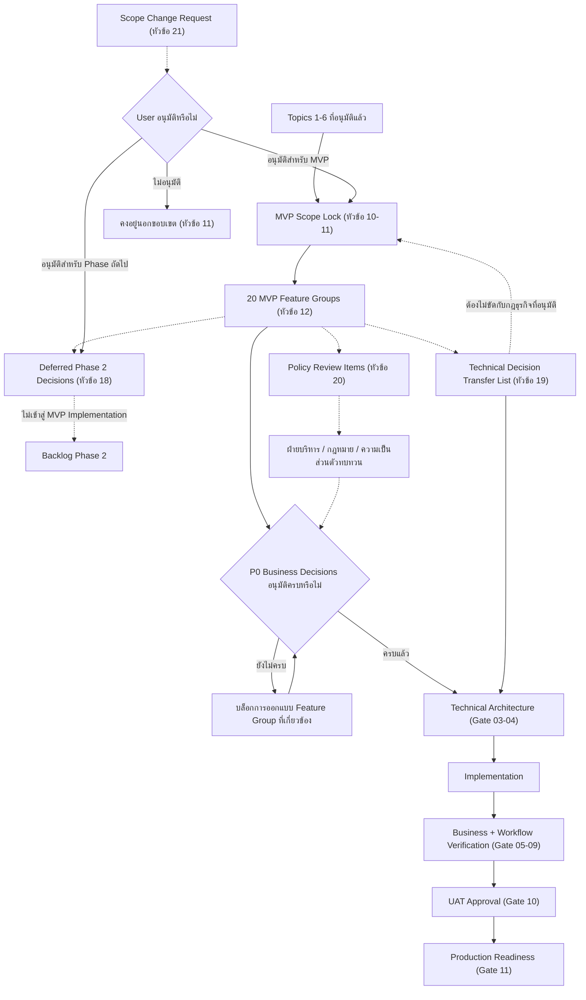

# ขอบเขต MVP และทะเบียนการตัดสินใจทางธุรกิจ

> [!summary]
> เอกสารฉบับนี้ "ล็อกขอบเขต" (Scope Lock) ของ MVP Phase 1 ของระบบ Dispatch โดยอ้างอิงเฉพาะกฎธุรกิจที่ได้รับอนุมัติแล้วใน Topics 1–6 เท่านั้น พร้อมรวบรวมประเด็นการตัดสินใจทางธุรกิจที่ยังไม่ได้รับการยืนยันทั้งหมดจาก Topics 1–6 ไว้เป็นทะเบียนเดียว (Business Decision Register) ที่ตรวจสอบย้อนกลับได้ เอกสารฉบับนี้แยกขอบเขตที่อนุมัติแล้วออกจากประเด็นที่ยังไม่ตัดสินใจอย่างเคร่งครัด จัดลำดับความเร่งด่วนและผลกระทบต่อการส่งมอบของแต่ละประเด็น กำหนดว่าประเด็นใดต้องได้รับการอนุมัติก่อนเริ่ม Implementation กำหนด Release Gate ของ MVP และวางแนวทางป้องกัน Scope Creep เอกสารฉบับนี้**ไม่ใช่**เอกสารสถาปัตยกรรมทางเทคนิค และ**ไม่ตัดสินใจแทนเจ้าของธุรกิจ**ในประเด็นใด ๆ ที่ยังไม่ได้รับการอนุมัติ

เอกสารฉบับนี้ต่อยอดจาก [[01 - เป้าหมายของระบบ Dispatch]], [[02 - Workflow การทำงานของระบบ Dispatch]], [[03 - บทบาทและสิทธิ์ผู้ใช้งาน]], [[04 - สถานะของงานและกติกาการเปลี่ยนสถานะ]], [[05 - ข้อมูล หลักฐาน และรายละเอียดที่ต้องจัดเก็บในแต่ละงาน]] และ [[06 - กฎธุรกิจและกฎการตรวจสอบความถูกต้องของระบบ Dispatch]] (เรียกรวมกันว่า **Topics 1–6**) เนื้อหาทั้งหมดต้องสอดคล้องกับการตัดสินใจที่อนุมัติแล้วใน Topics 1–6 **ไม่แก้ไข ไม่เพิ่ม และไม่ลดทอน**กฎที่อนุมัติแล้วในเอกสารเหล่านั้น

## 1. วัตถุประสงค์

เอกสารฉบับนี้มีวัตถุประสงค์เพื่อ

* ล็อกขอบเขตธุรกิจของ MVP ปัจจุบัน (Scope Lock) โดยอ้างอิงเฉพาะสิ่งที่ได้รับอนุมัติแล้วใน Topics 1–6
* แยกขอบเขตที่อนุมัติแล้วออกจากประเด็นการตัดสินใจที่ยังไม่ได้รับการยืนยันอย่างเคร่งครัด ไม่ให้ปะปนกัน
* รวบรวมประเด็นการตัดสินใจทางธุรกิจที่ยังไม่ได้รับการยืนยันจาก Topics 1–6 ทั้งหมดไว้เป็นทะเบียนเดียวที่ตรวจสอบย้อนกลับได้ (Business Decision Register)
* จัดประเภทประเด็นแต่ละข้อตามความเร่งด่วน (Priority) และผลกระทบต่อการส่งมอบ (Delivery Impact)
* ระบุว่าประเด็นใดต้องได้รับการอนุมัติก่อนเริ่มพัฒนา ประเด็นใดสามารถเลื่อนออกไปได้อย่างปลอดภัย และประเด็นใดเป็นการตัดสินใจทางเทคนิคมากกว่าทางธุรกิจ
* กำหนดเงื่อนไขความพร้อมสำหรับการปล่อย MVP (Release Readiness Gates)
* วางแนวทางป้องกัน Scope Creep และกำหนดกระบวนการควบคุมการเปลี่ยนแปลงขอบเขต (Scope Change Control)
* รักษาความสามารถในการตรวจสอบย้อนกลับ (Traceability) ไปยัง Topics 1–6 ตลอดทั้งเอกสาร

เอกสารฉบับนี้เป็นเอกสารระดับธุรกิจเท่านั้น **ไม่ใช่**เอกสารออกแบบระบบ

## 2. ขอบเขตของเอกสาร

เอกสารฉบับนี้ครอบคลุม

* การล็อกขอบเขต MVP ของ Workflow การจัดส่งสินค้าขาออก Phase 1 (Outbound Goods Delivery) ที่ได้รับอนุมัติแล้ว
* รายการ MVP Feature Group จำนวน 20 กลุ่มพร้อมขอบเขต ผู้เกี่ยวข้อง หลักฐาน Rule ID และ Dependency ของแต่ละกลุ่ม
* เกณฑ์ยอมรับ MVP ระดับธุรกิจ (MVP Acceptance Criteria) และ Release Gate
* Business Decision Register ที่รวบรวมประเด็นเปิดทั้งหมดจาก Topics 1–6 พร้อมสถานะ ลำดับความสำคัญ ผลกระทบ เจ้าของการตัดสินใจ และแนวทางที่แนะนำ
* รายชื่อประเด็นที่ต้องตัดสินใจก่อนเริ่มพัฒนา (P0), ประเด็นที่ตัดสินใจระหว่างพัฒนาได้, ประเด็นที่เลื่อนไป Phase 2, ประเด็นที่เป็นการตัดสินใจทางเทคนิค และประเด็นที่ต้องผ่านการทบทวนเชิงนโยบาย
* กระบวนการควบคุมการเปลี่ยนแปลงขอบเขต (Scope Change Control) และแนวทางป้องกัน Scope Creep
* แผนผังความสัมพันธ์เชิงธุรกิจ (Business Dependency Map) และแผนภาพ Mermaid หนึ่งแผนภาพ
* ตัวอย่างสถานการณ์ (Scenario Examples) อย่างน้อย 20 กรณี
* การตรวจสอบย้อนกลับไปยัง Topic 6 Rule ID และ Topics 1–6 โดยรวม

เอกสารฉบับนี้**ไม่ได้กำหนด**

* Technology Stack, Database Schema, Prisma Model หรือ SQL Schema
* API Endpoints หรือ DTO
* Source Code หรือ Pseudocode
* การออกแบบหน้าจอ (UI Screen), Wireframe หรือสถาปัตยกรรมแอปพลิเคชันมือถือ
* สถาปัตยกรรมการจัดเก็บไฟล์ (File-storage Architecture)
* กลไกทางเทคนิคของ GPS, ไลบรารีลายเซ็น หรือการยืนยันตัวตน (Authentication Implementation)
* กลไกทางเทคนิคของการแจ้งเตือน (Notification Implementation)
* สถาปัตยกรรมโครงสร้างพื้นฐาน (Infrastructure) หรือการ Deploy หรือ CI/CD
* Test Automation Code
* ประมาณการโครงการ งบประมาณ อัตรากำลังทีม หรือแผน Sprint

การออกแบบทางเทคนิคทั้งหมดข้างต้นจะถูกจัดทำในระยะถัดไป โดยอ้างอิงจาก MVP Feature Group และ Business Decision ID ในเอกสารฉบับนี้ ร่วมกับ Business Rule ID ใน [[06 - กฎธุรกิจและกฎการตรวจสอบความถูกต้องของระบบ Dispatch]]

## 3. แหล่งอ้างอิงและลำดับอำนาจ

Topics 1–6 เป็นแหล่งอ้างอิงที่มีอำนาจสูงสุด (Authoritative Source) สำหรับกฎธุรกิจที่อนุมัติแล้วทั้งหมด เอกสารฉบับนี้ (Topic 7) **ไม่แทนที่**Topics 1–6

| Topic | บทบาทของเอกสาร |
| --- | --- |
| [[01 - เป้าหมายของระบบ Dispatch]] | เป้าหมาย ปัญหาที่ต้องแก้ไข และขอบเขต Phase 1 ระดับสูง |
| [[02 - Workflow การทำงานของระบบ Dispatch]] | Workflow เชิงปฏิบัติการและหลักฐานบังคับ |
| [[03 - บทบาทและสิทธิ์ผู้ใช้งาน]] | บทบาท สิทธิ์ Task Ownership, Emergency Override, Reopen, Cancel, Correction Action |
| [[04 - สถานะของงานและกติกาการเปลี่ยนสถานะ]] | Main Task Status, Delivery Attempt Outcome, Returned-Goods Status, Emergency Override Review Status |
| [[05 - ข้อมูล หลักฐาน และรายละเอียดที่ต้องจัดเก็บในแต่ละงาน]] | ขอบเขตข้อมูล/หลักฐาน ระดับความจำเป็น ระดับความอ่อนไหว โมเดลการแก้ไข/ล็อก/Immutable |
| [[06 - กฎธุรกิจและกฎการตรวจสอบความถูกต้องของระบบ Dispatch]] | Catalog ของ Business Rule ID (BR-xxx) และ Validation Rule ID (VR-xxx) รวมถึงทะเบียน Open Business Decision พื้นฐาน (80 รายการ) |
| **07 (เอกสารฉบับนี้)** | ล็อกขอบเขต MVP จาก Topics 1–6 และรวบรวม/จัดประเภทประเด็นเปิดให้เป็นทะเบียนเดียวที่ใช้ตัดสินใจได้ |

### หลักการลำดับอำนาจ

1. **Topic 6 ยังคงเป็น Catalog หลักของกฎธุรกิจ (Primary Business Rule Catalog)** Topic 7 ไม่สร้าง Rule ID ใหม่ที่ขัดแย้งกับ Topic 6 แต่ใช้ Rule ID เดิมในการอ้างอิงตลอดทั้งเอกสาร
2. **Topic 7 ไม่ได้แทนที่ Topics 1–6** เพียงล็อกขอบเขตการส่งมอบ (Delivery Scope) และจัดประเภทประเด็นที่ยังไม่ได้ตัดสินใจ
3. หากพบข้อความใน Topic 7 ที่ดูเหมือนขัดแย้งกับ Topics 1–6 ให้ถือว่า Topics 1–6 มีผลเหนือกว่าเสมอ และต้องรายงานเป็นข้อขัดแย้งที่ปรากฏ (Apparent Conflict) แทนที่จะตีความเอาเอง
4. MVP Feature ใดที่ไม่มีแหล่งอ้างอิงที่อนุมัติแล้วใน Topics 1–6 ถือว่า**อยู่นอกขอบเขต** และต้องถูกบันทึกเป็นข้อเสนอใหม่ (Newly Proposed) ไม่ใช่ MVP ที่ล็อกแล้ว

## 4. หลักการ Scope Lock

เอกสารฉบับนี้ยึดหลักการ Scope Lock 12 ข้อต่อไปนี้ตลอดทั้งเอกสาร

1. **ขอบเขตที่อนุมัติแล้วและประเด็นที่ยังไม่ตัดสินใจต้องไม่ถูกปะปนกันในทุกที่ของเอกสาร** ทุกหัวข้อต้องระบุชัดเจนว่ากำลังพูดถึงขอบเขตใด
2. **การที่ฟีเจอร์หนึ่งปรากฏอยู่ในรายการ Open Business Decision ไม่ได้ทำให้ฟีเจอร์นั้นกลายเป็นส่วนหนึ่งของ MVP โดยอัตโนมัติ** ต้องรอการอนุมัติอย่างเป็นทางการก่อนเสมอ
3. **ประเด็นที่ยังไม่ได้ตัดสินใจต้องไม่ถูก Implement ราวกับว่าได้รับการอนุมัติแล้ว** (สอดคล้องกับ BR-STATE-004 ใน Topic 6)
4. **MVP ต้องครอบคลุมความสามารถที่เพียงพอต่อการทำ Workflow การจัดส่งสินค้าขาออก Phase 1 ที่อนุมัติแล้วให้สำเร็จได้อย่างปลอดภัยและตรวจสอบย้อนกลับได้** ตั้งแต่การเตรียมสินค้าจนถึงการปิดงาน
5. **หมวดหมู่งานในอนาคต (Future Categories) เช่น งานส่งเอกสาร งานรับเอกสาร งานรับสินค้า หรืองานผสม ต้องอยู่นอก MVP เสมอ เว้นแต่จะได้รับการอนุมัติอย่างชัดเจนในภายหลัง**
6. **การตัดสินใจทางเทคนิคต้องไม่ถูกปลอมแปลงให้ดูเหมือนเป็นการตัดสินใจทางธุรกิจ** (และในทางกลับกัน การตัดสินใจทางธุรกิจต้องไม่ถูกซ่อนไว้ว่าเป็นเพียงรายละเอียดทางเทคนิค)
7. **ทีมเทคนิคอาจเลือกรายละเอียดการ Implement ได้เฉพาะภายในขอบเขตของกฎธุรกิจที่อนุมัติแล้วเท่านั้น** ไม่ใช่นอกเหนือจากขอบเขตนั้น
8. **Scope Lock ไม่ได้หมายความว่าระบบจะไม่มีการเปลี่ยนแปลงอีกต่อไป** แต่หมายความว่าการเปลี่ยนแปลงใด ๆ ต้องผ่านกระบวนการตัดสินใจที่มีการควบคุม (ดูหัวข้อ [21. Scope Change Control](#21-scope-change-control))
9. **ขอบเขตใหม่ที่เกิดขึ้นภายหลัง Scope Lock ต้องถูกบันทึกเป็น Change Request หรือ Business Decision ใหม่ที่ได้รับอนุมัติ** ไม่ใช่ถูกเพิ่มเข้าไปแบบเงียบ
10. **กฎบังคับด้าน Compliance, หลักฐาน, สิทธิ์, สถานะ และ Audit จาก Topics 1–6 ต้องไม่ถูกตัดออกเพียงเพื่อให้พัฒนาง่ายขึ้น** (เช่น หลักฐานบังคับ 4 รายการก่อนปิดงาน หรือกฎ Dispatcher ไม่มีสิทธิ์ Reopen/Cancel)
11. **Emergency Override เป็นส่วนหนึ่งของโมเดลธรรมาภิบาลเชิงปฏิบัติการที่อนุมัติแล้ว และต้องไม่ถูกตัดออกจาก MVP หาก Workflow ปกติรวมอยู่ใน MVP ด้วย** เนื่องจากเป็นกลไกควบคุมความเสี่ยงเชิงปฏิบัติการที่จำเป็นคู่กับ Workflow ปกติ
12. **MVP ต้องรักษาประวัติและหลักฐานไว้เสมอ และต้องไม่พึ่งพาการแทนที่ข้อมูลย้อนหลังแบบเงียบ (Silent Data Replacement)** ไม่ว่ากรณีใด

## 5. Decision Status Model

เอกสารฉบับนี้จัดประเภทประเด็นการตัดสินใจทุกข้อด้วยสถานะเชิงแนวคิด (Conceptual Decision Status) 8 ค่า **ค่าเหล่านี้เป็นการจัดประเภทระดับเอกสารธุรกิจ ไม่ใช่ Enum ของซอฟต์แวร์**

| # | Decision Status | ความหมาย |
| --- | --- | --- |
| 1 | **APPROVED** | User อนุมัติการตัดสินใจทางธุรกิจนี้อย่างชัดเจนแล้วใน Topics 1–6 |
| 2 | **MUST_DECIDE_BEFORE_MVP** | ประเด็นนี้ขัดขวางการออกแบบ MVP ที่ถูกต้อง หรือสร้างความคลุมเครือที่ยอมรับไม่ได้หากยังไม่ตัดสินใจ |
| 3 | **DECIDE_DURING_IMPLEMENTATION** | ประเด็นนี้ไม่ขัดขวางงานสถาปัตยกรรมเริ่มต้นหรืองานพื้นฐาน แต่ต้องได้รับการอนุมัติก่อนที่ฟีเจอร์ที่เกี่ยวข้องจะเสร็จสมบูรณ์ |
| 4 | **DEFERRED_PHASE_2** | ประเด็นนี้ถูกจงใจวางไว้นอก MVP และไม่ควร Implement ในขณะนี้ |
| 5 | **TECHNICAL_DECISION** | ประเด็นนี้ควรถูกตัดสินใจในภายหลังผ่านงาน Technical Architecture, ADR, การทบทวนความปลอดภัย, การออกแบบ UX หรือการวางแผน Implementation |
| 6 | **POLICY_REVIEW_REQUIRED** | ประเด็นนี้อาจต้องผ่านการทบทวนจากฝ่ายบริหาร กฎหมาย ความเป็นส่วนตัว การเงิน ปฏิบัติการ หรือธรรมาภิบาลก่อนอนุมัติ |
| 7 | **REJECTED_OR_OUT_OF_SCOPE** | รายการนี้ถูกระบุอย่างชัดเจนว่าไม่ใช่ส่วนหนึ่งของขอบเขตผลิตภัณฑ์ปัจจุบัน |
| 8 | **SUPERSEDED** | ข้อเสนอก่อนหน้าถูกแทนที่ด้วยการตัดสินใจที่อนุมัติในภายหลัง |

### หลักการใช้ Decision Status

* **APPROVED เป็นสิ่งที่นิยาม Scope Lock** — เฉพาะรายการที่มีสถานะ APPROVED เท่านั้นที่ปรากฏในหัวข้อ [10. Approved MVP Scope](#10-approved-mvp-scope)
* **MUST_DECIDE_BEFORE_MVP คือประเด็นที่เป็น Blocker** และต้องปรากฏในหัวข้อ [16. P0 Business Decision Shortlist](#16-p0-business-decision-shortlist)
* **DECIDE_DURING_IMPLEMENTATION ต้องมีเจ้าของและจุดตรวจสอบการอนุมัติ (Approval Checkpoint) เสมอ** ไม่ใช่ปล่อยไว้แบบไม่มีเจ้าของ
* **DEFERRED_PHASE_2 ต้องไม่ปรากฏใน MVP Acceptance Criteria** ไม่ว่ากรณีใด
* **TECHNICAL_DECISION ต้องถูกส่งต่อไปยังงาน Technical Architecture หรือ ADR** ไม่ใช่ถูกตัดสินใจในเอกสารฉบับนี้
* **POLICY_REVIEW_REQUIRED ไม่ได้หมายความว่าถูกปฏิเสธโดยอัตโนมัติ** เพียงแต่ต้องผ่านการทบทวนที่เหมาะสมก่อน
* **ห้ามจัดประเภทรายการใดเป็น APPROVED โดยไม่มีหลักฐานอ้างอิงที่ชัดเจนจาก Topics 1–6** (ต้องมี Source Topic และหัวข้ออ้างอิงเสมอ)

## 6. Decision Priority Model

เอกสารฉบับนี้ใช้ระดับความสำคัญ (Priority) 4 ระดับ ซึ่ง**เป็นแนวคิดที่แยกจาก Decision Status โดยสิ้นเชิง**

| Priority | ความหมาย |
| --- | --- |
| **P0 — MVP Blocker** | ขัดขวางการออกแบบหรือการปล่อย MVP หากยังไม่ตัดสินใจ |
| **P1 — Required before the related MVP feature is accepted** | ต้องตัดสินใจก่อนที่ MVP Feature Group ที่เกี่ยวข้องจะผ่านเกณฑ์ยอมรับ |
| **P2 — Important but safely deferrable** | สำคัญแต่สามารถเลื่อนออกไปได้อย่างปลอดภัยโดยไม่กระทบ MVP |
| **P3 — Future or optional improvement** | เป็นการปรับปรุงในอนาคตหรือทางเลือกเสริม ไม่กระทบ MVP ในทุกกรณี |

### ความสัมพันธ์ระหว่าง Priority และ Decision Status

> [!important]
> **Priority และ Decision Status เป็นสองมิติที่แยกจากกันโดยสิ้นเชิง** — รายการหนึ่งอาจมี Priority สูงแต่ยังไม่ถูกตัดสินใจ หรือมี Decision Status อนุมัติแล้วแต่ยังมี Priority ในการ Implement ที่ต้องจัดคิว

* **รายการที่เป็น P0 อาจยังคงไม่ได้รับการตัดสินใจ** (สถานะ MUST_DECIDE_BEFORE_MVP) — นี่คือความหมายที่แท้จริงของคำว่า Blocker
* **รายการที่ APPROVED แล้วอาจยังมี Priority การ Implement เป็น P1** เช่น ต้องมี Emergency Override ให้ครบก่อนที่ MVP-14 จะผ่านเกณฑ์ยอมรับ แม้กฎจะอนุมัติแล้วก็ตาม
* **รายการที่เป็น DEFERRED_PHASE_2 มักมี Priority เป็น P2 หรือ P3** ตามปกติ
* **รายการที่เป็น TECHNICAL_DECISION อาจเป็น P0 ได้** หากงานสถาปัตยกรรมไม่สามารถดำเนินต่อได้เลยหากไม่มีคำตอบ (เช่น การเลือกวิธีจัดเก็บไฟล์หลักฐาน)

## 7. Decision Impact Categories

แต่ละประเด็นในทะเบียนอาจถูกจัดอยู่ในหมวดผลกระทบ (Impact Category) ได้มากกว่าหนึ่งหมวดพร้อมกัน **ห้ามบังคับให้แต่ละประเด็นมีเพียงหมวดเดียว** เมื่อความจริงเกี่ยวข้องกับหลายหมวด

`PRODUCT_SCOPE`, `WORKFLOW`, `PERMISSION`, `STATUS_TRANSITION`, `DATA_REQUIREMENT`, `EVIDENCE`, `QUANTITY`, `CUSTOMER_DESTINATION`, `INTERNAL_DELIVERY`, `EXTERNAL_COURIER`, `CANCELLATION`, `RETURNED_GOODS`, `REOPEN`, `EMERGENCY_OVERRIDE`, `CORRECTION_ACTION`, `PRIVACY`, `SECURITY`, `REPORTING`, `EXPORT`, `GOVERNANCE`, `TECHNICAL_ARCHITECTURE`, `UX`, `OPERATIONS`, `FUTURE_SCOPE`

## 8. Decision ID Model

เอกสารฉบับนี้กำหนด Business Decision ID เชิงแนวคิดที่คงที่ (Stable Conceptual Decision ID) เพื่อการอ้างอิงข้ามหัวข้อ **Decision ID เหล่านี้ไม่ใช่ Database Identifier หรือ Source-code Constant** เป็นเพียงป้ายอ้างอิงระดับเอกสารเท่านั้น เช่นเดียวกับ Rule ID ใน [[06 - กฎธุรกิจและกฎการตรวจสอบความถูกต้องของระบบ Dispatch]] หัวข้อ 6

| รูปแบบ | หมวดหมู่ |
| --- | --- |
| BDR-SCOPE-xxx | ขอบเขตผลิตภัณฑ์และประเภทงานในอนาคต |
| BDR-STATE-xxx | ข้อเสนอเกี่ยวกับ Main Task Status เพิ่มเติมนอกเหนือจากโมเดลที่อนุมัติแล้ว |
| BDR-TASK-xxx | การสร้างงานและเลขอ้างอิง |
| BDR-CUSTOMER-xxx | Customer Master และ Destination Snapshot |
| BDR-PREP-xxx | การเตรียมสินค้าและการแก้ไขหลัง IN_TRANSIT |
| BDR-ASSIGN-xxx | การมอบหมายและบุคลากร |
| BDR-GPS-xxx | คุณภาพและธรรมาภิบาล GPS |
| BDR-EVIDENCE-xxx | คุณภาพรูปภาพและลายเซ็น |
| BDR-RECIPIENT-xxx | ข้อมูลผู้รับสินค้า |
| BDR-QTY-xxx | จำนวนสินค้าและการตรวจสอบย้อนกลับ |
| BDR-ATTEMPT-xxx | Delivery Attempt และการปิดงาน |
| BDR-EXTERNAL-xxx | ผู้ส่งสินค้าภายนอก |
| BDR-CANCEL-xxx | การยกเลิกงาน |
| BDR-RETURN-xxx | การรับคืนสินค้า |
| BDR-REOPEN-xxx | การเปิดงานกลับมาแก้ไข |
| BDR-OVERRIDE-xxx | Emergency Override และการทบทวนย้อนหลัง |
| BDR-CORRECTION-xxx | Correction Action และการจัดการหลักฐานย้อนหลัง |
| BDR-PRIVACY-xxx | ความเป็นส่วนตัวและการเก็บรักษาข้อมูล |
| BDR-REPORT-xxx | รายงานเชิงปฏิบัติการ |
| BDR-EXPORT-xxx | การส่งออกข้อมูลและหลักฐาน |
| BDR-TECH-xxx | รายการที่ถูกโอนไปยัง Technical Architecture |
| BDR-FUTURE-xxx | ขอบเขตที่อาจพิจารณาในอนาคต (Phase 2 ขึ้นไป) |

**Decision ID ทุกรายการในเอกสารฉบับนี้ไม่ซ้ำกัน** (ตรวจสอบแล้ว — ดู [Final Report](#final-report) ท้ายเอกสาร) รูปแบบเลขลำดับใช้เลขสามหลักต่อท้ายรหัสหมวดหมู่ (เช่น BDR-GPS-001, BDR-GPS-002)

## 9. ภาพรวม MVP Phase 1

MVP ปัจจุบันของระบบ Dispatch ครอบคลุม**เฉพาะ Workflow การจัดส่งสินค้าขาออก (Outbound Goods Delivery) Phase 1** ตามที่ได้รับอนุมัติใน [[01 - เป้าหมายของระบบ Dispatch]] หัวข้อ 7, [[02 - Workflow การทำงานของระบบ Dispatch]] หัวข้อ 17 และ [[06 - กฎธุรกิจและกฎการตรวจสอบความถูกต้องของระบบ Dispatch]] หัวข้อ 10 (BR-SCOPE-001 ถึง BR-SCOPE-006)

MVP นี้ต้องรองรับให้ Task หนึ่งงานเดินทางผ่านทุกขั้นตอนต่อไปนี้ได้อย่างสมบูรณ์และตรวจสอบย้อนหลังได้

```text
สร้างงาน (DRAFT)
→ ยืนยันข้อมูลลูกค้า/ปลายทาง/รายการสินค้า (WAITING_PREPARATION)
→ เตรียมและโหลดสินค้าพร้อมรูปหลังโหลด (PREPARING → READY_FOR_DISPATCH)
→ มอบหมายผู้ส่งสินค้าภายในหรือภายนอก (ASSIGNED)
→ เริ่มจัดส่ง (IN_TRANSIT)
→ Check-in GPS ที่ปลายทาง (AT_DESTINATION)
→ ส่งมอบพร้อมหลักฐานบังคับ
→ ปิดงาน (COMPLETED) หรือรอความพยายามครั้งถัดไป (WAITING_NEXT_ATTEMPT)
```

พร้อมทั้ง Workflow ข้อยกเว้นที่ได้รับอนุมัติทั้งหมด ได้แก่ การส่งมอบบางส่วน/ไม่สำเร็จ/เลื่อนนัด, การยกเลิกงาน, การรับคืนสินค้า, การเปิดงานกลับมาแก้ไข, Emergency Override พร้อมการทบทวนย้อนหลังของ Super Admin, และ Recipient Correction Action

MVP นี้**ไม่ครอบคลุม**หมวดหมู่งานในอนาคต (งานส่งเอกสาร, รับเอกสาร, รับสินค้า, งานผสม), การเข้าสู่ระบบโดยตรงของลูกค้าหรือผู้ส่งสินค้าภายนอก, Geofence, หรือความสามารถอื่นใดที่ระบุไว้ในหัวข้อ [11. Explicit MVP Exclusions](#11-explicit-mvp-exclusions)

รายละเอียดขอบเขตที่อนุมัติแล้วโดยละเอียดอยู่ในหัวข้อถัดไป

## 10. Approved MVP Scope

หัวข้อนี้ล็อกความสามารถทางธุรกิจที่**อนุมัติแล้ว**สำหรับ MVP โดยอ้างอิงเฉพาะ Topics 1–6 เท่านั้น ทุกรายการมีสถานะ **APPROVED** ตาม [Decision Status Model](#5-decision-status-model) ห้ามเพิ่มความสามารถที่ยังไม่ได้รับการอนุมัติเข้ามาในรายการนี้

### 10.1 โมเดลบทบาทและผู้ใช้งาน

* **Super Admin** — อำนาจสูงสุด จัดการกรณีข้อยกเว้น มีอำนาจเต็มเหนือ Reopened Task และทบทวน Emergency Override — Topic 3 §4.1, §5
* **Admin** — จัดการข้อยกเว้นเชิงปฏิบัติการ, Emergency Override, Reopen, Cancel, ยืนยันคืนสินค้า, Correction Action, ปิดงานภายนอก — Topic 3 §4.2, §6
* **Dispatcher** — วางแผนและประสานงานตามปกติ ไม่มีสิทธิ์ Reopen/Cancel — Topic 3 §4.3, §7
* **Stock** — เตรียมและตรวจสอบสินค้า ถูกล็อกการแก้ไขหลัง IN_TRANSIT — Topic 3 §4.4, §8
* **เจ้าหน้าที่ส่งสินค้าภายใน** — ผู้รับผิดชอบหลักของ Task ภายใน ปิดงานของตนเองได้ — Topic 3 §4.5, §9
* **Management / Auditor** — บทบาทบังคับ เน้นกำกับดูแลแบบ Read-only — Topic 3 §4.6, §10

### 10.2 ผู้เกี่ยวข้องภายนอกที่ไม่มีบัญชีเข้าสู่ระบบโดยตรงใน Phase 1

* **ผู้ส่งสินค้าภายนอก (External Courier)** — Admin บันทึกและปิดงานแทน — Topic 3 §4.7, §11
* **ลูกค้าหรือผู้รับสินค้า** — มีส่วนร่วมทางกายภาพเท่านั้น (ให้ข้อมูล/ลงลายเซ็น) — Topic 3 §4.8, §12

### 10.3 การสร้างงานและการระบุตัวตน Task

* Task ต้องมีเลขที่งานที่คงที่ตลอดอายุ รวมถึงหลัง Reopen — BR-TASK-001
* Task ต้องระบุประเภทงานและวิธีการจัดส่ง (Internal/External) — BR-TASK-002
* ข้อมูลปลายทางต้องเพียงพอต่อการปฏิบัติงาน — BR-TASK-003, BR-TASK-004
* Historical Destination Snapshot ต้องไม่ถูกเขียนทับด้วยข้อมูลหลักที่เปลี่ยนแปลงภายหลัง — BR-TASK-009, BR-DATA-003
* **(อนุมัติ 2026-07-20 — BDR-CUSTOMER-001 Option C, BDR-CUSTOMER-002 Option B)** ผู้สร้างงานค้นหา/เลือก Customer Master ก่อนเสมอ; Free-text อนุญาตเฉพาะเมื่อไม่มี Master ที่เหมาะสมหรือปลายทางเป็นแบบเฉพาะกิจ; ทุก Task บันทึกแหล่งที่มาปลายทางเป็น MASTER หรือ FREE_TEXT; ห้ามสร้าง Customer Master อัตโนมัติจาก Free-text; สิทธิ์เพิ่ม/แก้ไข Customer Master ยังเป็นประเด็นแยกที่ไม่อนุมัติในรอบนี้ — BR-TASK-003, BR-TASK-009, BR-DATA-003

### 10.4 วิธีการจัดส่ง: ภายในเทียบกับผู้ส่งสินค้าภายนอก

MVP รองรับสองรูปแบบการจัดส่งเท่านั้น: **Internal Delivery** และ **External Courier Delivery** — Topic 5 §7; BR-SCOPE-001

### 10.5 Workflow การเตรียมสินค้า

สถานะ DRAFT → WAITING_PREPARATION → PREPARING → READY_FOR_DISPATCH ตามโมเดล Main Task Status ที่อนุมัติแล้ว — Topic 4 §6–9

### 10.6 Workflow การมอบหมาย

* หนึ่ง Task มีผู้รับผิดชอบหลักในระบบหนึ่ง User Login เท่านั้น — BR-ASSIGN-001
* การมอบหมายพนักงานภายใน / การจัดหาผู้ส่งสินค้าภายนอกเชิงปฏิบัติการ — Topic 3 §13.1–13.2
* ประวัติการมอบหมายและการเปลี่ยนตัวผู้รับผิดชอบ (Reassignment) ต้องถูกรักษาไว้เสมอ — BR-ASSIGN-004

### 10.7 Workflow การจัดส่ง

สถานะ ASSIGNED → IN_TRANSIT → AT_DESTINATION → WAITING_NEXT_ATTEMPT → COMPLETED → CANCELLED ตามโมเดล 10 Main Task Status — Topic 4 §5–15

### 10.8 โมเดล Delivery Attempt

* ผลลัพธ์ที่อนุมัติ: SUCCESS, PARTIAL, FAILED, RESCHEDULED — Topic 4 §17
* หนึ่ง Task มีได้หลาย Attempt ภายใต้ Task เดิมเสมอ ห้ามสร้าง Task ใหม่ — BR-TASK-010, BR-ATTEMPT-006
* ต้องรักษาประวัติของทุก Attempt ไว้ครบถ้วน ห้ามเขียนทับ — BR-ATTEMPT-005

### 10.9 หลักฐานบังคับสำหรับการจัดส่งสินค้าในปัจจุบัน

* รูปภาพหลังโหลดสินค้าขึ้นยานพาหนะอย่างน้อย 1 รูป (บังคับ) — BR-EVIDENCE-001
* Destination GPS Check-in (บังคับ ไม่มี Geofence และไม่มีเกณฑ์ระยะทาง) — BR-GPS-003, BR-GPS-005
* รูปหลักฐานการส่งมอบอย่างน้อย 1 รูป (บังคับ) — BR-EVIDENCE-005
* ชื่อผู้รับสินค้า (บังคับ) — BR-RECIPIENT-001
* หมายเลขโทรศัพท์ผู้รับสินค้า (บังคับ) — BR-RECIPIENT-002
* ลายเซ็นลูกค้า (บังคับ) — BR-RECIPIENT-003; **(อนุมัติ 2026-07-20 — BDR-EVIDENCE-001 Option D, BDR-EVIDENCE-002 Option B)** รองรับ 3 วิธีทางธุรกิจ: วาดบนหน้าจอ (วิธีหลักของงานภายใน), อัปโหลดเอกสารที่ลงชื่อแล้ว และถ่ายภาพใบเสร็จหรือเอกสารที่ลงชื่อแล้ว (Photograph of a Signed Receipt or Signed Document) (Fallback แบบมีเงื่อนไขเมื่อวิธีหลักทำไม่ได้จริง พร้อมเหตุผลกำกับ) — Fallback ที่ครบเงื่อนไขนับเป็น Normal Closure ไม่ใช่ Emergency Override — BR-RECIPIENT-003, BR-RECIPIENT-008
* ผลจำนวนสินค้า (Quantity Result) และการส่งมอบครบทุกรายการสำหรับการปิดงานสำเร็จตามปกติ — BR-QTY-008, BR-QTY-009

### 10.10 การปิดงานปกติของงานภายใน

พนักงานที่ได้รับมอบหมายปิด Task ของตนเองได้โดยตรงเมื่อเงื่อนไขบังคับครบถ้วน โดยไม่ต้องรอ Admin ตรวจสอบก่อน — BR-CLOSE-001, BR-CLOSE-003 พร้อม Timeline และ Audit Log — BR-AUDIT-001

### 10.11 Workflow ผู้ส่งสินค้าภายนอก

* ไม่มีบัญชีเข้าสู่ระบบโดยตรง — BR-SCOPE-005, BR-EXTERNAL-001
* Admin บันทึกหลักฐานแทนและเป็นผู้ปิดงานเสมอ — BR-EXTERNAL-002, BR-EXTERNAL-003
* ฝ่ายผู้จัดส่งทางกายภาพและ Admin System Actor ต้องแยกความแตกต่างได้เสมอ — BR-EXTERNAL-004
* **(อนุมัติ 2026-07-20 — BDR-EXTERNAL-001 Option B)** หลักฐานรวมของ Normal Closure ยังคงเป็นชุดเดียวกับงานภายในไม่ลดลง (BR-EXTERNAL-005) แต่แบ่งความรับผิดชอบชัดเจน: STEP บันทึกก่อนส่งมอบ (รูปหลังโหลด/ก่อนส่งมอบ, จำนวนที่จัดส่ง, ข้อมูลปลายทาง, ชื่อ/เบอร์โทรผู้รับที่มีอยู่แล้ว, ตัวตนผู้ให้บริการ) ส่วนผู้ส่งภายนอกต้องส่งกลับให้ Admin อย่างน้อย: หลักฐานถึงปลายทาง, รูปส่งมอบ, ชื่อผู้รับจริง, หลักฐานลายเซ็นตาม BDR-EVIDENCE-002, จำนวนที่ส่งมอบจริง — ขาดหลักฐานขั้นต่ำนี้ยังคงบล็อก Normal Closure เช่นเดิม — BR-EXTERNAL-002 ถึง BR-EXTERNAL-005, BR-EXTERNAL-009

### 10.12 การจัดการ Partial, Failed และ Rescheduled

ใช้ Task เดิมเสมอ, สร้าง Delivery Attempt ใหม่, สถานะ WAITING_NEXT_ATTEMPT, รักษา Attempt เดิมไว้ — BR-ATTEMPT-006, BR-ATTEMPT-007, BR-QTY-005, BR-QTY-006

### 10.13 การยกเลิกงาน

* Admin และ Super Admin เท่านั้นที่มีสิทธิ์ยกเลิก — Dispatcher ไม่มีสิทธิ์ — BR-CANCEL-001
* เหตุผลการยกเลิกเป็นข้อบังคับเสมอ — BR-CANCEL-002
* ภาระหน้าที่คืนสินค้ายังคงอยู่หลังยกเลิกเมื่อสินค้าออกจากบริษัทแล้ว — BR-CANCEL-004

### 10.14 Workflow การรับคืนสินค้า

* สถานะ NOT_REQUIRED, PENDING_RETURN, RETURN_CONFIRMED — Topic 4 §22
* Admin เป็นผู้ยืนยันการรับคืนสินค้าอย่างเป็นทางการ — BR-RETURN-003
* Stock อาจรายงานความไม่ตรงกันได้แต่ไม่ใช่ผู้ยืนยันขั้นสุดท้าย — BR-RETURN-004

### 10.15 การเปิดงานกลับมาแก้ไข (Reopen)

* Admin และ Super Admin เท่านั้นที่มีสิทธิ์ Reopen — Dispatcher ไม่มีสิทธิ์ — BR-REOPEN-001
* รอบสุดท้ายเดิมต้องยังคงถูกรักษาไว้ — BR-REOPEN-003, BR-REOPEN-004
* Super Admin มีอำนาจมอบหมายใหม่หรือปิดงานโดยตรงเมื่อพนักงานเดิมไม่พร้อมปฏิบัติงาน — BR-REOPEN-006, BR-REOPEN-007
* **(อนุมัติ 2026-07-20 — BDR-RETURN-003 Option A)** Task ที่ CANCELLED และ Returned-Goods = PENDING_RETURN ห้าม Reopen ทั้งสำหรับ Admin และ Super Admin (ไม่มีข้อยกเว้น) จนกว่า Admin จะยืนยันคืนสินค้าเป็น RETURN_CONFIRMED ก่อน — RETURN_CONFIRMED ไม่ Reopen อัตโนมัติ ต้องเป็นการกระทำแยกต่างหาก — BR-REOPEN-005, BR-REOPEN-011, BR-RETURN-002, BR-RETURN-003

### 10.16 Emergency Override

* Admin มีสิทธิ์ข้ามเงื่อนไขปิดงานตามปกติได้ทุกข้อเมื่อจำเป็น — BR-OVERRIDE-001, BR-OVERRIDE-002
* ทุกครั้งต้องมีเหตุผลบังคับและบันทึกเงื่อนไขที่ถูกข้ามครบถ้วน — BR-OVERRIDE-003, BR-OVERRIDE-004
* ต้องแสดงผลแตกต่างจากการปิดงานปกติเสมอ — BR-OVERRIDE-005
* Emergency Override Review Status ต้องเปลี่ยนเป็น PENDING_REVIEW ทันที — BR-OVERRIDE-006

### 10.17 การทบทวนย้อนหลังของ Super Admin

ทุกการใช้ Emergency Override ต้องได้รับการทบทวนย้อนหลังเป็นข้อบังคับ ไม่บล็อกการปิดงานเชิงปฏิบัติการทันที — BR-REVIEW-001, BR-REVIEW-002

### 10.18 Recipient Correction Action

* Admin และ Super Admin เท่านั้นที่มีสิทธิ์ ไม่ต้อง Reopen ทั้ง Task — BR-CORRECTION-001, BR-CORRECTION-002
* ค่าดั้งเดิมต้องยังคงตรวจสอบย้อนหลังได้เสมอ ห้ามแสดงราวกับเป็นค่าที่บันทึกไว้แต่แรก — BR-CORRECTION-004, BR-CORRECTION-005
* **(อนุมัติ 2026-07-20 — BDR-CORRECTION-001 Option A)** ฟิลด์ที่แก้ไขได้จำกัดเป็นรายการปิด 4 ฟิลด์เท่านั้น: ชื่อผู้รับสินค้า, หมายเลขโทรศัพท์ผู้รับสินค้า, แผนกผู้รับสินค้า, ตำแหน่งผู้รับสินค้า — ห้ามแก้ไขลายเซ็น/รูปภาพ/หลักฐานส่งมอบผ่านกลไกนี้ — ฟิลด์อื่นต้องผ่าน Business Decision หรือ Scope Change ใหม่ — BR-RECIPIENT-007

### 10.19 ธรรมาภิบาลหลักฐานย้อนหลัง

* Super Admin มีอำนาจสูงสุดในการจัดการหลักฐานย้อนหลัง — BR-CORRECTION-006
* ห้ามแทนที่หรือลบหลักฐานแบบเงียบ — BR-CORRECTION-007, BR-AUDIT-005

### 10.20 Stock Edit Lock

* Stock แก้ไขข้อมูลการเตรียมสินค้าได้เฉพาะก่อน IN_TRANSIT เท่านั้น — BR-PREP-005
* หลัง IN_TRANSIT ต้องรายงานผ่าน Admin/Super Admin เพื่อสร้าง Correction/Exception Record — BR-PREP-006, BR-PREP-007
* **(อนุมัติ 2026-07-20 — BDR-PREP-001 Option C, BDR-PREP-004 Option A)** Admin สร้าง Correction/Exception Record ได้ทันทีในทุกกรณีหลัง IN_TRANSIT โดยไม่ต้องรอ Super Admin อนุมัติล่วงหน้า ทุกบันทึกต้องเข้า Governance Review Queue เพื่อการทบทวนย้อนหลังภาคบังคับของ Super Admin เสมอ และจัดประเภท Materiality อย่างน้อย NORMAL หรือ MATERIAL (Materiality กำหนดความเร่งด่วนของการแจ้งเตือนและลำดับทบทวน ไม่จำกัดสิทธิ์การสร้างบันทึกของ Admin) — Preparation Correction เป็นประเภทบันทึกที่แยกจาก Emergency Override เสมอ — BR-PREP-007, BR-PREP-008

### 10.21 การมองเห็นข้อมูล (Data Visibility)

* การเข้าถึงตามบทบาท (Role-based Access) — BR-SECURITY-001 ถึง BR-SECURITY-006
* เบอร์โทรผู้รับสินค้า, ลายเซ็น, GPS และหลักฐานถือเป็นข้อมูลอ่อนไหว — BR-RECIPIENT-004, BR-SECURITY-001
* Stock ไม่ได้รับข้อมูลอ่อนไหวของผู้รับสินค้าที่ไม่จำเป็น — BR-SECURITY-002
* Management/Auditor เน้น Read-only แบบปิดบังข้อมูล — BR-SECURITY-003

### 10.22 ประวัติที่ไม่เปลี่ยนแปลง (Immutable History)

* ห้ามลบ Task, Timeline, Audit Log, Attempt เดิม หรือหลักฐานย้อนหลังไม่ว่ากรณีใด — BR-DATA-007, BR-AUDIT-003
* ห้ามเปลี่ยนสถานะแบบเงียบ — BR-AUDIT-004

> [!warning]
> รายการข้างต้นคือขอบเขตที่**อนุมัติแล้วเท่านั้น** ห้ามเพิ่มความสามารถใดที่ไม่มี Rule ID หรือ Topic อ้างอิงเข้ามาในรายการนี้ หากมีความไม่แน่ใจว่ารายการใดอนุมัติแล้วหรือไม่ ให้ตรวจสอบใน [[06 - กฎธุรกิจและกฎการตรวจสอบความถูกต้องของระบบ Dispatch]] ก่อนเสมอ

## 11. Explicit MVP Exclusions

หัวข้อนี้ระบุรายการที่**อยู่นอก MVP อย่างชัดเจน** เว้นแต่จะได้รับการอนุมัติเป็นการเฉพาะในภายหลัง รายการเหล่านี้อาจกลายเป็นขอบเขตที่อนุมัติในอนาคตผ่านกระบวนการ [Scope Change Control](#21-scope-change-control) เท่านั้น

| # | รายการที่ไม่รวมใน MVP | เหตุผล / แหล่งอ้างอิง |
| --- | --- | --- |
| 1 | งานส่งเอกสาร (Document Delivery) | Topic 2 §18, §20; BR-SCOPE-002 |
| 2 | งานรับเอกสาร (Document Collection) | Topic 2 §18, §20; BR-SCOPE-002 |
| 3 | งานรับสินค้า (Goods Pickup) | Topic 2 §18, §20; BR-SCOPE-002 |
| 4 | งานรับสินค้าคืนในฐานะ Task ประเภทอิสระ (Return Collection) | Topic 5 §7; BR-SCOPE-002 |
| 5 | งานที่มีทั้งการรับและส่งใน Task เดียวกัน (Combined Pickup and Delivery) | Topic 5 §7; BR-SCOPE-002 |
| 6 | บัญชีเข้าสู่ระบบสำหรับลูกค้า (Customer Login) | Topic 3 §4.8, §12, §26; BR-SCOPE-006 |
| 7 | บัญชีเข้าสู่ระบบสำหรับผู้รับสินค้า (Recipient Login) | Topic 3 §12; BR-SCOPE-006 |
| 8 | บัญชีเข้าสู่ระบบสำหรับผู้ส่งสินค้าภายนอก (External Courier Login) | Topic 3 §4.7, §11, §26; BR-SCOPE-005 |
| 9 | การเชื่อมต่อ API กับผู้ให้บริการ Logistics ภายนอก (Courier API Integration) | Topic 1 §8; Topic 2 §18 |
| 10 | การติดตามตำแหน่งผู้ส่งสินค้าภายนอกอัตโนมัติ (Automatic Courier Tracking Integration) | Topic 1 §8; Topic 2 §18 |
| 11 | Customer-facing Evidence Portal | Topic 1 §8; Topic 3 §26 |
| 12 | การสแกน Barcode | Topic 2 §18; เปิด — BDR-FUTURE-002 |
| 13 | การสแกน Serial Number | Topic 5 §9; เปิด — BDR-QTY-003 |
| 14 | การติดตาม Lot หรือ Batch | Topic 5 §9; เปิด — BDR-QTY-004 |
| 15 | การเชื่อมต่อระบบ Inventory หรือ ERP | Topic 1 §8 |
| 16 | การเชื่อมต่อระบบบัญชี (Accounting Integration) | Topic 1 §8; Topic 2 §5.4, §9 |
| 17 | OCR หรือการตรวจสอบเอกสารอัตโนมัติ | Topic 1 §8 (ไม่ปรากฏในขอบเขตที่อนุมัติ) |
| 18 | Geofence | Topic 2 §5.11; BR-GPS-002, BR-GPS-005 |
| 19 | เกณฑ์ระยะทาง GPS (Distance Threshold) | Topic 2 §5.11; BR-GPS-005 |
| 20 | คำเตือนระยะทาง GPS (Distance Warning) | Topic 4 §16 |
| 21 | ข้อกำหนด GPS ขณะเริ่มจัดส่ง (Start-location GPS Requirement) | Topic 2 §5.9; BR-GPS-001 |
| 22 | การตรวจจับ Mock-location | Topic 2 §5.11 (ไม่ปรากฏในขอบเขตที่อนุมัติ) |
| 23 | การให้คะแนนคุณภาพหลักฐานอัตโนมัติ (Automated Evidence-quality Scoring) | Topic 5 §39 กลุ่ม K |
| 24 | การจดจำใบหน้า (Face Recognition) | ไม่ปรากฏในขอบเขตที่อนุมัติ |
| 25 | การยืนยันตัวตนผู้รับสินค้าอัตโนมัติ | Topic 2 §5.13 (GPS ไม่พิสูจน์อัตลักษณ์ — BR-GPS-006) |
| 26 | การหาเส้นทางที่เหมาะสมที่สุด (Route Optimization) | Topic 1 §8; Topic 2 §18 |
| 27 | การติดตามยานพาหนะแบบ Real-time (Live Vehicle Tracking) | Topic 1 §8; Topic 2 §5.10 |
| 28 | การออกแบบการแจ้งเตือนแบบ Push Notification | Topic 1 §8 |
| 29 | การวิเคราะห์ข้อมูลเชิงลึกขั้นสูง (Advanced Analytics / BI) | Topic 1 §8 |
| 30 | การตรวจสอบหลักฐานด้วย AI (AI-based Evidence Review) | Topic 5 §39 กลุ่ม K |
| 31 | สถาปัตยกรรม SaaS หลายบริษัท (Multi-company SaaS) | ไม่ปรากฏในขอบเขตที่อนุมัติ |
| 32 | Customer Self-service | Topic 3 §26 |
| 33 | การติดตามเอกสารที่ลูกค้าส่งคืนแบบบังคับ (Mandatory Returned-document Tracking) | Topic 2 §14; BR-SCOPE-004 |
| 34 | ความสามารถใดที่ต้องอาศัยนโยบาย Phase 2 ที่ยังไม่ได้ข้อสรุป | Topic 2 §20; Topic 3 §27; Topic 4 §32; Topic 5 §39; Topic 6 §40 |

> [!note]
> รายการที่ถูกยกเว้นข้างต้นอาจกลายเป็นขอบเขตที่ได้รับอนุมัติในอนาคตได้ **ผ่านกระบวนการ Scope Change Control เท่านั้น** (ดูหัวข้อ [21](#21-scope-change-control)) ไม่ใช่ผ่านการตีความหรือการเพิ่มเข้ามาโดยไม่มีการอนุมัติ

## 12. MVP Feature Groups

หัวข้อนี้จัดกลุ่มขอบเขต MVP ที่อนุมัติแล้ว (หัวข้อ 10) ให้เป็น 20 กลุ่มความสามารถทางธุรกิจ (Feature Group) แต่ละกลุ่มระบุวัตถุประสงค์ ขอบเขตที่รวม/ไม่รวม ผู้เกี่ยวข้อง สถานะที่เกี่ยวข้อง หลักฐาน Rule ID จาก Topic 6 Dependency ประเด็นที่ยังไม่ตัดสินใจซึ่งเป็น Blocker ขอบเขตการยอมรับ MVP และ Topic ต้นทาง

### MVP-01 Identity, Roles, and Access

* **วัตถุประสงค์ทางธุรกิจ**: ให้ผู้ใช้งานแต่ละบทบาททำได้เฉพาะสิ่งที่ได้รับอนุญาตตามหลัก Least Privilege
* **ความสามารถที่รวม**: บทบาท Super Admin, Admin, Dispatcher, Stock, เจ้าหน้าที่ส่งสินค้าภายใน, Management/Auditor; หลักการหนึ่ง Task หนึ่งผู้รับผิดชอบหลักในหนึ่ง User Login; ห้าม Shared Login
* **ความสามารถที่ไม่รวม**: บัญชีผู้ส่งสินค้าภายนอก/ลูกค้า, สิทธิ์ตามแผนก/สาขา (เปิด — BDR-PRIVACY-002), บัญชี Service Account
* **ผู้เกี่ยวข้องหลัก**: ทุกบทบาท
* **สถานะที่เกี่ยวข้อง**: ไม่ผูกกับ Main Task Status เฉพาะ — มีผลกับทุกสถานะ
* **หลักฐานที่เกี่ยวข้อง**: บันทึกผู้กระทำการและบทบาทในทุกเหตุการณ์ Timeline/Audit Log
* **Rule ID ที่เกี่ยวข้อง**: BR-ROLE-001 ถึง BR-ROLE-004, BR-ASSIGN-001, BR-ASSIGN-002, BR-SECURITY-008
* **Dependency**: เป็นรากฐานของทุก Feature Group อื่น
* **ประเด็นที่ยังไม่ตัดสินใจ (Blocker)**: BDR-ASSIGN-003 (พนักงานทดแทนชั่วคราว), BDR-PRIVACY-002 (การจำกัดตามแผนก/สาขา) — ไม่บล็อกการเริ่มพัฒนา
* **ขอบเขตการยอมรับ MVP**: บทบาททั้ง 6 ถูกสร้างและมีสิทธิ์ตรงตาม Permission Matrix ของ Topic 3 §22
* **Source Topics**: Topic 3 §3–13, §22; Topic 6 §14

### MVP-02 Task Creation and Task Identity

* **วัตถุประสงค์ทางธุรกิจ**: สร้างงาน Dispatch ที่ระบุตัวตนและตรวจสอบย้อนกลับได้ตั้งแต่ต้น
* **ความสามารถที่รวม**: สร้าง Task สถานะ DRAFT, เลขที่งานคงที่, ข้อมูลลูกค้า/ปลายทาง/รายการสินค้า, Historical Destination Snapshot
* **ความสามารถที่ไม่รวม**: Customer Master แบบบังคับ 100% (BDR-CUSTOMER-001 อนุมัติเป็น Option C — แนะนำแต่ไม่บังคับ), เลขอ้างอิงธุรกิจที่บังคับสากล (เปิด — BDR-TASK-001), Priority/Urgency บังคับ (เปิด — BDR-TASK-002)
* **ผู้เกี่ยวข้องหลัก**: Dispatcher, Admin
* **สถานะที่เกี่ยวข้อง**: DRAFT → WAITING_PREPARATION
* **หลักฐานที่เกี่ยวข้อง**: ข้อมูลลูกค้า/ปลายทาง/รายการสินค้าที่ยืนยันแล้ว
* **Rule ID ที่เกี่ยวข้อง**: BR-TASK-001 ถึง BR-TASK-010
* **Dependency**: ต้องเสร็จก่อน MVP-03 (Preparation)
* **ประเด็นที่ยังไม่ตัดสินใจ (Blocker)**: **BDR-CUSTOMER-001, BDR-CUSTOMER-002 — APPROVED 2026-07-20 (ดูหัวข้อ 15.1) ไม่บล็อกอีกต่อไป**; BDR-CUSTOMER-003, BDR-TASK-001 — DECIDE_DURING_IMPLEMENTATION (P1, ไม่บล็อกจุดเริ่มต้น)
* **ขอบเขตการยอมรับ MVP**: Task ใหม่มีเลขที่งาน ข้อมูลปลายทางครบตาม BR-TASK-003/004 และเข้าสู่ WAITING_PREPARATION ได้สำเร็จ
* **Source Topics**: Topic 2 §5.1–5.3; Topic 5 §6–8; Topic 6 §11

### MVP-03 Preparation and Stock Workflow

* **วัตถุประสงค์ทางธุรกิจ**: ยืนยันว่าสินค้าที่จะจัดส่งถูกต้องครบถ้วนก่อนออกจากบริษัท
* **ความสามารถที่รวม**: เบิกสินค้า, ตรวจสอบสินค้าและเอกสาร, โหลดขึ้นยานพาหนะพร้อมรูปภาพบังคับอย่างน้อย 1 รูป, Stock Edit Lock ที่ IN_TRANSIT
* **ความสามารถที่ไม่รวม**: การตัด Stock อัตโนมัติ, Serial/Lot/Barcode บังคับ (เปิด — BDR-QTY-003, BDR-QTY-004, BDR-FUTURE-002)
* **ผู้เกี่ยวข้องหลัก**: Stock, Admin
* **สถานะที่เกี่ยวข้อง**: WAITING_PREPARATION → PREPARING → READY_FOR_DISPATCH
* **หลักฐานที่เกี่ยวข้อง**: รูปภาพหลังโหลดสินค้า (บังคับ), ผลตรวจนับ
* **Rule ID ที่เกี่ยวข้อง**: BR-PREP-001 ถึง BR-PREP-009, BR-EVIDENCE-001 ถึง BR-EVIDENCE-004
* **Dependency**: ต้องเสร็จก่อน MVP-04 (Assignment)
* **ประเด็นที่ยังไม่ตัดสินใจ (Blocker)**: **BDR-PREP-001, BDR-PREP-004 (อำนาจแก้ไขหลัง IN_TRANSIT) — APPROVED 2026-07-20 (ดูหัวข้อ 15.1) ไม่บล็อกอีกต่อไป**; BDR-PREP-002, BDR-PREP-003 — DECIDE_DURING_IMPLEMENTATION (P1/P2, ไม่บล็อกจุดเริ่มต้น)
* **ขอบเขตการยอมรับ MVP**: Task ไม่สามารถเข้าสู่ READY_FOR_DISPATCH ได้หากไม่มีรูปภาพหลังโหลดอย่างน้อย 1 รูป และ Stock ไม่สามารถแก้ไขข้อมูลหลัง IN_TRANSIT
* **Source Topics**: Topic 2 §5.4–5.6; Topic 3 §8, §14; Topic 4 §7–9, §27; Topic 5 §10–11; Topic 6 §12–13

### MVP-04 Assignment and Responsibility

* **วัตถุประสงค์ทางธุรกิจ**: กำหนดผู้รับผิดชอบหลักที่ชัดเจนหนึ่งรายสำหรับทุก Task
* **ความสามารถที่รวม**: มอบหมายพนักงานภายในหนึ่งคน หรือบันทึกผู้ส่งสินค้าภายนอก, ประวัติการมอบหมาย/เปลี่ยนตัว
* **ความสามารถที่ไม่รวม**: ความเป็นเจ้าของร่วมพร้อมกัน (Shared Ownership), บัญชี Supporting Employee แยกต่างหาก (เปิด — BDR-ASSIGN-001)
* **ผู้เกี่ยวข้องหลัก**: Dispatcher, Admin, Super Admin (กรณีข้อยกเว้น)
* **สถานะที่เกี่ยวข้อง**: READY_FOR_DISPATCH → ASSIGNED
* **หลักฐานที่เกี่ยวข้อง**: บันทึกผู้รับผิดชอบหลัก, วันเวลาที่มอบหมาย
* **Rule ID ที่เกี่ยวข้อง**: BR-ASSIGN-001 ถึง BR-ASSIGN-009
* **Dependency**: ต้องเสร็จก่อน MVP-05 (Delivery Start)
* **ประเด็นที่ยังไม่ตัดสินใจ (Blocker)**: BDR-ASSIGN-001, BDR-ASSIGN-002 — DECIDE_DURING_IMPLEMENTATION; BDR-ASSIGN-004, BDR-ASSIGN-005 — P2
* **ขอบเขตการยอมรับ MVP**: Task มีผู้รับผิดชอบหลักหนึ่งรายที่ตรวจสอบย้อนกลับได้ก่อนเข้าสู่ IN_TRANSIT
* **Source Topics**: Topic 3 §3.2, §13; Topic 5 §12; Topic 6 §14

### MVP-05 Delivery Start and Delivery Attempt

* **วัตถุประสงค์ทางธุรกิจ**: เริ่มการจัดส่งอย่างเป็นทางการและสร้างบันทึกความพยายามจัดส่งที่ตรวจสอบย้อนกลับได้
* **ความสามารถที่รวม**: เริ่มจัดส่ง (บันทึกเวลาเท่านั้น ไม่มี GPS), การสร้าง Delivery Attempt ใหม่ต่อรอบ, การรักษาประวัติ Attempt เดิม
* **ความสามารถที่ไม่รวม**: Start-location GPS, Geofence, เกณฑ์ระยะทาง, จำนวน Attempt สูงสุด (เปิด — BDR-ATTEMPT-001)
* **ผู้เกี่ยวข้องหลัก**: เจ้าหน้าที่ส่งสินค้าภายใน, Admin (แทนงานภายนอก)
* **สถานะที่เกี่ยวข้อง**: ASSIGNED → IN_TRANSIT
* **หลักฐานที่เกี่ยวข้อง**: เวลาที่เริ่มจัดส่งจริง
* **Rule ID ที่เกี่ยวข้อง**: BR-ATTEMPT-001 ถึง BR-ATTEMPT-011, BR-GPS-001, BR-GPS-002
* **Dependency**: ต้องเสร็จก่อน MVP-06 (Destination GPS Check-in)
* **ประเด็นที่ยังไม่ตัดสินใจ (Blocker)**: BDR-ATTEMPT-001, BDR-ATTEMPT-002, BDR-ATTEMPT-003 — P2/DEFERRED_PHASE_2 (ไม่บล็อก MVP)
* **ขอบเขตการยอมรับ MVP**: การเริ่มจัดส่งไม่เรียกร้อง GPS หรือ Geofence ใด ๆ ตามที่อนุมัติ
* **Source Topics**: Topic 2 §5.9–5.10; Topic 4 §11, §17; Topic 5 §13, §19; Topic 6 §15, §20

### MVP-06 Destination GPS Check-in

* **วัตถุประสงค์ทางธุรกิจ**: ยืนยันว่าพนักงานเดินทางถึงปลายทางจริงด้วยหลักฐานตำแหน่ง
* **ความสามารถที่รวม**: Check-in GPS บังคับก่อนปิดงานปกติ, บันทึกพิกัด/เวลา/ผู้กระทำการ, ไม่มี Geofence/เกณฑ์ระยะทาง
* **ความสามารถที่ไม่รวม**: การตรวจจับ Mock-location, เกณฑ์ความแม่นยำบังคับ (เปิด — BDR-GPS-001), การ Check-in ซ้ำ (เปิด — BDR-GPS-003)
* **ผู้เกี่ยวข้องหลัก**: เจ้าหน้าที่ส่งสินค้าภายใน, Admin (แทนงานภายนอก)
* **สถานะที่เกี่ยวข้อง**: IN_TRANSIT → AT_DESTINATION
* **หลักฐานที่เกี่ยวข้อง**: พิกัด GPS, วันเวลา Check-in
* **Rule ID ที่เกี่ยวข้อง**: BR-GPS-003 ถึง BR-GPS-009
* **Dependency**: ต้องเสร็จก่อน MVP-07 (Handover Evidence)
* **ประเด็นที่ยังไม่ตัดสินใจ (Blocker)**: BDR-GPS-001, BDR-GPS-002 — TECHNICAL_DECISION/P1; BDR-GPS-003, BDR-GPS-004, BDR-GPS-005 — P2; BDR-GPS-006 — P2
* **ขอบเขตการยอมรับ MVP**: ไม่สามารถปิดงานปกติได้หากไม่มี Check-in และระบบไม่บล็อกหรือเตือนตามระยะทาง
* **Source Topics**: Topic 2 §5.11; Topic 4 §12, §16, §27; Topic 5 §14; Topic 6 §16

### MVP-07 Handover Evidence and Recipient Acknowledgment

* **วัตถุประสงค์ทางธุรกิจ**: พิสูจน์ว่าสินค้าถึงมือผู้รับจริงพร้อมหลักฐานที่ตรวจสอบได้
* **ความสามารถที่รวม**: รูปหลักฐานการส่งมอบอย่างน้อย 1 รูป, ชื่อผู้รับ, เบอร์โทรผู้รับ, ลายเซ็นลูกค้า — ทั้งหมดบังคับ
* **ความสามารถที่ไม่รวม**: OTP, ลายเซ็นดิจิทัลแบบเต็มรูปแบบ, การเลือกไลบรารีทางเทคนิคที่เก็บลายเซ็น (ยังเป็น TECHNICAL_DECISION แยกต่างหาก แม้วิธีการทางธุรกิจจะอนุมัติแล้ว)
* **ผู้เกี่ยวข้องหลัก**: เจ้าหน้าที่ส่งสินค้าภายใน, Admin (แทนงานภายนอก), ลูกค้า/ผู้รับสินค้า (ให้ข้อมูล)
* **สถานะที่เกี่ยวข้อง**: AT_DESTINATION
* **หลักฐานที่เกี่ยวข้อง**: รูปส่งมอบ, ชื่อ, เบอร์โทร, ลายเซ็น
* **Rule ID ที่เกี่ยวข้อง**: BR-EVIDENCE-005 ถึง BR-EVIDENCE-009, BR-RECIPIENT-001 ถึง BR-RECIPIENT-008
* **Dependency**: ต้องเสร็จก่อน MVP-08 (Quantity and Attempt Outcome)
* **ประเด็นที่ยังไม่ตัดสินใจ (Blocker)**: **BDR-EVIDENCE-001, BDR-EVIDENCE-002 — APPROVED 2026-07-20 (ดูหัวข้อ 15.1) ไม่บล็อกอีกต่อไป**; BDR-EVIDENCE-003–011 — P1/P2 (ไม่บล็อกจุดเริ่มต้น)
* **ขอบเขตการยอมรับ MVP**: ไม่สามารถปิดงานปกติได้หากขาดรูป/ชื่อ/เบอร์โทร/ลายเซ็นข้อใดข้อหนึ่ง
* **Source Topics**: Topic 2 §5.12–5.13; Topic 3 §20.1, §21; Topic 5 §15–17; Topic 6 §17–18

### MVP-08 Goods Quantity and Attempt Outcome

* **วัตถุประสงค์ทางธุรกิจ**: บันทึกผลลัพธ์การส่งมอบที่สอดคล้องกับความเป็นจริงในทุกกรณี
* **ความสามารถที่รวม**: จำนวนที่วางแผน/เตรียม/ส่งมอบจริงแยกกัน, Attempt Outcome (SUCCESS/PARTIAL/FAILED/RESCHEDULED)
* **ความสามารถที่ไม่รวม**: Over-delivery Tolerance (เปิด — BDR-QTY-001, BDR-QTY-002), Serial/Lot บังคับ
* **ผู้เกี่ยวข้องหลัก**: เจ้าหน้าที่ส่งสินค้าภายใน, Admin (แทนงานภายนอก)
* **สถานะที่เกี่ยวข้อง**: AT_DESTINATION → COMPLETED หรือ WAITING_NEXT_ATTEMPT
* **หลักฐานที่เกี่ยวข้อง**: จำนวนที่ส่งมอบจริง, จำนวนคงเหลือ
* **Rule ID ที่เกี่ยวข้อง**: BR-QTY-001 ถึง BR-QTY-012
* **Dependency**: ต้องเสร็จก่อน MVP-09 และ MVP-11
* **ประเด็นที่ยังไม่ตัดสินใจ (Blocker)**: BDR-QTY-001, BDR-QTY-002 — P2; BDR-QTY-003, BDR-QTY-004 — DEFERRED_PHASE_2
* **ขอบเขตการยอมรับ MVP**: บันทึกผล SUCCESS ได้เฉพาะเมื่อจำนวนส่งมอบครบทุกรายการเท่านั้น
* **Source Topics**: Topic 2 §5.14, §7–8; Topic 4 §17, §20; Topic 5 §9; Topic 6 §19

### MVP-09 Internal Normal Closure

* **วัตถุประสงค์ทางธุรกิจ**: ให้พนักงานภายในปิดงานของตนเองได้ทันทีเมื่อหลักฐานครบ โดยไม่ต้องรอ Admin
* **ความสามารถที่รวม**: การปิดงานปกติโดยพนักงานที่ได้รับมอบหมาย, การบล็อกอัตโนมัติเมื่อหลักฐานไม่ครบ
* **ความสามารถที่ไม่รวม**: Admin/Super Admin เป็นผู้ปิดงานปกติของงานภายใน (นอกเหนือ Reopened Task)
* **ผู้เกี่ยวข้องหลัก**: เจ้าหน้าที่ส่งสินค้าภายใน
* **สถานะที่เกี่ยวข้อง**: AT_DESTINATION → COMPLETED
* **หลักฐานที่เกี่ยวข้อง**: หลักฐานบังคับทั้งหมดจาก MVP-03, MVP-06, MVP-07, MVP-08
* **Rule ID ที่เกี่ยวข้อง**: BR-CLOSE-001 ถึง BR-CLOSE-009
* **Dependency**: ขึ้นกับ MVP-03, MVP-06, MVP-07, MVP-08 ทั้งหมด
* **ประเด็นที่ยังไม่ตัดสินใจ (Blocker)**: ไม่มี — สถานะ APPROVED ทั้งหมด
* **ขอบเขตการยอมรับ MVP**: Composite Validation ทุกกลุ่มผ่านพร้อมกันตาม Topic 6 §9, §35
* **Source Topics**: Topic 2 §5.15–5.16; Topic 3 §6–7, §15.1; Topic 6 §21

### MVP-10 External Courier Recording and Closure

* **วัตถุประสงค์ทางธุรกิจ**: ให้ Admin บันทึกและปิดงานแทนผู้ส่งสินค้าภายนอกที่ไม่มีบัญชีในระบบ
* **ความสามารถที่รวม**: Admin บันทึกหลักฐานชุดเดียวกับงานภายใน, แยกฝ่ายผู้จัดส่งจริงออกจาก Admin System Actor
* **ความสามารถที่ไม่รวม**: บัญชีเข้าสู่ระบบผู้ส่งภายนอก, การเชื่อมต่อ API ติดตามพัสดุ
* **ผู้เกี่ยวข้องหลัก**: Admin, ผู้ส่งสินค้าภายนอก (ไม่มีบัญชี)
* **สถานะที่เกี่ยวข้อง**: เหมือนงานภายในทั้ง 10 สถานะ
* **หลักฐานที่เกี่ยวข้อง**: ชุดเดียวกับ MVP-03, MVP-06, MVP-07, MVP-08 ที่ Admin บันทึกแทน
* **Rule ID ที่เกี่ยวข้อง**: BR-EXTERNAL-001 ถึง BR-EXTERNAL-009
* **Dependency**: ทางเลือกคู่ขนานกับ MVP-09
* **ประเด็นที่ยังไม่ตัดสินใจ (Blocker)**: **BDR-EXTERNAL-001 (ข้อกำหนดขั้นต่ำหลักฐาน) — APPROVED 2026-07-20 (ดูหัวข้อ 15.1) ไม่บล็อกอีกต่อไป**; BDR-EXTERNAL-002 ถึง 007 — P1/P2 (ไม่บล็อกจุดเริ่มต้น)
* **ขอบเขตการยอมรับ MVP**: งานภายนอกปิดได้เฉพาะโดย Admin และมีหลักฐานครบตามชุดเดียวกับงานภายใน
* **Source Topics**: Topic 2 §11; Topic 3 §4.7, §11; Topic 4 §19; Topic 6 §22

### MVP-11 Partial, Failed, and Rescheduled Attempts

* **วัตถุประสงค์ทางธุรกิจ**: รองรับความพยายามจัดส่งที่ไม่สำเร็จโดยไม่สูญเสียประวัติหรือสร้าง Task ซ้ำ
* **ความสามารถที่รวม**: WAITING_NEXT_ATTEMPT, การสร้าง Attempt ใหม่ภายใต้ Task เดิม, การรักษา Attempt เดิมไว้ครบถ้วน
* **ความสามารถที่ไม่รวม**: การสร้าง Task ใหม่แทน Attempt ใหม่ (ห้ามโดยเด็ดขาด)
* **ผู้เกี่ยวข้องหลัก**: เจ้าหน้าที่ส่งสินค้าภายใน, Dispatcher, Admin
* **สถานะที่เกี่ยวข้อง**: WAITING_NEXT_ATTEMPT ↔ ASSIGNED (วนซ้ำ)
* **หลักฐานที่เกี่ยวข้อง**: เหตุผล PARTIAL/FAILED/RESCHEDULED, จำนวนคงเหลือ
* **Rule ID ที่เกี่ยวข้อง**: BR-TASK-010, BR-ATTEMPT-005 ถึง BR-ATTEMPT-010, BR-QTY-005 ถึง BR-QTY-007
* **Dependency**: ขึ้นกับ MVP-05, MVP-08
* **ประเด็นที่ยังไม่ตัดสินใจ (Blocker)**: BDR-ATTEMPT-002, BDR-ATTEMPT-003 — P2; BDR-RETURN-007 (ต้องยืนยันคืนสินค้าก่อนมอบหมาย Attempt ถัดไปในกรณีส่งมอบบางส่วนหรือไม่) — P1
* **ขอบเขตการยอมรับ MVP**: ไม่มีเส้นทางใดที่สร้าง Task ใหม่แทน Attempt ใหม่ ไม่มี Attempt ใดถูกเขียนทับ
* **Source Topics**: Topic 2 §7–8, §10; Topic 4 §13, §17; Topic 6 §20

### MVP-12 Cancellation and Returned Goods

* **วัตถุประสงค์ทางธุรกิจ**: ยกเลิกงานอย่างมีการควบคุมโดยไม่ลบล้างภาระหน้าที่คืนสินค้า
* **ความสามารถที่รวม**: Admin/Super Admin ยกเลิกงาน (Dispatcher ทำไม่ได้), เหตุผลบังคับ, Returned-Goods Status 3 ค่า, Admin ยืนยันรับคืน
* **ความสามารถที่ไม่รวม**: การยืนยันคืนสินค้าโดย Stock, การอนุมัติสองชั้นหลังสินค้าออกจากบริษัท
* **ผู้เกี่ยวข้องหลัก**: Admin, Super Admin, Stock (สนับสนุนเชิงปฏิบัติการ)
* **สถานะที่เกี่ยวข้อง**: ใด ๆ ที่กำลังดำเนินการ → CANCELLED; Returned-Goods Status เป็นอิสระ
* **หลักฐานที่เกี่ยวข้อง**: เหตุผลยกเลิก, จำนวนคืน, สภาพสินค้า
* **Rule ID ที่เกี่ยวข้อง**: BR-CANCEL-001 ถึง BR-CANCEL-008, BR-RETURN-001 ถึง BR-RETURN-008
* **Dependency**: เป็นอิสระ — อาจเกิดขึ้นจากสถานะใดก็ได้ก่อน COMPLETED
* **ประเด็นที่ยังไม่ตัดสินใจ (Blocker)**: BDR-RETURN-002 (หลักฐานบังคับคืนสินค้า) — **MUST_DECIDE_BEFORE_MVP / P1 ค้างอยู่** (ไม่บล็อกจุดเริ่มต้น); BDR-RETURN-007 (ยืนยันคืนสินค้าก่อนมอบหมาย Attempt ถัดไปหรือไม่) — DECIDE_DURING_IMPLEMENTATION / P1; **BDR-RETURN-003 (Reopen จาก CANCELLED ขณะ PENDING_RETURN) — APPROVED 2026-07-20 (ดูหัวข้อ 15.1) ไม่บล็อกอีกต่อไป**; BDR-RETURN-001, 004, 005, 006, 008, 009 — P2
* **ขอบเขตการยอมรับ MVP**: ยกเลิกงานไม่ลบ Task, ภาระคืนสินค้าคงอยู่จนกว่า Admin ยืนยัน
* **Source Topics**: Topic 2 §9, §13; Topic 3 §18–19; Topic 4 §15, §21–22; Topic 6 §23–24

### MVP-13 Reopen and Reassignment

* **วัตถุประสงค์ทางธุรกิจ**: แก้ไขงานที่ปิดแล้วอย่างมีการควบคุมโดยไม่ลบประวัติเดิม
* **ความสามารถที่รวม**: Admin/Super Admin เปิดงานกลับมาแก้ไข, Super Admin มอบหมายใหม่/ปิดงานโดยตรงสำหรับ Reopened Task
* **ความสามารถที่ไม่รวม**: Dispatcher เปิดงานกลับมาแก้ไขเอง (ร้องขอได้เท่านั้น)
* **ผู้เกี่ยวข้องหลัก**: Admin, Super Admin
* **สถานะที่เกี่ยวข้อง**: COMPLETED/CANCELLED → ASSIGNED
* **หลักฐานที่เกี่ยวข้อง**: เหตุผล Reopen, สถานะก่อนหน้าที่ยังคงบันทึกไว้
* **Rule ID ที่เกี่ยวข้อง**: BR-REOPEN-001 ถึง BR-REOPEN-010
* **Dependency**: เกิดขึ้นได้หลัง MVP-09/MVP-10 เสร็จสมบูรณ์แล้วเท่านั้น
* **ประเด็นที่ยังไม่ตัดสินใจ (Blocker)**: BDR-REOPEN-001 — P2; BDR-REOPEN-003 (ชุดหลักฐานแยกต่างหากต่อรอบ) — P1; BDR-REOPEN-002 (จำนวนรอบสูงสุด) — P3/Deferred; **BDR-RETURN-003 (Reopen จาก CANCELLED ขณะ PENDING_RETURN) — APPROVED 2026-07-20 (ดูหัวข้อ 15.1) ไม่บล็อกอีกต่อไป**
* **ขอบเขตการยอมรับ MVP**: รอบสุดท้ายเดิมยังคงปรากฏใน Timeline เสมอหลัง Reopen
* **Source Topics**: Topic 3 §13.5, §15.6, §17; Topic 4 §23; Topic 6 §25

### MVP-14 Emergency Override

* **วัตถุประสงค์ทางธุรกิจ**: ให้ Admin ปิดงานภายในแทนพนักงานที่ไม่สามารถปฏิบัติงานได้ในกรณีฉุกเฉิน โดยไม่ปลอมแปลงว่าหลักฐานครบถ้วน
* **ความสามารถที่รวม**: Admin ข้ามเงื่อนไขปิดงานปกติได้ทุกข้อ, เหตุผลบังคับ, บันทึกเงื่อนไขที่ถูกข้ามครบถ้วน, แสดงผลแตกต่างจากปิดงานปกติเสมอ
* **ความสามารถที่ไม่รวม**: การใช้ Override โดยบทบาทอื่นนอกจาก Admin (ยกเว้น Super Admin ใน Reopened Task ซึ่งเป็นอำนาจแยก)
* **ผู้เกี่ยวข้องหลัก**: Admin
* **สถานะที่เกี่ยวข้อง**: ใด ๆ ที่กำลังดำเนินการ → COMPLETED หรือ CANCELLED (Override)
* **หลักฐานที่เกี่ยวข้อง**: รายการเงื่อนไขที่ถูกข้าม, เหตุผล
* **Rule ID ที่เกี่ยวข้อง**: BR-OVERRIDE-001 ถึง BR-OVERRIDE-010
* **Dependency**: ต้องมีอยู่คู่กับ MVP-09 เสมอ (หลักการ Scope Lock ข้อ 11)
* **ประเด็นที่ยังไม่ตัดสินใจ (Blocker)**: BDR-OVERRIDE-006 (ริเริ่มและทบทวนโดยคนเดียวกันได้หรือไม่) — **MUST_DECIDE_BEFORE_MVP**; BDR-OVERRIDE-002, 003, 004, 005, 007, 008, 009 — P1/P2
* **ขอบเขตการยอมรับ MVP**: Task ที่ปิดผ่าน Override ต้องมี Flag ที่มองเห็นได้เสมอและไม่ปรากฏเป็นปิดงานปกติ
* **Source Topics**: Topic 3 §16; Topic 4 §24; Topic 6 §26

### MVP-15 Super Admin Override Review

* **วัตถุประสงค์ทางธุรกิจ**: ให้ Super Admin ตรวจสอบย้อนหลังทุกการใช้ Emergency Override โดยไม่บล็อกการปิดงานฉุกเฉิน
* **ความสามารถที่รวม**: Emergency Override Review Status 7 ค่า, การทบทวนที่เกิดขึ้นภายหลังปิดงาน
* **ความสามารถที่ไม่รวม**: การอนุมัติล่วงหน้าก่อนปิดงานฉุกเฉิน (จะขัดกับวัตถุประสงค์ของ Override)
* **ผู้เกี่ยวข้องหลัก**: Super Admin
* **สถานะที่เกี่ยวข้อง**: เป็นอิสระจาก Main Task Status
* **หลักฐานที่เกี่ยวข้อง**: บันทึก Override เดิม, ผลการทบทวน
* **Rule ID ที่เกี่ยวข้อง**: BR-REVIEW-001 ถึง BR-REVIEW-007
* **Dependency**: ขึ้นกับ MVP-14
* **ประเด็นที่ยังไม่ตัดสินใจ (Blocker)**: BDR-OVERRIDE-003 (ผลเมื่อปฏิเสธ) — **MUST_DECIDE_BEFORE_MVP** สำหรับการยอมรับ MVP-15 อย่างสมบูรณ์ แม้จะไม่บล็อกการเริ่มพัฒนา; BDR-OVERRIDE-002 (Review Deadline) — DECIDE_DURING_IMPLEMENTATION / P1 (ไม่ใช่ MUST_DECIDE_BEFORE_MVP)
* **ขอบเขตการยอมรับ MVP**: Task ที่ COMPLETED ผ่าน Override แสดง Review Status = PENDING_REVIEW จนกว่า Super Admin จะทบทวน
* **Source Topics**: Topic 3 §16.5; Topic 4 §25; Topic 6 §27

### MVP-16 Correction Action and Evidence Governance

* **วัตถุประสงค์ทางธุรกิจ**: แก้ไขข้อมูลผู้รับสินค้าและจัดการหลักฐานย้อนหลังอย่างมีการควบคุมโดยไม่เขียนทับประวัติแบบเงียบ
* **ความสามารถที่รวม**: Admin/Super Admin แก้ไขข้อมูลผู้รับสินค้าโดยไม่ต้อง Reopen, Super Admin จัดการหลักฐานย้อนหลังแต่เพียงผู้เดียว
* **ความสามารถที่ไม่รวม**: Admin แก้ไข/ลบหลักฐานย้อนหลังโดยตรง
* **ผู้เกี่ยวข้องหลัก**: Admin, Super Admin
* **สถานะที่เกี่ยวข้อง**: COMPLETED (ไม่เปลี่ยนแปลง)
* **หลักฐานที่เกี่ยวข้อง**: ค่าดั้งเดิม, ค่าที่แก้ไข, เหตุผล
* **Rule ID ที่เกี่ยวข้อง**: BR-CORRECTION-001 ถึง BR-CORRECTION-009
* **Dependency**: เกิดขึ้นได้หลัง MVP-09/MVP-10 เท่านั้น
* **ประเด็นที่ยังไม่ตัดสินใจ (Blocker)**: **BDR-CORRECTION-001 (ฟิลด์ที่แก้ไขได้) — APPROVED 2026-07-20 (ดูหัวข้อ 15.1) ไม่บล็อกอีกต่อไป**; BDR-CORRECTION-002 ถึง 005 — P1/P2 (ไม่บล็อกจุดเริ่มต้น); **BDR-PREP-004 — APPROVED 2026-07-20 เช่นกัน**
* **ขอบเขตการยอมรับ MVP**: ค่าดั้งเดิมของข้อมูลผู้รับสินค้ายังคงตรวจสอบย้อนหลังได้เสมอหลังการแก้ไข
* **Source Topics**: Topic 3 §20; Topic 4 §26; Topic 5 §27; Topic 6 §28

### MVP-17 Timeline and Audit Log

* **วัตถุประสงค์ทางธุรกิจ**: รักษาประวัติที่ตรวจสอบย้อนหลังได้สำหรับทุกการกระทำสำคัญ
* **ความสามารถที่รวม**: Timeline (มนุษย์อ่านได้) และ Audit Log (ธรรมาภิบาล) แยกจากกัน, ห้ามลบทั้งสองอย่าง
* **ความสามารถที่ไม่รวม**: การลบหรือแก้ไขประวัติแบบเงียบไม่ว่ากรณีใด
* **ผู้เกี่ยวข้องหลัก**: ระบบ (บันทึกอัตโนมัติจากทุกบทบาท)
* **สถานะที่เกี่ยวข้อง**: ทุกสถานะ
* **หลักฐานที่เกี่ยวข้อง**: ผู้กระทำการ, บทบาท, วันเวลา, สถานะก่อน/หลัง, เหตุผล
* **Rule ID ที่เกี่ยวข้อง**: BR-AUDIT-001 ถึง BR-AUDIT-007
* **Dependency**: เป็นรากฐานของทุก Feature Group
* **ประเด็นที่ยังไม่ตัดสินใจ (Blocker)**: ไม่มี — สถานะ APPROVED ทั้งหมด (รายละเอียดทางเทคนิคของการ Implement เป็น TECHNICAL_DECISION)
* **ขอบเขตการยอมรับ MVP**: ไม่มีเส้นทางใดในระบบที่ลบ Task, Timeline หรือ Audit Log ได้
* **Source Topics**: Topic 1 §3.9; Topic 4 §30; Topic 5 §29–30; Topic 6 §31

### MVP-18 Management and Audit Visibility

* **วัตถุประสงค์ทางธุรกิจ**: ให้ฝ่ายบริหารกำกับดูแลได้โดยไม่รบกวนการปฏิบัติงานประจำวัน
* **ความสามารถที่รวม**: บทบาท Management/Auditor แบบ Read-only, ดูภาพรวม, ดูงานที่ล้มเหลว/Override/Reopen/ยกเลิก
* **ความสามารถที่ไม่รวม**: การแก้ไขเชิงปฏิบัติการโดย Management/Auditor
* **ผู้เกี่ยวข้องหลัก**: Management/Auditor
* **สถานะที่เกี่ยวข้อง**: ทุกสถานะ (Read-only)
* **หลักฐานที่เกี่ยวข้อง**: ข้อมูลสรุป/ปิดบัง
* **Rule ID ที่เกี่ยวข้อง**: BR-SECURITY-003
* **Dependency**: ขึ้นกับ MVP-17 และ MVP-19
* **ประเด็นที่ยังไม่ตัดสินใจ (Blocker)**: BDR-REPORT-002 (ประเภทรายงานที่ Mgmt/Auditor ส่งออกได้) — P1; BDR-EVIDENCE-012 (ตัวชี้วัดความเสี่ยง Evidence Completeness) — P2
* **ขอบเขตการยอมรับ MVP**: Management/Auditor ไม่มีสิทธิ์แก้ไขข้อมูลใด ๆ และเห็นข้อมูลอ่อนไหวแบบปิดบัง
* **Source Topics**: Topic 3 §4.6, §10, §21.4; Topic 6 §30

### MVP-19 Sensitive Data Governance

* **วัตถุประสงค์ทางธุรกิจ**: จำกัดการเข้าถึงข้อมูลอ่อนไหว (เบอร์โทร, ลายเซ็น, ประวัติลูกค้า, ค่าจัดส่งภายนอก) ตามบทบาท
* **ความสามารถที่รวม**: การจำกัดสิทธิ์ตาม Topic 3 §21, Stock ไม่ได้รับข้อมูลอ่อนไหวที่ไม่จำเป็น
* **ความสามารถที่ไม่รวม**: การเปิดเผยแบบไม่ปิดบังโดยไม่มีอำนาจ (เปิด — BDR-PRIVACY-001)
* **ผู้เกี่ยวข้องหลัก**: ทุกบทบาท (ในฐานะผู้ถูกจำกัดสิทธิ์)
* **สถานะที่เกี่ยวข้อง**: ทุกสถานะ โดยเฉพาะหลังปิดงาน
* **หลักฐานที่เกี่ยวข้อง**: เบอร์โทร, ลายเซ็น, ค่าจัดส่งภายนอก
* **Rule ID ที่เกี่ยวข้อง**: BR-SECURITY-001 ถึง BR-SECURITY-009
* **Dependency**: มีผลกับ MVP-07, MVP-10, MVP-18
* **ประเด็นที่ยังไม่ตัดสินใจ (Blocker)**: BDR-PRIVACY-003, 004, 005, 006, 008 (ระยะเวลาเก็บรักษา) — P1/P2/P3; BDR-EVIDENCE-012 (ตัวชี้วัดความเสี่ยง Evidence Completeness) — P2; BDR-PRIVACY-001 — **MUST_DECIDE_BEFORE_MVP** สำหรับกรณีสืบสวนทางการ
* **ขอบเขตการยอมรับ MVP**: Stock และ Dispatcher ไม่สามารถเข้าถึงเบอร์โทร/ลายเซ็น/ค่าจัดส่งภายนอกได้เกินขอบเขตที่อนุมัติ
* **Source Topics**: Topic 3 §21; Topic 5 §31–32; Topic 6 §30

### MVP-20 Business Rule Validation

* **วัตถุประสงค์ทางธุรกิจ**: บังคับใช้ลำดับชั้นกฎธุรกิจอย่างสม่ำเสมอในทุกการกระทำสำคัญ
* **ความสามารถที่รวม**: การประเมินตามลำดับชั้น (ขอบเขต → บทบาท → สถานะ → ความเป็นเจ้าของ → ข้อมูล/หลักฐาน → จำนวน → ปิดงานปกติ → ข้อยกเว้น → ธรรมาภิบาล → ประเด็นเปิด), Composite Action Validation
* **ความสามารถที่ไม่รวม**: Validation Engine ทางเทคนิค, Error Code
* **ผู้เกี่ยวข้องหลัก**: ระบบ (ใช้บังคับกับทุกบทบาท)
* **สถานะที่เกี่ยวข้อง**: ทุกสถานะ
* **หลักฐานที่เกี่ยวข้อง**: ผลการประเมิน (Rule Evaluation Outcome) 12 ประเภทตาม Topic 6 §32
* **Rule ID ที่เกี่ยวข้อง**: BR-ROLE-001 ถึง BR-STATE-004 (ลำดับชั้น), ทุก Rule ID ในหัวข้อ 10–33 ของ Topic 6
* **Dependency**: เป็นกลไกร่วมของทุก Feature Group
* **ประเด็นที่ยังไม่ตัดสินใจ (Blocker)**: ไม่มีในระดับธุรกิจ — การ Implement เป็น TECHNICAL_DECISION ทั้งหมด
* **ขอบเขตการยอมรับ MVP**: ทุก MVP Feature Group ผ่าน Composite Action Validation ตามลำดับชั้นที่กำหนด
* **Source Topics**: Topic 6 §4, §9, §32–34

## 13. MVP Acceptance Criteria

หัวข้อนี้กำหนดเกณฑ์ยอมรับระดับธุรกิจ (Business-level Acceptance Criteria) MVP จะไม่ถือว่ายอมรับได้จนกว่าจะผ่านเกณฑ์ทั้ง 25 ข้อต่อไปนี้ **เกณฑ์เหล่านี้ไม่ใช่ Test Script ทางเทคนิค**

| # | เกณฑ์ยอมรับ | Rule ID อ้างอิง |
| --- | --- | --- |
| AC-01 | บทบาทที่ไม่ได้รับอนุญาตไม่สามารถทำการกระทำที่ต้องห้ามได้ | BR-ROLE-001–004 |
| AC-02 | Dispatcher ไม่สามารถ Cancel หรือ Reopen ได้ ทำได้เพียงร้องขอ | BR-CANCEL-001, BR-REOPEN-001 |
| AC-03 | Stock ไม่สามารถปิด Task ได้ไม่ว่างานภายในหรือภายนอก | BR-CLOSE-007 |
| AC-04 | สิทธิ์แก้ไขข้อมูลการเตรียมสินค้าของ Stock ถูกล็อกทันทีที่ Task เข้าสู่ IN_TRANSIT | BR-PREP-005 |
| AC-05 | พนักงานภายในที่ได้รับมอบหมายสามารถทำ Workflow ปกติจนจบและปิดงานเองได้ | BR-CLOSE-001 |
| AC-06 | การปิดงานปกติถูกบล็อกเมื่อหลักฐานบังคับข้อใดข้อหนึ่งขาดอยู่ | BR-CLOSE-003, BR-CLOSE-009 |
| AC-07 | ไม่มีการเรียกร้อง GPS ขณะเริ่มจัดส่งอย่างผิดพลาด | BR-GPS-001 |
| AC-08 | ไม่มี Geofence หรือเกณฑ์ระยะทางใดถูกนำมาใช้ | BR-GPS-002, BR-GPS-005 |
| AC-09 | PARTIAL, FAILED และ RESCHEDULED สร้าง Attempt ใหม่ภายใต้ Task เดิมเสมอ | BR-TASK-010, BR-ATTEMPT-006 |
| AC-10 | Attempt ก่อนหน้ายังคงมองเห็นได้เสมอ ไม่ถูกเขียนทับ | BR-ATTEMPT-005, BR-ATTEMPT-010 |
| AC-11 | ผลลัพธ์จำนวนสอดคล้องกันภายในตัวเอง (ส่งมอบ+คงเหลือ = ที่จำเป็น) | BR-QTY-001–004 |
| AC-12 | ผู้ส่งสินค้าภายนอกไม่ถูกแทนความหมายว่าเป็นผู้ใช้งานที่ยืนยันตัวตนแล้วในระบบ | BR-EXTERNAL-004, BR-ASSIGN-006 |
| AC-13 | Admin สามารถบันทึกและปิดงานของผู้ส่งสินค้าภายนอกได้ | BR-EXTERNAL-002, BR-EXTERNAL-003 |
| AC-14 | เหตุผลการยกเลิกงานเป็นข้อบังคับเสมอ | BR-CANCEL-002 |
| AC-15 | การยกเลิกหลังสินค้าออกจากบริษัทยังคงรักษาภาระหน้าที่คืนสินค้า | BR-CANCEL-004 |
| AC-16 | Admin สามารถยืนยันการรับคืนสินค้าได้ | BR-RETURN-003 |
| AC-17 | การ Reopen รักษาประวัติสถานะสุดท้ายเดิมไว้ | BR-REOPEN-003 |
| AC-18 | Emergency Override แสดงผลแตกต่างจากการปิดงานปกติอย่างชัดเจน | BR-OVERRIDE-005, BR-CLOSE-008 |
| AC-19 | Emergency Override บันทึกทุกเงื่อนไขที่ถูกข้าม | BR-OVERRIDE-004 |
| AC-20 | การทบทวนของ Super Admin เป็นข้อบังคับหลังทุกการใช้ Override | BR-REVIEW-001 |
| AC-21 | Recipient Correction Action รักษาค่าดั้งเดิมไว้เสมอ | BR-CORRECTION-004, BR-CORRECTION-005 |
| AC-22 | หลักฐานย้อนหลังไม่ถูกลบแบบเงียบ | BR-AUDIT-005, BR-CORRECTION-007 |
| AC-23 | Timeline และ Audit Log ถูกรักษาไว้ทั้งคู่สำหรับทุกการกระทำสำคัญ | BR-AUDIT-001 |
| AC-24 | ข้อมูลอ่อนไหวเป็นไปตามข้อจำกัดของแต่ละบทบาท | BR-SECURITY-001–007 |
| AC-25 | ประวัติของ Task ตรวจสอบย้อนกลับได้ตั้งแต่สร้างจนถึงผลลัพธ์สุดท้าย | BR-AUDIT-006, BR-DATA-007 |

> [!note]
> เกณฑ์ข้างต้นเป็นระดับธุรกิจ การแปลงเป็น Test Case ทางเทคนิคจะดำเนินการในระยะ Technical Architecture และ Test Planning ถัดไป

## 14. MVP Release Gates

เอกสารฉบับนี้กำหนด Release Gate เชิงแนวคิด 11 ข้อ **บาง Gate เป็น Business Gate ที่ตัดสินใจได้จากเอกสารฉบับนี้ บาง Gate ต้องรอเอกสารทางเทคนิคในอนาคต**

| Gate | ชื่อ | คำอธิบาย | ประเภท |
| --- | --- | --- | --- |
| GATE-01 | Scope Approval | User อนุมัติ MVP Scope Lock (หัวข้อ 10–11) อย่างเป็นทางการ | **Business Gate** |
| GATE-02 | P0 Business Decisions | ทุกประเด็น Priority = P0 ได้รับการอนุมัติ เลื่อนออกไป หรือยอมรับเป็นข้อจำกัดชั่วคราวอย่างชัดเจน — **ผ่านแล้ว 2026-07-20** (ทั้ง 9 รายการ APPROVED ดูหัวข้อ 15.1); 4 รายการ MUST_DECIDE_BEFORE_MVP ที่เหลือมี Priority P1 เท่านั้น ไม่กระทบ Gate นี้ แต่ต้องปิดก่อน CP-03 ของ Feature Group ที่เกี่ยวข้อง | **Business Gate** |
| GATE-03 | Technical Architecture | สถาปัตยกรรมทางเทคนิคเคารพ Topics 1–7 ทั้งหมด | Technical Gate (เอกสารอนาคต) |
| GATE-04 | Security and Privacy Design | การออกแบบหลักฐานอ่อนไหว, ลายเซ็น, เบอร์โทร, GPS, สิทธิ์เข้าถึง, การปิดบัง, การเก็บรักษา และ Audit เสร็จสมบูรณ์ | Technical Gate (เอกสารอนาคต) |
| GATE-05 | Business Rule Traceability | ทุก MVP Feature ตรวจสอบย้อนกลับไปยัง Topics 1–7 และ Topic 6 Rule ID ได้ | **Business Gate** |
| GATE-06 | Workflow Verification | Workflow ปกติ, บางส่วน, ล้มเหลว, เลื่อนนัด, ยกเลิก, คืนสินค้า, Reopen, Override และ Correction ถูกครอบคลุมครบถ้วน | **Business Gate** |
| GATE-07 | Permission Verification | ขอบเขตบทบาทได้รับการตรวจสอบตาม Permission Matrix ของ Topic 3 §22 | **Business Gate** |
| GATE-08 | Evidence Verification | กฎหลักฐานบังคับได้รับการตรวจสอบครบถ้วน | **Business Gate** |
| GATE-09 | History and Audit Verification | ไม่มีเส้นทางใดที่แก้ไขหรือลบประวัติแบบเงียบหลงเหลืออยู่ | **Business Gate** |
| GATE-10 | UAT Approval | ผู้ใช้งานเชิงปฏิบัติการของ STEP-SOLUTIONS อนุมัติพฤติกรรมของ MVP | **Business Gate** |
| GATE-11 | Production Readiness | ความพร้อมด้าน Backup, Deployment, Migration, การสนับสนุนเชิงปฏิบัติการ และ Rollback ได้รับการอนุมัติผ่านเอกสารทางเทคนิคในอนาคต | Technical Gate (เอกสารอนาคต) |

> [!important]
> **GATE-01, 02, 05, 06, 07, 08, 09 และ 10 เป็น Business Gate ที่ประเมินได้จากเนื้อหาของเอกสารฉบับนี้และ Topics 1–6** ส่วน **GATE-03, 04 และ 11 เป็น Technical Gate ที่ต้องรอเอกสาร Technical Architecture, Security Review และ Operational Readiness ในอนาคต** การผ่าน Business Gate ไม่ได้แปลว่า Technical Gate ผ่านโดยอัตโนมัติ และในทางกลับกัน

## 15. Business Decision Register

หัวข้อนี้คือ**ทะเบียนการตัดสินใจทางธุรกิจฉบับรวม** (Consolidated Business Decision Register) ที่รวบรวมประเด็นเปิดทั้งหมดจาก [[06 - กฎธุรกิจและกฎการตรวจสอบความถูกต้องของระบบ Dispatch]] หัวข้อ 40 (80 รายการ กลุ่ม A–K) ซึ่งตัว Topic 6 เองได้ทำการรวบรวมและตัดรายการซ้ำ (Deduplicate) จากประเด็นเปิดเดิมใน [[02 - Workflow การทำงานของระบบ Dispatch]] หัวข้อ 20 (8 รายการ), [[03 - บทบาทและสิทธิ์ผู้ใช้งาน]] หัวข้อ 27 (20 รายการ), [[04 - สถานะของงานและกติกาการเปลี่ยนสถานะ]] หัวข้อ 32 (28 รายการ) และ [[05 - ข้อมูล หลักฐาน และรายละเอียดที่ต้องจัดเก็บในแต่ละงาน]] หัวข้อ 39 (57 รายการ) ไว้แล้วเป็นบรรทัดฐาน (Baseline)

เอกสารฉบับนี้**ไม่ได้ค้นหาประเด็นเปิดใหม่ด้วยตนเอง** แต่ดำเนินการดังนี้กับ Baseline 80 รายการของ Topic 6

1. กำหนด Business Decision ID ที่คงที่และไม่ซ้ำกันให้แต่ละรายการ (BDR-xxx)
2. จัดประเภทด้วย Decision Status (หัวข้อ 5), Priority (หัวข้อ 6) และ Impact Category (หัวข้อ 7)
3. ระบุเจ้าของการตัดสินใจ จุดที่ต้องได้คำตอบ ผลหากยังไม่ตัดสินใจ และแนวทางที่แนะนำในปัจจุบัน
4. เชื่อมโยงกลับไปยัง Source Topic และ Related Rule ID จาก Topic 6 (โดยเฉพาะ Rule ที่มีระดับการบังคับใช้ ADVISORY พร้อมข้อความ "เปิด — ดู §40")
5. **ตรวจสอบย้อนกลับทีละรายการ (Item-by-item Reverse Check)** กับต้นทางเดิมทั้งสี่แหล่ง (Topic 2 §20 ทั้ง 8 รายการ, Topic 3 §27 ทั้ง 20 รายการ, Topic 4 §32 ทั้ง 28 รายการ, Topic 5 §39 ทั้ง 57 รายการ) อีกครั้ง เพื่อยืนยันว่าทุกรายการเปิดในต้นทางทั้งสี่มีรายการเทียบเท่าอยู่ใน Baseline 80 รายการของ Topic 6 — ขั้นตอนนี้พบรายการรวม 13 รายการที่ไม่มีรายการเทียบเท่าใน Topic 6 §40: 3 รายการจาก Topic 2 §20 (ดูกลุ่ม N ท้ายทะเบียน), 2 รายการจาก Topic 4 §32 (ดูกลุ่ม L ท้ายทะเบียน) และ 8 รายการจาก Topic 5 §39 (ดูกลุ่ม M ท้ายทะเบียน) — Topic 3 §27 ตรวจสอบแล้วไม่มีรายการที่ขาดหาย — เอกสารฉบับนี้จึงกู้คืนทั้ง 13 รายการกลับเข้าสู่ทะเบียนเพื่อไม่ให้ประเด็นทางธุรกิจสูญหาย ทำให้จำนวนสุดท้ายเป็น 93 รายการ ไม่ใช่ 80 (เอกสารฉบับนี้ไม่ตัดสินว่าการไม่รวมใน Topic 6 §40 เป็นความตั้งใจหรือไม่ — เป็นข้อสังเกตที่ User ควรยืนยัน ดู [Final Report](#final-report))

> [!important] ปรับปรุง 2026-07-20
> ก่อน 2026-07-20 ไม่มีรายการใดในทะเบียนนี้ถูกจัดเป็น APPROVED เนื่องจากทุกรายการคือประเด็นที่ Topics 1–6 ระบุไว้อย่างชัดเจนว่ายังไม่ได้รับการยืนยัน **นับตั้งแต่ 2026-07-20 เป็นต้นไป ทั้ง 9 รายการ Priority P0 ได้รับการอนุมัติจาก Product Owner / User แล้ว** (BDR-CUSTOMER-001, BDR-CUSTOMER-002, BDR-EVIDENCE-001, BDR-EVIDENCE-002, BDR-EXTERNAL-001, BDR-PREP-001, BDR-PREP-004, BDR-CORRECTION-001, BDR-RETURN-003) และมีสถานะ Decision Status = APPROVED ในตารางกลุ่มด้านล่าง บันทึกการอนุมัติแบบเต็มอยู่ในหัวข้อ [15.1](#151-approved-p0-decisions-2026-07-20) ทันทีหลังหัวข้อนี้ ส่วนสรุปขอบเขตที่อนุมัติแล้วในเชิงพฤติกรรมทางธุรกิจยังคงอยู่ในหัวข้อ [10](#10-approved-mvp-scope) เช่นเดิม รายการที่เหลืออีก 84 รายการ (รวม 4 รายการ MUST_DECIDE_BEFORE_MVP ที่เป็น P1) ยังคงสถานะเดิมตามที่ Topics 1–6 ระบุไว้

## 15.1 Approved P0 Decisions (2026-07-20)

หัวข้อนี้บันทึกผลการอนุมัติ 9 ประเด็น P0 ที่ Product Owner / User อนุมัติอย่างชัดเจนเมื่อวันที่ 2026-07-20 **หัวข้อนี้คือบันทึกการอนุมัติที่มีอำนาจ (Authoritative Approval Record) ของ Topic 7** ส่วนการวิเคราะห์ทางเลือกแบบละเอียด (Options, Comparison Table, Non-binding Recommendation) ยังคงถูกเก็บรักษาไว้ครบถ้วนใน [[08 - ชุดตัดสินใจ P0 ก่อนเริ่ม MVP]] หัวข้อ 7–15 ซึ่งปัจจุบันมีสถานะเป็นบันทึกวิเคราะห์และประวัติการอนุมัติ (Resolution Record) ไม่ใช่ทะเบียนคู่ขนาน

**Decision owner ของทั้ง 9 รายการ**: Product Owner / User (บางรายการร่วมกับ Super Admin Governance หรือ Admin Operations ตามที่ระบุด้านล่าง) **Approved by**: Product Owner / User **Approval date**: 2026-07-20 (ทั้ง 9 รายการ)

| Decision ID | Selected Option | Approved Wording (สรุป) | Approved Conditions | Effective MVP Feature Groups | Related Rule IDs | Knowledge ที่ต้อง Synchronize | Dependency Notes |
| --- | --- | --- | --- | --- | --- | --- | --- |
| BDR-CUSTOMER-001 | **C** — Customer Master แนะนำแต่ไม่บังคับ | ผู้สร้างงานค้นหา/เลือก Customer Master ก่อนเสมอ หากไม่มี Master ที่เหมาะสมหรือปลายทางเป็นแบบเฉพาะกิจ อนุญาตกรอก Free-text ได้ ทุก Task ต้องมี Historical Destination Snapshot ที่ไม่เปลี่ยนแปลงย้อนหลัง | Snapshot ต้องมีชื่อและที่อยู่ปลายทางครบถ้วน; ต้องบันทึกแหล่งที่มาเป็น MASTER หรือ FREE_TEXT; การเปลี่ยนแปลง Master ภายหลังต้องไม่กระทบ Snapshot เดิม; ห้ามสร้าง Master อัตโนมัติจาก Free-text; สิทธิ์เพิ่ม/แก้ไข Customer Master เป็นประเด็นแยกต่างหากที่ยังไม่อนุมัติ | MVP-02, MVP-04 | BR-TASK-003, BR-TASK-009, BR-DATA-003 | Topic 2 §5.2; Topic 5 §6, §8 | ต้องสอดคล้องกับ BDR-CUSTOMER-002 Option B เสมอ (ดูหัวข้อ 16.6 ของ Topic 8) |
| BDR-CUSTOMER-002 | **B** — Free-text อนุญาตเฉพาะกรณี Fallback | ผู้สร้างงานต้องค้นหาใน Customer Master ก่อนเสมอ ใช้ Master เมื่อพบรายการที่ตรงกัน ใช้ Free-text ได้เฉพาะเมื่อไม่มี Master ที่เหมาะสมหรือปลายทางเป็นแบบเฉพาะกิจ | Free-text ต้องมีชื่อและที่อยู่ปลายทางครบถ้วน; ทุก Task บันทึกแหล่งที่มา MASTER/FREE_TEXT; Snapshot ต้องคงอยู่ไม่เปลี่ยนแปลงตาม Master ภายหลัง; Free-text ต้องไม่สร้างหรือเชื่อมโยง Master อัตโนมัติ; การสร้าง/จับคู่/รวม Master เป็นประเด็นแยกในอนาคต | MVP-02, MVP-04 | BR-TASK-003, BR-TASK-009, BR-DATA-003 | Topic 2 §5.2; Topic 5 §6, §8 | ต้องสอดคล้องกับ BDR-CUSTOMER-001 Option C เสมอ |
| BDR-EVIDENCE-001 | **D** — Hybrid: รองรับหลายวิธีเก็บลายเซ็นตามบริบท | รองรับ 3 วิธี: (1) วาดลายเซ็นบนหน้าจอ (2) อัปโหลดเอกสารที่ลงชื่อแล้ว (3) ถ่ายภาพใบเสร็จ/เอกสารที่ลงชื่อแล้ว งานภายในใช้วาดบนหน้าจอเป็นวิธีหลัก งานภายนอกที่ Admin บันทึกแทนอาจใช้เอกสารอัปโหลด/ภาพถ่าย | หลักฐานลายเซ็นทุกชิ้นต้องเชื่อมโยง Delivery Attempt และข้อมูลผู้รับ ณ เวลานั้น บันทึกวิธีการ ผู้กระทำการ และเวลา รักษาต้นฉบับ ห้ามแก้ไข/ลบ/แทนที่แบบเงียบ การเข้าถึงถูกจำกัดตามบทบาท ลายเซ็นยังคงบังคับสำหรับ Normal Closure; อนุมัติเฉพาะวิธีการทางธุรกิจ ไม่ใช่ไลบรารีทางเทคนิค | MVP-07, MVP-09, MVP-10 | BR-RECIPIENT-003, BR-RECIPIENT-008 (ใหม่) | Topic 2 §5.13; Topic 5 §17 | ต้องอ่านคู่กับ BDR-EVIDENCE-002 (Conditional Equivalence) เสมอ |
| BDR-EVIDENCE-002 | **B** — เทียบเท่าแบบมีเงื่อนไข (Conditional Equivalence) | วาดบนหน้าจอเป็นวิธีหลักของงานภายใน เอกสารที่ลงชื่อแล้วที่อัปโหลด (Uploaded Signed Document) หรือภาพถ่ายใบเสร็จ/เอกสารที่ลงชื่อแล้ว (Photograph of a Signed Receipt or Signed Document) ใช้เป็น Fallback เมื่อวิธีหลักทำไม่ได้จริง (เช่น งานภายนอก, อุปกรณ์ขัดข้อง, ผู้รับต้องการเซ็นกระดาษ) พร้อมเหตุผลกำกับ | Fallback ที่ครบเงื่อนไข = Normal Closure ไม่ใช่ Emergency Override; ต้องบันทึกประเภทหลักฐาน เหตุผล Fallback, Delivery Attempt, ข้อมูลผู้รับ, ผู้กระทำการ, เวลา, ไฟล์ต้นฉบับ; ใช้กฎเดียวกันทั้งเอกสารอัปโหลดและภาพถ่าย ไม่สร้างช่องว่างระหว่างสองวิธี; ขาดหลักฐานที่ยอมรับได้ทั้งหมด → Emergency Override เท่านั้น | MVP-07, MVP-09, MVP-10 | BR-RECIPIENT-003, BR-RECIPIENT-008 (ใหม่) | Topic 2 §5.13; Topic 5 §17, §20 | ขึ้นกับ BDR-EVIDENCE-001 Option D โดยตรง |
| BDR-EXTERNAL-001 | **B** — Evidence responsibility split without reducing the total Normal Closure evidence requirements (แบ่งความรับผิดชอบของหลักฐาน โดยไม่ลดข้อกำหนดหลักฐานรวมของ Normal Closure) | STEP ต้องบันทึกก่อนส่งมอบให้ผู้ส่งภายนอก: รูปหลังโหลด/ก่อนส่งมอบ, จำนวนที่จัดส่ง, ข้อมูลปลายทาง, ชื่อ/เบอร์โทรผู้รับที่บันทึกไว้แล้ว, ตัวตนผู้ให้บริการ/ผู้ส่งภายนอก ผู้ส่งภายนอกต้องส่งกลับให้ Admin อย่างน้อย: หลักฐานถึงปลายทาง (พิกัด/เวลา ผูกกับ Attempt), รูปส่งมอบอย่างน้อย 1 รูป, ชื่อผู้รับจริง, หลักฐานลายเซ็นที่ยอมรับได้ตาม BDR-EVIDENCE-002, จำนวนที่ส่งมอบจริง | ไม่ลดข้อกำหนดหลักฐานรวมของ Normal Closure (BR-EXTERNAL-005) เป็นเพียงการระบุว่าใครรับผิดชอบส่งมอบหลักฐานส่วนใด; ขาดหลักฐานขั้นต่ำของผู้ส่งภายนอก → บล็อก Normal Closure; เส้นทางเดียวที่เหลือคือ Emergency Override; Admin ต้องบันทึกแหล่งที่มา ผู้กระทำการ เวลา และเชื่อมโยง Delivery Attempt เสมอ; แยกฝ่ายผู้จัดส่งจริงออกจาก Admin System Actor เสมอ | MVP-10 | BR-EXTERNAL-002, BR-EXTERNAL-003, BR-EXTERNAL-004, BR-EXTERNAL-005, BR-EXTERNAL-009, BR-GPS-003, BR-GPS-005 | Topic 2 §5.17; Topic 5 §21 | เกี่ยวโยงกับ BDR-EVIDENCE-001/002 (วิธีลายเซ็นที่ผู้ส่งภายนอกใช้ได้จริง) |
| BDR-PREP-001 | **C** — Admin ดำเนินการได้ทันที พร้อมการทบทวนย้อนหลังภาคบังคับของ Super Admin | เมื่อ Task เข้าสู่ IN_TRANSIT ข้อมูลการเตรียมสินค้าเดิมถูกล็อก Stock/Dispatcher แก้ไขเองไม่ได้ Stock รายงานปัญหาต่อ Admin/Super Admin, Admin สร้าง Correction/Exception Record ได้ทันทีโดยไม่ต้องรอ Super Admin อนุมัติล่วงหน้า | ข้อมูลเตรียมสินค้าเดิมต้องรักษาไว้เสมอ ห้ามเขียนทับแบบเงียบ; ทุกบันทึกต้องเข้า Governance Review Queue เพื่อการทบทวนย้อนหลังภาคบังคับของ Super Admin เสมอ (ดู BDR-PREP-004); Preparation Correction ไม่ใช่ Emergency Override — สองกระบวนการต้องแยกประเภทกันเสมอ; มี Timeline/Audit Log ครบ | MVP-03, MVP-15, MVP-16 | BR-PREP-007, BR-PREP-008, BR-DATA-007, BR-AUDIT-003 | Topic 3 §14.2; Topic 4 §27, §32 | ต้องอ่านคู่กับ BDR-PREP-004 เสมอ (ประเด็นเดียวกัน มุมมองต่างกัน) |
| BDR-PREP-004 | **A** (ภายใต้โมเดลทบทวนย้อนหลังของ BDR-PREP-001) | Admin สร้าง Correction/Exception Record ได้เองในทุกกรณีหลัง IN_TRANSIT โดยไม่ต้องรอ Super Admin อนุมัติล่วงหน้า ทุกบันทึกต้องจัดประเภท Materiality อย่างน้อย NORMAL หรือ MATERIAL | Materiality ไม่จำกัดสิทธิ์การสร้างบันทึกของ Admin — ควบคุมเฉพาะความเร่งด่วนของการแจ้งเตือน ลำดับการทบทวนของ Super Admin และการพิจารณา Reopen/ยกระดับเท่านั้น; บันทึก MATERIAL ต้องแจ้งเตือน Super Admin ทันทีและมีลำดับทบทวนสูงกว่า NORMAL แต่ยังคงมีผลปฏิบัติการทันทีตาม BDR-PREP-001 โดยไม่ต้องรออนุมัติล่วงหน้า; Stock/Dispatcher ยังคงไม่มีสิทธิ์สร้าง/แก้ไขบันทึกนี้ | MVP-03, MVP-15, MVP-16 | BR-PREP-007, BR-PREP-008 | Topic 3 §14.2, §27; Topic 4 §32; Topic 5 §11 | ต้องสอดคล้องกับ BDR-PREP-001 Option C เสมอ — ไม่ใช่ Tiered Creation Authority |
| BDR-CORRECTION-001 | **A** — รับรองรายการปิด (Closed List) ตาม Topic 3 §20.1 | Recipient Correction Action แก้ไขได้เฉพาะ 4 ฟิลด์: ชื่อผู้รับสินค้า, หมายเลขโทรศัพท์ผู้รับสินค้า, แผนกผู้รับสินค้า, ตำแหน่งผู้รับสินค้า Task ไม่ต้อง Reopen และยังคงปิดอยู่หลังแก้ไข | ทุกการแก้ไขบันทึกเหตุผล ค่าเดิม ค่าใหม่ ผู้กระทำการ เวลา Timeline และ Audit Log; ห้ามแก้ไขลายเซ็น/รูปภาพ/หลักฐานส่งมอบผ่านการแก้ไขข้อความนี้; เฉพาะ Admin/Super Admin เท่านั้น บทบาทอื่นทั้งหมดไม่มีสิทธิ์; ฟิลด์อื่นใดนอกเหนือ 4 รายการนี้ต้องผ่าน Business Decision หรือ Scope Change ใหม่; การเปลี่ยนแปลงข้อเท็จจริงการส่งมอบ/จำนวน/หลักฐาน/สถานะต้องใช้ Reopen หรือกลไกธรรมาภิบาลอื่นแทน | MVP-16 | BR-RECIPIENT-007, BR-CORRECTION-004, BR-CORRECTION-005 | Topic 3 §20.1; Topic 5 §27 | เป็นอิสระจากประเด็น P0 อื่น |
| BDR-RETURN-003 | **A** — บล็อก Reopen อย่างเคร่งครัดขณะ PENDING_RETURN | Task ที่ CANCELLED และ Returned-Goods = PENDING_RETURN **ห้าม** Reopen ทั้งสำหรับ Admin และ Super Admin จนกว่า Admin จะยืนยันคืนสินค้าและเปลี่ยนเป็น RETURN_CONFIRMED ก่อน | RETURN_CONFIRMED ไม่ Reopen อัตโนมัติ — ต้องเป็นการกระทำแยกต่างหากของ Admin/Super Admin; เหตุผล Reopen ตามปกติยังคงบังคับ; ประวัติการยกเลิก, Delivery Attempt เดิมทั้งหมด และประวัติการคืนสินค้าต้องรักษาไว้ครบถ้วน; ไม่มีข้อยกเว้นพิเศษสำหรับ Super Admin; การแก้ไขข้อมูลอื่นที่ไม่ใช่ Reopen ต้องใช้ Correction Action ที่เหมาะสม | MVP-12, MVP-13 | BR-REOPEN-005, BR-REOPEN-011, BR-RETURN-002, BR-RETURN-003 | Topic 4 §22, §23 | เป็นอิสระเชิงโครงสร้างจากประเด็น P0 อื่น |

> [!note] Traceability
> รายละเอียดการวิเคราะห์แบบเต็ม (Options A–D, Comparison Table, Non-binding Recommendation) ของทั้ง 9 รายการอยู่ใน [[08 - ชุดตัดสินใจ P0 ก่อนเริ่ม MVP]] หัวข้อ 7–15 ส่วน "I. User Decision Record" ของแต่ละหัวข้อใน Topic 8 ได้รับการกรอกให้ตรงกับตารางข้างต้นแล้วเช่นกัน Topic 6 ได้รับการซิงโครไนซ์ตามผลการอนุมัตินี้แล้ว (ดู Topic 6 หัวข้อ 40)

### คำอธิบายคอลัมน์

* **สถานะปัจจุบัน** — ใช้ค่าตาม [Decision Status Model](#5-decision-status-model) (หัวข้อ 5)
* **Priority** — ใช้ค่าตาม [Decision Priority Model](#6-decision-priority-model) (หัวข้อ 6)
* **ผลกระทบ** — ใช้ค่าตาม [Decision Impact Categories](#7-decision-impact-categories) (หัวข้อ 7) อาจมีมากกว่าหนึ่งค่า
* **แนวทางปัจจุบัน** — หนึ่งใน: Decide now / Decide before feature acceptance / Defer to Phase 2 / Transfer to Technical Architecture / Transfer to Security-Privacy Review / Transfer to UX Design / Transfer to Operations Policy

### กลุ่ม A: Task Creation และ Reference Data (6 รายการ — จาก Topic 6 §40.A)

| ลำดับ | Decision ID | หมวด | ประเด็นการตัดสินใจ | สถานะปัจจุบัน | Priority | ผลกระทบ | เหตุผลที่ต้องตัดสินใจ | ผลหากยังไม่ตัดสินใจ | ผู้อนุมัติ/เจ้าของ | จุดที่ต้องได้คำตอบ | แนวทางปัจจุบัน | Source Topic | Related Rule IDs | หมายเหตุ |
| --- | --- | --- | --- | --- | --- | --- | --- | --- | --- | --- | --- | --- | --- | --- |
| 1 | BDR-TASK-001 | Task Creation | เลขที่เอกสารอ้างอิงทางธุรกิจรายการใดบ้างที่เป็นข้อบังคับ | DECIDE_DURING_IMPLEMENTATION | P1 | PRODUCT_SCOPE, DATA_REQUIREMENT | ต้องกำหนดฟิลด์บังคับของ Task Creation ให้ครบก่อนยอมรับ MVP-02 | ข้อมูลอ้างอิงธุรกิจถูกบันทึกไม่สม่ำเสมอ ตรวจสอบย้อนกลับยาก | Operations Management / Product Owner | ก่อนยอมรับ MVP-02 | Decide before feature acceptance | Topic 5 §6 | BR-TASK-005 | เกี่ยวข้องกับ BDR-TASK-002 |
| 2 | BDR-CUSTOMER-001 | Customer/Destination | Customer Master Selection เป็นข้อบังคับหรือไม่ | **APPROVED** | P0 | PRODUCT_SCOPE, CUSTOMER_DESTINATION, DATA_REQUIREMENT | กำหนดรูปแบบข้อมูลลูกค้าทั้งหมดของ MVP-02 และ Data Model ปลายทาง | (แก้ไขแล้ว) | Product Owner / User | ก่อนเริ่มออกแบบ MVP-02 | **Approved 2026-07-20 — Option C, ดู §15.1** | Topic 5 §6, §8 | BR-TASK-003, BR-TASK-009, BR-DATA-003 | P0 shortlist ข้อ 2; คู่กับ BDR-CUSTOMER-002 |
| 3 | BDR-CUSTOMER-002 | Customer/Destination | อนุญาตให้กรอกปลายทางแบบข้อความอิสระ (Free-text) หรือไม่ | **APPROVED** | P0 | PRODUCT_SCOPE, CUSTOMER_DESTINATION | เป็นทางเลือกคู่กับ Customer Master ที่กระทบ UX และ Data Model โดยตรง | (แก้ไขแล้ว) | Product Owner / User | ก่อนเริ่มออกแบบ MVP-02 | **Approved 2026-07-20 — Option B, ดู §15.1** | Topic 5 §6, §8 | BR-TASK-003, BR-TASK-009, BR-DATA-003 | P0 shortlist ข้อ 2; คู่กับ BDR-CUSTOMER-001 |
| 4 | BDR-CUSTOMER-003 | Customer/Destination | ฟิลด์ปลายทางใดบ้างต้องถูกตรึงเป็น Historical Snapshot | DECIDE_DURING_IMPLEMENTATION | P1 | DATA_REQUIREMENT, CUSTOMER_DESTINATION | กระทบการออกแบบกลไก Snapshot ทางเทคนิค | Snapshot ไม่ครบฟิลด์ ทำให้สืบสวนข้อพิพาทย้อนหลังไม่ได้แม่นยำ | Technical Architecture (ร่วมกับ Product Owner) | ก่อนยอมรับ MVP-02 | Transfer to Technical Architecture | Topic 5 §8 | BR-TASK-009, BR-DATA-003 | P0 shortlist ข้อ 3 |
| 5 | BDR-TASK-002 | Task Creation | ลำดับความสำคัญ (Priority/Urgency) ของ Task เป็นข้อบังคับหรือไม่ | DECIDE_DURING_IMPLEMENTATION | P3 | PRODUCT_SCOPE, OPERATIONS | ไม่กระทบ Workflow หลัก เป็นข้อมูลสนับสนุนการวางแผน | Dispatcher ไม่สามารถจัดลำดับงานเร่งด่วนได้ในระบบ | Operations Management | ก่อนยอมรับ MVP-02 (ไม่บังคับ) | Decide before feature acceptance | Topic 5 §6 | (ไม่มี Rule ID เฉพาะ) | Optional field ตาม Topic 5 §6 แถว 17 |
| 6 | BDR-FUTURE-001 | Scope | ประเภทงานใดบ้างนอกเหนือจากงานจัดส่งสินค้าจะกลายเป็นความสามารถที่ Active ใน Phase 1 | DEFERRED_PHASE_2 | P3 | FUTURE_SCOPE, PRODUCT_SCOPE | เป็นขอบเขต Phase 2 ที่ยังไม่มีนโยบายอนุมัติ | หากไม่ระบุ อาจเกิด Scope Creep จากการตีความเอง | Product Owner / User | รอบ Scope Change ในอนาคต | Defer to Phase 2 | Topic 2 §18, §20; Topic 5 §7 | BR-SCOPE-002 | ดูหัวข้อ [11. Explicit MVP Exclusions](#11-explicit-mvp-exclusions) |

### กลุ่ม B: Preparation และ Quantity (8 รายการ — จาก Topic 6 §40.B)

| ลำดับ | Decision ID | หมวด | ประเด็นการตัดสินใจ | สถานะปัจจุบัน | Priority | ผลกระทบ | เหตุผลที่ต้องตัดสินใจ | ผลหากยังไม่ตัดสินใจ | ผู้อนุมัติ/เจ้าของ | จุดที่ต้องได้คำตอบ | แนวทางปัจจุบัน | Source Topic | Related Rule IDs | หมายเหตุ |
| --- | --- | --- | --- | --- | --- | --- | --- | --- | --- | --- | --- | --- | --- | --- |
| 7 | BDR-PREP-001 | Preparation | ผู้มีอำนาจแก้ไขข้อมูลการเตรียมสินค้าหลัง IN_TRANSIT (Admin เองได้ หรือจำกัดเฉพาะ Super Admin) | **APPROVED** | P0 | PERMISSION, WORKFLOW, DATA_REQUIREMENT | กำหนดขอบเขตอำนาจของ Correction/Exception Record ซึ่งเป็นกลไกบังคับของ MVP-03 | (แก้ไขแล้ว) | Product Owner / User (ร่วม Super Admin Governance) | ก่อนเริ่มพัฒนา MVP-03 | **Approved 2026-07-20 — Option C, ดู §15.1** | Topic 3 §14.2; Topic 4 §27 | BR-PREP-007, BR-PREP-008 | P0 shortlist ข้อ 9 |
| 8 | BDR-PREP-002 | Preparation | ข้อผิดพลาดการเตรียมสินค้ากรณีใดต้องเปิดงานกลับมาแก้ไขทั้ง Task เทียบกับใช้ Correction/Exception Record เพียงอย่างเดียว | DECIDE_DURING_IMPLEMENTATION | P1 | WORKFLOW, DATA_REQUIREMENT | แยกเกณฑ์ระหว่าง Reopen (MVP-13) กับ Correction (MVP-16) สำหรับกรณีเตรียมสินค้า | Admin/Super Admin ตัดสินใจไม่สอดคล้องกันระหว่างเคส | Admin Operations (ร่วม Super Admin Governance) | ก่อนยอมรับ MVP-13 และ MVP-16 | Decide before feature acceptance | Topic 3 §14.2 | BR-PREP-007 | เกี่ยวข้องกับ BDR-PREP-001 |
| 9 | BDR-PREP-003 | Returned-Goods | จำเป็นต้องมีการรับทราบของ Stock เพิ่มเติมจากการยืนยันของ Admin หรือไม่ (สำหรับสินค้าคืน) | DECIDE_DURING_IMPLEMENTATION | P2 | RETURNED_GOODS, OPERATIONS | กระทบขั้นตอนปฏิบัติการของ MVP-12 (Returned Goods) | อาจเกิดความไม่ชัดเจนว่า Stock ต้องยืนยันซ้ำหรือไม่ | Stock Operations | ก่อนยอมรับ MVP-12 | Decide before feature acceptance | Topic 5 §22 | BR-RETURN-004 | ไม่กระทบผู้มีอำนาจยืนยันขั้นสุดท้าย (Admin) ซึ่งอนุมัติแล้ว |
| 10 | BDR-QTY-001 | Quantity | อนุญาตให้ส่งเกินจำนวนที่วางแผน (Over-delivery) หรือไม่ | DECIDE_DURING_IMPLEMENTATION | P2 | QUANTITY, WORKFLOW | กระทบ Validation ของ MVP-08 (Quantity Result) | Attempt Outcome อาจถูกตีความไม่สอดคล้องกันเมื่อส่งเกิน | Operations Management | ก่อนยอมรับ MVP-08 | Decide before feature acceptance | Topic 5 §9 | BR-QTY-012 | — |
| 11 | BDR-QTY-002 | Quantity | มีส่วนต่างที่ยอมรับได้ของจำนวน (Quantity Tolerance) หรือไม่ | DECIDE_DURING_IMPLEMENTATION | P2 | QUANTITY | เช่นเดียวกับ BDR-QTY-001 | เช่นเดียวกับ BDR-QTY-001 | Operations Management | ก่อนยอมรับ MVP-08 | Decide before feature acceptance | Topic 5 §9 | BR-QTY-012 | คู่กับ BDR-QTY-001 |
| 12 | BDR-QTY-003 | Quantity | จำเป็นต้องบันทึก Serial Number ของสินค้าหรือไม่ | DEFERRED_PHASE_2 | P3 | QUANTITY, TECHNICAL_ARCHITECTURE | เป็นความสามารถเสริมที่ไม่กระทบ Workflow บังคับหลัก | ไม่มีผลต่อ MVP หากเลื่อนออกไป | Operations Management | รอบ Scope Change ในอนาคต | Defer to Phase 2 | Topic 5 §9 | BR-QTY-012 | ดูหัวข้อ [11](#11-explicit-mvp-exclusions) ข้อ 13 |
| 13 | BDR-QTY-004 | Quantity | จำเป็นต้องบันทึกหมายเลข Lot หรือ Batch หรือไม่ | DEFERRED_PHASE_2 | P3 | QUANTITY, TECHNICAL_ARCHITECTURE | เช่นเดียวกับ BDR-QTY-003 | เช่นเดียวกับ BDR-QTY-003 | Operations Management | รอบ Scope Change ในอนาคต | Defer to Phase 2 | Topic 5 §9 | BR-QTY-012 | ดูหัวข้อ [11](#11-explicit-mvp-exclusions) ข้อ 14 |
| 14 | BDR-FUTURE-002 | Scope | การสแกน Barcode จำเป็นในระยะถัดไปหรือไม่ | DEFERRED_PHASE_2 | P3 | FUTURE_SCOPE, TECHNICAL_ARCHITECTURE | เป็นความสามารถเสริมของ Phase 2 | ไม่มีผลต่อ MVP หากเลื่อนออกไป | Product Owner / User | รอบ Scope Change ในอนาคต | Defer to Phase 2 | Topic 2 §18 | (ไม่มี Rule ID เฉพาะ) | ดูหัวข้อ [11](#11-explicit-mvp-exclusions) ข้อ 12 |

### กลุ่ม C: Assignment และบุคลากร (5 รายการ — จาก Topic 6 §40.C)

| ลำดับ | Decision ID | หมวด | ประเด็นการตัดสินใจ | สถานะปัจจุบัน | Priority | ผลกระทบ | เหตุผลที่ต้องตัดสินใจ | ผลหากยังไม่ตัดสินใจ | ผู้อนุมัติ/เจ้าของ | จุดที่ต้องได้คำตอบ | แนวทางปัจจุบัน | Source Topic | Related Rule IDs | หมายเหตุ |
| --- | --- | --- | --- | --- | --- | --- | --- | --- | --- | --- | --- | --- | --- | --- |
| 15 | BDR-ASSIGN-001 | Assignment | พนักงานที่ร่วมปฏิบัติงาน (Supporting/Co-traveling Employee) ควรถูกบันทึกในระบบอย่างไร | DECIDE_DURING_IMPLEMENTATION | P2 | PERMISSION, UX | กระทบการออกแบบ UX ของ MVP-04 (Assignment) | ไม่มีบันทึกผู้ร่วมปฏิบัติงานอย่างเป็นทางการ | UX/Product Design (ร่วม Delivery Operations) | ก่อนยอมรับ MVP-04 | Transfer to UX Design | Topic 3 §13.4 | BR-ASSIGN-005 | ไม่กระทบหลักการหนึ่ง Task หนึ่งผู้รับผิดชอบซึ่งอนุมัติแล้ว |
| 16 | BDR-ASSIGN-002 | Assignment | พนักงานที่ร่วมปฏิบัติงานสามารถให้ข้อมูลหรือหลักฐานได้หรือไม่ | DECIDE_DURING_IMPLEMENTATION | P2 | PERMISSION, EVIDENCE | เกี่ยวเนื่องกับ BDR-ASSIGN-001 | ความคลุมเครือว่าใครมีสิทธิ์อัปโหลดหลักฐานจริง | Delivery Operations | ก่อนยอมรับ MVP-04 | Decide before feature acceptance | Topic 3 §13.4 | BR-ASSIGN-005 | คู่กับ BDR-ASSIGN-001 |
| 17 | BDR-ASSIGN-003 | Assignment | พนักงานทดแทนชั่วคราวควรได้รับสิทธิ์เข้าถึง Task อย่างไร | DECIDE_DURING_IMPLEMENTATION | P2 | PERMISSION, OPERATIONS | กระทบสถานการณ์ปฏิบัติการจริงเมื่อพนักงานลาป่วยกะทันหัน | ปฏิบัติการหยุดชะงักเมื่อพนักงานประจำไม่พร้อม | Delivery Operations (ร่วม Super Admin Governance) | ก่อนยอมรับ MVP-01/MVP-04 | Transfer to Operations Policy | Topic 3 §26 | (ไม่มี Rule ID เฉพาะ — future) | ทับซ้อนกับ Reopen/Reassignment ที่อนุมัติแล้วบางส่วน |
| 18 | BDR-ASSIGN-004 | Assignment | หนึ่งพนักงานสามารถถือ Task ที่ Active พร้อมกันได้มากกว่าหนึ่งรายการหรือไม่ | DECIDE_DURING_IMPLEMENTATION | P2 | PERMISSION, OPERATIONS | กระทบ Validation การมอบหมายของ MVP-04 | ไม่ชัดเจนว่าระบบควรบล็อกการมอบหมายซ้อนหรือไม่ | Delivery Operations | ก่อนยอมรับ MVP-04 | Decide before feature acceptance | Topic 3 §13.3 | BR-ASSIGN-001 | ไม่กระทบกฎหนึ่ง Task หนึ่งผู้รับผิดชอบ (อนุมัติแล้ว) |
| 19 | BDR-ASSIGN-005 | Assignment | การเปลี่ยนตัวผู้รับผิดชอบ (Reassignment) ทุกกรณีต้องมีเหตุผลบังคับหรือไม่ | DECIDE_DURING_IMPLEMENTATION | P2 | PERMISSION, GOVERNANCE | กระทบระดับความเข้มงวดของ Audit สำหรับ MVP-04 | ความไม่สอดคล้องของข้อกำหนดเหตุผลระหว่างกรณีปกติกับกรณีข้อยกเว้น | Admin Operations | ก่อนยอมรับ MVP-04 | Decide before feature acceptance | Topic 3 §13.5 | BR-ASSIGN-004 | Reassignment กรณีข้อยกเว้น (Reopen) มีเหตุผลบังคับอยู่แล้ว |

### กลุ่ม D: GPS และปลายทาง (6 รายการ — จาก Topic 6 §40.D)

| ลำดับ | Decision ID | หมวด | ประเด็นการตัดสินใจ | สถานะปัจจุบัน | Priority | ผลกระทบ | เหตุผลที่ต้องตัดสินใจ | ผลหากยังไม่ตัดสินใจ | ผู้อนุมัติ/เจ้าของ | จุดที่ต้องได้คำตอบ | แนวทางปัจจุบัน | Source Topic | Related Rule IDs | หมายเหตุ |
| --- | --- | --- | --- | --- | --- | --- | --- | --- | --- | --- | --- | --- | --- | --- |
| 20 | BDR-GPS-001 | GPS | เกณฑ์ความแม่นยำของ GPS ที่ยอมรับได้ | TECHNICAL_DECISION | P1 | TECHNICAL_ARCHITECTURE, EVIDENCE | เป็นพารามิเตอร์ทางเทคนิคของอุปกรณ์/เบราว์เซอร์ ไม่ใช่นโยบายธุรกิจ | ทีมเทคนิคไม่มีเกณฑ์อ้างอิงในการยอมรับ/ปฏิเสธพิกัด | Technical Architecture | ก่อนยอมรับ MVP-06 | Transfer to Technical Architecture | Topic 5 §14, §39 กลุ่ม C | BR-GPS-009 | ต้องไม่ถูกใช้สร้าง Geofence ใหม่ (ห้ามตาม BR-GPS-002/005) |
| 21 | BDR-GPS-002 | GPS | ข้อมูลความน่าเชื่อถือของ GPS (Reliability) เป็นข้อบังคับหรือไม่ | TECHNICAL_DECISION | P2 | TECHNICAL_ARCHITECTURE, EVIDENCE | ขึ้นกับความสามารถของอุปกรณ์/เบราว์เซอร์ที่ใช้จริง | ไม่มีสัญญาณคุณภาพเพิ่มเติมประกอบการสืบสวน | Technical Architecture | ก่อนยอมรับ MVP-06 | Transfer to Technical Architecture | Topic 5 §14, §39 กลุ่ม C | BR-GPS-009 | — |
| 22 | BDR-GPS-003 | GPS | ผู้ใช้งานสามารถทำ Destination GPS Check-in ซ้ำได้หรือไม่ | DECIDE_DURING_IMPLEMENTATION | P2 | WORKFLOW, UX | กระทบ UX ของ MVP-06 เมื่อพิกัดแรกผิดพลาดหรือสัญญาณไม่ดี | พนักงานอาจติดขัดเมื่อ Check-in ครั้งแรกล้มเหลว | UX/Product Design (ร่วม Delivery Operations) | ก่อนยอมรับ MVP-06 | Transfer to UX Design | Topic 5 §14, §39 กลุ่ม C | BR-GPS-004, BR-GPS-007 | ต้องไม่เขียนทับ Check-in เดิมแบบเงียบ (BR-GPS-007) |
| 23 | BDR-GPS-004 | GPS | จำเป็นต้องมีคำอธิบายปลายทางที่กรอกด้วยตนเองเมื่อคุณภาพ GPS ต่ำหรือไม่ | DECIDE_DURING_IMPLEMENTATION | P2 | WORKFLOW, EVIDENCE | เป็นมาตรการชดเชยเมื่อ GPS ไม่น่าเชื่อถือ | ขาดหลักฐานสำรองเมื่อ GPS มีปัญหา | Operations Management | ก่อนยอมรับ MVP-06 | Decide before feature acceptance | Topic 5 §39 กลุ่ม C | BR-GPS-009 | — |
| 24 | BDR-GPS-005 | GPS | มีการยืนยันปลายทางด้วยตนเอง (Manual Confirmation) หรือไม่ | DECIDE_DURING_IMPLEMENTATION | P2 | WORKFLOW, UX | ทางเลือกเสริมเมื่อไม่มี Geofence ตามที่อนุมัติ | ไม่มีทางเลือกสำรองเมื่อ GPS ใช้งานไม่ได้ | Operations Management | ก่อนยอมรับ MVP-06 | Transfer to UX Design | Topic 6 §40 กลุ่ม D | BR-GPS-005 | ต้องไม่กลายเป็น Geofence แบบแฝง |
| 25 | BDR-GPS-006 | GPS | การเข้าถึงพิกัด GPS ควรสร้างเหตุการณ์ Audit Log เฉพาะทางหรือไม่ | DECIDE_DURING_IMPLEMENTATION | P2 | PRIVACY, GOVERNANCE | กระทบความละเอียดของ Audit Log สำหรับข้อมูลตำแหน่ง | ไม่มีบันทึกเฉพาะทางเมื่อมีการเข้าถึงพิกัดของผู้รับสินค้า | Security/Privacy Review | ก่อนยอมรับ MVP-17/MVP-19 | Transfer to Security/Privacy Review | Topic 5 §39 กลุ่ม D | BR-AUDIT-001 | เกี่ยวข้องกับ BDR-EVIDENCE-009 |

### กลุ่ม E: รูปภาพและลายเซ็น (9 รายการ — จาก Topic 6 §40.E)

| ลำดับ | Decision ID | หมวด | ประเด็นการตัดสินใจ | สถานะปัจจุบัน | Priority | ผลกระทบ | เหตุผลที่ต้องตัดสินใจ | ผลหากยังไม่ตัดสินใจ | ผู้อนุมัติ/เจ้าของ | จุดที่ต้องได้คำตอบ | แนวทางปัจจุบัน | Source Topic | Related Rule IDs | หมายเหตุ |
| --- | --- | --- | --- | --- | --- | --- | --- | --- | --- | --- | --- | --- | --- | --- |
| 26 | BDR-EVIDENCE-001 | Evidence Quality | ขอบเขตวิธีการทางธุรกิจที่ได้รับอนุมัติให้ใช้เก็บหลักฐานลายเซ็น (Approved Business Evidence Method Boundary) — ไม่ใช่การเลือกวิธีการทางเทคนิคที่แน่นอน | **APPROVED** | P0 | EVIDENCE, TECHNICAL_ARCHITECTURE, UX | ลายเซ็นเป็นหลักฐานบังคับปิดงาน (BR-RECIPIENT-003) — ต้องเลือกขอบเขตวิธีการทางธุรกิจก่อนออกแบบ MVP-07 | (แก้ไขแล้ว) | Product Owner / User (ร่วม UX และ Technical Architecture) | ก่อนเริ่มออกแบบ MVP-07 | **Approved 2026-07-20 — Option D, ดู §15.1** | Topic 2 §5.13; Topic 5 §17, §39 กลุ่ม B | BR-EVIDENCE-*, BR-RECIPIENT-003, BR-RECIPIENT-008 | P0 shortlist ข้อ 5; BDR-EVIDENCE-001 อนุมัติเฉพาะขอบเขตวิธีการทางธุรกิจที่รองรับ ไม่ใช่การ Implement ทางเทคนิค — รายละเอียดทางเทคนิคยังคงไม่ได้ตัดสินใจแยกต่างหากเสมอ ได้แก่ ไลบรารี/Component, รูปแบบการจับภาพ (Capture Format), รูปแบบไฟล์ (File Format), การจัดเก็บ (Storage), การเรนเดอร์ (Rendering) และคุณภาพของภาพ (Image Quality) ซึ่งยังคงเป็น TECHNICAL_DECISION แยกต่างหาก |
| 27 | BDR-EVIDENCE-002 | Evidence Quality | ภาพถ่ายเอกสารที่ลงชื่อแล้วสามารถใช้แทนลายเซ็นบนหน้าจอได้หรือไม่ | **APPROVED** | P0 | EVIDENCE, WORKFLOW | เป็นทางเลือกเชิงนโยบายที่กระทบว่าหลักฐาน "ลายเซ็นครบถ้วน" หมายถึงอะไร | (แก้ไขแล้ว) | Product Owner / User | ก่อนเริ่มออกแบบ MVP-07 | **Approved 2026-07-20 — Option B, ดู §15.1** | Topic 2 §5.13; Topic 5 §39 กลุ่ม B | BR-RECIPIENT-003, BR-RECIPIENT-008 | P0 shortlist ข้อ 6; คู่กับ BDR-EVIDENCE-001 |
| 28 | BDR-EVIDENCE-003 | Evidence Quality | เนื้อหาที่บังคับต้องปรากฏในรูปหลักฐานการส่งมอบ | DECIDE_DURING_IMPLEMENTATION | P1 | EVIDENCE, UX | กระทบ UX การถ่ายภาพและเกณฑ์ตรวจสอบของ MVP-07 | คุณภาพหลักฐานไม่สม่ำเสมอระหว่างพนักงาน | UX/Product Design (ร่วม Operations) | ก่อนยอมรับ MVP-07 | Transfer to UX Design | Topic 5 §15, §39 กลุ่ม B | BR-EVIDENCE-005 | — |
| 29 | BDR-EVIDENCE-004 | Evidence Quality | เนื้อหาที่บังคับต้องปรากฏในรูปหลังโหลดสินค้าขึ้นรถ | DECIDE_DURING_IMPLEMENTATION | P1 | EVIDENCE, UX | กระทบ UX ของ MVP-03 | เช่นเดียวกับ BDR-EVIDENCE-003 | UX/Product Design (ร่วม Stock Operations) | ก่อนยอมรับ MVP-03 | Transfer to UX Design | Topic 5 §11, §39 กลุ่ม B | BR-EVIDENCE-001 | — |
| 30 | BDR-EVIDENCE-005 | Evidence Quality | ความละเอียดขั้นต่ำของภาพ | TECHNICAL_DECISION | P2 | TECHNICAL_ARCHITECTURE | เป็นพารามิเตอร์ทางเทคนิคของการอัปโหลดภาพ | ไม่มีผลต่อ Business Scope โดยตรง | Technical Architecture | ก่อนยอมรับ MVP-07 | Transfer to Technical Architecture | Topic 5 §39 กลุ่ม B | (ไม่มี Rule ID เฉพาะ) | — |
| 31 | BDR-EVIDENCE-006 | Evidence Quality | ขนาดไฟล์สูงสุดที่อนุญาต | TECHNICAL_DECISION | P2 | TECHNICAL_ARCHITECTURE | เช่นเดียวกับ BDR-EVIDENCE-005 | เช่นเดียวกับ BDR-EVIDENCE-005 | Technical Architecture | ก่อนยอมรับ MVP-07 | Transfer to Technical Architecture | Topic 5 §39 กลุ่ม B | (ไม่มี Rule ID เฉพาะ) | — |
| 32 | BDR-EVIDENCE-007 | Evidence Quality | รูปแบบไฟล์ภาพและเอกสารที่ยอมรับ | TECHNICAL_DECISION | P2 | TECHNICAL_ARCHITECTURE | เช่นเดียวกับ BDR-EVIDENCE-005 | เช่นเดียวกับ BDR-EVIDENCE-005 | Technical Architecture | ก่อนยอมรับ MVP-07 | Transfer to Technical Architecture | Topic 5 §39 กลุ่ม B | (ไม่มี Rule ID เฉพาะ) | — |
| 33 | BDR-EVIDENCE-008 | Evidence Quality | เกณฑ์การปฏิเสธหลักฐานที่มีคุณภาพต่ำ | DECIDE_DURING_IMPLEMENTATION | P2 | EVIDENCE, WORKFLOW | กระทบว่าระบบควรบล็อกการอัปโหลดหลักฐานคุณภาพต่ำหรือไม่ | หลักฐานคุณภาพต่ำอาจผ่านเข้าสู่ระบบโดยไม่มีการคัดกรอง | Operations Management | ก่อนยอมรับ MVP-07 | Decide before feature acceptance | Topic 5 §39 กลุ่ม B | (ไม่มี Rule ID เฉพาะ) | ต้องไม่กลายเป็น Automated Evidence-quality Scoring ที่ถูกยกเว้นออกจาก MVP |
| 34 | BDR-EVIDENCE-009 | Evidence Quality | การดูลายเซ็นลูกค้าควรสร้างเหตุการณ์ Audit Log เฉพาะทางหรือไม่ | DECIDE_DURING_IMPLEMENTATION | P2 | PRIVACY, GOVERNANCE | กระทบความละเอียดของ Audit สำหรับข้อมูลอ่อนไหวสูงสุดรายการหนึ่ง | ไม่มีบันทึกเฉพาะทางเมื่อมีการเข้าถึงลายเซ็น | Security/Privacy Review | ก่อนยอมรับ MVP-17/MVP-19 | Transfer to Security/Privacy Review | Topic 3 §21; Topic 5 §39 กลุ่ม D | BR-AUDIT-001 | เกี่ยวข้องกับ BDR-GPS-006 |

### กลุ่ม F: Delivery Attempt และการปิดงาน (6 รายการ — จาก Topic 6 §40.F)

| ลำดับ | Decision ID | หมวด | ประเด็นการตัดสินใจ | สถานะปัจจุบัน | Priority | ผลกระทบ | เหตุผลที่ต้องตัดสินใจ | ผลหากยังไม่ตัดสินใจ | ผู้อนุมัติ/เจ้าของ | จุดที่ต้องได้คำตอบ | แนวทางปัจจุบัน | Source Topic | Related Rule IDs | หมายเหตุ |
| --- | --- | --- | --- | --- | --- | --- | --- | --- | --- | --- | --- | --- | --- | --- |
| 35 | BDR-ATTEMPT-001 | Delivery Attempt | จำนวน Delivery Attempt สูงสุดต่อ Task | DECIDE_DURING_IMPLEMENTATION | P2 | WORKFLOW, OPERATIONS | กระทบว่าจะมี Guardrail เชิงปฏิบัติการหรือไม่ | Task อาจวนซ้ำไม่จำกัดรอบโดยไม่มีจุดยกระดับ | Operations Management | ก่อนยอมรับ MVP-11 | Decide before feature acceptance | Topic 4 §32, Topic 6 §40 กลุ่ม F | BR-ATTEMPT-011 | ไม่กระทบสิทธิ์การสร้าง Attempt ใหม่ที่อนุมัติแล้ว |
| 36 | BDR-ATTEMPT-002 | Delivery Attempt | WAITING_NEXT_ATTEMPT จำเป็นต้องมีวันนัดครั้งถัดไปเป็นข้อมูลบังคับหรือไม่ | DECIDE_DURING_IMPLEMENTATION | P2 | WORKFLOW, DATA_REQUIREMENT | กระทบ Validation ของ MVP-11 | Task อาจค้างในสถานะรอโดยไม่มีแผนติดตามที่ชัดเจน | Dispatcher (Operations Management) | ก่อนยอมรับ MVP-11 | Decide before feature acceptance | Topic 4 §32 | BR-ATTEMPT-007 | — |
| 37 | BDR-ATTEMPT-003 | Delivery Attempt | มีจำนวนการเลื่อนนัด (Reschedule) สูงสุดหรือไม่ | DEFERRED_PHASE_2 | P3 | WORKFLOW, OPERATIONS | เป็น Guardrail เสริมที่ไม่กระทบ Workflow บังคับหลัก | ไม่มีผลต่อ MVP หากเลื่อนออกไป | Operations Management | รอบ Scope Change ในอนาคต | Defer to Phase 2 | Topic 6 §40 กลุ่ม F | BR-ATTEMPT-011 | เกี่ยวข้องกับ BDR-ATTEMPT-001 |
| 38 | BDR-ATTEMPT-004 | Closure | COMPLETED สามารถเกิดขึ้นได้หรือไม่ในขณะที่ยังมีภาระหน้าที่การคืนสินค้าที่แยกต่างหากค้างอยู่ | DECIDE_DURING_IMPLEMENTATION | P1 | STATUS_TRANSITION, RETURNED_GOODS | กระทบความสัมพันธ์ระหว่าง Main Task Status และ Returned-Goods Status ของ MVP-08/MVP-12 | ความเข้าใจผิดว่า Task ปิดสมบูรณ์ทั้งที่สินค้ายังไม่คืนครบ | Product Owner / User (ร่วม Admin Operations) | ก่อนยอมรับ MVP-12 | Decide before feature acceptance | Topic 4 §32 | BR-RETURN-002 | Returned-Goods Status เป็นอิสระจาก Main Task Status อยู่แล้วตามหลักการที่อนุมัติ |
| 39 | BDR-OVERRIDE-001 | Emergency Override | Emergency Override สามารถนำไปสู่ WAITING_NEXT_ATTEMPT โดยตรงแทนที่จะเป็นสถานะสุดท้ายได้หรือไม่ | DECIDE_DURING_IMPLEMENTATION | P1 | EMERGENCY_OVERRIDE, STATUS_TRANSITION | ปัจจุบัน Override นำไปสู่ COMPLETED หรือ CANCELLED เท่านั้นตามที่อนุมัติ — ประเด็นนี้ขยายผลลัพธ์ที่เป็นไปได้ | ขอบเขตผลลัพธ์ของ Override ไม่ครบถ้วนสำหรับบางสถานการณ์ฉุกเฉิน | Product Owner / User (ร่วม Super Admin Governance) | ก่อนยอมรับ MVP-14 | Decide before feature acceptance | Topic 4 §32 | BR-OVERRIDE-008 | ต้องไม่ขัดกับ BR-OVERRIDE-008 ที่อนุมัติแล้ว (COMPLETED/CANCELLED เท่านั้น) เว้นแต่มีการอนุมัติขยายเพิ่ม |
| 40 | BDR-CORRECTION-006 | Governance | การกระทำใดของ Admin ที่ต้องบังคับให้ระบุเหตุผลก่อนปิดงาน (นอกเหนือจากที่อนุมัติแล้ว) | DECIDE_DURING_IMPLEMENTATION | P2 | GOVERNANCE, PERMISSION | กระทบขอบเขตของ REASON_REQUIRED Enforcement Level ใน Topic 6 §7 | ความไม่สอดคล้องกันของข้อกำหนดเหตุผลระหว่างการกระทำต่าง ๆ ของ Admin | Super Admin Governance | ก่อนยอมรับ MVP-14/MVP-16 | Decide before feature acceptance | Topic 3 §27 | BR-CANCEL-002, BR-REOPEN-002, BR-OVERRIDE-003, BR-CORRECTION-003 | เหตุผลบังคับสำหรับ Cancel/Reopen/Override/Correction ได้รับอนุมัติแล้ว — ประเด็นนี้ถามถึงกรณีเพิ่มเติม |

### กลุ่ม G: ผู้ส่งสินค้าภายนอก (6 รายการ — จาก Topic 6 §40.G)

| ลำดับ | Decision ID | หมวด | ประเด็นการตัดสินใจ | สถานะปัจจุบัน | Priority | ผลกระทบ | เหตุผลที่ต้องตัดสินใจ | ผลหากยังไม่ตัดสินใจ | ผู้อนุมัติ/เจ้าของ | จุดที่ต้องได้คำตอบ | แนวทางปัจจุบัน | Source Topic | Related Rule IDs | หมายเหตุ |
| --- | --- | --- | --- | --- | --- | --- | --- | --- | --- | --- | --- | --- | --- | --- |
| 41 | BDR-EXTERNAL-001 | External Courier | ข้อกำหนดขั้นต่ำของหลักฐานที่ผู้ส่งสินค้าภายนอกต้องให้ได้ | **APPROVED** | P0 | EXTERNAL_COURIER, EVIDENCE, WORKFLOW | หลักฐานบังคับของงานภายนอกใช้ชุดเดียวกับงานภายในตามหลักการที่อนุมัติ (BR-EXTERNAL-005) แต่ผู้ส่งภายนอกอาจให้ข้อมูลได้ไม่ครบในทางปฏิบัติ — ต้องกำหนดขั้นต่ำที่ยอมรับได้จริง | (แก้ไขแล้ว) | Product Owner / User (ร่วม Admin Operations) | ก่อนเริ่มออกแบบ MVP-10 | **Approved 2026-07-20 — Option B (responsibility split, ไม่ลดหลักฐานรวม), ดู §15.1** | Topic 5 §21, §39 กลุ่ม F | BR-EXTERNAL-002, BR-EXTERNAL-003, BR-EXTERNAL-004, BR-EXTERNAL-005, BR-EXTERNAL-009 | P0 shortlist ข้อ 7–8 |
| 42 | BDR-EXTERNAL-002 | External Courier | หมายเลขติดตามพัสดุของผู้ส่งสินค้าภายนอกเป็นข้อบังคับหรือไม่ | DECIDE_DURING_IMPLEMENTATION | P2 | EXTERNAL_COURIER, DATA_REQUIREMENT | เป็นฟิลด์เสริมของ External Courier Record | ข้อมูลติดตามพัสดุไม่สม่ำเสมอ | Admin Operations | ก่อนยอมรับ MVP-10 | Decide before feature acceptance | Topic 5 §39 กลุ่ม F | BR-EXTERNAL-005 | — |
| 43 | BDR-EXTERNAL-003 | External Courier | ชื่อบริษัทผู้ให้บริการภายนอกเป็นข้อบังคับหรือไม่ | DECIDE_DURING_IMPLEMENTATION | P2 | EXTERNAL_COURIER, DATA_REQUIREMENT | เป็นฟิลด์เสริมของ External Courier Record | เช่นเดียวกับ BDR-EXTERNAL-002 | Admin Operations | ก่อนยอมรับ MVP-10 | Decide before feature acceptance | Topic 6 §40 กลุ่ม G | BR-EXTERNAL-005 | — |
| 44 | BDR-EXTERNAL-004 | External Courier | บทบาทใดสามารถดูค่าจัดส่งของผู้ให้บริการภายนอกในรายงานของฝ่ายบริหารได้ | DECIDE_DURING_IMPLEMENTATION | P1 | EXTERNAL_COURIER, PRIVACY, REPORTING | ค่าจัดส่งภายนอกถูกจำกัดเฉพาะ Admin/Super Admin แล้ว (BR-EXTERNAL-007) แต่การมองเห็นในรายงานสรุปยังไม่ชัดเจน | Management/Auditor ไม่แน่ใจขอบเขตรายงานที่เข้าถึงได้ | Finance/Commercial Owner (ร่วม Security/Privacy Review) | ก่อนยอมรับ MVP-18 | Transfer to Security/Privacy Review | Topic 3 §21; Topic 5 §39 กลุ่ม F | BR-EXTERNAL-007, BR-SECURITY-003 | — |
| 45 | BDR-EXTERNAL-005 | External Courier | หลักฐานของผู้ส่งสินค้าภายนอกจำเป็นต้องมีการตรวจสอบแยกต่างหากโดย Admin หรือไม่ | DECIDE_DURING_IMPLEMENTATION | P2 | EXTERNAL_COURIER, EVIDENCE | กระทบขั้นตอนควบคุมคุณภาพของ MVP-10 | ไม่มีจุดตรวจสอบก่อนที่ Admin จะบันทึกและปิดงาน | Admin Operations | ก่อนยอมรับ MVP-10 | Decide before feature acceptance | Topic 6 §40 กลุ่ม G | BR-EXTERNAL-002 | — |
| 46 | BDR-EXTERNAL-006 | External Courier | ค่าจัดส่งภายนอกจำเป็นต้องมีการอนุมัติหรือไม่ | POLICY_REVIEW_REQUIRED | P2 | EXTERNAL_COURIER, FUTURE_SCOPE | เกี่ยวข้องกับนโยบายการเงิน/การจัดซื้อของ STEP-SOLUTIONS | ค่าใช้จ่ายอาจถูกบันทึกโดยไม่มีการควบคุมเชิงอนุมัติ | Finance/Commercial Owner | ก่อนยอมรับ MVP-10 (หากเกี่ยวข้องกับการเงิน) | Transfer to Operations Policy | Topic 6 §40 กลุ่ม G | (ไม่มี Rule ID เฉพาะ) | อาจไม่กระทบ MVP หากค่าจัดส่งเป็นเพียงข้อมูลบันทึก ไม่ใช่ Workflow อนุมัติ |

### กลุ่ม H: การยกเลิกและการคืนสินค้า (6 รายการ — จาก Topic 6 §40.H)

| ลำดับ | Decision ID | หมวด | ประเด็นการตัดสินใจ | สถานะปัจจุบัน | Priority | ผลกระทบ | เหตุผลที่ต้องตัดสินใจ | ผลหากยังไม่ตัดสินใจ | ผู้อนุมัติ/เจ้าของ | จุดที่ต้องได้คำตอบ | แนวทางปัจจุบัน | Source Topic | Related Rule IDs | หมายเหตุ |
| --- | --- | --- | --- | --- | --- | --- | --- | --- | --- | --- | --- | --- | --- | --- |
| 47 | BDR-RETURN-001 | Returned Goods | การยกเลิกงานหลังสินค้าออกจากบริษัทควรสร้างรายการติดตามการคืนสินค้าภาคบังคับโดยอัตโนมัติหรือไม่ | DECIDE_DURING_IMPLEMENTATION | P1 | RETURNED_GOODS, WORKFLOW | กระทบการออกแบบ Workflow ของ MVP-12 ว่ามีการแจ้งเตือนอัตโนมัติหรือพึ่งการติดตามด้วยตนเอง | Returned-Goods Status = PENDING_RETURN อาจถูกละเลยหากไม่มีกลไกติดตาม | Operations Management | ก่อนยอมรับ MVP-12 | Decide before feature acceptance | Topic 4 §32; Topic 5 §39 กลุ่ม H | BR-RETURN-008 | — |
| 48 | BDR-RETURN-002 | Returned Goods | ข้อกำหนดหลักฐานที่บังคับสำหรับการคืนสินค้า | MUST_DECIDE_BEFORE_MVP | P1 | RETURNED_GOODS, EVIDENCE | ปัจจุบันยังไม่มีชุดหลักฐานบังคับสำหรับการยืนยันรับคืนของ Admin — กระทบ Validation ของ MVP-12 โดยตรง | Admin ไม่มีเกณฑ์ชัดเจนในการยืนยันรับคืนสินค้า เสี่ยงยืนยันไม่สอดคล้องกันระหว่างเคส | Product Owner / User (ร่วม Admin Operations) | ก่อนยอมรับ MVP-12 | Decide before feature acceptance | Topic 5 §39 กลุ่ม H | BR-RETURN-006 | ใกล้เคียง P0 แต่ไม่บล็อกการเริ่มพัฒนาเนื่องจากกระทบเฉพาะ MVP-12 |
| 49 | BDR-RETURN-003 | Reopen / Returned Goods | Task ที่ถูกยกเลิกพร้อม Returned-Goods = PENDING_RETURN สามารถถูก Reopen ได้หรือไม่ | **APPROVED** | P0 | REOPEN, CANCELLATION, RETURNED_GOODS, STATUS_TRANSITION | เป็นจุดตัดกันของสองกลไกอิสระ (Reopen และ Returned-Goods Status) ที่ Topic 4 ยังไม่ได้ให้ข้อสรุป | (แก้ไขแล้ว) | Product Owner / User (ร่วม Super Admin Governance) | ก่อนเริ่มพัฒนา MVP-13 | **Approved 2026-07-20 — Option A (Strict Block), ดู §15.1** | Topic 4 §32 ข้อ 22 | BR-REOPEN-005, BR-REOPEN-011, BR-RETURN-002, BR-RETURN-003 | P0 shortlist ข้อ 25 |
| 50 | BDR-RETURN-004 | Returned Goods | การยืนยันคืนสินค้าต้องตรงกับจำนวนที่คาดไว้เป๊ะหรือไม่ | DECIDE_DURING_IMPLEMENTATION | P2 | RETURNED_GOODS, QUANTITY | กระทบ Validation ของ MVP-12 เมื่อจำนวนคืนไม่ตรงกับที่คาด | ไม่ชัดเจนว่าความไม่ตรงกันควรบล็อกการยืนยันหรือเพียงบันทึกเป็นข้อสังเกต | Admin Operations | ก่อนยอมรับ MVP-12 | Decide before feature acceptance | Topic 6 §40 กลุ่ม H | BR-RETURN-006 | เกี่ยวข้องกับ BDR-RETURN-005 |
| 51 | BDR-RETURN-005 | Returned Goods | วิธีจัดการสินค้าคืนที่ขาดหายหรือเสียหาย | DECIDE_DURING_IMPLEMENTATION | P1 | RETURNED_GOODS, QUANTITY | กระทบกรณีข้อยกเว้นที่พบบ่อยในการรับคืนสินค้าจริง | Admin ไม่มีแนวทางมาตรฐานเมื่อพบสินค้าคืนไม่ครบหรือชำรุด | Admin Operations (ร่วม Stock Operations) | ก่อนยอมรับ MVP-12 | Decide before feature acceptance | Topic 5 §22 | BR-RETURN-006 | เกี่ยวข้องกับ BDR-RETURN-002 |
| 52 | BDR-RETURN-006 | Returned Goods | จำเป็นต้องมีการทบทวนของ Super Admin สำหรับข้อพิพาทการคืนสินค้าที่ยังไม่คลี่คลายหรือไม่ | POLICY_REVIEW_REQUIRED | P2 | RETURNED_GOODS, GOVERNANCE | เป็นกลไกยกระดับเชิงธรรมาภิบาลเพิ่มเติมนอกเหนือจากที่อนุมัติแล้ว | ข้อพิพาทการคืนสินค้าที่ซับซ้อนอาจไม่มีเส้นทางยกระดับที่ชัดเจน | Super Admin Governance | ก่อนยอมรับ MVP-12 (ไม่บังคับ) | Transfer to Operations Policy | Topic 6 §40 กลุ่ม H | BR-RETURN-004 | Admin เป็นผู้ยืนยันขั้นสุดท้ายอยู่แล้วตามที่อนุมัติ — นี่คือกลไกเสริม |

### กลุ่ม I: Reopen และ Correction (8 รายการ — จาก Topic 6 §40.I)

| ลำดับ | Decision ID | หมวด | ประเด็นการตัดสินใจ | สถานะปัจจุบัน | Priority | ผลกระทบ | เหตุผลที่ต้องตัดสินใจ | ผลหากยังไม่ตัดสินใจ | ผู้อนุมัติ/เจ้าของ | จุดที่ต้องได้คำตอบ | แนวทางปัจจุบัน | Source Topic | Related Rule IDs | หมายเหตุ |
| --- | --- | --- | --- | --- | --- | --- | --- | --- | --- | --- | --- | --- | --- | --- |
| 53 | BDR-REOPEN-001 | Reopen | อนุญาตให้มีรอบ Reopen มากกว่าหนึ่งรอบหรือไม่ | DECIDE_DURING_IMPLEMENTATION | P2 | REOPEN, GOVERNANCE | กระทบ Data Model ของ Reopen Cycle Record ใน MVP-13 | ไม่ชัดเจนว่าควรจำกัดจำนวนรอบหรือไม่ | Super Admin Governance | ก่อนยอมรับ MVP-13 | Decide before feature acceptance | Topic 4 §32; Topic 5 §39 กลุ่ม K | BR-REOPEN-010 | — |
| 54 | BDR-REOPEN-002 | Reopen | จำนวนรอบ Reopen สูงสุด | DEFERRED_PHASE_2 | P3 | REOPEN, GOVERNANCE | เป็น Guardrail เสริมที่ไม่กระทบ MVP หลัก | ไม่มีผลต่อ MVP หากเลื่อนออกไป | Super Admin Governance | รอบ Scope Change ในอนาคต | Defer to Phase 2 | Topic 4 §32; Topic 6 §40 กลุ่ม I | BR-REOPEN-010 | คู่กับ BDR-REOPEN-001 |
| 55 | BDR-CORRECTION-001 | Correction Action | ฟิลด์ข้อมูลผู้รับสินค้ารายการใดบ้างที่มีสิทธิ์ใช้ Correction Action ได้อย่างชัดเจน | **APPROVED** | P0 | CORRECTION_ACTION, RECIPIENT, GOVERNANCE | Correction Action เป็นกลไกบังคับของ MVP-16 แต่ยังไม่มีรายการฟิลด์ที่แก้ไขได้อย่างเป็นทางการ | (แก้ไขแล้ว) | Product Owner / User (ร่วม Admin Operations) | ก่อนเริ่มพัฒนา MVP-16 | **Approved 2026-07-20 — Option A (closed 4-field list), ดู §15.1** | Topic 3 §27, §16, §20.1 (recipient fields); Topic 5 §39 กลุ่ม A | BR-RECIPIENT-007 | P0 shortlist ข้อ 12 |
| 56 | BDR-CORRECTION-002 | Correction Action | การทำ Correction Action ข้อมูลผู้รับสินค้าทุกครั้งควรแจ้งเตือน Management/Auditor หรือไม่ | DECIDE_DURING_IMPLEMENTATION | P2 | CORRECTION_ACTION, GOVERNANCE | กระทบการออกแบบการแจ้งเตือนเชิงกำกับดูแล | ไม่มีกลไกแจ้งเตือนเมื่อมีการแก้ไขข้อมูลย้อนหลัง | Management/Auditor (ร่วม Security/Privacy Review) | ก่อนยอมรับ MVP-16 | Transfer to Operations Policy | Topic 3 §27 | BR-CORRECTION-003 | — |
| 57 | BDR-PREP-004 | Preparation | Admin สามารถสร้างบันทึกแก้ไขสำหรับข้อมูลการเตรียมสินค้าหลังเริ่มจัดส่งได้เอง หรือจำกัดเฉพาะ Super Admin เท่านั้น | **APPROVED** | P0 | PERMISSION, CORRECTION_ACTION | เป็นการถามซ้ำเชิงลึกของ BDR-PREP-001 โดยเฉพาะขอบเขตของ Admin เทียบกับ Super Admin | (แก้ไขแล้ว) | Product Owner / User (ร่วม Super Admin Governance) | ก่อนเริ่มพัฒนา MVP-03/MVP-16 | **Approved 2026-07-20 — Option A ภายใต้โมเดล BDR-PREP-001, ดู §15.1** | Topic 3 §27, §14.2; Topic 4 §32; Topic 5 §39 กลุ่ม G | BR-PREP-007, BR-PREP-008 | ตัดสินใจพร้อมกับ BDR-PREP-001 (ประเด็นเดียวกัน มุมมองต่างกัน) — Materiality ไม่จำกัดสิทธิ์การสร้างบันทึกของ Admin |
| 58 | BDR-CORRECTION-003 | Evidence Governance | การทำให้หลักฐานย้อนหลังเป็นโมฆะจำเป็นต้องมีการอนุมัติแยกต่างหากหรือไม่ | DECIDE_DURING_IMPLEMENTATION | P1 | CORRECTION_ACTION, EVIDENCE, GOVERNANCE | Super Admin มีอำนาจจัดการหลักฐานย้อนหลังอยู่แล้ว — ประเด็นนี้ถามถึงขั้นตอนอนุมัติเพิ่มเติมภายในอำนาจนั้น | ไม่มีกลไกตรวจสอบสองชั้นสำหรับการกระทำที่มีความเสี่ยงสูง | Super Admin Governance (ร่วม Security/Privacy Review) | ก่อนยอมรับ MVP-16 | Transfer to Security/Privacy Review | Topic 3 §27; Topic 5 §39 กลุ่ม D | BR-CORRECTION-006 | — |
| 59 | BDR-CORRECTION-004 | Evidence Governance | ใครมีอำนาจอนุมัติการทำให้หลักฐานเป็นโมฆะ | DECIDE_DURING_IMPLEMENTATION | P1 | CORRECTION_ACTION, EVIDENCE, GOVERNANCE | คู่กับ BDR-CORRECTION-003 | เช่นเดียวกับ BDR-CORRECTION-003 | Super Admin Governance | ก่อนยอมรับ MVP-16 | Transfer to Security/Privacy Review | Topic 5 §39 กลุ่ม D | BR-CORRECTION-006 | คู่กับ BDR-CORRECTION-003 |
| 60 | BDR-CORRECTION-005 | Supporting Documents | สามารถเพิ่มเอกสารประกอบภายหลังปิดงานได้โดยไม่ต้องผ่าน Correction Action หรือไม่ | DECIDE_DURING_IMPLEMENTATION | P2 | CORRECTION_ACTION, DATA_REQUIREMENT | กระทบว่าเอกสารประกอบ (Supporting Documents) เป็นข้อมูล Immutable เท่ากับหลักฐานหลักหรือไม่ | ความไม่สอดคล้องกันว่าเอกสารประกอบต้องผ่านการควบคุมระดับใด | Admin Operations | ก่อนยอมรับ MVP-16 | Decide before feature acceptance | Topic 5 §39 กลุ่ม K | BR-CORRECTION-002 | — |

### กลุ่ม J: Emergency Override (8 รายการ — จาก Topic 6 §40.J)

| ลำดับ | Decision ID | หมวด | ประเด็นการตัดสินใจ | สถานะปัจจุบัน | Priority | ผลกระทบ | เหตุผลที่ต้องตัดสินใจ | ผลหากยังไม่ตัดสินใจ | ผู้อนุมัติ/เจ้าของ | จุดที่ต้องได้คำตอบ | แนวทางปัจจุบัน | Source Topic | Related Rule IDs | หมายเหตุ |
| --- | --- | --- | --- | --- | --- | --- | --- | --- | --- | --- | --- | --- | --- | --- |
| 61 | BDR-OVERRIDE-002 | Emergency Override | Super Admin Override Review จำเป็นต้องมีกำหนดเวลา (Review Deadline) หรือไม่ | DECIDE_DURING_IMPLEMENTATION | P1 | EMERGENCY_OVERRIDE, GOVERNANCE | ทบทวนเป็นข้อบังคับอยู่แล้ว แต่ยังไม่มีกรอบเวลา — กระทบ SLA เชิงธรรมาภิบาลของ MVP-15 | Task อาจค้างในสถานะ PENDING_REVIEW ไม่มีกำหนด | Super Admin Governance | ก่อนยอมรับ MVP-15 | Decide before feature acceptance | Topic 3 §27; Topic 4 §32 | BR-REVIEW-002, BR-OVERRIDE-010 | P0 shortlist ข้อ 14 |
| 62 | BDR-OVERRIDE-003 | Emergency Override | ผลที่ตามมาเมื่อ Super Admin ปฏิเสธ (Reject) การใช้ Emergency Override คืออะไร | MUST_DECIDE_BEFORE_MVP | P1 | EMERGENCY_OVERRIDE, STATUS_TRANSITION, GOVERNANCE | ผลการทบทวน 8 แบบที่อนุมัติแล้วไม่มีค่า "ปฏิเสธ" อย่างชัดเจน จำเป็นต้องนิยามผลลัพธ์นี้ก่อนยอมรับ MVP-15 อย่างสมบูรณ์ | Super Admin ไม่มีเส้นทางที่ชัดเจนเมื่อเห็นว่า Override ไม่เหมาะสม | Product Owner / User (ร่วม Super Admin Governance) | ก่อนยอมรับ MVP-15 | Decide before feature acceptance | Topic 3 §27; Topic 4 §32 | BR-REVIEW-004, BR-OVERRIDE-010 | P0 shortlist ข้อ 15; เกือบ P0 แต่ไม่บล็อกการเริ่มพัฒนา Override เนื่องจากค่าที่มีอยู่ (CORRECTION_REQUIRED, ESCALATED) ครอบคลุมบางส่วนแล้ว |
| 63 | BDR-OVERRIDE-004 | Emergency Override | Super Admin สามารถย้อนกลับ (Reverse) ผลการจัดส่งสุดท้ายระหว่างการทบทวนได้หรือไม่ | DECIDE_DURING_IMPLEMENTATION | P1 | EMERGENCY_OVERRIDE, CORRECTION_ACTION | กระทบขอบเขตอำนาจของ Super Admin ระหว่างการทบทวนของ MVP-15 | ไม่ชัดเจนว่า "แก้ไขผลการจัดส่ง" ตาม Review Outcome ที่อนุมัติแล้วครอบคลุมการย้อนกลับเต็มรูปแบบหรือไม่ | Super Admin Governance | ก่อนยอมรับ MVP-15 | Decide before feature acceptance | Topic 3 §27 | BR-REVIEW-004 | เกี่ยวข้องกับ CORRECTION_REQUIRED ที่อนุมัติแล้ว |
| 64 | BDR-OVERRIDE-005 | Emergency Override | การใช้ Emergency Override ซ้ำหลายครั้งควรกระตุ้นการแจ้งเตือนความเสี่ยงอัตโนมัติหรือไม่ | DEFERRED_PHASE_2 | P2 | EMERGENCY_OVERRIDE, GOVERNANCE | เป็นความสามารถเชิงวิเคราะห์เสริม ไม่กระทบความสามารถบังคับของ Override เอง | ความเสี่ยงจากการใช้ Override ซ้ำอาจไม่ถูกตรวจพบโดยอัตโนมัติ (แต่ยังตรวจสอบย้อนหลังได้ผ่าน Audit Log) | Super Admin Governance | รอบ Scope Change ในอนาคต | Defer to Phase 2 | Topic 3 §27 | BR-REVIEW-007 | ดูหัวข้อ [11](#11-explicit-mvp-exclusions) ข้อ 23 |
| 65 | BDR-OVERRIDE-006 | Emergency Override | หนึ่งบุคคลสามารถทั้งริเริ่มและทบทวน Override เดียวกันได้หรือไม่ (นอกเหนือจากที่กำหนดไว้แล้วว่า Admin ริเริ่มและ Super Admin ทบทวนเสมอ) | MUST_DECIDE_BEFORE_MVP | P1 | EMERGENCY_OVERRIDE, PERMISSION, GOVERNANCE | กฎที่อนุมัติแล้วกำหนดบทบาทแยกกันเสมอ (BR-REVIEW-006) แต่ยังไม่ชัดเจนว่าต้องแยก "ตัวบุคคล" ด้วยหรือไม่เมื่อมีผู้ใช้งานที่ถือทั้งสองบทบาท | ความเสี่ยงด้าน Segregation of Duties หากบุคคลเดียวกันทำหน้าที่ทั้งสอง | Super Admin Governance (ร่วม Security/Privacy Review) | ก่อนยอมรับ MVP-15 | Decide before feature acceptance | Topic 6 §40 กลุ่ม J | BR-REVIEW-006 | P0 shortlist ข้อ 16 |
| 66 | BDR-OVERRIDE-007 | Emergency Override | เหตุผลของ Override จำเป็นต้องใช้หมวดหมู่ที่ควบคุมไว้ล่วงหน้าหรือไม่ (Controlled Reason Category) | DECIDE_DURING_IMPLEMENTATION | P2 | EMERGENCY_OVERRIDE, UX | กระทบ UX ของฟอร์มบันทึกเหตุผลใน MVP-14 | เหตุผลที่บันทึกเป็นข้อความอิสระอาจวิเคราะห์แนวโน้มได้ยาก | UX/Product Design (ร่วม Operations) | ก่อนยอมรับ MVP-14 | Transfer to UX Design | Topic 6 §40 กลุ่ม J | BR-OVERRIDE-003 | ไม่กระทบข้อบังคับว่าต้องมีเหตุผล (อนุมัติแล้ว) |
| 67 | BDR-OVERRIDE-008 | Emergency Override | การใช้ Override ซ้ำหลายครั้งควรระงับอำนาจของผู้กระทำการหรือไม่ | POLICY_REVIEW_REQUIRED | P2 | EMERGENCY_OVERRIDE, GOVERNANCE | เป็นมาตรการเชิงนโยบายการกำกับดูแลบุคลากร ไม่ใช่กฎ Workflow | ไม่มีกลไกยับยั้งเชิงป้องกันหากมีการใช้ Override ในทางที่ไม่เหมาะสมซ้ำ ๆ | Super Admin Governance | รอบ Scope Change ในอนาคต | Transfer to Operations Policy | Topic 6 §40 กลุ่ม J | BR-REVIEW-007 | เกี่ยวข้องกับ BDR-OVERRIDE-005 |
| 68 | BDR-OVERRIDE-009 | Emergency Override | Override สามารถปิดงานที่มีจำนวนสินค้าที่ไม่ทราบค่าโดยสิ้นเชิงได้หรือไม่ | DECIDE_DURING_IMPLEMENTATION | P1 | EMERGENCY_OVERRIDE, QUANTITY | Override ข้ามเงื่อนไขได้ทุกข้อตามที่อนุมัติแล้ว แต่ยังไม่ชัดเจนว่ากรณีไม่มีข้อมูลจำนวนเลยยังอยู่ในขอบเขตเดียวกันหรือไม่ | ความเสี่ยงที่ Task จะปิดโดยไม่มีข้อมูลจำนวนสินค้าที่ตรวจสอบย้อนหลังได้เลย | Super Admin Governance | ก่อนยอมรับ MVP-14 | Decide before feature acceptance | Topic 6 §40 กลุ่ม J | BR-OVERRIDE-002, BR-QTY-001 | — |

### กลุ่ม K: ข้อมูลอ่อนไหวและการส่งออก (12 รายการ — จาก Topic 6 §40.K)

| ลำดับ | Decision ID | หมวด | ประเด็นการตัดสินใจ | สถานะปัจจุบัน | Priority | ผลกระทบ | เหตุผลที่ต้องตัดสินใจ | ผลหากยังไม่ตัดสินใจ | ผู้อนุมัติ/เจ้าของ | จุดที่ต้องได้คำตอบ | แนวทางปัจจุบัน | Source Topic | Related Rule IDs | หมายเหตุ |
| --- | --- | --- | --- | --- | --- | --- | --- | --- | --- | --- | --- | --- | --- | --- |
| 69 | BDR-REPORT-001 | Reporting | Dispatcher สามารถส่งออกรายงานประเภทใดได้บ้าง | DECIDE_DURING_IMPLEMENTATION | P2 | REPORTING, PERMISSION | Topic 3 §22 (Permission Matrix) ระบุว่าเป็น "Pending business rule" สำหรับแถวส่งออกรายงานของ Dispatcher | Dispatcher อาจส่งออกข้อมูลเกินขอบเขตที่ควรได้รับ | Operations Management (ร่วม Security/Privacy Review) | ก่อนยอมรับ MVP-18 | Transfer to Security/Privacy Review | Topic 3 §22 (แถว 41), §27 | BR-SECURITY-007 | — |
| 70 | BDR-REPORT-002 | Reporting | Management/Auditor สามารถส่งออกรายงานประเภทใดได้บ้าง | DECIDE_DURING_IMPLEMENTATION | P1 | REPORTING, PERMISSION | กระทบขอบเขตของ MVP-18 โดยตรง — Management/Auditor เป็นบทบาทบังคับ | ไม่มีขอบเขตชัดเจนของการ Export สำหรับบทบาทกำกับดูแลหลัก | Management/Auditor (ร่วม Security/Privacy Review) | ก่อนยอมรับ MVP-18 | Transfer to Security/Privacy Review | Topic 3 §21.4, §27 | BR-SECURITY-007 | — |
| 71 | BDR-PRIVACY-001 | Sensitive Data | กระบวนการเปิดเผยข้อมูลแบบไม่ปิดบังระหว่างการสืบสวนอย่างเป็นทางการ | MUST_DECIDE_BEFORE_MVP | P1 | PRIVACY, SECURITY, GOVERNANCE | Management/Auditor ได้รับข้อมูลแบบปิดบังตามค่าเริ่มต้น (BR-SECURITY-003) แต่กรณีสืบสวนทางการยังไม่มีกระบวนการอนุมัติการเปิดเผยแบบเต็มรูปแบบ | เสี่ยงต่อการไม่มีเส้นทางที่ถูกต้องตามกฎหมาย/นโยบายเมื่อต้องสืบสวนข้อพิพาทร้ายแรง | Security/Privacy Review (ร่วม Product Owner) | ก่อนยอมรับ MVP-18/MVP-19 | Transfer to Security/Privacy Review | Topic 3 §27; Topic 5 §39 กลุ่ม E | BR-SECURITY-009 | P0 shortlist ข้อ 19 (เกี่ยวข้อง); ใกล้ P0 เนื่องจากกระทบธรรมาภิบาลข้อมูล แต่ไม่บล็อกการเริ่มพัฒนา |
| 72 | BDR-PRIVACY-002 | Sensitive Data | สิทธิ์การเข้าถึงจำเป็นต้องถูกจำกัดตามแผนก สาขา ทีม หรือพื้นที่ปฏิบัติงานหรือไม่ | DEFERRED_PHASE_2 | P2 | PRIVACY, PERMISSION | เป็นการขยาย Permission Model ที่ยังไม่มีนโยบายองค์กรรองรับ | ผู้ใช้งานอาจเห็นข้อมูลข้ามแผนก/สาขาโดยไม่มีการจำกัดเพิ่มเติม | Operations Management (ร่วม Security/Privacy Review) | รอบ Scope Change ในอนาคต | Defer to Phase 2 | Topic 3 §27; Topic 5 §39 กลุ่ม E | BR-SECURITY-008 | P0 shortlist ข้อ 21 (เกี่ยวข้อง) |
| 73 | BDR-PRIVACY-003 | Sensitive Data | ระยะเวลาการปิดบัง/เก็บรักษาเบอร์โทรผู้รับสินค้า | POLICY_REVIEW_REQUIRED | P1 | PRIVACY, RECIPIENT | เกี่ยวข้องกับนโยบายคุ้มครองข้อมูลส่วนบุคคลของ STEP-SOLUTIONS | ไม่มีกรอบเวลาที่ชัดเจนสำหรับการเก็บรักษาข้อมูลอ่อนไหว | Security/Privacy Review | ก่อนยอมรับ MVP-19 | Transfer to Security/Privacy Review | Topic 5 §39 กลุ่ม D | (ไม่มี Rule ID เฉพาะ) | P0 shortlist ข้อ 17 (เกี่ยวข้อง) |
| 74 | BDR-PRIVACY-004 | Sensitive Data | ระยะเวลาการเก็บรักษาลายเซ็น | POLICY_REVIEW_REQUIRED | P1 | PRIVACY, EVIDENCE | เช่นเดียวกับ BDR-PRIVACY-003 | เช่นเดียวกับ BDR-PRIVACY-003 | Security/Privacy Review | ก่อนยอมรับ MVP-19 | Transfer to Security/Privacy Review | Topic 5 §39 กลุ่ม D | (ไม่มี Rule ID เฉพาะ) | P0 shortlist ข้อ 17 (เกี่ยวข้อง) |
| 75 | BDR-PRIVACY-005 | Sensitive Data | ระยะเวลาการเก็บรักษาพิกัด GPS | POLICY_REVIEW_REQUIRED | P2 | PRIVACY, EVIDENCE | เช่นเดียวกับ BDR-PRIVACY-003 | เช่นเดียวกับ BDR-PRIVACY-003 | Security/Privacy Review | ก่อนยอมรับ MVP-19 | Transfer to Security/Privacy Review | Topic 6 §40 กลุ่ม K | (ไม่มี Rule ID เฉพาะ) | — |
| 76 | BDR-PRIVACY-006 | Sensitive Data | ระยะเวลาการเก็บรักษาหลักฐานโดยทั่วไป | POLICY_REVIEW_REQUIRED | P1 | PRIVACY, EVIDENCE | กระทบสถาปัตยกรรมการจัดเก็บไฟล์ในระยะถัดไปโดยตรง | ไม่มีนโยบาย Retention ทำให้ประมาณการต้นทุนจัดเก็บไม่ได้ | Security/Privacy Review (ร่วม Finance/Commercial Owner) | ก่อนยอมรับ MVP-19 | Transfer to Security/Privacy Review | Topic 5 §18, §39 กลุ่ม D | BR-DATA-008 | P0 shortlist ข้อ 17 (เกี่ยวข้อง) |
| 77 | BDR-EXPORT-001 | Export | การส่งออกหลักฐานจำเป็นต้องระบุเหตุผลหรือไม่ | DECIDE_DURING_IMPLEMENTATION | P2 | EXPORT, GOVERNANCE | กระทบระดับ Audit ของการส่งออกใน MVP-18/MVP-19 | การส่งออกข้อมูลอ่อนไหวอาจไม่มีร่องรอยเหตุผลประกอบ | Security/Privacy Review | ก่อนยอมรับ MVP-18/MVP-19 | Transfer to Security/Privacy Review | Topic 5 §39 กลุ่ม D | BR-SECURITY-007 | — |
| 78 | BDR-EXPORT-002 | Export | การส่งออกหลักฐานจำเป็นต้องมีลายน้ำ (Watermark) หรือไม่ | DEFERRED_PHASE_2 | P3 | EXPORT, TECHNICAL_ARCHITECTURE | เป็นมาตรการป้องกันการรั่วไหลข้อมูลเชิงเทคนิคที่ไม่กระทบ Workflow บังคับหลัก | ไม่มีผลต่อ MVP หากเลื่อนออกไป | Security/Privacy Review | รอบ Scope Change ในอนาคต | Defer to Phase 2 | Topic 5 §39 กลุ่ม K | (ไม่มี Rule ID เฉพาะ) | — |
| 79 | BDR-PRIVACY-007 | Sensitive Data | การเข้าถึงข้อมูลอ่อนไหวจำเป็นต้องมีการทบทวนสิทธิ์เป็นระยะหรือไม่ (Periodic Access Review) | POLICY_REVIEW_REQUIRED | P2 | PRIVACY, GOVERNANCE | เป็นมาตรการธรรมาภิบาลเชิงป้องกันตามรอบเวลา | ไม่มีกลไกทบทวนสิทธิ์ที่สะสมมานานตามกาลเวลา | Security/Privacy Review | รอบ Scope Change ในอนาคต | Transfer to Operations Policy | Topic 5 §39 กลุ่ม K | BR-SECURITY-008 | — |
| 80 | BDR-FUTURE-003 | Future Scope | ลูกค้าจะได้รับสิทธิ์เข้าถึงหลักฐานโดยตรงในอนาคตหรือไม่ | DEFERRED_PHASE_2 | P3 | FUTURE_SCOPE, CUSTOMER_DESTINATION | เป็น Customer-facing Evidence Portal ที่อยู่นอกขอบเขต Phase 1 อย่างชัดเจน | ไม่มีผลต่อ MVP หากเลื่อนออกไป | Product Owner / User | รอบ Scope Change ในอนาคต | Defer to Phase 2 | Topic 1 §8; Topic 3 §26; Topic 5 §39 กลุ่ม K | BR-SCOPE-006 | ดูหัวข้อ [11](#11-explicit-mvp-exclusions) ข้อ 11 |

### กลุ่ม L: รายการที่กู้คืนจากการตรวจสอบย้อนกลับกับ Topics 2–5 (2 รายการ — ไม่ปรากฏใน Topic 6 §40)

การตรวจสอบย้อนกลับทีละรายการ (Item-by-item Reverse Check) ระหว่างทะเบียนนี้กับประเด็นเปิดต้นทางใน [[02 - Workflow การทำงานของระบบ Dispatch]] หัวข้อ 20 (8 รายการ), [[03 - บทบาทและสิทธิ์ผู้ใช้งาน]] หัวข้อ 27 (20 รายการ) และ [[04 - สถานะของงานและกติกาการเปลี่ยนสถานะ]] หัวข้อ 32 (28 รายการ) พบว่ามี **2 รายการจาก Topic 4 §32 ที่ไม่ปรากฏใน [[06 - กฎธุรกิจและกฎการตรวจสอบความถูกต้องของระบบ Dispatch]] หัวข้อ 40** เอกสารฉบับนี้จึงกู้คืนรายการทั้งสองกลับเข้าสู่ทะเบียนโดยตรงจากแหล่งที่มาเดิม เพื่อไม่ให้ประเด็นทางธุรกิจสูญหาย ทั้งนี้เอกสารฉบับนี้ไม่ตัดสินว่าการไม่รวมรายการเหล่านี้ใน Topic 6 §40 เป็นความตั้งใจของ Topic 6 หรือไม่ — เป็นเพียงข้อสังเกตจากการตรวจสอบย้อนกลับที่ User ควรยืนยัน รายการอื่นทั้งหมดใน Topic 2 §20, Topic 3 §27 และ Topic 4 §32 ตรวจสอบแล้วว่ามีรายการเทียบเท่าอยู่ในกลุ่ม A–K ข้างต้นครบถ้วน (รวมถึงประเด็นใน Topic 2 §20 ข้อ 1–4 เรื่อง Workflow ของประเภทงานในอนาคตที่ถูกรวมเป็นรายการเดียวคือ BDR-FUTURE-001 อย่างจงใจ เช่นเดียวกับที่ Topic 6 ได้ทำไว้)

| ลำดับ | Decision ID | หมวด | ประเด็นการตัดสินใจ | สถานะปัจจุบัน | Priority | ผลกระทบ | เหตุผลที่ต้องตัดสินใจ | ผลหากยังไม่ตัดสินใจ | ผู้อนุมัติ/เจ้าของ | จุดที่ต้องได้คำตอบ | แนวทางปัจจุบัน | Source Topic | Related Rule IDs | หมายเหตุ |
| --- | --- | --- | --- | --- | --- | --- | --- | --- | --- | --- | --- | --- | --- | --- |
| 81 | BDR-STATE-001 | Main Task Status | จำเป็นต้องมี Main Task Status เพิ่มเติมสำหรับ ON_HOLD หรือ BLOCKED หรือไม่ | REJECTED_OR_OUT_OF_SCOPE | P3 | STATUS_TRANSITION, GOVERNANCE, PRODUCT_SCOPE | โมเดล 10 Main Task Status ได้รับการอนุมัติและล็อกไว้แล้วใน Topic 4 §5; การเพิ่มสถานะใหม่ต้องผ่าน Scope Change Control เท่านั้น (Guardrail ข้อ 3) | หากไม่ระบุให้ชัดเจนว่าอยู่นอกขอบเขต อาจมีการเพิ่มสถานะนี้โดยไม่ได้รับอนุมัติระหว่างการ Implement | Product Owner / User | รอบ Scope Change ในอนาคต (หากพบความจำเป็นเชิงปฏิบัติการ) | Defer to Phase 2 (นอกขอบเขตจนกว่าจะอนุมัติเป็นอย่างอื่น) | Topic 4 §32 ข้อ 21 | BR-STATE-003 | กู้คืนจาก Topic 4 §32 — ไม่ปรากฏใน Topic 6 §40; ตัวอย่างของ REJECTED_OR_OUT_OF_SCOPE ที่แท้จริงเนื่องจากขัดกับโมเดลสถานะที่ล็อกแล้ว เว้นแต่จะมีการอนุมัติขยายในอนาคต |
| 82 | BDR-RETURN-007 | Returned Goods / Delivery Attempt | การยืนยันรับคืนสินค้าจำเป็นต้องเสร็จสิ้นก่อนมอบหมาย Delivery Attempt ถัดไปในกรณีส่งมอบบางส่วนหรือไม่ | DECIDE_DURING_IMPLEMENTATION | P1 | RETURNED_GOODS, WORKFLOW | กระทบลำดับขั้นตอนระหว่าง MVP-11 (Partial/Failed/Rescheduled) และ MVP-12 (Returned Goods) เมื่อสินค้าคงเหลือบางส่วนต้องถูกนำกลับก่อนนัดส่งใหม่ | Dispatcher/Admin อาจมอบหมาย Attempt ถัดไปทั้งที่สินค้าที่นำกลับยังไม่ได้รับการยืนยัน ทำให้จำนวนสินค้าคลาดเคลื่อน | Operations Management (ร่วม Admin Operations) | ก่อนยอมรับ MVP-11 และ MVP-12 | Decide before feature acceptance | Topic 4 §32 ข้อ 26 | BR-RETURN-005, BR-ATTEMPT-006 | กู้คืนจาก Topic 4 §32 — ไม่ปรากฏใน Topic 6 §40 |

### กลุ่ม M: รายการที่กู้คืนจากการตรวจสอบย้อนกลับกับ Topic 5 §39 (8 รายการ — ไม่ปรากฏใน Topic 6 §40)

การตรวจสอบย้อนกลับทีละรายการ (Item-by-item Reverse Check) ระหว่างทะเบียนนี้กับประเด็นเปิดต้นทางใน [[05 - ข้อมูล หลักฐาน และรายละเอียดที่ต้องจัดเก็บในแต่ละงาน]] หัวข้อ 39 (57 รายการ กลุ่ม A–K) พบว่ามี **8 รายการที่ไม่ปรากฏใน [[06 - กฎธุรกิจและกฎการตรวจสอบความถูกต้องของระบบ Dispatch]] หัวข้อ 40** เช่นเดียวกับที่พบใน Topic 4 §32 (ดูกลุ่ม L ข้างต้น) เอกสารฉบับนี้จึงกู้คืนรายการทั้งแปดกลับเข้าสู่ทะเบียนโดยตรงจากแหล่งที่มาเดิม ทั้งนี้เอกสารฉบับนี้ไม่ตัดสินว่าการไม่รวมรายการเหล่านี้ใน Topic 6 §40 เป็นความตั้งใจของ Topic 6 หรือไม่ — เป็นเพียงข้อสังเกตจากการตรวจสอบย้อนกลับที่ User ควรยืนยัน รายการอื่นทั้งหมดใน Topic 5 §39 ตรวจสอบแล้วว่ามีรายการเทียบเท่าอยู่ในกลุ่ม A–K ข้างต้นครบถ้วน (รวมถึงข้อ 28–29 เรื่องการเปิดเผยข้อมูลแบบไม่ปิดบังระหว่างการสืบสวน ที่ถูกรวมเป็นรายการเดียวคือ BDR-PRIVACY-001 อย่างจงใจ เนื่องจากเป็นคำถามสองมุมของการตัดสินใจเดียวกัน — เช่นเดียวกับที่ BDR-PREP-002 รวมข้อ 36–37 ของกลุ่ม G ไว้แล้ว)

| ลำดับ | Decision ID | หมวด | ประเด็นการตัดสินใจ | สถานะปัจจุบัน | Priority | ผลกระทบ | เหตุผลที่ต้องตัดสินใจ | ผลหากยังไม่ตัดสินใจ | ผู้อนุมัติ/เจ้าของ | จุดที่ต้องได้คำตอบ | แนวทางปัจจุบัน | Source Topic | Related Rule IDs | หมายเหตุ |
| --- | --- | --- | --- | --- | --- | --- | --- | --- | --- | --- | --- | --- | --- | --- |
| 83 | BDR-EVIDENCE-010 | Evidence Quality | จำนวนขั้นต่ำของรูปหลักฐานการส่งมอบที่มากกว่า 1 รูปจำเป็นหรือไม่ | DECIDE_DURING_IMPLEMENTATION | P1 | EVIDENCE, UX | กระทบ UX การถ่ายภาพและเกณฑ์ตรวจสอบของ MVP-07 เป็นคนละประเด็นกับเนื้อหาบังคับในรูป (BDR-EVIDENCE-003) | ไม่มีเกณฑ์ชัดเจนว่าต้องถ่ายกี่รูป เสี่ยงหลักฐานไม่เพียงพอสำหรับสืบสวนข้อพิพาท | UX/Product Design (ร่วม Operations) | ก่อนยอมรับ MVP-07 | Transfer to UX Design | Topic 5 §39 กลุ่ม B | (ไม่มี Rule ID เฉพาะ) | กู้คืนจาก Topic 5 §39 ข้อ 5 — ไม่ปรากฏใน Topic 6 §40; คนละประเด็นกับ BDR-EVIDENCE-003 |
| 84 | BDR-EVIDENCE-011 | Supporting Documents | เอกสารส่งมอบหรือใบกำกับภาษีจำเป็นต้องแนบหรือไม่ | DECIDE_DURING_IMPLEMENTATION | P2 | EVIDENCE, DATA_REQUIREMENT | กระทบขอบเขตของเอกสารประกอบบังคับที่แนบกับ Task ใน MVP-07 | ไม่ชัดเจนว่าเอกสารส่งมอบ/ใบกำกับภาษีเป็นข้อบังคับหรือทางเลือก | Admin Operations (ร่วม Finance/Commercial Owner) | ก่อนยอมรับ MVP-07 | Decide before feature acceptance | Topic 5 §39 กลุ่ม H | (ไม่มี Rule ID เฉพาะ) | กู้คืนจาก Topic 5 §39 ข้อ 41 — ไม่ปรากฏใน Topic 6 §40 |
| 85 | BDR-RETURN-008 | Returned Goods | การติดตามเอกสารที่ลูกค้าส่งคืนควรกลายเป็นข้อบังคับสำหรับประเภทงานบางประเภทหรือไม่ | DECIDE_DURING_IMPLEMENTATION | P2 | RETURNED_GOODS, DATA_REQUIREMENT | กระทบขอบเขตของ MVP-12 สำหรับประเภทงานที่ต้องมีเอกสารคืนควบคู่กับสินค้า | ไม่มีกลไกบังคับติดตามเอกสารคืนสำหรับประเภทงานที่จำเป็น | Operations Management | ก่อนยอมรับ MVP-12 | Decide before feature acceptance | Topic 5 §39 กลุ่ม H | (ไม่มี Rule ID เฉพาะ) | กู้คืนจาก Topic 5 §39 ข้อ 42 — ไม่ปรากฏใน Topic 6 §40 |
| 86 | BDR-QTY-005 | Quantity | ทะเบียนรถเป็นข้อบังคับหรือไม่ | DEFERRED_PHASE_2 | P3 | QUANTITY, TECHNICAL_ARCHITECTURE | เป็นความสามารถเสริมด้านการตรวจสอบย้อนกลับที่ไม่กระทบ Workflow บังคับหลัก เช่นเดียวกับ Serial/Lot/Barcode | ไม่มีผลต่อ MVP หากเลื่อนออกไป | Operations Management | รอบ Scope Change ในอนาคต | Defer to Phase 2 | Topic 5 §39 กลุ่ม I | (ไม่มี Rule ID เฉพาะ) | กู้คืนจาก Topic 5 §39 ข้อ 46 — ไม่ปรากฏใน Topic 6 §40 |
| 87 | BDR-QTY-006 | Quantity | ต้องบันทึกอัตลักษณ์ของยานพาหนะในภาพถ่ายหรือไม่ | DEFERRED_PHASE_2 | P3 | QUANTITY, EVIDENCE, TECHNICAL_ARCHITECTURE | เช่นเดียวกับ BDR-QTY-005 | เช่นเดียวกับ BDR-QTY-005 | Operations Management | รอบ Scope Change ในอนาคต | Defer to Phase 2 | Topic 5 §39 กลุ่ม I | (ไม่มี Rule ID เฉพาะ) | กู้คืนจาก Topic 5 §39 ข้อ 47 — ไม่ปรากฏใน Topic 6 §40; คู่กับ BDR-QTY-005 |
| 88 | BDR-EVIDENCE-012 | Evidence Governance | Evidence Completeness ควรสร้างตัวชี้วัดความเสี่ยงที่มองเห็นได้หรือไม่ | DECIDE_DURING_IMPLEMENTATION | P2 | EVIDENCE, REPORTING, GOVERNANCE | กระทบว่าควรมีตัวชี้วัด/รายงานความเสี่ยงจากหลักฐานไม่ครบถ้วนหรือไม่ใน MVP-18/MVP-19 | ความเสี่ยงจากหลักฐานไม่ครบถ้วนอาจไม่ถูกตรวจพบเชิงรุก | Management/Auditor (ร่วม Operations Management) | ก่อนยอมรับ MVP-18/MVP-19 | Decide before feature acceptance | Topic 5 §39 กลุ่ม K | (ไม่มี Rule ID เฉพาะ) | กู้คืนจาก Topic 5 §39 ข้อ 51 — ไม่ปรากฏใน Topic 6 §40 |
| 89 | BDR-REOPEN-003 | Reopen | Task ที่มีรอบ Reopen มากกว่าหนึ่งรอบจำเป็นต้องมีชุดหลักฐานแยกต่างหากสำหรับแต่ละรอบหรือไม่ | DECIDE_DURING_IMPLEMENTATION | P1 | REOPEN, EVIDENCE, DATA_REQUIREMENT | กระทบ Data Model ของ Reopen Cycle Record ใน MVP-13 ว่าหลักฐานแต่ละรอบต้องแยกกันหรือรวมกันได้ | ตรวจสอบย้อนหลังยากหากหลักฐานหลายรอบปะปนกัน | Super Admin Governance | ก่อนยอมรับ MVP-13 | Decide before feature acceptance | Topic 5 §39 กลุ่ม K | (ไม่มี Rule ID เฉพาะ) | กู้คืนจาก Topic 5 §39 ข้อ 52 — ไม่ปรากฏใน Topic 6 §40; เกี่ยวข้องกับ BDR-REOPEN-001 |
| 90 | BDR-PRIVACY-008 | Sensitive Data | จำนวน Delivery Attempt สูงสุดมีผลต่อระยะเวลาการเก็บรักษาหลักฐานหรือไม่ | POLICY_REVIEW_REQUIRED | P3 | PRIVACY, EVIDENCE | เชื่อมโยงนโยบาย Retention กับจำนวนรอบความพยายามจัดส่งของ Task | นโยบาย Retention อาจไม่ครอบคลุม Task ที่มีหลาย Attempt อย่างเหมาะสม | Security/Privacy Review | รอบ Scope Change ในอนาคต | Transfer to Operations Policy | Topic 5 §39 กลุ่ม K | (ไม่มี Rule ID เฉพาะ) | กู้คืนจาก Topic 5 §39 ข้อ 53 — ไม่ปรากฏใน Topic 6 §40; เกี่ยวข้องกับ BDR-ATTEMPT-001 และ BDR-PRIVACY-006 |

### กลุ่ม N: รายการที่กู้คืนจากการตรวจสอบย้อนกลับกับ Topic 2 §20 (3 รายการ — ไม่ปรากฏใน Topic 6 §40)

การตรวจสอบย้อนกลับทีละรายการ (Item-by-item Reverse Check) ระหว่างทะเบียนนี้กับประเด็นเปิดต้นทางใน [[02 - Workflow การทำงานของระบบ Dispatch]] หัวข้อ 20 (8 รายการ) และ [[03 - บทบาทและสิทธิ์ผู้ใช้งาน]] หัวข้อ 27 (20 รายการ) พบว่า Topic 3 §27 ทุกรายการมีรายการเทียบเท่าอยู่ในกลุ่ม A–M ข้างต้นครบถ้วนแล้ว (รวมถึงข้อ 12 เรื่องระยะเวลาที่หลักฐานอ่อนไหวควรเข้าถึงได้ ซึ่งตีความเป็นประเด็นเดียวกับระยะเวลาเก็บรักษาหลักฐานใน BDR-PRIVACY-006) แต่พบว่ามี **3 รายการจาก Topic 2 §20 ที่ไม่ปรากฏใน [[06 - กฎธุรกิจและกฎการตรวจสอบความถูกต้องของระบบ Dispatch]] หัวข้อ 40** (ข้อ 6–8 — ข้อ 1–4 ถูกรวมเป็น BDR-FUTURE-001 อย่างจงใจตามที่ระบุไว้แล้วในกลุ่ม L และข้อ 5 มีรายการเทียบเท่าคือ BDR-EVIDENCE-001) เอกสารฉบับนี้จึงกู้คืนรายการทั้งสามกลับเข้าสู่ทะเบียนโดยตรงจากแหล่งที่มาเดิม ทั้งนี้เอกสารฉบับนี้ไม่ตัดสินว่าการไม่รวมรายการเหล่านี้ใน Topic 6 §40 เป็นความตั้งใจของ Topic 6 หรือไม่ — เป็นเพียงข้อสังเกตจากการตรวจสอบย้อนกลับที่ User ควรยืนยัน

| ลำดับ | Decision ID | หมวด | ประเด็นการตัดสินใจ | สถานะปัจจุบัน | Priority | ผลกระทบ | เหตุผลที่ต้องตัดสินใจ | ผลหากยังไม่ตัดสินใจ | ผู้อนุมัติ/เจ้าของ | จุดที่ต้องได้คำตอบ | แนวทางปัจจุบัน | Source Topic | Related Rule IDs | หมายเหตุ |
| --- | --- | --- | --- | --- | --- | --- | --- | --- | --- | --- | --- | --- | --- | --- |
| 91 | BDR-EXTERNAL-007 | External Courier | กลไกที่แน่นอนที่ Admin ใช้บันทึกหลักฐาน Check-in GPS หรือข้อมูลอื่นที่ได้รับจากผู้ส่งภายนอก รวมถึงช่องทางสื่อสารและรูปแบบข้อมูลที่ส่งกลับมา | DECIDE_DURING_IMPLEMENTATION | P2 | EXTERNAL_COURIER, DATA_REQUIREMENT, TECHNICAL_ARCHITECTURE | กระทบการออกแบบฟอร์มบันทึกข้อมูลแทนของ Admin ใน MVP-10 เมื่อผู้ส่งภายนอกไม่มีการเชื่อมต่อระบบโดยตรง | Admin ไม่มีแนวทางมาตรฐานในการบันทึกข้อมูลที่ได้รับจากผู้ส่งภายนอก ความสม่ำเสมอของข้อมูลต่ำ | Admin Operations (ร่วม Technical Architecture) | ก่อนยอมรับ MVP-10 | Decide before feature acceptance | Topic 2 §20 ข้อ 6 | BR-EXTERNAL-005 | กู้คืนจาก Topic 2 §20 — ไม่ปรากฏใน Topic 6 §40; คนละประเด็นกับ BDR-EXTERNAL-001 (ขั้นต่ำของหลักฐาน ไม่ใช่กลไกบันทึก) |
| 92 | BDR-QTY-007 | Quantity | รูปภาพ Serial Number เป็นเงื่อนไขบังคับหรือไม่ ขึ้นอยู่กับประเภทสินค้าใด | DEFERRED_PHASE_2 | P3 | QUANTITY, EVIDENCE, TECHNICAL_ARCHITECTURE | เป็นคำถามย่อยของ BDR-QTY-003 (การบันทึก Serial Number) ซึ่งเลื่อนไปยัง Phase 2 แล้ว | ไม่มีผลต่อ MVP หากเลื่อนออกไป | Operations Management | รอบ Scope Change ในอนาคต | Defer to Phase 2 | Topic 2 §20 ข้อ 7 | BR-QTY-012 | กู้คืนจาก Topic 2 §20 — ไม่ปรากฏใน Topic 6 §40; คู่กับ BDR-QTY-003 |
| 93 | BDR-RETURN-009 | Returned Goods | รูปภาพสินค้าที่ถูกส่งคืนเป็นข้อบังคับสำหรับการส่งคืนทุกกรณี หรือเฉพาะกรณีสินค้าเสียหายหรือบรรจุภัณฑ์ถูกเปิดเท่านั้น | DECIDE_DURING_IMPLEMENTATION | P2 | RETURNED_GOODS, EVIDENCE | เป็นรายละเอียดย่อยของข้อกำหนดหลักฐานบังคับสำหรับการคืนสินค้า (BDR-RETURN-002) | เกณฑ์การถ่ายรูปสินค้าคืนไม่สอดคล้องกันระหว่างเคส | Admin Operations | ก่อนยอมรับ MVP-12 | Decide before feature acceptance | Topic 2 §20 ข้อ 8 | BR-RETURN-006 | กู้คืนจาก Topic 2 §20 — ไม่ปรากฏใน Topic 6 §40; คู่กับ BDR-RETURN-002 |

> [!important] สรุปจำนวนทะเบียน
> ทะเบียนนี้มีทั้งหมด **93 รายการ** เริ่มต้นจากจำนวนพื้นฐาน 80 รายการใน [[06 - กฎธุรกิจและกฎการตรวจสอบความถูกต้องของระบบ Dispatch]] หัวข้อ 40 ซึ่ง Topic 6 ได้รวบรวมและตัดรายการซ้ำจาก Topics 2–5 ไว้แล้ว จากนั้นเอกสารฉบับนี้ทำการตรวจสอบย้อนกลับทีละรายการ (Item-by-item Reverse Check) กับต้นทางเดิมทั้งสี่แหล่ง (Topic 2 §20 ทั้ง 8 รายการ, Topic 3 §27 ทั้ง 20 รายการ, Topic 4 §32 ทั้ง 28 รายการ, Topic 5 §39 ทั้ง 57 รายการ) และพบว่ามี 13 รายการที่ไม่มีรายการเทียบเท่าใน Topic 6 §40: 3 รายการจาก Topic 2 §20 (กลุ่ม N), 2 รายการจาก Topic 4 §32 (กลุ่ม L) และ 8 รายการจาก Topic 5 §39 (กลุ่ม M) — Topic 3 §27 ไม่มีรายการที่ขาดหาย จึงกู้คืนรวม 13 รายการเข้าสู่ทะเบียนนี้โดยตรง ทำให้จำนวนสุดท้ายเป็น **93 รายการ** ไม่ใช่ 80 ตามที่ Topic 6 รายงานไว้เดิม เอกสารฉบับนี้ไม่ตัดสินว่าการไม่รวมรายการเหล่านี้ใน Topic 6 §40 เป็นความตั้งใจหรือไม่ — User ควรยืนยันข้อสังเกตนี้ รายละเอียดการกระทบยอดจำนวนทั้งหมดอยู่ในหัวข้อ [Final Report](#final-report) ท้ายเอกสาร

## 16. P0 Business Decision Shortlist

หัวข้อนี้เป็น**การประเมินก่อนอนุมัติในเชิงประวัติศาสตร์ (Historical Pre-approval Assessment)** ที่จัดทำขึ้นก่อนวันที่ 2026-07-20 ประเมินอย่างละเอียดว่าประเด็นใดใน Business Decision Register **เป็น Blocker ที่แท้จริงต่อการออกแบบ MVP** (P0) เทียบกับประเด็นที่ดูเร่งด่วนแต่แท้จริงแล้วเลื่อนได้ **ไม่ใช่ทุกประเด็นเปิดจะถูกจัดเป็น P0 โดยอัตโนมัติ** เอกสารฉบับนี้ประเมินอย่างน้อย 25 ประเด็นต่อไปนี้ตามที่ระบุไว้ในภารกิจ และ **ณ เวลาที่เขียนหัวข้อนี้ไม่ได้เลือกคำตอบสุดท้ายให้กับประเด็นใด** สำหรับ Decision ID ทั้ง 9 รายการ P0 ที่ปัจจุบันมีสถานะ APPROVED แล้ว **ผลการอนุมัติจริงในหัวข้อ [15.1](#151-approved-p0-decisions-2026-07-20) คือแหล่งข้อมูลที่มีอำนาจ (Authoritative)** ไม่ใช่ข้อเสนอในคอลัมน์ Historical Pre-approval Recommendation ของตารางด้านล่างนี้

| # | ประเด็น | Decision ID | เป็น P0 หรือไม่ และเหตุผล | MVP Feature ที่ขึ้นกับประเด็นนี้ | Historical Pre-approval Recommendation — superseded by §15.1 for approved P0 items (ข้อเสนอชั่วคราวก่อนอนุมัติ ไม่ใช่การตัดสินใจ — สำหรับ 9 รายการ P0 ที่ APPROVED แล้ว ให้ยึดผลอนุมัติจริงในหัวข้อ 15.1 แทน) | ผู้ต้องอนุมัติ | จุดอนุมัติล่าสุดที่ยอมรับได้ |
| --- | --- | --- | --- | --- | --- | --- | --- |
| 1 | ข้อมูลขั้นต่ำในการสร้างงาน | BDR-TASK-001 | **ไม่ใช่ P0 อย่างเคร่งครัด** — ฟิลด์บังคับหลัก (ลูกค้า/ปลายทาง/วันที่) อนุมัติแล้วใน Topic 5 §6; เหลือเพียงเลขอ้างอิงเสริม | MVP-02 | ใช้ชุดฟิลด์บังคับขั้นต่ำที่อนุมัติแล้วก่อน แล้วเพิ่มเลขอ้างอิงภายหลังเป็น Optional | Product Owner / User | ก่อนยอมรับ MVP-02 |
| 2 | นโยบาย Customer Master เทียบกับ Free-text Destination | BDR-CUSTOMER-001, BDR-CUSTOMER-002 | **ใช่ P0** — กระทบ Data Model และ UX ของ MVP-02 ทั้งหมด ไม่มีทางออกแบบคู่ขนานได้จริง | MVP-02, MVP-04 (Snapshot ที่ใช้มอบหมายงาน) | ไม่แนะนำ — ผลกระทบต่อสถาปัตยกรรมข้อมูลสูงเกินกว่าจะใช้ข้อจำกัดชั่วคราว | Product Owner / User | ก่อนเริ่มออกแบบ MVP-02 |
| 3 | ฟิลด์ Historical Destination Snapshot | BDR-CUSTOMER-003 | **ไม่ใช่ P0** — หลักการต้องมี Snapshot อนุมัติแล้ว (BR-TASK-009); เหลือเพียงรายละเอียดฟิลด์ | MVP-02 | ตรึงฟิลด์ที่อนุมัติแล้วทั้งหมดไว้ก่อน (ชื่อ/ที่อยู่/ผู้ติดต่อ/คำแนะนำ) ตาม Topic 5 §8 | Technical Architecture | ก่อนยอมรับ MVP-02 |
| 4 | วิธีทางธุรกิจที่รองรับในการเก็บหลักฐานลายเซ็น | BDR-EVIDENCE-001 | **ใช่ P0** — ลายเซ็นเป็นหลักฐานบังคับปิดงาน ต้องกำหนดวิธีทางธุรกิจที่รองรับ (Accepted Business Evidence Methods), พฤติกรรมวิธีหลักเทียบกับ Fallback (Primary vs Fallback Behavior) และขอบเขตของ Validation/UX ก่อน จึงจะออกแบบ MVP-07 ได้ — ไลบรารี/Component, รูปแบบการจับภาพ (Capture Format), รูปแบบไฟล์, การจัดเก็บ, การเรนเดอร์ และคุณภาพของภาพยังคงเป็นการตัดสินใจทางเทคนิคแยกต่างหากเสมอ | MVP-07, MVP-09, MVP-10 | ใช้วิธีวาดบนหน้าจอเป็นค่าเริ่มต้นชั่วคราวได้ หากอนุมัติเป็นการเฉพาะและพร้อมเปลี่ยนภายหลัง | Product Owner / User (ร่วม UX) | ก่อนเริ่มออกแบบ MVP-07 |
| 5 | ภาพเอกสารลงชื่อแทนลายเซ็นได้หรือไม่ | BDR-EVIDENCE-002 | **ใช่ P0** — กระทบนิยามของ "ลายเซ็นครบถ้วน" ที่ Validation ต้องใช้ตัดสิน | MVP-07, MVP-09 | อนุญาตเฉพาะวิธีเดียวชั่วคราว (เช่น วาดบนหน้าจอ) แล้วขยายภายหลัง | Product Owner / User | ก่อนเริ่มออกแบบ MVP-07 |
| 6 | คุณภาพ GPS เมื่อ Check-in สำเร็จแต่ไม่น่าเชื่อถือ | BDR-GPS-001, BDR-GPS-002, BDR-GPS-004 | **ไม่ใช่ P0** — หลักการ "ไม่มี Geofence" อนุมัติแล้ว การมี Check-in (แม้คุณภาพต่ำ) เพียงพอต่อการปิดงานตามที่อนุมัติ | MVP-06 | ยอมรับพิกัดใด ๆ ที่ Check-in สำเร็จโดยไม่ตรวจสอบคุณภาพเพิ่มเติมในระยะแรก | Technical Architecture | ก่อนยอมรับ MVP-06 |
| 7 | หลักฐานขั้นต่ำของผู้ส่งสินค้าภายนอก | BDR-EXTERNAL-001 | **ใช่ P0** — MVP-10 (คู่ขนานกับ MVP-09) ออกแบบ Validation ไม่ได้หากไม่ทราบว่าหลักฐานใดที่ Admin เรียกร้องได้จริงจากผู้ส่งภายนอก | MVP-10 | ใช้ชุดหลักฐานเดียวกับงานภายในทั้งหมดเป็นค่าเริ่มต้น (ตามที่อนุมัติใน BR-EXTERNAL-005) และพึ่ง Emergency Override เมื่อขาด | Product Owner / User (ร่วม Admin Operations) | ก่อนเริ่มออกแบบ MVP-10 |
| 8 | การปิดงานภายนอกเมื่อหลักฐานไม่ครบ | BDR-EXTERNAL-001 (ต่อเนื่อง) | **ไม่ใช่ P0 แยกต่างหาก** — มีเส้นทาง Emergency Override รองรับอยู่แล้วตามที่อนุมัติ (BR-EXTERNAL-008) | MVP-10, MVP-14 | ใช้ Emergency Override เป็นเส้นทางเดียวเมื่อหลักฐานภายนอกไม่ครบ | Admin Operations | ก่อนยอมรับ MVP-10 |
| 9 | อำนาจแก้ไขข้อมูลเตรียมสินค้าหลัง IN_TRANSIT | BDR-PREP-001, BDR-PREP-004 | **ใช่ P0** — Correction/Exception Record เป็นกลไกบังคับของ MVP-03 แต่ไม่มีผู้อนุมัติที่ชัดเจนจะออกแบบสิทธิ์ไม่ได้ | MVP-03, MVP-16 | จำกัดอำนาจไว้ที่ Super Admin เพียงผู้เดียวชั่วคราว (ทางเลือกที่เข้มงวดที่สุด) จนกว่าจะมีมติขยายให้ Admin | Product Owner / User (ร่วม Super Admin Governance) | ก่อนเริ่มพัฒนา MVP-03 |
| 10 | หลักฐานบังคับสำหรับการคืนสินค้า | BDR-RETURN-002 | **ไม่ใช่ P0** — Admin เป็นผู้ยืนยันขั้นสุดท้ายอนุมัติแล้ว (BR-RETURN-003); ชุดหลักฐานเป็นรายละเอียดเสริม | MVP-12 | ใช้จำนวนคืน + สภาพสินค้า + รูปภาพ (ถ้ามี) เป็นขั้นต่ำชั่วคราว | Admin Operations | ก่อนยอมรับ MVP-12 |
| 11 | การจัดการสินค้าคืนที่ขาดหาย/เสียหาย | BDR-RETURN-005 | **ไม่ใช่ P0** — เป็นกรณีย่อยของ MVP-12 ที่ยังดำเนินการเชิงปฏิบัติการได้ด้วยการบันทึกหมายเหตุ | MVP-12 | บันทึกเป็นหมายเหตุและให้ Admin ใช้ดุลยพินิจในระยะแรก | Admin Operations | ก่อนยอมรับ MVP-12 |
| 12 | ฟิลด์ผู้รับสินค้าที่ใช้ Correction Action ได้ | BDR-CORRECTION-001 | **ใช่ P0** — MVP-16 ไม่สามารถกำหนดขอบเขตการแก้ไขได้เลยหากไม่ทราบรายการฟิลด์ที่อนุญาต | MVP-16 | จำกัดเฉพาะชื่อและเบอร์โทรผู้รับสินค้าเป็นขั้นต่ำชั่วคราว (ฟิลด์ที่มีแนวโน้มพิมพ์ผิดบ่อยที่สุด) | Product Owner / User | ก่อนเริ่มพัฒนา MVP-16 |
| 13 | อำนาจอนุมัติการทำให้หลักฐานเป็นโมฆะ | BDR-CORRECTION-003, BDR-CORRECTION-004 | **ไม่ใช่ P0** — Super Admin มีอำนาจสูงสุดเหนือหลักฐานย้อนหลังอยู่แล้ว (BR-CORRECTION-006); ประเด็นนี้เป็นเพียงขั้นตอนเสริม | MVP-16 | ให้ Super Admin ดำเนินการได้โดยไม่ต้องมีการอนุมัติสองชั้นเพิ่มเติมในระยะแรก | Super Admin Governance | ก่อนยอมรับ MVP-16 |
| 14 | กำหนดเวลาทบทวนของ Super Admin | BDR-OVERRIDE-002 | **ไม่ใช่ P0** — การทบทวนไม่บล็อกการปิดงานฉุกเฉิน (อนุมัติแล้ว); ไม่มีกำหนดเวลาไม่ขัดขวางการพัฒนา MVP-14 | MVP-15 | ไม่กำหนดเวลาชั่วคราว ใช้การตรวจสอบ Dashboard รายการ PENDING_REVIEW แทน | Super Admin Governance | ก่อนยอมรับ MVP-15 |
| 15 | ผลที่ตามมาเมื่อ Override ถูกปฏิเสธ | BDR-OVERRIDE-003 | **ไม่ใช่ P0 แต่ใกล้เคียง** — ค่าที่อนุมัติแล้ว (CORRECTION_REQUIRED, ESCALATED) ครอบคลุมสถานการณ์นี้ได้บางส่วน | MVP-15 | ใช้ CORRECTION_REQUIRED เป็นผลลัพธ์ชั่วคราวเมื่อ Super Admin ไม่ยอมรับ Override | Product Owner / User | ก่อนยอมรับ MVP-15 |
| 16 | ผู้ริเริ่มและผู้ทบทวน Override เป็นคนเดียวกันได้หรือไม่ | BDR-OVERRIDE-006 | **ไม่ใช่ P0** — บทบาท Admin/Super Admin แยกกันตามโครงสร้างองค์กรอยู่แล้วในทางปฏิบัติทั่วไป | MVP-15 | ห้ามชั่วคราวโดยค่าเริ่มต้น (Segregation of Duties) จนกว่าจะมีมติเป็นอย่างอื่น | Super Admin Governance | ก่อนยอมรับ MVP-15 |
| 17 | แนวทางเก็บรักษาหลักฐานอ่อนไหว | BDR-PRIVACY-003–006 | **ไม่ใช่ P0** — ไม่กระทบ Workflow บังคับ เป็นนโยบายเก็บรักษาที่ตัดสินใจคู่ขนานกับการพัฒนาได้ | MVP-19 | เก็บรักษาแบบไม่จำกัดเวลาชั่วคราวจนกว่าจะมีนโยบาย Retention | Security/Privacy Review | ก่อนยอมรับ MVP-19 (ไม่บล็อกการเริ่มพัฒนา) |
| 18 | การมองเห็นและการปิดบังลายเซ็น/เบอร์โทร/GPS | (ครอบคลุมโดย BR-SECURITY-001–004 ที่อนุมัติแล้ว) | **ไม่ใช่ P0** — กฎการจำกัดสิทธิ์หลักอนุมัติแล้วทั้งหมด เหลือเพียงรายละเอียดเสริม (ดู BDR-PRIVACY-003) | MVP-19 | ใช้กฎที่อนุมัติแล้วได้ทันที | Security/Privacy Review | ก่อนยอมรับ MVP-19 |
| 19 | อำนาจเปิดเผยข้อมูลแบบไม่ปิดบังระหว่างสืบสวนทางการ | BDR-PRIVACY-001 | **ไม่ใช่ P0 แต่มีความเร่งด่วนสูง (P1)** — MVP ทำงานได้โดยไม่มีกระบวนการนี้ แต่ต้องมีก่อนเกิดกรณีสืบสวนจริง | MVP-18, MVP-19 | จำกัดการเปิดเผยแบบไม่ปิดบังไว้ที่ Super Admin เท่านั้นเป็นการชั่วคราว | Security/Privacy Review | ก่อนยอมรับ MVP-18/MVP-19 |
| 20 | อำนาจส่งออกรายงานและหลักฐาน | BDR-REPORT-001, BDR-REPORT-002, BDR-EXPORT-001 | **ไม่ใช่ P0** — Admin/Super Admin ส่งออกได้เต็มรูปแบบตามที่อนุมัติแล้ว ส่วนที่เปิดคือขอบเขตของ Dispatcher/Auditor | MVP-18 | จำกัดสิทธิ์ Export ไว้ที่ Admin/Super Admin เท่านั้นเป็นการชั่วคราว | Security/Privacy Review | ก่อนยอมรับ MVP-18 |
| 21 | ขอบเขตสิทธิ์ตามแผนก/สาขา/ทีม/พื้นที่ | BDR-PRIVACY-002 | **ไม่ใช่ P0** — Permission Model ตามบทบาทที่อนุมัติแล้วเพียงพอสำหรับ MVP ขนาดปัจจุบัน | MVP-01 | ไม่จำกัดตามแผนก/สาขาในระยะแรก | Operations Management | รอบ Scope Change ในอนาคต |
| 22 | สิทธิ์เข้าถึงของพนักงานทดแทนชั่วคราว | BDR-ASSIGN-003 | **ไม่ใช่ P0** — สามารถใช้กลไก Reassignment/Reopen ที่อนุมัติแล้วแก้ปัญหาชั่วคราวได้ | MVP-04, MVP-13 | ใช้กระบวนการ Reassignment ปกติที่อนุมัติแล้วแทนการสร้างสิทธิ์ใหม่ | Delivery Operations | ก่อนยอมรับ MVP-01/MVP-04 |
| 23 | การบันทึกพนักงานที่ร่วมปฏิบัติงาน | BDR-ASSIGN-001 | **ไม่ใช่ P0** — พนักงานร่วมปฏิบัติงานได้รับอนุญาตให้ร่วมเดินทางแล้วโดยไม่ต้องมีบันทึกแยก (Topic 3 §13.4) | MVP-04 | ไม่บันทึกแยกต่างหากในระยะแรก | UX/Product Design | ก่อนยอมรับ MVP-04 |
| 24 | พนักงานที่ร่วมปฏิบัติงานให้หลักฐานได้หรือไม่ | BDR-ASSIGN-002 | **ไม่ใช่ P0** — ผู้รับผิดชอบหลักยังคงเป็นผู้บันทึกหลักฐานตามที่อนุมัติแล้วเสมอ | MVP-04, MVP-07 | ให้เฉพาะผู้รับผิดชอบหลักบันทึกหลักฐานเท่านั้นในระยะแรก | Delivery Operations | ก่อนยอมรับ MVP-04 |
| 25 | การ Reopen Task ที่ยกเลิกพร้อม PENDING_RETURN | BDR-RETURN-003 | **ใช่ P0** — เป็นจุดตัดกันของสองกลไกอิสระที่ยังไม่มีกฎกำกับ เสี่ยงต่อสถานะขัดแย้งกันเองหากไม่ตัดสินใจก่อนพัฒนา MVP-13 | MVP-12, MVP-13 | ห้าม Reopen ชั่วคราวเมื่อ Returned-Goods Status = PENDING_RETURN จนกว่าจะยืนยันรับคืนสินค้าก่อน (ทางเลือกที่ปลอดภัยที่สุด) | Product Owner / User (ร่วม Super Admin Governance) | ก่อนเริ่มพัฒนา MVP-13 |

> [!important] สรุป P0 ที่แท้จริง
> จากการประเมิน 25 ประเด็นข้างต้น มีเพียง **6 กลุ่มประเด็น** (Decision ID รวม 9 รายการ) ที่เป็น P0 ที่แท้จริง (บล็อกการออกแบบ ไม่ใช่เพียงเลื่อนได้): (1) BDR-CUSTOMER-001/002 — นโยบาย Customer Master, (2) BDR-EVIDENCE-001/002 — วิธีเก็บลายเซ็นและภาพเอกสารแทนลายเซ็น, (3) BDR-EXTERNAL-001 — หลักฐานขั้นต่ำผู้ส่งภายนอก, (4) BDR-PREP-001/004 — อำนาจแก้ไขข้อมูลเตรียมสินค้าหลัง IN_TRANSIT, (5) BDR-CORRECTION-001 — ฟิลด์ที่ใช้ Correction Action ได้, (6) BDR-RETURN-003 — Reopen จาก CANCELLED ขณะ PENDING_RETURN ประเด็นที่เหลือเป็น P1/P2 ที่จัดคิวระหว่างการพัฒนาได้ตามหัวข้อ [17](#17-decisions-during-implementation)
>
> **ปรับปรุง 2026-07-20**: ทั้ง 9 Decision ID ข้างต้นได้รับการอนุมัติจาก Product Owner / User แล้ว (ดูบันทึกการอนุมัติแบบเต็มในหัวข้อ [15.1](#151-approved-p0-decisions-2026-07-20)) P0 Blocker ทั้งหมดของ MVP ได้รับการปลดล็อกแล้ว Technical Architecture ของ Feature Group ที่เกี่ยวข้อง (MVP-02, MVP-03, MVP-07, MVP-10, MVP-13, MVP-16) อาจเริ่มได้หลัง Knowledge Synchronization เสร็จสมบูรณ์ ทั้งนี้ยังมี 4 รายการ MUST_DECIDE_BEFORE_MVP ที่เป็น Priority P1 ค้างอยู่ (BDR-RETURN-002, BDR-OVERRIDE-003, BDR-OVERRIDE-006, BDR-PRIVACY-001 — ดูหัวข้อ [19. Non-P0 Appendix ของ Topic 8]) ซึ่งไม่บล็อกจุดเริ่มต้นแต่ต้องปิดก่อนยอมรับ Feature Group ที่เกี่ยวข้อง

## 17. Decisions During Implementation

หัวข้อนี้รวบรวมรายการที่มีสถานะ **DECIDE_DURING_IMPLEMENTATION** จากทะเบียน (52 รายการ) รายการเหล่านี้ไม่บล็อกการเริ่มพัฒนา แต่**ต้องมีเจ้าของและจุดตรวจสอบการอนุมัติที่ชัดเจน**ก่อนที่ MVP Feature Group ที่เกี่ยวข้องจะผ่านเกณฑ์ยอมรับ (ดูรายละเอียดครบทุกคอลัมน์ในทะเบียนหัวข้อ [15](#15-business-decision-register))

| Feature Group ที่ต้องปิดก่อน | Decision ID ที่เกี่ยวข้อง | เจ้าของหลัก |
| --- | --- | --- |
| MVP-02 Task Creation | BDR-TASK-001, BDR-TASK-002, BDR-CUSTOMER-003 | Operations Management / Technical Architecture |
| MVP-03 Preparation | BDR-PREP-002, BDR-PREP-003 | Admin Operations / Stock Operations |
| MVP-04 Assignment | BDR-ASSIGN-001, BDR-ASSIGN-002, BDR-ASSIGN-003, BDR-ASSIGN-004, BDR-ASSIGN-005 | Delivery Operations / UX |
| MVP-06 GPS Check-in | BDR-GPS-003, BDR-GPS-004, BDR-GPS-005, BDR-GPS-006 | UX / Technical Architecture |
| MVP-07 Handover Evidence | BDR-EVIDENCE-003, BDR-EVIDENCE-004, BDR-EVIDENCE-008, BDR-EVIDENCE-009, BDR-EVIDENCE-010, BDR-EVIDENCE-011 | UX / Operations |
| MVP-08 Quantity & Attempt Outcome | BDR-QTY-001, BDR-QTY-002 | Operations Management |
| MVP-11 Partial/Failed/Rescheduled | BDR-ATTEMPT-001, BDR-ATTEMPT-002, BDR-RETURN-007 | Operations Management |
| MVP-12 Cancellation & Returned Goods | BDR-ATTEMPT-004, BDR-RETURN-001, BDR-RETURN-004, BDR-RETURN-005, BDR-RETURN-007, BDR-RETURN-008, BDR-RETURN-009 | Admin Operations |
| MVP-10 External Courier | BDR-EXTERNAL-002, BDR-EXTERNAL-003, BDR-EXTERNAL-004, BDR-EXTERNAL-005, BDR-EXTERNAL-007 | Admin Operations |
| MVP-13 Reopen | BDR-REOPEN-001, BDR-REOPEN-003 | Super Admin Governance |
| MVP-14 Emergency Override | BDR-OVERRIDE-001, BDR-OVERRIDE-002, BDR-OVERRIDE-004, BDR-OVERRIDE-007, BDR-OVERRIDE-009, BDR-CORRECTION-006 | Super Admin Governance |
| MVP-16 Correction Action | BDR-CORRECTION-002, BDR-CORRECTION-003, BDR-CORRECTION-004, BDR-CORRECTION-005 | Admin Operations / Security-Privacy Review |
| MVP-18 Management Visibility | BDR-REPORT-001, BDR-REPORT-002, BDR-EXPORT-001, BDR-EVIDENCE-012 | Management/Auditor / Security-Privacy Review |

> [!warning]
> รายการในหัวข้อนี้**ต้องไม่ถูกปล่อยไว้โดยไม่มีเจ้าของ** ทีมพัฒนาอาจเริ่มงานสถาปัตยกรรมพื้นฐานของ Feature Group ที่เกี่ยวข้องได้ทันที แต่ Feature Group นั้นจะไม่ผ่านเกณฑ์ยอมรับ (MVP Acceptance) จนกว่าประเด็นที่เกี่ยวข้องทั้งหมดจะได้รับการอนุมัติ

## 18. Deferred Phase 2 Decisions

หัวข้อนี้รวบรวมรายการที่มีสถานะ **DEFERRED_PHASE_2** จากทะเบียน (13 รายการ) รายการเหล่านี้**ต้องไม่ปรากฏใน MVP Acceptance Criteria** และไม่ควร Implement ในขณะนี้

| Decision ID | ประเด็น | เหตุผลที่เลื่อนได้อย่างปลอดภัย |
| --- | --- | --- |
| BDR-FUTURE-001 | ประเภทงานนอกเหนือจากงานจัดส่งสินค้าที่จะ Active ใน Phase 1 | ไม่มีนโยบายอนุมัติ และ MVP ปัจจุบันครอบคลุมเฉพาะงานจัดส่งสินค้าขาออกเท่านั้น |
| BDR-QTY-003 | การบันทึก Serial Number | เป็นความสามารถเสริมด้านการตรวจสอบย้อนกลับที่ไม่กระทบ Workflow บังคับหลัก |
| BDR-QTY-004 | การบันทึกหมายเลข Lot/Batch | เช่นเดียวกับ BDR-QTY-003 |
| BDR-FUTURE-002 | การสแกน Barcode | เป็นความสามารถเสริมทางเทคนิคที่ไม่กระทบ Workflow บังคับหลัก |
| BDR-QTY-005 | ทะเบียนรถเป็นข้อบังคับหรือไม่ | เป็นความสามารถเสริมด้านการตรวจสอบย้อนกลับที่ไม่กระทบ Workflow บังคับหลัก เช่นเดียวกับ Serial/Lot/Barcode |
| BDR-QTY-006 | การบันทึกอัตลักษณ์ยานพาหนะในภาพถ่าย | เช่นเดียวกับ BDR-QTY-005 |
| BDR-QTY-007 | ภาพ Serial Number เป็นเงื่อนไขบังคับตามประเภทสินค้าหรือไม่ | เป็นคำถามย่อยของ BDR-QTY-003 ซึ่งเลื่อนไปยัง Phase 2 แล้ว |
| BDR-ATTEMPT-003 | จำนวนการเลื่อนนัดสูงสุด | เป็น Guardrail เสริมที่ไม่กระทบสิทธิ์การสร้าง Attempt ใหม่ที่อนุมัติแล้ว |
| BDR-REOPEN-002 | จำนวนรอบ Reopen สูงสุด | เช่นเดียวกับ BDR-ATTEMPT-003 |
| BDR-OVERRIDE-005 | การแจ้งเตือนอัตโนมัติเมื่อใช้ Override ซ้ำ | ยังคงตรวจสอบย้อนหลังได้ผ่าน Audit Log แม้ไม่มีการแจ้งเตือนอัตโนมัติ |
| BDR-PRIVACY-002 | สิทธิ์เข้าถึงตามแผนก/สาขา/ทีม/พื้นที่ | Permission Model ตามบทบาทที่อนุมัติแล้วเพียงพอสำหรับขนาดปฏิบัติการปัจจุบัน |
| BDR-EXPORT-002 | ลายน้ำ (Watermark) บนหลักฐานที่ส่งออก | เป็นมาตรการป้องกันเสริมทางเทคนิค ไม่กระทบ Workflow บังคับหลัก |
| BDR-FUTURE-003 | สิทธิ์เข้าถึงหลักฐานโดยตรงของลูกค้า | เป็น Customer-facing Evidence Portal ที่อยู่นอกขอบเขต Phase 1 อย่างชัดเจนตาม Topic 1 §8 |

> [!important]
> ห้าม Implement รายการข้างต้นในระหว่างการพัฒนา MVP ไม่ว่าจะด้วยเหตุผลว่า "ทำได้ง่ายในเชิงเทคนิค" ก็ตาม (ดูหลักการป้องกัน Scope Creep ในหัวข้อ [22](#22-scope-creep-guardrails))

## 19. Technical Decision Transfer List

หัวข้อนี้แยกรายการที่เป็นการตัดสินใจทางเทคนิคล้วน ๆ ออกจากประเด็นทางธุรกิจ รายการเหล่านี้ควรถูกส่งต่อไปยังงาน Technical Architecture หรือ Architecture Decision Record (ADR) ในระยะถัดไป **เอกสารฉบับนี้ไม่เลือกเทคโนโลยีใด ๆ**

### 19.1 รายการจากทะเบียนที่จัดเป็น TECHNICAL_DECISION (5 รายการ)

| Decision ID | ประเด็น |
| --- | --- |
| BDR-GPS-001 | เกณฑ์ความแม่นยำของ GPS ที่ยอมรับได้ |
| BDR-GPS-002 | ข้อมูลความน่าเชื่อถือของ GPS (Reliability) |
| BDR-EVIDENCE-005 | ความละเอียดขั้นต่ำของภาพ |
| BDR-EVIDENCE-006 | ขนาดไฟล์สูงสุดที่อนุญาต |
| BDR-EVIDENCE-007 | รูปแบบไฟล์ภาพและเอกสารที่ยอมรับ |

### 19.2 รายการเทคนิคทั่วไปที่จะเกิดขึ้นในระยะ Technical Architecture (ไม่ใช่ส่วนหนึ่งของทะเบียน 93 รายการ เนื่องจากไม่เคยเป็นประเด็นทางธุรกิจ)

| หมวดหมู่ | ตัวอย่างการตัดสินใจทางเทคนิค |
| --- | --- |
| ฐานข้อมูล | เทคโนโลยีฐานข้อมูล (Database Technology) |
| Backend | Backend Framework |
| Frontend | Frontend Framework |
| Mobile/PWA | แนวทาง Mobile/PWA |
| ลายเซ็น | ไลบรารีหรือ Component ลายเซ็น (หลังจากตัดสินใจ "วิธีการ" ทางธุรกิจใน BDR-EVIDENCE-001 แล้ว) |
| ไฟล์ภาพ | รูปแบบไฟล์ภาพที่รองรับในระดับ Implementation |
| การอัปโหลด | ขนาดไฟล์สูงสุดในระดับ Implementation, การบีบอัดภาพ (Image Compression) |
| การจัดเก็บ | สถาปัตยกรรมการจัดเก็บหลักฐาน (Evidence Storage) |
| Backup | สถาปัตยกรรมการสำรองข้อมูล |
| GPS | ผู้ให้บริการ GPS และการ Implement บนเบราว์เซอร์/มือถือ |
| การยืนยันตัวตน | กลไกการยืนยันตัวตน (Authentication Mechanism) |
| Session | การจัดการ Session |
| Audit Log | กลยุทธ์การจัดเก็บ Audit Log (Audit Log Persistence Strategy) |
| รายงาน | เทคโนโลยีการสร้างรายงาน (Report Generation Technology) |
| Deployment | สภาพแวดล้อมการ Deploy |
| CI/CD | กระบวนการ CI/CD |
| การเฝ้าระวัง | Monitoring |
| การเข้ารหัส | การ Implement การเข้ารหัสข้อมูล |
| ความสมบูรณ์ไฟล์ | กลยุทธ์ Checksum หรือ File Integrity |
| การเก็บรักษา | กลไก Automation ของนโยบาย Retention (หลังจากตัดสินใจ "ระยะเวลา" ทางธุรกิจใน BDR-PRIVACY-003–006 แล้ว) |

### 19.3 ตัวอย่างการแยกมิติธุรกิจออกจากมิติเทคนิคในประเด็นเดียวกัน

* **การตัดสินใจทางธุรกิจ**: หลักฐานต้องเก็บรักษานานเท่าใด (BDR-PRIVACY-006)
  **การตัดสินใจทางเทคนิค**: นโยบายการเก็บรักษาถูก Implement ด้วยกลไกใด (Automation, Archive Tier ฯลฯ)
* **การตัดสินใจทางธุรกิจ**: ลายเซ็นเก็บด้วยวิธีใด — วาดบนหน้าจอ หรือถ่ายภาพเอกสาร (BDR-EVIDENCE-001)
  **การตัดสินใจทางเทคนิค**: ใช้ไลบรารีหรือ Component ใดในการ Implement วิธีที่เลือก
* **การตัดสินใจทางธุรกิจ**: ต้องมีรูปหลังโหลดสินค้าอย่างน้อย 1 รูป (อนุมัติแล้ว — BR-EVIDENCE-001)
  **การตัดสินใจทางเทคนิค**: รูปภาพถูกบีบอัดและจัดเก็บด้วยรูปแบบใด (BDR-EVIDENCE-005–007)

## 20. Policy Review Items

หัวข้อนี้รวบรวมรายการที่มีสถานะ **POLICY_REVIEW_REQUIRED** จากทะเบียน (9 รายการ) รายการเหล่านี้อาจต้องผ่านการทบทวนจากฝ่ายบริหาร กฎหมาย ความเป็นส่วนตัว การเงิน หรือฝ่ายปฏิบัติการก่อนอนุมัติ **สถานะนี้ไม่ได้หมายความว่าถูกปฏิเสธโดยอัตโนมัติ**

| Decision ID | ประเด็น | ผู้ทบทวนที่แนะนำ |
| --- | --- | --- |
| BDR-EXTERNAL-006 | ค่าจัดส่งภายนอกจำเป็นต้องมีการอนุมัติหรือไม่ | Finance/Commercial Owner |
| BDR-RETURN-006 | การทบทวนของ Super Admin สำหรับข้อพิพาทคืนสินค้าที่ไม่คลี่คลาย | Super Admin Governance / Operations Management |
| BDR-OVERRIDE-008 | การใช้ Override ซ้ำควรระงับอำนาจผู้กระทำการหรือไม่ | Super Admin Governance / ฝ่ายบุคคล |
| BDR-PRIVACY-003 | ระยะเวลาปิดบัง/เก็บรักษาเบอร์โทรผู้รับสินค้า | Security/Privacy Review (กฎหมาย/PDPA หากเกี่ยวข้อง) |
| BDR-PRIVACY-004 | ระยะเวลาเก็บรักษาลายเซ็น | Security/Privacy Review |
| BDR-PRIVACY-005 | ระยะเวลาเก็บรักษาพิกัด GPS | Security/Privacy Review |
| BDR-PRIVACY-006 | ระยะเวลาเก็บรักษาหลักฐานโดยทั่วไป | Security/Privacy Review / Finance (ต้นทุนจัดเก็บ) |
| BDR-PRIVACY-007 | ความจำเป็นของการทบทวนสิทธิ์เข้าถึงข้อมูลอ่อนไหวเป็นระยะ | Security/Privacy Review |
| BDR-PRIVACY-008 | จำนวน Delivery Attempt สูงสุดมีผลต่อระยะเวลาการเก็บรักษาหลักฐานหรือไม่ | Security/Privacy Review |

> [!note]
> เอกสารฉบับนี้ไม่ได้อ้างอิงหรือยืนยันความสอดคล้องกับกฎหมายคุ้มครองข้อมูลส่วนบุคคลฉบับใดเป็นการเฉพาะ สอดคล้องกับหมายเหตุใน [[05 - ข้อมูล หลักฐาน และรายละเอียดที่ต้องจัดเก็บในแต่ละงาน]] หัวข้อ 16

## 21. Scope Change Control

Scope Lock ไม่ได้หมายความว่าขอบเขตจะไม่เปลี่ยนแปลงอีกเลย (หลักการ Scope Lock ข้อ 8) แต่การเปลี่ยนแปลงใด ๆ ต้องผ่านกระบวนการที่มีการควบคุมต่อไปนี้เสมอ

### 21.1 องค์ประกอบของ Scope Change Request

| ฟิลด์ | คำอธิบาย |
| --- | --- |
| Change Identifier | รหัสอ้างอิงคำขอเปลี่ยนแปลง (เช่น SCR-001) |
| Request Date | วันที่ยื่นคำขอ |
| Requester | ผู้ยื่นคำขอ |
| Requested Scope | ขอบเขตที่ขอเพิ่ม/แก้ไข |
| Business Reason | เหตุผลทางธุรกิจ |
| Affected MVP Feature Groups | MVP-01 ถึง MVP-20 ที่ได้รับผลกระทบ |
| Affected Topics and Rule IDs | Topic และ Rule ID ที่เกี่ยวข้อง |
| Impact on Permissions | ผลกระทบต่อสิทธิ์ตาม Topic 3 |
| Impact on Statuses | ผลกระทบต่อ Main Task Status ตาม Topic 4 |
| Impact on Evidence | ผลกระทบต่อหลักฐานตาม Topic 5 |
| Impact on Data | ผลกระทบต่อข้อมูลตาม Topic 5 |
| Impact on Timeline and Audit Log | ผลกระทบต่อประวัติตรวจสอบย้อนหลัง |
| Decision | ผลการพิจารณา |
| Approver | ผู้อนุมัติ (User เท่านั้นสำหรับขอบเขตผลิตภัณฑ์) |
| Approval Date | วันที่อนุมัติ |
| Target Release | รอบการปล่อยที่คาดว่าจะรวมการเปลี่ยนแปลงนี้ |
| Knowledge Documents ที่ต้องแก้ไข | ระบุว่า Topics 1–7 ฉบับใดต้องปรับปรุงตาม |

### 21.2 สถานะของ Scope Change Request

| สถานะ | ความหมาย |
| --- | --- |
| PROPOSED | เพิ่งยื่นคำขอ ยังไม่ได้พิจารณา |
| UNDER_REVIEW | อยู่ระหว่างพิจารณาโดยเจ้าของการตัดสินใจที่เกี่ยวข้อง |
| APPROVED_FOR_MVP | อนุมัติให้รวมอยู่ใน MVP ปัจจุบัน — ต้องปรับปรุง Scope Lock (หัวข้อ 10) และ Knowledge Documents ที่เกี่ยวข้อง |
| APPROVED_FOR_LATER | อนุมัติแต่เลื่อนไป Phase ถัดไป — ย้ายไปหัวข้อ [18. Deferred Phase 2 Decisions](#18-deferred-phase-2-decisions) |
| REJECTED | ไม่อนุมัติ |
| SUPERSEDED | ถูกแทนที่ด้วยคำขอหรือการตัดสินใจอื่นในภายหลัง |

> [!important]
> เอกสารฉบับนี้**ไม่ได้ออกแบบ**โมดูลซอฟต์แวร์สำหรับ Change Request สถานะและฟิลด์ข้างต้นเป็นแนวคิดระดับธุรกิจ (Business-level Process) เท่านั้น การนำไปสร้างเป็นเครื่องมือติดตาม (Ticketing Tool) เป็นการตัดสินใจทางเทคนิคในระยะถัดไป

## 22. Scope-Creep Guardrails

เพื่อป้องกันไม่ให้ขอบเขตขยายตัวโดยไม่มีการควบคุม เอกสารฉบับนี้กำหนดแนวปฏิบัติต่อไปนี้ ซึ่งมีผลบังคับสำหรับทุกฝ่ายที่เกี่ยวข้องกับการพัฒนา MVP

1. **ห้ามเพิ่ม Task Type ใหม่โดยไม่มี Business Decision ที่อนุมัติแล้ว**
2. **ห้ามเพิ่มบทบาทใหม่โดยไม่ปรับปรุง [[03 - บทบาทและสิทธิ์ผู้ใช้งาน]] ก่อน**
3. **ห้ามเพิ่ม Main Task Status ใหม่โดยไม่ปรับปรุง [[04 - สถานะของงานและกติกาการเปลี่ยนสถานะ]] ก่อน**
4. **ห้ามเพิ่มหลักฐานบังคับใหม่โดยไม่ปรับปรุง [[05 - ข้อมูล หลักฐาน และรายละเอียดที่ต้องจัดเก็บในแต่ละงาน]] และ [[06 - กฎธุรกิจและกฎการตรวจสอบความถูกต้องของระบบ Dispatch]] ก่อน**
5. **ห้ามลดความเข้มงวดของหลักฐานบังคับที่อนุมัติแล้วโดยไม่ได้รับการอนุมัติอย่างชัดเจน** (เช่น เปลี่ยนลายเซ็นจากบังคับเป็นทางเลือก)
6. **ห้ามสร้างเส้นทางข้ามเงื่อนไข (Bypass Path) ใหม่นอกเหนือจาก Emergency Override ที่อนุมัติแล้ว**
7. **ห้ามสร้างพฤติกรรมการลบข้อมูลใหม่** ไม่ว่าจะเป็น Task, Timeline, Audit Log, Attempt เดิม หรือหลักฐานย้อนหลัง
8. **ห้ามให้ผู้ส่งสินค้าภายนอกเข้าสู่ระบบโดยตรงใน Phase 1** โดยไม่ผ่าน Scope Change Control
9. **ห้ามเพิ่ม Geofence หรือข้อกำหนด GPS ขณะเริ่มจัดส่งโดยไม่ได้รับการอนุมัติในภายหลัง**
10. **ห้าม Implement ประเด็นเปิดในทะเบียน (หัวข้อ 15) โดยสันนิษฐานคำตอบเอง** ต้องรอการอนุมัติที่ชัดเจนเสมอ
11. **ห้ามใช้ทางลัดในหน้าจอ (UI Shortcut) ที่ข้ามกฎบทบาทหรือ Validation ที่อนุมัติแล้ว**
12. **ห้ามให้ข้อจำกัดทางเทคนิคนิยามกฎธุรกิจใหม่แบบเงียบ** (เช่น หากระบบ Backend ทำบางอย่างไม่ได้ ต้องรายงานเป็นข้อจำกัดที่ต้องตัดสินใจ ไม่ใช่เปลี่ยนกฎธุรกิจโดยไม่แจ้ง)
13. **ห้ามให้สิทธิ์การเข้าถึงรายงาน/ส่งออกข้อมูลเกินขอบเขตบทบาทที่อนุมัติแล้ว**
14. **ห้ามรวมฟีเจอร์ในอนาคตเพียงเพราะทำได้ง่ายในเชิงเทคนิค** ("Technically Easy" ไม่ใช่เกณฑ์ของ Scope)

## 23. Business Dependency Map

หัวข้อนี้แสดงความสัมพันธ์เชิงธุรกิจระหว่างองค์ประกอบหลักของระบบ Dispatch ในรูปแบบข้อความ ก่อนแผนภาพ Mermaid หนึ่งแผนภาพที่สรุปเส้นทางจาก Topics 1–6 จนถึง Production Readiness

### 23.1 ความสัมพันธ์หลัก

* **โมเดลบทบาท (MVP-01) → การมอบหมาย (MVP-04) → อำนาจการปิดงาน (MVP-09/MVP-10)** — บทบาทกำหนดว่าใครมอบหมายได้ และการมอบหมายกำหนดว่าใครมีอำนาจปิดงาน
* **Main Task Status → เส้นทางการเปลี่ยนสถานะที่ถูกต้อง → การกระทำที่อนุญาต** — Topic 4 กำหนดว่าสถานะใดอนุญาตการกระทำใด (Topic 6 §4 ลำดับชั้นข้อ 3)
* **Delivery Attempt (MVP-05) → หลักฐาน (MVP-06/MVP-07) → จำนวน (MVP-08) → Outcome** — แต่ละ Attempt ต้องมีหลักฐานและจำนวนของตนเองก่อนสรุปผลลัพธ์ได้
* **Outcome → Main Task Status** — Attempt Outcome กำหนดว่า Task จะไปสู่ COMPLETED หรือ WAITING_NEXT_ATTEMPT
* **การยกเลิกงาน (MVP-12) → ภาระหน้าที่คืนสินค้า** — การยกเลิกไม่ลบล้างภาระหน้าที่คืนสินค้าที่เกิดขึ้นแล้ว
* **การเปิดงานกลับมาแก้ไข (MVP-13) → รอบใหม่ → การมอบหมายใหม่** — Reopen สร้างรอบปฏิบัติการใหม่ที่ต้องมีผู้รับผิดชอบหลักอีกครั้ง
* **Emergency Override (MVP-14) → การปิดงานเชิงข้อยกเว้น → การทบทวนของ Super Admin (MVP-15)** — Override ทุกครั้งต้องตามด้วยการทบทวนย้อนหลังเสมอ
* **Correction Action (MVP-16) → การรักษาค่าดั้งเดิม** — การแก้ไขข้อมูลผู้รับสินค้าต้องรักษาค่าดั้งเดิมไว้เสมอ
* **ธรรมาภิบาลหลักฐาน (MVP-16/MVP-17) → การเข้าถึงข้อมูลอ่อนไหว (MVP-19) → Audit Log (MVP-17)** — การจัดการหลักฐานและการเข้าถึงข้อมูลอ่อนไหวทุกครั้งต้องถูกบันทึกไว้
* **MVP Feature → Business Decision ที่เกี่ยวข้อง (หัวข้อ 15–16) → Release Gate (หัวข้อ 14)** — Feature หนึ่งจะผ่าน Gate ได้ก็ต่อเมื่อ Decision ที่เกี่ยวข้องทั้งหมดได้รับการอนุมัติ

### 23.2 แผนภาพ Mermaid (แผนภาพเดียวของเอกสารฉบับนี้)

แผนภาพต่อไปนี้แสดงเส้นทางหลักจาก Topics 1–6 ที่อนุมัติแล้ว ผ่าน MVP Scope Lock, Feature Groups, P0 Decisions, Technical Architecture, Implementation, Verification, UAT จนถึง Production Readiness พร้อมแสดงกิ่งแยกสำหรับ Deferred Phase 2, Technical Decisions, Policy Review และ Scope Change Request



> [!important]
> แผนภาพนี้แสดงให้เห็นชัดเจนว่า (1) ประเด็น P0 ที่ยังไม่ตัดสินใจบล็อก Feature Group ที่เกี่ยวข้องเสมอ (2) ประเด็นที่เลื่อนไป Phase 2 ไม่เข้าสู่ Implementation ของ MVP (3) การตัดสินใจทางเทคนิคไม่มีอำนาจแก้ไขกฎธุรกิจที่อนุมัติแล้วใน Scope Lock (4) การเปลี่ยนแปลงขอบเขตทุกครั้งต้องย้อนกลับผ่านการอนุมัติก่อนเข้าสู่ MVP เสมอ และ (5) การยอมรับทางธุรกิจ (UAT) และความพร้อมทางเทคนิค (Production Readiness) เป็น Gate ที่แยกจากกัน

## 24. Decision Ownership

เอกสารฉบับนี้กำหนดเจ้าของการตัดสินใจเชิงแนวคิด (Conceptual Decision Owner) โดยไม่ระบุชื่อบุคคล

| เจ้าของ | ขอบเขตความรับผิดชอบ |
| --- | --- |
| **Product Owner / User** | อนุมัติการตัดสินใจขอบเขตผลิตภัณฑ์ (Product-scope Decision) ทั้งหมด — เป็นอำนาจสูงสุดสำหรับ MVP Scope Lock และ Scope Change |
| **Operations Management** | ให้คำแนะนำด้านความเป็นไปได้เชิงปฏิบัติการ (Operational Feasibility) |
| **Service Manager** | กำกับดูแลคุณภาพบริการลูกค้าที่เกี่ยวข้องกับ Workflow การจัดส่ง |
| **Admin Operations** | เจ้าของประเด็นที่เกี่ยวข้องกับการปฏิบัติงานของ Admin เช่น Correction Action, การยกเลิก, การยืนยันคืนสินค้า |
| **Stock Operations** | เจ้าของประเด็นที่เกี่ยวข้องกับการเตรียมสินค้าและ Stock Edit Lock |
| **Delivery Operations** | เจ้าของประเด็นที่เกี่ยวข้องกับพนักงานส่งสินค้าภายในและการมอบหมาย |
| **Super Admin Governance** | เจ้าของประเด็นที่เกี่ยวข้องกับ Emergency Override, การทบทวนย้อนหลัง, Reopen และกรณีข้อยกเว้น |
| **Management / Auditor** | ให้คำแนะนำด้านการกำกับดูแลและรายงาน |
| **Finance / Commercial Owner** | เจ้าของประเด็นที่เกี่ยวข้องกับค่าจัดส่งและการอนุมัติทางการเงิน |
| **Security / Privacy Review** | ให้คำแนะนำด้านการควบคุมข้อมูลอ่อนไหว การเก็บรักษา และการเปิดเผยข้อมูล |
| **Technical Architecture** | เป็นเจ้าของการตัดสินใจทางเทคนิคทั้งหมดภายในขอบเขตที่ธุรกิจอนุมัติแล้ว |
| **UX / Product Design** | เป็นเจ้าของการออกแบบประสบการณ์ผู้ใช้งานภายในกฎที่อนุมัติแล้ว |

> [!important]
> **มีเพียง User (Product Owner) เท่านั้นที่อนุมัติการตัดสินใจขอบเขตผลิตภัณฑ์ (Product-scope Decision)** เจ้าของอื่นให้คำแนะนำเชิงเทคนิคหรือเชิงปฏิบัติการเพื่อสนับสนุนการตัดสินใจของ User **Technical Architecture เป็นเจ้าของการตัดสินใจทางเทคนิคภายในขอบเขตที่อนุมัติแล้วเท่านั้น** ไม่มีอำนาจขยายหรือลดขอบเขตธุรกิจ **Security/Privacy Review ให้คำแนะนำด้านการควบคุมข้อมูลอ่อนไหวแต่ไม่ใช่ผู้อนุมัติขอบเขตผลิตภัณฑ์** **Operations Management ให้คำแนะนำด้านความเป็นไปได้เชิงปฏิบัติการแต่ไม่ใช่ผู้ตัดสินใจขั้นสุดท้าย** **Claude และ ChatGPT ไม่อนุมัตินโยบายทางธุรกิจใด ๆ** ทั้งสองมีบทบาทตามที่ระบุไว้ในหัวข้อ [Roles](#role-boundaries-reminder) ด้านล่างเท่านั้น

### role-boundaries-reminder

* **User** เป็นเจ้าของการตัดสินใจผลิตภัณฑ์ การอนุมัติข้อกำหนด การอนุมัติขอบเขต MVP และการดำเนินการ Git ทั้งหมด
* **ChatGPT** ทำหน้าที่ทบทวนสถาปัตยกรรม ควบคุมขอบเขต ทบทวน Knowledge Document และให้ผล PASS/FAIL
* **Claude** ทำหน้าที่ implement เอกสาร ตรวจสอบความสอดคล้อง วิเคราะห์ Traceability และตรวจสอบยืนยัน (Verification)

## 25. Approval Checkpoints

หัวข้อนี้สรุปจุดตรวจสอบการอนุมัติ (Approval Checkpoint) หลักที่ต้องเกิดขึ้นก่อนดำเนินโครงการต่อในแต่ละช่วง

| Checkpoint | เกิดขึ้นเมื่อใด | ต้องอนุมัติอะไร | ผู้อนุมัติ |
| --- | --- | --- | --- |
| CP-01 | ก่อนเริ่ม Technical Architecture | GATE-01 (Scope Approval) และ P0 Business Decisions (9 รายการในหัวข้อ 16) | Product Owner / User — **ผ่านแล้ว 2026-07-20**: ทั้ง 9 รายการ APPROVED (ดูหัวข้อ 15.1) |
| CP-02 | ก่อนเริ่มพัฒนาแต่ละ MVP Feature Group | ประเด็น DECIDE_DURING_IMPLEMENTATION ที่ผูกกับ Feature Group นั้น (หัวข้อ 17) | เจ้าของที่เกี่ยวข้องตามหัวข้อ 24 |
| CP-03 | ก่อนยอมรับแต่ละ MVP Feature Group | MVP Acceptance Boundary ของ Feature Group นั้น (หัวข้อ 12) | Product Owner / User |
| CP-04 | ก่อน UAT | GATE-05 ถึง GATE-09 (Business Gates ทั้งหมด) | Product Owner / User, Management/Auditor |
| CP-05 | ก่อน Production Release | GATE-10 (UAT Approval) และ GATE-11 (Production Readiness) | Product Owner / User, Technical Architecture, Operations Management |
| CP-06 | เมื่อมี Scope Change Request | สถานะ APPROVED_FOR_MVP หรือ APPROVED_FOR_LATER (หัวข้อ 21.2) | Product Owner / User |

## 26. Traceability to Topic 6 Rule IDs

หัวข้อนี้ยืนยันความสามารถในการตรวจสอบย้อนกลับระหว่างเอกสารฉบับนี้กับ Topics 1–6

### 26.1 หลักการ Traceability

* **Topic 7 ไม่ได้แทนที่ Topics 1–6** เอกสารฉบับนี้ล็อกขอบเขตการส่งมอบ (Delivery Scope) ของ MVP และจัดประเภทประเด็นที่ยังไม่ได้ตัดสินใจเท่านั้น
* **Topic 6 ยังคงเป็น Catalog หลักของกฎธุรกิจ (Primary Business Rule Catalog)** Rule ID ทั้งหมด (BR-xxx, VR-xxx) ที่อ้างอิงในเอกสารฉบับนี้ยังคงนิยามอยู่ใน Topic 6 เท่านั้น
* **Technical Architecture ในอนาคตต้องตรวจสอบย้อนกลับไปยัง Topic 6 Rule ID และ MVP Feature Group ของ Topic 7 เสมอ** เพื่อยืนยันว่าไม่มีการออกแบบใดขัดกับกฎธุรกิจที่อนุมัติแล้ว
* **MVP Feature ที่ไม่มี Source Traceability ถือว่าอยู่นอกขอบเขต** ตามหลักการ Scope Lock ข้อ 3
* **Business Decision ที่ไม่มีแหล่งที่มาต้องถูกทำเครื่องหมายเป็นข้อเสนอใหม่ (Newly Proposed)** ไม่ใช่ถูกนำเสนอราวกับเป็นประเด็นที่มีอยู่แล้วใน Topics 1–6

### 26.2 ตาราง Traceability สรุป

| MVP Feature Group | Topic ต้นทางหลัก | Topic 6 Rule ID Category |
| --- | --- | --- |
| MVP-01 Identity, Roles, and Access | Topic 3 | BR-ROLE |
| MVP-02 Task Creation and Task Identity | Topic 2, Topic 5 | BR-TASK |
| MVP-03 Preparation and Stock Workflow | Topic 2, Topic 3, Topic 5 | BR-PREP, BR-EVIDENCE |
| MVP-04 Assignment and Responsibility | Topic 3, Topic 5 | BR-ASSIGN |
| MVP-05 Delivery Start and Delivery Attempt | Topic 2, Topic 4, Topic 5 | BR-ATTEMPT, BR-GPS-001/002 |
| MVP-06 Destination GPS Check-in | Topic 2, Topic 4, Topic 5 | BR-GPS |
| MVP-07 Handover Evidence and Recipient Acknowledgment | Topic 2, Topic 3, Topic 5 | BR-EVIDENCE, BR-RECIPIENT |
| MVP-08 Goods Quantity and Attempt Outcome | Topic 2, Topic 4, Topic 5 | BR-QTY |
| MVP-09 Internal Normal Closure | Topic 2, Topic 3 | BR-CLOSE |
| MVP-10 External Courier Recording and Closure | Topic 2, Topic 3, Topic 4 | BR-EXTERNAL |
| MVP-11 Partial, Failed, and Rescheduled Attempts | Topic 2, Topic 4 | BR-ATTEMPT, BR-QTY |
| MVP-12 Cancellation and Returned Goods | Topic 2, Topic 3, Topic 4 | BR-CANCEL, BR-RETURN |
| MVP-13 Reopen and Reassignment | Topic 3, Topic 4 | BR-REOPEN |
| MVP-14 Emergency Override | Topic 3, Topic 4 | BR-OVERRIDE |
| MVP-15 Super Admin Override Review | Topic 3, Topic 4 | BR-REVIEW |
| MVP-16 Correction Action and Evidence Governance | Topic 3, Topic 4, Topic 5 | BR-CORRECTION |
| MVP-17 Timeline and Audit Log | Topic 1, Topic 4, Topic 5 | BR-AUDIT |
| MVP-18 Management and Audit Visibility | Topic 3 | BR-SECURITY-003 |
| MVP-19 Sensitive Data Governance | Topic 3, Topic 5 | BR-SECURITY |
| MVP-20 Business Rule Validation | Topic 6 | BR-ROLE, BR-STATE (ลำดับชั้น) |

> [!note]
> ตารางนี้เป็นบทสรุประดับสูง รายละเอียด Rule ID ครบถ้วนของแต่ละ Feature Group อยู่ในหัวข้อ [12. MVP Feature Groups](#12-mvp-feature-groups)

## 27. Scenario Examples

หัวข้อนี้แสดงตัวอย่างสถานการณ์ 24 กรณีที่สาธิตการใช้ Decision Status Model, Priority Model และ Scope-Creep Guardrails ในทางปฏิบัติ แต่ละกรณีระบุการจัดประเภท สถานะ ลำดับความสำคัญ ผลกระทบ และผลการควบคุมขอบเขต

| # | สถานการณ์/คำขอ | การจัดประเภทปัจจุบัน | Decision Status | Priority | MVP Feature ที่กระทบ | ดำเนินการต่อได้หรือไม่ | เส้นทางอนุมัติ/โอนที่ต้องใช้ | Knowledge Documents ที่กระทบ | ผลการควบคุมขอบเขต |
| --- | --- | --- | --- | --- | --- | --- | --- | --- | --- |
| 1 | นักพัฒนาเสนอให้เพิ่ม Customer Login ระหว่างพัฒนา MVP | REJECTED_OR_OUT_OF_SCOPE | REJECTED_OR_OUT_OF_SCOPE | P3 | ไม่มี (นอกขอบเขต) | **ไม่ได้** | Scope Change Control (ต้อง User อนุมัติ) | Topic 1, Topic 3 | ปฏิเสธ — อยู่ในรายการยกเว้นชัดเจน (หัวข้อ 11 ข้อ 6) |
| 2 | ฝ่ายปฏิบัติการขอ Task Type สำหรับงานส่งเอกสาร | REJECTED_OR_OUT_OF_SCOPE (ปัจจุบัน) / อาจเป็น BDR-FUTURE-001 ในอนาคต | DEFERRED_PHASE_2 | P3 | ไม่มี (นอกขอบเขต) | **ไม่ได้** | Scope Change Control | Topic 1, Topic 2, Topic 5 | ปฏิเสธในรอบนี้ — ต้องผ่าน Scope Change เพื่อเข้า Phase 2 |
| 3 | ทีมเสนอให้เพิ่ม Geofence เนื่องจากมี GPS อยู่แล้ว | REJECTED_OR_OUT_OF_SCOPE | REJECTED_OR_OUT_OF_SCOPE | P3 | MVP-06 | **ไม่ได้** | Scope Change Control | Topic 2, Topic 4, Topic 6 | ปฏิเสธ — ขัดกับ BR-GPS-002/005 ที่อนุมัติแล้วโดยตรง |
| 4 | นักพัฒนาเลือกไลบรารีลายเซ็นโดยไม่แก้ไขกฎธุรกิจ | TECHNICAL_DECISION | TECHNICAL_DECISION | P2 | MVP-07 | **ได้** (หลังตัดสินใจ "วิธีการ" ทางธุรกิจใน BDR-EVIDENCE-001 แล้ว) | Transfer to Technical Architecture | ไม่กระทบ Topics 1–7 | อนุญาต — เป็นการตัดสินใจทางเทคนิคภายในขอบเขตที่อนุมัติแล้ว |
| 5 | ยังไม่ตัดสินใจว่าภาพเอกสารลงชื่อแทนลายเซ็นได้หรือไม่ (สถานะก่อน 2026-07-20) | MUST_DECIDE_BEFORE_MVP (ก่อน 2026-07-20) | **APPROVED 2026-07-20 (BDR-EVIDENCE-002 Option B — ดูหัวข้อ 15.1)** | P0 | MVP-07, MVP-09 | **ได้** — อนุมัติแล้ว ไม่บล็อกอีกต่อไป | Approved — Product Owner / User (2026-07-20) | Topic 2, Topic 5, Topic 6 | อนุญาต — เทียบเท่าแบบมีเงื่อนไข (Conditional Equivalence) ตามที่อนุมัติ |
| 6 | ข้อกำหนดขั้นต่ำหลักฐานผู้ส่งภายนอกยังไม่ได้ข้อสรุป (สถานะก่อน 2026-07-20) | MUST_DECIDE_BEFORE_MVP (ก่อน 2026-07-20) | **APPROVED 2026-07-20 (BDR-EXTERNAL-001 Option B — ดูหัวข้อ 15.1)** | P0 | MVP-10 | **ได้** — อนุมัติแล้ว ไม่บล็อกอีกต่อไป | Approved — Product Owner / User (2026-07-20) | Topic 5, Topic 6 | อนุญาต — แบ่งความรับผิดชอบหลักฐานโดยไม่ลดหลักฐานรวมของ BR-EXTERNAL-005 |
| 7 | Admin ขอสิทธิ์ส่งออกลายเซ็นแบบไม่จำกัด | DECIDE_DURING_IMPLEMENTATION (BDR-EXPORT-001) ผสาน POLICY_REVIEW | POLICY_REVIEW_REQUIRED | P2 | MVP-18, MVP-19 | **ไม่ได้เต็มรูปแบบ** — ใช้สิทธิ์ Admin/Super Admin ที่อนุมัติแล้วเท่านั้น | Transfer to Security/Privacy Review | Topic 3 | จำกัด — คำขอ "ไม่จำกัด" เกินขอบเขตที่อนุมัติ ต้องผ่านทบทวนก่อน |
| 8 | Stock ขอสิทธิ์เข้าถึงเบอร์โทรผู้รับสินค้า | REJECTED_OR_OUT_OF_SCOPE (ตามกฎปัจจุบัน) | REJECTED_OR_OUT_OF_SCOPE | P3 | MVP-19 | **ไม่ได้** | Scope Change Control (ต้องมีข้อยกเว้นที่อนุมัติใหม่) | Topic 3 | ปฏิเสธ — ขัดกับ BR-SECURITY-002 ที่อนุมัติแล้วโดยตรง |
| 9 | ฝ่ายบริหารขอข้อมูลแบบไม่ปิดบังระหว่างการสืบสวน | MUST_DECIDE_BEFORE_MVP (BDR-PRIVACY-001) | MUST_DECIDE_BEFORE_MVP | P1 | MVP-18, MVP-19 | **ไม่ได้เต็มรูปแบบ** — จำกัดที่ Super Admin ชั่วคราวตามข้อเสนอในหัวข้อ 16 | Transfer to Security/Privacy Review | Topic 3 | จำกัด — ต้องมีกระบวนการอนุมัติก่อนเปิดเผยแบบเต็มรูปแบบ |
| 10 | User ขอความสามารถสแกน Barcode | DEFERRED_PHASE_2 (BDR-FUTURE-002) | DEFERRED_PHASE_2 | P3 | ไม่มี (นอกขอบเขต) | **ไม่ได้** | Defer to Phase 2 | Topic 2, Topic 5 | เลื่อน — บันทึกในหัวข้อ 18 ไม่ Implement ในรอบนี้ |
| 11 | ทีมผลิตภัณฑ์เสนอ Main Task Status ใหม่ชื่อ ON_HOLD | REJECTED_OR_OUT_OF_SCOPE | REJECTED_OR_OUT_OF_SCOPE (คล้ายกับ BDR-ATTEMPT ในหัวข้อ 40.F ข้อ 21 ของ Topic 4 ที่ยังเปิดอยู่ในรูปแบบอื่น) | P3 | ทุก Feature Group ที่อ้างอิง Main Task Status | **ไม่ได้** | Scope Change Control (ต้องปรับปรุง Topic 4 ก่อน) | Topic 4, Topic 6 | ปฏิเสธในรอบนี้ — ต้องผ่านการปรับปรุง Topic 4 อย่างเป็นทางการก่อน |
| 12 | นักพัฒนาต้องการลบหลักฐานเพื่อแก้ไขการอัปโหลดผิดพลาด | REJECTED_OR_OUT_OF_SCOPE | REJECTED_OR_OUT_OF_SCOPE | P3 | MVP-16, MVP-17 | **ไม่ได้** | ไม่มี — ต้องใช้ Correction Action หรือ Super Admin Evidence Management แทน | Topic 3, Topic 5, Topic 6 | ปฏิเสธ — ขัดกับ BR-AUDIT-005/BR-DATA-007 (ห้ามลบหลักฐาน) โดยตรง |
| 13 | Admin ขอสร้างเส้นทางข้ามเงื่อนไขที่สองนอกเหนือจาก Emergency Override | REJECTED_OR_OUT_OF_SCOPE | REJECTED_OR_OUT_OF_SCOPE | P3 | MVP-09, MVP-14 | **ไม่ได้** | Scope Change Control | Topic 3, Topic 6 | ปฏิเสธ — ขัดกับ Guardrail ข้อ 6 (ห้ามเส้นทางข้ามเงื่อนไขใหม่) |
| 14 | ฝ่ายปฏิบัติการขอเปลี่ยนเบอร์โทรผู้รับสินค้าจากบังคับเป็นทางเลือก | REJECTED_OR_OUT_OF_SCOPE | REJECTED_OR_OUT_OF_SCOPE | P3 | MVP-07, MVP-09 | **ไม่ได้** | Scope Change Control | Topic 2, Topic 5, Topic 6 | ปฏิเสธ — ขัดกับ BR-RECIPIENT-002 ที่อนุมัติแล้วโดยตรง (Guardrail ข้อ 5) |
| 15 | ที่อยู่ลูกค้าเปลี่ยนแปลงหลังสร้างงานแล้ว | APPROVED (กลไก Snapshot) แต่รายละเอียดฟิลด์เปิด | APPROVED (หลักการ) / DECIDE_DURING_IMPLEMENTATION (รายละเอียด BDR-CUSTOMER-003) | P1 | MVP-02 | **ได้** — ใช้หลักการ Historical Snapshot ที่อนุมัติแล้ว | Transfer to Technical Architecture (สำหรับรายละเอียดฟิลด์) | Topic 5 | อนุญาต — ต้องตรึง Snapshot ไม่เขียนทับข้อมูลเดิม (BR-TASK-009) |
| 16 | ทีมต้องการสร้าง Task ใหม่ทุกครั้งที่ Attempt ล้มเหลว | REJECTED_OR_OUT_OF_SCOPE | REJECTED_OR_OUT_OF_SCOPE | P3 | MVP-05, MVP-11 | **ไม่ได้** | ไม่มี — ต้องใช้ Task เดิมเสมอ | Topic 2, Topic 4, Topic 6 | ปฏิเสธ — ขัดกับ BR-TASK-010/BR-ATTEMPT-006 โดยตรง |
| 17 | การ Reopen จาก CANCELLED ขณะ PENDING_RETURN ยังไม่ได้ข้อสรุป (สถานะก่อน 2026-07-20) | MUST_DECIDE_BEFORE_MVP (ก่อน 2026-07-20) | **APPROVED 2026-07-20 (BDR-RETURN-003 Option A — ดูหัวข้อ 15.1)** | P0 | MVP-12, MVP-13 | **ได้** — อนุมัติแล้ว ไม่บล็อกอีกต่อไป | Approved — Product Owner / User (2026-07-20) | Topic 4, Topic 6 | อนุญาต — ห้าม Reopen ขณะ PENDING_RETURN ตามที่อนุมัติ (ไม่ใช่เพียงข้อจำกัดชั่วคราวอีกต่อไป) |
| 18 | กำหนดเวลาทบทวนของ Super Admin ยังไม่ได้รับการอนุมัติ | DECIDE_DURING_IMPLEMENTATION (BDR-OVERRIDE-002) | DECIDE_DURING_IMPLEMENTATION | P1 | MVP-15 | **ได้** — พัฒนา MVP-15 ต่อได้โดยไม่มีกำหนดเวลาในระยะแรก | Decide before feature acceptance — Super Admin Governance | Topic 3, Topic 4 | อนุญาตให้พัฒนาต่อ — ต้องปิดประเด็นก่อนยอมรับ MVP-15 |
| 19 | เริ่มพัฒนา MVP ทั้งที่ยังมีประเด็น P2 ค้างอยู่ | DECIDE_DURING_IMPLEMENTATION / DEFERRED_PHASE_2 (หลายรายการ) | ตามแต่ละรายการ | P2 | หลาย Feature Group | **ได้** | Decide before feature acceptance (ตามรายการ) | Topics 2–6 (ตามรายการ) | อนุญาต — P2 ไม่บล็อกการเริ่มพัฒนาตามนิยาม Priority Model (หัวข้อ 6) |
| 20 | ประเด็น P0 ยังเปิดอยู่ก่อนที่ Feature ที่เกี่ยวข้องจะเริ่ม | MUST_DECIDE_BEFORE_MVP | MUST_DECIDE_BEFORE_MVP | P0 | ตาม Feature ที่เกี่ยวข้อง | **ไม่ได้** สำหรับ Feature นั้นโดยเฉพาะ | Decide now — Product Owner / User | ตาม Feature ที่เกี่ยวข้อง | บล็อกเฉพาะ Feature Group ที่พึ่งพาประเด็นนั้น — Feature Group อื่นดำเนินต่อได้ |
| 21 | Technical Architecture ไม่สามารถดำเนินต่อได้หากไม่มีการตัดสินใจเรื่องการจัดเก็บไฟล์ | TECHNICAL_DECISION | TECHNICAL_DECISION | **P0 (ทางเทคนิค)** | ทุก Feature Group ที่มีหลักฐานภาพ | **ไม่ได้สำหรับงานสถาปัตยกรรมที่เกี่ยวข้อง** | Transfer to Technical Architecture | ไม่กระทบ Topics 1–7 โดยตรง | อนุญาตให้เป็น P0 ทางเทคนิคได้ — สาธิตว่า TECHNICAL_DECISION อาจเป็น P0 ได้ตามหัวข้อ 6 |
| 22 | Scope Change ได้รับอนุมัติสำหรับ Phase 2 ไม่ใช่ MVP | APPROVED_FOR_LATER | DEFERRED_PHASE_2 (หลังอนุมัติ) | P2/P3 | ตามคำขอ | **ไม่ได้สำหรับ MVP ปัจจุบัน** | Scope Change Control (สถานะ APPROVED_FOR_LATER) | ตามคำขอ | อนุญาตในอนาคต — บันทึกไว้ในหัวข้อ 18 รอรอบถัดไป |
| 23 | ฟีเจอร์ในอนาคตทำได้ง่ายทางเทคนิคแต่อยู่นอก Scope Lock | REJECTED_OR_OUT_OF_SCOPE (ในรอบนี้) | REJECTED_OR_OUT_OF_SCOPE | P3 | ไม่มี (นอกขอบเขต) | **ไม่ได้** | Scope Change Control | ตามฟีเจอร์ | ปฏิเสธ — "ทำได้ง่ายทางเทคนิค" ไม่ใช่เกณฑ์ของ Scope (Guardrail ข้อ 14) |
| 24 | กฎธุรกิจขัดแย้งกับความสะดวกในการ Implement | (กฎธุรกิจมีผลเหนือกว่าเสมอ) | APPROVED (กฎเดิมมีผลต่อไป) | ตามกฎที่เกี่ยวข้อง | ตามกฎที่เกี่ยวข้อง | **ดำเนินการตามกฎธุรกิจ ไม่ใช่ความสะดวกทางเทคนิค** | ไม่มี — ต้องปฏิบัติตามกฎที่อนุมัติแล้ว หรือยื่น Scope Change หากต้องการเปลี่ยนกฎ | ตามกฎที่เกี่ยวข้อง | ปฏิเสธความสะดวกทางเทคนิค — Guardrail ข้อ 12 (ข้อจำกัดทางเทคนิคต้องไม่นิยามกฎธุรกิจใหม่แบบเงียบ) |

## 28. MVP Readiness Summary

หัวข้อนี้สรุปความพร้อมของ MVP ในภาพรวม **ทะเบียนการตัดสินใจในหัวข้อ [15](#15-business-decision-register) คือแหล่งข้อมูลจริง (Source of Truth)** หัวข้อนี้เป็นเพียงบทสรุปเชิงตัวเลข ไม่ใช่รายการประเด็นเปิดแยกต่างหาก

### 28.1 สรุปจำนวนตาม Decision Status (จากทะเบียน 93 รายการ) — ปรับปรุง 2026-07-20

| Decision Status | จำนวน (ก่อน 2026-07-20) | จำนวน (หลัง 2026-07-20) |
| --- | --- | --- |
| APPROVED (ในทะเบียน) | 0 | **9** — ทั้ง 9 รายการ P0 อนุมัติแล้ว ดูหัวข้อ 15.1 |
| MUST_DECIDE_BEFORE_MVP | 13 | **4** — BDR-RETURN-002, BDR-OVERRIDE-003, BDR-OVERRIDE-006, BDR-PRIVACY-001 (ทั้งหมด Priority P1) |
| DECIDE_DURING_IMPLEMENTATION | 52 | 52 (ไม่เปลี่ยนแปลง) |
| DEFERRED_PHASE_2 | 13 | 13 (ไม่เปลี่ยนแปลง) |
| TECHNICAL_DECISION | 5 | 5 (ไม่เปลี่ยนแปลง) |
| POLICY_REVIEW_REQUIRED | 9 | 9 (ไม่เปลี่ยนแปลง) |
| REJECTED_OR_OUT_OF_SCOPE | 1 (BDR-STATE-001 — กู้คืนจาก Topic 4 §32 ดูกลุ่ม L หัวข้อ 15) | 1 (ไม่เปลี่ยนแปลง) |
| SUPERSEDED | 0 | 0 (ไม่เปลี่ยนแปลง) |
| **รวม** | **93** | **93** |

> [!note] เดิม Approved Scope ปรากฏเฉพาะในหัวข้อ 10
> ก่อน 2026-07-20 ไม่มีรายการใดในทะเบียนถูกจัดเป็น APPROVED เนื่องจากขอบเขตที่อนุมัติแล้วทั้งหมดถูกนำไปสรุปไว้ที่หัวข้อ [10](#10-approved-mvp-scope) แยกต่างหาก นับจากนี้ทั้งสองแนวทางอยู่ร่วมกัน — หัวข้อ 10 ยังคงสรุปขอบเขตเชิงพฤติกรรมทางธุรกิจที่อนุมัติแล้วทั้งหมด (รวมผลจาก 9 รายการนี้ด้วย) ส่วนตารางด้านบนแสดง Decision Status ของทุกแถวในทะเบียน 93 รายการอย่างครบถ้วน

### 28.2 สรุปจำนวนตาม Priority

| Priority | จำนวน |
| --- | --- |
| P0 — MVP Blocker | 9 |
| P1 — Required before feature acceptance | 27 |
| P2 — Safely deferrable | 43 |
| P3 — Future/optional | 14 |
| **รวม** | **93** |

> [!note]
> **ปรับปรุง 2026-07-20**: จำนวน P0 (Priority) = 9 รายการ ปัจจุบันมี Decision Status = APPROVED ครบทั้ง 9 รายการแล้ว (ดูหัวข้อ 15.1) ก่อนหน้านี้จำนวน P0 (9) ไม่เท่ากับจำนวน MUST_DECIDE_BEFORE_MVP (13) เนื่องจากทั้งสองเป็นมิติที่แยกจากกันตามหลักการในหัวข้อ [6](#6-decision-priority-model) — 4 รายการที่เหลือซึ่งยังเป็น MUST_DECIDE_BEFORE_MVP ทั้งหมดมี Priority เป็น P1 เท่านั้น (BDR-RETURN-002, BDR-OVERRIDE-003, BDR-OVERRIDE-006, BDR-PRIVACY-001) เนื่องจากแม้ต้องตัดสินใจก่อนที่ Feature Group ที่เกี่ยวข้องจะเสร็จสมบูรณ์ แต่ไม่ได้บล็อกการเริ่มพัฒนา MVP โดยรวม ในทางกลับกัน BDR-STATE-001 มี Priority เพียง P3 แต่มี Decision Status เป็น REJECTED_OR_OUT_OF_SCOPE ซึ่งสาธิตว่า Priority ต่ำไม่ได้แปลว่าประเด็นนั้นยังคง "เปิด" อยู่เสมอ — บางประเด็นอาจถูกปิดด้วยการปฏิเสธ ไม่ใช่การอนุมัติ

### 28.3 สถานะความพร้อมของ MVP Feature Group — ปรับปรุง 2026-07-20

| กลุ่ม | Feature Group | สถานะความพร้อม |
| --- | --- | --- |
| พร้อมออกแบบทันที (ไม่มี P0 Blocker ตั้งแต่ต้น) | MVP-01, MVP-05, MVP-06, MVP-08, MVP-09, MVP-11, MVP-17, MVP-20 | **พร้อม** |
| P0 Decision เดิมได้รับการอนุมัติแล้ว 2026-07-20 | MVP-02 (BDR-CUSTOMER-001/002 — APPROVED), MVP-07 (BDR-EVIDENCE-001/002 — APPROVED), MVP-10 (BDR-EXTERNAL-001 — APPROVED), MVP-03 (BDR-PREP-001/004 — APPROVED), MVP-16 (BDR-CORRECTION-001, BDR-PREP-004 — APPROVED), MVP-13 (BDR-RETURN-003 — APPROVED) | **P0 ปลดล็อกแล้ว — พัฒนาได้หลัง Knowledge Sync เสร็จสมบูรณ์ ยังต้องปิด P1/P2 ที่เหลือก่อนยอมรับ** |
| พัฒนาได้แต่ยังไม่ผ่านเกณฑ์ยอมรับเต็มรูปแบบ (ไม่เคยมี P0 Blocker) | MVP-04, MVP-12, MVP-14, MVP-15, MVP-18, MVP-19 | **พัฒนาได้ — รอปิด P1/P2 ก่อนยอมรับ** |

> [!note]
> ไม่มี Feature Group ใดถูก P0 Blocker ขวางอีกต่อไปนับจาก 2026-07-20 แถวที่สองในตารางข้างต้นยังคงแยกจากแถวแรกเพื่อบันทึกไว้ว่าเดิมเคยถูก P0 บล็อก (ตรวจสอบย้อนกลับได้) แม้ปัจจุบันจะไม่ถูกบล็อกแล้วก็ตาม

### 28.4 ข้อสรุป — ปรับปรุง 2026-07-20

* MVP มีขอบเขตที่ล็อกแล้วชัดเจน (หัวข้อ 10–11) Feature Group จำนวน **8 กลุ่ม** ไม่เคยมี P0 Blocker เลยตั้งแต่ต้น และพร้อมออกแบบได้ทันที — MVP-01, MVP-05, MVP-06, MVP-08, MVP-09, MVP-11, MVP-17, MVP-20 (ดูหัวข้อ 28.3 แถวที่ 1)
* **Feature Group จำนวน 6 กลุ่มที่เคยมี P0 Blocker มาก่อน ได้รับการปลดล็อกแล้วเมื่อ 2026-07-20** หลังจาก Product Owner / User อนุมัติทั้ง 9 รายการ P0 (ดูหัวข้อ 15.1) — MVP-02, MVP-03, MVP-07, MVP-10, MVP-13, MVP-16 (ดูหัวข้อ 28.3 แถวที่ 2) Technical Architecture ของ 6 กลุ่มนี้อาจเริ่มได้หลัง Knowledge Synchronization เสร็จสมบูรณ์
* Feature Group อีก **6 กลุ่ม** ไม่เคยมี P0 Blocker เช่นกัน แต่ยังไม่ผ่านเกณฑ์ยอมรับเต็มรูปแบบเนื่องจากมีประเด็น P1/P2 ที่ต้องปิดก่อน — MVP-04, MVP-12, MVP-14, MVP-15, MVP-18, MVP-19 (ดูหัวข้อ 28.3 แถวที่ 3)
* รวมทั้งหมด 8 + 6 + 6 = **20 Feature Group** ตามหัวข้อ 12 และ 28.3 — **ไม่มี Feature Group ใดยังคงถูก P0 Blocker ขวางอยู่นับจากวันที่ 2026-07-20**
* **MVP ยังไม่ได้ปลอดจากประเด็นทางธุรกิจทั้งหมด**: ยังมี 4 รายการ MUST_DECIDE_BEFORE_MVP ที่เป็น Priority P1 ค้างอยู่ (BDR-RETURN-002, BDR-OVERRIDE-003, BDR-OVERRIDE-006, BDR-PRIVACY-001) รวมถึงรายการ DECIDE_DURING_IMPLEMENTATION, POLICY_REVIEW_REQUIRED, TECHNICAL_DECISION และ Phase 2 อีกจำนวนมากที่ยังคงอยู่ในทะเบียน
* ก่อน 2026-07-20 ไม่มีประเด็นใดในทะเบียนถูกจัดเป็น APPROVED **นับจาก 2026-07-20 มี 9 รายการที่ APPROVED** (ทั้งหมดเป็น Priority P0) มีเพียง 1 รายการ (BDR-STATE-001) ที่จัดเป็น REJECTED_OR_OUT_OF_SCOPE เนื่องจากขัดกับโมเดล Main Task Status ที่ล็อกไว้แล้วโดยตรง ไม่มีรายการใดเป็น SUPERSEDED

## 29. Related Documents

- [[01 - เป้าหมายของระบบ Dispatch]]
- [[02 - Workflow การทำงานของระบบ Dispatch]]
- [[03 - บทบาทและสิทธิ์ผู้ใช้งาน]]
- [[04 - สถานะของงานและกติกาการเปลี่ยนสถานะ]]
- [[05 - ข้อมูล หลักฐาน และรายละเอียดที่ต้องจัดเก็บในแต่ละงาน]]
- [[06 - กฎธุรกิจและกฎการตรวจสอบความถูกต้องของระบบ Dispatch]]
