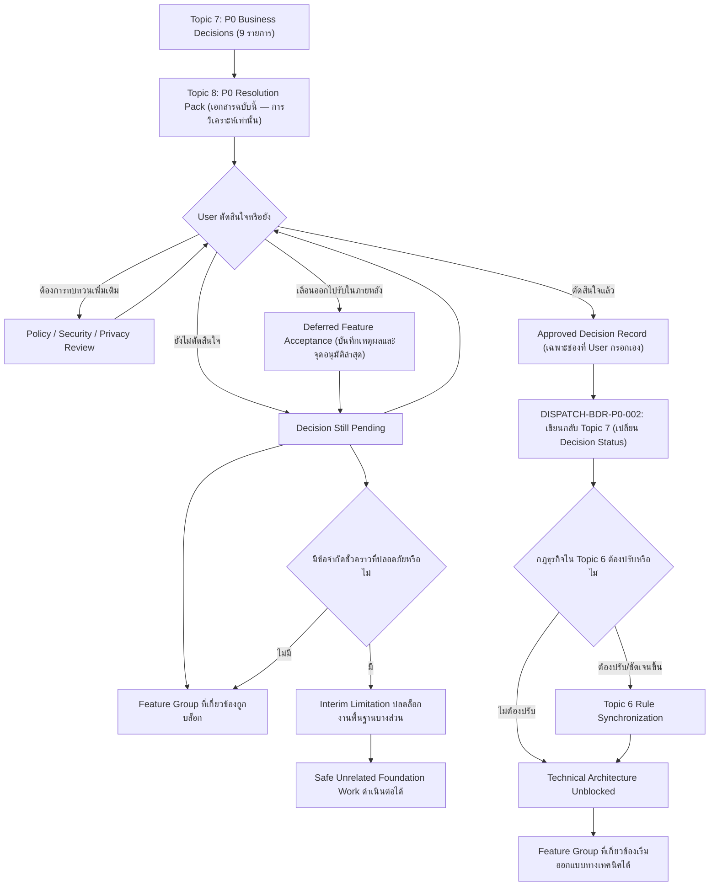

# ชุดตัดสินใจ P0 ก่อนเริ่ม MVP

> [!summary]
> เอกสารฉบับนี้คือ **P0 Business Decision Resolution Pack** ของระบบ Dispatch นำเฉพาะประเด็นการตัดสินใจทางธุรกิจที่มี **Priority = P0** จำนวน **9 รายการ** จาก [[07 - ขอบเขต MVP และทะเบียนการตัดสินใจทางธุรกิจ]] มาวิเคราะห์อย่างละเอียดทีละรายการ — อธิบายเหตุผลที่แต่ละรายการเป็น Blocker, นำเสนอทางเลือกเชิงธุรกิจ 2–4 ทางเลือกต่อรายการพร้อม Trade-off, วิเคราะห์ผลกระทบเชิงปฏิบัติการ/ธรรมาภิบาล/ความเป็นส่วนตัว/ความปลอดภัย/ข้อมูล/หลักฐาน/Workflow และการ Implement, ระบุว่ามีข้อจำกัดชั่วคราวที่ปลดล็อกการพัฒนาได้อย่างปลอดภัยหรือไม่ และให้ข้อเสนอเชิงวิเคราะห์แบบไม่ผูกมัด (Non-binding) เมื่อมีหลักฐานเพียงพอ **เดิมเอกสารฉบับนี้ไม่ใช่บันทึกการอนุมัติ และทุกช่องการตัดสินใจของ User ถูกเว้นว่างไว้โดยเจตนาจนถึงวันที่ 2026-07-19** **ปรับปรุง 2026-07-20**: Product Owner / User ได้อนุมัติทั้ง 9 ประเด็นแล้วผ่านภารกิจ DISPATCH-BDR-P0-002 หัวข้อ I ("User Decision Record") ของแต่ละประเด็นในหัวข้อ 7–15 จึงถูกกรอกให้ตรงกับผลการอนุมัติจริงแล้ว เอกสารฉบับนี้ยังคงรักษาการวิเคราะห์ทางเลือกทั้งหมด (Options, Comparison Table, Non-binding Recommendation) ไว้ครบถ้วนในฐานะประวัติ — **[[07 - ขอบเขต MVP และทะเบียนการตัดสินใจทางธุรกิจ]] หัวข้อ 15.1 ยังคงเป็นบันทึกการอนุมัติที่มีอำนาจ (Authoritative)** เอกสารฉบับนี้ไม่ใช่ทะเบียนคู่ขนาน
>
> เอกสารฉบับนี้จัดทำโดย Claude ในบทบาทผู้เตรียมการวิเคราะห์การตัดสินใจ (Decision Analysis Preparer) เท่านั้น **Claude ไม่มีอำนาจอนุมัติการตัดสินใจทางธุรกิจใด ๆ และไม่เลือกทางเลือกสุดท้ายแทน User** ChatGPT ทำหน้าที่ทบทวนสถาปัตยกรรม ควบคุมขอบเขต และให้ผล PASS/FAIL ส่วน **User (Product Owner)** เป็นผู้อนุมัติขั้นสุดท้ายเพียงผู้เดียวสำหรับทุกการตัดสินใจทางธุรกิจในเอกสารฉบับนี้

เอกสารฉบับนี้ต่อยอดจาก [[07 - ขอบเขต MVP และทะเบียนการตัดสินใจทางธุรกิจ]] (Authoritative Business Decision Register) และ [[06 - กฎธุรกิจและกฎการตรวจสอบความถูกต้องของระบบ Dispatch]] (Authoritative Business Rule Catalog) เท่านั้น ไม่ค้นหาประเด็นเปิดใหม่ด้วยตนเอง และไม่แก้ไขเนื้อหาของ Topics 1–7 ไม่ว่ากรณีใด

## 1. วัตถุประสงค์

เอกสารฉบับนี้มีวัตถุประสงค์เพื่อ

* สกัด (Extract) ประเด็นการตัดสินใจทางธุรกิจที่มี **Priority = P0** ทั้ง 9 รายการออกจาก [[07 - ขอบเขต MVP และทะเบียนการตัดสินใจทางธุรกิจ]] อย่างถูกต้องครบถ้วน โดยรักษา Decision ID เดิมทุกประการ
* อธิบายเหตุผลที่แต่ละรายการเป็น P0 (เหตุใดจึงบล็อกการออกแบบ MVP ที่ถูกต้อง)
* ระบุ MVP Feature Group หรือพื้นที่สถาปัตยกรรมที่ถูกบล็อกโดยแต่ละประเด็น
* นำเสนอทางเลือกเชิงธุรกิจ 2–4 ทางเลือกต่อประเด็น พร้อม Trade-off ที่ครบถ้วน
* วิเคราะห์ผลกระทบเชิงปฏิบัติการ ธรรมาภิบาล ความเป็นส่วนตัว ความปลอดภัย ข้อมูล หลักฐาน Workflow และการ Implement ของแต่ละทางเลือก
* ระบุว่าแต่ละประเด็นมีข้อจำกัดชั่วคราว (Interim Limitation) ที่ปลดล็อกการพัฒนาพื้นฐานได้อย่างปลอดภัยหรือไม่
* ให้ข้อเสนอเชิงวิเคราะห์แบบไม่ผูกมัด (Non-binding Analyst Recommendation) เมื่อมีหลักฐานสนับสนุนเพียงพอ
* เว้นช่องการตัดสินใจสุดท้ายไว้สำหรับ User ทุกประเด็น ณ วันที่จัดทำเอกสารฉบับนี้ (2026-07-19) **ปรับปรุง 2026-07-20**: User อนุมัติครบทั้ง 9 ประเด็นแล้ว ช่องดังกล่าวจึงถูกกรอกด้วยสำเนาผลการอนุมัติจริงในหัวข้อ I ของแต่ละ Decision (บันทึกที่มีอำนาจยังคงอยู่ที่ [[07 - ขอบเขต MVP และทะเบียนการตัดสินใจทางธุรกิจ]] หัวข้อ 15.1)
* กำหนดว่า Knowledge Document ใดต้องได้รับการปรับปรุงหลังจาก User ตัดสินใจ
* หลีกเลี่ยงการเลือกเทคโนโลยีหรือรายละเอียดการ Implement ทางเทคนิคโดยเด็ดขาด

เอกสารฉบับนี้**เริ่มต้น**ในฐานะเอกสารระดับ**การวิเคราะห์การตัดสินใจก่อนอนุมัติ** (Pre-approval Decision Analysis Pack) เมื่อ 2026-07-19 **ไม่ใช่**บันทึกการอนุมัติ (Approval Record) และ**ไม่ใช่**เอกสารออกแบบทางเทคนิค **ปรับปรุง 2026-07-20**: หลังจากภารกิจ DISPATCH-BDR-P0-002 เสร็จสมบูรณ์และ User อนุมัติทั้ง 9 ประเด็นแล้ว หัวข้อ I ของแต่ละ Decision ในเอกสารฉบับนี้บันทึกสำเนาผลการอนุมัติ (Resolution Copy) ไว้ด้วย แต่บันทึกที่มีอำนาจ (Authoritative Record) ยังคงอยู่ที่ [[07 - ขอบเขต MVP และทะเบียนการตัดสินใจทางธุรกิจ]] หัวข้อ 15.1 เสมอ — เอกสารฉบับนี้**ไม่ใช่**ทะเบียนคู่ขนาน (Not a Parallel Authoritative Register)

## 2. ขอบเขตของเอกสาร

เอกสารฉบับนี้ครอบคลุม

* การสกัดและตรวจสอบ P0 Decision ทั้ง 9 รายการจาก Topic 7 พร้อมตารางสรุป (P0 Decision Summary)
* การวิเคราะห์รายละเอียดของแต่ละ P0 Decision ทีละรายการ (9 หัวข้อแยกกัน หนึ่งหัวข้อต่อหนึ่ง Decision ID)
* การวิเคราะห์ความสัมพันธ์ระหว่างประเด็น P0 (Decision Dependency Analysis) และลำดับการตัดสินใจที่แนะนำ (Recommended Decision Sequence — เป็นคำแนะนำ ไม่ใช่การอนุมัติ)
* ขอบเขตงานพัฒนาที่ปลอดภัยระหว่างรอการตัดสินใจ (Interim Development Boundaries)
* ภาคผนวกประเด็น MUST_DECIDE_BEFORE_MVP ที่ไม่ใช่ P0 (Non-P0 MUST_DECIDE Appendix) แบบสรุปย่อ ไม่วิเคราะห์ทางเลือกเต็มรูปแบบ
* แบบฟอร์มการตัดสินใจของ User (User Decision Record) สำหรับทุกประเด็น P0 — ว่างเปล่า (Blank) ตั้งแต่จัดทำ (2026-07-19) จนกระทั่ง User อนุมัติเมื่อ 2026-07-20 **ปรับปรุง 2026-07-20**: ปัจจุบันบันทึกสำเนาผลการอนุมัติ (Resolution Copy) ไว้แล้ว
* ตารางสรุปสำหรับ User (User Decision Worksheet) — มีสถานะ "รอการตัดสินใจ" เสมอตั้งแต่จัดทำจนถึง 2026-07-19 **ปรับปรุง 2026-07-20**: ปัจจุบันแสดงสถานะ APPROVED ตามผลการอนุมัติจริง
* แผนงานถัดไปหลัง User อนุมัติ (Post-Decision Knowledge Update Plan / DISPATCH-BDR-P0-002) — **ไม่ได้ดำเนินการในภารกิจจัดทำเอกสารฉบับนี้ (2026-07-19)** **ปรับปรุง 2026-07-20**: ภารกิจ DISPATCH-BDR-P0-002 ได้ดำเนินการเสร็จสมบูรณ์แล้วแยกต่างหาก — ดูผลใน [[07 - ขอบเขต MVP และทะเบียนการตัดสินใจทางธุรกิจ]] หัวข้อ 15.1
* ตัวอย่างสถานการณ์ธรรมาภิบาลการตัดสินใจ (Decision Governance Scenarios) อย่างน้อย 12 กรณี
* แผนภาพ Mermaid หนึ่งแผนภาพที่แสดงเส้นทางจาก P0 Decision จนถึงการปลดล็อกสถาปัตยกรรมทางเทคนิค

เอกสารฉบับนี้**ไม่ได้กำหนด**

* คำตอบสุดท้ายของประเด็น P0 ใด ๆ ด้วยอำนาจของเอกสารฉบับนี้เอง — ทุกช่องการตัดสินใจเว้นว่างไว้จนกระทั่ง User อนุมัติแยกต่างหากผ่านภารกิจ DISPATCH-BDR-P0-002 (สำเนาผลการอนุมัติปรากฏในหัวข้อ I ตั้งแต่ 2026-07-20 แต่บันทึกที่มีอำนาจยังอยู่ที่ [[07 - ขอบเขต MVP และทะเบียนการตัดสินใจทางธุรกิจ]] หัวข้อ 15.1 เสมอ)
* Technology Stack, Database Schema, API Design, UI Design หรือ Source Code
* ประมาณการโครงการ งบประมาณ หรืออัตรากำลังทีม
* การเปลี่ยนแปลง Decision Status ใน Topic 7 หรือการเปลี่ยนแปลงนิยาม Business Rule ใน Topic 6
* การวิเคราะห์ทางเลือกเต็มรูปแบบสำหรับประเด็นที่ไม่ใช่ P0 (ดูหัวข้อ [19](#19-non-p0-must_decide_before_mvp-appendix) สำหรับภาคผนวกแบบย่อ)

## 3. Source of Truth และอำนาจการอนุมัติ

| เอกสาร | บทบาท |
| --- | --- |
| [[06 - กฎธุรกิจและกฎการตรวจสอบความถูกต้องของระบบ Dispatch]] | **Authoritative BR/VR Catalog** — Catalog หลักของ Business Rule (BR-xxx) และ Validation Rule (VR-xxx) ที่อนุมัติแล้วทั้งหมด |
| [[07 - ขอบเขต MVP และทะเบียนการตัดสินใจทางธุรกิจ]] | **Authoritative BDR Register และ MVP Scope Lock** — ทะเบียนการตัดสินใจทางธุรกิจฉบับสมบูรณ์ (93 รายการ) และขอบเขต MVP ที่อนุมัติแล้ว |
| **08 (เอกสารฉบับนี้)** | **Working Decision-resolution Pack** — ชุดวิเคราะห์การตัดสินใจสำหรับ 9 ประเด็น P0 เท่านั้น เพื่อสนับสนุนการตัดสินใจของ User |

หลักการที่ต้องยึดถืออย่างเคร่งครัดตลอดทั้งเอกสาร

1. **Topic 6 ยังคงเป็น Catalog หลักของกฎธุรกิจ** Topic 8 ไม่สร้างหรือแก้ไข Rule ID ใด ๆ
2. **Topic 7 ยังคงเป็น Business Decision Register และ MVP Scope Lock ฉบับสมบูรณ์และเป็นทางการ** Topic 8 **ไม่แทนที่** Topic 7 เพียงหยิบเฉพาะ 9 รายการที่เป็น P0 มาวิเคราะห์เจาะลึกเพื่อสนับสนุนการตัดสินใจ
3. **Topic 8 เองไม่มีอำนาจเปลี่ยน Decision Status ของ Topic 7 โดยตรง** — การเปลี่ยนแปลงต้องเกิดผ่านภารกิจแยกต่างหาก (DISPATCH-BDR-P0-002) เท่านั้น **ปรับปรุง 2026-07-20**: ภารกิจ DISPATCH-BDR-P0-002 ได้ดำเนินการแล้วหลังจาก User อนุมัติทั้ง 9 ประเด็น — Topic 7 หัวข้อ 15.1 จึงแสดง Decision Status = APPROVED สำหรับทั้ง 9 รายการนี้แล้ว หัวข้อ I ของแต่ละ Decision ในเอกสารฉบับนี้ได้รับการปรับปรุงให้ตรงกันด้วย
4. **ประเด็นหนึ่งจะกลายเป็น APPROVED ได้ก็ต่อเมื่อ User เลือกและอนุมัติทางเลือกใดทางเลือกหนึ่งอย่างชัดเจนเท่านั้น** การที่ทางเลือกหนึ่งปรากฏเป็นข้อเสนอเชิงวิเคราะห์ในเอกสารฉบับนี้**ไม่ได้แปลว่าได้รับการอนุมัติ**
5. **ผลการอนุมัติของ User ต้องถูกเขียนกลับเข้าสู่ Topic 7 ผ่านภารกิจแยกต่างหากในภายหลังเท่านั้น** (DISPATCH-BDR-P0-002 — ดูหัวข้อ [21](#21-post-decision-knowledge-update-plan)) ไม่ใช่ผ่านการแก้ไขเอกสารฉบับนี้
6. **Topic 6 ต้อง Synchronize เฉพาะเมื่อการตัดสินใจที่อนุมัติแล้วเปลี่ยนแปลงหรือทำให้ขอบเขตของ Business Rule ชัดเจนขึ้นเท่านั้น** (เช่น การเพิ่ม Rule ID ใหม่หรือการเปลี่ยนสถานะ ADVISORY เป็น HARD_BLOCK) ไม่ใช่การ Synchronize โดยอัตโนมัติทุกครั้งที่มีการตัดสินใจ

### 3.1 แผนภาพกระบวนการตัดสินใจ (แผนภาพ Mermaid เดียวของเอกสารฉบับนี้)

แผนภาพต่อไปนี้แสดงเส้นทางตั้งแต่ P0 Decisions ใน Topic 7 ผ่านชุดวิเคราะห์นี้ (Topic 8) จนถึงการปลดล็อกสถาปัตยกรรมทางเทคนิค พร้อมกิ่งแยกสำหรับข้อจำกัดชั่วคราว ประเด็นที่ยังค้างอยู่ การทบทวนเชิงนโยบาย และการยอมรับฟีเจอร์ที่เลื่อนออกไป

> [!important]
> แผนภาพนี้แสดงให้เห็นชัดเจนว่า (1) **การวิเคราะห์ของ Claude ในเอกสารฉบับนี้ไม่ใช่การอนุมัติ** — เส้นทางสู่ Approved Decision Record ต้องผ่าน User เท่านั้น (2) ตราบใดที่ P0 ยังไม่ได้รับการอนุมัติ Feature Group ที่เกี่ยวข้องยังคงถูกบล็อกเสมอ (3) งานพื้นฐานที่ไม่เกี่ยวข้องกับประเด็นที่ค้างอยู่ยังดำเนินต่อได้อย่างปลอดภัยผ่านข้อจำกัดชั่วคราว (4) การอนุมัติของ User ต้องถูกเขียนกลับเข้า Topic 7 ก่อนที่ Technical Architecture ของ Feature Group นั้นจะเริ่มได้ และ (5) **Topic 8 ไม่ใช่ทะเบียนการตัดสินใจที่มีอำนาจ (Authoritative Decision Register)** — Topic 7 ยังคงทำหน้าที่นั้นเสมอ

## 4. วิธีดึงและตรวจสอบ P0

หัวข้อนี้บันทึกวิธีการที่ใช้สกัด (Extract) ประเด็น P0 จาก Topic 7 และผลการตรวจสอบนับจำนวนโดยตรงจากเนื้อหาปัจจุบันของ Topic 7 (ไม่ใช่การอนุมานจากภารกิจนี้)

### 4.1 วิธีการ

1. อ่าน [[07 - ขอบเขต MVP และทะเบียนการตัดสินใจทางธุรกิจ]] หัวข้อ 15 (Business Decision Register — ตารางกลุ่ม A–N รวม 93 แถว) และหัวข้อ 16 (P0 Business Decision Shortlist) ทั้งหมด
2. คัดกรองเฉพาะแถวที่คอลัมน์ **Priority = P0** ในหัวข้อ 15 — **ไม่ใช้** คอลัมน์ Decision Status เป็นตัวกรอง เนื่องจากเป็นคนละมิติกันตามหลักการในหัวข้อ 6 ของ Topic 7
3. ตรวจสอบไขว้ผลลัพธ์กับหัวข้อ 16 (P0 Business Decision Shortlist) ซึ่งสรุปไว้ชัดเจนว่า "มีเพียง 6 กลุ่มประเด็นที่เป็น P0 ที่แท้จริง" ครอบคลุม Decision ID ทั้ง 9 รายการ (บาง Decision ID จับคู่กันเป็นประเด็นเดียวกันในเชิงนโยบายแต่ยังคง ID แยกกัน)
4. ตรวจสอบไขว้ผลลัพธ์อีกครั้งกับหัวข้อ 25 (Approval Checkpoints) ของ Topic 7 ซึ่งระบุ CP-01 ว่าต้องอนุมัติ **"P0 Business Decisions (9 รายการในหัวข้อ 16)"** ก่อนเริ่ม Technical Architecture — ยืนยันจำนวน 9 รายการจากอีกจุดหนึ่งของเอกสารต้นทาง
5. ตรวจสอบไขว้ผลลัพธ์อีกครั้งกับหัวข้อ 28.2 ของ Topic 7 และหัวข้อ 40.D ของ Topic 6 ซึ่งทั้งสองยืนยันตารางจำนวนตาม Priority ตรงกัน (P0 = 9, P1 = 27, P2 = 43, P3 = 14, รวม 93)
6. **ไม่ค้นหาประเด็นเปิดใหม่ด้วยตนเอง** และ**ไม่รวมประเด็นที่ Priority อื่นเข้ามาในรายการ P0** แม้ว่าประเด็นนั้นจะมีสถานะ MUST_DECIDE_BEFORE_MVP หรือดูเหมือนเร่งด่วนก็ตาม

### 4.2 ผลการตรวจสอบจำนวน (ตรวจสอบโดยตรงจาก Topic 7 หัวข้อ 15, 16, 28 และ Topic 6 หัวข้อ 40.D)

| รายการที่ตรวจสอบ | จำนวนที่รายงานใน Topic 7 | จำนวนที่พบจริงในเอกสารฉบับนี้ | ตรงกันหรือไม่ |
| --- | --- | --- | --- |
| Total Decision Register rows | 93 | 93 | ตรงกัน |
| P0 decisions | 9 | 9 | ตรงกัน |
| MUST_DECIDE_BEFORE_MVP decisions | 13 | 13 (9 เป็น P0 + 4 เป็น P1) | ตรงกัน |
| APPROVED decisions ในทะเบียน | 0 | 0 (ไม่มีรายการใดใน Business Decision Register ที่เป็น APPROVED — ขอบเขตที่อนุมัติแล้วอยู่ในหัวข้อ 10 ของ Topic 7 แยกต่างหาก) | ตรงกัน |

> [!important] เหตุใด P0 (9) ≠ MUST_DECIDE_BEFORE_MVP (13)
> Priority และ Decision Status เป็นสองมิติที่แยกจากกันโดยสิ้นเชิงตาม Topic 7 หัวข้อ 6 มี **4 รายการ** ที่เป็น MUST_DECIDE_BEFORE_MVP แต่มี Priority เป็น **P1** เท่านั้น (ไม่บล็อกการเริ่มพัฒนา MVP โดยรวม เพียงต้องตัดสินใจก่อนที่ Feature Group ที่เกี่ยวข้องจะผ่านเกณฑ์ยอมรับ): **BDR-RETURN-002, BDR-OVERRIDE-003, BDR-OVERRIDE-006, BDR-PRIVACY-001** — ทั้งสี่รายการนี้ถูกบันทึกไว้ในภาคผนวกหัวข้อ [19](#19-non-p0-must_decide_before_mvp-appendix) ของเอกสารฉบับนี้ **ไม่ใช่**ในการวิเคราะห์ P0 แบบเต็มรูปแบบ

### 4.3 Decision ID ทั้ง 9 รายการที่สกัดได้ (เรียงตามลำดับที่ปรากฏใน Topic 7 หัวข้อ 16)

1. BDR-CUSTOMER-001
2. BDR-CUSTOMER-002
3. BDR-EVIDENCE-001
4. BDR-EVIDENCE-002
5. BDR-EXTERNAL-001
6. BDR-PREP-001
7. BDR-PREP-004
8. BDR-CORRECTION-001
9. BDR-RETURN-003

> [!note]
> Topic 7 หัวข้อ 16 จัดกลุ่มทั้ง 9 รายการนี้เป็น **6 กลุ่มประเด็นเชิงนโยบาย** (Customer Master, Signature Method, External Evidence, Prep Correction Authority, Correction Fields, Reopen-vs-Return) เนื่องจากบาง Decision ID เป็นมุมมองที่ต่างกันของประเด็นเดียวกัน อย่างไรก็ตาม **เอกสารฉบับนี้วิเคราะห์และบันทึกทั้ง 9 Decision ID แยกจากกันเป็น 9 หัวข้อ** ตามข้อกำหนดของภารกิจ (ห้ามรวมประเด็น P0 ที่เป็นอิสระเข้าเป็นบันทึกการอนุมัติเดียว) พร้อมระบุความเชื่อมโยงระหว่างคู่ที่สัมพันธ์กันไว้ในแต่ละหัวข้อและในหัวข้อ [16. Decision Dependency Analysis](#16-decision-dependency-analysis)

## 5. ตาราง P0 Decision Summary

| ลำดับ | Decision ID | ประเด็นการตัดสินใจ | Decision Status | Priority | Impact Categories | Decision Owner | Approval Checkpoint | Related MVP Feature Groups | Related Rule IDs | Source Topic และ Section |
| --- | --- | --- | --- | --- | --- | --- | --- | --- | --- | --- |
| 1 | BDR-CUSTOMER-001 | Customer Master Selection เป็นข้อบังคับหรือไม่ | **APPROVED (2026-07-20)** | P0 | PRODUCT_SCOPE, CUSTOMER_DESTINATION, DATA_REQUIREMENT | Product Owner / User | ก่อนเริ่มออกแบบ MVP-02 | MVP-02, MVP-04 | BR-TASK-003, BR-TASK-009, BR-DATA-003 | Topic 5 §6, §8; Topic 7 §15 กลุ่ม A แถว 2, §15.1, §16 ข้อ 2 |
| 2 | BDR-CUSTOMER-002 | อนุญาตให้กรอกปลายทางแบบข้อความอิสระ (Free-text) หรือไม่ | **APPROVED (2026-07-20)** | P0 | PRODUCT_SCOPE, CUSTOMER_DESTINATION | Product Owner / User | ก่อนเริ่มออกแบบ MVP-02 | MVP-02, MVP-04 | BR-TASK-003, BR-TASK-009, BR-DATA-003 | Topic 5 §6, §8; Topic 7 §15 กลุ่ม A แถว 3, §15.1, §16 ข้อ 2 |
| 3 | BDR-EVIDENCE-001 | ขอบเขตวิธีการหลักฐานทางธุรกิจที่ยอมรับสำหรับการเก็บลายเซ็น (วาดบนหน้าจอ, อัปโหลดเอกสาร, ถ่ายภาพใบเสร็จหรือเอกสารที่ลงชื่อแล้ว) — ไม่ใช่การเลือกไลบรารี/คอมโพเนนต์, รูปแบบการจับภาพ, รูปแบบไฟล์, การจัดเก็บ, การแสดงผล หรือคุณภาพของภาพ ซึ่งยังเป็น TECHNICAL_DECISION แยกต่างหาก | **APPROVED (2026-07-20)** | P0 | EVIDENCE, TECHNICAL_ARCHITECTURE, UX | Product Owner / User (ร่วม UX และ Technical Architecture) | ก่อนเริ่มออกแบบ MVP-07 | MVP-07, MVP-09, MVP-10 | BR-EVIDENCE-*, BR-RECIPIENT-003, BR-RECIPIENT-008 | Topic 2 §5.13; Topic 5 §17, §39 กลุ่ม B; Topic 7 §15 กลุ่ม E แถว 26, §15.1, §16 ข้อ 4 |
| 4 | BDR-EVIDENCE-002 | ภาพถ่ายเอกสารที่ลงชื่อแล้วสามารถใช้แทนลายเซ็นบนหน้าจอได้หรือไม่ | **APPROVED (2026-07-20)** | P0 | EVIDENCE, WORKFLOW | Product Owner / User | ก่อนเริ่มออกแบบ MVP-07 | MVP-07, MVP-09 | BR-RECIPIENT-003, BR-RECIPIENT-008 | Topic 2 §5.13; Topic 5 §39 กลุ่ม B; Topic 7 §15 กลุ่ม E แถว 27, §15.1, §16 ข้อ 5 |
| 5 | BDR-EXTERNAL-001 | ข้อกำหนดขั้นต่ำของหลักฐานที่ผู้ส่งสินค้าภายนอกต้องให้ได้ | **APPROVED (2026-07-20)** | P0 | EXTERNAL_COURIER, EVIDENCE, WORKFLOW | Product Owner / User (ร่วม Admin Operations) | ก่อนเริ่มออกแบบ MVP-10 | MVP-10 | BR-EXTERNAL-002 ถึง BR-EXTERNAL-005, BR-EXTERNAL-009 | Topic 5 §21, §39 กลุ่ม F; Topic 7 §15 กลุ่ม G แถว 41, §15.1, §16 ข้อ 7–8 |
| 6 | BDR-PREP-001 | ผู้มีอำนาจแก้ไขข้อมูลการเตรียมสินค้าหลัง IN_TRANSIT (Admin เองได้ หรือจำกัดเฉพาะ Super Admin) | **APPROVED (2026-07-20)** | P0 | PERMISSION, WORKFLOW, DATA_REQUIREMENT | Product Owner / User (ร่วม Super Admin Governance) | ก่อนเริ่มพัฒนา MVP-03 | MVP-03, MVP-16 | BR-PREP-007, BR-PREP-008 | Topic 3 §14.2; Topic 4 §27; Topic 7 §15 กลุ่ม B แถว 7, §15.1, §16 ข้อ 9 |
| 7 | BDR-PREP-004 | Admin สามารถสร้างบันทึกแก้ไขสำหรับข้อมูลการเตรียมสินค้าหลังเริ่มจัดส่งได้เอง หรือจำกัดเฉพาะ Super Admin เท่านั้น | **APPROVED (2026-07-20)** | P0 | PERMISSION, CORRECTION_ACTION | Product Owner / User (ร่วม Super Admin Governance) | ก่อนเริ่มพัฒนา MVP-03/MVP-16 | MVP-03, MVP-16 | BR-PREP-007, BR-PREP-008 | Topic 3 §27, §14.2; Topic 4 §32; Topic 5 §39 กลุ่ม G; Topic 7 §15 กลุ่ม J แถว 57, §15.1 |
| 8 | BDR-CORRECTION-001 | ฟิลด์ข้อมูลผู้รับสินค้ารายการใดบ้างที่มีสิทธิ์ใช้ Correction Action ได้อย่างชัดเจน | **APPROVED (2026-07-20)** | P0 | CORRECTION_ACTION, RECIPIENT, GOVERNANCE | Product Owner / User (ร่วม Admin Operations) | ก่อนเริ่มพัฒนา MVP-16 | MVP-16 | BR-RECIPIENT-007 | Topic 3 §27, §16, §20.1 (recipient fields); Topic 5 §39 กลุ่ม A; Topic 7 §15 กลุ่ม I แถว 55, §15.1, §16 ข้อ 12 |
| 9 | BDR-RETURN-003 | Task ที่ถูกยกเลิกพร้อม Returned-Goods = PENDING_RETURN สามารถถูก Reopen ได้หรือไม่ | **APPROVED (2026-07-20)** | P0 | REOPEN, CANCELLATION, RETURNED_GOODS, STATUS_TRANSITION | Product Owner / User (ร่วม Super Admin Governance) | ก่อนเริ่มพัฒนา MVP-13 | MVP-12, MVP-13 | BR-REOPEN-005, BR-REOPEN-011, BR-RETURN-002, BR-RETURN-003 | Topic 4 §32 ข้อ 22; Topic 7 §15 กลุ่ม H แถว 49, §15.1, §16 ข้อ 25 |

> [!warning] ปรับปรุง 2026-07-20
> ตารางข้างต้นมีทั้งหมด **9 แถว** — ตรงตามจำนวน P0 ที่ยืนยันแล้วในหัวข้อ 4.2 **ไม่มีรายการ P1, P2 หรือ P3 ปรากฏในตารางนี้หรือในการวิเคราะห์เจาะลึกของเอกสารฉบับนี้** **ทั้ง 9 แถวได้รับการอนุมัติจาก Product Owner / User เมื่อ 2026-07-20 แล้ว** (Selected option ของแต่ละรายการอยู่ในหัวข้อ I ของแต่ละหัวข้อย่อย 7–15 ด้านล่าง และในบันทึกหลักที่ Topic 7 หัวข้อ 15.1) Decision Status ในตารางนี้อัปเดตให้ตรงกับ Topic 7 ซึ่งยังคงเป็นทะเบียนที่มีอำนาจ (Authoritative Register) เสมอ

## 6. หลักการวิเคราะห์ตัวเลือก

หัวข้อที่ 7–15 วิเคราะห์ P0 Decision แต่ละรายการด้วยโครงสร้างเดียวกัน 9 ส่วน (A–I) ดังนี้

* **A. Decision Statement** — คำถามทางธุรกิจที่ต้องอนุมัติ คำอธิบายภาษาไทยแบบเข้าใจง่าย สิ่งที่อนุมัติแล้ว สิ่งที่ยังไม่ได้ตัดสินใจ และสิ่งที่ห้ามเปลี่ยนแปลงโดยการตัดสินใจนี้
* **B. Historical Pre-approval Classification** — Decision ID, Decision Status, Priority, เจ้าของ, Approval Checkpoint, Impact Categories, MVP Feature Group, Rule ID ที่เกี่ยวข้อง, Source Topics ตามที่บันทึกไว้ ณ วันที่ 2026-07-19 ก่อนการอนุมัติ (ดูสถานะปัจจุบันในหมายเหตุท้ายตารางของแต่ละหัวข้อ)
* **C. Why This Is P0** — เหตุผลที่การออกแบบ MVP ถูกบล็อก Workflow ที่กระทบ ระเบียน/สิทธิ์/หลักฐาน/ธรรมาภิบาลที่กระทบ และผลที่ตามมาหาก Implement โดยสมมติคำตอบเอง
* **D. Non-negotiable Approved Boundaries** — กฎที่อนุมัติแล้วซึ่งทุกทางเลือกต้องเคารพ (เฉพาะที่เกี่ยวข้องกับประเด็นนั้น)
* **E. Options** — ทางเลือก 2–4 ทางเลือกที่เป็นไปได้จริง แต่ละทางเลือกระบุ พฤติกรรมทางธุรกิจ, ผู้เกี่ยวข้อง, ผลกระทบต่อ Workflow/สิทธิ์/ข้อมูล-หลักฐาน/Timeline-Audit/ความเป็นส่วนตัว-ความปลอดภัย, ข้อดี-ข้อเสียเชิงปฏิบัติการ, MVP Complexity (LOW/MEDIUM/HIGH), Risk Level (LOW/MEDIUM/HIGH), Reversibility (EASY/MODERATE/DIFFICULT), Rule ที่เกี่ยวข้อง และ Topic ที่ต้องแก้ไขหลังอนุมัติ
* **F. Comparison Table** — ตารางเปรียบเทียบทางเลือกทั้งหมดในมิติ: ความเหมาะสมเชิงปฏิบัติการ, ธรรมาภิบาลและ Audit, ความเป็นส่วนตัว/ความปลอดภัย, MVP Complexity, ความยืดหยุ่นในอนาคต, ความเสี่ยงหลัก, ผลกระทบต่อ Knowledge
* **G. Interim Limitation Analysis** — พัฒนาต่อได้หรือไม่โดยไม่มีคำตอบสุดท้าย, งานพื้นฐานที่ปลอดภัย, ฟีเจอร์ที่ต้องบล็อกไว้, ข้อจำกัดชั่วคราวที่ปลอดภัย (ถ้ามีจริง), จุดอนุมัติล่าสุดที่ยอมรับได้, สิ่งที่ห้าม Implement โดยสมมติ
* **H. Non-binding Analyst Recommendation** — ระบุด้วยข้อความ **"ข้อเสนอเชิงวิเคราะห์ — ยังไม่ใช่การอนุมัติ"** เสมอ ให้เฉพาะเมื่อมีหลักฐานสนับสนุนเพียงพอ พร้อมเงื่อนไขและเหตุผลที่ทางเลือกอื่นเหมาะสมน้อยกว่า
* **I. User Decision Record** — แบบฟอร์มว่างเปล่าที่มีสถานะ `รอการตัดสินใจจาก User` ตั้งแต่จัดทำ (2026-07-19) จนกระทั่ง User อนุมัติทั้ง 9 ประเด็นเมื่อ 2026-07-20 ผ่านภารกิจ DISPATCH-BDR-P0-002 **ปรับปรุง 2026-07-20**: แต่ละหัวข้อ I ปัจจุบันบันทึกสำเนาผลการอนุมัติ (Resolution Copy) ที่ตรงกับ [[07 - ขอบเขต MVP และทะเบียนการตัดสินใจทางธุรกิจ]] หัวข้อ 15.1 ซึ่งยังคงเป็นบันทึกที่มีอำนาจ (Authoritative) เสมอ

มิติการวิเคราะห์ (Analysis Dimensions) ที่นำมาใช้ตามความเกี่ยวข้องของแต่ละประเด็นเท่านั้น (ไม่บังคับทุกมิติในทุกประเด็น) ได้แก่ Product Scope, Operational Workflow, Role and Permission Impact, Status-transition Impact, Task-level vs Attempt-level Data, Evidence Requirements, Quantity Consistency, Internal Delivery, External Courier, Cancellation and Returned Goods, Reopen, Emergency Override, Super Admin Review, Correction Action, Sensitive-data Access, Privacy and Masking, Timeline and Audit Log, Reporting and Export, Scope Creep, Technical-architecture Dependency และ Future Phase 2 Flexibility

> [!note]
> ทางเลือกทุกข้อในหัวข้อ 7–15 ผ่านการตรวจสอบว่าเป็นไปได้จริงในเชิงธุรกิจ ไม่มีทางเลือกใดถูกสร้างขึ้นเพียงเพื่อให้ครบจำนวน และไม่มีทางเลือกใดเลือกเทคโนโลยีหรือรายละเอียดการ Implement แทนคำถามทางธุรกิจ

## 7. BDR-CUSTOMER-001

### A. Decision Statement

**คำถามทางธุรกิจ**: Task ทุกรายการต้องเลือกลูกค้า/ปลายทางจาก **Customer Master** (ฐานข้อมูลลูกค้า/ปลายทางแบบมีโครงสร้าง) เป็นข้อบังคับหรือไม่?

**คำอธิบายภาษาไทยแบบเข้าใจง่าย**: เมื่อ Dispatcher สร้างงานใหม่ ระบบควรบังคับให้เลือกลูกค้า/ปลายทางจากรายชื่อที่มีอยู่แล้วในระบบเท่านั้น หรือควรอนุญาตให้กรอกข้อมูลปลายทางขึ้นใหม่ได้อย่างอิสระ (ดู [8. BDR-CUSTOMER-002](#8-bdr-customer-002) สำหรับคำถามคู่กัน)

**สิ่งที่อนุมัติแล้ว**: ต้องมี Historical Destination Snapshot ที่ตรึงค่าปลายทาง ณ เวลาที่ใช้งานจริงไว้เสมอ ไม่ถูกเขียนทับด้วยข้อมูลหลักที่เปลี่ยนแปลงภายหลัง (BR-TASK-009, BR-DATA-003) และข้อมูลปลายทางต้องเพียงพอต่อการปฏิบัติงาน คือมีชื่อปลายทางและที่อยู่ครบถ้วน (BR-TASK-003, HARD_BLOCK)

**สิ่งที่ยังไม่ได้ตัดสินใจ**: รูปแบบของแหล่งข้อมูลปลายทาง — มาจาก Customer Master แบบมีโครงสร้างเพียงอย่างเดียว, จาก Free-text เพียงอย่างเดียว, หรือทั้งสองแบบร่วมกัน

**สิ่งที่ห้ามเปลี่ยนแปลงโดยการตัดสินใจนี้**: หลักการ Historical Destination Snapshot ที่อนุมัติแล้ว (BR-TASK-009), ข้อกำหนดขั้นต่ำว่าต้องมีชื่อและที่อยู่ปลายทางครบถ้วนก่อนเข้าสู่ WAITING_PREPARATION (BR-TASK-003)

### B. Historical Pre-approval Classification

| ฟิลด์ | ค่า |
| --- | --- |
| Decision ID | BDR-CUSTOMER-001 |
| Decision Status | MUST_DECIDE_BEFORE_MVP |
| Priority | P0 |
| Decision Owner | Product Owner / User |
| Approval Checkpoint | ก่อนเริ่มออกแบบ MVP-02 (CP-01) |
| Impact Categories | PRODUCT_SCOPE, CUSTOMER_DESTINATION, DATA_REQUIREMENT |
| Related MVP Feature Groups | MVP-02 (Task Creation and Task Identity), MVP-04 (Assignment — ใช้ Snapshot ในการมอบหมายงาน) |
| Related BR/VR IDs | BR-TASK-003, BR-TASK-009, BR-DATA-003 |
| Source Topics และ Sections | Topic 5 §6, §8; Topic 7 §15 กลุ่ม A แถว 2, §16 ข้อ 2 |

> [!note] สถานะปัจจุบัน (ปรับปรุง 2026-07-20)
> ตารางข้างต้นคือการจัดประเภทก่อนอนุมัติ (Historical Pre-approval Classification) ตามที่บันทึกไว้ ณ วันที่ 2026-07-19 — Decision Status = MUST_DECIDE_BEFORE_MVP / Priority = P0 สะท้อนสถานะ ณ เวลานั้นเท่านั้น **สถานะปัจจุบัน**: Decision Status = **APPROVED** ตั้งแต่ 2026-07-20 บันทึกที่มีอำนาจ (Authoritative) อยู่ที่ [[07 - ขอบเขต MVP และทะเบียนการตัดสินใจทางธุรกิจ]] หัวข้อ 15.1 — ดูสำเนาผลการอนุมัติ (Resolution Copy) ในหัวข้อ I ด้านล่าง

### C. Why This Is P0

Topic 5 §8 ระบุไว้อย่างชัดเจนว่า **"เอกสารฉบับนี้ไม่ได้ตัดสินใจว่าระบบจะใช้ Customer Master, Free-text Destination หรือทั้งสองอย่างร่วมกัน"** การออกแบบ MVP-02 (Task Creation) ไม่สามารถเริ่มได้เลยหากไม่มีคำตอบ เนื่องจาก

* **Data Model ของ Task Creation ขึ้นอยู่กับคำตอบนี้โดยตรง** — โครงสร้างข้อมูลของ Customer Master (ถ้ามี) แตกต่างจากโครงสร้างของ Free-text field โดยพื้นฐาน
* **UX ของฟอร์มสร้างงานขึ้นอยู่กับคำตอบนี้โดยตรง** — ฟอร์มที่บังคับเลือกจากรายชื่อกับฟอร์มที่กรอกอิสระมีพฤติกรรมผู้ใช้งานต่างกันโดยสิ้นเชิง
* **Workflow ที่กระทบ**: MVP-02 (Task Creation) ทั้งหมด และ MVP-04 (Assignment) ที่ต้องใช้ Destination Snapshot ในการมอบหมายงานต่อ
* **ระเบียน/ข้อมูลที่กระทบ**: Historical Destination Snapshot (BR-TASK-009) ต้องมีแหล่งข้อมูลตั้งต้นที่ชัดเจนก่อนจึงจะออกแบบกลไกการตรึงค่าได้
* **ผลที่ตามมาหาก Implement โดยสมมติคำตอบเอง**: หากทีมเทคนิคเลือกออกแบบ Customer Master แบบเต็มรูปแบบไปก่อนแล้ว User ตัดสินใจภายหลังว่าต้องการ Free-text เป็นหลัก จะต้องรื้อ Data Model และ UX ทั้งหมดของ MVP-02 ใหม่ ซึ่งกระทบ MVP-04 ที่พึ่งพาอยู่ด้วย

### D. Non-negotiable Approved Boundaries

* Historical Destination Snapshot ต้องมีเสมอ และต้องไม่ถูกเขียนทับด้วยข้อมูลหลักที่เปลี่ยนแปลงภายหลัง (BR-TASK-009, BR-DATA-003)
* ข้อมูลปลายทางต้องมีชื่อและที่อยู่ครบถ้วนก่อนเข้าสู่ WAITING_PREPARATION เสมอ ไม่ว่าจะมาจากแหล่งใด (BR-TASK-003, HARD_BLOCK)
* Timeline และ Audit Log ต้องบันทึกที่มาของข้อมูลปลายทางที่ใช้จริงเสมอ

### E. Options

**Option A — Customer Master บังคับ 100% (Full Mandatory Customer Master)**

* **พฤติกรรมทางธุรกิจ**: ทุก Task ต้องเลือกลูกค้า/ปลายทางจากรายชื่อที่มีอยู่แล้วในระบบเท่านั้น ห้ามกรอกข้อมูลปลายทางขึ้นใหม่แบบอิสระ ลูกค้า/ปลายทางใหม่ต้องถูกเพิ่มเข้า Master ก่อนจึงจะสร้าง Task ได้
* **ผู้เกี่ยวข้อง**: Dispatcher/Admin (ผู้สร้างงานและดูแล Master)
* **ผลกระทบต่อ Workflow**: เพิ่มขั้นตอนย่อย "เพิ่มลูกค้า/ปลายทางใหม่เข้า Master" ก่อนการสร้างงานครั้งแรกกับลูกค้ารายใหม่
* **ผลกระทบต่อสิทธิ์**: ต้องกำหนดว่าใครมีสิทธิ์เพิ่ม/แก้ไข Master (ประเด็นแยกที่ยังไม่ครอบคลุมในที่นี้)
* **ผลกระทบต่อข้อมูล/หลักฐาน**: ข้อมูลปลายทางมีคุณภาพสม่ำเสมอ ลดข้อผิดพลาดจากการพิมพ์ผิด
* **ผลกระทบต่อ Timeline/Audit**: บันทึกการอ้างอิงไปยัง Master Record ID ได้ชัดเจน
* **ผลกระทบต่อความเป็นส่วนตัว/ความปลอดภัย**: รวมศูนย์ข้อมูลลูกค้า ต้องมีการควบคุมสิทธิ์เข้าถึง Master ที่ชัดเจนขึ้น
* **ข้อดีเชิงปฏิบัติการ**: คุณภาพข้อมูลสูง ลดความซ้ำซ้อน รองรับการค้นหา/รายงานในอนาคตได้ดี
* **ข้อเสียเชิงปฏิบัติการ**: เพิ่มภาระงานก่อนเริ่มใช้งานจริง (ต้องสร้าง Master ให้ครบก่อน) ไม่ยืดหยุ่นสำหรับลูกค้า Walk-in หรือปลายทางที่ใช้ครั้งเดียว
* **MVP Complexity**: HIGH
* **Risk Level**: MEDIUM (เสี่ยงต่อการปฏิบัติงานล่าช้าหากข้อมูลนำเข้าเริ่มต้นไม่ครบ)
* **Reversibility**: DIFFICULT (เปลี่ยนเป็น Free-text ภายหลังต้องรื้อ Data Model)
* **Rule ที่เกี่ยวข้อง**: BR-TASK-003, BR-TASK-009
* **Topic ที่ต้องแก้ไขหลังอนุมัติ**: Topic 5 §6, §8 (ต้องระบุ Customer Master เป็นข้อบังคับอย่างเป็นทางการ)

**Option B — Free-text ทั้งหมด ไม่มี Customer Master ใน MVP (Free-text Only, Master Deferred to Phase 2)**

* **พฤติกรรมทางธุรกิจ**: ทุก Task กรอกข้อมูลปลายทางแบบอิสระทุกครั้ง ไม่มีรายชื่อลูกค้าให้เลือก
* **ผู้เกี่ยวข้อง**: Dispatcher/Admin
* **ผลกระทบต่อ Workflow**: ไม่มีขั้นตอนย่อยเพิ่มเติมก่อนสร้างงาน เริ่มใช้งานได้ทันที
* **ผลกระทบต่อสิทธิ์**: ไม่มีสิทธิ์ใหม่ที่ต้องกำหนด
* **ผลกระทบต่อข้อมูล/หลักฐาน**: เสี่ยงต่อข้อมูลปลายทางไม่สม่ำเสมอ (พิมพ์ชื่อ/ที่อยู่เดิมต่างกันในแต่ละครั้ง) ทำให้ค้นหาประวัติลูกค้ารายเดิมยากขึ้น
* **ผลกระทบต่อ Timeline/Audit**: Snapshot ยังคงบันทึกได้ปกติ แต่ไม่มีการอ้างอิงกลับไปยัง Master Record
* **ผลกระทบต่อความเป็นส่วนตัว/ความปลอดภัย**: ไม่มีจุดรวมศูนย์ข้อมูลลูกค้าที่ต้องเพิ่มการควบคุม
* **ข้อดีเชิงปฏิบัติการ**: เริ่มใช้งานได้เร็วที่สุด ไม่ต้องเตรียมข้อมูลนำเข้าก่อน ยืดหยุ่นสูงสุดสำหรับกรณีปลายทางที่ใช้ครั้งเดียว
* **ข้อเสียเชิงปฏิบัติการ**: คุณภาพข้อมูลต่ำกว่า เสี่ยงข้อผิดพลาดซ้ำ ๆ จากการพิมพ์ ไม่รองรับการรายงานเชิงลูกค้าในอนาคตโดยตรง
* **MVP Complexity**: LOW
* **Risk Level**: LOW (ต่อการเริ่มพัฒนา) แต่ MEDIUM ต่อคุณภาพข้อมูลระยะยาว
* **Reversibility**: MODERATE (เพิ่ม Master ภายหลังทำได้โดยไม่ต้องรื้อ Snapshot ที่มีอยู่ แต่ต้องเชื่อมโยงข้อมูลเดิมย้อนหลัง)
* **Rule ที่เกี่ยวข้อง**: BR-TASK-003, BR-TASK-009
* **Topic ที่ต้องแก้ไขหลังอนุมัติ**: Topic 5 §6, §8 (ต้องระบุว่า Customer Master ไม่อยู่ใน MVP และบันทึกเป็น BDR-FUTURE รายการใหม่สำหรับ Phase 2)

**Option C — Customer Master แนะนำแต่ไม่บังคับ (Optional Master, Encouraged First Choice)**

* **พฤติกรรมทางธุรกิจ**: ระบบมี Customer Master ให้เลือกเป็นทางเลือกแรก แต่ผู้ใช้งานสามารถเลือกกรอกข้อความอิสระแทนได้เสมอโดยไม่ถูกบล็อก
* **ผู้เกี่ยวข้อง**: Dispatcher/Admin
* **ผลกระทบต่อ Workflow**: เพิ่มการตัดสินใจย่อยหนึ่งจุดในฟอร์มสร้างงาน (เลือกจาก Master หรือกรอกเอง)
* **ผลกระทบต่อสิทธิ์**: ต้องกำหนดสิทธิ์การเพิ่ม/แก้ไข Master เช่นเดียวกับ Option A แต่ไม่กระทบ Workflow หลักหากไม่ใช้
* **ผลกระทบต่อข้อมูล/หลักฐาน**: คุณภาพข้อมูลไม่สม่ำเสมอระหว่าง Task ที่ใช้ Master กับที่ใช้ Free-text แต่ยืดหยุ่นกว่า Option A
* **ผลกระทบต่อ Timeline/Audit**: ต้องบันทึกว่าปลายทางมาจาก Master หรือ Free-text เพื่อให้ตรวจสอบย้อนกลับได้ว่าใช้เส้นทางใด
* **ผลกระทบต่อความเป็นส่วนตัว/ความปลอดภัย**: เช่นเดียวกับ Option A แต่ผลกระทบน้อยกว่าเนื่องจากไม่บังคับใช้ Master ทุกกรณี
* **ข้อดีเชิงปฏิบัติการ**: สมดุลระหว่างคุณภาพข้อมูลกับความยืดหยุ่น รองรับทั้งลูกค้าประจำและลูกค้าครั้งเดียว
* **ข้อเสียเชิงปฏิบัติการ**: ซับซ้อนกว่า Option A และ B ทั้งในแง่ UX และ Data Model เนื่องจากต้องรองรับสองเส้นทางพร้อมกัน
* **MVP Complexity**: MEDIUM
* **Risk Level**: LOW
* **Reversibility**: EASY (ปรับความเข้มงวดเป็น Option A หรือ B ภายหลังได้โดยไม่ต้องรื้อ Data Model ทั้งหมด เนื่องจากรองรับทั้งสองเส้นทางอยู่แล้ว)
* **Rule ที่เกี่ยวข้อง**: BR-TASK-003, BR-TASK-009
* **Topic ที่ต้องแก้ไขหลังอนุมัติ**: Topic 5 §6, §8 (ต้องระบุกลไก Optional Master อย่างเป็นทางการ)

### F. Comparison Table

| Option | ความเหมาะสมเชิงปฏิบัติการ | ธรรมาภิบาลและ Audit | ความเป็นส่วนตัว/ความปลอดภัย | MVP Complexity | ความยืดหยุ่นในอนาคต | ความเสี่ยงหลัก | ผลกระทบต่อ Knowledge |
| --- | --- | --- | --- | --- | --- | --- | --- |
| A — Master บังคับ | ต่ำสำหรับลูกค้าครั้งเดียว | สูง (ข้อมูลสม่ำเสมอ) | ต้องควบคุมสิทธิ์ Master เพิ่ม | HIGH | ต่ำ (Reversibility DIFFICULT) | เริ่มใช้งานล่าช้าหากข้อมูลนำเข้าไม่ครบ | Topic 5 §6, §8 |
| B — Free-text เท่านั้น | สูงสำหรับความเร็วเริ่มต้น | ต่ำกว่า (ข้อมูลไม่สม่ำเสมอ) | ผลกระทบน้อย | LOW | ปานกลาง | คุณภาพข้อมูลระยะยาว | Topic 5 §6, §8 |
| C — Optional Master | สูงสุด (รองรับทั้งสองกรณี) | ปานกลาง (ต้องบันทึกแหล่งที่มา) | เท่ากับ A แต่ขอบเขตแคบกว่า | MEDIUM | สูงสุด | ความซับซ้อนของ UX/Data Model | Topic 5 §6, §8 |

### G. Interim Limitation Analysis

* **พัฒนาต่อได้หรือไม่โดยไม่มีคำตอบสุดท้าย**: **ไม่ได้** สำหรับการออกแบบ Data Model และ UX ของ MVP-02 — Topic 5 §8 ระบุไว้ชัดเจนว่านี่คือประเด็นเปิดที่ต้องตัดสินใจก่อน
* **งานพื้นฐานที่ปลอดภัย**: การออกแบบโมเดลบทบาท (MVP-01), การวางโครง Historical Destination Snapshot ในระดับหลักการ (ไม่ผูกกับแหล่งข้อมูลเฉพาะ), การเตรียม Rule Catalog ของ MVP-03 เป็นต้นไปที่ไม่ขึ้นกับโครงสร้างข้อมูลปลายทาง
* **ฟีเจอร์ที่ต้องบล็อกไว้**: การออกแบบฟอร์มสร้างงาน (MVP-02) และ Data Model ของ Task/Destination ทั้งหมด รวมถึง MVP-04 ในส่วนที่ใช้ Snapshot
* **ข้อจำกัดชั่วคราวที่ปลอดภัย**: **ไม่แนะนำให้ใช้ข้อจำกัดชั่วคราว** — ตาม Topic 7 หัวข้อ 16 ข้อ 2 ระบุไว้ชัดเจนว่า "ผลกระทบต่อสถาปัตยกรรมข้อมูลสูงเกินกว่าจะใช้ข้อจำกัดชั่วคราว" การเดาคำตอบแล้วพัฒนาต่อมีความเสี่ยงสูงที่จะต้องรื้อ Data Model ทั้งหมด
* **จุดอนุมัติล่าสุดที่ยอมรับได้**: ก่อนเริ่มออกแบบ MVP-02 (ก่อน Technical Architecture ของ Feature Group นี้)
* **สิ่งที่ห้าม Implement โดยสมมติ**: ห้ามออกแบบ Database Schema หรือฟอร์มสร้างงานโดยสมมติว่าเป็น Option ใด Option หนึ่งไปก่อน

### H. Non-binding Analyst Recommendation

> **ข้อเสนอเชิงวิเคราะห์ — ยังไม่ใช่การอนุมัติ**

* **ทางเลือกที่แนะนำ**: Option C — Customer Master แนะนำแต่ไม่บังคับ (Optional Master, Encouraged First Choice)
* **เหตุผลที่สมดุลที่สุด**: รักษาคุณภาพข้อมูลสำหรับลูกค้าประจำ (ส่วนใหญ่ของปริมาณงาน Dispatch เชิงพาณิชย์) ขณะเดียวกันไม่บล็อกการปฏิบัติงานกับลูกค้าครั้งเดียวหรือปลายทางเฉพาะกิจ ซึ่งสอดคล้องกับหลักการ Scope Lock ข้อ 4 ที่ต้องการให้ MVP ทำ Workflow Phase 1 ให้สำเร็จได้อย่างปลอดภัยโดยไม่เพิ่มข้อจำกัดเชิงปฏิบัติการเกินจำเป็น
* **ข้อเสียที่ทราบ**: เพิ่มความซับซ้อนของ UX และ Data Model มากกว่า Option A หรือ B เดี่ยว ๆ ต้องออกแบบ Validation สองเส้นทาง
* **เงื่อนไขที่ต้องมีก่อนใช้ข้อเสนอนี้ได้**: User ต้องยืนยันว่าธุรกิจมีทั้งลูกค้าประจำและลูกค้า/ปลายทางเฉพาะกิจในสัดส่วนที่มีนัยสำคัญทั้งคู่ หากมีเฉพาะลูกค้าประจำเกือบทั้งหมด Option A อาจเหมาะสมกว่า
* **เหตุผลที่ทางเลือกอื่นเหมาะสมน้อยกว่า**: Option A เสี่ยงหน่วงการเริ่มใช้งานจริงหากข้อมูลนำเข้าไม่พร้อม Option B เสี่ยงคุณภาพข้อมูลระยะยาวและเก็บเกี่ยวคุณค่าจาก Customer History ได้น้อยกว่า

### I. User Decision Record

* **Decision ID**: BDR-CUSTOMER-001
* **Selected option**: **Option C — Customer Master แนะนำแต่ไม่บังคับ (Optional Master, Encouraged First Choice)**
* **Approved wording**: ระหว่างสร้าง Task ผู้สร้างงานต้องค้นหาและเลือก Customer/Destination จาก Customer Master เป็นทางเลือกแรกเสมอ หากไม่มี Master ที่เหมาะสม หรือปลายทางเป็นแบบเฉพาะกิจ อนุญาตให้กรอกปลายทางแบบ Free-text ได้ ทุก Task ต้องมี Historical Destination Snapshot ที่ตรึงไว้ (ชื่อและที่อยู่ปลายทางครบถ้วน) และต้องบันทึกแหล่งที่มาของปลายทางเป็น MASTER หรือ FREE_TEXT เสมอ การเปลี่ยนแปลง Customer Master ในภายหลังต้องไม่กระทบ Snapshot ของ Task เดิม
* **Conditions or limitations**: ห้ามถือว่า Free-text เป็น Master Record ที่อนุมัติโดยอัตโนมัติ; สิทธิ์เพิ่ม/แก้ไข Customer Master เป็นประเด็นแยกต่างหากที่ยังไม่ได้รับการอนุมัติในรอบนี้; ต้องอนุมัติสอดคล้องกับ BDR-CUSTOMER-002 Option B เสมอ
* **Decision owner**: Product Owner / User
* **Approved by**: Product Owner / User
* **Approval date**: 2026-07-20
* **Effective MVP Feature Groups**: MVP-02, MVP-04
* **Topics requiring update**: Topic 2 §5.2; Topic 5 §6, §8; Topic 6 (BR-TASK-003, BR-TASK-009, BR-DATA-003); Topic 7 §10.3, §15, §15.1
* **Related Rule IDs requiring review**: BR-TASK-003, BR-TASK-009, BR-DATA-003
* **Notes**: ต้องอ่านร่วมกับ BDR-CUSTOMER-002 เสมอ — การอนุมัติทั้งสองรายการพร้อมกันนี้เป็นชุดที่สอดคล้องกัน (Consistent Combination) ตามข้อเสนอในหัวข้อ H

> **อนุมัติแล้ว 2026-07-20 โดย Product Owner / User** — ดูบันทึกหลักใน [[07 - ขอบเขต MVP และทะเบียนการตัดสินใจทางธุรกิจ]] หัวข้อ 15.1

## 8. BDR-CUSTOMER-002

### A. Decision Statement

**คำถามทางธุรกิจ**: ระบบอนุญาตให้กรอกข้อมูลปลายทางแบบข้อความอิสระ (Free-text) ได้หรือไม่?

**คำอธิบายภาษาไทยแบบเข้าใจง่าย**: นี่คือคำถามคู่กับ [7. BDR-CUSTOMER-001](#7-bdr-customer-001) แต่ถามจากมุมตรงข้าม — แทนที่จะถามว่า Master บังคับหรือไม่ คำถามนี้ถามว่า Free-text ได้รับอนุญาตหรือไม่ (เสมอ, เฉพาะกรณี Fallback, หรือไม่อนุญาตเลย) ทั้งสองประเด็นต้องตัดสินใจสอดคล้องกันเพื่อไม่ให้เกิดกฎที่ขัดแย้งกันเอง

**สิ่งที่อนุมัติแล้ว**: เช่นเดียวกับ BDR-CUSTOMER-001 — Historical Destination Snapshot ต้องมีเสมอ (BR-TASK-009) และข้อมูลปลายทางต้องมีชื่อและที่อยู่ครบถ้วนก่อนเข้าสู่ WAITING_PREPARATION (BR-TASK-003) ไม่ว่าจะมาจากแหล่งใด

**สิ่งที่ยังไม่ได้ตัดสินใจ**: ขอบเขตที่แน่นอนของการอนุญาต Free-text — อนุญาตเต็มรูปแบบเสมอ, อนุญาตเฉพาะเมื่อไม่พบใน Master, หรือไม่อนุญาตเลย

**สิ่งที่ห้ามเปลี่ยนแปลงโดยการตัดสินใจนี้**: ข้อกำหนดขั้นต่ำว่าต้องมีชื่อและที่อยู่ปลายทางครบถ้วนไม่ว่าจะกรอกผ่านช่องทางใด (BR-TASK-003)

### B. Historical Pre-approval Classification

| ฟิลด์ | ค่า |
| --- | --- |
| Decision ID | BDR-CUSTOMER-002 |
| Decision Status | MUST_DECIDE_BEFORE_MVP |
| Priority | P0 |
| Decision Owner | Product Owner / User |
| Approval Checkpoint | ก่อนเริ่มออกแบบ MVP-02 (CP-01) |
| Impact Categories | PRODUCT_SCOPE, CUSTOMER_DESTINATION |
| Related MVP Feature Groups | MVP-02 (Task Creation and Task Identity), MVP-04 (Assignment) |
| Related BR/VR IDs | BR-TASK-003 |
| Source Topics และ Sections | Topic 5 §6, §8; Topic 7 §15 กลุ่ม A แถว 3, §16 ข้อ 2 |

> [!note] สถานะปัจจุบัน (ปรับปรุง 2026-07-20)
> ตารางข้างต้นคือการจัดประเภทก่อนอนุมัติ (Historical Pre-approval Classification) ตามที่บันทึกไว้ ณ วันที่ 2026-07-19 — Decision Status = MUST_DECIDE_BEFORE_MVP / Priority = P0 สะท้อนสถานะ ณ เวลานั้นเท่านั้น **สถานะปัจจุบัน**: Decision Status = **APPROVED** ตั้งแต่ 2026-07-20 บันทึกที่มีอำนาจ (Authoritative) อยู่ที่ [[07 - ขอบเขต MVP และทะเบียนการตัดสินใจทางธุรกิจ]] หัวข้อ 15.1 — ดูสำเนาผลการอนุมัติ (Resolution Copy) ในหัวข้อ I ด้านล่าง

### C. Why This Is P0

ประเด็นนี้เป็น P0 ด้วยเหตุผลเดียวกับ BDR-CUSTOMER-001 เนื่องจากเป็นคำถามคู่กันที่กระทบ Data Model และ UX ของ MVP-02 โดยตรง — **ความแตกต่างเชิงวิเคราะห์ที่สำคัญคือ**: หากตัดสินใจ BDR-CUSTOMER-001 และ BDR-CUSTOMER-002 ไม่สอดคล้องกัน (เช่น "Customer Master ไม่บังคับ" แต่ "ไม่อนุญาต Free-text เลย") จะเกิดกฎที่ขัดแย้งกันเองซึ่งทำให้ไม่มีทางสร้าง Task ได้เลยในบางกรณี — ดังนั้นแม้ทั้งสอง Decision ID จะมี Decision Record แยกกัน แต่**ต้องได้รับการอนุมัติในคราวเดียวกันหรือได้รับการตรวจสอบความสอดคล้องกันเสมอ** (ดูหัวข้อ [16. Decision Dependency Analysis](#16-decision-dependency-analysis))

* **Workflow ที่กระทบ**: MVP-02 (Task Creation) ทั้งหมด
* **ระเบียน/ข้อมูลที่กระทบ**: Historical Destination Snapshot และ Validation Rule ของฟอร์มสร้างงาน
* **ผลที่ตามมาหาก Implement โดยสมมติคำตอบเอง**: หากทีมเทคนิคปิดกั้น Free-text ไปก่อนโดยไม่รอคำตอบ แล้ว User ต้องการอนุญาต Free-text ในภายหลัง จะต้องเปิด Validation Path ใหม่และแก้ไข UX ฟอร์มทั้งหมด

### D. Non-negotiable Approved Boundaries

* ข้อมูลปลายทางต้องมีชื่อและที่อยู่ครบถ้วนก่อนเข้าสู่ WAITING_PREPARATION เสมอ ไม่ว่าจะมาจาก Master หรือ Free-text (BR-TASK-003, HARD_BLOCK)
* Historical Destination Snapshot ต้องตรึงค่าที่ใช้จริงไว้เสมอไม่ว่าจะมาจากแหล่งใด (BR-TASK-009)

### E. Options

**Option A — อนุญาต Free-text เต็มรูปแบบเสมอ (Always Allowed)**

* **พฤติกรรมทางธุรกิจ**: ผู้สร้างงานกรอกข้อมูลปลายทางแบบอิสระได้เสมอ ไม่มีข้อจำกัดว่าต้องอ้างอิง Master
* **ผู้เกี่ยวข้อง**: Dispatcher/Admin
* **ผลกระทบต่อ Workflow**: ไม่มีขั้นตอนกีดกัน สร้างงานได้รวดเร็วที่สุด
* **ผลกระทบต่อสิทธิ์**: ไม่มีผลกระทบเพิ่มเติม
* **ผลกระทบต่อข้อมูล/หลักฐาน**: คุณภาพข้อมูลขึ้นกับวินัยของผู้กรอกเท่านั้น เสี่ยงข้อมูลไม่สม่ำเสมอสูงสุด
* **ผลกระทบต่อ Timeline/Audit**: บันทึกค่าที่กรอกจริงได้ปกติ แต่ไม่มีการอ้างอิง Master ให้ตรวจสอบย้อนกลับ
* **ผลกระทบต่อความเป็นส่วนตัว/ความปลอดภัย**: ไม่มีผลกระทบเพิ่มเติมที่มีนัยสำคัญ
* **ข้อดีเชิงปฏิบัติการ**: ยืดหยุ่นสูงสุด ไม่บล็อกกรณีปลายทางพิเศษหรือลูกค้าครั้งเดียว
* **ข้อเสียเชิงปฏิบัติการ**: หากใช้ร่วมกับ Customer Master ที่มีอยู่ อาจทำให้ Master ถูกใช้งานน้อยลงเรื่อย ๆ (ผู้ใช้เลือกทางลัดเสมอ) ลดคุณค่าของการมี Master
* **MVP Complexity**: LOW
* **Risk Level**: MEDIUM (ต่อคุณภาพข้อมูลระยะยาว)
* **Reversibility**: MODERATE (จำกัดสิทธิ์ภายหลังทำได้ แต่กระทบผู้ใช้งานที่คุ้นเคยกับความอิสระเดิม)
* **Rule ที่เกี่ยวข้อง**: BR-TASK-003
* **Topic ที่ต้องแก้ไขหลังอนุมัติ**: Topic 5 §6, §8

**Option B — อนุญาต Free-text เฉพาะกรณี Fallback (Conditional — เมื่อไม่พบใน Master เท่านั้น)**

* **พฤติกรรมทางธุรกิจ**: ผู้สร้างงานต้องค้นหาใน Master ก่อนเสมอ หากไม่พบรายชื่อที่ต้องการจึงจะกรอก Free-text ได้ (และอาจถูกเสนอให้บันทึกเป็นรายการใหม่ใน Master)
* **ผู้เกี่ยวข้อง**: Dispatcher/Admin
* **ผลกระทบต่อ Workflow**: เพิ่มขั้นตอนค้นหาก่อนกรอกอิสระ
* **ผลกระทบต่อสิทธิ์**: ต้องกำหนดว่าใครยืนยันการเพิ่มรายการ Free-text เข้า Master ในภายหลัง (ถ้าต้องการ)
* **ผลกระทบต่อข้อมูล/หลักฐาน**: คุณภาพข้อมูลดีกว่า Option A เนื่องจากบังคับตรวจสอบ Master ก่อนเสมอ
* **ผลกระทบต่อ Timeline/Audit**: บันทึกได้ว่ารายการใดมาจาก Master และรายการใดมาจาก Fallback
* **ผลกระทบต่อความเป็นส่วนตัว/ความปลอดภัย**: ไม่มีผลกระทบเพิ่มเติมที่มีนัยสำคัญ
* **ข้อดีเชิงปฏิบัติการ**: สมดุลระหว่างคุณภาพข้อมูลกับความยืดหยุ่น ส่งเสริมการใช้ Master โดยไม่บล็อกกรณีพิเศษ
* **ข้อเสียเชิงปฏิบัติการ**: เพิ่มขั้นตอนเล็กน้อยทุกครั้งที่สร้างงาน แม้กับปลายทางที่ไม่เคยอยู่ใน Master
* **MVP Complexity**: MEDIUM
* **Risk Level**: LOW
* **Reversibility**: EASY
* **Rule ที่เกี่ยวข้อง**: BR-TASK-003
* **Topic ที่ต้องแก้ไขหลังอนุมัติ**: Topic 5 §6, §8

**Option C — ไม่อนุญาต Free-text เลย (ต้องใช้ Master เท่านั้น)**

* **พฤติกรรมทางธุรกิจ**: ทุกปลายทางต้องมาจาก Master เท่านั้น สอดคล้องกับ BDR-CUSTOMER-001 Option A โดยตรง
* **ผู้เกี่ยวข้อง**: Dispatcher/Admin
* **ผลกระทบต่อ Workflow**: บล็อกการสร้างงานหากปลายทางยังไม่มีใน Master จนกว่าจะถูกเพิ่มเข้าไปก่อน
* **ผลกระทบต่อสิทธิ์**: ต้องมีสิทธิ์เพิ่มรายการ Master ที่ชัดเจนและพร้อมใช้งานเสมอ ไม่เช่นนั้นจะกลายเป็นคอขวดในการปฏิบัติงาน
* **ผลกระทบต่อข้อมูล/หลักฐาน**: คุณภาพข้อมูลสูงสุดในสามทางเลือก
* **ผลกระทบต่อ Timeline/Audit**: ทุก Task อ้างอิง Master Record ได้ 100%
* **ผลกระทบต่อความเป็นส่วนตัว/ความปลอดภัย**: ต้องมีการควบคุมสิทธิ์ Master ที่เข้มงวดที่สุดในสามทางเลือก
* **ข้อดีเชิงปฏิบัติการ**: ความสม่ำเสมอของข้อมูลสูงสุด รองรับรายงานเชิงลูกค้าได้ดีที่สุด
* **ข้อเสียเชิงปฏิบัติการ**: เสี่ยงบล็อกการปฏิบัติงานจริงหากกระบวนการเพิ่มรายการ Master ไม่รวดเร็วพอสำหรับสถานการณ์เร่งด่วน
* **MVP Complexity**: HIGH
* **Risk Level**: MEDIUM (เสี่ยงต่อการปฏิบัติงานหยุดชะงัก)
* **Reversibility**: DIFFICULT
* **Rule ที่เกี่ยวข้อง**: BR-TASK-003
* **Topic ที่ต้องแก้ไขหลังอนุมัติ**: Topic 5 §6, §8

### F. Comparison Table

| Option | ความเหมาะสมเชิงปฏิบัติการ | ธรรมาภิบาลและ Audit | ความเป็นส่วนตัว/ความปลอดภัย | MVP Complexity | ความยืดหยุ่นในอนาคต | ความเสี่ยงหลัก | ผลกระทบต่อ Knowledge |
| --- | --- | --- | --- | --- | --- | --- | --- |
| A — อนุญาตเสมอ | สูงสุด | ต่ำกว่า | ผลกระทบน้อย | LOW | ปานกลาง | คุณภาพข้อมูลระยะยาว | Topic 5 §6, §8 |
| B — Fallback เท่านั้น | สูง | สูง | ผลกระทบน้อย | MEDIUM | สูงสุด | ความซับซ้อนของขั้นตอนค้นหา | Topic 5 §6, §8 |
| C — ไม่อนุญาตเลย | ต่ำ (เสี่ยงคอขวด) | สูงสุด | ต้องควบคุมสิทธิ์ Master เข้มงวด | HIGH | ต่ำ | การปฏิบัติงานหยุดชะงัก | Topic 5 §6, §8 |

### G. Interim Limitation Analysis

* **พัฒนาต่อได้หรือไม่โดยไม่มีคำตอบสุดท้าย**: **ไม่ได้** — ผูกกับ Data Model เดียวกันกับ BDR-CUSTOMER-001
* **งานพื้นฐานที่ปลอดภัย**: เช่นเดียวกับ BDR-CUSTOMER-001 (โมเดลบทบาท, หลักการ Snapshot ระดับสูง)
* **ฟีเจอร์ที่ต้องบล็อกไว้**: การออกแบบฟอร์มสร้างงานและ Validation ของ MVP-02
* **ข้อจำกัดชั่วคราวที่ปลอดภัย**: **ไม่แนะนำ** ด้วยเหตุผลเดียวกับ BDR-CUSTOMER-001 — ทั้งสองประเด็นต้องตัดสินใจร่วมกันเพื่อความสอดคล้อง การใช้ข้อจำกัดชั่วคราวแยกจากกันเสี่ยงต่อการออกแบบที่ขัดแย้งกันเอง
* **จุดอนุมัติล่าสุดที่ยอมรับได้**: ก่อนเริ่มออกแบบ MVP-02 พร้อมกับ BDR-CUSTOMER-001
* **สิ่งที่ห้าม Implement โดยสมมติ**: ห้ามปิดกั้นหรือเปิด Free-text ในฟอร์มสร้างงานโดยสมมติคำตอบ

### H. Non-binding Analyst Recommendation

> **ข้อเสนอเชิงวิเคราะห์ — ยังไม่ใช่การอนุมัติ**

* **ทางเลือกที่แนะนำ**: Option B — อนุญาต Free-text เฉพาะกรณี Fallback (สอดคล้องกับข้อเสนอ Option C ของ BDR-CUSTOMER-001)
* **เหตุผลที่สมดุลที่สุด**: เมื่อพิจารณาร่วมกับข้อเสนอสำหรับ BDR-CUSTOMER-001 (Optional Master) การให้ Free-text เป็นทางเลือก Fallback เมื่อค้นหาใน Master ไม่พบ จะรักษาคุณภาพข้อมูลของลูกค้าประจำ ขณะเดียวกันไม่บล็อกกรณีปลายทางเฉพาะกิจ ทั้งสองข้อเสนอเชิงวิเคราะห์นี้ประกอบกันเป็นชุดที่สอดคล้องกัน (Consistent Combination)
* **ข้อเสียที่ทราบ**: เพิ่มขั้นตอนค้นหาก่อนกรอกอิสระทุกครั้ง ซึ่งอาจรู้สึกล่าช้าสำหรับผู้ใช้งานที่คุ้นเคยกับการกรอกอิสระทันที
* **เงื่อนไขที่ต้องมีก่อนใช้ข้อเสนอนี้ได้**: ต้องได้รับการอนุมัติสอดคล้องกับ BDR-CUSTOMER-001 Option C ในคราวเดียวกัน — **ห้ามอนุมัติ BDR-CUSTOMER-002 Option A พร้อมกับ BDR-CUSTOMER-001 Option A** (Master บังคับ 100% แต่อนุญาต Free-text เต็มรูปแบบ — ขัดแย้งกันเอง) **และห้ามอนุมัติ BDR-CUSTOMER-002 Option C พร้อมกับ BDR-CUSTOMER-001 Option B หรือ Option C** (ไม่มี Master บังคับ หรือ Master เป็นทางเลือก แต่ไม่อนุญาต Free-text เลย — ไม่มีทางสร้าง Task ได้เมื่อไม่พบ Master ที่ตรงกัน) — **หมายเหตุแก้ไข**: การจับคู่ BDR-CUSTOMER-001 Option A (Master บังคับ) กับ BDR-CUSTOMER-002 Option C (ไม่อนุญาต Free-text เลย) เป็นชุดที่**สอดคล้องกันเอง** ไม่ใช่ชุดที่ขัดแย้งกัน (ทั้งสองระบุนโยบายเดียวกันจากคนละมุมมอง คือ "ต้องใช้ Master เท่านั้น") ข้อความก่อนหน้านี้ที่สื่อว่าคู่นี้ขัดแย้งกันเป็นความคลาดเคลื่อนในการอธิบาย ได้รับการแก้ไขแล้ว ณ ที่นี้ — ไม่กระทบทางเลือกที่อนุมัติจริงซึ่งคือ BDR-CUSTOMER-001 Option C + BDR-CUSTOMER-002 Option B
* **เหตุผลที่ทางเลือกอื่นเหมาะสมน้อยกว่า**: Option A เสี่ยงลดคุณค่าของ Master ในระยะยาว Option C เสี่ยงเป็นคอขวดเชิงปฏิบัติการหากกระบวนการเพิ่มรายการ Master ไม่ทันความต้องการเร่งด่วน

### I. User Decision Record

* **Decision ID**: BDR-CUSTOMER-002
* **Selected option**: **Option B — อนุญาต Free-text เฉพาะกรณี Fallback (Conditional — เมื่อไม่พบใน Master เท่านั้น)**
* **Approved wording**: ผู้สร้างงานต้องค้นหาใน Customer Master ก่อนเสมอ หากพบรายการที่ตรงกันต้องใช้ Master Record นั้น Free-text อนุญาตเฉพาะเมื่อไม่มี Master ที่เหมาะสม หรือปลายทางเป็นแบบเฉพาะกิจ Free-text ต้องมีชื่อและที่อยู่ปลายทางครบถ้วน ทุก Task บันทึกแหล่งที่มาเป็น MASTER หรือ FREE_TEXT และมี Historical Destination Snapshot ที่ไม่เปลี่ยนแปลงตาม Master ภายหลัง
* **Conditions or limitations**: Free-text ต้องไม่สร้างหรือเชื่อมโยง Customer Master อัตโนมัติ; การสร้าง/จับคู่/รวม (Matching/Merging) Master เป็นประเด็นแยกในอนาคตที่ยังไม่อนุมัติ; ต้องอ่านคู่กับ BDR-CUSTOMER-001 Option C เสมอ
* **Decision owner**: Product Owner / User
* **Approved by**: Product Owner / User
* **Approval date**: 2026-07-20
* **Effective MVP Feature Groups**: MVP-02, MVP-04
* **Topics requiring update**: Topic 2 §5.2; Topic 5 §6, §8; Topic 6 (BR-TASK-003, BR-TASK-009, BR-DATA-003); Topic 7 §10.3, §15, §15.1
* **Related Rule IDs requiring review**: BR-TASK-003, BR-TASK-009, BR-DATA-003
* **Notes**: อนุมัติพร้อมกับ BDR-CUSTOMER-001 Option C เป็นชุดที่สอดคล้องกัน — ดูการแก้ไขข้อความขัดแย้งที่ไม่ถูกต้องในหัวข้อ H ด้านบน

> **อนุมัติแล้ว 2026-07-20 โดย Product Owner / User** — ดูบันทึกหลักใน [[07 - ขอบเขต MVP และทะเบียนการตัดสินใจทางธุรกิจ]] หัวข้อ 15.1

## 9. BDR-EVIDENCE-001

### A. Decision Statement

**คำถามทางธุรกิจ**: วิธีการเก็บลายเซ็นผู้รับสินค้าจะใช้วิธีใดในสามวิธีที่ Topic 5 §17 ระบุไว้เป็นตัวเลือก (หรือมากกว่าหนึ่งวิธีพร้อมกัน)?

**คำอธิบายภาษาไทยแบบเข้าใจง่าย**: ลายเซ็นลูกค้าเป็นหลักฐานบังคับสำหรับการปิดงานตามปกติอยู่แล้ว (BR-RECIPIENT-003) แต่ยังไม่มีการตัดสินใจว่า "ลายเซ็น" ในทางธุรกิจหมายถึงอะไรกันแน่ — การวาดลายเซ็นบนหน้าจอ, การอัปโหลดเอกสารที่ลงชื่อแล้ว, การถ่ายภาพใบเสร็จที่ลงชื่อแล้ว หรือหลายวิธีพร้อมกัน **หมายเหตุสำคัญ**: ไม่มี Business Rule ID เฉพาะที่นิยาม "วิธีการเก็บลายเซ็น" ใน Topic 6 — ประเด็นนี้ถูกติดตามในสถานะ ADVISORY ผ่าน BDR-EVIDENCE-001 เท่านั้น ไม่มี Rule ID แยกต่างหาก (บันทึกตามข้อกำหนด "Record missing source details accurately rather than guessing")

**สิ่งที่อนุมัติแล้ว**: ลายเซ็นลูกค้าเป็นข้อบังคับสำหรับการปิดงานตามปกติ (BR-RECIPIENT-003, HARD_BLOCK), ลายเซ็นต้องเชื่อมโยงกับ Delivery Attempt และข้อมูลผู้รับสินค้า ณ เวลานั้น, ลายเซ็นต้องไม่ถูกแก้ไขแบบเงียบ, การเข้าถึงลายเซ็นต้องถูกจำกัดตามบทบาท (Topic 5 §17)

**สิ่งที่ยังไม่ได้ตัดสินใจ**: วิธีการทางธุรกิจที่แน่นอนในการเก็บลายเซ็น — เลือกจากสามวิธีที่ระบุไว้ใน Topic 5 §17 (วาดบนหน้าจอ, อัปโหลดเอกสารที่ลงชื่อแล้ว, ถ่ายภาพใบเสร็จที่ลงชื่อแล้ว) หรือรองรับหลายวิธีพร้อมกัน

**สิ่งที่ห้ามเปลี่ยนแปลงโดยการตัดสินใจนี้**: ข้อบังคับที่ว่าลายเซ็นเป็นเงื่อนไขปิดงานปกติ (BR-RECIPIENT-003), หลักการห้ามแก้ไขลายเซ็นแบบเงียบ, การจำกัดการเข้าถึงตามบทบาท — และ**การตัดสินใจนี้เลือกเฉพาะ "วิธีการทางธุรกิจ" เท่านั้น ไม่ใช่การเลือกไลบรารีหรือเทคโนโลยีการเก็บลายเซ็นทางเทคนิค** ซึ่งเป็น TECHNICAL_DECISION แยกต่างหากที่ต้องรอผลของการตัดสินใจนี้ก่อน (ดู Topic 7 หัวข้อ 27 สถานการณ์ที่ 4)

### B. Historical Pre-approval Classification

| ฟิลด์ | ค่า |
| --- | --- |
| Decision ID | BDR-EVIDENCE-001 |
| Decision Status | MUST_DECIDE_BEFORE_MVP |
| Priority | P0 |
| Decision Owner | Product Owner / User (ร่วม UX และ Technical Architecture) |
| Approval Checkpoint | ก่อนเริ่มออกแบบ MVP-07 (CP-01) |
| Impact Categories | EVIDENCE, TECHNICAL_ARCHITECTURE, UX |
| Related MVP Feature Groups | MVP-07 (Handover Evidence and Recipient Acknowledgment), MVP-09 (Internal Normal Closure), MVP-10 (External Courier Recording and Closure) |
| Related BR/VR IDs | BR-EVIDENCE-* (กลุ่มทั่วไป — ไม่มี Rule ID เฉพาะสำหรับวิธีการ), BR-RECIPIENT-003 |
| Source Topics และ Sections | Topic 2 §5.13; Topic 5 §17, §39 กลุ่ม B; Topic 7 §15 กลุ่ม E แถว 26, §16 ข้อ 4 |

> [!note] สถานะปัจจุบัน (ปรับปรุง 2026-07-20)
> ตารางข้างต้นคือการจัดประเภทก่อนอนุมัติ (Historical Pre-approval Classification) ตามที่บันทึกไว้ ณ วันที่ 2026-07-19 — Decision Status = MUST_DECIDE_BEFORE_MVP / Priority = P0 สะท้อนสถานะ ณ เวลานั้นเท่านั้น **สถานะปัจจุบัน**: Decision Status = **APPROVED** ตั้งแต่ 2026-07-20 บันทึกที่มีอำนาจ (Authoritative) อยู่ที่ [[07 - ขอบเขต MVP และทะเบียนการตัดสินใจทางธุรกิจ]] หัวข้อ 15.1 — ดูสำเนาผลการอนุมัติ (Resolution Copy) ในหัวข้อ I ด้านล่าง

### C. Why This Is P0

Topic 5 §17 ระบุไว้ชัดเจนว่า **"วิธีการเก็บลายเซ็นทางเทคนิคที่แน่นอนยังคงเป็นประเด็นเปิด"** และลายเซ็นเป็นหนึ่งในหลักฐานบังคับปิดงาน (BR-RECIPIENT-003) ที่ไม่มีทางออกแบบ MVP-07 ได้เลยหากไม่ทราบว่าระบบต้องรองรับการจับข้อมูลแบบใด

* **Workflow ที่กระทบ**: MVP-07 (Handover Evidence) ทั้งหมด, MVP-09 (Internal Normal Closure) และ MVP-10 (External Courier Closure) ที่ต้องตรวจสอบว่าลายเซ็นครบถ้วนก่อนปิดงาน
* **ระเบียน/สิทธิ์/หลักฐานที่กระทบ**: โครงสร้างข้อมูลของ Evidence Record (Topic 5 §18) ต้องรองรับประเภทหลักฐานที่เลือก — ภาพวาด, เอกสารอัปโหลด หรือภาพถ่าย มี Metadata ต่างกัน
* **ผลที่ตามมาหาก Implement โดยสมมติคำตอบเอง**: หากทีมเทคนิคเลือกวิธี "วาดบนหน้าจอ" ไปก่อนโดยไม่รอการตัดสินใจทางธุรกิจ แล้ว User ต้องการให้รองรับ "ภาพถ่ายใบเสร็จ" ด้วยหรือแทน จะต้องออกแบบหน้าจอส่งมอบและ Data Model ของ MVP-07 ใหม่ทั้งหมด อีกทั้งยังกระทบ BDR-EVIDENCE-002 ที่ถามต่อว่าภาพถ่ายเอกสารใช้แทนได้หรือไม่

### D. Non-negotiable Approved Boundaries

* ลายเซ็นยังคงเป็นข้อบังคับสำหรับการปิดงานปกติเสมอ **เว้นแต่ User จะอนุมัติวิธีการรับทราบทางเลือกอย่างชัดเจน** (BR-RECIPIENT-003)
* ลายเซ็นต้องเชื่อมโยงกับ Delivery Attempt และข้อมูลผู้รับสินค้า ณ เวลานั้นเสมอ ไม่ว่าจะใช้วิธีใด
* ห้ามแก้ไขหรือแทนที่หลักฐานลายเซ็นแบบเงียบ (Silent Replacement)
* Emergency Override ยังคงเป็นเส้นทางเดียวที่ข้ามเงื่อนไขลายเซ็นที่ขาดอยู่ได้ ไม่ว่าจะเลือกวิธีใดในหัวข้อนี้ ห้ามสร้างเส้นทางข้ามเงื่อนไขที่สองนอกเหนือจาก Emergency Override
* การเข้าถึงลายเซ็นต้องจำกัดตามบทบาท (ข้อมูลอ่อนไหว)

### E. Options

**Option A — วาดลายเซ็นบนหน้าจอเท่านั้น (On-screen Drawn Signature Only)**

* **พฤติกรรมทางธุรกิจ**: ผู้รับสินค้าลงลายมือชื่อบนหน้าจออุปกรณ์ของพนักงานส่งของโดยตรง เป็นวิธีเดียวที่ระบบยอมรับ
* **ผู้เกี่ยวข้อง**: พนักงานส่งของ/Admin (แทนงานภายนอก), ลูกค้า/ผู้รับสินค้า
* **ผลกระทบต่อ Workflow**: ต้องมีอุปกรณ์ที่รองรับการวาดในทุกจุดส่งมอบ
* **ผลกระทบต่อสิทธิ์**: ไม่มีผลกระทบเพิ่มเติม
* **ผลกระทบต่อข้อมูล/หลักฐาน**: Evidence Record มีโครงสร้างเดียว (ภาพลายเส้น) ง่ายต่อการตรวจสอบความครบถ้วน
* **ผลกระทบต่อ Timeline/Audit**: บันทึกเหตุการณ์ลายเซ็นแบบเดียวสม่ำเสมอ
* **ผลกระทบต่อความเป็นส่วนตัว/ความปลอดภัย**: ขอบเขตข้อมูลอ่อนไหวแคบและชัดเจน ง่ายต่อการกำหนดสิทธิ์เข้าถึง
* **ข้อดีเชิงปฏิบัติการ**: ประสบการณ์ผู้ใช้งานสม่ำเสมอ ตรวจสอบ Validation ง่ายที่สุด (มี/ไม่มีลายเซ็น)
* **ข้อเสียเชิงปฏิบัติการ**: ผู้รับสินค้าบางรายไม่สะดวกวาดลายเซ็นบนอุปกรณ์ของผู้อื่น (ความกังวลด้านสุขอนามัย/ความเป็นส่วนตัว), ไม่รองรับกรณีที่ผู้รับสินค้าต้องการใช้เอกสารของตนเอง
* **MVP Complexity**: LOW
* **Risk Level**: LOW
* **Reversibility**: MODERATE (เพิ่มวิธีอื่นภายหลังทำได้โดยไม่กระทบข้อมูลเดิม)
* **Rule ที่เกี่ยวข้อง**: BR-RECIPIENT-003
* **Topic ที่ต้องแก้ไขหลังอนุมัติ**: Topic 5 §17 (ต้องระบุวิธีที่อนุมัติอย่างเป็นทางการ)

**Option B — อัปโหลดเอกสารที่ลงชื่อแล้วเท่านั้น (Uploaded Signed Document Only)**

* **พฤติกรรมทางธุรกิจ**: ผู้รับสินค้าลงชื่อบนเอกสารกระดาษที่เตรียมไว้ แล้วพนักงานอัปโหลดภาพเอกสารเข้าระบบ
* **ผู้เกี่ยวข้อง**: พนักงานส่งของ/Admin, ลูกค้า/ผู้รับสินค้า
* **ผลกระทบต่อ Workflow**: ต้องเตรียมเอกสารกระดาษล่วงหน้าทุกครั้ง เพิ่มขั้นตอนเชิงกายภาพ
* **ผลกระทบต่อสิทธิ์**: ไม่มีผลกระทบเพิ่มเติม
* **ผลกระทบต่อข้อมูล/หลักฐาน**: Evidence Record เป็นภาพเอกสารทั้งแผ่น อาจมีข้อมูลอื่นติดมาด้วย (เช่น ลายมือเขียนอื่น ๆ) ต้องพิจารณาการปิดบังข้อมูลที่ไม่เกี่ยวข้อง
* **ผลกระทบต่อ Timeline/Audit**: บันทึกได้ปกติ แต่ตรวจสอบความครบถ้วนของ "ลายเซ็น" ยากกว่า Option A เนื่องจากเป็นภาพเอกสารทั้งแผ่น
* **ผลกระทบต่อความเป็นส่วนตัว/ความปลอดภัย**: ความเสี่ยงสูงกว่าเนื่องจากเอกสารกระดาษอาจมีข้อมูลอื่นปนอยู่
* **ข้อดีเชิงปฏิบัติการ**: คุ้นเคยกับกระบวนการเดิมที่ใช้กระดาษ อาจสะดวกกว่าสำหรับผู้รับสินค้าบางกลุ่ม
* **ข้อเสียเชิงปฏิบัติการ**: ต้องพกพาและจัดการเอกสารกระดาษ เพิ่มความเสี่ยงเอกสารสูญหายก่อนอัปโหลด
* **MVP Complexity**: MEDIUM
* **Risk Level**: MEDIUM (ความเสี่ยงเอกสารสูญหายระหว่างขั้นตอนกระดาษ)
* **Reversibility**: MODERATE
* **Rule ที่เกี่ยวข้อง**: BR-RECIPIENT-003
* **Topic ที่ต้องแก้ไขหลังอนุมัติ**: Topic 5 §17, §18

**Option C — ถ่ายภาพใบเสร็จที่ลงชื่อแล้วเท่านั้น (Photograph of Signed Receipt Only)**

* **พฤติกรรมทางธุรกิจ**: คล้าย Option B แต่ใช้การถ่ายภาพด้วยกล้องอุปกรณ์แทนการสแกน/อัปโหลดไฟล์
* **ผู้เกี่ยวข้อง**: พนักงานส่งของ/Admin, ลูกค้า/ผู้รับสินค้า
* **ผลกระทบต่อ Workflow**: เหมือน Option B แต่ใช้กล้องแทนการอัปโหลดไฟล์ — เหมาะกับกรณีผู้ส่งภายนอก (BDR-EXTERNAL-001) ที่อาจมีเพียงใบเสร็จกระดาษ
* **ผลกระทบต่อสิทธิ์**: ไม่มีผลกระทบเพิ่มเติม
* **ผลกระทบต่อข้อมูล/หลักฐาน**: เหมือน Option B แต่คุณภาพภาพอาจแปรผันตามสภาพแสง/มุมถ่าย
* **ผลกระทบต่อ Timeline/Audit**: เหมือน Option B
* **ผลกระทบต่อความเป็นส่วนตัว/ความปลอดภัย**: เหมือน Option B
* **ข้อดีเชิงปฏิบัติการ**: เหมาะสมที่สุดสำหรับสถานการณ์ที่มีเพียงใบเสร็จกระดาษอยู่แล้ว (โดยเฉพาะ External Courier) ไม่ต้องมีขั้นตอนอัปโหลดแยก
* **ข้อเสียเชิงปฏิบัติการ**: คุณภาพภาพไม่แน่นอน อาจอ่านลายเซ็นไม่ชัดในบางกรณี
* **MVP Complexity**: MEDIUM
* **Risk Level**: MEDIUM
* **Reversibility**: MODERATE
* **Rule ที่เกี่ยวข้อง**: BR-RECIPIENT-003
* **Topic ที่ต้องแก้ไขหลังอนุมัติ**: Topic 5 §17, §18

**Option D — รองรับหลายวิธีพร้อมกันตามสถานการณ์ (Hybrid — Multiple Methods Accepted)**

* **พฤติกรรมทางธุรกิจ**: ระบบยอมรับทั้งสามวิธี (วาดบนหน้าจอ, อัปโหลดเอกสาร, ถ่ายภาพใบเสร็จ) โดยพนักงานเลือกวิธีที่เหมาะสมกับสถานการณ์ เช่น งานภายในใช้การวาดบนหน้าจอเป็นหลัก ส่วนงานภายนอกใช้ภาพถ่ายใบเสร็จ
* **ผู้เกี่ยวข้อง**: พนักงานส่งของ/Admin, ลูกค้า/ผู้รับสินค้า
* **ผลกระทบต่อ Workflow**: ยืดหยุ่นที่สุด รองรับทุกสถานการณ์ปฏิบัติการ
* **ผลกระทบต่อสิทธิ์**: ไม่มีผลกระทบเพิ่มเติม
* **ผลกระทบต่อข้อมูล/หลักฐาน**: Evidence Record ต้องรองรับหลายประเภทข้อมูลพร้อมกัน เพิ่มความซับซ้อนของ Validation ว่า "ลายเซ็นครบถ้วน" หมายถึงกรณีใดบ้าง (เชื่อมโยงกับ BDR-EVIDENCE-002 โดยตรง)
* **ผลกระทบต่อ Timeline/Audit**: ต้องบันทึกประเภทวิธีการที่ใช้ในแต่ละครั้งเพื่อความโปร่งใส
* **ผลกระทบต่อความเป็นส่วนตัว/ความปลอดภัย**: ต้องกำหนดนโยบายความอ่อนไหวสำหรับข้อมูลหลายประเภทพร้อมกัน
* **ข้อดีเชิงปฏิบัติการ**: ครอบคลุมทุกสถานการณ์ปฏิบัติการทั้งงานภายในและภายนอกได้ดีที่สุด
* **ข้อเสียเชิงปฏิบัติการ**: ซับซ้อนที่สุดในการออกแบบ UX และ Validation
* **MVP Complexity**: HIGH
* **Risk Level**: LOW (ต่อการปฏิบัติงาน) แต่ MEDIUM ต่อความซับซ้อนของ Implementation
* **Reversibility**: EASY (ลดเหลือวิธีเดียวภายหลังทำได้ง่ายกว่าการขยายจากวิธีเดียว)
* **Rule ที่เกี่ยวข้อง**: BR-RECIPIENT-003
* **Topic ที่ต้องแก้ไขหลังอนุมัติ**: Topic 5 §17, §18; เชื่อมโยงกับ BDR-EVIDENCE-002 โดยตรง

### F. Comparison Table

| Option | ความเหมาะสมเชิงปฏิบัติการ | ธรรมาภิบาลและ Audit | ความเป็นส่วนตัว/ความปลอดภัย | MVP Complexity | ความยืดหยุ่นในอนาคต | ความเสี่ยงหลัก | ผลกระทบต่อ Knowledge |
| --- | --- | --- | --- | --- | --- | --- | --- |
| A — วาดบนหน้าจอ | ปานกลาง (ไม่เหมาะทุกกรณี) | สูง (โครงสร้างเดียว ตรวจง่าย) | สูง (ขอบเขตแคบ) | LOW | ปานกลาง | ผู้รับไม่สะดวกวาดบนอุปกรณ์ผู้อื่น | Topic 5 §17 |
| B — อัปโหลดเอกสาร | ปานกลาง | ปานกลาง (ตรวจยากกว่า) | ต่ำกว่า (ข้อมูลปนเปื้อน) | MEDIUM | ปานกลาง | เอกสารสูญหายก่อนอัปโหลด | Topic 5 §17, §18 |
| C — ถ่ายภาพใบเสร็จ | สูง (เหมาะกับ External Courier) | ปานกลาง | ต่ำกว่า | MEDIUM | ปานกลาง | คุณภาพภาพไม่แน่นอน | Topic 5 §17, §18 |
| D — Hybrid หลายวิธี | สูงสุด | ปานกลาง (ต้องบันทึกประเภท) | ต้องกำหนดนโยบายหลายแบบ | HIGH | สูงสุด | ความซับซ้อนของ Validation | Topic 5 §17, §18 |

### G. Interim Limitation Analysis

* **พัฒนาต่อได้หรือไม่โดยไม่มีคำตอบสุดท้าย**: **ไม่ได้** สำหรับการออกแบบหน้าจอส่งมอบและ Data Model ของ MVP-07
* **งานพื้นฐานที่ปลอดภัย**: การออกแบบ MVP-01 ถึง MVP-06 (บทบาท, สร้างงาน, เตรียมสินค้า, มอบหมาย, เริ่มจัดส่ง, GPS Check-in) ซึ่งไม่ขึ้นกับวิธีการเก็บลายเซ็น
* **ฟีเจอร์ที่ต้องบล็อกไว้**: การออกแบบหน้าจอส่งมอบ (MVP-07) และ Composite Validation ของการปิดงาน (MVP-09, MVP-10)
* **ข้อจำกัดชั่วคราวที่ปลอดภัย**: Topic 7 หัวข้อ 16 ข้อ 4 เสนอว่า **"ใช้วิธีวาดบนหน้าจอเป็นค่าเริ่มต้นชั่วคราวได้ หากอนุมัติเป็นการเฉพาะและพร้อมเปลี่ยนภายหลัง"** — ข้อจำกัดชั่วคราวนี้ต้องได้รับการอนุมัติเป็นการเฉพาะจาก User ก่อนใช้ ไม่ใช่การเดาเอาเอง และต้องไม่ถูกนำไปตีความว่าเป็นคำตอบสุดท้าย
* **จุดอนุมัติล่าสุดที่ยอมรับได้**: ก่อนเริ่มออกแบบ MVP-07
* **สิ่งที่ห้าม Implement โดยสมมติ**: ห้ามออกแบบ Evidence Record Schema ที่รองรับเฉพาะวิธีเดียวโดยไม่เผื่อขยาย และห้ามลดความเข้มงวดของ "ลายเซ็นบังคับ" (BR-RECIPIENT-003) โดยอ้างว่าเป็นข้อจำกัดทางเทคนิคชั่วคราว

### H. Non-binding Analyst Recommendation

> **ข้อเสนอเชิงวิเคราะห์ — ยังไม่ใช่การอนุมัติ**

* **ทางเลือกที่แนะนำ**: Option D — รองรับหลายวิธีพร้อมกันตามสถานการณ์ (Hybrid) โดยกำหนดให้ Option A (วาดบนหน้าจอ) เป็นวิธีหลักสำหรับงานภายใน และ Option C (ถ่ายภาพใบเสร็จ) เป็นวิธีหลักสำหรับงานภายนอก
* **เหตุผลที่สมดุลที่สุด**: งานภายในและงานภายนอกมีบริบทการปฏิบัติงานต่างกันโดยพื้นฐาน (พนักงานภายในถืออุปกรณ์ที่รองรับหน้าจอวาดได้เสมอ ขณะที่ผู้ส่งภายนอกอาจมีเพียงใบเสร็จกระดาษที่ Admin ต้องบันทึกแทน — ดู BDR-EXTERNAL-001) การกำหนดวิธีเดียวตายตัวจะบังคับให้กรณีใดกรณีหนึ่งต้องใช้ Emergency Override บ่อยเกินควร ซึ่งขัดกับหลักการที่ว่า Emergency Override ต้องคงความเป็นข้อยกเว้น
* **ข้อเสียที่ทราบ**: ซับซ้อนกว่าวิธีเดียวในการออกแบบ Validation และ UX
* **เงื่อนไขที่ต้องมีก่อนใช้ข้อเสนอนี้ได้**: ต้องตัดสินใจ BDR-EVIDENCE-002 ควบคู่กันเพื่อกำหนดว่าวิธีทั้งหมดมีน้ำหนักเท่ากันหรือมีลำดับความสำคัญ (Primary/Fallback)
* **เหตุผลที่ทางเลือกอื่นเหมาะสมน้อยกว่า**: Option A เดี่ยว ๆ ไม่เหมาะกับงานภายนอก Option B/C เดี่ยว ๆ ไม่เหมาะกับงานภายในที่มีอุปกรณ์พร้อมอยู่แล้ว

### I. User Decision Record

* **Decision ID**: BDR-EVIDENCE-001
* **Selected option**: **Option D — รองรับหลายวิธีพร้อมกันตามสถานการณ์ (Hybrid — Multiple Methods Accepted)**
* **Approved wording**: ระบบรองรับ 3 วิธีเก็บลายเซ็นทางธุรกิจ: (1) วาดลายเซ็นบนหน้าจอ (2) อัปโหลดเอกสารที่ลงชื่อแล้ว (3) ถ่ายภาพใบเสร็จหรือเอกสารที่ลงชื่อแล้ว งานภายในใช้วาดบนหน้าจอเป็นวิธีหลัก งานผู้ส่งสินค้าภายนอกที่ Admin บันทึกแทนอาจใช้เอกสารอัปโหลดหรือภาพถ่ายเนื่องจากผู้ส่งภายนอกไม่มีสิทธิ์เข้าถึงระบบโดยตรง หลักฐานลายเซ็นทุกชิ้นต้องเชื่อมโยง Delivery Attempt และข้อมูลผู้รับ ณ เวลาส่งมอบ บันทึกวิธีการ ผู้กระทำการ และเวลา รักษาต้นฉบับไว้เสมอ และถูกจำกัดการเข้าถึงตามบทบาทเนื่องจากเป็นข้อมูลอ่อนไหว
* **Conditions or limitations**: ลายเซ็นยังคงบังคับสำหรับ Normal Closure เสมอ; Emergency Override ยังคงเป็นเส้นทางเดียวที่ข้ามเงื่อนไขลายเซ็นที่ขาดอยู่โดยสมบูรณ์; การอนุมัตินี้เลือกเฉพาะขอบเขตวิธีการหลักฐานทางธุรกิจ (Business Evidence Method Boundary) เท่านั้น — ยังคงเป็น TECHNICAL_DECISION แยกต่างหากที่ต้องตัดสินใจภายหลังสำหรับ: ไลบรารี/คอมโพเนนต์ที่ใช้ (Library/Component), รูปแบบการจับภาพ (Capture Format), รูปแบบไฟล์ (File Format), การจัดเก็บ (Storage), การแสดงผล (Rendering) และคุณภาพของภาพ (Image Quality)
* **Decision owner**: Product Owner / User (ร่วม UX และ Technical Architecture)
* **Approved by**: Product Owner / User
* **Approval date**: 2026-07-20
* **Effective MVP Feature Groups**: MVP-07, MVP-09, MVP-10
* **Topics requiring update**: Topic 2 §5.13; Topic 5 §17, §18; Topic 6 (รูปแบบ Rule ใหม่ BR-RECIPIENT-008); Topic 7 §10.9, §15, §15.1
* **Related Rule IDs requiring review**: BR-RECIPIENT-003, BR-RECIPIENT-008 (ใหม่)
* **Notes**: ต้องอ่านคู่กับ BDR-EVIDENCE-002 เสมอ (Conditional Equivalence กำหนดว่าแต่ละวิธีมีน้ำหนักเท่ากันหรือมีลำดับ Primary/Fallback) — Topic 6 ไม่เคยมี Rule ID เฉพาะสำหรับวิธีเก็บลายเซ็น จึงสร้าง BR-RECIPIENT-008 ใหม่เพื่อบันทึกชุดวิธีที่อนุมัติ (ดูหัวข้อ 40 ของ Topic 6)

> **อนุมัติแล้ว 2026-07-20 โดย Product Owner / User** — ดูบันทึกหลักใน [[07 - ขอบเขต MVP และทะเบียนการตัดสินใจทางธุรกิจ]] หัวข้อ 15.1

## 10. BDR-EVIDENCE-002

### A. Decision Statement

**คำถามทางธุรกิจ**: ภาพถ่ายเอกสารที่ลงชื่อแล้วสามารถใช้แทนลายเซ็นบนหน้าจอได้หรือไม่?

**คำอธิบายภาษาไทยแบบเข้าใจง่าย**: นี่คือคำถามต่อเนื่องจาก BDR-EVIDENCE-001 — เมื่อมีวิธีเก็บลายเซ็นมากกว่าหนึ่งวิธีที่เป็นไปได้ ต้องกำหนดว่าวิธี "ภาพถ่ายเอกสารลงชื่อ" นับเป็น "ลายเซ็นครบถ้วน" เทียบเท่ากับการวาดบนหน้าจอหรือไม่ สำหรับวัตถุประสงค์ของ Validation ก่อนปิดงาน (BR-RECIPIENT-003)

**สิ่งที่อนุมัติแล้ว**: ลายเซ็นเป็นข้อบังคับสำหรับการปิดงานปกติ (BR-RECIPIENT-003) — แต่นิยามของ "ลายเซ็นครบถ้วน" ในเชิง Validation ยังไม่ชัดเจนหากมีมากกว่าหนึ่งวิธี

**สิ่งที่ยังไม่ได้ตัดสินใจ**: ภาพถ่ายเอกสารลงชื่อมีสถานะเทียบเท่า (Equivalent), เทียบเท่าแบบมีเงื่อนไข (Conditional Equivalent) หรือไม่เทียบเท่า (Not Equivalent) กับลายเซ็นบนหน้าจอ

**สิ่งที่ห้ามเปลี่ยนแปลงโดยการตัดสินใจนี้**: ข้อบังคับพื้นฐานที่ต้องมีลายเซ็นก่อนปิดงานปกติ (BR-RECIPIENT-003) — การตัดสินใจนี้กำหนดเพียง "รูปแบบใดนับเป็นลายเซ็นที่ผ่านเงื่อนไข" ไม่ใช่การยกเว้นข้อบังคับ

### B. Historical Pre-approval Classification

| ฟิลด์ | ค่า |
| --- | --- |
| Decision ID | BDR-EVIDENCE-002 |
| Decision Status | MUST_DECIDE_BEFORE_MVP |
| Priority | P0 |
| Decision Owner | Product Owner / User |
| Approval Checkpoint | ก่อนเริ่มออกแบบ MVP-07 (CP-01) |
| Impact Categories | EVIDENCE, WORKFLOW |
| Related MVP Feature Groups | MVP-07 (Handover Evidence), MVP-09 (Internal Normal Closure) |
| Related BR/VR IDs | BR-RECIPIENT-003 |
| Source Topics และ Sections | Topic 2 §5.13; Topic 5 §39 กลุ่ม B; Topic 7 §15 กลุ่ม E แถว 27, §16 ข้อ 5 |

> [!note] สถานะปัจจุบัน (ปรับปรุง 2026-07-20)
> ตารางข้างต้นคือการจัดประเภทก่อนอนุมัติ (Historical Pre-approval Classification) ตามที่บันทึกไว้ ณ วันที่ 2026-07-19 — Decision Status = MUST_DECIDE_BEFORE_MVP / Priority = P0 สะท้อนสถานะ ณ เวลานั้นเท่านั้น **สถานะปัจจุบัน**: Decision Status = **APPROVED** ตั้งแต่ 2026-07-20 บันทึกที่มีอำนาจ (Authoritative) อยู่ที่ [[07 - ขอบเขต MVP และทะเบียนการตัดสินใจทางธุรกิจ]] หัวข้อ 15.1 — ดูสำเนาผลการอนุมัติ (Resolution Copy) ในหัวข้อ I ด้านล่าง

### C. Why This Is P0

Topic 7 ระบุว่าประเด็นนี้ **"กระทบนิยามของ 'ลายเซ็นครบถ้วน' ที่ Validation ต้องใช้ตัดสิน"** — หากไม่มีคำตอบ Composite Validation ของ MVP-07/MVP-09 (Topic 6 §9, §35) จะไม่สามารถกำหนดเงื่อนไขผ่าน/ไม่ผ่านได้อย่างชัดเจน

* **Workflow ที่กระทบ**: MVP-07 (Handover Evidence), MVP-09 (Internal Normal Closure) — จุดตรวจสอบ BEFORE_NORMAL_CLOSURE ของ VR-RECIPIENT-001a ต้องรู้ชัดว่าอะไรนับเป็น "มีลายเซ็น"
* **ระเบียน/หลักฐานที่กระทบ**: Evidence Completeness Checklist (Topic 5 §34, §36) ที่ใช้ตัดสินว่าปิดงานปกติได้หรือไม่
* **ผลที่ตามมาหาก Implement โดยสมมติคำตอบเอง**: หาก Validation ถูกเขียนให้ยอมรับเฉพาะการวาดบนหน้าจอไปก่อน แล้ว User อนุมัติภายหลังว่าภาพถ่ายเอกสารก็นับได้ Task จำนวนมากที่ปิดไม่ได้เพราะขาด "ลายเซ็นบนหน้าจอ" ทั้งที่มีภาพถ่ายเอกสารลงชื่ออยู่แล้วจะต้องถูกแก้ไขย้อนหลัง หรือในทางกลับกัน หากยอมรับไปก่อนแล้ว User ต้องการจำกัดเฉพาะวาดบนหน้าจอ อาจมี Task ที่ปิดไปแล้วด้วยหลักฐานที่ไม่ตรงนโยบายที่อนุมัติจริง

### D. Non-negotiable Approved Boundaries

* ต้องมีลายเซ็น (ในความหมายใดความหมายหนึ่งที่อนุมัติ) ก่อนปิดงานปกติเสมอ (BR-RECIPIENT-003)
* Emergency Override ยังคงเป็นเส้นทางเดียวที่ข้ามเงื่อนไขลายเซ็นที่ขาดอยู่โดยสมบูรณ์ได้ — การตัดสินใจนี้ต้องไม่ถูกใช้เป็นการ "ลดมาตรฐาน" ลายเซ็นจนกลายเป็นทางเลี่ยงเงื่อนไขบังคับ
* หลักฐานเดิมต้องไม่ถูกแทนที่หรือลบแบบเงียบไม่ว่าจะใช้นิยามใด

### E. Options

**Option A — เทียบเท่าเต็มรูปแบบ (Full Equivalence)**

* **พฤติกรรมทางธุรกิจ**: ภาพถ่ายเอกสารที่ลงชื่อแล้วมีสถานะเทียบเท่ากับลายเซ็นบนหน้าจอทุกประการ ระบบยอมรับทั้งสองแบบโดยไม่มีลำดับความสำคัญ (Primary/Fallback) — พนักงานเลือกวิธีใดก็ได้ตามความสะดวก
* **ผู้เกี่ยวข้อง**: พนักงานส่งของ/Admin
* **ผลกระทบต่อ Workflow**: Validation ตรวจสอบเพียงว่า "มีหลักฐานประเภทใดประเภทหนึ่งในสองประเภทนี้หรือไม่"
* **ผลกระทบต่อสิทธิ์**: ไม่มีผลกระทบเพิ่มเติม
* **ผลกระทบต่อข้อมูล/หลักฐาน**: Evidence Record ต้องรองรับสองประเภทข้อมูลที่มีคุณสมบัติต่างกัน (ภาพลายเส้นล้วน กับภาพเอกสารทั้งแผ่น) แต่ให้น้ำหนัก Validation เท่ากัน
* **ผลกระทบต่อ Timeline/Audit**: บันทึกประเภทหลักฐานที่ใช้จริงเพื่อความโปร่งใส แม้ผลการ Validation จะเท่ากัน
* **ผลกระทบต่อความเป็นส่วนตัว/ความปลอดภัย**: ต้องกำหนดนโยบายการเข้าถึง/ปกปิดสำหรับข้อมูลสองประเภทให้เท่าเทียมกัน
* **ข้อดีเชิงปฏิบัติการ**: ยืดหยุ่นสูงสุด รองรับทุกสถานการณ์โดยไม่ต้องพึ่ง Emergency Override
* **ข้อเสียเชิงปฏิบัติการ**: ลดแรงจูงใจให้ใช้วิธีวาดบนหน้าจอที่ตรวจสอบคุณภาพได้ง่ายกว่า เนื่องจากภาพถ่ายเอกสารมีคุณภาพแปรผันได้มากกว่า
* **MVP Complexity**: MEDIUM
* **Risk Level**: MEDIUM (คุณภาพหลักฐานไม่สม่ำเสมอ)
* **Reversibility**: MODERATE
* **Rule ที่เกี่ยวข้อง**: BR-RECIPIENT-003
* **Topic ที่ต้องแก้ไขหลังอนุมัติ**: Topic 5 §17, §34, §36 (Checklist ต้องรองรับสองเส้นทางเท่าเทียมกัน)

**Option B — เทียบเท่าแบบมีเงื่อนไข (Conditional Equivalence — เฉพาะเมื่อวาดบนหน้าจอทำไม่ได้)**

* **พฤติกรรมทางธุรกิจ**: การวาดบนหน้าจอเป็นวิธีหลัก (Primary) ภาพถ่ายเอกสารลงชื่อใช้ได้เฉพาะเมื่อการวาดบนหน้าจอทำไม่ได้จริง (เช่น งานภายนอกที่ Admin บันทึกแทน หรืออุปกรณ์ขัดข้อง) และต้องระบุเหตุผลกำกับ
* **ผู้เกี่ยวข้อง**: พนักงานส่งของ/Admin
* **ผลกระทบต่อ Workflow**: เพิ่มขั้นตอนระบุเหตุผลเมื่อใช้วิธี Fallback
* **ผลกระทบต่อสิทธิ์**: ไม่มีผลกระทบเพิ่มเติม
* **ผลกระทบต่อข้อมูล/หลักฐาน**: Evidence Record ต้องบันทึกว่าหลักฐานเป็น Primary หรือ Fallback พร้อมเหตุผล
* **ผลกระทบต่อ Timeline/Audit**: บันทึกเหตุผลการใช้ Fallback ทุกครั้ง เพิ่มความโปร่งใสมากกว่า Option A
* **ผลกระทบต่อความเป็นส่วนตัว/ความปลอดภัย**: เหมือน Option A
* **ข้อดีเชิงปฏิบัติการ**: รักษามาตรฐานคุณภาพของวิธีหลักไว้ ขณะเดียวกันไม่บล็อกสถานการณ์ที่ทำวิธีหลักไม่ได้ — สอดคล้องโดยตรงกับข้อเสนอ Hybrid ของ BDR-EVIDENCE-001
* **ข้อเสียเชิงปฏิบัติการ**: เพิ่มความซับซ้อนของ Validation (ต้องตรวจทั้งประเภทหลักฐานและเหตุผลประกอบ)
* **MVP Complexity**: MEDIUM
* **Risk Level**: LOW
* **Reversibility**: EASY
* **Rule ที่เกี่ยวข้อง**: BR-RECIPIENT-003
* **Topic ที่ต้องแก้ไขหลังอนุมัติ**: Topic 5 §17, §34, §36

**Option C — ไม่เทียบเท่า ต้องมีลายเซ็นบนหน้าจอเท่านั้น (No Substitution Allowed)**

* **พฤติกรรมทางธุรกิจ**: ภาพถ่ายเอกสารลงชื่ออาจถูกเก็บเป็นหลักฐานเสริมได้ แต่ไม่นับเป็น "ลายเซ็นครบถ้วน" ตาม Validation หากไม่มีการวาดบนหน้าจอ ต้องใช้ Emergency Override เมื่อวาดบนหน้าจอทำไม่ได้จริง
* **ผู้เกี่ยวข้อง**: พนักงานส่งของ/Admin
* **ผลกระทบต่อ Workflow**: Validation เข้มงวดที่สุด ตรวจสอบเฉพาะประเภทเดียว
* **ผลกระทบต่อสิทธิ์**: ไม่มีผลกระทบเพิ่มเติมโดยตรง แต่เพิ่มภาระการใช้ Emergency Override ของ Admin
* **ผลกระทบต่อข้อมูล/หลักฐาน**: Evidence Record ง่ายที่สุด (ประเภทเดียวสำหรับ Validation)
* **ผลกระทบต่อ Timeline/Audit**: ทุกกรณีที่ใช้ภาพถ่ายเอกสารแทนจะถูกบันทึกเป็น Emergency Override เสมอ เพิ่มปริมาณ Override Record
* **ผลกระทบต่อความเป็นส่วนตัว/ความปลอดภัย**: ขอบเขตข้อมูลที่ต้อง Validate แคบและชัดเจนที่สุด
* **ข้อดีเชิงปฏิบัติการ**: มาตรฐานคุณภาพหลักฐานสูงสุดและสม่ำเสมอที่สุด
* **ข้อเสียเชิงปฏิบัติการ**: เสี่ยงให้ Emergency Override ถูกใช้บ่อยเกินควรจนไม่เป็น "ข้อยกเว้น" อีกต่อไป โดยเฉพาะสำหรับงานภายนอกที่มักมีเพียงใบเสร็จกระดาษ (เชื่อมโยงกับ BDR-EXTERNAL-001 โดยตรง) ซึ่งขัดกับหลักการ Scope Lock ข้อ 11 ที่ต้องการให้ Emergency Override คงความเป็นกลไกข้อยกเว้น
* **MVP Complexity**: LOW
* **Risk Level**: MEDIUM (เสี่ยงต่อการใช้ Emergency Override เป็นเส้นทางปกติโดยพฤตินัย)
* **Reversibility**: EASY
* **Rule ที่เกี่ยวข้อง**: BR-RECIPIENT-003, BR-OVERRIDE-*
* **Topic ที่ต้องแก้ไขหลังอนุมัติ**: Topic 5 §17, §34, §36

### F. Comparison Table

| Option | ความเหมาะสมเชิงปฏิบัติการ | ธรรมาภิบาลและ Audit | ความเป็นส่วนตัว/ความปลอดภัย | MVP Complexity | ความยืดหยุ่นในอนาคต | ความเสี่ยงหลัก | ผลกระทบต่อ Knowledge |
| --- | --- | --- | --- | --- | --- | --- | --- |
| A — เทียบเท่าเต็มรูปแบบ | สูง | ปานกลาง | ต้องกำหนดนโยบายสองแบบเท่ากัน | MEDIUM | ปานกลาง | คุณภาพหลักฐานไม่สม่ำเสมอ | Topic 5 §17, §34, §36 |
| B — เทียบเท่าแบบมีเงื่อนไข | สูงสุด | สูงสุด (มีเหตุผลกำกับ) | เท่ากับ A | MEDIUM | สูงสุด | ความซับซ้อนของ Validation | Topic 5 §17, §34, §36 |
| C — ไม่เทียบเท่าเลย | ต่ำ (พึ่ง Override บ่อย) | สูง (มาตรฐานเดียว) | แคบที่สุด | LOW | ต่ำ | Emergency Override กลายเป็นเส้นทางปกติ | Topic 5 §17, §34, §36 |

### G. Interim Limitation Analysis

* **พัฒนาต่อได้หรือไม่โดยไม่มีคำตอบสุดท้าย**: **ไม่ได้** — ผูกกับ Composite Validation ของ MVP-07/MVP-09 โดยตรง
* **งานพื้นฐานที่ปลอดภัย**: เช่นเดียวกับ BDR-EVIDENCE-001 (MVP-01 ถึง MVP-06)
* **ฟีเจอร์ที่ต้องบล็อกไว้**: Validation Logic ของการปิดงานปกติ (MVP-09) และการออกแบบหน้าจอส่งมอบ (MVP-07)
* **ข้อจำกัดชั่วคราวที่ปลอดภัย**: Topic 7 หัวข้อ 16 ข้อ 5 เสนอว่า **"อนุญาตเฉพาะวิธีเดียวชั่วคราว (เช่น วาดบนหน้าจอ) แล้วขยายภายหลัง"** — สอดคล้องกับข้อจำกัดชั่วคราวของ BDR-EVIDENCE-001 ต้องได้รับการอนุมัติเป็นการเฉพาะก่อนใช้
* **จุดอนุมัติล่าสุดที่ยอมรับได้**: ก่อนเริ่มออกแบบ MVP-07 พร้อมกับ BDR-EVIDENCE-001
* **สิ่งที่ห้าม Implement โดยสมมติ**: ห้ามกำหนดว่าภาพถ่ายเอกสารเทียบเท่าลายเซ็นบนหน้าจอหรือไม่โดยไม่มีการอนุมัติ และห้ามลดมาตรฐาน "ลายเซ็นบังคับ" โดยอ้างว่าเป็นข้อจำกัดทางเทคนิคชั่วคราว

### H. Non-binding Analyst Recommendation

> **ข้อเสนอเชิงวิเคราะห์ — ยังไม่ใช่การอนุมัติ**

* **ทางเลือกที่แนะนำ**: Option B — เทียบเท่าแบบมีเงื่อนไข (Conditional Equivalence)
* **เหตุผลที่สมดุลที่สุด**: สอดคล้องโดยตรงกับข้อเสนอ Hybrid ของ BDR-EVIDENCE-001 (Option D) — กำหนดวิธีวาดบนหน้าจอเป็นมาตรฐานหลักสำหรับงานภายใน และให้ภาพถ่ายเอกสารเป็นทางเลือก Fallback ที่มีเหตุผลกำกับสำหรับงานภายนอกหรือกรณีที่ทำวิธีหลักไม่ได้จริง วิธีนี้รักษามาตรฐานคุณภาพหลักฐานไว้โดยไม่บังคับให้ Emergency Override กลายเป็นเส้นทางปกติสำหรับงานภายนอก
* **ข้อเสียที่ทราบ**: ต้องออกแบบ Validation ที่ตรวจทั้งประเภทหลักฐานและเหตุผลประกอบ ซับซ้อนกว่า Option A หรือ C เดี่ยว ๆ
* **เงื่อนไขที่ต้องมีก่อนใช้ข้อเสนอนี้ได้**: ต้องได้รับการอนุมัติสอดคล้องกับ BDR-EVIDENCE-001 — หากเลือก BDR-EVIDENCE-001 Option A (วาดบนหน้าจอเท่านั้น) คำถามนี้จะไม่มีความหมาย (ไม่มีภาพถ่ายเอกสารให้เทียบเท่า) และหากเลือก BDR-EVIDENCE-001 Option C (ถ่ายภาพใบเสร็จเท่านั้น) คำถามนี้ก็ไม่มีความหมายเช่นกัน (ไม่มีลายเซ็นบนหน้าจอให้เทียบ) — Option B ของ BDR-EVIDENCE-002 มีความหมายชัดเจนที่สุดเมื่อคู่กับ BDR-EVIDENCE-001 Option D
* **เหตุผลที่ทางเลือกอื่นเหมาะสมน้อยกว่า**: Option A เสี่ยงคุณภาพหลักฐานไม่สม่ำเสมอโดยไม่มีการควบคุม Option C เสี่ยงทำให้ Emergency Override ถูกใช้เป็นเส้นทางปกติสำหรับงานภายนอก

### I. User Decision Record

* **Decision ID**: BDR-EVIDENCE-002
* **Selected option**: **Option B — เทียบเท่าแบบมีเงื่อนไข (Conditional Equivalence — เฉพาะเมื่อวาดบนหน้าจอทำไม่ได้)**
* **Approved wording**: การวาดลายเซ็นบนหน้าจอเป็นวิธีหลัก (Primary) สำหรับงานภายใน อัปโหลดเอกสารที่ลงชื่อแล้วและถ่ายภาพใบเสร็จหรือเอกสารที่ลงชื่อแล้วอาจใช้แทนเพื่อผ่านเงื่อนไข Normal Closure เมื่อวิธีหลักไม่พร้อมใช้งานหรือไม่เหมาะสม บริบทที่ยอมรับ ได้แก่ งานผู้ส่งสินค้าภายนอก, ผู้รับต้องการเซ็นบนกระดาษ, อุปกรณ์/หน้าจอลายเซ็นขัดข้อง หรือเหตุผลเชิงปฏิบัติการอื่นที่ตรวจสอบย้อนกลับได้ ใช้กฎเดียวกันทั้งเอกสารอัปโหลดและภาพถ่ายใบเสร็จหรือเอกสาร ไม่สร้างช่องว่างระหว่างสองวิธีนี้
* **Conditions or limitations**: การใช้ Fallback ต้องบันทึกประเภทหลักฐาน เหตุผล Fallback, Delivery Attempt ที่เกี่ยวข้อง, ข้อมูลผู้รับ, ผู้กระทำการ, เวลา และไฟล์ต้นฉบับ; หลักฐานต้องชัดเจนพอสำหรับการตรวจสอบ และห้ามแก้ไข/ลบ/แทนที่แบบเงียบ; Fallback ที่ครบเงื่อนไขถือเป็น Normal Closure ไม่ใช่ Emergency Override; Emergency Override ยังคงเป็นเส้นทางเดียวเมื่อไม่มีหลักฐานลายเซ็นที่ยอมรับได้เลย
* **Decision owner**: Product Owner / User
* **Approved by**: Product Owner / User
* **Approval date**: 2026-07-20
* **Effective MVP Feature Groups**: MVP-07, MVP-09, MVP-10 (ในส่วนที่อ้างอิงการ Validation ลายเซ็นของผู้ส่งภายนอก)
* **Topics requiring update**: Topic 2 §5.13; Topic 5 §17, §20, §34, §36; Topic 6 (BR-RECIPIENT-003, BR-RECIPIENT-008); Topic 7 §10.9, §15, §15.1
* **Related Rule IDs requiring review**: BR-RECIPIENT-003, BR-RECIPIENT-008 (ใหม่)
* **Notes**: ขึ้นกับ BDR-EVIDENCE-001 Option D โดยตรง — Conditional Equivalence มีความหมายชัดเจนที่สุดเมื่อคู่กับ Option D ของ BDR-EVIDENCE-001

> **อนุมัติแล้ว 2026-07-20 โดย Product Owner / User** — ดูบันทึกหลักใน [[07 - ขอบเขต MVP และทะเบียนการตัดสินใจทางธุรกิจ]] หัวข้อ 15.1

## 11. BDR-EXTERNAL-001

### A. Decision Statement

**คำถามทางธุรกิจ**: ข้อกำหนดขั้นต่ำของหลักฐานที่ผู้ส่งสินค้าภายนอก (External Courier) ต้องให้ได้จริงคืออะไร?

**คำอธิบายภาษาไทยแบบเข้าใจง่าย**: กฎที่อนุมัติแล้ว (BR-EXTERNAL-005) กำหนดว่าหลักฐานบังคับของงานภายนอกเป็นชุดเดียวกับงานภายในทั้งหมด (รูปหลังโหลด, GPS Check-in, รูปส่งมอบ, ชื่อผู้รับ, เบอร์โทรผู้รับ, ลายเซ็น, จำนวนที่ส่งมอบจริง) แต่ในทางปฏิบัติผู้ส่งภายนอกซึ่งไม่มีบัญชีในระบบอาจให้ข้อมูลไม่ครบทุกครั้ง คำถามนี้ถามว่าเมื่อขาดหลักฐานบางรายการ ระบบควรกำหนด "ขั้นต่ำที่ยอมรับได้จริง" อย่างไรโดยไม่ขัดกับหลักการชุดหลักฐานเดียวกัน

**สิ่งที่อนุมัติแล้ว**: หลักฐานบังคับของงานภายนอกเป็นชุดเดียวกับงานภายใน (BR-EXTERNAL-005, HARD_BLOCK), Admin เป็นผู้บันทึกหลักฐานแทนผู้ส่งภายนอกและเป็นผู้ปิดงานเสมอ (BR-EXTERNAL-002, BR-EXTERNAL-003), ฝ่ายผู้จัดส่งทางกายภาพและ Admin ต้องแยกความแตกต่างได้เสมอในหลักฐานและ Audit Log (BR-EXTERNAL-004)

**สิ่งที่ยังไม่ได้ตัดสินใจ**: เมื่อผู้ส่งภายนอกให้ข้อมูลไม่ครบตามชุดเต็ม ระบบควรมีขั้นต่ำที่ยอมรับได้จริงในระดับใด — ใช้ชุดเดียวกับภายในโดยไม่มีข้อยกเว้น, กำหนดขั้นต่ำที่ลดลงอย่างเป็นทางการ หรือกำหนดขั้นต่ำแบบแบ่งระดับตามประเภทผู้ส่งภายนอก

**สิ่งที่ห้ามเปลี่ยนแปลงโดยการตัดสินใจนี้**: หลักการที่ว่า Admin เป็นผู้บันทึกและปิดงานแทนผู้ส่งภายนอกเสมอ (BR-EXTERNAL-002/003), การแยกฝ่ายผู้จัดส่งทางกายภาพออกจาก Admin System Actor (BR-EXTERNAL-004), และหลักการว่าผู้ส่งภายนอกไม่มีบัญชีเข้าสู่ระบบโดยตรง (BR-SCOPE-005)

### B. Historical Pre-approval Classification

| ฟิลด์ | ค่า |
| --- | --- |
| Decision ID | BDR-EXTERNAL-001 |
| Decision Status | MUST_DECIDE_BEFORE_MVP |
| Priority | P0 |
| Decision Owner | Product Owner / User (ร่วม Admin Operations) |
| Approval Checkpoint | ก่อนเริ่มออกแบบ MVP-10 (CP-01) |
| Impact Categories | EXTERNAL_COURIER, EVIDENCE, WORKFLOW |
| Related MVP Feature Groups | MVP-10 (External Courier Recording and Closure) |
| Related BR/VR IDs | BR-EXTERNAL-005 (HARD_BLOCK, อนุมัติแล้ว), BR-EXTERNAL-009 (ADVISORY, ประเด็นเปิด) |
| Source Topics และ Sections | Topic 2 §11; Topic 5 §21, §39 กลุ่ม F; Topic 7 §15 กลุ่ม G แถว 41, §16 ข้อ 7–8 |

> [!note] สถานะปัจจุบัน (ปรับปรุง 2026-07-20)
> ตารางข้างต้นคือการจัดประเภทก่อนอนุมัติ (Historical Pre-approval Classification) ตามที่บันทึกไว้ ณ วันที่ 2026-07-19 — Decision Status = MUST_DECIDE_BEFORE_MVP / Priority = P0 สะท้อนสถานะ ณ เวลานั้นเท่านั้น **สถานะปัจจุบัน**: Decision Status = **APPROVED** ตั้งแต่ 2026-07-20 บันทึกที่มีอำนาจ (Authoritative) อยู่ที่ [[07 - ขอบเขต MVP และทะเบียนการตัดสินใจทางธุรกิจ]] หัวข้อ 15.1 — ดูสำเนาผลการอนุมัติ (Resolution Copy) ในหัวข้อ I ด้านล่าง

### C. Why This Is P0

Topic 7 ระบุว่า **"MVP-10 (คู่ขนานกับ MVP-09) ออกแบบ Validation ไม่ได้หากไม่ทราบว่าหลักฐานใดที่ Admin เรียกร้องได้จริงจากผู้ส่งภายนอก"** และหากไม่มีคำตอบ **"เสี่ยงต้องพึ่ง Emergency Override บ่อยเกินควร"**

* **Workflow ที่กระทบ**: MVP-10 (External Courier Recording and Closure) ทั้งหมด
* **ระเบียน/หลักฐานที่กระทบ**: External Courier Record (Topic 5 §21) และ Composite Validation ก่อนปิดงานภายนอก (VR-EXTERNAL-001a)
* **ธรรมาภิบาลที่กระทบ**: ความถี่ของการใช้ Emergency Override สำหรับงานภายนอก — หากขั้นต่ำสูงเกินจริง Emergency Override จะกลายเป็นเส้นทางปกติโดยพฤตินัยสำหรับงานภายนอกเกือบทั้งหมด ซึ่งขัดกับหลักการที่ว่า Emergency Override ต้องคงความเป็นข้อยกเว้น (Scope Lock ข้อ 11)
* **ผลที่ตามมาหาก Implement โดยสมมติคำตอบเอง**: หากทีมเทคนิคออกแบบ Validation ให้บังคับชุดเต็มแบบเข้มงวดที่สุดไปก่อน งานภายนอกจำนวนมากอาจต้องปิดผ่าน Emergency Override เกือบทุกครั้งในทางปฏิบัติ ทำให้ข้อมูล Override ท่วมท้นจนสูญเสียความหมายในการระบุเหตุการณ์ผิดปกติจริง

### D. Non-negotiable Approved Boundaries

* Admin เป็นผู้บันทึกหลักฐานแทนผู้ส่งภายนอกและเป็นผู้ปิดงานในระบบเสมอ (BR-EXTERNAL-002, BR-EXTERNAL-003)
* ฝ่ายผู้จัดส่งทางกายภาพและ Admin System Actor ต้องแยกความแตกต่างได้เสมอในหลักฐานและ Audit Log (BR-EXTERNAL-004)
* ผู้ส่งสินค้าภายนอกไม่ได้รับสิทธิ์เข้าถึงระบบ Dispatch โดยตรงใน Phase 1 (BR-SCOPE-005)
* Emergency Override ยังคงเป็นเส้นทางเดียวที่ข้ามเงื่อนไขหลักฐานที่ขาดอยู่ได้เกินกว่าขั้นต่ำที่อนุมัติ — ห้ามสร้างเส้นทางข้ามเงื่อนไขที่สองนอกเหนือจากนี้
* Destination GPS Check-in ยังคงไม่มี Geofence และไม่มีเกณฑ์ระยะทางไม่ว่ากรณีใด (BR-GPS-003, BR-GPS-005)

### E. Options

**Option A — ใช้ชุดหลักฐานเดียวกับงานภายในทั้งหมด ไม่มีขั้นต่ำที่ลดลง (Full Parity, No Reduced Set)**

* **พฤติกรรมทางธุรกิจ**: Admin ต้องบันทึกหลักฐานครบทุกรายการเช่นเดียวกับงานภายในเสมอ (รูปหลังโหลด, ข้อมูล Check-in, รูปส่งมอบ, ชื่อ, เบอร์โทร, ลายเซ็น, จำนวน) หากขาดรายการใดต้องใช้ Emergency Override
* **ผู้เกี่ยวข้อง**: Admin, ผู้ส่งสินค้าภายนอก (ไม่มีบัญชี)
* **ผลกระทบต่อ Workflow**: ไม่มีเส้นทางพิเศษสำหรับงานภายนอก เหมือนงานภายในทุกประการ
* **ผลกระทบต่อสิทธิ์**: ไม่มีผลกระทบเพิ่มเติม
* **ผลกระทบต่อข้อมูล/หลักฐาน**: มาตรฐานหลักฐานสูงสุดและสม่ำเสมอที่สุดระหว่างงานภายในและภายนอก
* **ผลกระทบต่อ Timeline/Audit**: จำนวนเหตุการณ์ Emergency Override สำหรับงานภายนอกอาจสูงมาก
* **ผลกระทบต่อความเป็นส่วนตัว/ความปลอดภัย**: ไม่มีผลกระทบเพิ่มเติม
* **ข้อดีเชิงปฏิบัติการ**: ตรงตาม BR-EXTERNAL-005 ที่อนุมัติแล้วอย่างเคร่งครัดที่สุด ไม่ต้องออกแบบกฎเพิ่มเติม
* **ข้อเสียเชิงปฏิบัติการ**: เสี่ยงให้ Emergency Override กลายเป็นเส้นทางปกติสำหรับงานภายนอกจำนวนมาก ทำให้ Super Admin ต้องทบทวนย้อนหลังปริมาณมากโดยไม่จำเป็น
* **MVP Complexity**: LOW
* **Risk Level**: MEDIUM (เสี่ยงต่อธรรมาภิบาลของ Emergency Override)
* **Reversibility**: EASY (เป็นค่าเริ่มต้นที่เข้มงวดที่สุด ผ่อนคลายภายหลังได้ง่าย)
* **Rule ที่เกี่ยวข้อง**: BR-EXTERNAL-005, BR-OVERRIDE-*
* **Topic ที่ต้องแก้ไขหลังอนุมัติ**: Topic 5 §21 (ยืนยันไม่มีขั้นต่ำที่ลดลงอย่างเป็นทางการ)

**Option B — กำหนดชุดขั้นต่ำที่ลดลงอย่างเป็นทางการ (Defined Reduced Mandatory Minimum)**

* **พฤติกรรมทางธุรกิจ**: กำหนดรายการหลักฐานขั้นต่ำที่เล็กกว่าชุดเต็มอย่างเป็นทางการสำหรับงานภายนอกโดยเฉพาะ (เช่น รูปส่งมอบ + ชื่อผู้รับ + ลายเซ็น/ภาพใบเสร็จ + จำนวนที่ส่งมอบ เป็นขั้นต่ำบังคับ ส่วนรูปหลังโหลดหรือเบอร์โทรผู้รับอาจเป็นเงื่อนไข Conditional หากผู้ส่งภายนอกไม่สามารถให้ได้จริง) โดยยังต้องมีเหตุผลบันทึกทุกครั้งที่ขาดรายการที่ไม่อยู่ในขั้นต่ำ
* **ผู้เกี่ยวข้อง**: Admin, ผู้ส่งสินค้าภายนอก
* **ผลกระทบต่อ Workflow**: Validation ของ MVP-10 มีสองระดับ (ขั้นต่ำบังคับ กับรายการเสริมที่มีเหตุผลกำกับหากขาด)
* **ผลกระทบต่อสิทธิ์**: ไม่มีผลกระทบเพิ่มเติม
* **ผลกระทบต่อข้อมูล/หลักฐาน**: ต้องบันทึกชัดเจนว่ารายการใดอยู่ในขั้นต่ำบังคับ รายการใดเป็นเงื่อนไข
* **ผลกระทบต่อ Timeline/Audit**: ลดปริมาณ Emergency Override ลง แต่ต้องมีเหตุผลบันทึกทุกครั้งที่ขาดรายการเสริม
* **ผลกระทบต่อความเป็นส่วนตัว/ความปลอดภัย**: ไม่มีผลกระทบเพิ่มเติมที่มีนัยสำคัญ
* **ข้อดีเชิงปฏิบัติการ**: สะท้อนความเป็นจริงเชิงปฏิบัติการของงานภายนอกมากกว่า Option A ลดภาระ Emergency Override ที่ไม่จำเป็น
* **ข้อเสียเชิงปฏิบัติการ**: ต้องมีการวิเคราะห์และตกลงรายการขั้นต่ำอย่างละเอียด (ต้องระบุรายการที่แน่นอน — ไม่ใช่ส่วนหนึ่งของการตัดสินใจนี้ที่ระดับหลักการ)
* **MVP Complexity**: MEDIUM
* **Risk Level**: MEDIUM (ต้องแน่ใจว่าขั้นต่ำไม่ต่ำเกินจนกระทบความน่าเชื่อถือของหลักฐาน)
* **Reversibility**: MODERATE
* **Rule ที่เกี่ยวข้อง**: BR-EXTERNAL-005 (ต้องมีข้อยกเว้นที่อนุมัติอย่างเป็นทางการตามที่ Rule ระบุไว้ว่า "เว้นแต่มีกฎอนุมัติในอนาคต"), BR-EXTERNAL-009
* **Topic ที่ต้องแก้ไขหลังอนุมัติ**: Topic 5 §21; Topic 6 (ต้องเพิ่มข้อยกเว้นที่อนุมัติต่อ BR-EXTERNAL-005 อย่างเป็นทางการ)

**Option C — ขั้นต่ำแบบแบ่งระดับตามประเภทผู้ส่งภายนอก (Tiered by Courier Trust Level)**

* **พฤติกรรมทางธุรกิจ**: กำหนดขั้นต่ำหลักฐานต่างกันตามประเภทผู้ส่งภายนอก เช่น ผู้ให้บริการที่มีสัญญาประจำ (Contracted Regular Courier) ต้องให้หลักฐานใกล้เคียงชุดเต็ม ขณะที่ผู้ส่งเฉพาะกิจ (Ad-hoc Courier) ใช้ขั้นต่ำที่ผ่อนปรนกว่า
* **ผู้เกี่ยวข้อง**: Admin, ผู้ส่งสินค้าภายนอกหลายประเภท
* **ผลกระทบต่อ Workflow**: ต้องจำแนกประเภทผู้ส่งภายนอกในระบบก่อนกำหนด Validation ที่ใช้
* **ผลกระทบต่อสิทธิ์**: ไม่มีผลกระทบเพิ่มเติม
* **ผลกระทบต่อข้อมูล/หลักฐาน**: ต้องเพิ่มฟิลด์ประเภทผู้ให้บริการภายนอกเป็นข้อมูลบังคับ
* **ผลกระทบต่อ Timeline/Audit**: Validation ต้องอ้างอิงประเภทผู้ส่งภายนอกในการตัดสินผล เพิ่มความซับซ้อนของ Audit Trail
* **ผลกระทบต่อความเป็นส่วนตัว/ความปลอดภัย**: ไม่มีผลกระทบเพิ่มเติมที่มีนัยสำคัญ
* **ข้อดีเชิงปฏิบัติการ**: สะท้อนความเป็นจริงเชิงปฏิบัติการได้ละเอียดที่สุด รองรับความสัมพันธ์ทางธุรกิจที่ต่างกันกับผู้ให้บริการแต่ละราย
* **ข้อเสียเชิงปฏิบัติการ**: ซับซ้อนที่สุดในสามทางเลือก ต้องมีกระบวนการจำแนกและดูแลประเภทผู้ให้บริการอย่างต่อเนื่อง ซึ่งเกินความจำเป็นของ MVP ระยะแรก
* **MVP Complexity**: HIGH
* **Risk Level**: MEDIUM (ความซับซ้อนของการดูแลข้อมูลประเภทผู้ให้บริการ)
* **Reversibility**: DIFFICULT (ต้องรื้อ Validation หลายชั้นหากยกเลิกภายหลัง)
* **Rule ที่เกี่ยวข้อง**: BR-EXTERNAL-005, BR-EXTERNAL-009
* **Topic ที่ต้องแก้ไขหลังอนุมัติ**: Topic 3 (นิยามประเภทผู้ส่งภายนอก), Topic 5 §21, Topic 6

### F. Comparison Table

| Option | ความเหมาะสมเชิงปฏิบัติการ | ธรรมาภิบาลและ Audit | ความเป็นส่วนตัว/ความปลอดภัย | MVP Complexity | ความยืดหยุ่นในอนาคต | ความเสี่ยงหลัก | ผลกระทบต่อ Knowledge |
| --- | --- | --- | --- | --- | --- | --- | --- |
| A — ชุดเต็มไม่มีข้อยกเว้น | ต่ำ (พึ่ง Override บ่อย) | เข้มงวดสูงสุดแต่ Override ท่วมท้น | ผลกระทบน้อย | LOW | ต่ำ | Emergency Override กลายเป็นเส้นทางปกติ | Topic 5 §21 |
| B — ขั้นต่ำที่ลดลงอย่างเป็นทางการ | สูง | สูง (เหตุผลกำกับชัดเจน) | ผลกระทบน้อย | MEDIUM | สูง | ต้องกำหนดรายการขั้นต่ำให้รอบคอบ | Topic 5 §21; Topic 6 |
| C — แบ่งระดับตามประเภทผู้ส่ง | สูงสุด (ละเอียดที่สุด) | ปานกลาง (ซับซ้อนกว่า) | ผลกระทบน้อย | HIGH | ปานกลาง | ภาระดูแลข้อมูลประเภทผู้ให้บริการ | Topic 3; Topic 5 §21; Topic 6 |

### G. Interim Limitation Analysis

* **พัฒนาต่อได้หรือไม่โดยไม่มีคำตอบสุดท้าย**: **ไม่ได้** สำหรับการออกแบบ Validation ของ MVP-10
* **งานพื้นฐานที่ปลอดภัย**: การออกแบบ MVP-01 ถึง MVP-09 (Workflow งานภายในทั้งหมด) ซึ่งไม่ขึ้นกับขั้นต่ำหลักฐานของงานภายนอก
* **ฟีเจอร์ที่ต้องบล็อกไว้**: Validation และหน้าจอบันทึกหลักฐานของ MVP-10 (External Courier Closure)
* **ข้อจำกัดชั่วคราวที่ปลอดภัย**: Topic 7 หัวข้อ 16 ข้อ 7 เสนอว่า **"ใช้ชุดหลักฐานเดียวกับงานภายในทั้งหมดเป็นค่าเริ่มต้น (ตามที่อนุมัติใน BR-EXTERNAL-005) และพึ่ง Emergency Override เมื่อขาด"** — ข้อจำกัดชั่วคราวนี้สอดคล้องกับ Option A และ**ไม่ลดมาตรฐานหลักฐานที่อนุมัติแล้ว** จึงเป็นข้อจำกัดชั่วคราวที่ปลอดภัยที่สุดในการเริ่มพัฒนาโครงงานพื้นฐานของ MVP-10 ได้ แต่ยังต้องรอ User ยืนยันก่อนเริ่มออกแบบ Validation ขั้นสุดท้าย เนื่องจากหากปริมาณ Override สูงเกินคาดในทางปฏิบัติจะต้องปรับเป็น Option B หรือ C ในภายหลัง
* **จุดอนุมัติล่าสุดที่ยอมรับได้**: ก่อนเริ่มออกแบบ MVP-10
* **สิ่งที่ห้าม Implement โดยสมมติ**: ห้ามลดหลักฐานบังคับของงานภายนอกให้ต่ำกว่าชุดเต็มโดยไม่มีการอนุมัติอย่างเป็นทางการ (ห้ามเรียกว่าเป็น "ข้อจำกัดทางเทคนิคชั่วคราว" เพื่อหลีกเลี่ยงการตัดสินใจ)

### H. Non-binding Analyst Recommendation

> **ข้อเสนอเชิงวิเคราะห์ — ยังไม่ใช่การอนุมัติ**

* **ทางเลือกที่แนะนำ**: Option B — กำหนดชุดขั้นต่ำที่ลดลงอย่างเป็นทางการ (Defined Reduced Mandatory Minimum)
* **เหตุผลที่สมดุลที่สุด**: Option A เสี่ยงทำให้ Emergency Override สูญเสียความหมายเชิงธรรมาภิบาลในฐานะกลไกข้อยกเว้น (ตามที่ระบุไว้ใน Non-negotiable Boundary ของหัวข้อนี้) ขณะที่ Option C มีความซับซ้อนเกินความจำเป็นสำหรับ MVP ระยะแรกซึ่งยังไม่มีข้อมูลเพียงพอเกี่ยวกับประเภทผู้ให้บริการภายนอกที่หลากหลาย Option B จึงเป็นจุดสมดุลที่รักษาความน่าเชื่อถือของ Emergency Override ไว้ (เนื่องจาก Override ยังคงใช้เฉพาะกรณีขาดหลักฐานที่อยู่นอกขั้นต่ำจริง ๆ) โดยไม่เพิ่มความซับซ้อนของการจำแนกประเภทผู้ให้บริการ
* **ข้อเสียที่ทราบ**: ต้องผ่านกระบวนการวิเคราะห์ร่วมกับ Admin Operations เพื่อกำหนดรายการขั้นต่ำที่แน่นอน ซึ่งใช้เวลามากกว่า Option A
* **เงื่อนไขที่ต้องมีก่อนใช้ข้อเสนอนี้ได้**: ต้องมีข้อมูลเชิงปฏิบัติการเพียงพอจาก Admin Operations เกี่ยวกับสิ่งที่ผู้ส่งภายนอกสามารถให้ได้จริงในทางปฏิบัติ ก่อนกำหนดรายการขั้นต่ำที่แน่นอน
* **เหตุผลที่ทางเลือกอื่นเหมาะสมน้อยกว่า**: Option A ใช้งานง่ายแต่เสี่ยงทำลายความหมายของ Emergency Override ในระยะยาว Option C ให้ความละเอียดสูงสุดแต่เกินความจำเป็นของขนาด MVP ปัจจุบัน

> [!warning] หมายเหตุการตั้งชื่อ (ปรับปรุง 2026-07-20)
> ชื่อ "Defined Reduced Mandatory Minimum" / "กำหนดชุดขั้นต่ำที่ลดลงอย่างเป็นทางการ" ที่ใช้ในหัวข้อ E และ H ด้านบนเป็นชื่อที่ใช้ในการวิเคราะห์ทางเลือกก่อนอนุมัติ (2026-07-19) เท่านั้น **การวิเคราะห์และข้อเสนอเชิงวิเคราะห์เดิมยังคงเก็บไว้เป็นประวัติโดยไม่แก้ไข** แต่ผลการอนุมัติจริง (2026-07-20) ใช้ชื่อ **"Option B — การแบ่งความรับผิดชอบของหลักฐานโดยไม่ลดข้อกำหนดหลักฐานรวมของ Normal Closure (Evidence Responsibility Split Without Reducing the Total Normal Closure Evidence Requirements)"** แทน — ห้ามเรียกผลการอนุมัติจริงว่าเป็นการลดขั้นต่ำ (Reduced Mandatory Minimum) ดูถ้อยคำที่อนุมัติจริงในหัวข้อ I ด้านล่าง

### I. User Decision Record

* **Decision ID**: BDR-EXTERNAL-001
* **Selected option**: **Option B — การแบ่งความรับผิดชอบของหลักฐานโดยไม่ลดข้อกำหนดหลักฐานรวมของ Normal Closure (Evidence Responsibility Split Without Reducing the Total Normal Closure Evidence Requirements)** พร้อมเงื่อนไขที่อนุมัติเป็นการเฉพาะ
* **Approved wording**: การอนุมัตินี้**ไม่ใช่การลดข้อกำหนดหลักฐานรวมของ Normal Closure งานภายนอก** (BR-EXTERNAL-005 ยังมีผลเต็มรูปแบบ) แต่กำหนดว่าฝ่ายใดรับผิดชอบส่งมอบหลักฐานส่วนใด: **STEP ต้องบันทึกก่อนส่งมอบให้ผู้ส่งภายนอก** — รูปหลังโหลด/ก่อนส่งมอบ, จำนวนที่จัดส่ง, ข้อมูลปลายทาง, ชื่อและเบอร์โทรผู้รับที่บันทึกไว้แล้วในระบบ, ตัวตนผู้ให้บริการ/ผู้ส่งภายนอก **ผู้ส่งสินค้าภายนอกต้องส่งกลับให้ Admin อย่างน้อย** — หลักฐานถึงปลายทางพร้อมพิกัด/เวลาที่เชื่อมโยง Delivery Attempt, รูปหลักฐานการส่งมอบอย่างน้อย 1 รูป, ชื่อผู้รับจริง, หลักฐานลายเซ็นที่ยอมรับได้ตาม BDR-EVIDENCE-002, จำนวนที่ส่งมอบจริง เบอร์โทรผู้รับยังคงเป็นข้อมูลบังคับของ Task โดยผู้ส่งภายนอกไม่ต้องเก็บซ้ำเมื่อมีอยู่แล้ว แต่ Admin ต้องตรวจสอบว่าเบอร์ที่บันทึกไว้เชื่อมโยงกับผู้รับจริงเมื่อทำได้ในทางปฏิบัติ
* **Conditions or limitations**: ขาดหลักฐานขั้นต่ำของผู้ส่งภายนอกยังคงบล็อก Normal Closure เช่นเดิม; ขาดหลักฐานรวมของ Normal Closure ก็บล็อกเช่นกัน; Emergency Override ยังคงเป็นเส้นทางเดียวที่เหลือเมื่อขาดหลักฐาน; Admin ต้องบันทึกแหล่งที่มาของหลักฐาน ผู้กระทำการ เวลา และเชื่อมโยง Delivery Attempt ที่ถูกต้องเสมอ; ฝ่ายผู้จัดส่งทางกายภาพและ Admin System Actor ต้องแยกความแตกต่างได้เสมอ
* **Decision owner**: Product Owner / User (ร่วม Admin Operations)
* **Approved by**: Product Owner / User
* **Approval date**: 2026-07-20
* **Effective MVP Feature Groups**: MVP-10
* **Topics requiring update**: Topic 2 §5.17; Topic 5 §21; Topic 6 (BR-EXTERNAL-002 ถึง BR-EXTERNAL-005, BR-EXTERNAL-009); Topic 7 §10.11, §15, §15.1
* **Related Rule IDs requiring review**: BR-EXTERNAL-002, BR-EXTERNAL-003, BR-EXTERNAL-004, BR-EXTERNAL-005, BR-EXTERNAL-009, BR-GPS-003, BR-GPS-005
* **Notes**: **หมายเหตุแก้ไขการตีความ** — ข้อความก่อนหน้านี้ในหัวข้อ E ที่อธิบาย Option B ว่าเป็น "ชุดขั้นต่ำที่ลดลง" อาจถูกอ่านผิดว่าเป็นการลดคุณภาพหลักฐานโดยรวม ข้อความนี้ชี้แจงว่าผลการอนุมัติจริงคือการแบ่งความรับผิดชอบของแหล่งหลักฐาน ไม่ใช่การลดปริมาณหรือคุณภาพหลักฐานรวมของ Normal Closure ที่อนุมัติไว้แล้วใน BR-EXTERNAL-005

> **อนุมัติแล้ว 2026-07-20 โดย Product Owner / User** — ดูบันทึกหลักใน [[07 - ขอบเขต MVP และทะเบียนการตัดสินใจทางธุรกิจ]] หัวข้อ 15.1

## 12. BDR-PREP-001

### A. Decision Statement

**คำถามทางธุรกิจ**: ผู้ใดมีอำนาจแก้ไขข้อมูลการเตรียมสินค้าหลัง IN_TRANSIT — Admin ดำเนินการเองได้ หรือจำกัดเฉพาะ Super Admin เท่านั้น?

**คำอธิบายภาษาไทยแบบเข้าใจง่าย**: เมื่อพนักงานเริ่มจัดส่งแล้ว (IN_TRANSIT) ข้อมูลการเตรียมสินค้าของ Stock จะถูกล็อกทันที (Preparation Data Edit Lock — Topic 3 §14.2) หาก Stock พบข้อผิดพลาดหลังจุดนี้ ต้องรายงานให้ Admin หรือ Super Admin สร้าง Correction/Exception Record แทน คำถามนี้ถามในระดับหลักการว่า **ขอบเขตอำนาจ** ควรอยู่ที่ Admin (ซึ่งเป็นบทบาทที่ดูแลข้อยกเว้นเชิงปฏิบัติการโดยทั่วไป) หรือจำกัดเฉพาะ Super Admin (อำนาจสูงสุด) เท่านั้น

**สิ่งที่อนุมัติแล้ว**: Stock Edit Lock ที่ IN_TRANSIT — Stock ไม่มีสิทธิ์แก้ไขข้อมูลการเตรียมสินค้าด้วยตนเองหลังจุดนี้ไม่ว่ากรณีใด (Topic 3 §14.2), การแก้ไขต้องผ่าน Correction/Exception Record ที่ดำเนินการโดย Admin หรือ Super Admin เท่านั้น — ไม่ใช่ Dispatcher หรือ Stock (BR-PREP-007, CORRECTION_REQUIRED), ประวัติการเตรียมสินค้าเดิมต้องถูกรักษาไว้ครบถ้วนเสมอ

**สิ่งที่ยังไม่ได้ตัดสินใจ**: ระหว่าง "Admin หรือ Super Admin" (ตามถ้อยคำของ BR-PREP-007) กับการจำกัดให้แคบลงเหลือเฉพาะ "Super Admin เท่านั้น" — อำนาจที่แน่นอนยังไม่ได้ข้อสรุป (BR-PREP-008, ADVISORY)

**สิ่งที่ห้ามเปลี่ยนแปลงโดยการตัดสินใจนี้**: Stock Edit Lock ที่ IN_TRANSIT ยังคงมีผลเสมอ (Stock ไม่มีสิทธิ์แก้ไขเอง), ประวัติการเตรียมสินค้าเดิมต้องยังคงถูกรักษาไว้ครบถ้วนไม่ว่าอำนาจแก้ไขจะอยู่ที่ใคร, Dispatcher ไม่มีอำนาจแก้ไขในทุกกรณี

### B. Historical Pre-approval Classification

| ฟิลด์ | ค่า |
| --- | --- |
| Decision ID | BDR-PREP-001 |
| Decision Status | MUST_DECIDE_BEFORE_MVP |
| Priority | P0 |
| Decision Owner | Product Owner / User (ร่วม Super Admin Governance) |
| Approval Checkpoint | ก่อนเริ่มพัฒนา MVP-03 (CP-01) |
| Impact Categories | PERMISSION, WORKFLOW, DATA_REQUIREMENT |
| Related MVP Feature Groups | MVP-03 (Preparation and Stock Workflow), MVP-16 (Correction Action and Evidence Governance) |
| Related BR/VR IDs | BR-PREP-007 (CORRECTION_REQUIRED, อนุมัติแล้วในหลักการ), BR-PREP-008 (ADVISORY, ประเด็นเปิด) |
| Source Topics และ Sections | Topic 3 §14.2; Topic 4 §27; Topic 7 §15 กลุ่ม B แถว 7, §16 ข้อ 9 |

> [!note] สถานะปัจจุบัน (ปรับปรุง 2026-07-20)
> ตารางข้างต้นคือการจัดประเภทก่อนอนุมัติ (Historical Pre-approval Classification) ตามที่บันทึกไว้ ณ วันที่ 2026-07-19 — Decision Status = MUST_DECIDE_BEFORE_MVP / Priority = P0 สะท้อนสถานะ ณ เวลานั้นเท่านั้น **สถานะปัจจุบัน**: Decision Status = **APPROVED** ตั้งแต่ 2026-07-20 บันทึกที่มีอำนาจ (Authoritative) อยู่ที่ [[07 - ขอบเขต MVP และทะเบียนการตัดสินใจทางธุรกิจ]] หัวข้อ 15.1 — ดูสำเนาผลการอนุมัติ (Resolution Copy) ในหัวข้อ I ด้านล่าง

### C. Why This Is P0

Topic 7 ระบุว่า Correction/Exception Record **"เป็นกลไกบังคับของ MVP-03 แต่ไม่มีผู้อนุมัติที่ชัดเจนจะออกแบบสิทธิ์ไม่ได้"**

* **Workflow ที่กระทบ**: MVP-03 (Preparation and Stock Workflow) ในส่วนที่ต้องรองรับการแก้ไขหลัง IN_TRANSIT, และ MVP-16 (Correction Action) ที่ใช้กลไกเดียวกัน
* **สิทธิ์/ระเบียนที่กระทบ**: Permission Matrix ของ Topic 3 §22 ต้องระบุชัดว่า "Admin" มีสิทธิ์นี้เต็มรูปแบบหรือมีสิทธิ์เพียงบางส่วน (เช่น รายงานเท่านั้น) ก่อนจึงจะออกแบบ UI/Workflow สิทธิ์ของ MVP-03 ได้ครบถ้วน
* **ธรรมาภิบาลที่กระทบ**: ระดับการกระจายอำนาจ (Segregation of Duties) ระหว่าง Admin กับ Super Admin ในกรณีข้อยกเว้นของข้อมูลเตรียมสินค้า
* **ผลที่ตามมาหาก Implement โดยสมมติคำตอบเอง**: หากออกแบบให้ Admin มีอำนาจเต็มไปก่อน แล้ว User ต้องการจำกัดเฉพาะ Super Admin ในภายหลัง จะต้องเปลี่ยนแปลง Permission Matrix และแจ้งเตือนผู้ใช้งาน Admin จำนวนมากที่เคยใช้สิทธิ์นี้ได้ ในทางกลับกัน หากออกแบบให้จำกัดเฉพาะ Super Admin ไปก่อน แล้ว User ต้องการขยายให้ Admin ทำได้ อาจสร้างคอขวดในการปฏิบัติงานจริงระหว่างที่ยังจำกัดอยู่

### D. Non-negotiable Approved Boundaries

* Stock ไม่มีสิทธิ์แก้ไขข้อมูลการเตรียมสินค้าด้วยตนเองหลัง IN_TRANSIT ไม่ว่ากรณีใด (Preparation Data Edit Lock, Topic 3 §14.2)
* การแก้ไขต้องผ่าน Correction/Exception Record เสมอ ไม่ใช่การเขียนทับข้อมูลเดิมโดยตรง (BR-PREP-007)
* ประวัติการเตรียมสินค้าเดิมต้องถูกรักษาไว้ครบถ้วน ห้ามลบหรือเขียนทับแบบเงียบ (สอดคล้องกับ BR-DATA-007, BR-AUDIT-003)
* Dispatcher ไม่มีสิทธิ์แก้ไขข้อมูลนี้ไม่ว่ากรณีใด
* ทุกการแก้ไขต้องมีเหตุผลกำกับและถูกบันทึกลง Timeline/Audit Log เสมอ

### E. Options

**Option A — Admin มีอำนาจดำเนินการเองได้ (Admin-authorized)**

* **พฤติกรรมทางธุรกิจ**: Admin สามารถสร้าง Correction/Exception Record สำหรับข้อมูลการเตรียมสินค้าหลัง IN_TRANSIT ได้ด้วยตนเองโดยไม่ต้องรอ Super Admin — ตรงกับถ้อยคำ "Admin หรือ Super Admin" ใน BR-PREP-007 ตามตัวอักษร
* **ผู้เกี่ยวข้อง**: Admin, Stock (ผู้รายงาน)
* **ผลกระทบต่อ Workflow**: กระบวนการแก้ไขรวดเร็วที่สุด ไม่ต้องรอการส่งต่อไปยัง Super Admin
* **ผลกระทบต่อสิทธิ์**: Admin มีอำนาจกว้างขึ้นในเรื่องนี้เทียบเท่ากับอำนาจ Emergency Override ที่มีอยู่แล้ว
* **ผลกระทบต่อข้อมูล/หลักฐาน**: บันทึก Admin เป็นผู้กระทำการ พร้อมเหตุผลและประวัติเดิมที่รักษาไว้
* **ผลกระทบต่อ Timeline/Audit**: ปริมาณเหตุการณ์ Correction/Exception กระจายในบทบาท Admin ซึ่งมีจำนวนมากกว่า Super Admin ตามโครงสร้างองค์กรทั่วไป
* **ผลกระทบต่อความเป็นส่วนตัว/ความปลอดภัย**: ไม่มีผลกระทบเพิ่มเติมที่มีนัยสำคัญ
* **ข้อดีเชิงปฏิบัติการ**: รวดเร็ว ไม่สร้างคอขวดที่ Super Admin ซึ่งมักมีจำนวนน้อยกว่า Admin มาก
* **ข้อเสียเชิงปฏิบัติการ**: ลดระดับการกระจายอำนาจ (Segregation of Duties) สำหรับข้อมูลที่ถูกล็อกไว้แล้วด้วยเหตุผลด้านความถูกต้อง
* **MVP Complexity**: LOW
* **Risk Level**: MEDIUM (ธรรมาภิบาลของการแก้ไขข้อมูลที่ถูกล็อก)
* **Reversibility**: MODERATE (จำกัดสิทธิ์ภายหลังทำได้ แต่กระทบผู้ใช้งาน Admin ที่คุ้นเคยกับสิทธิ์เดิม)
* **Rule ที่เกี่ยวข้อง**: BR-PREP-007, BR-PREP-008
* **Topic ที่ต้องแก้ไขหลังอนุมัติ**: Topic 3 §14.2, §22 (Permission Matrix); Topic 6 (เปลี่ยน BR-PREP-008 จาก ADVISORY เป็นสถานะที่ชัดเจน)

**Option B — จำกัดเฉพาะ Super Admin เท่านั้น (Super-Admin-only, Strictest)**

* **พฤติกรรมทางธุรกิจ**: มีเพียง Super Admin เท่านั้นที่สร้าง Correction/Exception Record สำหรับข้อมูลเตรียมสินค้าหลัง IN_TRANSIT ได้ — Admin ทำได้เพียงรายงานหรือยกระดับปัญหา (Escalate) เท่านั้น
* **ผู้เกี่ยวข้อง**: Super Admin, Admin (ผู้ยกระดับ), Stock (ผู้รายงาน)
* **ผลกระทบต่อ Workflow**: เพิ่มขั้นตอนส่งต่อจาก Admin ไปยัง Super Admin เสมอ
* **ผลกระทบต่อสิทธิ์**: สอดคล้องกับหลักการที่ Super Admin มีอำนาจสูงสุดในการจัดการหลักฐานย้อนหลัง (BR-CORRECTION-006) โดยขยายหลักการเดียวกันมาใช้กับข้อมูลเตรียมสินค้า
* **ผลกระทบต่อข้อมูล/หลักฐาน**: บันทึก Super Admin เป็นผู้กระทำการเสมอ ลดความหลากหลายของผู้กระทำการในระเบียนประเภทนี้
* **ผลกระทบต่อ Timeline/Audit**: การกระจุกตัวที่ Super Admin ทำให้ตรวจสอบภาพรวมได้ง่ายขึ้น (จุดเดียว) แต่เสี่ยงเป็นคอขวดหาก Super Admin มีจำนวนน้อย
* **ผลกระทบต่อความเป็นส่วนตัว/ความปลอดภัย**: เข้มงวดที่สุด สอดคล้องกับหลักการ Least Privilege สำหรับข้อมูลที่ถูกล็อกแล้ว
* **ข้อดีเชิงปฏิบัติการ**: ธรรมาภิบาลเข้มงวดที่สุด ลดความเสี่ยงการแก้ไขข้อมูลเตรียมสินค้าที่ไม่เหมาะสม
* **ข้อเสียเชิงปฏิบัติการ**: เสี่ยงเป็นคอขวดเชิงปฏิบัติการหาก Super Admin มีจำนวนน้อยหรือไม่พร้อมตลอดเวลา โดยเฉพาะกรณีเร่งด่วนที่ต้องแก้ไขก่อนงานดำเนินต่อ
* **MVP Complexity**: LOW
* **Risk Level**: MEDIUM (เสี่ยงต่อการปฏิบัติงานหยุดชะงักหาก Super Admin ไม่พร้อม)
* **Reversibility**: EASY (ขยายสิทธิ์ให้ Admin ภายหลังทำได้ง่ายกว่าการจำกัดสิทธิ์ที่เคยกว้าง)
* **Rule ที่เกี่ยวข้อง**: BR-PREP-007, BR-PREP-008, BR-CORRECTION-006
* **Topic ที่ต้องแก้ไขหลังอนุมัติ**: Topic 3 §14.2, §22; Topic 6

**Option C — Admin ดำเนินการได้ แต่ Super Admin ต้องรับทราบ/ทบทวนภายหลังเสมอ (Admin-authorized with Mandatory Retrospective Notice)**

* **พฤติกรรมทางธุรกิจ**: Admin สร้าง Correction/Exception Record ได้ทันทีเพื่อไม่ให้เกิดคอขวดเชิงปฏิบัติการ แต่ทุกรายการต้องเข้าคิวให้ Super Admin ทบทวนย้อนหลังเสมอ — คล้ายกับโมเดล Emergency Override ที่อนุมัติแล้ว (Admin ดำเนินการก่อน Super Admin ทบทวนย้อนหลังโดยไม่บล็อกการปฏิบัติงานทันที)
* **ผู้เกี่ยวข้อง**: Admin, Super Admin (ผู้ทบทวน), Stock (ผู้รายงาน)
* **ผลกระทบต่อ Workflow**: ไม่มีการบล็อกทันที แต่เพิ่มสถานะ "รอทบทวน" ให้ Super Admin ตรวจสอบภายหลัง
* **ผลกระทบต่อสิทธิ์**: Admin มีอำนาจดำเนินการ แต่ Super Admin มีอำนาจกำกับดูแลเชิงย้อนหลังเสมอ
* **ผลกระทบต่อข้อมูล/หลักฐาน**: เพิ่มฟิลด์สถานะการทบทวน (คล้าย Emergency Override Review Status)
* **ผลกระทบต่อ Timeline/Audit**: มีทั้งเหตุการณ์การแก้ไขและเหตุการณ์การทบทวน เพิ่มความโปร่งใสสูงสุดในสามทางเลือก
* **ผลกระทบต่อความเป็นส่วนตัว/ความปลอดภัย**: สมดุลระหว่างความรวดเร็วกับการกำกับดูแล
* **ข้อดีเชิงปฏิบัติการ**: ไม่สร้างคอขวดเชิงปฏิบัติการ ขณะเดียวกันรักษาการกำกับดูแลของ Super Admin ไว้ได้ สอดคล้องกับรูปแบบธรรมาภิบาลที่ธุรกิจอนุมัติไว้แล้วสำหรับ Emergency Override
* **ข้อเสียเชิงปฏิบัติการ**: ซับซ้อนกว่า Option A และ B เนื่องจากต้องออกแบบกลไกทบทวนย้อนหลังเพิ่มเติม (คล้ายกับ MVP-15 แต่สำหรับ Correction/Exception Record ของ MVP-03)
* **MVP Complexity**: MEDIUM
* **Risk Level**: LOW
* **Reversibility**: MODERATE
* **Rule ที่เกี่ยวข้อง**: BR-PREP-007, BR-PREP-008, BR-REVIEW-001/002 (โดยเปรียบเทียบ)
* **Topic ที่ต้องแก้ไขหลังอนุมัติ**: Topic 3 §14.2, §22; Topic 4 (ต้องพิจารณาสถานะการทบทวนใหม่หากต้องการ); Topic 6

### F. Comparison Table

| Option | ความเหมาะสมเชิงปฏิบัติการ | ธรรมาภิบาลและ Audit | ความเป็นส่วนตัว/ความปลอดภัย | MVP Complexity | ความยืดหยุ่นในอนาคต | ความเสี่ยงหลัก | ผลกระทบต่อ Knowledge |
| --- | --- | --- | --- | --- | --- | --- | --- |
| A — Admin ดำเนินการเอง | สูง (รวดเร็ว) | ปานกลาง | ปานกลาง | LOW | ปานกลาง | ลดการกระจายอำนาจ | Topic 3; Topic 6 |
| B — Super Admin เท่านั้น | ต่ำ (เสี่ยงคอขวด) | สูงสุด | สูงสุด | LOW | สูง (ผ่อนคลายง่าย) | คอขวดเชิงปฏิบัติการ | Topic 3; Topic 6 |
| C — Admin + ทบทวนย้อนหลัง | สูงสุด | สูง | สูง | MEDIUM | สูง | ความซับซ้อนของกลไกทบทวน | Topic 3; Topic 4; Topic 6 |

### G. Interim Limitation Analysis

* **พัฒนาต่อได้หรือไม่โดยไม่มีคำตอบสุดท้าย**: **ไม่ได้** สำหรับการออกแบบสิทธิ์ของ Correction/Exception Record ใน MVP-03
* **งานพื้นฐานที่ปลอดภัย**: การออกแบบ Stock Edit Lock ในหลักการ (ล็อกที่ IN_TRANSIT), การออกแบบ MVP-01 (บทบาท), MVP-02 (สร้างงาน) ซึ่งไม่ขึ้นกับผู้มีอำนาจแก้ไขหลัง IN_TRANSIT
* **ฟีเจอร์ที่ต้องบล็อกไว้**: หน้าจอ/Workflow ของ Correction/Exception Record ใน MVP-03 และ MVP-16
* **ข้อจำกัดชั่วคราวที่ปลอดภัย**: Topic 7 หัวข้อ 16 ข้อ 9 เสนอว่า **"จำกัดอำนาจไว้ที่ Super Admin เพียงผู้เดียวชั่วคราว (ทางเลือกที่เข้มงวดที่สุด) จนกว่าจะมีมติขยายให้ Admin"** — สอดคล้องกับ Option B ซึ่งเป็นข้อจำกัดชั่วคราวที่ปลอดภัยที่สุดเนื่องจากเป็นทางเลือกที่เข้มงวดที่สุด (ขยายสิทธิ์ภายหลังทำได้ง่ายกว่าการจำกัดสิทธิ์ที่เคยกว้าง)
* **จุดอนุมัติล่าสุดที่ยอมรับได้**: ก่อนเริ่มพัฒนา MVP-03
* **สิ่งที่ห้าม Implement โดยสมมติ**: ห้ามให้ Admin มีอำนาจแก้ไขข้อมูลเตรียมสินค้าหลัง IN_TRANSIT โดยไม่มีการอนุมัติอย่างเป็นทางการ แม้จะดูสมเหตุสมผลตามถ้อยคำเดิมของ BR-PREP-007

### H. Non-binding Analyst Recommendation

> **ข้อเสนอเชิงวิเคราะห์ — ยังไม่ใช่การอนุมัติ**

* **ทางเลือกที่แนะนำ**: Option C — Admin ดำเนินการได้ แต่ Super Admin ต้องรับทราบ/ทบทวนภายหลังเสมอ
* **เหตุผลที่สมดุลที่สุด**: Option B (Super Admin เท่านั้น) เสี่ยงคอขวดเชิงปฏิบัติการสูง เนื่องจาก Super Admin มักมีจำนวนน้อยกว่า Admin มากในโครงสร้างองค์กรทั่วไป ขณะที่ Option A (Admin เต็มรูปแบบ) ลดการกำกับดูแลลงมากเกินไปสำหรับข้อมูลที่ถูกล็อกไว้แล้วด้วยเหตุผลด้านความถูกต้อง Option C นำรูปแบบธรรมาภิบาลที่ธุรกิจอนุมัติไว้แล้วสำหรับ Emergency Override (Admin ดำเนินการก่อน ไม่บล็อกการปฏิบัติงาน ตามด้วยการทบทวนย้อนหลังของ Super Admin) มาใช้กับสถานการณ์ที่คล้ายกัน จึงสอดคล้องกับรูปแบบธรรมาภิบาลที่มีอยู่แล้วในระบบ
* **ข้อเสียที่ทราบ**: เพิ่มความซับซ้อนของการ Implement เนื่องจากต้องออกแบบกลไกทบทวนย้อนหลังใหม่ (ไม่สามารถใช้กลไก Emergency Override Review เดิมซ้ำได้ทั้งหมด เนื่องจากเป็นคนละบริบท)
* **เงื่อนไขที่ต้องมีก่อนใช้ข้อเสนอนี้ได้**: User ต้องยืนยันว่าต้องการให้ Correction/Exception Record ของข้อมูลเตรียมสินค้ามีกลไกทบทวนแยกจาก Emergency Override Review หรือรวมเป็นกลไกเดียวกัน (มีผลต่อ MVP-15 ด้วย)
* **เหตุผลที่ทางเลือกอื่นเหมาะสมน้อยกว่า**: Option A ขาดการกำกับดูแลที่เพียงพอ Option B เสี่ยงคอขวดเชิงปฏิบัติการที่กระทบ MVP-03 โดยตรง (Correction/Exception Record เป็นกลไกบังคับ ไม่ใช่ทางเลือก)

### I. User Decision Record

* **Decision ID**: BDR-PREP-001
* **Selected option**: **Option C — Admin ดำเนินการได้ แต่ Super Admin ต้องรับทราบ/ทบทวนภายหลังเสมอ (Admin-authorized with Mandatory Retrospective Notice)**
* **Approved wording**: เมื่อ Task เข้าสู่ IN_TRANSIT ข้อมูลการเตรียมสินค้าเดิมถูกล็อก Stock และ Dispatcher ไม่มีสิทธิ์แก้ไขโดยตรง Stock รายงานปัญหาต่อ Admin หรือ Super Admin แล้ว **Admin อาจสร้าง Preparation Correction/Exception Record ได้ทันทีโดยไม่ต้องรอการอนุมัติล่วงหน้าจาก Super Admin** เพื่อไม่ให้การปฏิบัติงานหยุดชะงัก ข้อมูลการเตรียมสินค้าเดิมต้องยังคงถูกรักษาไว้เสมอ การแก้ไขต้องไม่เขียนทับแบบเงียบ ทุกบันทึกที่ Admin สร้างต้องเข้าสู่ Governance Review Queue เพื่อรับการทบทวนย้อนหลังภาคบังคับจาก Super Admin (อาจใช้คิวร่วมกับ Emergency Override ได้ แต่ต้องเป็นประเภทบันทึกที่แยกจากกันเสมอ)
* **Conditions or limitations**: Super Admin ต้องทบทวนทุกบันทึกโดยอาจ ยอมรับ/ยืนยัน, เพิ่มหมายเหตุ, ร้องขอข้อมูลเพิ่มเติม, กำหนดให้ต้องแก้ไขเพิ่มเติม หรือยกระดับเป็นเหตุการณ์เชิงธรรมาภิบาล ผลการทบทวนอาจสรุปว่าจำเป็นต้อง Reopen แต่ **Reopen เป็นการกระทำที่แยกต่างหากจากผลการทบทวนเสมอ** — ต้องมีเหตุผลของตนเอง มีผู้กระทำการของตนเอง (Admin หรือ Super Admin ตามเงื่อนไข Reopen ปกติ) และสร้าง Timeline/Audit Log ของตนเองเสมอ **ห้ามเกิด Reopen โดยอัตโนมัติจากผลการทบทวน**; Preparation Correction **ไม่ใช่** Emergency Override โดยอัตโนมัติ — ทั้งสองต้องเป็นประเภทบันทึกที่แยกจากกันเสมอ; ห้ามลบ เขียนทับ หรือย้อนกลับประวัติแบบเงียบ; Timeline และ Audit Log เป็นข้อบังคับ
* **Decision owner**: Product Owner / User (ร่วม Super Admin Governance)
* **Approved by**: Product Owner / User
* **Approval date**: 2026-07-20
* **Effective MVP Feature Groups**: MVP-03, MVP-15, MVP-16
* **Topics requiring update**: Topic 3 §14.2, §22; Topic 4 §27, §32; Topic 5 §11; Topic 6 (BR-PREP-007, BR-PREP-008); Topic 7 §10.20, §15, §15.1
* **Related Rule IDs requiring review**: BR-PREP-007, BR-PREP-008, BR-DATA-007, BR-AUDIT-003
* **Notes**: ต้องอ่านคู่กับ BDR-PREP-004 เสมอ (ประเด็นเดียวกัน มุมมองต่างกัน) — ผลการอนุมัติของทั้งสองรายการต้องสอดคล้องกัน

> **อนุมัติแล้ว 2026-07-20 โดย Product Owner / User** — ดูบันทึกหลักใน [[07 - ขอบเขต MVP และทะเบียนการตัดสินใจทางธุรกิจ]] หัวข้อ 15.1

## 13. BDR-PREP-004

### A. Decision Statement

**คำถามทางธุรกิจ**: Admin สามารถ**สร้างบันทึกแก้ไข** (Correction/Exception Record) สำหรับข้อมูลการเตรียมสินค้าหลังเริ่มจัดส่งได้ด้วยตนเองในทุกกรณี หรือจำกัดเฉพาะ Super Admin เท่านั้น?

**คำอธิบายภาษาไทยแบบเข้าใจง่าย**: Topic 7 ระบุว่าประเด็นนี้คือ **"การถามซ้ำเชิงลึกของ BDR-PREP-001 โดยเฉพาะขอบเขตของ Admin เทียบกับ Super Admin"** — หาก BDR-PREP-001 ตัดสินใจในระดับ**หลักการ**ว่าใครมีอำนาจ ประเด็นนี้ (BDR-PREP-004) ถามในระดับ**การกระทำที่แน่นอน**ว่า "การสร้างบันทึก" (การกระทำเชิงระบบ ไม่ใช่แค่การมีอำนาจ) ควรมีเงื่อนไขเพิ่มเติมหรือไม่ เช่น ควรแบ่งตามความรุนแรงของการแก้ไขหรือไม่ — Topic 7 แนะนำว่า **"ควรตัดสินใจพร้อมกับ BDR-PREP-001 (ประเด็นเดียวกัน มุมมองต่างกัน)"**

**สิ่งที่อนุมัติแล้ว**: เช่นเดียวกับ [12. BDR-PREP-001](#12-bdr-prep-001) — Preparation Data Edit Lock ที่ IN_TRANSIT, การแก้ไขต้องผ่าน Correction/Exception Record เสมอ (BR-PREP-007), Dispatcher ไม่มีสิทธิ์แก้ไขในทุกกรณี

**สิ่งที่ยังไม่ได้ตัดสินใจ**: ในระดับปฏิบัติการที่แน่นอน — Admin สร้างบันทึกแก้ไขได้เองในทุกกรณี, จำกัดเฉพาะ Super Admin เท่านั้น หรือแบ่งตามความรุนแรง/นัยสำคัญของการแก้ไข (เช่น แก้ไขข้อมูลเล็กน้อยกับแก้ไขที่กระทบจำนวนหรือหลักฐานสำคัญ)

**สิ่งที่ห้ามเปลี่ยนแปลงโดยการตัดสินใจนี้**: เช่นเดียวกับ BDR-PREP-001 — ประวัติการเตรียมสินค้าเดิมต้องถูกรักษาไว้ครบถ้วน, Stock ไม่มีสิทธิ์แก้ไขด้วยตนเอง, Dispatcher ไม่มีสิทธิ์แก้ไขในทุกกรณี

### B. Historical Pre-approval Classification

| ฟิลด์ | ค่า |
| --- | --- |
| Decision ID | BDR-PREP-004 |
| Decision Status | MUST_DECIDE_BEFORE_MVP |
| Priority | P0 |
| Decision Owner | Product Owner / User (ร่วม Super Admin Governance) |
| Approval Checkpoint | ก่อนเริ่มพัฒนา MVP-03/MVP-16 (CP-01) |
| Impact Categories | PERMISSION, CORRECTION_ACTION |
| Related MVP Feature Groups | MVP-03 (Preparation and Stock Workflow), MVP-16 (Correction Action and Evidence Governance) |
| Related BR/VR IDs | BR-PREP-007, BR-PREP-008 |
| Source Topics และ Sections | Topic 3 §27, §14.2; Topic 4 §32; Topic 5 §39 กลุ่ม G; Topic 7 §15 กลุ่ม J แถว 57 |

> [!note] สถานะปัจจุบัน (ปรับปรุง 2026-07-20)
> ตารางข้างต้นคือการจัดประเภทก่อนอนุมัติ (Historical Pre-approval Classification) ตามที่บันทึกไว้ ณ วันที่ 2026-07-19 — Decision Status = MUST_DECIDE_BEFORE_MVP / Priority = P0 สะท้อนสถานะ ณ เวลานั้นเท่านั้น **สถานะปัจจุบัน**: Decision Status = **APPROVED** ตั้งแต่ 2026-07-20 บันทึกที่มีอำนาจ (Authoritative) อยู่ที่ [[07 - ขอบเขต MVP และทะเบียนการตัดสินใจทางธุรกิจ]] หัวข้อ 15.1 — ดูสำเนาผลการอนุมัติ (Resolution Copy) ในหัวข้อ I ด้านล่าง

### C. Why This Is P0

ประเด็นนี้เป็น P0 ด้วยเหตุผลเดียวกับ BDR-PREP-001 เนื่องจากเป็นกลไกบังคับของ MVP-03 ที่ยังไม่มีผู้อนุมัติที่ชัดเจน แต่มีมุมมองเพิ่มเติมที่สำคัญคือ **ความเสี่ยงจากการตัดสินใจ BDR-PREP-001 และ BDR-PREP-004 ไม่สอดคล้องกัน**

* **Workflow ที่กระทบ**: MVP-03 และ MVP-16 เช่นเดียวกับ BDR-PREP-001
* **ระเบียน/สิทธิ์ที่กระทบ**: การออกแบบปุ่ม/ฟังก์ชัน "สร้างบันทึกแก้ไข" ในหน้าจอ Admin ต้องรู้ชัดว่าเปิดให้ใช้งานได้ในเงื่อนไขใดบ้าง
* **ธรรมาภิบาลที่กระทบ**: หากตัดสินใจ BDR-PREP-001 ว่า "Admin มีอำนาจ" แต่ตัดสินใจ BDR-PREP-004 ว่า "จำกัดเฉพาะ Super Admin" จะเกิดกฎที่ขัดแย้งกันเอง — ดังนั้นทั้งสองประเด็นต้องได้รับการตรวจสอบความสอดคล้องกันเสมอ (ดูหัวข้อ [16. Decision Dependency Analysis](#16-decision-dependency-analysis))
* **ผลที่ตามมาหาก Implement โดยสมมติคำตอบเอง**: เช่นเดียวกับ BDR-PREP-001 แต่มีความเสี่ยงเพิ่มเติมคือหากทีมเทคนิคตอบคำถามทั้งสองข้อไม่ตรงกัน (เช่น อนุญาตในระดับหลักการแต่ปิดกั้นในระดับฟังก์ชันจริง) จะเกิดความสับสนในสิทธิ์ที่ใช้งานจริง

### D. Non-negotiable Approved Boundaries

เช่นเดียวกับหัวข้อ D ของ [12. BDR-PREP-001](#12-bdr-prep-001) ทั้งหมด — Stock Edit Lock, การแก้ไขต้องผ่าน Correction/Exception Record, ประวัติเดิมต้องรักษาไว้ครบถ้วน, Dispatcher ไม่มีสิทธิ์แก้ไข, ทุกการแก้ไขต้องมีเหตุผลกำกับ

### E. Options

**Option A — Admin สร้างบันทึกแก้ไขได้เองในทุกกรณี (Admin-authorized, All Cases)**

* **พฤติกรรมทางธุรกิจ**: Admin กดสร้างบันทึกแก้ไขได้ทันทีในทุกสถานการณ์ที่ Stock รายงานความไม่ตรงกัน โดยไม่มีเงื่อนไขแบ่งแยกตามความรุนแรง
* **ผู้เกี่ยวข้อง**: Admin, Stock (ผู้รายงาน)
* **ผลกระทบต่อ Workflow**: เหมือนกับ BDR-PREP-001 Option A ทุกประการในระดับการกระทำจริง
* **ผลกระทบต่อสิทธิ์**: ฟังก์ชัน "สร้างบันทึกแก้ไข" เปิดให้ Admin ใช้งานได้เสมอโดยไม่มีเงื่อนไขเพิ่มเติม
* **ผลกระทบต่อข้อมูล/หลักฐาน**: บันทึกผู้กระทำการเป็น Admin เสมอ
* **ผลกระทบต่อ Timeline/Audit**: เหมือนกับ BDR-PREP-001 Option A
* **ผลกระทบต่อความเป็นส่วนตัว/ความปลอดภัย**: ไม่มีผลกระทบเพิ่มเติม
* **ข้อดีเชิงปฏิบัติการ**: เรียบง่ายที่สุด ไม่ต้องออกแบบเกณฑ์แบ่งความรุนแรง
* **ข้อเสียเชิงปฏิบัติการ**: ไม่มีการควบคุมเพิ่มเติมสำหรับกรณีที่มีนัยสำคัญสูง เช่น การแก้ไขจำนวนสินค้าที่กระทบการตรวจสอบย้อนกลับของสินค้าคงเหลือ
* **MVP Complexity**: LOW
* **Risk Level**: MEDIUM
* **Reversibility**: MODERATE
* **Rule ที่เกี่ยวข้อง**: BR-PREP-007, BR-PREP-008
* **Topic ที่ต้องแก้ไขหลังอนุมัติ**: Topic 3 §14.2, §22; Topic 6

**Option B — จำกัดเฉพาะ Super Admin เท่านั้นในทุกกรณี (Super-Admin-only, All Cases)**

* **พฤติกรรมทางธุรกิจ**: มีเพียง Super Admin เท่านั้นที่กดสร้างบันทึกแก้ไขได้ ไม่ว่าความรุนแรงของกรณีจะเป็นเช่นใด
* **ผู้เกี่ยวข้อง**: Super Admin, Admin (ผู้ยกระดับ), Stock (ผู้รายงาน)
* **ผลกระทบต่อ Workflow**: เหมือนกับ BDR-PREP-001 Option B ทุกประการในระดับการกระทำจริง
* **ผลกระทบต่อสิทธิ์**: ฟังก์ชัน "สร้างบันทึกแก้ไข" ถูกซ่อน/ปิดใช้งานสำหรับ Admin โดยสมบูรณ์
* **ผลกระทบต่อข้อมูล/หลักฐาน**: บันทึกผู้กระทำการเป็น Super Admin เสมอ
* **ผลกระทบต่อ Timeline/Audit**: เหมือนกับ BDR-PREP-001 Option B
* **ผลกระทบต่อความเป็นส่วนตัว/ความปลอดภัย**: เข้มงวดที่สุด
* **ข้อดีเชิงปฏิบัติการ**: ธรรมาภิบาลเข้มงวดสม่ำเสมอ ไม่ต้องแยกแยะความรุนแรง
* **ข้อเสียเชิงปฏิบัติการ**: คอขวดเชิงปฏิบัติการแม้กับกรณีเล็กน้อยที่ไม่จำเป็นต้องใช้อำนาจสูงสุด
* **MVP Complexity**: LOW
* **Risk Level**: MEDIUM (คอขวดเชิงปฏิบัติการ)
* **Reversibility**: EASY
* **Rule ที่เกี่ยวข้อง**: BR-PREP-007, BR-PREP-008
* **Topic ที่ต้องแก้ไขหลังอนุมัติ**: Topic 3 §14.2, §22; Topic 6

**Option C — แบ่งตามความรุนแรง/นัยสำคัญของการแก้ไข (Tiered by Materiality)**

* **พฤติกรรมทางธุรกิจ**: การแก้ไขที่ไม่กระทบจำนวนหรือหลักฐานสำคัญ (เช่น แก้ไขคำอธิบายรายการสินค้า, หมายเหตุ) Admin สร้างบันทึกแก้ไขได้เอง ส่วนการแก้ไขที่มีนัยสำคัญ (เช่น เปลี่ยนจำนวนที่โหลดขึ้นยานพาหนะ หรือกระทบหลักฐานภาพที่ใช้ตัดสิน Composite Validation) ต้องผ่าน Super Admin เท่านั้น
* **ผู้เกี่ยวข้อง**: Admin, Super Admin, Stock (ผู้รายงาน)
* **ผลกระทบต่อ Workflow**: ต้องมีการจำแนกประเภทการแก้ไขก่อนกำหนดเส้นทางอนุมัติ
* **ผลกระทบต่อสิทธิ์**: สิทธิ์ของ Admin ขึ้นอยู่กับประเภทของการแก้ไข ไม่ใช่สิทธิ์แบบเหมาว่า "ได้ทุกกรณี" หรือ "ไม่ได้เลย"
* **ผลกระทบต่อข้อมูล/หลักฐาน**: ต้องมีฟิลด์จำแนกความรุนแรงของการแก้ไขแต่ละครั้ง
* **ผลกระทบต่อ Timeline/Audit**: บันทึกทั้งความรุนแรงและผู้กระทำการที่สอดคล้องกับกฎ เพิ่มความโปร่งใสตามระดับความเสี่ยง
* **ผลกระทบต่อความเป็นส่วนตัว/ความปลอดภัย**: สมดุลตามระดับความเสี่ยงของแต่ละกรณี
* **ข้อดีเชิงปฏิบัติการ**: สมดุลระหว่างความรวดเร็วกับการควบคุม เฉพาะกรณีที่มีนัยสำคัญจริงจึงต้องผ่าน Super Admin
* **ข้อเสียเชิงปฏิบัติการ**: ต้องนิยาม "ความรุนแรง/นัยสำคัญ" อย่างชัดเจนล่วงหน้า มิเช่นนั้นจะเกิดความคลุมเครือในทางปฏิบัติว่ากรณีใดควรอยู่ระดับใด
* **MVP Complexity**: MEDIUM
* **Risk Level**: MEDIUM (ความคลุมเครือของเกณฑ์หากนิยามไม่ชัดเจน)
* **Reversibility**: MODERATE
* **Rule ที่เกี่ยวข้อง**: BR-PREP-007, BR-PREP-008
* **Topic ที่ต้องแก้ไขหลังอนุมัติ**: Topic 3 §14.2, §22; Topic 5 (นิยามรายการที่ถือเป็น "นัยสำคัญ"); Topic 6

### F. Comparison Table

| Option | ความเหมาะสมเชิงปฏิบัติการ | ธรรมาภิบาลและ Audit | ความเป็นส่วนตัว/ความปลอดภัย | MVP Complexity | ความยืดหยุ่นในอนาคต | ความเสี่ยงหลัก | ผลกระทบต่อ Knowledge |
| --- | --- | --- | --- | --- | --- | --- | --- |
| A — Admin ทุกกรณี | สูง | ปานกลาง | ปานกลาง | LOW | ปานกลาง | ขาดการควบคุมกรณีนัยสำคัญสูง | Topic 3; Topic 6 |
| B — Super Admin ทุกกรณี | ต่ำ | สูงสุด | สูงสุด | LOW | สูง | คอขวดแม้กรณีเล็กน้อย | Topic 3; Topic 6 |
| C — แบ่งตามความรุนแรง | สูงสุด | สูง | สูง | MEDIUM | สูง | ความคลุมเครือของเกณฑ์ | Topic 3; Topic 5; Topic 6 |

### G. Interim Limitation Analysis

* **พัฒนาต่อได้หรือไม่โดยไม่มีคำตอบสุดท้าย**: **ไม่ได้** — ผูกกับข้อสรุปเดียวกับ BDR-PREP-001
* **งานพื้นฐานที่ปลอดภัย**: เช่นเดียวกับ BDR-PREP-001
* **ฟีเจอร์ที่ต้องบล็อกไว้**: ฟังก์ชัน "สร้างบันทึกแก้ไข" ในหน้าจอของ MVP-03/MVP-16
* **ข้อจำกัดชั่วคราวที่ปลอดภัย**: ใช้ข้อจำกัดชั่วคราวเดียวกับ BDR-PREP-001 (จำกัดที่ Super Admin เพียงผู้เดียวชั่วคราว) เพื่อความสอดคล้องกัน — **ห้ามใช้ข้อจำกัดชั่วคราวที่ต่างจาก BDR-PREP-001** เนื่องจากเป็นประเด็นเดียวกันในมุมมองต่างกัน
* **จุดอนุมัติล่าสุดที่ยอมรับได้**: ก่อนเริ่มพัฒนา MVP-03/MVP-16 พร้อมกับ BDR-PREP-001
* **สิ่งที่ห้าม Implement โดยสมมติ**: ห้ามตอบคำถามนี้ต่างจาก BDR-PREP-001 โดยไม่มีเหตุผลที่ชัดเจนรองรับความแตกต่างนั้น

### H. Non-binding Analyst Recommendation

> **ข้อเสนอเชิงวิเคราะห์ — ยังไม่ใช่การอนุมัติ**

* **ทางเลือกที่แนะนำ**: Option C — แบ่งตามความรุนแรง/นัยสำคัญของการแก้ไข (สอดคล้องในเชิงเจตนารมณ์กับข้อเสนอ Option C ของ BDR-PREP-001 ที่ใช้กลไกทบทวนย้อนหลัง)
* **เหตุผลที่สมดุลที่สุด**: หาก BDR-PREP-001 อนุมัติในแนวทาง Admin ดำเนินการได้พร้อมการทบทวนย้อนหลังของ Super Admin (ข้อเสนอเชิงวิเคราะห์ของ BDR-PREP-001) การแบ่งตามความรุนแรงในระดับปฏิบัติการนี้จะช่วยให้ Super Admin โฟกัสการทบทวนไปที่กรณีนัยสำคัญสูงเท่านั้น แทนที่จะต้องทบทวนทุกกรณีเท่ากันหมด ซึ่งใช้ทรัพยากรการกำกับดูแลอย่างมีประสิทธิภาพมากกว่า
* **ข้อเสียที่ทราบ**: ต้องนิยามเกณฑ์ความรุนแรงให้ชัดเจนตั้งแต่ต้น มิเช่นนั้นอาจเกิดข้อโต้แย้งในทางปฏิบัติว่ากรณีหนึ่งควรอยู่ระดับใด
* **เงื่อนไขที่ต้องมีก่อนใช้ข้อเสนอนี้ได้**: ต้องอนุมัติสอดคล้องกับ BDR-PREP-001 เสมอ — **ทางเลือกที่เลือกสำหรับ BDR-PREP-004 ต้องไม่ขัดแย้งกับทางเลือกที่เลือกสำหรับ BDR-PREP-001** และต้องมี Operations Management ร่วมกำหนดเกณฑ์ความรุนแรงที่ใช้ได้จริง
* **เหตุผลที่ทางเลือกอื่นเหมาะสมน้อยกว่า**: Option A ขาดการควบคุมกรณีนัยสำคัญสูง Option B สร้างคอขวดแม้กรณีเล็กน้อยที่ไม่จำเป็น

### I. User Decision Record

* **Decision ID**: BDR-PREP-004
* **Selected option**: **Option A — Admin สร้างบันทึกแก้ไขได้เองในทุกกรณี (Admin-authorized, All Cases)**, ดำเนินการภายใต้โมเดลทบทวนย้อนหลังภาคบังคับที่อนุมัติใน BDR-PREP-001 Option C
* **Approved wording**: Admin อาจสร้าง Preparation Correction/Exception Record ได้เองในทุกกรณีหลัง IN_TRANSIT โดยไม่ต้องรอการอนุมัติล่วงหน้าจาก Super Admin (Admin ไม่รอ Super Admin สร้างบันทึกแทน) Admin ไม่มีสิทธิ์แก้ไขหรือเขียนทับข้อมูลการเตรียมสินค้าเดิมโดยตรง — การเปลี่ยนแปลงทั้งหมดต้องแสดงผ่าน Correction Record เท่านั้น ทุกบันทึกเข้าสู่ Governance Review Queue และคงสถานะรอการทบทวนจนกว่า Super Admin จะทบทวน Stock และ Dispatcher ยังคงไม่มีสิทธิ์สร้างหรือแก้ไขบันทึกนี้ไม่ว่ากรณีใด **ทุก Preparation Correction ต้องจัดประเภท Materiality อย่างน้อยเป็น NORMAL หรือ MATERIAL** — NORMAL ครอบคลุมการแก้ไขคำอธิบาย/หมายเหตุที่ไม่กระทบจำนวน อัตลักษณ์สินค้า หลักฐานสำคัญ Validation ของ Workflow การตรวจสอบย้อนกลับของสต๊อก หรือผลการปิดงาน ส่วน MATERIAL ครอบคลุมการเปลี่ยนจำนวน อัตลักษณ์สินค้า หลักฐานสำคัญ Workflow/Validation การตรวจสอบย้อนกลับของสต๊อก หรือผลการปิดงาน
* **Conditions or limitations**: **Materiality ไม่จำกัดสิทธิ์การสร้างบันทึกของ Admin** — Materiality ควบคุมเฉพาะความเร่งด่วนของการแจ้งเตือน ลำดับการทบทวนของ Super Admin การพิจารณา Reopen และการยกระดับเชิงธรรมาภิบาลเท่านั้น; บันทึก MATERIAL ต้องแจ้งเตือน Super Admin ทันทีและได้รับลำดับทบทวนสูงกว่า NORMAL แต่ยังคงมีผลปฏิบัติการทันทีตามที่ BDR-PREP-001 อนุมัติไว้โดยไม่ต้องรออนุมัติล่วงหน้า — **นี่ไม่ใช่ Tiered Creation Authority** (Admin ไม่ถูกจำกัดสิทธิ์การสร้างตามความรุนแรงของกรณี ต่างจากข้อเสนอ Option C ในหัวข้อ H ด้านบนซึ่งเป็นเพียงข้อเสนอเชิงวิเคราะห์ที่ไม่ได้รับอนุมัติ); ห้ามลบ เขียนทับ หรือย้อนกลับประวัติแบบเงียบ
* **Decision owner**: Product Owner / User (ร่วม Super Admin Governance)
* **Approved by**: Product Owner / User
* **Approval date**: 2026-07-20
* **Effective MVP Feature Groups**: MVP-03, MVP-15, MVP-16
* **Topics requiring update**: Topic 3 §14.2, §27; Topic 4 §32; Topic 5 §11; Topic 6 (BR-PREP-007, BR-PREP-008); Topic 7 §10.20, §15, §15.1
* **Related Rule IDs requiring review**: BR-PREP-007, BR-PREP-008
* **Notes**: **สอดคล้องกับ BDR-PREP-001 Option C ตามที่กำหนด** — ทางเลือกที่แนะนำแบบไม่ผูกมัดในหัวข้อ H (Option C — แบ่งตามความรุนแรง) **ไม่ใช่**คำตอบที่อนุมัติ User เลือก Option A พร้อมเพิ่มการจัดประเภท Materiality เป็นข้อมูลกำกับความเร่งด่วนของธรรมาภิบาล ไม่ใช่เกณฑ์จำกัดสิทธิ์การสร้าง

> **อนุมัติแล้ว 2026-07-20 โดย Product Owner / User** — ดูบันทึกหลักใน [[07 - ขอบเขต MVP และทะเบียนการตัดสินใจทางธุรกิจ]] หัวข้อ 15.1

## 14. BDR-CORRECTION-001

### A. Decision Statement

**คำถามทางธุรกิจ**: ฟิลด์ข้อมูลผู้รับสินค้ารายการใดบ้างที่มีสิทธิ์ใช้ Correction Action ได้อย่างชัดเจน?

**คำอธิบายภาษาไทยแบบเข้าใจง่าย**: Correction Action คือกลไกที่อนุมัติแล้วให้ Admin/Super Admin แก้ไขข้อมูลผู้รับสินค้าหลังปิดงานได้โดยไม่ต้อง Reopen ทั้ง Task (Topic 3 §20.1) แต่ Topic 3 §20.1 เพียงระบุ**รายการตัวอย่าง**ของฟิลด์ที่อาจแก้ไขได้ (ชื่อ, เบอร์โทร, แผนก, ตำแหน่ง, "ข้อมูลผู้รับสินค้าอื่นที่ได้รับอนุมัติ") โดยไม่ได้ยืนยันว่าเป็นรายการที่ปิด (Closed List) อย่างเป็นทางการ — BR-RECIPIENT-007 (ADVISORY) ระบุชัดว่า **"ฟิลด์ข้อมูลผู้รับสินค้าที่มีสิทธิ์ใช้ Correction Action ได้อย่างชัดเจนยังไม่ได้ข้อสรุป"**

**สิ่งที่อนุมัติแล้ว**: Admin/Super Admin แก้ไขข้อมูลผู้รับสินค้าหลังปิดงานผ่าน Correction Action ได้โดยไม่ต้อง Reopen ทั้ง Task (Topic 3 §20.1 — อนุมัติแล้วใน v0.3), ค่าดั้งเดิมต้องยังคงตรวจสอบย้อนหลังได้เสมอ (BR-CORRECTION-004/005), เหตุผลของการแก้ไขเป็นข้อบังคับ, ต้องสร้างเหตุการณ์ Timeline/Audit Log ทุกครั้ง

**สิ่งที่ยังไม่ได้ตัดสินใจ**: รายการฟิลด์ที่แน่นอนและเป็นทางการที่อนุญาตให้ Correction Action ใช้ได้ — Topic 3 §20.1 ให้ตัวอย่างไว้ (ชื่อ, เบอร์โทร, แผนก, ตำแหน่ง) แต่**ไม่ใช่รายการที่ได้รับการยืนยันอย่างเป็นทางการว่าปิดหรือเปิดสำหรับฟิลด์เพิ่มเติม**

**สิ่งที่ห้ามเปลี่ยนแปลงโดยการตัดสินใจนี้**: หลักการที่ Task ไม่ต้อง Reopen เพื่อแก้ไขข้อมูลผู้รับสินค้า (Topic 3 §20.1), ข้อกำหนดที่ค่าดั้งเดิมต้องตรวจสอบย้อนหลังได้เสมอ, ข้อกำหนดที่มีเพียง Admin/Super Admin เท่านั้นที่ใช้ Correction Action ได้ (Dispatcher, Stock, พนักงานส่งสินค้า, Management/Auditor, ผู้ส่งสินค้าภายนอก และลูกค้าไม่สามารถแก้ไขได้)

### B. Historical Pre-approval Classification

| ฟิลด์ | ค่า |
| --- | --- |
| Decision ID | BDR-CORRECTION-001 |
| Decision Status | MUST_DECIDE_BEFORE_MVP |
| Priority | P0 |
| Decision Owner | Product Owner / User (ร่วม Admin Operations) |
| Approval Checkpoint | ก่อนเริ่มพัฒนา MVP-16 (CP-01) |
| Impact Categories | CORRECTION_ACTION, RECIPIENT, GOVERNANCE |
| Related MVP Feature Groups | MVP-16 (Correction Action and Evidence Governance) |
| Related BR/VR IDs | BR-RECIPIENT-007 (ADVISORY) |
| Source Topics และ Sections | Topic 3 §27, §16, §20.1; Topic 5 §39 กลุ่ม A; Topic 7 §15 กลุ่ม I แถว 55, §16 ข้อ 12 |

> [!note] สถานะปัจจุบัน (ปรับปรุง 2026-07-20)
> ตารางข้างต้นคือการจัดประเภทก่อนอนุมัติ (Historical Pre-approval Classification) ตามที่บันทึกไว้ ณ วันที่ 2026-07-19 — Decision Status = MUST_DECIDE_BEFORE_MVP / Priority = P0 สะท้อนสถานะ ณ เวลานั้นเท่านั้น **สถานะปัจจุบัน**: Decision Status = **APPROVED** ตั้งแต่ 2026-07-20 บันทึกที่มีอำนาจ (Authoritative) อยู่ที่ [[07 - ขอบเขต MVP และทะเบียนการตัดสินใจทางธุรกิจ]] หัวข้อ 15.1 — ดูสำเนาผลการอนุมัติ (Resolution Copy) ในหัวข้อ I ด้านล่าง

### C. Why This Is P0

Topic 7 ระบุว่า **"MVP-16 ไม่สามารถกำหนดขอบเขตการแก้ไขได้เลยหากไม่ทราบรายการฟิลด์ที่อนุญาต"**

* **Workflow ที่กระทบ**: MVP-16 (Correction Action and Evidence Governance) ทั้งหมด
* **ระเบียน/สิทธิ์ที่กระทบ**: การออกแบบฟอร์ม Correction Action ต้องรู้ชัดว่าฟิลด์ใดเปิดให้แก้ไขได้ และฟิลด์ใดต้องปฏิเสธ (ต้องใช้ Reopen แทน)
* **ความเสี่ยงต่อ Correction-vs-Reopen boundary**: Topic 3 §20.3 แยกความแตกต่างระหว่าง Correction Action (ข้อมูลผู้รับสินค้า, Task ยังปิดอยู่) กับ Reopen (การแก้ไขที่มีนัยสำคัญกว่า) — หากขอบเขตฟิลด์ไม่ชัดเจน เสี่ยงต่อการใช้ Correction Action แก้ไขสิ่งที่ควรต้อง Reopen แทน หรือปฏิเสธการแก้ไขที่ควรทำได้ผ่าน Correction Action
* **ผลที่ตามมาหาก Implement โดยสมมติคำตอบเอง**: หากทีมเทคนิคยึด Topic 3 §20.1 เป็นรายการปิดโดยไม่รอการยืนยัน แล้ว User ต้องการเพิ่มฟิลด์อื่น (เช่น ที่อยู่ผู้รับ) เข้ามาภายหลัง จะต้องแก้ไข Validation Logic ทั้งหมดของ MVP-16 ในทางกลับกัน หากยึดว่ารายการเปิดกว้างเกินไป อาจมีการแก้ไขฟิลด์ที่ควรต้อง Reopen แทน ซึ่งขัดกับหลักการรักษาความสมบูรณ์ของ Task

### D. Non-negotiable Approved Boundaries

* Task ยังคงสถานะปิดอยู่เสมอเมื่อใช้ Correction Action ไม่ต้องเปิดงานทั้ง Task กลับมาใหม่ (Topic 3 §20.1)
* ค่าดั้งเดิมต้องยังคงตรวจสอบย้อนหลังได้เสมอ ห้ามแสดงราวกับเป็นค่าที่บันทึกไว้แต่แรก (BR-CORRECTION-004, BR-CORRECTION-005)
* เหตุผลของการแก้ไขเป็นข้อบังคับทุกครั้ง (Topic 3 §20.1)
* มีเพียง Admin และ Super Admin เท่านั้นที่ใช้ Correction Action ได้ — Dispatcher, Stock, พนักงานส่งสินค้า, Management/Auditor, ผู้ส่งสินค้าภายนอก และลูกค้าไม่สามารถแก้ไขได้โดยปริยาย
* ต้องสร้างเหตุการณ์ Timeline และ Audit Log ทุกครั้งที่ใช้ Correction Action
* ลายเซ็นไม่ถูกเขียนทับโดยอัตโนมัติจากการแก้ไขข้อมูลผู้รับสินค้าที่เป็นข้อความ (Topic 5 §17)

### E. Options

**Option A — รับรองรายการใน Topic 3 §20.1 ทั้งหมดเป็นรายการทางการ (Adopt §20.1 List, Closed)**

* **พฤติกรรมทางธุรกิจ**: กำหนดให้ชื่อผู้รับสินค้า, หมายเลขโทรศัพท์, แผนก และตำแหน่งของผู้รับสินค้าเป็นรายการฟิลด์ที่แก้ไขได้ผ่าน Correction Action อย่างเป็นทางการและปิดรายการ (ไม่ขยายเพิ่มโดยไม่มีการอนุมัติใหม่)
* **ผู้เกี่ยวข้อง**: Admin, Super Admin
* **ผลกระทบต่อ Workflow**: Validation ตรวจสอบฟิลด์ที่แก้ไขกับรายการปิดสี่ฟิลด์นี้เท่านั้น
* **ผลกระทบต่อสิทธิ์**: ไม่มีผลกระทบเพิ่มเติมนอกจาก Admin/Super Admin ตามที่อนุมัติแล้ว
* **ผลกระทบต่อข้อมูล/หลักฐาน**: ขอบเขตข้อมูลที่แก้ไขได้ชัดเจนและตรงกับ Topic 3 ที่มีอยู่แล้ว ไม่ต้องตีความเพิ่ม
* **ผลกระทบต่อ Timeline/Audit**: บันทึกฟิลด์ที่แก้ไขจากรายการที่กำหนดชัดเจน ตรวจสอบง่าย
* **ผลกระทบต่อความเป็นส่วนตัว/ความปลอดภัย**: ขอบเขตแคบและชัดเจน ควบคุมง่าย
* **ข้อดีเชิงปฏิบัติการ**: ใช้รายการที่มีอยู่แล้วใน Topic 3 โดยตรง ไม่ต้องวิเคราะห์เพิ่มเติม สอดคล้องกับสิ่งที่ระบุไว้แล้ว
* **ข้อเสียเชิงปฏิบัติการ**: หากมีฟิลด์อื่นที่ควรแก้ไขได้ในทางปฏิบัติ (เช่น ที่อยู่อีเมลติดต่อ หากมีในระบบ) จะต้องผ่านการอนุมัติ Scope Change เพิ่มเติมทุกครั้ง
* **MVP Complexity**: LOW
* **Risk Level**: LOW
* **Reversibility**: MODERATE (ขยายรายการภายหลังทำได้ผ่าน Scope Change)
* **Rule ที่เกี่ยวข้อง**: BR-RECIPIENT-007
* **Topic ที่ต้องแก้ไขหลังอนุมัติ**: Topic 3 §20.1 (ยืนยันเป็นรายการปิดอย่างเป็นทางการ); Topic 6 (เปลี่ยน BR-RECIPIENT-007 จาก ADVISORY)

**Option B — จำกัดเฉพาะฟิลด์ที่พิมพ์ผิดบ่อยที่สุด (Minimal List — ชื่อ + เบอร์โทร เท่านั้น)**

* **พฤติกรรมทางธุรกิจ**: อนุญาตเฉพาะการแก้ไขชื่อผู้รับสินค้าและหมายเลขโทรศัพท์เท่านั้น — ตัดแผนกและตำแหน่งออกจากขอบเขต Correction Action (ต้อง Reopen หากต้องแก้ไขสองฟิลด์นี้)
* **ผู้เกี่ยวข้อง**: Admin, Super Admin
* **ผลกระทบต่อ Workflow**: ขอบเขตแคบที่สุด อาจต้อง Reopen บ่อยขึ้นสำหรับกรณีแก้ไขแผนก/ตำแหน่ง
* **ผลกระทบต่อสิทธิ์**: ไม่มีผลกระทบเพิ่มเติม
* **ผลกระทบต่อข้อมูล/หลักฐาน**: ขอบเขตข้อมูลที่แก้ไขได้แคบที่สุด ลดความเสี่ยงของการใช้ Correction Action ผิดวัตถุประสงค์
* **ผลกระทบต่อ Timeline/Audit**: ปริมาณ Correction Action ต่ำ แต่ปริมาณ Reopen อาจเพิ่มขึ้นสำหรับกรณีแผนก/ตำแหน่ง
* **ผลกระทบต่อความเป็นส่วนตัว/ความปลอดภัย**: แคบที่สุด ควบคุมง่ายที่สุด
* **ข้อดีเชิงปฏิบัติการ**: ลดความเสี่ยงของการใช้ Correction Action เกินขอบเขตที่ตั้งใจ
* **ข้อเสียเชิงปฏิบัติการ**: การแก้ไขแผนก/ตำแหน่งที่เป็นข้อผิดพลาดเล็กน้อยต้องใช้กระบวนการ Reopen ที่หนักกว่าความจำเป็น ขัดกับเจตนารมณ์เดิมของ Topic 3 §20.1 ที่ระบุแผนกและตำแหน่งไว้แล้วว่าแก้ไขได้ผ่าน Correction Action
* **MVP Complexity**: LOW
* **Risk Level**: LOW
* **Reversibility**: EASY
* **Rule ที่เกี่ยวข้อง**: BR-RECIPIENT-007
* **Topic ที่ต้องแก้ไขหลังอนุมัติ**: Topic 3 §20.1 (ต้องลดขอบเขตจากที่ระบุไว้เดิม — เป็น Apparent Conflict ที่ต้องรายงานหากเลือกทางเลือกนี้); Topic 6

**Option C — รายการแบบเปิด ให้ Admin ใช้ดุลยพินิจแต่ต้องมีเหตุผลกำกับทุกครั้ง (Open-ended with Mandatory Justification)**

* **พฤติกรรมทางธุรกิจ**: ไม่กำหนดรายการฟิลด์ตายตัว แต่กำหนดหลักการว่าฟิลด์ใดก็ตามที่เป็น "ข้อมูลผู้รับสินค้า" (ไม่ใช่ผลการจัดส่ง/จำนวน/หลักฐานภาพ) แก้ไขผ่าน Correction Action ได้ โดยต้องมีเหตุผลกำกับทุกครั้งและ Super Admin สามารถทบทวนย้อนหลังได้
* **ผู้เกี่ยวข้อง**: Admin, Super Admin
* **ผลกระทบต่อ Workflow**: ยืดหยุ่นสูงสุด ไม่ต้องผ่าน Scope Change ทุกครั้งที่พบฟิลด์ใหม่ที่ควรแก้ไขได้
* **ผลกระทบต่อสิทธิ์**: ไม่มีผลกระทบเพิ่มเติมนอกจากขอบเขตดุลยพินิจที่กว้างขึ้น
* **ผลกระทบต่อข้อมูล/หลักฐาน**: เสี่ยงต่อการตีความไม่สอดคล้องกันระหว่าง Admin แต่ละคนว่าฟิลด์ใด "เป็นข้อมูลผู้รับสินค้า" กันแน่
* **ผลกระทบต่อ Timeline/Audit**: ต้องบันทึกเหตุผลละเอียดทุกครั้งเพื่อชดเชยความไม่ชัดเจนของขอบเขต
* **ผลกระทบต่อความเป็นส่วนตัว/ความปลอดภัย**: เสี่ยงสูงสุดในสามทางเลือกเนื่องจากขอบเขตไม่ชัดเจนล่วงหน้า
* **ข้อดีเชิงปฏิบัติการ**: ยืดหยุ่นที่สุด รองรับกรณีที่ไม่คาดคิดได้โดยไม่ต้องรอ Scope Change
* **ข้อเสียเชิงปฏิบัติการ**: เสี่ยงต่อการใช้ Correction Action เกินเจตนารมณ์เดิม (เช่น แก้ไขข้อมูลที่ควรต้อง Reopen) เนื่องจากไม่มีรายการอ้างอิงชัดเจน ขัดกับหลักการ Scope Lock ที่ต้องการความชัดเจนของขอบเขต
* **MVP Complexity**: MEDIUM
* **Risk Level**: HIGH (ความคลุมเครือของขอบเขตกระทบธรรมาภิบาลหลักฐาน)
* **Reversibility**: DIFFICULT (ยากต่อการจำกัดขอบเขตย้อนหลังหลังผู้ใช้งานคุ้นเคยกับความยืดหยุ่นเดิม)
* **Rule ที่เกี่ยวข้อง**: BR-RECIPIENT-007
* **Topic ที่ต้องแก้ไขหลังอนุมัติ**: Topic 3 §20.1, §20.3; Topic 6

**Option D — รายการแบบแบ่งชั้นตามความเสี่ยง (Tiered by Risk — Low-risk ผ่าน Admin, Higher-risk ผ่าน Super Admin)**

* **พฤติกรรมทางธุรกิจ**: ฟิลด์ความเสี่ยงต่ำ (ชื่อ, เบอร์โทร) แก้ไขได้โดย Admin โดยตรง ส่วนฟิลด์ความเสี่ยงสูงกว่าตามบริบทองค์กร (แผนก, ตำแหน่ง — ซึ่งอาจกระทบการระบุตัวตนผู้รับในบริบทขององค์กรลูกค้า) ต้องผ่าน Super Admin เท่านั้น
* **ผู้เกี่ยวข้อง**: Admin, Super Admin
* **ผลกระทบต่อ Workflow**: มีสองเส้นทางอนุมัติตามฟิลด์ที่แก้ไข
* **ผลกระทบต่อสิทธิ์**: Admin มีสิทธิ์บางส่วน Super Admin มีสิทธิ์เต็ม
* **ผลกระทบต่อข้อมูล/หลักฐาน**: ขอบเขตชัดเจนเท่ากับ Option A แต่มีการควบคุมสองระดับ
* **ผลกระทบต่อ Timeline/Audit**: บันทึกระดับความเสี่ยงของฟิลด์ที่แก้ไขเพิ่มเติมจาก Option A
* **ผลกระทบต่อความเป็นส่วนตัว/ความปลอดภัย**: ควบคุมตามระดับความเสี่ยงของแต่ละฟิลด์ได้ละเอียดกว่า Option A
* **ข้อดีเชิงปฏิบัติการ**: รักษาความชัดเจนของรายการฟิลด์ไว้เหมือน Option A แต่เพิ่มการควบคุมสำหรับฟิลด์ที่มีความละเอียดอ่อนกว่า
* **ข้อเสียเชิงปฏิบัติการ**: ซับซ้อนกว่า Option A โดยไม่มีหลักฐานชัดเจนว่าแผนก/ตำแหน่งของผู้รับสินค้ามีความเสี่ยงสูงกว่าชื่อ/เบอร์โทรในบริบทของ Dispatch จริง (ต่างจาก BDR-PREP-004 ที่มีความแตกต่างเชิงนัยสำคัญที่ชัดเจนกว่าระหว่างฟิลด์)
* **MVP Complexity**: MEDIUM
* **Risk Level**: LOW
* **Reversibility**: MODERATE
* **Rule ที่เกี่ยวข้อง**: BR-RECIPIENT-007
* **Topic ที่ต้องแก้ไขหลังอนุมัติ**: Topic 3 §20.1, §22; Topic 6

### F. Comparison Table

| Option | ความเหมาะสมเชิงปฏิบัติการ | ธรรมาภิบาลและ Audit | ความเป็นส่วนตัว/ความปลอดภัย | MVP Complexity | ความยืดหยุ่นในอนาคต | ความเสี่ยงหลัก | ผลกระทบต่อ Knowledge |
| --- | --- | --- | --- | --- | --- | --- | --- |
| A — รับรอง §20.1 ทั้งหมด | สูง | สูง | สูง | LOW | ปานกลาง | ต้อง Scope Change เมื่อขยาย | Topic 3; Topic 6 |
| B — ขั้นต่ำ (ชื่อ+เบอร์โทร) | ต่ำ (Reopen บ่อยขึ้น) | สูงสุด | สูงสุด | LOW | ต่ำ | ขัดกับ §20.1 เดิม (Apparent Conflict) | Topic 3; Topic 6 |
| C — เปิดกว้างตามดุลยพินิจ | สูงสุด (ยืดหยุ่น) | ต่ำ (ตีความไม่สม่ำเสมอ) | ต่ำที่สุด | MEDIUM | สูงสุด | ขอบเขตคลุมเครือ | Topic 3; Topic 6 |
| D — แบ่งชั้นตามความเสี่ยง | สูง | สูง | สูง | MEDIUM | สูง | ซับซ้อนโดยไม่มีหลักฐานความเสี่ยงต่างชัดเจน | Topic 3; Topic 6 |

### G. Interim Limitation Analysis

* **พัฒนาต่อได้หรือไม่โดยไม่มีคำตอบสุดท้าย**: **ไม่ได้** สำหรับการออกแบบ Validation ของ MVP-16
* **งานพื้นฐานที่ปลอดภัย**: การออกแบบกลไก Correction Action ในระดับหลักการ (Task ไม่ต้อง Reopen, ต้องมีเหตุผล, ต้องรักษาค่าดั้งเดิม) ซึ่งไม่ขึ้นกับรายการฟิลด์ที่แน่นอน
* **ฟีเจอร์ที่ต้องบล็อกไว้**: Validation ที่ตรวจสอบว่าฟิลด์ใดอนุญาตให้แก้ไขได้ใน MVP-16
* **ข้อจำกัดชั่วคราวที่ปลอดภัย**: Topic 7 หัวข้อ 16 ข้อ 12 เสนอว่า **"จำกัดเฉพาะชื่อและเบอร์โทรผู้รับสินค้าเป็นขั้นต่ำชั่วคราว (ฟิลด์ที่มีแนวโน้มพิมพ์ผิดบ่อยที่สุด)"** — สอดคล้องกับ Option B ซึ่งเป็นขอบเขตที่แคบที่สุดและปลอดภัยที่สุดในการเริ่มพัฒนา (ขยายภายหลังทำได้ง่ายกว่าการจำกัดขอบเขตที่เคยกว้าง) แม้ Topic 3 §20.1 จะระบุแผนก/ตำแหน่งไว้ด้วยก็ตาม — ข้อจำกัดชั่วคราวนี้จึงจำกัดกว่าขอบเขตที่ Topic 3 ระบุไว้ ต้องบันทึกเป็นข้อสังเกตที่ User ควรทราบ ไม่ใช่การตัดสินใจถาวร
* **จุดอนุมัติล่าสุดที่ยอมรับได้**: ก่อนเริ่มพัฒนา MVP-16
* **สิ่งที่ห้าม Implement โดยสมมติ**: ห้ามขยายรายการฟิลด์เกินกว่าที่ Topic 3 §20.1 ระบุไว้แล้วโดยไม่มีการอนุมัติใหม่ (เช่น เพิ่มที่อยู่ผู้รับ หรือข้อมูลอื่นที่ไม่เคยถูกกล่าวถึง)

### H. Non-binding Analyst Recommendation

> **ข้อเสนอเชิงวิเคราะห์ — ยังไม่ใช่การอนุมัติ**

* **ทางเลือกที่แนะนำ**: Option A — รับรองรายการใน Topic 3 §20.1 ทั้งหมดเป็นรายการทางการ (Adopt §20.1 List, Closed)
* **เหตุผลที่สมดุลที่สุด**: Topic 3 §20.1 ได้รับการอนุมัติแล้วตั้งแต่ v0.3 ว่า Correction Action ครอบคลุมชื่อ, เบอร์โทร, แผนก และตำแหน่งของผู้รับสินค้า การยืนยันรายการนี้อย่างเป็นทางการ (แทนที่จะลดขอบเขตลงเป็น Option B หรือขยายแบบไม่จำกัดเป็น Option C) เป็นทางเลือกที่สอดคล้องกับสิ่งที่อนุมัติแล้วมากที่สุด และไม่สร้าง Apparent Conflict กับ Topic 3 Option D ให้ความละเอียดเพิ่มเติมที่ไม่มีหลักฐานสนับสนุนความจำเป็นชัดเจนในขนาด MVP ปัจจุบัน
* **ข้อเสียที่ทราบ**: หากในทางปฏิบัติพบว่ามีฟิลด์อื่นที่ควรแก้ไขได้ (เช่น ข้อมูลติดต่อเสริม) จะต้องผ่านกระบวนการ Scope Change เพิ่มเติมในภายหลัง
* **เงื่อนไขที่ต้องมีก่อนใช้ข้อเสนอนี้ได้**: ไม่มีเงื่อนไขเพิ่มเติมนอกเหนือจากการยืนยันของ User เนื่องจากสอดคล้องกับสิ่งที่ Topic 3 ระบุไว้แล้วโดยตรง
* **เหตุผลที่ทางเลือกอื่นเหมาะสมน้อยกว่า**: Option B ลดขอบเขตจากที่ Topic 3 §20.1 เคยระบุไว้แล้ว ซึ่งอาจสร้างความสับสนว่าเหตุใดแผนก/ตำแหน่งที่เคยถูกกล่าวถึงจึงถูกตัดออก Option C เสี่ยงต่อการตีความไม่สอดคล้องกันในทางปฏิบัติ Option D เพิ่มความซับซ้อนโดยไม่มีหลักฐานความเสี่ยงที่แตกต่างกันชัดเจนระหว่างฟิลด์

### I. User Decision Record

* **Decision ID**: BDR-CORRECTION-001
* **Selected option**: **Option A — รับรองรายการใน Topic 3 §20.1 ทั้งหมดเป็นรายการทางการ (Adopt §20.1 List, Closed)**
* **Approved wording**: Recipient Correction Action มีขอบเขตเป็นรายการปิด (Closed List) 4 ฟิลด์เท่านั้น: (1) ชื่อผู้รับสินค้า (2) หมายเลขโทรศัพท์ผู้รับสินค้า (3) แผนกของผู้รับสินค้า (4) ตำแหน่งของผู้รับสินค้า Admin และ Super Admin เท่านั้นที่ใช้ Recipient Correction Action ได้หลังปิดงาน Task ไม่ต้องถูก Reopen และยังคงปิดอยู่หลังแก้ไข
* **Conditions or limitations**: ทุกการแก้ไขต้องบันทึกเหตุผล ค่าเดิม ค่าใหม่ ผู้กระทำการ เวลา เหตุการณ์ Timeline และ Audit Log; ระบบต้องแสดงให้เห็นชัดเจนว่าค่านั้นถูกแก้ไขภายหลังการส่งมอบ; การแก้ไขข้อความต้องไม่แก้ไข เขียนทับ หรือแทนที่ลายเซ็น รูปภาพ หรือหลักฐานการส่งมอบ; Dispatcher, Stock, พนักงานส่งสินค้า, Management/Auditor, ผู้ส่งสินค้าภายนอก และลูกค้าไม่มีสิทธิ์ใช้การกระทำนี้; ฟิลด์เพิ่มเติมใดนอกเหนือ 4 รายการนี้ต้องผ่าน Business Decision หรือ Scope Change ที่อนุมัติแยกต่างหาก; การเปลี่ยนแปลงข้อเท็จจริงการส่งมอบ จำนวน หลักฐาน Delivery Attempt หรือสถานะ Task ต้องใช้ Reopen หรือกลไกธรรมาภิบาล/หลักฐานที่เหมาะสมแทน
* **Decision owner**: Product Owner / User (ร่วม Admin Operations)
* **Approved by**: Product Owner / User
* **Approval date**: 2026-07-20
* **Effective MVP Feature Groups**: MVP-16
* **Topics requiring update**: Topic 3 §20.1; Topic 5 §27; Topic 6 (BR-RECIPIENT-007); Topic 7 §10.18, §15, §15.1
* **Related Rule IDs requiring review**: BR-RECIPIENT-007, BR-CORRECTION-004, BR-CORRECTION-005
* **Notes**: **หมายเหตุแก้ไข** — รายการ "ข้อมูลผู้รับสินค้าอื่นที่ได้รับอนุมัติ" ที่เคยปรากฏใน Topic 3 §20.1 เป็นหมวดหมู่แบบเปิด (Open-ended) ถูกลบออกจากรายการที่อนุมัติแล้ว รายการที่อนุมัติมีความชัดเจนคือ 4 ฟิลด์ปิดเท่านั้น

> **อนุมัติแล้ว 2026-07-20 โดย Product Owner / User** — ดูบันทึกหลักใน [[07 - ขอบเขต MVP และทะเบียนการตัดสินใจทางธุรกิจ]] หัวข้อ 15.1

## 15. BDR-RETURN-003

### A. Decision Statement

**คำถามทางธุรกิจ**: Task ที่ถูกยกเลิก (CANCELLED) พร้อม Returned-Goods Status = PENDING_RETURN สามารถถูก Reopen ได้หรือไม่?

**คำอธิบายภาษาไทยแบบเข้าใจง่าย**: ระบบมีสองกลไกที่อนุมัติแล้วแยกจากกันโดยสิ้นเชิง — (1) **Reopen**: Admin/Super Admin เปิดงาน COMPLETED หรือ CANCELLED กลับมาแก้ไขได้ (Topic 4 §23) และ (2) **Returned-Goods Status**: สถานะการคืนสินค้าที่เป็นอิสระจาก Main Task Status (Topic 4 §22) ปัญหาคือเมื่อ Task ถูกยกเลิกและยังมีภาระคืนสินค้าค้างอยู่ (PENDING_RETURN) แล้วมีคนต้องการ Reopen Task นั้น จะเกิดอะไรขึ้น — Task จะกลับมา Active (ASSIGNED) ในขณะที่สินค้ายังไม่ได้รับการยืนยันคืนหรือไม่? Topic 4 ยังไม่ได้ให้ข้อสรุปในจุดตัดกันนี้

**สิ่งที่อนุมัติแล้ว**: เส้นทาง Reopen ที่อนุมัติคือ COMPLETED หรือ CANCELLED → ASSIGNED (BR-REOPEN-005, HARD_BLOCK — ในหลักการทั่วไป ไม่ผูกกับเงื่อนไข Returned-Goods), Task ที่เป็น CANCELLED อาจคงสถานะ CANCELLED อยู่ขณะที่ Returned-Goods Status เปลี่ยนแปลงได้อย่างอิสระ (BR-RETURN-002), Admin เป็นผู้ยืนยันการรับคืนสินค้าอย่างเป็นทางการ (BR-RETURN-003 — Rule ID นี้เป็นคนละรายการกับ BDR-RETURN-003), การยืนยันรับคืนสินค้าไม่ทำให้ Task ถูก Reopen โดยอัตโนมัติ (Topic 4 §22)

**สิ่งที่ยังไม่ได้ตัดสินใจ**: เมื่อ Returned-Goods Status = PENDING_RETURN ค้างอยู่ Task ที่ CANCELLED นั้นสามารถถูก Reopen ได้ทันทีหรือไม่ หรือต้องรอให้ Returned-Goods Status = RETURN_CONFIRMED ก่อน

**สิ่งที่ห้ามเปลี่ยนแปลงโดยการตัดสินใจนี้**: เส้นทางการเปลี่ยนสถานะ Reopen ที่อนุมัติแล้ว (COMPLETED/CANCELLED → ASSIGNED เท่านั้น), หลักการที่ Admin/Super Admin เท่านั้นมีสิทธิ์ Reopen (Dispatcher ไม่มีสิทธิ์), หลักการที่ Admin เป็นผู้ยืนยันรับคืนสินค้าขั้นสุดท้ายเสมอ, ความเป็นอิสระของ Returned-Goods Status จาก Main Task Status ในหลักการทั่วไป

### B. Historical Pre-approval Classification

| ฟิลด์ | ค่า |
| --- | --- |
| Decision ID | BDR-RETURN-003 |
| Decision Status | MUST_DECIDE_BEFORE_MVP |
| Priority | P0 |
| Decision Owner | Product Owner / User (ร่วม Super Admin Governance) |
| Approval Checkpoint | ก่อนเริ่มพัฒนา MVP-13 (CP-01) |
| Impact Categories | REOPEN, CANCELLATION, RETURNED_GOODS, STATUS_TRANSITION |
| Related MVP Feature Groups | MVP-12 (Cancellation and Returned Goods), MVP-13 (Reopen and Reassignment) |
| Related BR/VR IDs | BR-REOPEN-005 (HARD_BLOCK, หลักการทั่วไปอนุมัติแล้ว), BR-RETURN-002 (ADVISORY ในเชิงลักษณะสถานะ) |
| Source Topics และ Sections | Topic 4 §22, §23, §32 ข้อ 22; Topic 7 §15 กลุ่ม H แถว 49, §16 ข้อ 25 |

> [!note] สถานะปัจจุบัน (ปรับปรุง 2026-07-20)
> ตารางข้างต้นคือการจัดประเภทก่อนอนุมัติ (Historical Pre-approval Classification) ตามที่บันทึกไว้ ณ วันที่ 2026-07-19 — Decision Status = MUST_DECIDE_BEFORE_MVP / Priority = P0 สะท้อนสถานะ ณ เวลานั้นเท่านั้น **สถานะปัจจุบัน**: Decision Status = **APPROVED** ตั้งแต่ 2026-07-20 บันทึกที่มีอำนาจ (Authoritative) อยู่ที่ [[07 - ขอบเขต MVP และทะเบียนการตัดสินใจทางธุรกิจ]] หัวข้อ 15.1 — ดูสำเนาผลการอนุมัติ (Resolution Copy) ในหัวข้อ I ด้านล่าง

### C. Why This Is P0

Topic 7 ระบุว่าประเด็นนี้ **"เป็นจุดตัดกันของสองกลไกอิสระ (Reopen และ Returned-Goods Status) ที่ Topic 4 ยังไม่ได้ให้ข้อสรุป"** และ **"เสี่ยงต่อสถานะที่ขัดแย้งกันเอง (Task Active อีกครั้งขณะภาระคืนสินค้าเดิมค้างอยู่) หากไม่มีกฎชัดเจน"**

* **Workflow ที่กระทบ**: MVP-13 (Reopen and Reassignment) ทั้งหมด และ MVP-12 (Cancellation and Returned Goods) ในส่วนที่เกี่ยวโยงกัน
* **Status-transition ที่กระทบ**: การออกแบบ Validation ของ Reopen (VR ที่เกี่ยวข้อง) ต้องรู้ชัดว่าต้องตรวจสอบ Returned-Goods Status ประกอบด้วยหรือไม่ก่อนอนุญาตให้ Reopen
* **ระเบียน/ภาระหน้าที่ที่กระทบ**: ภาระหน้าที่คืนสินค้าที่เกิดขึ้นแล้วหลังสินค้าออกจากบริษัท (Scope Lock ข้อ 10 — "กฎบังคับด้าน... ต้องไม่ถูกตัดออก")
* **ผลที่ตามมาหาก Implement โดยสมมติคำตอบเอง**: หากทีมเทคนิคออกแบบให้ Reopen ได้เสมอโดยไม่ตรวจ Returned-Goods Status ไปก่อน อาจเกิดสถานการณ์ที่ Task กลับมา Active (ASSIGNED) พร้อมเริ่มรอบการทำงานใหม่ ขณะที่สินค้าจากรอบเดิมยังไม่ได้รับการยืนยันคืน ทำให้เกิดความสับสนว่าสินค้าชุดใดอยู่ที่ใด และภาระคืนสินค้าเดิมอาจถูกหลงลืมไปเนื่องจาก Task ดูเหมือน "เดินหน้าต่อ" แล้ว

### D. Non-negotiable Approved Boundaries

* เส้นทาง Reopen ที่อนุมัติคือ COMPLETED หรือ CANCELLED → ASSIGNED เท่านั้น (BR-REOPEN-005) — การตัดสินใจนี้เพิ่มเงื่อนไขก่อนอนุญาต Reopen เท่านั้น ไม่เปลี่ยนเส้นทางที่อนุมัติ
* Admin และ Super Admin เท่านั้นมีสิทธิ์ Reopen — Dispatcher ไม่มีสิทธิ์ (BR-REOPEN-001)
* Admin เป็นผู้ยืนยันการรับคืนสินค้าอย่างเป็นทางการในระบบเสมอ (BR-RETURN-003 Rule ID)
* Returned-Goods Status เป็นอิสระจาก Main Task Status ในหลักการทั่วไป — การตัดสินใจนี้เป็นข้อยกเว้นเฉพาะจุดตัดกันของทั้งสองกลไกเท่านั้น ไม่เปลี่ยนหลักการความเป็นอิสระโดยรวม
* ห้ามลบล้างเหตุการณ์การยกเลิกงานเดิมโดยเงียบเมื่อ Reopen (Topic 4 §23)
* ประวัติทุก Delivery Attempt เดิมต้องถูกรักษาไว้ครบถ้วนเมื่อ Reopen

### E. Options

**Option A — ห้าม Reopen เด็ดขาดจนกว่า Returned-Goods = RETURN_CONFIRMED (Strict Block)**

* **พฤติกรรมทางธุรกิจ**: ระบบบล็อกการ Reopen โดยสมบูรณ์สำหรับ Task ที่ CANCELLED และมี Returned-Goods Status = PENDING_RETURN จนกว่า Admin จะยืนยันรับคืนสินค้าเป็น RETURN_CONFIRMED ก่อน จึงจะ Reopen ได้
* **ผู้เกี่ยวข้อง**: Admin, Super Admin
* **ผลกระทบต่อ Workflow**: เพิ่มเงื่อนไขก่อนของ Reopen — ต้องยืนยันคืนสินค้าให้เสร็จก่อนเสมอ
* **ผลกระทบต่อสิทธิ์**: ไม่มีผลกระทบต่อผู้มีสิทธิ์ Reopen แต่เพิ่มเงื่อนไขที่ต้องผ่านก่อน
* **ผลกระทบต่อข้อมูล/หลักฐาน**: ป้องกันความสับสนระหว่างสินค้ารอบเดิมกับรอบใหม่ได้อย่างสมบูรณ์
* **ผลกระทบต่อ Timeline/Audit**: บันทึกชัดเจนว่า Reopen เกิดขึ้นหลังยืนยันคืนสินค้าเสมอ ลำดับเหตุการณ์อ่านง่าย
* **ผลกระทบต่อความเป็นส่วนตัว/ความปลอดภัย**: ไม่มีผลกระทบเพิ่มเติมที่มีนัยสำคัญ
* **ข้อดีเชิงปฏิบัติการ**: ปลอดภัยที่สุด ป้องกันสถานะขัดแย้งกันเองได้อย่างสมบูรณ์
* **ข้อเสียเชิงปฏิบัติการ**: หากมีเหตุจำเป็นเร่งด่วนที่ต้อง Reopen ก่อนการคืนสินค้าเสร็จสิ้น (เช่น ต้องแก้ไขข้อมูลอื่นของ Task เร่งด่วน) จะทำไม่ได้จนกว่าการคืนสินค้าจะเสร็จ
* **MVP Complexity**: LOW
* **Risk Level**: LOW
* **Reversibility**: EASY (ผ่อนคลายเป็น Option อื่นภายหลังทำได้ง่าย เนื่องจากเป็นเงื่อนไขที่เข้มงวดที่สุด)
* **Rule ที่เกี่ยวข้อง**: BR-REOPEN-005, BR-RETURN-002, BR-RETURN-003 (Rule ID)
* **Topic ที่ต้องแก้ไขหลังอนุมัติ**: Topic 4 §22, §23 (ต้องเพิ่มเงื่อนไขนี้อย่างเป็นทางการ); Topic 6

**Option B — อนุญาตให้ Reopen ได้เสมอ โดยไม่ผูกกับ Returned-Goods Status (Fully Independent)**

* **พฤติกรรมทางธุรกิจ**: Reopen ทำงานตามเงื่อนไขที่อนุมัติแล้วเท่านั้น (CANCELLED → ASSIGNED) โดยไม่ตรวจสอบ Returned-Goods Status เลย รักษาความเป็นอิสระของทั้งสองกลไกอย่างสมบูรณ์ที่สุด
* **ผู้เกี่ยวข้อง**: Admin, Super Admin
* **ผลกระทบต่อ Workflow**: ไม่มีเงื่อนไขเพิ่มเติม Reopen ทำงานเหมือน CANCELLED ทั่วไปทุกกรณี
* **ผลกระทบต่อสิทธิ์**: ไม่มีผลกระทบเพิ่มเติม
* **ผลกระทบต่อข้อมูล/หลักฐาน**: เสี่ยงต่อสถานการณ์ที่ Topic 7 เตือนไว้โดยตรง — Task Active อีกครั้งขณะภาระคืนสินค้าเดิมค้างอยู่
* **ผลกระทบต่อ Timeline/Audit**: Timeline อาจแสดงรอบใหม่ที่เริ่มขึ้นพร้อมกับภาระคืนสินค้าเดิมที่ยังไม่ปิด ทำให้ผู้ตรวจสอบต้องเชื่อมโยงเหตุการณ์เองว่าเกี่ยวข้องกัน
* **ผลกระทบต่อความเป็นส่วนตัว/ความปลอดภัย**: ไม่มีผลกระทบเพิ่มเติมที่มีนัยสำคัญ
* **ข้อดีเชิงปฏิบัติการ**: ไม่มีข้อจำกัดเพิ่มเติม ยืดหยุ่นสูงสุดสำหรับ Admin/Super Admin ที่ต้องการ Reopen เร่งด่วน
* **ข้อเสียเชิงปฏิบัติการ**: เสี่ยงต่อความสับสนด้านสินค้าคงเหลือและภาระคืนสินค้าที่ Topic 7 ระบุไว้เป็นความเสี่ยงหลักของประเด็นนี้โดยตรง — ขัดกับหลักการ Scope Lock ข้อ 12 ที่ต้องการรักษาประวัติและหลักฐานไว้เสมอโดยไม่พึ่งพาการแทนที่ข้อมูลย้อนหลังแบบเงียบ
* **MVP Complexity**: LOW
* **Risk Level**: HIGH (ความเสี่ยงสถานะขัดแย้งกันเองตามที่ Topic 7 ระบุไว้ชัดเจน)
* **Reversibility**: DIFFICULT (หากมีข้อมูลที่สร้างความสับสนเกิดขึ้นแล้วในระบบจริง การเพิ่มเงื่อนไขภายหลังไม่ช่วยแก้ไขข้อมูลที่สับสนไปแล้ว)
* **Rule ที่เกี่ยวข้อง**: BR-REOPEN-005, BR-RETURN-002
* **Topic ที่ต้องแก้ไขหลังอนุมัติ**: Topic 4 §22, §23

**Option C — อนุญาตให้ Reopen ได้เฉพาะ Super Admin เมื่อ PENDING_RETURN ยังค้างอยู่ (Conditional — Super Admin Override Only)**

* **พฤติกรรมทางธุรกิจ**: Admin ทั่วไป Reopen ไม่ได้หาก Returned-Goods Status = PENDING_RETURN (เหมือน Option A) แต่ Super Admin มีอำนาจ Reopen ได้ในกรณีพิเศษแม้ยังไม่ยืนยันคืนสินค้า โดยต้องระบุเหตุผลเพิ่มเติมและระบบต้องแสดงคำเตือนว่าภาระคืนสินค้ายังค้างอยู่
* **ผู้เกี่ยวข้อง**: Admin (ถูกบล็อก), Super Admin (ได้รับการยกเว้น)
* **ผลกระทบต่อ Workflow**: มีสองเส้นทาง — เส้นทางปกติที่บล็อก (เหมือน Option A) และเส้นทางข้อยกเว้นสำหรับ Super Admin
* **ผลกระทบต่อสิทธิ์**: สร้างการแบ่งแยกสิทธิ์เพิ่มเติมระหว่าง Admin และ Super Admin เฉพาะสถานการณ์นี้
* **ผลกระทบต่อข้อมูล/หลักฐาน**: ต้องบันทึกคำเตือนและเหตุผลพิเศษเมื่อ Super Admin ใช้เส้นทางข้อยกเว้นนี้
* **ผลกระทบต่อ Timeline/Audit**: บันทึกชัดเจนว่า Reopen เกิดขึ้นขณะ PENDING_RETURN ยังค้างอยู่ พร้อมผู้กระทำการระดับ Super Admin และเหตุผล
* **ผลกระทบต่อความเป็นส่วนตัว/ความปลอดภัย**: ไม่มีผลกระทบเพิ่มเติมที่มีนัยสำคัญ
* **ข้อดีเชิงปฏิบัติการ**: รองรับกรณีเร่งด่วนจริงโดยไม่เปิดช่องให้ Admin ทั่วไปสร้างความสับสนโดยไม่ตั้งใจ
* **ข้อเสียเชิงปฏิบัติการ**: **มีความเสี่ยงที่จะถูกตีความว่าเป็นการสร้างเส้นทางข้ามเงื่อนไขที่สองนอกเหนือจาก Emergency Override** ซึ่งขัดกับ Scope Guardrail ที่ห้ามสร้างเส้นทางบายพาสใหม่ — ต้องพิจารณาอย่างระมัดระวังว่านี่คือการขยายอำนาจ Super Admin ตามที่มีอยู่แล้ว (Super Admin มีอำนาจเหนือ Reopened Task อยู่แล้วตาม Topic 3 §5) หรือเป็นกลไกบายพาสใหม่ที่ไม่ควรสร้างขึ้น
* **MVP Complexity**: MEDIUM
* **Risk Level**: MEDIUM (ความเสี่ยงเชิงธรรมาภิบาลจากการมีเส้นทางข้อยกเว้นเพิ่มเติม)
* **Reversibility**: MODERATE
* **Rule ที่เกี่ยวข้อง**: BR-REOPEN-005, BR-RETURN-002, BR-REOPEN-006/007 (อำนาจพิเศษของ Super Admin ที่อนุมัติแล้ว)
* **Topic ที่ต้องแก้ไขหลังอนุมัติ**: Topic 3 §5, §17; Topic 4 §22, §23; Topic 6

**Option D — อนุญาต Reopen ได้เสมอ แต่ต้องแสดงคำเตือนและบันทึกเหตุผลเพิ่มเติมเสมอ (Allowed-with-Warning, No Role Restriction Beyond Existing Reopen Rule)**

* **พฤติกรรมทางธุรกิจ**: Admin/Super Admin ตามสิทธิ์ Reopen ปกติทำได้เสมอแม้ Returned-Goods Status = PENDING_RETURN แต่ระบบต้องแสดงคำเตือนชัดเจนว่ามีภาระคืนสินค้าค้างอยู่ และบังคับให้ระบุเหตุผลเพิ่มเติมทุกครั้งที่ Reopen ในสถานการณ์นี้
* **ผู้เกี่ยวข้อง**: Admin, Super Admin
* **ผลกระทบต่อ Workflow**: ไม่บล็อก แต่เพิ่มขั้นตอนยืนยัน/เหตุผลเมื่อพบเงื่อนไขนี้
* **ผลกระทบต่อสิทธิ์**: ไม่เปลี่ยนแปลงสิทธิ์ Reopen ที่มีอยู่ (Admin/Super Admin เท่าเทียมกันในเงื่อนไขนี้)
* **ผลกระทบต่อข้อมูล/หลักฐาน**: บันทึกเหตุผลพิเศษทุกครั้งที่ Reopen ขณะ PENDING_RETURN ค้างอยู่ ช่วยให้ตรวจสอบย้อนหลังได้ว่าทำไมจึงดำเนินการ
* **ผลกระทบต่อ Timeline/Audit**: มีความโปร่งใสมากกว่า Option B เนื่องจากบันทึกเหตุผลเสมอ แต่ยังคงมีความเสี่ยงเดียวกับ Option B ในแง่สถานะที่ขัดแย้งกันเองในทางปฏิบัติ
* **ผลกระทบต่อความเป็นส่วนตัว/ความปลอดภัย**: ไม่มีผลกระทบเพิ่มเติมที่มีนัยสำคัญ
* **ข้อดีเชิงปฏิบัติการ**: ไม่จำกัดสิทธิ์ Admin เพิ่มเติมเหมือน Option C ขณะที่ยังคงความโปร่งใสมากกว่า Option B
* **ข้อเสียเชิงปฏิบัติการ**: ยังคงมีความเสี่ยงเชิงข้อมูลเดียวกับ Option B (Task Active ขณะภาระคืนสินค้าค้างอยู่) เพียงแต่มีการบันทึกเหตุผลกำกับเท่านั้น ไม่ได้ป้องกันความสับสนของสินค้าคงเหลือจริง ๆ
* **MVP Complexity**: MEDIUM
* **Risk Level**: MEDIUM-HIGH (ความเสี่ยงเชิงข้อมูลใกล้เคียง Option B แต่มีการเตือนช่วยลดความเสี่ยงบางส่วน)
* **Reversibility**: MODERATE
* **Rule ที่เกี่ยวข้อง**: BR-REOPEN-005, BR-RETURN-002
* **Topic ที่ต้องแก้ไขหลังอนุมัติ**: Topic 4 §22, §23; Topic 6

### F. Comparison Table

| Option | ความเหมาะสมเชิงปฏิบัติการ | ธรรมาภิบาลและ Audit | ความเป็นส่วนตัว/ความปลอดภัย | MVP Complexity | ความยืดหยุ่นในอนาคต | ความเสี่ยงหลัก | ผลกระทบต่อ Knowledge |
| --- | --- | --- | --- | --- | --- | --- | --- |
| A — บล็อกเด็ดขาด | ปานกลาง (อาจช้าในกรณีเร่งด่วน) | สูงสุด | ผลกระทบน้อย | LOW | สูง (ผ่อนคลายง่าย) | ความล่าช้าในกรณีเร่งด่วนจริง | Topic 4; Topic 6 |
| B — อนุญาตเสมอ ไม่มีเงื่อนไข | สูง (ไม่มีข้อจำกัด) | ต่ำสุด | ผลกระทบน้อย | LOW | ต่ำ | สถานะขัดแย้งกันเอง (Topic 7 เตือนไว้โดยตรง) | Topic 4; Topic 6 |
| C — Super Admin ยกเว้นได้ | ปานกลาง | ปานกลาง (เสี่ยงเป็นบายพาสใหม่) | ผลกระทบน้อย | MEDIUM | ปานกลาง | อาจขัดกับ Guardrail ห้ามสร้างเส้นทางบายพาสใหม่ | Topic 3; Topic 4; Topic 6 |
| D — อนุญาตพร้อมคำเตือน | สูง | ปานกลาง (มีเหตุผลกำกับ แต่ยังเสี่ยงเชิงข้อมูล) | ผลกระทบน้อย | MEDIUM | ปานกลาง | ความเสี่ยงเชิงข้อมูลใกล้เคียง Option B | Topic 4; Topic 6 |

### G. Interim Limitation Analysis

* **พัฒนาต่อได้หรือไม่โดยไม่มีคำตอบสุดท้าย**: **ไม่ได้** สำหรับการออกแบบ Validation ของ MVP-13 ในส่วนที่เชื่อมโยงกับ MVP-12
* **งานพื้นฐานที่ปลอดภัย**: การออกแบบ Reopen สำหรับกรณีทั่วไปที่ไม่เกี่ยวข้องกับ Returned-Goods (เช่น Reopen ของ Task ที่ COMPLETED โดยไม่มีภาระคืนสินค้า), การออกแบบ MVP-01 ถึง MVP-11 ทั้งหมดซึ่งไม่ขึ้นกับจุดตัดนี้โดยตรง
* **ฟีเจอร์ที่ต้องบล็อกไว้**: Validation ของ Reopen เฉพาะกรณีที่ Task เป็น CANCELLED และ Returned-Goods = PENDING_RETURN
* **ข้อจำกัดชั่วคราวที่ปลอดภัย**: Topic 7 หัวข้อ 16 ข้อ 25 เสนอว่า **"ห้าม Reopen ชั่วคราวเมื่อ Returned-Goods Status = PENDING_RETURN จนกว่าจะยืนยันรับคืนสินค้าก่อน (ทางเลือกที่ปลอดภัยที่สุด)"** — สอดคล้องกับ Option A ซึ่งเป็นข้อจำกัดชั่วคราวที่ปลอดภัยที่สุดเนื่องจากป้องกันความเสี่ยงที่ Topic 7 ระบุไว้ได้อย่างสมบูรณ์และผ่อนคลายภายหลังได้ง่าย
* **จุดอนุมัติล่าสุดที่ยอมรับได้**: ก่อนเริ่มพัฒนา MVP-13
* **สิ่งที่ห้าม Implement โดยสมมติ**: ห้ามอนุญาตให้ Reopen ได้อย่างไม่มีเงื่อนไขขณะ PENDING_RETURN ค้างอยู่โดยไม่มีการอนุมัติอย่างเป็นทางการ แม้จะดูสะดวกกว่าในทางเทคนิค

### H. Non-binding Analyst Recommendation

> **ข้อเสนอเชิงวิเคราะห์ — ยังไม่ใช่การอนุมัติ**

* **ทางเลือกที่แนะนำ**: Option A — ห้าม Reopen เด็ดขาดจนกว่า Returned-Goods = RETURN_CONFIRMED (Strict Block)
* **เหตุผลที่สมดุลที่สุด**: Option A เป็นทางเลือกเดียวที่ป้องกันความเสี่ยง "สถานะขัดแย้งกันเอง" ที่ Topic 7 ระบุไว้อย่างชัดเจนได้อย่างสมบูรณ์ โดยไม่สร้างเส้นทางข้อยกเว้นใหม่ที่อาจถูกตีความว่าขัดกับ Scope Guardrail (ต่างจาก Option C ที่มีความเสี่ยงด้านนี้) และไม่ทิ้งความเสี่ยงเชิงข้อมูลไว้เหมือน Option B/D นอกจากนี้ยังสอดคล้องกับ Interim Limitation ที่ Topic 7 เสนอไว้แล้วในหัวข้อ 16 ทำให้การอนุมัติ Option นี้เป็นการยืนยันสิ่งที่ระบบตั้งใจจะทำอยู่แล้วในระยะเริ่มต้น ไม่ใช่การเปลี่ยนทิศทางใหม่
* **ข้อเสียที่ทราบ**: ในสถานการณ์เร่งด่วนจริงที่จำเป็นต้อง Reopen ก่อนการยืนยันคืนสินค้าเสร็จสิ้น (เช่น ต้องแก้ไขข้อมูลอื่นของ Task อย่างเร่งด่วนโดยไม่เกี่ยวกับสินค้าคืน) กระบวนการนี้จะไม่รองรับ ต้องรอให้ Admin ยืนยันคืนสินค้าก่อนเสมอ
* **เงื่อนไขที่ต้องมีก่อนใช้ข้อเสนอนี้ได้**: หาก Operations Management ยืนยันว่ามีสถานการณ์เร่งด่วนที่ต้องการ Reopen ก่อนคืนสินค้าเสร็จสิ้นบ่อยครั้งในทางปฏิบัติ ควรพิจารณา Option C แทน โดยต้องมีการทบทวนร่วมกับ Super Admin Governance ว่าไม่ขัดกับ Scope Guardrail เรื่องเส้นทางบายพาสใหม่
* **เหตุผลที่ทางเลือกอื่นเหมาะสมน้อยกว่า**: Option B เสี่ยงตรงกับสิ่งที่ Topic 7 เตือนไว้โดยตรงว่าเป็นความเสี่ยงหลักของประเด็นนี้ Option C มีความเสี่ยงเชิงธรรมาภิบาลที่ต้องตีความอย่างระมัดระวัง Option D ไม่ได้แก้ปัญหาความเสี่ยงเชิงข้อมูลจริง เพียงเพิ่มความโปร่งใสของการบันทึกเท่านั้น

### I. User Decision Record

* **Decision ID**: BDR-RETURN-003
* **Selected option**: **Option A — ห้าม Reopen เด็ดขาดจนกว่า Returned-Goods = RETURN_CONFIRMED (Strict Block)**
* **Approved wording**: Task ที่มี Main Status = CANCELLED และ Returned-Goods Status = PENDING_RETURN **ไม่สามารถถูก Reopen ได้** การบล็อกนี้มีผลกับทั้ง Admin และ Super Admin เท่าเทียมกัน ไม่มีข้อยกเว้น Reopen กลับไปยัง ASSIGNED ทำได้ก็ต่อเมื่อ Admin ยืนยันคืนสินค้าและ Returned-Goods Status เปลี่ยนเป็น RETURN_CONFIRMED แล้วเท่านั้น การยืนยันคืนสินค้าต้องบันทึกผู้กระทำการ เวลา จำนวนที่คืน สภาพสินค้า Task ต้นทาง Delivery Attempt ต้นทาง เหตุการณ์ Timeline และ Audit Log
* **Conditions or limitations**: RETURN_CONFIRMED **ไม่** Reopen อัตโนมัติ — Admin หรือ Super Admin ต้องดำเนินการ Reopen เป็นการกระทำแยกต่างหากเสมอ; ข้อกำหนดเหตุผลของ Reopen ตามปกติยังคงมีผลบังคับ; ประวัติการยกเลิกต้องรักษาไว้; Delivery Attempt เดิมทั้งหมดต้องรักษาไว้; ประวัติการคืนสินค้าต้องรักษาไว้; **ไม่มีข้อยกเว้นพิเศษสำหรับ Super Admin ในเงื่อนไขนี้**; การแก้ไขข้อมูลอื่นที่ไม่ใช่ Reopen ต้องใช้ Correction Action ที่เหมาะสมแทน
* **Decision owner**: Product Owner / User (ร่วม Super Admin Governance)
* **Approved by**: Product Owner / User
* **Approval date**: 2026-07-20
* **Effective MVP Feature Groups**: MVP-12, MVP-13
* **Topics requiring update**: Topic 4 §22, §23; Topic 6 (BR-REOPEN-005, BR-REOPEN-011 ใหม่); Topic 7 §10.15, §15, §15.1
* **Related Rule IDs requiring review**: BR-REOPEN-005, BR-REOPEN-011, BR-RETURN-002, BR-RETURN-003
* **Notes**: การบล็อกใช้กับทั้ง Admin และ Super Admin เท่าเทียมกันตามที่อนุมัติ — ห้ามตีความว่า Super Admin มีอำนาจข้ามเงื่อนไขนี้ผ่านอำนาจทั่วไปเหนือ Reopened Task ผลการอนุมัตินี้ถูกบันทึกเป็น Rule ID ใหม่ BR-REOPEN-011 (HARD_BLOCK) ใน Topic 6

> **อนุมัติแล้ว 2026-07-20 โดย Product Owner / User** — ดูบันทึกหลักใน [[07 - ขอบเขต MVP และทะเบียนการตัดสินใจทางธุรกิจ]] หัวข้อ 15.1

## 16. Decision Dependency Analysis

หัวข้อนี้วิเคราะห์ความสัมพันธ์ระหว่างประเด็น P0 ทั้ง 9 รายการ **การวิเคราะห์นี้เป็นคำแนะนำเชิงวิเคราะห์เท่านั้น ไม่ใช่การอนุมัติลำดับหรือเนื้อหาการตัดสินใจ**

### 16.1 คู่ประเด็นที่ต้องตัดสินใจให้สอดคล้องกัน (Coupled Pairs)

| คู่ประเด็น | เหตุผลที่ต้องสอดคล้องกัน | ความเสี่ยงหากไม่สอดคล้องกัน |
| --- | --- | --- |
| BDR-CUSTOMER-001 ↔ BDR-CUSTOMER-002 | เป็นคำถามสองด้านของ Data Model ปลายทางเดียวกัน (Master บังคับหรือไม่ / Free-text อนุญาตหรือไม่) | หากตัดสินใจไม่สอดคล้องกัน (เช่น Master บังคับ 100% แต่ Free-text อนุญาตเต็มรูปแบบ) จะเกิดกฎขัดแย้งกันเองจนออกแบบฟอร์มสร้างงานไม่ได้ |
| BDR-EVIDENCE-001 ↔ BDR-EVIDENCE-002 | BDR-EVIDENCE-002 มีความหมายก็ต่อเมื่อ BDR-EVIDENCE-001 อนุญาตมากกว่าหนึ่งวิธี | หากเลือก BDR-EVIDENCE-001 แบบวิธีเดียว คำถามของ BDR-EVIDENCE-002 จะไม่มีความหมายในทางปฏิบัติ |
| BDR-PREP-001 ↔ BDR-PREP-004 | เป็นประเด็นเดียวกันในมุมมองหลักการ (001) กับมุมมองการกระทำจริง (004) ตามที่ Topic 7 ระบุไว้ | หากตัดสินใจไม่สอดคล้องกัน จะเกิดสิทธิ์ที่ขัดแย้งกันระหว่างระดับหลักการกับระดับฟังก์ชันจริง |

### 16.2 ประเด็นที่เชื่อมโยงกันแต่ไม่จำเป็นต้องสอดคล้องกันเป๊ะ (Linked but Not Strictly Coupled)

* **BDR-EVIDENCE-001 → BDR-EXTERNAL-001**: วิธีเก็บลายเซ็นที่อนุมัติ (โดยเฉพาะว่ารองรับ "ถ่ายภาพใบเสร็จ" หรือไม่) กำหนดว่าตัวเลือกใดของ BDR-EXTERNAL-001 เป็นไปได้จริงในทางปฏิบัติสำหรับผู้ส่งภายนอกที่มักมีเพียงใบเสร็จกระดาษ — ควรตัดสินใจ BDR-EVIDENCE-001 ก่อนหรือพร้อมกับ BDR-EXTERNAL-001
* **BDR-PREP-001/004 → BDR-CORRECTION-001 และ BDR-RETURN-003**: หากตัดสินใจ BDR-PREP-001/004 ในรูปแบบ "Admin ดำเนินการพร้อมการทบทวนย้อนหลังของ Super Admin" รูปแบบธรรมาภิบาลนี้อาจถูกนำไปใช้เป็นแนวทางอ้างอิงสำหรับ BDR-CORRECTION-001 และ BDR-RETURN-003 ได้ (ไม่บังคับ แต่ช่วยความสอดคล้องของระบบสิทธิ์โดยรวม)

### 16.3 ประเด็นที่ตัดสินใจได้อย่างอิสระจากประเด็น P0 อื่น

* **BDR-CORRECTION-001** — ไม่ขึ้นกับผลของประเด็น P0 อื่นโดยตรง (แม้จะได้ประโยชน์จากรูปแบบธรรมาภิบาลของ BDR-PREP ตามหัวข้อ 16.2)
* **BDR-RETURN-003** — เป็นจุดตัดกันของกลไก Reopen และ Returned-Goods ที่เป็นอิสระจากประเด็น P0 อื่นทั้งหมดในเชิงโครงสร้าง

### 16.4 ประเด็นที่มีเจ้าของการตัดสินใจร่วมกัน (Same Policy Owner)

| เจ้าของร่วม | ประเด็น P0 ที่เกี่ยวข้อง |
| --- | --- |
| Product Owner / User (เจ้าของหลักของทุกประเด็น) | ทั้ง 9 รายการ |
| Product Owner / User ร่วม Super Admin Governance | BDR-PREP-001, BDR-PREP-004, BDR-RETURN-003 |
| Product Owner / User ร่วม Admin Operations | BDR-EXTERNAL-001, BDR-CORRECTION-001 |
| Product Owner / User ร่วม UX และ Technical Architecture | BDR-EVIDENCE-001 |

### 16.5 ประเด็นที่กระทบ MVP Feature Group เดียวกัน

| MVP Feature Group | ประเด็น P0 ที่เกี่ยวข้อง |
| --- | --- |
| MVP-02 (Task Creation) | BDR-CUSTOMER-001, BDR-CUSTOMER-002 |
| MVP-03 (Preparation) | BDR-PREP-001, BDR-PREP-004 |
| MVP-07 (Handover Evidence) | BDR-EVIDENCE-001, BDR-EVIDENCE-002 |
| MVP-09 (Internal Normal Closure) | BDR-EVIDENCE-001, BDR-EVIDENCE-002, BDR-PREP-004 |
| MVP-10 (External Courier Closure) | BDR-EXTERNAL-001, BDR-EVIDENCE-001 (โดยอ้อม) |
| MVP-12 (Cancellation and Returned Goods) | BDR-RETURN-003 |
| MVP-13 (Reopen and Reassignment) | BDR-RETURN-003 |
| MVP-16 (Correction Action) | BDR-CORRECTION-001, BDR-PREP-004 |

### 16.6 ประเด็นที่ทางเลือกหนึ่งจำกัดขอบเขตของอีกประเด็น

* หากอนุมัติ **BDR-CUSTOMER-001 Option A** (Master บังคับ 100%) ทางเลือกที่เหลืออยู่ของ **BDR-CUSTOMER-002** ที่สอดคล้องได้จริงมีเพียง Option C (ไม่อนุญาต Free-text เลย) เท่านั้น
* หากอนุมัติ **BDR-EVIDENCE-001 Option A** (วาดบนหน้าจอเท่านั้น) คำถามของ **BDR-EVIDENCE-002** จะไม่มีทางเลือกที่มีความหมาย (ไม่มีภาพถ่ายเอกสารให้เทียบ)
* หากอนุมัติ **BDR-EVIDENCE-001 Option A** (วาดบนหน้าจอเท่านั้น โดยไม่รองรับภาพถ่ายใบเสร็จ) จะจำกัดให้ **BDR-EXTERNAL-001** มีแนวโน้มต้องพึ่ง Emergency Override สูงขึ้น เนื่องจากผู้ส่งภายนอกจำนวนมากไม่สามารถวาดลายเซ็นบนหน้าจอของ Admin ได้จริง
* หากอนุมัติ **BDR-PREP-001 Option B** (Super Admin เท่านั้น) จะจำกัดให้ **BDR-PREP-004** ควรเลือก Option B เช่นกันเพื่อความสอดคล้อง (ตามหัวข้อ 16.1)

### 16.7 ประเด็นที่ข้อจำกัดชั่วคราวสามารถปลดล็อกงานพื้นฐานได้

ทั้ง 9 ประเด็นมีข้อจำกัดชั่วคราวที่เสนอไว้ในหัวข้อ G ของแต่ละหัวข้อ (7–15) **ยกเว้น BDR-CUSTOMER-001 และ BDR-CUSTOMER-002** ที่ Topic 7 ระบุชัดเจนว่าไม่แนะนำให้ใช้ข้อจำกัดชั่วคราวเนื่องจากผลกระทบต่อ Data Model สูงเกินไป รายละเอียดสรุปอยู่ในหัวข้อ [18. Interim Development Boundaries](#18-interim-development-boundaries)

## 17. Recommended Decision Sequence

> [!important]
> ลำดับต่อไปนี้เป็น**คำแนะนำเชิงวิเคราะห์เท่านั้น ไม่ใช่การอนุมัติลำดับหรือเนื้อหา** User มีอิสระในการตัดสินใจประเด็นใดก่อนหลังตามที่เห็นสมควร ลำดับนี้อ้างอิงจากลำดับ Dependency ของ MVP Feature Group ที่บันทึกไว้แล้วใน Topic 7 หัวข้อ 12 (Task Creation ต้องเสร็จก่อน Preparation ต้องเสร็จก่อน Assignment เป็นต้น) ร่วมกับความสัมพันธ์ระหว่างประเด็นในหัวข้อ 16

1. **Product & Data-Model Foundation Decisions** — BDR-CUSTOMER-001, BDR-CUSTOMER-002 (บล็อก MVP-02 ซึ่งเป็นรากฐานของทุก Feature Group ถัดไปตาม Dependency Chain ของ Topic 7 §12 — ควรตัดสินใจก่อนสุด)
2. **Governance and Correction-Authority Decisions** — BDR-PREP-001, BDR-PREP-004 (บล็อก MVP-03 ซึ่งต้องเสร็จก่อน MVP-04 เป็นต้นไป และกำหนดรูปแบบธรรมาภิบาลที่ประเด็นอื่นอาจอ้างอิงได้ตามหัวข้อ 16.2)
3. **Evidence and Acknowledgment Decisions** — BDR-EVIDENCE-001, BDR-EVIDENCE-002 (บล็อก MVP-07 ซึ่งต้องเสร็จก่อน MVP-08 เป็นต้นไป และเป็นเงื่อนไขนำของ BDR-EXTERNAL-001)
4. **External Courier Evidence Decisions** — BDR-EXTERNAL-001 (ขึ้นกับผลของขั้นตอนที่ 3 โดยตรงตามหัวข้อ 16.2 และ 16.6)
5. **Data Correction Scope Decisions** — BDR-CORRECTION-001 (ค่อนข้างอิสระ แต่ได้ประโยชน์จากรูปแบบธรรมาภิบาลของขั้นตอนที่ 2)
6. **Operational Exception / Status-Intersection Decisions** — BDR-RETURN-003 (อิสระเชิงโครงสร้าง แต่ควรตัดสินใจหลังขั้นตอนที่ 2 เพื่อความสอดคล้องของรูปแบบธรรมาภิบาล Reopen)

## 18. Interim Development Boundaries

หัวข้อนี้รวบรวมข้อจำกัดชั่วคราว (Interim Limitation) จากหัวข้อ G ของแต่ละ P0 Decision ไว้เป็นภาพรวมเดียว ตามที่จัดทำไว้ ณ วันที่ 2026-07-19 ก่อนการอนุมัติ **ปรับปรุง 2026-07-20**: ทั้ง 9 ประเด็นได้รับการอนุมัติแล้ว (ดูหัวข้อ I ของแต่ละหัวข้อ 7–15 และ [[07 - ขอบเขต MVP และทะเบียนการตัดสินใจทางธุรกิจ]] หัวข้อ 15.1) ตารางด้านล่างจึงมีสถานะเป็น**ประวัติการวิเคราะห์**เท่านั้น ไม่ใช่ข้อจำกัดที่ยังมีผลบังคับใช้อยู่อีกต่อไป — ทีมเทคนิคสามารถออกแบบตามคำตอบที่อนุมัติจริงในหัวข้อ I ของแต่ละ Decision ได้โดยตรง ไม่จำเป็นต้องพึ่งพาข้อจำกัดชั่วคราวเหล่านี้อีก

| Decision ID | พัฒนาต่อได้หรือไม่หากไม่มีคำตอบ | ข้อจำกัดชั่วคราวที่เสนอ | ฟีเจอร์ที่ยังคงถูกบล็อก |
| --- | --- | --- | --- |
| BDR-CUSTOMER-001 | ไม่ได้ | **ไม่แนะนำให้ใช้ข้อจำกัดชั่วคราว** — ผลกระทบต่อ Data Model สูงเกินไป | MVP-02 ทั้งหมด |
| BDR-CUSTOMER-002 | ไม่ได้ | **ไม่แนะนำให้ใช้ข้อจำกัดชั่วคราว** (ต้องสอดคล้องกับ BDR-CUSTOMER-001) | MVP-02 ทั้งหมด |
| BDR-EVIDENCE-001 | ไม่ได้ (สำหรับ MVP-07) | วาดบนหน้าจอเป็นค่าเริ่มต้นชั่วคราว (ต้องอนุมัติเป็นการเฉพาะ) | หน้าจอส่งมอบ MVP-07 |
| BDR-EVIDENCE-002 | ไม่ได้ (สำหรับ MVP-07) | อนุญาตเฉพาะวิธีเดียวชั่วคราวแล้วขยายภายหลัง | Validation ปิดงานปกติ MVP-09 |
| BDR-EXTERNAL-001 | ไม่ได้ (สำหรับ MVP-10) | ใช้ชุดหลักฐานเดียวกับงานภายในเป็นค่าเริ่มต้น พึ่ง Emergency Override เมื่อขาด | Validation ของ MVP-10 |
| BDR-PREP-001 | ไม่ได้ (สำหรับ MVP-03) | จำกัดอำนาจไว้ที่ Super Admin เพียงผู้เดียวชั่วคราว | หน้าจอ Correction/Exception Record ของ MVP-03 |
| BDR-PREP-004 | ไม่ได้ (สำหรับ MVP-03/MVP-16) | ใช้ข้อจำกัดเดียวกับ BDR-PREP-001 (Super Admin เท่านั้น) | ฟังก์ชันสร้างบันทึกแก้ไขของ MVP-03/MVP-16 |
| BDR-CORRECTION-001 | ไม่ได้ (สำหรับ MVP-16) | จำกัดเฉพาะชื่อและเบอร์โทรผู้รับสินค้าเป็นขั้นต่ำชั่วคราว | Validation ของ MVP-16 |
| BDR-RETURN-003 | ไม่ได้ (สำหรับ MVP-13) | ห้าม Reopen ชั่วคราวเมื่อ Returned-Goods = PENDING_RETURN | Validation ของ MVP-13 ในจุดตัดกับ MVP-12 |

### 18.1 งานพื้นฐานที่ปลอดภัยเสมอไม่ว่าประเด็นใดจะยังไม่ได้ตัดสินใจ

* การออกแบบโมเดลบทบาทและสิทธิ์พื้นฐาน (MVP-01) ที่ไม่ผูกกับคำตอบของประเด็น P0 ใด
* การเตรียม Rule Catalog และ Traceability Matrix จาก Topic 6 สำหรับ Feature Group ที่ไม่ถูกบล็อก
* การออกแบบหลักการ Timeline และ Audit Log ในระดับโครงสร้างทั่วไป (MVP-17) ที่ไม่ขึ้นกับเนื้อหาการตัดสินใจเฉพาะ
* การออกแบบ Emergency Override และ Super Admin Review ในระดับหลักการที่อนุมัติแล้ว (MVP-14/MVP-15) ซึ่งไม่ถูกบล็อกโดยประเด็น P0 ทั้ง 9 รายการโดยตรง

### 18.2 สิ่งที่ห้าม Implement โดยสมมติไม่ว่ากรณีใด (สรุปรวม)

* ห้ามลดหลักฐานบังคับที่อนุมัติแล้วโดยอ้างว่าเป็นข้อจำกัดทางเทคนิคชั่วคราว
* ห้ามให้สิทธิ์ที่กว้างกว่าข้อจำกัดชั่วคราวที่เสนอไว้โดยไม่มีการอนุมัติ
* ห้ามใช้ข้อจำกัดชั่วคราวของประเด็นหนึ่งในลักษณะที่ขัดแย้งกับข้อจำกัดชั่วคราวของประเด็นที่จับคู่กัน (ดูหัวข้อ 16.1)
* ห้ามตีความข้อจำกัดชั่วคราวว่าเป็นคำตอบสุดท้ายที่ไม่ต้องรอการอนุมัติของ User อีกต่อไป

## 19. Non-P0 MUST_DECIDE_BEFORE_MVP Appendix

หัวข้อนี้บันทึกประเด็นที่มี **Decision Status = MUST_DECIDE_BEFORE_MVP** แต่ **Priority ไม่ใช่ P0** (เป็น P1) ตรวจสอบโดยตรงจาก Topic 7 หัวข้อ 28.2 ซึ่งยืนยันว่ามี **4 รายการ** เท่านั้นในกลุ่มนี้ (13 MUST_DECIDE_BEFORE_MVP ทั้งหมด − 9 ที่เป็น P0 = 4) **เอกสารฉบับนี้ไม่ทำการวิเคราะห์ทางเลือกเต็มรูปแบบสำหรับรายการเหล่านี้** เนื่องจากไม่ใช่ P0 Blocker ของการเริ่มพัฒนา MVP โดยรวม เพียงต้องตัดสินใจก่อนที่ Feature Group ที่เกี่ยวข้องจะผ่านเกณฑ์ยอมรับ

| Decision ID | Priority | คำถามการตัดสินใจ | Feature ที่ขึ้นกับประเด็นนี้ | จุดอนุมัติล่าสุดที่ยอมรับได้ | เหตุใด Topic 7 จึงไม่จัดเป็น P0 | ควรดำเนินการทันทีหลัง 9 ประเด็น P0 หรือไม่ |
| --- | --- | --- | --- | --- | --- | --- |
| BDR-RETURN-002 | P1 | ข้อกำหนดหลักฐานที่บังคับสำหรับการคืนสินค้าคืออะไร | MVP-12 | ก่อนยอมรับ MVP-12 | Admin เป็นผู้ยืนยันขั้นสุดท้ายอนุมัติแล้ว (BR-RETURN-003) ชุดหลักฐานเป็นเพียงรายละเอียดเสริมที่ไม่บล็อกการออกแบบเริ่มต้นของ MVP-12 | **ใช่** — Topic 7 ระบุว่า "ใกล้เคียง P0" จึงควรได้รับการพิจารณาเร็วที่สุดหลัง 9 ประเด็น P0 โดยเฉพาะเนื่องจากเกี่ยวโยงกับ BDR-RETURN-003 ในเชิงหัวข้อเดียวกัน (Returned Goods) |
| BDR-OVERRIDE-003 | P1 | ผลที่ตามมาเมื่อ Super Admin ปฏิเสธ (Reject) การใช้ Emergency Override คืออะไร | MVP-15 | ก่อนยอมรับ MVP-15 | ค่าที่อนุมัติแล้ว (CORRECTION_REQUIRED, ESCALATED) ครอบคลุมสถานการณ์นี้ได้บางส่วนแล้ว ไม่บล็อกการเริ่มพัฒนา Override | ควรพิจารณาก่อนเริ่มยอมรับ MVP-15 แต่ไม่จำเป็นต้องทำทันทีหลัง P0 |
| BDR-OVERRIDE-006 | P1 | หนึ่งบุคคลสามารถทั้งริเริ่มและทบทวน Emergency Override เดียวกันได้หรือไม่ | MVP-15 | ก่อนยอมรับ MVP-15 | บทบาท Admin/Super Admin แยกกันตามโครงสร้างองค์กรทั่วไปอยู่แล้วในทางปฏิบัติ มีค่าเริ่มต้นแบบห้ามชั่วคราว (Segregation of Duties) รองรับอยู่แล้ว | ควรพิจารณาก่อนเริ่มยอมรับ MVP-15 แต่ไม่จำเป็นต้องทำทันทีหลัง P0 |
| BDR-PRIVACY-001 | P1 | กระบวนการเปิดเผยข้อมูลแบบไม่ปิดบังระหว่างการสืบสวนอย่างเป็นทางการควรเป็นอย่างไร | MVP-18, MVP-19 | ก่อนยอมรับ MVP-18/MVP-19 | Management/Auditor ได้รับข้อมูลแบบปิดบังตามค่าเริ่มต้นอยู่แล้ว (BR-SECURITY-003) MVP ทำงานได้โดยไม่มีกระบวนการนี้จนกว่าจะเกิดกรณีสืบสวนจริง | ควรผ่านการทบทวนของ Security/Privacy Review คู่ขนานกับการพัฒนา แต่ไม่บล็อกจุดเริ่มต้น |

> [!note]
> ความแตกต่างระหว่าง MUST_DECIDE_BEFORE_MVP (13 รายการ) กับ P0 (9 รายการ) คือ **P0 บล็อกการเริ่มออกแบบ/พัฒนา MVP Feature Group ทันที** ในขณะที่ P1 ที่เป็น MUST_DECIDE_BEFORE_MVP เพียง**ต้องตัดสินใจก่อนที่ Feature Group นั้นจะผ่านเกณฑ์ยอมรับ (Acceptance)** เท่านั้น ทีมเทคนิคจึงสามารถเริ่มพัฒนา Feature Group ที่เกี่ยวข้องกับทั้ง 4 รายการนี้ได้ทันทีโดยไม่ต้องรอคำตอบ แต่ต้องปิดประเด็นก่อนที่ Feature Group นั้นจะถูกยอมรับว่าสมบูรณ์

## 20. User Decision Worksheet

ตารางสรุปสำหรับ User ต่อไปนี้รวบรวม P0 Decision ทั้ง 9 รายการไว้ในที่เดียวเพื่อความสะดวกในการตัดสินใจ **ปรับปรุง 2026-07-20**: ทั้ง 9 แถวได้รับการอนุมัติจาก Product Owner / User แล้ว ช่อง "User-selected option" และ "สถานะ" ด้านล่างสะท้อนผลการอนุมัติจริง ไม่ใช่ Placeholder ว่างอีกต่อไป — **Topic 7 หัวข้อ 15.1 ยังคงเป็นบันทึกที่มีอำนาจ (Authoritative)**; ตารางนี้เป็นสำเนาสรุปเพื่อความสะดวกเท่านั้น

| ลำดับ | Decision ID | ประเด็นโดยย่อ | ทางเลือกที่แนะนำ (Non-binding, บันทึกไว้เป็นประวัติ) | User-selected option | เงื่อนไข | สถานะ | วันที่อนุมัติ | Knowledge ที่ต้องปรับปรุง |
| --- | --- | --- | --- | --- | --- | --- | --- | --- |
| 1 | BDR-CUSTOMER-001 | Customer Master บังคับหรือไม่ | (Non-binding) Option C — Optional Master | **Option C** | Master เป็นทางเลือกแรกเสมอ; Free-text เป็น Fallback; บันทึกแหล่งที่มา MASTER/FREE_TEXT; ห้ามสร้าง Master อัตโนมัติจาก Free-text | **APPROVED** | 2026-07-20 | Topic 2 §5.2; Topic 5 §6, §8 |
| 2 | BDR-CUSTOMER-002 | อนุญาต Free-text หรือไม่ | (Non-binding) Option B — Fallback เท่านั้น | **Option B** | ค้นหา Master ก่อนเสมอ; Free-text เฉพาะเมื่อไม่พบ Master ที่เหมาะสม | **APPROVED** | 2026-07-20 | Topic 2 §5.2; Topic 5 §6, §8 |
| 3 | BDR-EVIDENCE-001 | วิธีเก็บลายเซ็น | (Non-binding) Option D — Hybrid หลายวิธี | **Option D** | 3 วิธี: วาดบนหน้าจอ (หลักงานภายใน), อัปโหลดเอกสาร, ถ่ายภาพใบเสร็จหรือเอกสาร (งานภายนอก); เฉพาะวิธีการทางธุรกิจ ไม่ใช่ไลบรารี | **APPROVED** | 2026-07-20 | Topic 2 §5.13; Topic 5 §17, §18; Topic 6 |
| 4 | BDR-EVIDENCE-002 | ภาพถ่ายเอกสารแทนลายเซ็นได้หรือไม่ | (Non-binding) Option B — เทียบเท่าแบบมีเงื่อนไข | **Option B** | Fallback ที่ครบเงื่อนไข = Normal Closure; ใช้กฎเดียวกันทั้งอัปโหลดและภาพถ่าย | **APPROVED** | 2026-07-20 | Topic 5 §17, §34, §36; Topic 6 |
| 5 | BDR-EXTERNAL-001 | หลักฐานขั้นต่ำผู้ส่งภายนอก | (Non-binding) Option B — ขั้นต่ำที่ลดลงอย่างเป็นทางการ | **Option B** | แบ่งความรับผิดชอบหลักฐาน STEP/ผู้ส่งภายนอก; ไม่ลดหลักฐานรวมของ BR-EXTERNAL-005 | **APPROVED** | 2026-07-20 | Topic 2 §5.17; Topic 5 §21; Topic 6 |
| 6 | BDR-PREP-001 | อำนาจแก้ไขข้อมูลเตรียมสินค้าหลัง IN_TRANSIT | (Non-binding) Option C — Admin + ทบทวนย้อนหลังโดย Super Admin | **Option C** | Admin ดำเนินการทันที; ทบทวนย้อนหลังภาคบังคับของ Super Admin; แยกจาก Emergency Override | **APPROVED** | 2026-07-20 | Topic 3 §14.2, §22; Topic 4 §27, §32; Topic 6 |
| 7 | BDR-PREP-004 | Admin สร้างบันทึกแก้ไขได้เองหรือไม่ | (Non-binding) Option C — แบ่งตามความรุนแรง | **Option A** (ภายใต้โมเดล BDR-PREP-001) | Admin สร้างได้ทุกกรณี; Materiality (NORMAL/MATERIAL) กำหนดความเร่งด่วน ไม่จำกัดสิทธิ์สร้าง | **APPROVED** | 2026-07-20 | Topic 3 §14.2, §22; Topic 5 §11; Topic 6 |
| 8 | BDR-CORRECTION-001 | ฟิลด์ที่ใช้ Correction Action ได้ | (Non-binding) Option A — รับรองรายการ §20.1 | **Option A** | ปิดรายการ 4 ฟิลด์: ชื่อ, เบอร์โทร, แผนก, ตำแหน่ง; ไม่รวม "ข้อมูลอื่นที่ได้รับอนุมัติ" แบบเปิด | **APPROVED** | 2026-07-20 | Topic 3 §20.1; Topic 6 |
| 9 | BDR-RETURN-003 | Reopen ขณะ PENDING_RETURN | (Non-binding) Option A — บล็อกเด็ดขาด | **Option A** | บล็อก Admin และ Super Admin เท่าเทียมกัน; ไม่มีข้อยกเว้น; ต้อง RETURN_CONFIRMED ก่อน | **APPROVED** | 2026-07-20 | Topic 4 §22, §23; Topic 6 |

> [!warning] ปรับปรุง 2026-07-20
> ตารางข้างต้นมี **9 แถว** ตรงกับจำนวน P0 ที่ยืนยันแล้ว **ทั้ง 9 แถวมีสถานะ APPROVED แล้ว** คอลัมน์ "ทางเลือกที่แนะนำ" ยังคงกำกับด้วยคำว่า "Non-binding" เพื่อรักษาความแตกต่างระหว่างข้อเสนอเชิงวิเคราะห์เดิมกับผลการอนุมัติจริงในคอลัมน์ "User-selected option" — สังเกตว่า BDR-PREP-004 อนุมัติเป็น Option A ซึ่งต่างจากข้อเสนอ Non-binding (Option C) ที่เคยให้ไว้ ยืนยันว่าคอลัมน์ Non-binding ไม่เคยถูกใช้แทนการตัดสินใจของ User โดยอัตโนมัติ

## 21. Post-Decision Knowledge Update Plan

หัวข้อนี้กำหนดขอบเขตของภารกิจถัดไปที่ต้องเกิดขึ้น**หลังจาก**User อนุมัติประเด็น P0 แล้วเท่านั้น **เอกสารฉบับนี้ไม่ดำเนินการตามแผนนี้ในภารกิจปัจจุบัน**

**Task ID**: DISPATCH-BDR-P0-002

**ขอบเขตความรับผิดชอบที่คาดหวัง**:

1. บันทึกทางเลือกที่ User อนุมัติแล้วลงใน [[07 - ขอบเขต MVP และทะเบียนการตัดสินใจทางธุรกิจ]] โดยตรง
2. เปลี่ยน Decision Status ของ BDR ที่ได้รับผลกระทบ **เฉพาะหลังจากได้รับการอนุมัติอย่างชัดเจนจาก User เท่านั้น**
3. บันทึกถ้อยคำที่อนุมัติ (Approved Wording), เงื่อนไข, เจ้าของการตัดสินใจ และวันที่อนุมัติตามที่ User กรอกในหัวข้อ I ของแต่ละ Decision ในเอกสารฉบับนี้
4. ปรับปรุงสรุปความพร้อม P0 และ MVP Readiness Summary ใน Topic 7 หัวข้อ 28
5. ปรับปรุง MVP Feature Group ที่ได้รับผลกระทบใน Topic 7 หัวข้อ 12 (เช่น ย้ายประเด็นออกจากช่อง "ประเด็นที่ยังไม่ตัดสินใจ (Blocker)")
6. ปรับปรุง MVP Acceptance Criteria ใน Topic 7 หัวข้อ 13 ในส่วนที่ต้องสะท้อนการตัดสินใจใหม่
7. Synchronize การอ้างอิง BR/VR ใน Topic 6 เฉพาะเมื่อการตัดสินใจที่อนุมัติเปลี่ยนแปลงหรือทำให้ขอบเขตของ Rule ชัดเจนขึ้น (เช่น เปลี่ยนสถานะ ADVISORY เป็นสถานะที่ชัดเจน)
8. ปรับปรุง Topics 2–5 **เฉพาะเมื่อความหมายของกฎธุรกิจที่อนุมัติเปลี่ยนแปลงจริง** ไม่ใช่การปรับปรุงทุกครั้งโดยอัตโนมัติ
9. รักษาประวัติของสถานะที่ยังไม่ได้รับการแก้ไขไว้เสมอ (Preserve Prior Unresolved History)
10. **ห้ามเขียนทับสถานะการตัดสินใจเดิมแบบเงียบ** ทุกการเปลี่ยนแปลงสถานะต้องตรวจสอบย้อนกลับได้ว่าใครอนุมัติ เมื่อใด และด้วยเหตุผลใด

> [!important] ปรับปรุง 2026-07-20 — DISPATCH-BDR-P0-002 ดำเนินการแล้ว
> ภารกิจ **DISPATCH-BDR-P0-002** ได้ดำเนินการตามขอบเขตข้างต้นแล้วเมื่อ 2026-07-20 หลังจาก Product Owner / User อนุมัติทั้ง 9 ประเด็น P0 อย่างชัดเจน: (1) บันทึกทางเลือกที่อนุมัติกลับเข้า Topic 7 โดยตรงในหัวข้อ 15.1 (2) เปลี่ยน Decision Status ของทั้ง 9 รายการเป็น APPROVED ใน Topic 7 (3) กรอกหัวข้อ I ของแต่ละ Decision ในเอกสารฉบับนี้ตามที่อนุมัติจริง (4) ปรับปรุง P0 Summary และ MVP Readiness Summary ใน Topic 7 หัวข้อ 15.1, 16, 28 (5) ปรับปรุง MVP Feature Group ที่ได้รับผลกระทบใน Topic 7 หัวข้อ 12 (6) Synchronize BR/VR ที่เกี่ยวข้องใน Topic 6 หัวข้อ 40 รวมถึงเพิ่ม Rule ID ใหม่ 2 รายการ (BR-RECIPIENT-008 สำหรับ BDR-EVIDENCE-001/002 และ BR-REOPEN-011 สำหรับ BDR-RETURN-003) (7) ปรับปรุง Topics 2–5 เฉพาะจุดที่ความหมายของกฎธุรกิจเปลี่ยนแปลงจริง (8) รักษาประวัติของประเด็นที่ยังไม่ได้รับการแก้ไข (4 รายการ P1 MUST_DECIDE_BEFORE_MVP) ไว้ครบถ้วนโดยไม่เขียนทับ

## 22. Decision Governance Scenarios

หัวข้อนี้แสดงตัวอย่างสถานการณ์ธรรมาภิบาลการตัดสินใจ 14 กรณี ที่สาธิตวิธีใช้ Topic 8 ร่วมกับ Topic 7 ในทางปฏิบัติ

| # | สถานการณ์ | Decision ID ที่เกี่ยวข้อง | สถานะปัจจุบัน | ดำเนินการต่อได้หรือไม่ | สิ่งที่ยังคงถูกบล็อก | การตัดสินใจ/การทบทวนที่ต้องมี | เส้นทางปรับปรุง Knowledge | ผลการควบคุมขอบเขต |
| --- | --- | --- | --- | --- | --- | --- | --- | --- |
| 1 | นักพัฒนาเริ่มงานพื้นฐาน (MVP-01 โมเดลบทบาท) ขณะที่ BDR-EVIDENCE-001 ยังไม่ได้ข้อสรุป | BDR-EVIDENCE-001 | MUST_DECIDE_BEFORE_MVP | **ได้เฉพาะ MVP-01** | หน้าจอส่งมอบ MVP-07 | Decide now — Product Owner/User | Topic 5 §17 (หลังอนุมัติ) | อนุญาต — งานที่ไม่เกี่ยวข้องดำเนินต่อได้ตามหัวข้อ 18.1 |
| 2 | ทีมเทคนิคเลือกไลบรารีเก็บลายเซ็นก่อนที่ BDR-EVIDENCE-001 (วิธีการทางธุรกิจ) จะได้รับอนุมัติ | BDR-EVIDENCE-001 | MUST_DECIDE_BEFORE_MVP | **ไม่ได้สำหรับการเลือกไลบรารี** | การเลือกเทคโนโลยีเก็บลายเซ็น | ต้องตัดสินใจวิธีการทางธุรกิจก่อนเสมอ | ไม่มี จนกว่าจะอนุมัติ | ปฏิเสธ — TECHNICAL_DECISION ต้องรอผลของ Business Decision ที่บล็อกอยู่ก่อนเสมอ |
| 3 | Operations ต้องการข้อจำกัดชั่วคราวสำหรับการปิดงานผู้ส่งภายนอก | BDR-EXTERNAL-001 | MUST_DECIDE_BEFORE_MVP | **ได้เฉพาะเมื่อ User อนุมัติข้อจำกัดชั่วคราวเป็นการเฉพาะ** | Validation ขั้นสุดท้ายของ MVP-10 | อนุมัติข้อจำกัดชั่วคราวตามหัวข้อ 11.G | Topic 5 §21 (หลังอนุมัติขั้นสุดท้าย) | อนุญาตแบบมีเงื่อนไข — ต้องมีการอนุมัติข้อจำกัดชั่วคราวเป็นลายลักษณ์อักษรก่อนใช้ |
| 4 | User อนุมัติ BDR-CORRECTION-001 Option A พร้อมเงื่อนไขให้ทบทวนรายการฟิลด์ใหม่ในอีก 3 เดือน | BDR-CORRECTION-001 | เปลี่ยนเป็น APPROVED (รอบันทึกใน Topic 7) | **ได้สำหรับ MVP-16** | ไม่มี (สำหรับ Feature Group นี้) | ส่งต่อไปยัง DISPATCH-BDR-P0-002 | Topic 3 §20.1; Topic 6 | อนุญาต — เงื่อนไขต้องถูกบันทึกในช่อง "Conditions or limitations" ของหัวข้อ I |
| 5 | User ปฏิเสธทางเลือก A–D ทั้งหมดของ BDR-RETURN-003 และขอทางเลือกใหม่ | BDR-RETURN-003 | ยังคงเป็น MUST_DECIDE_BEFORE_MVP | **ไม่ได้** สำหรับ MVP-13 | Validation ของ MVP-13 ทั้งหมด | ต้องวิเคราะห์ทางเลือกเพิ่มเติมรอบใหม่ | ปรับปรุง Topic 8 หัวข้อ 15 (รอบใหม่) | บล็อก — Topic 8 ต้องถูกแก้ไขเพิ่มเติม ไม่ใช่การเดาเอาเอง |
| 6 | นักพัฒนาเข้าใจผิดว่าข้อเสนอเชิงวิเคราะห์ของ BDR-PREP-001 (Option C) คือคำตอบที่อนุมัติแล้ว และเริ่มสร้างกลไกทบทวนย้อนหลัง | BDR-PREP-001 | ยังคงเป็น MUST_DECIDE_BEFORE_MVP | **ไม่ได้** — ต้องหยุดงานที่เริ่มไปแล้ว | กลไกทบทวนย้อนหลังของ MVP-03 | User ต้องยืนยันหรือปฏิเสธข้อเสนออย่างชัดเจน | ไม่มี จนกว่าจะอนุมัติ | ปฏิเสธ — ข้อเสนอเชิงวิเคราะห์ไม่ใช่การอนุมัติ (ดูหัวข้อ H) |
| 7 | BDR-PREP-001 กระทบ Business Rule มากกว่าหนึ่งรายการ (BR-PREP-007, BR-PREP-008 และรูปแบบธรรมาภิบาลที่คล้าย BR-REVIEW) | BDR-PREP-001 | MUST_DECIDE_BEFORE_MVP | **ได้สำหรับงานพื้นฐาน** | สิทธิ์ที่แน่นอนของ MVP-03/MVP-16 | ตรวจสอบ Rule ทั้งหมดที่เกี่ยวข้องก่อนเขียนกลับ Topic 7 | Topic 6 (Traceability Table) | อนุญาต — ต้องบันทึก Rule ID ทั้งหมดที่ได้รับผลกระทบ ไม่ใช่เพียงรายการเดียว |
| 8 | Admin Operations เสนอให้ Security/Privacy Review ร่วมพิจารณา BDR-CORRECTION-001 ก่อน User อนุมัติ เนื่องจากข้อมูลผู้รับสินค้าเป็นข้อมูลอ่อนไหวบางส่วน | BDR-CORRECTION-001 | MUST_DECIDE_BEFORE_MVP | **ได้** — การทบทวนเป็นทางเลือกเสริมที่ไม่บล็อก | การอนุมัติขั้นสุดท้ายยังคงรอ User | Security/Privacy Review (คำแนะนำ ไม่ใช่ผู้อนุมัติ) | Topic 3 §21 (หากพบข้อเสนอแนะเพิ่มเติม) | อนุญาต — คำแนะนำจาก Security/Privacy Review เป็นข้อมูลประกอบการตัดสินใจของ User เท่านั้น |
| 9 | BDR-OVERRIDE-003 (ภาคผนวก Non-P0) สามารถเลื่อนการตัดสินใจได้จนถึงก่อนยอมรับ MVP-15 แต่ไม่ใช่จนถึง Production | BDR-OVERRIDE-003 | MUST_DECIDE_BEFORE_MVP (P1) | **ได้** — เริ่มพัฒนา MVP-15 ได้ทันที | การยอมรับ (Acceptance) ของ MVP-15 | Decide before feature acceptance | Topic 3, Topic 4 | อนุญาต — ไม่ใช่ P0 จึงไม่บล็อกจุดเริ่มต้นของ MVP-15 |
| 10 | ทีมพัฒนาไปถึงขั้นตอนสร้าง MVP-07 แล้ว แต่ BDR-EVIDENCE-001 ยังไม่มีคำตอบ | BDR-EVIDENCE-001 | MUST_DECIDE_BEFORE_MVP | **ไม่ได้สำหรับ MVP-07** | หน้าจอส่งมอบและ Validation ทั้งหมดของ MVP-07/MVP-09/MVP-10 | Decide now — Product Owner/User | Topic 5 §17 | บล็อกเฉพาะ MVP-07 เป็นต้นไป — Feature Group อื่นที่ไม่เกี่ยวข้องดำเนินต่อได้ |
| 11 | User เคยอนุมัติ BDR-RETURN-003 เป็น Option A ไปแล้ว แต่ต้องการเปลี่ยนเป็น Option C ก่อนเริ่ม Implementation จริง | BDR-RETURN-003 | จะเปลี่ยนจาก APPROVED เดิมเป็นการอนุมัติใหม่ | **ได้** หากยังไม่เริ่ม Implementation | ไม่มี หากเปลี่ยนก่อนเริ่มงานจริง | ต้องมีบันทึกการเปลี่ยนแปลงพร้อมเหตุผลใหม่ | Topic 7 (ต้องรักษาประวัติการตัดสินใจเดิมไว้ ไม่เขียนทับแบบเงียบ) | อนุญาตแบบมีการควบคุม — DISPATCH-BDR-P0-002 ต้องบันทึกทั้งสองรอบการตัดสินใจ |
| 12 | ทีมสถาปัตยกรรมทางเทคนิคเสนอให้อนุมัติงานภายนอกอัตโนมัติโดยไม่ต้องมีหลักฐานครบ ซึ่งขัดกับขอบเขตที่อนุมัติของ BDR-EXTERNAL-001 | BDR-EXTERNAL-001 | ขึ้นกับผลการอนุมัติ | **ไม่ได้** สำหรับข้อเสนอนี้ | การออกแบบที่ขัดกับกฎธุรกิจ | ต้องปฏิบัติตามขอบเขตที่อนุมัติ หรือยื่น Scope Change หากต้องการเปลี่ยน | ไม่มี — ต้องปฏิบัติตามกฎที่อนุมัติ | ปฏิเสธ — Technical Architecture ไม่มีอำนาจขยาย/ลดขอบเขตธุรกิจ (หัวข้อ 24 ของ Topic 7) |
| 13 | User พยายามอนุมัติ BDR-CUSTOMER-001 Option A (Master บังคับ 100%) พร้อมกับ BDR-CUSTOMER-002 Option A (Free-text อนุญาตเต็มรูปแบบ) ในคราวเดียวกัน | BDR-CUSTOMER-001, BDR-CUSTOMER-002 | ทั้งคู่ MUST_DECIDE_BEFORE_MVP | **ต้องหยุดเพื่อตรวจสอบความสอดคล้อง** | MVP-02 จนกว่าจะแก้ไขความขัดแย้ง | ต้องเลือกชุดทางเลือกที่สอดคล้องกันตามหัวข้อ 16.6 | Topic 8 หัวข้อ 16 (อ้างอิงกลับ) | ปฏิเสธชุดค่าที่ขัดแย้งกัน — DISPATCH-BDR-P0-002 ต้องตรวจสอบความสอดคล้องก่อนเขียนกลับ Topic 7 |
| 14 | หลังจาก User อนุมัติ BDR-PREP-001 ใน Topic 8 แล้ว แต่ DISPATCH-BDR-P0-002 ยังไม่ได้ดำเนินการ ทำให้ Topic 7 ยังแสดง MUST_DECIDE_BEFORE_MVP อยู่ | BDR-PREP-001 | Topic 8 = กรอกแล้ว, Topic 7 = ยังไม่เปลี่ยน | **ได้เฉพาะงานที่ไม่ต้องรอ Topic 7 อย่างเป็นทางการ** | การยืนยันสถานะอย่างเป็นทางการสำหรับ Feature Group | ต้องรัน DISPATCH-BDR-P0-002 เพื่อซิงค์สถานะ | Topic 7 (ต้องปรับปรุงให้ตรงกับ Topic 8 โดยเร็วที่สุด) | ระวัง — **Topic 7 ยังคงเป็นทะเบียนที่มีอำนาจจนกว่าจะปรับปรุงอย่างเป็นทางการ** ห้ามถือว่าการกรอก Topic 8 เพียงพอต่อการอนุญาต Implementation |

## 23. Scope Guardrails

* **ห้ามทำเครื่องหมายประเด็น P0 ใดเป็น APPROVED โดยไม่มีคำสั่งชัดเจนจาก User** — กฎนี้บังคับใช้ตลอดช่วงจัดทำเอกสารฉบับนี้ (2026-07-19) ที่ทุกช่อง "Selected option" ในหัวข้อ I ต้องว่างเปล่าจนกว่า User จะกรอกเอง **ปรับปรุง 2026-07-20**: User อนุมัติทั้ง 9 ประเด็นอย่างชัดเจนแล้ว หัวข้อ I จึงบันทึกสำเนาผลการอนุมัติ (Resolution Copy) ที่ตรงกับ [[07 - ขอบเขต MVP และทะเบียนการตัดสินใจทางธุรกิจ]] หัวข้อ 15.1 — กฎนี้ยังคงมีผลบังคับใช้สำหรับการเปลี่ยนแปลงใด ๆ ในอนาคตที่ยังไม่ได้รับคำสั่งชัดเจนจาก User
* **ห้ามสร้าง Business Rule ใหม่เพื่อหลีกเลี่ยงการตัดสินใจ** — หากประเด็นใดยังไม่มีคำตอบ ต้องรอการตัดสินใจ ไม่ใช่สร้างกฎใหม่ทดแทน
* **ห้ามซ่อนประเด็นที่ยังไม่ได้ตัดสินใจไว้ภายใน Technical Architecture** — ประเด็นทางธุรกิจต้องปรากฏใน Topic 7/Topic 8 เสมอ ไม่ใช่ถูกฝังไว้ในเอกสารออกแบบทางเทคนิคราวกับเป็นรายละเอียด Implementation
* **ห้ามเลือกเทคโนโลยีก่อนที่พฤติกรรมทางธุรกิจที่เทคโนโลยีนั้นขึ้นอยู่จะได้รับการอนุมัติ** (เช่น ห้ามเลือกไลบรารีเก็บลายเซ็นก่อน BDR-EVIDENCE-001)
* **ห้ามลดความเข้มงวดของหลักฐานบังคับโดยอ้างว่าเป็นข้อจำกัดทางเทคนิคชั่วคราว** — ข้อจำกัดชั่วคราวทุกข้อในหัวข้อ 18 ต้องได้รับการอนุมัติเป็นการเฉพาะ ไม่ใช่การลดมาตรฐานแบบเงียบ
* **ห้ามสร้างเส้นทางข้ามเงื่อนไขปกติที่สองนอกเหนือจาก Emergency Override** — แม้แต่ในทางเลือกที่วิเคราะห์ไว้ในหัวข้อ 7–15 (เช่น Option C ของ BDR-RETURN-003) ก็ต้องได้รับการทบทวนอย่างระมัดระวังว่าไม่ขัดกับหลักการนี้ก่อนอนุมัติ
* **ห้ามให้ข้อเสนอเชิงวิเคราะห์ (Non-binding Recommendation) กลายเป็นขอบเขตการ Implement โดยอัตโนมัติ** — ต้องผ่านการอนุมัติของ User ในหัวข้อ I เสมอ (ดูสถานการณ์ที่ 6 ในหัวข้อ 22)
* **ห้ามเปลี่ยน Decision Status ของ Topic 7 ในระหว่างภารกิจนี้** — การเปลี่ยนแปลงเกิดขึ้นได้เฉพาะผ่าน DISPATCH-BDR-P0-002 หลังการอนุมัติเท่านั้น
* **ห้ามแก้ไขนิยาม BR/VR ของ Topic 6 ในระหว่างภารกิจนี้** — การ Synchronize เกิดขึ้นได้เฉพาะหลังการอนุมัติผ่านภารกิจแยกต่างหาก
* **ห้ามถือว่าประเด็น P1 หรือ P2 เป็น P0 เพียงเพราะมีความเกี่ยวข้องกัน** — ภาคผนวกหัวข้อ 19 คงสถานะ Priority เดิมตาม Topic 7 อย่างเคร่งครัด
* **ห้ามละเว้นประเด็น P0 ใดเพียงเพราะมีข้อจำกัดชั่วคราวที่เป็นไปได้** — ทุกประเด็นทั้ง 9 รายการต้องมีหัวข้อวิเคราะห์ครบถ้วนไม่ว่าจะมีข้อจำกัดชั่วคราวหรือไม่
* **ห้ามออกแบบรายละเอียดการ Implement ทางเทคนิคในเอกสารฉบับนี้** — ทุกทางเลือกในหัวข้อ 7–15 จำกัดอยู่ที่ระดับพฤติกรรมทางธุรกิจเท่านั้น

## 24. MVP Readiness Impact

หัวข้อนี้สรุปผลกระทบของสถานะ P0 ต่อความพร้อมของ MVP ตาม Release Gate ที่กำหนดไว้แล้วใน Topic 7 หัวข้อ 14 (GATE-01 ถึง GATE-11) ตารางด้านล่างแสดงทั้งสถานะเดิม (ก่อน 2026-07-19) และสถานะหลังการอนุมัติ (2026-07-20)

| MVP Feature Group | สถานะก่อน 2026-07-20 | สถานะหลัง 2026-07-20 | P0 ที่เคยบล็อกอยู่ |
| --- | --- | --- | --- |
| MVP-01 (Identity, Roles, Access) | พร้อม | **พร้อม** | ไม่มี |
| MVP-02 (Task Creation) | ไม่พร้อม | **พร้อม — P0 อนุมัติแล้ว** | BDR-CUSTOMER-001, BDR-CUSTOMER-002 (APPROVED) |
| MVP-03 (Preparation) | ไม่พร้อม | **พร้อม — P0 อนุมัติแล้ว** | BDR-PREP-001, BDR-PREP-004 (APPROVED) |
| MVP-04 (Assignment) | ไม่พร้อมบางส่วน | **พร้อม — P0 อนุมัติแล้ว (โดยอ้อมผ่าน MVP-02)** | BDR-CUSTOMER-001, BDR-CUSTOMER-002 (APPROVED, โดยอ้อม) |
| MVP-05 (Delivery Start) | พร้อม | **พร้อม** | ไม่มี |
| MVP-06 (GPS Check-in) | พร้อม | **พร้อม** | ไม่มี |
| MVP-07 (Handover Evidence) | ไม่พร้อม | **พร้อม — P0 อนุมัติแล้ว** | BDR-EVIDENCE-001, BDR-EVIDENCE-002 (APPROVED) |
| MVP-08 (Quantity and Outcome) | พร้อม | **พร้อม** | ไม่มี |
| MVP-09 (Internal Normal Closure) | ไม่พร้อมบางส่วน | **พร้อม — P0 อนุมัติแล้ว (โดยอ้อมผ่าน MVP-07)** | BDR-EVIDENCE-001, BDR-EVIDENCE-002 (APPROVED, โดยอ้อม) |
| MVP-10 (External Courier Closure) | ไม่พร้อม | **พร้อม — P0 อนุมัติแล้ว** | BDR-EXTERNAL-001 (APPROVED) |
| MVP-11 (Partial/Failed/Rescheduled) | พร้อม | **พร้อม** | ไม่มี |
| MVP-12 (Cancellation/Returned Goods) | ไม่พร้อมบางส่วน | **พร้อม — P0 อนุมัติแล้ว (ยัง P1 ค้างอยู่ — ดูหัวข้อ 19)** | BDR-RETURN-003 (APPROVED) |
| MVP-13 (Reopen and Reassignment) | ไม่พร้อม | **พร้อม — P0 อนุมัติแล้ว** | BDR-RETURN-003 (APPROVED) |
| MVP-14 (Emergency Override) | พร้อม | **พร้อม** | ไม่มี |
| MVP-15 (Super Admin Override Review) | พร้อม (P1 ค้างอยู่ ไม่บล็อก) | **พร้อม (P1 ค้างอยู่ ไม่บล็อก — ดูหัวข้อ 19)** | ไม่มี (P0) |
| MVP-16 (Correction Action) | ไม่พร้อม | **พร้อม — P0 อนุมัติแล้ว** | BDR-CORRECTION-001, BDR-PREP-004 (APPROVED) |
| MVP-17 (Timeline and Audit Log) | พร้อม | **พร้อม** | ไม่มี |
| MVP-18 (Management/Audit Visibility) | พร้อม (P1 ค้างอยู่ ไม่บล็อก) | **พร้อม (P1 ค้างอยู่ ไม่บล็อก — ดูหัวข้อ 19)** | ไม่มี (P0) |
| MVP-19 (Sensitive Data Governance) | พร้อม (P1 ค้างอยู่ ไม่บล็อก) | **พร้อม (P1 ค้างอยู่ ไม่บล็อก — ดูหัวข้อ 19)** | ไม่มี (P0) |
| MVP-20 (Business Rule Validation) | พร้อม | **พร้อม** | ไม่มี |

> [!important] ปรับปรุง 2026-07-20
> **CP-01 (ก่อนเริ่ม Technical Architecture) ผ่านแล้วเมื่อ 2026-07-20** หลังจาก Product Owner / User อนุมัติทั้ง 9 ประเด็น P0 (ดูหัวข้อ 15.1 ของ Topic 7) Feature Group ที่เคยถูกบล็อก (MVP-02, MVP-03, MVP-07, MVP-09 บางส่วน, MVP-10, MVP-12 บางส่วน, MVP-13, MVP-16) ไม่มี P0 Blocker เหลืออยู่อีกต่อไป และอาจเริ่มงานสถาปัตยกรรมทางเทคนิคได้ทันทีหลังจาก Knowledge Synchronization เสร็จสมบูรณ์ **สิ่งที่ยังไม่เปลี่ยนแปลง**: MVP ทั้งระบบยังไม่ปลอดจากประเด็นทางธุรกิจทั้งหมด — ยังมี 4 รายการ MUST_DECIDE_BEFORE_MVP ที่เป็น Priority P1 ค้างอยู่ (BDR-RETURN-002, BDR-OVERRIDE-003, BDR-OVERRIDE-006, BDR-PRIVACY-001 — ดูหัวข้อ [19](#19-non-p0-must_decide_before_mvp-appendix)) ซึ่งไม่บล็อกจุดเริ่มต้นแต่ต้องปิดก่อนยอมรับ Feature Group ที่เกี่ยวข้อง เช่นเดียวกับรายการ DECIDE_DURING_IMPLEMENTATION, POLICY_REVIEW_REQUIRED, TECHNICAL_DECISION และ Phase 2 อีกจำนวนมากที่ยังคงอยู่ในทะเบียนของ Topic 7 หัวข้อ 15

### 24.1 สรุปเอกสาร (Document Summary) — ปรับปรุง 2026-07-20

* **P0 total**: 9
* **P0 Approved**: 9
* **P0 Pending**: 0
* **Topic 7 ยังคงเป็นทะเบียนที่มีอำนาจ (Authoritative)** สำหรับ Decision Status ของทุกรายการ — เอกสารฉบับนี้ (Topic 8) เก็บรักษาการวิเคราะห์และประวัติการอนุมัติ (Resolution Record) เท่านั้น ไม่ใช่ทะเบียนคู่ขนาน
* Technical Architecture อาจเริ่มได้สำหรับพื้นที่ที่เคยถูกบล็อกโดยทั้ง 9 ประเด็นนี้ **หลังจาก** Knowledge Synchronization เสร็จสมบูรณ์เท่านั้น
* 4 รายการ MUST_DECIDE_BEFORE_MVP ที่เป็น Priority P1 ยังคงค้างอยู่: BDR-RETURN-002, BDR-OVERRIDE-003, BDR-OVERRIDE-006, BDR-PRIVACY-001 (ดูหัวข้อ 19)

## 25. Related Documents

* [[01 - เป้าหมายของระบบ Dispatch]]
* [[02 - Workflow การทำงานของระบบ Dispatch]]
* [[03 - บทบาทและสิทธิ์ผู้ใช้งาน]]
* [[04 - สถานะของงานและกติกาการเปลี่ยนสถานะ]]
* [[05 - ข้อมูล หลักฐาน และรายละเอียดที่ต้องจัดเก็บในแต่ละงาน]]
* [[06 - กฎธุรกิจและกฎการตรวจสอบความถูกต้องของระบบ Dispatch]]
* [[07 - ขอบเขต MVP และทะเบียนการตัดสินใจทางธุรกิจ]]

> [!note]
> เอกสารฉบับนี้ไม่แก้ไข Topics 1–7 ไม่ว่ากรณีใด ลิงก์ข้างต้นมีไว้เพื่อการตรวจสอบย้อนกลับ (Traceability) เท่านั้น
