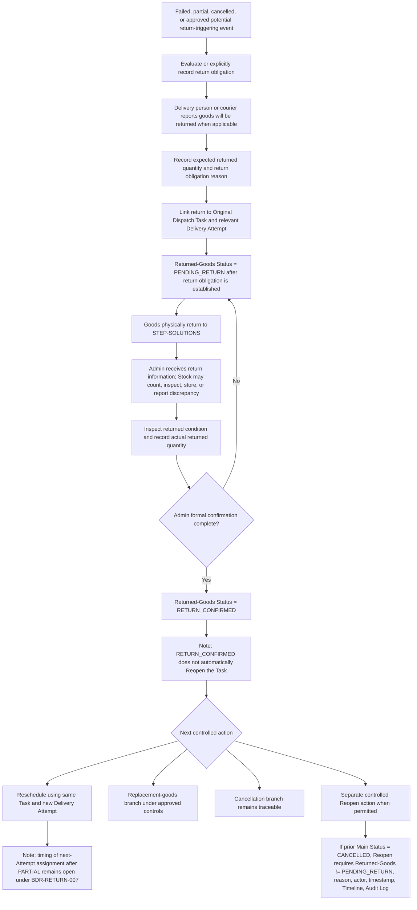

# Workflow กรณีนำสินค้ากลับบริษัท

> [!summary]
> เอกสารฉบับนี้กำหนด Workflow เชิงปฏิบัติการสำหรับกรณีสินค้าถูกนำกลับ STEP-SOLUTIONS หลังส่งไม่สำเร็จ ส่งมอบบางส่วน ยกเลิกงาน หรือเหตุการณ์อื่นที่ได้รับอนุมัติให้เกิดภาระการคืนสินค้า โดยยืนยันหลักการสำคัญว่า Returned-Goods Status เป็นสถานะแยกจาก Main Task Status, Admin เป็นผู้ยืนยันรับคืนสินค้าอย่างเป็นทางการในระบบ, RETURN_CONFIRMED ไม่ Reopen งานโดยอัตโนมัติ, และ Task ที่ CANCELLED + PENDING_RETURN ห้าม Reopen ทั้งสำหรับ Admin และ Super Admin จนกว่า Admin จะยืนยัน RETURN_CONFIRMED ก่อน

## 1. Document summary

เอกสารนี้เป็นเอกสารความรู้ระดับธุรกิจและ Workflow สำหรับ **Returned Goods Workflow** ของระบบ Dispatch ใน Phase 1 เท่านั้น ใช้เมื่อสินค้าหรือสินค้าคงเหลือต้องกลับมายัง STEP-SOLUTIONS หลังเกิดเหตุการณ์ เช่น ส่งไม่สำเร็จ, ส่งมอบบางส่วน, ลูกค้าปฏิเสธรับสินค้า, งานถูกยกเลิกหลังสินค้าออกจากบริษัท, หรือเหตุการณ์อื่นที่เอกสาร Topics 1–8 อนุมัติให้ต้องติดตามการคืนสินค้า

หลักการที่ต้องรักษาไว้ตลอดเอกสารนี้คือ

* สินค้าที่ถูกนำกลับต้องเชื่อมโยงกับ **Dispatch Task เดิม** เสมอ
* การคืนสินค้าต้องเชื่อมโยงกับ **Delivery Attempt ที่เกี่ยวข้อง**
* Returned-Goods Status แยกจาก Main Task Status
* Admin เป็นผู้ยืนยันรับคืนสินค้าอย่างเป็นทางการในระบบ
* Stock ช่วยตรวจนับ ตรวจสภาพ จัดเก็บ หรือรายงาน discrepancy ได้ แต่ไม่ใช่ผู้ยืนยันขั้นสุดท้ายในระบบ
* การยืนยัน RETURN_CONFIRMED ไม่ทำให้ Reopen อัตโนมัติ
* Reopen เป็นการกระทำแยกต่างหาก มีเหตุผล ผู้กระทำการ เวลา Timeline และ Audit Log ของตัวเอง
* ห้ามลบหรือเขียนทับ Task, Delivery Attempt, Returned-Goods history, Timeline หรือ Audit Log แบบเงียบ

## 2. Purpose

วัตถุประสงค์ของเอกสารนี้คือ

* ทำให้กระบวนการนำสินค้ากลับบริษัทมีมาตรฐานเดียวกัน
* ป้องกันไม่ให้การยกเลิกหรือการนัดส่งใหม่กลบภาระคืนสินค้าที่ค้างอยู่
* แยกความรับผิดชอบของผู้ส่งสินค้า, Stock, Admin, Dispatcher และ Super Admin ให้ชัดเจน
* กำหนดข้อมูลธุรกิจที่ต้องเก็บเมื่อเกิดการคืนสินค้า
* เชื่อมโยง Workflow การคืนสินค้ากับกฎ Quantity, Cancellation, Reopen, Timeline และ Audit Log ที่อนุมัติแล้ว
* แยกข้อกำหนดที่อนุมัติแล้วออกจาก Open Business Decisions และ Technical Decisions

## 3. Scope

เอกสารนี้ครอบคลุม

* การรายงานว่าจะนำสินค้ากลับ
* การบันทึกจำนวนที่คาดว่าจะคืนและจำนวนที่คืนจริง
* การเชื่อมโยงการคืนกับ Task เดิมและ Delivery Attempt ที่เกี่ยวข้อง
* การรับคืนสินค้าทางกายภาพที่ STEP-SOLUTIONS
* การตรวจสภาพสินค้าและการบันทึก discrepancy
* การยืนยันรับคืนสินค้าโดย Admin
* การพิจารณาต่อหลัง RETURN_CONFIRMED ได้แก่ นัดส่งใหม่โดยใช้ Task เดิม, เปลี่ยนสินค้า, ยกเลิกงาน หรือ controlled action ที่ได้รับอนุมัติแล้ว
* การสัมพันธ์กับ Reopen โดยเฉพาะกรณี CANCELLED + PENDING_RETURN

เอกสารนี้ไม่ออกแบบ

* database schema, API endpoints, DTOs, UI components หรือ page layouts
* implementation libraries, storage technology, notification technology
* integration กับระบบ Stock, courier APIs, barcode หรือ serial-number implementation
* กฎ Stock accounting หรือการตัด Stock อัตโนมัติ
* SLA, deadline, escalation หรือ notification rule ใหม่

รายละเอียดที่ยังไม่มีคำตอบใน Topics 1–8 ต้องถูกจัดเป็น **Open Business Decision** หรือ **Technical Decision** ไม่ใช่ข้อกำหนดใหม่

## 4. Source-of-truth documents

เอกสารนี้ใช้ Topics 1–8 เป็นแหล่งอ้างอิงเท่านั้น

| Source | ส่วนที่ใช้ |
| --- | --- |
| [[01 - เป้าหมายของระบบ Dispatch]] | Phase 1 scope, เป้าหมายการตรวจสอบย้อนหลัง, ขอบเขตการรองรับกรณีส่งไม่สำเร็จ และการไม่ออกแบบ Stock integration ใน Phase 1 |
| [[02 - Workflow การทำงานของระบบ Dispatch]] | Workflow กรณีส่งมอบบางส่วน, ส่งไม่สำเร็จ, นำสินค้ากลับบริษัท, นัดส่งใหม่, งานผู้ส่งภายนอก และการยกเลิกงาน |
| [[03 - บทบาทและสิทธิ์ผู้ใช้งาน]] | สิทธิ์ Admin, Stock, Dispatcher, Super Admin, พนักงานส่งสินค้าภายใน และผู้ส่งภายนอก |
| [[04 - สถานะของงานและกติกาการเปลี่ยนสถานะ]] | Main Task Status, Returned-Goods Status, Cancellation, Return Confirmation, Reopen และ Transition Matrix |
| [[05 - ข้อมูล หลักฐาน และรายละเอียดที่ต้องจัดเก็บในแต่ละงาน]] | Returned-Goods Record, Quantity Record, Evidence, Timeline, Audit Log และหลักการ Immutable History |
| [[06 - กฎธุรกิจและกฎการตรวจสอบความถูกต้องของระบบ Dispatch]] | BR/VR Catalog, Validation Checklist, Rule Evaluation Outcomes และ Open Decision Boundary |
| [[07 - ขอบเขต MVP และทะเบียนการตัดสินใจทางธุรกิจ]] | Authoritative BDR Register, MVP-12, MVP-13, BDR-RETURN decisions และ open decision status |
| [[08 - ชุดตัดสินใจ P0 ก่อนเริ่ม MVP]] | Historical P0 analysis และ resolution copy ของ BDR-RETURN-003 Option A |

## 5. Terminology

| Term | ความหมายในเอกสารนี้ |
| --- | --- |
| Original Task | Dispatch Task เดิมที่สินค้าออกไปจาก STEP-SOLUTIONS และต้องใช้ต่อสำหรับ reschedule หรือ attempt ถัดไป |
| Delivery Attempt | ความพยายามจัดส่งหนึ่งครั้งภายใต้ Task เดิม ผลลัพธ์ที่อนุมัติคือ SUCCESS, PARTIAL, FAILED, RESCHEDULED |
| Returned-Goods Status | สถานะการคืนสินค้า 3 ค่า: NOT_REQUIRED, PENDING_RETURN, RETURN_CONFIRMED |
| PENDING_RETURN | มีสินค้าหรือสินค้าคงเหลือต้องกลับบริษัท แต่ Admin ยังไม่ได้ยืนยันรับคืน |
| RETURN_CONFIRMED | Admin ยืนยันแล้วว่าสินค้าถูกส่งคืนมายัง STEP-SOLUTIONS |
| Physical Returning Person | บุคคลทางกายภาพที่นำสินค้ากลับ เช่น พนักงานส่งสินค้าภายในหรือผู้ส่งภายนอก |
| Authenticated System Actor | ผู้ใช้งานที่ login และบันทึกข้อมูลในระบบ เช่น Admin |
| Stock Discrepancy Report | รายงานความไม่ตรงกันจาก Stock เช่น จำนวนไม่ตรง สินค้าเสียหาย หรือบรรจุภัณฑ์ถูกเปิด |
| Reopen | การเปิด Task ที่ COMPLETED หรือ CANCELLED กลับเป็น ASSIGNED ผ่าน controlled action แยกต่างหาก |

## 6. Actors and responsibilities

| Actor | ความรับผิดชอบที่อนุมัติแล้ว |
| --- | --- |
| Internal delivery employee | รายงานว่าสินค้าจะถูกนำกลับ, ระบุจำนวนที่จะนำกลับ, นำสินค้ากลับทางกายภาพ, ให้ข้อมูลเหตุผลและหลักฐานที่เกี่ยวข้อง |
| External courier | นำสินค้ากลับทางกายภาพหรือให้ข้อมูล/หลักฐานแก่ Admin ได้ แต่ไม่มี Dispatch system login ใน Phase 1 |
| Stock | ตรวจนับ ตรวจสภาพ จัดเก็บ และรายงาน discrepancy ได้ในเชิงปฏิบัติการ แต่ไม่ใช่ผู้ยืนยันรับคืนขั้นสุดท้ายในระบบ |
| Admin | เป็นผู้รับผิดชอบ formal return confirmation ในระบบ, บันทึกข้อมูลที่ได้รับจากผู้ส่งภายนอก, เปลี่ยน Returned-Goods Status เป็น RETURN_CONFIRMED เมื่อเงื่อนไขผ่าน |
| Dispatcher | ประสานงานนัดส่งใหม่หรือร้องขอการดำเนินการต่อได้ตามสิทธิ์ แต่ไม่มีสิทธิ์ยืนยันรับคืน, Cancel หรือ Reopen เอง |
| Super Admin | กำกับดูแล สืบสวน จัดการข้อยกเว้น และ Reopen ตามสิทธิ์ที่อนุมัติ แต่ข้อจำกัด CANCELLED + PENDING_RETURN บล็อก Super Admin เช่นเดียวกับ Admin |
| Management / Auditor | ดูข้อมูลเพื่อกำกับดูแลตามสิทธิ์ Read-only และตามข้อจำกัดข้อมูลอ่อนไหว |

## 7. Trigger conditions

Returned-Goods Workflow เริ่มเมื่อมีเหตุการณ์ที่อาจทำให้สินค้าหรือสินค้าคงเหลือต้องกลับ STEP-SOLUTIONS หรือเมื่อมีการบันทึกชัดเจนแล้วว่าต้องคืนสินค้า เช่น

* Delivery Attempt เป็น FAILED และต้องนำสินค้ากลับ
* Delivery Attempt เป็น PARTIAL และมีสินค้าคงเหลือกลับบริษัท
* Delivery Attempt เป็น RESCHEDULED แต่สินค้าไม่ได้คงอยู่กับผู้ส่งหรือปลายทาง
* Task ถูก CANCELLED หลังสินค้าออกจาก STEP-SOLUTIONS แล้ว และต้องประเมินหรือบันทึกอย่างชัดเจนว่ามีภาระคืนสินค้าหรือไม่
* ลูกค้าปฏิเสธรับสินค้าทั้งหมดหรือบางส่วน
* พบสินค้าเสียหาย, สูญหายบางส่วน, เอกสารไม่ครบ หรือเหตุการณ์อื่นที่ทำให้ต้องนำสินค้ากลับตาม Workflow ที่อนุมัติแล้ว

Cancellation หลังสินค้าออกจาก STEP-SOLUTIONS เป็น **potential return-triggering event** แต่ Topic 9 ไม่ตัดสินว่าการยกเลิกลักษณะนี้ต้องสร้าง return-tracking record อัตโนมัติทุกครั้งหรือไม่ การทำงานอัตโนมัติดังกล่าวยังเป็น Open Business Decision ภายใต้ BDR-RETURN-001

ไม่ใช่ทุก Cancellation จะต้องมีการคืนสินค้า หากยกเลิกก่อนสินค้าออกจากบริษัท Returned-Goods Status โดยปกติเป็น NOT_REQUIRED ตาม [[04 - สถานะของงานและกติกาการเปลี่ยนสถานะ]]

## 8. Preconditions

ก่อนเริ่มบันทึกการคืนสินค้า ต้องมีข้อมูลหรือบริบทอย่างน้อย

* Original Task ที่ตรวจสอบย้อนกลับได้
* Delivery Attempt ที่เกี่ยวข้อง หรือเหตุการณ์ Cancellation ที่ทำให้เกิดภาระคืนสินค้า
* สถานะปัจจุบันของ Main Task Status
* Returned-Goods Status ปัจจุบัน
* เหตุผลที่ทำให้ต้องคืนสินค้า
* รายการสินค้าและจำนวนที่คาดว่าจะคืน เมื่อทราบ
* ผู้ที่นำสินค้ากลับทางกายภาพ เมื่อทราบ

หากข้อมูลบางรายการยังไม่ครบ ต้องบันทึกเป็นข้อมูลที่ยังขาดหรือหมายเหตุเชิงปฏิบัติการ ห้ามเติมค่าคาดเดาให้เหมือนเป็นข้อเท็จจริง

## 9. Returned-Goods Status model

Returned-Goods Status เป็นมิติสถานะแยกจาก Main Task Status ตาม [[04 - สถานะของงานและกติกาการเปลี่ยนสถานะ]]

| Status | ความหมาย | ผู้เปลี่ยนแปลงที่อนุมัติแล้ว |
| --- | --- | --- |
| NOT_REQUIRED | ยังไม่มีภาระคืนสินค้า ณ ขณะนี้ | เกิดจาก Workflow ที่ไม่มีสินค้าต้องคืน เช่น ยกเลิกก่อนสินค้าออก |
| PENDING_RETURN | มีภาระคืนสินค้า แต่ยังไม่ได้รับการยืนยันโดย Admin | ใช้หลังจากประเมินหรือบันทึกชัดเจนแล้วว่าสินค้าต้องถูกนำกลับ ไม่ใช่ผลอัตโนมัติของ Cancellation ทุกกรณี |
| RETURN_CONFIRMED | Admin ยืนยันรับคืนสินค้าในระบบแล้ว | Admin เป็น formal confirmation actor |

ข้อกำหนดสำคัญ

* Main Task Status อาจยังเป็น CANCELLED ขณะที่ Returned-Goods Status เปลี่ยนจาก PENDING_RETURN เป็น RETURN_CONFIRMED
* RETURN_CONFIRMED ไม่ทำให้ Main Task Status เปลี่ยนอัตโนมัติ
* RETURN_CONFIRMED ไม่ Reopen Task อัตโนมัติ
* Reopen ต้องเป็น controlled action แยกต่างหาก
* Task ที่ Main Status = CANCELLED และ Returned-Goods Status = PENDING_RETURN ห้าม Reopen โดย Admin หรือ Super Admin จนกว่า Admin จะยืนยัน RETURN_CONFIRMED ก่อน
* Topic 9 ไม่ตัดสินว่าการยกเลิกหลังสินค้าออกจาก STEP-SOLUTIONS ต้องสร้าง return-tracking record อัตโนมัติหรือไม่ ประเด็นนี้ยังเปิดอยู่ภายใต้ BDR-RETURN-001

## 10. End-to-end workflow

แผนภาพนี้แสดงเส้นทางมาตรฐานเมื่อมีการยืนยันคืนสินค้าแล้ว แต่ไม่ได้ตัดสินว่า next-Attempt assignment หลัง PARTIAL delivery ต้องรอ RETURN_CONFIRMED ทุกครั้งหรือไม่ ประเด็น timing นี้ยังคงเป็น Open Business Decision ภายใต้ BDR-RETURN-007

## 11. Detailed step-by-step workflow

1. ผู้ส่งสินค้าหรือผู้ส่งภายนอกรายงานว่าจะนำสินค้ากลับ
2. บันทึกเหตุผลที่ต้องคืนสินค้าและจำนวนที่คาดว่าจะคืน
3. เชื่อมโยงการคืนกับ Original Task เดิม
4. เชื่อมโยงการคืนกับ Delivery Attempt ที่เกี่ยวข้อง
5. ตั้งหรือคง Returned-Goods Status เป็น PENDING_RETURN เมื่อประเมินหรือบันทึกชัดเจนแล้วว่ามีภาระคืนสินค้า
6. สินค้าถูกนำกลับมายัง STEP-SOLUTIONS ทางกายภาพ
7. Admin รับข้อมูลการคืนสินค้าในฐานะผู้รับผิดชอบ formal confirmation
8. Stock อาจตรวจนับ ตรวจสภาพ จัดเก็บ หรือรายงาน discrepancy
9. ตรวจสภาพสินค้า เช่น เสียหาย ขาดหาย บรรจุภัณฑ์ถูกเปิด หรือมีข้อสังเกตอื่น
10. บันทึกจำนวนคืนจริง, จำนวนเสียหาย, จำนวนขาดหาย หรือเงื่อนไขอื่นเมื่อเกี่ยวข้อง
11. เพิ่มรูปถ่ายหรือหลักฐานสนับสนุนเมื่อ rule ที่มีอยู่กำหนดหรือเมื่อเกี่ยวข้องกับ discrepancy
12. Admin บันทึก formal return confirmation
13. Returned-Goods Status เปลี่ยนเป็น RETURN_CONFIRMED โดย Main Task Status ไม่เปลี่ยนอัตโนมัติ
14. Admin พิจารณาการดำเนินการต่อ: reschedule ด้วย Task เดิม, replacement goods, cancellation หรือ controlled action ที่ได้รับอนุมัติแล้ว โดยไม่เปลี่ยน Open Business Decision เรื่อง timing ของ next-Attempt assignment หลัง PARTIAL delivery ตาม BDR-RETURN-007

## 12. Internal delivery return flow

สำหรับพนักงานส่งสินค้าภายใน

* พนักงานรายงานเหตุการณ์ที่ทำให้ต้องนำสินค้ากลับ
* พนักงานระบุจำนวนที่นำกลับหรือคาดว่าจะนำกลับ
* พนักงานส่งข้อมูลเหตุผลของ FAILED, PARTIAL หรือ RESCHEDULED Attempt
* พนักงานนำสินค้ากลับ STEP-SOLUTIONS ทางกายภาพ
* Admin เป็นผู้บันทึกหรือยืนยัน Returned-Goods Status ในระบบตามสิทธิ์
* Stock อาจช่วยตรวจนับและรายงาน discrepancy

พนักงานส่งสินค้าภายในไม่สามารถ

* ยืนยัน RETURN_CONFIRMED ขั้นสุดท้ายแทน Admin
* ลบ Delivery Attempt เดิม
* ปิดงานเป็น SUCCESS หากยังส่งมอบบางส่วน
* สร้าง Task ใหม่สำหรับสินค้าคงเหลือแทนการใช้ Task เดิม

## 13. External courier return flow

สำหรับผู้ส่งสินค้าภายนอก

* ผู้ส่งภายนอกไม่มี Dispatch system login ใน Phase 1
* ผู้ส่งภายนอกอาจนำสินค้ากลับทางกายภาพ
* ผู้ส่งภายนอกอาจให้ข้อมูล เช่น ชื่อผู้ส่งจริง, เวลาคืน, จำนวนคืน, สภาพสินค้า, รูปภาพ หรือหมายเหตุ
* Admin เป็น Authenticated System Actor ที่บันทึกข้อมูลในระบบ
* ต้องแยก **Physical Courier Identity** ออกจาก **Admin System Actor** เสมอ
* ห้ามให้สิทธิ์ Direct System Permission แก่ผู้ส่งภายนอก

หากหลักฐานหรือข้อมูลจากผู้ส่งภายนอกไม่ครบ Admin อาจบันทึกเฉพาะข้อมูลที่ได้รับจริงพร้อมข้อจำกัดของข้อมูลนั้น โดยต้องแยก Physical Courier Identity ออกจาก Admin System Actor เสมอ การบันทึกข้อมูลบางส่วนไม่ทำให้ formal confirmation requirements ผ่านโดยอัตโนมัติ หลังอนุมัติ BDR-RETURN-002 Option C แล้ว Admin ต้องใช้ Core Return Record และ Risk Trigger evidence ตามที่อนุมัติ ส่วนคำถามว่ารูปภาพสินค้าคืนเป็นข้อบังคับทุกกรณีหรือเฉพาะ exception cases ยังเปิดอยู่ภายใต้ BDR-RETURN-009

หลังอนุมัติ BDR-RETURN-002 Option C เมื่อ 2026-07-21 ข้อมูลจาก external courier ที่ไม่ครบเป็น **Risk Trigger** Admin ต้องบันทึกข้อมูลที่ได้รับจริงและข้อจำกัดของข้อมูลนั้น แต่การยืนยัน RETURN_CONFIRMED ต้องมี Core Return Record ครบ และต้องมี additional evidence เท่าที่จำเป็นตาม Data Minimization การบันทึก partial information ไม่ทำให้ formal confirmation requirements ผ่านโดยอัตโนมัติ และ Topic 9 ยังไม่ทำให้รูปถ่ายสินค้าคืน mandatory ทุกกรณีเพราะ BDR-RETURN-009 ยังเปิดอยู่

## 14. Returned-goods data requirements

Returned-Goods Record ในระดับเอกสารธุรกิจควรรองรับข้อมูลต่อไปนี้

| Data item | Requirement level |
| --- | --- |
| Original Task | REQUIRED |
| Relevant Delivery Attempt | REQUIRED เมื่อการคืนเกิดจาก Attempt |
| Return obligation reason | REQUIRED |
| Returned-Goods Status before and after | REQUIRED |
| Item identity | REQUIRED ตามรายการสินค้าที่เกี่ยวข้อง |
| Quantity expected to return | REQUIRED เมื่อทราบ |
| Quantity actually returned | REQUIRED เมื่อ Admin ยืนยัน |
| Returned condition | REQUIRED เมื่อ Admin ยืนยัน |
| Damaged quantity | CONDITIONAL เมื่อพบความเสียหาย |
| Missing quantity | CONDITIONAL เมื่อจำนวนไม่ครบ |
| Opened-package condition | CONDITIONAL เมื่อบรรจุภัณฑ์ถูกเปิด |
| Physical person returning goods | REQUIRED เมื่อทราบ |
| Person receiving goods when recorded | CONDITIONAL |
| Stock discrepancy report | CONDITIONAL |
| Confirming Admin actor | REQUIRED สำหรับ RETURN_CONFIRMED |
| Return date and time | REQUIRED เมื่อทราบ |
| Admin confirmation date and time | REQUIRED สำหรับ RETURN_CONFIRMED |
| Return evidence | CONDITIONAL ตาม rule ที่มีอยู่หรือเมื่อเกี่ยวข้อง |
| Return remarks | CONDITIONAL |
| Timeline event | REQUIRED |
| Audit Log event | REQUIRED |

รายการที่เป็น **Core Return Record** ตาม BDR-RETURN-002 Option C และต้องครบก่อน Admin ยืนยัน RETURN_CONFIRMED ได้แก่ Original Task, Relevant Delivery Attempt, Quantity expected to return, Quantity actually returned, Returned condition, Damaged/Missing quantity เมื่อมี, Confirming Admin actor, Admin confirmation date and time, Timeline event และ Audit Log event

## 15. Quantity and discrepancy handling

กฎจำนวนที่ต้องรักษา

* Returned quantity ต้องแยกจาก successfully delivered quantity เสมอ
* จำนวนที่ส่งมอบ, จำนวนที่ยังไม่ส่งมอบ, จำนวนคงเหลือ และจำนวนที่คืนต้องตรวจสอบย้อนกลับได้
* Damaged quantity และ missing quantity ต้องไม่ถูกซ่อน
* Quantity mismatch ต้องคง visible และ traceable
* Attempt ครั้งหลังต้องไม่เขียนทับจำนวนของ Attempt ก่อนหน้า
* Partial delivery ต้องไม่ถูกปิดเป็น successful final closure
* ห้ามสร้าง Task ใหม่สำหรับสินค้าคงเหลือหรือ replacement goods เว้นแต่ future approved decision จะเปลี่ยนกฎนี้

เมื่อจำนวนคืนจริงไม่ตรงกับจำนวนที่คาดว่าจะคืน ให้บันทึก discrepancy แยกจาก Admin confirmation และอ้างอิง BDR-RETURN-004 / BDR-RETURN-005 เป็น Open Business Decisions สำหรับนโยบายรายละเอียดที่ยังไม่อนุมัติ

## 16. Inspection and condition recording

การตรวจสภาพสินค้าคืนควรบันทึกเฉพาะข้อเท็จจริงเชิงปฏิบัติการที่พบ ได้แก่

* สภาพสินค้าปกติหรือผิดปกติ
* จำนวนที่คืนจริง
* จำนวนที่เสียหาย เมื่อเกี่ยวข้อง
* จำนวนที่ขาดหาย เมื่อเกี่ยวข้อง
* บรรจุภัณฑ์ถูกเปิดหรือไม่ เมื่อเกี่ยวข้อง
* หมายเหตุจากผู้ส่งสินค้าหรือผู้ส่งภายนอก
* รายงานจาก Stock เมื่อมี discrepancy
* ข้อจำกัดของข้อมูล เช่น ไม่ทราบเวลาคืนจริงหรือไม่ทราบผู้ส่งคืนทางกายภาพ

เอกสารนี้ไม่ตัดสินนโยบายสุดท้ายว่ากรณี missing, damaged หรือ partially returned goods ต้องดำเนินการทางบัญชีหรือการชดเชยอย่างไร เพราะยังเป็น Open Business Decision ใน Topic 7

## 17. Evidence handling

หลักฐานการคืนสินค้าใช้หลักการต่อไปนี้

* Core Return Record เป็นข้อบังคับทุกเคสก่อน Admin ยืนยัน RETURN_CONFIRMED
* เพิ่ม additional evidence เมื่อมี Risk Trigger ได้แก่ expected/actual quantity mismatch, damage, opened packaging, incomplete external-courier information, dispute หรือ Formal Investigation
* เพิ่มรูปถ่ายเมื่อ required by existing rule หรือเมื่อเกี่ยวข้องกับ Risk Trigger แต่ approval นี้ไม่ทำให้รูปถ่าย mandatory ทุกกรณี
* ห้ามประกาศว่ามีหลักฐานบังคับครบ หากหลักฐานนั้นยังไม่มี
* หลักฐานต้องเชื่อมโยงกับ Task และ Delivery Attempt ที่เกี่ยวข้อง
* หลักฐานต้องแยก Physical Performer และ Authenticated System Actor เมื่อเป็นงานผู้ส่งภายนอก
* หลักฐานเดิมต้องไม่ถูกลบหรือแทนที่แบบเงียบ
* BDR-RETURN-002 ได้รับอนุมัติแล้วเป็น Option C; BDR-RETURN-009 ยังเป็น Open Business Decision สำหรับคำถามว่ารูปภาพสินค้าคืนบังคับทุกกรณีหรือเฉพาะ exception cases
* เมื่อหลักฐานเกี่ยวข้องกับ Formal Investigation ต้องใช้ Case Reference, scope limitation, Data Minimization และ Audit Log ตาม BDR-PRIVACY-001 Option B

Technical Decision ที่ยังไม่กำหนด ได้แก่ วิธีจัดเก็บไฟล์, file identifier, media processing, storage path, signed URL, checksum หรือ upload implementation

## 18. Admin confirmation

Admin confirmation คือการกระทำที่ทำให้ Returned-Goods Status เปลี่ยนเป็น RETURN_CONFIRMED

ก่อนยืนยัน Admin ต้องมีอย่างน้อย

* Core Return Record ครบถ้วน: source Task, source Delivery Attempt, expected returned quantity, actual returned quantity, returned-item condition, shortage/damage details เมื่อมี, confirming Admin, confirmation timestamp, Timeline และ Audit Log
* Risk Trigger check แล้ว
* Additional evidence เมื่อมี Risk Trigger
* ผู้ที่นำสินค้ากลับ เมื่อทราบ
* รายงาน Stock discrepancy เมื่อมี

> [!note]
> BDR-RETURN-002 Option C อนุมัติ Core Return Record และ Risk Trigger evidence แล้ว แต่ไม่ได้ตัดสิน BDR-RETURN-007 หรือ BDR-RETURN-009 และไม่ได้ทำให้รูปถ่ายสินค้าคืน mandatory ทุกกรณี

เมื่อ Admin ยืนยัน

* Returned-Goods Status เปลี่ยนจาก PENDING_RETURN เป็น RETURN_CONFIRMED
* Main Task Status ไม่เปลี่ยนอัตโนมัติ
* Task ที่ CANCELLED ยังคง CANCELLED ได้
* ต้องสร้าง Timeline event
* ต้องสร้าง Audit Log event
* ต้องรักษาประวัติ PENDING_RETURN เดิม

## 19. Reschedule using the same Task

หาก Admin เลือกนัดส่งใหม่หรือมอบหมาย Delivery Attempt ถัดไป

* ต้องใช้ Original Task เดิมเสมอ
* ต้องสร้างหรือดำเนินการ Delivery Attempt ถัดไปภายใต้ Task เดิม
* ต้องรักษา Attempt เดิมและ return history ไว้ครบถ้วน
* ต้องรักษาจำนวนที่ส่งมอบแล้ว, จำนวนคงเหลือ, จำนวนคืน และ discrepancy ไว้แยกกัน
* ห้ามสร้าง Task ใหม่เพื่อแทนสินค้าคงเหลือ

Open Business Decision ที่ยังคงอยู่: BDR-RETURN-007 ถามว่าการยืนยันรับคืนสินค้าต้องเสร็จก่อนมอบหมาย Delivery Attempt ถัดไปในกรณีส่งมอบบางส่วนหรือไม่ Topic 9 จึงไม่กำหนดว่า reschedule หรือ next-Attempt assignment ทุกกรณีต้องรอ RETURN_CONFIRMED แต่ยังคงยืนยันว่า rescheduling ต้องใช้ Original Task เดิมและ Attempt เดิมต้อง immutable

## 20. Replacement-goods branch

Replacement-goods branch อาจเกิดขึ้นเมื่อสินค้าคืนเสียหาย ขาดหาย หรือไม่เหมาะสำหรับจัดส่งต่อ แต่เอกสารนี้ไม่กำหนดนโยบาย replacement ใหม่

ข้อกำหนดที่อนุมัติแล้วในปัจจุบัน

* ต้องรักษา Task เดิมและ Attempt เดิมไว้
* ต้องบันทึก damaged quantity หรือ missing quantity เมื่อพบ
* ต้องไม่ซ่อน discrepancy เพื่อให้การส่งครั้งถัดไปดูเหมือนเป็นรอบแรก
* การเปลี่ยนสินค้าต้องเป็น controlled action ที่ไม่ลบประวัติเดิม

รายละเอียดวิธีอนุมัติ replacement, เอกสารที่ต้องใช้, การเชื่อมโยงกับ Stock accounting หรือ serial/lot/barcode เป็น Open Business Decision หรือ Technical Decision ตามรายการใน Topic 7

## 21. Cancellation branch

Cancellation ที่เกี่ยวข้องกับการคืนสินค้าแบ่งตามหลักการใน Topic 4

| Scenario | Main Task Status | Returned-Goods Status |
| --- | --- | --- |
| ยกเลิกก่อนสินค้าออกจากบริษัท | CANCELLED | NOT_REQUIRED โดยปกติ |
| ยกเลิกหลังสินค้าออกจากบริษัท | CANCELLED | ต้องประเมินหรือบันทึก return obligation อย่างชัดเจน; PENDING_RETURN ใช้เมื่อ established แล้วว่าสินค้าต้องคืน |
| Admin ยืนยันรับคืนหลัง Cancellation ที่มี PENDING_RETURN | CANCELLED คงเดิม | RETURN_CONFIRMED |

ข้อกำหนด

* Admin หรือ Super Admin เท่านั้นมีสิทธิ์ Cancel
* Dispatcher ทำได้เพียงร้องขอ
* เหตุผล Cancellation เป็นข้อบังคับ
* Cancellation ไม่ยืนยันรับคืนสินค้าโดยอัตโนมัติ
* Cancellation ไม่ลบภาระคืนสินค้าที่เกิดขึ้นแล้ว
* การยกเลิกงานหลังสินค้าออกจากบริษัทไม่ต้องขออนุมัติสองชั้นตามกฎที่อนุมัติแล้ว

Cancellation after goods have left STEP-SOLUTIONS เป็น potential return-triggering event และ return obligation ต้องถูกประเมินหรือบันทึกอย่างชัดเจน แต่ Topic 9 ไม่ตัดสินว่าการยกเลิกลักษณะนี้สร้าง mandatory return-tracking record อัตโนมัติหรือไม่ ประเด็น automatic behavior นี้ยังเปิดอยู่ภายใต้ BDR-RETURN-001

## 22. Interaction with Reopen

Reopen ต้องเป็น action แยกต่างหากจาก return confirmation

กฎที่อนุมัติแล้ว

* Admin และ Super Admin เท่านั้นมีสิทธิ์ Reopen
* Dispatcher ไม่มีสิทธิ์ Reopen เอง
* Reopen จาก COMPLETED หรือ CANCELLED กลับไป ASSIGNED
* Reopen ต้องมีเหตุผล ผู้กระทำการ วันเวลา Timeline event และ Audit Log event
* Reopen ต้องรักษา Task history, Delivery Attempt history, returned-goods history, cancellation history และหลักฐานเดิมไว้ครบถ้วน
* RETURN_CONFIRMED ไม่ Reopen อัตโนมัติ
* Task ที่ CANCELLED + PENDING_RETURN ห้าม Reopen ทั้ง Admin และ Super Admin
* ต้องเกิด RETURN_CONFIRMED ก่อน จึงจะพิจารณา Reopen จาก CANCELLED ได้

BDR-RETURN-003 Option A เป็นข้อกำหนดที่อนุมัติแล้วเมื่อ 2026-07-20 และไม่มีข้อยกเว้นสำหรับ Super Admin

## 23. Permission matrix

| Action / Capability | Internal delivery employee | External courier | Stock | Dispatcher | Admin | Super Admin | Management / Auditor |
| --- | --- | --- | --- | --- | --- | --- | --- |
| Report that goods will be returned | Allowed only within assigned Task scope | Physical information only | May report when observed | May coordinate | Allowed | Allowed for governance/investigation | Read-only |
| Physically return goods | Allowed | Allowed | Not primary delivery actor | Not primary | May receive/coordinate | May oversee | No |
| Provide return information/evidence | Allowed only within assigned Task scope | Allowed outside system only | May provide discrepancy report | May add permitted operational notes | Allowed | Allowed for governance/investigation | Read-only |
| Inspect/count/store returned goods | May assist physically | No system role | Allowed operationally | Coordinate only | Allowed operationally and for confirmation review | May oversee/govern/investigate | Read-only |
| Report discrepancy | Allowed | Provide info to Admin | Allowed | Coordinate/escalate | Allowed | Allowed | Read-only |
| Formal RETURN_CONFIRMED confirmation | Not allowed | No system access | Not allowed | Not allowed | Allowed | Not normal confirmation actor under current rule | Read-only |
| Reopen after RETURN_CONFIRMED when permitted | Not allowed | No system access | Not allowed | Request only | Allowed | Allowed | Read-only |
| Reopen while CANCELLED + PENDING_RETURN | Not allowed | No system access | Not allowed | Not allowed | Blocked | Blocked | Read-only |
| Cancel Task | Not allowed | No system access | Not allowed | Request only | Allowed | Allowed | Read-only |
| Delete Task, Attempt, Timeline, returned-goods history, or Audit Log | Not allowed | No system access | Not allowed | Not allowed | Not allowed | Not allowed | Not allowed |

Admin is the only normal formal actor that changes Returned-Goods Status to RETURN_CONFIRMED. Super Admin may govern, investigate, and perform a separately permitted Reopen, but is not the normal RETURN_CONFIRMED actor and cannot bypass the CANCELLED + PENDING_RETURN Reopen block.

## 24. Validation matrix

| Validation point | Responsible actor | Required state or data | Result when valid | Result when invalid | Related existing BR/VR IDs | Status |
| --- | --- | --- | --- | --- | --- | --- |
| Return is linked to Original Task | System / Admin | Task identifier remains stable | Return record can be traced | Block or require correction before confirmation | BR-TASK-001, BR-DATA-001 | Approved |
| Return is linked to relevant Delivery Attempt | Admin / System | Attempt association when return comes from Attempt | Attempt history remains traceable | Block confirmation until linked or record missing context | BR-ATTEMPT-004, BR-DATA-004 | Approved |
| Failed/partial/rescheduled attempt does not create new Task | Dispatcher/Admin | Same Task used, new Attempt when needed | Continue under same Task | Reject new Task as replacement for remaining goods | BR-TASK-010, BR-ATTEMPT-006, VR-TASK-003a | Approved |
| PARTIAL records delivered and remaining quantities separately | Internal delivery employee / Admin for external | Delivered quantity and remaining quantity present | Enter WAITING_NEXT_ATTEMPT | Reject incomplete PARTIAL result | BR-QTY-005, VR-QTY-003a | Approved |
| FAILED does not claim full delivery | Internal delivery employee / Admin for external | Failed reason and actual quantity state | Enter WAITING_NEXT_ATTEMPT | Reject false success/full delivery | BR-QTY-006 | Approved |
| Returned quantity separate from delivered quantity | Admin | Returned quantity captured separately | Return confirmation can proceed | Keep PENDING_RETURN or require correction | BR-QTY-010 | Approved |
| Damaged/missing quantity not hidden | Admin / Stock report | Damaged or missing quantity recorded when applicable | Discrepancy remains visible | Block or require discrepancy record | BR-QTY-011, BR-RETURN-006 | Approved for visibility; detailed policy open |
| Stock assists but does not confirm | Stock/Admin | Stock report separated from Admin confirmation | Admin may confirm with traceable support | Reject Stock-only final confirmation | BR-RETURN-003, BR-RETURN-004 | Approved |
| Admin confirms RETURN_CONFIRMED | Admin | PENDING_RETURN, actual return data, condition | Returned-Goods = RETURN_CONFIRMED | Status remains PENDING_RETURN | BR-RETURN-003, BR-RETURN-005 | Approved |
| RETURN_CONFIRMED does not alter Main Task Status | Admin / System | Main Task Status before confirmation retained | Only Returned-Goods Status changes | Reject automatic Reopen/status mutation | BR-RETURN-005, BR-AUDIT-004 | Approved |
| Reopen from CANCELLED requires Returned-Goods not PENDING_RETURN | Admin/Super Admin | Returned-Goods = NOT_REQUIRED or RETURN_CONFIRMED | Reopen may proceed to ASSIGNED with reason | Block Reopen for both Admin and Super Admin | BR-REOPEN-005, BR-REOPEN-011 | Approved by BDR-RETURN-003 |
| Reopen has reason and history | Admin/Super Admin | Reason, actor, timestamp, previous status, new status | Reopen event appended | Block Reopen or mark invalid | BR-REOPEN-002, BR-REOPEN-003, BR-REOPEN-004 | Approved |
| External courier has no direct system access | Admin/System | Admin records on behalf of courier | Physical courier and Admin actor distinguished | Deny direct courier system action | BR-EXTERNAL-001, BR-EXTERNAL-002, BR-EXTERNAL-004, VR-EXTERNAL-002a | Approved |
| History is append-only | System / all roles | No deletion or silent overwrite | Timeline/Audit remain complete | Reject deletion or silent mutation | BR-DATA-007, BR-AUDIT-001, BR-AUDIT-003, BR-AUDIT-004, VR-AUDIT-001a, VR-AUDIT-002a | Approved |
| Core Return Record and Risk Trigger evidence | Admin | Core Return Record complete; additional evidence present when Risk Trigger exists | Admin may confirm RETURN_CONFIRMED | Keep PENDING_RETURN or require missing data/evidence before confirmation | BR-RETURN-006, VR-RETURN-001a, VR-RETURN-002a, BDR-RETURN-002, BDR-RETURN-009 | Approved for BDR-RETURN-002 Option C; BDR-RETURN-009 remains Open |

## 25. Timeline and Audit Log requirements

ต้องสร้าง Timeline และ Audit Log สำหรับเหตุการณ์สำคัญต่อไปนี้

* Delivery Attempt result เป็น PARTIAL, FAILED หรือ RESCHEDULED
* รายงานว่าจะนำสินค้ากลับ
* การบันทึกจำนวนที่คาดว่าจะคืน
* การเปลี่ยน Returned-Goods Status เป็น PENDING_RETURN
* สินค้าถูกนำกลับ STEP-SOLUTIONS
* Stock รายงาน discrepancy เมื่อมี
* Admin ยืนยัน RETURN_CONFIRMED
* Cancellation ที่เกี่ยวข้องกับภาระคืนสินค้า
* Reopen ที่เกิดหลัง RETURN_CONFIRMED
* การมอบหมายใหม่หรือ Attempt ใหม่หลัง Reopen หรือ reschedule

แต่ละเหตุการณ์ควรรักษาอย่างน้อย

* actor และ role
* physical performer เมื่อต่างจาก system actor
* วันเวลา
* Main Task Status ก่อนและหลัง เมื่อเกี่ยวข้อง
* Returned-Goods Status ก่อนและหลัง เมื่อเกี่ยวข้อง
* reason เมื่อจำเป็น
* quantity summary
* evidence reference เมื่อมี
* related Task และ Delivery Attempt

## 26. Exception scenarios

| Scenario | Handling |
| --- | --- |
| สินค้ากลับมาแต่จำนวนไม่ตรง | บันทึก expected vs actual, damaged/missing quantity, Stock report เมื่อมี; Admin ยังเป็นผู้ยืนยันตามข้อมูลจริง; detailed policy ยังเปิด |
| สินค้าเสียหาย | บันทึก condition, damaged quantity, evidence เมื่อเกี่ยวข้อง; replacement policy ยังเปิดหาก Topics 1–8 ยังไม่อนุมัติ |
| บรรจุภัณฑ์ถูกเปิด | บันทึก opened-package condition และ evidence เมื่อเกี่ยวข้อง |
| ผู้ส่งภายนอกคืนสินค้าแต่ข้อมูลไม่ครบ | Admin บันทึกข้อมูลที่ได้รับจริงพร้อมข้อจำกัด แยก courier identity จาก Admin actor; incomplete external-courier information เป็น Risk Trigger ภายใต้ BDR-RETURN-002 Option C จึงต้องมี additional evidence เท่าที่จำเป็นและ Core Return Record ต้องครบก่อน RETURN_CONFIRMED; Topic 9 ไม่ลดหรือสร้าง requirement ใหม่เพื่อให้ confirmation ผ่าน |
| Task CANCELLED + PENDING_RETURN ขอ Reopen | Block ทั้ง Admin และ Super Admin จนกว่า Admin ยืนยัน RETURN_CONFIRMED |
| Admin ยืนยัน RETURN_CONFIRMED แล้วต้องส่งใหม่ | ทำ Reopen หรือ Attempt ถัดไปเป็น controlled action แยกต่างหากตามเงื่อนไขที่อนุมัติ; RETURN_CONFIRMED ไม่ Reopen อัตโนมัติ |
| ต้องนัดส่งใหม่หลัง PARTIAL | ใช้ Task เดิมและรักษา Attempt เดิมเสมอ; ห้ามสรุปว่า next-Attempt assignment ต้องรอ RETURN_CONFIRMED ทุกครั้ง เพราะ BDR-RETURN-007 ยังเปิดอยู่ |
| มีคำขอลบ Attempt หรือ Audit Log เพื่อแก้ข้อมูล | ปฏิเสธ ห้ามลบประวัติ; ใช้ Correction, Reopen หรือ governance mechanism ที่อนุมัติแล้วเท่านั้น |

## 27. Open Business Decisions

เอกสารนี้บันทึกผลอนุมัติ BDR-RETURN-002 และยังไม่แก้ไขหรือปิด Open Business Decisions อื่นต่อไปนี้

* **BDR-RETURN-002** — APPROVED 2026-07-21 Option C: Core Return Record plus Risk Trigger evidence ก่อน Admin ยืนยัน RETURN_CONFIRMED
* **BDR-RETURN-001** — การยกเลิกงานหลังสินค้าออกจากบริษัทควรสร้างรายการติดตามการคืนสินค้าภาคบังคับโดยอัตโนมัติหรือไม่
* **BDR-RETURN-004** — การยืนยันคืนสินค้าต้องตรงกับจำนวนที่คาดไว้เป๊ะหรือไม่
* **BDR-RETURN-005** — วิธีจัดการสินค้าคืนที่ขาดหายหรือเสียหาย
* **BDR-RETURN-006** — จำเป็นต้องมีการทบทวนของ Super Admin สำหรับข้อพิพาทการคืนสินค้าที่ยังไม่คลี่คลายหรือไม่
* **BDR-RETURN-007** — การยืนยันรับคืนสินค้าจำเป็นต้องเสร็จสิ้นก่อนมอบหมาย Delivery Attempt ถัดไปในกรณีส่งมอบบางส่วนหรือไม่
* **BDR-RETURN-008** — การติดตามเอกสารที่ลูกค้าส่งคืนควรเป็นข้อบังคับสำหรับประเภทงานบางประเภทหรือไม่
* **BDR-RETURN-009** — รูปภาพสินค้าที่ถูกส่งคืนเป็นข้อบังคับทุกกรณีหรือเฉพาะกรณีเสียหาย/บรรจุภัณฑ์ถูกเปิด
* เอกสาร ใบเสร็จ ใบกำกับภาษี หรือ customer-returned documents ใดเป็น mandatory ยังต้องอ้างอิง BDR-EVIDENCE-011 / BDR-RETURN-008 ตามขอบเขตที่เกี่ยวข้อง
* deadline, notification, SLA หรือ escalation rule เพิ่มเติมยังไม่อนุมัติ เว้นแต่มีอยู่แล้วใน Topics 1–8
* whether Stock acknowledgment is additionally mandatory beyond Admin confirmation ยังเปิดอยู่ตาม Topic 5 และ Topic 7

## 28. Acceptance checklist

เอกสารหรือ Implementation Specification ที่อ้างอิง Topic 9 ต้องผ่าน Checklist นี้

* ใช้ Task เดิมเสมอสำหรับ reschedule หรือ Attempt ถัดไป
* เชื่อมโยง Returned-Goods Record กับ Task และ Attempt ที่เกี่ยวข้อง
* Returned-Goods Status แยกจาก Main Task Status
* ใช้เฉพาะ NOT_REQUIRED, PENDING_RETURN, RETURN_CONFIRMED
* Admin เป็น formal RETURN_CONFIRMED actor
* Stock ไม่เป็น final confirmation actor
* External courier ไม่มี direct system access
* RETURN_CONFIRMED ไม่ Reopen อัตโนมัติ
* CANCELLED + PENDING_RETURN บล็อก Reopen ทั้ง Admin และ Super Admin
* Reopen มี reason, actor, timestamp, Timeline, Audit Log
* Delivered quantity และ returned quantity แยกกัน
* Damaged/missing/opened-package discrepancies ไม่ถูกซ่อน
* No Task, Delivery Attempt, returned-goods history, Timeline หรือ Audit Log ถูกลบหรือเขียนทับแบบเงียบ
* Open Business Decisions ไม่ถูกแปลงเป็น requirement
* Technical Decisions ไม่ถูกเดาเป็น implementation detail

## 29. Related documents

* [[01 - เป้าหมายของระบบ Dispatch]]
* [[02 - Workflow การทำงานของระบบ Dispatch]]
* [[03 - บทบาทและสิทธิ์ผู้ใช้งาน]]
* [[04 - สถานะของงานและกติกาการเปลี่ยนสถานะ]]
* [[05 - ข้อมูล หลักฐาน และรายละเอียดที่ต้องจัดเก็บในแต่ละงาน]]
* [[06 - กฎธุรกิจและกฎการตรวจสอบความถูกต้องของระบบ Dispatch]]
* [[07 - ขอบเขต MVP และทะเบียนการตัดสินใจทางธุรกิจ]]
* [[08 - ชุดตัดสินใจ P0 ก่อนเริ่ม MVP]]
