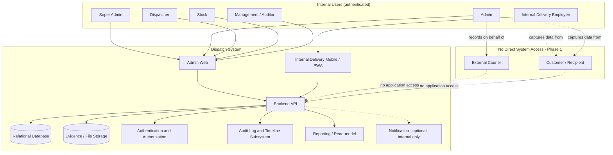
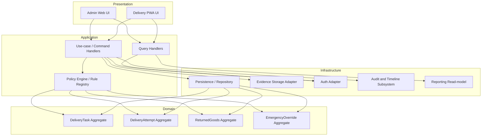
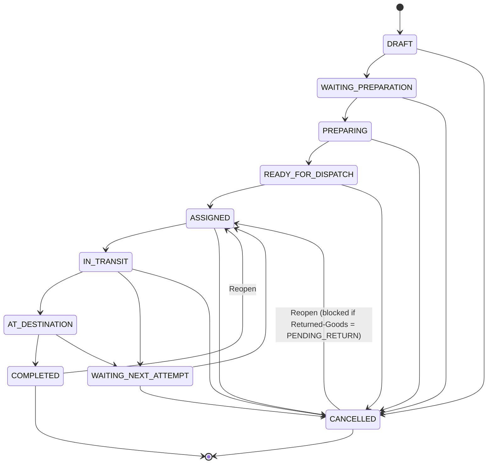

# Technical Architecture และแผนพัฒนา MVP

> [!summary]
> เอกสารฉบับนี้คือ **TECH-ARCH-001** ซึ่งแปลความรู้ทางธุรกิจที่ได้รับการอนุมัติแล้วใน Topics 01–10 ให้เป็นสถาปัตยกรรมทางเทคนิคที่พร้อมนำไปพัฒนาต่อ โดยไม่เปลี่ยนแปลง ขยาย หรือตัดสินใจนโยบายธุรกิจใด ๆ แทน Product Owner / User เอกสารนี้ **ไม่สร้างโค้ดแอปพลิเคชัน ไม่สร้าง Database Migration ไม่ติดตั้ง Dependency และไม่สร้าง Docker Container หรือ Deployment Configuration** สถานะเอกสาร: `DRAFT_FOR_REVIEW` — ทุกคำแนะนำด้านเทคโนโลยีในเอกสารนี้ยังไม่ถือเป็นการอนุมัติ จนกว่า Product Owner / User จะอนุมัติ Technical Decision Register ในหมวด 23

## 0. Document Control

| Field | Value |
| --- | --- |
| Document title | Technical Architecture และแผนพัฒนา MVP |
| Task ID | TECH-ARCH-001 |
| Status | `DRAFT_FOR_REVIEW` |
| Created date | 2026-07-21 |
| Updated date | 2026-07-21 |
| Business baseline commit | `5fc6550` — "docs(dispatch): synchronize approved p1 decisions" |
| Business baseline tag | `v0.9.0-dispatch-p1-decision-synchronization` |

**Scope statement**: เอกสารนี้กำหนดสถาปัตยกรรมทางเทคนิคระดับ logical/component สำหรับ Dispatch MVP ครอบคลุม System Context, Application Architecture, Technology Stack Evaluation (ยังไม่อนุมัติ), Repository Structure ที่เสนอ, Domain/Module Map, Aggregate Boundaries, Status Architecture, Authorization Architecture, Validation Architecture, Evidence Architecture, Audit/Timeline Architecture, Privacy Architecture, Returned-Goods Architecture, Emergency Override Architecture, API/Command Boundary, Error Model, Testing Architecture, Deployment Architecture, Implementation Roadmap, Technical Decision Register และ Open Business Decision Boundary

**Out-of-scope statement**: เอกสารนี้ **ไม่**:
- เขียนโค้ดแอปพลิเคชันหรือ pseudocode ที่ implement จริง
- สร้างหรือรัน Database Migration
- ติดตั้ง Dependency หรือ Package ใด ๆ
- สร้าง Docker Container, Dockerfile, หรือ Deployment Configuration ที่ใช้งานจริง
- แก้ไข Topics 01–10 (ยกเว้นการรายงาน Factual Contradiction ในหมวด 24 และหมายเหตุด้านล่าง)
- ตัดสินใจ Open Business Decision ใด ๆ ผ่านการเลือกออกแบบทางเทคนิค (ดูหมวด 24)
- อนุมัติ Technology Stack ใด ๆ — ทุกข้อเสนอในหมวด 6 และ 23 มีสถานะ `RECOMMENDED_FOR_APPROVAL`, `TECHNICAL_DECISION_REQUIRED`, หรือ `DEFERRED` เท่านั้น

> [!warning] Repository state ก่อนเริ่มงานนี้
> ตรวจสอบแล้วว่า repository ปัจจุบันมีเฉพาะโฟลเดอร์ `Dispatch Knowledge/` (เอกสาร Topics 01–10 และ `.obsidian/`), `.claude/settings.local.json`, และ `.gitignore` **ไม่มีโค้ดแอปพลิเคชัน ไม่มี package.json ไม่มี Dockerfile ไม่มี CI configuration ใด ๆ อยู่ก่อนแล้ว** เอกสารฉบับนี้เป็นจุดเริ่มต้นของสถาปัตยกรรมทางเทคนิคทั้งหมด

---

## 1. Executive Architecture Summary

### 1.1 Dispatch คืออะไร

Dispatch คือระบบกลาง (central source of information) สำหรับควบคุมและติดตามงานจัดส่งสินค้าของ STEP-SOLUTIONS ตั้งแต่การสร้างงาน การเบิกสินค้าจาก Stock การตรวจสอบและบรรจุ การมอบหมายผู้จัดส่ง การเดินทาง การส่งมอบถึงมือลูกค้า จนถึงการปิดงานอย่างเป็นทางการ — รวมถึง workflow กรณีพิเศษ ได้แก่ การส่งไม่สำเร็จบางส่วน/ทั้งหมด การนำสินค้ากลับบริษัท การเปิดงานใหม่ (Reopen) และ Emergency Override

### 1.2 กลุ่มผู้ใช้งานหลัก (Primary User Groups)

ระบบมี **6 Role ที่มีบัญชีผู้ใช้งานในระบบ** (Phase 1) ตามที่อนุมัติใน [[03 - บทบาทและสิทธิ์ผู้ใช้งาน]]:

1. Super Admin
2. Admin
3. Dispatcher
4. Stock
5. Internal Delivery Employee (เจ้าหน้าที่ส่งสินค้าภายใน)
6. Management / Auditor

และ **2 กลุ่มที่ไม่มีบัญชีผู้ใช้งานในระบบใน Phase 1**: External Courier และ Customer/Recipient — ทั้งสองกลุ่มนี้มีปฏิสัมพันธ์กับระบบผ่าน Admin หรือพนักงานภายในเท่านั้น

### 1.3 พื้นผิวระบบหลัก (Main System Surfaces)

- **Admin Web** — ใช้งานโดย Super Admin, Admin, Dispatcher, Stock, Management/Auditor
- **Internal Delivery Mobile/PWA** — ใช้งานโดย Internal Delivery Employee เพื่อรับงาน เช็คอิน GPS อัปโหลดหลักฐาน และปิดงาน
- **Backend API** — ให้บริการทั้งสอง surface ข้างต้น เป็นจุดเดียวที่บังคับใช้ Business Rules/Validation Rules

### 1.4 Core Architectural Boundaries

- **Business rules เป็นผู้มีอำนาจสูงสุด (authoritative)** — สถาปัตยกรรมทางเทคนิคต้อง "รับใช้" กฎธุรกิจใน Topics 01–10 ไม่ใช่กำหนดกฎธุรกิจขึ้นใหม่
- **แยก Main Task Status ออกจากมิติสถานะรอง** (Delivery Attempt Outcome, Returned-Goods Status, Emergency Override Review Status, Preparation Correction Review Status) — ทุกมิติเป็น first-class concept ที่ไม่ผูกติดกัน
- **แยก External Courier / Customer ออกจากขอบเขตการเข้าถึงระบบโดยตรง** — ทั้งสองกลุ่มไม่มี authentication identity ในระบบ Phase 1
- **Append-only history เป็นค่าเริ่มต้นของทุก operational record** — ไม่มี hard delete ของ Task, Timeline, หรือ Audit Log ภายใต้สถานการณ์ใด ๆ

### 1.5 เหตุใดสถาปัตยกรรมนี้จึงรองรับ MVP ที่อนุมัติแล้ว

สถาปัตยกรรมในเอกสารนี้ถูกออกแบบให้:
- แม็ปกับ 10 สถานะของ Main Task Status ที่อนุมัติแล้ว (Topic 04) โดยไม่เพิ่มค่าใหม่
- แม็ปกับ 6 Role ที่อนุมัติแล้ว (Topic 03) โดยไม่เพิ่ม Role ใหม่ และไม่สร้าง Role ใหม่สำหรับ Security/Privacy Review (ตาม BDR-PRIVACY-001 Option B)
- แม็ปกับ 20 MVP Feature Groups (Topic 07 §12) และ 93 รายการใน Business Decision Register
- เก็บรักษาการตัดสินใจ P0 ทั้ง 9 รายการ และ P1 ทั้ง 4 รายการ (BDR-OVERRIDE-006 Option B, BDR-OVERRIDE-003 Option C, BDR-PRIVACY-001 Option B, BDR-RETURN-002 Option C) ไว้ครบถ้วนโดยไม่ตีความเพิ่มเติม
- เปิดพื้นที่ให้ Open Business Decision (โดยเฉพาะ BDR-RETURN-007 และ BDR-RETURN-009) ถูกเพิ่มเข้ามาภายหลังได้โดยไม่ต้องรื้อสถาปัตยกรรม (non-destructive extensibility)

### 1.6 ส่วนที่ยังต้องรอการตัดสินใจทางเทคนิคในอนาคต

หมวด 6 (Technology Stack Evaluation) และหมวด 23 (Technical Decision Register) ระบุอย่างชัดเจนว่าตัวเลือกเทคโนโลยี (framework, database, storage, deployment ฯลฯ) **ยังไม่ได้รับการอนุมัติ** — ต้องรอ Product Owner / User อนุมัติแต่ละ TDR แยกกันก่อนเริ่ม DEV-FOUNDATION-001

---

## 2. Architecture Principles

หลักการเหล่านี้ผูกพันทุกการตัดสินใจทางสถาปัตยกรรมในเอกสารนี้ และใช้เป็นเกณฑ์ตรวจสอบความสอดคล้องสำหรับทุก Feature Group ในอนาคต

1. **Business rules are authoritative** — Business Rule (BR-xxx) และ Validation Rule (VR-xxx) ใน Topic 06 เป็นแหล่งความจริงเดียวสำหรับพฤติกรรมของระบบ สถาปัตยกรรมทางเทคนิคต้อง traceable กลับไปยัง Rule ID เหล่านี้เสมอ ไม่ใช่กำหนดกฎใหม่ผ่านโค้ด
2. **Least Privilege** — ทุก Role เข้าถึงเฉพาะข้อมูลและ action ที่จำเป็นต่อหน้าที่ของตน (ตาม Topic 03 §3.1 และ BR-SECURITY-008)
3. **Append-only operational history** — Timeline, Audit Log, Delivery Attempt, Override Record, Correction Record, Review Record ห้ามลบหรือเขียนทับ; การแก้ไขต้องสร้างระเบียนใหม่ที่อ้างอิงระเบียนเดิม
4. **Immutable historical snapshots** — Historical Destination Snapshot, Evidence ต้นฉบับ, Delivery Attempt ที่ปิดแล้ว ต้องไม่ถูกเปลี่ยนแปลงย้อนหลังโดย Master Data ที่เปลี่ยนในภายหลัง
5. **Separation of Main Task Status from secondary status dimensions** — Delivery Attempt Outcome, Returned-Goods Status, Emergency Override Review Status, และ Preparation Correction Review Status เป็น first-class dimension ที่เปลี่ยนแปลงอิสระจาก Main Task Status (ยกเว้นในจุดที่มีกฎ cross-dimension guard ชัดเจน เช่น BDR-RETURN-003)
6. **Separation of business policy from technical implementation** — Rule Registry/Policy Engine (หมวด 12) แยกจาก framework/library ที่เลือกใช้ เพื่อให้เปลี่ยนเทคโนโลยีได้โดยไม่กระทบตรรกะธุรกิจ
7. **Evidence traceability** — หลักฐานทุกชิ้นต้องเชื่อมโยงกับ Task, Delivery Attempt, actor, timestamp การจับภาพ/บันทึก และสถานะ (Original/Corrected/Superseded/Invalidated/Supplemental)
8. **Retry-safe and idempotent actions** — Command ที่อาจถูกเรียกซ้ำ (เช่น การ submit ผลการจัดส่ง หรือการอัปโหลดหลักฐานจาก mobile ที่สัญญาณไม่เสถียร) ต้องไม่สร้างผลข้างเคียงซ้ำซ้อน (เช่น ไม่สร้าง Delivery Attempt ซ้ำ หรือไม่สร้าง Task ใหม่แทน Attempt ที่ล้มเหลว — BR-TASK-010, BR-ATTEMPT-006)
9. **No hard deletion of Task or Audit history** — ไม่มี role ใดแม้แต่ Super Admin มีสิทธิ์ลบ Task, Timeline, หรือ Audit Log (BR-DATA-007, BR-AUDIT-003, ยืนยันซ้ำใน Topic 03 §22 ว่าเป็น universal prohibition)
10. **Open Business Decisions remain configurable or isolated** — ทุกจุดที่มี BDR ยังเปิดอยู่ (โดยเฉพาะ BDR-RETURN-007, BDR-RETURN-009 และรายการ DECIDE_DURING_IMPLEMENTATION อื่น ๆ) ต้องถูกออกแบบให้เพิ่ม policy ภายหลังได้โดยไม่ต้องเปลี่ยนโครงสร้าง aggregate หรือ schema หลัก

---

## 3. Proposed System Context

### 3.1 องค์ประกอบเชิงตรรกะ (Logical Components)

| Component | หน้าที่ | ผู้ใช้งาน |
| --- | --- | --- |
| Admin Web | สร้าง/มอบหมายงาน, ตรวจสอบสถานะ, ปิดงาน External Courier, Reopen, Cancel, Override, Review, Correction, Reporting | Super Admin, Admin, Dispatcher, Stock, Management/Auditor |
| Internal Delivery Mobile/PWA | รับงานที่มอบหมาย, เช็คอิน GPS, อัปโหลดหลักฐาน, บันทึกผู้รับ, ปิดงานตนเอง | Internal Delivery Employee |
| Backend API | บังคับใช้ Business/Validation Rules, จัดการ Command/Query, ป้องกัน unauthorized action | ทั้งสอง surface ข้างต้น |
| Relational Database | เก็บ Task, Attempt, Assignment, Evidence metadata, Returned-Goods, Override, Review, Correction, Timeline, Audit Log | Backend API เท่านั้น (ไม่มี direct access จาก client) |
| Evidence/File Storage | เก็บไฟล์ภาพ/เอกสารจริง แยกจาก metadata | Backend API เท่านั้น |
| Authentication & Authorization | ยืนยันตัวตนและสิทธิ์ตาม Role/Record Scope/Status Guard | ทุก Component |
| Audit Log & Timeline | บันทึกประวัติแบบ append-only สองชั้น (governance vs operational) | Backend API เขียน, Admin Web/Management อ่าน |
| Reporting & Management/Auditor Access | มุมมอง read-only, masked, aggregate สำหรับ Management/Auditor | Management/Auditor |
| Notification (optional) | แจ้งเตือนภายใน (เช่น งานใหม่ถูกมอบหมาย) — **ไม่ใช่ customer-facing notification** (อยู่นอกขอบเขต Phase 1 ตาม Topic 01 §8) | Internal roles เท่านั้น |
| External Courier boundary | ไม่มี component ของระบบที่ External Courier เข้าถึงโดยตรง — Admin เป็นผู้บันทึกแทน | ไม่มี direct access |

> [!important] External Courier และ Customer ไม่มีสิทธิ์เข้าถึงแอปพลิเคชันโดยตรงใน Phase 1
> ยืนยันตาม Topic 03 §4.7–4.8 และ BR-SCOPE-005/006: ทั้งสองกลุ่มไม่มี authentication identity, ไม่มี session, ไม่มี API access ใด ๆ ในระบบ Dispatch Phase 1 ข้อมูลของทั้งสองกลุ่มถูกบันทึกโดย Admin หรือ Internal Delivery Employee ที่เป็น authenticated actor เท่านั้น การเปิด direct access เป็นแนวคิดสำหรับ Phase ถัดไปเท่านั้น และไม่อยู่ในขอบเขตของสถาปัตยกรรมนี้

### 3.2 System Context Diagram



---

## 4. Proposed Application Architecture

### 4.1 ชั้นเชิงตรรกะ (Logical Layers)

| Layer | หน้าที่ | ตัวอย่าง |
| --- | --- | --- |
| Presentation | รับ input, แสดงผล, ไม่มี business logic | Admin Web pages, PWA screens |
| Application / Use-case | orchestrate Command/Query, เรียก Domain + Policy Engine, จัดการ transaction boundary | `AssignDeliveryTask` use-case handler |
| Domain | Entity, Aggregate, Business Rule invariant | `DeliveryTask`, `DeliveryAttempt` aggregates |
| Persistence | แปลง Domain object เป็น storage representation | Repository implementation |
| Evidence Storage Adapter | อัปโหลด/ดาวน์โหลดไฟล์ แยกจาก metadata persistence | Storage client wrapper |
| Authentication/Authorization Adapter | ตรวจสอบตัวตนและสิทธิ์ก่อนเข้าถึง Application layer | Auth middleware/guard |
| Audit & Timeline Subsystem | บันทึก event แบบ append-only คู่ขนานกับทุก state change | Event listener/subscriber |
| Reporting / Read-model | มุมมองอ่านที่ denormalize สำหรับ Management/Auditor โดยไม่กระทบ write model | Read-only query service |

### 4.2 ทิศทางการพึ่งพา (Dependency Direction) และ Coupling ที่ห้าม

- Presentation → Application → Domain (ทิศทางเดียว, ห้ามย้อนกลับ)
- Domain **ต้องไม่รู้จัก** Persistence, Storage, หรือ Framework ใด ๆ (Domain เป็น pure business logic ที่ทดสอบได้โดยไม่ต้องมี Database จริง)
- Persistence, Evidence Storage Adapter, Auth Adapter implement interface ที่ Domain/Application กำหนด (Dependency Inversion) — ไม่ใช่ Domain พึ่งพา implementation เหล่านี้โดยตรง
- Audit & Timeline Subsystem ต้องถูกเรียกจาก Application layer ทุกครั้งที่มี state change สำคัญ **ห้าม** Presentation layer เขียน Audit event ตรง (เพื่อป้องกันการ bypass การบันทึกประวัติ)
- Reporting/Read-model **ต้องไม่เขียนกลับ** ไปยัง write-side ของ Domain — เป็น read-only เสมอ
- **ห้าม** Presentation layer เรียก Persistence โดยตรง (ข้าม Application/Domain) — ทุก access ต้องผ่าน use-case ที่บังคับใช้ Policy Engine ก่อนเสมอ

### 4.3 Component Diagram



---

## 5. Technology Stack Evaluation

> [!warning] ยังไม่อนุมัติ
> ทุกตัวเลือกในหมวดนี้เป็นการวิเคราะห์เท่านั้น สถานะ Decision จะปรากฏในคอลัมน์ "Decision status" — ไม่มีรายการใดถูกทำเครื่องหมายว่า `APPROVED` ในเอกสารนี้ Product Owner / User ต้องอนุมัติผ่าน Technical Decision Register (หมวด 23) ก่อนเริ่ม DEV-FOUNDATION-001

### 5.1 Repository Structure: Monorepo vs Separated Repositories

| | Monorepo | Separated Repositories |
| --- | --- | --- |
| ข้อดี | Shared contracts/types เดียวกันระหว่าง Admin Web/PWA/API, atomic commit ข้าม surface, ง่ายต่อการ refactor domain ร่วมกัน | Deploy pipeline แยกอิสระ, ทีมเล็กจัดการ ownership ชัดเจนกว่าในองค์กรใหญ่ |
| ข้อเสีย | Build tooling ซับซ้อนขึ้น (workspace management) | Version drift ของ shared types/contracts, ต้อง publish package แยกเพื่อ share code |
| ผลกระทบด้าน Operation | CI เดียวรันทุก surface — ต้องออกแบบ path-based trigger | ต้อง sync เวอร์ชันข้าม repo ด้วยตนเองหรือผ่าน package registry |
| ผลกระทบด้าน Development | เหมาะกับทีมเล็ก/กลางที่พัฒนา Admin Web + PWA + API พร้อมกันในช่วง MVP | เพิ่ม overhead การจัดการหลาย repo โดยไม่มีประโยชน์ชัดเจนในขนาดทีมปัจจุบัน |
| **Recommendation** | **Monorepo** — เหมาะกับ MVP ที่ต้อง share domain identifiers, status enums, validation schemas ระหว่าง Admin Web/PWA/API อย่างเข้มงวด | — |
| **Decision status** | `RECOMMENDED_FOR_APPROVAL` (TDR-REPO-001) | — |

### 5.2 Admin Web Framework

| Candidate | ข้อดี | ข้อเสีย |
| --- | --- | --- |
| React (Next.js หรือ Vite+React Router) | ระบบนิเวศใหญ่, หา developer ง่าย, รองรับ SSR/CSR ผสมได้ | ต้องเลือก meta-framework เพิ่ม |
| Vue (Nuxt) | เรียนรู้ง่ายกว่า React ในบางทีม, SFC อ่านง่าย | ระบบนิเวศเล็กกว่า React ในสาย enterprise-admin |
| Svelte/SvelteKit | Bundle เล็ก, performance ดี | ระบบนิเวศ component library สำหรับ admin/dashboard ยังน้อยกว่า |

**ผลกระทบด้าน Operation**: ทุกตัวเลือก deploy เป็น static/SSR ได้ใกล้เคียงกัน ไม่ต่างมากในขนาด MVP นี้
**ผลกระทบด้าน Development**: React มี component library สำหรับ data-table/permission-matrix/form-heavy admin UI (ซึ่ง Dispatch ต้องการมาก เช่น Permission Matrix, Correction Action forms) มากที่สุด
**Recommendation**: React + Next.js (หรือ Vite หากไม่ต้องการ SSR)
**Decision status**: `TECHNICAL_DECISION_REQUIRED` (TDR-WEB-001)

### 5.3 Mobile/PWA Framework

| Candidate | ข้อดี | ข้อเสีย |
| --- | --- | --- |
| React + PWA (Workbox) | Share component/type กับ Admin Web ได้ถ้าเลือก React ด้านบน, รองรับ GPS/Camera API ผ่าน Web API มาตรฐาน | Native camera/GPS UX อาจไม่ลื่นเท่า native app ในบางอุปกรณ์ |
| React Native | Native performance, native camera/GPS module เต็มรูปแบบ | ต้องจัดการ build/distribution แยกจาก web (App Store/Play Store), เพิ่ม operational overhead ที่ MVP อาจไม่จำเป็น |
| Flutter | Performance ดี, single codebase ข้าม platform | Stack แยกจาก Web ทั้งหมด (Dart) ไม่ share code กับ Admin Web ได้เลย |

**ผลกระทบด้าน Operation**: PWA ไม่ต้องผ่าน App Store review, deploy ทันทีเหมือน web — สำคัญต่อความเร็วของ MVP
**ผลกระทบด้าน Development**: PWA (React) ทำให้ share validation schema, domain types, และ UI component กับ Admin Web ได้โดยตรงหากใช้ monorepo
**Recommendation**: React-based PWA (Workbox สำหรับ offline shell, ใช้ Web Geolocation API + Camera capture ผ่าน `<input capture>`/MediaDevices)
**Decision status**: `TECHNICAL_DECISION_REQUIRED` (TDR-MOBILE-001)

> [!note] GPS/Camera คือ candidate เทคนิค ไม่ใช่การตัดสินใจนโยบาย
> Topic 04/05 อนุมัติแล้วว่า Destination GPS Check-in และ Handover Photo เป็น **mandatory business requirement** โดยไม่มี Geofence/distance threshold (BR-GPS-005) — แต่ **วิธีการทางเทคนิค**ในการอ่านพิกัดหรือถ่ายภาพ (native module vs Web API) เป็น TECHNICAL_DECISION_REQUIRED เท่านั้น ไม่ใช่การเปิดประเด็นธุรกิจใหม่

### 5.4 Backend Framework

| Candidate | ข้อดี | ข้อเสีย |
| --- | --- | --- |
| Node.js (NestJS) | Type-sharing กับ Frontend TypeScript ได้เต็มรูปแบบในกรณี monorepo, modular DI ใกล้เคียง layered architecture ในหมวด 4 | Runtime เดียว, ต้องดูแล memory/CPU สำหรับงาน CPU-heavy (ไม่ใช่ profile ของระบบนี้) |
| Node.js (Express/Fastify + manual layering) | เบากว่า NestJS, ควบคุมโครงสร้างเองได้เต็มที่ | ต้องบังคับ layered architecture ด้วย convention เอง ไม่มี DI container ในตัว |
| .NET (ASP.NET Core) | แข็งแกร่งด้าน enterprise, type safety, performance ดี | Type ไม่ share กับ Frontend TypeScript โดยตรง ต้อง generate client type |
| Python (FastAPI/Django) | พัฒนาเร็ว, ecosystem data-heavy ดี | ไม่ share type กับ TypeScript frontend, Django ORM ผูกกับ pattern เฉพาะตัว |

**ผลกระทบด้าน Operation**: NestJS/Node runtime เดียวกับ Frontend ลดความหลากหลายของ runtime ที่ต้อง monitor/patch
**ผลกระทบด้าน Development**: หากเลือก React ทั้ง Web/PWA แล้ว NestJS ทำให้ share type ระหว่าง Domain model, DTO, validation schema ได้ทั้ง stack (ตรงกับหลักการข้อ 6 — แยก policy จาก implementation แต่ share contract)
**Recommendation**: NestJS (TypeScript) — สอดคล้องกับ layered architecture ในหมวด 4 ผ่าน Module/Provider pattern
**Decision status**: `TECHNICAL_DECISION_REQUIRED` (TDR-API-001)

### 5.5 ORM / Data-access Approach

| Candidate | ข้อดี | ข้อเสีย |
| --- | --- | --- |
| Prisma | Type-safe query, migration tooling ดี, เหมาะกับ TypeScript stack | Aggregate/complex transaction boundary ต้องจัดการเองในชั้น Application (Prisma ไม่มี Unit-of-Work แบบ DDD โดยตรง) |
| TypeORM | รองรับ pattern แบบ Active Record/Data Mapper, Repository pattern ในตัว | Type-safety ของ query builder ไม่เข้มเท่า Prisma |
| Raw SQL + query builder (Kysely) | ควบคุม query เต็มที่, type-safe บางส่วน | ต้องเขียน migration/schema management เอง |

**ผลกระทบด้าน Operation**: Prisma มี migration tool ในตัว ลดงาน setup เบื้องต้น
**ผลกระทบด้าน Development**: ต้องออกแบบ Repository layer แยกจาก Prisma Client เพื่อรักษาหลักการข้อ 6 (Domain ไม่รู้จัก ORM โดยตรง)
**Recommendation**: Prisma พร้อม Repository pattern คั่นระหว่าง Domain และ Prisma Client
**Decision status**: `TECHNICAL_DECISION_REQUIRED` (TDR-ORM-001)

### 5.6 Relational Database

| Candidate | ข้อดี | ข้อเสีย |
| --- | --- | --- |
| PostgreSQL | JSONB สำหรับ metadata ยืดหยุ่น (เหมาะกับ Evidence metadata ที่ยังมีหลาย Open Decision), constraint/transaction แข็งแกร่ง, ecosystem hosting กว้าง | ต้องมี ops knowledge สำหรับ tuning ในระยะยาว (ไม่ใช่ปัญหาระดับ MVP) |
| MySQL/MariaDB | คุ้นเคยแพร่หลาย | JSON support/feature set ด้าน constraint ยืดหยุ่นน้อยกว่า Postgres |
| SQL Server | Enterprise tooling ดี หากองค์กรมี license อยู่แล้ว | License cost, ผูกกับ ecosystem Microsoft |

**ผลกระทบด้าน Operation**: Postgres มี managed-hosting option หลากหลาย (self-host หรือ managed) รองรับ backup/PITR ได้ครบ
**ผลกระทบด้าน Development**: JSONB เหมาะกับการเก็บ Evidence metadata ที่ยังมีหลาย field เป็น Open Decision (เช่น field เพิ่มเติมสำหรับ BDR-RETURN-009) โดยไม่ต้อง migrate schema ทุกครั้งที่นโยบายเปลี่ยน
**Recommendation**: PostgreSQL
**Decision status**: `RECOMMENDED_FOR_APPROVAL` (TDR-DATABASE-001)

### 5.7 Authentication / Session Strategy

| Candidate | ข้อดี | ข้อเสีย |
| --- | --- | --- |
| Session-based (server-side session + secure cookie) | Revoke ทันที (สำคัญสำหรับ Least Privilege และ account deactivation ตาม Topic 03 §5), เหมาะกับ Admin Web/PWA ที่อยู่ domain เดียวกัน | ต้องมี session store (เช่น Redis) |
| JWT (stateless access token + refresh token) | Scale ง่ายกว่าในทางทฤษฎี, ไม่ต้องมี session store | Revoke ทันทียากกว่า (ต้องมี blacklist/short expiry), เพิ่มความซับซ้อนสำหรับ requirement "ปิดบัญชีทันที" |

**ผลกระทบด้าน Operation**: Session-based revoke ได้ทันที ตรงกับความต้องการ "Support account deactivation" ใน Topic 03 §4.1 ได้ตรงกว่า
**ผลกระทบด้าน Development**: Session-based เรียบง่ายกว่าสำหรับ MVP scale นี้ (ผู้ใช้งานภายในองค์กรจำนวนจำกัด ไม่ใช่ public-facing scale)
**Recommendation**: Session-based authentication (server-side session + Redis store) พร้อม RBAC guard ตามหมวด 11
**Decision status**: `TECHNICAL_DECISION_REQUIRED` (TDR-AUTH-001)

### 5.8 Evidence Object Storage

| Candidate | ข้อดี | ข้อเสีย |
| --- | --- | --- |
| S3-compatible object storage (AWS S3 / MinIO self-hosted) | แยก metadata (DB) ออกจากไฟล์จริงตามหลักการข้อ 7, versioning ในตัว, presigned URL รองรับ access control ตามหมวด 15 | ต้องจัดการ lifecycle/retention policy เอง (ยังเป็น Open Decision ในหลาย BDR) |
| Database BLOB storage | Transaction เดียวกับ metadata | Database โตเร็วเกินไป, ไม่เหมาะกับปริมาณภาพ evidence จำนวนมาก |
| Local filesystem | Setup ง่ายสุดสำหรับ dev | ไม่เหมาะกับ production, ไม่มี built-in redundancy |

**ผลกระทบด้าน Operation**: S3-compatible รองรับ retention policy ที่ยังไม่ถูกกำหนด (BDR-PRIVACY-003 ถึง 006) โดยตั้งค่า lifecycle rule ภายหลังได้โดยไม่กระทบ schema
**ผลกระทบด้าน Development**: ต้องมี Evidence Storage Adapter (หมวด 4.1) คั่นระหว่าง Domain และ storage provider จริง
**Recommendation**: S3-compatible object storage (self-hosted MinIO สำหรับ dev/staging, managed S3-compatible service สำหรับ production)
**Decision status**: `TECHNICAL_DECISION_REQUIRED` (TDR-STORAGE-001)

### 5.9 Background Jobs

| Candidate | ข้อดี | ข้อเสีย |
| --- | --- | --- |
| ไม่มี background job queue ใน MVP (synchronous only) | เรียบง่ายสุด, MVP scope (Topic 01 §8) ไม่มี requirement สำหรับ async workflow อย่างชัดเจน | ต้องเพิ่มภายหลังหากมี notification/report generation ที่หนักขึ้น |
| Queue-based (BullMQ บน Redis) | รองรับงาน async ในอนาคต (เช่น export รายงานขนาดใหญ่, notification) | เพิ่ม infrastructure component ที่ MVP อาจไม่จำเป็นตั้งแต่วันแรก |

**ผลกระทบด้าน Operation**: ไม่มี queue ลดจำนวน moving part สำหรับ MVP
**ผลกระทบด้าน Development**: หากเพิ่ม Notification (optional ตามหมวด 3) หรือ Export รายงานขนาดใหญ่ในอนาคต จะต้องเพิ่ม queue ภายหลัง — ควรออกแบบ interface ให้เพิ่มได้โดยไม่กระทบ core domain
**Recommendation**: เริ่มต้นแบบ synchronous ใน MVP, เผื่อ interface สำหรับเพิ่ม BullMQ ในระยะถัดไปหาก Notification/Export ต้องการ
**Decision status**: `DEFERRED`

### 5.10 API Style

| Candidate | ข้อดี | ข้อเสีย |
| --- | --- | --- |
| REST (resource + command-style endpoint) | คุ้นเคยแพร่หลาย, เข้ากับ Command/Query boundary ในหมวด 18 ได้ตรงไปตรงมา | ต้องออกแบบ endpoint สำหรับ business command (ไม่ใช่ CRUD ล้วน) ให้ตรงกับความหมายธุรกิจ |
| GraphQL | Query ยืดหยุ่นสำหรับ Reporting/Read-model | เพิ่มความซับซ้อนสำหรับ Command ที่ต้องผ่าน Policy Engine อย่างเข้มงวด — ไม่เหมาะกับ mutation ที่มี guard ซับซ้อนแบบ Dispatch |

**ผลกระทบด้าน Operation**: REST ง่ายต่อการ monitor/log ต่อ endpoint ซึ่งช่วย mapping กับ Audit Log
**ผลกระทบด้าน Development**: REST + command-oriented endpoint (เช่น `POST /delivery-tasks/{id}/confirm-preparation`) แม็ปกับ Command ในหมวด 18 ได้ตรงที่สุด
**Recommendation**: REST, command-oriented resource design (ไม่ใช่ pure CRUD)
**Decision status**: `RECOMMENDED_FOR_APPROVAL` (TDR-API-001 เดียวกับ Backend Framework — รวมการตัดสินใจ)

### 5.11 Testing Framework

| Candidate | ข้อดี | ข้อเสีย |
| --- | --- | --- |
| Jest/Vitest (unit + integration) + Supertest (API) + Playwright (E2E/PWA) | ครอบคลุมทุกระดับที่ระบุในหมวด 20, ecosystem TypeScript เดียวกับ stack ที่เสนอ | ต้อง setup หลายเครื่องมือร่วมกัน |
| Mocha/Chai | ยืดหยุ่นเช่นกัน | Ecosystem รอบ TypeScript/monorepo ไม่แข็งแรงเท่า Vitest ในปัจจุบัน |

**Recommendation**: Vitest (unit/integration), Supertest (API integration), Playwright (E2E + PWA workflow test บน mobile viewport)
**Decision status**: `TECHNICAL_DECISION_REQUIRED` (TDR-TEST-001)

### 5.12 Containerization และ Deployment Approach

| Candidate | ข้อดี | ข้อเสีย |
| --- | --- | --- |
| Docker + docker-compose (dev/staging), managed container platform (production) | Reproducible environment, แยก DB/Storage/API service ชัดเจนตามหมวด 21 | ต้องมี container registry และ orchestration ในระยะยาว |
| PaaS โดยตรง (ไม่ใช้ container) | Setup เร็วกว่าในช่วงแรก | ควบคุม environment parity ระหว่าง local/staging/prod ได้น้อยกว่า |

**Recommendation**: Docker สำหรับ local/staging/CI, managed container platform สำหรับ production (ตัวเลือก platform เฉพาะเป็น TDR แยก)
**Decision status**: `TECHNICAL_DECISION_REQUIRED` (TDR-DEPLOY-001)

> [!note] ไม่มีการสร้าง Docker Container จริงในเอกสารนี้
> หมวดนี้เป็นการวิเคราะห์แนวทางเท่านั้น ตาม instruction ของงานนี้ที่ห้ามสร้าง Docker Container หรือ Deployment Configuration

### 5.13 CI Approach

| Candidate | ข้อดี | ข้อเสีย |
| --- | --- | --- |
| GitHub Actions | ผูกกับ git repository ปัจจุบันโดยตรง, ecosystem action พร้อมสำหรับ Node/TypeScript stack | ผูกกับ GitHub platform |
| อื่น ๆ (GitLab CI, CircleCI) | ยืดหยุ่นด้าน platform | ต้องตั้งค่าการเชื่อมต่อ repository เพิ่ม หากไม่ได้ใช้ GitHub เป็นหลัก |

**Recommendation**: GitHub Actions (lint → typecheck → unit test → integration test → build)
**Decision status**: `TECHNICAL_DECISION_REQUIRED` (TDR-CI-001)

---

## 6. Proposed Repository Structure

> [!note] ยังไม่สร้างโฟลเดอร์จริงในงานนี้
> โครงสร้างด้านล่างเป็นข้อเสนอสำหรับ DEV-FOUNDATION-001 เท่านั้น

```
dispatch/
├── apps/
│   ├── admin-web/           # Admin Web (Super Admin, Admin, Dispatcher, Stock, Management/Auditor)
│   ├── delivery-pwa/        # Internal Delivery Mobile/PWA
│   └── api/                 # Backend API (NestJS candidate)
├── packages/
│   ├── domain/              # Domain layer: DeliveryTask, DeliveryAttempt, ReturnedGoods, EmergencyOverride aggregates
│   ├── contracts/            # Shared Command/Query DTOs, API contracts between apps
│   ├── shared-ids/           # Shared domain identifiers (Task ID, Attempt ID, Role enum, Status enum)
│   ├── validation-schemas/   # Rule Registry / Policy Engine schema definitions, traceable to BR-xxx/VR-xxx
│   └── test-utils/           # Shared test fixtures, factories, permission-matrix test helpers
├── infra/
│   ├── docker/                # Local/staging container definitions (future — not created in this task)
│   └── ci/                    # CI pipeline definitions (future — not created in this task)
├── docs/                      # Non-Dispatch-Knowledge technical docs (ADRs, runbooks — future)
└── scripts/                   # Dev tooling scripts (future)
```

**การแม็ปกับความต้องการ**:

| โฟลเดอร์ | แม็ปกับ |
| --- | --- |
| `apps/admin-web` | Admin Web |
| `apps/delivery-pwa` | Mobile/PWA |
| `apps/api` | API |
| `packages/contracts` | Shared contracts |
| `packages/shared-ids` | Shared domain identifiers |
| `packages/validation-schemas` | Validation schemas / Rule Registry |
| `packages/test-utils` | Test utilities |
| `infra/` | Infrastructure |
| `docs/`, `Dispatch Knowledge/` | Documentation (business knowledge remains in existing `Dispatch Knowledge/`, this `docs/` is technical-only) |

---

## 7. Domain Boundary and Module Map

แต่ละ Module ระบุ Responsibility, Primary aggregate/records, Allowed dependencies, Prohibited responsibilities, Related MVP Feature IDs, และ Related BR/VR/BDR references

### 7.1 Identity and Access
- **Responsibility**: ยืนยันตัวตน, จัดการ session, จัดการบัญชีผู้ใช้งาน 6 Role
- **Primary records**: UserAccount, Session
- **Allowed dependencies**: ไม่ขึ้นกับ module อื่นใด (foundation module)
- **Prohibited**: ไม่ตัดสินใจ record-scope หรือ status-guard ของ business action (เป็นหน้าที่ของ Authorization Architecture หมวด 11 ร่วมกับ User and Role module)
- **MVP**: MVP-01
- **BR/VR/BDR**: BR-ASSIGN-002 (no shared login), BR-SCOPE-005/006

### 7.2 User and Role
- **Responsibility**: กำหนด Role (Super Admin, Admin, Dispatcher, Stock, Internal Delivery Employee, Management/Auditor) และ permission ต่อ action
- **Primary records**: Role, Permission assignment
- **Allowed dependencies**: Identity and Access
- **Prohibited**: ห้ามเพิ่ม Role ใหม่ที่ไม่อยู่ใน 6 รายการที่อนุมัติ; ห้ามสร้าง Role สำหรับ "Security/Privacy Review" (เป็น governance function ไม่ใช่ Role — BDR-PRIVACY-001)
- **MVP**: MVP-01
- **BR/VR/BDR**: BR-ROLE-001 to 004, Topic 03 §22 Permission Matrix

### 7.3 Customer Master
- **Responsibility**: จัดเก็บ Customer/Destination Master Data สำหรับให้ค้นหาตอนสร้าง Task
- **Primary records**: CustomerMasterRecord
- **Allowed dependencies**: ไม่ขึ้นกับ Delivery Task
- **Prohibited**: สิทธิ์สร้าง/แก้ไข/อนุมัติ/merge Customer Master **ยังไม่ได้รับการอนุมัติ** (Topic 03 §6 warning) — module ต้องไม่ assume สิทธิ์นี้ให้ Role ใดโดยปริยาย
- **MVP**: MVP-02
- **BR/VR/BDR**: BDR-CUSTOMER-001 Option C, BDR-CUSTOMER-002 Option B, BR-TASK-003, BR-DATA-003

### 7.4 Delivery Task
- **Responsibility**: จัดการ Task lifecycle, Main Task Status, Historical Destination Snapshot
- **Primary aggregate**: DeliveryTask
- **Allowed dependencies**: Customer Master (read snapshot only, ไม่ subscribe การเปลี่ยนแปลง live), Assignment, Delivery Attempt (ผ่าน reference ไม่ใช่ embed)
- **Prohibited**: ห้าม derive Main Task Status จาก secondary status dimension โดยอัตโนมัติ (ต้องผ่าน explicit transition command เท่านั้น)
- **MVP**: MVP-02
- **BR/VR/BDR**: BR-TASK-001 to 010, Topic 04 (สถานะทั้งหมด)

### 7.5 Preparation
- **Responsibility**: บันทึกการเบิก/ตรวจสอบ/บรรจุสินค้า, Stock Edit Lock ที่ IN_TRANSIT, Preparation Correction/Exception Record
- **Primary records**: PreparationRecord, PreparationCorrectionRecord
- **Allowed dependencies**: Delivery Task
- **Prohibited**: Stock ห้ามแก้ไข preparation data หลัง IN_TRANSIT ไม่ว่ากรณีใด (ต้องผ่าน Correction Record ที่สร้างโดย Admin เท่านั้น)
- **MVP**: MVP-03
- **BR/VR/BDR**: BR-PREP-001 to 009, BDR-PREP-001 Option C, BDR-PREP-004 Option A

### 7.6 Assignment
- **Responsibility**: มอบหมายผู้จัดส่ง (internal/external), เก็บประวัติ reassignment
- **Primary records**: AssignmentRecord
- **Allowed dependencies**: Delivery Task, User and Role, External Courier
- **Prohibited**: ห้ามให้ Dispatcher เป็น closer; ห้ามมี "primary responsible" มากกว่า 1 คนพร้อมกันต่อ Task (BR-ASSIGN-001)
- **MVP**: MVP-04
- **BR/VR/BDR**: BR-ASSIGN-001 to 009

### 7.7 Delivery Attempt
- **Responsibility**: จัดการรอบการจัดส่งแต่ละครั้ง (start, outcome SUCCESS/PARTIAL/FAILED/RESCHEDULED)
- **Primary aggregate**: DeliveryAttempt
- **Allowed dependencies**: Delivery Task, Assignment, Destination Check-in, Recipient, Evidence
- **Prohibited**: ห้ามสร้าง Task ใหม่แทนการสร้าง Attempt ใหม่ (BR-TASK-010, BR-ATTEMPT-006); Attempt ใหม่ห้ามเขียนทับ Attempt เก่า (BR-ATTEMPT-005)
- **MVP**: MVP-05, MVP-08, MVP-11
- **BR/VR/BDR**: BR-ATTEMPT-001 to 011, BR-QTY-001 to 012

### 7.8 Destination Check-in
- **Responsibility**: บันทึก GPS check-in ที่ปลายทาง
- **Primary records**: DestinationCheckInRecord
- **Allowed dependencies**: Delivery Attempt
- **Prohibited**: ห้ามใช้ Geofence/distance-threshold เป็นเงื่อนไข block (BR-GPS-005); ห้ามอ้างว่า GPS พิสูจน์ตัวตนผู้รับ (BR-GPS-006)
- **MVP**: MVP-06
- **BR/VR/BDR**: BR-GPS-001 to 009

### 7.9 Recipient
- **Responsibility**: บันทึกข้อมูลผู้รับสินค้า (ชื่อ, เบอร์, ลายเซ็น)
- **Primary records**: RecipientRecord
- **Allowed dependencies**: Delivery Attempt
- **Prohibited**: ห้ามให้ Role อื่นนอกจาก Admin/Super Admin แก้ไขข้อมูลผู้รับหลังปิดงาน (ต้องผ่าน Correction module เท่านั้น, closed list 4 field)
- **MVP**: MVP-07
- **BR/VR/BDR**: BR-RECIPIENT-001 to 008, BDR-CORRECTION-001 Option A

### 7.10 Evidence
- **Responsibility**: จัดการ metadata ของหลักฐานทุกประเภท (loading, handover, signature, external courier, returned-goods, correction, investigation)
- **Primary records**: EvidenceRecord
- **Allowed dependencies**: Delivery Attempt, Delivery Task, Returned Goods, Correction Action, Formal Investigation Access
- **Prohibited**: ห้ามลบหลักฐานต้นฉบับ; ห้ามแก้ไขหลักฐานโดยไม่มี Super Admin authority (BR-CORRECTION-006/007)
- **MVP**: MVP-07, MVP-09, MVP-10
- **BR/VR/BDR**: BR-EVIDENCE-001 to 009, BR-DATA-001 to 008

### 7.11 Closure
- **Responsibility**: ปิดงานปกติ (internal self-close, external Admin-close)
- **Primary records**: ClosureEvent (ส่วนหนึ่งของ DeliveryTask/DeliveryAttempt state)
- **Allowed dependencies**: Delivery Task, Delivery Attempt, Recipient, Evidence, Destination Check-in
- **Prohibited**: ห้าม Admin/Super Admin/Dispatcher/Stock เป็น normal closer ของ internal task (BR-CLOSE-004/005/006/007)
- **MVP**: MVP-09
- **BR/VR/BDR**: BR-CLOSE-001 to 009

### 7.12 External Courier
- **Responsibility**: บันทึกข้อมูล/หลักฐานแทน External Courier โดย Admin
- **Primary records**: ExternalCourierRecord
- **Allowed dependencies**: Delivery Attempt, Assignment, Evidence
- **Prohibited**: ห้ามให้ External Courier มี identity เป็น authenticated system actor (BR-ASSIGN-006, BR-EXTERNAL-004)
- **MVP**: MVP-10
- **BR/VR/BDR**: BR-EXTERNAL-001 to 009, BDR-EXTERNAL-001 Option B

### 7.13 Returned Goods
- **Responsibility**: จัดการ Returned-Goods Status และ Core Return Record
- **Primary aggregate**: ReturnedGoodsRecord
- **Allowed dependencies**: Delivery Task, Delivery Attempt, Evidence
- **Prohibited**: ห้ามให้ Stock เป็น confirming actor (BR-RETURN-004); ห้าม auto-Reopen เมื่อ RETURN_CONFIRMED (BR-RETURN-005)
- **MVP**: MVP-12
- **BR/VR/BDR**: BR-RETURN-001 to 008, BDR-RETURN-002 Option C, BDR-RETURN-003 Option A — **BDR-RETURN-007, BDR-RETURN-009 ยังเปิดอยู่ (ดูหมวด 23)**

### 7.14 Reopen
- **Responsibility**: เปิดงานที่ปิดแล้วกลับมาแก้ไข
- **Primary records**: ReopenCycleRecord
- **Allowed dependencies**: Delivery Task, Assignment, Returned Goods (สำหรับ guard)
- **Prohibited**: ห้าม Dispatcher เป็นผู้ Reopen (BR-REOPEN-001/009); ห้าม Reopen เมื่อ CANCELLED + PENDING_RETURN (BR-REOPEN-011)
- **MVP**: MVP-13
- **BR/VR/BDR**: BR-REOPEN-001 to 011

### 7.15 Emergency Override
- **Responsibility**: ปิดงานโดยข้ามเงื่อนไขปกติในกรณีฉุกเฉิน โดย Admin เท่านั้น
- **Primary aggregate**: EmergencyOverrideRecord
- **Allowed dependencies**: Delivery Task, Delivery Attempt, Evidence (สำหรับบันทึกสิ่งที่ขาด)
- **Prohibited**: ห้ามใช้โดย Role อื่นนอกจาก Admin (BR-OVERRIDE-001); ห้ามแสดงผลเหมือนการปิดงานปกติ (BR-OVERRIDE-005/BR-CLOSE-008)
- **MVP**: MVP-14
- **BR/VR/BDR**: BR-OVERRIDE-000 to 010

### 7.16 Override Review
- **Responsibility**: การทบทวนย้อนหลังของ Super Admin ต่อทุก Emergency Override
- **Primary aggregate**: OverrideReviewRecord
- **Allowed dependencies**: Emergency Override
- **Prohibited**: ห้ามให้ผู้ initiate เป็นผู้ review เว้นแต่ Emergency Continuity (BR-REVIEW-006, BDR-OVERRIDE-006 Option B); Reject ห้ามเปลี่ยน Main Task Status อัตโนมัติ (BDR-OVERRIDE-003 Option C)
- **MVP**: MVP-15
- **BR/VR/BDR**: BR-REVIEW-001 to 007

### 7.17 Correction Action
- **Responsibility**: แก้ไขข้อมูลผู้รับ (closed 4-field) และจัดการ historical evidence โดย Super Admin
- **Primary records**: CorrectionRecord
- **Allowed dependencies**: Recipient, Evidence
- **Prohibited**: ห้ามแก้ไข field นอกเหนือ 4 รายการที่อนุมัติ; ห้ามใช้แทน Reopen หรือ Emergency Override (BR-CORRECTION-008)
- **MVP**: MVP-16
- **BR/VR/BDR**: BR-CORRECTION-001 to 009, BDR-CORRECTION-001 Option A

### 7.18 Formal Investigation Access
- **Responsibility**: อนุญาตการเข้าถึงข้อมูลแบบไม่ปิดบัง (unmasked) ภายใต้ Formal Investigation ที่มี Case Reference
- **Primary records**: InvestigationAccessRecord
- **Allowed dependencies**: Recipient, Evidence, Audit Log
- **Prohibited**: ห้ามสร้าง Role ใหม่สำหรับ Security/Privacy Review — เป็น governance function ที่ดำเนินการผ่าน record นี้ ไม่ใช่ Role (BDR-PRIVACY-001 Option B)
- **MVP**: MVP-19
- **BR/VR/BDR**: BR-SECURITY-001 to 009, BDR-PRIVACY-001 Option B

### 7.19 Timeline
- **Responsibility**: บันทึกประวัติที่มนุษย์อ่านได้ (human-readable operational history)
- **Primary records**: TimelineEvent
- **Allowed dependencies**: ทุก module ที่เปลี่ยนแปลง state เรียก Timeline เป็น side-effect
- **Prohibited**: ห้ามลบ/แก้ไข event ที่มีอยู่แล้ว
- **MVP**: MVP-17
- **BR/VR/BDR**: BR-AUDIT-001, BR-AUDIT-002

### 7.20 Audit Log
- **Responsibility**: บันทึกประวัติเชิง governance (who/what/authority/when)
- **Primary records**: AuditEvent
- **Allowed dependencies**: เหมือน Timeline แต่เน้น accountability/authority
- **Prohibited**: ห้ามลบภายใต้สถานการณ์ใด ๆ แม้แต่ Super Admin (BR-DATA-007, BR-AUDIT-003)
- **MVP**: MVP-17
- **BR/VR/BDR**: BR-AUDIT-001 to 007

### 7.21 Reporting
- **Responsibility**: มุมมองอ่านสำหรับ Management/Auditor, export รายงาน
- **Primary records**: Read-model (denormalized view, ไม่ใช่ source of truth)
- **Allowed dependencies**: อ่านจากทุก module ผ่าน read-model เท่านั้น (ไม่เขียนกลับ)
- **Prohibited**: ห้ามเป็น source of truth; ห้ามให้ Management/Auditor เข้าถึงข้อมูล unmasked โดยไม่ผ่าน Formal Investigation Access
- **MVP**: MVP-18
- **BR/VR/BDR**: BR-SECURITY-003, BR-SECURITY-007

---

## 8. Aggregate and Transaction Boundaries

### 8.1 ตารางสรุป Append-only / Correction-only / Immutable

| Record | Append-only? | แก้ไขผ่าน Controlled Action ได้หรือไม่ | Snapshot ที่ห้ามเขียนทับ |
| --- | --- | --- | --- |
| DeliveryTask | สถานะปัจจุบันเปลี่ยนได้ตาม transition ที่อนุมัติ, ประวัติ status ต้อง append | ไม่ (เปลี่ยนผ่าน transition command เท่านั้น) | Historical Destination Snapshot ห้าม overwrite |
| DeliveryAttempt | ใช่ (Attempt ใหม่ไม่เขียนทับ Attempt เก่า) | ไม่ (Attempt ที่ปิดแล้วคือ historical fact) | ทั้ง record หลังปิด Attempt |
| PreparationRecord | ใช่ ก่อน IN_TRANSIT แก้ไขตรงได้, หลัง IN_TRANSIT ต้องผ่าน Correction | ใช่ ผ่าน PreparationCorrectionRecord | ค่าที่ locked ณ เวลา IN_TRANSIT |
| Assignment | ใช่ (ประวัติ reassignment ต้อง append) | ใช่ ผ่าน reassignment record ใหม่ (ไม่ลบของเก่า) | ประวัติ assignment เดิม |
| RecipientRecord | ใช่ | ใช่ ผ่าน CorrectionRecord (closed 4-field เท่านั้น) | ลายเซ็นต้นฉบับ, ค่าที่บันทึกตอน handover |
| EvidenceRecord | ใช่ | ใช่ เฉพาะ Super Admin ผ่าน correction/invalidation, ต้องรักษาต้นฉบับ | ไฟล์ original |
| ReturnedGoodsRecord | ใช่ | ไม่ตรง — เปลี่ยนผ่าน status progression (NOT_REQUIRED→PENDING_RETURN→RETURN_CONFIRMED) เท่านั้น | Core Return Record ณ เวลายืนยัน |
| EmergencyOverrideRecord | ใช่ | ไม่ (เป็น historical fact, ห้ามแก้ไข/ลบ) | ทั้ง record |
| OverrideReviewRecord | ใช่ | ใช่ — review ใหม่เพิ่มได้ แต่ไม่ลบ review เดิม | ผลการ review แต่ละครั้ง |
| CorrectionRecord | ใช่ | ไม่ (เป็นตัว correction เอง, เป็น historical fact) | ค่าต้นฉบับที่ถูกบันทึกไว้ใน record นี้ |
| InvestigationAccessRecord | ใช่ | ไม่ | Case Reference, ขอบเขตการอนุมัติ ณ เวลานั้น |
| AuditEvent | ใช่ (universal, ไม่มีข้อยกเว้น) | ไม่ | ทั้ง record |
| TimelineEvent | ใช่ | ไม่ | ทั้ง record |

### 8.2 Transaction Boundaries

- **DeliveryTask ↔ DeliveryAttempt**: การเปลี่ยน Main Task Status ที่เกิดจากผลของ Attempt (เช่น AT_DESTINATION → WAITING_NEXT_ATTEMPT) ต้องอยู่ใน transaction เดียวกับการปิด Attempt เพื่อป้องกัน state ที่ไม่ sync กัน
- **Closure**: การปิดงานปกติต้องตรวจสอบ evidence completeness (BR-CLOSE-003) และเปลี่ยน Main Task Status ในทรานแซคชันเดียว — ห้ามแยกเป็นสอง commit ที่อาจทำให้ Task ปิดโดยหลักฐานไม่ครบ
- **Emergency Override**: การเปลี่ยน Main Task Status และการตั้งค่า Override Review Status = PENDING_REVIEW ต้องอยู่ใน transaction เดียวกัน (BR-OVERRIDE-006)
- **Return Confirmation**: การเปลี่ยน Returned-Goods Status → RETURN_CONFIRMED ต้อง atomic กับการบันทึก Core Return Record — ห้ามยืนยันโดยไม่มี record รองรับ
- **Reopen**: การเปลี่ยน Main Task Status กลับเป็น ASSIGNED ต้อง atomic กับการสร้าง ReopenCycleRecord และตรวจสอบ guard (Returned-Goods ≠ PENDING_RETURN) ก่อน commit เสมอ

### 8.3 Concurrency Risks

- **Double-assignment**: สอง actor พยายามมอบหมาย/reassign Task เดียวกันพร้อมกัน — ต้องมี concurrency guard ระดับ Aggregate (เช่น optimistic locking บน DeliveryTask version) เพื่อบังคับใช้ BR-ASSIGN-001 (หนึ่ง Task หนึ่ง primary responsible)
- **Double-closure**: สอง request ปิดงานพร้อมกันจากอุปกรณ์เดียวกัน (retry จาก mobile ที่สัญญาณไม่เสถียร) — ต้องเป็น idempotent operation (ดูหมวด 8.4)
- **Concurrent Override + normal closure**: Admin ใช้ Emergency Override พร้อมกับที่ Internal Delivery Employee พยายามปิดงานปกติ — ต้องมี guard กันไม่ให้ทั้งสอง path สำเร็จพร้อมกัน
- **Concurrent Correction + Reopen**: Super Admin แก้ไขหลักฐานพร้อมกับที่ Admin กำลัง Reopen Task เดียวกัน — ต้องแยก lock scope ให้ชัดเจนระหว่างสอง action

### 8.4 Idempotency Requirements

- Command ที่มาจาก mobile/PWA (เช่น `RecordDestinationCheckIn`, `AttachEvidence`, `CompleteInternalDelivery`) ต้องรองรับ idempotency key จาก client เพื่อป้องกันการสร้างซ้ำเมื่อ retry จากสัญญาณเครือข่ายไม่เสถียร
- `AssignDeliveryTask` ต้อง idempotent ต่อ (Task, target employee) pair เดียวกัน — เรียกซ้ำด้วยข้อมูลเดียวกันต้องไม่สร้าง assignment record ซ้ำ
- การสร้าง Delivery Attempt ใหม่ต้อง idempotent ต่อ (Task, next-attempt-trigger) — ป้องกันการสร้าง Attempt ซ้ำจาก double-submit (BR-ATTEMPT-006)

---

## 9. Status Architecture

> [!important] Status Taxonomy Summary
> สถาปัตยกรรมนี้ใช้ taxonomy **5 Status Dimensions + 1 Append-only History Subsystem**:
>
> Status Dimensions:
> 1. Main Task Status (หมวด 9.1)
> 2. Delivery Attempt Outcome (หมวด 9.2)
> 3. Returned-Goods Status (หมวด 9.3)
> 4. Emergency Override Review Status (หมวด 9.4)
> 5. Preparation Correction Review Status (หมวด 9.5)
>
> Separate subsystem:
> - Timeline / Status History เป็น **Append-only History Subsystem** — บันทึกเหตุการณ์ตามลำดับเวลา ไม่ใช่มิติสถานะที่มีค่าปัจจุบันหนึ่งค่า จึงไม่นับรวมในจำนวน 5 Status Dimensions ข้างต้น (ดูหมวด 13)

### 9.1 Main Task Status (10 ค่า, ไม่เพิ่มค่าใหม่)



> [!note] แหล่งอ้างอิงหลักของ Transition Matrix
> แผนภาพนี้สะท้อนแผนภาพหลักของ Topic 04 §5 ทั้งหมด รวมเส้นทาง CANCELLED จากทุกสถานะที่กำลังดำเนินการก่อนถึง AT_DESTINATION (DRAFT, WAITING_PREPARATION, PREPARING, READY_FOR_DISPATCH, ASSIGNED, IN_TRANSIT, WAITING_NEXT_ATTEMPT — ตรงตามเงื่อนไขออกของแต่ละสถานะในหัวข้อ 6–13 และแถว 16–19 ของ Transition Matrix §28) Topic 04 §28 (Transition Matrix) และ Rule Registry เป็น authoritative source ของกติกาการเปลี่ยนสถานะทั้งหมด Emergency Override ที่นำ Task จากสถานะใด ๆ ไปสู่ COMPLETED หรือ CANCELLED โดยตรง (Topic 04 §24, แถว 27–28) เป็นกลไกแยกที่ไม่แสดงเป็น edge ปกติในแผนภาพนี้ เช่นเดียวกับที่ Topic 04 §5 ปฏิบัติ — การไม่ปรากฏ edge ใดในแผนภาพนี้ไม่ได้หมายความว่า transition นั้นถูกห้ามหรืออนุมัติ ต้องยึด Transition Matrix §28 และ Rule Registry เป็นหลัก

| Owning record | Allowed actor for transitions | Terminal? |
| --- | --- | --- |
| DeliveryTask | Dispatcher/Admin (creation, assignment), Stock (PREPARING), Internal Delivery Employee/Admin (IN_TRANSIT, AT_DESTINATION, COMPLETED), Admin/Super Admin (CANCELLED, Reopen) | COMPLETED, CANCELLED (จนกว่าจะ Reopen) |

### 9.2 Delivery Attempt Outcome (4 ค่า — SUCCESS, PARTIAL, FAILED, RESCHEDULED)

| Owning record | Allowed actor | เปลี่ยน Main Task Status หรือไม่ | Required Timeline/Audit |
| --- | --- | --- | --- |
| DeliveryAttempt | Internal Delivery Employee / Admin (external) | ใช่ — PARTIAL/FAILED/RESCHEDULED ปกติย้าย Main Task Status ไป WAITING_NEXT_ATTEMPT; SUCCESS ไป COMPLETED | Timeline event ทุกครั้ง, Audit event ทุกครั้ง |

### 9.3 Returned-Goods Status (3 ค่า — NOT_REQUIRED, PENDING_RETURN, RETURN_CONFIRMED)

| Owning record | Allowed actor | เปลี่ยน Main Task Status หรือไม่ | ความสัมพันธ์กับมิติอื่น | Required Timeline/Audit |
| --- | --- | --- | --- | --- |
| ReturnedGoodsRecord | Admin เท่านั้นสำหรับ RETURN_CONFIRMED; Stock รายงานได้แต่ไม่ยืนยัน | **ไม่** เปลี่ยน Main Task Status โดยอัตโนมัติ | CANCELLED + PENDING_RETURN บล็อก Reopen สำหรับทุก actor (BR-REOPEN-011) จนกว่าจะเป็น RETURN_CONFIRMED | Timeline + Audit ทุกครั้งที่เปลี่ยนสถานะ |

### 9.4 Emergency Override Review Status (7 ค่า, ไม่มีค่า REJECTED)

`NOT_APPLICABLE`, `PENDING_REVIEW`, `REVIEW_ACCEPTED`, `AWAITING_INFORMATION`, `CORRECTION_REQUIRED`, `REOPENED_BY_REVIEW`, `ESCALATED`

| Owning record | Allowed actor | เปลี่ยน Main Task Status หรือไม่ | Required Timeline/Audit |
| --- | --- | --- | --- | --- |
| OverrideReviewRecord | Super Admin เท่านั้น; Emergency Continuity เป็นข้อยกเว้นเฉพาะข้อกำหนดที่ reviewer ต้องต่างบุคคลจาก initiator ไม่ใช่ข้อยกเว้นของ Role (BDR-OVERRIDE-006 Option B) | **ไม่** — เป็นอิสระจาก Main Task Status | Timeline + Audit ทุกครั้ง, รวม Same-person Review marker เมื่อใช้ |

> [!important] Reject ไม่ใช่ enum value
> ตาม BDR-OVERRIDE-003 Option C: การ Reject ของ Super Admin คือ **Review Finding** ไม่ใช่ค่าที่เพิ่มเข้าไปในรายการ 7 ค่าข้างต้น ผลของการ Reject ต้องเลือก Controlled Action แยกต่างหาก (เช่น CORRECTION_REQUIRED, Evidence Correction, Result Correction, Reopen, หรือ ESCALATED) แต่ละอย่างมี reason/actor/timestamp/Timeline/Audit ของตนเอง และ Reject ต้อง**ไม่**เปลี่ยน Main Task Status โดยอัตโนมัติ

### 9.5 Preparation Correction Review Status (มิติสถานะลำดับที่ 5)

| Owning record | Allowed actor | เปลี่ยน Main Task Status หรือไม่ | Required Timeline/Audit |
| --- | --- | --- | --- |
| PreparationCorrectionRecord | Admin สร้าง; Super Admin review (mandatory retrospective) | ไม่ | Timeline + Audit ทุกครั้ง, รวม Materiality (NORMAL/MATERIAL) |

> [!note] ไม่เพิ่ม Main Task Status ใหม่
> ไม่มีค่า `WAITING_ADMIN_REVIEW` หรือ `ON_HOLD`/`BLOCKED` ถูกเพิ่มเข้ามา — สอดคล้องกับการที่ Topic 07 ปฏิเสธ BDR-STATE-001 (`REJECTED_OR_OUT_OF_SCOPE`) แล้ว

---

## 10. Authorization Architecture

### 10.1 โครงสร้าง Guard 6 ชั้น

ทุก Command ต้องผ่าน guard ตามลำดับนี้ก่อน execute:

1. **Role permission** — Role มีสิทธิ์ทำ action นี้หรือไม่ (static, ตาม Permission Matrix Topic 03 §22)
2. **Record scope** — actor เกี่ยวข้องกับ record นี้หรือไม่ (เช่น Internal Delivery Employee เห็นเฉพาะ Task ที่ได้รับมอบหมาย)
3. **Current status guard** — สถานะปัจจุบันของ Task/Attempt อนุญาตให้ทำ action นี้หรือไม่
4. **Evidence completeness guard** — หลักฐานที่จำเป็นครบถ้วนหรือไม่ (สำหรับ action ที่ gate ด้วย evidence)
5. **Business-policy guard** — เงื่อนไขทางธุรกิจอื่น (เช่น closed-list field สำหรับ Correction, Risk Trigger สำหรับ Return evidence)
6. **Governance-review guard** — action นี้ต้องผ่านการ review ภายหลังหรือไม่ (เช่น Emergency Override ต้องตั้ง PENDING_REVIEW)

### 10.2 การรักษาข้อจำกัดที่อนุมัติแล้ว

| ข้อจำกัด | Guard ที่บังคับใช้ |
| --- | --- |
| Dispatcher ไม่สามารถ Reopen หรือ Cancel | Role permission guard ปฏิเสธที่ชั้น 1 เสมอ ไม่ว่า record scope จะเป็นอย่างไร |
| Stock ไม่สามารถยืนยัน RETURN_CONFIRMED | Role permission guard ปฏิเสธที่ชั้น 1; Stock ผ่านได้เฉพาะ "report" action คนละ command กับ `ConfirmReturnedGoods` |
| Internal Delivery Employee self-close internal tasks | Record scope guard (ชั้น 2) + status guard (ชั้น 3, ต้องเป็น AT_DESTINATION) + evidence guard (ชั้น 4, BR-CLOSE-003) ทั้งหมดต้องผ่าน |
| Admin closes External Courier tasks | Role permission + record scope (Admin เป็น system actor แทน courier) + evidence guard (BR-EXTERNAL-009) |
| Super Admin performs formal Override review | Role permission เฉพาะ Super Admin; governance-review guard บังคับว่า reviewer ≠ initiator เว้นแต่ Emergency Continuity |
| Same-person review เป็น exception เฉพาะ Emergency Continuity | Business-policy guard ตรวจสอบเงื่อนไข Emergency Continuity (ไม่มี Super Admin อื่นพร้อมใช้งาน) ก่อนอนุญาต same-person, บันทึก marker เสมอ |
| Security/Privacy Review ไม่ใช่ Role ใหม่ | ไม่มี Role "Security/Privacy Review" ในระบบ RBAC — การอนุมัติ Formal Investigation Access ดำเนินการผ่าน Governance-review guard ที่ Admin/Super Admin เป็นผู้ execute ภายใต้ policy นี้ ไม่ใช่ผ่านบัญชีผู้ใช้งานประเภทใหม่ |

### 10.3 ตาราง Role × ตัวอย่าง Guard

| Role | Role permission | Record scope | Status guard | Evidence guard | Policy guard | Governance guard |
| --- | --- | --- | --- | --- | --- | --- |
| Super Admin | เกือบทุก action ยกเว้น normal internal closure และ delete ใด ๆ | ทุก Task | ครอบคลุมทุกสถานะ รวม Reopened | ไม่ bypass evidence-gate ยกเว้นผ่าน Override review outcome | เต็มรูปแบบ | เป็นผู้ execute governance guard เอง (Override Review, Investigation approval) |
| Admin | operational exceptions, Reopen, Cancel, Override, Correction, external closure, return confirm | Task ที่ได้รับอนุญาตดำเนินการ | ตาม transition ที่อนุมัติ | ต้องผ่าน evidence-gate ปกติ ยกเว้นใช้ Override | เต็มรูปแบบยกเว้น field นอก closed-list | ถูก review โดย Super Admin เสมอเมื่อใช้ Override |
| Dispatcher | สร้าง/มอบหมาย/ประสานงาน, request only สำหรับ Reopen/Cancel | Task ที่ตนประสานงาน | ไม่มีสิทธิ์ transition สู่ COMPLETED/CANCELLED/ASSIGNED(Reopen) | ไม่เกี่ยวข้อง (ไม่ใช่ closer) | ไม่มีสิทธิ์ policy พิเศษ | ไม่มีสิทธิ์ governance action |
| Stock | เตรียม/ตรวจสอบ/บรรจุ, report discrepancy | Task ที่ต้องเตรียม | เฉพาะก่อน IN_TRANSIT (edit lock หลังจากนั้น) | ต้องส่งหลักฐาน post-load photo | ไม่มีสิทธิ์ confirm return | ไม่มีสิทธิ์ governance action |
| Internal Delivery Employee | รับงาน, เช็คอิน, บันทึกหลักฐาน, ปิดงานตนเอง | เฉพาะ Task ที่ได้รับมอบหมายและกำลังดำเนินการ | AT_DESTINATION → COMPLETED เท่านั้น (self-close) | ต้องผ่าน BR-CLOSE-003 ครบทุกข้อ | ไม่มีสิทธิ์ policy พิเศษ | ไม่มีสิทธิ์ governance action |
| Management/Auditor | read-only, export ที่ได้รับอนุญาต | ตามขอบเขตที่อนุมัติ, ข้อมูล sensitive แบบ masked | ไม่มีสิทธิ์เปลี่ยนสถานะใด ๆ | ไม่เกี่ยวข้อง | ไม่มีสิทธิ์ policy พิเศษ | ไม่มีสิทธิ์ governance action, ไม่มีสิทธิ์ unmask โดยไม่มี Formal Investigation Access ที่อนุมัติแยก |

---

## 11. Validation Architecture

### 11.1 ประเภทของ Validation

1. **Command validation** — ตรวจสอบรูปแบบ input พื้นฐาน (required field, type, format) — ไม่ผูกกับ business rule
2. **Authorization validation** — ใช้ Guard 6 ชั้นในหมวด 10
3. **Status-transition validation** — ตรวจสอบว่าสถานะปัจจุบันอนุญาต transition นี้ (Topic 04 transition matrix)
4. **Evidence-completeness validation** — ตรวจสอบ evidence-gate (BR-CLOSE-003, BR-EVIDENCE-xxx, BR-RECIPIENT-xxx)
5. **Cross-record validation** — ตรวจสอบความสอดคล้องข้าม record (เช่น Returned-Goods Status ต้องไม่เป็น PENDING_RETURN ก่อน Reopen จาก CANCELLED — BR-REOPEN-011)
6. **Governance validation** — ตรวจสอบเงื่อนไข governance (เช่น reviewer ≠ initiator เว้นแต่ Emergency Continuity)
7. **Asynchronous post-action review** — การ review ที่เกิดหลัง action สำเร็จแล้ว (Super Admin retrospective review ของ Override และ Preparation Correction) — **ไม่ block** การ execute action เดิม แต่ต้องถูก track จนกว่าจะ review เสร็จ

### 11.2 Rule Registry / Policy Engine — โครงสร้างที่เสนอ (ไม่ใช่โค้ด)

Policy Engine ควรเป็น module กลางที่:

- รับ Command + Context (actor, current record state) แล้วประเมินตามลำดับ Guard 6 ชั้น (หมวด 10.1)
- แต่ละ Policy/Rule ในเครื่องมือนี้ต้องมี **Rule ID ที่ trace กลับไปยัง BR-xxx/VR-xxx ใน Topic 06 ได้โดยตรง** — ไม่มี rule ใดถูกสร้างขึ้นใน Policy Engine โดยไม่มี Rule ID อ้างอิง
- คืนผลลัพธ์เป็น pass/fail พร้อม error category (หมวด 19) และ Rule ID ที่ทำให้ fail — เพื่อให้ error message, audit event, และเอกสารทางเทคนิคอ้างอิง Rule ID เดียวกัน

### 11.3 Traceability ของ Rule ID

| ที่ปรากฏ | รูปแบบ |
| --- | --- |
| Source code | ชื่อ policy/validator function หรือ constant อ้างอิง Rule ID โดยตรง (เช่น comment หรือ identifier ที่มี `BR_CLOSE_003`) |
| Test names | ชื่อ test case ระบุ Rule ID ที่ทดสอบ (เช่น `"BR-CLOSE-003: blocks closure when handover photo missing"`) |
| Error responses | error payload มี field `ruleId` หรือเทียบเท่า ระบุ Rule ID ที่ทำให้ validation fail |
| Audit events | AuditEvent เก็บ Rule ID ที่เกี่ยวข้องกับการตัดสินใจ (เมื่อเกี่ยวข้อง เช่น การ bypass ผ่าน Override ต้องระบุ Rule ID ที่ถูกข้าม) |
| Technical documentation | เอกสารอ้างอิง Rule ID เดียวกับที่ปรากฏใน Topic 06 เสมอ ไม่สร้างรหัสใหม่คู่ขนาน |

---

## 12. Evidence Architecture

### 12.1 Evidence Metadata (ทุกประเภทหลักฐาน)

| Field | คำอธิบาย |
| --- | --- |
| Evidence category | pre-loading, destination-check-in, handover, signature, external-courier, returned-goods, correction, investigation-access |
| File identity | ตัวระบุไฟล์ (ยังไม่กำหนด hash/checksum algorithm — เป็น technical decision, ดู TDR-STORAGE-001) |
| Actor | authenticated system actor ที่บันทึกหลักฐานเข้าระบบ |
| Source channel | มือถือพนักงานภายใน, Admin Web (สำหรับ external courier), upload |
| Attempt linkage | Delivery Attempt ที่เกี่ยวข้อง (บังคับสำหรับหลักฐานที่ผูกกับรอบการจัดส่ง) |
| Hash/checksum | แนวคิดที่เสนอเพื่อ integrity — **ยังไม่มีการอนุมัติ business-level requirement นี้ในเอกสารต้นทาง** ถือเป็น technical enhancement ที่ไม่ขัดกับนโยบายใด ๆ |
| Capture timestamp | เวลาที่บันทึกจริง (เมื่อทราบ) แยกจาก upload timestamp — Doc 05 ระบุชัดว่าห้าม assume ว่าเท่ากัน (BR-DATA-005) |
| Upload timestamp | เวลาที่ระบบรับไฟล์ |
| Retention category | ยังเป็น Open Decision หลายรายการ (BDR-PRIVACY-003 to 006) — ต้องออกแบบ field ให้ configurable |
| Sensitivity classification | ตาม 6 ระดับใน Topic 05 §31: GENERAL_OPERATIONAL, INTERNAL_RESTRICTED, PERSONAL_CONTACT, SENSITIVE_EVIDENCE, COMMERCIAL_CONFIDENTIAL, GOVERNANCE_CRITICAL |
| Redaction/masking boundary | กำหนดตาม Role และ Formal Investigation Access status |
| Replacement/correction relationship | สถานะ Original / Corrected / Superseded / Invalidated / Supplemental |

### 12.2 การครอบคลุมทุก stage ที่ต้องรองรับ

Pre-loading, Destination check-in, Handover, Signature (3 วิธีตาม BDR-EVIDENCE-001 Option D), External Courier (split responsibility ตาม BDR-EXTERNAL-001 Option B), Returned-goods, Correction evidence, Formal Investigation access evidence — ทั้งหมดใช้ metadata schema เดียวกันในหมวด 12.1 โดยมี category แยกตาม stage

### 12.3 BDR-RETURN-009 — สถาปัตยกรรมต้องรองรับทั้งสองทางเลือกจนกว่าจะมีการตัดสินใจ

> [!warning] ไม่ตัดสินใจ BDR-RETURN-009 ผ่านสถาปัตยกรรม
> Evidence module สำหรับ Returned Goods ต้องออกแบบ evidence-requirement เป็น **configurable policy** ไม่ hard-code ตายตัว เพื่อรองรับทั้งสองกรณีต่อไปนี้พร้อมกันในระดับโครงสร้างข้อมูล (แม้ยังไม่ implement behavior จริง):
> 1. **ต้องมีรูปภาพทุกกรณีของการคืนสินค้า** (photo required for every return)
> 2. **ต้องมีรูปภาพเฉพาะกรณีมี Risk Trigger เท่านั้น** (photo required only for risk-trigger cases: quantity mismatch, damage, opened packaging, incomplete external-courier info, dispute, Formal Investigation)
>
> Core Return Record (BDR-RETURN-002 Option C) เป็น baseline ที่อนุมัติแล้วและไม่ขึ้นกับ BDR-RETURN-009 — evidence เพิ่มเติมเมื่อมี Risk Trigger เป็นข้อบังคับที่อนุมัติแล้ว แต่ "ภาพบังคับในทุกกรณี" ยังไม่ถูกตัดสิน ระบบต้องมี policy flag ที่ Admin/Product Owner ตั้งค่าได้ภายหลังโดยไม่ต้องแก้ schema

---

## 13. Audit Log and Timeline Architecture

### 13.1 ความแตกต่างของแต่ละชั้น

| ชั้น | วัตถุประสงค์ | ผู้อ่านหลัก | Append-only |
| --- | --- | --- | --- |
| User-facing Timeline | เล่าเรื่องราวปฏิบัติการที่มนุษย์อ่านง่าย ("เกิดอะไรขึ้น") | Admin, Dispatcher, Internal Delivery Employee | ใช่ |
| Governance Audit Log | บันทึกความรับผิดชอบและอำนาจ ("ใครทำอะไร ภายใต้อำนาจใด เมื่อใด") | Super Admin, Management/Auditor | ใช่ (universal, ไม่มีข้อยกเว้น) |
| Security access log | บันทึกการเข้าถึงข้อมูล sensitive แบบ unmasked (Formal Investigation) | Super Admin, governance review | ใช่ |
| Evidence history | บันทึกสถานะของหลักฐานแต่ละชิ้น (Original/Corrected/Superseded/Invalidated) | Super Admin (สำหรับแก้ไข), ทุก Role (สำหรับดูตาม sensitivity) | ใช่ |

### 13.2 Event ที่ต้องบันทึกครบ (ทั้ง Timeline และ Audit Log เว้นแต่ระบุเป็นอื่น)

Status transitions ทั้งหมด, Assignment/Reassignment, Preparation (รวม Correction), Check-in, Closure (normal และ Override), Return confirmation, Reopen, Override initiation, Override review (รวม same-person marker), Correction Action, Formal Investigation access (request/approve/deny/access เอง), Export ข้อมูล sensitive

---

## 14. Privacy and Sensitive-Data Architecture

### 14.1 แปล BDR-PRIVACY-001 Option B เป็นสถาปัตยกรรม

- **Masked normal access** เป็นค่าเริ่มต้นสำหรับข้อมูล sensitive (recipient phone, signature, full customer history, external delivery fee) — ยกเว้น Role ที่ได้รับอนุมัติให้เข้าถึงในขอบเขตการปฏิบัติงาน (Admin/Super Admin, Internal Delivery Employee เฉพาะ Task ของตน)
- **Formal Investigation Case Reference** — ทุก unmasked access request ต้องผูกกับ Case Reference ที่ระบุ
- **Request reason และ necessity** — ต้องบันทึกเหตุผลและความจำเป็นก่อนอนุมัติ
- **Data scope** — ระบุขอบเขตข้อมูลที่อนุญาตให้เข้าถึงอย่างชัดเจน (ไม่ใช่ blanket access)
- **Authorized recipients** — ระบุผู้มีสิทธิ์เข้าถึงในแต่ละ case
- **Duration** — access ต้องมีระยะเวลาจำกัด ไม่ใช่ถาวร
- **Approval or denial** — บันทึกผลการอนุมัติ/ปฏิเสธพร้อมผู้อนุมัติ
- **Temporary emergency access** — อนุญาตเฉพาะกรณีเหตุผลหนักแน่น, ขอบเขต/ระยะเวลาจำกัด, บันทึกครบถ้วน, ต้องผ่าน retrospective review
- **Retrospective review** — ทุก emergency/formal access ต้องถูกทบทวนย้อนหลัง
- **Audit logging** — ทุก event ต้องมี Audit Log
- **Export restrictions** — การ export ข้อมูลที่เข้าถึงผ่าน Formal Investigation มีข้อจำกัดเพิ่มเติม
- **Expiration/revocation** — access ต้องหมดอายุอัตโนมัติหรือถูก revoke ได้

### 14.2 ไม่มี Role ใหม่

> [!important] Security/Privacy Review เป็น Governance Function ไม่ใช่ Role
> ตาม BDR-PRIVACY-001 Option B และ Topic 03 §4 (v0.5 update) — Security/Privacy Review ดำเนินการโดย Admin/Super Admin ภายใต้ policy นี้ ผ่าน **InvestigationAccessRecord** (module หมวด 7.18) ไม่ใช่ผ่านบัญชีผู้ใช้งานประเภทใหม่ ระบบ RBAC (หมวด 10) ต้อง**ไม่**มี Role ชื่อ "Security/Privacy Review" หรือเทียบเท่า

---

## 15. Returned-Goods Architecture

### 15.1 Core Return Record Fields (BDR-RETURN-002 Option C)

| Field | บังคับ |
| --- | --- |
| Source Task | เสมอ |
| Source Delivery Attempt | เสมอ |
| Expected returned quantity | เสมอ |
| Actual returned quantity | เมื่อ Admin ยืนยัน |
| Item condition | เมื่อ Admin ยืนยัน |
| Shortage/damage details | เมื่อมี Risk Trigger |
| Confirming Admin | บังคับสำหรับ RETURN_CONFIRMED |
| Confirmation timestamp | บังคับสำหรับ RETURN_CONFIRMED |
| Timeline linkage | เสมอ |
| Audit linkage | เสมอ |

### 15.2 Risk Triggers (บังคับ evidence เพิ่มเติมเมื่อเกิด)

Quantity mismatch, Damaged goods, Opened packaging, Incomplete External Courier information, Dispute, Formal Investigation

### 15.3 ข้อจำกัดที่ต้องรักษาไว้

- **Admin เป็น final RETURN_CONFIRMED actor เท่านั้น** — ไม่มี Role อื่น รวม Super Admin ในกรณีปกติ ทำหน้าที่นี้แทน (Super Admin จัดการเฉพาะกรณีข้อยกเว้น/Reopen)
- **Stock อาจรายงานแต่ไม่ยืนยัน** — separate command ระหว่าง `ReportReturnedGoods` (Stock) กับ `ConfirmReturnedGoods` (Admin)
- **ห้ามซ่อน quantity เสียหาย/ขาดหาย** — schema ต้องมี field damaged/missing quantity แบบบังคับแสดง ไม่ใช่ optional ที่ซ่อนได้
- **BDR-RETURN-007 ยังเปิดอยู่** — สถาปัตยกรรมต้อง**ไม่**บังคับว่า RETURN_CONFIRMED ต้องเสร็จก่อนมอบหมาย Attempt ถัดไปในกรณี partial delivery และ**ไม่**บังคับว่าไม่ต้องรอ — ต้องออกแบบให้ทั้งสอง policy เป็นไปได้ผ่าน configuration ภายหลัง (ดูหมวด 23)
- **BDR-RETURN-009 ยังเปิดอยู่** — ดูหมวด 12.3

---

## 16. Emergency Override Architecture

### 16.1 หลักการที่ต้องแปลเป็นสถาปัตยกรรม

- **Override initiation** — Admin เท่านั้น สำหรับ internal task, ต้องมี reason บังคับ
- **Original event immutability** — EmergencyOverrideRecord เป็น historical fact ที่ไม่แก้ไข/ลบ
- **Retrospective review** — ทุก Override ต้องเข้าสู่ Governance Review Queue โดยอัตโนมัติ (ไม่ block การปิดงานทันที)
- **Different-person review default** — reviewer ปกติต้องต่างจาก initiator
- **Emergency Continuity exception** — same-person review อนุญาตเฉพาะเมื่อไม่มี Super Admin คนอื่นพร้อมใช้งานและการรอจะกระทบการดำเนินงานอย่างมีนัยสำคัญ
- **Same-person Review marker** — ต้องบันทึกธงนี้อย่างชัดเจนเมื่อเกิดกรณีข้างต้น พร้อมเหตุผลและ actor identity/timestamp
- **Reviewer-unavailability record** — ต้องบันทึกเหตุผลว่าเหตุใดจึงไม่มี Super Admin อื่น
- **Follow-up governance review** — เมื่อมี Super Admin อื่นว่างในภายหลัง ต้องมี mandatory follow-up review เพิ่มเติม
- **Reject as Review Finding** — ไม่ใช่ enum value, ไม่ลบ/แก้ไข original Override record
- **Separate Controlled Actions** — ผลของ Reject ต้องเลือกจาก Controlled Action ที่มีอยู่ (CORRECTION_REQUIRED, Evidence Correction, Result Correction, Reopen, ESCALATED) แต่ละอย่างมี process ของตนเอง
- **No automatic Main Task Status change** — การ Reject ไม่เปลี่ยน Main Task Status โดยอัตโนมัติไม่ว่ากรณีใด

### 16.2 ความสัมพันธ์กับ Aggregate อื่น

EmergencyOverrideRecord ↔ OverrideReviewRecord เป็นความสัมพันธ์ 1-ต่อ-หลาย (Override หนึ่งครั้งอาจถูก review ซ้ำได้หลายรอบก่อนจบที่ REVIEW_ACCEPTED/ESCALATED) — ทุก review เป็น record ใหม่ที่ append เข้าไป ไม่แก้ไข review เดิม

---

## 17. API and Command Boundary

> [!note] Business-oriented commands ไม่ใช่ endpoint URL สุดท้าย
> รายการด้านล่างคือขอบเขตเชิงธุรกิจ การออกแบบ REST path จริงเป็นงานของ DEV-FOUNDATION-002

| Command | Actor | Preconditions | Main records affected | Expected events | Rule references |
| --- | --- | --- | --- | --- | --- |
| CreateDeliveryTask | Dispatcher/Admin | ไม่มี Task ซ้ำ | DeliveryTask (DRAFT) | Timeline, Audit | BR-TASK-001 to 010 |
| ConfirmPreparation | Stock | Task = WAITING_PREPARATION/PREPARING | PreparationRecord, DeliveryTask | Timeline, Audit | BR-PREP-001 to 006 |
| AssignDeliveryTask | Dispatcher/Admin | Task = READY_FOR_DISPATCH, ไม่มี primary responsible ซ้อน | AssignmentRecord, DeliveryTask | Timeline, Audit | BR-ASSIGN-001 to 009 |
| StartDeliveryAttempt | Internal Delivery Employee / Admin (external) | Task = ASSIGNED, actor = current responsible | DeliveryAttempt, DeliveryTask | Timeline, Audit | BR-ATTEMPT-001 to 003 |
| RecordDestinationCheckIn | Internal Delivery Employee / Admin (external) | Attempt = IN_TRANSIT | DestinationCheckInRecord | Timeline, Audit | BR-GPS-001 to 009 |
| RecordRecipient | Internal Delivery Employee / Admin (external) | Attempt = AT_DESTINATION | RecipientRecord | Timeline, Audit | BR-RECIPIENT-001 to 008 |
| AttachEvidence | Internal Delivery Employee / Admin (external) / Stock (prep evidence) | ตาม stage ที่เกี่ยวข้อง | EvidenceRecord | Timeline, Audit | BR-EVIDENCE-001 to 009 |
| CompleteInternalDelivery | Internal Delivery Employee | evidence-gate ครบ (BR-CLOSE-003) | DeliveryTask (COMPLETED), DeliveryAttempt | Timeline, Audit | BR-CLOSE-001 to 009 |
| RecordExternalCourierOutcome | Admin | Assignment = external | ExternalCourierRecord, DeliveryTask | Timeline, Audit | BR-EXTERNAL-001 to 009 |
| MarkReturnedGoodsPending | Internal Delivery Employee / External Courier (ผ่าน Admin) / Admin | ผลการจัดส่งบ่งชี้การคืนสินค้า | ReturnedGoodsRecord (PENDING_RETURN) | Timeline, Audit | BR-RETURN-001, 002, 007 |
| ConfirmReturnedGoods | Admin เท่านั้น | Core Return Record ครบตาม BDR-RETURN-002 Option C | ReturnedGoodsRecord (RETURN_CONFIRMED) | Timeline, Audit | BR-RETURN-003 to 006 |
| ReopenDeliveryTask | Admin/Super Admin | Task = COMPLETED/CANCELLED, Returned-Goods ≠ PENDING_RETURN | ReopenCycleRecord, DeliveryTask | Timeline, Audit | BR-REOPEN-001 to 011 |
| CreateEmergencyOverride | Admin เท่านั้น | Task ยังไม่ปิดปกติ | EmergencyOverrideRecord, DeliveryTask | Timeline, Audit | BR-OVERRIDE-000 to 010 |
| ReviewEmergencyOverride | Super Admin เท่านั้น (same-person เฉพาะ Emergency Continuity) | OverrideReviewStatus = PENDING_REVIEW | OverrideReviewRecord | Timeline, Audit | BR-REVIEW-001 to 007 |
| CreateCorrectionAction | Admin/Super Admin | field อยู่ใน closed list | CorrectionRecord, RecipientRecord | Timeline, Audit | BR-CORRECTION-001 to 009 |
| RequestInvestigationAccess | Admin/Super Admin | มี Case Reference | InvestigationAccessRecord (requested) | Timeline, Audit | BR-SECURITY-009 |
| ApproveInvestigationAccess | Super Admin | request มีอยู่ | InvestigationAccessRecord (approved/denied) | Timeline, Audit | BR-SECURITY-009 |
| ExportAuthorizedReport | Management/Auditor / Admin / Super Admin (ตามสิทธิ์) | export authority ที่อนุมัติ | (read-only, ไม่แก้ record) | Audit (export event) | BR-SECURITY-007 |

---

## 18. Error and Enforcement Model

| Category | ความหมาย | แสดงผลผู้ใช้งานหรือไม่ |
| --- | --- | --- |
| `DENY_UNAUTHORIZED_ACCESS` | Role/record-scope guard ไม่ผ่าน | แสดง (ข้อความทั่วไป, ไม่เปิดเผยรายละเอียดสิทธิ์ผู้อื่น); รายละเอียดเต็มบันทึกใน Audit Log |
| `INVALID_STATE_TRANSITION` | Status-transition guard ไม่ผ่าน | แสดง (สถานะปัจจุบันและ transition ที่พยายามทำ) |
| `EVIDENCE_REQUIRED` | Evidence-completeness guard ไม่ผ่าน | แสดง (รายการหลักฐานที่ขาด) |
| `CORRECTION_REQUIRED` | ต้องใช้ Correction Action แทนการแก้ไขตรง | แสดง (แนะนำ action ที่ถูกต้อง) |
| `REVIEW_REQUIRED` | ต้องผ่าน governance review ก่อน | แสดง (สถานะ review ปัจจุบัน) |
| `OPEN_BUSINESS_DECISION_BOUNDARY` | Action แตะประเด็นที่ยังไม่ตัดสินใจ (เช่น BDR-RETURN-009) | แสดงข้อความทั่วไปว่า "ยังไม่เปิดใช้งาน"; รายละเอียด BDR ID บันทึกใน Audit Log เท่านั้น ไม่แสดงต่อผู้ใช้ทั่วไป |
| `CONFLICT_OR_STALE_VERSION` | Optimistic-lock ล้มเหลว (concurrency) | แสดง (ขอให้ refresh แล้วลองใหม่) |
| `DUPLICATE_OR_REPLAYED_ACTION` | Idempotency key ซ้ำ, action ถูก retry | ไม่แสดง error — คืนผลลัพธ์เดิมที่สำเร็จแล้ว (idempotent response) |

**หลักการแสดงผล**: ผู้ใช้เห็นเฉพาะข้อมูลที่จำเป็นต่อการแก้ไขปัญหาของตนเอง (เช่น รายการหลักฐานที่ขาด) — รายละเอียดเชิงนโยบาย/Rule ID/BDR ID แบบเต็มบันทึกใน Audit Log เพื่อการตรวจสอบย้อนหลัง ไม่ใช่แสดงต่อผู้ใช้ทุกระดับ

---

## 19. Testing Architecture

| ประเภท | ขอบเขต |
| --- | --- |
| Unit tests for domain rules | ทดสอบ Domain aggregate invariant แยกจาก DB/Framework จริง |
| Rule-ID traceability tests | ทดสอบว่าทุก Rule ID ใน Topic 06 มี test อย่างน้อย 1 กรณีอ้างอิงถึง |
| Status-transition matrix tests | ทดสอบทุกแถวใน transition matrix (Topic 04 §28) ทั้ง valid และ invalid (§29) |
| Permission matrix tests | ทดสอบทุกแถวใน Topic 03 §22 Permission Matrix ต่อทุก Role |
| API integration tests | ทดสอบ Command/Query ผ่าน HTTP layer จริง รวม guard ทั้ง 6 ชั้น |
| Database integration tests | ทดสอบ transaction boundary, constraint, concurrency guard จริงกับฐานข้อมูล |
| Evidence metadata tests | ทดสอบความครบถ้วนของ metadata ตามหมวด 12.1 ต่อทุก evidence category |
| Audit append-only tests | ทดสอบว่าไม่มี code path ใดสามารถลบ/แก้ไข AuditEvent ที่มีอยู่ |
| Idempotency tests | ทดสอบ retry ของ command เดียวกันไม่สร้างผลข้างเคียงซ้ำ |
| Concurrency tests | ทดสอบ double-assignment, double-closure ตามหมวด 8.3 |
| PWA workflow tests | ทดสอบ end-to-end บน mobile viewport: รับงาน → เช็คอิน → หลักฐาน → ปิดงาน |
| End-to-end business scenario tests | ทดสอบ scenario เต็มรูปแบบ: ปกติ, partial, failed, returned goods, reopen, override + review |
| UAT mapping to MVP acceptance gates | แม็ป AC-01 ถึง AC-25 (Topic 07 §13) กับชุดทดสอบอัตโนมัติ/manual ที่สอดคล้องกัน |

---

## 20. Deployment and Environment Architecture

> [!note] คำแนะนำ ไม่ใช่การ implement จริง
> หมวดนี้เป็นข้อเสนอระดับแนวคิดเท่านั้น ไม่มีการสร้างไฟล์ configuration จริงในงานนี้

| หัวข้อ | ข้อเสนอ |
| --- | --- |
| Local development | Docker Compose รัน Postgres + MinIO (evidence storage) + API + Web/PWA dev server |
| Test environment | Ephemeral environment ต่อ CI run, ใช้ database แยกจาก dev |
| Staging | สภาพแวดล้อมแยกจาก production, ใช้ข้อมูลจำลอง, เชื่อม storage แยก |
| Production | Managed hosting, แยก network zone จาก staging/dev |
| Database separation | Dev/Staging/Production ใช้ instance/schema แยกกันโดยสิ้นเชิง ไม่ share connection string |
| Object-storage separation | Bucket/container แยกตาม environment เช่นเดียวกับ database |
| Secret management | ใช้ secret manager ของ hosting platform (ไม่ commit secret เข้า repository) |
| Backups | Database backup อัตโนมัติตามรอบที่กำหนด (รายละเอียดความถี่เป็น TECHNICAL_DECISION_REQUIRED) |
| Restore verification | ทดสอบ restore จาก backup เป็นระยะ (runbook, ไม่ระบุความถี่ในเอกสารนี้) |
| Health checks | Endpoint สำหรับตรวจสอบสถานะ API/Database/Storage |
| Logging | Application log แยกจาก Audit Log ทางธุรกิจ (log ระบบสำหรับ debugging เทคนิค ≠ Audit Log ทางธุรกิจในหมวด 13) |
| Monitoring | ตรวจสอบ error rate, latency, queue depth (หากมี background job ในอนาคต) |
| Migration strategy | Schema migration ผ่าน ORM migration tool (TDR-ORM-001), รันเป็นขั้นตอนแยกก่อน deploy โค้ดใหม่ |
| Rollback boundary | Rollback โค้ดแยกจาก rollback ข้อมูล — ไม่มีการ rollback ที่ลบ Audit Log/Timeline ที่บันทึกไปแล้ว (สอดคล้องกับหลักการข้อ 9 ในหมวด 2) |

---

## 21. Implementation Roadmap

| Milestone | Goal | Dependencies | Major deliverables | Business decisions required before acceptance | Verification boundary | Explicit non-goals |
| --- | --- | --- | --- | --- | --- | --- |
| **TECH-ARCH-001** | สถาปัตยกรรมทางเทคนิคพื้นฐาน (เอกสารนี้) | Topics 01–10 อนุมัติแล้ว | Topic 11 | ไม่มี (เป็นเอกสารสถาปัตยกรรม) | Product Owner review ของ Topic 11 | ไม่มีโค้ด, ไม่มี migration, ไม่มี container |
| **DEV-FOUNDATION-001** | Repository และ Tooling พื้นฐาน | TECH-ARCH-001 อนุมัติ TDR-REPO-001, TDR-WEB-001, TDR-MOBILE-001, TDR-API-001 | Repository structure จริงตามหมวด 6, lint/typecheck config, CI skeleton | ไม่มี | Build/lint/typecheck ผ่าน | ไม่มี business logic ใด ๆ |
| **DEV-FOUNDATION-002** | Database และ API พื้นฐาน | DEV-FOUNDATION-001, TDR-DATABASE-001, TDR-ORM-001 | Schema เริ่มต้น (Identity, Role), API skeleton, health check | ไม่มี | Migration รันสำเร็จ, health check ผ่าน | ไม่มี business Command จริง |
| **AUTH-001** | Authentication และ RBAC | DEV-FOUNDATION-002, TDR-AUTH-001 | Session-based auth, Guard ชั้น 1–2 ตามหมวด 10 | ไม่มี | Permission matrix test (หมวด 19) ผ่านสำหรับ 6 Role | ไม่รวม business Command ของ MVP-02 ขึ้นไป |
| **MVP-02** | Customer และ Task Creation | AUTH-001 | CreateDeliveryTask, Customer Master search/free-text | BDR-TASK-001 (reference number set), BDR-CUSTOMER-003 (frozen snapshot fields) | AC ที่เกี่ยวข้องกับ Task creation | ไม่รวม Preparation/Assignment |
| **MVP-03** | Preparation และ Pre-loading Evidence | MVP-02 | ConfirmPreparation, PreparationCorrectionRecord | BDR-PREP-002 (prep errors → Reopen vs Correction), BDR-PREP-003 | AC ของ Preparation evidence-gate | ไม่รวม Assignment |
| **MVP-04** | Assignment | MVP-03 | AssignDeliveryTask, reassignment history | BDR-ASSIGN-001 to 005 | Permission/record-scope test สำหรับ Assignment | ไม่รวม Delivery Start |
| **MVP-05 ถึง MVP-09** | Internal Delivery Workflow (Start, Check-in, Handover, Quantity/Outcome, Normal Closure) | MVP-04 | StartDeliveryAttempt, RecordDestinationCheckIn, RecordRecipient, AttachEvidence, CompleteInternalDelivery | BDR-GPS-001/002/004 (quality threshold), BDR-EVIDENCE-003/004/010 | Evidence-gate composite test (BR-CLOSE-003) | ไม่รวม External Courier, ไม่รวม Partial/Failed |
| **MVP-10** | External Courier | MVP-09 (evidence set เดียวกัน) | RecordExternalCourierOutcome | BDR-EXTERNAL-002/003/004/005/006 | Evidence-split test (BR-EXTERNAL-009) | ไม่รวม direct courier login (นอกขอบเขต Phase 1) |
| **MVP-11** | Partial, Failed and Rescheduled Attempts | MVP-05 ถึง MVP-09 | Attempt outcome branching, WAITING_NEXT_ATTEMPT | BDR-ATTEMPT-001/002/003, BDR-ATTEMPT-004 (ยังเปิด, ดูหมวด 23) | Status-transition matrix test | ไม่รวม Returned Goods confirmation |
| **MVP-12** | Returned Goods | MVP-11 | MarkReturnedGoodsPending, ConfirmReturnedGoods | **BDR-RETURN-004, 005, 006, 007, 008, 009 ยังเปิด — ดูหมวด 23; ต้องรอ Product Owner ก่อนยอมรับเต็มรูปแบบ แม้ Core Return Record (BDR-RETURN-002) อนุมัติแล้ว** | Core Return Record completeness test | ไม่ตัดสินใจ evidence-mandatory-always policy |
| **MVP-13** | Reopen | MVP-09/MVP-10 เสร็จสมบูรณ์ | ReopenDeliveryTask, guard ต่อ Returned-Goods | BDR-REOPEN-001/002/003 | CANCELLED+PENDING_RETURN block test (BR-REOPEN-011) | ไม่รวม unlimited reopen cycle โดยไม่มี guard |
| **MVP-14 และ MVP-15** | Emergency Override และ Super Admin Review | MVP-09 ต้องมีอยู่คู่กันเสมอ | CreateEmergencyOverride, ReviewEmergencyOverride | BDR-OVERRIDE-001 (target status), BDR-OVERRIDE-002 (review deadline), BDR-OVERRIDE-004/007/008/009 | Governance-review guard test, same-person marker test | ไม่เพิ่ม enum REJECTED |
| **MVP-16** | Correction Action | MVP-09/MVP-10 | CreateCorrectionAction, historical evidence correction (Super Admin) | BDR-CORRECTION-002/003/004/005 | Closed-list field test | ไม่ขยาย field เกิน 4 รายการที่อนุมัติ |
| **MVP-17 ถึง MVP-19** | Reporting, Audit และ Privacy Governance | ทุก milestone ก่อนหน้า | Timeline/Audit subsystem, Reporting read-model, Formal Investigation Access flow | BDR-REPORT-001/002, BDR-PRIVACY-002/003/004/005/006/007 | Append-only test, masked-access test | ไม่สร้าง Role ใหม่สำหรับ Security/Privacy Review |

---

## 22. Technical Decision Register

> [!warning] ไม่มีรายการใดถูกทำเครื่องหมาย APPROVED ในเอกสารนี้
> สถานะทั้งหมดด้านล่างคือ `RECOMMENDED_FOR_APPROVAL`, `TECHNICAL_DECISION_REQUIRED`, หรือ `DEFERRED` เท่านั้น การเปลี่ยนเป็น `APPROVED` ต้องมาจาก Product Owner / User โดยตรง

| TDR ID | Question | Candidate options | Recommendation | Status | Decision owner | Decision timing | Business constraints | Consequences if deferred |
| --- | --- | --- | --- | --- | --- | --- | --- | --- |
| TDR-REPO-001 | Monorepo หรือ separated repos | Monorepo, Separated | Monorepo | `RECOMMENDED_FOR_APPROVAL` | Product Owner / Technical Architecture | ก่อน DEV-FOUNDATION-001 | ไม่มี | ทีมอาจเริ่มด้วยโครงสร้างที่ share type ยากขึ้นภายหลัง |
| TDR-WEB-001 | Admin Web framework | React/Next.js, Vue/Nuxt, Svelte | React + Next.js | `TECHNICAL_DECISION_REQUIRED` | Technical Architecture | ก่อน DEV-FOUNDATION-001 | ต้องรองรับ Permission Matrix UI ที่ซับซ้อน | ล่าช้าในการเริ่ม Admin Web |
| TDR-MOBILE-001 | Mobile/PWA framework | React PWA, React Native, Flutter | React PWA | `TECHNICAL_DECISION_REQUIRED` | Technical Architecture | ก่อน DEV-FOUNDATION-001 | ต้องรองรับ GPS + Camera โดยไม่ต้องผ่าน App Store review รอบแรก | ล่าช้าในการเริ่ม PWA |
| TDR-API-001 | Backend framework + API style | NestJS/Express/.NET/FastAPI; REST/GraphQL | NestJS + REST command-oriented | `TECHNICAL_DECISION_REQUIRED` | Technical Architecture | ก่อน DEV-FOUNDATION-001/002 | ต้องรองรับ layered architecture หมวด 4 | ล่าช้าทั้ง stack |
| TDR-DATABASE-001 | Relational database | PostgreSQL, MySQL, SQL Server | PostgreSQL (รองรับ JSONB สำหรับ evidence metadata ที่ยังเปลี่ยนแปลงได้) | `RECOMMENDED_FOR_APPROVAL` | Technical Architecture | ก่อน DEV-FOUNDATION-002 | ต้องรองรับ relational integrity, append-only history, cross-record validation และ evidence metadata ที่ขยายได้ | ล่าช้าในการออกแบบ schema |
| TDR-ORM-001 | ORM/data-access | Prisma, TypeORM, Kysely | Prisma + Repository pattern | `TECHNICAL_DECISION_REQUIRED` | Technical Architecture | ก่อน DEV-FOUNDATION-002 | Domain ต้องไม่ผูกกับ ORM โดยตรง (หลักการข้อ 6) | ล่าช้าในการเริ่ม persistence layer |
| TDR-AUTH-001 | Auth/session strategy | Session-based, JWT | Session-based + Redis | `TECHNICAL_DECISION_REQUIRED` | Technical Architecture | ก่อน AUTH-001 | ต้อง revoke ได้ทันที (account deactivation, Topic 03 §4.1) | ล่าช้าในการเริ่ม AUTH-001 |
| TDR-STORAGE-001 | Evidence object storage | S3-compatible, DB BLOB, filesystem | S3-compatible (MinIO dev, managed prod) | `TECHNICAL_DECISION_REQUIRED` | Technical Architecture | ก่อน MVP-03 (pre-loading evidence) | ต้องรองรับ retention policy ที่ยังเปิดอยู่หลายรายการ | ล่าช้าในการเริ่ม Evidence module |
| TDR-JOBS-001 | Background jobs | ไม่มี queue (MVP), BullMQ | ไม่มี queue ใน MVP, เผื่อ interface | `DEFERRED` | Technical Architecture | ก่อน MVP-17 (หากต้องการ Notification/Export หนัก) | ไม่มี | ไม่มีผลกระทบต่อ MVP core หากไม่ implement |
| TDR-TEST-001 | Testing framework | Vitest/Jest, Mocha | Vitest + Supertest + Playwright | `TECHNICAL_DECISION_REQUIRED` | Technical Architecture | ก่อน DEV-FOUNDATION-001 | ต้องรองรับ traceability test ตามหมวด 11.3 | ล่าช้าในการเริ่มเขียน test แรก |
| TDR-DEPLOY-001 | Containerization/deployment | Docker+managed platform, PaaS โดยตรง | Docker (dev/staging) + managed platform (prod) | `TECHNICAL_DECISION_REQUIRED` | Technical Architecture | ก่อน staging environment แรก | ต้องแยก environment ตามหมวด 20 | ล่าช้าในการตั้ง staging |
| TDR-CI-001 | CI approach | GitHub Actions, อื่น ๆ | GitHub Actions | `TECHNICAL_DECISION_REQUIRED` | Technical Architecture | ก่อน DEV-FOUNDATION-001 | ไม่มี | ไม่มี automated quality gate ตั้งแต่ commit แรก |

---

## 23. Open Business Decision Boundary

> [!important] สถาปัตยกรรมนี้ไม่ปิด Open Business Decision ใด ๆ
> รายการด้านล่างต้องคงเปิดอยู่จนกว่า Product Owner / User จะตัดสินใจ สถาปัตยกรรมออกแบบให้ทุกรายการเพิ่ม policy ภายหลังได้โดยไม่ต้องรื้อโครงสร้าง aggregate หรือ schema หลัก

### BDR-RETURN-007

- **สิ่งที่ยังไม่ถูกตัดสินใจ**: การยืนยันคืนสินค้า (RETURN_CONFIRMED) ต้องเสร็จสิ้นก่อนมอบหมาย Delivery Attempt รอบถัดไปในกรณี partial delivery หรือไม่
- **Module ที่ได้รับผลกระทบ**: Returned Goods (หมวด 7.13), Assignment (หมวด 7.6), Delivery Attempt (หมวด 7.7)
- **สถาปัตยกรรมแยกความไม่แน่นอนนี้อย่างไร**: `AssignDeliveryTask` และ `ConfirmReturnedGoods` มี transaction boundary แยกกัน แต่ Application/Policy layer ต้องรองรับ Cross-record Guard ระหว่าง Assignment และ Returned Goods โดยยังไม่เปิดใช้กฎบล็อกใดจนกว่า BDR-RETURN-007 จะได้รับการอนุมัติ การเพิ่ม guard (เช่น "ห้าม assign รอบถัดไปจนกว่า return จะ confirm") ทำได้ในอนาคตโดยเพิ่ม policy ใน Policy Engine (หมวด 11.2) โดยไม่ต้องเปลี่ยน schema ของทั้งสอง aggregate
- **งาน implementation ที่ดำเนินการต่อได้**: การพัฒนา `AssignDeliveryTask` และ `ConfirmReturnedGoods` แยกกันตามที่อนุมัติแล้วใน BDR-RETURN-002/003
- **Feature acceptance ที่ยังถูกบล็อก**: การยอมรับ MVP-11 และ MVP-12 ในส่วน Workflow ระหว่าง next Delivery Attempt กับ RETURN_CONFIRMED ยังคงถูกบล็อกจนกว่า BDR-RETURN-007 จะได้รับการตัดสินใจ

### BDR-RETURN-009

- **สิ่งที่ยังไม่ถูกตัดสินใจ**: หลักฐานภาพถ่ายของสินค้าที่ถูกส่งคืนต้องบังคับในทุกกรณี หรือเฉพาะกรณีมี Risk Trigger (ความเสียหาย/บรรจุภัณฑ์เปิด) เท่านั้น
- **Module ที่ได้รับผลกระทบ**: Returned Goods (หมวด 7.13), Evidence (หมวด 7.10)
- **สถาปัตยกรรมแยกความไม่แน่นอนนี้อย่างไร**: Evidence-completeness guard สำหรับ Returned Goods ถูกออกแบบเป็น configurable policy (หมวด 12.3) — evidence requirement นอกเหนือจาก Core Return Record คือ policy flag ที่เปลี่ยนได้โดยไม่กระทบ schema ของ EvidenceRecord หรือ ReturnedGoodsRecord
- **งาน implementation ที่ดำเนินการต่อได้**: การพัฒนา Core Return Record fields (หมวด 15.1) และ Risk Trigger detection logic (ซึ่งเป็นข้อบังคับที่อนุมัติแล้วแยกจากประเด็นนี้)
- **Feature acceptance ที่ยังถูกบล็อก**: การยอมรับ MVP-12 อย่างสมบูรณ์สำหรับ non-risk-trigger return cases

### รายการเปิดอื่นที่เกี่ยวข้องและต้องไม่ถูกปิดผ่านการออกแบบ (พบระหว่างการวิเคราะห์)

- **BDR-OVERRIDE-001** — Emergency Override นำไปสู่ WAITING_NEXT_ATTEMPT โดยตรงได้หรือไม่ (ปัจจุบันจำกัดที่ COMPLETED/CANCELLED เท่านั้น) — โครงสร้างรองรับ versioned policy allowlist แต่ค่าอนุญาตใน MVP ปัจจุบันต้องจำกัดเฉพาะ COMPLETED และ CANCELLED ตามกฎที่อนุมัติแล้ว WAITING_NEXT_ATTEMPT และค่าอื่นต้องถูกปฏิเสธจนกว่า BDR-OVERRIDE-001 จะได้รับการอนุมัติผ่าน Scope Change การขยาย allowlist ต้องไม่ลดทอนพฤติกรรมที่อนุมัติแล้วในปัจจุบัน
- **BDR-ATTEMPT-004** — COMPLETED เกิดขึ้นพร้อมกับภาระคืนสินค้าที่ยังค้างอยู่ได้หรือไม่ — สถาปัตยกรรมนี้ยึดหลักการข้อ 5 (แยก Main Task Status จาก secondary dimension) ซึ่งโดยธรรมชาติรองรับทั้งสองคำตอบ (อนุญาตหรือไม่อนุญาต) ผ่าน cross-record validation guard ที่เพิ่ม/ถอดได้ในอนาคต
- รายการ `DECIDE_DURING_IMPLEMENTATION` อื่นตาม Business Decision Register ของ Topic 07 ยังคงสถานะเดิมและต้องถูกพิจารณาตาม milestone ที่เกี่ยวข้อง สถาปัตยกรรมนี้จัดเตรียม Policy/Guard boundary สำหรับรายการที่เหมาะสม แต่ไม่ได้เปลี่ยน Open Business Decision ให้เป็น Technical Decision หรือกำหนดคำตอบแทน Product Owner / User

---

## 24. Contradictions and Gaps Found in Topics 01–10 (รายงานเท่านั้น ไม่แก้ไขต้นฉบับ)

> [!warning] ไม่มีการแก้ไข Topics 01–10 ในงานนี้
> รายการด้านล่างเป็นการรายงานความไม่สอดคล้องที่พบระหว่างการอ่านเอกสารต้นทาง เพื่อให้ Product Owner / User พิจารณา — ไม่ใช่การแก้ไขเอกสารต้นทาง

1. **Status Taxonomy Summary ของ Topic 04 ไม่สะท้อนโครงสร้างล่าสุดอย่างชัดเจน**: Topic 04 ใช้กรอบสรุป "อย่างน้อย 5 concepts" ซึ่งรวม Timeline / Status History ไว้ด้วย แต่ Timeline / Status History เป็น Append-only History Subsystem ไม่ใช่มิติสถานะที่มีค่าปัจจุบันหนึ่งค่า ขณะเดียวกัน Topic 04 §27 และ Transition Matrix แถว 33–34 กำหนด Preparation Correction Review Status เป็นมิติสถานะแยกต่างหาก ดังนั้น Taxonomy ที่ใช้ใน Technical Architecture คือ **5 Status Dimensions + 1 Append-only History Subsystem** โดยเอกสารนี้ไม่ได้เพิ่ม Main Task Status หรือเปลี่ยนกฎธุรกิจต้นทาง (จัดเป็น **Documentation Taxonomy Gap**)
2. **Potential Synchronization Gap ระหว่าง Snapshot Tables กับ Approval Records**: Topic 05 §39 และ Topic 06 §40 บางส่วนอาจยังแสดงสถานะก่อนการอนุมัติของ BDR-RETURN-002, BDR-OVERRIDE-003, BDR-OVERRIDE-006 และ BDR-PRIVACY-001 ขณะที่ Topic 07 §15.2, Topic 10 และ baseline commit `5fc6550` บันทึกว่าทั้ง 4 รายการได้รับการอนุมัติแล้ว Topic 11 จึงยึด Approval Records ดังกล่าวเป็น authoritative source โดยไม่แก้ไขเอกสารต้นทางในงานนี้
3. **Topic 07 อ้างอิง anchor "#final-report" ที่ไม่มีอยู่จริงในเอกสาร** — ไม่กระทบเนื้อหาสถาปัตยกรรม แต่ควรแจ้งให้ผู้ดูแลเอกสารทราบ
4. **Topic 03 §27 และ Topic 05 §39 มีลำดับเลขข้อที่ขาดหายไปบางจุด** (เช่น ข้าม item 18–19 ใน Topic 03, ข้าม 4/11/30/31/38 ใน Topic 05) — เอกสารนี้บันทึกเฉพาะการพบลำดับเลขที่ขาด โดยไม่สรุปสาเหตุ และไม่ถือว่าหมายเลขที่ขาดเท่ากับข้อมูลหรือกฎที่สูญหาย
5. **Topic 07 นิยาม BDR-ID prefix (`BDR-SCOPE`, `BDR-RECIPIENT`, `BDR-CANCEL`, `BDR-TECH`) ที่ไม่มีรายการใดใช้งานจริงใน 93-item register** — ไม่กระทบสถาปัตยกรรม แต่เป็นความไม่สอดคล้องของ taxonomy ที่ควรตรวจสอบ
6. **BR-RETURN-003 (Rule ID) และ BDR-RETURN-003 (Decision ID) เป็นคนละรายการที่ใช้ตัวเลขเดียวกัน** — Topic 08 เองมีหมายเหตุเตือนเรื่องนี้ไว้แล้ว เอกสารนี้ใช้ทั้งสองรหัสตามบริบทที่ถูกต้องแยกจากกัน

---

## 25. Architecture Acceptance Checklist

- [x] Topics 01–10 ถูกอ่านครบทั้งหมดก่อนจัดทำเอกสารนี้
- [x] Approved P0 decisions (9 รายการ) และ P1 decisions (4 รายการ: BDR-OVERRIDE-006 Option B, BDR-OVERRIDE-003 Option C, BDR-PRIVACY-001 Option B, BDR-RETURN-002 Option C) ถูกรักษาไว้ครบถ้วนโดยไม่ตีความเพิ่มเติม
- [x] ไม่มี Role ใหม่ถูกเพิ่มเข้ามา (คงไว้ที่ 6 Role ที่มีบัญชีระบบ + 2 กลุ่มไม่มีบัญชี) และไม่มี Role ใหม่สำหรับ Security/Privacy Review
- [x] ไม่มี Main Task Status ใหม่ถูกเพิ่มเข้ามา (คงไว้ที่ 10 ค่า)
- [x] Open Business Decisions (โดยเฉพาะ BDR-RETURN-007, BDR-RETURN-009) ยังคงเปิดอยู่ ไม่ถูกตัดสินใจผ่านการออกแบบทางเทคนิค
- [x] BR/VR/BDR traceability ปรากฏในหมวด Domain Module Map (7), Validation Architecture (11), และ Technical Decision Register (22)
- [x] ขอบเขต Audit Log/Timeline ถูกกำหนดชัดเจน (หมวด 13) แยกจาก Security access log และ Evidence history
- [x] ขอบเขต Evidence ถูกกำหนดชัดเจน (หมวด 12) รวมทั้งสองทางเลือกของ BDR-RETURN-009
- [x] Authorization model ถูกกำหนดครบ 6 ชั้น guard (หมวด 10) พร้อมรักษาข้อจำกัดที่อนุมัติแล้วทั้งหมด
- [x] Domain/module boundary ถูกกำหนดครบ 21 module (หมวด 7)
- [x] ข้อเสนอทางเทคนิคทั้งหมดถูกทำเครื่องหมายว่ายังไม่อนุมัติ (`RECOMMENDED_FOR_APPROVAL` / `TECHNICAL_DECISION_REQUIRED` / `DEFERRED` เท่านั้น — ไม่มี `APPROVED`)
- [x] Implementation Roadmap ถูกจัดทำครบ (หมวด 21) พร้อม non-goals ของแต่ละ milestone
- [x] ไม่มีการสร้างโค้ดแอปพลิเคชัน, migration, dependency, หรือ container ใด ๆ ในงานนี้

---

## Related Documents

- [[01 - เป้าหมายของระบบ Dispatch]]
- [[02 - Workflow การทำงานของระบบ Dispatch]]
- [[03 - บทบาทและสิทธิ์ผู้ใช้งาน]]
- [[04 - สถานะของงานและกติกาการเปลี่ยนสถานะ]]
- [[05 - ข้อมูล หลักฐาน และรายละเอียดที่ต้องจัดเก็บในแต่ละงาน]]
- [[06 - กฎธุรกิจและกฎการตรวจสอบความถูกต้องของระบบ Dispatch]]
- [[07 - ขอบเขต MVP และทะเบียนการตัดสินใจทางธุรกิจ]]
- [[08 - ชุดตัดสินใจ P0 ก่อนเริ่ม MVP]]
- [[09 - Workflow กรณีนำสินค้ากลับบริษัท]]
- [[10 - ชุดตัดสินใจ P1 ก่อนยอมรับ MVP]]
